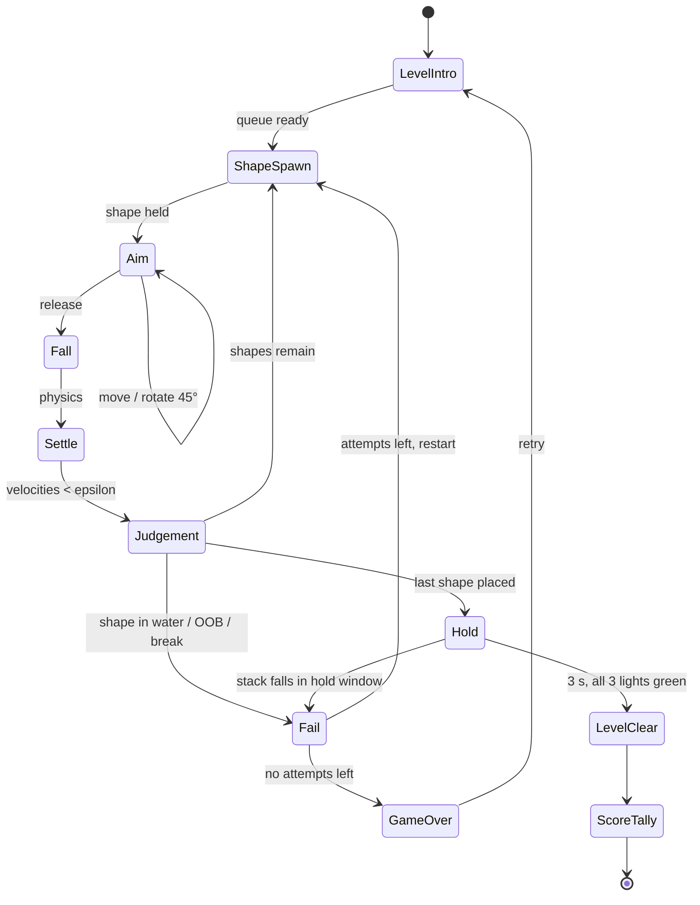
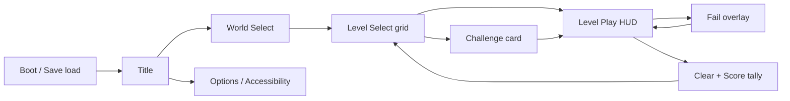

# Art of Balance — Unity 6.6 Implementation Plan

**Working title:** *Stack Serenity* (final name TBD — see §1.3 on IP)
**Target engine:** Unity 6.6 (6000.6.x) + URP 17.x (Render Graph path)
**Reference target:** *Art of Balance* (Shin'en Multimedia, WiiWare, 2010) — visuals + core gameplay loop
**Primary platforms:** PC / Steam first (mouse+pad), consoles later
**Team assumption:** 2 engineers, 1 technical artist/environment artist, 1 designer (levels), plus audio contractor
**Document status:** v1.0 — build-ready plan

---

## 0. Executive summary

We are rebuilding the WiiWare stacking puzzler *Art of Balance*: the player is given a fixed set of geometric shapes and must stack all of them on a small platform floating in water, so that **nothing falls into the water**. Blocks are placed one at a time under real rigidbody physics; when the last block is placed, a **3-second countdown (three lights at the bottom of the screen)** runs and the stack must survive it to clear the level. The package is 100 levels across 4 themed "lounge"-style worlds, plus Balance / Height / Time challenge variants, drop-in co-op and a split-screen versus mode.

The two fidelity targets are:

1. **Feel & loop** — pick up a shape, position it, rotate it in 45° steps, release, watch physics judge you, survive the 3-second hold. Instant retry, no friction.
2. **Look** — smooth, glossy, candy-coloured blocks over a still water basin, framed in an eccentric stylised diorama ("lounge") backdrop, calm/bass-lounge soundtrack, soft light, gentle water. Serene presentation around a tense physics toy.

Everything in this plan is organised so those two things can be validated in a **vertical slice (world 1, 8 levels, final art)** before we scale content to 100 levels.

---

## 1. Reference brief: what we are cloning

### 1.1 Verified reference facts

Sourced from public pages about the original (links in Appendix B). These are the non-negotiables of the loop and look:

| # | Reference fact | Source |
|---|---|---|
| R1 | Physics puzzle: stack several blocks on a platform **floating in water** without any block falling into the water | [Wikipedia](https://en.wikipedia.org/wiki/Art_of_Balance) |
| R2 | Blocks can be **rotated at 45° angles** and come in various shapes | [Wikipedia](https://en.wikipedia.org/wiki/Art_of_Balance) |
| R3 | **Some blocks break** if too many blocks are placed on them (load limits) and special shapes break when **a timer runs out** | [Wikipedia](https://en.wikipedia.org/wiki/Art_of_Balance), [Nintendo Life review](https://www.nintendolife.com/reviews/2010/02/art_of_balance) |
| R4 | Once all blocks are used, a **countdown must reach zero to pass the level**; indicated by **three lights at the bottom of the screen** that must all go green (**3 seconds** in the Wii release) | [Wikipedia](https://en.wikipedia.org/wiki/Art_of_Balance), [Nintendo Life review](https://www.nintendolife.com/reviews/2010/02/art_of_balance) |
| R5 | **100 levels across 4 worlds**, "each with its own unique lounge style" | [Nintendo Life game page](https://www.nintendolife.com/games/wiiware/art_of_balance) |
| R6 | **14 shapes + 2 special shapes** (the specials break under too much load or when a timer runs out) | [Nintendo Life game page](https://www.nintendolife.com/games/wiiware/art_of_balance) |
| R7 | Shape vocabulary includes circles, rectangles, triangles "and other shapes"; difficulty ramps "smooth and gradual" | [IGN review](https://www.ign.com/articles/2010/02/16/art_of_balance-review) |
| R8 | **Arcade Mode** = the progression mode; **drop-in 2-player co-op** (second player grabs a second controller and helps place) | [Nintendo Life review](https://www.nintendolife.com/reviews/2010/02/art_of_balance) |
| R9 | **Versus Mode** = split-screen race to finish the same puzzle first, matches over 5/7/9 rounds | [Nintendo Life review](https://www.nintendolife.com/reviews/2010/02/art_of_balance) |
| R10 | Special Challenges: **Balance Challenges, Height Challenges and Time Challenges** for extra points | [Nintendo Life game page](https://www.nintendolife.com/games/wiiware/art_of_balance) |
| R11 | Later versions add "super puzzles" where **the platform sways on the water** or a **time limit** applies | [Wikipedia](https://en.wikipedia.org/wiki/Art_of_Balance) |
| R12 | Presentation: "smooth look of the blocks", colourful glossy shapes, eccentric/scenic backdrops; soundtrack described as relaxing/"zen" with lounge bass beats | [Nintendo Life review](https://www.nintendolife.com/reviews/2010/02/art_of_balance) |
| R13 | 60 fps is part of the original's identity ("super-smooth 60 frames/sec") | [Nintendo Life game page](https://www.nintendolife.com/games/wiiware/art_of_balance) |

### 1.2 Open reference questions (resolve in a 2-day "capture pass" before M1)

These details are not nailed down by the written sources; capture 30–60 min of original footage and answer each explicitly, then lock the "Reference Fidelity Checklist" (Appendix A):

1. **Drop feel** — is the held block rigidly steered by the pointer, or does it swing on a hanging line? (Plan supports both; `DropController` has a `RigidHold` and a `PendulumHold` strategy — pick by A/B feel test in week 2.)
2. **Retry policy** — what exactly happens on a fall: restart the level, or retry only the current block? How many attempts per level before a fail screen?
3. **Block order** — is the sequence of shapes per level fixed (authored) or free? (Assumption in this plan: authored fixed order, shown as a queue.)
4. **Lounge worlds** — visual themes of the 4 worlds (room-diorama vs. scenic backdrop), and how the water basin is framed in each.
5. **Break mechanics** — exact visual/feedback of load-limited and timer shapes (cracks? flashing? progress bar?).
6. **Scoring** — how points for challenges are computed and how versus rounds are won.

### 1.3 IP, naming and content policy

Game *mechanics* (stacking blocks over water) are not protected expression, but the trademark, art, audio, level layouts and name are. Therefore: new name and logo, **100% original art, music, SFX and level layouts**, no extraction or tracing of game assets, no use of "Art of Balance" or "Shin'en" in marketing. Keep a side-by-side fidelity board privately for feel/comparison only.

---

## 2. Scope

### 2.1 Must ship (MVP)

- Core loop: shape queue → position → 45° rotate → release → physics settle → judgement → next shape → 3-second hold → level clear.
- 14 standard shapes + 2 special shapes (load-limited "Glass Block", countdown "Time Block").
- 100 levels / 4 worlds with authored shape sets and platform variants.
- Fail & retry with instant restart; per-level score + stars; level select with progress save.
- Balance / Height / Time challenge variants on levels (extra points).
- Full visual target on all worlds: water, diorama backdrops, glossy block materials, post stack, VFX, HUD.
- Audio: ambient/lounge music beds, material-aware impact SFX, water splashes, UI sounds.
- Gamepad + mouse/keyboard; 60 fps on a mid-range PC.

### 2.2 Stretch (post-1.0 patches)

- 2-player drop-in co-op (Arcade) and split-screen Versus (5/7/9 rounds) — R8/R9.
- "Super puzzles" with swaying platform or time limit — R11.
- Daily/weekly generated stack challenge + online leaderboard.
- Touch controls (mobile), demo/benchmark mode.

### 2.3 Out of scope

- Online multiplayer, mod.io, user-generated levels in v1 (the level format is designed so UGC is a later unlock), mobile F2P trappings.

---

## 3. Engine & project setup (Unity 6.6)

### 3.1 Baseline

- **Unity 6.6 (6000.6.x)**, "Supported" release line, .NET Standard 2.1 / C#, **URP 17.x with Render Graph enabled** (do not use Compatibility Mode). Render Graph gives us the memory/bandwidth headroom for the planar-reflection water pass.
- **Enter Play Mode: "Reload Scene Only"** is the default for new projects in 6.6. Design all runtime systems domain-reload-safe (no mutable statics without reset hooks) so we can keep that fast iteration mode.

### 3.2 Packages

| Package | Use |
|---|---|
| `com.unity.render-pipelines.universal` 17.x | Renderer, volumes, SSAO feature |
| `com.unity.inputsystem` | Gamepad/mouse/keyboard/touch actions |
| `com.unity.addressables` 2.x (Content Directory schema) | Level content, world dioramas, audio banks — load per-world only |
| `com.unity.cinemachine` 3.x (core package in 6.6) | Camera rig (dolly/zoom blending for stack framing) |
| `com.unity.timeline` (core) | Level intro/outro stings, world intros |
| `com.unity.visualeffectgraph` | Splash/ripple VFX (6.6 Shader Graph particle templates also allow Shuriken mesh particles if VFX Graph is overkill) |
| `com.unity.shadergraph` | Water, block materials, UI (6.6 Canvas target for SDF UI art) |
| `com.unity.testframework` + Performance testing | PlayMode/ EditMode tests, physics soak bot |
| `com.unity.burst`, `com.unity.collections`, `com.unity.mathematics` | Settle monitor, batch level validation, difficulty bot |
| TextMeshPro (bundled with `com.unity.ugui` 2.x) | All text |
| Unity UI (`uGUI`) + UI Toolkit | HUD (uGUI) and menus (UI Toolkit — 6.6 `backdrop-filter` gives the frosted-glass panels for free) |

### 3.3 Project layout (asmdefs)

```
Assets/
  _Project/
    Art/            (materials, shadergraphs, meshes, textures, VFX graphs, volumes)
    Audio/          (music, ambience, SFX banks)
    Content/        (Addressables: worlds, level definitions, prefabs)
    Settings/       (URP assets, input actions, physics materials)
    Scripts/
      Core/         (game state machine, event bus, save, time, service locator)
      Physics/      (settle monitor, judgement, water kill zone, breakables)
      Gameplay/     (drop controller, rotation, shape queue, scoring, challenges)
      Camera/       (camera director / framing)
      UI/           (HUD, menus, level select)
      Audio/        (audio director)
      Vfx/          (vfx director, ripple system)
      Tools/Editor/ (level authoring window, validators, difficulty bot editor menu)
    Tests/          (EditMode, PlayMode, Performance)
    Scenes/         (Boot, Menu, World_N shells, Sandbox)
```

One asmdef per Scripts subfolder (`Aob.Core`, `Aob.Gameplay`, …), `Aob.Tools` editor-only, `Aob.Tests` referencing all.

### 3.4 Physics engine choice

**Use Unity's built-in 3D Physics (PhysX)** via `Rigidbody`/`Collider`. Rationale: the scene has ≤ 40 dynamic bodies, we need robust contact behaviour more than determinism, and PhysX sleeping + interpolation gives clean "settle" reads. *Unity Physics (DOTS)* stays on the table only if we later need replay determinism for leaderboards (§5.6); the `IPhysicsWorld` seams in `Aob.Physics` keep that swap contained.

---

## 4. Main gameplay loop (core)

### 4.1 Loop overview

1. Level loads: platform over water, shape queue displayed, brief "here's your set" beat.
2. Current shape appears held above the stack at the top of frame.
3. Player **positions** (horizontal, and depth where the level allows), **rotates in 45° steps**, and **releases**.
4. Shape falls under physics; stack reacts. Contact SFX/VFX scale with impact.
5. **Judgement**: any shape in the water / out of bounds → fail (§4.6). Otherwise, once the stack settles → next shape.
6. Last shape placed → **3-second hold** with three lights at the bottom of the screen filling green. Any failure during the hold → fail.
7. **Level clear** → score tally (lives/time/challenge bonuses) → next level unlocks.



### 4.2 Phase specifications

| Phase | Duration | Player input | Exit condition | Notes |
|---|---|---|---|---|
| `LevelIntro` | 0.8–1.5 s | skip | timer / button | Slow camera dolly to platform; queue slides in |
| `ShapeSpawn` | 0.4 s | — | shape at hold point | Shape fades/drops in on its hold line; play soft "ready" tick |
| `Aim` | unlimited | move, rotate, release | release pressed | Ghost drop-line optional assist (off by default; toggle in options) |
| `Fall` | 0.2–1.0 s | none (locked) | first contact | Input locked to prevent mid-air corrections |
| `Settle` | 0.3–2.5 s | none | settle detector or 2.5 s timeout | Timeout force-judges to avoid stalls |
| `Judgement` | instant | none | next state | Evaluates water/OOB/breaks for **all** shapes |
| `Hold` | 3.0 s | none | lights full green | Three lights fill at 1 s each (R4) |
| `Fail` | 1.2 s | skip | timer | Splash, sad sting, 0.5 s beat before retry |
| `LevelClear` | 2.0 s | skip | timer | Jingle, confetti-lite sparkles, camera drift-in |
| `ScoreTally` | 1–3 s | continue | button | Counts score with ticks; stars pop |

### 4.3 Handling the shape: position, rotate, release

- **Position:** analog/stick or mouse moves the held shape along the horizontal plane at a fixed screen-space speed (~1.2 screen-widths/s at max input, with a soft ease-in of 0.08 s). Depth axis is enabled from world 2 onwards.
- **Rotate:** each press of rotate-L/R snaps the shape **45° around Y** (R2), with an extra paddle/trigger mapping for a 45° tilt around X/Z for the "flat" shapes (wedges, planks). Rotation previews on the held shape instantly (kinematic), so players can see the contact face before dropping.
- **Release:** shape goes from kinematic to dynamic with inherited velocity of the hold rig (see strategies below), input locks, and `Fall` begins.

Two `DropController` strategies behind one interface (decide in the capture pass, §1.2):

- `RigidHold` — shape tracks the cursor rigidly; release velocity = current rig velocity × 0.6.
- `PendulumHold` — shape hangs from a line of length L under pivot at top of frame; player drives the pivot horizontally and the shape swings like a pendulum. Release inherits tangential velocity, so timing the swing is a skill.

```text
// PendulumHold — release velocity derivation
// theta = swing angle, omega = angular velocity, L = line length
pos_release   = pivot + L * (sin(theta), -cos(theta), 0)
vel_release   = L * omega * (cos(theta), sin(theta), 0)
OnRelease(shape):  shape.isKinematic = false; shape.linearVelocity = vel_release;
```

### 4.4 Settle and judgement rules

`SettleMonitor` runs every fixed step over all stacked shapes and reports **stable** when, for 0.4 s continuously:

- every dynamic shape `IsSleeping()`, **or** `|linearVelocity| < 0.02 m/s` and `|angularVelocity| < 0.10 rad/s`;
- no shape's center-of-mass is descending faster than 0.05 m/s.

`JudgementSystem` then evaluates, in order: (1) water contact by any shape, (2) out-of-bounds, (3) breakables triggered, (4) all shapes supported (top-of-stack sanity). First failure wins and routes to `Fail` with a reason code used by VFX/SFX and telemetry.

### 4.5 The 3-second hold (three lights)

After the final `Judgement` succeeds, `HoldTimer` runs 3.0 s and drives three HUD lights at the bottom-centre (R4). Each full second lights one lamp (soft "bonk" chime per lamp). The hold **restarts from zero** if any shape moves more than 2 cm or 2° during the window (the stack is teetering — this recreates those "it looked stable then slowly leaned into the pool" moments). Survive all three → `LevelClear`.

### 4.6 Fail and retry policy

Default policy (pending §1.2 confirmation): **any shape touching water = immediate fail of the attempt**; the level auto-restarts (fresh platform, same shape order) after the `Fail` beat. The player has **3 attempts** shown as small stones in the HUD (a knob: `attemptsPerLevel`), then a Fail screen with *Retry* (restores 3) and *Quit*. Instant restart is the priority — target ≤ 1.5 s from splash to controllable shape.

### 4.7 The two special shapes (R3/R6)

| Special | Behaviour | Feedback |
|---|---|---|
| **Load Block** ("glass") | Breaks when the cumulative mass above it exceeds `maxLoad` (authored per use). On break: collider splits into 4 chunks (pre-authored fracture prefab), chunks are dynamic and fall; everything above drops. | Progressive crack normal-map (3 stages), stress ticks under load, sharp crack SFX |
| **Timer Block** | A countdown (default 12 s) starts when the *next* shape lands on it. At zero it shatters as above. Clearing the level before zero is fine. | Dial/LED ring on the block face draining to red, soft tock-tick that accelerates |

Both are `IBreakable` components consumed by `JudgementSystem`; breaking is a fail only if the resulting collapse drops a shape in the water (which it almost always does).

### 4.8 Challenge variants and super puzzles (R10/R11)

Per-level optional challenge flags (each adds score): **Time** (clear under par time), **Height** (final stack height ≥ target line), **Balance** (finish with all shapes within a narrow "wobble envelope" — measured as max |horizontal CoM offset| over the hold). Super-puzzle flags: `platformSway` (platform is a buoyant body with spring-damper bob + roll driven by a sine/noise field) and `timeLimit` (global countdown → fail at zero).

### 4.9 Scoring

`score = baseClear (1000) + timeBonus (max(0, par − clearTime) × 10) + attemptBonus (attemptsLeft × 300) + challenge bonuses (500 each) + holdBonus (no hold-restarts × 200)`. Stars per level: 3 = clear with all challenge flags & no hold-restart, 2 = clear under par, 1 = clear. Best score + stars persist per level (§11).

### 4.10 Controls

| Action | Gamepad | Mouse/KB | Touch |
|---|---|---|---|
| Move shape | Left stick | Mouse position / WASD | Drag |
| Rotate 45° (Y) | Bumper L/R | Q / E | Two-finger tap buttons |
| Tilt 45° | Trigger L/R | Z / C | — |
| Release | A | LMB / Space | Release drag |
| Retry | X (hold) | R (hold) | Hold icon |
| Pause | Start | Esc | Icon |

---

## 5. Physics & stability engineering

Stacking games live or die on contact stability. Budget **2 weeks of dedicated physics tuning** (M1) with the harness in §5.5.

### 5.1 Conventions

- 1 Unity unit = 1 m. Shapes 0.15–0.9 m across. Platform 1.2–2.4 m wide.
- All shapes have origin at their **centroid**; pivot alignment makes authored stacks predictable.
- Mass 0.4–4.0 kg with **max mass ratio between touching shapes ≤ 4:1** (large ratios make solver jitter explode).

### 5.2 Colliders

- Primitives first (Box/Sphere/Capsule) — for the 14 shapes, 10 map to primitives or two-primitive compounds.
- Curved/complex shapes (arch, half-cylinder, wedge) use **convex MeshColliders**, ≤ 250 polygons, cooked once at import with `Physics.BakeMesh` in a loading screen.
- Compounds: child colliders must overlap by 1–2 mm internally to avoid "catch" seams; single shared `PhysicsMaterial` per shape family.
- Everything on layers: `Shapes`, `Platform`, `Water(Trigger)`, `Chunks`, `Env`.

### 5.3 Physics settings (project-wide, tuned in M1)

| Setting | Value | Why |
|---|---|---|
| `Time.fixedDeltaTime` | 1/120 s | Double step rate for stable stacks (≤ 40 bodies, cheap) |
| `Physics.defaultSolverIterations` | 16 (default 6) | Reduces slow sag/creep of tall stacks |
| `Physics.defaultSolverVelocityIterations` | 8 (default 1) | Calmer resting contacts |
| Solver type | TGS if exposed in 6.6 physics settings, else PGS + above | TGS is markedly better for stacking |
| `Physics.defaultContactOffset` | 0.005 | Tight contacts without overlap fights |
| `Physics.defaultMaxDepenetrationVelocity` | 6 | Caps "pop" impulses when shapes interpenetrate |
| `Physics.sleepThreshold` | 0.008 | Earlier, cleaner sleeps → faster settle reads |
| Restitution (all materials) | 0 | No bounce; it reads as cheap in a zen toy |
| Friction combine | Average; per-family `dynamicFriction`/`staticFriction` in §6.1 | Deterministic-feeling grip |
| Falling shape collision mode | `ContinuousSpeculative` | No tunnelling through planks at speed |
| Resting shapes | `Discrete` + `interpolation = Interpolate` | Cheapest, visually smooth |
| `Rigidbody.linearDamping / angularDamping` | 0.05 / 0.15 | Kills micro-rotations on rounded shapes |

### 5.4 Failure detection

- `WaterKillBox`: trigger volume spanning the water surface (thin slab, 6 cm). Any `Shapes`/`Chunks` collider entering → `OnShapeDrowned` event → splash VFX at entry point, ripple spawn, shape despawn (0.6 s fade), fail reason `Water`.
- `OutOfBounds`: shapes below y = −2 m or |x|,|z| > 12 m → fail reason `OOB` (rare; safety net).
- Breakables (§4.7) → fail reason `Break` when their collapse is detected by the two rules above.

### 5.5 Soak & difficulty bot (build this early — it pays for itself)

An EditMode/PlayMode harness that loads every level asset and runs N scripted attempts of a **naive policy** (drop each shape at the platform centroid with ±3 cm jitter) and a **greedy policy** (drop at the top-support centroid). Outputs per level: naive success rate, greedy success rate, mean clear time, number of settle timeouts, max solver energy spike. Use it to (a) regression-test physics setting changes (a change that drops greedy success by > 10% on the corpus is suspect), (b) estimate difficulty numerically and order levels by it, (c) catch unsolvable/broken level data.

### 5.6 Determinism & leaderboards

PhysX is not bit-deterministic across platforms. Policy: leaderboards store **scores, not replays**, and score submissions are range-checked server-side (max score is computable in closed form from §4.9 + par times). If replay sharing is later required, revisit Unity Physics (DOTS) or a lockstep input replay on a single platform family.

---

## 6. Block & shape system

### 6.1 Standard shape vocabulary (14)

Circles/rectangles/triangles are confirmed in the reference (R7); the exact set below is our vocabulary designed for the same coverage — final naming/dims after the capture pass. All shapes ship in 6 colour/material variants.

| # | Shape | Size (m) | Mass (kg) | Friction (static/dyn) | Notes |
|---|---|---|---|---|---|
| 1 | Cube | 0.5³ | 1.2 | 0.60 / 0.45 | The bread and butter |
| 2 | Slab | 1.0 × 0.25 × 0.5 | 1.4 | 0.60 / 0.45 | Bridge builder |
| 3 | Plank | 1.4 × 0.10 × 0.30 | 0.8 | 0.55 / 0.40 | Flexible-looking, rigid body |
| 4 | Bar | 1.2 × 0.20 × 0.20 | 1.0 | 0.55 / 0.40 | |
| 5 | Cylinder (upright) | Ø0.5 × 0.5 | 1.3 | 0.50 / 0.35 | |
| 6 | Cylinder (lying) | Ø0.3 × 1.0 | 1.0 | 0.50 / 0.35 | Rolls — high-skill piece |
| 7 | Sphere | Ø0.6 | 1.1 | 0.35 / 0.25 | The villain |
| 8 | Hemisphere | Ø0.6 × 0.3 | 1.0 | 0.45 / 0.35 | Dome up or cup up |
| 9 | Wedge (triangular prism) | 0.6 base × 0.5 h × 0.4 | 1.0 | 0.55 / 0.40 | 45° ramps; stacks with #10 |
| 10 | Triangular plate | 0.8 edge × 0.12 | 0.6 | 0.55 / 0.40 | |
| 11 | Arch (half-torus) | 0.8 × 0.4 × 0.3 | 1.2 | 0.55 / 0.45 | Convex-approximated |
| 12 | Hex prism | Ø0.55 × 0.35 | 1.2 | 0.55 / 0.40 | |
| 13 | L-block | 0.6 × 0.6 × 0.3 | 1.3 | 0.55 / 0.40 | Compound of 2 boxes |
| 14 | Frame (square ring) | 0.7 outer × 0.2 h | 1.1 | 0.55 / 0.45 | Other shapes can nest inside |

Specials: **15 Load Block** (`maxLoad` 2–6 kg, breaks — §4.7), **16 Timer Block** (`timer` 8–15 s — §4.7).

### 6.2 Shape data

```csharp
// ShapeDefinition : ScriptableObject  (one asset per shape+material combo)
shapeId, family (Wood|Stone|Glass|Rubber), mesh, colliders[], prefab
mass, linearDamping, angularDamping, physicMaterial
colorwayIds[], impactSoundSet, breakPrefab (optional)
maxLoad (optional), timerSeconds (optional)   // specials
```

`ShapeRegistry` (Addressables key `shapes/{family}`) resolves `shapeId` at level load. Blocks are pooled per `shapeId` (pool size 8).

### 6.3 Runtime shape lifecycle

`Spawn` (kinematic at hold rig) → `Aim` (kinematic, follows rig) → `Release` (dynamic, inherits rig velocity) → `Live` (physics) → `Settled` (sleeping; registered in stack model) → `Drowned`/`Shattered` (despawn + VFX) or `Cleared` (level clear).

The **stack model** (`StackModel`) is a lightweight runtime registry of live shapes with their transforms sampled at 20 Hz — it feeds the camera framing (§8.3), the Height/Balance challenge metrics (§4.8) and the settle detector.

---

## 7. Levels & worlds

### 7.1 Level definition

```csharp
// LevelDefinition : ScriptableObject
levelId, worldId, displayName, difficultyTag
platformPrefab, platformPose, platformMotion (Static|Sway)   // R11
shapeQueue: [ {shapeId, spawnOffsetY, holdStrategy} ]          // authored order
challengeFlags: time (parSeconds), height (targetM), balance (wobbleTolerance)
attemptsPerLevel, holdSeconds (default 3), themeOverride (optional)
```

Validation gates (CI, §14): queue non-empty & shapes exist; platform collider present; spawn hold-point above platform bounds; par times sane vs. bot results.

### 7.2 Platform variants

| Variant | Use | Physics |
|---|---|---|
| Stone pedestal (wide/medium/narrow) | Worlds 1–2 | Static |
| Table-top / tray | World 2–3 ("lounge" furniture scale) | Static |
| Buoyant raft / floating tray | World 3–4 | Spring-damper bob + roll (`platformSway`) |
| Two-pillar / split platform | Late game | Static, gap forces bridging shapes |
| Turntable | Late game | Kinematic yaw at 2–4°/s |

### 7.3 Difficulty model

Difficulty = f(shape roundness score, mass spread, queue length (3→9), platform width, special count, motion flags). The bot's greedy success rate (§5.5) is the ground truth; target curve: world 1 = 100→85% greedy success, world 2 = 85→65%, world 3 = 65→45%, world 4 = 45→25%.

### 7.4 Content plan — 100 levels, 4 worlds

Each world = 25 levels in 5 "rooms" of 5, each room introducing/combining one idea (matches the "lounge style" framing, R5):

| World | Theme (lounge diorama) | New mechanics | Levels |
|---|---|---|---|
| A — *Reading Nook* | Warm daylight room, rug, plants; water basin like a giant decorative bowl | Tutorials: cubes/slabs, rotation, the 3-light hold | 25 |
| B — *Aquarium Lounge* | Blue-lit room with a huge aquarium-glass basin | Load Block, cylinder/sphere rolling | 25 |
| C — *Winter Sunroom* | Snowy window light, low friction "frost" materials | Timer Block, planks/frames, depth placement | 25 |
| D — *Night Terrace* | Moonlit terrace, lanterns, drifting petals | Swaying platforms, time limits, all shapes, 8–9 shape queues | 25 |

Per-level challenge flags (Balance/Height/Time) are sprinkled from level 11 onward.

### 7.5 Authoring tooling

Custom `Level Authoring Window` (editor): pick platform prefab + pose, drag shapes from a library into an ordered queue (drag to reorder), set hold-point and challenge values, **Play in-editor at the click of a button**, and *Run Bot* to get instant difficulty numbers. Batch validator exports a CSV report (`level, shapes, botNaive, botGreedy, par, issues`) after every content commit. This tool is the single biggest lever on the 100-level schedule — build it in M2, before mass production.

---

## 8. Visual recreation (priority A)

### 8.1 Art direction pillars

1. **Serene toy-box** — the world is soft, warm and domestic ("lounge"), the blocks are glossy candy objects. Calm frame, tense toy.
2. **Readability first** — every silhouette must be instantly parseable at 480p-equivalent size; stack contact points must be visible without zooming.
3. **Water is the floor** — the reflective basin anchors composition and doubles the drama of every fall.
4. **Restraint in motion** — everything moves slowly except physics; camera drifts, never swings.

Mood words: *glossy, soft-shadowed, warm interiors, still water, quiet*. Visual anchors to study: the smooth glossy shapes and colourful palette (R12), diorama-like scenic backdrops with "eccentric" décor, and the calm of a well-lit lounge in late afternoon.

### 8.2 Scene composition (diorama)

Each level is a **stage set**, not an open world:

- **Foreground (2–5% frame):** soft-focus vignette props (leaf tips, lamp edge, shelf corner) to sell the room scale.
- **Mid-ground (60%):** the water basin (square/round bowl) + platform + stack. This is the play space; keep it uncluttered.
- **Background (35%):** stylised décor wall / window / furniture in 2–3 depth layers with slight parallax as the camera drifts.
- **Above (for the hold line):** a slim crane/rail motif that reads as part of the room (lamp arm, curtain rod, shelf bracket) rather than a game UI element.

### 8.3 Camera rig

Fixed 3/4 view, long lens, no free look. `CameraDirector` drives position/target/FOV from `StackModel`:

| Parameter | Value |
|---|---|
| FOV | 32° (long-lens compression; keeps stack silhouette clean) |
| Pitch | ~22° down; yaw 15–25° off axis (authored per platform) |
| Distance | `d = d0 + 0.55 × stackHeight` (d0 ≈ 3.2 m) |
| Target | `lerp(platformTop, stackBounds.center, 0.55) + up × 0.25` |
| Smoothing | Critically damped spring (ω ≈ 4.0), no overshoot |
| Idle | ±0.03 m drift on a 12 s sine (reads as "alive", never distracting) |
| Impact | Trauma-based shake: `offset = trauma² × perlin`, trauma += impulse/20, decay 1.8/s, clamped at 0.12 |

```text
// Framing pseudo-code (LateUpdate)
bounds  = StackModel.WorldBounds(includeHeldShape: true)
target  = Lerp(platformTop, bounds.center, 0.55) + up*0.25
dist    = baseDist + 0.55 * bounds.size.y
desired = target - forward * dist
pos     = SpringDamp(currentPos, desired, w=4.0, dt)
fov     = SpringDamp(fov, 32, w=2.0, dt)
```

Cinemachine 3.x (core package in Unity 6.6) handles the virtual camera + noise/impulse channels; framing math lives in our `FramingTarget` behaviour feeding a `CinemachineCamera`.

### 8.4 Lighting

- **Key:** one directional light, warm (5200 K), 45° upper-left, soft shadows (2048 cascade, 2 cascades, tight shadow distance ~8 m). Shadows are the main "weight" cue for stacked objects — keep contact shadows crisp near the stack, soft at distance.
- **Fill:** cool bounce card light (15–25% intensity) from the window side; per-world colour script.
- **Ambient/GI:** static set dressing baked with the **Unity Compute Light Baker + Adaptive Probe Volumes** (6.6); dynamic shapes sample APV probes (or classic Light Probe Group if a target platform lacks APV). Baked GI on the diorama, real-time direct on shapes.
- **Rim/spec:** a subtle rim light component in the block shader (fresnel × light dir) so glossy shapes pop against décor.
- Per-world lighting scripts (4×) stored as Lighting Scenario assets — same geometry, different mood.

### 8.5 Block materials & shaders (Shader Graph)

Target look: smooth, glossy, slightly toy-like (R12). One uber `BlockLit` graph with material family variants:

| Family | Base colour | Smoothness | Detail | Extra |
|---|---|---|---|---|
| Wood | Honey/pastel | 0.45 | subtle grain normal | — |
| Stone | Matte pastels | 0.30 | fine speckle | slight triplanar break-up |
| Glass (Load Block) | Translucent tint | 0.85 | crack mask (3 stages) | Fake refraction (scene-colour grab + normal distortion), stress emissive |
| Rubber (Timer Block) | Deep saturated | 0.25 | — | Emissive dial ring |

Shared features: rounded-edge normal-map treatment (bevels catch highlights), gentle fresnel rim, subtle colour variation per instance (`MaterialPropertyBlock`), and a "wet" darkening near the waterline. Use **MaterialPropertyBlock** + GPU Resident Drawer so 40 shapes batch cleanly.

### 8.6 Water

The signature effect. URP has no first-class SSR, so water = **custom Shader Graph surface + planar reflection pass**:

1. **Base:** depth-based colour ramp (shallow teal → deep slate), sampled from `_CameraDepthTexture` for shoreline soft fade + a foam line where objects intersect the surface.
2. **Normals:** two scrolling normal maps (scale 3.0 / 7.0, speeds 0.02 / −0.045) combined with Reoriented Normal Mapping; amplitude ~0.15 — barely moving, "still basin with air".
3. **Planar reflection:** mirrored camera on `Env`+`Shapes` layers into a 1024×1024 RT (512 on low tier), oblique near-plane clip, UVs distorted by the combined normal × 0.03. Intensity via Schlick Fresnel (F0 = 0.02) so glancing angles mirror the diorama.
4. **Ripples:** pooled ring emitters (pool 16). Each splash spawns 1–3 rings: radius `r(t) = c·t` (c ≈ 0.8 m/s), a raised ring profile `h = A·exp(−(d−r)²/w)·cos(k(d−r))` perturbs water normals, A decays with `exp(−2.5t)`. Small droplet impacts spawn micro-ripples (A × 0.2).
5. **Sun glint:** stretched Blinn highlight along view for the "sparkle on the basin" note.

Budget: water shader ≤ 1.5 ms @1080p mid-tier; reflection camera renders at half-rate.

### 8.7 Environment & backdrop

- Low-poly stylised props (books, plants, lamps, cushions, windows) with baked lightmaps; 3 depth layers for parallax.
- Foliage/petals as GPU-instanced cards (GPU Resident Drawer) with gentle vertex wind.
- Distant "beyond the window" content as matte-painting cards (cheap, painterly, matches the eccentric scenic look).
- Per-world prop kits: 1 kit + 1 lighting scenario + 1 music bed per world (Addressables content group per world, loaded on demand — Unity 6.6 Content Directory schema).

### 8.8 VFX

| Effect | Tech | Budget |
|---|---|---|
| Splash (shape hits water) | VFX Graph: 30–60 droplets, gravity, size-over-life, foam crown | ≤ 1 ms, pooled |
| Ripple rings | Water shader emitters (§8.6) | 16 pooled |
| Foam patch | Billboard decal at impact, 1.5 s fade | 8 pooled |
| Impact dust | Shuriken puff on hard landings (impulse > 8) | trivial |
| Break chunks | Pre-authored fracture chunks + shard sparkles | 4 chunks / break |
| Hold-lamp glow | UI-adjacent sprite animation | — |
| Clear sparkle | VFX Graph confetti-lite (world-coloured petals) | 1 burst |
| Ambient motes | 200 instanced particles drifting in air | static cost |

6.6's Shader Graph particle templates (URP-compatible built-in Particle System) are enough for everything except splash + clear sparkle.

### 8.9 Post-processing (URP Volume, per world)

| Effect | Setting |
|---|---|
| Tonemapping | ACES |
| Bloom | Intensity 0.25, threshold 1.1, soft knee — a sheen, not a glow-fest |
| Color Adjustments | Saturation +5, post-exposure per world |
| White Balance | 5–10 K warm shift per world |
| Depth of Field | Gaussian, focus on stack, max blur far 40%, near 10% (foreground props) |
| SSAO (renderer feature) | Medium, 0.6 intensity, 0.25 radius — grounds the stack |
| Vignette | 0.12 |
| AA | TAA or SMAA (TAA where the platform budget allows) |
| Optional | STP upscaling on constrained targets (6.6) |

### 8.10 Feel / juice checklist (per interaction)

Release → subtle rig recoil. Landing → contact SFX (pitch = f(impulse), material set), 3 cm dust puff under 8 impulse, trauma shake above 8. Stack shift → faint wood creak on sliding contacts. Water entry → splash + ripple + dampened "plop", music ducks 3 dB for 0.4 s. Hold lamps → soft bonk each second + HUD pulse. Clear → jingle + sparkle burst + camera slow dolly-in.

### 8.11 UI visual language

Rounded, warm, low-contrast. Menus render over a **live blurred diorama** using UI Toolkit 6.6 `backdrop-filter` frosted panels (no render-texture blur needed). Type: rounded sans, generous letter-spacing, white/cream on translucent charcoal. Buttons are chunky "wooden tile" style. HUD is deliberately minimal so the diorama dominates.

### 8.12 Performance budget

60 fps fixed (R13) at 1080p on a GTX 1050 / Steam Deck class GPU: ≤ 8 ms GPU (render ≤ 6 ms, post ≤ 2 ms), ≤ 3 ms CPU main thread (physics ≤ 1 ms with ≤ 40 bodies), ≤ 350 draw calls, ≤ 400k tris, ≤ 1.5 GB VRAM per world loaded. Quality tiers: Low (no reflection, half-res water, no DoF), Medium (default), High (SSAO + TAA + full reflection).

---

## 9. Audio

Music: **lounge/zen** — downtempo bass-and-rhodes beds per world (R12), 3–5 min seamless loops with a per-world instrument layer. Ambience: room tone (clock, distant room life), water lap loop at the basin, per-world layer (snow window, night crickets). SFX: material-keyed impact sets (wood knock, stone clack, glass ting, rubber thud) with 4 variations each, velocity-scaled volume and ±5% random pitch; sliding contact loops; splash set (3 sizes); break crack; UI ticks and chimes. Mix: Audio Mixer with `Menu`, `Play`, `Tension` (hold countdown) snapshots; low-pass the music 2 dB during the hold for tension. Implementation: Unity Audio + Mixer (FMOD only if the audio contractor prefers it — keep `AudioDirector` API identical).

---

## 10. UI/UX



**HUD (in-level):** top-left = shape queue strip (remaining shapes as icons, current highlighted); top-right = attempt stones + timer (challenge levels); **bottom-centre = the three hold lights** (R4); bottom-right = pause. Optional assist: translucent drop-line column from the held shape down to the contact surface (accessibility toggle).

**Level select:** 5×5 tile grid per world; each tile shows a miniature stack silhouette (rendered once to a thumbnail with a secondary camera at build time), stars, best score. Locked tiles show the silhouette blurred. World select is a horizontal carousel of the 4 dioramas.

**Accessibility:** scalable UI (75–150%), high-contrast shape outline toggle, colour-blind-safe colourways, hold-lights also conveyed by sound + haptics, drop-line assist, "no fail chime" option.

---

## 11. Progression, save & challenges

- Progress: per-level `cleared, stars, bestScore, challenge flags achieved`; per-world unlock = clear 20/25. Save to `persistentDataPath` as versioned JSON (`save_v1`), atomic writes, plus Steam Cloud hook later.
- Score meta: world totals + game total; "medal wall" screen per world.
- Challenge cards (Balance/Height/Time) selectable per cleared level for score chasing (R10).
- Online leaderboard (stretch): per-level and per-world score tables, range-checked submissions (§5.6).

---

## 12. Code architecture

- **`GameFlowController`** — explicit state machine (states from §4.2 table + menu states). Plain C# state classes with `Enter/Tick/Exit`, driven by one `Update`. No scene-per-state; level scenes are additive Addressable payloads.
- **Event bus** (`Aob.Core.GameEvents`): `OnShapeReleased`, `OnShapeSettled`, `OnShapeDrowned`, `OnShapeBroken`, `OnHoldTick`, `OnLevelCleared`, `OnLevelFailed(reason)`. VFX, Audio, UI and telemetry subscribe; gameplay never references them directly.
- **Services** (composition root in `Boot`): `IShapeFactory`, `ILevelLoader`, `IInputSource`, `ISaveService`, `IScoreService`, `IVfxDirector`, `IAudioDirector`, `ICameraDirector`.
- **Deterministic-ish core:** `SettleMonitor`, `JudgementSystem`, `ScoreSystem` are pure C# over snapshots (testable without a scene).
- **Data:** ScriptableObjects for `LevelDefinition`, `ShapeDefinition`, `WorldTheme` (lighting scenario + volume profile + music + prop kit refs).
- **Config:** `GameTuning` ScriptableObject (all §5.3 numbers, hold time, attempts, framing constants) so designers tune without recompiling.

---

## 13. Milestones (≈ 22 weeks)

| Milestone | Weeks | Deliverable | Exit criteria |
|---|---|---|---|
| **M0 — Greybox prototype** | 1–2 | Greybox loop: 6 box shapes, one pedestal, drop/rotate/release, settle+judgement, 3-light hold, instant retry | Fun in isolation; both drop strategies playable |
| **M1 — Physics hardening** | 3–4 | §5.3 tuning pass, 14 shapes with final colliders, breakables, soak bot v1 | Bot corpus green; 0 settle timeouts; no jitter pops in 30 min play |
| **M2 — Vertical slice (art target)** | 5–8 | World A (8 levels) at final art: water, diorama, materials, VFX, post, HUD, audio | Side-by-side fidelity review passes Appendix A items on look & loop |
| **M3 — Tooling + content start** | 9–11 | Level authoring window + validators + difficulty report; scoring/save; 30 levels across A–B | Designer ships 5 levels/day unassisted |
| **M4 — Content complete** | 12–17 | 100 levels / 4 worlds; all mechanics incl. specials, motion platforms; challenge flags; UI complete | Content-complete build; bot difficulty curve on target |
| **M5 — Polish + QA + ship** | 18–22 | Feel pass (camera/juice), perf tiers, accessibility, audio mix, certs, demo | 60 fps on target HW; crash-free 4 h soak; day-1 patch plan |

Stretch track (post-launch): co-op + versus (R8/R9), super puzzles (R11), daily challenge + leaderboards.

---

## 14. Testing & QA

- **EditMode:** level/shape asset validators (schema, references, par sanity), score math, save migration.
- **PlayMode:** state machine transitions (full loop with mock input), breakable rules, water kill box, hold-lights timing (3.0 s ± 1 frame).
- **Physics regression:** the bot corpus (§5.5) runs nightly; failure-rate deltas > 10% block merges.
- **Performance:** Unity Performance Testing Extension scenes (worst case: 9 shapes + break + splash) on target HW; budgets from §8.12.
- **Manual:** 4 worlds × full playthroughs per patch; controller matrix (pad/mouse/touch); 4-hour soak; "toddler test" (mash all buttons — must never soft-lock).
- **Telemetry (dev builds only):** fail reason per level, retry counts, hold-restarts, time-in-Aim — used to tune the difficulty curve.

---

## 15. Risks & mitigations

| Risk | Impact | Mitigation |
|---|---|---|
| Physics jitter / "explosive" contacts ruin the feel | Critical | §5.3 settings, mass-ratio clamp, depenetration cap, bot regression harness; 2-week M1 budget |
| Settle detection flaky (perpetual micro-motion) | High | Dual criterion (sleep OR velocity bands) + 2.5 s timeout force-judge |
| Planar reflection water too expensive | Medium | Half-rate + 512 RT tier fallback; reflection probe fallback for Low tier |
| 100-level content grind | High | Authoring window + bot difficulty numbers early (M3); 5 levels/day pipeline |
| Look drifts from the reference "smooth glossy lounge" feel | High | Fidelity board (Appendix A) reviewed at every milestone; one locked art target world from M2 |
| Drop feel mismatch (rigid vs pendulum) | Medium | Both strategies implemented behind one interface; decide from capture pass + playtest |
| Score exploits on leaderboards | Medium | Closed-form max score range checks; scores not replays (§5.6) |
| IP complaints | Medium | Original name/art/audio/levels only (§1.3); no asset extraction |

---

## 16. First sprint checklist (week 1–2)

1. Unity 6.6 URP project, package set (§3.2), asmdef skeleton, Git + LFS, Build Profiles for PC.
2. `Boot` → `GameFlowController` skeleton with all §4.2 states stubbed and event bus wired.
3. Greybox: water plane kill box, pedestal, 6 box/sphere/cylinder shapes with colliders.
4. `DropController` with **both** hold strategies, 45° rotation snap, release velocity inheritance.
5. `SettleMonitor` + `JudgementSystem` with debug overlay (velocities, sleep state, reasons).
6. Hold countdown with three lights (HUD stub) and instant retry.
7. Start the capture pass (§1.2) and fill Appendix A with observed answers.
8. Soak bot v0: naive drop policy on 3 stub levels.

---

## Appendix A — Reference fidelity checklist (fill during capture pass)

| Aspect | Target behaviour (reference) | Our implementation | Status |
|---|---|---|---|
| Loop | Place all shapes, none in the water | §4.1 | ☐ |
| Rotation | 45° increments | §4.3 | ☐ |
| Hold | 3 s, three lights bottom of screen | §4.5 | ☐ |
| Drop feel | (to observe: rigid vs swinging) | §4.3 strategies | ☐ |
| Retry policy | (to observe) | §4.6 | ☐ |
| Shapes | 14 + 2 breaking specials | §6.1 | ☐ |
| Content | 100 levels, 4 lounge worlds | §7.4 | ☐ |
| Challenges | Balance / Height / Time | §4.8 | ☐ |
| Motion | Swaying platform / time-limit super puzzles | §4.8 | ☐ |
| Look | Glossy smooth shapes, scenic/eccentric dioramas, water basin | §8 | ☐ |
| Audio | Relaxing lounge/zen with bass beats | §9 | ☐ |
| Modes | Arcade (+ co-op), Versus split-screen | §2.2 stretch | ☐ |
| Performance | 60 fps | §8.12 | ☐ |

## Appendix B — References

- [Art of Balance — Wikipedia](https://en.wikipedia.org/wiki/Art_of_Balance) — rules, rotation, breaking blocks, countdown, modes, super puzzles.
- [Art of Balance Review (WiiWare) — Nintendo Life](https://www.nintendolife.com/reviews/2010/02/art_of_balance) — three lights / 3-second hold, load & timer shapes, versus rounds, co-op, visual/audio character.
- [Art of Balance (WiiWare) — Nintendo Life game page](https://www.nintendolife.com/games/wiiware/art_of_balance) — 100 levels / 4 worlds / lounge style, 14 + 2 shapes, challenge types, 60 fps.
- [Art of Balance Review — IGN](https://www.ign.com/articles/2010/02/16/art_of_balance-review) — tone, shape vocabulary, difficulty pacing.
- [Art of Balance (WiiWare) — Mario Wii](https://www.mariowii.nl/en/wii-game-information.php?Nintendo=Art_of_Balance) — player impressions of the room/lounge setting.
- [New in Unity 6.6 — Unity Docs](https://docs.unity3d.com/6000.6/Documentation/Manual/WhatsNewUnity66.html) — Render Graph/URP, Shader Graph particles, Cinemachine/Timeline core, Content Directories, Hierarchy, play-mode defaults.
- [Unity 6 feature announcement — Unity Blog](https://unity.com/blog/unity-6-features-announcement) — GPU Resident Drawer, STP, Adaptive Probe Volumes, VFX Graph URP parity.
- [Unity 6.6 is now available — r/unity3d (official)](https://www.reddit.com/r/unity3D/comments/1w4gise/unity_66_is_now_available/) — content directories, Build Analysis, shader build settings, UI Toolkit backdrop-filter.
- [Upgrade to URP 17 (Unity 6.0) — Unity Docs](https://docs.unity3d.com/6000.0/Documentation/Manual/urp/upgrade-guide-unity-6.html) — Render Graph system requirements for custom passes.
