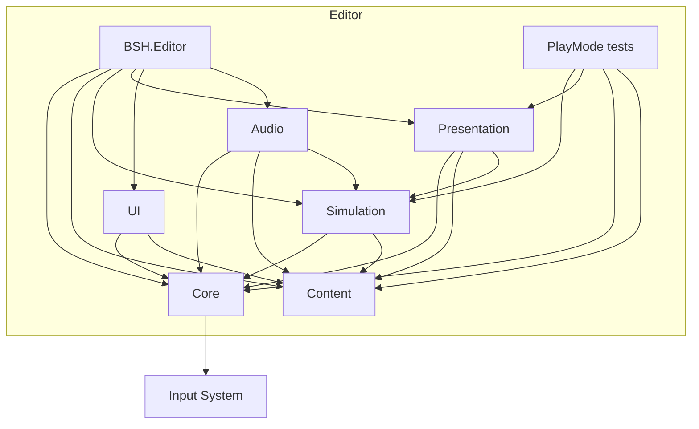
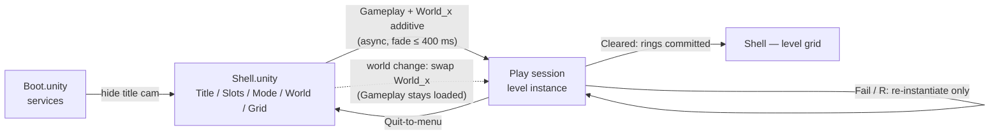
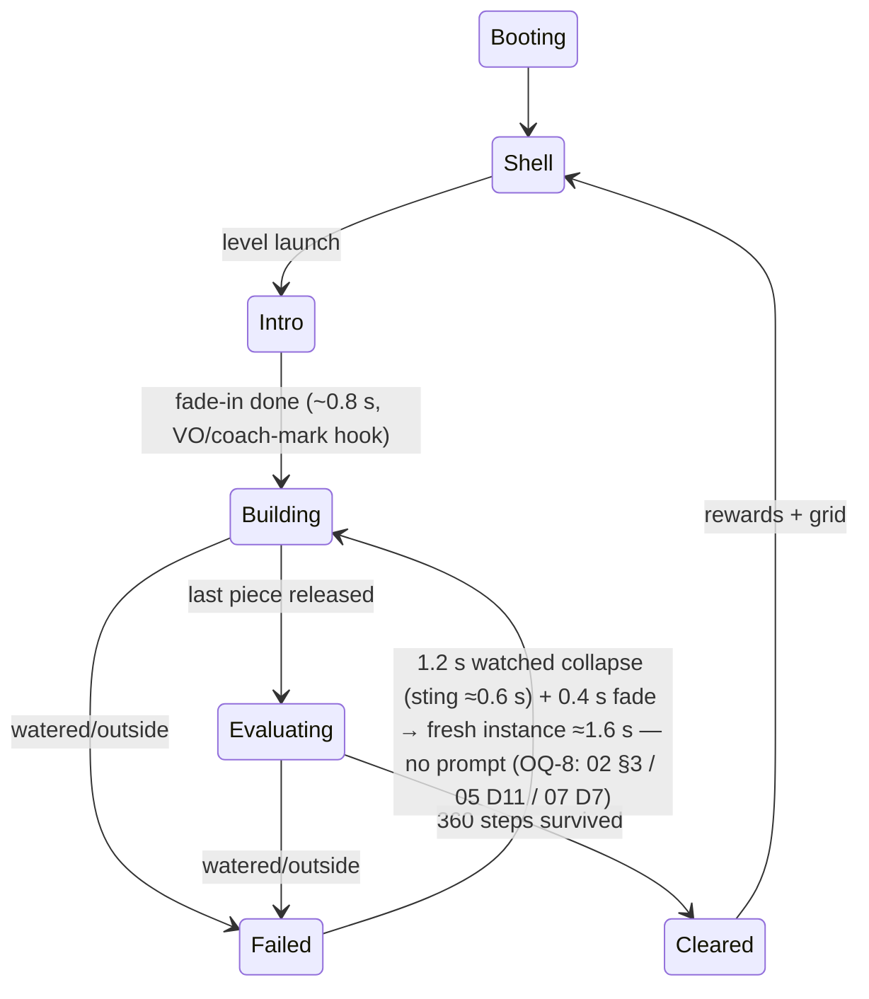

# COMBINED MARKDOWN - combine

_Generated 2026-09-24 05:49:11 | 9 files | folder: D:\stuff\docs\taylor_fv\github\rayrite.github.io\cvx\companal\items\combine_

## Contents

1. 00-README.md
2. 01-Original-Game-Analysis.md
3. 02-Game-Design-Spec.md
4. 03-Visual-Style-Guide.md
5. 04-Technical-Architecture.md
6. 05-Gameplay-Implementation.md
7. 06-Level-Design-Pipeline.md
8. 07-UI-Audio-Polish.md
9. 08-Roadmap-Milestones.md

---

<!-- ====================================================================== -->
<!-- FILE: 00-README.md -->
<!-- ====================================================================== -->

# 00 — README / Plan Index

**Project:** *Balance Stack Hero 2026* — from-scratch Unity 6.6 clone of *Art of Balance* (Shin'en Multimedia, WiiWare 2010), focused on the original's **visuals** and **main gameplay loop** (drag given pieces into a structure on a rocking plinth; survive live physics; nothing touches the water). This folder is the complete pre-build plan; nothing here is code yet.

---

## Deliverables

| Doc | What it is |
|---|---|
| `01-Original-Game-Analysis.md` | **Source of truth** on the original game: consolidated + contradiction-resolved research on versions, loop, pieces/materials, level structure, visual/audio teardown, UI flow; tagged `[confirmed]/[inferred]/[negative]` with an OQ-1…OQ-17 open-questions ledger. Every later doc defers to its rulings. |
| `02-Game-Design-Spec.md` | The rules and numbers: gameplay loop beats, placement/simulation/fail-win rules, the 14+2 piece catalog, ring economy (1/2/3 payout, gates 20/40/60), timers, MVP-vs-full scope line, fidelity ledger vs the original. |
| `03-Visual-Style-Guide.md` | The pixels: 3D-mesh rendering over a planar sim, 18° perspective camera rig, water mirror/reflection recipe, four locked world palettes with hexes, shape/pattern language, HUD/gameplay visuals, VFX inventory, URP/shader configuration. |
| `04-Technical-Architecture.md` | The skeleton: Unity 6.6 package pinning, project layout/asmdefs, scene flow, the **Physics 2D** solver configuration (the OQ-15 answer), input, state machine + events, JSON persistence, platform/aspect policy, and the testing strategy incl. the 100-level solution-replay gate. |
| `05-Gameplay-Implementation.md` | The build plan for the loop: phase-by-phase (P0–P9) implementation of grab/rotate/drop, placement legality, fail/win detection, special pieces and base rigs, the physics tuning table (`SimTuningProfile`), determinism tooling, and per-phase acceptance criteria. |
| `06-Level-Design-Pipeline.md` | Level data and content: canonical JSON → `LevelDefinition` SO format, ID/naming conventions, the in-editor Level Editor, headless Solve-Test, the 100-level curriculum (per-world tier/gimmick budgets), production strategy, playtest metrics, schema versioning. |
| `07-UI-Audio-Polish.md` | Presentation layer: uGUI screen flow (manual-faithful chain), HUD spec, lounge audio direction + full SFX trigger table, AudioMixer design, game-feel checklist, accessibility, localization seams. |
| `08-Roadmap-Milestones.md` | The schedule contract: P0–P5 milestones, 32 + 6 buffer dev-weeks for a solo dev, per-milestone deliverables/acceptance gates (G0–G5), risk register R1–R8, stretch list. |
| `Research/` (5 dossiers) | Primary evidence behind 01: `gameplay-loop.md`, `levels-progression.md`, `physics-materials.md`, `visual-style.md`, `audio-ui-platform.md`; screenshot assets under `Research/assets/aob-screens/`. Where 01 and a dossier disagree, 01 wins. |

## Suggested reading order

1. **01** — the rulings everything else cites (skim §1 clone-target decision + §8/§9 ledgers first if pressed).
2. **02** — the rule set, in the context of what's [inferred] vs confirmed.
3. **08** — scope/schedule lens (what ships vs what's stretch).
4. **04** → **05** — architecture then implementation, in that order (05 adjudicates itself against 04's locks).
5. **03** → **07** — the two presentation docs (03 owns look, 07 owns flow/sound).
6. **06** — content pipeline, last, since it consumes everyone's schemas.
   Implementers may jump straight to **05 §1 (build order)** and **08 §3–§5**, backfilling 02/04 as needed.

## Key decisions locked across the docs

| Topic | Locked decision | Owner / where |
|---|---|---|
| Clone target | WiiWare **original** (2010): 100 levels / 4 worlds / 14 normal shapes + 2 special behaviour classes; later-version modes (Endurance, Infinity, Tower Tumble, Swift Stacker, online) and gimmicks (glass/fire/gravity/locked) out of v1 | 01 §1; 02 §7 |
| Rendering | **3D meshes, never sprites**, in URP (forward, one diorama camera + mirror-camera reflection pass + overlay splash camera); 4 themes (Candy/Tropical/Porcelain/Bamboo) + Block City bonus | 03 decisions 1–3/4; 04 §1.3 |
| Camera | Narrow-**FOV perspective** (18° @ ~21 u) reads ~95 % flat; auto-zoom-in on hold, slow height-dolly out; fixed angle, no player rotation | 03 decision 2, §6.2; 05 §5 |
| Physics approach | **Unity Physics 2D** planar simulation under 3D presentation; **1 u = 0.1 m**; ship tick **120 Hz** `FixedUpdate` (240 Hz = dev toggle only, 08 P1 A/B); convex parts merged via `CompositeCollider2D` (composites allowed); gravity (0,−14); iterations 12/4; one shared `WoodOnWood` material friction 0.65; `SimTuningProfile` SO is the single home of numbers (05 owns final feel) | 04 Decision 5–7 / §4; 02 D-10; 05 §9 |
| Placement mechanic | Held pieces **non-simulated** (`Rigidbody2D.simulated = false`); drop = zero-penetration flush-snap commit, **zeroed velocity** (no throw); anti-slam via 0.4 s commit cadence + 0.25 s post-drop pick-lock + 8 u/s translation cap; 45° stepped rotation | 04 D3/D8/§4.5; 05 D3–D6; 02 D-02/D-03 |
| Win / fail | Win = 3.0 s (360 steps) hold on last drop, lenient mid-tip; fail = any *released* piece touches water/outside — zero tolerance; special-shape **break ≠ fail**; fail choreography **1.2 s watch (sting ≈0.6 s) → 0.4 s fade → fresh instance ≈1.6 s**, R skips; pre-roll settle under the 0.8 s fade-in | 01 §2/§4 C2; 02 D-04/D-05; 05 D7/D8/D11; 07 D7 |
| Base rigs | Normal single plinth **static**; Balance challenges use **passive rocker** (`HingeJoint2D`, no drive — pendulum self-level); double plinth = **twin-hinge seesaw** (weight-reactive); 04 §4.8 also defines the **driven kinematic sway-float** pose-law rig (data-only in v1, first on D) | 02 D-07; 04 §4.8; 05 D9; 06 §2.4 |
| Scoring / progression | **No score/medals** — binary clear + rings (grey 1 / orange 2 / green = world finale 3); 31 rings/world; gates **20/40/60**; 100 levels / 4×25; Time challenges 90/75/60 s by tier; SP-timer fuse 3.0 s | 02 D-08/D-09/§5; 06 decision 6 |
| UI tech | **uGUI + TextMeshPro** for all runtime UI; UI Toolkit editor-only; New Input System only, one shared cursor abstraction (mouse/touch/gamepad arbitration) enabling co-op cheaply | 07 D1/D2; 04 §5 |
| Level format | Canonical **JSON** in git (Newtonsoft) → `LevelDefinition` SO via importer; ids `L_<W><row>_<col>` (display `A 1.1`); every level ships a **reference solution** replay-validated headlessly (`Physics2D.Simulate`); branching unlock DAG; moving decks orange/green nodes only | 06 decisions 2/3/7, §4 |
| Persistence | Versioned **JSON files** (3 slots + settings), atomic double-write; **no Addressables** in v1; localization packages deferred (keyed seam from day one) | 04 Decision 4/13/§7; 07 D15 |
| Scope targets | **v1** = single-player Arcade only, 100 levels, 4 worlds, Windows x64 + macOS arm64 at 60+ fps; MVP grey-box = 15 World-A testbed levels / 10 shapes, P3 slice = 10 final-visual Candy levels; **co-op + Versus = post-v1 stretch** (08 decision 6 — deliberate deviation vs the original); mobile v1.1 lane | 02 D-12/§7; 03 §4.5/§6.2; 08 decisions 5–7 |
| Platform | Windows x64 primary; aspect 4:3–21:9 by FOV widening (no letterbox ≥16:9), Classic 4:3 toggle; editor track 6.6 (`6000.6.x`, ≥ 6000.6.2f1) with 6.7 LTS spike at P5 | 04 D14/§8; 08 decision 1 |

## Terminology & conventions

- **Canonical names (used in all docs after the 2026-09-24 consistency pass):** held-state = *non-simulated* carry (never "kinematic while held"); the win timer is `StabilityClock` (was `StabilityHold`); the pointer proxy is `PlacementProbe`; the optional lean readout is the **"Lean Gauge"** assist (was "Balance Assist"); project prefix **BSH** everywhere (mixers, `.inputactions`, asmdefs `BSH.*`); fail sensors live on the `Sim_Water` layer (04 §4.2's layer table is canonical); milestone refs use 08's **P0–P5 / G0–G5** ids (old "M0/M1/M2" references were retired); level data class is `LevelDefinition` (06 presents the authored-SO form, documented 1:1).
- **Decision IDs are doc-scoped:** 02 uses `D-01…`, 05/07 use `D1…`, 03/04/06/08 use numbered "decision n". Always cite with the doc number (e.g. "08 decision 6").
- **World/ring/timer numbers:** any drift is resolved by owner: 02 owns rules/timers/rings, 04 owns solver/scale/tick, 05 owns feel (via `SimTuningProfile`), 06 owns authored level data/naming, 08 owns dates.

## Status & open questions for the user

All OQ-1…OQ-17 from 01 §9 are **decided or closed** except these, which remain genuinely open (each is flagged in its owner doc):

1. **OQ-2 — exact grid shape** per world (rows × columns, branch degree) is convention, not fact; 06 §1.1 locks a 25-node DAG — confirm after footage pass (walkthrough verification).
2. **OQ-3 — true world theme identities** ("plant life"/"snowfall" text-confirmed only); 03's four palettes are a working art bible — foot-check before final art.
3. **OQ-9 — SFX baseline:** the 07 §7 table is inferred until KHInsider rips are auditioned (scheduled at 08 P3).
4. **Product call — co-op/Versus deferral** (08 decision 6) is a budget-driven deviation from the original's feature set: confirm you're happy shipping v1 single-player-only.
5. **Product call — localization** deferred past v1 (04 §1.2 / 07 D15): confirm English-only v1.
6. **Verification debt (non-blocking):** 02 §4.1 piece footprints and per-level data are **[reconstructed]** until footage-verified (06 §11 gate); 08 pins editor ≥ 6000.6.2f1 while 02/04 cite 6000.6.0f1 as the verified release — both are consistent (patch-line freeze).

*Last consistency pass: 2026-09-24 — cross-doc contradictions on physics 2D-vs-3D, world scale, tick rate, solver/friction values, fail timing, ring math, dial/assist naming, state/component ids, layer names, file paths, and scope (co-op) were found and fixed in place.*


---

<!-- ====================================================================== -->
<!-- FILE: 01-Original-Game-Analysis.md -->
<!-- ====================================================================== -->

# 01 — Original Game Analysis: *Art of Balance* (Shin'en Multimedia, WiiWare 2010)

**Role of this document:** the single source of truth for every later plan author in *Balance Stack Hero 2026* (Unity 6.6 clone). It consolidates the five research dossiers in `Docs/Research/` (`gameplay-loop.md`, `levels-progression.md`, `visual-style.md`, `physics-materials.md`, `audio-ui-platform.md`), resolves the contradictions between them, and states explicitly where the research was silent.

**Tag convention (carried over from the research):**
- `[confirmed]` — stated by a citable source; source key given (see §10 registry for URLs). Evidence strength ordering used when sources conflict: **official game manual > Shin'en official site pages > contemporaneous reviews > later reviews > Wikipedia > forum/search snippets**.
- `[inferred]` — synthesis, screenshot reading, or deduction; needs verification (ideally against the footage archive in `Docs/Research/assets/aob-screens/` and Wii gameplay video).
- `[negative]` — searched for, no evidence exists; absence is itself a finding.

---

## 1. Game identity and versions — and which version we clone

*Art of Balance* is a physics stacking puzzle game developed and published by **Shin'en Multimedia** (Germany), released on **WiiWare on 15 Feb 2010 (US) / 26 Mar 2010 (EU) for 800 Wii Points**. Genre: "physics puzzler." Reception was strong: Metacritic 88, Nintendo Life 9/10, Eurogamer 9/10 ("nothing short of essential"), Cubed3 8/10. [confirmed: Official-Wii, Wiki, NL-Wii, Eurogamer]

### Version ladder

| Version | Year | Content | Physics tick | Multiplayer | Controls |
|---|---|---|---|---|---|
| **WiiWare original** | 2010 | **100 levels / 4 worlds; 14 shapes + 2 special shapes** | 60 fps render (platform std) [confirmed: Official-Wii] | 2P drop-in co-op + split-screen Versus | Wii Remote pointer + A/B/D-pad/± [confirmed: Manual] |
| 3DS *TOUCH!* | 2012 | 200 levels / 8 worlds; 16 shapes + 5 special; **Endurance** mode; 13 awards | "often 30 fps" [confirmed: NL-2014art] | **none** (dropped) | Stylus touch or Circle Pad; rotate on L/R [confirmed: NL-touch, NE-touch] |
| Wii U (eShop) | 2014 | 200 levels / 8 worlds, HD; Endurance online; Tower Tumble, Swift Stacker | **240 fps, "more accurate"** [confirmed: NL-2014art] | up to 5 local / online | GamePad touch, buttons, Wii Remote |
| PS4 | 2016 | same expanded set; trophies | (as Wii U) | yes | stick/D-pad cursor only (criticised) |
| Switch | 2018 (Oct 4) | "5 unique game modes" (Arcade, Versus, Endurance, Tower Tumble, Infinity); 1–4 players | (as Wii U) | local + online | touch, stick, **gyro added in patch 1.01** |

[confirmed: Official-Wii, Official-3DS, Official-PS4, NOE-Switch, NL-touch, Wiki, GameHoard; consolidated from gameplay-loop §0 and audio-ui §1]

**Date conflicts resolved (decided here, do not re-litigate downstream):**
- 3DS release: official Shin'en dates **24 May 2012 (EU) / 7 Jun 2012 (US)** win; Wikipedia's "25 Sep 2012" is treated as a different-region entry or an error. [resolved: Official-3DS over Wiki]
- Wii U release: **Sep 25 2014 (EU) / Oct 9 2014 (US)** win (contemporaneous Nintendo Download coverage); Wikipedia's "25 Sep 2013" predates the Feb 2014 announcement and is rejected. [resolved: ND-2014EU, NL-2014art over Wiki]
- Switch launch price: sources in our research disagree ($8.99 vs $9.99). Immaterial to the clone; recorded as open question OQ-13.

### Clone decision: we recreate the **WiiWare original** (2010), scope and rules, with modern input

Why the original is the clone target (decision, [inferred] — project-level):
1. The brief names it: clone of the 2010 WiiWare game's **visuals + main gameplay loop**.
2. The original has the **cleanest rule set**: only two special-shape behaviors (load-limited, timer). Fire, glass-as-named-class, gravity-flip, and locked pieces are 3DS-onward additions — out of scope for v1, held as documented "expansion" content. [confirmed: Official-Wii vs Official-3DS]
3. The original's visual identity (glossy toy diorama, flat retro-lounge backdrops, per-world pattern wallpaper) is distinct from the HD remakes' photoreal-material look; cloning the original means cloning *that* look. [confirmed: NL-preview, SPC-3DS]
4. Its 100-level / 4-world / ≤40 MB scope is a sane v1 target for a small team. [confirmed: Cubed3-Wii for the cap; scope inference ours]

**What we adopt from later versions anyway:** the ~3-second stability countdown value (shared by original and ports), the modern input mappings proven by 3DS/Wii U/Switch (§7), and the challenge-node ring economy as documented in the original's own manual (§4). **What we explicitly do NOT clone:** Endurance, Infinity, Tower Tumble, Swift Stacker, online play, 3D stereoscopy, and the "touch!" photoreal skin — all out of the stated scope. [inferred — project scoping]

**Correction to the project brief:** the previously circulated "~150 levels" figure is wrong for every version. The real ladder is 100 (original) → 200 (all remakes); "150" is almost certainly the 3DS "solve 150 levels" **achievement tier**, not a level count. [confirmed: Official-Wii, Official-3DS; the 150-explanation is inferred from NL-touch's award list]

---

## 2. Core gameplay loop, beat by beat

The loop is "plan → place → hold," not "act fast." Beats, with exact rules where known:

1. **Level fade-in.** A small zen-lounge diorama: a basin of water on a table/floor, a stone-or-metal plinth rising from it at centre; the level's given shapes lie lined up on the table in the foreground. Optional calm female voice-over introduces the level's new mechanic. [confirmed: Official-Wii screenshots, NL-Wii, Cubed3-Wii, GameHoard]
2. **Grab.** Point (or touch) a tray piece and press **A**: the piece detaches and **hovers, parented to the cursor — it is not simulated while held**. [confirmed: NL-preview, Serenes-review]
3. **Rotate.** **B or D-pad rotates in fixed 45° steps** (deliberately discrete; the original rejected motion-rotate as "an annoying gadget"). The camera nudges in on the work area for precision. [confirmed: Manual p.10, Wiki-45°, Cubed3-Wii, NL-preview]
4. **Drop.** Press A again: the piece becomes a live rigid body **immediately** — physics is continuous from frame one of the level; there is no "simulate" button, no pause during play, no slow motion. The plinth rocks and the stack settles under weight while you are still building (double plinths act as weighing scales). [confirmed: NL-preview, SwitchPlayer, DigitalChumps; no-slow-motion is [negative] — searched, nothing]
5. **Iterate.** Repeat grab/rotate/drop with the remaining pieces. Placement is forgiving off-centre ("you don't have to be perfectly centered") but micro-sensitive: a slightly off-center block on a marginal foundation can topple the tower. A deliberate **cap on placement speed** prevents slamming pieces to beat the solver. Placed pieces **can never be re-grabbed or undone** — the only undo is restarting the level. [confirmed: DigitalChumps, Pietriots, GameHoard, SwitchPlayer]
6. **Fail (instant, zero tolerance).** If **any single piece touches the water, or lands on the ground outside the tub**, the level fails immediately → quick reset to a fresh instance, unlimited retries, no lives in Arcade. Collapses are slow and watchable; once a lean starts the player is helpless. **Exception:** a *special* (load-limited/timer) shape **breaking is not a fail — some levels are only solvable by breaking them** (manual rule). [confirmed: Cubed3-Wii, DigitalChumps, SwitchPlayer, Pietriots; breaking-not-fail [confirmed: Manual p.12]]
7. **Win (survive the hold).** Once the **last** piece is released, a **3-second stability countdown** runs — shown as **three lights at the bottom of the screen lighting in sequence** with an audible tick. The stack need not be calm: if 3 s elapse before anything touches water, you win, even mid-tip. The countdown only starts on the final placement. [confirmed: Cubed3-Wii ("three consecutive seconds"), NL-Wii (three lights), Wiki, GameHoard (leniency)]
8. **Reward & return.** Clear pays **rings** (1 per normal level, more for challenge levels, §4), level marked cleared, return to the world's grid map; adjacent nodes unlock. Occasional **special-challenge levels** swap the goal (hold on a swaying base / reach a required height / beat a time limit) but keep the same pass rule otherwise. [confirmed: Manual p.8/p.13, NL-Wii, Wiki]

---

## 3. Pieces, materials and physics behavior

### Simulation model
- Gameplay is **planar**: effectively a **2D rigid-body simulation** (translation + rotation confined to the camera-facing vertical plane) **dressed in full 3D rendering** (models, lighting, animated water). Depth is cosmetic; there is no front/back axis. Gravity-flip stages (later versions) put pedestals top *and* bottom of the same screen plane, reinforcing this. [inferred, high confidence — triangulated in physics-materials §2; no source names the engine or 2D/3D outright]
- **Feel is tuned, not realistic**: CEO Manfred Linzner — "exactly like you would expect it to be without being overly realistic… finely tuned over a long time until the gameplay and fun aspects were maximised." [confirmed: Interview-Linzner]
- **Determinism is the felt core**: "results of your work identical each time you attempt a specific action"; the same shape is the same size every time it appears. Solving is repeatable physics, not jitter. Later ports raised the tick rate (30 → 240 Hz) for accuracy; our clone should run a high fixed tick (≥120 Hz) and lock it. [confirmed: GameHoard; tick-rate [confirmed: NL-2014art]
- **Contact-quality trap from a port:** on Switch/HD, setting a block against a side neighbour produced an "invisible force" pushing them apart at drop — a contact-resolution artifact. Treat as an **anti-goal**; tune Unity 2D contacts so pieces can rest against each other without pop-out. [confirmed: SwitchPlayer]

### The roster (original WiiWare)
- **14 normal shapes + 2 special shapes.** [confirmed: Official-Wii]
- Name vocabulary from the solution guide: **Long beam, Cross (X), Fat cross, Ball, Dumbbell/barbell, Semi-circle, Keyhole, Roadsign, L-tromino, wedge/arrow** forms; every normal piece is a **rounded 2D footprint extruded into a thick cushion-like slab** with heavily filleted corners and round-over'd edges — no sharp edge anywhere. Circular pieces roll off flat contacts: difficulty comes from **geometry, not scripted forces**. [confirmed: AOBGuide (names), NL-touch, SPC-3DS; form reading [inferred from gallery]]
- **Rotation is 45°-stepped, snap-precise.** [confirmed: Wiki, Manual]

### Behavior classes ("materials" = gimmicks, not friction tiers)
| Class | Rule | Status in original |
|---|---|---|
| **Normal wood** | dense, uniform; looks/sounds like solid wood | all 14 shapes [confirmed: GameFAQs-3DS-user, DualShockers] |
| **Load-limited** | face changes **green → red** as weight accumulates; shatters when too many blocks rest on it — reads as *holds two, breaks on the third* | 1 of the 2 specials [confirmed: Manual p.12] |
| **Timer** | shows a **countdown on its face**; starts only when a shape is stacked on top, then shatters, dropping everything above | the other special [confirmed: Manual p.12, NL-Wii, Cubed3-Wii] |
| Glass ("shatters if three stacked") / Fire (chain-explosion on mutual contact) / Gravity-flip (inverts the stack onto a top pedestal) / Locked (unpickable until others are placed) | — | **not in the original**; 3DS-onward expansions [confirmed: Official-3DS, NL-touch, GameHoard, Cubed3-WiiU] |

- **Crucial manual rule [confirmed: Manual p.12]:** breaking a special shape **does not fail the level**, and *some levels require* breaking shapes to solve. Any clone rule that says "special broke = fail" is wrong.
- **Negative findings [negative]:** no rubber, ice, balloon, steel, bouncy, buoyant or slippery materials in any version; no wind, no moving platforms in normal levels, no water currents. Variety = **shape + behavior gimmick + base platform**, nothing else.
- **The base is a physics object too:** stone/ceramic plinth on metal posts is the default; challenge/super variants use a **swaying, floating base** ("prone to tilting hither and thither") or **seesaw double-plinths** — a rocker/fulcrum, the only place water enters gameplay. Some levels contain pre-placed props. [confirmed: Wiki, Cubed3-WiiU, DualShockers, SwitchPlayer, GameHoard]
- **Water is a fail-volume, not a fluid.** Any contact = fail; there is no buoyancy. [confirmed: Cubed3-Wii, DigitalChumps]

---

## 4. Level structure, themes, progression, win conditions

### Architecture (the thing to copy wholesale)
- **Original: 100 hand-authored levels across 4 worlds**, each world "its own unique lounge style." [confirmed: Official-Wii]
- **Level select is a per-world grid** of block-nodes, addressed **row.column** (World A 1.1 … 11.1 per the solution guide and walkthrough series); "beating one will unlock the next in line," already-unlocked nodes are freely selectable; expanded versions render it as a branching connected-cube map. [confirmed: Cubed3-Wii, AOBGuide, GameHoard]
- Each node carries a **1–3 difficulty circle** mark (Cubed3's "dreaded three") — difficulty, **not** a medal. [confirmed: Cubed3-Wii]
- **Ring economy [confirmed: Manual p.8, RA-Rings]:** node colors encode ring payout — **grey = normal (1 ring), orange = challenge (2 rings), green = "goal" (3 rings)**; **20 rings unlocks the next world**. The first gate lands early (the "Rings of Many" RetroAchievement has an 89.1% earn rate), so a stuck player can skip hard levels and keep progressing — a deliberate fairness feature reviewers praised. [inferred: the *what is a green "goal" level* semantics is not explained anywhere — OQ-6]
- **Contradiction resolved — levels per world:** "4 × 25 = 100" was the even split hypothesised in levels-progression.md, but the original's own guide shows **uneven row counts** (World A to row 11, World B to row 9, World D to row 5.5 in the walkthrough ranges). **Definitive:** 100 total / 4 worlds [confirmed]; per-world distribution and exact grid shape **unconfirmed** [negative — no source enumerates them]; plan the clone around 25/world as an authoring convenience, not a fact. What the row/column evidence does establish: the original's grid is a **branching node map** (multiple choices per row), like the remakes'.
- **Themes:** never officially named. Text sources confirm only "plant life and snowfall" as two world themes (Cubed3) and, for the remakes, World F = gravity / G = fire / H = mix. The visual teardown reads the four original worlds from screenshots as **candy / tropical / porcelain-blue / bamboo-amber** (+ one bonus "block city" room) — [inferred], our working art bible, not canon. Each world = one wallpaper pattern + one botanical prop set + one block finish + one music track + one physics gimmick focus; the final world combines everything. [confirmed: Cubed3-Wii, Serenes-snippet, GameHoard; named-palette reading [inferred from gallery]]
- **Gimmick ladder [confirmed: Official-Wii, Cubed3-Wii, levels-progression §5]:** plain wood → load-limited shapes → timer shapes → rounded/awkward geometry (balls, crosses, semicircles) → swaying platforms & challenge variants; difficulty ramp "smooth and gradual" with spikes in world 4–5 ("the second half can be a cruel master").

### Win conditions, timers, scoring
- **Normal levels: no time pressure at all** beyond the 3-second survival hold. Binary pass/fail. **There is no score display, no stars, no per-level medals in any version** [confirmed ×3 + negative: NL-Wii/Cubed3/GameHoard report none; "no extra rewards to return to a completed stage"].
- **Challenge variants** (separate levels, "for extra points" in official copy): **Balance** (swaying base), **Height** (gauge + required height), **Time** (timer HUD upper-right). Marketing frames points but **no per-level point arithmetic is documented anywhere** [negative — state the gap rather than invent; OQ-7]. [confirmed: Official-Wii, NL-Wii, Manual p.13]
- **Awards/achievements** exist only from 3DS onward (13 awards; e.g. "solve 150 levels," "100,000 points in Endurance"); the original had none documented. Out of scope for v1. [confirmed: NL-touch; original-had-none [negative/inferred]]
- **The countdown-length contradiction (resolved here):** Wikipedia claims the end-of-level countdown "was shortened in versions following the original Wii release," but **two 2010 reviews of the original itself state three seconds** (Cubed3: "three consecutive seconds"; NL: "must stay above water for three seconds, indicated by three lights"), and later ports also cite 3 s. **Definitive for the clone: 3 seconds, all versions.** Wikipedia's claim is treated as unreliable (it may describe restart latency or an animation change). [resolved: Cubed3-Wii + NL-Wii over Wiki]
- **Retry behaviour:** fail → fast reset to a fresh instance of the same level; instant-restart is also a manual button (Minus). No lives, no continue screen, near-zero retry friction is part of the design. [confirmed: Cubed3-Wii, GameHoard, Manual p.10]
- **Save/progress:** thin single auto-saved profile per slot; **slot count and UI undocumented** [negative — OQ-11]. Multi-slot profile *selection* is documented in the original's manual (savegame select with icons), so ≥ a few profiles exist. [confirmed: Manual p.7]

---

## 5. Visual style teardown (WiiWare original)

**Art direction, one sentence:** a **glossy 3D toy-museum diorama** — solid, rounded, brightly patterned play-pieces on a tabletop zen-basin — staged against **near-2D retro-patterned wallpaper planes** in a 1960s cocktail-lounge room. The dimensional-vs-flat contrast is the signature ("glossy, stippled presentation"; "the cloth and wooden background textures look good"; blocks "smooth" against scenery with "jagged edges"). [confirmed: NL-preview, NL-Wii; "lounge" is the official word]

- **Camera:** fixed, eye-level-to-slightly-elevated 3/4 frontal view, shallow perspective (not true ortho; tray converges mildly, wallpaper parallaxes). No player rotation. **Auto-zooms in** toward the work area while placing, and **zooms out** "only when your tower is exceptionally high" (both documented; on 3DS the zoom-out was criticised for disrupting fine play). [confirmed: NL-preview, SPC-3DS; ortho-vs-perspective [inferred: gallery]] → Unity: height-driven dolly/fov with deadband + placement zoom.
- **Scene layering (front→back):** tabletop plane → basin (rectangular wooden tray *or* round glass bowl, rimmed) with mirror-like tinted water → plinth slab on 1–2 posts → the stack → queued pieces at bottom-centre → 3D botanical side props (bamboo culms, broad leaves, bird-of-paradise) partially occluding the wall → flat wallpaper plane → small lounge props. The basin occupies ~60% width / ~45% height with tall-tower headroom. [confirmed/inferred: all gallery frames, visual-style §3]
- **Piece surfaces = printed patterns on glossy plastic/painted wood, not PBR:** polka-dot/halftone speckle over saturated base; diagonal candy stripes; white "joint" circles + ringed rivets; jade-marble swirls; concentric embossed rings. Every silhouette corner filleted ~15–30% of local thickness; extrusion edges round-over'd so speculars sweep continuously. **Specials are telegraphed by face:** load-limited face shifts green→red; timer face shows a clock/countdown; the held piece projects a **semi-transparent white-blue ghost silhouette** of its landing pose. [confirmed: Official-Wii gallery pixel reads (measured, JPEG-caveated ±15% lightness), Manual p.12, wii_screen04]
- **World palettes (measured from official promo files; on-screen brighter):** 1) **Candy** — rose-plum wall `#4B2135→#592D44` w/ white halftone bursts, royal-blue dotted blocks `#1963AE`, candy-striped platform, round glass bowl, sand-tan water. 2) **Tropical** — seafoam→pale-aqua wall with retro wavy rings, orange bird-of-paradise, slate grey-green blocks w/ white ring joints, rectangular wooden tray. 3) **Porcelain/blue** — steel-blue wall with white damask, bamboo props, white+jade swirl blocks, white tray. 4) **Bamboo/amber** — burnt-orange wall with cream donut rings, 3D bamboo, amber water, angled A-frame metal posts (+ olive-chartreuse variant). Plus the **bonus "block city"** cube-fitting room (lime donut wall, golden floor, zen pebbles). [inferred-from-measured-gallery — working bible only]
- **Water & reflection:** tinted mirror surface reflecting wallpaper, blocks, posts; **cyan glow/electric shimmer where objects meet the waterline**; the original's splash was **white droplet particles + ring ripples, with droplets on/near the screen** (the 3DS port *lost* the screen splash — a reviewer noticed). Later ports' water was mocked as "shimmering tin foil / JELL-O"; do not chase a fluid sim — a stylised reflective plane + ripple/droplet VFX is faithful. [confirmed: gallery, NL-touch comment, SPC-3DS, NE-touch]
- **Lighting/shadow:** soft upper-front studio key, big single speculars, ambient tinted by world; reflections act as the shadow catcher; backgrounds carry **painted** light streaks/vignettes, not GI. [inferred: gallery]
- **Particles & feedback:** ever-present slow-rising white bokeh "pixie dust"; splash droplets + ripples; waterline shimmer; **three countdown lights** bottom-centre ("sweat it out for a few agonising seconds for the three green lights"); wood "clink" on contacts. [confirmed: gallery, NL-Wii, Eurogamer, DualShockers]
- **HUD & cursor:** Wii pointer drawn as a **cartoon white-gloved hand** that grabs pieces via a grab circle; remaining-piece queue as themed chips bottom-centre (physical blocks on the table) **and/or** a dot row that darkens as pieces are used (clear in versus); a **white ringed dial with a red pie wedge at top-right** in at least one theme — most plausibly a lean/center-of-mass gauge, function [inferred, OQ-5]; timer/height gauges top-right on challenge levels only. [confirmed: gallery, Manual p.13]
- **Menus/typography:** chunky rounded-rect panels, thick black + white inner border, translucent brown fill; glowing white vertical light bars; "B Back / A Select" with Wii button glyphs; logo lowercase wide-tracked squarish-rounded techno type ("construction-kit-esque") in blue with white outline over a halftone burst; UI font a bold rounded near-monoline sans (white fill + colored outline + shadow) — "VAG Rounded/Quicksand"-like is [inferred]. [confirmed: gallery; font ID inferred]
- **Technical frame:** official spec — **4:3 *and* 16:9, 480i/576i/480p, "super-smooth 60 fps"**; art budget ≤40 MB (exact size unpublished [negative]). Clone renders any 16:9 at 60+, emulating framing density; author pieces as albedo pattern + glossy coat; **save photoreal PBR for an optional "touch!"-style skin** [inferred planning note from visual-style §11].

---

## 6. Audio

- **Identity: "relaxing lounge."** Shin'en's own store copy: "a relaxing lounge soundtrack and 8 beautiful environments." Review copy: "zany, yet serene… never become annoying, even when you need to retry" (Cubed3); "booming bass beats and quirky sound effects" but "most tracks sound very similar" (NL); "soothing and not distracting" (SPC); "jazzy and energetic" outliers (GameFAQs). Synthesis: spa-lounge × quirky downtempo electronica; mellow chord loops, light percussion/bass; never dramatic. [confirmed: Official-PS4/Switch copy, Cubed3-Wii, NL-Wii, SPC-3DS, GameFAQs-WiiU]
- **Structure (from the official OST album, ℗ 2014 Shin'en, Martin Schioeler composer):** 12 tracks ≈ 24 min — **Main Menu, Level Selection, one ~2.5–3 min loop per world (A–H), Challenges, Credits**; Apple Music genre "Easy Listening." **No adaptive/interactive music in any source** [strong inference + negative]: tracks are context-switched, not layered. Tension is carried by diegetic SFX (the countdown **tick**), not the score. Apple's "no dynamic music needed for authenticity" is a *recreation* fact; a subtle riser during the 3-light window would be an enhancement, not fidelity. [confirmed: AppleMusic-OST, Shin'en-OST; [inferred] synthesis]
- **Audio was a pillar:** Linzner — a "top priority," "large portion of development time," many styles tested; the *Zenses* lesson of "a refreshing feel rather than leaving players stressed." [confirmed: Interview-Linzner]
- **Tutorial voice-over:** "a calming female voice chips in with advice" as each new mechanic is encountered — the original's entire hint system. Replicate or consciously replace (on-screen coach marks). [confirmed: Cubed3-Wii]
- **SFX inventory** (evidence quality varies; rows marked inferred need foley authoring from gameplay rips):
  | Event | Evidence | Tag |
  |---|---|---|
  | Block hits water — the iconic "plop" ("taunts me at night"); "very realistic" | SPC-3DS, WiiWareWave | [confirmed] |
  | Countdown ticks through the 3-light window; end-of-timer indicator | GameFAQs-WiiU | [confirmed] |
  | Wood "clink" on block-on-block contact | DualShockers | [confirmed] |
  | Level-complete cue + success declaration | Switch community soundboard (cue name semi-confirmed) | [confirmed existence / weak naming] |
  | Special shape shatter (dry wood crack/splinter + splash of debris) | mechanism confirmed (Manual); exact foley character | [inferred] |
  | Whole-tower collapse (same wood/water foley set) | reviews describe visuals | [inferred] |
  | Grab / drop blips | no prose source | [inferred: soft click / muted thud] |
  | Menu move/confirm quirky blips | NL "quirky sound effects" | [inferred] |
  | Ring-award + world-unlock jingle | reward must be signalled | [inferred] |
  | Fail sting before auto-restart | restart rule confirmed; sting itself | [inferred] |
  - **KHInsider gamerips exist for Wii/3DS/Wii U** — the next verification step for the SFX list is auditioning them; none of the individual effect names were indexable in this research pass. [confirmed existence: audio-ui §6]

---

## 7. UI/UX flow and controls

### The original's complete flow (from the official manual — strongest source)
Title (press A) → **Savegame select** (point + A; New game picks an icon; point + B deletes) → **Mode select: Arcade / Versus** (Versus = best of 5/7/9 rounds) → **World select** (arrow buttons; ring-gated, 20 rings per world) → **Level grid** (block nodes; grey/orange/green = 1/2/3 rings; only unlocked nodes selectable) → **Play** (tray + three lights bottom; timer top-right on Time challenges; height gauge on Height challenges) → **Plus (+) = Pause menu; Minus (–) = instant restart**. Co-op: a second Wii Remote joins **at any time**; Versus is vertical split-screen. [confirmed: Manual p.7–13, NL-Wii, Cubed3-Wii, Official-Wii]

### Exact control mapping (WiiWare)
- **Pointer = the manipulation device.** Point at tray piece, **A = pick up** (hovers on cursor); **A again = drop** into live physics.
- **B or D-pad left/right = rotate 45°**; D-pad chosen over remote-tilt for precision ("precise and non-jittery").
- **Minus = restart level; Plus = pause.** [confirmed: Manual p.10, Cubed3-Wii]
- **Design lesson:** motion-rotate and Balance-Board were prototyped and **cut** because they were "gadgets," not improvements. Keep motion in our clone **optional, never required**. [confirmed: Interview-Linzner]

### Port history → modern input mapping implications
- Stylus direct-drag (3DS) proved the **touch** model; GamePad touchscreen was the preferred Wii U scheme; Switch added stick-cursor + post-launch gyro; PS4's stick-only cursor was the weakest. Direct-manipulation beats indirect for precision; indirect (stick/cursor) must get rotate/restart buttons. [confirmed: NE-touch, GameHoard, Cubed3-Switch, DualShockers]
- Proposed clone mapping (carried from audio-ui §4.4; [inferred — design note, decide in the control doc): **Mouse** = hover tray → LMB pick → LMB place; **Q/E or wheel or RMB** = 45° rotate; **R/Backspace** = restart; **Esc** = pause. **Touch** = direct drag-and-release. **Gamepad** = left-stick cursor + A pick/place + LB/RB rotate + Back restart. Drop-in second input = co-op, matching the original's shared-pointer model.
- **UI/UX principles to preserve [inferred from evidence]:** one shared cursor; diegetic menus (chunky toy-panels, gloved-hand cursor); zero-friction restart; the three lights as the only "tension HUD"; no score clutter in Arcade; difficulty printed on the node (1–3 circles) as both warning and currency.

---

## 8. Contradictions and corrections log (resolved rulings)

| # | Disagreement | Ruling | Basis |
|---|---|---|---|
| C1 | "150 levels" (project brief) | **100 (original) / 200 (remakes)** | Official site; "150" = 3DS award tier |
| C2 | 3 s countdown vs Wikipedia "shortened in later versions" | **3 s, all versions** | Two 2010 reviews state 3 s for the original itself |
| C3 | 4 × 25 even split vs guide row-11/row-9 world ranges | **100/4 confirmed; per-world distribution unconfirmed; branch-grid layout** | AOBGuide + walkthrough row spans vs levels-progression hypothesis |
| C4 | Piece tray location: manual "area above the play field" vs screenshots' blocks on the foreground table | **Physical tray in the foreground; top-of-screen dot/progress indicators (clearest in versus)** | Screenshot evidence wins on physical layout; manual wording likely describes the HUD indicator |
| C5 | Glass load limit "2 blocks" (3DS) vs "no more than three" (Wii U) vs manual green→red "breaks under 3+" | **Consistent reading: holds two, breaks on the third** | Manual + reconciliation |
| C6 | Endurance unlock "after finishing World B (first world)" (audio-ui's garbled line) vs NL "after finishing the first world" | **After first world; 3DS-only anyway → out of scope** | NL-touch |
| C7 | Switch price $8.99 vs $9.99; Wii U 2013 vs 2014; 3DS Jun vs Sep 2012 | **Dates resolved §1; price immaterial (OQ-13)** | Official/contemporaneous over Wikipedia |
| C8 | GamePad-tilt "cheat" affecting physics | **Suspected port quirk, inconsistently reproducible; not a feature** | Cubed3 vs DualShockers conflict, recorded as such |

---

## 9. Open questions / low-confidence areas (each later design doc must decide or verify)

1. **OQ-1 Tray order strictness in the original:** free pick from the laid-out tray vs a locked/previewable queue (the Wii U source describes progressive reveal + preview; the guide lists a fixed "shape order"). Decide for the clone.
2. **OQ-2 Per-world level distribution** and exact grid shape (rows×columns, branch degree) for the original — verify against walkthrough footage (CanadianLooni Wii run); plan uses 25/world as convention.
3. **OQ-3 World theme identities/names:** our four palettes (candy/tropical/porcelain/bamboo) are [inferred] screenshot readings; only "plant life" and "snowfall" are text-confirmed. Decide final 4-theme art bible.
4. **OQ-4 The plinth's rig:** does the base physically rock/tilt under the stack in normal levels (reviews imply live rocking; screenshots can't show it)? Decide rocker vs fixed joint + animation.
5. **OQ-5 The balance dial** (ring + red wedge, top-right in one theme): lean/CoM gauge confirmed? Function is [inferred]; if real, decide whether to clone or modernise.
6. **OQ-6 "Green = goal (3 rings)" nodes:** what are they exactly (world-finale levels?) — manual colours them but never explains. Decide semantics.
7. **OQ-7 Challenge-level scoring arithmetic** ("extra points") is documented nowhere; Endurance-style scoring is 3DS+. Decide whether the clone invents a transparent scoring or keeps binary + rings.
8. **OQ-8 Exact fail→reset choreography:** auto-immediate, or fail-sting then prompt? All sources say "restart" without timing. Design decision.
9. **OQ-9 SFX authoring baseline:** pickup/place/menu/ring/fail sounds are [inferred]; audition KHInsider rips and build the real list.
10. **OQ-10 Female tutorial VO:** clone (recast) or replace with on-screen coach marks. Cost/quality call.
11. **OQ-11 Save architecture:** slot count, what's stored (rings, clears, retries — the Switch card shows "Play Time / Retries" but that's the remake). [inferred from Switch gallery]
12. **OQ-12 Pause menu contents:** options sliders? Manual confirms the menu exists, not its items. [inferred minimal]
13. **OQ-13 Switch launch price ($8.99 vs $9.99)** — trivia; resolve if we ever cite store data.
14. **OQ-14 Original file size:** unknown ≤40 MB — only relevant as an art-budget inspiration, not a constraint in Unity.
15. **OQ-15 Physics tick + solver choice for Unity 6.6:** Unity 2D (planar bodies) vs 3D-constrained; fixed-tick value; how to avoid the Switch pop-out quirk while keeping determinism. **The single biggest technical unknown; belongs in the physics doc.**
16. **OQ-16 Water rendering approach:** reflective plane + screen-space-ish stylization vs actual shader planar reflections — fidelity target is *stylised mirror + shimmer*, per §5.
17. **OQ-17 Level count for v1 of the clone:** original ships 100; we must set our own authoring target (suggest mirroring 100 = 4×25) — a scope decision, not a fact.

---

## 10. Source registry (keys used above; full URLs live in the research dossiers)

**Official:** Shin'en per-platform pages (wii/3ds/wiiu/ps4/switch about+gallery); **original WiiWare manual** (manual.mariocube.com mirror, p.7–13); Nintendo store pages (Switch/Wii U); Nintendo Download EU coverage.
**Interview:** Cubed3 — Manfred Linzner on Art of Balance (physics tuning, audio priority, cut motion controls, 4-player rejection).
**Reviews:** Nintendo Life (Wii 2010; touch! 2012), Cubed3 (Wii; Wii U; Switch), Eurogamer roundup 2010, SuperPhillip Central (3DS), Nintendo Everything (3DS), DualShockers (Switch), Switch Player (Switch), Digital Chumps (Wii U), The Game Hoard (Wii U, 2023), GameCritics, WiiWareWave (Wii U), Serenes Forest (Wii U), GameFAQs user reviews (3DS, Wii U), Pietriots (3DS).
**Data/encyclopedic:** Wikipedia (dates, 45°, port history, countdown-shortening claim — low trust where contradicted), RetroAchievements game 35964 (ring thresholds), artofbalanceguide.com (per-level shape order — the key artifact for reconstructing the level curve), Apple Music OST album data, KHInsider gamerips (existence confirmed).
**Evidence archive:** `Docs/Research/assets/aob-screens/` — 8 Wii gallery screens, 6 3DS promo, 8 Switch gallery, 3 wallpapers, 3 contact sheets. Hex reads are JPEG-caveated estimates.

*Prepared as source of truth for all Balance Stack Hero 2026 plan authors. Where this document says [inferred] or lists an open question, downstream docs must either verify against footage/audio or make — and record — an explicit design decision.*


---

<!-- ====================================================================== -->
<!-- FILE: 02-Game-Design-Spec.md -->
<!-- ====================================================================== -->

# 02 — Game Design Specification

*Balance Stack Hero 2026* · clone of *Art of Balance* (Shin'en, WiiWare 2010) · Unity 6.6 (verified real: 6000.6.0f1, released 31 Aug 2026) · URP · Unity Input System

**Source of truth:** `01-Original-Game-Analysis.md` (§ refs below). Research detail: `Docs/Research/gameplay-loop.md`, `levels-progression.md`, `physics-materials.md`. Visual rules live in `03-Visual-Style-Guide.md`; engine/physics architecture and the solver starting-lock in `04-Technical-Architecture.md`; simulation mechanics in `05-Gameplay-Implementation.md`; level authoring data in `06-Level-Design-Pipeline.md`; this document owns the *rules, numbers, and scope* — where 04/05 own a value (solver numbers, world scale, tick rate), this doc mirrors and defers to them.

---

## 0. Decisions locked by this doc

1. **D-01 — Loop shape:** plan→place→hold with *live continuous physics*; no simulate button, no pause-as-tool, no slow motion, no re-grab of placed pieces. (Faithful to original.)
2. **D-02 — Held piece:** **not simulated while carried** (`Rigidbody2D.simulated = false` — 04 Decision 8; "no gravity on held pieces" falls out automatically); release commits at a **zero-penetration pose with velocity zeroed** — the piece is placed, never thrown (04 §4.5 / 05 §2 D3). The original's anti-slam placement pacing is reproduced by drop-cadence limits (≥ 0.4 s between committed drops, next pick locked until the dropped piece has been live 0.25 s — 05 D6) plus the global 8 u/s solver translation cap (04 §4.4).
3. **D-03 — Rotation:** fixed **45° steps** about the piece's footprint centroid; motion controls optional-never-required.
4. **D-04 — Win:** all tray pieces released → **3.0 s stability hold** shown as three bottom lights at 1.0 / 2.0 / 3.0 s; lenient (mid-tip still wins); fail-checks stay live during the hold. (Accessibility option "Zen hold" may extend the window to 4/5 s per-player; the default and design-faithful value stays 3.0 s — 07 D14.)
5. **D-05 — Fail:** zero tolerance — any *released* piece touching water or table outside the basin ends the level; the collapse plays out **1.2 s** (sting at ~0.6 s), then a **0.4 s fade** to a fresh instance (~1.6 s total, no prompt; 05 D11/§8, 07 D7). Breaking a special shape is **not** a fail.
6. **D-06 — Tray:** all pieces laid out on the foreground tray at level start; **free pick** in any order (resolves OQ-1; the guide's "shape order" is recorded as the tray layout order, not an enforced queue).
7. **D-07 — Normal-level *single* plinth is static** (resolves OQ-4's open question): single-post bases on normal levels do not rock — rocking *there* is only [inferred] (review phrasing; screenshots can't settle it). Rationale: determinism + avoids port-artifact feel. The two gimmick bases, by contrast, follow the *confirmed* evidence rather than the static default: "Balance" challenge nodes get a physics-driven swaying rocker base (rig locked in 04 §4.8, tuned in 05), and the double plinth is genuinely **weight-reactive** — 01 §2.4 tags [confirmed: NL-preview, SwitchPlayer, DigitalChumps] that "double plinths act as weighing scales," and physics-materials §4 quotes SwitchPlayer describing the decks themselves "dropping down with the weight of a shape" and "flicking back up." The clone builds them as the twin-hinge rocker variant of the same rig family (04 §4.8), not as static plinths.
8. **D-08 — No score, no medals** (resolves OQ-7): clearing is binary; the **only** reward currency is **rings** (grey 1 / orange 2 / green 3); green = world-finale node (resolves OQ-6). The ambiguous top-right dial (OQ-5) is **not** replicated as default HUD; it ships only as a default-off **"Lean Gauge"** accessibility assist (name locked by 07 D10; dial geometry 03 §6.4; debug overlay 05 §11 C).
9. **D-09 — Campaign size:** 100 levels, 4 worlds × 25 (resolves OQ-17; authoring convention per 01 §4), world gates at **20 / 40 / 60 cumulative rings** (20 per gate-step against a 31-ring world; total yield 124). Each gate stays reachable while skipping up to 11 grey levels per world — a **clone design invariant** chosen to emulate the original's documented fairness behavior (first gate lands early; a stuck player can skip and still progress, 01 §4; the original's own per-world yield is undocumented, levels-progression §11.2; see §5 for the arithmetic).
10. **D-10 — Physics identity:** Unity **2D** planar simulation (`Rigidbody2D` + convex `PolygonCollider2D`/`CircleCollider2D` parts; `CompositeCollider2D` merges the child parts on multi-part footprints — 04 §4.4 / 05 §3) under 3D-rendered proxies; fixed tick **120 Hz** engine-stepped (240 Hz is a dev-toggle A/B only — 04 Decision 6 / 05 D2, which owns OQ-15); solver start-values locked in 04 §4.4 with final feel in 05 §9's `SimTuningProfile`; anti-pop-out = non-simulated carry + zero-penetration flush-snap commit with zeroed velocity (04 Decision 8 / 05 §2/D3/D4).
11. **D-11 — Material model:** one uniform wood material (no friction/density tiers — none exist in the original); "materials" are **behavior gimmicks** (load-limited, timer) + geometry only.
12. **D-12 — MVP / slice / full scope.** MVP grey-box loop (phases P1–P2 in `08-Roadmap-Milestones.md`): 10 shapes (N01–N08, N10, N11) + SP-load stub, mouse+touch (the special *mechanics* are validated in testbed levels — shipped World A stays special-free, §6). The **P3 vertical slice = 10 final-visual "Candy" levels** (08 decision 5). Full v1 = the 100-level / 4-world campaign with both special behaviours, challenge variants, and gamepad. **Drop-in co-op and Versus are deferred to post-launch stretch** (08 decision 6, solo-dev budget — 01 §1 lists them as original features we consciously cut from v1); Endurance/Infinity/Tower Tumble/Swift Stacker/online remain out of scope entirely.

---

## 1. Core gameplay loop, beat by beat

Per 01 §2. Each beat with its clone-side timing/state:

| # | Beat | Duration / trigger | Clone behavior |
|---|---|---|---|
| 1 | Level fade-in | ~0.8 s fade | Diorama loads; tray pieces rendered as inert props (colliders disabled); optional coach-mark line for the level's new mechanic (replaces VO in MVP, see 07) |
| 2 | Idle (survey) | player-paced | Stack & plinth are already live; pre-placed props, if any, have settled during load (2 s of stepped simulation before fade-in completes — deterministic "pre-roll") |
| 3 | Grab | instant | Cursor/touch on a tray piece + pick input (analytic footprint hit-test, 05 §5) → piece enters **Held** mode (`simulated=false` stays; control + visual only — 05 §4), follows cursor with critically-damped lerp (D-02) |
| 4 | Rotate | per input | 45° snap steps (D-03); camera eases toward placement framing |
| 5 | Drop | release | `bodyType → Dynamic`, velocity zeroed, `simulated → true` at the probe's flush pose (D-02/D-10); piece enters live sim immediately |
| 6 | Settle/iterate | continuous | Remaining stack rocks under weight; fail watch (D-05) active for every released piece |
| 7 | Hold (last piece) | **3.0 s** | Input to pieces locked; three lights tick (D-04) |
| 8a | Win | 3-light complete | Ring payout animation → return to world grid; neighbors unlock |
| 8b | Fail | zero tolerance | 1.2 s watchable collapse → sting (~0.6 s) → 0.4 s fade → fresh instance ≈1.6 s (D-05) |

### 1.1 State machine

```mermaid
stateDiagram-v2
    [*] --> LevelLoad
    LevelLoad --> Idle: fade-in done · pre-roll settled
    Idle --> Carrying: pick input on tray piece (stays simulated=false; Held mode)
    Carrying --> Carrying: move / rotate 45° / camera zoom
    Carrying --> Dropped: release (bodyType=Dynamic, v=0, simulated=true at flush pose)
    Dropped --> Idle: pick-lock 0.25 s / commit cadence 0.4 s (05 D6), tray non-empty
    Dropped --> Hold: tray empty (last piece released)
    Hold --> Win: 3.0 s elapsed, no fail
    note right of Dropped: FailWatch active in Dropped, Idle and Hold: any released piece touching Water/Outside → Fail
    Dropped --> Fail: water/outside contact
    Idle --> Fail: (via FailWatch on live sim)
    Hold --> Fail: (via FailWatch during 3 s)
    Fail --> LevelLoad: 1.2 s watch + 0.4 s fade → auto fresh instance ≈1.6 s
    Win --> LevelComplete: rings 1/2/3 + unlock
    LevelComplete --> GridSelect
```

Meta-flow (unchanged from the original, 01 §7): Title → Savegame select → Mode select (Arcade only in v1) → World select (ring-gated) → Level grid (row.column nodes, 1–3 difficulty dots) → Play. Full flow wiring is 07's scope; this doc fixes that Arcade is the only v1 mode.

*Canonical state ids live in `04-Technical-Architecture.md` §6 (`intro / building / evaluating / failed / cleared`); the diagram above is the gameplay-level view — `LevelLoad`≈intro, `Idle`/`Carrying`/`Dropped` live inside `building`, `Hold`=`evaluating`, `Win`=`cleared`, `Fail`=`failed`. See also: 05 §7–§8 (step-exact algorithm + `RoundResult` payload).*

**FailWatch detail.** Water and out-of-basin are big trigger volumes on 04 §4.2's `Sim_Water` layer (basin waterline + table-outside catch volume; a `KillPlane` y-test catches fallen-out pieces — 05 §6) with a per-frame check, not edge-only: `OnTriggerEnter2D` starts the fail, but a piece *resting* on the trigger boundary is caught by the per-step `IsTouchingLayers` sweep (05 §6, authoritative). Held (non-simulated) pieces are explicitly ignored — you may hover over the water; nothing fails until release.

---

## 2. Placement rules

**Holding/dragging.** Pointer position is mapped analytically — camera ray ∩ the `z = 0` sim plane (05 §5); the held piece's *centroid* follows that point with a smoothing term (`Vector2.MoveTowards` + exponential damping, capped follow speed 12 u/s — 05 §5). The follow is visual only — the body is `simulated = false` while carried, so its colliders neither contact nor are found by physics queries (04 Decision 8; the Unity 6 Manual "simulated property" behaviour verified in 05 §0.2) — it cannot shove the stack sideways mid-carry. Placement legality is tested through the separate kinematic `PlacementProbe` (05 §5). This is the clone's engineered answer to the Switch "invisible force" artifact (01 §3, physics-materials §6.1 — full detail in 04 §4.5 and 05 §5).

**Gravity during placement:** none. A carried piece keeps `Rigidbody2D.simulated = false` (tray bodies sit Static-until-drop — 05 §2/§4); gravity applies from the first simulated step after release. There is no preview of the fall trajectory beyond the ghost silhouette (03's scope).

**Rotation.** B / D-pad / Q / E / mouse-wheel / RMB / LB-RB: ±45° snaps about the footprint centroid (`transform.Rotate` about local Z, snapped to multiples of 45°). Colliders rotate with the proxy mesh; because every piece is convex-rounded, 45° steps never require re-baking (`CompositeCollider2D` is static per piece).

**Repositioning: never.** Once released, a piece is committed (D-01). The only undo is Restart (R / Backspace / Minus-equivalent), which reloads the level instance — no state rewinding, no partial undo. This single rule is what keeps the pressure on (gameplay-loop §5); any "pick-up-placed-block" feature is an explicit non-goal.

**Placement pacing (anti-slam, D-02 + gameplay-loop §4.4).** Three stacked limits, all tunable ScriptableValues:

```csharp
[CreateAssetMenu] public class PlacementTuning : ScriptableObject {
    public float commitInterval   = 0.40f;   // s minimum between committed drops (05 D6)
    public float pickLockAfterDrop= 0.25f;   // s next grab locked after a release (05 D6)
    public float minCarryTime     = 0.15f;   // s piece must be held to drop
    public float holdFollowCap    = 12f;     // u/s capped cursor-follow (05 §5)
}
```

At release the dynamic body's `linearVelocity` is set to **zero** (the piece is placed, never thrown — 04 §4.5 / 05 D3), so a fast flick cannot spike a piece into the stack and beat the solver; the cadence limits above plus the global 8 u/s translation cap (04 §4.4) carry the rest of the anti-slam intent. *(An earlier draft of this doc clamped release velocity to 2.5 m/s at 0.30 s cooldown — superseded by 05 D6's no-throw model; the original's numbers are undocumented either way.)*

**Grab validity.** A piece is grabbable when its tray slot exists and the pick cursor's sim-plane point falls **inside its authored footprint polygon** (analytic point-in-polygon pick — 05 §5; no physics query, no grab-radius); no piece can be grabbed during the Hold phase; no simultaneous grabs (one carried piece at a time; the stretch co-op mode would share the same single cursor, 01 §7 / 04 D11).

---

## 3. Simulation rules

**When physics runs:** always. Fixed timeline, never paused except the system pause menu (freezes sim legitimately, 01 §2.4 / physics-materials §7).

**Solver configuration (starting lock — single home: `04-Technical-Architecture.md` §4.4's `SimTuningProfile`; final feel: `05-Gameplay-Implementation.md` §9; this table mirrors 04):**

| Knob | Value | Unity API |
|---|---|---|
| Fixed tick | **120 Hz** (ship value, 04 Decision 6 / 05 D2) | `Time.fixedDeltaTime = 1f / 120` (0.008333); boot-asserted to 1e-5 (04 §4.3) |
| 2D sim mode | `FixedUpdate` in game builds; `Script` in tests (04 §4.3) | `Physics2D.simulationMode = SimulationMode2D.FixedUpdate` |
| Velocity iterations | **12** (default 8) | `Physics2D.velocityIterations` |
| Position iterations | **4** (default 3 — 04 §4.4) | `Physics2D.positionIterations` |
| Gravity | **(0, −14)** (toy-box scale at 1 u = 0.1 m; band −10…−18 — 04 §4.4) | `Physics2D.gravity` |
| Bounce threshold | 0.05 | `Physics2D.bounceThreshold` (04 §4.4) |
| Max linear correction / translation cap | 0.08 / **8 u/s** | 04 §4.4 (anti-pop-out + slow, watchable collapses) |
| Contact offset | 0.01 | `Physics2D.defaultContactOffset` (keep default; do not lower — breaks casts) |
| Piece bodies | Dynamic; **interpolation off**; Continuous CCD | `Rigidbody2D.interpolation = RigidbodyInterpolation2D.None` — render sync uses 04 §4.3's `SimClock.PoseT` lerp (05 §2/§9); `collisionDetectionMode = CollisionDetectionMode2D.Continuous` |
| Piece sleep mode | **StartAwake** (Unity default — keep); pieces never enter tray time asleep | `Rigidbody2D.sleepMode = RigidbodySleepMode2D.StartAwake` — the enum's only members are `NeverSleep` / `StartAwake` / `StartAsleep`; there is no "Synchronously" value |
| Sleep tolerances (global) | pinned at bootstrap to **`0.01` linear / `2 °/s` angular / `0.5 s` time-to-sleep** — "keep exactly, do not raise" (04 §4.4; measured against Project Settings → Physics 2D at P0 — 08 §3; Unity's docs confirm the knobs but publish no defaults) | `Physics2D.linearSleepTolerance` / `Physics2D.angularSleepTolerance` / `Physics2D.timeToSleep`. 2D sleep is **global-only** — there is no per-`Rigidbody2D` threshold (`Rigidbody.sleepThreshold` is 3D-only) |
| Time scale | 1.0 always during play | no slow-mo (D-01) |

120 Hz + high iterations is our reading of the port history (240 Hz "more accurate" on Wii U, NL-2014art — kept as 04 §4.3's dev toggle, A/B-tested at 08 P1; ≥120 Hz target set by 01 §3). Determinism contract: same input sequence → same outcome, achieved via **fixed tick + zeroed-velocity flush-pose release (cursor velocity never enters the solver — 04 §4.5 / 05 D3) + the locked solver and sleep-tolerance values above**; regression-tested per 08's milestone gates (04 §9.1–9.2, 05 §11). Sleep is not a threat to the contract: Unity 2D's automatic (non-"synchronous" — no such mode exists) sleep transitions are evaluated inside the fixed-step island solve, i.e. a body only sleeps after a continuous `timeToSleep` of motion below the locked linear/angular tolerances, so sleep state is itself a deterministic function of the tick sequence. We additionally keep piece bodies `StartAwake` so a released piece never inherits a stale sleep flag from its tray idle time. *See also: 04 §4.3 (clock + determinism rules), 05 §9 (`SimTuningProfile` mirror with the "vs 04" adjudication column).*

**Win evaluation (Hold phase).** Triggered the frame `trayEmpty && !carrying`. A 3.0 s countdown (the `StabilityClock` behaviour, 04 §4.6 — the project-wide component name) ticks the three lights at 1.0/2.0/3.0 s with an audible tick. Any FailWatch event during the countdown → immediate transition to Fail. Reaching 3.0 s (360 sim steps) with no event → Win, regardless of lean, velocity, or "about to fall" — GameHoard's leniency rule (gameplay-loop §6).

```csharp
public class StabilityClock : MonoBehaviour {  // name per 04 §4.6 / 07 §3
    [SerializeField] float holdSeconds = 3f;   // 01 §4: definitive, all versions (Zen hold option, 07 D14)
    float t; bool armed;
    public void ArmIfReady(bool lastPieceReleased) {
        if (lastPieceReleased && !armed) { armed = true; t = 0; }
    }
    void FixedUpdate() {
        if (!armed) return;
        if (RoundController.FailWatchActive) { armed = false; return; }   // D-05; 05 §8 RoundController
        t += Time.fixedDeltaTime;
        if (t >= holdSeconds) RoundController.Win();
    }
}
```

**Fail conditions, in exact order of precedence:**
1. Any released piece's collider enters the water trigger (04 §4.2's `Sim_Water`, the tinted mirror volume at the basin waterline) — zero tolerance (01 §2.6).
2. Any released piece enters the table-outside-basin catch volume (`Sim_Water` trigger set) or crosses the `KillPlane` y-test (fell out of world; 05 §6).
3. A Time-challenge clock hits 0 before Win (challenge variants only; see §5).
4. **Non-fail:** a load-limited or timer special **shattering** is never itself a fail — even if the shatter drops the whole top of the stack, each *fallen piece* is judged by rules 1–2 as it lands (some levels require breaking specials, Manual p.12).
5. **Non-fail:** a held piece over water; pieces touching each other; any amount of lean.

**Failure choreography (OQ-8, decided; harmonized with 05 D11 / 07 D7):** on Fail the director sets `Locked` (input off), simulation continues for a **1.2 s watch window** so the collapse is visible (Pietriots' "completely helpless"), the fail sting plays at ≈ 0.6 s into the watch (07 §7 #21), then a **0.4 s fade** reloads a fresh instance at **≈ 1.6 s**. R at any time skips the window. Retries unlimited; no lives, no continue screen.

**Challenge-variant goal rules** (separate nodes, same physics; authored data per 06 §2.4): *Balance* = base on the moving rig (see D-07; the **passive rocker** — 04 §4.8, 05 D9 — and 04's driven kinematic sway-float variant, reserved; HUD: no default dial, assist optional — 03 §6.4), *Height* = a gauge at top-right marks required stack height (03 §6.4 gauge spec) — the win additionally requires ≥1 piece top above the line for the 3 s hold; *Time* = a 60–90 s clock (tier table, §5; top-right dial HUD, 03 §6.4) that must not expire before the hold completes (05 §7). Pass rule otherwise identical (01 §4).

---

## 4. Piece & material catalog

**Presentation vs simulation:** each piece = a 3D mesh (03's rounded cushion-slab, fillets ~15–30 % of thickness) driven by a proxy `GameObject` holding one `Rigidbody2D` + `PolygonCollider2D` parts whose fillets are **baked into the authored path at export** (polygon colliders have no `edgeRadius` in Unity 6 — 05 §0.2/§3; multi-part footprints merge children with `CompositeCollider2D`, 04 §4.4). **World unit is locked by `04-Technical-Architecture.md` Decision 5: 1 u = 0.1 m** (tabletop scale; 03 draws in the same unit); plinth top ≈ 2.4 u wide. **All sizes below are [reconstructed]** from artofbalanceguide names and screenshot ratios — 06 verifies each against footage before level authoring ships.

### 4.1 Normal roster (14 shapes)

| # | Name | Footprint (u) | Collider recipe | Balance role |
|---|---|---|---|---|
| N01 | Small cube | 0.45 × 0.45 | box, edgeRadius 0.10 | ballast / shim |
| N02 | Square block | 0.8 × 0.8 | box, 0.16 | base layer |
| N03 | Cube large | 1.15 × 1.15 | box, 0.24 | cap / anchor |
| N04 | Short beam | 1.2 × 0.45 | box, 0.16 | bridge |
| N05 | Long beam | 2.0 × 0.45 | box, 0.16 | main bridge — plinth+0.4 |
| N06 | Tromino bar | 1.65 × 0.55 | box, 0.20 | mid span |
| N07 | L-tromino | 1.15 × 1.15 (L, 0.45 arm) | 2-box composite | hook / cantilever |
| N08 | Cross (X) | 1.3 × 1.3 diag, 0.4 arm | 2-box composite, rot 45° | 4-direction rest point |
| N09 | Fat cross | 1.5 × 1.5, 0.6 arm | 2-box composite | wide cross |
| N10 | Ball | ⌀ 0.85 | circle | rolls; difficulty via geometry |
| N11 | Semi-circle | ⌀ 1.2, flat side | polygon, rounded arc baked (8 seg — 05 §3) | rocks / slides |
| N12 | Dumbbell | 1.7 × 0.55, heads ⌀0.6 | 3-island composite | span-with-anchors |
| N13 | Keyhole | ⌀0.7 + neck 0.35 × 0.6 + base 0.9 × 0.3 | 2-island composite | asymmetric top piece |
| N14 | Roadsign / wedge-arrow | 1.2 × 0.8 triangular-ish | polygon, edgeRadius 0.12 | sloped deflector / sign |

### 4.2 Specials (2 behavior classes — not materials)

| Class | Behavior (01 §3) | Clone rule |
|---|---|---|
| **SP-load (load-limited)** | face green→amber→red as load accumulates (three discrete states, 03 §3.3); **holds two, breaks on the third** (resolved C5) | breaks on the 3rd distinct committed piece in sustained contact (≥ 0.5 s — 05 §9 `maxLoadCount = 2`; contacts classified by normal · support flag); on break: leaves the committed set, **cosmetic-only debris, no colliders** (05 §6/D8) + crack SFX, **not a fail** |
| **SP-timer** | countdown on face; starts only when a piece first rests on it; then shatters, dropping everything above | `TimerPiece` (04 §4.7): first committed-piece contact arms `timerSeconds = 3.0` counted in sim steps (05 §9; `SimTuningProfile` owns final — an earlier draft said 4.0 s), then shatters; on shatter same non-fail rule |

Visual telegraphs (green→red face, clock face) are 03's scope; here they are *rules*: the state must be readable before the player commits.

### 4.3 Material & physics table (D-11: no tiers)

| PhysicsMaterial2D | Friction | Bounce | Used by | Note |
|---|---|---|---|---|
| `WoodOnWood` (single shared asset) | **0.65** start lock (04 §4.4; final value owned by 05 §9's profile) | 0.00 (combine Maximum) | **every** collider: all 14 silhouettes × any behaviour, plinth, basin rim, decks, fail-ground | one uniform "dense wood" material (D-11) — the original has **no** per-material friction/density tiers [negative]; 02's earlier `Mat_Wood 0.94 / Mat_Stone 1.00` split contradicted D-11 and is retired (05 §9 struck a five-tier ladder as fabricated evidence — same rule) |
| (no material) | — | — | water/outside triggers | fail-volumes only; **no fluid, no buoyancy** (01 §3) |

Density: `Collider2D.density = 1.0` on every piece (mass = area × density; auto-mass ON). The *feel* difference between a ball and a beam comes from geometry + solver tuning, never from hidden mass — per the [negative] findings (physics-materials §3). Rubber/ice/steel/balloon classes **do not exist** in the source and will not appear in the clone.

### 4.4 Bases & props (default set, v1)

| Base type | Occurrence | Rig |
|---|---|---|
| Single plinth on 1–2 posts | most levels | Static body, flat top 2.4 u |
| Double plinth (seesaw) | a few mid/late levels | **Weight-reactive twin rocker**: two decks, each a dynamic body hinged at its post (the twin-post seesaw variant of the rocker rig locked in 04 §4.8), close enough that one tower's load dips its deck while the other recovers — cloning the *confirmed* read, not reinterpreting it: 01 §2.4 says double plinths "act as weighing scales," and physics-materials §4 quotes SwitchPlayer describing the decks themselves "dropping down with the weight of a shape" and "flicking back up as blocks are placed on other parts." Deck travel is angle-limited so a settled stack stays winnable; sway feel tuned in 05 |
| Rocker (passive) | Balance challenge nodes — first on B (06 §5) | Dynamic deck on a `HingeJoint2D`, pivot authored **above** deck CoM — pendulum self-level, `angularDamping` settles it, **no drive at all** (04 §4.8; 05 D9) — D-07 |
| Swaying float (driven) | designated late sway levels — first on D (06 §5; reserved variant) | **Kinematic** deck on a step-indexed sine pose law via `MoveRotation` (04 §4.8's driven rig — the project's only scripted motion; envelope A ≤ 15°, f ≤ 0.33 Hz) |
| Pre-placed props | scattered levels | Static bodies, authored in 06 |

---

## 5. Scoring, medals/ranks, timers

**Scoring model (D-08):** none. Clear is binary (pass/fail). No per-level medals, stars or points exist in any version of the original [confirmed ×3, 01 §4] — we keep that. The **rings** economy is the entire meta-reward:

| Node color | Meaning | Ring payout |
|---|---|---|
| Grey | normal | 1 |
| Orange | challenge variant (Balance/Height/Time) | 2 |
| Green | world **finale** (OQ-6 decided: one per world, the world's gimmick-combined showpiece) | 3 |

Per world: 20 grey + 4 orange + 1 green = 25 levels, yield **31 rings** (20×1 + 4×2 + 1×3 — this table's own payout sum; an earlier draft of this doc printed 27 / total 108 / 7-level skip budget, which contradicts the table above and is corrected here and in D-09 and §8). Worst-case bank if the player skips 11 one-ring levels is **20 per world**. World unlock thresholds (cumulative): **World B at 20 rings** (mirrors the original's "Rings of Many" gate exactly, RetroAchievements), **C at 40, D at 60** (total yield 124; only 60 needed to open World D). The rule is gateₙ = n × 20 against a per-world yield of 31, leaving an 11-ring margin each step, so each gate stays reachable while skipping up to 11 grey-equivalent levels (any mix worth ≤ 11 rings) in every prior world — tightest at B, where 31 − 11 = 20 lands exactly on the gate (20-of-31 obtainable; the original's confirmed fairness datum is the B@20 threshold itself, 01 §4, and the C/D extensions ride the same rule). (The even earlier C@50/D@80 draft violates the invariant too: skipping 11 per world banks only 40 by world B, short of C@50, and 60 by world C, short of D@80.)

**Difficulty marks:** each node prints 1–3 circles = *authored difficulty*, not a rank (Cubed3). Authoring rubric belongs to 06; this doc fixes: A-worlds skew 1–2 dots, ≤ 3-dot nodes unlock only after ≥ 60 % of the world is cleared (anti-frustration gate, [inferred] design choice, deviation-free since node choice is already free).

**Timer lengths per tier** (only where a clock exists at all; normal levels have *no* time pressure):

| Context | Length |
|---|---|
| Stability hold (all levels) | **3.0 s = 360 sim steps** (Zen hold assist 4/5 s optional, default OFF — 07 D14; 04 §4.6 `Settings.StabilityWindowSeconds`) |
| Time challenge, 1-dot levels | 90 s |
| Time challenge, 2-dot | 75 s |
| Time challenge, 3-dot | 60 s |
| SP-timer shatter fuse | 3.0 s (05 §9 `timerSeconds`) |
| Fail watch → fade → fresh instance | 1.2 s (sting ≈0.6 s) + 0.4 s fade ≈ 1.6 s (05 D11; 07 D7) |
| Timer-challenge fail sting | same as collapse fail |

*See also:* 06 decision 6 / §5 re-derive the same ring math on the authoring side; 06 §2.4 copies the Time-tier values from this table (02 owns them).

**Ranks:** the original has none; the clone adds none (a "grandmaster" rank would be an unfaithful invention; optional future stats-screen is stretch, §7).

---

## 6. Progression & level structure

- **100 levels / 4 worlds × 25** (D-09), canonical authored id `L_<W><row>_<col>` with display `A 1.1` per the original's row.column convention (06 §1.2 owns id/naming rules); world themes take the art bible from 01 §5 (candy → tropical → porcelain-blue → bamboo-amber) — **working names Candy/Tropical/Porcelain/Bamboo are locked by 03 decision 4** (OQ-3 closed as working names; exact original identities stay [inferred] pending footage), progression only fixes the *order*: each world introduces one new rule and the finale mixes all (gimmick ladder, levels-progression §5):

| World | Gimmick focus (ladder) | Tray/geometry curve (piece counts per 06 §5) |
|---|---|---|
| A — Candy | plain wood; rounded + awkward geometry introduced late (balls, semicircles; wedges/L-tromino/keyhole/dumbbell per 06 §5) | 3→7 pieces; no specials |
| B — Tropical | **SP-load** introduced (first Rocker deck on B's Balance node — 06 §5) | 5→9 pieces |
| C — Porcelain | **SP-timer**; double-plinth seesaw appears (mid-C, Balance nodes) | 6→10 pieces |
| D — Bamboo | mix: both specials, all four base rigs (first driven sway-float), all 14 silhouettes | 7→12 pieces |

- **Level-select topology:** per-world branching node grid (rows of 2–5 nodes, edges to the next row — C3's finding: the original's grid is a branch map, not a line; exact shape unconfirmed, our convention is a 25-node diamond-ish lattice authored in 06). **Unlock:** beating a node unlocks all nodes it touches; unlocked nodes are freely replayable at any time; grey/orange/green nodes obey the ring gates only *between* worlds.
- **Total count target for authoring (OQ-17):** 100; **MVP grey-box ships 15 authored World-A-subset levels** (P1–P2, §7); the **P3 vertical slice ships 10 final-visual Candy levels** (08 decision 5).
- **Save/progress:** per-profile data = cleared set, ring total, and per-level retry counter (stats only); **3 auto-saving slots, JSON-on-disk — OQ-11 closed by `04-Technical-Architecture.md` §7**; the slot-select screen is 07's (D3).
- **No level editor** in v1 (the original lacked one and reviewers called it a missed opportunity, but adding one is not fidelity work; stretch-only, §7).

---

## 7. MVP scope vs full scope

**MVP (first playable vertical slice — phases P1–P3 in `08-Roadmap-Milestones.md`; the P3 slice ships 10 Candy-dressed testbed levels, 08 decision 5):**
- Core loop D-01…D-06 with **10 shapes** (N01–N08, N10, N11) + **SP-load** (mechanic validation only — campaign World A stays special-free, §6); 15 authored World-A-subset testbed levels; single plinth; candy theme placeholder; mouse + touch input; win/fail/hold/restart at full timing values; ring payout UI-less (counter only).
- Acceptance bar: a level "feels like" the original in one sentence — *forgiving but micro-sensitive, deterministic, zero-friction retry, three lights that make you sweat.*

**Full v1 (the clone of the 2010 original):**
- All 14 silhouettes + both special behaviours (the official "14 + 2" = 14 shapes, 2 faces — 06 decision 11) and 100 levels; SP-timer; Height/Time/Balance challenge variants (green finale per world); double-plinth seesaw + passive rocker + driven sway-float bases (04 §4.8); gamepad + indirect cursor with rotate/restart buttons (control map 01 §7; bindings 04 §5.1); world-select ring gating; pause menu (Esc) per **07 D9** (OQ-12 closed: Resume / Restart / Settings / Help / Quit to Level Select); coach-mark teaching replacing VO (OQ-10: no VO in MVP; recast VO is stretch — cost call, default no). **Drop-in co-op on the shared cursor (the original's headline multiplayer, Manual) is NOT in v1 — deferred to post-launch stretch, 08 decision 6; architecture-ready via 04 D11.**

**Explicitly NOT in v1 (documented, per 01 §1):** Endurance / Infinity / Tower Tumble / Swift Stacker / online play / stereoscopy / the "touch!" photoreal skin / 3DS-onward gimmicks (glass-class, fire, gravity-flip, locked pieces). These are *content-expansion* candidates, not clone scope; if ever added, gravity-flip would need the top-plinth plane trick that confirms our planar model (physics-materials §2). **Stretch (post-v1):** drop-in co-op and Versus (08 decision 6 / §11 — the original's own multiplayer, cut on budget); a leaderboard, level editor, and VO are. PS4-style stick-only is not stretch (it's in full v1).

---

## 8. Fidelity ledger — Original | Clone | Match or Deviation + reason

| Original behavior | Clone behavior | Match / Deviation + reason |
|---|---|---|
| Live continuous physics, no simulate button | identical (FixedUpdate @ 120 Hz) | **Match** |
| Held piece follows cursor, not simulated | identical, `simulated = false` carry (04 Decision 8) | **Match** |
| Rotation 45° steps, B/D-pad | identical + Q/E/wheel/RMB/gamepad LB-RB | **Match**, modern input set per 01 §7 |
| Pointer press-A/press-A (two-tap) | mouse LMB pick → LMB drop; touch direct-drag | **Match** (interaction *model*; two schemes are what 3DS/Switch proved) |
| Placement speed cap | `PlacementTuning`: 0.4 s commit cadence + 0.25 s post-drop pick-lock + zeroed release velocity + 8 u/s global translation cap (05 D6 / 04 §4.4) | **Match**; values are ours [inferred] since original's numbers undocumented |
| No re-grab of placed pieces | identical; only restart | **Match** — load-bearing design rule |
| Water/outside contact = instant fail | identical, + 1.2 s watched collapse then 0.4 s fade to fresh instance (≈1.6 s) | **Match**, timing [inferred] (OQ-8) |
| 3 s hold, three lights, lenient | identical | **Match** (countdown resolved at 3 s, C2) |
| Breaking specials ≠ fail | identical | **Match** |
| Specials: load-limited "holds 2 breaks on 3", timer-when-stacked | identical | **Match** (C5) |
| 100 levels / 4 worlds / rings gate 20 | 100 / 4 / B@20, C@40, D@60 | **Match**; C/D thresholds [inferred] (original's undocumented) — the skip-slack rule is a clone design invariant emulating the original's documented fairness behavior: gateₙ = n × 20 against the 31-ring world keeps a skip of ≤ 11 rings' worth of levels per world from soft-locking progress, mirroring the confirmed early B@20 gate (01 §4) (§5; the earlier 27-ring/7-skip arithmetic and a C@50/D@80 draft both violated the payout table and were corrected) |
| Green "goal" nodes, semantics unknown | green = 3-ring world finale | **Deviation-lite**: fills an [inferred] gap; must be flagged in 06 verification |
| Free pick from laid-out tray (screenshots) vs progressive reveal (Wii U) | free pick, tray order = guide order | **Match** to WiiWare reading; OQ-1 decided; Wii U progressive reveal deliberately **not** cloned (it fights the plan-first loop) |
| No score, no medals, binary clears | identical | **Match** (OQ-7) |
| Single-plinth rocking in normal levels *implied* by reviews (unresolved, OQ-4); double plinths *confirmed* to rock as weighing scales (01 §2.4) | normal single bases **static**; Balance nodes sway; double plinths are weight-reactive twin rockers (04 §4.8) | **Match** on the double plinth — the confirmed weight-reactive "scales" read is cloned, not reinterpreted as a piece-settling illusion; **Deviation** (justified) on single-plinth normal levels only: rocking there is [inferred]-only, and static preserves the determinism contract (D-07, D-10) |
| Top-right balance dial, function [inferred] (OQ-5) | not replicated as default HUD; the dial geometry ships for the Time/Height challenge HUDs (03 §6.4) and a default-off **"Lean Gauge"** accessibility assist (07 D10; lean/CoM readout, debug overlay 05 §11 C) | **Deviation**: cloning an unknown gauge risks inventing rules; assist serves accessibility without changing physics |
| Calm female VO teaches | on-screen coach marks in MVP; VO stretch | **Deviation** (cost); same teaching *moments* preserved (OQ-10) |
| 60 fps render, 4:3/16:9 | 60+ fps, 16:9 primary, any aspect framed by 03 | **Match** intent |
| Wii Remote pointer only; motion rotate cut | stick/touch/mouse; gyro **optional** | **Match** to the design lesson (Linzner: gadgets cut) |
| Drop-in 2P co-op, shared cursor | deferred to post-v1 stretch (08 decision 6); shared-cursor architecture ready (04 D11) | **Deviation** (budget), flagged honestly — fidelity restored if the stretch lands |
| No wind / moving platforms / water buoyancy / material tiers | identical — nothing added | **Match** (negative-findings honored) |
| Anti-pop-out (Switch artifact is an *anti*-goal) | non-simulated carry → zero-penetration flush-snap commit with v=0 (`PlacementProbe` legality — 04 §4.5 / 05 §5) | **Match-or-better**, by design |
| 150-level figure in early brief | rejected; 100/200 ladder | **Correction applied** (C1) |

---

## 9. What this doc depends on / feeds

- **Consumes:** `01-Original-Game-Analysis.md` (all rulings C1–C8, tags honored).
- **Feeds:** `03-Visual-Style-Guide.md` (piece silhouettes §4.1, base types §4.4, three-lights/gauge HUD surfaces — *this doc names the rules, 03 names the pixels*); `04-Technical-Architecture.md` (level-instance reload on fail, data layout for `PlacementTuning`/catalog ScriptableObjects, physics scene setup); `05-Gameplay-Implementation.md` (the C# sketches here are spec-level: pointer→plane mapping, drop transition, rocker rig, contact-normal load filter); `06-Level-Design-Pipeline.md` (100-level grid data, node colors/dots, guide order verification against §4.1 reconstructions); `07-UI-Audio-Polish.md` (three lights SFX ticks, fail sting timing §3, menu flow, pause contents, save slots OQ-11/12); `08-Roadmap-Milestones.md` (MVP vs full-scope cut line §7).

*Open questions decided here: OQ-1, 4 (static default + rocker/seesaw variants per 04 §4.8), 6, 7, 10 (interim), 12 (interim — finalized by 07 D9), 17. Ruled here, implemented elsewhere: OQ-5 (D-08: no default dial; "Lean Gauge" assist = 07 D10, geometry = 03 §6.4, debug = 05 §11 C), OQ-8 (1.2 s + 0.4 s ≈ 1.6 s — shared with 05 D11 / 07 D7). Remaining in others' laps: OQ-2 (grid shape → 06 §1.1), OQ-3 (theme identities → 03 decision 4, closed as working names), OQ-9 (SFX baseline → 07 §7, rip session at 08 P3), OQ-11 (closed by 04 §7: JSON, 3 slots), OQ-13/14 (moot), OQ-15 (locked by 04 Decisions 5–8 / 05 D1–D2; D-10 defers to them), OQ-16 (water render → 03 decision 3).*


---

<!-- ====================================================================== -->
<!-- FILE: 03-Visual-Style-Guide.md -->
<!-- ====================================================================== -->

# 03 — Visual Style Guide

**Project:** Balance Stack Hero 2026 (Unity 6.6 clone of *Art of Balance*, WiiWare 2010)
**Upstream truth:** `01-Original-Game-Analysis.md` §5 (visual teardown) and `Docs/Research/visual-style.md`. Where this doc adds numbers the research could not measure, the value is marked **(lock)** — an authored decision, not a reconstruction. Open questions in scope here: **OQ-3** (theme identities — closed as working names by decision 4 below), **OQ-16** (water approach), and the camera ortho-vs-perspective [inferred] from analysis §5. **OQ-5** (balance dial) is *ruled* in `02-Game-Design-Spec.md` D-08 (no default HUD dial) — this doc supplies the dial geometry it reuses and implements the optional assist (decision 7, 07 D10).

---

## Decisions locked by this doc

1. **Rendering = 3D meshes, not 2D sprites.** The simulation is planar (analysis §3) but the *presentation* is a glossy 3D toy diorama with specular sweep, planar reflections and wallpaper parallax — none of which sprite sheets reproduce. Full 3D meshes, one scene plane of play.
2. **Camera = narrow-FOV *perspective*, not true orthographic.** The original's tray converges mildly and the wallpaper parallaxes (visual-style §3, [inferred] gallery read, carried into analysis §5). We lock a 18° perspective camera at long distance — reads 95% flat, keeps one parallax layer free. An orthographic toggle exists as a debug view only.
3. **Water = stylised mirror plane: planar-reflection RenderTexture + dual sine ripple + spawned contact-glow VFX. No fluid simulation** (resolves OQ-16; the target is the original's tinted *mirror* water — "animates nicely", with the cyan waterline glow — while the "shimmering tin foil / JELL-O" mockery was levelled at the **3DS/later-port** water and is the anti-goal, per analysis §5; 08's risk R6 names "tin foil" the documented failure mode).
4. **Four named themes locked** (resolves OQ-3 *for working names only* — the originals' exact identities stay [inferred] pending footage verification, levels-progression §11): **Candy, Tropical, Porcelain, Bamboo** as working names for Worlds A–D, plus the **Block City** bonus room — palettes specified in §4 with concrete hex. The two text-confirmed world anchors (Cubed3: "plant life" and "snowfall") are honoured: botanical props carry "plant life" in Tropical/Bamboo (§6.1), and **"snowfall" lands as an ambient falling-snow particle layer on the cool-toned Porcelain world** (§4.3, §6.1, §7).
5. **Piece materials = URP Lit Shader Graph, "printed pattern albedo + glossy coat"** — no PBR substance work, no normal maps; the original's surfaces are print on gloss (visual-style §5). Photoreal PBR is reserved for a possible "touch!"-style skin (analysis §1) and out of v1.
6. **No outlines on 3D geometry.** Outlines belong to UI only (thick black + inner white panel borders, text outlines) — matching the original's menu look.
7. **Balance dial not replicated as default HUD** (implements 02 D-08's OQ-5 ruling; assist naming owned by 07 D10): the white ring + red wedge geometry still ships as the shared **top-right dial slot**, used by exactly one challenge HUD at a time — its Time-countdown and Height-gauge variants are locked in §6.4 from the same geometry and palette language, so no challenge type ships with an unspecified gauge. Balance challenge levels show **no** gauge by default (the swaying base is felt, not metered — the original's only Balance tell is the base itself); the optional, default-**off** **"Lean Gauge"** accessibility assist (07 D10) reuses this same dial for a lean readout on any level, and a debug build shows it as an overlay (05 §11 C).
8. **Splash droplets on the screen are in.** The Wii original had them; the 3DS port lost them and reviewers noticed (visual-style §7). We render them via a URP **overlay camera** stacked on the base camera.
9. **Typography locked:** UI font **Fredoka** (SIL OFL, rounded near-monoline — the [inferred] "VAG Rounded/Quicksand" family of the original), white fill + dark outline + shadow.
10. **World unit scale:** this doc draws in the project unit locked by `04-Technical-Architecture.md` Decision 5 — **1 u = 0.1 m** (the visual-style dossier's "≈ 8 cm cell" is toy-scale fiction in the same unit, not a second scale system, per 05 §0.1-3); the art "cell" (pattern grid module) = 1 u; tray/basin ≈ 7 × 5 u; framing rule: basin occupies ~60% screen width (analysis §5).

---

## 1. Art direction statement

Distilled from analysis §5: **a glossy 3D toy-museum diorama staged against a flat 1960s cocktail-lounge wallpaper.** Solid, rounded, brightly patterned play-pieces — "printed-pattern-on-candy-gloss," no sharp edge anywhere — sit in a tabletop zen basin whose mirror water reflects the room. The signature is the **dimensional-vs-flat contrast**: every shiny, soft-cornered object is rendered with light; the world behind it is deliberately a printed plane. Everything the player touches (blocks, plinth, water, gloves-cursor, three lights) lives in the diorama; everything decorative lives on the wallpaper. If a visual element doesn't express that contrast, it's off-style.

Three rules to test any shot against:
- **R2-1 Gloss before geometry:** pieces must read as wet-plastic shiny even in silhouette — one big soft specular sweep, never multiple hard highlights.
- **R2-2 The wall is a wall:** backdrops are unlit decorative planes with painted streaks/vignettes, never lit or shadow-receiving (analysis §5: "backgrounds carry painted light streaks/vignettes, not GI").
- **R2-3 Water is a mirror with a mood tint:** reflection first, color second, transparency last.

---

## 2. Rendering decision in full (and what it costs)

**Option rejected — 2D sprites:** the original's blocks sweep a single continuous specular around round-over'd edges as they settle, reflect themselves in the tray water, and cast bokeh sparkles across the scene. A sprite sheet freezes all three. Additionally, the level authoring pipeline (06-Level-Design-Pipeline.md — in-editor tooling; a player-facing level editor remains out of v1, 02 §6) benefits from pieces being real meshes sharing the play plane with the physics bodies. The only thing sprites buy us is the exact 480p-era pixel crunch, which we reproduce instead with a soft film-grain-optional post layer and JPEG-muted palette authoring (§4.6).

**Option chosen — 3D meshes + narrow perspective:** meshes in Unity 6.6 with the **Universal Render Pipeline (URP)** (the "Universal 3D" template). Projection locked at **18° FOV** (perspective), near plane 1, far plane 80. At ~21 units of distance this gives <3% convergence across the stack width — visually near-ortho, but with real parallax between the prop layer (z −1.5) and wallpaper (z −6) exactly like the original. A **Cinemachine free-look-free rig** (one `CinemachineCamera`, no player rotation) drives framing (§7).

**Physics coupling note:** the sim is planar (analysis §3, OQ-15 owned by 04-Technical-Architecture.md). This doc only requires that piece colliders match visual mesh silhouettes within **0.005 u** so resting contacts look honest — the Switch-port "invisible force" pop-out (analysis §3) reads visually as *hovering before settling*; whatever solver choice 04 makes, the art constraint is that a resting block must show no visible gap or sink at the contact.

---

## 3. Shape language

### 3.1 Primitives (the roster is authored in 02; forms are art)
Per visual-style §4, every piece is a **rounded 2D footprint extruded into a cushion slab**. Recurring silhouettes: square/rect slab, barbell/dumbbell (two discs, waisted link), X/plus cross, semicircle "D" plate, full ball/disc, keyhole (circle + stem), roadsign flag, L-tromino, tri/arrow wedge.

### 3.2 Numeric form spec (lock)
| Parameter | Value | Rationale |
|---|---|---|
| Cell (pattern grid module) | 1.0 u = 0.1 m (project physics unit — 04 Decision 5; "toy scale ≈ 8 cm" is presentation fiction for the same unit) | Tray 7 × 5 u fits analysis §5 density |
| Slab thickness | 0.40 u (range 0.35–0.50 for chunky vs flat pieces) | visual-style §4 "0.35–0.5× width" |
| Silhouette corner fillet | **0.09 u constant** (≈22% of thickness at slab 0.4; within the measured 15–30% band) | no corner may read sharp at any zoom |
| Extrusion round-over (front/back rim) | radius 0.06 u, **3-segment bevel** minimum | makes the single specular sweep continuous |
| Ball piece | UV sphere, 24 × 16 segments, slightly squashed to 0.42 thickness — a "puck," not a die | reads toy, rolls believably |
| Triangle budget | ≤ 1.6 k tris/piece average, ≤ 12 k tris for all 14 silhouettes; props ≤ 2 k each | WiiWare-era budget, irrelevant on modern GPU but keeps LODs unnecessary |
| Face UV | single pattern texture per piece, uv0 = footprint projection (planar, box-projected for round pieces) | see §5.1 pattern rules |

### 3.3 Pattern language (what gets "printed" on a piece)
From visual-style §5, four print families — every theme picks one primary + one secondary:
- **Polka/halftone:** dots 6–8% of slab width, spacing 2.2× dot diameter, tint = base lightened +18% HSL.
- **Candy stripe:** 45° stripes, width ratio 1:1, alternating theme pair colors (measured on the candy platform: `#9B1C36`/`#E5DBE6`).
- **Ring joints:** white discs with a darker concentric ring at "bolt" positions (tropical X pieces).
- **Marbled swirl / damask:** large soft jade-on-white swirls (porcelain world), low-contrast, never busier than 3 tones.

**Telegraphs that are gameplay (loop-critical, per analysis §3/§5):** the load-limited face shifts **green `#3FA63F` → amber `#D9A61E` → red `#D5342B`** with accumulated load (shader parameter driven by 05; two discrete blend steps, not a gradient — the manual's rule is "holds two, breaks on the third," and the face must communicate the *next* block being fatal). Timer face = cream dial `#EDE3C8` + black ring numerals, countdown drawn as a rotating red pie wedge (same dial geometry as the Time/Height challenge HUDs and the optional Lean Gauge, §6.4); face countdown value from 05 §9 (`timerSeconds` = 3.0 s). Held piece projects a **ghost silhouette**: semi-transparent white-blue `#BFE3FF` @ 42% alpha, Unlit, depth-biased +0.02 u so it never z-fights (evidence: `wii_screen04`); **validity tint per 05 §5's rules table — normal white-blue, candidate-flush green, blocked/denied red (dimmed during cooldown)**.

---

## 4. Palette spec per theme

Hex conventions: *measured* = pixel reads from official gallery JPEGs (±15% lightness caveat per analysis §5). Since promo JPEGs read darker than the CRT-era on-screen output, we do **not** hand-brighten every hex; instead textures are authored at measured values and a per-theme post volume lifts exposure/saturation uniformly (§5.5). UI-accent and prop values are authored choices (lock).

### 4.1 World A — "Candy" (round glass bowl)
| Role | Hex | Note |
|---|---|---|
| Wall gradient low → high | `#4B2135` → `#592D44` | measured, rose-plum |
| Wall halftone bursts | `#86436F` → `#9F92A3` | measured, radial white-purple dot bursts |
| Block base | `#1963AE` | measured royal blue |
| Block print | `#3F82C9` dots (base +18%) | lock |
| Specular target | `#DBF9F7` | measured near-white cyan spec — set as light color tint (§5.4) |
| Platform stripes | `#9B1C36` / `#E5DBE6` | measured candy red/cream |
| Water tint | `#D5B790` (sand-tan) | measured; mirror alpha 0.82 |
| Basin | glass bowl rim `#C9CDD2`, rim width 0.12 u | measured `#A49DA3` posts |
| Props | pink flowers `#E8639B`, leaf `#2E5B3A` | lock (World A "pink flowers" confirmed) |
| UI accent | `#F2569A` | lock, buttons/glow bars |

### 4.2 World B — "Tropical" (rectangular wooden tray)
| Role | Hex |
|---|---|
| Wall gradient low→mid→high | `#32684E` → `#6DB58F` → `#D1FFFF` |
| Wall "wavy O" rings | `#2D5D65`, mint `#77B79A` |
| Block base | `#4C7470` slate grey-green |
| Block print | pale `#8FB8B2` cross + white `#F2F5EF` ring joints |
| Tray rim | `#472E12` dark walnut |
| Water tint | olive mirror `#7C8B5E` @ alpha 0.8 |
| Queue chips | chartreuse `#C5C87A` |
| Props | bird-of-paradise `#E07B21`, deep leaf `#23442C` |
| UI accent | `#F4A521` |

### 4.3 World C — "Porcelain" (white tray)
| Role | Hex |
|---|---|
| Wall gradient | `#1A5187` → `#3779AB` steel-blue, white damask `#E8EEF5` @ 30% |
| Block base | `#EDEFE9` white + jade swirl `#4E9B7E` |
| Accent square piece | `#E07820` (one orange square per set, gallery) |
| Tray | `#E8E6DC` white ceramic, rim shadow `#B9BCA8` |
| Water tint | grey-green `#9FB3A8` |
| Ambient snowfall | `#F4F8FF` @ 35% alpha — the "snowfall" anchor host (decision 4; §7) |
| Ghost/telegraph blue | `#BFE3FF` (shared) |
| Props | bamboo culm `#7A8F4F`, leaf `#3E5B2E` |
| UI accent | `#7FD1E8` |

### 4.4 World D — "Bamboo/Amber" (A-frame posts)
| Role | Hex |
|---|---|
| Wall gradient | `#964905` → `#FDCD83` burnt-orange→cream |
| Wall donut rings | `#F5E3C0` giant cream rings |
| Block base | amber `#B0721C`, cream dot print `#E9C98A` |
| Posts | grey metal `#8F8E92`, angled A-frame pair |
| Water tint | amber `#E3C58B` → deep `#F5B46C` |
| Alt variant (olive) | wall `#121F05` → `#849C5D`, yellow-green dot blocks on wooden tray — used as the *level-select* backdrop for World D |
| Props | 3D bamboo `#6E8A3F`, zen stones `#3A3A38` |
| UI accent | `#F2A423` |

### 4.5 Bonus room — "Block City" (cube-fitting minigame, analysis §5)
Wall `#213C00` lime donuts `#97A64C`; cubes warm-grey `#4A4031` + orange `#C06014` (screen reading); floor golden reflect `#8C8B45`; bench `#EBE9D8`; stacked zen pebbles black. This room's donut-wall treatment doubles as the visual language for Versus split panels — **green/pink wall halves** (left panel green, right panel pink; the blue in that frame is the *blocks*, not the walls; per `wii_screen07` inspected directly, matching visual-style §3 "vertical two-panel view (green-wall left, pink-wall right)"). Versus itself is **post-v1 stretch content** — v1 ships single-player Arcade only (08 decision 6; 02 D-12; 08 risk R7).

### 4.6 Shared neutrals (all themes)
Three lights: off `#3A3A38`, lit `#6BE36B` (win), fail `#E03A2F`. Panel brown `#4A2E1A` @ 78%. Waterline cyan glow `#7CF0FF`. Ambient bokeh `#FFFFFF` @ 35%. Contact-dust `#D8C9A8`.

---

## 5. URP configuration and shaders

### 5.1 Project setup (Unity 6.6)
- Template: **Universal 3D** (URP + Shader Graph). Packages per `04-Technical-Architecture.md` §1.2 (URP 17.6.0, `com.unity.cinemachine` 3.x — namespace `Unity.Cinemachine`, `com.unity.ugui` 2.0 — includes TextMeshPro; Shader Graph ships with URP). No VFX Graph (04 §1.2) — all locked effects use classic Shuriken `ParticleSystem`: cheaper, deterministic enough, authored by one person. `com.unity.probuilder` may be added editor-side for blockout only — never in the shipped manifest.
- **Player Settings → Color Space = Linear.** Quality: single level (target 60 fps at 1080p–4K on integrated GPU class hardware; physics cost dominates, not fill).
- **URP Asset:** HDR **On** (needed by bloom + emissive lights), **MSAA 4×**, Render Scale 1.0, **Main Light + Additional Lights shadows OFF** (Shadow Distance 0) — R2-2/R2-3 mean we never resolve a shadow map; the planar reflection and gloss carry grounding. **Depth Texture ON** (water edge-detection glow fallback, §5.6). Opaque texture downsampling: None.
- **Renderer:** one **Universal Renderer** (not the 2D Renderer — decision 1). Camera stack: Base `Camera_game` + Overlay `Camera_vfxOverlay` (`camera.GetUniversalAdditionalCameraData().renderType = CameraRenderType.Overlay`) for screen splash droplets and countdown glow (decision 8).

### 5.2 Piece material — Shader Graph "ToyBlock" (primary shader)
Target: **Lit** (URP), Specification: smoothness-based, no normal map, no occlusion map.
- Properties: `BaseMap` (2D, printed pattern), `Tint` (Color), `Smoothness` (Float = **0.82**), `Specular Highlight Intensity` default, `FaceOverride` (Texture2D, optional, for special-face telegraph), `LoadR` (Float 0–2 → green→red face blend), `TimerWedge` (Float 0–1 → dial red-pie angle).
- Node recipe: `Sample Texture 2D (BaseMap, UV)` × `Tint` → **Base Color**; constant → **Smoothness**; **Normal** input unconnected (smooth gloss); **Surface Type = Opaque**; Alpha Clipping off. The rounded geometry (§3.2) + one strong directional key generate the sweep — matching "single big soft specular" (analysis §5).
- Specials: same graph; `LoadR` lerps `#3FA63F → #D9A61E → #D5342B` on a dedicated face UV (second UV channel isolating the top face), stepped with a `Smoothstep(0.45, 0.55)` so it *snaps* between states — the player must be able to read "one more block = break" at a glance from 60% screen distance.
- **Why Lit not Unlit-matcap:** Unity's Shader Graph has no first-party Matcap node in URP (it's a community technique — Normal Vector in view space → remap → texture UV). Lit + one key light gives the same one-big-highlight read with zero custom math and correct behaviour under the reflection probe. (If an art pass later wants the total view-independence of a matcap, the hand-built matcap trick is documented here as the fallback, same material name.)
- Ghost variant: **Unlit** graph "ToyGhost" — constant `#BFE3FF`, Alpha 0.42, Surface Type Transparent, ZTest LEqual, depth-bias via a tiny world-position offset in vertex.

### 5.3 Wallpaper shader "LoungeWall"
Target: **Unlit**, one quad at z −6. Nodes: `UV → Split → y → Gradient property (wall gradient)` ; pattern layer = `Sample Texture 2D (pattern, UV × tiling)` alpha-lerped over gradient; painted streaks = second texture added at low intensity modulated by a `Radial Gradient` corner darkening = the vignette (analysis §5: painted vignettes, no GI). Exposed: `Gradient (wall)`, `Texture2D (pattern)`, `Texture2D (streaks)`, `Float streakStrength (0.15 lock)`, `Vector2 parallaxOffset` — fed by camera rig (§6.3) for the ±1.5% wallpaper drift.

### 5.4 Lighting rig (one, theme-tinted)
- `Directional Light`, Rotation **(38°, −18°, 0°)** (upper-front key), Intensity **1.15**, Color = theme specular tint (e.g. Candy `#DBF9F7`, Bamboo `#FFE9C4`), Shadows **None**.
- `RenderSettings.ambientMode = Flat`, ambient color = theme wall-mid tone at 55% (rose `#6B4258`-family for Candy; aqua `#BFE8DE` for Tropical; etc.) — this is the "ambient tinted by world" (analysis §5).
- One **Baked Reflection Probe** at basin centre, resolution 128, box projected off, tinted — it only feeds the plinth/table gloss; the water uses its own RT (§5.6).
- A per-theme **Global Volume** profile: Bloom (Threshold **1.15**, Scatter 0.55, Tint = theme accent — this is what makes the waterline glow and countdown lights "pop"), Color Adjustments (**Post Exposure +0.25, Saturation 1.15, Contrast 1.05** — this converts measured-JPEG palettes into the brighter on-screen look; decision to lift globally rather than re-authoring hexes), Tonemapping **Neutral** (preserves the saturated toy colors; ACES would grey them), Vignette (Rounded, Intensity **0.22**, Color per theme wall-low).

### 5.5 Resolution & aspect policy
Native render at any 16:9 (60+ fps, analysis §5). **4:3 handled by widening camera distance, not letterboxing** — framing rule re-derives from §6; UI safe area inset 5%. No integer upscaling: we want glossy-clean, and the "jagged-edged background" of the original is a CRT artifact to lose.

### 5.6 Water shader + planar reflection (decision 3, resolves OQ-16)
Composition: a transparent quad at y = water level inside the basin. Shader Graph "MirrorWater": **Unlit, Transparent**, blending: `reflection (sampled RT, distorted) × 0.82` over `theme tint × 0.18`, plus additive rim glow.
- **Planar reflection = mirror camera**, not a renderer feature (04 §1.3 declares this same mechanism — the two docs agree): a `PlanarReflection : MonoBehaviour` on the water holds `Camera reflectCam` (culling mask = a dedicated `Reflectable` render layer of block/plinth/wall mesh proxies — presentation-only, orthogonal to 04 §4.2's physics layers), `RenderTexture rt` (half-res, depth 24). Each frame (late update):

```csharp
// plane of the water: y = _WaterY, normal +Y. Mirror operator across it:
static Vector3 Reflect(Vector3 v) => v - 2f * Vector3.Dot(v, Vector3.up) * Vector3.up;
// mirror camera transform (horizontal plane only — our locked rig):
var pos = Cam.transform.position;
reflectCam.transform.position = new Vector3(pos.x, 2f * _WaterY - pos.y, pos.z);
reflectCam.transform.rotation = Quaternion.LookRotation(Reflect(Cam.transform.forward), Reflect(Cam.transform.up));
// Oblique near-plane clip so sub-water geometry isn't reflected. Feed the MAIN camera's
// computed projection matrix in via the `Camera.projectionMatrix` property getter (Unity 6
// has no `Camera.CalculateProjectionMatrix()` method — ScriptReference/Camera lists only the
// static CalculateProjectionMatrixFromPhysicalProperties). The Lengyel oblique trick is a
// PERSPECTIVE-matrix operation — it is NOT valid for the orthographic debug toggle
// (decision 2), so that mode skips it and falls back to a plain near-plane offset:
if (Cam.orthographic) {
    reflectCam.orthographic = true;
    reflectCam.ResetProjectionMatrix();   // end any earlier oblique override; rebuild from params
    reflectCam.nearClipPlane = 0.3f;      // coarse offset only — sub-water may leak (debug view, never ships)
} else {
    reflectCam.orthographic = false;
    reflectCam.projectionMatrix = ObliqueMatrix(Cam.projectionMatrix, new Vector4(0, 1, 0, -_WaterY));
}
reflectCam.targetTexture = rt;
reflectCam.Render();
// ObliqueMatrix() = the standard Lengyel clip-plane projection-matrix tweak (4 lines, copy once)
```

*(Sketch of the classic "GPU water planar reflection" pattern, not paste-ready: mirror the camera about the plane, clip the near plane to the water surface with the oblique-projection trick **(perspective path only)**, render the Reflectable layer to `rt`; the water shader samples `rt` with `ComputeScreenPos` UVs so the reflection is screen-correct.)*
- Water shader samples rt with `ComputeScreenPos` UVs distorted by two travelling sines (Custom Function node):

```hlsl
float2 uv = screenUV;
float2 d = normal.xy; // fake normal from a small tiling ripple texture, 2 layers
uv += d * 0.012;
half4 refl = _WaterReflectTex.Sample(sampler_linear_clamp, uv);
half3 tint = _WaterTint.rgb;
col.rgb = lerp(tint, refl.rgb, _MirrorStrength); // 0.82
// shimmer crest: multiply by (1 + 0.18 * rippleTex.r at Time)
```

- **Waterline cyan glow:** spawned, not simulated — on each contact event the gameplay layer (05) instantiates a 0.25 s billboard ring `#7CF0FF` emissive (bloom picks it up) at the intersection point; matches the "electric flicker around leaning posts" reading (visual-style §9) without depth-edge shader risk. A Depth-Texture edge-detect version exists as a stretch, not v1.
- Ripple rings on splash are VFX (§8), independent of the shader.

---

## 6. Background composition, camera spec, and the loop-critical HUD visuals

### 6.1 Scene layering (front → back, locked Z positions)
| Layer | Z (u) | Content | Lighting |
|---|---|---|---|
| Table/foreground lip | +1.2 | wood plane, tray chips rest here | key + probe |
| Basin + water | 0 (centre) | bowl/tray, rim 0.12 u | key + probe + RT |
| Plinth & posts | 0 | on 1–2 metal/stone posts | key |
| Stack play space | 0 | pieces (sim plane) | key |
| Side props | −1.5 | bamboo culms, broad leaves, BoP flowers; billboard-free real meshes, **sway 1.2° @ 0.35 Hz** sine (Custom Path via transform, not animator) | flat Unlit-tinted or lit-simple |
| Wallpaper | −6.0 | LoungeWall quad, 24 × 13 u | Unlit |
| Lounge props | −5.6 | small benches, stones, painted shadows | Unlit |

Parallax is free from §2's perspective; `LoungeWall.parallaxOffset` gets an extra **+0.4× camera-Y drift** so tall-tower re-frames read like the original's slight background slide (visual-style §3). Ambient FX layers — the ever-present bokeh and, in Porcelain only, the decision-4 snowfall — sit between props and wallpaper at z −2 on the base camera (§7).

### 6.2 Framing rules (numbers)
- Default rig: camera at **(0, 4.2, +20.7)** on the **+Z side** of the sim plane, facing −Z — rotation **(6°, 180°, 0)**; this is consistent with §6.1's z-order (table lip +1.2 in front, wallpaper −6 behind) and with 04 §4.1 ("the camera looks at the XY plane from +Z"). FOV 18° → inner basin (7 u) ≈ **60% screen width** at 16:9; basin+table occupies ~**45% height** with the top 35% reserved as tall-tower headroom (analysis §5 density).
- **Zoom-in on hold:** while a piece is held, `fov → 15.5°`, `position += (0, 0.4, −1.8)` toward the work area (camera faces −Z; +Y lift keeps the tray row in frame), ease 0.35 s (documented auto-zoom, analysis §5).
- **Height dolly:** when the stack top exceeds 85% of frame height, the rig dollies back along its view vector at **1.6 u/s** (slow — the 3DS zoom was criticised for being disruptive; ours is under manual deadband control), and pans up to keep both tray bottom and tower top in frame; it only *retracts* when the top drops below 60% (hysteresis deadband). Gamepad state machine belongs in 05; the visual contract is "framing changes only between placements and below 0.5× player drag speed."
- 2P split (Versus) — **stretch, not v1** (08 decision 6 locks single-player Arcade for v1; 08 risk R7): two Base cameras side-by-side, 9-pixel black gutter, per-panel mirror RTs at quarter res.

### 6.3 Camera shake / punch (impact feedback for the loop)
Via Cinemachine v3 (Unity 6, `Unity.Cinemachine` namespace): a **Cinemachine Impulse Source** on the basin root; **Cinemachine Impulse Listener** extension on the `CinemachineCamera` (with `CinemachineBasicMultiChannelPerlin` noise for the settle jitter).
| Event | Amplitude | Duration |
|---|---|---|
| Block settles on stack (impulse ∝ impact velocity, clamp 0.02–0.08 u) | ≤ 0.03 u | 0.25 s |
| Piece hits water / fail splash | 0.18 u + FOV punch −2° | 0.9 s |
| Special-shape shatter | 0.08 u, high-freq (14 Hz) | 0.35 s |
| Win (3 lights complete) | none — only a 0.15 s 8%-white bloom flash | — |

### 6.4 HUD visual spec (the loop's only UI during play)
Always-on elements are three: the stability lights, the tray, the cursor. On top of those, each challenge type adds at most **one top-right dial** (a level is only ever one challenge type, so the slot is never contested): Balance → **nothing by default** (02 D-08; the Lean Gauge assist may overlay the slot, decision 7); Time → countdown dial; Height → height gauge. *See also: 02 §3 challenge rules, 05 §7, 07 §3 (HUD layout pass).*
- **Three stability lights:** bottom-centre, three `#3A3A38` spheres (0.22 u) on a shared metal bar; light to `#6BE36B` + emissive 3.0 (bloom) sequentially at t=1/2/3 s of the hold; audible tick per light (07). The whole win tension is this element — it must read at 6 m virtual distance, so give each light a 0.05 u white rim.
- **Piece tray:** physical mini-pieces (0.55× scale copies) resting on the foreground table, **not sprite chips** (C4 ruling in analysis §8). Remaining count *is* the tray contents; versus mode (stretch — decision 6) adds a 5-dot progress row, top-centre, `#FFFFFF`→`#333333` as consumed.
- **Lean Gauge dial (lock per decision 7; assist, default OFF — 02 D-08 / 07 D10):** white ringed dial + red pie wedge, top-right of basin; wedge angle = |lean|/fail-threshold, read out by 04 §10's lean/CoM hook, updated at 10 Hz (07 §3) — shown **only** when the assist is on (never on normal levels by default). Size 0.9 u on-screen at 12% height. *See also: 05 §11 C debug overlay.*
- **Time-challenge countdown HUD (lock):** the same dial slot, same dial geometry already defined for the shape-face timer (§3.3) — cream face `#EDE3C8`, black ring numerals, countdown drawn as a rotating red pie wedge that sweeps 360°→0° over the level timer (wedge angle = time remaining / budget). Size matches the balance dial's 0.9 u / 12%-height slot; driven by 05's countdown state machine. **Last-25% urgency (lock, not reconstructed):** the wedge tints toward the fail red `#D5342B` (§3.3) and picks up bloom — the documented urgency channel is *audio* (the countdown tick accelerating through the 3-light window, analysis §6, owned by 07), so this is our authored visual counterpart, not a fidelity claim. Evidence for the element itself: analysis §4 ("**Time** (timer HUD upper-right)"), §5 ("timer/height gauges top-right on challenge levels only"), §7 flow.
- **Height-challenge required-height gauge (lock):** same top-right slot, rendered as a **vertical bar** so its shape echoes the thing it measures — 0.9 u tall × 0.18 u wide, rounded caps (§3.2 fillet language); live fill = current stack top as a fraction of gauge height in the level's theme UI-accent hex (§4), empty track `#3A3A38` @ 40%; the **required-height target line is a 0.02 u bar of waterline cyan `#7CF0FF`** (§4.6) with a white pip at the right, and the fill crossing the line is the win tell. Evidence: analysis §4 ("**Height** (gauge + required height)"), §5, §7.
- **Cursor:** white gloved-hand sprite (256² @ PPU 100, hotspot = fingertip) replacing the pointer on all platforms — mouse, touch, and gamepad stick cursor all draw the same glove (authentic to Manual p.10 pointer model, analysis §7). On grab: 0.12 s squash-and-stretch + dashed orange selection ring (`#F58A1F`, 40% alpha) under the piece, per `wii_screen04/05`.

---

## 7. VFX inventory (all Shuriken ParticleSystems; budgets are per-emission)

| FX | Trigger | Spec |
|---|---|---|
| **Ambient bokeh "pixie dust"** | always, per room | 40 particles, white `#FFFFFF`@35%, soft-circle texture, size 0.03–0.12 u, rise 0.05–0.15 u/s, no gravity, sub-emitter off; render on overlay camera? No — base, behind tray (z −2) |
| **Ambient snowfall (Porcelain only)** | always, World C scenes | Same 40-particle Shuriken budget as the bokeh row: soft-circle flakes `#F4F8FF`@35%, size 0.02–0.06 u, **falling** 0.08–0.15 u/s (Main-module Gravity Modifier 0 + negative start-velocity Y), lateral drift from the **Noise** module at low strength/frequency (both Unity 6-documented modules); base camera, z −2, sub-emitter off. Honours the Cubed3 "snowfall" text-confirmed anchor (decision 4) |
| **Placement dust** | block-block contact impulse > 0.3 | 8 puffs, `#D8C9A8`, 0.4 s, cone burst at contact normal |
| **Waterline shimmer** | continuous on contact points | tiny stretched billboards `#7CF0FF`, 0.15 s, follows posts; the §5.6 glow sprite is the same asset |
| **Splash (fail)** | any piece touches water | 60 droplets (white `#F4FAFF`, gravity 1 g, 0.9 s, world-space) + 2 expanding ripple rings (0.12→2.5 u, fade) + **screen-space droplets**: 12 particles on overlay camera sliding down viewport with squash; the Wii-original signature (decision 8) |
| **Special shatter** | load/timer break | 25 splinter shards (mesh particles, piece-color tinted), wood-crack audio pair (07) |
| **Success celebration** | 3 lights complete | radial bokeh burst (30) + theme-accent confetti ribbons (24, tumble 360°/s) + bloom flash volume 8% white 0.15 s; then rings fly to HUD icon (07 owns the fly-to) |
| **Fail sting overlay** | water contact | wall vignette 0.2 s deep-red pulse at 20% alpha, then hard-cut to reset (OQ-8 choreography = 05's call; visual supplies assets for both) |
| **World-unlock jingle FX** | crossing a ring gate (20 / 40 / 60 — 02 §5) | light-bars on panel edges strobe in sequence (UI, §8) |

---

## 8. Typography & HUD/menu visual style

- **Font (decision 9):** **Fredoka** (OFL) — SemiBold 600 for buttons/headers, Medium 500 for body; TMP (TextMeshPro, bundled in Unity 6). Fallback **Nunito** if licensing forces a swap. Logo recreation: lowercase, wide tracking (+12%), squarish-rounded techno letterforms (the "construction-kit-esque" reading, visual-style §10), **blue `#1963AE` fill with a white outline** (~24 px at the 1080p reference — outline width authored (lock); the fill/outline assignment is a reconstruction per analysis §5 and visual-style §10) over a halftone burst.
- **HUD text recipe:** White `#FFFFFF` face, TMP Outline thickness **0.18** color `#2A1B12`, Drop Shadow (offset 2px, black 60%). Sizes at 1080p reference: buttons 38, headers 54, dial numerals 30.
- **Panels:** 9-slice rounded rects — corner radius **28 px @1080p**, outer border 8 px black `#141414`, inner border 4 px white `#F2F2F2`, fill `#4A2E1A` @ 78% alpha (analysis §5: "translucent brown fill, thick black + white inner border"). Flanking glowing white vertical light bars (Unlit emissive strips, bloom).
- **Prompts:** "B Back / A Select" style remapped to platform glyphs (mouse-LMB / touch / gamepad A) drawn as glossy circular buttons `#3D6FBF`→`#1963AE` (the blue glossy arrows of the original menus).
- **Level select:** block-node grid per theme, nodes are actual mini-mesh cubes with the world's pattern; grey `#9A9A9A` / orange `#E07B21` / green `#3FA63F` encode ring payout (1/2/3) — colour is *data*, so these three hexes are fixed across themes. Difficulty circles (1–3) stamped as small white pips. Locked nodes desaturate to 20% + drop-shadow, never disappear (adjacency readability, analysis §4).
- Full menu flow and audio pairing: `07-UI-Audio-Polish.md`.

---

## 9. Asset production checklist

Naming: `TB_<theme>_<piece>` for meshes, `T_<theme>_<slot>` for textures, `M_<...>` materials. Raw imports (FBX, textures, fonts) live one folder per theme under `Assets/Art/<theme>/` (per 04 §2.1, `Art/` is never scene-referenced directly); derived shippable assets — materials (`M_`), piece prefabs, wired atlases — live under `Assets/Content/` per 04 §2.1.

| Asset | Count | Spec |
|---|---|---|
| Piece meshes | **14 silhouettes** (special faces are UV/state variants on the same mesh — 06 decision 11) | §3.2; FBX, Y-forward, origin = centre of mass; collider paths per 04 §4.4 / 05 §3 (fillets baked; multi-part children merged via `CompositeCollider2D`) |
| Pattern atlases | 4 (one per theme) | **1024×1024**, sRGB, mip on, BC7 desktop / ASTC 6×6 mobile; one atlas = base+print per face; no normal/AO maps |
| Special faces | 2 | load-face (green/amber/red states on one UV strip) + timer dial |
| Wallpapers | 4 + bonus | **2048×2048 seamless-able** (pattern layer) + per-wall gradient stops authored as Gradient assets, not baked — lets themes share the shader |
| Basin set | glass bowl, wood tray, white tray, A-frame posts | ≤ 3 k tris each, PBR-free Lit materials |
| Props | 6 botanical + 3 lounge | ≤ 2 k tris; the 1.2° sway is procedural, so no rigging |
| Matcap-style fallback textures | 1 sheet (optional, §5.2 note) | 512² |
| Glove cursor | 1 | **256² @ PPU 100**, hotspot tag; 6-frame grab/hold anim as flipbook, not rig |
| UI 9-slices | panel, button, dial (one sprite serves the balance wedge, the shape-face timer and the Time-challenge HUD — §3.3/§6.4), height-gauge track + target pip, light-bar | authored at **2× (2160p)** export; PPU 100; Canvas Scaler = Scale With Screen Size, reference 1920×1080, match 0.5 |
| Particles | soft circle (+ soft snowflake variant, Porcelain), droplet, ripple ring, splinter shard, confetti ribbon | 128² each, alpha-atlas |
| Screen droplet overlay | 3 droplet sprites + slide shader | overlay-camera space |
| Import | all textures: No HDR, mipmaps ON (walls OFF for crispness — pattern planes sit at fixed distance), Compression Normal quality | |

**Artist brief one-liner per theme:** "One 1024 pattern atlas, one 2048 wallpaper, one basin variant, two botanicals, one accent prop — everything else is the shader doing the work."

---

## 10. Scope boundaries and cross-refs

- Game rules, tray/queue semantics (OQ-1), fail→reset timing (OQ-8), scoring: `02-Game-Design-Spec.md`.
- Physics tick/solver (OQ-15), contact tuning, `ThemeConfig` ScriptableObject schema that will carry every hex in §4 into scenes: `04-Technical-Architecture.md`.
- Drag/rotate/drop, hold-parenting, live physics, countdown state machine driving §6.4/§6.3 values: `05-Gameplay-Implementation.md`.
- Where theme art sheets get wired to levels and the 4×25 grid map look: `06-Level-Design-Pipeline.md`.
- SFX pairing (plop, ticks, clink), VO-vs-coach-marks decision (OQ-10), menus beyond visual style: `07-UI-Audio-Polish.md`.
- Milestone P3 — the vertical slice is **10 Candy-world levels with final visual language** (08 decision 5); art-parity acceptance is gate G3 in `08-Roadmap-Milestones.md` §10.
- Photoreal "touch!" skin, Endurance/Infinity looks: explicitly out of v1 (analysis §1).

*End of 03.*


---

<!-- ====================================================================== -->
<!-- FILE: 04-Technical-Architecture.md -->
<!-- ====================================================================== -->

# 04 — Technical Architecture

**Scope:** the engineering skeleton for *Balance Stack Hero 2026* — Unity 6.6 baseline, project layout, scene flow, the physics configuration that carries the gameplay loop, input, state management, persistence, platform/render policy, and the testing strategy that protects physics tuning. Art direction lives in `03-Visual-Style-Guide.md`; rules and tuning values in `02-Game-Design-Spec.md` / `05-Gameplay-Implementation.md`; level authoring in `06-Level-Design-Pipeline.md`; UI/audio contracts in `07-UI-Audio-Polish.md`; schedule in `08-Roadmap-Milestones.md`.

## Decisions locked by this doc

1. **Editor track:** Unity **6.6** (`6000.6.0f1`, released 31 Aug 2026, a *Supported* release — the current LTS line is 6.3) is the mandated dev+ship track, with `6000.3.x` LTS as the only sanctioned fallback; every Unity 6.6 claim in this doc was verified online and is linked.
2. **Render pipeline:** URP **17.6.0** (ships with 6.6), forward single-diorama camera + one mirror-pass reflection camera. No HDRP, no DOTS/ECS.
3. **Input:** Input System package **1.20.0** (ships with 6.6), *New Input System only*; 6.7's built-in-input migration is a gated upgrade, and all input is isolated behind `BSH.Core`'s cursor abstraction.
4. **Addressables: NOT used in v1.** Direct asset references + ScriptableObject catalogs + async scene loads; a content-provider seam keeps a later migration cheap.
5. **Simulation:** Unity **Physics 2D** (planar Box2D) drives the whole game; 3D meshes are presentation children only. 1 unit = 0.1 m.
6. **Clock:** fixed simulation step **120 Hz** (`Time.fixedDeltaTime = 0.008333`, `Physics2D.simulationMode = SimulationMode2D.FixedUpdate`), 240 Hz behind a dev toggle; determinism rules that make solution replay exact.
7. **Solver & contacts:** locked starting values (iterations 12/4, bounce threshold 0.05, Baumgarte 0.15, max-linear-correction 0.08, translation-speed cap 8 u/s, CCD `Continuous` on all pieces, single `PhysicsMaterial2D` wood-on-wood friction 0.65) with a dedicated pop-out-avoidance spec — this is the doc's answer to OQ-15.
8. **Held→drop transition:** held pieces use `Rigidbody2D.simulated = false` (verified 6.6 API); release is at a zero-penetration pose with velocity zeroed — no kinematic jamming, no invisible-push-out.
9. **Win/fail sensing:** water = trigger-volume layer + fail sensor, never a fluid (OQ-16 render half: planar mirror, no sim); 3.000 s stability window = 360 sim steps; special-shape *break* events are excluded from the fail set (manual p.12 rule).
10. **Base rig (OQ-4):** static plinth on normal levels; on designated challenge levels the *rocker* is a **passive** dynamic `HingeJoint2D` body (gravity + contacts only, no drive at all), and the *swaying float* is a **kinematic** plinth whose rotation is scripted each sim step from a step-indexed sine pose law via `Rigidbody2D.MoveRotation` — a scripted *motion* on a body no force ever touches, not a torque, not a joint motor (§4.8).
11. **Pointer abstraction:** one shared screen cursor fed by mouse/touch (`<Pointer>/position`) or gamepad stick (virtual cursor, last-mover-wins arbitration), mirroring the Wii Remote's single shared pointer and enabling drop-in co-op.
12. **State architecture:** two small hand-rolled FSMs (`AppState`, `PlayState`) + C# events; no DI container, no behaviour-singleton sprawl; one `GameApp` with seven services.
13. **Persistence (OQ-11):** versioned **JSON files via `JsonUtility`** in `Application.persistentDataPath` (3 save slots + separate settings file, atomic double-write); PlayerPrefs rejected as a store.
14. **Platforms:** Windows x64 primary, macOS + Android/iOS same codebase, WebGL demo lane optional; aspect policy 4:3–21:9 with camera FOV widening (no letterbox at ≥16:9); 1080p60 baseline, sim rate independent of render rate.
15. **Testing:** PlayMode physics tests via `SimulationMode2D.Script` headless stepping + a **solution-replay smoke harness over all 100 levels** as the physics regression gate.
16. **Tray semantics (OQ-1):** free pick from the fully laid-out tray (faithful to the WiiWare original); level files still record the guide's shape order for replay tooling.

---

## 1. Unity 6.6 baseline

### 1.1 Version and track

| Fact | Value | Source |
|---|---|---|
| Unity 6.6 build id | `6000.6.0f1` | [unity.com/releases/editor/whats-new/6000.6.0f1](https://unity.com/releases/editor/whats-new/6000.6.0f1) |
| Release date | 31 Aug 2026 | same |
| Track | *Supported* release (LTS-grade stability until next release); 6.3 is the current LTS; 6.0 support ends Oct 2026 | [unity.com/releases/unity-6/support](https://unity.com/releases/unity-6/support), [announcement thread](https://discussions.unity.com/t/unity-6-6-is-now-available/1735357) |
| URP | 17.5.0 → **17.6.0** | [URP 17.6 changelog](https://docs.unity3d.com/Packages/com.unity.render-pipelines.universal@17.6/changelog/CHANGELOG.html) |
| Input System | **1.20.0** (last 1.x; becomes engine built-in & re-versioned 6.7.0 in Unity 6.7) | [docs.unity3d.com/6000.6/.../com.unity.inputsystem.html](https://docs.unity3d.com/6000.6/Documentation/Manual/com.unity.inputsystem.html), [6.7 breaking-changes thread](https://discussions.unity.com/t/planned-breaking-changes-in-unity-6-7/1723293) |
| Default `Time.fixedDeltaTime` | still 0.02 (50 Hz) in Unity 6 — we override it (§4.3); Unity 6 quantizes the value to a high-resolution time grid, so verify the effective step at boot | [physics-optimization-cpu-frequency (6000.6)](https://docs.unity3d.com/6000.6/Documentation/Manual/physics-optimization-cpu-frequency.html), [Time-fixedDeltaTime (6000.6)](https://docs.unity3d.com/6000.6/Documentation/ScriptReference/Time-fixedDeltaTime.html) |

**6.6 features we adopt now:** Fast Enter Play Mode default (faster iteration on our 30-second sim tests — but see the static-state rule in §3.4), new Hierarchy window, WebGPU (relevant only to the WebGL lane), Content Directories and Serializable Dictionaries (cleaner data authoring), Build Analysis window (CI build reports), URP-compatible TextMeshPro shaders (menus must not pink out), and the Safe Area component (mobile lane).
**6.6 breaking-change watchouts:** FEPM default (services must re-init on enter-play, §3.4); the `unifiedraytracing` asset bundle was removed from the URP core package (irrelevant to us, but it breaks naive build scripts — pin build tooling to Unity's own pipeline); upgrading *Active Input Handling* between 6.x versions has documented "input silently stops" failure modes ([example thread](https://discussions.unity.com/t/input-system-breaks-after-updating-from-6-0-to-6-4/1720763)) — Player Settings is checked in CI as part of `LevelValidator`.

**Why 6.6 and not the 6.3 LTS:** the project brief mandates 6.6, it is a Supported release (same stability cadence as LTS until the next release), and our feature surface (URP forward, Physics 2D, Input System) is exactly the part of Unity that Unity's own release plan keeps stable. We still freeze to the `6000.6.x` patch line (08 pins **≥ 6000.6.2f1** from P0; 08 decision 1), and the 6.7 Input-System re-versioning becomes an explicit upgrade gate in `08-Roadmap-Milestones.md` (decision 1's P5 spike) rather than something that happens under us.

### 1.2 Pinned packages (`Packages/manifest.json`)

```json
{
  "dependencies": {
    "com.unity.render-pipelines.universal": "17.6.0",
    "com.unity.inputsystem": "1.20.0",
    "com.unity.cinemachine": "3.1.2",
    "com.unity.test-framework": "1.6.0",
    "com.unity.ugui": "2.0.0",
    "com.unity.nuget.newtonsoft-json": "1.3.3",
    "com.unity.modules.ai": "1.0.0"
  }
}
```
Notes: **no** `com.unity.addressables` (decision D4, §1.4); no VFX Graph — splash droplets and bokeh are Shuriken `ParticleSystem`s; `com.unity.localization` deferred (menus are English in v1, the seam is `StringTable`-ready); exact patch numbers for Cinemachine/Test Framework are resolved by the editor on first import and then frozen in the committed manifest (only URP/Input are version-critical facts). Newtonsoft powers **06's canonical level-JSON only** (06 §4.1) — player saves stay `JsonUtility`-based (§7). `com.unity.probuilder` may be added editor-side for blockout only (03 §5.1), never in the shipped manifest.

### 1.3 URP configuration (the visual half of the architecture)

One `UniversalRenderPipelineAsset` + one `UniversalRenderer` ("DioramaRenderer"), Forward only:

- **HDR on** (bloom drives the waterline shimmer the original is known for), MSAA 4×, 1 directional light + baked statics — evaluate Unity 6.6's **Compute Light Baker** for the room/plinth lighting at P3 (it is new in this release; if bake turnaround is painful on 6.6.0, the fallback is plain Progressive Lightmapper — no architecture change).
- Two presentation passes declared here, implemented exactly as 03 locks them (03 decision 3/§5.6, decision 8 — **neither is a URP renderer feature**): a `PlanarReflection` mirror-camera `MonoBehaviour` renders the basin reflection to a RenderTexture sampled by the water shader (the OQ-16 answer: stylised planar mirror, no fluid sim), and the **overlay camera** composites screen splash droplets + countdown glow over the scene layer, below UI.
- Camera stack: Base (diorama) + Overlay (splash droplets / glow — 03 §5.1). UI split (07 D1/§4): menus and 2D gauges (timer/height) live on Screen-Space–Overlay canvases; the diegetic play surfaces — tray chips, three stability lights (world-space meshes), coach cards, results rings — are world-space objects inside the diorama (analysis §7, 03 §6.4).

### 1.4 Addressables decision — and the seam that keeps it reversible

No live content updates, no DLC at v1, ~4 small world scenes + 100 level SOs + a few hundred MB of art: Addressables would add catalog build steps, content-state drift bugs, and versioning ceremony for zero benefit. All content is referenced through two read-only seams so a later migration touches one file each:

```csharp
// BSH.Content — everything gameplay loads goes through here
public interface IContentProvider {
    T Load<T>(string key) where T : Object;          // PieceDefinition, LevelDefinition, ...
    void   LoadSceneAsync(string name, LoadSceneMode mode, Action<float> progress);
}
public sealed class DirectContentProvider : IContentProvider { /* AssetDatabase/inspector refs now; AddressableAssetsProvider later */ }
```

Trigger to revisit: any console-store submission that needs packable content groups, or "hot" level packs. Then add `com.unity.addressables` (4.0.2 at time of writing; the 1.22/1.21 line had Unity 6 build breakage ([thread](https://discussions.unity.com/t/unable-to-build-addressables-after-upgrading-to-unity-6/1599654)) — if we ever adopt it, adopt 4.x, never upgrade the old line). The `Resources/` folder stays banned by an `LevelValidator` check (CI-fail if any asset lands there).

---

## 2. Project layout and assemblies

### 2.1 Folder tree

```
Assets/
  Art/                  raw imports only (FBX, textures, fonts) — never scene-referenced directly
  Audio/                Music/ Sfx/ Mixing/
  Content/              shippable data: Pieces/ Levels/World_A..D/ Worlds/ Replays/
  Scenes/               Boot.unity  Shell.unity  Gameplay.unity  Worlds/World_A.unity …
  Settings/             URP/ Input/ Camera/ Physics/ (SimTuningProfile SOs live here)
  Scripts/
    Runtime/
      Core/          BSH.Core.asmdef
      Content/       BSH.Content.asmdef
      Simulation/    BSH.Simulation.asmdef
      Presentation/  BSH.Presentation.asmdef
      UI/            BSH.UI.asmdef
      Audio/         BSH.Audio.asmdef
    Editor/Tools/    BSH.Editor.asmdef        (collider baker, validators, PhysicsLab, smoke runner)
    Tests/
      PlayMode/      BSH.Tests.PlayMode.asmdef
      Editor/        BSH.Tests.Editor.asmdef
Packages/  ProjectSettings/  .github/workflows/
```

### 2.2 Assembly definitions

All asmdefs have `autoReferenced: false` (explicit refs only) — the build-time dependency graph is then a hard architecture guarantee, not a convention.

| Assembly | Refs | Owns |
|---|---|---|
| `BSH.Core` | Input System | `GameApp`, two FSMs, events, `SceneFlow`, `SaveService`, `CursorService`, `SimClock` |
| `BSH.Content` | — | `PieceDefinition`, `LevelDefinition`, `WorldDefinition`, `SimTuningProfile` SOs, `IContentProvider` |
| `BSH.Simulation` | Core, Content | piece bodies, drop/release, water & ground fail sensors, `StabilityClock`, gimmick components, base rigs / sway driver (§4.8) |
| `BSH.Presentation` | Core, Content, Simulation, Cinemachine | camera director + stack-height framing extension, ghost preview, piece↔mesh sync, world dressing controllers, countdown lights |
| `BSH.UI` | Core, Content, TMP | shell screens, tray chips, gauges, settings panels |
| `BSH.Audio` | Core, Content, Simulation | context music switching, foley bus, countdown tick |
| `BSH.Editor` | all runtime, editor-only | tooling (§9.3) |
| `BSH.Tests.*` | targets + Unity Test Framework | §9 |



Hard rule enforced by the graph: **Simulation never references UI/Presentation/Audio** — the loop is fully headless (that is what makes §9.2's smoke harness possible); Presentation only *reads* Simulation state and subscribes to its events.

---

## 3. Scene architecture

### 3.1 Scene inventory

| Scene | Mode | Contents | Lifetime |
|---|---|---|---|
| `Boot.unity` | single, build slot 0 | `GameApp` bootstrap, services, blank fade rig | once, unloaded into Shell |
| `Shell.unity` | additive over `Boot` (replaced by 6.6's FEPM-friendly pattern: Boot stays loaded; it *is* the persistent root) | title, savegame select, mode select, world select, level grid — the manual's whole pre-game flow (analysis §7) as panels of one scene | whole menu session |
| `Gameplay.unity` | additive | shared rig: cameras, lights rig, `SimWorld` root, tray root, `WaterFailSensor` host, pause overlay host | per play session |
| `Worlds/World_A.unity` … `World_D.unity` | additive with Gameplay | one lounge theme each: table, wallpaper plane, basin mesh, water material instance, botanical props, world light+volume (the four palettes are 03's bible; **4 worlds + optional bonus "block city" room = 5 scenes**) | with the play session |

The level itself is **not a scene** — it is a `LevelDefinition` SO instantiated into `Gameplay` (plinth variant, pre-placed props, tray pieces). Retry = destroy instance + re-instantiate in ~2 frames, never a scene reload. Zero-friction restart is a documented design pillar (analysis §2.8), and this is what guarantees it technically.

### 3.2 Flow



### 3.3 Object persistence & `SceneFlow`
`GameApp` (+ its service children) is the single `DontDestroyOnLoad` object. `SceneFlow` (in `BSH.Core`) wraps `SceneManager.LoadSceneAsync` with `LoadSceneMode.Additive`/single variants, exposes `IProgress<float>`, and owns the fade driver — screens fade but *physics never pauses* to load (level instances are already in memory; async is for mesh/warmup only).

### 3.4 Fast Enter Play Mode discipline (6.6 default)
FEPM does not reload domain or scene between play sessions in the editor: **any mutable `static` is a bug factory.** Rule set: no mutable statics except `GameApp.Instance` (re-asserted every `[RuntimeInitializeOnLoadMethod(RuntimeInitializeLoadType.SubsystemRegistration)]`); every service re-registers input actions and resets singletons there; `SimClock` recomputes the effective fixed step from `Time.fixedDeltaTime` (never caches a constant) — this also catches Unity 6's high-resolution time-grid quantization (§4.3).

---

## 4. Physics configuration deep-dive (OQ-15: answered)

### 4.1 2D-vs-3D — locked to Unity Physics 2D

The analysis establishes the original is a planar simulation dressed in 3D (source-of-truth §3, high-confidence triangulation). Therefore: **all gameplay bodies are `Rigidbody2D` + `Collider2D` on the XY plane; 3D meshes are child transforms of the bodies at Z = 0; no `Collider` (3D) exists in the simulation layer at all.** Why not "3D physics with frozen axes": frozen constraints still permit micro-Z drift and solver energy the player can never see the cause of; 3D contacts add a wasted third axis; 2D gives exactly the primitives the loop needs — trigger water volumes, `HingeJoint2D` rockers, cheap `PolygonCollider2D`/`CircleCollider2D` footprints, and `Physics2D.Simulate` for scripted stepping. The 3D *presentation* (models, lights, mirror-water, bokeh) is untouched by this choice — the camera just looks at the XY plane from +Z with a mild 3/4 tilt baked into prop placement, not the sim.

Scale: **1 unit = 0.1 m** (tabletop diorama). Reference geometry (02 §4.1 catalog is the roster of record): plinth top ≈ 2.4 × 0.3 u at y = 1.0 u above the water plane (y = 0); cube-class pieces 0.45–1.15 u, long beam 2.0 u; basin interior ≈ 7 u wide (03 §6.2); tower headroom ≈ 12 u (reached by 03 §6.2's height dolly); camera = 03 §6.2's lock — 18° FOV, (0, 4.2, +20.7), rotation (6°, 180°, 0) ⇒ ≈ 6.7 u × 11.7 u at the play plane at 16:9, basin ≈ 60 % of width. At this scale, gravity and solver tolerances below are in "toy-box" units, which is deliberate: the original's feel is *"exactly like you would expect it to be without being overly realistic"* (Linzner).

### 4.2 Layer & collision matrix

| Layer | Contents | Collides with |
|---|---|---|
| `Sim_Pieces` | dynamic pieces (tray pieces sit Static-until-drop and held pieces use `simulated=false` — Decision 8 / 05 §2/§4; same layer) | pieces, `Sim_Base` |
| `Sim_Base` | static plinth; dynamic rocker / seesaw bodies; **kinematic** sway-float plinth; pre-placed props (dynamic wherever they sit on the sway plinth — kinematics collide only with dynamics, §4.8) | pieces |
| `Sim_Water` | `isTrigger` polygons: basin water surface + table-outside catch volume | pieces (trigger only) |
| `ProbeOnly` | the `PlacementProbe` cast proxy (05 §5) | **none** — matrix-excluded from every layer (governs contacts; queries unaffected) |
| `Vis_*` | every rendered non-sim object, incl. cosmetic debris (`DebrisFX` carries no colliders — 05 §6/§10) | none (rows fully disabled) |

`Queries Hit Triggers = off` (pointer rays must never "hit" the water sensor); `Auto Sync Transforms = on` (≈30 bodies, zero measurable cost, kills an entire class of stale-collider-position bugs in pointer/ghost code).

### 4.3 Clock and determinism

| Setting | Value | Rationale |
|---|---|---|
| `Physics2D.simulationMode` (`SimulationMode2D`) | `FixedUpdate` in game builds; `Script` in tests (§9.1) | verified enum members `FixedUpdate / Update / Script` in 6.6 — [docs](https://docs.unity3d.com/6000.6/Documentation/ScriptReference/SimulationMode2D.html) |
| `Time.fixedDeltaTime` | **0.008333 (120 Hz)**, asserted at boot to 1e-5 (Unity 6 quantizes to its time grid) | analysis mandates ≥120 Hz locked tick; 120 divides cleanly into 60 Hz displays (exactly 2 sim steps/frame) |
| Dev toggle | 240 Hz (`0.004167`) | the Wii U port's accuracy claim (240 tick) — A/B at P1; **ship value locked at 120 Hz** (Decision 6; 05 D2 retracted its earlier 240-Script-shipped draft), 240 stays dev-only for comparison |
| `Time.maximumDeltaTime` | 0.05 | ≤6-step catch-up after hitch; no spiral |
| `Time.timeScale` | always 1 | no slow-mo exists in the original (negative finding) |
| Render↔sim sync | manual pose lerp: `SimClock.PoseT` (fractional step progress) drives `PiecePresenter` `Vector2.Lerp(prevPose, curPose, PoseT)` | handles non-multiple refresh rates (144 Hz) without relying on any engine interpolation feature |

Determinism rules (compile-checked in review, enforced by `DeterminismTests`): (1) sim code may use only `SimClock.Step` (int) and step constants — `Time.time`/`Time.deltaTime` banned in `BSH.Simulation`; (2) no `AddForce`/`AddTorque` anywhere in gameplay — gravity, contacts, and joints only; the one scripted-motion exception is the §4.8 sway-float drive, which assigns a pose to a *kinematic* body (forces never act on kinematics — verified 6.6 docs), so it opens no force path this rule bans; (3) input poses quantized (0.01 u grid, 45° steps); (4) base sway is a step-indexed kinematic *pose law* evaluated from `SimClock.Step` — not `Time`-based, not solver-derived (§4.8); (5) 2D multithreading **off** (Project Settings → Physics 2D → Multithreading — verified settings group in 6.6 docs); islands are single-threaded but job-order across islands is not guaranteed stable across runs.

### 4.4 Solver, contacts, sleep — starting values

Project Settings → Physics 2D (all names below are the 6.6 inspector labels, [verified](https://docs.unity3d.com/6000.6/Documentation/Manual/class-Physics2DSettings.html)); C# equivalents on `Physics2D` where they exist are named. These land in a `SimTuningProfile` SO so `05-Gameplay-Implementation.md` owns final feel without touching code.

| Property | Stock | **Start here** | Rationale |
|---|---|---|---|
| Gravity | (0, −9.81) | **(0, −14)** | toy-box scale wants punchier fall; −14 at 0.1 m/u reads "wooden", not "lunar". Band −10…−18. |
| Velocity Iterations | 8 | **12** | towers of 20+ stacked bodies; cost at <30 bodies is noise ([API](https://docs.unity3d.com/6000.6/Documentation/ScriptReference/Physics2D-velocityIterations.html)) |
| Position Iterations | 3 | **4** | late-settle creep on the 3-s hold |
| Bounce Threshold | 0.01 | **0.05** | kills micro-bounce of blocks landing on wood |
| Baumgarte Scale | 0.2 | **0.15** | gentler penetration bias — first line of pop-out defence |
| Baumgarte Time of Impact Scale | 0.75 | 0.75 | leave |
| Max Linear Correction | 0.2 | **0.08** | visible push-apart is physically capped (anti-goal §4.7) |
| Max Angular Correction | 8 (verify) | 8 | — |
| Max Translation Speed | verify | **8 u/s** (0.8 m/s) | terminal-velocity cap = the original's *"collapses are slow and watchable"* + anti-slam; a 10-u fall would otherwise reach ≈17 u/s |
| Max Rotation Speed | verify | **360 °/s** | same spectacle/anti-slam reasoning |
| Time to Sleep | 0.5 | 0.5 | perf only |
| Linear / Angular Sleep Tolerance | 0.01 / 2°/s | **keep exactly** | *do not raise*: a slow toppling lean moves below 2°/s and could sleep mid-fall — a fail that silently freezes is the worst bug class this game can ship with. `SleepGuard_SlowLeanStaysAlive` (§9.1) guards it. |
| Default Contact Offset | 0.01 | 0.01 | drop clearance derives from it (§4.6) |
| Simulation Layers / Queries Start In Colliders / Callbacks On Disable / Reuse Collision Callbacks | — | defaults | — |

Materials: one `PhysicsMaterial2D` **"WoodOnWood" {friction 0.65, bounciness 0.0, combine Maximum}** shared by pieces and base. Research is explicit that the original has *no* per-material friction tiers — variety is gimmick + geometry (physics-materials §3 [negative]). If pieces ever need a slippery variant for an expansion, add materials then, not now.

Colliders: `PieceColliderBaker` (editor tool) produces convex `PolygonCollider2D` from the mesh silhouette at import: ≤ 8 verts, corner chamfer matching the art's fillets, `CircleCollider2D` for balls/semicircle edges. Composite colliders merge child convex parts into one `CompositeCollider2D` outline for multi-part footprints (L-tromino, cross, dumbbell — 05 §3); single-part footprints stay one convex `PolygonCollider2D`. Mass: all colliders density 1 ⇒ mass ∝ footprint (`useAutoMass` on — 05 §2) — matches "the same shape is the same size every time" and keeps behaviour-classes (load/timer) honest: they are *count* gimmicks, not mass gimmicks. Corner round-over is **baked into the authored polygon path at export** (`PolygonCollider2D` has no `edgeRadius` — 05 §0.2/§3). `Rigidbody2D.collisionDetectionMode = CollisionDetectionMode2D.Continuous` on every dynamic piece (enum verified: only `Discrete`/`Continuous` — [docs](https://docs.unity3d.com/6000.6/Documentation/ScriptReference/CollisionDetectionMode2D.html)); beams dropped from headroom must not tunnel through 0.3-u plinth tops.

### 4.5 The Switch "invisible-force pop-out" — treated as an anti-goal, engineered out

Documented port artifact (analysis §3): forcing a piece into side contact at drop produced an impulse pushing blocks apart. Root causes to design around: (a) kinematic overlap resolved by penetration recovery; (b) carry-in velocity from the cursor at release. Our spec removes both:

```csharp
// BSH.Simulation.PieceBody — the ONLY transition from "held" to "live"
public void Release(Vector2 ghostPosePos, float ghostPoseRot) {
    transform.position = ghostPosePos + Vector2.up * (Physics2D.defaultContactOffset + kSkinEpsilon);
    transform.rotation = Quaternion.Euler(0, 0, ghostPoseRot);
    if (Physics2D.OverlapShape(...)) ghostPresenter.ShowBlocked(); // refuse overlapping drops
    rb.linearVelocity = Vector2.zero; rb.angularVelocity = 0f;    // never inherit cursor motion
    rb.bodyType = RigidbodyType2D.Dynamic;                        // tray body was Static (05 §2/§4)
    rb.simulated = true;                                          // was false the whole time held
    rb.WakeUp();
    simEvents.OnPieceReleased.Publish(this, SimClock.Step);
}
```
While held, `Rigidbody2D.simulated = false` (verified: non-simulated bodies' colliders "do not participate in the physics simulation" — [docs](https://docs.unity3d.com/6000.6/Documentation/ScriptReference/Rigidbody2D-simulated.html)) so the held piece can never jam the stack; zero-penetration placement + Baumgarte/correction softening (§4.4) means contact resolution has nothing to push apart. The `NoPopOut_AdjacentPieces` test (§9.1) is the regression net. *See also:* 05 §5 — the `PlacementProbe` + `Collider2D.Cast` legality gate that makes `OverlapShape` never fire on a blocked drop.

### 4.6 Win/fail sensing and the stability window

- **Water fail:** `WaterFailSensor` on `Sim_Water` (trigger polygons flush with the art waterline). Any dynamic piece entering → `simEvents.OnPieceWatered` → `PlayState.Failed` the *same step* (zero tolerance, analysis §2.6). The ground-outside-the-basin variant uses the same sensor on the tabletop catch-volume.
- **Stability window:** `StabilityClock` starts on `OnPieceReleased` of the **last** tray piece (countdown never runs mid-build), fails if either water event fires, and publishes `OnStableComplete` after `Settings.StabilityWindowSeconds (default 3.0 — 07's "Zen hold" assist may raise it to 4/5) × 120 = 360 steps`. Leniency falls out free: a toppling-but-not-yet-watered stack at step 360 *wins* (Game Hoard's observation is the spec). Three lights/tick are presentation, fed by events — never by frame timers.
- **Break ≠ fail:** the fail event set is {watered, outside-basin} **only**. `OnSpecialShattered` is a distinct event that can *drop* pieces (which may then water-fail if supported nothing) but never itself fails — the manual p.12 rule that some levels *require* breaking.

### 4.7 Gimmick components (the original's two specials)

`LoadLimitedPiece`: counts distinct rigid bodies resting on it via `OnCollisionEnter2D` + normal-direction classification (data: `breakLoadCount = 2` → shatters on the third). `TimerPiece`: arms on first `OnPieceReleased` landing above its face, counts `timerSeconds × tick` in sim steps (3.0 s start — 05 §9; `SimTuningProfile` owns final), then shatters. Shatter = `simulated=false` + collider off + debris visual + splinter SFX event; everything above falls because support vanished — no scripted impulses, per *"difficulty comes from geometry, not scripted forces."* Face tint (green→red / countdown) is 03's shader reading the component's public state. Both live behind a `IPieceBehavior` so 3DS-era gimmicks (fire/gravity/locked) can be added later without touching placement code (out of scope for v1 per analysis §1).

### 4.8 Base rigs (OQ-4: decided)

Three rig variants, each with exactly one mechanism — this closes OQ-4 concretely (rocker = the *passive* case, swaying float = the *driven* case):

| Rig | Where | Body type | Drive |
|---|---|---|---|
| **Static plinth** | all normal levels | none — plain collider | — |
| **Rocker** (passive) | designated Balance/challenge levels | Dynamic `Rigidbody2D` + `HingeJoint2D` to world at the pivot | **none** — gravity and the stack's contacts alone; the hinge swings within its angle limits (single or twin-post seesaw variants, twin = two hinged plinths, which makes the double-plinth "weighing scale" emergent) |
| **Swaying float** (driven) | designated sway levels (first on World D's Balance/Goal nodes per 06 §5; reserved in v1 authoring) | **Kinematic** `Rigidbody2D` (no joint — the scripted law *is* the pivot) | step-indexed pose law through `Rigidbody2D.MoveRotation` (below) |

Normal levels keep the static plinth — reviewer "rocking" mentions in normal levels are read as the rocker levels; we choose the clean default.

**Why kinematic and not a hinge motor (Decision).** A passive hinge + gravity cannot hold a prescribed sinusoid, and every way of *forcing* one onto a **dynamic** body — `AddTorque` (banned by rule §4.3-2), per-step teleporting of a dynamic rotation (injects solver energy; recreates the §4.5 pop-out artifact), or `HingeJoint2D.useMotor` — either breaks a rule or changes the sim it must stay deterministic under. The verified 6.6 facts make kinematic the only clean answer: a kinematic body is "not affected by forces or gravity" and "must be repositioned explicitly via `Rigidbody2D.MovePosition` or `Rigidbody2D.MoveRotation`" ([kinematic-body-type-fundamentals](https://docs.unity3d.com/6000.6/Documentation/Manual/2d-physics/rigidbody/body-types/kinematic/kinematic-body-type-fundamentals.html)); `MoveRotation` "Rotates the Rigidbody to angle (given in degrees)" ([Rigidbody2D API](https://docs.unity3d.com/6000.6/Documentation/ScriptReference/Rigidbody2D.html)), and kinematics "will only collide with Dynamic Rigidbody 2Ds" ([same manual page](https://docs.unity3d.com/6000.6/Documentation/Manual/2d-physics/rigidbody/body-types/kinematic/kinematic-body-type-fundamentals.html)) — pieces riding the float are Dynamic, so exactly the desired interaction exists. The sway is then a **scripted pose, not a scripted force**: rule §4.3-2 (no `AddForce`/`AddTorque`) stands untouched, the pose is a pure function of `SimClock.Step` so replay determinism (§4.3-4) is exact, and the plinth's inertia never couples to the solver — a heavy stack cannot desync the float the way a torque-limited joint motor (`maxMotorTorque` [stalling](https://docs.unity3d.com/6000.6/Documentation/ScriptReference/HingeJoint2D-useMotor.html) would) would make the *sway itself* stack-dependent, which is a tuning non-determinism we explicitly reject. If a later milestone *wants* load-coupled sway, flipping `bodyType` to Dynamic + `useMotor`/`motorSpeed` is the one-line variant; the level data (A, f) carries over.

**The drive law** (one component, `SwayPlinthDriver`, ticked once per step from `SimClock`; it is a pose assignment, not a motor — the project's "no motors" doctrine stays intact and is restated precisely as "no *joint* motors" in the closing line):

```
θ(n) = A · sin(2π · f · n · Δt)        n = SimClock.Step (int), Δt = SimClock's step constant (§4.3-1)
rb.MoveRotation(θ)                     // kinematic: zero solver coupling, zero energy injection
```

`A` (degrees) and `f` (Hz) are authored per level (06 pipeline), validated against the envelope `A ≤ 15°`, `f ≤ 0.33 Hz` so the per-step plinth-edge motion stays under `defaultContactOffset` at 120 Hz (a 1.2 u edge at 15°/0.33 Hz ⇒ peak ≈ 0.005 u/step vs the 0.01 offset) — this bounds how fast the float can shove pieces and keeps the §4.5 pop-out spec intact (a kinematic sweep under the contact clearance resolves by carry-with-friction, not penetration recovery). The driver is in `BSH.Simulation`, reads only `SimClock` per rule §4.3-1, and the fail-sensing layer is unaffected — the sway is visible, so a piece watered by it water-fails like any other. No `PlatformEffector2D`, no joint motors (the sway pose law above is the sole scripted motion), no forces on bases — the rocker case remains hinges and gravity only.

### 4.9 Held-piece preview

Ghost pose = cursor ray → sim-plane intersection on the `Sim_Pieces`/`Sim_Base` grid, with 0.01 u / 45° quantization and a contact-aware "snap hover" that lifts the ghost to rest height when directly over a support surface (this is what produces the forgiving-off-center-but-micro-sensitive placement the reviews describe; tuning authority: 05).

---

## 5. Input architecture

### 5.1 Action maps (`Settings/Input/BSH.inputactions`, single asset, two maps)

| Map | Action | Type | Primary bindings |
|---|---|---|---|
| `Gameplay` | `Cursor` | V2 | `<Pointer>/position` (unified: mouse, pen, **and** touch position — one binding), `<Gamepad>/leftStick` (virtual-cursor delta path) |
| | `GrabRelease` | Button | `<Pointer>/press`, `<Gamepad>/buttonSouth` (A) |
| | `RotateCW` / `RotateCCW` | Button | `E` / `Q`, `<Gamepad>/rightShoulder` / `leftShoulder` (LB/RB — 3DS L/R heritage), `<Gamepad>/buttonWest` |
| | `Restart` | Button | `R`, `Backspace`, `<Gamepad>/select` (Minus role) |
| | `Pause` | Button | `Escape`, `<Gamepad>/start` (Plus role) |
| `UI` | `Navigate` `Submit` `Cancel` `NextTab` `PrevTab` | as needed | stick/dpad + WASD + mouse; Submit = A/LMB/Enter |

Player Settings **Active Input Handling = "Input System Package (New)"** only (mixer mode is forbidden; it is the documented source of silent input loss across 6.x upgrades). Rotation stays discrete: one press = one 45° step; hold repeat at 0.28 s delay / 0.12 s interval — D-pad-precision is a *praised feature*, and motion-twist rotate was deliberately cut by Shin'en (analysis §7); gyro, if ever added, is optional and never required.

### 5.2 Mapping from the Wii Remote (design lineage, from analysis §7)

| Original | Role | Ours |
|---|---|---|
| IR pointer reticle | the manipulation device | `CursorService` screen cursor (mouse = direct point; touch = **direct drag** like 3DS stylus; gamepad = stick-driven) |
| A | pick up / drop | `GrabRelease` (same two-press semantics; touch may pick-and-release with a finger lift) |
| B / D-pad | rotate 45° | `RotateCW/CCW` |
| − (Minus) | restart level | `Restart` |
| + (Plus) | pause | `Pause` |
| 2nd remote joins anytime | drop-in co-op | 2nd device drives the **same cursor**; joining is literally "whoever moved a pointer last owns it" — `CursorService` arbitration is last-mover-wins, so hot-seat co-op works with zero UI ceremony (analysis C-shared-pointer model) |

```csharp
// BSH.Core.CursorService — the pointer abstraction everything else sees
public event Action<Vector2> CursorMoved;   // screen px, any device
public event Action          Pressed, Released;
void Poll() {
    var ptr = InputSystem.GetDevice<Pointer>();               // mouse/pen/touch unified device
    if (ptr.position.wasUpdatedThisFrame) { virtualCursor = ptr.position.ReadValue(); source = ptr; }
    else if (stick.sqrMagnitude > deadzone) virtualCursor += stick.ReadValue() * stickSpeed(curve) * dt;
    CursorMoved?.Invoke(virtualCursor);
}
```
One shared cursor, one owner per frame — this single abstraction is why mouse, touch, gamepad, and drop-in co-op all cost ~nothing to support.

---

## 6. Game-state machine & code architecture

Lightweight states + C# events, per the brief's anti-over-engineering bar. **Two nested FSMs, hand-rolled (~150 lines total), no framework:**

```csharp
public interface IState { void Enter(StateCtx c); void Tick(in float stepOrDt); void Exit(); }

// BSH.Core.GameApp — AppState: booting, shell, playing. PlayState: intro, building, evaluating, failed, cleared
public sealed class PlayStateMachine {
    Dictionary<PlayStateId, IState> states;
    public PlayStateId Current { get; private set; }
    public event Action<PlayStateId, PlayStateId> OnTransition;
    public void Change(PlayStateId next) { states[Current].Exit();
        states[next].Enter(ctx); Current = next; OnTransition?.Invoke(Current, next); }
}
```



The `GameApp` root exposes exactly seven services — `SceneFlow`, `SaveService`, `SettingsService`, `CursorService`, `SimWorld`, `EventBus` (typed publish/subscribe, 8 core events: `PieceGrabbed/Released/Watered/SpecialShattered`, `StabilityStarted/Completed`, `LevelCleared/Failed`), and `AudioDirector` — registered at boot, resolved by constructor injection from `GameApp` (no global singletons beyond it). Coupling direction is enforced by asmdefs (§2.2): `Simulation` *publishes*, everything else *subscribes*. Deliberately absent: command pattern, object pooling beyond piece instances, scriptable-object "behaviours", ECS, DI container — none of it earns its weight in a ~10 kLoC puzzle game; the events + two FSMs carry the whole loop.

---

## 7. Save / progress and settings persistence

**Decision: JSON files, not PlayerPrefs** (OQ-11 closes with this): PlayerPrefs is a string-keyed OS blob — no per-slot isolation story, no schema, not hand-inspectable by QA, awkward to back up or migrate. Files give versioned schema, easy corruption recovery, and console/cloud-friendliness later without format change. `JsonUtility` + `[Serializable]` DTOs, arrays only (no dictionaries — the reason we don't need Newtonsoft).

```
%persistentDataPath%/
  profiles/save_v1.json     profiles/save_v1.json.bak
  settings_v1.json          replays/   (user's own recorded attempts, debug/QA only)
```

```json
{ "version": 1, "activeSlot": 0,
  "slots": [ { "iconIndex": 3, "rings": 27, "unlockedWorlds": 2,
               "cleared": ["L_A01_01","L_A01_02"], "challengesDone": ["L_B03_04"],
               "playTimeSec": 4211, "retries": [ { "level": "L_A02_03", "count": 9 } ] } ] }
{ "version": 1, "musicVolume": 0.7, "sfxVolume": 0.85, "uiVolume": 1.0,
  "stickSpeed": 900, "coClassic43": false, "hints": true }
```

Rules: **atomic double-write** (`File.WriteAllText` to `.tmp` → `File.Replace(target, bak)` — one interrupted write never corrupts both copies); throttled checkpoints (level clear, world unlock, settings change, `OnApplicationPause/Quit`) — never per-step; `SaveMigrator.Migrate(from, json)` chain with version gate (unknown-version file → rename-and-start-fresh, never crash); 3 slots (original had multi-icon slots, exact count undocumented — 3 is our decision, cheap to change, and the slot-select screen in 07 is data-driven anyway). Rings/clears are *content facts* (06 owns node ids — `L_A01_01` form); this store is just their persistence. (The **level-JSON** pipeline in 06 §4.1 uses Newtonsoft for diffability; the *save* format above stays `JsonUtility` + arrays — two formats, two owners, no conflict.) World-unlock threshold (20) lives in a `ProgressionRules` SO, not in code.

---

## 8. Platform targets, resolution, performance

| Target | Priority | Notes |
|---|---|---|
| **Windows x64** | v1 ship (primary) | Direct3D 11; Steam-ready shape (overlay-safe, focus-pause audio); 1080p60 ≥ on Intel iGPU — realistic budget: <400 MB install |
| macOS (Apple silicon) | v1, same build pipeline | trivially supported; same URP asset |
| Android / iOS | v1.1 lane | the touch model is architecturally first-class (3DS proved it); `Safe Area` component (new in 6.6) frames HUD; Metal/Vulkan default |
| WebGL (demo builds) | nice-to-have | 6.6 ships WebGPU + a Build Analysis window; keep as *distribution demo*, not a perf constraint |
| Consoles (incl. Switch, the original's home) | post-v1 business decision | nothing in this architecture blocks it; the Addressables trigger (§1.4) fires at console-store submission time |

**Resolution/aspect policy (analysis: original supports 4:3 *and* 16:9):** camera keeps **constant vertical FOV**; the play plane's horizontal coverage grows with aspect (more wallpaper — faithful, since the original's backgrounds are planes). At 4:3 the FOV widens to keep the full basin + tray row visible (hard requirement); below 4:3 (unlikely) clamp with viewport crop. Above 21:9 pillarbox to 21:9. A user-facing "Classic 4:3" toggle renders true 4:3 letterboxed for authenticity screenshots. Reference resolution 1920×1080; `CanvasScaler` ScaleWith Screen Size 1920×1080, match 0.5; world-space UI canvases scale with the camera contract from 03. Frame: **sim locked 120 Hz regardless of render fps** (§4.3) — render 60/120/144+ all handled by `PoseT` lerp.

---

## 9. Testing strategy

Physics tuning *is* the product, so tests are physics-first. Unity Test Framework; everything below is real 6.6 API, no mock physics.

### 9.1 Headless stepping (`PhysicsHarness`, BSH.Tests.PlayMode)
PlayMode tests set `Physics2D.simulationMode = SimulationMode2D.Script` and step with `Physics2D.Simulate(stepSeconds)` — thousands of sim-steps per second, zero frame-rate dependence, and the harness is identical to the shipped Fixed-mode path because the same `SimClock.Step` drives every system (§4.3 rules make this possible).

| Test | Setup → assert |
|---|---|
| `StabilityClock_WinsAfter360Steps` | known-stable fixture, hold runs, event fires at step 360±0 |
| `StabilityClock_LenientMidTip` | toppling-but-not-watered at 360 → win |
| `Watered_FailsSameStep` / `OutsideBasin_Fails` | piece nudged into water polygon → `OnPieceWatered` → `Failed` next step |
| `SpecialBreak_IsNotFail` | load-limited at 3 → shatters; zero fail events unless a falling piece touches water |
| `Determinism_ReplayIdentical` | scripted drop log ×2 → max pose delta < 1e-4 across all bodies, all steps (aligned with 05 §11's replay tolerance and 08's FNV-1a hash rounding; cross-platform *bit* determinism is not promised — 08 D2) |
| `NoPopOut_AdjacentPieces` | side-by-side drop → drift < 0.01 u over 60 steps (the Switch anti-goal regression) |
| `SleepGuard_SlowLeanStaysAlive` | 0.5°/s lean never enters `IsSleeping()` |
| `Tunnel_HighBeamDrop` | beam from headroom onto 0.3-u plinth: CCD on → no pass-through |
| `SwayBase_PoseLawExact` | sway fixture stepped headless: `plinth.rotation == θ(n)` every step (tol 1e-4°) and a piece riding the float replays bit-identical ×2 — the kinematic drive can't desync (§4.8) |
| `Countdown_OnlyAfterLastRelease` | releases 1..n-1 must not start clock |

### 9.2 Solution-replay smoke harness (the milestone gate tool)
Every authored level ships a `Content/Levels/Replays/<id>.bshreplay` — a JSON drop log `{piece, x, y, rot, releaseStep}` (initially recorded from designer solves; the same recorder doubles as 06's playtest capture; `releaseStep` is derived from 06 §3.3's fixed settle policy when replaying a reference `SolutionRef`). `SmokeRunner` (editor menu item *and* `-executeMethod` batch entry) boots Boot → loads any level → applies its replay headless → asserts `Cleared`, failing with per-step divergence report. **100 levels × 3 replays ≈ minutes of CPU — this runs in CI on every commit and is the only defence against "solver tweak fixed world 2, broke world 4."** Any change to `SimTuningProfile` requires a full green smoke run — the same gate 08's milestones reference.

### 9.3 Editor tooling (`BSH.Editor`)
`PieceColliderBaker` (silhouette→convex, §4.4); `LevelValidator` (every `LevelDefinition` resolves, tray piece ids exist, counts ≥1, no `Resources/` violations, PlayerSettings input handling correct); `PhysicsLabWindow` — live-tune §4.4 table against a sandbox scene with 120/240 A/B and a "record replay" button (feeds §9.2); `SimProfilerOverlay` (body/contact/sleep counts + step time, play-mode HUD). Nightly CI: GitHub Actions + [game-ci/unity-test-runner](https://github.com/game-ci/unity-test-runner) — EditMode, PlayMode, and full smoke suite per §9.2; build via `Build Analysis window` report artifact.

### 9.4 Manual/device QA matrix
Aspect sweep (4:3 → 21:9 framing contract §8), input parity checklist (every action reachable on mouse-only / touch-only / gamepad-only), FEPM leak check (enter-play ×10, assert zero `EventBus` stale subscribers), and "retry latency" stopwatch target — manual R reload ≤ 250 ms; the auto path is the OQ-8 choreography (≈ 1.6 s including the 1.2 s collapse watch, 02 §3/05 D11), whose *mechanism* reload must stay < 100 ms.

---

## 10. Open questions resolved here (cross-references)

| OQ | Where | Resolution in this doc |
|---|---|---|
| OQ-1 tray strictness | §D16, 05 | free pick; ordered data kept for replays |
| OQ-4 plinth rig | §4.8 | static default; **passive** `HingeJoint2D` rocker or **kinematic** sine-law sway float on designated levels only — no driven torque, no joint motors |
| OQ-5 balance dial | §4.7 hooks | decided: no default HUD dial (02 D-08); default-off **Lean Gauge** assist (07 D10; geometry 03 §6.4) + dev debug overlay (05 §11 C) |
| OQ-8 fail choreography | §6 diagram | 1.2 s watch (sting ≈0.6 s) + 0.4 s fade → ≈1.6 s, no prompt (02 §3 / 05 D11 / 07 D7) |
| OQ-11 save | §7 | JSON, 3 slots, atomic double-write |
| OQ-15 physics tick/solver/2D-vs-3D | §4 | locked: Physics 2D, 120 Hz, values above |
| OQ-16 water | §1.3/§9 | planar mirror pass, no fluid |
| OQ-17 level count | §3.1 | 100 (4 worlds × 25 convention) + 1 bonus dressing scene optional |

**Sources verified for this doc:** Unity 6.6 release/support ([6000.6.0f1](https://unity.com/releases/editor/whats-new/6000.6.0f1), [support policy](https://unity.com/releases/unity-6/support), [announcement](https://discussions.unity.com/t/unity-6-6-is-now-available/1735357), [breaking changes 6.6](https://discussions.unity.com/t/planned-breaking-changes-in-unity-6-6/1715134), [6.7 input migration](https://discussions.unity.com/t/planned-breaking-changes-in-unity-6-7/1723293)); package versions ([URP 17.6 changelog](https://docs.unity3d.com/Packages/com.unity.render-pipelines.universal@17.6/changelog/CHANGELOG.html), [Input System 1.20.0](https://docs.unity3d.com/6000.6/Documentation/Manual/com.unity.inputsystem.html), [Addressables 4.0.2](https://docs.unity3d.com/Packages/com.unity.addressables@latest/)); physics APIs ([Physics 2D settings](https://docs.unity3d.com/6000.6/Documentation/Manual/class-Physics2DSettings.html), [SimulationMode2D](https://docs.unity3d.com/6000.6/Documentation/ScriptReference/SimulationMode2D.html), [CollisionDetectionMode2D](https://docs.unity3d.com/6000.6/Documentation/ScriptReference/CollisionDetectionMode2D.html), [Rigidbody2D.simulated](https://docs.unity3d.com/6000.6/Documentation/ScriptReference/Rigidbody2D-simulated.html), [Rigidbody2D incl. MoveRotation — "Rotates the Rigidbody to angle (given in degrees)"](https://docs.unity3d.com/6000.6/Documentation/ScriptReference/Rigidbody2D.html), [Rigidbody2D.bodyType](https://docs.unity3d.com/6000.6/Documentation/ScriptReference/Rigidbody2D-bodyType.html)/[RigidbodyType2D](https://docs.unity3d.com/6000.6/Documentation/ScriptReference/RigidbodyType2D.html), [kinematic body-type fundamentals](https://docs.unity3d.com/6000.6/Documentation/Manual/2d-physics/rigidbody/body-types/kinematic/kinematic-body-type-fundamentals.html), [HingeJoint2D.useMotor](https://docs.unity3d.com/6000.6/Documentation/ScriptReference/HingeJoint2D-useMotor.html), [fixed timestep 50 Hz default](https://docs.unity3d.com/6000.6/Documentation/Manual/physics-optimization-cpu-frequency.html)). Values marked "verify" are re-read from a fresh 6.6 project's inspector during P0 setup and recorded in the tuning log — they are not load-bearing for any other section.


---

<!-- ====================================================================== -->
<!-- FILE: 05-Gameplay-Implementation.md -->
<!-- ====================================================================== -->

# 05 — Gameplay Implementation Plan

**Deliverable:** the concrete build plan for *Balance Stack Hero 2026*'s main gameplay loop (Unity 6.6 / 6000.6). Source of truth: `01-Original-Game-Analysis.md` §2–§4. Research inputs: `Docs/Research/gameplay-loop.md`, `Docs/Research/physics-materials.md`. Visual targets are owned by `03-Visual-Style-Guide.md`; this doc specifies only the gameplay-facing rendering hooks (ghost preview, three lights, tray props) that the loop depends on.

## Decisions locked by this doc

| # | Decision | Resolves |
|---|---|---|
| D1 | **Unity 2D physics (Physics2D / Box2D) is the simulation authority; 3D is presentation only.** Piece meshes are extruded visuals driven by 2D bodies. | OQ-15 |
| D2 | **Shipped clock = engine-stepped fixed 120 Hz** (`Time.fixedDeltaTime = 0.008333`, `Physics2D.simulationMode = SimulationMode2D.FixedUpdate`), 240 Hz behind the dev toggle — per `04-Technical-Architecture.md` Decision 6/§4.3, which **owns OQ-15**. All timing features (pause hold, frame-step, dev slow-mo, replays) ride the director's manual-stepping path (`SimulationMode2D.Script` + `Physics2D.Simulate(1f/120f)` — the *same step size* as shipping). An earlier draft of this doc locked shipped builds at 240 Hz Script-stepped and claimed *that* as the OQ-15 resolution; retracted — see §0.1. | implements 04 Decision 6 (OQ-15) |
| D3 | Held pieces are **non-simulated** (`Rigidbody2D.simulated = false`); drop makes them `Dynamic` with **zero velocity** (no throw). | §2 beat 2–4 |
| D4 | **Snap-to-flush placement** via `Collider2D.Cast` from a dedicated `PlacementProbe` proxy body mirroring the held footprint (§5 — never from the held piece's own query-invisible colliders) + drop rejection on deep overlap — the engineered answer to the Switch "invisible push-out" anti-goal. | research §6.1 |
| D5 | **Free pick from a fully-laid-out tray** (all pieces visible at level start), in the level's authored order left→right. No progressive reveal (Wii U behavior, out of scope). | OQ-1 |
| D6 | **No re-grab, no undo.** Only restart. Anti-slam rule: a drop commits at most one piece per 0.4 s, and the next pick is locked until the dropped piece has been live ≥ 0.25 s. | §2 beat 5 |
| D7 | **Win = 3.0 s survive timer armed at the last drop; lenient** (completes even mid-collapse-to-water, win before any water contact). Sleep state is *never* a win condition. | §2 beat 7, C2 |
| D8 | **Fail = any placed piece touching water trigger, table-outside-basin, or crossing the kill plane — instantly, any time during the level.** Special-shape *shatter* is not a fail; debris is cosmetic-only (no colliders). | §2 beat 6, Manual p.12 |
| D9 | Default plinth is **static**; Balance-challenge plinths are **passive hinge-joint rockers — no drive at all** (04 §4.3 determinism rule 2, Decision 10). Self-levelling comes from pendulum geometry (pivot authored above deck CoM); swing settles via the deck's `angularDamping`. | OQ-4 |
| D10 | **No per-level score or medals in v1.** Arcade clear is binary; rings (1/2/3) are the only reward. `RoundResult` carries a reserved `score` field for future modes. | OQ-7, "no medals [negative]" |
| D11 | Fail choreography: splash/collapse plays out **1.2 s**, then automatic fade-reset to a fresh instance; **R** restarts instantly at any time (cancellable hold). | OQ-8 |
| D12 | No CoM/balance dial in the **default** HUD (02 D-08). The lean gauge ships only as the default-OFF "Lean Gauge" accessibility assist (07 D10) and as a **debug overlay** (§11 C). | OQ-5 |
| D13 | "Green goal node" = **world-finale level** paying 3 rings. | OQ-6 |

## 0. Verification & cross-doc adjudication notes

### 0.1 Adjudication against `04-Technical-Architecture.md` (what this revision resolves)

An earlier revision of this doc contradicted 04 on four locked topics. All are adjudicated here; **04 stands and needs no amendment** — 05 was rewritten to implement it:

1. **OQ-15 clock — 04 wins.** Old D2/P0 locked shipped builds at *240 Hz, Script-stepped* while 04 Decision 6/§4.3 lock *120 Hz `FixedUpdate` shipped / `Script` for tests*, and both claimed to resolve OQ-15. 04 owns the clock: its determinism architecture (360-step stability window §4.6, sway-envelope math §4.8, `SleepGuard`/tunnel CI gates §9.1) assumes one locked step size, and its §9.1 claim that the headless harness "is identical to the shipped path" only holds if both step the same 1/120 s. This doc's timing features (pause hold, frame-step, dev slow-mo, replay verification) do not need a different *shipped* mode — they need the manual-stepping path, which 04 §4.3/§9.1 already sanction. D2, P0, §2, §7, §9–§12 are rewritten accordingly.
2. **§9 globals — 04 §4.4's locked starting values win, restated here as the single `SimTuningProfile`.** The old table raised sleep tolerances (0.04 / 0.25), used −9.81 gravity, left `bounceThreshold` at 1.0, ran CCD Discrete, and drove the rocker with per-step torque — each choice failing one of 04's CI gates (`SleepGuard_SlowLeanStaysAlive`, `Tunnel_HighBeamDrop`, determinism rule 2: no `AddTorque` in gameplay). All retracted (§9 carries a per-row "vs 04 §4.4" column). Per 04 §4.4 the profile SO is *the* home of these numbers, and 05 owns final feel the sanctioned way: P9 edits the asset and re-runs the 04 §9.2 replay smoke suite — no divergent literals, no inspector overrides.
3. **World scale — 04's 1 u = 0.1 m wins** (Decision 5 / §4.1). The old §9 line "1 u = 0.25 m — see `03-Visual-Style-Guide.md`" misattributed a number to 03 that 03 does not contain: 03 Decision 10/§3.2 lock the *art* metric (1 u = one block "cell" ≈ 8 cm of toy fiction) — presentation labelling, not a physics metric. Every metre-derived acceptance number in this doc now uses 04's 0.1 m/u.
4. **Materials — 04 Decision 7's single shared `WoodOnWood` asset wins.** The old five-tier friction table was justified by "the grippy-but-slippery line reviewers describe" — **no such reviewer line exists in any research or analysis source; it is struck as fabricated evidence** (§9 cites what the sources actually say).

### 0.2 Unity API verification notes (Unity 6000.6 docs)

Every Unity API named in this doc was checked against the shipped Unity 6 Script Reference (several against the 6000.6 pages specifically); behavior claims (what a property *does*) are checked against the 6000.6 Manual too, not only the property page:

| API | Status in Unity 6 | Doc |
|---|---|---|
| `Physics2D.simulationMode` = `SimulationMode2D.{FixedUpdate, Update, Script}`; manual step via `Physics2D.Simulate(float)` | Confirmed; `Physics2D.autoSimulation` is obsolete | docs.unity.com 6000.5/6000.6 `Physics2D/simulationmode` |
| `Physics.simulationMode` = `SimulationMode.{FixedUpdate, Update, Script}` | Confirmed (3D path — not used, see D1) | docs.unity.com 6000.0 `SimulationMode` |
| `Rigidbody2D.simulated`, `bodyType` (`RigidbodyType2D.Dynamic/Kinematic/Static`), `linearVelocity`, `angularVelocity`, `gravityScale`, `mass`, `useAutoMass`, `linearDamping`, `angularDamping`, `interpolation`, `constraints`, `freezeRotation`, `sleepMode` (`RigidbodySleepMode2D.{NeverSleep, StartAwake, StartAsleep}`), `useFullKinematicContacts`, `IsSleeping()`, `Sleep()`, `WakeUp()`, `GetContacts()` | Confirmed on the 6000.0 `Rigidbody2D` page. `isKinematic` does **not** exist on Rigidbody2D (that is the 3D API); freeze/unfreeze = `simulated` + `bodyType`. **Read together with the Manual row below**: `simulated = false` also makes attached colliders query-invisible, which is load-bearing for §4–§5 | ScriptReference Rigidbody2D |
| `Physics2D.linearSleepTolerance`, `Physics2D.angularSleepTolerance`, `Physics2D.timeToSleep`, `Physics2D.bounceThreshold`, `Physics2D.defaultContactOffset` | Confirmed on the 6000.0 `Physics2D` page (these are the Unity 6-era sleep/contact controls; the legacy `Physics2D.sleepTreshold` name no longer appears). Caveat re-checked against 6000.6: the ScriptReference/Settings pages **do not publish numeric defaults** for these — every §9 value is a *project starting lock* (04 §4.4), never claimed as a Unity default | ScriptReference Physics2D; Manual class-Physics2DSettings (6000.6) |
| `MonoBehaviour.FixedUpdate` — called once per fixed step at `Time.fixedDeltaTime` (default 0.02 s; 6.6 page), **before** that step's physics processing | Confirmed (6000.6 ScriptReference + 6000.2+ execution-order page): in the fixed loop, `FixedUpdate` runs, then physics simulation + collision/trigger callbacks fire — this is what fixes §2's step-boundary semantics | docs.unity3d.com 6000.6 `MonoBehaviour.FixedUpdate`; 6000.2 `Manual/execution-order` |
| `Time.maximumDeltaTime` = Project Settings → Time → "Maximum Allowed Timestep" (former label "Maximum Fixed Timestep"; there is **no** `Time.maximumFixedTimeStep` member in Unity 6) | Confirmed on the 6000.6 Time settings page — this is the fixed-loop catch-up clamp 04 §4.3's `0.05`/≤6-steps row refers to | docs.unity3d.com 6000.6 `Manual/class-TimeManager` |
| **Manual, "Rigidbody 2D — Simulated property"**: when `Simulated` is disabled, "any attached Collider 2D is effectively 'invisible' and can't be detected by any physics queries" | Confirmed (6000.6 Manual, built 2026-09) — this is the *design constraint* behind §4–§5: nothing attached to a tray or held piece may be queried by Physics2D, so picking is geometric and placement casts run through a simulated proxy | docs.unity3d.com/6000.6/Documentation/Manual/2d-physics/rigidbody/rigidbody-2d-simulated-property.html |
| `Physics2D.GetRayIntersection(Ray, float, int layerMask)` → `RaycastHit2D` | Exists but **not used** — its natural targets (tray/held pieces) are non-simulated and therefore query-invisible (row above); an earlier draft claimed this as the pick mechanism and was wrong | ScriptReference Physics2D.GetRayIntersection |
| `Collider2D.Cast(...)` — cast-from-current-position overload; the explicit `position`/`angle` overload requires an attached Rigidbody2D; start-position overlap with other colliders is reported as a hit; the source collider ignores itself | Confirmed — basis for the §5 placement probe (run from a simulated kinematic proxy) | ScriptReference Collider2D.Cast |
| Collision matrix / layer-ignore settings govern simulation *contacts*, not physics *queries* | Confirmed (Unity 2D physics developer guidance) — a matrix-excluded probe layer stays fully query-capable | discussions.unity.com/t/collider2d-cast-does-not-seem-to-respect-collider2d-excludelayers/933865 |
| `edgeRadius` | **Not** a `Collider2D` or `PolygonCollider2D` member in 6000.6 (neither page lists it; `Collider2D-edgeRadius` / `PolygonCollider2D-edgeRadius` 404); it exists on `BoxCollider2D`, `EdgeCollider2D`, `CompositeCollider2D` only (`CircleCollider2D` has none either) — so polygon fillets are **baked into the authored path at export** (§3), never property-applied. Corrects this table's earlier false "Confirmed" claim | respective pages |
| `Physics2D.SyncTransforms()`, `Collider2D.GetContacts()`, `Collider2D.density`, `Collider2D.sharedMaterial`, `PolygonCollider2D.pathCount/GetPath/SetPath` | Confirmed | respective pages |
| `PhysicsMaterial2D { friction, bounciness, frictionCombine, bounceCombine }` | Confirmed | ScriptReference PhysicsMaterial2D |

Unity 6 project gotcha (updated to match the 04-locked clock, §0.1-1): a Project Settings > Physics 2D drift to **Script** simulation mode silently freezes the sim, because in Script mode nothing steps unless `Physics2D.Simulate` is called. We ship **`SimulationMode2D.FixedUpdate`** (04 Decision 6), so such drift is a live hazard — `SimulationDirector.Awake` therefore re-forces `simulationMode = FixedUpdate` and `Time.fixedDeltaTime = 1/120` on every scene load, and Script mode is entered *only* through the director's manual-stepping path (pause hold / frame-step / dev tools / the 04 §9.1 headless harness) and always exited through it.

## 1. Build order (phases P0–P9)

Each phase lists its acceptance-criteria ids; the full checklist is §12. (Phase ids **P0–P9 here are local to this doc** — 08's milestone ids P0–P5 with gates G0–G5 are a different axis; 05's P0–P7 land inside 08's P1–P2, so 08's "10 Candy levels" slice gate (decision 5) consumes 05 P0–P7.)

| Phase | Deliverable | Depends on |
|---|---|---|
| P0 | `SimulationDirector`: engine-stepped shipped clock at fixed 1/120 s (04 Decision 6), `SimClock.Step` step-boundary events, manual-stepping (Script-mode) path for pause hold / frame-step / dev slow-mo, boot assert of `Time.fixedDeltaTime` | — |
| P1 | Piece factory: authored footprint with **baked corner fillets** → `PolygonCollider2D` (§3 — `edgeRadius` is not available on polygon colliders) + extruded 3D mesh driven by `VisualRig`; `PlacementProbe` proxy body (§5); static plinth blockout + water trigger blockout | P0 |
| P2 | Tray + level definition ScriptableObject; pieces laid out as inert props | P1 |
| P3 | Pointer pick / hold-follow / 45° rotate / drop (no legality rules yet) | P2 |
| P4 | Placement legality: ghost-cast snap, valid/invalid colors, drop rejection, anti-slam cooldown | P3 |
| P5 | Fail detection: water trigger, fail-ground, kill plane; instant reset path | P4 |
| P6 | Win detection: last-drop arm, 3-second timer, three-lights HUD | P5 |
| P7 | Round flow state machine: intro fade, evaluate, fail choreography (1.2 s), retry, clear→map result payload | P6 |
| P8 | Special pieces (load-limited, timer) + plinth gimmicks (rocker, seesaw) | P7 |
| P9 | Debug suite (§11) + tuning/replay verification pass | P8 |

The spine of phases P0–P7 is one `RoundController` component; everything else feeds it events.

## 2. Simulation architecture (P0)

Physics never pauses during play (analysis §2 beat 4: "continuous from frame one"); the *only* global sim controls are (a) the system pause menu (sim halted while open — the original's Plus menu is a menu, not a tool), and (b) debug time-scaling. Both are mode flips on the director's two stepping paths rather than engine hacks: the pause menu flips into the manual-stepping (Script) path and simply *does not step* — a frame-step is one step; dev slow-mo scales the manual accrual only. The shipped game runs on Unity's own fixed loop at 04's locked 120 Hz and never touches `Time.timeScale` (04 §4.3 locks it to 1 — slow-mo is not a product feature, per the original's negative finding). Step-boundary semantics follow Unity's fixed-loop order (verified §0.2): `FixedUpdate` fires **before** the step it precedes, so per-step checks read the state the most-recently-completed step produced — at most one step (8.3 ms) stale, while `OnTriggerEnter2D`/contact callbacks fire mid-step and stay the zero-latency fail fast path (§6):

```csharp
// SimulationDirector.cs — owns the clock. Singleton-Service (see 04 doc for DI choice).
// Shipped path: Unity steps physics once per fixed update at Time.fixedDeltaTime
// (04 Decision 6: 120 Hz — the OQ-15 lock; see §0.1). Manual path: the 04 §9.1
// headless/frame-step/idle-hold stepping — same step size, identical stepping math.
public sealed class SimulationDirector : MonoBehaviour
{
    public const float SimHz = 120f;                      // shipped clock — locked by 04 Decision 6
    public static readonly float Step = 1f / SimHz;       // 8.3333 ms; 240 Hz is a dev toggle (04 §4.3)
    public float devStepScale = 1f;                       // dev slow-mo (0.25/0.1): scales the manual
                                                          // accrual only — never writes Time.timeScale
    public bool manualStepping;                           // true in pause hold / frame-step / headless harness
    public bool paused;                                   // hold open, no step request
    public bool frameStepRequest;                         // advance exactly one step while held

    private float _accrual;
    public sim.SimEvents Events { get; }                  // OnSimStep, OnPieceWaterContact, ...

    void Awake()
    {
        // Re-forced every scene load — Project-Settings drift to Script would freeze the sim (§0 gotcha).
        Physics2D.simulationMode = SimulationMode2D.FixedUpdate;
        Time.fixedDeltaTime = Step;                       // 0.008333; boot-assert effective step to 1e-5 —
                                                          // Unity 6 quantizes it to a high-res time grid (04 §4.3)
        // Globals from the SimTuningProfile SO — §9 is the table; 04 §4.4 makes the profile the
        // single home of these numbers, applied here so nothing can drift from it:
        Physics2D.gravity               = new Vector2(0f, -14f);
        Physics2D.timeToSleep           = 0.5f;
        Physics2D.linearSleepTolerance  = 0.01f;   // 04 §4.4: "keep exactly — do not raise"
        Physics2D.angularSleepTolerance = 2f;      // deg/s — same rule (SleepGuard_SlowLeanStaysAlive)
        Physics2D.bounceThreshold       = 0.05f;
        Physics2D.defaultContactOffset  = 0.01f;
    }

    void FixedUpdate()        // once per engine step, immediately before that step runs (§0.2)
    {
        if (manualStepping) return;   // manual mode: the engine is not stepping; Update() drives it
        SimClock.Step++;
        Events.FirePreStep(SimClock.Step);   // pre-step hooks (sway pose law 04 §4.8, probe refresh)
        Events.FireStepBoundary();           // §6 creep / §7 countdown run on the previous step's state
    }

    void Update()
    {
        if (!manualStepping) return;
        _accrual += Time.unscaledDeltaTime * (paused ? 0f : devStepScale);
        int steps = Mathf.Min((int)(_accrual / Step), 8);   // spiral-of-death clamp — the manual path's
        _accrual -= steps * Step;                           // equivalent of Time.maximumDeltaTime on the auto path
        if (frameStepRequest) { steps = 1; paused = false; frameStepRequest = false; }

        for (int i = 0; i < steps; i++)
        {
            SimClock.Step++;
            Events.FirePreStep(SimClock.Step);
            Physics2D.Simulate(Step);                       // Script mode: this call *is* the step (§0.2)
            Events.FireStepBoundary();
        }
    }

    public void EnterManualHold() { manualStepping = true; paused = true;
        Physics2D.simulationMode = SimulationMode2D.Script; }       // pause menu opens
    public void ExitManualHold()  { Physics2D.simulationMode = SimulationMode2D.FixedUpdate;
        manualStepping = false; paused = false; _accrual = 0f; }    // back to the shipped path
}
```

At 60 fps render this is exactly 2 steps/frame (4 at the 240 Hz dev toggle). Render-sync at non-multiple refresh rates is 04 §4.3's `SimClock.PoseT` lerp in `PiecePresenter` — not Rigidbody interpolation — and `VisualRig` reads `rb.position/rb.rotation` in `LateUpdate`. `Physics2D.Simulate` steps only the active scene — our gameplay is one scene (architecture decision in `04-Technical-Architecture.md`).

**Freeze/unfreeze mechanism — decision log (D3).** Three Unity mechanisms were considered:

| Mechanism | Verdict |
|---|---|
| `Rigidbody2D.simulated = false` | **Chosen for held pieces.** Body is fully removed from simulation — no contacts, no gravity, no solver cost. We move `transform` directly. This also guarantees a held piece can *never* knock the live stack over (faithful: "it is not simulated while held"). Accepted side-effect (Manual, §0): the body's colliders become invisible to physics queries — which is exactly why picking is analytic and the placement probe runs through a separate simulated proxy (§5). |
| `bodyType = Static/Kinematic` | Used only for level furniture (plinth, basin rim, fail-ground) and never toggled at drop-time, because kinematic→dynamic transitions still resolve one frame of stale velocity state; `simulated=false → bodyType=Dynamic + WakeUp()` is the cleaner commit. |
| `Sleep()/WakeUp()`, `sleepMode` | Used for performance and the §11 stability overlay only — never as a gameplay freeze. Placed pieces are `StartAwake`; we let Box2D auto-sleep settle the stack (D7). |

Drop sequence (the "becomes a live rigid body immediately" beat):

```csharp
// Piece.cs
public void Drop(Vector2 pos) {
    rb.position = pos; rb.rotation = rotationDegrees;   // still un-simulated
    rb.bodyType  = RigidbodyType2D.Dynamic;             // was Static on tray; Kinematic used only for the §5 probe proxy, never here
    rb.linearVelocity  = Vector2.zero;                  // D3: release, don't throw
    rb.angularVelocity = 0f;
    rb.WakeUp();
    rb.simulated = true;                                // last: enter the sim
    round.OnPieceCommitted(this);
}
```

`useAutoMass` stays on; mass derives from `Collider2D.density × footprint area`, so a long beam is heavier than a small block — exactly the "dense uniform wood" model, with no per-piece mass fiddling.

## 3. Piece runtime and factory (P1)

A piece is a **2D footprint extruded to 3D** (analysis §3: "rounded 2D footprint extruded into a thick cushion-like slab"). Authored once per shape in the editor; the factory clones prefab + applies world pattern materials (`03-Visual-Style-Guide.md`).

- **Collider:** one `PolygonCollider2D` from the authored footprint, with corner fillets **baked into the path at export time** — every corner arc-tessellated (~6–8 segments, the same recipe as the semicircle's rounded arc below). `PolygonCollider2D` (and base `Collider2D`) has **no `edgeRadius` property** in Unity 6 (§0) — the member exists only on `BoxCollider2D`, `EdgeCollider2D`, `CompositeCollider2D` — and baking is the better design anyway: the authored path is then the single source of truth for the collider, the extruded-mesh silhouette, the §5 probe geometry, and the `GetPath()` determinism hash below, and "heavily filleted corners" come from the export pipeline rather than a shape-offset approximation. Multi-part shapes (cross, dumbbell) use `CompositeCollider2D` over child boxes for a merged outline (its `edgeRadius` does apply to the merged outline, but we keep fillets baked for hash consistency). Balls = `CircleCollider2D`. Semicircle = polygon with a rounded arc (8 segments).
- **Visual:** child `MeshRenderer` (the extruded slab) under a `VisualRig` that copies `rb.position/rb.rotation` into the 3D transform (2D plane = world XY, Z=0; mesh extrusion along world Z toward camera).
- **Identity:** `Piece { ShapeId id; PieceBehavior behavior; Rigidbody2D rb; Collider2D[] colliders; float committedSimTime; }` where `behavior ∈ {Normal, LoadLimited, Timer}` (v1; glass/fire/gravity/locked are explicitly out of scope per analysis §1).
- **Determinism guard:** the same `ShapeId` must always spawn the same collider geometry and `density`. A CI edit-mode test (phase P9) hashes every shape's `GetPath()` vertices and fails the build if a re-export drifts — this protects the "same shape is the same size every time" rule, and (since fillets now live as vertices, not as a runtime property) doubles as the fillet-bake regression test.

## 4. Inventory tray (P2)

`LevelDefinition : ScriptableObject` — authored by the pipeline in `06-Level-Design-Pipeline.md`:

```csharp
[CreateAssetMenu] public sealed class LevelDefinition : ScriptableObject {
  public string levelId;                 // "L_A01_01" (display "A 1.1") — 06 §1.2
  public WorldId world; public NodeKind kind;   // Normal(1 ring) | Challenge(2) | Goal(3, D13)
  public DifficultyCircle difficulty;    // 1..3 — displayed, never scored
  public PieceRequest[] pieces;          // ordered: (ShapeId, startRotation45Steps, behavior)
  public PlinthRig plinth;               // Static | Rocker | Seesaw | SwayFloat (04 §4.8)
  public ChallengeGoal goal;             // None | Height(u) | Time(s) — u = 0.1 m world units
  public LevelTheme theme;               // Candy|Tropical|Porcelain|Bamboo (03 decision 4)
  public string[] unlocks;               // successor ids (06 §1.1)
}
```

`TrayController` places all `pieces` as **inert props on the foreground table** at authored slot transforms (analysis §5: queue is physical blocks on the table, not a UI row — C4 ruling). Tray props are `bodyType = Static, simulated = false` so they never show contacts — and, per the §0 Manual row, their colliders are consequently **invisible to every physics query**. That is a design constraint, not a bug to fix: picking must therefore be geometric, not a query (§5), and the placement probe can never accidentally hit an inert tray prop. On pick: unparent, enter the Held control mode (still `simulated = false` — D3; the state change is control + visual only, the body was already inert on the tray), and the visual lerps up with the ghost shader (§5). Pickup is free-order among remaining pieces (D5). "Placed pieces can never be re-grabbed" is enforced one way: `PieceState ∈ {Tray, Held, Committed}` and the analytic pick test iterates `Tray` pieces only.

## 5. Drag-and-drop and placement legality (P3–P4)

**Pointer picking — analytic, zero physics queries.** Camera is a shallow-perspective 3D camera (framing owned by `03-Visual-Style-Guide.md`). Mouse/touch/gamepad-cursor positions all resolve to a `Ray` (gamepad cursor emits its virtual pointer ray from the camera through the cursor screen point — one shared cursor, analysis §7). Picking *cannot* be a `Physics2D` query: tray and held bodies are `simulated = false`, and the §0 Manual row says their colliders are then invisible to every query — a `GetRayIntersection`-based pick would return nothing forever. Instead the cursor ray is resolved to a point on the `z = 0` sim plane (the same math the hold-follow target already uses) and tested against each candidate's authored footprint polygon:

```csharp
Ray r = Camera.main.ScreenPointToRay(screenPos);
Vector2 planePt = IntersectWithZ0(r);              // analytic ray∩plane — no colliders involved
Piece target = TrayHitTest.Contains(planePt);      // for each PieceState.Tray piece: transform planePt
                                                   // into piece-local space (slot pos + 45°-stepped rot),
                                                   // point-in-polygon against the authored footprint paths
                                                   // (the same GetPath() vertices as §3)
```

The **plane the piece flies on** is `z = 0` (the sim plane): that same `planePt` feeds the hold-follow target — no 3D colliders are ever needed for input. Authored tray footprints do not overlap; if a point falls inside two footprints (shared fillet boundary), the piece with the nearer centroid wins — deterministic, and unit-testable with no physics scene at all.

**Hold.** Position lerps toward the plane-point at a capped speed (`HoldLerp = 12 u/s`, matching the deliberate placement pace — D6) — never teleports, so the player always reads the piece's motion.

**Rotate.** Q/E, RMB-drag-step, wheel notch, gamepad LB/RB, D-pad: `rotation += ±45°`, snapped (never continuous; analysis §2 beat 3). Rotation is about the footprint's authored pivot (centroid). A held rotate re-runs the legality cast immediately.

**Ghost & valid/invalid feedback (D4).** While held, the piece renders with the semi-transparent white-blue ghost material (`03-Visual-Style-Guide.md` owns the look; this doc owns the state): the ghost shows the piece **at its snap-to-flush candidate position**, not raw pointer position.

```csharp
PlacementProbe Probe(Vector2 pos, float rot) {
    // Never cast from the held piece's own colliders: its body is simulated=false
    // and query-inert (§0 Manual row) — do not assume it works as a Cast source.
    // The probe runs through PlacementProbe, a hidden proxy: one Rigidbody2D
    // (Kinematic, simulated — so fully query-capable) + PolygonCollider2D, on the
    // ProbeOnly layer, which the Layer Collision Matrix excludes from every layer
    // (the matrix governs contacts, not queries — §0), so the ghost can never
    // nudge the live stack. Per held-move / held-rotate: SetPath() the proxy from
    // the held piece's authored footprint paths, move its transform to (pos, rot),
    // Physics2D.SyncTransforms(), then Collider2D.Cast + ContactFilter2D toward
    // the nearest live surface (down-first, then the 7 other fan directions;
    // layer = PlacedPieces|Plinth|FailGround, triggers ignored; the proxy ignores
    // itself). Casts starting overlapped report a start-position hit (documented).
    // returns CandidatePose (flush on hit, ≤ SnapDist 0.18u) or Blocked.
}
```

Rules table — the "collision rules during placement":

| Situation | Ghost color | Drop? | Rationale |
|---|---|---|---|
| Candidate pose flush against a surface, no overlap | green (white-blue normal) | yes | standard |
| Cast finds no surface below/at pointer (over open water / above the stack) | green | yes | free-air drop allowed; it falls (and may splash) |
| Proxy `Collider2D.Cast` **starts overlapped** (the footprint is already inside a live collider — reported as a start-position hit, §5) | red | **no** | prevents solver pop-out (anti-goal) |
| Candidate overlaps fail-ground/plinth interior | red | no | can't embed pieces in furniture |
| Cooldown active (a piece committed < 0.25 s ago) or < 0.4 s since last drop | red, dimmed | no | D6 anti-slam cap |

Flush-snapping is not center-snapping: the player can still place off-centre ("you don't have to be perfectly centered") — the snap only removes interpenetration along the contact normal. This is the engineered difference from the Switch port's "invisible force pushing the blocks apart" (research §6.1): the solver never has to expel overlap it disagrees with, because overlap is never created.

**Drop.** Click/touch-release/`A`: `Piece.Drop(probe.CandidatePose)` (§2). Invalid → nothing happens except a denied blip (`07-UI-Audio-Polish.md`). On the very last commit, `RoundController` arms the win timer (§7).

## 6. Fail detection (P5)

Layers (canonical set = `04-Technical-Architecture.md` §4.2): `Sim_Water` (triggers — basin waterline + table-outside catch volume; "Water"/"FailGround" in older drafts), `Sim_Base` (static plinth + pre-placed props; "Plinth" in older drafts), `Sim_Pieces` ("Pieces"), the `KillPlane` y-test (a threshold, not a collider — 04 §4.2), cosmetic debris on `Vis_*` (no colliders at all), `ProbeOnly` (the §5 placement proxy — colliders exist but the collision matrix excludes the layer from every layer, so it can never contact anything).

**The rule (D8):** a `Committed` piece touching the water trigger or the table-outside catch volume (both `Sim_Water`), or sinking below `KillPlane.y`, fails the level **instantly, at any point in the level** — not only after the last placement. A held piece cannot fail (it is not simulated). Detection runs per-step (not only per-callback) so slow creep into the water is caught even if it happens across a trigger-enter we missed. On the shipped auto-stepping path the handler runs at the next step boundary (§2), i.e. ≤1 step (8.3 ms) after the contact-producing step — which still satisfies AC-P5's "within 1 sim step"; the mid-step trigger callbacks remain the zero-latency fast path:

```csharp
void OnSimStep() {
    foreach (var p in _committed) {
        if (p.rb.IsTouchingLayers(_waterOrGroundMask) || p.rb.position.y < KillPlaneY) {
            Fail(p); return;
        }
    }
}
```

`OnTriggerEnter2D` from the water collider is kept as a fast path for the splash VFX hook, but the per-step `IsTouchingLayers` check is authoritative (a piece *resting* with one corner on the water surface after the last drop still fails — see edge cases §7). `Fail(p)` is one-way: it freezes input (`state = Failing`), records `p` for the fail-cam, and after **1.2 s** of played-out collapse/splash triggers the reset (D11) — the collapse is watched, not skipped, because "once a lean starts the player is helpless" (analysis §2 beat 6) is part of the feel.

**Special-shatter exception (D8):** when a LoadLimited or Timer piece breaks, the piece itself leaves the committed set, spawns **cosmetic-only** debris on `DebrisFX`, and the round does **not** fail. Pieces that fall off the broken shape *are* committed pieces, so when they splash, they fail the level normally — which is correct: the manual rule is "breaking is not a fail", not "the collapse after it is safe". Some levels *require* breaking; the load counter (holds 2, breaks on 3rd — C5 ruling) and the timer (starts when a piece is stacked on top, ~3 s) are `PieceBehavior` components that only listen to `OnSimStep` + committed-contact events; both read their live values from the §9 tuning table.

## 7. Win detection: the survive-N-seconds timer (P6)

**The exact algorithm (D7).** No sleep checks, no velocity gates, no calmness requirement — fidelity to "even if the tower is mid-tip, if 3 s elapse before anything touches water, you win":

```
state Building:
    on LastPieceCommitted() ->                  // tray empty AND this piece dropped
        countdownRemaining := 3.0
        state := Evaluating

state Evaluating, every sim step:
    if anyCommittedPieceTouchesWaterOrGroundOrKillPlane():
        -> Fail(...)  (D8 wins over the timer)
    countdownRemaining -= SimStep               // 1/120 s decrements (3.0 s = 360 steps — the same clock as
                                                // 04 §4.6's StabilityClock), not Time.deltaTime
    lights[lit count] reflect ceil(3 - countdownRemaining)   // three-lights HUD
    if countdownRemaining <= 0:
        -> Win()

state Evaluating, input:
    rotation? none — the player may still hold no piece (tray is empty);
    restart (R) allowed, nothing else.
```

Edge cases, decided:

| Case | Behavior | Why |
|---|---|---|
| **Slow drift** (stack slides millimetres toward the rim, doesn't collapse) | timer keeps running; if it never contacts water in 3 s → **win** | the timer is the only rule; drift that contacts water *is* the fail check firing, same as always |
| **Teetering** (large angular oscillation, pieces wide awake) | no effect on the timer; win at t=3 s | D7; sleep/awake state is debug-only (§11) |
| **Piece resting on the plinth/basin rim edge, partly over water** | legal — rim/plinth are Play surfaces; only *contact* fails | physical truth = rules truth |
| **Piece touching water surface exactly at t=3.000 s** | order of ops per step: fail check first, then timer decrement, then expiry test → **fail** (fail has priority within the same step) | deterministic tie-break, one line in the loop |
| **A Timer piece explodes during Evaluating and drops pieces into the water** | water contact → fail (same-step priority) | D8 reasoning |
| **Restart pressed during Evaluating** | immediate reset to a fresh instance | D6/D11 |
| **Last piece dropped over open water (splashes)** | fail arrives before the timer ever lights the first lamp | input path: commit → same-or-next step fail |

The three lights at the bottom of the screen are the *only* HUD of Arcade (analysis §5); `07-UI-Audio-Polish.md` owns their art, the tick SFX, and the "no slow-motion or pause as a play tool" rule — here it is only the countdown UI mirror. Challenge goals ride the same state machine: `Height` adds a "topmost committed piece y ≥ goal at t=3 s" conjunct (measured from the last `rb.position` + collider bounds max, sampled per step; the goal is authored in world units **u** (04 §4.1 lock: 1 u = 0.1 m; 06 §2.4 `heightGoalU`) — see §9); `Time` caps `Building` elapsed sim time (counted in steps at 120 Hz for determinism) before the final commit.

## 8. Round flow (P7)

```
RoundController states:
  LevelIntro (0.8 s fade-in — 02 §1 / 04 §6; 02's deterministic pre-roll settles pre-placed props under the fade; coach-mark line, no VO in v1 — 07 D8)
    → Building (grab/rotate/drop loop)
    → Evaluating (3 s survive timer, input locked except R)
    → { Win | Fail }
  Win:  success cue, rings += payout(kind), RoundResult recorded,
        1.5 s hold → return payload to world map (06 doc consumes it)
  Fail: 1.2 s collapse watch (D11) → fade 0.4 s → Rebuild()
  Rebuild(): destroy instances, reset RNG-free level, reload same
        LevelDefinition; retry counter ++; near-zero friction is the point
```

`RoundResult { outcome, payoutRings, retries, simTimeSeconds, challengeGoalMet, score = null }` — the `score` field is the reserved seam for a future Endurance-style mode (D10). World-map unlock rules, ring gating (20 rings/world), and the node grid live in `06-Level-Design-Pipeline.md`; this doc guarantees the payload contract. Retry persistence and auto-save semantics: `04-Technical-Architecture.md`.

## 9. Physics tuning table

All numbers are **project starting values**, and this table *is* the `SimTuningProfile`: 04 §4.4 designates that SO as the single home of these numbers with 05 owning final feel, so the "vs 04 §4.4" column below records the adjudication (full story in §0.1-2 — this revision removes the earlier table's divergences from 04, each of which would have failed 04's CI gates). World scale is locked by **04 Decision 5 / §4.1: 1 u = 0.1 m** (tabletop diorama); everything metre-derived in this doc uses it. (A previous line claimed "1 u = 0.25 m — see `03-Visual-Style-Guide.md`" — retracted and a miscitation: 03 locks the *art* metric (Decision 10: 1 u = one block "cell"; §3.2: 1.0 u ≈ 8 cm of "toy" fiction) — presentation labelling, not a physics metric, and it says 8 cm, not 25.) Values are "tuned, not realistic" on purpose (Linzner). The P9 tuning pass edits the profile asset, records finals back into this table, and re-runs the §11/04 §9.2 replay suite; nothing here claims to be a Unity default (and 6000.6 docs publish none for most of these — §0.2).

**Globals** — source of truth: the `SimTuningProfile` SO; `SimulationDirector.Awake` (§2) applies it to the `Physics2D` statics at every boot so nothing can drift; never inspector overrides, never inline literals:

| Knob | Start | vs 04 §4.4 | Effect |
|---|---|---|---|
| Sim step | 1/120 s (240 Hz = 04's dev toggle; A/B at 08's P1 — ship value locked at 120 Hz (04 Decision 6)) | implements 04 Decision 6 (old "240 Hz shipped, Script-stepped" retracted — §0.1) | ≥120 Hz locked tick per analysis; 2 steps @60 fps |
| `Physics2D.linearSleepTolerance` | 0.01 | **adopts 04's "keep exactly — do not raise"** (old 0.04 retracted) | a slow toppling lean moves *below* this band and could sleep mid-fall — "a fail that silently freezes" is the worst bug class here; CI: `SleepGuard_SlowLeanStaysAlive` |
| `Physics2D.angularSleepTolerance` | 2 (deg/s, per 04 §4.4's label) | same rule (old 0.25 retracted) | same guard; perf gains from sleeping slow stacks are not worth frozen collapses |
| `Physics2D.timeToSleep` | 0.5 s | adopts | perf only |
| `Physics2D.bounceThreshold` | 0.05 | adopts (old 1.0 retracted) | inert in practice — every asset has `bounciness 0`, which is what actually prevents micro-bounce; value kept for profile completeness and future non-zero-restitution experiments |
| `Physics2D.defaultContactOffset` | 0.01 | adopts | drop clearance derives from it (04 §4.6); with baked corner fillets (§3 — no `edgeRadius` on polygon colliders) = stable resting, no jitter chatter |
| Gravity | (0, −14) | adopts 04 (old −9.81 retracted) | toy-box scale wants punchier fall; reads "wooden", not "lunar" (band −10…−18) |
| `Collider2D.density` (all wood) | 1.0 | adopts 04 (old 1.6 retracted) | uniform scaling is behavior-neutral (all masses scale together under `useAutoMass`); 1.0 keeps mass == footprint area numerically, per 04 — ratios, not absolutes, carry the "dense uniform wood" feel |

**Materials — one shared asset (04 Decision 7 / §4.4 lock):**

| Asset | friction | bounciness | combine | Used by |
|---|---|---|---|---|
| `WoodOnWood` | 0.65 | 0.0 | friction Maximum / bounce Maximum | pieces, plinth, basin rim, FailGround, rocker/seesaw deck — everything with a collider |

The previous draft listed five friction tiers (`PM_Wood` 0.65 / `PM_Wood_Special` 0.55 / `PM_Stone_Plinth` 0.75 / `PM_Table` 0.85 / `PM_RockBase` 0.5) and justified them with "the grippy-but-slippery line reviewers describe." **No such reviewer line exists in any research or analysis source — struck as fabricated evidence** (the only friction-adjacent review quote in the corpus is about placement forgivingness, "you don't have to be perfectly centered", gameplay-loop research — not surface materials). The sources say the opposite of the tiers: `01-Original-Game-Analysis.md` §3 [negative]: "no rubber, ice, balloon, steel, bouncy, buoyant or slippery materials in any version"; `Docs/Research/physics-materials.md` §3: "the original has no bouncy, buoyant, slippery, or mass-tiered materials; variety comes from *behavior gimmicks + shape*" and §9: "Don't invent material friction/density tiers." So: one asset, matching 04 (02 §4.3 mirrors this table). The 0.65 friction on that single asset *is* legitimate tuning territory ("tuned, not realistic" — Linzner) and P9 owns its final value. A slippery surface someday would be an explicit clone-side expansion decision (04 §4.4: "add materials then, not now") and must never be sold as fidelity to the original. Gimmick faces (`LoadLimited`/`Timer`) get no special material: their drama is the discrete counter/timer (§6), not friction.

**Per piece / body:**

| Property | Start | Notes |
|---|---|---|
| `gravityScale` | 1.0 everywhere | no per-piece gravity in v1 (gravity blocks are out of scope) |
| `linearDamping` / `angularDamping` | 0.0 / 0.05 | tiny angular damping kills high-frequency wobble without killing the slow, watchable lean |
| `sleepMode` | `StartAwake` (placed), `NeverSleep` never used | |
| `interpolation` | `None` | engine steps 2×/frame @60 fps; render sync is 04 §4.3's `PoseT` lerp, Rigidbody interpolation would double-smooth |
| `collisionDetectionMode` | `Continuous` on every dynamic piece | **adopts 04 Decision 7 / §4.4 (old "Discrete, Continuous on nothing" retracted).** 04's 8 u/s translation cap already bounds step advance to ≤0.067 u at 120 Hz (0.1 m/u), so tunnelling is *unlikely* — but the design does not rely on that: 04's `Tunnel_HighBeamDrop` CI gate requires CCD, and beams dropped from the 12-u headroom must never pass through a 0.3-u plinth top |
| Load-limited break rule | `maxLoadCount = 2` distinct committed pieces in sustained contact (≥0.5 s) → shatter on 3rd; face lerps green→red by contact count/2 | discrete counter, per C5 — **not** continuous stress |
| Timer rule | starts on first committed-piece contact; `timerSeconds = 3.0` at 1× → shatter | counts in sim steps |

**Rocker base (D9 / OQ-4, 04 §4.8 — passive, no drive):** deck is a `Dynamic` body on a `HingeJoint2D` to a static post (`connectedBody` = post, `useMotor = false`, `constraints = PositionX | PositionY` on the anchor so the pivot can't wander), **and nothing else — gravity and the stack's contacts are the entire simulation of it.** The previous draft's per-step restoring torque (`τ = −k·θ − c·ω`, k = 6.0, c = 0.8) is **retracted**: a scripted `AddTorque` violates 04 §4.3 determinism rule 2 ("no `AddForce`/`AddTorque` anywhere in gameplay") and contradicts 04 Decision 10's "no drive at all" rocker lock — the `DeterminismTests` gate would reject a build that shipped it. "Sways hither and thither and seeks level" is achieved passively: the hinge pivot is authored **above** the deck's centre of mass, so gravity supplies the restoring torque as a pendulum, the return settles via the deck body's `angularDamping` (start 0.8 — a body property, not a force, so rule 2 stands untouched), and the joint's angle limits bound extreme tilt. Seesaw = the twin-hinged-plinth variant (04 §4.8). A third moving-base variant — the **driven kinematic sway-float** (04 §4.8's `SwayPlinthDriver` step-indexed `MoveRotation` pose law, envelope A ≤ 15° / f ≤ 0.33 Hz) — is authored via the same `PlinthRig` enum as `SwayFloat`, reserved for World D's Balance/Goal nodes (06 §5). All rigs exist as prefabs so OQ-4 is never re-opened during content production.

## 10. Performance & budget notes

100–300 dynamic bodies max per scene (pieces ≤ ~12 live + debris sprites), a single locked 120 Hz sim loop (240 Hz only under the dev toggle), and the ghost probe's `Collider2D.Cast` fan (≤ 8 casts @ held-input rate, all from the single matrix-excluded `PlacementProbe` proxy) are all negligible; the frame budget math and scene structure belong to `04-Technical-Architecture.md`. The one gameplay-visible perf rule locked here: **fail never spawns colliders** — debris is `DebrisFX` (sprites/particles, §6), so a collapsed tower can't add solver load during the post-fail hold.

## 11. Debug & tuning tools (P9)

All of these ride the director's manual-stepping path (D2) — the same Script-mode stepping the 04 §9.1 headless harness uses — so the tools debug the exact stepping math the shipped game runs (identical 1/120 s step size; §0.1). Hotkeys (dev builds / editor only, behind a `DebugToolset` gate):

| Key | Tool |
|---|---|
| **Tab** | slow-motion toggle 1× → 0.25× → 0.1× (the director's `devStepScale` on the manual path — sim-steps scale, gameplay code never reads wall time; Unity's `Time.timeScale` stays 1 per 04 §4.3, and the shipped game has no player slow-mo at all) |
| **.** (period, while paused) | frame-step exactly one sim step (1/120 s; 1/240 under the dev clock toggle) |
| **P** | system-pause-equivalent halt of stepping (the play-test pause, not a player tool) |
| **V** | stability overlay: per-piece tint by motion energy `|v| + |ω|` (blue asleep → white awake → orange unstable), plus per-piece contact-point dots from `Rigidbody2D.GetContacts(ContactFilter2D, …)` |
| **C** | CoM overlay: for the committed set, projected centre-of-mass circle + its support footprint on the plinth — the D12 debug dial |
| **J** | dump current `RoundResult` + per-piece poses to the replay file |
| **Ctrl+R** | full level rebuild (same as in-game retry) |
| **Ctrl+T** | toggle collider gizmo-style outlines for `PolygonCollider2D` paths in the game view (built from `GetPath()`, no Scene view needed for builds) |

**Determinism verifier:** `ReplayTool` records `(simTime, simStep, pieceId, dropPose, rotation)` events **plus the step rate the file was authored at** (120 shipped default; 240 only under 04's dev toggle) and replays them by scripting drops at identical `SimClock.Step` indices on the manual-stepping path — `Physics2D.Simulate(1/120)`, the *same step size* the engine applies on the shipped auto path, which is exactly what makes 04 §9.1's "harness is identical to the shipped path" claim true (the earlier 240-Hz-Script-shipped draft broke that claim; §0.1 fixes it). A match (bit-stable on same platform/build, position tolerance 1e-4) is the regression test for every tuning change — protecting the "results identical each time" core (analysis §3). Any Physics2D version bump or solver-affecting project setting re-runs the 20-level replay suite.

## 12. Acceptance criteria checklist (per feature)

**AC-P0 Simulation core**
- [ ] Stack of 6 pieces sits on plinth for 10 s of wall time with zero drift > 1 mm (= 0.01 u at 04 §4.1's locked 1 u = 0.1 m; recorded via overlay J).
- [ ] Tab cycles 1×/0.25×/0.1×; . advances exactly one sim step while halted; both operate on the manual-stepping (Script) dev path only — an assert confirms Unity's `Time.timeScale == 1` throughout (04 §4.3).
- [ ] Sim advances on the shipped auto-stepping path at exactly 1/120 s (04 Decision 6); every scene load re-forces `Physics2D.simulationMode = FixedUpdate` (drift guard, §0 gotcha) and boot-asserts `Time.fixedDeltaTime` to 1e-5 (Unity 6 time-grid check, 04 §4.3); the pause-menu Script-mode round-trip (`EnterManualHold` → 240 frame-steps → `ExitManualHold`) does not crash and advances the sim zero steps while held except by request; the headless 04 §9.1 harness steps the same 1/120 s `Physics2D.Simulate` and passes the identical physics tests.

**AC-P1/P2 Pieces & tray**
- [ ] All 14 v1 shapes spawn from `LevelDefinition`, collider area × density matches spec table within 1 %; same shape hash across levels (CI test).
- [ ] Tray pieces are inert (no contact response when a live stack touches the table near them) yet visible as physical blocks — and, per the §0 Manual note, invisible to physics queries by design; nothing in §5 may assume otherwise.
- [ ] Authored footprints re-export with fillet vertices: `GetPath()` hash covers the baked ~6–8-segment corner arcs; a sharp-cornered re-export fails the CI test.

**AC-P3/P4 Drag & placement**
- [ ] Mouse, touch, and gamepad cursor all pick/place/rotate with one shared cursor; rotate steps are exactly ±45°.
- [ ] Pick is query-free: with all tray bodies `simulated = false` (query-invisible), the analytic plane∩z=0 + footprint-containment test still picks the correct piece from a synthetic cursor ray over each of the 14 footprints at each 45° rotation; no Physics2D query runs on pointer-down.
- [ ] Held piece cannot move any live body (grab a hovering piece against the stack — zero displacement), including the `ProbeOnly` kinematic cast proxy: matrix-excluded, so it generates zero contacts even while its collider sits inside the stack.
- [ ] Red-ghost cases: drop into an existing piece's interior is rejected with feedback; flush-snapped side-by-side placement rests with **no pop-out** over 20 consecutive drops (the anti-goal regression).
- [ ] Two drops faster than the cooldown: second is denied; single-piece lock ≤ 0.25 s after commit.

**AC-P5 Fail**
- [ ] Water touch, table-outside-basin touch, and kill-plane crossing each fail within 1 sim step of contact, during Building or Evaluating.
- [ ] Load-limited piece holding 2 → breaks on 3rd → **no fail** while debris falls; a normal piece splashing after the break → fail.
- [ ] Fail → collapse plays ≥ 1.2 s, then auto-rebuild; R at any moment rebuilds instantly.

**AC-P6 Win**
- [ ] Last drop arms exactly 3.0 s of *sim* time = 360 steps at the locked 120 Hz clock (same window as 04 §4.6; 3 s of wall time at 1×, 12 s at 0.25× — proves step-counting).
- [ ] Deliberately teetering stack wins if 3 s elapse without water contact; water contact at the 2.99 s mark fails.
- [ ] Three lights tick with the countdown; no other HUD appears in Arcade.

**AC-P7/P8 Round flow & gimmicks**
- [ ] `RoundResult` payload reaches the map stub (06) with correct ring payout for Normal/Challenge/Goal kinds; Height/Time challenge conjuncts verified with scripted replays.
- [ ] Rocker plinth (passive hinge — zero scripted torque, §9/D9): empty deck rests within ±3° of level (pendulum pivot above deck CoM); a 3-piece stack biases it visibly and returns level within ~4 s (deck `angularDamping` start value recorded); `DeterminismTests` confirm no `AddTorque`/`AddForce` appears in the sim path.

**AC-P9 Tuning & determinism**
- [ ] 20-level replay suite passes after every tuning-table change (position tol 1e-4).
- [ ] Stability overlay reads blue for a settled stack in ≤ 2 s post-last-drop on ≥ 15 of the 20 suite levels.

## Cross-reference map

| Topic | Owner doc |
|---|---|
| Scene structure, DI, save slots | `04-Technical-Architecture.md` |
| Sim clock (OQ-15), world scale (1 u = 0.1 m), locked solver/contact values, `SimTuningProfile` as the single home of the physics numbers, replay smoke gate | `04-Technical-Architecture.md` Decisions 5/6/7, §4.3/§4.4/§9 — this doc's §9 restates the starting values (with the "vs 04" adjudication column) and owns *final feel* by editing the profile in P9 (§0.1) |
| Ghost look, three-lights art, waterline shimmer, world palettes | `03-Visual-Style-Guide.md` |
| Node grid, ring economy, level authoring schema, the 25/world convention | `06-Level-Design-Pipeline.md` |
| Input bindings table, SFX cues for grab/drop/plop/ticks/sting, tutorial VO | `07-UI-Audio-Polish.md` |
| Milestone schedule + playtest gates for these phases (08's ids P0–P5/G0–G5 are a different axis — §1 note) | `08-Roadmap-Milestones.md` |
| Everything rule-faithful | `02-Game-Design-Spec.md` + `01-Original-Game-Analysis.md` |


---

<!-- ====================================================================== -->
<!-- FILE: 06-Level-Design-Pipeline.md -->
<!-- ====================================================================== -->

# 06 — Level Design & Content Pipeline

**Scope of this document.** The level data format (runtime ScriptableObject + canonical JSON), the custom Unity editor authoring tool, level-group structure and naming, the full-set curriculum plan, the production strategy for 100 levels, playtest metrics with target bands, and content schema versioning/migration. It is written for **Unity 6.6** (project baseline). Ownership of numbers: 04/05 own physics facts (units, tick rate, piece geometry) — the ship tick is **locked at 120 Hz engine-stepped** (04 Decision 6; 05 D2 retracted its earlier 240-Hz-Script-shipped draft in 05 §0.1), yet this doc still hard-codes **no step literal anywhere** (§3.3, §7.3) and reads `SimulationDirector.SimHz`/`Step` — and **02 owns the design numbers**: Time-challenge lengths (02 §5 tier table) and the ring economy (02 §5 / D-08 / D-09). Where a default here collides with one of those owners, the owner wins and this doc's tables get re-synced — the level schema is designed so that only *fields* change, not tooling, when that happens.

## Decisions locked by this doc

1. **v1 = 100 levels: 4 worlds × 25 nodes** (resolves OQ-2 distribution convention and OQ-17 clone scope). IDs use the original's `World row.column` addressing.
2. **Canonical authored source = JSON files under version control; runtime format = ScriptableObject.** An editor asset-postprocessor bakes `.json → .asset` automatically. Designers never hand-edit `.asset` YAML.
3. **Every level stores a *reference solution*** (ordered piece index + drop pose). It is simultaneously the solvability proof, the source of coach-mark hints, and the input to the automated headless solve-test (`Physics2D.Simulate`).
4. **Tray behaviour data decision (OQ-1):** authored tray poses define layout; runtime is **free pick from the full visible tray** (original-screenshots model). The schema keeps a per-piece tray order so the later-versions "progressive reveal" mode can be added without a schema change.
5. **No player-facing score (OQ-7 stance):** per-level `parTimeSec`/`parRetries` exist but are **internal playtest benchmarks only**, never shown. Arcade stays binary pass/fail + rings.
6. **Green "goal" node (OQ-6):** exactly one per world, placed as the final node of the last row, 3 rings, combines every gimmick the world has taught. Composition per world: **20 grey (1 ring) + 4 orange challenge (2 rings) + 1 green goal (3 rings) = 31 rings** (20 + 8 + 3 — the yield 02 §5's payout table actually computes; 02 §5 / D-09 is the single home of the ring economy and its prose previously mis-derived "27 / total 108" from its own table, now corrected there — see §9); world gate = 20 rings at B, with the 11-ring per-world margin keeping C@40 / D@60 reachable (B@20 matches the RetroAchievement "Rings of Many" threshold). **Payout is a function of `nodeType` alone**; the 1–3 difficulty circles (`tier`, 01 §4: "difficulty, not a medal") are a **separate authored display attribute** — they drive `parRetries` and the §7.2 playtest bands and pay nothing.
7. **Challenge variants are levels, not modes:** a `challenge` field (None/Height/Time/Balance) + goal parameters on an otherwise-normal level definition; moving bases are a `base` field (`Fixed | Rocker | Seesaw | SwayFloat` — 04 §4.8's full rig set; SwayFloat = the driven kinematic float), likewise — and **moving decks (Rocker/Seesaw/SwayFloat) ride Balance challenges and green finales only: every grey normal node is Fixed, in all four worlds** (01 §3's [negative] "no moving platforms in normal levels"; locked project-wide as 02 D-07 / 05 D9).
8. **Per-tier playtest fail-rate bands are locked** (§7.2 table) with explicit re-tune triggers.
9. **Schema versioning:** integer `assetVersion` + an ordered, code-registered migration chain operating on the JSON; full re-bake after any format change; round-trip EditMode tests gate every merge.
10. **Production split:** Worlds A–B hand-authored (tool-assisted), Worlds C–D templated/parametric with generator + auto-solve + human curation; all 100 then iterated against playtest metrics.
11. **Behaviour is orthogonal to silhouette:** `ShapeId` = the 14 normal footprints (roster table: 02 §4.1; enum implemented in 05); `PieceBehavior` ∈ {Normal, LoadLimited, Timer} rides **any** of them — the official "14 + 2 special shapes" are two faces/states (World B 4.1's breakable Dumbbell vs World A 3.4's plain one; 01 §5 reads specials as face decals), not two extra geometries. 05 already models this exactly (`Piece { ShapeId id; PieceBehavior behavior; }`).

---

## 1. Level-group structure, IDs and naming

### 1.1 Hierarchy

```
WorldAsset (×4)                 "world_A.asset" / world_A.json
 └─ LevelAsset (×25 per world)  "lvl_A01_01.asset" / .json      (row 1, column 1 → display "A 1.1")
```

- **Worlds are literally lettered A–D** as in the original (levels-progression §3); theme *names* (Candy / Tropical / Porcelain / Bamboo) are art-bible labels only (OQ-3, owned by 03-Visual-Style-Guide.md), so code keys off the letter and a `theme` enum.
- **Node graph:** a world is a branching node map like the original's grid ("beating one will unlock the next in line" + touching-node unlocks on remakes). We encode unlock adjacency **explicitly** as `unlocks: string[]` of level IDs on each LevelAsset rather than deriving it from grid geometry — simpler to author, trivially diffable, and lets the map UI (07-UI-Audio-Polish.md) lay out nodes however it likes. Constraint (validated): the graph is a DAG, single entry node per world (row 1, column 1), every level reachable, and a ring-gate exists on every world after A (`WorldAsset.ringsToUnlock`).
- **Grid convention for the map screen:** rows 01–10, columns 01–04; authored to *look* like the original's row.column grid even though progression is graph-driven.

### 1.2 ID and naming conventions (locked)

| Artifact | Pattern | Example |
|---|---|---|
| Level ID (in data) | `L_<W><row:2>_<col:2>` | `L_A01_01` |
| Display label | `<W> <row>.<col>` (no leading zeros) | `A 1.1` |
| JSON source file | `Assets/Content/Levels/<w>/lvl_<w><row>_<col>.json` | `.../levels/a/lvl_a01_01.json` |
| Baked asset | same stem, `.asset` | `.../levels/a/lvl_a01_01.asset` |
| Thumbnail | `Assets/Content/Levels/Thumbnails/lvl_a01_01.png` | 256×256 |
| World asset | `world_<W>.asset` / `.json` | `world_a.json` |
| Piece-shape enum values | `ShapeId.PascalCase`, set owned by the 02 §4.1 catalog | `ShapeId.LongBeam` |
| Play-mode test | `Solve_L_A01_01` | generated by test harness |

The `ShapeId` enum covers the **14 normal silhouettes** — *named by convention here*; the final enumeration is owned by the roster table in `02-Game-Design-Spec.md` §4.1 (05 §12's acceptance gate is "all 14 v1 shapes"). The original's marketing line "14 shapes + 2 special shapes" describes **behaviours, not extra geometry**: the solution guide's World B 4.1 lists "Dumbbell (breakable)" while World A 3.4 lists a plain Dumbbell, and 05 already models a piece as `Piece { ShapeId id; PieceBehavior behavior; }` with specialness living in the face/state (green→red face, clock face; 01 §5). This doc therefore locks only that shape identity lives in the enum, behavior in `PieceBehavior`, **the two axes are orthogonal** (decision 11), and that adding shape #15 never changes the level schema.

---

## 2. Runtime data format — ScriptableObject schema

### 2.1 Class layout

Runtime types live under `Assets/Scripts/Runtime/Content/` in assembly **`BSH.Content`** (04 §2.1–2.2; the asmdef separation lets the editor tooling and EditMode tests reference them without dragging play code). *The authored SO below (`LevelAsset`) is the JSON-baked form of 04/05's `LevelDefinition` — one logical class, `LevelAsset` as the authored name (mapping: `nodeType` ≡ `kind`, `tier` ≡ `difficulty`, `bas` ≡ `plinth`).*

```csharp
[CreateAssetMenu(fileName = "lvl_new", menuName = "Balance/Level Asset")]
public sealed class LevelAsset : ScriptableObject
{
    public int assetVersion;            // schema stamp, see §8. Current = 1.
    public string id;                   // "L_A01_01"
    public LevelWorld world;            // A | B | C | D
    public byte row, column;            // display addressing
    public LevelNodeType nodeType;      // Normal(grey) | Challenge(orange) | Goal(green) → ring payout 1/2/3
    public DifficultyTier tier;         // One | Two | Three → 1–3 node circles (authored difficulty, 01 §4; pays nothing)
    public LevelTheme theme;            // Candy | Tropical | Porcelain | Bamboo (drives 03 art bible)
    public LevelPiece[] pieces;         // authored tray order (decision 4)
    public PreplacedProp[] preplaced;   // start structure & props, may be empty
    public LevelBaseConfig bas;         // plinth rig for this level
    public LevelChallenge challenge;    // None | Height | Time | Balance
    public SolutionRef solution;        // reference solution, required (decision 3)
    public int parTimeSec;              // INTERNAL benchmark, never displayed
    public int parRetries;              // INTERNAL benchmark, never displayed
    public string coachMarkId;          // optional; keys tutorial line (OQ-10, owned by 07)
    public string[] unlocks;            // successor level IDs
}
```

`assetVersion` is set by the importer, never by hand. `[SerializeField]` backing fields with public getters is the house style for anything the runtime reads; the inspector-facing classes above are shown flat for the table. The three node attributes above are **independent axes** and map 1:1 to 05's `LevelDefinition` (`nodeType` ≡ `kind`, `tier` ≡ `difficulty`, `bas` ≡ `plinth`): colour sets the ring payout, the 1–3 circles set the displayed difficulty, base + challenge set the gimmick. `tier` pays nothing (decision 6).

### 2.2 `LevelAsset` field table

| Field | Type | Inspector widget | Default / example | Notes |
|---|---|---|---|---|
| `assetVersion` | `int` | read-only | 1 | stamped by importer |
| `id` | `string` | text (validated) | `L_A01_01` | must equal filename stem |
| `world` | `enum LevelWorld` | dropdown | A | A–D |
| `row`,`column` | `byte` | int fields | 1, 1 | ≤10 / ≤4 |
| `nodeType` | `enum` | dropdown | Normal | grey/orange/green node colour **and ring payout 1/2/3** (decision 6) |
| `tier` | `enum DifficultyTier` | 3-state toggle group | One | 1–3 node circles — displayed difficulty only (05: "displayed, never scored"); drives `parRetries` + §7.2 bands, pays nothing |
| `theme` | `enum LevelTheme` | dropdown | Candy | must equal world's theme |
| `pieces` | `LevelPiece[]` | reorderable list | — | 3–12 entries, tray order |
| `preplaced` | `PreplacedProp[]` | reorderable list | empty | see 2.3 |
| `bas` | `LevelBaseConfig` | foldout | Fixed | see 2.4 (moving decks: error-validated to Balance/goal nodes, §3.2) |
| `challenge` | `LevelChallenge` | foldout | None | see 2.4 |
| `solution` | `SolutionRef` | custom drawer | — | required, ≥ `pieces.Length` steps |
| `parTimeSec` | `int` | number field | 60 | internal only (decision 5) |
| `parRetries` | `int` | number field | tier→1/3/6 | internal only |
| `coachMarkId` | `string` | dropdown of tutorial lines | "" | empty = silent level |
| `unlocks` | `string[]` | list of LevelID fields | — | validated DAG |

### 2.3 `LevelPiece` — one row of the piece list

```csharp
[System.Serializable]
public sealed class LevelPiece
{
    public ShapeId shape;               // which of the 14 normal silhouettes (05 roster)
    public PieceBehavior behavior;      // Normal | LoadLimited | Timer — orthogonal to shape
    public Vector2 trayPosePosition;    // rest pose on the foreground table (metres)
    public float trayPoseRotationDeg;   // multiple of 45
    public Vector2 solutionTargetPosition; // convenience twin of SolutionRef step pose
    public float solutionTargetRotationDeg;
}
```

| Field | Example | Rules |
|---|---|---|
| `shape` | `SemiCircle` | enum from 05 roster |
| `behavior` | `Timer` | `Normal` / `LoadLimited` / `Timer`, legal on **any** `ShapeId` (proof case: B 4.1's breakable Dumbbell — the special-ness is the face/state, 01 §5; no silhouette lock, decision 11) |
| `trayPosePosition` | `(−2.31, −4.05)` | inside tray bounds of the world scene; y is table height |
| `trayPoseRotationDeg` | `315` | snapped; 45° stepping per Manual p.10 |

**Why behaviors, not materials:** per 01 §3, the original's "materials" are gimmick classes, and all normal wood. So the field is `PieceBehavior` (three values, closed), not a material reference. Physical friction/density live on the piece *prefab* (05), never on the level asset — a level cannot desync a shape's physics identity from its shape. Behaviour is also **orthogonal to silhouette**: 05's `Piece` carries `ShapeId id` and `PieceBehavior behavior` as separate fields, and the solution guide shows the *same* Dumbbell footprint solving A 3.4 (plain) and B 4.1 (breakable). v1 therefore has 14 silhouettes and 2 *behaviours* — there are no "special silhouettes" in the schema at all, and nothing prevents a LoadLimited wedge or a Timer LongBeam if a level needs one.

**Preplaced start structures** are the second use of tray poses minus the gimmicks:

```csharp
[System.Serializable]
public sealed class PreplacedProp
{
    public PreplacedKind kind;   // StaticProp | LiveStructureBlock
    public GameObject prefab;    // from Assets/Content/Props|Pieces
    public Vector2 position;
    public float rotationDeg;
    public bool isFailSensitive; // LiveStructureBlock defaults true (water touch = fail)
}
```

`StaticProp` (a decorative leaf pot, a second idle plinth) never simulates. `LiveStructureBlock` drops into the sim at level start — used by a handful of mid-World-C/D levels per 01 §3 ("Some levels contain pre-placed props"). Fail-sensitivity mirrors the zero-tolerance rule; breaking-not-fail applies only to gimmick-behaviour pieces (01 §2, beat 6).

### 2.4 Base platform + challenge config (numbers are tuning defaults — except `timeLimitSec`, whose values 02 §5 locks)

```csharp
[System.Serializable]
public sealed class LevelBaseConfig
{
    public BaseKind kind;          // Fixed | Rocker | Seesaw | SwayFloat (≡ 05's PlinthRig; 04 §4.8's full rig set;
                                   // moving decks legal only on Balance-challenge and green-goal nodes)
    public float swayAmplitudeDeg; // 6.0   (SwayFloat only — 04 §4.8's drive law A; envelope A ≤ 15°; passive Rocker needs no params — 05 D9)
    public float swayPeriodSec;    // 4.0   (SwayFloat only — period form of 04 §4.8's f; envelope f ≤ 0.33 Hz)
    public float seesawArmRatio;   // 1.0   (Seesaw: fulcrum offset, 0=tip)
}
[System.Serializable]
public sealed class LevelChallenge
{
    public ChallengeKind kind;   // None | Height | Time | Balance
    public float heightGoalU;    // 8.0  (Height: goal height above plinth top, in world units u — 05 §7)
    public int   timeLimitSec;   // per 02 §5 tier table: 90 s (1-dot) / 75 s (2-dot) /
                                 // 60 s (3-dot) Time nodes — 02 owns timer lengths,
                                 // this doc copies them. (Time; HUD top-right per Manual p.13)
}
```

`Balance` kind = the **moving-base** variant — a passive Rocker (swaying) deck from World B, a Seesaw from World C, and the driven kinematic SwayFloat first on World D (§5; rigs per 04 §4.8). It exists only on orange Challenge and green Goal nodes: 01 §3's [negative] finding ("no … moving platforms in normal levels") and Wikipedia's super-puzzle definition ("a platform that sways on the water") are honoured as a hard rule, validated as an **error** in §3.2 and locked project-wide by 02 D-07 / 05 D9. The kind in `bas` is what actually moves; the challenge flag marks the node orange and sets expectations. The 3-second survive-hold is a **global constant owned by 05** (locked at 3 s by 01 §4), deliberately *not* a per-level field in v1; the only runtime override is 07's default-off "Zen hold" accessibility option (4/5 s, never per level).

### 2.5 `SolutionRef` — the load-bearing decision

```csharp
[System.Serializable]
public sealed class SolutionStep
{
    public int pieceIndex;               // index into LevelAsset.pieces
    public Vector2 dropPosition;
    public float dropRotationDeg;        // multiple of 45
}
[System.Serializable]
public sealed class SolutionRef { public SolutionStep[] steps; }  // length == pieces.Length
```

Every level must ship with a recorded winning line captured live in the editor playtest (§3.4). This gives us: (a) hard proof a level is solvable under our exact physics; (b) per-level hint/coach data later without inventing solutions; (c) a deterministic auto-play script for metrics (§7). The original's own solution guide works exactly this way — per-level shape order is the community's canonical artifact (artofbalanceguide.com), so mirroring it in data is faithful, not over-engineering.

---

## 3. Authoring tool: `LevelEditorWindow`

A project-assembly editor tool (`Assets/Scripts/Editor/Tools/Levels/`, asmdef **`BSH.Editor`** — 04 §2.1–2.2).

### 3.1 Window layout

`EditorWindow.GetWindow<LevelEditorWindow>()` opened from `[MenuItem("Tools/Balance/Level Editor")]`, UI Toolkit (`rootVisualElement` from a `.uxml` under `Assets/Scripts/Editor/Tools/Levels/UI/`):

| Panel | Contents |
|---|---|
| Toolbar | level dropdown (search by ID), **New Level**, **Open JSON**, **Bake & Validate**, **Solve-Test**, **Capture Solution**, **Export JSON**, dirty-state dot |
| Left: Palette | object picker filtered to `Assets/Content/Pieces/` — the **14 `ShapeId` prefabs** (a gimmick piece is the same prefab with its behaviour face set, §2.3 / decision 11), plus `Props` (draggable into scene) |
| Center: (scene view) | authoring happens in the Scene view, not the window |
| Right: Inspector-lite | selected-piece row: shape, behavior, live X/Y readout, rotation stepper (± 45°), tier/nodeType/world/theme fields, timer & height-goal fields, unlocks list, coachMark dropdown |

The window implements `ISearchProvider`-free simple `Mathf` filtering — no exotic APIs. A serialized reference `SerializedObject _level` + `FindProperty(...)` drives all right-panel writes; **every mutation goes through `SerializedProperty` so Undo works** (`Undo.RecordObject`, Ctrl+Z native).

### 3.2 Scene-view authoring loop

Opening a level loads (via `EditorSceneManager.OpenScene`) the world's **authoring template scene** `Assets/Scenes/Authoring/Auth_<theme>.unity` (listed in 04 §2.1; Candy example `Auth_Candy.unity`) — the real diorama from 03's art bible (basin, plinth rig, tray anchors, world wallpaper) in a prefab-instance, plus a `BalanceAuthoringRoot` node. Designers drag shape prefabs from the palette onto the table; a `SceneView.duringSceneGui` hook:

- snaps piece transforms to a **0.01 u** grid (matching 04 §4.3's runtime input-pose quantization) and rotations to 45° (`Quaternion.Euler(0, 0, Mathf.Round(tilt / 45f) * 45f)`),
- draws the **water fail-volume as a red translucent `Handles.DrawSolidRectangleWithOutline` box** and the tray bounds in green — the two rectangles a designer must keep pieces outside of,
- renders the ghost-preview silhouette (05's drop-preview feature, editor copy) at the current solution target.

**Bake & Validate** scans `BalanceAuthoringRoot`: children tagged `TrayPieceAuthoring` → `pieces[]` (pose = current transform, rotation rounded), `PreplacedAuthoring` → `preplaced[]`, writes through `SerializedObject.ApplyModifiedProperties()`, then runs validation:

| Check | Fail mode |
|---|---|
| id == filename; theme == world default | error |
| rotations % 45 == 0 after snap | error |
| tray poses inside tray bounds; solution targets above waterline | error |
| 3 ≤ pieces ≤ 12 | warning |
| every `shape` exists in the `ShapeId` enum (02 §4.1 roster); every `behavior` is a `PieceBehavior` member (LoadLimited/Timer legal on **any** shape — no silhouette lock) | error |
| `unlocks` graph: DAG, single entry, all IDs exist, every node reachable | error |
| ring payout == `f(nodeType)` (Normal 1 / Challenge 2 / Goal 3) — `tier` pays nothing; exactly 20/4/1 grey/orange/green `nodeType` per world | error |
| per-world `tier` counts inside the One 12–20 / Two 4–9 / Three 1–5 bands and sum to 25 (§5 budget) | warning |
| solution steps count == pieces count | error |
| `bas.kind` = Rocker/Seesaw without `challenge.kind == Balance`, **or** `challenge.kind == Balance` with a `Fixed` deck, **or** `challenge.kind != None` on a grey `nodeType == Normal` node (moving decks and challenges are orange/green-only, in *every* world — 01 §3, 02 D-07) | error |
| first appearance of a gimmick behaviour or moving deck outside its teaching beat (tier-One, ≤ 6 pieces, `coachMarkId` set) | warning (teaching beats, §5) |

### 3.3 Solve-Test (headless, no Play mode)

Because `Physics2D.Simulate(float deltaTime, int simulationLayers)` is callable **in the editor outside Play mode** (verified against Unity ScriptReference), the button "Solve-Test" clones the level into a hidden authoring root, then for each `SolutionStep`: lerps the piece's `transform` toward the drop pose over ~0.35 s of sim-steps **while its `Rigidbody2D` stays `simulated = false`** (the shipped carry mechanism — 04 Decision 8 / 05 §2; never a kinematic→dynamic toggle), commits with the shipped `Drop()` (bodyType Dynamic, zeroed velocity, `simulated = true`), and steps the sim at **the game's own step size — `SimulationDirector.Step` (`= 1f / SimHz` = 1/120, 05 §2) — never a literal re-derived here**, so a green Solve-Test is by construction a proof about the same clock the shipped sim runs on (Box2D settle/break behaviour is step-size dependent; the 240 Hz dev toggle re-runs the suite as a dev experiment only — §7.3). Settle windows are 0.5 s per piece plus the 3.0 s final hold, expressed in seconds and converted to step counts via `Step`. Failure detection **polls geometry — `Physics2D.OverlapShape` against the water box and a ground-plane y-check — because `Physics2D.Simulate` deliberately does not fire collision callbacks** (per the same ScriptReference page). Pass/fail prints to console and marks the level's status field (`solved: true|false|unchecked`). Solve-Test must pass before Bake & Save will accept a level; this is the single strongest defence against shipping an impossible hand-authored physics puzzle.

### 3.4 Capture Solution

While in Play mode on this level, **Capture Solution** records every real drop the author makes (piece index, transform at release) and writes it back to `solution.steps`. Workflow: designers prototype levels *by playing them* in the editor; the tool just transcribes. A "Record from last playtest" prompt appears if a capture buffer exists.

### 3.5 Author workflow (end to end)

1. Level Editor → **New Level** → pick world, row, column, tier → scaffold JSON + asset with unique id.
2. Drag shapes to the tray to feel the level; place any `preplaced` structure; tune base/challenge.
3. **Play it** (Playtest button enters Play mode scoped to the level). Nudge, retry until it *feels* right and is solvable.
4. **Capture Solution** on the winning run → exit Play mode.
5. **Bake & Validate → Solve-Test green** → **Export JSON**. Auto-importer writes `.json` and `.asset`; commit both? — **No: commit JSON only** (it is canonical, decision 2); `.asset` regenerates on checkout via the importer. Thumbnails regenerate with it.

---

## 4. JSON export/import

### 4.1 Format + why Newtonsoft over `JsonUtility`

Canonical files use the **Newtonsoft JSON .NET package (`com.unity.nuget.newtonsoft-json`)** with `StringEnumConverter` and `Formatting.Indented`. `JsonUtility.ToJson` was rejected for the canonical format because it serialises enums as **ints** — hostile to diffs and to hand-editing (JSON stays open in a text editor, and it survives enum reordering in code). Newtonsoft preserves C# member declaration order on write, so field order is stable for diffs; vectors export as `{x,y}` objects with `f4` rounding.

```json
{
  "assetVersion": 1,
  "id": "L_A01_01", "world": "A", "row": 1, "column": 1,
  "nodeType": "Normal", "tier": "One", "theme": "Candy",
  "pieces": [
    { "shape": "LongBeam", "behavior": "Normal",
      "trayPosePosition": { "x": -2.30, "y": -4.05 }, "trayPoseRotationDeg": 0,
      "solutionTargetPosition": { "x": 0.00, "y": 0.75 }, "solutionTargetRotationDeg": 0 },
    { "shape": "Cross",    "behavior": "Normal", "trayPoseRotationDeg": 0, "...": "..." },
    { "shape": "Ball",     "behavior": "Normal", "trayPoseRotationDeg": 0, "...": "..." }
  ],
  "preplaced": [],
  "bas": { "kind": "Fixed", "swayAmplitudeDeg": 0, "swayPeriodSec": 0, "seesawArmRatio": 1 },
  "challenge": { "kind": "None", "heightGoalU": 0, "timeLimitSec": 0 },
  "solution": { "steps": [
    { "pieceIndex": 0, "dropPosition": { "x": 0, "y": 0.75 }, "dropRotationDeg": 0 },
    { "pieceIndex": 1, "...": "..." }, { "pieceIndex": 2, "...": "..." }
  ] },
  "parTimeSec": 60, "parRetries": 1, "coachMarkId": "", "unlocks": [ "L_A01_02" ]
}
```

### 4.2 Pipeline

- **`LevelImporter : AssetPostprocessor`** — `OnPostprocessAllAssets` filters changed paths to `Assets/Content/Levels/**/*.json`, calls `LevelIo.Import(path)` → creates/overwrites the paired `.asset` via `AssetDatabase.CreateAsset` (or `EditorUtility.SetDirty` on existing). Also triggers on checkout/merge, so git changes to JSON re-bake automatically.
- **Export is automatic:** Bake & Validate (and inspector edits in the Level Editor) call `LevelIo.Export(asset)` which writes the canonical JSON. A `Tools/Balance/Re-bake All Levels` menu runs the whole folder (used after schema migrations and after merges).
- **Round-trip guarantee, enforced by EditMode tests** (`com.unity.test-framework`, `[Test]` iterating every shipped JSON): `bytes(Export(Import(f))) == bytes(f)` after a one-time normalisation. Numbers are stored at fixed `f4`/int precision so re-export is byte-identical; a failed round-trip is a schema bug, not a content bug.
- **Diff-friendly rules (locked):** one level per file; keys in declaration order; 2-space indent; LF newlines (`.gitattributes: *.json text eol=lf`); no timestamps/GUIDs of transient objects in JSON — prefabs referenced by `guid` string for `preplaced.prefab`, which is stable.

---

## 5. Curriculum plan — the 100-level ramp

Gimmick **teaching order** follows 01 §4's ladder (plain wood → load-limited → timer → everything combined last), with two honesty notes about what the ladder actually says. (i) Rounded/awkward geometry is *not* a late gimmick — the original's own A 1.1 contains a Ball — so the ramp is a **piece-mix difficulty curve inside World A** before each gimmick's dedicated introduction. (ii) The ladder's final rung is "swaying platforms & challenge variants", and 01 §3 plus the research attribute moving decks to **challenge/super variants only** ("no … moving platforms in normal levels" [negative]; Wikipedia: "Super puzzles add a time limit or a platform that sways on the water"). Challenge variants are therefore a **parallel node track running from World A** — per-world challenge sets are evidenced by the original's own RetroAchievements ("Complete all World A challenge levels in a row") — **not** a late-world perk unlocked onto normal levels: Height/Time nodes from A, the first Rocker (swaying) deck on B's Balance node, the first Seesaw on a C Balance node, and **every grey normal node keeps a Fixed deck in all four worlds** (the moving-deck error row in §3.2 is the mechanical lock):

| World (theme) | Focus | Nodes | Piece count | Tray mix | Base rigs | Gimmick intro | Orange variants | Green finale |
|---|---|---|---|---|---|---|---|---|
| **A — Candy** | geometry & centre of mass | 25 (20/4/1) | 3→7 | beams/crosses rows 1–3 → wedges/L-tromino 4–7 → ball/semicircle/keyhole/dumbbell 8–10 | Fixed only | — | 2× Height (6–7 u), 2× Time (90 s + 75 s, by 02 §5 tier table) | 7-piece all-shape stack |
| **B — Tropical** | load-limited | 25 | 5→9 | 1 LoadLimited-behaviour piece per level from B first row, up to 3 by row 7 | Fixed on normal nodes; first Rocker deck on B's Balance node | "holds two, breaks on the third" with coach marks | 2× Height, 1× Time (75 s), 1× Balance (first sway) | rocker + 2 load-limited |
| **C — Porcelain** | timer shapes | 25 | 6→10 | timer introduced C 1.x alone; timer+load mixes from C 6.x | Fixed on normal nodes; Rocker on Balance nodes + **first Seesaw** (Balance nodes, mid-C) | timer starts under load, shatters | 2× Time (75 / 60 s), 2× Balance | all three gimmicks |
| **D — Bamboo** | everything combined | 25 | 7→12 | all 14 silhouettes, any behaviour; three-circle "cruel master" density rises rows 6–10 | all four rigs, Balance/goal nodes only; first driven SwayFloat | — | 2× Time (60 s each, 3-dot), 2× Balance | 12-piece, moving deck, one of each gimmick behaviour |

- **Tier budget per world:** `tier` is an axis *independent* of node composition — One 12–20 / Two 4–9 / Three 1–5 nodes per world, always summing to the world's 25 (validated, §3.2). A and B sit at the One-heavy end; D's Three count rides the top of its band (01 §4's "cruel master" second half). **The ring math never moves**, because payout rides `nodeType`, not `tier`: every world pays exactly 31 (20×1 + 4×2 + 1×3), and against the cumulative gates 20 / 40 / 60 (02 D-09) the margin is `31n − 20n = 11n` rings after *n* worlds — so a player can skip up to **11 one-ring-equivalent levels per world** (any mix worth ≤ 11 rings, worst case all-grey) and still clear every gate; the tight case is B, where 31 − 11 = 20 lands exactly on the gate (the deliberate fairness valve from 01 §4; 02 §5 owns these numbers — §9).
- **Teaching beats:** first appearance of each gimmick is a tier-One, ≤6-piece level with `coachMarkId` set; second and third appearances are tier-Two variations; only then can it appear in a tier-Three or challenge node. Validated by the teaching-beat warning (and, for moving decks, the stronger error) in §3.2.
- **Timer pressure:** normal levels have **none** (01 §4). `timeLimitSec` only ever appears on Time-challenge nodes, and always at a 02 §5 tier-table value — 90 s (1-dot) / 75 s (2-dot) / 60 s (3-dot); no 120 s clock exists anywhere in the design (earlier drafts of this doc said so; re-synced to 02, which owns timer lengths) — "plan → place → hold" stays the loop's spine.

---

## 6. Production strategy (100 levels)

| Phase | Content | Method | Exit criteria |
|---|---|---|---|
| **0. Tooling** (wk 1–2) | Level Editor, importer, Solve-Test | build with 5 throwaway levels | bake→solve→roundtrip fully scripted |
| **1. Hand-authored** (wk 3–6) | World A (25) + early B (10) | §3.5 workflow, ~1.5 polished levels/hour | all Solve-Test green; internal 5-person playtest per level; fail bands (A tiers) met |
| **2. Templated/parametric** (wk 7–11) | late B, C, D (65) | **template families** = JSON skeletons with knobs (`pieceCount`, `nLoadLimited`, `nTimer`, `baseKind`, `challengeKind`, target tier). A small generator (`Editor menu: Tools/Balance/Generate Candidates`) enumerates knob combos + randomised tray poses, runs auto-solve heuristics (random-restart greedy placement, 200 tries) to discard unsolvable/trivial (solved < 2 tries) candidates, exports survivors as `unchecked` JSON | ≥ 2 viable candidates per remaining node; human then hand-tunes tray poses, records real solutions, retires generator knob defaults |
| **3. Metrics pass** (wk 12–13) | all 100 | playtest (§7); rework any level outside its band | every level inside target bands |

Templates are *authoring accelerants, never runtime content* — every shipped level is a hand-checked JSON with a captured solution, so no procedural artifacts leak into the campaign. The original itself is 100 hand-authored levels; templating is only our production shortcut and ends at the validation gate.

---

## 7. Playtesting & metrics

### 7.1 Recording

A compile-gated (`ENABLE_BALANCE_TELEMETRY`) recorder writes **one JSONL line per attempt** to `Application.persistentDataPath/playtest/attempts-YYYYMMDD.jsonl` (own implementation — deliberately **not** Unity Analytics, which is deprecated; no UGS dependency in v1). No PII; playtester is a local handle string.

```json
{"t":"2026-10-02T19:04:11Z","player":"qa2","lvl":"L_B05_02","attempt":3,
 "outcome":"fail","failCause":"waterContact","failPieceShape":"SemiCircle",
 "piecesPlaced":4,"timeSec":41.8,"timeToFirstPlaceSec":12.1,"restartVia":"fail"}
```

`failCause ∈ {waterContact, timeExpired, quitToMenu}` plus a `won` outcome. `piecesPlaced` distinguishes "collapsed at piece 3" from "died on the 3-light hold" (`won:false, failCause:null` during hold = a `holdCollapse` cause). Aggregation: a menu **Tools/Balance/Collect Playtest CSV** rolls JSONL → per-level stats.

### 7.2 Target bands (locked)

Per tier, from ≥ 20 attempts/level across ≥ 5 testers on Solve-Test-passed builds:

| Tier | Median retries to clear | Hold-collapse share | Abandon rate (quit after ≥ 8 fails) | Tuning lever if outside band |
|---|---|---|---|---|
| One | ≤ 2 | < 15 % | < 3 % | widen foundation / cut a special |
| Two | 3–6 | 15–30 % | < 8 % | adjust tray mix order hint |
| Three | 7–12 | 25–40 % | < 15 % | add coach mark; if median > 15, demote tier |

Median > band ⇒ level too hard (re-author, or demote tier); below band ⇒ too easy (promote/swap piece sets). A green finale may sit up to tier-Three +50 % on retries. These bands are the whole point of `parRetries`/`parTimeSec` (decision 5): the benchmark lives in the data and is checked by CI-style EditMode tests that fail if shipped bands are violated.

### 7.3 Sim-clock lock and determinism caveat

**The ship tick is locked: 120 Hz engine-stepped `FixedUpdate`** — 04 Decision 6, 02 D-10, and 05 D2 (whose earlier 240-Hz-Script-shipped draft was retracted in 05 §0.1-1 after cross-doc adjudication; 240 Hz survives only as 04 §4.3's dev toggle, A/B-tested at 08's P1). 06 still carries **no tick literal anywhere**: the Solve-Test (§3.3), the hold-window conversions, and every step-count in tooling read `SimulationDirector.SimHz` / `Step` as the single shared constant. If a future experiment ever ships 240 Hz, one constant changes project-wide and the headless solvability proofs re-run on the shipped clock by construction — which is what keeps "Solve-Test green" meaningful, since Box2D settle/break behaviour is step-size dependent. Solver settings ride 04's `SimTuningProfile` SO (04 §4). Playtest data recorded under a different `SimHz` or solver profile than the current build's is discarded, not averaged.

---

## 8. Content versioning & migration

- **Stamp:** `assetVersion: int` in JSON (and mirrored on the `.asset` for audit). Schema changes = integer bumps, never silent.
- **Migration chain:** static registry `LevelMigrations.All: IReadOnlyList<(int from, int to, Action<JObject> migrate)>` applied while importing any `assetVersion < Current`. Migrations edit the `JObject` (add/remove/rename keys), then normalisation re-exports. Example future migration documented in code comments: v1→v2 `pieces[].solutionTargetPosition` folded into `solution.steps` — i.e., the kind of consolidation this schema will plausibly need once §3 and §2.5 duplicate data proves redundant.
- **Unknown keys on import are stripped with a warning** — forward-authored JSON from a newer branch fails loudly rather than silently.
- **After any bump:** `Re-bake All Levels`, round-trip tests, and the full Solve-Test pass run before merge (Solve-Test re-validates *physics-relevant* fields survived translation — a migration that shifts a drop by 0.01 u (1 mm) can break a 3-light hold).
- **Player-save versioning** (rings, cleared nodes) is owned by 04-Technical-Architecture.md; this doc only guarantees level IDs are stable: **IDs are content keys, never array indices** — inserting level `L_A07_03` later never invalidates saves because nothing references ordinals.

---

## 9. What this doc does not decide

Physics solver/contact tuning and the Switch pop-out anti-goal (04/05); piece silhouette geometry and 45°-snap implementation (05); art bible palettes and the world dressing the authoring scenes instance (03); level-select grid rendering, node colours, coach-mark presentation (07); milestone dates for phases 0–3 (08). Remaining open questions it leans on: **OQ-4 has since been closed downstream** — 02 D-07 / 05 D9 lock the default plinth static with Rocker/Seesaw decks reserved to Balance challenges, exactly what §3.2 validates here; if that ruling is ever revisited toward rocking *normal* levels, this doc's moving-deck error must be re-licensed as a recorded deviation, not silently widened. **OQ-5** is closed across 02 D-08 (no default dial) / 07 D10 (default-off Lean Gauge) / 03 §6.4 (dial geometry + Time/Height HUDs) / 05 D12 (debug overlay only for dev). Two further ownership locks from the 2026-09 consistency review, so these numbers cannot drift again: **(a) The ring economy and Time-challenge lengths are owned by 02** (D-08 / D-09 / §5) — this doc cites their values and never sets them. Two reconciliation records: (i) 02 §5 previously derived "27 rings / total 108 / 7-level skip" from its own 1/2/3 payout table, but 20×1 + 4×2 + 1×3 = **31** (total **124**), giving an **11 one-ring-equivalent-level** skip margin per world against the unchanged gates B@20 / C@40 / D@60; 02 §5/D-09/§8 have been corrected to that arithmetic and this doc's decision 6, §3.2 validator and §5 re-derived on 31 — one number, one owner. (ii) This doc's earlier Time-node values (120 s in A, 90 s in D) contradicted 02 §5's tier table and are re-synced to 90 / 75 / 60 s by node tier (§§2.4, 5). **(b) The sim tick is locked at 120 Hz `FixedUpdate` ship** (04 Decision 6; 05 D2, whose earlier 240-Hz-Script-shipped draft was retracted in 05 §0.1) and stays read through `SimulationDirector.SimHz` (05 §2); this doc contains no tick literal and its Solve-Test/§7.3 all read the shared constant — see §7.3.


---

<!-- ====================================================================== -->
<!-- FILE: 07-UI-Audio-Polish.md -->
<!-- ====================================================================== -->

# 07 — UI, Audio & Polish

**Project:** Balance Stack Hero 2026 (Unity 6.6 / 6000.6). **Source of truth:** `01-Original-Game-Analysis.md` (cited as "01 §n"). Sibling docs: `02-Game-Design-Spec.md`, `03-Visual-Style-Guide.md`, `04-Technical-Architecture.md`, `05-Gameplay-Implementation.md`, `06-Level-Design-Pipeline.md`, `08-Roadmap-Milestones.md`. This doc locks presentation-layer decisions and confirms and implements the presentation side of the questions delegated by 01 §9: **OQ-1** (tray — reconfirms the 02 D-06 / 04 D16 / 05 D5 / 06 D4 ruling), **OQ-5** (balance dial — the assist side of 02 D-08's ruling), **OQ-8** (fail choreography — final timing shared with 05 D11), **OQ-10** (tutorial VO), **OQ-12** (pause contents); it records the HUD-side ruling on **OQ-7** (no invented score/medals). Scene architecture, save format, and the physics hook points this doc names are owned by 04/05 and are cross-referenced, not duplicated.

---

## 0. Decisions locked by this doc

| # | Decision |
|---|---|
| D1 | **UI technology: uGUI (`com.unity.ugui` 2.0, TMP merged in) for all runtime UI; UI Toolkit only for editor tooling.** Justified in §5. |
| D2 | **New Input System only** (no legacy `Input`), one shared `InputActionAsset` with `UI` + `Gameplay` action maps; `InputSystemUIInputModule` drives gamepad/keyboard UI nav. |
| D3 | Screen flow cloned from the original's manual chain: Title → Profile select → Mode select → World map → Level grid → Gameplay (+ Pause, Results, Settings). The chain is manual-sourced (p.7–13); the profile screen's *specifics* (3 slots, 8 icons) are ours — slot count was undocumented (01 OQ-11; storage closed by 04 §7: 3 JSON slots), tagged in §4. **Versus and drop-in co-op are deferred to post-v1 stretch (02 D-12, 08 decision 6); v1's Mode screen is Arcade with the Versus chip shown greyed/locked.** |
| D4 | **Reward display = rings + node difficulty circles. No per-level medals, stars, or score anywhere** (01 §4; closes OQ-7 for the HUD). |
| D5 | **Tray: full level-defined set laid out on the foreground table, free pick, laid left→right in the guide's "shape order"** (resolves OQ-1 for the original, whose guide evidence is a fixed up-front set). |
| D6 | Rotation = **45° stepped** with a detent click; input: Q/E, mouse wheel, RMB, LB/RB, or D-pad; two-press pick/drop on pointer, hold-drag on touch (01 §7 mapping). |
| D7 | **Fail choreography:** collapse keeps playing 1.2 s → fail sting at ~0.6 s → **0.4 s fade** → instant fresh-instance restart, no prompt (**≈ 1.6 s total**, matching 05 §8's 1.2 s + 0.4 s; resolves OQ-8 with 02 §3 / 05 D11; assist toggle skips the 1.2 s watch). |
| D8 | **Tutorial = diegetic on-screen coach cards; VO recast deferred** (resolves OQ-10; VO bus and `AudioSettings.audioLanguage` hook kept in place so VO can be added without re-plumbing). |
| D9 | **Pause menu contents locked** (resolves OQ-12): Resume / Restart / Settings / Help / Quit to Level Select. |
| D10 | The inferred **balance dial ships only as an optional "Lean Gauge" assist, default OFF** (the assist side of 02 D-08's OQ-5 ruling: modernise, never force; no dial in the default HUD, debug overlay per 05 §11 C). |
| D11 | **Music is faithful context-switched loops** (01 §6: no adaptive music exists in the original) **plus one optional countdown riser layer, default ON**, with a "Faithful mode" settings toggle that disables all adaptive behavior. |
| D12 | **Native Unity AudioMixer, no middleware.** One `AudioMixer`, group tree in §7, two snapshots, native **Duck Volume** effect (side-chain via Sends) for countdown/collapse ducking. |
| D13 | **No hit-stop that touches `Time.timeScale` while the stack is live.** All juice is presentation-only (camera, particles, audio, squash anims) to protect the determinism promise in 01 §3. |
| D14 | Accessibility floor: 28 px min body text @1080p reference, full input rebinding, shape+motion redundancy for all color-coded states, shake/particle intensity sliders, "Zen hold" countdown-length option (3/4/5 s). |
| D15 | **String seam from day one** — every user-visible string is a localization-table key, +30 % layout-expansion headroom on every panel, no RTL. But the `com.unity.localization` + Addressables packages stay **deferred past v1** (04 Decision 4 + §1.2): v1 ships English-only behind the same keyed seam. |
| D16 | Canvas reference resolution **1920×1080, `CanvasScaler.ScaleMode.ScaleWithScreenSize`, `matchWidthOrHeight = 0.5`**; all screen content parented under the new Unity 6.6 **`SafeArea`** component. |

---

## 1. Screen-flow map

The original's flow (01 §7, manual p.7–13) cloned 1:1, with a Settings screen promoted to first class (modern expectation; the original exposed almost none — OQ-12 ruling). Scene boundaries follow 04; `[overlay]` means same scene as parent, no reload. The screen *chain* is manual-sourced; profile-screen details are design decisions — manual p.7 documents savegame selection with icons and a plain "[B] while pointing… to delete" behavior, never a slot or icon count (OQ-11).

```
                         ┌────────────── Help/How-to ──────────────┐
                         │            [overlay]                    │
 Boot ─► TITLE ─► PROFILE ─► MODE SELECT ─► WORLD MAP ─► LEVEL GRID ─► LEVEL LOAD FADE
   (load)  │  ▲    select      (Arcade|       (4 lounge      │   │        (async,
           │  │    (3 slots†)   Versus*)      rooms; ring     │   │         04)
           │  └──── Esc/B ◄──────────◄────────┘  20/40/60)    │   └────────┐
           └ Esc ◄── back chain on every screen ───────────────────────────┤
                                                                           ▼
                     ┌───────────────────────── GAMEPLAY (HUD §3) ────────┐
                     │  grab → rotate → drop … 3-light hold               │
                     │      │                          │                  │
                 Plus/Esc  │ Minus/R (hard restart)    │ any piece hits   │ all placed
                     │      ▼                          │ water            │ +3 s survive
                     │   PAUSE ─► Resume/Restart/      ▼                  ▼
                     │  │  Settings/Help/Quit    FAIL CHOREO (D7)    RESULTS [overlay]
                     │  │  Settings/Help open    sting→0.4 s fade→   rings ×N, medal? no—
                     │  ▼  as overlay            auto fresh restart ≈1.6 s   check + Next node ◄─┐
                     └──┴──────────────────────────► LEVEL GRID ◄────────────────────────┘
                                          (Quit → world map; fail → same level, ~1.6 s)
   * Versus/drop-in co-op are reserved in the flow but deferred to post-v1 stretch (02 D-12,
     08 decision 6); v1 ships Arcade-only with Versus greyed.
```

† Slot/icon counts are design decisions, not manual facts — the manual documents profile selection with icons but no counts (OQ-11; storage format + 3-slot count locked by 04 §7); see §4 tag.

| Screen | Enter | Exit | Music | Pause? |
|---|---|---|---|---|
| Title | boot complete | A/Submit/click | Main Menu loop | n/a |
| Profile select | Title confirm | pick slot / "New game" (icon picker†, ≤3 slots) | Main Menu | n/a |
| Mode select | profile | Arcade / Versus | Main Menu | n/a |
| World map | mode | A on room → grid | Level Selection loop | n/a |
| Level grid | world | node → play; B back | Level Selection loop | n/a |
| Gameplay | load | fail → auto-restart; win → Results | World loop (+riser) | Plus/Esc |
| Pause | Plus | Resume/Restart/Settings/Help/Quit | gameplay music −4 dB | — |
| Results | win | Next node / Repeat / Grid | World loop + jingle | — |
| Settings | pause or profile | back | duck | — |

Retry friction is a design pillar (01 §2.6): every failure path returns to live play in <2 s with zero confirmation dialogs. No "Are you sure?" on Restart.

## 2. Global UX rules

- **One shared cursor** (01 §7): the white-gloved-hand pointer (03 §6.4) is *the* manipulation device; menu navigation reuses it on pointer/touch; gamepad/keyboard use the uGUI selected-object highlight ring on the same panel language (chunky rounded-rect panels, black+white border, translucent brown fill — 01 §5).
- **Prompts are button-adaptive:** one `PromptView` prefab subscribes to `InputSystem.onDeviceChange` (the static `event Action<InputDevice, InputDeviceChange>` — Added/Removed/Enabled/Disabled/UsageChanged notifications) and picks the glyph set from the last-active device, ranked by `InputDevice.lastUpdateTime` (double, "timestamp of last state event used to update the device"); A/B vs mouse LMB vs finger. If the *control scheme* rather than the raw device should drive glyphs, hook `PlayerInput.onControlsChanged` (instance `event Action<PlayerInput>`) instead. ([InputSystem API](https://docs.unity3d.com/Packages/com.unity.inputsystem@1.8/api/UnityEngine.InputSystem.InputSystem.html))
- **Diegetic-first:** tray, three lights, coach cards, results rings are world-space objects rendered in the diorama; only menus, gauges and settings are Canvas UI. (C4 ruling in 01 §8.)

## 3. HUD spec (arcade layout, 1920×1080 reference)

```
┌───────────────────────────────────────────────────────────────────────────────┐
│ (96,84)                                                    (1824,84)          │
│  ◉ Rings 17                    [◔ Lean gauge — OFF by default]  ◔ 0:47       │ ← top strip
│                                                          (Time challenges     │
│                                                           only — dial in the │
│                                                    top-right slot, 03 §6.4)  │
│                                                                               │
│                    ┌───────────────────────────────────────────┐             │
│                    │          PLAY VOLUME (world camera)       │             │
│                    │   wallpaper · basin · plinth · stack ·    │             │
│                    │   ghost preview under held piece ·        │             │
│                    │   ▛▜ coach card (bottom-left of basin,    │             │
│                    │     diegetic panel, 8 s idle-autohide)    │             │
│                    │                                   ▮▮ height│ ← Height    │
│                    │                                    gauge  │   challenges│
│                    └───────────────────────────────────────────┘             │
│                                                                               │
│      ▣  ⬤  ⧉  ⬒  ▭          tray chips, 1 row, physically on table    [⏸][↺] │ ← bottom strip
│   (held chip lifts + dashed outline; placed chips darken to 40 % albedo)   56px│
│                                                                               │
│                        ◌        ◌        ◌     ← 3 stability lights, 64px    │
│                     (bottom-centre, light L→R, one per second of the hold)    │
└───────────────────────────────────────────────────────────────────────────────┘
```

```
 Win state (Results overlay, 0.4 s slide-down, panels inherit menu skin):        Pause:
 ┌────────────────────────────────────────────┐        ┌────────────────────────┐
 │   ═══════  1.3 CLEARED  ═══════            │        │ ▸ Resume               │
 │        ◉ +1 ring   (challenge: +2/+3)      │        │   Restart level        │
 │    ●●○ difficulty badge · best: attempt 3  │        │   Settings             │
 │      [ A Continue ]   [ B To level grid ]  │        │   Help                 │
 │   next node pulses on grid behind fade     │        │   Quit to level grid   │
 └────────────────────────────────────────────┘        └────────────────────────┘
```

| HUD element | Implementation | Key numbers |
|---|---|---|
| Piece tray (D5) | **World objects** on the table plane (inert, non-simulated props; 05 owns grab rig). Chip order = level file order (06). uGUI only for the hover tooltip. | 0.55× scale piece copies (03 §6.4); spacing = max width + 0.05 u; darkened 40 % when placed |
| Hold counter | implicit: remaining chips *are* the counter (C4). No dot row in Arcade; the versus 5-dot row ships only if stretch Versus lands (03 §6.4; 08 decision 6). | — |
| Timer | Time-challenge only, in the top-right **dial slot** (03 §6.4): cream dial + rotating red pie wedge (`#EDE3C8` face, `#D5342B` wedge), TMP numerals centered on the dial. | 30 px numerals (03 §8); last-25 % urgency tint + bloom per 03 §6.4 lock (07 supplies no second channel) |
| Height gauge | Height-challenge only. Vertical bar in the top-right slot per 03 §6.4 (0.9 u × 0.18 u, rounded caps), cyan `#7CF0FF` target line + white pip; label on the uGUI layer. | fill = stack top / gauge height, theme accent (03 §6.4) |
| Retry / Pause buttons | uGUI buttons bottom-right, 56 px glyph, always visible on pointer/touch; on gamepad they're redundant with Back/Start but stay tappable. `Selectable.navigation` explicit chain. | hover scale 1.06 |
| Ring counter | top-left, ring icon + TMP number; **fly-to-counter tween on award** (0.5 s bezier, §9). | 36 px |
| Three stability lights | **World-space** emissive spheres, bottom-centre of the play plane (01 §2 beat 7). Driven by `StabilityClock` (04 §4.6 / 05 §7). | 64 px visual radius equiv.; light per 1.0 s; tick per light |
| Lean gauge (D10) | Optional assist: dial + wedge = stack CoM projection vs base hull; updates 10 Hz (never 60 — must not read as a puzzle crutch). | Settings toggle, default off |
| Ghost preview | held piece's landing silhouette at the probe's flush candidate pose (05 §5); driven by `PlacementProbe` casts (analytic — held bodies are query-invisible). Look owned by 03. | alpha 0.42 (03 §3.3); green/red validity tint per 05 §5 |

**No score, no stars, no medal** (D4). The "medal display" modern games expect is filled here by (a) rings counter, (b) cleared ✓ stamp on nodes, (c) difficulty circles on nodes — all faithful to 01 §4.

## 4. Menus & screens

All runtime UI is under one root Canvas (Screen Space – Overlay, sort order 10; play HUD on a second Canvas sort 0 so the 3D scene keeps bloom ordering per 03). Panel prefab family (visual tokens owned by 03 §8): `MenuPanel` (9-slice rounded-rect, corner radius 28 px @1080p, black border 8 px `#141414`, white inner 4 px `#F2F2F2`, brown fill `#4A2E1A` @ 78 %), `MenuButton` (TMP 38 px bold white + 03's outline/shadow recipe), `PromptView`.

**Navigation (D2).** Gamepad: `InputSystemUIInputModule` with a `UI` action map (`Navigate`=stick+dpad composite, `Submit`=A, `Cancel`=B, `Point`=optional). Keyboard: arrows/WASD→Navigate, Enter→Submit, Esc→Cancel. Pointer/touch: standard raycast. Every `Selectable` has explicit `Navigation.Mode.Explicit` wiring per screen (auto-find breaks on grid layouts); initial focus set per screen via `EventSystem.current.SetSelectedGameObject`. Level grid focus follows a 2D `Selectable` neighborhood (row/col neighbours explicit). World map is arrow-driven (left/right room paging) matching manual p.8.

**Per-screen layout (all panels centered, 1200×640 unless noted):** Title = logo + "Press A" TMP prompt (48 px) + version string. Profile = 3 slot cards + New-game icon picker (8 icons), B-hold (0.8 s) deletes with confirm — **[design decision; modernizes manual p.7]**: manual p.7 documents only a plain press ("Press [B] while pointing at a savegame… to delete it") — no hold, no confirm — and no slot or icon count exists in any source (01 OQ-11); hold-to-delete + confirm is our guard against accidental deletion; chose 3 slots / 8 icons. Mode = two big Arcade/Versus chips. World map = room vignette, ring gate shows the lock card (gates 20 / 40 / 60 rings — 02 §5). Level grid = node blocks on table plane in world space with uGUI badges? — **no**: grid nodes are uGUI (they sit in a menu scene, simpler), difficulty circles + color by type (grey/orange/green = 1/2/3 rings). Settings = tabbed list (Audio / Input / Gameplay / Accessibility) — sliders write to `AudioService` (§8) and `SaveService` (04 §6/§7).

**Transitions.** One `ScreenTransitions` helper: fade-to-black 250 ms / in 350 ms; between menu→gameplay a **diagonal wallpaper-pattern wipe** (thematic: the wipe texture is the destination world's wallpaper, 0.5 s); pause = 120 ms scale-in of panel + `AudioListener` untouched (music ducks via snapshot, not suspend). All use real time (`WaitForSecondsRealtime`) since `Time.timeScale` stays 1.

## 5. UI technology decision: uGUI (locked)

| Criterion | uGUI (`com.unity.ugui` 2.0) | UI Toolkit runtime |
|---|---|---|
| Gamepad nav | `InputSystemUIInputModule` is purpose-built and mature (Move/Submit/Cancel + explicit nav) | Basic controls support Navigate/Submit/Cancel, but coverage across controls is still incomplete in Unity 6 (community-documented gaps; shoulder-button/twin-stick cases need custom code) |
| Text | TMP merged into uGUI 2.0 for Unity 6; `SetText(ReadOnlySpan)` added in 6.6; rich outline/shadow matches the 01 §5 type recipe | USS text styling strong but the chunky outline+shadow recipe is more CSS |
| 6.6 features usable now | **`SafeArea` component**, `LayoutElement` Max W/H, `ContentSizeFitter` "Clamped" — all new in 6.6 | `backdrop-filter` (blur menus) — nice, not needed |
| Diegetic HUD (tray/lights = world objects) | `World Space` Canvas + `TMPro.TextMeshPro` (3D) for any in-scene labels | runtime world-space panels less battle-tested |
| Risk | near zero | nav + focus edge cases would land on us in polish phase |

**Verdict: uGUI for all runtime UI. UI Toolkit for editor tooling only** — the level-editor windows in 06 use `UIDocument`/`EditorWindow` (that's its strength), but the shipped game never loads `PanelSettings`. Localization's `Localize` component binds directly to `TextMeshProUGUI` (§10). Revisit only if Unity ships first-class runtime gamepad nav; the decision is recorded so it can be audited once, not re-litigated per screen.

## 6. Audio direction

**Identity (01 §6):** "relaxing lounge × quirky downtempo electronica" — mellow chord loops, light percussion/bass, never dramatic, never annoying on the 40th retry (Cubed3; NL; SPC). Audio is a pillar, not garnish: Linzner gave it "a large portion of development time" — we budget it the same (the audio-first block rides 08's P3, per §12).

**Music inventory (one loop per context, faithful structure):**

| Track | Context | Target character (brief for composer) | Length / loop |
|---|---|---|---|
| Main Theme | Title/Mode | Lounge piano over brushed 4/4, marimba hook, wide reverb; ends into profile | 2:30 seamless |
| Level Select | world map + grid | Same palette, −2 energy, sparse; loops under 10-min browsing | 2:00 |
| World A "Candy" | world A | Bouncy bossa, glockenspiel sparkle — matches rose-plum halftone sugar room | 2:45 |
| World B "Tropical" | world B | Warm marimba + soft congas, seafoam airiness | 2:45 |
| World C "Porcelain" | world C | Glassy ambient jazz, vibraphone, slow — jade/steel calm | 3:00 |
| World D "Bamboo" | world D | Koto-pluck downtempo, hand-percussion, amber warmth; final-world energy ceiling | 3:00 |
| Challenge variants | Time/Height levels | Same bed + light four-on-floor kick (subtle pressure, never anxious) | as world |
| Results stinger | win | 3-note ascending motif, same key as current world loop, resolves into it | 1.5 s |
| Credits | post-game | Main Theme reprised, full arrangement | 2:30 |

All tracks 44.1 kHz stereo WAV masters → Unity import: `loadType = CompressedInMemory` (music), Vorbis, quality 0.7. Seamless loops authored at bar boundaries; **no crossfade between the same loop** (only on context switch, 400 ms equal-power via `Mathf.Lerp` on two `AudioSource`s).

**Adaptive behavior (D11):** the original has none (OST structure: static per-context loops; 01 §6). We clone that baseline, then add exactly one deviation, default-ON, toggleable to "Faithful mode": during the 3-light hold, a **riser layer** fades in under the world loop — single sustained pad + low-pass sweep + the countdown tick. Tension in the original rides diegetic SFX (the tick), and reviews' one audio complaint was track repetition (NL); the riser pays both back without changing tracks. Also: fail → world loop **stops**, silence under the sting (NL's "taking the edge off failures" note implies music shouldn't punish).

**Coach voice (D8):** v1 uses diegetic coach cards (01 §2.1) — same copy a VO would read, written ≤ 14 words, on screen 8 s or until first grab. The VO bus exists (§7) so a recast "calming female voice" (01 §6) can ship later without touching mix; decision logged against OQ-10.

## 7. SFX inventory — trigger-point table

Trigger points are named at the code seam; owning docs: `[05]` gameplay state machine, `[03]` VFX events. `Pitch`/`Vol` are randomization half-ranges (`Random.pitch ±`). All sources routed through `AudioService.Play(evt, worldPos?)` (§8).

| # | Event | Trigger point | Group | Character | Pitch | Vol | Max voices |
|---|---|---|---|---|---|---|---|
| 1 | ui_move | uGUI `Selectable.OnSelect` | SFX-UI | soft woody tick "tok" | ±0.08 | ±0 | 2/s |
| 2 | ui_confirm | Submit pressed | SFX-UI | upward marimba blip | 0 | ±0 | 1 |
| 3 | ui_back | Cancel | SFX-UI | downward blip (2 mirrored) | 0 | ±0 | 1 |
| 4 | ui_lock | selection onto gated/locked node | SFX-UI | dull thud + buzz | 0 | −2 dB | 1 |
| 5 | piece_grab | `[04] PieceGrabbed` event (via 05) | SFX-Physics | soft lift click, wood | ±0.05 | ±0 | 1 |
| 6 | rotate_detent | every 45° step `[05]` | SFX-UI | tiny clock-tick detent | ±0.1 | −3 dB | 4 |
| 7 | piece_drop | `[04] PieceReleased` event (becomes body) | SFX-Physics | muted thud, 3 variants | ±0.06 | ±0 | 2 |
| 8 | wood_clink | contact callback `[05]` (2D: `OnCollisionEnter2D`; impulse ≥ 0.8) | SFX-Physics | the "delightfully accurate" clink (DualShockers), 6 round-robin | ±0.12 | by impulse −12…0 dB | 6 |
| 9 | creak_stress | load-limited face crosses to amber (green→amber, 03 §3.3) | SFX-Physics | short wood creak | ±0.05 | −4 dB | 2 |
| 10 | warn_red | face reaches red | SFX-Feedback | double high "peep" | 0 | −2 dB | 1 |
| 11 | timer_start | `[05]` covered | SFX-Feedback | clock wind-up, 3 accelerating ticks | ±0.03 | −2 dB | 2 |
| 12 | special_shatter | load/timer break `[05]` | SFX-Physics | dry crack + splinter scatter (break ≠ fail, manual p.12) | ±0.04 | 0 | 3 |
| 13 | debris_splash | shattered fragment hits water | SFX-Water | mini-plop ×2 | ±0.1 | −6 dB | 4 |
| 14 | water_plop | `[05]` any piece touches water — **the iconic one** (SPC "taunts me at night") | SFX-Water | wet downward plop, long tail | ±0.03 | 0 | 1 |
| 15 | ripple | plop +0.1 s delay | SFX-Water | soft ring sparkle | ±0.05 | −8 dB | 2 |
| 16 | tower_collapse | ≥3 pieces moving ≥ 1.5 u/s (0.15 m/s; well under the 8 u/s cap) while player holds nothing `[05]` collapse detector | SFX-Physics | bed of clinks ×4 staggered 60 ms | ±0.1 | −3 dB | 4 |
| 17 | countdown_tick | each of the 3 lights — `[04] StabilityCompleted` steps / `[05] StabilityClock` | SFX-Feedback | dry wood tick, pitch steps 1→2→3 (semitones +0/+3/+7) | 0 | −1 dB | 1 |
| 18 | win_sting | 3 lights complete | SFX-Feedback | 3-note marimba resolve, key-matched per world | 0 | 0 | 1 |
| 19 | ring_award | Results reveal | SFX-Feedback | bright coin-shimmer | ±0.02 | −2 dB | 1 |
| 20 | world_unlock | ring threshold crossed | SFX-Feedback | door-chime + pad swell | 0 | 0 | 1 |
| 21 | fail_sting | water_plop +0.55 s (D7 choreography) | SFX-Feedback | gentle descending 3-note "aww", never harsh | 0 | −3 dB | 1 |
| 22 | restart_whoosh | fade-to-fresh-scene | SFX-UI | short air whoosh | ±0.05 | −4 dB | 1 |
| 23 | pause_open/close | `PauseState` | SFX-UI | padded "chuff" (music keeps playing, −4 dB snapshot) | ±0.04 | −4 dB | 1 |
| 24 | coach_card_pop | coach card slides in `[06] coachMarkId` | SFX-UI | paper + small xylophone flourish | ±0.06 | −6 dB | 1 |
| 25 | ambience_room | per world, continuous | Ambience | −30 dB room tone + water lap; volume rides camera | 0 | bus −20 dB | 1 |
| 26 | bokeh_shimmer | every 4–7 s when ≥3 bokeh particles visible `[03]` | Ambience | glassy sparkle, panned random | ±0.15 | −14 dB | 1 |

Round-robin variants per event: ≥4 for 7/8/13/14, ≥2 for all UI blips; zero silent gaps under 3 simultaneous identical events (pool steals oldest). Authoring baseline: audition KHInsider Wii/3DS rips first (OQ-9), then foley our own set — the plop (14) and clink (8) are the two that must land.

## 8. Audio implementation

**Mixer tree** (one `BSHMixer.controller` asset, Master @ 0 dB):

```
Master (Vol_Master dB)
├─ Music (Vol_Music)
│   ├─ Music-Loops   ← world/menu sources
│   └─ Music-Riser   ← countdown layer (D11)
├─ SFX (Vol_SFX)
│   ├─ SFX-Physics   ──► Send "SC-Physics"   (sidechain feed)
│   ├─ SFX-Water     ──► Send "SC-Physics"
│   ├─ SFX-UI
│   └─ SFX-Feedback  ──► Send "SC-Feedback"
├─ VO (Vol_VO)       (empty in v1; D8 hook)
└─ Ambience (Vol_Amb)
```

- **Ducking = native effects, no script ramps** where possible: `Music-Loops` gets **Duck Volume** driven by `SC-Feedback` (used by events 17/21: sidechain makes the music bow to the tick and the sting) — Attack 20 ms, Release 900 ms, Threshold −26 dB, Sidechain Mix 0 % (trigger-only). `SFX-Feedback` ducks `Ambience` −8 dB similarly (21/18).
- **Snapshots** (`AudioMixer.FindSnapshot` + `TransitionTo`): `Default` (all 0), `MenuFocus` (SFX −4, Ambience +3, Riser off), `FailWindow` (Music −12, SFX-UI −6, 350 ms attack matching D7 fade). Pause uses a **script-driven −4 dB ramp on Vol_Music only** (not a snapshot — snapshots would fight the duckers).
- Exposed floats: `Vol_Master/Music/SFX/VO/Amb` (dB, slider −48..0) + `RiserLPF` (Hz). Settings sliders call `mixer.SetFloat`.

**Voice pooling + service sketch:**

```csharp
public enum SfxEvent { PieceGrab, RotateDetent, WoodClink, WaterPlop, /* … */ }

[RequireComponent(typeof(AudioSource))]
public sealed class SfxPool : MonoBehaviour {
    [SerializeField] private AudioMixerGroup[] groups; // index = SfxBus enum
    private AudioSource[] voices; private int next;
    void Awake() {
        voices = new AudioSource[16];                   // 16 pooled voices, 3D
        for (int i = 0; i < voices.Length; i++) {
            var go = new GameObject($"Voice{i}"); go.transform.SetParent(transform);
            var a = go.AddComponent<AudioSource>();
            a.playOnAwake = false; a.spatialBlend = 0f;  // 2D-mixed by default
            a.rolloffMode = AudioRolloffMode.Linear; voices[i] = a;
        }
    }
    public void Play(AudioClip clip, AudioMixerGroup bus, float vol, float pitch,
                     int priority = 128) {                 // 0 highest … 256 lowest (default 128)
        var v = voices[next]; next = (next + 1) % voices.Length; // oldest-steal
        v.outputAudioMixerGroup = bus;
        v.priority = priority;                             // 0–32 for §8 critical cues
        v.PlayOneShot(clip, vol); v.pitch = pitch;
    }
}
```

`AudioService` (mono, 04 scene-services list) resolves the event → random clip variant, rolls ±pitch/±vol per §7, applies distance model **only** to events 7/8/12/13/14/16 (`spatialBlend = 0.6`, listener at camera; rolloff 3→18 m). Haptics ride the same API: on 8/14/16 also call `UnityEngine.InputSystem.Gamepad.current?.SetVibration(0.4f, 0.2f)` for 0.12 s (impulse-scaled amplitude ≤0.7; Settings slider "Controller vibration"). Priority: `AudioSource.priority` runs **0 (highest) → 256 (lowest), default 128** ([ScriptReference](https://docs.unity3d.com/ScriptReference/AudioSource-priority.html)) — an earlier draft set "UI/feedback = 128", which equals the default and protects nothing. Corrected spec: critical cues explicitly set `priority = 0–32` (events 2/3 UI confirm/back, 14 water_plop — the game's most iconic sound per 01 §6 — 16 tower_collapse, 17 countdown_tick, 18 win_sting, 21 fail_sting); decorative/ambient sources (9, 13, 15, 25, 26 and pooled world SFX generally) stay at 128–256. Unity virtualizes lowest-priority sources first when the voice cap is hit, **and on equal priority it virtualizes the quieter one** — virtualization weighs audibility (volume/rolloff), not just priority — so the 0–32 tier is what guarantees the plop and win sting survive; simply panning quiet ambience elsewhere does not save critical cues.

## 9. Game-feel / juice checklist

Rule (D13): **`Time.timeScale` is never changed while a piece could be mid-interaction**; every entry below is presentation-only (camera, transform anims, particles, audio) so replays stay identical (01 §3 determinism). Every row = "sound on every interaction" honored against §7.

| Beat | Feel | Default params | SFX | Owner |
|---|---|---|---|---|
| Grab | piece lifts + sway to cursor | 0.08 u rise, spring k=18 ζ=0.7 | 5 | 05 |
| Rotate | 45° snap with 2° counter-overshoot | 90 ms easeOutBack | 6 | 05 |
| Drop | 60 ms squash 1.0→1.06→1.0 on landing | plus settle jitter ≤1.5° | 7 | 05 |
| Contact | per-clink micro dust puff + white 1-frame spark ≥ impulse 1.2 | 3 particles | 8 | 03 |
| Water touch | droplets + ring ripples + screen-edge splats (the Wii-original had these; 3DS lost them — 01 §5) | 60 world + 12 screen droplets (03 §7) | 14+15 | 03 |
| 3-light hold | light pops scale 1.4→1.0, emissive bloom pulse, riser in, tick pitch ladder | 1 s cadence | 17 | 05 |
| Win | bokeh burst from basin, rings fly to counter (bezier 0.5 s, 12 px arc overshoot) | camera 0.5° breathe | 18+19 | 03 |
| Fail | camera shake per 03 §6.3 (0.18 u + FOV punch −2°, 0.9 s); music→FailWindow snapshot | shake 0 at intensity=0 (a11y) | 16→21→22 | 05 |
| Collapse mid-play | same shake ×0.4 while physics unfolds | | 16 | 05 |
| Shatter | 0.15 s particle freeze-frame (presentation pause of FX only) + debris splash | | 12 | 03 |
| Menu buttons | hover scale 1.06 (100 ms), press 0.94→1.0, panel parallax 2 px on cursor | | 1–4 | 07 |
| Node unlock | adjacent nodes do 0.2 s staggered "wave" | | — | 06 |

Camera "zoom-in on place / height dolly-out" (01 §5) belongs to 05 rig; polish rule: both rides are ≥0.45 s easeInOutQuad with 8 % deadband so they never read as cuts into the player's precision.

## 10. Accessibility

- **Colorblind:** every color-coded signal has redundant shape/motion: load-limited faces green→red also gain a stress glyph (○→◐→●) and pulse at 2 Hz under 1 s-to-break; tray chips darken + strike-through on placement; nodes grey/orange/green carry 1/2/3 ring icons (never hue-only); countdown lights are position + numeral. All palettes pass the 03 contrast tokens (4.5:1 for text, 3:1 for UI edges). Deuteranopia-sim pass (03) gates sign-off.
- **Text:** min body 28 px @1920×1080 reference (this floor), buttons 38 px / headings 54 px per 03 §8; TMP outline(1.5 px)+shadow always on (busy-wallpaper readability, 01 §5); no text in patterned regions without a `MenuPanel` plate.
- **Input:** Settings→Input shows every action with `InputAction.StartInteractiveRebinding` per binding (conflict prompt via `OnRestore`/`bindingIndex` overrides), plus 4 presets: Mouse+Keyboard, Gamepad (Xbox order), Gamepad (PlayStation), Touch. Rotate always has ≥3 simultaneous bindings (Q/E, wheel, LB/RB, d-pad). Gameplay also offers **"press-hold-release" drop mode** (grab on mouse-down, drop on up) and **"sticky lights"**: countdown tick subtitles ("1…2…3") for deaf players.
- **Assist options (Settings→Gameplay):** Lean Gauge on/off (D10); **Zen hold: 3 s / 4 s / 5 s** countdown length (deviation toggle, default faithful 3 s); "Watch fail" on/off (skip 1.2 s collapse, D7); placement-ghost detail level.
- **Sensory (Settings→Visuals):** Camera shake 0–100 % (default 70), particle density 0/50/100 % (bokeh off by default on battery/low-spec tier, 04), reduced-flash mode kills bloom pulses and screen splats; photosensitivity notice at first boot.
- **Audio:** separate sliders per §8; mono-compatibility ensured by keeping every pooled source `spatialBlend=0` except the 6 world events (they remain intelligible when folded — panning is decorative only); `AudioSettings.audioLanguage` set from locale (§11) for future VO banks.

## 11. Localization hooks

Package: **`com.unity.localization`** (+ Addressables) — **deferred past v1** per 04 Decision 4/§1.2; v1 ships English-only behind the keyed seam. Locales target (v1.1): en, de, fr, es, ja. Workflow: String Tables (`StringTable` assets) authored as CSV; translators never touch scenes.

- **Table plan:** `UI_Global` (button verbs), `UI_<Screen>` (per screen), `Coach_Cards` (D8 copy, Smart-format `{0}` piece-name refs), `Pieces` (shape names: Long beam, Fat cross, …), `Levels` (`1.3`-style display + challenge names), `Messages` (toasts, prompts).
- **Runtime binding:** every `TextMeshProUGUI` gets a `Localize` component (`Term` = entry key) — table changes propagate on locale switch with no scene reload. Scripted strings go through the verified API: `UnityEngine.Localization.Settings.LocalizationSettings.StringDatabase.GetLocalizedString("UI_Global", "Play");` (async `GetLocalizedStringAsync` for cold loads).
- **Expansion:** all panel layouts tolerate +30 % string length (German worst case): `LayoutElement.maxWidth` (new in 6.6), `ContentSizeFitter` "Clamped" mode (new in 6.6), TMP auto-size shrink disabled on prompts (they must stay ≥28 px) and enabled on labels.
- **Fonts:** primary rounded UI face (03; licensing note: "VAG Rounded"-like, ship OFL equivalent — Fredoka or Baloo 2) + TMP fallback list for CJK (Source Han Sans) so ja needs no separate prefabs; numerals stay tabular in all locales.
- **Direction/layout:** RTL out of v1; architecture keeps string keys (never literals) so it can be added. Pseudo-localization runs whenever the localization packages land (post-v1); for v1 the CI grep for `" "`-literal TMP assignments as a warning gate.
- **Audio/VO hook:** localized clip banks keyed off `AudioSettings.audioLanguage` (future VO, D8); SFX pitch ladder (event 17) is locale-independent by design.

## 12. Handed forward / remaining gaps

- `BSH.inputactions` asset, scene/service wiring, save slots (3 profiles) → **04**.
- State names this doc triggers against (04 §6's `PieceGrabbed` / `PieceReleased` events, `StabilityClock` ticks, collapse detector) → **05** must emit them as C# events; §7 rows are the contract.
- Coach-card copy per level-event → **06** authoring schema field `coachMarkId` (06 §2.1).
- Composer brief / SFX foley milestone and the OQ-9 rip-audition session → **08** (recommend P3, 2-week audio-first block).
- **OQ ledger:** closed by this doc — OQ-9 (baseline §7; rip session at 08 P3), OQ-10 (coach cards; VO stretch), OQ-12 (D9). Closed elsewhere — OQ-1 (02 D-06 / 04 D16 / 05 D5 / 06 D4), OQ-3 (03 decision 4 working names), OQ-4 (02 D-07 / 04 §4.8), OQ-5 (02 D-08 + this doc's D10 assist), OQ-6 (02 D-08 / 05 D13), OQ-7 (02 D-08 / D4), OQ-8 (02 §3 + 05 D11 + this doc's D7), OQ-11 (04 §7: JSON, 3 slots), OQ-13/14 (moot), OQ-15 (04/05), OQ-16 (03 decision 3), OQ-17 (02 D-09). None block UI/audio except OQ-2 (grid shape), which §4 absorbs by treating the level grid as uGUI with explicit navigation regardless of row/col count.


---

<!-- ====================================================================== -->
<!-- FILE: 08-Roadmap-Milestones.md -->
<!-- ====================================================================== -->

# 08 — Roadmap & Milestones

**Scope of this document:** the build order, budget, acceptance gates, and risk register for *Balance Stack Hero 2026* — a from-scratch Unity 6.6 recreation of the 2010 WiiWare *Art of Balance*'s **visuals** and **main gameplay loop**, per `01-Original-Game-Analysis.md` §1–§2. This doc decides *when* things are built and *what "done" means*; the *what* and *how* live in the sibling docs (see §0). All effort figures assume a **single full-time developer** ("dev-week" ≈ 40 effective hours).

## Decisions locked by this doc

1. **Editor:** Unity 6.6 (6000.6), pinned to **≥ 6000.6.2f1** (released 18 Sep 2026) for P0–P4. Unity 6.6 is the final Update release before the 6.7 LTS line, so P5 carries a **one-week LTS-migration spike** (upgrade to 6.7 LTS or stay on the newest supported 6.6.x, decided at P5 close-out by whichever is supported at ship).
2. **Simulation stack:** Unity **2D physics** (`Rigidbody2D`) planar sim, dressed in 3D URP rendering (analysis §3). Ship config per 04 Decision 6 / 05 D2: `Physics2D.simulationMode = SimulationMode2D.FixedUpdate`, `Time.fixedDeltaTime = 1/120`; the documented "more accurate" 240 Hz Wii U tick survives as 04 §4.3's **dev toggle**, A/B-tested at P1 and re-audited at P4's 40-body stress. Final values are owned by `04-Technical-Architecture.md`; P1's acceptance test is written against *behaviour*, not numbers.
3. **Determinism harness pattern:** all automated physics tests run under `SimulationMode2D.Script` with manual `Physics2D.Simulate(dt)` stepping and an FNV-1a position/rotation hash (sketch in §4) — this is the project's regression backbone.
4. **Budget:** 32 dev-weeks across P0–P5 **+ 6 buffer weeks (+20 % = 6.4, rounded down to 6) → 38 weeks ≈ 9 months** elapsed. Buffer placement: 2 wks after P1, 4 wks after P4 (policy in §1 and §13).
5. **Vertical slice (P3) = 10 levels in the "Candy" world with final visual language** — the slice must validate *both* user-named pillars (visuals, loop) at once.
6. **v1 content scope:** 100 levels / 4 worlds × 25 convention (resolves analysis OQ-17); single-player Arcade only. The original's **Versus + drop-in co-op are cut to post-launch stretch** (§11). This cut is a *deliberate deviation* by this doc, not a reading of the source of truth: Versus and drop-in co-op **are** part of the WiiWare original (analysis §1 version ladder; analysis §7 flow), and analysis §1's do-not-clone list covers only later-version content (Endurance, Infinity, Tower Tumble, Swift Stacker, online play, stereoscopy, the "touch!" skin). The justification is the solo-dev budget plus the project brief's focus on the visuals and the single-player main loop.
7. **v1 platform:** PC — **Windows x64 + macOS arm64 only** (6.6 deprecated Intel-macOS Editor/Standalone), Steam-class release. Console ports are stretch.
8. **Level authoring gate:** every level ships with a **recorded solution** replayed by the auto-solver bot in the Script-sim harness; unsolvable-or-unrecorded levels cannot enter a build.
9. **Domain Reload:** forced **ON** in Editor settings through P2 (static `Physics2D.*` config leaking across play sessions is a known hazard when it's off — 6.6 defaults it off in new projects); re-evaluate for iteration speed at P4.
10. **Playtest gates G1–G5** (§10) are hard: a milestone that misses its gate does not roll into the next one unremediated.

---

## 0. Source documents this plan orchestrates

| Doc | Owns | Consumed by milestones |
|---|---|---|
| `01-Original-Game-Analysis.md` | Facts, rulings, open questions | All |
| `02-Game-Design-Spec.md` | Full rules, ring economy, HUD contract | P2, P4 |
| `03-Visual-Style-Guide.md` | Palettes, shaders, water, particles, camera look | P3, P4 |
| `04-Technical-Architecture.md` | Final physics config, scene/service layout, save schema | P0, P1 |
| `05-Gameplay-Implementation.md` | Placement loop code, piece behaviour classes, specials | P1, P2 |
| `06-Level-Design-Pipeline.md` | Authoring tool, gimmick curve, solver-bot design | P2, P4 |
| `07-UI-Audio-Polish.md` | Menus, SFX/VO, juice, accessibility | P3, P5 |
| **08 (this doc)** | Order, budget, gates, risks | — |

*(Id note: this doc's P0–P5 are milestones with gates G0–G5; `05-Gameplay-Implementation.md` carries its own local build-phase ids P0–P9 — 05's P0–P7 land inside this doc's P1–P2.)*

---

## 1. Plan at a glance

| ID | Milestone | Dev-weeks | Cumulative | Exit artifact |
|---|---|---|---|---|
| **P0** | Project setup | 1 | 1 | Bootable URP scene, CI build, green test harness skeleton |
| **P1** | Core physics prototype ("the stacker") | 3 | 4 | Grey-box pieces stack, rock, fail, and win on a locked tick; determinism proven |
| **P2** | Placement loop | 4 | 8 | Full grab→rotate→drop→hold→fail→restart flow on 8 grey-box levels |
| **P3** | Vertical slice | 8 | 16 | 10 Candy-world levels with final visuals/audio grammar; external playtest passed |
| **P4** | Content scale-up | 10 | 26 | 100 levels, 4 worlds, all 14 silhouettes + 2 special faces (06 decision 11), ring economy, all gimmicks live |
| **P5** | Polish & ship | 6 | 32 | Release candidate: perf, QA matrix, localization, storefront, LTS decision |
| | **Planned (P0–P5)** | **32** | 32 | sum of the milestone rows above |
| | **Buffer (+20 %)** | **+6** | **38** | 2 wk after P1 + 4 wk after P4; 38 wk ≈ 9 months elapsed |

Buffer policy: the 6 unallocated weeks are placed after P1 (2) and after P4 (4) — 20 % of 32 is 6.4 weeks, rounded down to 6, with the fraction left inside the milestone estimates — because history and analysis §3 ("finely tuned over a long time") both predict the two big unknowns — physics feel and level volume — to overrun first.

---

## 2. Build-order rationale: why physics + stability detection is de-risked first

The original's creative director Manfred Linzner states the physics was "finely tuned over a long time until the gameplay and fun aspects were maximised" (analysis §3). That sentence dictates the order:

1. **The simulation *is* the game.** Visuals are dressing (analysis §5: "3D-rendered, 2D-simulated"). A beautiful render of an unfaithful stacker is a failed clone; an ugly prototype that feels right is 80 % of the product. P1 spends the cheapest time (grey boxes, zero art) on the most expensive unknown — **analysis OQ-15, "the single biggest technical unknown"**.
2. **The tick decision poisons everything downstream.** Locking `fixedDeltaTime` and `simulationMode` before any content exists prevents a mass-rework event: solver settings change which stacks are stable, which changes level solvability, which changes authored content. Levels are the last thing we make for exactly this reason (P4).
3. **Stability detection is the game's win/fail contract** (water-contact = instant fail; 3 s hold = win, analysis §2 beats 6–7). It must exist as a *headless, testable* concept before any UI exists, or every later feature is unverifiable. The Script-sim harness (§4) makes it assertable in milliseconds of wall-clock.
4. **The known anti-goal is a physics bug, not an art bug.** The Switch-port "invisible force pushing blocks apart at drop" (analysis §3) is a contact-resolution artifact. We must reproduce the *absence* of it before writing a single shader — it is tuned with solver iterations, drop state, and contact handling, all invisible in grey-box.
5. **Visual fidelity judgment requires a stable subject.** You cannot A/B "does my water glow like Shin'en's" while blocks jitter through each other. P3 is first *production* art precisely because by then the camera has something deterministic to frame.

Sequencing consequence: **placement loop (P2) precedes all production art (P3)** because the loop's feel — 45° discrete rotation, the 0.4 s drop-cadence cap (05 D6), zero-re-grab commitment, near-instant restart — is cheap to build grey-box and expensive to retrofit under a final render.

---

## 3. P0 — Project setup (1 dev-week)

**Goal:** a boring, reproducible foundation so P1's first commit is productive on day one of week 2.

**Deliverables**

- Unity 6.6 project (≥ 6000.6.2f1) created from the **Universal Render Pipeline template**; `Packages/manifest.json` committed per **04 §1.2** so every package is version-locked (URP 17.6.0, Input System 1.20.0, Cinemachine 3.1.2, Test Framework 1.6.0, uGUI 2.0.0, Newtonsoft for 06's level JSON — and deliberately *no* VFX Graph, Addressables, or localization packages in v1; 04 Decision 4/§1.2).
- Git repo initialized (the folder is not yet one), `.gitignore` for Unity, **Git LFS** for `Assets/Art/**` (`*.png`, `*.fbx`, `*.asset`); local bare-remote backup policy documented.
- Folder scaffold **exactly per 04 §2.1**: `Assets/{Art, Audio, Content, Scenes, Settings, Scripts/{Runtime/{Core,Content,Simulation,Presentation,UI,Audio}, Editor/Tools, Tests}}` with the `BSH.*` asmdefs of 04 §2.2; scenes `Boot.unity`, `Shell.unity`, `Gameplay.unity` (+ a throwaway `Sandbox.unity` scratch rig for P1/P2 grey-box work).
- Project-settings file committed and *reviewed*: Physics 2D settings at defaults captured into `04-Technical-Architecture.md` (record **Velocity Iterations / Position Iterations / Sleeping Thresholds** actual values — Unity's docs don't publish defaults, so we measure and pin them); `Quality` set to a single 1080p/60 target; **Domain Reload ON** per decision 9; VSync off, target framerate 60.
- 6.6 upgrade-gotcha checklist executed and signed: **Mesh Read/Write now must be explicitly enabled** (build errors otherwise); dynamic batching obsolete (N/A for URP 3D, noted for UI); new-project **Artifacts folder is `DataStore`**; Intel-macOS deprecation recorded against decision 7.
- CI: one GitHub Actions (or local-script) pipeline — *import project → run EditMode + PlayMode tests (Unity Test Framework) → build Windows + macOS-arm64 player nightly*. Build time is budgeted ≤ 25 min; if it isn't, the cache strategy is fixed in P0, not later.
- `Sandbox.unity`: an empty plinth box + 3 draggable boxes + a water trigger plane — the exact rig P1 extends.
- A 30-line "definition of done" template for every milestone PR, plus an `AUTHORING_LOG.md` for tuning decisions (physics numbers get logged with the *why*, per the Linzner quote).

**Acceptance criteria:** clean-clone → one-click CI green on both platforms; the Sandbox scene runs at 60 fps idle; a deliberately broken test proves the pipeline fails loudly.
**Effort:** 1 week. **Fun gate:** none (technical gate G0: CI green + measured Physics 2D defaults recorded).

---

## 4. P1 — Core physics prototype (3 dev-weeks) — *de-risk milestone*

**Goal:** prove the analysis §3 simulation model in Unity 6.6 before any production feature exists: planar 2D bodies, the locked 120 Hz fixed tick (04 Decision 6), live simulation from frame one, instant-fail water volume, 3 s survival hold, and the two feel properties the original is famous for: **determinism** and **no drop-popout**.

**Deliverables**

- **Piece physics:** pieces as 3D mesh renderers on `Rigidbody2D` bodies (Z-thickness authored along +Z, rotation driven `Quaternion.Euler(0,0,θ)`). Colliders generated by the `PieceColliderBaker` tooling (04 §4.4/§9.3): `PolygonCollider2D` per convex-hull part with **fillets baked into the path** (L-tromino, keyhole; 05 §3), `CircleCollider2D` for balls. `Rigidbody2D.sleepMode = RigidbodySleepMode2D.StartAwake`; `collisionDetectionMode = CollisionDetectionMode2D.Continuous` (falling towers must not tunnel).
- **Plinth rig:** the **rocker/fulcrum decision for the swaying base (analysis OQ-4) is made here**: default plinth = *static* slab on visual-only posts (no rocking — the "live rocking" reading in normal levels is a variant, not the base rig; 02 D-07); swaying variant = the **passive** `RigidbodyType2D.Dynamic` rocker about a fixed pivot (`HingeJoint2D`, `useMotor = false` — no joint motors; 04 §4.8, 05 D9) reserved for Balance/goal nodes in P4; 04 §4.8's third variant (driven **kinematic sway-float**) is authored in P4 from the same prefab family. Both rig families exist as prefabs by P1 exit so OQ-4 is never re-opened during content production.
- **Water fail volume:** static `Collider2D.isTrigger = true` covering the water surface *and* the floor outside the tub; any piece's `OnTriggerEnter2D` → `FailEvent`, with the per-step `IsTouchingLayers` creep sweep authoritative (05 §6; analysis §2 beat 6 — zero tolerance, "breaking a special ≠ fail" deferred to P2 specials stub).
- **Stability hold:** after the last body goes live, a 3.000 s timer; win = no `FailEvent` within it, judged leniently mid-tip (analysis §2 beat 7). Implemented as a pure state machine with **no UI dependency** so the harness can drive it.
- **Drop transition** (the popout anti-goal): held bodies are **not simulated** (`Rigidbody2D.simulated = false` — 04 Decision 8; never a kinematic→dynamic toggle at release, 05 §2); on release at the `PlacementProbe`'s flush-snapped zero-penetration pose:

```csharp
void ReleasePiece(Piece p) {                   // A / LMB release — 04 §4.5 / 05 §2
    var rb = p.Body;                            // Rigidbody2D (was simulated=false)
    rb.position = p.GhostFlushPose.pos;         // zero-penetration commit pose
    rb.rotation = p.GhostFlushPose.rot;         //   (PlacementProbe, 05 §5)
    rb.bodyType = RigidbodyType2D.Dynamic;      // tray body was Static (05 §4)
    rb.linearVelocity = Vector2.zero;           // "placed", not "thrown"
    rb.angularVelocity = 0f;
    rb.WakeUp();
    rb.simulated = true;                        // Auto Sync Transforms is on (04 §4.2)
}
```

  (`linearVelocity` verified as the Unity 6 member name — 05 §0.2; the legacy `velocity` is gone; P1 task #3 retired.)
- **Determinism + soak harness (Editor-only, PlayMode tests):**

```csharp
Physics2D.simulationMode = SimulationMode2D.Script;   // we own the clock
for (int i = 0; i < 360; i++) {                       // 3 s @ 120 Hz ship clock
    Physics2D.Simulate(1f / 120f);
    Physics2D.SyncTransforms();
    hash.Feed(stack);                                  // FNV-1a over pos+rot (rounded to 1e-4)
}
Assert.AreEqual(recordedHash, hash.Value);             // replay stability
```

  Plus a 10 000-step soak (≈ 83 simulated-minutes at 120 Hz) asserting zero NaNs, zero penetration > 1 mm, and bounded energy.
- **A/B tuning rig:** an Editor window swapping solver parameters at runtime (`Physics2D.velocityIterations`, `Physics2D.positionIterations`, `PhysicsMaterial2D` friction ladder {0.2, 0.4, 0.6, 0.8} centred on the locked 0.65 start — Unity publishes no 2D defaults for these knobs (04 §4.4's caveat), so the ladder is our A/B grid, not a magic value); the window is 04 §9.3's `PhysicsLabWindow`

**Acceptance criteria**

- D1: 20 scripted drop-against-side-neighbour cases → **0 popouts** (separation impulse > 5 % of resting distance), verified in the Script-sim harness.
- D2: same replay hash on 50 runs of 3 scripted levels on one machine, and hashes stable across Development/Standalone builds (same-platform determinism; cross-platform *bit* determinism is explicitly **not** promised — analysis's "identical each time" is a felt property this satisfies).
- D3: a hand-built 3-block tower on the plinth: water-touch kills it instantly (≤ 1 physics step detection latency); 3 s hold wins even while visibly rocking.
- D4: tick audit recorded: 120 Hz ship clock keeps a < 4 ms sim budget with 40 live bodies on a mid-tier CPU; the 240 Hz dev-toggle A/B is logged in 04's tuning record (04 §4.3 — a ship move to 240 would have to go back through 04 Decision 6).
**Effort:** 3 weeks. **Fun gate:** G1 (§10) — five testers play the grey-box Sandbox and the collapse is *watchable*.

---

## 5. P2 — Placement loop (4 dev-weeks)

**Goal:** the analysis §2 beat-by-beat loop end-to-end in grey-box, plus the level data schema — the game is now *a game*, still ugly.

**Deliverables**

- **Input:** Input System 1.20 `InputActionAsset` with three control schemes — Mouse (hover tray → LMB pick → LMB place; Q/E **or** mouse-wheel **or** RMB for rotate), Touch (direct drag-and-release — the 3DS stylus model analysis §7 calls the proven touch paradigm), Gamepad (left-stick cursor + A + LB/RB). Rotation is **discrete 45° steps, never analog** (analysis §2 beat 3; the "annoying gadget" ruling — no motion-rotate, gyro is post-launch stretch at most).
- **Grab/drop service:** piece states `Tray → Held (not simulated; cursor-followed) → Live`; held pieces **cannot** re-grab placed ones; the *only* undo is restart (analysis §2 beat 5). **Placement-speed cap:** minimum 0.4 s between committed drops, next pick locked 0.25 s after release (05 D6; 02 §2's `PlacementTuning`), plus a short (~0.15 s) cursor-follow ease-in on grab — tuned by eye against the "you can't slam pieces to beat the solver" rule.
- **Tray & queue:** foreground-table tray of level-given pieces as inert props until grabbed; **analysis OQ-1 resolved: free-pick from a fully visible tray** (matches the guide's fixed "shape order" being a *solution* order, not a supply lock; the progressive-reveal variant stays a schema-only hook for post-v1 (06 decision 4; 05 D5 — not v1 content).
- **Fail/restart:** water-touch → 1.2 s "watch the collapse" beat (no input; sting ≈ 0.6 s) → 0.4 s fade → automatic fresh-instance reset ≈ 1.6 s (02 §3 / 05 D11 / 07 D7); **R**-key manual restart; **Esc** pause. Unlimited retries, zero lives (analysis §2–§8).
- **Level data schema:** `LevelDefinition : ScriptableObject` — shape list (type + special-behaviour enum), tray order, plinth rig enum, goal enum (`Survive3s` default; `Height` / `Time` challenge stubs), ring payout (1/2/3, analysis §4), world id, difficulty circles 1–3. **8 grey-box levels** authored through it (one per gimmick axis to shake the schema: wide-base start, beam, ball, cross, load-limited stub, timer stub, rocker variant, height variant).
- **Specials stub (behaviour only):** load-limited = green→amber→red face driven by a **count** of distinct committed pieces in sustained contact (≥ 0.5 s; shatters on the third — 02 §4.2 / 05 §9; deliberately *not* a force/newton threshold), shatter = cosmetic-only debris, **no colliders** (05 §10) + *not* a fail; timer = starts on first load, `Time.fixedUnscaled`-independent countdown via accumulated sim steps (keeps determinism), then shatters. Art is P3's job; rules are 02's; this is the mechanism test.
- **Three-lights countdown logic** (headless first, rendered in P3).

**Acceptance criteria:** a fresh tester completes level 1 with no instructions; a scripted macro solves all 8 grey-box levels through the harness with the 0.4 s cap active; fail→restart round-trip ≤ 1.7 s wall-clock; all P1 hashes still green (regression).
**Effort:** 4 weeks. **Fun gate:** G2 (§10).

---

## 6. P3 — Vertical slice (8 dev-weeks) — *the two-pillar milestone*

**Goal:** 10 playable Candy-world levels that look and sound like the original — the artifact that proves the user's two priorities together. This is where `03-Visual-Style-Guide.md` and `07-UI-Audio-Polish.md` get paid out.

**Deliverables**

- **Room diorama per analysis §5 layering:** tabletop plane → wooden basin with rimmed, mirror-tinted water → plinth on posts → stack → bottom-centre piece tray as physical blocks → 3D botanical side props → flat wallpaper plane with the Candy halftone-burst pattern (wall `#4B2135→#592D44` range, royal-blue dotted blocks `#1963AE` per the measured bible) → lounge props. Basin ≈ 60 % width / 45 % height framing at 16:9.
- **Piece shader:** albedo printed-pattern + glossy coat per 03 (Shader Graph 17.6, URP Lit-derived; pattern = texture + edge round-over so speculars sweep continuously). **14 normal shapes modelled with ~15–30 % corner fillets**, 2 specials with face states (green/red ramp; clock dial) — no sharp edge anywhere.
- **Water:** stylised **planar mirror + waterline cyan shimmer + droplet/ripple VFX** (analysis OQ-16 ruling, executed: reflection probe / URP planar-reflection setup on a flat plane; no fluid sim, per the "JELL-O" anti-goal). Fail splash puts droplets *near the camera plane* (the 3DS port dropped it; the clone keeps the original's).
- **Camera:** fixed 3/4 shallow-perspective view via **Cinemachine 6.6 core** — height-driven dolly/FOV with deadband, zoom-in bias while placing, zoom-out only for "exceptionally high" towers; no player rotation.
- **HUD/menus per 07:** three countdown lights bottom-centre, physical tray chips as the remaining count (no dot row in Arcade — C4; the versus dots are stretch-only), gloved-hand cursor (03 §6.4 locks the glove on all platforms), chunky rounded-rect panel style, logo/UI type pass, `Esc` pause + savegame-select stub (analysis §7 flow).
- **Audio grammar (2 tracks + 10 SFX):** two licensed/composed lounge loops (main menu + Candy), wood "clink", water "plop", countdown ticks, shatter, grab/drop blips, fail sting, complete cue, ring jingle, menu blip (07 owns the full list; P3 proves the *style* auditioned against KHInsider rips). Tutorial-voice stub: on-screen coach marks (analysis OQ-10 ruling for v1 — recast VO is stretch).
- **Ghost preview:** semi-transparent white-blue landing silhouette on held pieces (analysis §5).
- 10 Candy-dressed **testbed** levels authored through the 06 pipeline (difficulty 1–2 circles), validating both pillars and the gimmick plumbing early: plain wood (L1–4) → load-limited face (L5–6) → ball/cross geometry (L7–8) → timer face (L9–10). They are a slice artifact, not campaign nodes — shipped World A itself stays special-free (02 §6, 06 §5); L5–10's content promotes to B/C.
- Playtest build (Windows + macOS-arm64) distributed to 10 external testers.

**Acceptance criteria:** 10/10 levels solvable and stress-tested by the bot; the slice runs 60 fps at 1080p on a GTX 1050 Ti class GPU; art-parity review passes (§10 G3); no P2 regression.
**Effort:** 8 weeks (≈ 3 art, 2 VFX/shader, 2 content, 1 polish+playtest). **Fun gate:** G3 — the money gate.

---

## 7. P4 — Content scale-up (10 dev-weeks)

**Goal:** 100 levels / 4 worlds with the full roster, ring economy, and save/progression — the original's architecture (analysis §4) copied wholesale.

**Deliverables**

- **3 more world themes** (Tropical, Porcelain, Bamboo per 03's locked working names). The two text-confirmed anchors are carried explicitly by 03 decision 4: "plant life" via the Tropical/Bamboo botanical props (03 §6.1), and "snowfall" via an ambient falling-snow particle layer on the cool-toned Porcelain world (03 §4.3, §7). OQ-3 stays [inferred] and is never re-opened — the art bible wins by fiat at slice.
- **All content shapes live:** 14 silhouettes complete (+ the two special *faces* — the official "14 + 2" counts behaviours on shared geometry, 06 decision 11); load-limited + timer finished with art; special-break-not-fail rule verified per level type (analysis §3 manual rule).
- **Level select world map:** per-world grid of block nodes addressed `row.column`, 1–3 difficulty circles drawn on node, colour-coded ring payout (grey/orange/green = 1/2/3), "beating one unlocks the next in line", branch-friendly layout (analysis §4; OQ-6 decision: green "goal" nodes = world-finale variants that pay 3 rings — semantic is our invention, documented as such).
- **Ring economy:** gates 20 / 40 / 60 rings (02 D-09/§5); clearing ≈ ⅔ of a world's payout opens the next by design (the 11-ring skip margin, 06 §5; analysis §4's fairness datum is the confirmed B@20 gate). **Challenge variants** (Balance/Height/Time) land as 16 nodes — 4 orange per world (06 §5); binary pass + rings, no invented score arithmetic (OQ-7 ruling).
- **Authoring tooling (06):** in-editor placement sandbox that records solutions as bot replays; per-level metadata lint (piece count vs difficulty band); bulk-import of `artofbalanceguide.com` shape-orders as *inspiration curve* (not copied level geometry — mechanics/shape vocabulary is functional, but layouts are authored fresh).
- **Automation:** solver-bot nightlies prove all 100 levels solvable *with the speed cap on*; anti-cheat sweep for "slam" solutions; per-level sim-time profiling.
- **Save/progress:** versioned JSON profiles, 3 icon-selectable slots (04 §7; manual's savegame screen is the basis) — stores clears, rings, unlocked worlds, retries.
- **Tray variant** (progressive reveal, DigitalChumps evidence): schema hook retained (06 decision 4) but **not enabled in v1** (02 §8 ledger; 05 D5).
- P1/P2 regression suite extended to all 14 silhouettes × behaviours; the 120 Hz ship clock is re-audited at 40-body stress (worst late-game stacks), with the 240 Hz dev toggle compared (04 §4.3).

**Acceptance criteria:** 100 levels pass the bot gate; median full-run (3 external completionist testers, no skips) = 6–12 h; every world's gimmick ladder reads per analysis §4; crash-free rate ≥ 99 % across 30 h automated soak.
**Effort:** 10 weeks (≈ 5 authoring, 3 tools/automation, 2 meta/UI). **Fun gate:** G4.

---

## 8. P5 — Polish & ship (6 dev-weeks)

**Goal:** a releasable 1.0 with the original's *calm* — the part reviewers repeatedly credited (analysis §6: audio a "top priority"; §8: "never become annoying, even when you retry").

**Deliverables**

- Feel polish from playtest telemetry: fail-restart choreography timing (OQ-8 final: 1.2 s collapse-watch + 0.4 s fade, no prompt — 02 §3 / 05 D11 / 07 D7), countdown-light tension beat, placement-cap fairness audit across all 100 levels.
- **Full audio pass:** per-world tracks (4 loops, lounge grammar from P3), SFX list closed against KHInsider rips (OQ-9), mix + ducking, optional subtle riser during the 3-light window documented as *enhancement, flagged as deviation*.
- Performance: frame-time budget ≤ 16.6 ms on min spec (GTX 1050 Ti / Apple Silicon M1); physics step budget re-audited; loading ≤ 2 s per level (retry friction is design-critical).
- Accessibility: remappable keys, UI scale, colourblind-safe special faces (green→red pair gets pattern + face glyph — special pieces must not rely on hue alone), reduced-motion mode for bokeh/zoom layers.
- String-seam verification (100 % of user-visible strings keyed; pseudo-loc layout stress; EN+DE+JA shipping is a v1.1 decision — 04 defers the localization packages past v1), storefront build, trailer (stacking montage + the plop), Steam page.
- **Unity 6.7 LTS migration spike** (decision 1): evaluate, execute or skip, record in 04.
- QA matrix: Windows 10/11 (DX11 + DX12), macOS arm64 (Metal), gamepad/touch/mouse parity; 30-day support plan.

**Acceptance criteria:** 20-player external test (§10 G5) with median "would recommend" ≥ 4/5 and "understood what happened when I failed" = 100 %; zero known game-breaking bugs; cert-clean automated checks (store validation).
**Effort:** 6 weeks. **Fun gate:** G5.

---

## 9. Risk register

Scored **L**ikelihood × **I**mpact (H/M/L). Owner = this doc unless noted.

| # | Risk | L | I | Mitigation |
|---|---|---|---|---|
| R1 | **Physics-tuning difficulty** — "finely tuned over a long time" understates it; solver/tick settings never feel right | H | H | Everything in P1 is grey-box and disposable; A/B tuning rig + Script-sim harness make experiments minutes not hours; timebox: if P1 overruns +2 wks, cut rocker-plinth variant and ship fixed-base-only v1 (revisit post-launch); final config owned by 04 so tuning work is not scattered |
| R2 | **Drop-popout artifact** (Switch-port anti-goal) reappears at some geometry pair | M | H | D1 acceptance is explicitly a 20-case soak test on *every* shape pair by P2; zero-velocity release + non-simulated carry pattern (04 Decision 8) locked in P1; friction ladder tested; if one pair resists, micro-bevel that footprint in the collider-gen tool (art hides it) |
| R3 | **Art-style fidelity** — printed-pattern-on-glossy + wallpaper-flat contrast is a specific look; "PBR-default drift" makes it generic | M | H | 03 bible fixes palettes from measured hexes; P3 G3 gate is a blind side-by-side score against official screenshots (threshold ≥ 4/5); shader is authored as albedo-pattern + clear-coat-style specular, *not* physically-authored materials (analysis §5 "do not chase" list) |
| R4 | **Level volume** — 100 hand-tuned physics puzzles is the biggest line item and physics levels are *slow to validate* (you must play or simulate each one) | H | M | Authoring pipeline (06) + bot-solver gate live from P4 week 1, not week 6 — validation is a recorded-replay re-sim, not a human playthrough (decision 8), which is the only thing that makes §13's required pace (≈ 20 validated levels per authoring-week) arithmetically possible; guide-site shape-order data seeds the curve so design starts from proven difficulty points; tripwire: actual P4 week-2 output below ~40 % of pace ⇒ pull scope lever (1) (v1 = 80 levels) at P4 week 3, not at P4 exit; buffer placed *here* (4 wks) |
| R5 | **Unity 6.6 API churn** — 6.6 is the final non-LTS Update (6.7 LTS next); patch releases already shipped 6.6.1/6.6.2 within 3 weeks | M | M | Pin exact editor ≥ 6000.6.2f1 + manifest-locked packages; no pre-release packages; `velocity`/`linearVelocity` naming check in P1; LTS migration scheduled into P5 as an explicit spike, not a surprise; 6.6 deprecations (Intel macOS, Read/Write meshes, dynamic batching) audited once at P0 |
| R6 | **Water/reflection perf** or look fails (mirror setups are fussy across GPUs; "tin foil" is the documented failure mode) | L | M | Stylised flat-plane + probe approach chosen early (P3); droplet/ripple VFX sell the read, per analysis ruling "don't chase a fluid sim"; perf gate re-checked at P4 40-body stress |
| R7 | **Scope creep** — original had Versus + drop-in co-op; later ports had 5 modes | M | M | Decision 6 locks v1 single-player; stretch list (§11) gives the ambition a *parking place* with effort tags |
| R8 | **Solo-dev continuity** — no second opinion between P2 and P3 | M | H | Weekly build-to-tester ritual from G1 on; every milestone ends in an externally-played build (not a demo, a build); tuning log mandatory so future-us inherits the *why* |

---

## 10. Validation gates — "definition of fun" playtest criteria

Gates run on the milestone's build, with fresh testers (never the developer), moderated live where noted. Fail → fix-then-retest; a gate is only waved by the dev with a written justification appended here (self-review is allowed; silence is not).

| Gate | When | Panel | Criteria (all must pass) |
|---|---|---|---|
| **G0** | end P0 | — | Technical: CI green both platforms; measured Physics 2D defaults logged |
| **G1** | end P1 | 5 casual + dev | ≥ 4/5 say the collapse "looks/feels real enough to trust" when shown the tipping demo; 0/20 scripted neighbour-rest drops visibly pop apart; testers who *cause* a water-touch say "my fault" (not "the game's fault") ≥ 4/5 — determinism must read as fairness, the analysis §3 "results identical each time" felt-core |
| **G2** | end P2 | 8 new, zero instruction | ≥ 75 % clear grey-box L1 unaided; median retries on L3 ≤ 5 with no abandonment; 0 "I didn't know I'd lost" reports; observed fail→next-attempt ≤ 2 s (retry friction is a *feature* — analysis §8); 0 reports of "it wouldn't let me place where I wanted" (placement cap must feel deliberate, not obstructive) |
| **G3** | end P3 | 10 testers blind-screenshot A/B + 1 external artist | Art-parity score ≥ 4/5 "same game as reference" (Candy slice vs official gallery, 03's frames); ≥ 70 % *voluntarily* continue past the 10th slice level into a bonus hard level (the "one more try" behaviour analysis §8 predicts); median time-to-first-win ≤ 3 min; ≥ 8/10 rate the audio "calm, not annoying" on first retry exposure; plop/clink SFX recognised as *right* by ≥ 6/10 |
| **G4** | end P4 | 3 completionist testers (full 100) | All 100 bot-solvable with speed cap on; zero levels where testers report "the physics was unfair *between identical attempts*"; ring gating tested live: ≥ 1 tester who stalls at a hard level uses skips and still reports positive session rating (fairness feature preserved); median full-run 6–12 h |
| **G5** | end P5 | 20-person external | ≥ 85 % "would recommend" ≥ 4/5; 100 % "understood fail/win"; 0 reproducible soft-locks; perf on min-spec; string-seam audit clean (0 % hardcoded strings; pseudo-loc pass — shipping locales are a v1.1 decision, 04 §1.2); external testers rate "relaxing" ≥ "frustrating" in open-code (the Zenses lesson, analysis §6) |

---

## 11. Post-launch stretch goals (explicitly not in P0–P5)

| Stretch | Effort | Notes / fidelity anchor |
|---|---|---|
| **Level sharing** (editor + upload/download) | 4–6 wks | The original *lacked* an editor and Nintendo Life called it a missed opportunity; the P4 authoring tool is already 80 % of a shareable editor — this is the highest-leverage stretch |
| **New themes/worlds** (World E–H, incl. the bonus "block-city" room) | 3–4 wks per world | Doubles content like the 3DS→expanded history; the city room is already [inferred] in the 03 bible |
| **Leaderboards** (fastest clear per level; then an Endurance-style gauntlet) | 2–3 wks | Requires a service decision (Unity Gaming Services / plain web API — 04 owns); original-era Arcade had *no* score surface, so leaderboards are an enhancement and must be opt-in per player |
| **Versus + drop-in co-op** (the original's own multiplayer, cut by decision 6) | 5–7 wks | Two-input shared-cursor model documented in analysis §7; the honest version of "expansion" since it *is* in the clone target's feature set |
| **Console ports** (Switch/mobile) | 4 wks/platform | Touch scheme proven by 3DS stylus history; gyro rotate stays optional-only (Linzner's "gadget" ruling) |
| **"touch!"-style photoreal PBR skin** | 2–3 wks | Analysis §5's explicit parking lot; a *toggle*, never the default look |
| **Tutorial VO recast** (OQ-10) | 1 wk | If coach marks test as sterile at G3 |

---

## 12. Week-by-week, first month (weeks 1–4 ≈ P0 + P1 + start of P2)

| Wk | Focus | Concrete tasks | Ends with |
|---|---|---|---|
| **1** | P0 | Editor install + 6.6 gotcha audit; git+LFS init; folder scaffold; manifest pin; CI pipeline; Physics 2D defaults measured into 04; Sandbox scene with box plinth + 3 boxes + water trigger | CI-green clone; G0 logged |
| **2** | P1 | `Rigidbody2D` bodies + `PieceColliderBaker` pass (box, beam, L-shape as convex-split paths with baked fillets — 05 §3); drop-release pattern (zero-velocity, `simulated=false→true` commit); water fail trigger live; 3 s hold state machine headless | First stack that stands and first fail that fails |
| **3** | P1 | Script-sim determinism harness + hash recording; 120 Hz ship-clock audit + 240 dev-toggle A/B + 40-body perf check (R1/D4 recorded); popout soak suite D1 written; A/B solver-iteration window; ball/semicircle geometry cases | D1–D4 green or overrun ticket raised *the same day* |
| **4** | P1→P2 | Rocker-plinth variant built (OQ-4 closed as decision); G1 playtest with 5 testers; special-behaviour stubs (load/timer mechanism, no art); Input action map drafted; `LevelDefinition` SO v1; first grey-box level in schema | G1 passed; P1 signed; P2 underway by day 1 of week 5 |

---

## 13. Effort accounting & buffer policy

- **32 planned dev-weeks**, distributed P0 1 / P1 3 / P2 4 / P3 8 / P4 10 / P5 6.
- **+20 % buffer = 6 weeks** (20 % of 32 is 6.4, rounded down to 6): 2 wks placed after P1 (the R1 unknown), 4 wks after P4 (the R4 unknown); 32 + 6 = the 38-week headline of decision 4 and §1. Buffer is *milestone-local*, not a final-weeks stretch — spending P5's time on P4's levels is the classic death spiral this policy exists to prevent.
- Content-pace expectation from P4: the §7 effort split budgets 5 authoring / 3 tools+automation / 2 meta-UI weeks, so 100 levels demand **≈ 20 validated levels per authoring-week (~4 per working day)**. This is feasible only because *validation* is automated, not *design*: the author records a solution in the 06 sandbox and the bot replays it in the Script-sim harness (decision 8), so no human playthrough gates a level, and the guide-site shape-order data supplies the difficulty curve. No public precedent proves that *design* pace for physics-puzzle content — this is the plan's most fragile number, stated as a requirement, not an expectation. Tripwire: actual P4 week-2 output is checked against it (R4); below ~40 % of pace, pull scope lever (1) (v1 = 80 levels) at P4 week 3 and update this table — don't silently slip.
- **Scope levers in order of pull** (if cumulative slip > 6 wks): (1) v1 = 80 levels instead of 100 (4 worlds × 20, still mirrors structure — analysis §4's "25/world is convention not fact"), (2) 3 challenge-variant types → 1 (Balance), (3) third/fourth worlds' prop sets simplified (palettes preserved), (4) never: tick rate, determinism harness, fail-restart latency, art parity of the Candy world.

*This roadmap is the schedule contract: 04 owns the physics truth, 05 the loop code, 06 the level pipeline — this doc owns *when each of them must be true*. Cross-reference changes here require a dated edit to §"Decisions locked".*

