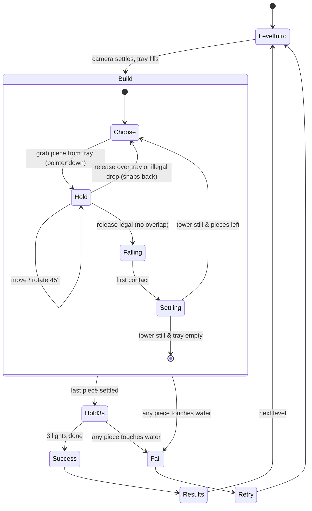
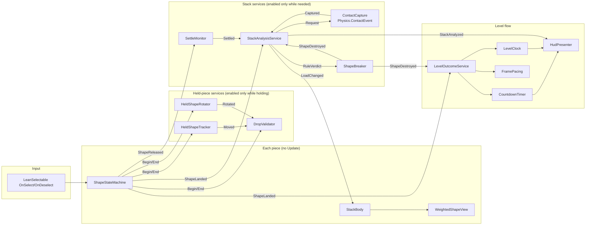
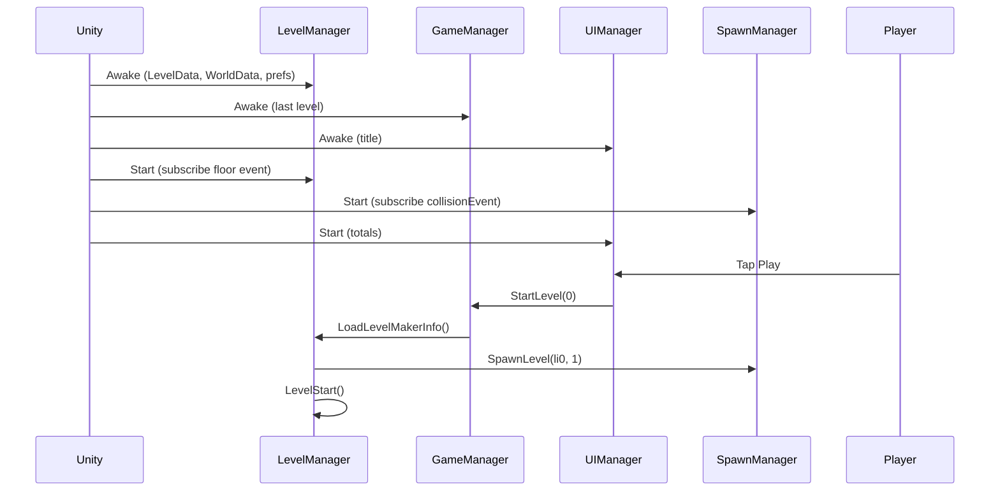
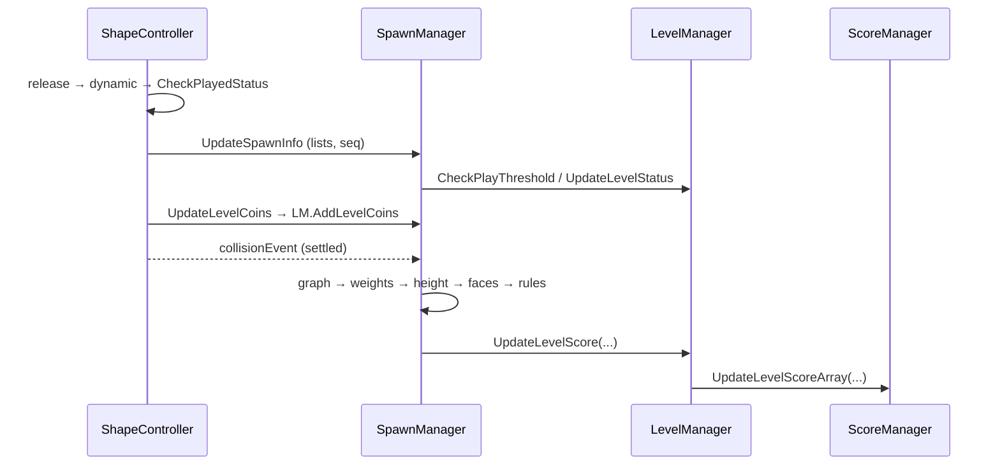
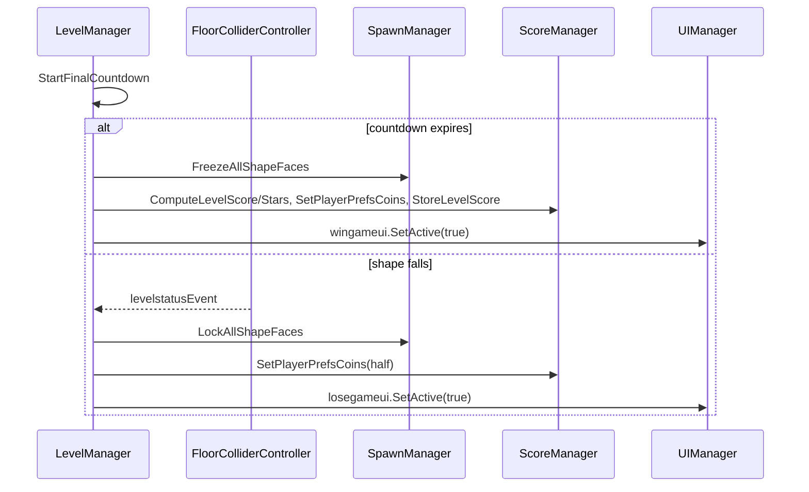
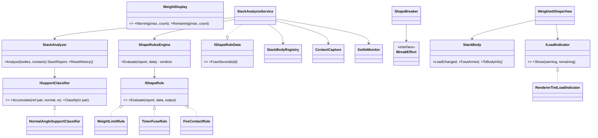

# COMBINED MARKDOWN - opus55

_Generated 2026-09-23 17:37:11 | 8 files | folder: D:\stuff\docs\taylor_fv\github\rayrite.github.io\bsh\docs\opus55_

## Contents

1. ArtOfBalance_FromScratch_Unity6.6_Implementation_Plan.md
2. FrameRate_EventDriven_DeepDive.md
3. Scripts_Dependency_Implementation_Plan.md
4. Scripts_Dependency_Map.md
5. Scripts_Master_Index.md
6. TestResults.md
7. Unity6_Upgrade_and_Performance_Modernization_Plan.md
8. WeightedShape_SOLID_EDD_DeepDive.md

---

<!-- ====================================================================== -->
<!-- FILE: ArtOfBalance_FromScratch_Unity6.6_Implementation_Plan.md -->
<!-- ====================================================================== -->

# Implementation Plan — Rebuilding *Art of Balance* from Scratch in Unity 6.6

**Scope:** a from-scratch rebuild focused on recreating the **visuals** and the **main gameplay loop** of Shin'en's WiiWare *Art of Balance* (2010).

**Date:** 2026-09-23.

**Companions:**
- [FrameRate_EventDriven_DeepDive.md](FrameRate_EventDriven_DeepDive.md): the runtime architecture to reuse.
- [WeightedShape_SOLID_EDD_DeepDive.md](WeightedShape_SOLID_EDD_DeepDive.md): the tested stacking core to reuse.
- [Scripts_Master_Index.md](Scripts_Master_Index.md): lessons from the current prototype.

---

## 0. Engine version decision

| Option | Version (Sep 2026) | Support | Use it for |
|---|---|---|---|
| **Unity 6.6** (recommended) | **6000.6.2f1**, released 2026-09-18; 6.6 launched 2026-09-01 | *Supported* Update release, supported until the next release | New project start: newest features, and the release Unity recommends for new and mid-cycle productions |
| Unity 6.7 LTS | alpha now (6000.7.0a6 appears in the 6.6.2 known-issues list); reported for **Q4 2026** | LTS (2 years) | **Upgrade target before content lock / release** |
| Unity 6.3 LTS | current LTS | until Dec 2027 | Fallback if a 6.6 regression blocks you |
| Unity 6.0 LTS | — | ends Oct 2026 | Do not start here |

**6.6 changes that matter to this project** (as reported at launch):

| Change | Why it matters here |
|---|---|
| **Fast Enter Play Mode is the default**: scenes reload, the script domain does not | Static fields and static events survive between Play sessions. The architecture below bans static mutable state, and every listener must unsubscribe in `OnDisable` |
| **Dictionary serialization** (`[SerializeField]` on `Dictionary<,>`) | Piece-catalogue lookups can be authored directly |
| **Compute Light Baker** for lightmaps, probes and Adaptive Probe Volumes | Much faster bakes of the backdrop dioramas |
| **Content Directories** (local content without up-front AssetBundle layout; works with Addressables APIs) | Per-world content loading |
| **Build Analysis window** | Tracking build size across worlds |
| **WebGPU production-ready** | Optional browser demo |
| **UI Toolkit backdrop-filter / drop-shadow** (reported by secondary coverage) | Frosted-glass pause and results panels without render textures. Verify in the 6.6 release notes |
| Preparation for **CoreCLR** in Unity 7 | Keep code free of reflection-heavy tricks and domain-reload assumptions |

**Policy:**
- Pin `6000.6.x` in `ProjectVersion.txt` and CI.
- Take patch releases every 2–4 weeks.
- Plan a one-week upgrade to **6.7 LTS** once it ships, before content lock.

Sources: [Unity 6000.6.2f1 release page](https://unity.com/releases/editor/whats-new/6000.6.2f1) · [Unity 6 support](https://unity.com/releases/unity-6/support) · [Unity 6 releases](https://unity.com/releases/unity-6) · [GameFromScratch: Unity 6.6 released](https://gamefromscratch.com/unity-6-6-released/) · [MGoddess: 6.6 launch and 6.7 LTS in Q4](https://www.mgoddess.com/news/7-lts-6-6-gamemeca-com) · [makaka.org version guide](https://makaka.org/unity-tutorials/best-version)

---

## 1. What we are recreating

### 1.1 Facts about the original (sourced)

| Aspect | What the sources say |
|---|---|
| Core premise | Stack a given set of blocks on a platform **floating in water** without any block falling into the water ([Wikipedia](https://en.wikipedia.org/wiki/Art_of_Balance), [Nintendo Life](https://www.nintendolife.com/reviews/2010/02/art_of_balance)) |
| Rotation | Blocks rotate in **45° steps** ([Wikipedia](https://en.wikipedia.org/wiki/Art_of_Balance)) |
| Win condition | After the last block is placed, the tower must stay up for **three seconds**, shown by **three lights at the bottom of the screen** ([Nintendo Life](https://www.nintendolife.com/reviews/2010/02/art_of_balance)); the countdown was shortened in later versions ([Wikipedia](https://en.wikipedia.org/wiki/Art_of_Balance)) |
| Piece supply | At least 3 pieces are shown at the bottom of the screen; extras beyond 3 are **greyed out** (review coverage) |
| Special pieces | **Weight-limited (glass) pieces** break after a certain number of pieces are stacked on them. **Timer pieces** start counting down once something is stacked on them and then break, so everything above falls ([Nintendo Life](https://www.nintendolife.com/reviews/2010/02/art_of_balance)) |
| Shapes | Various shapes, including **rounded edges** later on ([Nintendo Life](https://www.nintendolife.com/reviews/2010/02/art_of_balance)) |
| Level variants | Some levels set a **time** or **height** requirement; "super puzzles" with a time limit or a **platform swaying on the water** ([Nintendo Life](https://www.nintendolife.com/reviews/2010/02/art_of_balance), [Wikipedia](https://en.wikipedia.org/wiki/Art_of_Balance)) |
| Modes | Arcade (about 100 puzzles on WiiWare; later versions have more), **co-op** with a second player, **versus** split-screen race ([Nintendo Life](https://www.nintendolife.com/reviews/2010/02/art_of_balance), [Wikipedia](https://en.wikipedia.org/wiki/Art_of_Balance)) |
| Controls | Wii Remote pointer, "easy to pick up and perfectly implemented" ([Nintendo Life](https://www.nintendolife.com/reviews/2010/02/art_of_balance)) |
| Look and feel | Smooth-looking blocks; eccentric 3D backdrops (criticised for jagged edges); "serene soundtrack" ([Nintendo Life](https://www.nintendolife.com/reviews/2010/02/art_of_balance), [Wikipedia](https://en.wikipedia.org/wiki/Art_of_Balance)) |

### 1.2 Design interpretation (ours; confirm against footage before art lock)

- **Camera:** a side-on 3D view of the pedestal and water, with the tray of pieces at the bottom. Gameplay happens in one vertical plane (2.5D: pieces move in X/Y and rotate around Z).
- **Blocks:** chunky, softly bevelled, glossy "toy" solids with clean single colours per type. Glass pieces are translucent and show their remaining capacity as a number. Timer pieces show their seconds.
- **Scenes:** a calm lake or pool with gentle waves, a rock or stone pedestal, and a stylised diorama backdrop per world, with soft daylight and mild bloom.
- **Audio:** ambient, sparse music; tactile "clack" contacts; glass crack; a timer tick; a splash when a piece falls.
- **We improve on the original** where reviewers complained: clean anti-aliased backdrops, 60+ fps, touch, mouse and gamepad support.

### 1.3 Legal guardrail

Game mechanics are not protected, but names, logos, music, art and level layouts are. Use an **original title, art, music and levels** that evoke the feel. Do not trace screenshots or rip assets.

---

## 2. The main gameplay loop



Special-piece reactions run **inside `Settling`**, on the event-driven stack analysis:
- A glass piece with more pieces on it than its capacity **cracks and breaks**, and the pieces above fall. Any piece reaching the water means **Fail**.
- A timer piece with anything on it **arms its fuse**; when the fuse ends it breaks.

**Challenge modifiers** plug into the same loop as rules rather than new loops:
- **height target:** success requires `StackTopY ≥ target` during the hold;
- **time limit:** fail when the level clock ends before success;
- **swaying pedestal:** a kinematic platform animated in `FixedUpdate`.

---

## 3. Architecture

### 3.1 Assemblies

| Assembly (asmdef) | Contents | References |
|---|---|---|
| `AoB.Core` (`noEngineReferences: true`) | Stack analyzer, rules, scoring maths, level validation: **reuse `WeightLab~/Core` as-is** | — |
| `AoB.Gameplay` | Piece state machine, held-piece services, stack services, level flow, spawner, input, camera rig | Core, Input System, Cinemachine, DOTween (or Unity's native tweening) |
| `AoB.Presentation` | Piece views, water, splash, glass crack, HUD presenters, audio | Gameplay |
| `AoB.UI` | UI Toolkit screens (title, world map, level select, pause, results, settings) | Gameplay |
| `AoB.Data` | ScriptableObject definitions (`PieceDefinition`, `LevelDefinition`, `WorldDefinition`, `PhysicsTuning`, `ScoringRules`), save data | Core |
| `AoB.Editor` | Level editor window, piece collider baker, validators | all |
| `AoB.Tests.EditMode` / `AoB.Tests.PlayMode` | Core tests (port the 92 lab tests to NUnit), real-physics tests (reuse `RealPhysicsStackTests`) | all |

### 3.2 Runtime composition

```text
Bootstrap scene (persistent)            Game scene (per level, additive)           UI (UI Toolkit, additive)
├─ AppRoot (composition root)           ├─ LevelRoot (spawns from LevelDefinition)   ├─ HUD (tray, rotate, 3 lights)
│   FrameRateBootstrap / FramePacing    ├─ Pedestal(s) [StackBody: Platform]         ├─ Pause / Results / Retry
│   SaveService, AudioService           ├─ Water [WaterKillZone + water surface]     └─ World map / level select
│   Event channels (SO assets)          ├─ StackSystems (registry, capture, settle,
└─ CameraRig (Cinemachine)              │   analysis, breaker)
                                        ├─ HeldPieceServices (tracker, validator, rotator)
                                        └─ LevelFlow (outcome, clock, countdown)
```

**Rules:**
- **No singletons with static state.** Required by Fast Enter Play Mode, and good practice anyway. If a static is unavoidable, reset it in `[RuntimeInitializeOnLoadMethod(RuntimeInitializeLoadType.SubsystemRegistration)]`.
- **Every listener unsubscribes in `OnDisable`.** ScriptableObject channels survive scene reloads and play sessions.
- **No `Update` unless a component is enabled only while active** ([Deep Dive 1 §3](FrameRate_EventDriven_DeepDive.md)).

### 3.3 Data model

```csharp
public enum PieceKind { Regular, Glass, Timer }          // + later: Vanish (Wii U-style), Fire (this project's variant)

[CreateAssetMenu(menuName = "AoB/Piece")]
public sealed class PieceDefinition : ScriptableObject
{
    public string id;
    public GameObject prefab;              // mesh + baked convex colliders (see §5.2), StackBody, ShapeStateMachine, view
    public PieceKind kind;
    [Min(0)] public int glassCapacity = 2; // Glass: pieces it can hold (breaks at capacity + 1)
    [Min(0)] public float fuseSeconds = 3; // Timer
    [Min(0.1f)] public float massPerUnitArea = 1f;
    public Material materialOverride;      // per-world palettes via MaterialPropertyBlock colours instead, if possible
}

[CreateAssetMenu(menuName = "AoB/Level")]
public sealed class LevelDefinition : ScriptableObject
{
    public string id;
    public GameObject pedestalPrefab;      // rock formation(s): static colliders
    public PieceSlot[] pieces;             // order = tray order
    [Min(1)] public int visibleTraySlots = 3;
    public ChallengeKind challenge;        // Standard | HeightTarget | TimeLimit | SwayingPedestal
    public float heightTarget, timeLimitSeconds, swayAmplitude, swayPeriod;
    public float holdSeconds = 3f;         // the three lights
    public LevelSolution recordedSolution; // input replay recorded by the designer: proves solvability, drives regression tests
}

[System.Serializable] public struct PieceSlot { public PieceDefinition piece; public int glassCapacityOverride; public float fuseOverride; }
```

The save file is JSON in `Application.persistentDataPath` and holds: best result per level, stars, unlocked worlds, and settings. Do **not** use PlayerPrefs for progress; the prototype's PlayerPrefs keys are a migration input only.

---

## 4. Gameplay systems: implementation order and details

The first eight are reused or adapted from the tested and type-checked code in `Assets/Scripts/Docs/WeightLab~`.

| # | System | Source | Notes |
|---|---|---|---|
| 1 | `ShapeStateMachine` (Docked/Held/Returning/Dropping/Landed/Locked) | `WeightLab~/FrameRate` | Replace Lean Touch with the **Input System** (below) |
| 2 | `HeldPieceServices` + `HeldShapeTracker` + `DropValidator` + `HeldShapeRotator` | `WeightLab~/FrameRate` | 45° steps; illegal drops snap back; tint the held piece red while blocked |
| 3 | `SettleMonitor`, `ContactCapture`, `StackAnalysisService`, `ShapeBreaker`, `StackBody*` | `WeightLab~/Unity` | Glass = `WeightLimitRule` with `MaxLoad = capacity`; timer = `TimerFuseRule` |
| 4 | `StackAnalyzer`, rules, `WeightDisplay` | `WeightLab~/Core` | Unchanged; 92 tests come with it |
| 5 | `LevelOutcomeService`, `CountdownTimer` (3 lights), `LevelClock` | `WeightLab~/FrameRate` | Add `HeightTargetRule`/`TimeLimitRule` as outcome guards |
| 6 | `WaterKillZone` | `WeightLab~/FrameRate` | Also triggers splash VFX/SFX and a camera nudge |
| 7 | **Tray** (new) | — | See below |
| 8 | **Level spawner** (new) | — | Instantiates the pedestal, the tray pieces, and wires `Initialize(services, dockPos, scales, locked)` |
| 9 | **Camera framing** (new) | — | See below |
| 10 | **Swaying pedestal** (new) | — | Kinematic Rigidbody; `MovePosition`/`MoveRotation` in `FixedUpdate` from a sine curve; register as Platform; `SettleMonitor` ignores kinematic bodies, so the stillness check uses pieces only |

**Tray.** It shows `visibleTraySlots` (3) usable pieces; the rest are shown greyed (`ShapeState.Locked`). When a piece leaves the tray (`ShapeReleased`), the next locked piece unlocks and slides into the slot with a 0.2 s tween. This is event-driven: no polling.

**Camera framing.** Use a Cinemachine 3 `CinemachineCamera` with a Group Framing extension on a `CinemachineTargetGroup` made of the pedestal and the landed pieces. Add targets on `ShapeLanded` and remove them on `ShapeDestroyed`. Use damping of about 1 s so the camera rises gently as the tower grows, and keep the tray in a UI band that never overlaps the framing.

**Input** (Input System 1.x, one action map `Gameplay`):

| Action | Bindings | Behaviour |
|---|---|---|
| `Point` (Value, Vector2) | Pointer position, touch #0, gamepad virtual cursor | Moves the held piece |
| `Grab` (Button) | Mouse left, touch press, gamepad South | Pick up / release (release → `OnDeselected` logic) |
| `RotateCW` / `RotateCCW` (Button) | Mouse wheel, Q/E, shoulder buttons, on-screen buttons | `HeldShapeRotator.RotateStep(±1)` on `performed` |
| `Twist` (Value, float) | Two-finger twist (touch) | Accumulate; step 45° when |Δ| ≥ 30° |

**Pointer to world.** Raycast onto the gameplay plane (z = 0) with `Plane.Raycast`, and move the held **kinematic** piece with `Rigidbody.MovePosition` in `FixedUpdate`, only while held (1 object). Offset the grab point so the finger never hides the piece: the original Wii pointer sat above the piece, and on touch the piece should sit about 1.5 cm above the finger.

---

## 5. Physics design (the feel)

### 5.1 Settings

| Setting | Value | Why |
|---|---|---|
| Simulation | PhysX 3D, gameplay plane XY; pieces `FreezePositionZ \| FreezeRotationX \| FreezeRotationY` | Classic 2.5D stacking with 3D visuals and lighting |
| Fixed timestep | 1/60 s | Matches the 60 fps render; the tower is small |
| Default solver iterations | 8; **piece** `solverIterations` 20 (tune 12–30) | Stable towers without taxing everything |
| Sleep | default thresholds; nothing writes resting transforms | Settled towers cost nearly nothing |
| Contact offset | 0.01 (default); piece colliders ≥ 0.1 thick | Stable resting contacts |
| Physics material | friction 0.7 static / 0.6 dynamic, bounciness 0, *Average* combine | "Grippy toy blocks": towers can lean without skating |
| Mass | `massPerUnitArea × silhouette area` | Big pieces feel heavy; consistent with the mass-load option |
| Collision detection | ContinuousSpeculative while falling, Discrete once landed | Prevents tunnelling on fast drops |
| Interpolation | on while held or falling, off when landed | Smooth motion without the cost across the tower |
| Layers | Pieces, Pedestal, Water (trigger), Tray (no collisions) | Minimal broad-phase pairs |

### 5.2 Colliders for concave pieces

1. Model each piece as a **union of convex parts** (boxes, capsules, convex meshes). This is what the analyzer was tested against: L, T, +, ^, U, and multi-part convex pieces.
2. **Bake colliders into the prefab** with an editor tool that runs a convex decomposition (V-HACD-style, or hand-placed primitives for simple pieces). Never generate colliders in `Awake`: the prototype's `ExtendedColliders3D` does, and that creates ordering hazards.
3. Keep parts as **child colliders of one Rigidbody**, so PhysX reports one body with per-collider contacts. The analyzer merges them per body.

### 5.3 Tuning protocol

Record the designer's solution for every level as an input replay. A PlayMode test replays all of them after any physics change, and a level whose recorded solution stops succeeding **fails CI**. That turns "feel" tweaks into a safe, measurable process.

---

## 6. Visual recreation (URP, Unity 6.6)

### 6.1 Pipeline and quality tiers

| Setting | Mobile | PC / console |
|---|---|---|
| Render pipeline | URP (Forward+), Render Graph | same |
| Anti-aliasing | MSAA 2× + **STP** upscaling (render scale 0.8) | MSAA 4× (clean edges, which fixes the original's jaggies) |
| HDR / tonemapping | on / Neutral | on / ACES or Neutral per world |
| Shadows | 1 directional, 2 cascades, 25 m distance, soft low | 4 cascades, soft high |
| Global illumination | Baked **Adaptive Probe Volumes** for the diorama; pieces lit by probes and the sun | same, denser probes |
| Post-processing | Bloom (threshold 1.1, intensity 0.15), Colour Adjustments, soft Vignette | + subtle Depth of Field on the backdrop only (Gaussian, far) |
| Target | 60 fps | 120 fps |

### 6.2 Pieces: glossy toy material (Shader Graph, URP Lit)

- **Geometry:** a real bevel (0.04–0.08 units) authored in the DCC tool or ProBuilder, with smoothed normals on the bevels. The bevel is what makes the "smooth block" look, and it catches highlights.
- **Surface:** Smoothness 0.75–0.85, Metallic 0; base colour from a per-type palette via `MaterialPropertyBlock` (SRP-Batcher compatible). Add a subtle **Fresnel rim** (power 3, intensity 0.25) toward the sky colour, and a mild **top-down ambient occlusion** tint baked into vertex colour.
- **States:**
  - held piece: +10% emission, plus a soft drop shadow projected onto the tower (URP Decal Projector);
  - illegal drop: red rim;
  - locked in the tray: desaturated to 60% with alpha 0.6.

### 6.3 Glass pieces

- A transparent Lit shader: Smoothness 0.95, alpha 0.35, and **refraction** by sampling *Scene Color* with a screen UV offset of `normalWS.xy × 0.03`. Enable the *Opaque Texture* in the URP asset.
- Thin bright edges come from a Fresnel term, plus a baked edge mask in UV2.
- **Capacity number:** a world-space TextMeshPro (or UI Toolkit world-space panel) child that always faces the camera. `WeightedShapeView` updates it on `LoadChanged` only.
- **Critical state** (one more piece breaks it): a red pulse from a single tween.
- **Break:** swap to a pre-fractured mesh (pooled), apply an outward impulse, add a glass-shard particle burst and a crack SFX, and fade the shards out after 1.5 s.

### 6.4 Timer pieces

A digit decal (0–9 texture array) or TMP text on the face. On `FuseArmed(seconds)`:
- the digits count down at one change per second, from one tween;
- a radial **fill ring** runs in the shader through a `_Fill` property block value;
- the tick SFX speeds up in the last second.

### 6.5 Water (the signature element)

URP has no built-in water system (Unity's water system is HDRP), so build a custom Shader Graph surface:

| Layer | Recipe |
|---|---|
| Surface waves | Two scrolling normal maps, one large and slow and one small and fast, plus optional vertex displacement from a sum of 2 Gerstner waves (low amplitude) |
| Colour by depth | *Scene Depth* minus fragment depth → lerp from a shallow turquoise to a deep teal (enable the *Depth Texture*) |
| Shoreline and pedestal foam | Depth difference < 0.15 → animated foam noise |
| Reflection | Reflection probe of the backdrop (baked) plus Fresnel; optionally a planar-reflection camera on high tier only |
| Refraction | Scene Color offset by the normal (as for glass) |
| Splash | Pooled Particle System burst + expanding ripple ring (decal or shader) + SFX; triggered by `ShapeDestroyed(Fell)` |
| Swaying levels | The pedestal bobs and tilts; add matching wave amplitude so the motion reads as "floating" |

### 6.6 Pedestal and backdrops

- **Pedestal:** sculpted rock or stone formations with a flat-ish but slightly irregular top, matching the "small rock formations in a bowl" description. A triplanar rock material has moss or sand variants per world.
- **Backdrops:** one diorama per world, with a stylised, readable silhouette (e.g. a lakeside, zen garden, desert oasis, snowy lake, night lanterns, cloud temple). Each has:
  - baked APV lighting (fast with 6.6's Compute Light Baker);
  - distance fog, layered for parallax, and **low contrast behind the tower** so pieces always read;
  - a gradient skybox and a slow cloud-layer scroll.
- **Readability rule:** piece palettes must stay at least 30% luminance-contrast from the backdrop in each world. Automate it with an editor check that samples a screenshot.

### 6.7 UI (UI Toolkit)

- **HUD:**
  - the **tray bar** at the bottom: 3 active slots and greyed extras;
  - **rotate buttons** (touch);
  - the **three countdown lights**, centred at the bottom as in the original;
  - the level number and, when relevant, the height target line drawn in world space.
- **Screens:** title, world map, level grid with star or "clear" marks, pause, results, settings. Use 6.6's backdrop-filter blur for pause and results panels if confirmed.
- **Typography:** one rounded sans-serif family; large hit targets (≥ 9 mm on touch).

### 6.8 Audio

- Ambient music per world, with 2–3 layers cross-faded by tension (tower height or countdown).
- Contact "clack" SFX pitched by impact impulse, rate-limited by the contact capture so they aren't spammed.
- Glass crack, timer tick, splash, and three rising "light" chimes during the hold.

---

## 7. Milestones

Estimates assume 1 programmer, 1 artist and part-time audio; days are working days.

| Milestone | Duration | Deliverables | Exit criteria |
|---|---|---|---|
| **M0 Pre-production** | 5 d | Project on 6000.6.x (URP 3D template), repo + CI (build + EditMode tests), asmdefs, event-channel assets, input map, reference board, grey-box pedestal and water plane | CI green; blank level runs at 60 fps on the reference phone |
| **M1 Core loop (grey-box)** | 12 d | Piece state machine, held-piece services, tray (3 visible), drop validation, physics tuning v1, settle, water kill, 3-light hold, win/lose/retry, 5 grey-box levels | A new player finishes 5 levels without help; no per-frame GC; frame time ≤ 8 ms |
| **M2 Special pieces** | 6 d | Glass (capacity number, crack, break), timer (fuse, countdown), stack services, rules, views | All 92 core tests + real-physics PlayMode suite green (§8) |
| **M3 Level pipeline** | 10 d | `LevelDefinition`, level editor window (place pedestals, order the tray, set the challenge), solution recorder and replayer, validation (solvable, readable, the tray fits), first 30 levels | Every level has a recorded solution that passes in CI |
| **M4 Visual slice** | 18 d | Piece shader + bevelled piece set, glass, timer, water shader + splash, pedestal set, **one complete world** diorama with APV lighting and post, camera framing | Side-by-side art review against the original's footage (feel, not copy) |
| **M5 UI and audio** | 10 d | UI Toolkit HUD and screens, save system, settings (audio, handedness, high-fps toggle), music and SFX pass, haptics | Usability test: tray, rotate and hold feedback understood without a tutorial |
| **M6 Content** | 20 d | Remaining worlds (dioramas + palettes), 100 levels with a difficulty curve, challenge levels (height, time, sway) | Difficulty curve playtest; completion telemetry per level |
| **M7 Performance and platforms** | 8 d | Build Profiles per platform, quality tiers, profiling pass (§9), memory and load-time pass, Content Directories per world | Targets in §9 met on the device matrix |
| **M8 Optional modes** | 10 d | Local co-op (two cursors on one tower); versus split-screen (one additive scene per player, each with its own `PhysicsScene`) | Two-player sessions stable at target fps |
| **M9 LTS upgrade, polish, release** | 10 d | Upgrade to 6.7 LTS, bug bash, store assets | Release candidate |

**Total:** about 109 working days core (M0–M7 + M9), plus 10 for M8.

---

## 8. Testing strategy

| Layer | What | Tooling |
|---|---|---|
| Core logic | Stack analyzer, rules, display maths, scoring: port the 92 WeightLab tests to NUnit EditMode | Unity Test Framework |
| Real physics | `RealPhysicsStackTests`: compound L/T/+/^/U pieces under PhysX, normal-sign calibration, impulse split | UTF PlayMode, batch mode in CI (licensed runner) |
| Level regression | Every level's recorded solution must still win; runs after physics, collider or piece changes | PlayMode + input replay |
| Performance | `Measure.Frames()` on replays; fail on p95 frame time or GC regressions | Performance Testing package + Profile Analyzer |
| Visual | Golden screenshots per world at fixed camera and time | Graphics Test Framework |
| Devices | Low / mid / high Android, 2 iPhones, PC, gamepad | Manual matrix per milestone |

---

## 9. Performance budget

| Metric | Mobile (mid-range 2022) | PC |
|---|---|---|
| Frame rate | 60 fps (p95 ≤ 16.6 ms) | 120 fps |
| Main-thread scripts | ≤ 1 ms idle, ≤ 2 ms dragging | ≤ 1 ms |
| Physics | ≤ 2 ms at 30 pieces | ≤ 1 ms |
| Stack analysis | ≤ 0.1 ms per settle (measured core: ~10 µs at 15 pieces) | same |
| GC allocations | **0 B per frame** in steady state | same |
| Draw calls / SetPass | ≤ 120 / ≤ 40 (SRP Batcher; property blocks, no material instances) | — |
| Memory | ≤ 450 MB | — |
| Load time per level | ≤ 1.5 s | ≤ 0.5 s |

The frame-rate architecture from [Deep Dive 1](FrameRate_EventDriven_DeepDive.md) makes these achievable by construction:
- nothing runs per frame unless it is active;
- the held-piece services act on one object;
- the analysis runs only when the stack settles.

---

## 10. Risks

| Risk | Impact | Mitigation |
|---|---|---|
| Physics feel differs from the original (too slippery, too stable, jitter) | High | Tuning protocol with replays (§5.3); per-piece solver iterations; friction presets; early playtests in M1 |
| 6.6 is an Update release (shorter support window) | Medium | Pin patches; budgeted 6.7 LTS upgrade (M9); keep 6.3 LTS as a fallback branch |
| Fast Enter Play Mode surprises (stale statics, double subscriptions) | Medium | No static mutable state; `OnDisable` unsubscription enforced in code review and by an analyzer rule |
| Content volume (100 levels) | High | Level editor + solution recorder in M3; difficulty tagging; reuse pedestal kits |
| Readability of glass or timer pieces against backdrops | Medium | Contrast check tool; strong silhouettes; numbers always camera-facing |
| IP similarity | Medium | Original name, art, music and levels (§1.3) |
| Transparent glass + water overdraw on low-end phones | Medium | Glass refraction only on mid and high tiers; opaque "frosted" fallback on low |

---

## 11. Definition of done (vertical slice, end of M4)

- [ ] One world with 10 levels plays start to finish on phone and PC at the target frame rate, with 0 B/frame GC.
- [ ] Pieces: at least 8 shapes, including L, T, +, ^ and U concave pieces, plus glass and timer variants.
- [ ] Loop: tray (3 visible) → grab → 45° rotate → legal/illegal drop → settle → glass/timer reactions → 3-light hold → success/fail → retry/next.
- [ ] Visuals: bevelled glossy pieces, refractive glass with capacity numbers, timer countdown, custom water with foam and splash, rock pedestal, lit diorama, bloom and grading.
- [ ] Tests: core (NUnit), real-physics PlayMode, level-solution replays and performance tests all green in CI.


---

<!-- ====================================================================== -->
<!-- FILE: FrameRate_EventDriven_DeepDive.md -->
<!-- ====================================================================== -->

# Deep Dive 1 — Raising the Frame Rate with Event-Driven Design (EDD)

**Project:** Balance Stack Hero (an *Art of Balance* clone) · **Current engine:** Unity 2023.1.6f1 · **Target:** Unity 6.x (see the upgrade plan) · **Date:** 2026-09-23

**Companion documents:**
- [Scripts_Master_Index.md](Scripts_Master_Index.md): architecture atlas.
- [Unity6_Upgrade_and_Performance_Modernization_Plan.md](Unity6_Upgrade_and_Performance_Modernization_Plan.md), §9–11: the audit this document turns into code.
- [WeightedShape_SOLID_EDD_DeepDive.md](WeightedShape_SOLID_EDD_DeepDive.md): the stack/weight subsystem.
- [ArtOfBalance_FromScratch_Unity6.6_Implementation_Plan.md](ArtOfBalance_FromScratch_Unity6.6_Implementation_Plan.md): the from-scratch plan.

**Code produced for this document:** [`WeightLab~/FrameRate/`](WeightLab~/FrameRate) (11 gameplay components) and [`WeightLab~/Unity/`](WeightLab~/Unity) (stack-analysis adapters).

> The folder ends in `~`, so Unity ignores it: nothing in it is compiled into the game until you move it into `Assets/Scripts`.

---

## 0. How to read this document (and what was verified)

| Claim type | Label used | Meaning |
|---|---|---|
| Read directly from the source, prefabs or ProjectSettings | **Confirmed** | File and line cited |
| Follows from how Unity/PhysX work, not measured here | **Inferred** | Verify with the Profiler steps in §10 |
| Code in this document | **Type-checked** | Compiled with Roslyn (C# 9) against the Unity 2023.1.6f1 engine DLLs, the project's own Lean Touch sources, DOTween and uGUI via [`typecheck-unity.sh`](WeightLab~/typecheck-unity.sh). Result: `Type-check OK` for all three assemblies |
| Frame-time numbers on device | **Not measured** | This machine has no activated Unity licence, so nothing could be profiled in Play Mode. §10 gives the exact measurement protocol |

---

## 1. Executive summary

The game spends its frame budget on **polling**: code that runs every frame to find out whether something happened. The design goal is to invert this. **Nothing runs unless an event says it must**, and the few things that must be continuous (the held piece following the finger, a countdown) run only while they are active, on one object rather than on every piece.

| # | Change | Old (per frame) | New | Expected effect |
|---|---|---|---|---|
| 1 | **Frame-rate policy** | No `Application.targetFrameRate` anywhere, so mobile runs at the 30 fps default (Confirmed absence) | `FrameRateBootstrap`: display refresh rate capped at 120, and `OnDemandRendering` on menus | **2× ceiling** on mobile (30 → 60) |
| 2 | **Shape state machine** | `ShapeController.Update` + `LateUpdate` on **every** piece; `GetComponents<Collider>()` allocation per docked piece per frame | `ShapeStateMachine`: **no Update at all**; physics and scale set once per transition | ≈ 2·N callbacks → 0 |
| 3 | **Lean gestures only while held** | `LeanDragTranslate.Update` + `LeanTwistRotateAxis.Update` on **every** piece, each writing the transform every frame | Enabled on the held piece only | 2·N callbacks → 2; stops per-frame transform writes on resting Rigidbodies |
| 4 | **Drop validator** | A new coroutine **every drag frame**, each scanning every collider pair with `ComputePenetration` | Dirty flag; ≤ 1 broad-phase + narrow-phase check per physics step, only while dragging; event on change | Up to 60 coroutines/s and 60 scans/s → ≤ 50 cheap checks/s while dragging, 0 otherwise |
| 5 | **Settle detection** | Two 0.1 s polling coroutines per piece | One `SettleMonitor`, disabled until disturbed | N coroutines → 1 component, on only while settling |
| 6 | **Stack analysis** | Full O(n²c²) AABB recompute + infinite-tween creation on every settle event | Contact-based analyzer: ~10 µs, 0 B, runs only on settle ([Deep Dive 2](WeightedShape_SOLID_EDD_DeepDive.md)) | Removes the settle-time spikes and the tween leak |
| 7 | **HUD/clock/countdown** | `TimeSpan` + `string.Format` every frame; `ToString("N0")` every countdown frame | `LevelClock` / `CountdownTimer` raise per-second events; `HudPresenter` writes text only on change | 0 B/frame GC from the HUD |
| 8 | **Level outcome** | 5 booleans polled in `LevelManager.Update`; win and lose can both fire | `LevelOutcomeService`: explicit phase, the first terminal event wins | Correctness and less per-frame branching |
| 9 | **Debug input** | 31 `Input.GetKey` polls in `SpawnManager.Update` plus 4 in `GameManager.Update`, in release builds | Development builds only, event-based | 35 polls/frame → 0 in release |
| 10 | **Rendering** | `renderer.material` instance per piece (breaks batching); outline effect enabled on almost every piece; outline tweens leak | `MaterialPropertyBlock`; outline only on pieces that need it; one reusable tween | Fewer draw calls and passes; stable tween count |

**Per-frame callback count** (Confirmed from code, for a level with N = 14 pieces and 3 platforms):

| State | Before | After |
|---|---|---|
| Idle (no finger down, tower at rest) | 4 × 14 (shape + 2 Lean) + GameManager + LevelManager + SpawnManager ×2 + 9 empty `Update`s + 3 platform `Update`s + LeanTouch ≈ **73** | LeanTouch + LevelClock = **2** |
| Dragging a piece | the same 73, **plus one coroutine and one full penetration scan per frame** | 2 + drag + twist + tracker + rotator = **6**, and ≤ 1 validator check per physics step |
| Tower settling after a drop | 73 + N polling coroutines | 2 + one `SettleMonitor.FixedUpdate` |

---

## 2. Where the frame time goes today (Confirmed inventory)

### 2.1 Per piece, every frame (× N ≈ 9–14 pieces per level)

| Source | What it does every frame | Evidence |
|---|---|---|
| `ShapeController.Update` | Copies `lts.IsSelected` into two flags; reads `col.bounds.max.y` while resting or touching; moves the dormant `txtpop` | [ShapeController.cs:225-296](../ShapeController.cs#L225) |
| `ShapeController.LateUpdate` | Dock-line test; rebuilds physics mode from flags. **Docked pieces call `SetColliderTriggerStatus(false)` every frame**, which calls `GetComponents<Collider>()` (a new array each time). Also starts `Release()` whenever `isreleasing` is false, so a docked piece re-tweens itself back to the dock about every 0.5 s (3 DOTweens, plus `new WaitForSeconds` and `new WaitForEndOfFrame`) | [ShapeController.cs:298-420](../ShapeController.cs#L298), [812-820](../ShapeController.cs#L812), [422-481](../ShapeController.cs#L422) |
| `LeanDragTranslate.Update` | `Use.GetFingers()`, gesture math, and **`transform.localPosition = …` every frame**, even when nothing moved | [Lean/Touch/Extras/LeanDragTranslate.cs](../../Lean/Touch/Extras/LeanDragTranslate.cs) (Update) |
| `LeanTwistRotateAxis.Update` | `Use.GetFingers()` and **`transform.Rotate(axis, 0)` every frame** | [Lean/Touch/Extras/LeanTwistRotateAxis.cs](../../Lean/Touch/Extras/LeanTwistRotateAxis.cs) |
| Outline tweens | Every stack pass, `SetFaceProperties` starts **new** infinite `DOFade` loops on loaded weighted and timer pieces, and never kills the old ones. DOTween then updates a growing list of tweens every frame | [ShapeController.cs:727-766](../ShapeController.cs#L727) |

> **Inferred, and high impact:** the two Lean components write the transform of a **Rigidbody** every frame on every piece, including pieces resting in the tower. With `autoSyncTransforms` off (the project setting, Confirmed in `DynamicsManager.asset`), Unity pushes every changed transform into PhysX before the next simulation step. Moving a body that way normally **wakes it up**. The likely result is that a settled tower never sleeps, so PhysX keeps solving every contact of every piece at 50 Hz, with **30 solver iterations** (Confirmed, 5× Unity's default). Verify with the Profiler's *Physics › Active Dynamic Bodies* counter (§10). If confirmed, simply disabling the Lean components on non-held pieces may be the single largest physics saving.

### 2.2 Managers, every frame

| Source | Work | Evidence |
|---|---|---|
| `GameManager.Update` | 4 `Input.GetKey` polls. While the finger drags: **`StartCoroutine(ProcessCtrlGesture())` on every drag frame**; each coroutine runs `SpawnManager.CalculateCurShapePenetration()` (every held collider × every platform/played collider, with `GetComponents` allocations) and then allocates a `WaitForSeconds`. `StopAndRotate()` accumulates degrees and calls `GetComponent<LeanTwistRotateAxis>()` every frame | [GameManager.cs:109-185](../GameManager.cs#L109), [318-325](../GameManager.cs#L318), [355+](../GameManager.cs#L355), [SpawnManager.cs:1836-1887](../SpawnManager.cs#L1836) |
| `LevelManager.Update` | Clock: `TimeSpan.FromSeconds` + `string.Format` + UI text write **every frame**. Countdown: `ToString("N0")` every frame; win/lose checks by polling flags | [LevelManager.cs:82-113](../LevelManager.cs#L82) |
| `SpawnManager.Update` | 31 `Input.GetKey` polls (Level Maker hotkeys), shipped in release builds | [SpawnManager.cs:238-593](../SpawnManager.cs#L238) |
| Empty methods | 9 empty `Update`/`LateUpdate` (Camera, DockCollider, FloorCollider, Loader, PlatformController × platforms, RdWAnalytics, ScoreEffect, ScoreManager, UIManager) and an empty `SpawnManager.LateUpdate`. Each still costs a native→managed call per object | [Unity6 plan §10](Unity6_Upgrade_and_Performance_Modernization_Plan.md) |

### 2.3 Event-time spikes (not per frame, but felt as hitches)

- **Every settle or bump:** `ShapeController.collisionEvent` → `SpawnManager.GetStackInformation` runs a full AABB graph rebuild, an "above" walk, `ToArray` ×5+, `GetComponents` per pair and string concatenation. The lab port measures **240 µs and ~10 KB of garbage per pass** for a 15-piece tower, rising to **5.4 ms / 236 KB at 66 pieces** ([Deep Dive 2 §8](WeightedShape_SOLID_EDD_DeepDive.md)).
- **Explosions** re-enter that pass (`ShapeDestroyer` → `UpdateStackInformation`).

### 2.4 Project settings that cap or tax the frame (Confirmed)

| Setting | Value | File | Note |
|---|---|---|---|
| `Application.targetFrameRate` | never set | — | Mobile default is 30 fps |
| Default solver iterations | **30** | `DynamicsManager.asset:12` | 5× default; every contact pays for it |
| Fixed timestep | 0.02 s (50 Hz) | `TimeManager.asset:6` | Fine, but a 60 fps render needs interpolation on moving pieces |
| Sleep threshold | 0.005 | `DynamicsManager.asset:10` | Unity's default; bodies sleep once still, **unless something keeps moving them** (see §2.1) |
| Auto-sync transforms | off | `DynamicsManager.asset:22` | Good; do not turn it on |
| Reuse collision callbacks | on | `DynamicsManager.asset:23` | Good |
| Incremental GC | **off** | `ProjectSettings.asset:847` | Every garbage collection is a full stop-the-world spike |
| Shape Rigidbody CCD | ContinuousSpeculative | shape prefabs (`m_CollisionDetection: 3`) | Fine; relevant to contact separation in Deep Dive 2 |

---

## 3. EDD principles applied to Unity

1. **A disabled `MonoBehaviour` costs nothing per frame.** Unity does not call `Update`, `LateUpdate` or `FixedUpdate` on disabled components. The core pattern here is *"enable only while needed"*: `enabled = false` in `Awake`, `enabled = true` when an event starts the activity, and `enabled = false` when it ends.
2. **Turn "N objects poll" into "1 service reacts".** Only one piece can be held at a time, so dock-line tracking, drop validation and auto-rotation are single scene services bound to the held piece (`HeldPieceServices`), not per-piece `LateUpdate`s.
3. **Use the right event mechanism for the scope:**

   | Scope | Mechanism | Used for |
   |---|---|---|
   | Inside one object or subsystem | Plain C# `event Action<…>` | `StackBody.LoadChanged`, `ShapeStateMachine.StateChanged`, `DropValidator.CanDropChanged` |
   | Across systems, Inspector-wired | **ScriptableObject event channels** (`EventChannel<T>`) | `ShapeReleased`, `ShapeLanded`, `ShapeDestroyed`, `StackAnalyzed`, `RuleVerdict` |
   | UI buttons and vendor components | `UnityEvent` | Rotate buttons, Lean's `OnSelect`/`OnDeselect` |
   | Engine physics | Physics callbacks (`OnCollisionEnter`, `OnTriggerEnter`) and the batched `Physics.ContactEvent` | Landing, water, stack contacts |

   **Avoid static events.** Today's two static events are never unsubscribed, and with Unity 6.6's default *Fast Enter Play Mode* (no domain reload) static invocation lists survive between Play sessions.
4. **Subscribe in `OnEnable`, unsubscribe in `OnDisable`.** No script in the current project has either method (Confirmed). ScriptableObject channels outlive scenes, so a missing unsubscribe leaks a destroyed listener.
5. **Coalesce and mark dirty.** Many triggers in one step (finger moved, piece rotated, crossed the dock line) set a flag, and the expensive work runs once per step (`DropValidator`, `ContactCapture.Request()`).
6. **Payloads carry what listeners need** (`ShapeDestroyedEvent(body, reason)`, `WeightChange(id, old, new)`), so listeners do not query managers back. That removes the bidirectional Inspector references.
7. **Idempotent terminal events.** The first `Won`/`Lost` wins (`LevelOutcomeService`) and a piece breaks at most once (`ShapeBreaker`).
8. **Defer destructive work out of analysis passes.** Rules emit verdicts; one component applies them. `Destroy` is already deferred to the end of the frame, so there is no re-entrancy.

---

## 4. Target architecture



---

## 5. Refactor recipes (before → after)

Every "after" block below is an excerpt from a type-checked file in `WeightLab~/FrameRate` or `WeightLab~/Unity`.

### 5.1 Frame-rate policy: 30 fps → display rate

**Before:** nothing sets a target, so iOS and Android render at 30 fps.

**After** ([FramePacing.cs](WeightLab~/FrameRate/FramePacing.cs)):

```csharp
public static class FrameRateBootstrap
{
    public const int MaxFps = 120;

    [RuntimeInitializeOnLoadMethod(RuntimeInitializeLoadType.BeforeSceneLoad)]
    private static void Apply()
    {
        QualitySettings.vSyncCount = 0;
        double hz = Screen.currentResolution.refreshRateRatio.value;
        int target = hz >= 59 ? (int)System.Math.Round(hz) : 60;
        Application.targetFrameRate = Mathf.Min(target, MaxFps);
    }
}

public sealed class FramePacing : MonoBehaviour   // menus/results render at half rate; input and physics unaffected
{
    [SerializeField] private LevelOutcomeService outcome;
    [SerializeField, Range(1, 4)] private int idleRenderInterval = 2;
    private void OnEnable()  => outcome.PhaseChanged += OnPhase;
    private void OnDisable() => outcome.PhaseChanged -= OnPhase;
    private void OnPhase(LevelPhase phase)
    {
        bool gameplay = phase == LevelPhase.Playing || phase == LevelPhase.Countdown;
        OnDemandRendering.renderFrameInterval = gameplay ? 1 : idleRenderInterval;
    }
}
```

**Notes:**
- 120 Hz doubles the CPU and GPU work per second compared with 60 Hz. Ship 60 as the default on phones and offer a "High frame rate" toggle, which is kinder to battery and heat.
- On Unity 6, pair this with **Adaptive Performance** (Samsung/Android) to step down under thermal pressure.

### 5.2 `ShapeController.Update`/`LateUpdate` → `ShapeStateMachine` (no per-frame code)

**Before:** 12 boolean flags (`isdocked`, `isdropping`, `isinplayfield`, `hasbeenplayed`, `isselected`, `ismoving`, `isreturned`, `isresting`, `islsts`, `isreleasing`, `istouching`, `seqnumset`) re-derived every frame. Physics mode, trigger state and scale were re-applied every frame.

**After:** explicit states. All side effects happen **once on entry**.

| State | Entered by | One-time actions on entry |
|---|---|---|
| `Locked` | spawner (`locked`) | kinematic, solid, selection off |
| `Docked` | spawner / end of return tween / `Unlock()` | kinematic, solid, Lean drag+twist **off**, selectable on |
| `Held` | `LeanSelectable.OnSelect` | kinematic + trigger ("ghost"), Lean drag+twist **on**, grow tween, `HeldPieceServices.Begin` |
| `Returning` | `OnDeselect` with an illegal drop | services end, single DOTween `Sequence` back to the dock → `Docked` |
| `Dropping` | `OnDeselect` with a legal drop | dynamic, solid, interpolation on, one raycast for drop height, raise `ShapeReleased` |
| `Landed` | `OnCollisionEnter` while `Dropping` | interpolation off, raise `ShapeLanded` (registry + analysis + level flow) |

```csharp
private void OnEnable()
{
    selectable.OnSelect.AddListener(OnSelected);      // Lean's UnityEvent<LeanFinger>
    selectable.OnDeselect.AddListener(OnDeselected);
}
private void OnDeselected()
{
    if (State != ShapeState.Held) return;
    bool canDrop = _services.Tracker.InPlayfield && _services.Validator.EvaluateNow();   // one synchronous check at release
    Enter(canDrop ? ShapeState.Dropping : ShapeState.Returning);
}
private void OnCollisionEnter(Collision collision)
{
    if (State == ShapeState.Dropping) Enter(ShapeState.Landed);   // replaces the 0.1 s CheckPlayedStatus polling
}
private void SetGestures(bool on) { drag.enabled = on; twist.enabled = on; }   // Lean Update() runs only on the held piece
private void SetPhysics(bool kinematic, bool trigger)
{
    _rb.isKinematic = kinematic;
    for (int i = 0; i < _colliders.Length; i++) _colliders[i].isTrigger = trigger;   // cached once in Awake
}
```

**Also fixed on the way:**
- `FindObjectOfType<SpawnManager>()` and `GameObject.Find("DockCollider")` in `Start` are replaced by `Initialize(services, dockPosition, …)`, called by the spawner.
- Colliders are cached in `Initialize`, **not in `Awake`**. The Plus prefab's colliders are created by `ExtendedColliders3D.Awake` at runtime (Confirmed), and Unity does not guarantee `Awake` order between components on the same object.
- The docked re-tween loop is gone.
- `_tween?.Kill()` before every new tween means at most one tween per piece.

### 5.3 Dock line → `HeldShapeTracker` (1 object, only while holding)

**Before:** every piece tested `transform.position.y > spawnmgr.dockloc` in `LateUpdate` and wrote `spawnmgr.curshape`.

**After** ([HeldShapeTracker.cs](WeightLab~/FrameRate/HeldShapeTracker.cs)): enabled in `Begin`, disabled in `End`. It raises `Moved` only when the position changed and `DockLineCrossed` only when the side changed. `SpawnManager.curshape` disappears: `HeldPieceServices.Held` is the single source of truth.

### 5.4 Drop legality → `DropValidator` (dirty flag + broad phase)

**Before:**

```csharp
// GameManager.Update — every frame the finger moves:
if (lte.dragdelta.magnitude > 0.0f) { …; StartCoroutine(ProcessCtrlGesture()); }
// ProcessCtrlGesture → spawnmgr.CalculateCurShapePenetration() → for every held collider × every platform collider ×
// every played collider: GetComponents<Collider>() + Physics.ComputePenetration(...) → canplayshape (global bool)
```

**After** ([DropValidator.cs](WeightLab~/FrameRate/DropValidator.cs)):

```csharp
private void FixedUpdate()                       // component enabled only while a piece is held
{
    if (!_dirty) return;                         // nothing moved or rotated since the last check
    _dirty = false;
    Publish(Evaluate());                         // raises CanDropChanged only when the answer flips
}
private bool Evaluate()
{
    for (int i = 0; i < _held.Length; i++)
    {
        Collider mine = _held[i];
        Bounds b = mine.bounds;
        int n = Physics.OverlapBoxNonAlloc(b.center, b.extents, _hits, Quaternion.identity, stackLayers, QueryTriggerInteraction.Ignore);
        for (int k = 0; k < n; k++)              // narrow phase only on real neighbours
        {
            Collider other = _hits[k];
            if (other.attachedRigidbody != null && other.attachedRigidbody == _heldBody) continue;
            if (Physics.ComputePenetration(mine, mine.transform.position, mine.transform.rotation,
                                           other, other.transform.position, other.transform.rotation, out _, out float depth)
                && depth > allowedPenetration) return false;
        }
    }
    return true;
}
```

**UX bonus:** `CanDropChanged` can tint the held piece red while the drop is illegal. The original game gives similar "can't place" feedback; today the player finds out only when the piece snaps back.

### 5.5 Rotation → `HeldShapeRotator`

**Before:** `StopAndRotate()` accumulated `ctrlrotspeed * deltaTime` every frame even with nothing held. It called `GetComponent<LeanTwistRotateAxis>()` every frame, and the arrow keys were polled 4× per frame.

**After** ([HeldShapeRotator.cs](WeightLab~/FrameRate/HeldShapeRotator.cs)):
- Auto-rotation runs only while a piece is held and the finger is still.
- `RotateStep(±1)` is bound directly to the on-screen buttons (a UI event) and to Input System actions (`performed` callback).
- Every step raises `Rotated`, which marks the validator dirty. Art of Balance rotates in **45° steps**, and so does this.

### 5.6 Settle detection → `SettleMonitor`

**Before:** each dropped piece ran `CheckPlayedStatus` and later `CheckReplayStatus`, polling every 0.1 s with a new `WaitForSeconds` each time. Any piece touched by another restarted its coroutine.

**After** ([SettleMonitor.cs](WeightLab~/Unity/SettleMonitor.cs)): one component, **disabled** until `Disturb()`, which is called by `ShapeReleased`, `ShapeLanded` and `ShapeDestroyed`. While enabled, one `FixedUpdate` checks the registered bodies (skipping sleeping and kinematic ones). After `holdSeconds` of stillness it raises `Settled` **once** and disables itself.

### 5.7 Stack analysis trigger → `ContactCapture` + `StackAnalysisService`

- **Steady-state cost:** one delegate call per physics step that returns immediately (`if (!_requested) return;`).
- **On `Settled`:** the registered bodies are woken for one step (sleeping PhysX pairs report no contacts), `Request()` is called, and the next step's `Physics.ContactEvent` batch is copied without allocation and analyzed in ~10 µs.
- Only pieces whose load changed receive `LoadChanged`.

Full design in [Deep Dive 2](WeightedShape_SOLID_EDD_DeepDive.md).

### 5.8 Clock, countdown and outcome

**Before:** `LevelManager.Update`:

```csharp
if ((!countdownstarted) && (levelstarted)) { levelElapsedTime += Time.deltaTime; UpdateGameClockDisplay(); } // TimeSpan + string.Format every frame
if ((countdownstarted) && (!levelstarted)) { elapsedTime -= Time.deltaTime; cdt.text = elapsedTime.ToString("N0"); … LevelWon(); … LevelLost(); }
```

**After:**
- [LevelClock.cs](WeightLab~/FrameRate/LevelClock.cs): enabled only while playing; one int compare per frame; `SecondTicked(s)` once per second.
- [CountdownTimer.cs](WeightLab~/FrameRate/CountdownTimer.cs): the original's **three lights**; `Tick(3,2,1,0)` and `Expired`.
- [HudPresenter.cs](WeightLab~/FrameRate/HudPresenter.cs): caches `m:ss` strings once, toggles the light objects, and updates the height label only when it changes. With TextMeshPro, use `SetText("{0}:{1:00}", m, s)`, which does not allocate.
- [LevelOutcomeService.cs](WeightLab~/FrameRate/LevelOutcomeService.cs): `Idle → Playing → Countdown → Won | Lost`. The first terminal event wins, which fixes the double `LevelLost` and win+lose in one frame. Only `BreakReason.Fell` loses; a glass piece breaking is not by itself a loss, which matches the original.

### 5.9 Kill floor → `WaterKillZone`

**Before:** `FloorColliderController.OnCollisionEnter` → `GetComponent<ShapeController>()` → `Destroy` + static payload-less event. The piece stayed in `SpawnManager.playedshapes`.

**After** ([WaterKillZone.cs](WeightLab~/FrameRate/WaterKillZone.cs)): a trigger volume. It calls `rb.TryGetComponent(out StackBody)` and then `ShapeBreaker.Break(body, Fell)`. That one call unregisters the piece, plays the effect, raises `ShapeDestroyed(body, Fell)` for the outcome, camera shake and splash listeners, and destroys the piece.

### 5.10 Weighted/timer visuals → `WeightedShapeView` (fixes the tween leak)

**Before:** `SetFaceProperties()` was called for **every** played piece on **every** stack pass. Each call:
- assigned a material, creating an instance;
- fetched `Outlinable`;
- started a **new infinite** `DOFade` loop on loaded weighted and timer pieces without killing the previous one.

**After** ([WeightedShapeView.cs](WeightLab~/Unity/WeightedShapeView.cs), [RendererTintLoadIndicator.cs](WeightLab~/Unity/RendererTintLoadIndicator.cs)):
- The view listens to `StackBody.LoadChanged`, which only fires on change.
- The indicator keeps **one** tween handle, killed before any replacement, with a cached setter delegate (no closure allocation).
- Colour goes through a `MaterialPropertyBlock` (no material copies), and the label text changes only when the number changes.
- Outline plugins sit behind `ILoadIndicator`, so the Easy Performant Outline effect can be enabled only on pieces in the `Loaded` or `Critical` state.

### 5.11 Debug and Level Maker input: out of release builds

Move the 31 `SpawnManager.Update` hotkeys into a `LevelMakerDebugInput` component wrapped in `#if UNITY_EDITOR || DEVELOPMENT_BUILD`. Use Input System actions (`action.performed += …`) rather than per-frame `GetKey`. In a release build the component does not exist.

### 5.12 Mechanical cleanups (low risk, do first)

| Cleanup | Where | Why |
|---|---|---|
| Delete the 10 empty `Update`/`LateUpdate` methods | see §2.2 | Per-object native→managed call |
| Cache `GetComponent`/`GetComponents` in `Awake`; use `TryGetComponent` | ShapeController, GameManager, SpawnManager, Platform/Floor controllers | Garbage and CPU |
| `renderer.material` getter → `sharedMaterial` + `MaterialPropertyBlock` | ShapeController.Start (`ml = mr.material`, `GetComponent<Renderer>().material.color`) | Reading `.material` clones the material per object, breaking SRP Batcher and dynamic batching; per-piece colours belong in a property block |
| Remove `Debug.Log` from hot paths or wrap them in a `[Conditional("DEVELOPMENT_BUILD")]` logger | `ShapeController.LateUpdate` ("can not play" every frame while blocked), `UpdateSpawnInfo`, `ScoreManager` | String building and console I/O |
| Turn on **Incremental GC** | Player Settings | Splits collections across frames |
| `FindObjectOfType` → injected references | ShapeController, PlatformController | Scene scan per spawn; `FindObjectOfType` is obsolete in Unity 6 (`FindFirstObjectByType`) |

---

## 6. Physics settings for frame rate *and* stability

| Setting | Recommendation | Reason |
|---|---|---|
| Solver iterations | Global **back to 6–10**; set `rb.solverIterations = 20–30` **on pieces only** if stacks wobble | Platforms and triggers stop paying for tower stability |
| Sleeping | Keep default thresholds; **stop the per-frame Lean transform writes** (§2.1) so resting pieces can actually sleep | Sleeping bodies cost nearly nothing |
| Interpolation | `Interpolate` only while `Dropping`; `None` once landed (done in `ShapeStateMachine`) | Smooth 60–120 fps rendering of 50 Hz physics without interpolating the whole tower |
| Fixed timestep | Keep 0.02 s (50 Hz); consider 1/60 only if tuning needs it | Physics cost scales with the step rate |
| Collision detection | ContinuousSpeculative while dropping; Discrete once settled (optional) | Speculative contacts cost extra pairs |
| Layer collision matrix | Pieces↔pieces, pieces↔platforms, pieces↔water only; UI and dock layers collide with nothing | Fewer broad-phase pairs |
| `Physics.ContactEvent` | Set `providesContacts` only on registered bodies (done in `StackBodyRegistry.Register`) | Contact reports only where they are used |
| Radial gravity plugin (`CircularGravityForce`) | If used, restrict its layer mask to pieces and skip sleeping bodies | It runs overlap + `AddForce` per body every step |

---

## 7. Rendering and GPU budget

1. **SRP Batcher and shared materials.** Every piece currently gets its own material instance (`mr.material`). With shared materials plus `MaterialPropertyBlock` (URP: per-renderer `_BaseColor`), 14 pieces can draw in a handful of SRP-batched calls.
2. **Outlines are passes, not free.** Easy Performant Outline renders every enabled `Outlinable` into extra mask and blur passes. Today `SetFaceProperties` enables it on every unlocked regular, weighted and timer piece. Enable it only for the held piece and for weighted pieces in `Loaded`/`Critical`.
3. **Explosions.** `MeshExploder.Explode()` builds fragment meshes at break time. Pre-warm a small fragment pool per piece type, or use a baked particle burst, to avoid a GC and CPU spike exactly when the player is watching.
4. **Shadows:** one directional light, 2 cascades, short shadow distance (the tower is small), soft shadows off on low-end tiers.
5. **Post-processing:** bloom and colour grading are cheap in URP (on-tile on mobile). Avoid screen-space ambient occlusion and depth of field on phones.

---

## 8. Garbage collection: target 0 B per frame

| Old allocation source | Frequency | New |
|---|---|---|
| `GetComponents<Collider>()` in `SetColliderTriggerStatus` | per docked piece per frame | Cached `Collider[]` |
| `StartCoroutine(ProcessCtrlGesture())` + `new WaitForSeconds` | per drag frame | `DropValidator` (no coroutine) |
| `Release()` re-arm: 3 tweens + 2 yield instructions | per docked piece every ~0.5 s | Single tween on real transitions only |
| Settle polling `new WaitForSeconds(0.1f)` | per dropped piece, 10×/s | `SettleMonitor` (no coroutine) |
| Clock `TimeSpan`/`string.Format`; countdown `ToString` | per frame | Cached strings, change-only writes |
| Stack pass: `ToArray`, `GetComponents`, `List` growth, strings | per settle | Analyzer: **0 B measured** |
| Infinite `DOFade` loops | per settle, accumulating | One tween per piece |

Once no code allocates per frame, **enable Incremental GC** so any remaining level-load garbage is collected in slices.

---

## 9. Migration plan (safe order)

| Step | Change | Risk | How to verify |
|---|---|---|---|
| 1 | Frame-rate bootstrap; Incremental GC; delete empty Updates; cache components; strip debug keys and logs | Low | Profiler: callbacks per frame drop; nothing else changes |
| 2 | Disable Lean drag/twist on non-held pieces (a two-line change in today's `ShapeController`, before the full state machine) | Low | *Active Dynamic Bodies* drops to ~0 when the tower is still |
| 3 | `HudPresenter` + `LevelClock` + `CountdownTimer` | Low | GC Alloc per frame = 0 during play |
| 4 | `DropValidator` + `HeldPieceServices` + `HeldShapeTracker` + `HeldShapeRotator` (replace `GameManager.Update`) | Medium (feel) | Blocked-drop and snap-back regression tests; drag at 60 fps |
| 5 | `ShapeStateMachine` replaces `ShapeController`, with the prefab variant swapped per piece | Medium | Every piece type: pick, rotate, illegal drop, legal drop, land |
| 6 | Stack services (`SettleMonitor`, `ContactCapture`, `StackAnalysisService`, `ShapeBreaker`, `WeightedShapeView`) in **shadow mode** first: run both algorithms, log disagreements, keep the old rules authoritative | Medium–High (gameplay) | Disagreement log on the real levels; then flip the flag |
| 7 | `LevelOutcomeService` + `WaterKillZone`; retire the `LevelManager.Update` state machine | Low–Medium | Win, lose and "lose during countdown" cases; no double outcome |

---

## 10. Measurement protocol (to do on a licensed editor and a device)

1. **Baseline first.** Development build with *Autoconnect Profiler*. Record 3 scripted sessions: idle 20 s; dragging 20 s; dropping 10 pieces. Save the `.data` files.
2. **Profiler modules and counters:**
   - CPU: *PlayerLoop › Update.ScriptRunBehaviourUpdate / LateUpdate*, *FixedUpdate.PhysicsFixedUpdate*.
   - Physics: *Active Dynamic Bodies*, *Contacts*.
   - Memory: *GC Allocated In Frame*.
   - Rendering: *SetPass Calls*, *Draw Calls*.
3. **Custom markers:** wrap `StackAnalyzer.Analyze` and `DropValidator.Evaluate` in `ProfilerMarker.Auto()` blocks so their event-time cost shows up by name.
4. **Compare** before and after with the **Profile Analyzer** package (median and 95th percentile frame time, per-marker deltas).
5. **Automate** with the **Performance Testing** package: `Measure.Frames().WarmupCount(30).MeasurementCount(300).Run()` inside a PlayMode test that plays a recorded input replay, and fail CI on regressions.
6. **Acceptance targets** (mid-range 2022 Android phone):

   | Metric | Target |
   |---|---|
   | Frame rate | 60 fps stable (95th percentile ≤ 16.6 ms) |
   | Main-thread scripts | ≤ 1 ms idle, ≤ 2 ms while dragging |
   | Physics | ≤ 2 ms at 15 pieces |
   | Garbage | 0 B GC Alloc per frame in steady state |
   | Settle event | No frame over 20 ms when a piece settles or breaks |

---

## 11. What was verified in this session, and what was not

| Item | Status |
|---|---|
| All code in `WeightLab~/FrameRate` and `WeightLab~/Unity` compiles against the Unity 2023.1.6f1 engine DLLs, the project's own Lean Touch sources, DOTween and uGUI (C# 9) | ✅ Type-checked (`typecheck-unity.sh`) |
| The Unity 6 branch (`linearVelocity`) | Guarded by `#if UNITY_6000_0_OR_NEWER`; fails against 2023.1 DLLs as expected; compile it in Unity 6 |
| The stack-analysis core that `StackAnalysisService` calls | ✅ 92 automated tests pass, 0 B allocated per analysis ([Deep Dive 2](WeightedShape_SOLID_EDD_DeepDive.md)) |
| Per-frame callback counts and allocation sources in §1–2 | ✅ Confirmed from source and prefabs |
| "Resting pieces never sleep because Lean writes their transforms every frame" | ⚠️ Inferred; verify with *Active Dynamic Bodies* |
| Frame-time gains on device | ❌ Not measured: no licensed editor on this machine. Use §10 |

---

## 12. File inventory (new code)

| File | Replaces |
|---|---|
| `FrameRate/FramePacing.cs` (`FrameRateBootstrap`, `FramePacing`) | — (missing policy) |
| `FrameRate/ShapeStateMachine.cs` | `ShapeController.Update/LateUpdate/Release/CheckPlayedStatus` |
| `FrameRate/HeldPieceServices.cs` | `SpawnManager.curshape`, parts of `GameManager.Update` |
| `FrameRate/HeldShapeTracker.cs` | dock-line test in `ShapeController.LateUpdate` |
| `FrameRate/DropValidator.cs` | `GameManager.ProcessCtrlGesture`, `SpawnManager.CalculateCurShapePenetration`, `canplayshape` |
| `FrameRate/HeldShapeRotator.cs` | `GameManager.StopAndRotate`, arrow-key polling |
| `FrameRate/LevelClock.cs`, `CountdownTimer.cs`, `HudPresenter.cs` | `LevelManager.Update`, `UpdateGameClockDisplay` |
| `FrameRate/LevelOutcomeService.cs` | `LevelManager` outcome booleans, `UpdateLevelStatus` |
| `FrameRate/WaterKillZone.cs` | `FloorColliderController` |
| `Unity/SettleMonitor.cs`, `ContactCapture.cs`, `StackAnalysisService.cs`, `StackBody*.cs`, `ShapeBreaker.cs`, `WeightedShapeView.cs`, `RendererTintLoadIndicator.cs`, event channels | `SpawnManager` stack pass, `ShapeController.SetFaceProperties`, static `collisionEvent` |


---

<!-- ====================================================================== -->
<!-- FILE: Scripts_Dependency_Implementation_Plan.md -->
<!-- ====================================================================== -->

# Scripts Dependency — Multi-Phase Implementation Plan

> Balance Stack Hero · Unity 2023.1.6f1 · Scope `Assets/Scripts` · Generated 2026-09-23
> Companion artifacts: [Scripts_Dependency_Map.md](Scripts_Dependency_Map.md) · [Scripts_Dependency_Showcase.html](Scripts_Dependency_Showcase.html) · [Scripts_Dependency_Matrix.csv](Scripts_Dependency_Matrix.csv) · [Scripts_Dependency_Matrix.json](Scripts_Dependency_Matrix.json) · Source corpus: [Scripts_Master_Index.md](Scripts_Master_Index.md)

---

## 1. Assumptions and Scope Notes

**Inputs available**
| Priority | Input | Status |
|---|---|---|
| Primary | 27 companion docs `*.cs.md` (one per C# file under `Assets/Scripts`, including `Game/`) | ✅ complete, 26 sections each |
| Secondary | `Scripts_Master_Index.md` | ✅ present |
| Tertiary | Source code (`Assets/Scripts/**/*.cs`), `Packages/manifest.json`, `ProjectSettings`, scene/prefab GUID scan, plugin sources under `Assets/Lean`, `Assets/Plugins`, `Assets/Mesh Explosion`, `Assets/ResurgamStudios` | ✅ used only to validate or clarify |

**What was missing / limits**
- Scene hierarchy wiring (which GameObject holds which Inspector reference) is not parsed. Inspector references are treated as *declared* dependencies, and runtime use is confirmed from the method bodies.
- UnityEvent **targets** were matched by method name only; the target component was not resolved from YAML.
- `Assets/Scripts[Orig]` is excluded (reference copy, per the project owner).

**Confidence boundaries**
- **Confirmed from companion docs**: a relationship stated in a companion doc and verified against the code (a call, field access, `GetComponent`, event `+=`).
- **Inferred from companion docs**: relationships implied by naming or usage (for example which UI component calls `PlayButtonPressed`).
- **Unknown from current scope**: external listeners of static events, UnityEvent targets inside prefabs, and callers outside `Assets/Scripts`.

**Node model decisions**
- **29 internal nodes:** the 27 files plus `ShapeInfo` and `PlatformInfo`, which are declared inside `SpawnManager.cs`. They are split out because five other scripts depend on them *as data types*, not on `SpawnManager`. Merging them would inflate SpawnManager's fan-in.
- External targets are grouped into **21 categories** (plugins, packages and Unity subsystems) to keep Matrix B readable. The JSON artifact keeps per-symbol detail.

---

## 2. Multi-Phase Implementation Plan

### Phase 0 — Corpus Discovery and Validation
| Field | Detail |
|---|---|
| **Objective** | Prove that the companion corpus covers every script, and that each doc is structurally complete. |
| **Source inputs** | `Assets/Scripts/**/*.cs` file list; `Docs/**/*.cs.md`; `Scripts_Master_Index.md` |
| **Extraction tasks** | Enumerate `.cs` files; enumerate `.cs.md` files; map 1:1 by relative path (`X.cs` → `Docs/X.cs.md`, `Game/X.cs` → `Docs/Game/X.cs.md`). |
| **Normalization tasks** | Canonical script id = the file stem; note multi-type files (`SpawnManager.cs` declares 3 types). |
| **Analysis tasks** | Count the `## N.` headings per doc (expect 26); resolve all relative links. |
| **Output artifacts** | Inventory table (§5 of the Map); coverage summary below. |
| **Validation checks** | `#cs == #cs.md`; every doc has 26 sections; 0 broken links. |
| **Risks / ambiguities** | Multi-type files; orphan scripts (no scene/prefab use). |
| **Acceptance criteria** | 100 % coverage, 0 malformed docs. |
| **Next-phase prerequisites** | Inventory frozen; node id list agreed. |

**Phase 0 results (executed):**
| Metric | Value |
|---|---|
| C# scripts found | 27 (22 root + 5 `Game/`; `UI/` empty) |
| Companion docs found | 27 (1:1 match) |
| Docs with the full 26-section structure | 27 / 27 |
| Master index | present |
| Broken relative links | 0 |
| Suspected mismatches | none. Multi-type file: `SpawnManager.cs` (+`ShapeInfo`, `PlatformInfo`) |

### Phase 1 — Schema Extraction From Companion Docs
| Field | Detail |
|---|---|
| **Objective** | Build a normalized entity list and edge list with relationship types and confidence. |
| **Source inputs** | Sections 1 (overview), 3 (entry points), 5 (method catalog), 9 (events), 12–14 (upstream/downstream/graph), 15 (data flow) of each doc |
| **Extraction tasks** | For each script: name, path, namespace (all global), base type, category, subsystem, entry points, public API, upstream, downstream, events, external systems. Harvest the relationship verbs "calls / reads / writes / subscribes / emits / GetComponent / FindObjectOfType / constructs". |
| **Normalization tasks** | Canonical short codes (for example `SM` = SpawnManager); script nodes are separated from external category nodes; aliases (`spwnmgr`, `spawnmgr`, `lvlmgr`, `scrmgr`, `scoremgr`, `gamemgr`, `gmgr`, `umgr`, `uimgr`, `camctlr`) collapse to the type. |
| **Analysis tasks** | Assign each edge one or more markers (C, R, W, E, S, I, G, D, ?), a class (structural / runtime / event / data / inferred) and a confidence. |
| **Output artifacts** | `Scripts_Dependency_Matrix.json` (nodes + edges), `Scripts_Dependency_Matrix.csv` (Matrix A) |
| **Validation checks** | Every edge cites a method or field; no self-edges; alias collapse verified. |
| **Risks** | Declared-but-unused fields (for example `AnimatedButton.uimgr`, `Loader.*`) are kept as `D` edges and flagged "declared only". |
| **Acceptance** | 63 internal edges and 64 external category edges, each with a confidence label. |
| **Next prerequisites** | Frozen edge list. |

### Phase 2 — Internal `Assets/Scripts` Dependency Graph
| Field | Detail |
|---|---|
| **Objective** | Directional script-to-script graph with hubs, clusters, leaves and cycles. |
| **Inputs** | Phase 1 edge list |
| **Extraction** | Filter edges to internal→internal. |
| **Normalization** | Remove external targets; keep ShapeInfo/PlatformInfo as nodes. |
| **Analysis** | Fan-in and fan-out per node; bidirectional pairs (cycle candidates); leaf nodes (fan-out 0); isolated nodes; subsystem clustering by shared edges and responsibility (Master Index §6). |
| **Artifacts** | Matrix A; ASCII overview; Mermaid internal graph (split into overview + 4 subsystem views + 2 hub-centred views) |
| **Validation** | Σ fan-in = Σ fan-out = 63. |
| **Risks** | Graph density around the SpawnManager/LevelManager pair means one graph is unreadable, so it is decomposed. |
| **Acceptance** | Hubs and cycles listed with counts. |
| **Next prerequisites** | Subsystem assignment. |

### Phase 3 — External Project / Plugin / Package Dependency Graph
| Field | Detail |
|---|---|
| **Objective** | Separate internal links from plugin, package and Unity-framework links. |
| **Inputs** | Companion doc §13–14, `using` directives, `Packages/manifest.json`, plugin folder locations |
| **Extraction** | For each script, the external symbols used (for example `Lean.Touch.LeanSelectable`, `DG.Tweening`, `EPOOutline.Outlinable`, `MeshExploder`, `CircularGravityForce.CGF`, `HighlightPlus.HighlightEffect`, `TMPro.TMP_Text`, `UnityEngine.UI.Text`, `Input`, `Physics`, `PlayerPrefs` …). |
| **Normalization** | Classify each target: **Third-party plugin** (Assets/Lean, Plugins/Demigiant, Plugins/Easy performant outline, Mesh Explosion, ResurgamStudios, HighlightPlus, Exploder); **Third-party plugin (project-modified)** (Lean Touch: `LeanTouchEvents.dragdelta`, `LeanTwistRotateAxis.RotateMe`, `LeanSelectable.SetOffSetValue`); **Unity package** (TextMeshPro 3.0.6, uGUI 1.0.0); **Unity built-in** (Physics, Input, Audio, Animator, PlayerPrefs, SceneManagement, Rendering …); **Unknown external symbol**. |
| **Analysis** | Count per category; flag Unity 6 migration-relevant APIs. |
| **Artifacts** | Matrix B; external ASCII map; Mermaid plugin view + Unity systems view |
| **Validation** | Every `using` that is actually used appears; imported-but-unused namespaces are marked `?`. |
| **Risks** | Project-modified plugin source: upgrading Lean Touch would overwrite the customizations. |
| **Acceptance** | Four link classes separated (internal / external-project / plugin-package / Unity). |
| **Next prerequisites** | Category list frozen. |

**Script → external project script (outside `Assets/Scripts`, not a plugin):** none found (Confirmed). All external code references resolve to third-party plugin folders or Unity.

### Phase 4 — Dependency Matrix Construction
| Field | Detail |
|---|---|
| **Objective** | Matrices A (internal), B (external), C (hub summary), and per-subsystem reduced matrices. |
| **Inputs** | Phase 2–3 graphs |
| **Tasks** | Render a 29×29 matrix with short codes; a 29×21 external matrix; compute fan-in/out, role, subsystem, blast radius, risk; reduced matrices for the Core, Gameplay, Data and Services subsystems. |
| **Artifacts** | Map §B-matrix, §C-matrix, §Hub; CSV/JSON |
| **Validation** | Markers consistent with the legend; counts match Phase 2. |
| **Risks** | Width in raw markdown; mitigated by short codes and subsystem sub-matrices. |
| **Acceptance** | All 3 required matrices present. |

### Phase 5 — ASCII-Art Markdown Dependency Atlas
| Field | Detail |
|---|---|
| **Objective** | A text-editor-friendly atlas. |
| **Tasks** | Sections A–F as required: executive summary, internal overview, external overview, subsystem maps, hubs, ambiguities. |
| **Artifact** | [Scripts_Dependency_Map.md](Scripts_Dependency_Map.md) |
| **Validation** | Renders legibly in a monospace editor; every claim carries a confidence label. |
| **Acceptance** | Sections A–F complete. |

### Phase 6 — HTML/CSS/JavaScript Mermaid Showcase
| Field | Detail |
|---|---|
| **Objective** | A responsive, self-contained, explorable atlas. |
| **Tasks** | Nine required sections; one card per diagram with a title, a caption and zoom/pan/reset controls; tables for the matrices; a legend; a sticky nav; a mobile layout. |
| **Tech** | Vanilla HTML/CSS/JS; **Mermaid 10.x from the jsDelivr CDN** (the only external dependency, documented in the page footer); custom SVG transform pan/zoom (mouse drag, wheel, touch drag, and buttons). |
| **Artifact** | [Scripts_Dependency_Showcase.html](Scripts_Dependency_Showcase.html) |
| **Validation** | Every Mermaid block renders; each card has +/−/reset; drag pans; the layout reflows at < 800 px. |
| **Risks** | Offline viewing means no Mermaid, so each card shows its Mermaid source as a fallback in a `<details>` block. |
| **Acceptance** | See the §7 checklist. |

---

## 3. Dependency Extraction Methodology

1. **Edge sources (in order of trust):** a companion doc §5 method catalog "Downstream" column, then §12/§13 traces, then §9 event wiring, then §4 field "Readers/Writers" columns. Each edge was spot-checked against the source line cited in the doc.
2. **Relationship markers:**

| Marker | Meaning | Typical evidence |
|---|---|---|
| `C` | calls a method | `lvlmgr.LevelLost()` |
| `R` | reads field/property | `spawnmgr.dockloc` read |
| `W` | writes field / mutates state | `spawnmgr.curshape = this` |
| `E` | emits an event consumed by the target | `levelstatusEvent()` → LevelManager |
| `S` | subscribes to the target's event | `ShapeController.collisionEvent += …` |
| `I` | inherits/implements | `: UIBehaviour, IPointerDownHandler` |
| `G` | obtains a reference (`GetComponent`, `Find*`) | `FindObjectOfType<SpawnManager>()` |
| `D` | structural/type dependency (field type, construction, parameter) | `new ShapeInfo()` |
| `?` | inferred / ambiguous / declared but unused | `AnimatedButton.uimgr` |

3. **Edge classes:** *structural* (D, I), *runtime* (C, R, W, G), *event-driven* (E, S), *data-driven* (the W/R of data models), *inferred* (?).
4. **Direction:** row → column means "row depends on column".
5. **Hub scoring:** fan-in (the number of distinct scripts depending on it) + fan-out (the number of distinct dependencies), with qualitative weighting by per-frame execution and state ownership.
6. **Confidence:** every edge in the JSON carries `confidence ∈ {confirmed, inferred, unknown}`.

---

## 4. Artifact Plan

| File | Contents | Why |
|---|---|---|
| `Scripts_Dependency_Implementation_Plan.md` | This roadmap, methodology, checklist, gaps | Required |
| `Scripts_Dependency_Map.md` | ASCII atlas, Matrices A/B/C, subsystem matrices, hubs, ambiguities | Required |
| `Scripts_Dependency_Showcase.html` | Responsive Mermaid atlas with pan/zoom | Required |
| `Scripts_Dependency_Matrix.csv` | Matrix A as CSV (29×29, markers) | **Optional.** Spreadsheet sorting and filtering, and diffing after refactors |
| `Scripts_Dependency_Matrix.json` | Nodes (id, name, path, type, subsystem, fan-in/out) + internal edges (markers, class, confidence, evidence) + external edges | **Optional.** Machine-readable input for future tooling (CI architecture checks, regenerating diagrams after refactors) |

---

## 5. Markdown Dependency Atlas Content
Generated as [Scripts_Dependency_Map.md](Scripts_Dependency_Map.md).

## 6. HTML Showcase Content
Generated as [Scripts_Dependency_Showcase.html](Scripts_Dependency_Showcase.html). Open it in any modern browser; an internet connection is required for the Mermaid CDN.

---

## 7. Validation Checklist

| # | Check | Result |
|---|---|---|
| 1 | Every script under `Assets/Scripts` is represented as a node | ✅ 27 files → 29 type nodes |
| 2 | All direct internal dependencies visible in the docs are captured | ✅ 63 edges; cross-checked against the §13 downstream traces of all 27 docs |
| 3 | External/plugin/Unity dependencies are separated from internal nodes | ✅ Matrix B and separate diagrams |
| 4 | All matrices use consistent markers | ✅ legend §3 |
| 5 | Hub scripts are identified from actual edge counts | ✅ Map §E (fan-in/out table) |
| 6 | No dependency is claimed without a confidence label | ✅ JSON `confidence`; Map tables flag `?` |
| 7 | The markdown atlas is readable in raw text | ✅ ASCII diagrams, short codes |
| 8 | The HTML is responsive and structured | ✅ CSS grid + breakpoint; semantic sections |
| 9 | Every major Mermaid diagram has pan/zoom/reset | ✅ generic card controller applied to every `.diagram` |
| 10 | Giant graphs are decomposed | ✅ overview + 4 subsystem views + 2 hub views + event view + external split in two |
| 11 | Ambiguities are explicitly called out | ✅ Map §F, HTML §8 |

---

## 8. Ambiguities / Gaps and Recommended Next Inspection Targets

| Gap | Why it matters | Next inspection |
|---|---|---|
| UnityEvent targets (rotation buttons, Play, SpawnManager.Button*, `ButtonClickSound`, `ToggleSound/Music`, `RateApp`, `OpenTwitterPage`) | Determines real UI fan-in | Parse `m_Target` fileIDs in `Game.unity` and the prefabs |
| Static event listeners outside Scripts (`SoundManager.*StatusChanged`) | Hidden fan-in | Search `Assets/**` (non-Scripts) |
| `EffectManager.instance` / `RdWUtilities` callers outside Scripts | Orphan vs dormant | Search template UI code (EasyMobile, CartoonGUI) |
| Lean Touch customizations | Plugin upgrade risk | Diff `Assets/Lean` against the vendor version |
| Root-level copies of the scripts under `Assets/` | Duplicate-type risk on reimport | Confirm they are excluded or delete them before the Unity 6 upgrade |
| Execution order settings | UIManager ↔ GameManager Awake order | `ProjectSettings/EditorBuildSettings` / Script Execution Order |
| Prefab collider composition | Validates the weighted-shape analysis | Inspect the 24 shape prefabs |


---

<!-- ====================================================================== -->
<!-- FILE: Scripts_Dependency_Map.md -->
<!-- ====================================================================== -->

# Scripts Dependency Map — ASCII Atlas & Matrices

> Balance Stack Hero · Unity 2023.1.6f1 · `Assets/Scripts` · 2026-09-23
> Totals: **29 nodes · 63 internal edges · 64 external edges**
> Plan: [Scripts_Dependency_Implementation_Plan.md](Scripts_Dependency_Implementation_Plan.md) · Interactive: [Scripts_Dependency_Showcase.html](Scripts_Dependency_Showcase.html) · Data: [CSV](Scripts_Dependency_Matrix.csv) / [JSON](Scripts_Dependency_Matrix.json) · Corpus: [Scripts_Master_Index.md](Scripts_Master_Index.md)

**Legend.** Row → column means "row depends on column". `C` calls · `R` reads · `W` writes · `E` emits event to · `S` subscribes to · `I` inherits/implements · `G` gets component / obtains reference · `D` structural (field type, construction, parameter) · `?` inferred / declared-only / ambiguous · `·` none.
**Confidence.** Every edge is **Confirmed from companion docs** (each doc's §12–§13 traces, verified against the code) unless it carries `?`, which means **Inferred from companion docs** or declared-but-unused. Anything outside `Assets/Scripts` that isn't evidenced is **Unknown from current scope**.

---

## A. Executive Summary

| Metric | Value |
|---|---|
| Scripts mapped | 27 files → **29 type nodes** (`ShapeInfo`, `PlatformInfo` split out of `SpawnManager.cs`) |
| Internal edges | **63** distinct directed script→script dependencies |
| External edges | **64** script→external-category dependencies (21 categories: 7 plugins, 2 Unity packages, 12 Unity built-ins) |
| Major hubs | **LevelManager** (in 6 / out 12), **SpawnManager** (in 5 / out 10), **GameManager** (in 5 / out 4), **ShapeController** (in 5 / out 2 + 8 external), **ScoreManager** (in 2 / out 3) |
| Most-depended-on data types | ShapeInfo (in 6), LevelInfo (in 5), LevelData / LevelStatus / PlatformInfo (in 4) |
| Isolated nodes (0 in / 0 out) | DurationScale, ScoreEffect, RdWAnalytics |
| Pure leaves (in > 0, out 0) | CameraController, DamagePopup, LevelStatus, ShapeInfo, PlatformInfo, WorldInfo, AppInfo, Sound |
| Bidirectional pairs (cycle candidates) | LM↔SM, LM↔SCM, LM↔GM, LM↔UI, LM↔FC (via event), GM↔SM, SM↔SC |
| Major subsystems | Core managers · Gameplay/physics · Data · Services (`Game/`) |
| Main risks | Tight manager cycles through Inspector fields; the SpawnManager god object; static events with no unsubscribe; project-modified Lean Touch; obsolete APIs for Unity 6 (`FindObjectOfType`, `Rigidbody.angularDrag`, legacy Input) |
| Confidence caveats | UnityEvent targets matched by method name only; external listeners of static events unknown |

---

## B. Internal Dependency Overview

### B.1 Code key
| Code | Script | Code | Script | Code | Script |
|---|---|---|---|---|---|
| `AB` | AnimatedButton | `LM` | LevelManager | `PI` | PlatformInfo |
| `CC` | CameraController | `LS` | LevelStatus | `UI` | UIManager |
| `DP` | DamagePopup | `LO` | Loader | `WD` | WorldData |
| `DC` | DockColliderController | `PC` | PlatformController | `WI` | WorldInfo |
| `DS` | DurationScale | `RA` | RdWAnalytics | `AI` | AppInfo |
| `FC` | FloorColliderController | `SE` | ScoreEffect | `EM` | EffectManager |
| `GM` | GameManager | `SCM` | ScoreManager | `RU` | RdWUtilities |
| `LD` | LevelData | `SC` | ShapeController | `SO` | Sound |
| `LI` | LevelInfo | `SM` | SpawnManager | `SDM` | SoundManager |
| `LMD` | LevelMakerData | `SI` | ShapeInfo |  |  |

### B.2 High-level internal graph (managers + key controllers)
```text
                          ┌──────────────┐
            Play (UI) ───►│  UIManager   │◄─────────── W (win/lose popups) ─────────────┐
                          └──────┬───────┘                                              │
                                 │ C StartLevel/GetCurrentLevel                         │
                                 ▼                                                      │
 [FloorColliderController]──R──►┌──────────────┐──C LoadLevel*/GetLastPlayedLevel──►┌───┴──────────┐
     │  C ShakeStaticCamera     │ GameManager  │◄──C StartLevel/Stats/SetCurrent───│ LevelManager │
     ▼                          └──┬────────┬──┘                                   └┬──┬───┬───┬──┘
 [CameraController]      R/W/C     │        │ R/G (isselected, LeanTwistRotateAxis) │  │   │   │
                        (curshape, │        ▼                                       │  │   │   │ S (levelstatusEvent)
                    penetration)   │   ┌──────────────┐                             │  │   │   └───────► [FloorColliderController]
                                   │   │ShapeController│◄──G/W/C (CheckPlayThreshold)┘  │   │
                                   ▼   └──────┬───▲───┘                                │   │ C/R (score, coins, finals)
                          ┌──────────────┐    │   │ S,G,C,W,R                          │   ▼
                          │ SpawnManager │◄───┘   │ (collisionEvent, weights, faces)   │ ┌──────────────┐
                          │ (god object) │────────┘                                    │ │ ScoreManager │
                          └──┬────┬───▲──┘◄──────── C/W (SpawnLevel, Freeze/Lock, ...)─┘ └──────┬───────┘
                             │    │   │  C/R/W (UpdateLevelStatus, UpdateLevelScore, coins) ─────►│ (via LM)
          G/C SetPlatformMat │    │   └── W dockloc ── [DockColliderController]
                             ▼    └── C AddPlayedShapeToSeq ──► ScoreManager
                    ┌──────────────────┐
                    │PlatformController│── G/W istouching ──► ShapeController
                    └──────────────────┘
```

### B.3 Data-model dependencies
```text
[LevelManager] ──D/C/R/W──► [LevelData] ──D/W──► [LevelInfo] ──D──► [ShapeInfo]
      │                         │                    ├──D──► [PlatformInfo]
      │                         ├──W──► [LevelStatus]◄┘ D
      │                         ├──D──► [ShapeInfo], [PlatformInfo]
      ├──C──► [LevelMakerData] ──W──► LevelData / LevelInfo / LevelStatus ; D──► ShapeInfo / PlatformInfo
      ├──D/R──► [WorldData] ──D/W──► [WorldInfo]
      └──D──► [WorldInfo]
[SpawnManager] ──R/W──► LevelInfo ; W──► LevelData (li[0] inserts) ; D──► ShapeInfo, PlatformInfo
[ScoreManager] ──D──► ShapeInfo ; R──► LevelInfo
[ShapeController] ──D──► ShapeInfo
[UIManager] ──R──► LevelData, WorldData
```

### B.4 Services (`Game/`) and isolated nodes
```text
[RdWUtilities] ──C/R──► [SoundManager] ──R/W──► [Sound]
       └──R──► [AppInfo]
[EffectManager] ──D?──► [CameraController]        (unused private field)
[AnimatedButton] ──D?──► [UIManager]              (unused public field)
[Loader] ──D?──► GameManager, UIManager, LevelManager   (unused public fields)
[DurationScale]  [ScoreEffect]  [RdWAnalytics]    (isolated: no edges)
```

### B.5 Event-driven edges (the only runtime pub/sub in the codebase)
```text
ShapeController ──E(collisionEvent, static)──► SpawnManager.UpdateStackInformation   [S by SpawnManager.Start]
FloorColliderController ──E(levelstatusEvent, static)──► LevelManager.UpdateLevelStatus()   [S by LevelManager.Start]
SpawnManager.touchingEvent ──(never raised)──► SpawnManager.ProcessShapeStack          [dead]
SoundManager.MusicStatusChanged / SoundStatusChanged ──► (no listeners in Assets/Scripts) [Unknown external]
```

### B.6 Cycle candidates
```text
LevelManager ⇄ SpawnManager     (SpawnLevel/Freeze/Lock  vs  UpdateLevelStatus/UpdateLevelScore/AddLevelCoins/shapemaxweight)
LevelManager ⇄ ScoreManager     (Compute/Store/Load/coins vs curlevelinfo/numlevelshapes/GetCurLevelCoinsValue)
LevelManager ⇄ GameManager      (IncrementGamesPlayed/StartLevel vs LoadLevel*/GetLastPlayedLevel)
LevelManager ⇄ UIManager        (popup SetActive vs Get* totals)
LevelManager ⇄ FloorCollider    (subscribes event vs emits event)  — event-mediated
GameManager  ⇄ SpawnManager     (curshape/penetration vs StartLevel debug restarts)
SpawnManager ⇄ ShapeController  (weights/faces/lock vs collisionEvent/lists/curshape)
Longer loop: SpawnManager → LevelManager → ScoreManager → LevelManager → SpawnManager (within a single stack update)
```

---

## C. External Dependency Overview

### C.1 External code key
| Code | External target | Class |
|---|---|---|
| `LT` | Lean Touch* | Plugin (project-modified) |
| `DT` | DOTween | Plugin |
| `EPO` | EPO Outline | Plugin |
| `MX` | MeshExploder | Plugin |
| `CGF` | CircularGravityForce | Plugin |
| `HP` | HighlightPlus | Plugin |
| `EXP` | Exploder (ns) | Plugin |
| `TMP` | TextMeshPro | Unity package |
| `UGUI` | uGUI/EventSystems | Unity package |
| `INP` | Legacy Input | Unity built-in |
| `PHY` | Physics | Unity built-in |
| `ANI` | Animator | Unity built-in |
| `AUD` | Audio | Unity built-in |
| `PP` | PlayerPrefs | Unity built-in |
| `SCN` | SceneManagement | Unity built-in |
| `APP` | Application/Networking | Unity built-in |
| `FND` | Find APIs | Unity built-in |
| `LIFE` | Instantiate/Destroy/DDOL | Unity built-in |
| `CO` | Coroutines/Invoke | Unity built-in |
| `REN` | Rendering/Camera/Material | Unity built-in |
| `PS` | ParticleSystem | Unity built-in |

`*` Lean Touch has **project-specific modifications** used by Scripts (Confirmed in plugin source): `LeanTouchEvents.dragdelta` (new field), `LeanTwistRotateAxis.RotateMe(float)` (new method), `LeanSelectable.SetOffSetValue(float)` (new method).

### C.2 Per-script external map
```text
[ShapeController]
    ├──> [Plugin*: Lean Touch]   LeanSelectable (IsSelected, enabled), LeanSelectableRendererColor, LeanTouch (Find)
    ├──> [Plugin: DOTween]       DORotateQuaternion, DOMove, DOScale, DOFade loops (EPO extension)
    ├──> [Plugin: EPO Outline]   Outlinable.enabled / OutlineParameters.Color
    ├──> [Unity: Physics]        Rigidbody, Collider.isTrigger/bounds, Physics.Raycast, OnCollisionEnter
    ├──> [Unity: Find APIs]      FindObjectOfType ×2, GameObject.Find("DockCollider")
    ├──> [Unity: Rendering]      MeshRenderer.material
    └──> [Unity: Coroutines]     Release, CheckPlayedStatus, CheckReplayStatus

[SpawnManager]
    ├──> [Plugin*: Lean Touch]   LeanSelectable.SetOffSetValue
    ├──> [Plugin: DOTween]       DOPunchScale, DOKill
    ├──> [Plugin: MeshExploder]  Explode(), minSpeed/maxSpeed/colliderThickness
    ├──> [Plugin: CGF]           CircularGravityForce.CGF.ForcePower
    ├──> [Plugin: HighlightPlus] HighlightEffect.HitFX/TargetFX (dead path)
    ├──> [Plugin: Exploder]      `using Exploder.Utils` (no symbol used) ?
    ├──> [Pkg: TextMeshPro]      TMP_Text (floating text, dead path)
    ├──> [Pkg: uGUI]             Text (level maker labels)
    ├──> [Unity: Legacy Input]   Input.GetKey ×31
    ├──> [Unity: Physics]        Physics.ComputePenetration, Bounds.Intersects
    ├──> [Unity: Find APIs]      GameObject.Find("SpawnPoint"+i / "PSpawnPoint"+i), FindGameObjectsWithTag
    ├──> [Unity: Lifecycle]      Instantiate, Destroy
    └──> [Unity: Coroutines]     CreateShapeDelay, TimedDestroy, debug coroutines

[GameManager]
    ├──> [Plugin*: Lean Touch]   LeanTouchEvents.dragdelta, LeanTwistRotateAxis.RotateMe
    ├──> [Unity: Legacy Input]   Input.GetKey(arrows)
    ├──> [Pkg: uGUI]             Text
    ├──> [Unity: PlayerPrefs]    TotalGamesPlayed
    └──> [Unity: Coroutines]     ProcessCtrlGesture

[LevelManager]  ──> TMP_Text, uGUI Text, PlayerPrefs, FindGameObjectsWithTag, Coroutines, (DOTween imported, unused ?)
[ScoreManager]  ──> PlayerPrefs
[UIManager]     ──> TMP_Text, Camera.backgroundColor, GameObject.SetActive
[FloorColliderController] ──> DOTween (DOKill), Physics (OnCollisionEnter), Destroy
[PlatformController]      ──> Physics (OnCollisionEnter), FindObjectOfType, Renderer.material
[AnimatedButton] ──> uGUI (UIBehaviour, IPointerDownHandler, UnityEvent), Animator, Invoke
[SoundManager]   ──> AudioSource, PlayerPrefs, Coroutines, DontDestroyOnLoad/DestroyImmediate
[RdWUtilities]   ──> SceneManager, Application.OpenURL, UnityWebRequest.EscapeURL, PlayerPrefs
[CameraController]/[DurationScale]/[ScoreEffect] ──> Coroutines (+ uGUI Text for the latter two)
[AppInfo]/[EffectManager] ──> DontDestroyOnLoad / Instantiate ; [DamagePopup] ──> TMP (RequireComponent)
[LevelInfo] ──> AudioSource, Material (unused fields) ; [Sound] ──> AudioClip
```

### C.3 Link-class separation
| Class | Count | Notes |
|---|---|---|
| 1. Internal script → script | 63 | Matrix A |
| 2. Script → external **project** script (outside `Assets/Scripts`, non-plugin) | **0** | none found (Confirmed) |
| 3. Script → plugin / package | 22 cells | Lean Touch 3, DOTween 4, EPO 1, MeshExploder 1, CGF 1, HighlightPlus 1, Exploder 1, TMP 4, uGUI 6 (Matrix B column totals) |
| 4. Script → Unity framework | 42 cells | Legacy Input 2, Physics 4, Animator 1, Audio 3, PlayerPrefs 5, SceneManagement 1, Application 1, Find APIs 4, Lifecycle 5, Coroutines 10, Rendering 4, ParticleSystem 2 |

---

## D. Subsystem Maps

### D.1 Core managers
```text
UIManager ──C──► GameManager ──C──► LevelManager ──C──► ScoreManager
    ▲                 ▲  │               │  ▲
    └──────W──────────┼──┼───────────────┘  │ R/C
                      └──┼──C (stats)───────┘
                         └──R/W/C──► SpawnManager (gameplay subsystem)
Loader ──D?──► GameManager / UIManager / LevelManager (unused)
```

### D.2 Gameplay / physics
```text
DockColliderController ──W dockloc──► SpawnManager
PlatformController ──G/R──► SpawnManager ; ──G/W istouching──► ShapeController
ShapeController ──G/R/W/C/E──► SpawnManager
SpawnManager ──S/G/C/W/R──► ShapeController ; ──G/C──► PlatformController
FloorColliderController ──G──► ShapeController ; ──C──► CameraController ; ──E──► LevelManager
```

### D.3 Data
```text
LevelData ─► LevelInfo ─► {ShapeInfo, PlatformInfo, LevelStatus}
LevelMakerData ─► {LevelData, LevelInfo, LevelStatus, ShapeInfo, PlatformInfo}
WorldData ─► WorldInfo
```

### D.4 Services
```text
RdWUtilities ─► SoundManager ─► Sound
RdWUtilities ─► AppInfo
EffectManager (isolated except an unused CameraController field)
```

### D.5 Per-subsystem reduced matrices
#### Core (managers)

| ↓ depends on → | **GM** | **LM** | **LO** | **SCM** | **UI** | out |
|---|---|---|---|---|---|---|
| **GM** | · | C | · | · | · | 1 |
| **LM** | C | · | · | CR | W | 3 |
| **LO** | D? | D? | · | · | D? | 3 |
| **SCM** | · | RC | · | · | · | 1 |
| **UI** | C | CR | · | · | · | 2 |
| **in** | 3 | 4 | 0 | 1 | 2 | |

#### Gameplay / physics

| ↓ depends on → | **CC** | **DC** | **FC** | **PC** | **SC** | **SM** | out |
|---|---|---|---|---|---|---|---|
| **CC** | · | · | · | · | · | · | 0 |
| **DC** | · | · | · | · | · | W | 1 |
| **FC** | C | · | · | · | G | · | 2 |
| **PC** | · | · | · | · | GW | GR | 2 |
| **SC** | · | · | · | · | · | GRWCE | 1 |
| **SM** | · | · | · | GC | SGCWR | · | 2 |
| **in** | 1 | 0 | 0 | 1 | 3 | 3 | |

#### Data

| ↓ depends on → | **LD** | **LI** | **LMD** | **LS** | **SI** | **PI** | **WD** | **WI** | out |
|---|---|---|---|---|---|---|---|---|---|
| **LD** | · | DW | · | W | D | D | · | · | 4 |
| **LI** | · | · | · | D | D | D | · | · | 3 |
| **LMD** | W | W | · | W | D | D | · | · | 5 |
| **LS** | · | · | · | · | · | · | · | · | 0 |
| **SI** | · | · | · | · | · | · | · | · | 0 |
| **PI** | · | · | · | · | · | · | · | · | 0 |
| **WD** | · | · | · | · | · | · | · | DW | 1 |
| **WI** | · | · | · | · | · | · | · | · | 0 |
| **in** | 1 | 2 | 0 | 3 | 3 | 3 | 0 | 1 | |

#### Services (Game/)

| ↓ depends on → | **AI** | **EM** | **RU** | **SO** | **SDM** | out |
|---|---|---|---|---|---|---|
| **AI** | · | · | · | · | · | 0 |
| **EM** | · | · | · | · | · | 0 |
| **RU** | R | · | · | · | CR | 2 |
| **SO** | · | · | · | · | · | 0 |
| **SDM** | · | · | · | RW | · | 1 |
| **in** | 1 | 0 | 0 | 1 | 1 | |

---

## Matrix A — Internal Script-to-Script (29 × 29)

| ↓ depends on → | **AB** | **CC** | **DP** | **DC** | **DS** | **FC** | **GM** | **LD** | **LI** | **LMD** | **LM** | **LS** | **LO** | **PC** | **RA** | **SE** | **SCM** | **SC** | **SM** | **SI** | **PI** | **UI** | **WD** | **WI** | **AI** | **EM** | **RU** | **SO** | **SDM** | out |
|---|---|---|---|---|---|---|---|---|---|---|---|---|---|---|---|---|---|---|---|---|---|---|---|---|---|---|---|---|---|---|
| **AB** | · | · | · | · | · | · | · | · | · | · | · | · | · | · | · | · | · | · | · | · | · | D? | · | · | · | · | · | · | · | 1 |
| **CC** | · | · | · | · | · | · | · | · | · | · | · | · | · | · | · | · | · | · | · | · | · | · | · | · | · | · | · | · | · | 0 |
| **DP** | · | · | · | · | · | · | · | · | · | · | · | · | · | · | · | · | · | · | · | · | · | · | · | · | · | · | · | · | · | 0 |
| **DC** | · | · | · | · | · | · | · | · | · | · | · | · | · | · | · | · | · | · | W | · | · | · | · | · | · | · | · | · | · | 1 |
| **DS** | · | · | · | · | · | · | · | · | · | · | · | · | · | · | · | · | · | · | · | · | · | · | · | · | · | · | · | · | · | 0 |
| **FC** | · | C | · | · | · | · | R | · | · | · | E | · | · | · | · | · | · | G | · | · | · | · | · | · | · | · | · | · | · | 4 |
| **GM** | · | D | · | · | · | · | · | · | · | · | C | · | · | · | · | · | · | RG | RWC | · | · | · | · | · | · | · | · | · | · | 4 |
| **LD** | · | · | · | · | · | · | · | · | DW | · | · | W | · | · | · | · | · | · | · | D | D | · | · | · | · | · | · | · | · | 4 |
| **LI** | · | · | · | · | · | · | · | · | · | · | · | D | · | · | · | · | · | · | · | D | D | · | · | · | · | · | · | · | · | 3 |
| **LMD** | · | · | · | · | · | · | · | W | W | · | · | W | · | · | · | · | · | · | · | D | D | · | · | · | · | · | · | · | · | 5 |
| **LM** | · | · | · | · | · | S | C | DCRW | R | C | · | RW | · | · | · | · | CR | GWC | CW | · | · | W | DR | D | · | · | · | · | · | 12 |
| **LS** | · | · | · | · | · | · | · | · | · | · | · | · | · | · | · | · | · | · | · | · | · | · | · | · | · | · | · | · | · | 0 |
| **LO** | · | · | · | · | · | · | D? | · | · | · | D? | · | · | · | · | · | · | · | · | · | · | D? | · | · | · | · | · | · | · | 3 |
| **PC** | · | · | · | · | · | · | · | · | · | · | · | · | · | · | · | · | · | GW | GR | · | · | · | · | · | · | · | · | · | · | 2 |
| **RA** | · | · | · | · | · | · | · | · | · | · | · | · | · | · | · | · | · | · | · | · | · | · | · | · | · | · | · | · | · | 0 |
| **SE** | · | · | · | · | · | · | · | · | · | · | · | · | · | · | · | · | · | · | · | · | · | · | · | · | · | · | · | · | · | 0 |
| **SCM** | · | · | · | · | · | · | · | · | R | · | RC | · | · | · | · | · | · | · | · | D | · | · | · | · | · | · | · | · | · | 3 |
| **SC** | · | · | · | · | · | · | · | · | · | · | · | · | · | · | · | · | · | · | GRWCE | D | · | · | · | · | · | · | · | · | · | 2 |
| **SM** | · | · | GW? | · | · | · | C | W | RW | · | CRW | · | · | GC | · | · | C | SGCWR | · | D | D | · | · | · | · | · | · | · | · | 10 |
| **SI** | · | · | · | · | · | · | · | · | · | · | · | · | · | · | · | · | · | · | · | · | · | · | · | · | · | · | · | · | · | 0 |
| **PI** | · | · | · | · | · | · | · | · | · | · | · | · | · | · | · | · | · | · | · | · | · | · | · | · | · | · | · | · | · | 0 |
| **UI** | · | · | · | · | · | · | C | R | · | · | CR | · | · | · | · | · | · | · | · | · | · | · | R | · | · | · | · | · | · | 4 |
| **WD** | · | · | · | · | · | · | · | · | · | · | · | · | · | · | · | · | · | · | · | · | · | · | · | DW | · | · | · | · | · | 1 |
| **WI** | · | · | · | · | · | · | · | · | · | · | · | · | · | · | · | · | · | · | · | · | · | · | · | · | · | · | · | · | · | 0 |
| **AI** | · | · | · | · | · | · | · | · | · | · | · | · | · | · | · | · | · | · | · | · | · | · | · | · | · | · | · | · | · | 0 |
| **EM** | · | D? | · | · | · | · | · | · | · | · | · | · | · | · | · | · | · | · | · | · | · | · | · | · | · | · | · | · | · | 1 |
| **RU** | · | · | · | · | · | · | · | · | · | · | · | · | · | · | · | · | · | · | · | · | · | · | · | · | R | · | · | · | CR | 2 |
| **SO** | · | · | · | · | · | · | · | · | · | · | · | · | · | · | · | · | · | · | · | · | · | · | · | · | · | · | · | · | · | 0 |
| **SDM** | · | · | · | · | · | · | · | · | · | · | · | · | · | · | · | · | · | · | · | · | · | · | · | · | · | · | · | RW | · | 1 |
| **in** | 0 | 3 | 1 | 0 | 0 | 1 | 5 | 4 | 5 | 1 | 6 | 4 | 0 | 1 | 0 | 0 | 2 | 5 | 5 | 6 | 4 | 3 | 2 | 2 | 1 | 0 | 0 | 1 | 1 | |

## Matrix B — Script-to-External

| Script | **LT** | **DT** | **EPO** | **MX** | **CGF** | **HP** | **EXP** | **TMP** | **UGUI** | **INP** | **PHY** | **ANI** | **AUD** | **PP** | **SCN** | **APP** | **FND** | **LIFE** | **CO** | **REN** | **PS** | n |
|---|---|---|---|---|---|---|---|---|---|---|---|---|---|---|---|---|---|---|---|---|---|---|
| **AB** | · | · | · | · | · | · | · | · | IS | · | · | GC | · | · | · | · | · | · | C | · | · | 3 |
| **CC** | · | · | · | · | · | · | · | · | · | · | · | · | · | · | · | · | · | · | C | · | · | 1 |
| **DP** | · | · | · | · | · | · | · | D | · | · | · | · | · | · | · | · | · | · | · | · | · | 1 |
| **DC** | · | · | · | · | · | · | · | · | · | · | · | · | · | · | · | · | · | · | · | · | · | 0 |
| **DS** | · | · | · | · | · | · | · | · | W | · | · | · | · | · | · | · | · | · | C | · | · | 2 |
| **FC** | · | C | · | · | · | · | · | · | · | · | S | · | · | · | · | · | · | C | · | · | · | 3 |
| **GM** | RCG | · | · | · | · | · | · | · | W | R | · | · | · | RW | · | · | · | · | C | · | · | 5 |
| **LD** | · | · | · | · | · | · | · | · | · | · | · | · | · | · | · | · | · | · | · | · | · | 0 |
| **LI** | · | · | · | · | · | · | · | · | · | · | · | · | D | · | · | · | · | · | · | D | · | 2 |
| **LMD** | · | · | · | · | · | · | · | · | · | · | · | · | · | · | · | · | · | · | · | · | · | 0 |
| **LM** | · | ? | · | · | · | · | · | W | W | · | · | · | · | RW | · | · | G | · | C | · | · | 6 |
| **LS** | · | · | · | · | · | · | · | · | · | · | · | · | · | · | · | · | · | · | · | · | · | 0 |
| **LO** | · | · | · | · | · | · | · | · | · | · | · | · | · | · | · | · | · | · | · | · | · | 0 |
| **PC** | · | · | · | · | · | · | · | · | · | · | S | · | · | · | · | · | G | · | · | W | · | 3 |
| **RA** | · | · | · | · | · | · | · | · | · | · | · | · | · | · | · | · | · | · | · | · | · | 0 |
| **SE** | · | · | · | · | · | · | · | · | W | · | · | · | · | · | · | · | · | · | C | · | · | 2 |
| **SCM** | · | · | · | · | · | · | · | · | · | · | · | · | · | RW | · | · | · | · | · | · | · | 1 |
| **SC** | GRW | C | GW | · | · | · | · | · | · | · | GWCS | · | · | · | · | · | G | · | C | GW | D | 8 |
| **SM** | C | C | · | GC | W | GC? | ? | GW | W | R | C | · | · | · | · | · | G | C | C | · | · | 13 |
| **SI** | · | · | · | · | · | · | · | · | · | · | · | · | · | · | · | · | · | · | · | · | · | 0 |
| **PI** | · | · | · | · | · | · | · | · | · | · | · | · | · | · | · | · | · | · | · | · | · | 0 |
| **UI** | · | · | · | · | · | · | · | W | · | · | · | · | · | · | · | · | · | · | · | W | · | 2 |
| **WD** | · | · | · | · | · | · | · | · | · | · | · | · | · | · | · | · | · | · | · | · | · | 0 |
| **WI** | · | · | · | · | · | · | · | · | · | · | · | · | · | · | · | · | · | · | · | · | · | 0 |
| **AI** | · | · | · | · | · | · | · | · | · | · | · | · | · | · | · | · | · | C | · | · | · | 1 |
| **EM** | · | · | · | · | · | · | · | · | · | · | · | · | · | · | · | · | · | C | · | · | D | 2 |
| **RU** | · | · | · | · | · | · | · | · | · | · | · | · | · | RW | C | C | · | · | D | · | · | 4 |
| **SO** | · | · | · | · | · | · | · | · | · | · | · | · | D | · | · | · | · | · | · | · | · | 1 |
| **SDM** | · | · | · | · | · | · | · | · | · | · | · | · | CW | RW | · | · | · | C | C | · | · | 4 |
| **scripts** | 3 | 4 | 1 | 1 | 1 | 1 | 1 | 4 | 6 | 2 | 4 | 1 | 3 | 5 | 1 | 1 | 4 | 5 | 10 | 4 | 2 | 64 |

## Matrix C — Hub Summary (sorted by total degree)

| Script | Code | Fan-in | Fan-out | Total | Ext. deps | Role | Subsystem | Blast radius | Risk |
|---|---|---|---|---|---|---|---|---|---|
| LevelManager | LM | 6 | 12 | 18 | 6 | Orchestrator / level state owner | Core | All outcomes, progress, HUD | Very High |
| SpawnManager | SM | 5 | 10 | 15 | 13 | God object: spawn, stack graph, rules, relays | Gameplay | Whole play loop | Very High |
| GameManager | GM | 5 | 4 | 9 | 5 | Input + level entry + stats | Core | Rotation/drop permission, level start | High |
| LevelData | LD | 4 | 4 | 8 | 0 | Level catalog | Data | Level content | Medium |
| LevelInfo | LI | 5 | 3 | 8 | 2 | Level definition | Data | Rules/score inputs | Medium |
| ShapeController | SC | 5 | 2 | 7 | 8 | Per-shape state machine (xN, per-frame) | Gameplay | Interaction, scoring, perf | Very High |
| UIManager | UI | 3 | 4 | 7 | 2 | Screen flow | Core | Game start, popups | Medium-High |
| LevelMakerData | LMD | 1 | 5 | 6 | 0 | Level authoring adapter | Data | Played level content | Medium-High |
| ShapeInfo | SI | 6 | 0 | 6 | 0 | Shape record | Data | Level/score records | Low |
| FloorColliderController | FC | 1 | 4 | 5 | 3 | Lose sensor / event emitter | Gameplay | Lose condition | Medium-High |
| ScoreManager | SCM | 2 | 3 | 5 | 1 | Scoring + persistence | Core | Scores, stars, coins | High |
| LevelStatus | LS | 4 | 0 | 4 | 0 | Level meta/progress | Data | Rule selection | Low |
| PlatformInfo | PI | 4 | 0 | 4 | 0 | Platform record | Data | Platform layout | Low |
| CameraController | CC | 3 | 0 | 3 | 1 | Camera FX leaf | UI/FX | Local | Low |
| Loader | LO | 0 | 3 | 3 | 0 | Stub | Core | Local | Low |
| PlatformController | PC | 1 | 2 | 3 | 3 | Platform behaviour | Gameplay | First-shape scoring | Medium |
| WorldData | WD | 2 | 1 | 3 | 0 | World catalog (dormant) | Data | Local | Low |
| RdWUtilities | RU | 0 | 2 | 2 | 4 | Static helpers | Services | Local | Low |
| SoundManager | SDM | 1 | 1 | 2 | 4 | Audio service | Services | Local | Low |
| WorldInfo | WI | 2 | 0 | 2 | 0 | World record (dormant) | Data | Local | Low |
| AnimatedButton | AB | 0 | 1 | 1 | 3 | UI button | UI/FX | Local | Low |
| AppInfo | AI | 1 | 0 | 1 | 1 | Config singleton | Services | Local | Low |
| DockColliderController | DC | 0 | 1 | 1 | 0 | Config relay | Gameplay | Dock/playfield boundary | Medium |
| DamagePopup | DP | 1 | 0 | 1 | 1 | Stub | UI/FX | Local | Low |
| EffectManager | EM | 0 | 1 | 1 | 2 | VFX singleton (dormant) | Services | Local | Low |
| Sound | SO | 1 | 0 | 1 | 1 | Audio cue record | Services | Local | Low |
| DurationScale | DS | 0 | 0 | 0 | 2 | Orphan | UI/FX | Local | Low |
| RdWAnalytics | RA | 0 | 0 | 0 | 0 | Stub | Services | Local | Low |
| ScoreEffect | SE | 0 | 0 | 0 | 2 | Prototype | UI/FX | Local | Low |

---

## E. Hub / High-Risk Script Section

| Rank | Script | Evidence (edges) | Why central | Change-risk tier |
|---|---|---|---|---|
| 1 | **LevelManager** | in 6 / out 12 (the highest total, 18) | Owns the level state machine; calls into 5 managers and 6 data types; subscribes to the floor event | Tier 1: any change touches outcomes, persistence and HUD |
| 2 | **SpawnManager** | in 5 / out 10 + 13 external categories (the most external coupling) | Spawner, stack graph, rules, drop validator; relays to LM/SCM/GM | Tier 1: the whole play loop, and performance at settle time |
| 3 | **ShapeController** | in 5 / out 2, but 8 external categories and N instances per frame | Per-shape state machine; emits the stack event | Tier 1: interaction feel and per-frame cost |
| 4 | **GameManager** | in 5 / out 4 | Input/rotation, drop permission, level entry, stats | Tier 2 |
| 5 | **LevelInfo / ShapeInfo** | in 5 / in 6 | Shared data contracts across 5–6 scripts | Tier 2: schema changes ripple (serialized fields) |
| 6 | **ScoreManager** | in 2 / out 3 | Score correctness and PlayerPrefs | Tier 2 |
| 7 | **FloorColliderController** | in 1 / out 4 | The lose condition; static event | Tier 2 |
| 8 | **UIManager** | in 3 / out 4 | Game start; popups manipulated by LevelManager | Tier 2 |

**Dependency heat (fan-in × fan-out):** LM 72 · SM 50 · GM 20 · SC 10 · SCM 6 · LI 15 · UI 12 · LMD 5 · FC 4 · LD 16.
**Likely initialization chain:** `LevelManager.Awake` (catalogs, prefs) → `GameManager.Awake` → `UIManager.Awake` (order not guaranteed) → `Start`s (LevelManager and SpawnManager subscribe to events) → Play → `GameManager.StartLevel` → `LevelManager.LoadLevelMakerInfo` → `SpawnManager.SpawnLevel`.

---

## F. Ambiguities / Unknowns

| Item | Status | Detail |
|---|---|---|
| UnityEvent targets | Inferred | Method names `PlayButtonPressed`, `RotateRight/Left`, `StopAndRotate`, `Inc/DecreaseRotSpeed`, `ChangeControlScheme`, `ButtonAdvance/Retreat/RestartLevel` are bound in `Game.unity`, so they are attributed to UIManager/GameManager/SpawnManager by unique name match. Emitter components are not resolved |
| `ButtonClickSound`, `ToggleSound/Music`, `RateApp`, `OpenTwitterPage` in prefabs | Unknown | `RdWUtilities` is static and cannot be a persistent target, so the targets are some other component |
| `SoundManager` static events | Unknown | No listeners in Scripts |
| `EffectManager.ShowVFX`, `RdWUtilities.*` external callers | Unknown | No callers in Scripts |
| `AnimatedButton.uimgr`, `Loader.*`, `EffectManager.camController`, `GameManager.camctlr` | Declared-only (`D?`), except `camctlr`, which FloorColliderController reads | Kept as structural edges |
| `LevelManager` → DOTween, `SpawnManager` → Exploder | `?` | Namespaces imported, no symbols used |
| Scene-level execution order | Unknown | Affects `UIManager.Awake → GameManager.GetCurrentLevel` |
| Lean Touch customizations vs vendor | Unknown extent | Only the 3 members used by Scripts were verified |
| Root-level duplicate script files under `Assets/` | Unknown | Excluded from the graph; verify before upgrade |


---

<!-- ====================================================================== -->
<!-- FILE: Scripts_Master_Index.md -->
<!-- ====================================================================== -->

# Balance Stack Hero — `Assets/Scripts` Master Index

## 1. Title and Scope

| Item | Value |
|---|---|
| Documentation title | Balance Stack Hero: Script Reverse-Engineering Atlas |
| Analyzed folder | `Assets/Scripts/` (recursive; includes `Game/`; `UI/` is empty) |
| Unity version | **Unity 2023.1.6f1** (Confirmed: `ProjectSettings/ProjectVersion.txt`) |
| Scripts analyzed | **27 C# files** (29 top-level types; `SpawnManager.cs` also declares `ShapeInfo` and `PlatformInfo`) · 6 141 lines |
| Analysis date | 2026-09-23 |
| Method | Static analysis of the source, plus a scan of scene/prefab GUID references (which scripts are attached where) and UnityEvent method-name bindings in `Scenes/Game.unity` and prefabs |
| Out of scope | `Assets/Scripts[Orig]` (a reference copy, ignored per the project owner), third-party plugins (documented only where called) |

This document is the landing page for the per-script companion docs (`<Script>.cs.md`, one per file, mirrored under `Docs/`). It gives the architecture, dependencies, execution roots, runtime flows, risks and a reading order.

**Confidence labels used throughout:** **Confirmed from code**, **Inferred from code structure/naming**, **Unknown from current scope**.

---

## 2. Executive Overview

**What the game is (Confirmed from code).** A physics stacking puzzle for mobile (iOS/Android targets in ProjectSettings). The player drags shapes from a **dock/tray** at the top into the **playfield**, rotates them (auto 45° steps while the finger is still, or buttons/keys), and releases them onto one or more **platforms**. Shapes have types: **Regular (0), Weighted (1), Timer (2), Fire (3)**.
- Weighted shapes explode when too many shapes are "above" them.
- Timer shapes explode after a fuse once loaded.
- Touching fire shapes destroy each other.
- A shape that falls onto the floor collider loses the level.

After all shapes are played, a **final countdown** runs; if the tower survives, the level is won and scored (height, drop, bonuses, time) with 1–3 stars and coins persisted in PlayerPrefs.

**Architectural style (Inferred).**
- **Manager-heavy, Inspector-wired MonoBehaviour architecture** with bidirectional references between a handful of hub managers (`LevelManager`, `SpawnManager`, `GameManager`, `ScoreManager`, `UIManager`).
- **Polling-dominant:** per-frame `Update`/`LateUpdate` state machines, and polling coroutines at 0.1 s for settle detection.
- **Lightly event-driven:** exactly **two** static C# events are used in gameplay (`ShapeController.collisionEvent`, `FloorColliderController.levelstatusEvent`), plus unused audio events in `SoundManager`.
- **Content-as-code:** levels and worlds are hard-coded in constructors; the playable level currently comes from the Inspector-driven **Level Maker** (`LevelMakerData`), because the Play button calls `StartLevel(0)` ("temp").
- **Heavy plugin reliance:** Lean Touch (project-modified), DOTween, Easy Performant Outline, Mesh Explosion, Circular Gravity Force, TextMeshPro, HighlightPlus (unused path).

**Major observations.**
- `SpawnManager` (1 976 lines) and `ShapeController` (1 022 lines) together hold ~50 % of the code and most of the gameplay logic.
- Several latent defects are significant: an infinite loop in the level-clear path (`SpawnManager.LevelClearShapes`), non-idempotent win/lose, score arrays that never reset, unbounded outline tween creation, order-dependent explosion rules, and weight semantics based on AABBs and top-Y rather than physical support.
- About 10 scripts are stubs, orphans or dormant (`Loader`, `RdWAnalytics`, `DurationScale`, `ScoreEffect`, `DamagePopup`, `EffectManager`, `WorldData`/`WorldInfo`, `RdWUtilities` from Scripts' point of view).

---

## 3. Folder and Namespace Map

All types are in the **global namespace** (Confirmed). There are no asmdefs in `Assets/Scripts`; everything compiles into `Assembly-CSharp`.

```text
Assets/Scripts/
├── AnimatedButton.cs            UI (Ricimi-derived button)
├── CameraController.cs          Camera FX (shake)
├── DamagePopup.cs               UI stub (floating text)
├── DockColliderController.cs    Gameplay config relay (dock line)
├── DurationScale.cs             UI FX (orphan)
├── FloorColliderController.cs   Gameplay rule sensor (kill floor) + static event
├── GameManager.cs               Hub: level entry, rotation input, session stats
├── LevelData.cs                 Data: level catalog (ctor-built)
├── LevelInfo.cs                 Data: level definition
├── LevelMakerData.cs            Authoring adapter (Inspector → level 0)
├── LevelManager.cs              Hub: level lifecycle, rules, HUD, progress
├── LevelStatus.cs               Data: level metadata/progress
├── Loader.cs                    Bootstrap stub (empty)
├── PlatformController.cs        Gameplay: platform prefab behaviour
├── RdWAnalytics.cs              Analytics stub (empty)
├── ScoreEffect.cs               UI FX prototype (test scene)
├── ScoreManager.cs              Hub: scoring, stars, coins, persistence
├── ShapeController.cs           Core gameplay: per-shape state machine
├── SpawnManager.cs              Hub/god-object: spawn, stack analysis, rules, level maker (+ ShapeInfo, PlatformInfo)
├── UIManager.cs                 UI screen flow + Play entry point
├── WorldData.cs                 Data: world catalog (dormant)
├── WorldInfo.cs                 Data: world record (dormant)
├── Game/
│   ├── AppInfo.cs               Persistent config singleton (store/social)
│   ├── EffectManager.cs         VFX singleton (dormant)
│   ├── RdWUtilities.cs          Static helpers (links, prefs time, shuffle)
│   ├── Sound.cs                 Data: audio cue
│   └── SoundManager.cs          Persistent audio singleton
├── UI/                          (empty)
└── Docs/                        ← this documentation set
```

**Likely subsystem boundaries (Inferred):** the root folder is gameplay and level flow; `Game/` holds reusable template-style services (app metadata, audio, VFX, utilities), probably imported from a mobile game template (placeholder strings such as `"[YOUR_APP_NAME]"`).

---

## 4. Script Inventory Table

| Script | Path | Type | Category | Purpose | Subsystem | Companion Doc |
|---|---|---|---|---|---|---|
| AnimatedButton | `AnimatedButton.cs` | UIBehaviour, IPointerDownHandler | UI component | Press animation + delayed UnityEvent | UI | [AnimatedButton.cs.md](AnimatedButton.cs.md) |
| CameraController | `CameraController.cs` | MonoBehaviour | Controller | Camera shake | Camera/FX | [CameraController.cs.md](CameraController.cs.md) |
| DamagePopup | `DamagePopup.cs` | MonoBehaviour | Stub | Floating text holder | UI/FX | [DamagePopup.cs.md](DamagePopup.cs.md) |
| DockColliderController | `DockColliderController.cs` | MonoBehaviour | Relay | Publishes the dock line Y | Interaction | [DockColliderController.cs.md](DockColliderController.cs.md) |
| DurationScale | `DurationScale.cs` | MonoBehaviour | UI FX | Count-up label (orphan) | UI/FX | [DurationScale.cs.md](DurationScale.cs.md) |
| FloorColliderController | `FloorColliderController.cs` | MonoBehaviour | Rule sensor / emitter | Kill floor, lose event | Level rules | [FloorColliderController.cs.md](FloorColliderController.cs.md) |
| GameManager | `GameManager.cs` | MonoBehaviour | Manager/Controller | Level entry, rotation input, stats | Core / Input | [GameManager.cs.md](GameManager.cs.md) |
| LevelData | `LevelData.cs` | Serializable class | Data model | Level catalog | Level data | [LevelData.cs.md](LevelData.cs.md) |
| LevelInfo | `LevelInfo.cs` | Serializable class | Data model | Level definition | Level data | [LevelInfo.cs.md](LevelInfo.cs.md) |
| LevelMakerData | `LevelMakerData.cs` | MonoBehaviour | Authoring adapter | Inspector → level 0 | Level data / tools | [LevelMakerData.cs.md](LevelMakerData.cs.md) |
| LevelManager | `LevelManager.cs` | MonoBehaviour | Manager | Level lifecycle and rules | Level flow | [LevelManager.cs.md](LevelManager.cs.md) |
| LevelStatus | `LevelStatus.cs` | Serializable class | Data model | Metadata + progress | Level data | [LevelStatus.cs.md](LevelStatus.cs.md) |
| Loader | `Loader.cs` | MonoBehaviour | Stub | Empty bootstrap | Core | [Loader.cs.md](Loader.cs.md) |
| PlatformController | `PlatformController.cs` | MonoBehaviour | Controller | Platform behaviour; first-touch flag | Stack gameplay | [PlatformController.cs.md](PlatformController.cs.md) |
| RdWAnalytics | `RdWAnalytics.cs` | MonoBehaviour | Stub | Analytics placeholder | Analytics | [RdWAnalytics.cs.md](RdWAnalytics.cs.md) |
| ScoreEffect | `ScoreEffect.cs` | MonoBehaviour | UI FX prototype | Count-up test | UI/FX | [ScoreEffect.cs.md](ScoreEffect.cs.md) |
| ScoreManager | `ScoreManager.cs` | MonoBehaviour | Manager | Score/stars/coins/persistence | Scoring | [ScoreManager.cs.md](ScoreManager.cs.md) |
| ShapeController | `ShapeController.cs` | MonoBehaviour | Controller/state machine | Per-shape drag/drop/settle/visuals | Stack gameplay | [ShapeController.cs.md](ShapeController.cs.md) |
| SpawnManager (+ShapeInfo, PlatformInfo) | `SpawnManager.cs` | MonoBehaviour (+2 data classes) | Manager (god object) | Spawn, stack analysis, rules, level maker | Stack gameplay / Level | [SpawnManager.cs.md](SpawnManager.cs.md) |
| UIManager | `UIManager.cs` | MonoBehaviour | Manager | Screen flow; Play | UI | [UIManager.cs.md](UIManager.cs.md) |
| WorldData | `WorldData.cs` | Serializable class | Data model | World catalog | Level data (dormant) | [WorldData.cs.md](WorldData.cs.md) |
| WorldInfo | `WorldInfo.cs` | Serializable class | Data model | World record | Level data (dormant) | [WorldInfo.cs.md](WorldInfo.cs.md) |
| AppInfo | `Game/AppInfo.cs` | MonoBehaviour | Config singleton | Store/social metadata | Platform services | [Game/AppInfo.cs.md](Game/AppInfo.cs.md) |
| EffectManager | `Game/EffectManager.cs` | MonoBehaviour | Service singleton | VFX spawner (dormant) | FX | [Game/EffectManager.cs.md](Game/EffectManager.cs.md) |
| RdWUtilities | `Game/RdWUtilities.cs` | static class | Utility | Links, prefs time, shuffle | Platform services | [Game/RdWUtilities.cs.md](Game/RdWUtilities.cs.md) |
| Sound | `Game/Sound.cs` | Serializable class | Data model | Audio cue | Audio | [Game/Sound.cs.md](Game/Sound.cs.md) |
| SoundManager | `Game/SoundManager.cs` | MonoBehaviour | Service singleton | Audio + prefs + events | Audio | [Game/SoundManager.cs.md](Game/SoundManager.cs.md) |

**Scene/prefab attachment (Confirmed from the GUID scan):**
- `Game.unity`: AnimatedButton (3), CameraController, FloorColliderController, AppInfo, EffectManager, SoundManager, GameManager, LevelMakerData, LevelManager, Loader, RdWAnalytics, ScoreManager, SpawnManager, UIManager.
- Prefabs: ShapeController (24), PlatformController (8), AnimatedButton (2), DamagePopup (1), DockColliderController (1).
- `ScoreEffect.unity`: ScoreEffect.
- Not attached anywhere: DurationScale.

---

## 5. Script Classification Summary

| Category | Scripts | Role |
|---|---|---|
| **Managers (hubs)** | GameManager, LevelManager, SpawnManager, ScoreManager, UIManager | Orchestrate the level lifecycle, spawning, rules, scoring and screens. Heavily interlinked through the Inspector. |
| **Controllers (per-object)** | ShapeController, PlatformController, CameraController, FloorColliderController, DockColliderController | Behaviour of scene/prefab objects; physics callbacks; per-frame state. |
| **Service singletons** | SoundManager (persistent), AppInfo (persistent), EffectManager (scene) | Cross-cutting services (template-derived). |
| **Data models** | LevelData, LevelInfo, LevelStatus, WorldData, WorldInfo, Sound, ShapeInfo*, PlatformInfo* | Plain serializable classes for content and progress. (*in SpawnManager.cs) |
| **Authoring adapter** | LevelMakerData | Inspector-driven level definition. |
| **UI components** | AnimatedButton, DamagePopup | UI input/visual parts. |
| **Static utilities** | RdWUtilities | Platform links and helpers. |
| **Stubs/prototypes/orphans** | Loader, RdWAnalytics, DurationScale, ScoreEffect | No functional effect in the Game scene. |
| **Interfaces / ScriptableObjects / Editor tools / explicit state machines** | none | None exist. The state machines are implicit (boolean flags) in ShapeController and LevelManager. |

---

## 6. Architectural Subsystems

### 6.1 Core bootstrap & level entry
- **Purpose:** start the session and route "Play" into a level.
- **Scripts:** UIManager (Play), GameManager (StartLevel), LevelManager (LoadLevel*), Loader (stub).
- **Entry points:** `UIManager.PlayButtonPressed` (UI), Awake/Start of the managers.
- **Critical dependencies:** Inspector cross-references; Awake order (UIManager ↔ GameManager).
- **Risks:** hard-coded `StartLevel(0)`; no explicit init order; the debug canvas is shown in production.
- **Docs:** [UIManager.cs.md](UIManager.cs.md), [GameManager.cs.md](GameManager.cs.md), [LevelManager.cs.md](LevelManager.cs.md), [Loader.cs.md](Loader.cs.md)

### 6.2 Input & shape interaction
- **Purpose:** pick, move, rotate and drop shapes; enforce the dock line and no-overlap drops.
- **Scripts:** ShapeController, GameManager, DockColliderController, SpawnManager (`curshape`, `canplayshape`, `CalculateCurShapePenetration`), Lean Touch (external).
- **Entry points:** `ShapeController.Update/LateUpdate` (polling Lean selection), `GameManager.Update` (keys + drag delta), UI rotation buttons.
- **Risks:** per-frame polling, a coroutine storm while dragging, expensive penetration checks, legacy Input Manager.
- **Docs:** [ShapeController.cs.md](ShapeController.cs.md), [GameManager.cs.md](GameManager.cs.md), [DockColliderController.cs.md](DockColliderController.cs.md), [SpawnManager.cs.md](SpawnManager.cs.md)

### 6.3 Stack physics analysis & shape rules (weights, timers, fire)
- **Purpose:** turn physics state into a touching graph, weights, height and explosions.
- **Scripts:** SpawnManager (graph/rules), ShapeController (settle detection, visuals, `collisionEvent`), PlatformController (first-contact flag).
- **Entry points:** `ShapeController.collisionEvent` → `SpawnManager.UpdateStackInformation`.
- **Risks:** AABB and top-Y weight semantics; order-dependent and re-entrant rules; tween accumulation; O(n²c²) passes per settle.
- **Docs:** [SpawnManager.cs.md](SpawnManager.cs.md), [ShapeController.cs.md](ShapeController.cs.md), [PlatformController.cs.md](PlatformController.cs.md)

### 6.4 Level flow & rules (win/lose/countdown)
- **Purpose:** level phases, the countdown, the win/lose rules and outcomes.
- **Scripts:** LevelManager, FloorColliderController, SpawnManager (relay), UIManager (popups).
- **Entry points:** `LevelManager.Update`, `FloorColliderController.OnCollisionEnter` → static event, `SpawnManager` → `LevelManager.UpdateLevelStatus`.
- **Risks:** non-idempotent outcomes, the min-height rule firing on the first shape, the Retry/Next freeze.
- **Docs:** [LevelManager.cs.md](LevelManager.cs.md), [FloorColliderController.cs.md](FloorColliderController.cs.md)

### 6.5 Scoring, coins & progress persistence
- **Scripts:** ScoreManager, LevelManager (grand totals, unlocks), GameManager (games played), SoundManager (audio prefs), RdWUtilities (time prefs).
- **PlayerPrefs keys (Confirmed):** `CurrentLevel`, `LevelLocked-N`, `LevelScore-N`, `LevelStars-N`, `PlayerCoins`, `TotalGamesPlayed`, `MusicPreference`, `SoundPreference`.
- **Risks:** score arrays not reset (`Array.Initialize` no-op), Level Maker tallies missing, coins halved twice on a double loss.
- **Docs:** [ScoreManager.cs.md](ScoreManager.cs.md), [LevelManager.cs.md](LevelManager.cs.md)

### 6.6 Level & world data / authoring
- **Scripts:** LevelData, LevelInfo, LevelStatus, LevelMakerData, WorldData, WorldInfo, ShapeInfo/PlatformInfo.
- **Risks:** hard-coded content (only level 1 authored); no bounds checks; parallel-array authoring; `li[0]` polluted by spawning.
- **Docs:** [LevelData.cs.md](LevelData.cs.md), [LevelInfo.cs.md](LevelInfo.cs.md), [LevelMakerData.cs.md](LevelMakerData.cs.md), [LevelStatus.cs.md](LevelStatus.cs.md), [WorldData.cs.md](WorldData.cs.md), [WorldInfo.cs.md](WorldInfo.cs.md)

### 6.7 UI / HUD / FX
- **Scripts:** UIManager, LevelManager (HUD texts), AnimatedButton, CameraController, EffectManager (dormant), DamagePopup (stub), DurationScale/ScoreEffect (prototypes).
- **Risks:** per-frame clock string formatting; UI and state coupled through GameObject toggles.

### 6.8 Platform services & audio
- **Scripts:** SoundManager, Sound, AppInfo, RdWUtilities, RdWAnalytics (stub).
- **Risks:** gameplay audio is unwired; placeholder store IDs; legacy analytics package.
- **Docs:** [Game/SoundManager.cs.md](Game/SoundManager.cs.md), [Game/AppInfo.cs.md](Game/AppInfo.cs.md), [Game/RdWUtilities.cs.md](Game/RdWUtilities.cs.md), [RdWAnalytics.cs.md](RdWAnalytics.cs.md)

---

## 7. Cross-Script Dependency Map

```text
                                   ┌────────────────┐
                    Play button ──►│   UIManager    │◄──────────────┐ (wingameui / losegameui)
                                   └───────┬────────┘               │
                                           │ StartLevel(0)          │
                                           ▼                        │
 FloorColliderController ─camctlr─►┌────────────────┐ ◄─────────────┼───────────────┐
   │  (static levelstatusEvent)    │  GameManager   │──LoadLevel*──►│               │
   │                               └───┬───────┬────┘               │               │
   │                    curshape/pen.  │       │ Get*/Increment     │               │
   │                                   ▼       ▼                    │               │
   │                         ┌────────────────┐ UpdateLevelStatus ┌─┴──────────────┐│
   │                         │  SpawnManager  │──────────────────►│  LevelManager  ││
   │                         │  (god object)  │◄──SpawnLevel──────│  (orchestrator)││
   │                         └──┬─────────▲───┘  Freeze/Lock      └──┬──────┬──────┘│
   │     touching/above/weight  │         │ collisionEvent (static)  │      │       │
   │     SetFaceProperties      ▼         │ UpdateSpawnInfo          │      │ reads │
   │                         ┌────────────┴───┐                     │      ▼       │
   └──(destroys shapes)────► │ShapeController │ ◄── istouching ── PlatformController│
                             │  (×N, prefab)  │                     │  ScoreManager ─┘
                             └────────────────┘                     │  (reads curlevelinfo)
                                      ▲ dockloc                     ▼
                           DockColliderController         LevelData / LevelInfo / LevelStatus
                                                          LevelMakerData / WorldData / WorldInfo
 Game/: RdWUtilities ─► SoundManager, AppInfo       (EffectManager, Loader, RdWAnalytics: isolated)
```

**Hubs (distinct script-to-script edges, computed in [Scripts_Dependency_Map.md](Scripts_Dependency_Map.md)):** LevelManager (in 6 / out 12), SpawnManager (in 5 / out 10), GameManager (in 5 / out 4), ShapeController (in 5 / out 2, plus 8 external categories), ScoreManager (in 2 / out 3).

**Most important dependency chains:**
1. **Play loop:** `UIManager → GameManager → LevelManager → SpawnManager → ShapeController ⟲ SpawnManager → LevelManager → ScoreManager`.
2. **Settle loop (event):** `ShapeController.collisionEvent → SpawnManager (graph, weights, rules) → ShapeController.SetFaceProperties / MeshExploder → LevelManager.UpdateLevelScore → ScoreManager`.
3. **Lose loop (event):** `FloorColliderController.levelstatusEvent → LevelManager.UpdateLevelStatus → LevelLost → SpawnManager.LockAllShapeFaces, ScoreManager coins, UIManager.losegameui`.
4. **Drop permission:** `GameManager.Update → SpawnManager.CalculateCurShapePenetration → canplayshape → ShapeController.Release`.

**Cycles (bidirectional Inspector references):** LevelManager↔SpawnManager, LevelManager↔ScoreManager, LevelManager↔GameManager, LevelManager↔UIManager, GameManager↔SpawnManager, SpawnManager↔ShapeController.

**Static/global patterns:** `SoundManager.Instance`, `AppInfo.Instance`, `EffectManager.instance`, 2 static gameplay events, 2 static audio events, `FindObjectOfType` in ShapeController/PlatformController, `GameObject.Find` by name in SpawnManager/ShapeController, `FindGameObjectsWithTag` in LevelManager/SpawnManager.

**Inheritance/interfaces:** only `AnimatedButton : UIBehaviour, IPointerDownHandler`. There are no project interfaces.

---

## 8. Execution Roots and Global Entry Points

| Root type | Scripts / methods |
|---|---|
| Scene lifecycle (Awake) | LevelManager (catalogs, progress), GameManager (last level), UIManager (screens), AppInfo/SoundManager/EffectManager (singletons) |
| Scene lifecycle (Start) | LevelManager (subscribe floor event), SpawnManager (subscribe collision event, CGF), GameManager (scheme, stats), UIManager (totals), SoundManager (prefs), AppInfo (links), DockColliderController (dock line) |
| Per-frame | **GameManager.Update** (input/rotation), **LevelManager.Update** (clock/countdown), **SpawnManager.Update** (debug keys), **ShapeController.Update + LateUpdate ×N**, plus 9 empty Update/LateUpdate methods |
| UI-driven | UIManager.PlayButtonPressed; GameManager rotation/speed/scheme buttons; SpawnManager.Button*; AnimatedButton.OnPointerDown |
| Physics-driven | FloorColliderController.OnCollisionEnter, PlatformController.OnCollisionEnter, ShapeController.OnCollisionEnter |
| Event-driven | ShapeController.collisionEvent → SpawnManager.UpdateStackInformation; FloorColliderController.levelstatusEvent → LevelManager.UpdateLevelStatus |
| Coroutine flows | SpawnManager.CreateShapeDelay/TimedDestroy/debug; ShapeController.Release/CheckPlayedStatus/CheckReplayStatus; GameManager.ProcessCtrlGesture; CameraController.Shake; SoundManager.CRPlaySound |
| Static init | None (no static constructors) |

---

## 9. End-to-End Runtime Flow Summary

1. **Game.unity loads.** Singletons claim their instances. `LevelManager.Awake` builds `LevelData`/`WorldData` and reads PlayerPrefs totals. `GameManager.Awake` reads `CurrentLevel`. `UIManager.Awake` shows the title.
2. **Start.** Managers subscribe to the static events. `UIManager` shows the coin, score and star totals. The dock line is published. Audio prefs are applied.
3. **Title idle.** Per-frame `Update`s already run (GameManager accumulates play time, SpawnManager polls debug keys).
4. **Player taps Play.** `UIManager` switches to the HUD (and debug canvas) → `GameManager.StartLevel(0)` → `LevelManager.LoadLevelMakerInfo()` → `LevelMakerData` fills slot 0 → `SpawnManager.SpawnLevel` (platforms now, shapes every 0.3 s) → `ScoreManager.LoadScoreInformation` → `LevelStart` (reset, HUD, clock).
5. **Play.** The player drags shapes (Lean → ShapeController), rotates (GameManager), and drops when there is no overlap (SpawnManager penetration check). Landing sets `istouching`; the shape is registered as played → level rules → coins. When it settles, `collisionEvent` triggers the stack analysis → weights and visuals → explosions → score snapshot.
6. **All shapes played** → the level-type checks → final countdown (LevelManager.Update).
7. **Outcome.** Win: freeze the tower, compute score, stars and coins, persist, show the win popup. Lose (a shape fell): lock shapes, halve the coins, show the lose popup.
8. **After.** No code path in Scripts returns to the title or advances levels safely (`StartNextLevel`/`LevelReset` would hang).

---

## 10. Cross-Script Call Flow Atlas

### 10.1 Startup / boot
```text
Scene Load
 ├─ AppInfo.Awake / SoundManager.Awake / EffectManager.Awake        (singletons)
 ├─ LevelManager.Awake → new LevelData() → new WorldData() → GetLevelAllStatus → ComputeGrandScore → ScoreManager.GetPlayerPrefsCoins
 ├─ GameManager.Awake  → LevelManager.GetLastPlayedLevel
 └─ UIManager.Awake    → canvases → GameManager.GetCurrentLevel      (order-sensitive)
Start
 ├─ LevelManager.Start  → FloorColliderController.levelstatusEvent += UpdateLevelStatus
 ├─ SpawnManager.Start  → ShapeController.collisionEvent += UpdateStackInformation ; CGF.ForcePower
 ├─ GameManager.Start   → SpawnManager.ctrlscheme ; GetTotalGamesPlayed
 ├─ UIManager.Start     → LevelManager.GetPlayerCoins/GrandScore/GrandStars
 ├─ DockColliderController.Start → SpawnManager.dockloc
 └─ SoundManager.Start  → prefs → mute
```

### 10.2 UI Play → level spawn
```text
UIManager.PlayButtonPressed
 └─ GameManager.StartLevel(0)
     └─ LevelManager.LoadLevelMakerInfo
         ├─ RefreshFromInspector → LevelMakerData.SetLevelMakerShapes(ref ld)
         ├─ LevelData.GetLevelData(0)
         ├─ SpawnManager.SpawnLevel(li0, 1)
         │    ├─ Coroutine CreateShapeDelay → Instantiate shapes (0.3 s cadence) → ShapeController.Start
         │    └─ Instantiate platforms → PlatformController.Awake/SetPlatformMaterial → DOPunchScale
         ├─ ScoreManager.LoadScoreInformation(1)
         ├─ SetLevelInfoVars
         └─ LevelStart → ScoreManager.InitializeLevelScore → GameHUDResetUI → BeginLevelStopWatch
```

### 10.3 Interaction: drag, rotate, drop
```text
Lean Touch → LeanSelectable.IsSelected ──(polled)──► ShapeController.Update/LateUpdate
                                                        ├─ y ≤ dockloc → SpawnManager.curshape = this (ghost: trigger+kinematic)
LeanTouch.OnGesture → LeanTouchEvents.dragdelta ─(polled)─► GameManager.Update
                                                        ├─ drag → ProcessCtrlGesture → SpawnManager.CalculateCurShapePenetration → canplayshape
                                                        └─ still → StopAndRotate → LeanTwistRotateAxis.RotateMe(45) → CalculateCurShapePenetration
Release → ShapeController.LateUpdate → Release()
          ├─ !canplayshape → tween back to dock
          └─ ok → dynamic physics → raycast dropheight → CheckPlayedStatus
```

### 10.4 Played shape & settle (event)
```text
PhysX → PlatformController/ShapeController.OnCollisionEnter → istouching
ShapeController.CheckPlayedStatus
 ├─ UpdateSpawnInfo → SpawnManager lists → ScoreManager.AddPlayedShapeToSeq
 │                  → LevelManager.CheckPlayThreshold (unlock) → LevelManager.UpdateLevelStatus (rules/complete)
 │                  → CalculateShapeScore → LevelManager.AddLevelCoins
 └─ (rest) ForceScoreUpdate → collisionEvent
        └─ SpawnManager.UpdateStackInformation → GetShapeInfo2 → GetShapeInfoAbove → GetStackInfo
              → SetAllShapeFaces → ProcessShapeStack(→ ShapeDestroyer/TimedDestroy → MeshExploder)
              → CallLevelScoreStatus → LevelManager.UpdateLevelScore → ScoreManager.UpdateLevelScoreArray
```

### 10.5 Win / lose
```text
LevelManager.UpdateLevelStatus(all played) → LevelCompleteChecks → StartFinalCountdown
LevelManager.Update (countdown)
 ├─ expires → LevelWon → SpawnManager.FreezeAllShapeFaces → ScoreManager.Compute*/SetCoins/Store → UIManager.wingameui
 └─ shapefell → LevelLost(0)
FloorColliderController.OnCollisionEnter → Destroy + CameraController.ShakeStaticCamera → levelstatusEvent
 → LevelManager.UpdateLevelStatus() → [playing] LevelLost(3) → SpawnManager.LockAllShapeFaces → ScoreManager coins → UIManager.losegameui
```

### 10.6 Scene transition / next level
```text
(no bound UI) LevelManager.StartNextLevel → UnlockNextLevel → NextLevelSequence → SpawnManager.LevelClearShapes → ∞ LOOP (freeze)
(debug) SpawnManager keys L/K → Advance/RetreatLevel → DestroyAll* + LevelManager.LoadLevelInfo(±1)
```

---

## 11. Data Flow Across Scripts

| Flow | Source | Transformations | Destination | Scripts |
|---|---|---|---|---|
| Level content | LevelData ctor / LevelMakerData Inspector | `LevelInfo` lists → spawn | Shape/platform instances | LevelData, LevelMakerData, LevelManager, SpawnManager |
| Input | Lean Touch, legacy Input | selection mirror; drag delta → rotation speed; 45° accumulation | Shape transform, `curshape`, `canplayshape` | ShapeController, GameManager, SpawnManager |
| Stack height | collider AABB top (first collider) | max over played shapes | ScoreManager.levelscoredata[0] → height score; min-height rule | ShapeController, SpawnManager, LevelManager, ScoreManager |
| Weight | AABB touching graph + top-Y | transitive "higher" count | outline visuals; overweight explode; total weight score | SpawnManager, ShapeController |
| Coins | drop height + play order | map + ceil + seqnum | curlevelcoins → HUD → PlayerPrefs (full on win, half on loss) | ShapeController, SpawnManager, LevelManager, ScoreManager |
| Game state flags | physics and timer events | booleans | Won/Lost UI, locks | LevelManager, FloorColliderController |
| Progress | PlayerPrefs | grand sums, unlocks | Title totals | LevelManager, ScoreManager, UIManager |
| Config | Inspector (SpawnManager) | read at shape Start | Rigidbody, scale, materials | SpawnManager → ShapeController |

```text
[Finger] → Lean → ShapeController ─drop→ PhysX ─contact→ istouching ─→ SpawnManager lists ─→ LevelManager rules ─→ ScoreManager
                                              │
                                              └─settle→ collisionEvent → SpawnManager graph ─→ weights ─→ ShapeController visuals
                                                                                   │            └──→ explode rules → MeshExploder
                                                                                   └─→ height/weight/tallies → LevelManager → ScoreManager → PlayerPrefs
```

---

## 12. Event Flow and Messaging Summary

| Event | Emitter | Listener(s) | Meaning | Coupling / lifecycle concerns |
|---|---|---|---|---|
| `ShapeController.collisionEvent` (static, no payload) | ShapeController.ForceScoreUpdate | SpawnManager.UpdateStackInformation | A shape settled or re-settled; recompute everything | Never unsubscribed; fires often; a full O(n²c²) pass per fire; its "has subscribers" state gates the replay logic |
| `FloorColliderController.levelstatusEvent` (static, no payload) | FloorColliderController.OnCollisionEnter | LevelManager.UpdateLevelStatus() | A shape fell | Never unsubscribed; no payload (the shape is not removed from registries) |
| `SpawnManager.touchingEvent` (static) | none | SpawnManager.ProcessShapeStack | dead | — |
| `SoundManager.MusicStatusChanged/SoundStatusChanged` (static) | SoundManager | none in Scripts | pref toggles | unknown external listeners |
| UnityEvents (scene) | UI buttons/touch controls | UIManager.PlayButtonPressed, GameManager rotation methods, SpawnManager.Button* | UI actions | Inspector-only wiring |
| `AnimatedButton.m_OnClick` | AnimatedButton | Inspector listeners | delayed click | the getter is recursive |

Everything else is **direct method calls** through Inspector references.

---

## 13. Use Cases and User Journeys Across the Codebase

| Journey | User-facing action | Scripts | Execution chain | Docs |
|---|---|---|---|---|
| Launch | Open the app, see the title with totals | UIManager, LevelManager, GameManager, singletons | §10.1 | UIManager, LevelManager |
| Start playing | Tap Play | UIManager → GameManager → LevelManager → LevelMakerData → SpawnManager | §10.2 | UIManager, LevelMakerData |
| Place a shape | Drag, rotate, release | ShapeController, GameManager, SpawnManager, DockColliderController | §10.3 | ShapeController, GameManager |
| Blocked drop | Release while overlapping → returns to the tray | ShapeController.Release, SpawnManager.CalculateCurShapePenetration | §10.3 | ShapeController, SpawnManager |
| Build the tower | Shapes land, coins increase | PlatformController, ShapeController, SpawnManager, LevelManager, ScoreManager | §10.4 | SpawnManager |
| Weighted warning / explosion | Outline turns yellow/red, then explodes | SpawnManager, ShapeController | §10.4 | SpawnManager, ShapeController |
| Unlock locked shapes | After N plays, grey shapes become playable | LevelManager.CheckPlayThreshold, ShapeController | §10.4 | LevelManager |
| Win | Countdown ends → "YOU WON!!" | LevelManager, ScoreManager, SpawnManager, UIManager | §10.5 | LevelManager, ScoreManager |
| Lose | A shape hits the floor → shake → "YOU LOST!!" | FloorColliderController, CameraController, LevelManager, UIManager | §10.5 | FloorColliderController |
| Toggle audio | Settings toggle (if wired) | SoundManager | ToggleSound/Music | Game/SoundManager |
| Rate / contact | Tap a link button (if wired) | RdWUtilities, AppInfo | OpenURL | Game/RdWUtilities |

---

## 14. Sequence Diagrams for Major Flows

### Startup → Play


### Shape played → stack analysis


### Win / lose


---

## 15. Key Hub Scripts and High-Risk Change Points

| Script | Why it matters | Depends on it | Change risk | Blast radius |
|---|---|---|---|---|
| **SpawnManager** | Spawning, drop legality, stack graph, weights, rules, relays | ShapeController, GameManager, LevelManager, PlatformController, DockCollider | **Very high** (freeze bug, re-entrancy) | Whole play loop |
| **LevelManager** | Level state machine, rules, outcomes, persistence, HUD | GameManager, SpawnManager, ScoreManager, UIManager, FloorCollider | **Very high** | All outcomes, progress |
| **ShapeController** | Per-shape interaction and settle; emits the stack event; visuals | SpawnManager, GameManager, LevelManager, PlatformController | **Very high** (per-frame ×N) | Feel, performance, scoring |
| **GameManager** | Input/rotation, level entry, stats | UIManager, LevelManager, SpawnManager, FloorCollider | High | Rotation feel, drop permission |
| **ScoreManager** | Score correctness, persistence | LevelManager | High | Scores, stars, coins |
| **FloorColliderController** | The lose condition | LevelManager (event) | Medium–High | Lose flow |
| **LevelMakerData** | Defines the level actually played | LevelManager | Medium–High | Content |

---

## 16. Dead Ends, Orphans, and Ambiguous Scripts

| Script / member | Status | Confidence |
|---|---|---|
| DurationScale | Not attached anywhere (orphan) | Confirmed (GUID scan) |
| ScoreEffect | Only in the test scene `ScoreEffect.unity` | Confirmed |
| Loader | Attached, but empty | Confirmed |
| RdWAnalytics | Attached, but empty (commented examples) | Confirmed |
| EffectManager | Attached; `ShowVFX` has no callers in Scripts | Confirmed (callers outside Scripts Unknown) |
| DamagePopup / `SpawnManager.DoFloatingText` / `ShapeController.txtpop` | Dormant floating-text path | Confirmed |
| WorldData / WorldInfo / `LevelManager.GetWorldInfoData` / `UIManager.LoadLevelSelectScreen` | Dormant level-select subsystem | Confirmed |
| RdWUtilities | No callers in Scripts; same-named prefab UnityEvent bindings target unresolved components | Unknown |
| SoundManager gameplay cues | Defined but never played | Confirmed |
| `LevelManager.LevelReset` / `StartNextLevel` | Not bound; would hang | Confirmed |
| `SpawnManager.touchingEvent`, `UpdateShapeStatus`, `UpdateAfterStackProcess`, `Begin/SpawnNew`, `ClearPSpawnPoint`, `SetPlatSpawnLoc` | Dead code | Confirmed |
| `ShapeController` helpers (`CalcOverlapDistance`, `BoundsContainedPercentage`, `GetClosestPoint`, `UpdateSpawnInfoLastShape`) | Dead code | Confirmed |
| Root-level copies of these scripts directly under `Assets/` (identical content) | The project owner states the game compiles; the generated csproj (May 2024) lists only `Assets\Scripts\*`. They are treated as reference copies | Unknown / verify before the Unity 6 upgrade |

---

## 17. Codebase Smells and Maintainability Notes

- **God objects:** SpawnManager (6+ responsibilities) and LevelManager (5+).
- **Bidirectional coupling** through public Inspector fields between all managers; no interfaces; everything public.
- **Implicit state machines** built from 6–12 booleans (ShapeController, LevelManager), with reachable invalid states.
- **Polling over events:** Lean selection, drag delta, settle detection (0.1 s polls), per-frame clock text, debug key polling.
- **Static events without unsubscription.**
- **Execution-order fragility:** UIManager.Awake reads GameManager state; no `DefaultExecutionOrder`; `Loader` is unused.
- **Magic numbers and codes:** shape types 0–3, level types 0–2, loss types, score array indices, 45°, 0.1 s polls.
- **Content as code** (LevelData/WorldData constructors).
- **Allocation-heavy hot paths:** `GetComponents`, `ToArray`, `FindGameObjectsWithTag`, `new WaitForSeconds`, string concatenation/formatting, `Debug.Log`.
- **Dead code and large commented blocks** in most scripts.
- **Testability:** none; logic is embedded in MonoBehaviours and relies on scene wiring and PlayerPrefs.
- **Obsolete/renamed APIs to watch for Unity 6:** `FindObjectOfType`, `Rigidbody.angularDrag`, legacy Input Manager, legacy uGUI `Text` (still supported), legacy Analytics package.

---

## 18. Recommended Reading Order

1. [Scripts_Master_Index.md](Scripts_Master_Index.md) (this file)
2. [UIManager.cs.md](UIManager.cs.md): how play starts
3. [GameManager.cs.md](GameManager.cs.md): level entry + rotation input
4. [LevelManager.cs.md](LevelManager.cs.md): level lifecycle and rules
5. [ShapeController.cs.md](ShapeController.cs.md): the per-shape state machine
6. [SpawnManager.cs.md](SpawnManager.cs.md): spawning, stack graph, weights, explosions
7. [ScoreManager.cs.md](ScoreManager.cs.md): scoring and persistence
8. [FloorColliderController.cs.md](FloorColliderController.cs.md), [PlatformController.cs.md](PlatformController.cs.md), [DockColliderController.cs.md](DockColliderController.cs.md): physics touchpoints
9. [LevelData.cs.md](LevelData.cs.md), [LevelInfo.cs.md](LevelInfo.cs.md), [LevelMakerData.cs.md](LevelMakerData.cs.md), [LevelStatus.cs.md](LevelStatus.cs.md): data
10. [CameraController.cs.md](CameraController.cs.md), [AnimatedButton.cs.md](AnimatedButton.cs.md): presentation
11. `Game/` services: [SoundManager](Game/SoundManager.cs.md), [Sound](Game/Sound.cs.md), [AppInfo](Game/AppInfo.cs.md), [RdWUtilities](Game/RdWUtilities.cs.md), [EffectManager](Game/EffectManager.cs.md)
12. Stubs: [Loader](Loader.cs.md), [RdWAnalytics](RdWAnalytics.cs.md), [DamagePopup](DamagePopup.cs.md), [DurationScale](DurationScale.cs.md), [ScoreEffect](ScoreEffect.cs.md), [WorldData](WorldData.cs.md), [WorldInfo](WorldInfo.cs.md)

---

## 19. Companion Markdown Index

**Core flow & managers**
- [GameManager.cs.md](GameManager.cs.md) · [LevelManager.cs.md](LevelManager.cs.md) · [SpawnManager.cs.md](SpawnManager.cs.md) · [ScoreManager.cs.md](ScoreManager.cs.md) · [UIManager.cs.md](UIManager.cs.md) · [Loader.cs.md](Loader.cs.md)

**Stack gameplay (controllers)**
- [ShapeController.cs.md](ShapeController.cs.md) · [PlatformController.cs.md](PlatformController.cs.md) · [FloorColliderController.cs.md](FloorColliderController.cs.md) · [DockColliderController.cs.md](DockColliderController.cs.md)

**Data & authoring**
- [LevelData.cs.md](LevelData.cs.md) · [LevelInfo.cs.md](LevelInfo.cs.md) · [LevelStatus.cs.md](LevelStatus.cs.md) · [LevelMakerData.cs.md](LevelMakerData.cs.md) · [WorldData.cs.md](WorldData.cs.md) · [WorldInfo.cs.md](WorldInfo.cs.md)

**Presentation / FX**
- [AnimatedButton.cs.md](AnimatedButton.cs.md) · [CameraController.cs.md](CameraController.cs.md) · [DamagePopup.cs.md](DamagePopup.cs.md) · [DurationScale.cs.md](DurationScale.cs.md) · [ScoreEffect.cs.md](ScoreEffect.cs.md)

**Services (`Game/`)**
- [Game/AppInfo.cs.md](Game/AppInfo.cs.md) · [Game/EffectManager.cs.md](Game/EffectManager.cs.md) · [Game/RdWUtilities.cs.md](Game/RdWUtilities.cs.md) · [Game/Sound.cs.md](Game/Sound.cs.md) · [Game/SoundManager.cs.md](Game/SoundManager.cs.md)

**Analytics**
- [RdWAnalytics.cs.md](RdWAnalytics.cs.md)

**Follow-on documents in this folder**
- [Scripts_Dependency_Implementation_Plan.md](Scripts_Dependency_Implementation_Plan.md) · [Scripts_Dependency_Map.md](Scripts_Dependency_Map.md) · [Scripts_Dependency_Showcase.html](Scripts_Dependency_Showcase.html)
- [Unity6_Upgrade_and_Performance_Modernization_Plan.md](Unity6_Upgrade_and_Performance_Modernization_Plan.md)

---

## 20. Final Codebase Summary

- **What it does:** a mobile physics stacking game. Drag, rotate and drop typed shapes onto platforms; weighted, timer and fire rules; a final countdown; scored with stars and coins persisted in PlayerPrefs.
- **How it is structured:** five Inspector-wired managers around a per-shape controller, with polling-heavy per-frame logic, two static events, hard-coded or Inspector-authored level data, and template-style services in `Game/`.
- **Scripts that matter most:** SpawnManager, LevelManager, ShapeController, GameManager, ScoreManager.
- **Biggest risks:**
  1. The freeze in `SpawnManager.LevelClearShapes` (Retry/Next).
  2. Non-idempotent win/lose and first-shape loss on min-height levels.
  3. Score arrays that never reset.
  4. Unbounded outline tween creation.
  5. Order-dependent and re-entrant explosion rules with non-physical weight semantics.
  6. Per-frame allocations and polling (drag coroutine storm, docked shape churn).
- **Where to start:** read `ShapeController` → `SpawnManager` for gameplay, and `LevelManager` for flow. For the upgrade and performance work, see the dependency atlas and the Unity 6 modernization plan in this folder.


---

<!-- ====================================================================== -->
<!-- FILE: TestResults.md -->
<!-- ====================================================================== -->

# WeightLab Test Results

Generated 2026-09-23 17:04 · runtime 4.0.30319.42000 · x64 · 12 logical CPUs

## 1. Scenario matrix — pieces resting on each body (CountAbove)

Expected = ground truth by construction. New = contact-support algorithm. Legacy = port of the current `SpawnManager` algorithm (AABB touching + first-collider top-Y).

| # | Scenario | Body | Expected | New | Legacy | New OK | Legacy OK |
|---|---|---|---|---|---|---|---|
| 1 | S1 Box tower (convex, 1 collider) | A (bottom) | 2 | 2 | 2 | ✅ | ✅ |
| 2 | S1 Box tower (convex, 1 collider) | B | 1 | 1 | 1 | ✅ | ✅ |
| 3 | S1 Box tower (convex, 1 collider) | C (top) | 0 | 0 | 0 | ✅ | ✅ |
| 4 | S1 Box tower (convex, 1 collider) | Platform | 3 | 3 | n/a (platforms ignored) | ✅ | — |
| 5 | S2 Taller neighbour touching the side | A (nothing on it) | 0 | 0 | 1 | ✅ | ❌ |
| 6 | S2 Taller neighbour touching the side | B | 0 | 0 | 0 | ✅ | ✅ |
| 7 | S3 T umbrella (concave overhang, no contact above X) | X (only side contact with stem) | 0 | 0 | 1 | ✅ | ❌ |
| 8 | S3 T umbrella (concave overhang, no contact above X) | T | 0 | 0 | 0 | ✅ | ✅ |
| 9 | S4 Γ arm on pillar + box on arm | Pillar (Γ + D) | 2 | 2 | 2 | ✅ | ✅ |
| 10 | S4 Γ arm on pillar + box on arm | Γ (D) | 1 | 1 | 1 | ✅ | ✅ |
| 11 | S4 Γ arm on pillar + box on arm | D | 0 | 0 | 0 | ✅ | ✅ |
| 12 | S5 ⊥ bridge on two pillars | P1 | 2 | 2 | 2 | ✅ | ✅ |
| 13 | S5 ⊥ bridge on two pillars | P2 | 2 | 2 | 2 | ✅ | ✅ |
| 14 | S5 ⊥ bridge on two pillars | ⊥ | 1 | 1 | 1 | ✅ | ✅ |
| 15 | S5 ⊥ bridge on two pillars | E | 0 | 0 | 0 | ✅ | ✅ |
| 16 | S6 + arms on pillars, box in notch | Left pillar | 2 | 2 | 2 | ✅ | ✅ |
| 17 | S6 + arms on pillars, box in notch | Right pillar | 2 | 2 | 2 | ✅ | ✅ |
| 18 | S6 + arms on pillars, box in notch | + | 1 | 1 | 1 | ✅ | ✅ |
| 19 | S6 + arms on pillars, box in notch | W | 0 | 0 | 0 | ✅ | ✅ |
| 20 | S6b + overhanging a box (gap 0.1) | Q (side contact only) | 0 | 0 | 1 | ✅ | ❌ |
| 21 | S6b + overhanging a box (gap 0.1) | + | 0 | 0 | 0 | ✅ | ✅ |
| 22 | S7 ^ straddling a box (45° support) | B (^ rests on its corners) | 1 | 1 | 1 | ✅ | ✅ |
| 23 | S7 ^ straddling a box (45° support) | ^ | 0 | 0 | 0 | ✅ | ✅ |
| 24 | S7b Big ^ roof over small box (no contact) | Small box | 0 | 0 | 1 | ✅ | ❌ |
| 25 | S7b Big ^ roof over small box (no contact) | Big ^ | 0 | 0 | 0 | ✅ | ✅ |
| 26 | S8 U cup with box against wall | U | 1 | 1 | 1 | ✅ | ✅ |
| 27 | S8 U cup with box against wall | Box | 0 | 0 | 0 | ✅ | ✅ |
| 28 | S9 Diamond (45° box) wedged in a V | Left | 1 | 1 | 1 | ✅ | ✅ |
| 29 | S9 Diamond (45° box) wedged in a V | Right | 1 | 1 | 1 | ✅ | ✅ |
| 30 | S9 Diamond (45° box) wedged in a V | Diamond | 0 | 0 | 0 | ✅ | ✅ |
| 31 | S10 Two-collider convex box, piece on the seam | Base | 2 | 2 | 2 | ✅ | ✅ |
| 32 | S10 Two-collider convex box, piece on the seam | SplitBox | 1 | 1 | 1 | ✅ | ✅ |
| 33 | S10 Two-collider convex box, piece on the seam | Top | 0 | 0 | 0 | ✅ | ✅ |
| 34 | S11 L foot + tall neighbour | L (box on foot) | 1 | 1 | 0 | ✅ | ❌ |
| 35 | S11 L foot + tall neighbour | Box on foot | 0 | 0 | 2 | ✅ | ❌ |
| 36 | S11 L foot + tall neighbour | Tall neighbour | 0 | 0 | 0 | ✅ | ✅ |
| 37 | S12 Rotated L (45°) with a box on it | L @45° (box on it) | 1 | 1 | 1 | ✅ | ✅ |
| 38 | S12 Rotated L (45°) with a box on it | Box | 0 | 0 | 0 | ✅ | ✅ |
| 39 | S12 Rotated L (45°) with a box on it | Platform | 2 | 2 | n/a (platforms ignored) | ✅ | — |
| 40 | S13 X-shape (+ at 45°) with a box in its V | X | 1 | 1 | 1 | ✅ | ✅ |
| 41 | S13 X-shape (+ at 45°) with a box in its V | Box | 0 | 0 | 0 | ✅ | ✅ |
| 42 | S13 X-shape (+ at 45°) with a box in its V | Platform | 2 | 2 | n/a (platforms ignored) | ✅ | — |

Legacy produced the wrong count on **6 of 39** shape rows above; the new algorithm matched every expectation it passed.

## 2. Support classifier (synthetic contact normals, MaxSupportAngle = 60°)

| Normal angle from up | Expected | Got |
|---|---|---|
| 0° | AOnB | AOnB |
| 30° | AOnB | AOnB |
| 59° | AOnB | AOnB |
| 61° | None | None |
| 90° | None | None |
| 119° | None | None |
| 121° | BOnA | BOnA |
| 180° | BOnA | BOnA |

## 3. Cycles (interlocking pieces, noisy contacts)

- 2-cycle and 3-cycle inputs produce a DAG (weakest edge rejected), finite counts, and full mass conservation.
- Self-contacts, unknown ids and hazard (water) contacts are ignored as supporters.

## 4. Rules engine (weight limit, timer fuse, fire contact, de-duplication, display)

- Weight limit, timer fuse (per-shape duration), fire contact (side contact counts), verdict de-duplication and display thresholds all pass (see console log for each case).

## 5. Stack height and grounding

- Height is the top of **all** colliders of grounded pieces (a T measures 3, legacy measured its first collider = 2).
- Held pieces and pieces in the water are excluded from height and support.

## 6. Change tracking (feeds `WeightChanged` events)

- Only bodies whose count changed are reported; an unchanged stack produces zero events.

## 7. Order independence

- 200 random permutations of the body and contact lists of an 18-piece mixed tower gave identical counts and loads.

## 8. Fuzz — 500 random towers (seed 20260923)

Each tower: 1–3 platforms at random heights, water below, 5–30 pieces drawn from {1×1, 1×3, 2×1, L, Γ, T, ⊥, +, ^, U, two-collider box}, each rotated by a random multiple of 45° and dropped at a random x. Each piece also gets a random type (Regular/Weighted/Timer/Fire).

| Metric | Value |
|---|---|
| Bodies analysed | 10437 |
| Contact points | 15437 |
| Support edges accepted | 8680 |
| Edges rejected as cycles | 2 |
| Invariant violations | **0** |
| Analyzer time, all 500 towers (cold analyzer each time) | 18.9 ms |
| Legacy disagreed with the new algorithm | 1455 of 8926 pieces (16.3%) — over-counted 1184, under-counted 271 |

Invariants checked per tower: (a) `CountAbove` equals an independent DFS over the reported support edges; (b) the support graph is acyclic and no body carries itself; (c) mass reaching the platforms never exceeds the grounded mass and matches it exactly when no load path ends in the water; (d) loads are non-negative, `MassAbove > 0` exactly when `CountAbove > 0`, and load ≤ count for unit masses.

## 9. Performance

Pure C# core on .NET Framework 4.8 JIT (x64). The analyzer runs **once per settle event**, not per frame, so these costs are paid a few times per drop, never every frame. Legacy = the lab port of the current algorithm on the same scene (the real Unity version also calls `GetComponents<Collider>()` for every pair, which allocates, so the real cost is higher).

| Scene | Bodies | Contacts | New: µs / analysis | New: bytes allocated / analysis (steady state) | Rules engine µs | Legacy µs / analysis | Legacy bytes / analysis |
|---|---|---|---|---|---|---|---|
| Typical level: 15-piece mixed concave tower | 17 | 22 | 12.1 | 0 | 2.21 | 288.9 | 10224 |
| Pyramid 15 boxes (5 rows) | 17 | 90 | 28.1 | 0 | 3.72 | 178.4 | 14845 |
| Pyramid 66 boxes (11 rows) | 68 | 462 | 242.0 | 0 | 52.83 | 8624.1 | 235649 |
| Pyramid 136 boxes (16 rows) | 138 | 992 | 668.3 | 0 | 240.02 | 62995.3 | 978707 |
| Pyramid 253 boxes (22 rows) | 255 | 1892 | 1684.3 | 0 | 651.48 | 294202.1 | 3381791 |


## Summary

**90 passed, 0 failed.**


---

<!-- ====================================================================== -->
<!-- FILE: Unity6_Upgrade_and_Performance_Modernization_Plan.md -->
<!-- ====================================================================== -->

# Unity 6 Upgrade and Performance Modernization Plan — Balance Stack Hero

## 1. Title and Scope

| Item | Value |
|---|---|
| Title | Balance Stack Hero: Unity 2023.1 → Unity 6.5 Upgrade and Performance/EDD Modernization Plan |
| Current engine | **Unity 2023.1.6f1** (Confirmed: `ProjectSettings/ProjectVersion.txt`) |
| Target engine | **Unity 6000.5.0f1 (Unity 6.5)** |
| Input basis | 27 companion docs + [Scripts_Master_Index.md](Scripts_Master_Index.md) + [dependency atlas](Scripts_Dependency_Map.md) (primary). Official Unity 6.5 Manual, What's New 2023.2→6.5, and Upgrade Guides 2023.2→6.5, read on 2026-09-23. Project metadata (`Packages/manifest.json`, `ProjectSettings/*`, a plugin API scan) for validation |
| Date | 2026-09-23 |
| What this plan **is** | A staged, risk-aware migration and refactor roadmap: version-by-version gates, a feature applicability screen, a risk register, a per-script `Update()`/`FixedUpdate()` triage, event-driven (EDD) and modularization designs, a backlog, and validation and test strategy |
| What it is **not** | Not a code rewrite. No source changes were made. Not a render-pipeline migration (URP is scoped as a follow-on track) |

**Confidence labels:** **Confirmed from companion docs** · **Confirmed from Unity docs** · **Inferred from architecture patterns** · **Unknown from current inputs**.

> ⚠ **Target-version caveat (Confirmed from Unity docs, 2026-09-23):** the Unity 6.5 manual is now banner-marked *"This version of Unity is unsupported."* The version selector lists **6.3 LTS** and **6.6** as *Supported*, **6.7** as *Beta*, and 6.4/6.5 as *Legacy*. The Built-In Render Pipeline is supported "through the full Unity 6.7 LTS lifecycle". This plan keeps **6000.5** as the requested target and designs every phase to be version-agnostic above 6.3. **Recommendation:** gate on **6.3 LTS** as the stabilization point, then decide between 6.5 (as requested; use the **latest 6000.5.x patch** rather than 6000.5.0f1) and 6.6/6.7 LTS (supported). See §5.

---

## 2. Executive Summary

- **Migration posture:** *Moderate difficulty, low code risk, moderate content/platform risk.* The 27 game scripts use a small, conventional API surface. Only four game-code API changes are forced: `FindObjectOfType` (obsolete, 2 sites), `Rigidbody.angularDrag` → `angularDamping` (1), `Rigidbody.velocity` → `linearVelocity` (2), and the legacy Input Manager (legacy, still functional). **Most migration risk sits outside `Assets/Scripts`**: third-party plugins that call APIs which are **compile errors in 6.5** (`Object.GetInstanceID()` in 6 plugin files), platform minimums (Android API 26, iOS 15, 64-bit), and deprecated packages (Advertisement Legacy, legacy Analytics, the VS Code package, the VR module).
- **Dominant risks:**
  1. Plugin compile breaks: ScoreFlash (NarayanaGames), NiceTouch, EasyColliderEditor, Toony Colors Pro, Exploder, HighlightPlus.
  2. **Project-modified Lean Touch.** Updating the vendor package would erase three custom members that gameplay depends on.
  3. Physics behaviour drift for a physics-stacking game: torque changes in `AddForceAtPosition`/`AddExplosionForce` used by Circular Gravity Force, and solver changes.
  4. Built-In Render Pipeline deprecation, with BiRP-dependent shaders (Toony Colors Pro, EPO outline, HighlightPlus).
  5. Existing latent defects (freeze in `SpawnManager.LevelClearShapes`, non-idempotent win/lose), which must be fixed *before* the upgrade so they aren't mistaken for regressions.
- **Dominant opportunities:**
  1. **Set `Application.targetFrameRate = 60`.** No script sets it, so mobile builds are most likely capped at the platform default of 30 fps (Inferred).
  2. **Remove per-frame polling:** 31 debug `GetKey` polls, a coroutine storm while dragging, docked-shape tween churn every 0.5 s, and per-frame `GetComponents` allocations.
  3. **Make the weighted-stack pipeline event-driven and incremental** (it currently does a full O(n²c²) recompute plus unbounded tween creation per settle).
  4. Enable incremental GC.
  5. Adopt the in-Editor Project Auditor (6.4+), Adaptive Performance thermal handling on iOS/Android (6.3+/6.5), and Android LTO (6.5).
- **Big-bang or staged:** **Staged (hybrid).** Stabilize and fix blockers on 2023.1 → step through 2023.2 → 6.0 LTS → 6.3 LTS (checkpoint) → 6.4 → 6.5, with a per-step compile/regression gate → then do the performance and EDD refactors on the target, measured against the 2023.1 baseline.
- **Performance strategy:** Measure first (a Profiler baseline on device). Then remove avoidable per-frame work in the order of hot-path cost: ShapeController ×N → GameManager drag → SpawnManager settle pass → LevelManager HUD strings → empty `Update`s. Keep legitimately tick-based work (physics, rotation while held, CGF) and make it conditional on state.

---

## 3. Evidence Base

**Companion docs reviewed (27 + index + atlas).** All per-script docs in `Assets/Scripts/Docs/` and `Docs/Game/`, the [Scripts_Master_Index.md](Scripts_Master_Index.md), and the [Scripts_Dependency_Map.md](Scripts_Dependency_Map.md) (29 nodes, 63 internal and 64 external edges). **A master index was present** (Confirmed).

**Unity documentation reviewed (Confirmed from Unity docs, fetched 2026-09-23):**
| Page | URL |
|---|---|
| What's New in Unity (hub, version support banner) | https://docs.unity3d.com/6000.5/Documentation/Manual/WhatsNew.html |
| New in Unity 6.5 | https://docs.unity3d.com/6000.5/Documentation/Manual/WhatsNewUnity65.html |
| Upgrade Unity (hub, sequential-upgrade guidance) | https://docs.unity3d.com/6000.5/Documentation/Manual/UpgradeGuides.html |
| Upgrade your Unity project (best practices) | https://docs.unity3d.com/6000.5/Documentation/Manual/upgrade-project.html |
| API Updater | https://docs.unity3d.com/6000.5/Documentation/Manual/APIUpdater.html |
| Upgrade to 2023.2 / 6.0 LTS / 6.1 / 6.2 / 6.3 LTS / 6.4 / 6.5 | `UpgradeGuide20232.html`, `UpgradeGuideUnity6.html`, `UpgradeGuideUnity61.html` … `UpgradeGuideUnity65.html` (same base path) |
| What's New 2023.2, 6.0, 6.1, 6.2, 6.3, 6.4 (keyword-screened) | `WhatsNew20232.html`, `WhatsNewUnity6.html` … `WhatsNewUnity64.html` |
| System requirements 6.5 | https://docs.unity3d.com/6000.5/Documentation/Manual/system-requirements.html |
| Scripting API: `Rigidbody.angularDamping`, `Rigidbody.linearVelocity` (present); `Rigidbody.angularDrag`, `Rigidbody.velocity` (no 6.5 page); `Object.FindObjectOfType` ("Method group is Obsolete") | `/6000.5/Documentation/ScriptReference/…` |
| Legacy Input Manager ("legacy feature and not recommended for new projects") | https://docs.unity3d.com/6000.5/Documentation/Manual/class-InputManager.html |
| Package pages: Advertisement Legacy (`com.unity.ads`), uGUI (core package), In-App Purchasing; **no 6.5 pages** for `com.unity.analytics`, `com.unity.textmeshpro`, `com.unity.ide.vscode` | `/6000.5/Documentation/Manual/com.unity.*.html` |

**Project metadata used for validation (Confirmed):**
- `Packages/manifest.json`: ads 4.4.2, ai.navigation 1.1.4, analytics 3.8.1, collab-proxy 2.0.5, ide.rider 3.0.24, ide.visualstudio 2.0.18, ide.vscode 1.2.5, purchasing 4.9.3, recorder 4.0.1, test-framework 1.3.7, textmeshpro 3.0.6, timeline 1.8.2, ugui 1.0.0, **modules.vr 1.0.0**, modules.xr 1.0.0; scoped registry `com.google` (Play plugins).
- `ProjectSettings`: activeInputHandler **0** (legacy only); `m_CustomRenderPipeline: 0` (**Built-In RP**); color space **Gamma**; AndroidMinSdkVersion **22**; AndroidTargetArchitectures **1 (ARMv7 only)**; iOS target **13.0**; `gcIncremental: 0`; static batching on, dynamic batching off; Physics default solver iterations **30**; Fixed Timestep **0.02**; QualitySettings vSync 0 on low tiers and 1 on higher tiers.
- Plugin API scan (outside `Assets/Scripts`): `GetInstanceID(` in 6 files (NarayanaGames/ScoreFlash ×3, NiceTouch MMStateMachine, EasyColliderEditor, Toony Colors Pro TCP2_PlanarReflection); `InstanceIDToObject` in EasyColliderEditor; `FindObjectOfType` in 19 files; `.velocity` in CGF, MeshExploder, Exploder, NarayanaGames; `AddForceAtPosition`/`AddExplosionForce` in CGF; `SetDensity` in MeshExploder and EasyColliderEditor; `UnityEngine.XR`/`XRSettings` in EPO Outline and HighlightPlus.

**Confidence caveats / missing inputs:**
- There is no on-device Profiler capture, so all performance estimates are relative (Inferred).
- Plugin versions and vendor Unity 6 support were not verified online (Unknown).
- Scene wiring and UnityEvent targets were resolved by method name only.
- No automated tests exist.
- The root-level duplicate copies of these scripts under `Assets/` need to be verified before the upgrade.

---

## 4. Current Architecture Snapshot from Companion Docs

| Aspect | Snapshot | Confidence |
|---|---|---|
| Major subsystems | Core managers (UI/Game/Level/Score), gameplay/physics (Shape/Spawn/Platform/Floor/Dock), data (LevelData/Info/Status, LevelMakerData, World*), services (`Game/`: Sound, AppInfo, Effect, Utilities) | Confirmed |
| Key hubs | LevelManager (in 6 / out 12), SpawnManager (in 5 / out 10, god object), ShapeController (N instances; per-frame), GameManager (in 5 / out 4) | Confirmed |
| Lifecycle roots | Awake/Start of managers; per-frame `Update` in GameManager, LevelManager, SpawnManager, ShapeController (+`LateUpdate`); physics callbacks in Floor/Platform/ShapeController; UI `PlayButtonPressed` | Confirmed |
| Event usage | Only two live C# events, both **static** and never unsubscribed: `ShapeController.collisionEvent`, `FloorColliderController.levelstatusEvent`. No script implements `OnEnable`/`OnDisable`/`OnDestroy` | Confirmed |
| Hot-path scripts | ShapeController (Update + LateUpdate × N), GameManager.Update (drag → coroutine per frame → penetration scan), SpawnManager.Update (31 `GetKey`), LevelManager.Update (per-frame string formatting) | Confirmed |
| Event-time spikes | `SpawnManager.GetStackInformation` per settle/bump: O(n²c²) AABB graph, `ToArray`/`GetComponents` allocations, `SetFaceProperties` creating infinite DOTween loops each pass, re-entrant explosions | Confirmed |
| Coupling | Bidirectional Inspector references between all managers; public mutable fields and lists as de facto APIs; name-based `GameObject.Find`; tag searches | Confirmed |
| Rendering | Built-In RP, Gamma, Toony Colors Pro shaders, EPO outline, HighlightPlus (unused path), particle VFX, MeshExploder fragments | Confirmed (settings) / Inferred (asset usage) |
| Input | Legacy Input Manager (`GetKey`) + **project-modified Lean Touch** (`dragdelta`, `RotateMe`, `SetOffSetValue`) + NiceTouch MMTouch controls bound through UnityEvents | Confirmed |
| UI | uGUI + TMP; canvases toggled with `SetActive`; HUD text written from LevelManager | Confirmed |
| Physics | 3D Rigidbodies; Circular Gravity Force (radial gravity, `FixedUpdate` with Overlap queries + AddForce); solver iterations 30; kinematic/trigger switching for held shapes; `Physics.ComputePenetration` for drop legality | Confirmed |
| Known unknowns | UnityEvent targets; plugin vendor support for Unity 6; on-device frame times; whether the game is published | Unknown |

---

## 5. Upgrade Strategy Decision

**Decision: Hybrid — package/plugin-first stabilization + a conceptual sequential migration with a hard LTS checkpoint.**

1. **Package- and plugin-first on 2023.1:** fix or replace the plugins that will not compile on 6.5 (`GetInstanceID`), vendor-lock Lean Touch (move it to an embedded "Lean Touch (BSH fork)" folder with the three customizations documented), remove dead packages, and fix the latent game defects. Rationale: Unity's guidance is to "upgrade the existing packages and assets … to their latest versions … before you open your project in a newer version" (Confirmed from Unity docs, *Upgrade your Unity project*).
2. **Sequential version stepping.** Unity says: "Follow the instructions in each upgrade guide in release order" and "The recommended best practice is to upgrade your project sequentially" (Confirmed from Unity docs). The stops are 2023.2 → **6.0 LTS** → (6.1, 6.2 as check-only passes) → **6.3 LTS (release-quality checkpoint)** → 6.4 → 6.5. The 6.1 and 6.2 steps are low-impact for this project (§6), so they may be *reviewed* without a full release gate, but each version must still compile cleanly and pass smoke tests.
3. **Refactors after reaching the target**, with one exception: the defect fixes and hygiene items (Phase 2) happen before the upgrade so the regression signal stays clean.

Why not a direct jump: physics and platform behavioural changes accumulate (6.0 torque change, 6.4 artifact dependencies and `OnDisable` behaviour, 6.5 InstanceID removal and Android/iOS minimums). With no automated tests, isolating each step is the only practical way to attribute regressions.

**Version-choice recommendation:** because 6.5 is now outside support (Confirmed from Unity docs banner), treat **6.3 LTS** as the shippable fallback. If the team wants current support, retarget the final hop to **6.6** or the upcoming **6.7 LTS** using the same gates. Phases 6–9 of this plan apply unchanged.

---

## 6. Version-by-Version Migration Matrix

| Step | Key Unity changes to inspect (Confirmed from Unity docs) | Likely affected project areas | Affected scripts / subsystems | Risk | Verify before proceeding | Go / no-go |
|---|---|---|---|---|---|---|
| **2023.1 → 2023.2** | Ambient probe/skybox reflection no longer baked by default; Auto Generate lighting removed; `GraphicsFormat.DepthAuto/ShadowAuto/VideoAuto` obsolete (errors); runtime Texture2D mipmap limits opt-in; UI Toolkit event API changes; Assets/Create menu reorganized | Scene lighting (Game.unity), plugins touching graphics formats (Toony Colors planar reflection) | Rendering; none of the 27 game scripts | Low | Scene looks identical (re-bake / Generate Lighting); plugins compile | Clean compile; lighting matches baseline screenshots; smoke test passes |
| **2023.2 → 6.0 LTS** | `FindObjectOfType/FindObjectsOfType` **obsolete** (use `FindFirstObjectByType`/`FindAnyObjectByType`/`FindObjectsByType`); **Rigidbody torque change** for `AddForceAtPosition`/`AddExplosionForce` with `ForceMode.VelocityChange/Acceleration`; Enlighten Baked GI removed; light-probe energy +6 %; Android `UnityPlayer` class rename, Gradle/AGP/JDK 17 defaults; 7-Zip zstd removed; Build Profiles replace Build Settings; GPU Resident Drawer (SRP only) | Physics feel (CGF radial gravity); shape spawning helpers; Android build; lighting | ShapeController (`FindObjectOfType` ×2, `angularDrag`, `velocity`), PlatformController (`FindObjectOfType`); CGF (plugin); Exploder/NarayanaGames/Lean (Find APIs) | **Medium** | API Updater applied; CGF force mode audited; physics "feel" comparison (stack heights, topple rate); Android build installs | Compiles; physics regression suite within tolerance; Android and iOS builds run |
| **6.0 → 6.1** | Window menu reorganized; `_FORWARD_PLUS` → `_CLUSTER_LIGHT_LOOP` (URP); **PVRTC deprecated**; `Rigidbody.SetDensity` deprecated; Android Gradle 8.11 / AGP 8.7.2 / NDK r27c; Windows default DX12 | Texture compression on iOS; MeshExploder (`SetDensity`) | MeshExploder, EasyColliderEditor (plugins) | Low | No PVRTC textures (switch to ASTC); MeshExploder compiles | Compile + smoke |
| **6.1 → 6.2** | Select shader APIs deprecated; URP `AfterRendering` timing; `SetupRenderPasses` deprecated; UITK `VisualElement.transform` deprecated | BiRP project, so mostly N/A | None | Low | Shader warnings reviewed (Toony Colors, EPO) | Compile + smoke |
| **6.2 → 6.3 LTS** | **Advertisement Legacy → migrate to Ads Mediation (LevelPlay)**; `[SerializeField]` only allowed on fields (compile error otherwise); URP Compatibility Mode removed; Legacy ETC compressor removed; Adaptive Performance becomes a core module; Android **App Category** setting (Android 16 large-screen behaviour), icon deprecations, Gradle 9.1 / AGP 9.0; `Scene.handle` and GI instanceID type changes (precompiled DLLs may need a rebuild) | Ads SDK; Android manifest/Gradle; precompiled DLLs (DOTween.dll) | `com.unity.ads` (unused by Scripts), Google Play plugins, DOTween.dll | **Medium** | DOTween/plugin DLLs load (no `MissingFieldException`); App Category = Game; Ads plan decided | **Release-quality checkpoint:** full regression, device perf run, store build |
| **6.3 → 6.4** | **Changed `OnDisable` behaviour on `Destroy`** (now invoked for all descendants); **narrowed import artifact dependencies** (ScriptedImporter/AssetPostprocessor); Project Auditor moved into the Editor; SRP Core soft physics dependency; `LightShadowCasterMode` renames; iOS runtime library path changes; Input System supports `OnMouseDown/Drag/Up` | Plugins with OnDisable workarounds; editor tooling (EasyColliderEditor); iOS post-build scripts | No game script implements `OnDisable` (Confirmed); Lean Touch uses `OnDisable` for unsubscription (safe) | Low | Any AssetPostprocessor in plugins still runs; iOS Xcode post-processing OK | Compile + smoke + Project Auditor report |
| **6.4 → 6.5** | **InstanceID → EntityId; `Object.GetInstanceID`, `Resources.InstanceIDToObject` produce compile errors**; **removed obsolete GameObject/Component accessors** (`.rigidbody`, `.renderer`, `AddComponent(string)` …); **Built-In RP deprecated** (supported through 6.7 LTS); **dynamic batching deprecated**; **Android min API 26, x86-64 removed, Gradle 9.1/AGP 9.0, edge-to-edge insets (`Screen.fullScreen` no effect)**; **VR module removed**; iOS ReplayKit removed; UnityWebRequest encryption-export note; BCL targeting packs (System.Text.Json …); serialization rules analyzer; Unity Mathematics built in; ModelImporter API removals | Plugin compile; Android/iOS player settings; manifest (`com.unity.modules.vr`) | Plugins: NarayanaGames ScoreFlash, NiceTouch, EasyColliderEditor, Toony Colors Pro (`GetInstanceID`); EPO/HighlightPlus (`UnityEngine.XR`); RdWUtilities (`UnityWebRequest.EscapeURL`, low impact) | **High (compile)** | All plugins compile; VR module removed from manifest; min API 26 / iOS 15 / ARM64; full regression vs baseline | Compiles with 0 errors and 0 new warnings in game code; perf ≥ baseline; store builds accepted |

---

## 7. Unity 6.x Feature and Change Applicability Matrix

| Unity change / feature | Version | Category | Summary | Applicability | Why it matters here | Affected scripts / subsystems | Priority | Action |
|---|---|---|---|---|---|---|---|---|
| API Updater | all | Programming | Auto-rewrites `UnityUpgradable` obsolete APIs; back up first | **Applicable** | Handles `angularDrag`→`angularDamping`, `velocity`→`linearVelocity`, some Find APIs | ShapeController, PlatformController, plugins | P0 | Run at each step with a clean VCS state; review diffs |
| `FindObjectOfType` obsolete → `FindFirstObjectByType`/`FindAnyObjectByType` | 6.0 | Programming | Old API sorted by InstanceID (slow) | **Applicable** | 2 game sites + 19 plugin files | ShapeController.Start, PlatformController.Awake | P1 | Replace; better still, inject references (removes the scene scans entirely) |
| Rigidbody renames (`linearVelocity`, `angularDamping`) | 6.0 (docs present in 6.5; old pages absent) | Physics | Renamed members | **Applicable** | `rb.velocity`, `rb.angularDrag` in ShapeController; plugins (CGF, MeshExploder, Exploder) | ShapeController, plugins | P1 | API Updater; verify the plugins compile |
| Torque computation change (`AddForceAtPosition`/`AddExplosionForce`, Accel/VelocityChange) | 6.0 | Physics | Now scales by the inertia tensor | **Possibly applicable** | CGF calls `AddForceAtPosition`; the effect depends on its configured `_forceMode` | CGF (all shapes' gravity) | P0 (gameplay feel) | Inspect the CGF force mode; if Acceleration/VelocityChange, compare topple behaviour; apply Unity's documented equivalence (×mass, Force/Impulse) if needed |
| Changed `OnDisable` on `Destroy` (whole hierarchy) | 6.4 | Programming | OnDisable is now called on all descendants | **Not currently indicated** | No game script implements OnDisable; Lean uses it to unsubscribe (becomes more correct) | — | P3 | Verify plugins (NiceTouch, Exploder) for duplicate-call workarounds |
| `[SerializeReference]` ancestor `[Serializable]` validation | 6.4 | Serialization | Warns on missing `[Serializable]` | **Not currently indicated** | No `SerializeReference` in the project scan | — | P3 | None |
| `[SerializeField]` allowed on fields only | 6.3 | Serialization | Compile error on misuse | **Possibly applicable** | Game code uses it correctly on fields (AnimatedButton); plugins unverified | Plugins | P2 | Compile check |
| Serialization rules analyzer (Roslyn) | 6.5 | Serialization | Compile-time serialization diagnostics | **Applicable** | Many `[Serializable]` MonoBehaviours (redundant attribute), public mutable fields | All managers | P2 | Triage warnings; remove redundant `[System.Serializable]` on MonoBehaviours |
| InstanceID → EntityId; `GetInstanceID` errors | 6.3 (types) / 6.5 (errors) | Programming | 64-bit ids | **Applicable (blocker)** | 6 plugin files call `GetInstanceID`; EasyColliderEditor uses `InstanceIDToObject` | ScoreFlash, NiceTouch, EasyColliderEditor, Toony Colors Pro | **P0** | Update the plugins from their vendors, or patch to `GetEntityId()` / `EntityIdToObject`; remove unused plugins (ScoreFlash, NiceTouch demo code) |
| Removed obsolete GameObject/Component accessors | 6.5 | Programming | `.rigidbody`, `.renderer` … removed | **Possibly applicable** | Pattern hits in HighlightPlus, EPO, CGF, Exploder need review (many are fields named `renderer`/`collider`, i.e. false positives) | Plugins | P1 | Compile on 6.5; fix residual errors |
| Legacy Input Manager (legacy) / Input System package | 6.x (6.4: Input System supports OnMouse* events) | Input | Legacy is not recommended for new projects | **Applicable** | `activeInputHandler: 0`; `GetKey` polling in GameManager (4) and SpawnManager (31) | GameManager, SpawnManager; Lean Touch (supports both) | P2 | Set Active Input Handling = **Both** during migration; move debug keys to Input System actions (editor/dev only); keep Lean for touch |
| Built-In Render Pipeline deprecation | 6.5 | Graphics | Deprecated; supported through 6.7 LTS | **Applicable (strategic)** | Project is BiRP + Toony Colors + EPO + HighlightPlus | All rendering | P2 (plan), P4 (execute) | **Not recommended for this migration phase.** Schedule a URP track after the 6.x upgrade (the Render Pipeline Converter and batch converter improved in 6.4/6.5) |
| Dynamic batching deprecation | 6.5 | Graphics | Will be removed | **Not currently indicated** | Already disabled in ProjectSettings (Confirmed) | — | P3 | None |
| GPU Resident Drawer / on-tile post-processing / Tile-Only Mode | 6.0 / 6.5 | Graphics | SRP-only optimizations | **Not recommended for this migration phase** | Requires URP | — | P4 | Reconsider in the URP track (on-tile post-processing is valuable on mobile) |
| Render Graph / URP Compatibility Mode removal | 6.0–6.4 | Graphics | URP-only | **Not currently indicated** | BiRP | — | — | — |
| Project Auditor in Editor + obsolete-API report | 6.4 / 6.5 | Optimization | Static analysis; obsolete API between versions | **Applicable** | Finds per-frame allocations, obsolete APIs, settings issues | Whole project | P1 | Run at the 6.4 step and on the target; archive reports as artifacts. On ≤6.3, use the Project Auditor package |
| Rendering statistics improvements | 6.4 | Optimization | Better draw-call/frame metrics | **Applicable** | Baseline and after comparisons | Rendering | P2 | Use in Phase 9 |
| Profiler "Highlights" module / Ask Assistant | 6.3 / 6.5 | Optimization | Faster hotspot identification | **Possibly applicable** | Useful for the triage | — | P3 | Optional |
| Adaptive Performance as a core module; Apple provider; iOS thermal FPS reduction | 6.3 / 6.5 | Optimization / Platforms | Thermal-aware scaling | **Applicable** | A mobile stacking game with long sessions | Quality settings, frame-rate policy | P2 | Enable after the 60 FPS work; set thermal FPS fallbacks (for example Serious → 45, Critical → 30) |
| mimalloc allocator | 6.5 | Optimization | Multithreaded native allocator | **Possibly applicable** | Low managed-thread contention in this game | — | P4 | Evaluate only if the Profiler shows native allocation contention |
| Android: min API 26; x86-64 removed; Gradle 9.1 / AGP 9.0; edge-to-edge insets; LTO | 6.3–6.5 | Platforms | Mandatory and optional changes | **Applicable (blocker for min API)** | Min SDK 22 (Confirmed); ARMv7 only | Player settings; Google Play plugins (scoped registry) | **P0** | Set min API 26, target the current Play-required API, **ARM64 + IL2CPP** (Play 64-bit requirement, Inferred), App Category = Game, review insets (no `Screen.fullScreen` in Scripts, Confirmed), enable LTO for release |
| iOS: min iOS 15; ReplayKit removed; Swift project type (experimental) | 6.5 | Platforms | Requirements | **Applicable (min iOS)** | iOS target 13.0 (Confirmed) | Player settings | **P0** | Set the iOS target to 15.0; don't adopt the Swift project type yet |
| VR module removed | 6.5 | XR | `com.unity.modules.vr` gone | **Applicable** | Listed in manifest.json (Confirmed) | Package manifest; EPO/HighlightPlus XR code paths | **P0** | Remove the module before opening in 6.5; confirm the EPO/HighlightPlus XR references resolve through the XR module |
| Advertisement Legacy → Ads Mediation (LevelPlay) | 6.3 / Jan 2026 | Packages | Direct Unity Ads SDK integration no longer supported for monetization | **Applicable (if ads ship)** | `com.unity.ads` 4.4.2 in manifest; no Scripts usage; `GameManager.adtimer`/`launchadvert` stubs | Monetization | P1 | Remove the package if ads aren't planned; otherwise integrate LevelPlay |
| Legacy Analytics package | — (no 6.5 package page) | Packages | `com.unity.analytics` absent from the 6.5 docs | **Applicable** | Manifest 3.8.1; `RdWAnalytics` and `UAEventCompileGameStats` are stubs | Analytics | P1 | Remove it; if telemetry is wanted, use UGS Analytics through domain events (§11) |
| TextMeshPro inside uGUI (core package) | 2023.2+ | UI | `com.unity.textmeshpro` has no 6.5 page; uGUI is a core package fixed to the Editor version | **Applicable** | TMP 3.0.6 in manifest; TMP_Text in LevelManager, UIManager, DamagePopup, SpawnManager | UI | P1 | Let Package Manager migrate; re-import TMP Essentials if prompted; verify fonts and materials |
| VS Code package | — | Tooling | `com.unity.ide.vscode` has no 6.5 page | **Applicable** | Listed in the manifest | Tooling | P2 | Remove; use Visual Studio / Rider packages |
| Build Profiles | 6.0+ | Workflow | Per-platform build configurations | **Applicable** | Separate Dev (debug keys, logs) and Release profiles | SpawnManager debug keys, Debug.Log | P2 | Create Android-Dev, Android-Release, iOS-Dev, iOS-Release profiles; strip logs in release |
| Unity Mathematics built in; Burst multithreading on Web; DirectStorage | 6.4 / 6.5 | Programming / Platforms | — | **Not currently indicated** | Tiny data sets; mobile targets | — | — | — |
| UI Toolkit Panel Renderer / ATG text | 6.5 | UI | New UITK runtime path | **Not recommended for this migration phase** | uGUI-based UI; no benefit worth the rewrite now | UIManager | P4 | Revisit when the UI is redesigned |
| New code-lifecycle attributes / AutoStaticsCleanup | 6.5 | Programming | Static-state reset with domain reload disabled | **Applicable** | Static events and singletons (`SoundManager.Instance`, `AppInfo.Instance`, 2 static events) break with *Enter Play Mode Options* (no domain reload) | ShapeController, FloorColliderController, singletons | P2 | Replace the static events (Phase 8); where statics remain, add cleanup attributes to allow faster Play Mode entry |
| Asset import dependency narrowing | 6.4 | Asset pipeline | Fewer reimports | **Possibly applicable** | Editor tooling plugins (EasyColliderEditor) | Editor tools | P3 | Verify the tools still update |
| UnityWebRequest encryption-export note | 6.5 | Platforms | NSURLSession → Mbed TLS | **Possibly applicable** | `RdWUtilities.EscapeURL` uses UnityWebRequest (static helper only; no network I/O) | RdWUtilities | P3 | Replace with `System.Uri.EscapeDataString` to avoid linking the concern |
| Physics solver / Unity Physics (DOTS) Direct Solver | 6.5 | Physics | Package-level (Entities) | **Not recommended for this migration phase** | Project uses PhysX GameObjects | — | — | Re-tune PhysX solver iterations instead (§9) |

---

## 8. Migration Risk Register

| ID | Risk | Evidence | Affected | Severity | Likelihood | Detection | Mitigation | Rollback |
|---|---|---|---|---|---|---|---|---|
| R1 | Plugins fail to compile on 6.5 (`GetInstanceID`, `InstanceIDToObject`) | Confirmed scan: 6 files; Unity 6.5 guide says these produce errors | ScoreFlash, NiceTouch, EasyColliderEditor, Toony Colors Pro | High | Very likely | Compile on 6.5 | Update the vendor versions on 2023.1/6.0 first; delete unused plugins (ScoreFlash, NiceTouch demo code if its UnityEvents are removed); patch to EntityId | Stay on 6.3 LTS |
| R2 | Lean Touch customizations lost on update | Confirmed: `dragdelta`, `RotateMe`, `SetOffSetValue` are custom members used by GameManager and SpawnManager | Input/rotation/drop | High | Likely if Lean is updated | Compile errors in GameManager/SpawnManager | Move the custom members into project-owned extension components (for example `BshDragDelta : MonoBehaviour` subscribing to `LeanTouch.OnGesture`); treat Lean as vendor-pristine | VCS revert |
| R3 | Physics feel changes (stack stability, topple timing) | Unity 6.0 torque change; CGF uses `AddForceAtPosition`; solver iterations 30; gameplay is physics-driven | Core gameplay | High | Possible | Deterministic replay comparison (§16) | Audit the CGF force mode; lock physics settings; A/B test on device | Adjust force scaling per Unity guidance |
| R4 | Android build fails or is rejected | Min SDK 22 < 26; ARMv7 only; Gradle 9.1/AGP 9.0; Google Play plugins | Android release | High | Very likely | Build/Play Console | Set API 26, ARM64 + IL2CPP, App Category Game; update Google Play plugins (scoped registry `com.google`) | 6.3 LTS with the previous AGP |
| R5 | iOS build fails | Target 13.0 < 15 | iOS release | Medium | Certain | Xcode build | Set 15.0; update the EasyMobile/Google plugins | — |
| R6 | Latent freeze mistaken for an upgrade regression | Confirmed: `SpawnManager.LevelClearShapes` busy-waits forever | Retry/Next flows | High | Certain if wired | Hang on Retry | Fix in Phase 2 on 2023.1 | — |
| R7 | Double win/lose outcomes | Confirmed: LevelLost has no re-entry guard | Coins, stats | Medium | Possible | Tests §17 | Phase 2 state guard | — |
| R8 | BiRP shaders (Toony Colors, EPO, HighlightPlus) behave differently or trigger deprecation warnings | 6.5 BiRP deprecation | Visuals | Medium | Possible | Screenshot diff | Keep BiRP through 6.7 LTS; plan a URP track | — |
| R9 | Precompiled DLL field mismatches (`MissingFieldException`) | 6.3 type changes; DOTween.dll | Tweens (everywhere) | Medium | Low–Medium | Runtime exceptions | Update DOTween to its latest Unity 6 release | — |
| R10 | TMP migration breaks fonts/materials | TMP merged into uGUI | HUD | Medium | Possible | Visual check | Re-import TMP Essentials; verify font assets | — |
| R11 | Static events and singletons break with Enter Play Mode Options | 2 static events, 3 singletons, no OnDisable | Editor iteration | Low (editor) | Likely if enabled | Duplicate handler logs | Phase 8 event channels / cleanup attributes | Keep domain reload on |
| R12 | Performance refactor changes gameplay timing | Polling at 0.1 s drives "played" and "rest" timing | Scoring, coins, rules | High | Likely without tests | Replay tests | Ship behind a feature flag; compare the event traces | Flag off |
| R13 | Root-level duplicate script copies cause duplicate-type compile errors | Identical copies under `Assets/` and `Assets/Scripts/` (Confirmed identical content); owner states the project compiles | Whole assembly | High | Unknown | Compile | Verify they are excluded (for example a folder with `~` or outside Assets) or delete them before the upgrade | VCS |
| R14 | Monetization/analytics SDK drift | `com.unity.ads` legacy; `com.unity.analytics` absent | Revenue/telemetry | Medium | Certain if used | Package Manager errors | Remove, or migrate to LevelPlay / UGS | — |
| R15 | Frame-rate policy change exposes thermal throttling | Move from a 30 to a 60 fps target | Device heat/battery | Medium | Likely | Long-session test | Adaptive Performance thermal fallbacks; iOS thermal FPS settings (6.5) | Cap at 30 on low tiers |

---

## 9. Performance and Architecture Hotspot Audit

| Category | Finding (from companion docs) | Script(s) | Confidence |
|---|---|---|---|
| **Frame-rate cap** | No `Application.targetFrameRate` in game code. The only setter is NiceTouch's `MMControlsTestInputManager.Start` (sets 300), and **that component is not attached** to Game.unity or any prefab (GUID scan, Confirmed). On iOS/Android, Unity then renders at the platform default of 30 fps (Unity convention, Inferred). vSync is on for higher quality tiers (mobile ignores vSyncCount). Note: Game.unity still contains UnityEvent bindings named after that class's methods (`LeftJoystickMovement`, `YPressedFirstTime`, …), so they are probably **dangling listeners** (Inferred) | project-wide | Confirmed (absence) / Inferred (effect) |
| Frequent per-frame work | ShapeController `Update` + `LateUpdate` × N (N ≈ 9–14 shapes): Lean selection polling, flag state machine, bounds sampling | ShapeController | Confirmed |
| | Per-frame `SetColliderTriggerStatus(false)` → `GetComponents<Collider>()` **allocation per docked shape per frame** | ShapeController.LateUpdate | Confirmed |
| | Docked shapes re-run `Release` every ~0.5 s: 3 DOTweens + coroutine + `WaitForSeconds`/`WaitForEndOfFrame` allocations | ShapeController.Release | Confirmed |
| | 31 `Input.GetKey` polls + held-key `Debug.Log` every frame (debug tooling in release) | SpawnManager.Update | Confirmed |
| | 4 `GetKey` + drag logic + `GetComponent<LeanTwistRotateAxis>` per frame; `StopAndRotate` accumulates without a held shape | GameManager.Update | Confirmed |
| | `TimeSpan` + `string.Format` every frame for the clock; `ToString("N0")` every countdown frame | LevelManager.Update | Confirmed |
| | 9 empty `Update`/`LateUpdate` methods (CameraController, DockCollider, DurationScale, FloorCollider, Loader, PlatformController ×platforms, RdWAnalytics, ScoreEffect, ScoreManager, UIManager, SpawnManager.LateUpdate) | various | Confirmed |
| | Lean `LeanTwistRotateAxis.Update` / `LeanDragTranslate.Update` on every shape (plugin) | shape prefabs | Inferred (components are on the prefabs; GameManager GetComponents them) |
| Physics-step work | CGF `FixedUpdate`: Overlap query + AddForce per body, 50 Hz; solver iterations 30 (5× the Unity default of 6) raise solver cost for every contact | CGF plugin, DynamicsManager | Confirmed |
| Event-time spikes | Per settle/bump: O(n²c²) AABB touching graph, `ToArray` ×5+, `GetComponents` per pair, O(n) `List.Contains`, string concatenation; **nested** passes on explosions | SpawnManager.GetStackInformation | Confirmed |
| | `SetFaceProperties` starts **new infinite DOTween loops** every pass on loaded weighted/timer shapes, so the tween count grows without bound | ShapeController / SpawnManager.SetAllShapeFaces / LevelManager.CheckPlayThreshold | Confirmed |
| | Coroutine storm: one `ProcessCtrlGesture` per drag frame, each running a full `ComputePenetration` scan | GameManager → SpawnManager | Confirmed |
| Heavy branching / fan-out | LevelManager outcome paths call into 5 managers; `UpdateLevelStatus(int,int)` runs on every shape | LevelManager | Confirmed |
| Repeated lookups | `FindObjectOfType` ×2 per shape spawn, `GameObject.Find` per spawned shape/platform, `FindGameObjectsWithTag` per unlock check | ShapeController, PlatformController, SpawnManager, LevelManager | Confirmed |
| GC churn | `new WaitForSeconds` in polling loops, `ToArray`, `GetComponents`, strings, `Debug.Log` (ScoreManager logs a long concatenated string per stack update); **incremental GC off** | many | Confirmed |
| Over-coupling | Bidirectional manager references; public lists mutated across classes | all hubs | Confirmed |
| Orchestrator bottlenecks | SpawnManager (6 responsibilities), LevelManager (5) | — | Confirmed |
| Timing/order fragility | UIManager.Awake reads GameManager state; static events never unsubscribed; polling latency defines "played" | UIManager, ShapeController, LevelManager | Confirmed |
| Risky event wiring | `collisionEvent` has no payload and triggers global recomputes; its subscriber existence gates replay logic | ShapeController, SpawnManager | Confirmed |
| **Safe to refactor first** | Empty Update removal; frame-rate policy; LevelManager clock text; SpawnManager debug keys (dev-only); GameManager drag cooldown; cached collider arrays; tween kill/reuse in `SetFaceProperties` | — | Inferred (low coupling) |

---

## 10. `Update()` / `FixedUpdate()` Triage Matrix

Buckets: **Keep** (must stay tick-based) · **Throttle** · **Replace** (event/callback) · **Timer/coroutine** · **Physics callback** · **Input callback** · **State transition** · **Unknown**.

| Script | Method | Current responsibility | Why it's there now | Keep / Throttle / Replace | Recommended mechanism | Benefit | Risk | Priority |
|---|---|---|---|---|---|---|---|---|
| ShapeController | `Update` (selection mirror) | Copy `lts.IsSelected` into `isselected`/`ismoving` every frame | Lean exposes a property; polling was easiest | **Replace** (input callback) | Subscribe to LeanSelectable select/deselect events (Lean's `OnSelected`/`OnDeselected`, verify the names for the installed version) → raise `ShapeSelected`/`ShapeReleased` | Removes N polls per frame; clean transitions | Low | P1 |
| ShapeController | `Update` (height sample) | `shapeheight = col.bounds.max.y` each frame while resting/touching | The stack pass needs the current top | **Replace** (state transition) | Compute the top from **all** colliders once on `ShapeSettled` and on each `StackChanged` pass | Removes N_resting per-frame reads; fixes the first-collider bug | Low | P1 |
| ShapeController | `Update` (txtpop follow) | Move the floating text | Feature stub | **Replace** | Parent the popup to the shape, or delete it (dormant) | Minor | None | P3 |
| ShapeController | `LateUpdate` (dock line test, curshape) | Docked/playfield classification each frame while selected | Needs the drag position | **Keep while held, else off** (state transition) | Run only in the *Held* state (enable a small `HeldShapeTracker` component on `ShapeSelected`, disable on release); raise `ShapeCrossedDockLine(inPlayfield)` only on change | Zero cost for docked and resting shapes | Medium | P1 |
| ShapeController | `LateUpdate` (physics mode switching) | Kinematic/trigger toggles, `GetComponents` each frame | Recomputed from flags every frame | **Replace** (state transition) | Set once per transition, with a cached `Collider[]` | Removes per-frame allocations | Low | **P0** |
| ShapeController | `LateUpdate` → `Release` re-arm | Re-tween docked shapes to the dock every 0.5 s | `isreleasing` reset loop | **Replace** (input callback) | Run the return tween only on `ShapeReleased` when not committed | Removes 3 tweens / 0.5 s / docked shape | Low | **P0** |
| ShapeController | `LateUpdate` (scale while moving) | `localScale = origScale` every frame | Crude state enforcement | **Replace** (state transition) | Set on the Held entry (tween) | Minor | Low | P2 |
| ShapeController | `CheckPlayedStatus`/`CheckReplayStatus` (0.1 s polling) | Wait for touch and rest | Simple settle detection | **Throttle + centralize** (physics) | `ShapeLanded` from `OnCollisionEnter` (already event-shaped); settle detection by a single `SettleMonitor` checking only *active* bodies in `FixedUpdate` (velocity + angularVelocity thresholds with a small hold time) or `Rigidbody.IsSleeping()`; optionally `Physics.ContactEvent` batching | Removes per-shape coroutines and allocations; deterministic timing | **Medium** (timing changes scoring) | P1 |
| GameManager | `Update` (playtime/adtimer) | Accumulate dt | Session stats | **Replace** (timestamp) | Store `Time.realtimeSinceStartup` at start and compute on demand | Trivial CPU; simpler | None | P3 |
| GameManager | `Update` (arrow keys) | Rotate / tune speed | Desktop debug | **Replace** (input callback) | Input System actions: `performed` for tuning; rotation as a held action (keep per-frame while held) | Removes polling; frame-rate-independent tuning | Low | P2 |
| GameManager | `Update` (drag detection → coroutine per frame) | Pause auto-rotation while dragging; overlap check | Polls the Lean `dragdelta` field | **Replace** (input callback + timer) | Subscribe to `LeanTouch.OnGesture`/`OnFingerUp` (or `LeanDragTranslate`'s movement); on drag start and each move, restart **one** cooldown timer (`rotationpause`); run the drop-legality check on a *dirty flag* throttled to ≤ 10 Hz or at physics trigger changes | Removes up to 60 coroutines/s and 60 penetration scans/s | Medium | **P0** |
| GameManager | `StopAndRotate` (per frame) | Accumulate degrees and snap 45° | Auto-rotate while the finger is still | **Keep, gated** (must be frame-based while active) | Enable only in the Held state and not dragging; accumulate only while enabled; cache `LeanTwistRotateAxis` | Removes the idle accumulation bug and GetComponent | Low | P1 |
| SpawnManager | `Update` (31 debug keys) | Level Maker/debug shortcuts | Developer tooling | **Replace + strip** | Input System actions in a `LevelMakerDebugInput` component compiled only under `UNITY_EDITOR \|\| DEVELOPMENT_BUILD`; `GetKeyDown` semantics | Removes 31 polls/frame in release; no log spam | Low | **P0** |
| SpawnManager | `LateUpdate` (empty) | — | Leftover | **Delete** | — | Dispatch cost | None | P0 |
| LevelManager | `Update` (level clock) | Count up; format m:ss every frame | Simple timer | **Throttle** (timer) | Keep the float accumulation (or a timestamp), update the label **only when the displayed second changes**, and use `TMP_Text.SetText("{0}:{1:00}", m, s)` (non-allocating) | Removes the per-frame GC string | Low | **P0** |
| LevelManager | `Update` (countdown) | Decrement, display, check expiry/fall | Countdown logic | **Replace** (timer + event) | `CountdownTimer` service raising `CountdownTick(sec)` and `CountdownExpired`; the fall is already event-driven (`ShapeFell`) → `LevelOutcomeService` decides once | Clear ownership; fixes win/lose in the same frame | Medium | P1 |
| CameraController, DockColliderController, DurationScale, FloorColliderController, Loader, PlatformController, RdWAnalytics, ScoreEffect, ScoreManager, UIManager | `Update` (empty) | none | Template leftovers | **Delete** | — | Per-object dispatch (platforms × count) | None | **P0** |
| CameraController | `Shake` coroutine | Per-frame jitter while shaking | Visual effect | **Keep** (frame-based) | Keep; stop the previous shake; use unscaled time | — | None | P3 |
| DurationScale / ScoreEffect | coroutine ticker | Per-frame text | Visual effect | **Keep or delete** | Prefer `DOTween.To` with `SetText` (or delete these orphans) | Minor | None | P3 |
| SoundManager | `CRPlaySound` waits | Concurrency counter | Template | **Replace** (timestamp) | Store end times; no coroutine per play | GC | Low | P3 |
| CGF (plugin) | `FixedUpdate` (Overlap + AddForce) | Radial gravity per body | Physics | **Keep** (physics tick) | Confirm `_memoryProperties` uses the NonAlloc path; restrict the layer mask to shapes; consider disabling CGF effect on resting/frozen bodies | — | Low | P2 |
| Lean LeanTwistRotateAxis / LeanDragTranslate (plugin) | `Update` per shape | Gesture handling | Vendor | **Keep, gated** | Disable these components on docked (not selectable) and resting shapes; enable on select | N×2 fewer Updates | Low | P1 |
| PhysX simulation | FixedUpdate 50 Hz, 30 solver iterations | Stack stability | Designer tuning | **Throttle (tune)** | Profile at 30/15/10 iterations with the regression replays; consider per-body `solverIterations` on shapes only | Physics step time | **High** (stability) | P2 |

---

## 11. Event-Driven Refactor Opportunities

**Proposed event backbone (Inferred design).** A lightweight, allocation-free **typed event bus**, or ScriptableObject **event channels** (designer-visible and scene-decoupled). The recommendation is SO channels for cross-system game events and plain C# events inside a subsystem. Every listener subscribes in `OnEnable` and unsubscribes in `OnDisable` (currently **no script has OnEnable/OnDisable**, Confirmed). Payloads are readonly structs.

**Event catalog**

| Event | Payload | Emitter | Listeners |
|---|---|---|---|
| `LevelLoaded` | `LevelDefinition` | LevelLoader | Spawner, HUD, Analytics |
| `LevelStarted` | level id, rules | LevelFlow | Score, HUD, Timer, Audio |
| `ShapeSpawned` | ShapeId | Spawner | Registry |
| `ShapeSelected` / `ShapeReleased` | ShapeId, position | Shape input (Lean callbacks) | RotationController, DropValidator, Audio |
| `ShapeCrossedDockLine` | ShapeId, inPlayfield | HeldShapeTracker | DropValidator, ShapeView (scale), RotationController |
| `DropPermissionChanged` | ShapeId, bool | DropValidator | Shape (commit vs return), ShapeView (red tint) |
| `ShapeDropped` | ShapeId, dropHeight | Shape state machine | Coins, Audio |
| `ShapeLanded` | ShapeId, other (shape/platform) | physics callbacks | PlayedRegistry, LevelRules |
| `ShapeSettled` | ShapeId | SettleMonitor | StackGraphService |
| `StackChanged` | `StackSnapshot` (height, weights, tallies) | StackGraphService | ShapeRules, Score, HUD |
| `WeightChanged` | ShapeId, old, new | StackGraphService | ShapeView (outline), Audio |
| `ShapeDestroyed` | ShapeId, reason (Fell/Fire/Timer/Overweight) | Rules / Floor | Registry, Score, VFX, Audio, LevelRules |
| `AllShapesPlayed` | — | PlayedRegistry | LevelRules |
| `CountdownStarted` / `CountdownTick` / `CountdownExpired` | seconds | CountdownTimer | HUD, LevelOutcome |
| `LevelWon` / `LevelLost` | `LevelResult` / `LossReason` | LevelOutcomeService (idempotent) | Score persistence, UI popups, Analytics, Audio, VFX |
| `CoinsChanged`, `ScoreComputed` | ints / breakdown | Economy / Score | HUD |

**Strong candidates**

**E1. Drop legality (GameManager + SpawnManager.CalculateCurShapePenetration).**
- **Current:** each drag frame starts a coroutine that runs a full `ComputePenetration` over all colliders. `canplayshape` is a global boolean polled by every shape.
- **Current trigger path:** `GameManager.Update` → `StartCoroutine(ProcessCtrlGesture)` → `CalculateCurShapePenetration`; also each 45° snap.
- **Proposed:** a `DropValidator` owns the held shape and marks itself **dirty** on `ShapeCrossedDockLine`, on the snap `Rotated`, and on drag movement (from the Lean gesture callback). It evaluates at most once per `FixedUpdate` (or ≤ 10 Hz) using **cached collider arrays** and only candidate colliders from a `Physics.OverlapBoxNonAlloc` broad-phase around the held shape's bounds. It raises `DropPermissionChanged` only when the result flips.
  - Optional hybrid: the ghost's colliders are already kinematic triggers, so `OnTriggerEnter`/`OnTriggerExit` counters give an event-driven "overlapping" signal, confirmed by one `ComputePenetration` at the moment of release.
- **Emitter:** DropValidator. **Listeners:** the held shape (release decision) and ShapeView (visual "blocked" feedback, a new UX win).
- **Payload:** `(ShapeId, bool canDrop)`.
- **Ordering/lifecycle:** the validator must evaluate *before* the release is processed. On `ShapeReleased`, force a synchronous final evaluation. Unsubscribe when the shape is destroyed.
- **Benefit:** eliminates up to 60 coroutine allocations and scans per second while dragging (**CPU and GC**). Clarifies ownership (no global flag).
- **Risk:** Medium (feel of the blocked drop). **Phase:** 7.

**E2. Stack analysis → incremental `StackGraphService` (SpawnManager + ShapeController).**
- **Current:** every settle or bump raises a static payload-less `collisionEvent`, which triggers a full recompute (AABB O(n²c²)), a face refresh (tween leak), rules, and a score relay. Explosions re-enter.
- **Proposed:**
  - `ShapeSettled(ShapeId)` → the service marks the graph dirty and **coalesces** all requests in the frame into one pass (`LateUpdate` of the service, or end of `FixedUpdate`).
  - The touching graph is built from **physics contacts** (maintained incrementally from `OnCollisionEnter`/`OnCollisionExit` per shape, or the batched `Physics.ContactEvent`) instead of AABBs.
  - Load (weight) is computed by a support-direction traversal (contact normal · up > threshold), not by "taller top".
  - Emits `StackChanged(snapshot)` plus `WeightChanged` for shapes whose weight changed.
- **Listeners:** ShapeRulesEngine (evaluates on the snapshot and **queues** destructions for after the pass, so there is no re-entrancy), ShapeView (outline, **only on change**, killing and reusing its tween handle), and Score/HUD.
- **Ordering:** rules run after the graph is built; destruction is applied at the end of the frame, then one new pass is requested.
- **Benefit:** a large reduction in settle-time spikes and GC; fixes the tween leak, duplicate explosions and order dependence; weights become physically meaningful (also required for the concave L/T/+ shapes).
- **Risk:** **High** (it changes when weighted shapes explode, which is gameplay tuning). Ship behind a flag with A/B replays. **Phase:** 7–8.

**E3. Shape selection and state (ShapeController Update/LateUpdate).**
- **Current:** per-frame polling of the Lean selection plus a 12-flag state machine.
- **Proposed:** an explicit `ShapeState` enum (`Docked → Held → Dropping → Landed → Settled → Frozen/Locked/Destroyed`) driven by the events `ShapeSelected`, `ShapeReleased`, `ShapeCrossedDockLine`, `DropPermissionChanged`, `ShapeLanded` and `ShapeSettled`. Transitions set physics mode, scale, colliders and Lean component enablement once.
- **Listeners:** the shape's own view/physics components.
- **Benefit:** N × (Update + LateUpdate) of work reduces to near zero for docked and settled shapes; kills the docked tween churn and per-frame `GetComponents`.
- **Risk:** Medium (edge cases: re-grab before settle, release at the dock line). **Phase:** 7.

**E4. Level flow and outcome (LevelManager + FloorColliderController).**
- **Current:** booleans are checked in `Update`; `LevelLost` can run twice; win and lose can both happen in one frame; the static event has no payload and is never unsubscribed.
- **Proposed:** `LevelFlow` has an explicit `LevelPhase` and a `LevelOutcomeService` that accepts the *first* terminal event (`CountdownExpired` → Won, `ShapeDestroyed{Fell}` → Lost(type), rule failure → Lost(type)) and ignores the rest. Floor emits `ShapeDestroyed(Fell)` with a payload.
- **Listeners:** UIManager (popups; no more `LevelManager` toggling UIManager GameObjects), Score persistence, Analytics (RdWAnalytics becomes real), Audio (gameplay cues currently unwired), VFX (EffectManager becomes real).
- **Benefit:** correctness (idempotent), decoupling, and features (audio/VFX/analytics) at low cost.
- **Risk:** Low–Medium. **Phase:** 7–8.

**E5. HUD updates (LevelManager.Update text).**
- **Current:** per-frame strings.
- **Proposed:** a `HudPresenter` subscribes to `CountdownTick`, `ClockSecond`, `CoinsChanged` and `LevelStarted`, and writes the text only on change (`SetText`).
- **Benefit:** GC-free HUD. **Risk:** Low. **Phase:** 7.

**E6. Played-shape registry (UpdateSpawnInfo side effects).**
- **Current:** ShapeController mutates SpawnManager's lists and calls 6 methods across 3 managers; fallen shapes remain in `playedshapes`.
- **Proposed:** a `PlayedShapeRegistry` listens to `ShapeLanded` (register once) and `ShapeDestroyed` (remove), and emits `AllShapesPlayed`.
- **Benefit:** consistent counts (fixes the scoring inaccuracies); ShapeController loses its dependency on managers. **Risk:** Low–Medium. **Phase:** 8.

**Before/after (conceptual):**
```text
BEFORE (polling + global recompute)
  every frame × N:  ShapeController.Update/LateUpdate ─► flags ─► GetComponents ─► (0.5 s) Release tweens
  every drag frame: GameManager ─► StartCoroutine ─► ComputePenetration(all) ─► canplayshape (global)
  every settle:     static collisionEvent ─► SpawnManager full O(n²c²) ─► SetFaceProperties (new infinite tweens) ─► rules (re-entrant)

AFTER (events + incremental)
  Lean select/release ─► ShapeState transition (one-time setup) ─► HeldShapeTracker (only while held)
  drag/rotate ─► DropValidator.dirty ─► ≤1 eval per physics step ─► DropPermissionChanged (on flip)
  OnCollisionEnter/Exit ─► contact graph (incremental) ; SettleMonitor ─► ShapeSettled
  StackGraphService (coalesced 1×/frame) ─► StackChanged + WeightChanged(Δ) ─► ShapeView (reuse tween) / RulesEngine (queued destroy)
```

---

## 12. Decoupling and Modularization Opportunities

### Quick wins
| Recommendation | Current problem | Evidence | Change | Benefit | Scripts | Risk | When |
|---|---|---|---|---|---|---|---|
| Remove the empty `Update`/`LateUpdate`/`Start` methods | Per-object dispatch overhead | 9 empty Updates + SpawnManager.LateUpdate (§10) | Delete them | CPU; clarity | 11 scripts | None | **Before** the upgrade |
| Cache component lookups | `GetComponent`/`GetComponents` in hot paths | ShapeController, GameManager, SpawnManager | Cache in Awake; use `TryGetComponent` | GC/CPU | same | Low | Before |
| Replace `FindObjectOfType`/`GameObject.Find` with injected references | Obsolete API; scene scans; name coupling | ShapeController.Start, PlatformController.Awake, SpawnManager spawn points | The spawner passes references on Instantiate; spawn points become serialized arrays | Upgrade-safe; faster spawns | ShapeController, PlatformController, SpawnManager | Low | Before |
| Kill and reuse outline tweens | Unbounded tween creation | ShapeController.SetFaceProperties | Store the tween handle; `Kill()` before restarting; change only on weight change | Fixes the leak | ShapeController | Low | Before |
| Frame-rate policy + incremental GC | 30 fps default; GC spikes | ProjectSettings | `Application.targetFrameRate = 60` in a bootstrap; enable Incremental GC | Doubles the ceiling | Loader (repurposed) | Low (thermal) | Before |
| Strip debug input and logs from release | 31 key polls; `Debug.Log` in hot paths | SpawnManager, ScoreManager, ShapeController | `#if` guards / `[Conditional]` logger; Build Profiles | CPU/GC | same | Low | Before |
| Fix the known defects (freeze, double outcome, `Array.Initialize`, ClearSpawnPoint) | Correctness | LevelManager, SpawnManager, ScoreManager docs | Targeted fixes | Clean regression baseline | same | Low–Medium | **Before** |

### Medium refactors
| Recommendation | Current problem | Change | Benefit | Scripts | Risk | When |
|---|---|---|---|---|---|---|
| Explicit `ShapeState` machine + event-driven selection (E3) | 12-flag polling | Enum states; Lean callbacks; transition-time setup | Per-frame cost ≈ 0 for idle shapes | ShapeController | Medium | After |
| `DropValidator` (E1) | Coroutine storm; global flag | Dirty-flag validator | CPU/GC; UX | GameManager, SpawnManager | Medium | After |
| `LevelPhase` + idempotent `LevelOutcomeService` (E4) | Double outcomes, UI coupling | Explicit phase; events to the UI | Correctness, decoupling | LevelManager, UIManager, FloorCollider | Low–Medium | After (the phase guard itself is a quick fix before) |
| `HudPresenter` (E5) | Per-frame strings | Change-driven UI | GC | LevelManager | Low | After |
| Split GameManager | Mixed level entry, input, stats | `LevelFlow`, `ShapeRotationController`, `SessionStats` | SRP/testability | GameManager | Low | After |
| Lean customizations → project extensions | Vendor fork | `BshGestureAdapter` subscribing to Lean events; offset through Lean API or wrapper | Safe plugin updates | GameManager, SpawnManager | Low | **Before** (R2) |
| Data to ScriptableObjects | Content as code; parallel arrays | `LevelDefinition`, `WorldDefinition`, `ShapeCatalog`, `PhysicsTuning`, `ScoringRules` SOs | Designer iteration; fixes Level Maker tallies | LevelData, LevelInfo, LevelMakerData, WorldData | Low | After |

### Deep refactors
| Recommendation | Current problem | Change | Benefit | Scripts | Risk | When |
|---|---|---|---|---|---|---|
| Decompose SpawnManager | God object (spawner, analyser, rules, validator, registry, tooling) | `LevelSpawner`, `StackGraphService`, `ShapeRulesEngine` (`IShapeRule` strategies), `DropValidator`, `PlayedShapeRegistry`, editor-only `LevelMakerTool` | SOLID, testable pure C# cores, event-time CPU | SpawnManager (+ ShapeController, LevelManager) | **High** | After, behind flags |
| Contact-based support graph for weights (E2) | Non-physical AABB/top-Y weights; concave shapes | Contact-normal support graph, incremental | Correct weights; perf | SpawnManager, ShapeController | **High** (tuning) | After |
| Composition root / execution order | Inspector cross-wiring; Awake order | `Loader` becomes the bootstrap (`[DefaultExecutionOrder(-1000)]`) that wires services and raises `GameReady` | Deterministic init | all managers | Medium | After |
| URP migration | BiRP deprecated | Render Pipeline Converter; replace Toony Colors / EPO / HighlightPlus shaders | Future-proofing; on-tile post-processing | Rendering | High | **Later** (separate track before the 6.7 LTS end of life) |
| *Do later / not worth it now* | UI Toolkit rewrite, DOTS/Unity Physics, mimalloc, Swift iOS project type | — | — | — | — | Not now |

---

## 13. Phased Implementation Plan

### Phase 0 — Safety, baseline, and observability
- **Objective:** make every later step measurable and reversible.
- **Key tasks:**
  - Put the project under **Git + LFS** (no VCS metadata was found in the project folder; Unknown whether it exists elsewhere) and use one branch per phase and per version step. Tag `baseline-2023.1`. Close the Editor and back up before each API Updater run (Confirmed from Unity docs).
  - Package inventory (the manifest list in §3) and plugin inventory with versions and vendor Unity 6 support status (Assets/Lean, Plugins/Demigiant, Easy performant outline, Mesh Explosion, Exploder, ResurgamStudios CGF, HighlightPlus, NarayanaGames ScoreFlash, NiceTouch, EasyMobile ×2, Energy Bar Toolkit ×2, Toony Colors Pro, CartoonGUI, EasyColliderEditor, ConsolePro, Extended Colliders 3D, QcPrimitives, PowerProgressBars, GooglePlayPlugins, ExternalDependencyManager, AdvancedPlayerPrefsWindow).
  - Build target inventory: Android (ARMv7, min 22), iOS (13.0), and Standalone (batching entries exist).
  - **Profiler baseline on device** (low- and mid-tier Android, and an iPhone): the scenario is "Play → 9 shapes placed → countdown → win", 3 runs. Record frame time (avg, p95, p99), GC alloc/frame, GC count, `PlayerLoop` breakdown (Update/LateUpdate/FixedUpdate/Physics.Simulate/Coroutines/DOTween), memory, and load time. **Note the effective fps cap** (expected 30).
  - Add lightweight instrumentation: `ProfilerMarker`s around `GetStackInformation`, `CalculateCurShapePenetration`, `ProcessShapeStack`, `SetFaceProperties`; a DOTween active-tween counter (`DOTween.TotalActiveTweens()`) in a dev overlay.
  - Regression checklist (§17) and a **physics replay harness**: fixed spawn positions and scripted drop poses, recording stack height, weights, explosion events and outcome.
  - Test coverage inventory: currently none. Add the Unity Test Framework (already in the manifest, 1.3.7).
- **Affected:** all.
- **Dependencies:** none.
- **Risks:** baseline noise, mitigated by multiple runs and fixed device settings.
- **Exit criteria:** baseline report committed; replay harness produces stable results on 2023.1.
- **Artifacts:** `Docs/Baseline_2023.1.md`, Profiler captures, replay data.

### Phase 1 — Companion-doc review and migration inventory
- **Objective:** turn the docs into a tagged work inventory.
- **Key tasks:**
  - Map scripts to subsystems (Master Index §6). Risk-tag using Dependency Map Matrix C (Tier 1: LM, SM, SC; Tier 2: GM, SCM, UI, FC, LI/SI).
  - Tag every Update/FixedUpdate site (§10) and plugin API blockers (§3 scan).
  - Pipeline classification: **BiRP**, Gamma, legacy Input, uGUI + TMP.
  - **Blocker list:** R1 (`GetInstanceID` plugins), R2 (Lean fork), R4 (Android minimums and 64-bit), R5 (iOS 15), VR module, R13 (duplicate script copies), R6/R7 (latent defects).
- **Affected:** docs, backlog.
- **Dependencies:** Phase 0.
- **Risks:** missed plugin usages, mitigated by a compile trial on 6.5 in a throwaway copy ("canary") to enumerate errors early.
- **Exit:** backlog (§14) accepted; canary error list captured.
- **Artifacts:** `Docs/Migration_Inventory.md`, canary compile log.

### Phase 2 — Pre-upgrade cleanup on Unity 2023.1
- **Objective:** a clean, correct, measurable starting point.
- **Key tasks:**
  - **Defect fixes:** replace the `LevelClearShapes` busy-wait with a callback/coroutine; guard `LevelWon`/`LevelLost` with a phase check; fix the `Array.Initialize` resets (`Array.Clear`); fix `ClearSpawnPoint` (compare `.gameObject`); remove the min-height first-shape rule bug; kill and reuse outline tweens in `SetFaceProperties`; reset per-level accumulators (`seqnum`, `totaldropheight`).
  - **Hygiene:** delete empty Updates; cache colliders; strip debug keys and logs behind `#if UNITY_EDITOR || DEVELOPMENT_BUILD`; add `OnDisable`/`OnDestroy` unsubscription for the two static events.
  - **Plugin risk isolation:** extract the Lean customizations into project-owned adapters (R2); update or replace the plugins that use `GetInstanceID`, or remove unused ones (ScoreFlash, NiceTouch demo input, depending on the UnityEvent audit); update DOTween, HighlightPlus, EPO, CGF, Exploder and MeshExploder to their latest versions supporting 2023.1–6.x.
  - **Package pruning:** remove `com.unity.ide.vscode`, `com.unity.analytics`, `com.unity.ads` (unless monetization is planned, in which case plan LevelPlay), `com.unity.collab-proxy` (if unused); keep `com.unity.modules.vr` until the 6.5 step, or remove now if nothing needs it.
  - Resolve R13 (duplicate script copies).
  - **Player settings:** Android ARM64 + IL2CPP, min API 26, iOS 15 (these are valid on 2023.1 as well); enable Incremental GC; add the frame-rate policy (`targetFrameRate = 60`) as an experiment flag so it can be measured separately from the upgrade.
  - Re-baseline after the fixes (Phase 0 scenario).
- **Affected:** LevelManager, SpawnManager, ScoreManager, ShapeController, GameManager, all empty-Update scripts, manifest, ProjectSettings.
- **Dependencies:** Phase 1.
- **Risks:** fixes change gameplay (for example score leakage fixed means lower scores), so document the expected deltas.
- **Exit:** 0 compile warnings in game code; replay harness passes with documented expected changes; new baseline captured.
- **Artifacts:** `baseline-2023.1-clean` tag; changelog.

### Phase 3 — 2023.2 compatibility pass
- **Objective:** first engine hop with minimal change.
- **Key tasks:** open in 2023.2 → API Updater → re-generate lighting for `Game.unity` (ambient/reflection are no longer auto-baked, auto-generate removed) → verify runtime texture mip behaviour (only relevant if any plugin creates runtime Texture2Ds) → verify TMP/uGUI → record regressions.
- **Affected:** scenes/lighting, rendering plugins.
- **Dependencies:** Phase 2.
- **Risks:** lighting differences.
- **Exit:** screenshot diff within tolerance; smoke and replay tests pass.
- **Artifacts:** `step-2023.2` tag, regression notes.

### Phase 4 — Unity 6.0 compatibility pass
- **Objective:** cross the major boundary safely.
- **Key tasks:**
  - Run the API Updater (`angularDrag`→`angularDamping`, `velocity`→`linearVelocity`); replace `FindObjectOfType` (or complete the Phase 2 injection).
  - **Audit the CGF force mode** against the torque change and run the physics replays.
  - Migrate Build Settings to **Build Profiles** (Android-Dev/Release, iOS-Dev/Release).
  - Android: Gradle/AGP/JDK 17 defaults, `UnityPlayer` class rename in any custom activity (EasyMobile/Google plugins).
  - Validate rendering (light-probe brightness +6 %), input (Lean + legacy), UI.
  - Document the remaining debt.
- **Affected:** ShapeController, PlatformController, CGF, Android plugins.
- **Dependencies:** Phase 3.
- **Risks:** R3, R4, R9.
- **Exit:** device builds run; replay deltas within tolerance; perf ≥ Phase 2 baseline.
- **Artifacts:** `step-6.0-LTS` tag.

### Phase 5 — Unity 6.1 → 6.3 stepped stabilization
- **Objective:** reach **6.3 LTS** as the release-quality checkpoint.
- **Key tasks:**
  - 6.1: replace PVRTC textures with ASTC; check `SetDensity` in MeshExploder.
  - 6.2: review shader API deprecation warnings (Toony Colors, EPO).
  - 6.3: `[SerializeField]` misuse compile check; decide the Ads path (LevelPlay or remove); Android App Category = Game, adaptive icons, Gradle 9.1/AGP 9.0; recompile or refresh precompiled DLLs (DOTween) for the `MissingFieldException` class of issues; Adaptive Performance module (no action unless it's used).
  - After each version: compile, smoke, replay, and a quick Profiler check. At 6.3: **full regression + device perf run + store-candidate builds**.
- **Affected:** textures, shaders, Android config, packages.
- **Dependencies:** Phase 4.
- **Risks:** hidden accumulation of regressions, mitigated by per-step tags.
- **Exit:** 6.3 LTS candidate is releasable.
- **Artifacts:** `step-6.1`, `step-6.2`, `step-6.3-LTS` tags; 6.3 release report.

### Phase 6 — Unity 6.5 adoption and modernization
- **Objective:** land on the target and adopt the high-value tooling.
- **Key tasks:**
  - **6.4 fixes:** verify plugins for `OnDisable` duplicate-call workarounds; confirm editor tooling still reimports correctly (artifact dependency narrowing); iOS post-build paths; run the **in-Editor Project Auditor** and archive the report.
  - **6.5 fixes:** remove `com.unity.modules.vr`; resolve all `GetInstanceID`/`InstanceIDToObject` errors (should be none after Phase 2); fix removed GameObject/Component accessors in plugins; Android API 26 / insets / LTO for release builds; iOS 15; triage the serialization rules analyzer warnings; use Project Auditor's **obsolete API report**.
  - **Adopt:** Adaptive Performance thermal fallbacks (Apple provider, iOS thermal FPS settings); Build Profiles for dev/release stripping; Rendering Statistics for draw-call checks.
  - **Keep BiRP**, and record deprecation warnings for the URP track.
- **Affected:** manifest, plugins, player settings.
- **Dependencies:** Phase 5.
- **Risks:** R1, R8, R15.
- **Exit:** clean compile; device builds pass store validation; perf ≥ 6.3 checkpoint.
- **Artifacts:** `step-6.5` tag; Project Auditor reports.

### Phase 7 — Performance refactor pass
- **Objective:** a stable 60 FPS on mid-tier devices, with no avoidable per-frame work.
- **Key tasks:**
  - E3 ShapeState + event-driven selection; E1 DropValidator; the GameManager drag cooldown (a single timer); LevelManager clock/countdown → CountdownTimer + HudPresenter (E5).
  - Centralized SettleMonitor; gate the Lean components by state.
  - Remove polling coroutines and `WaitForSeconds` allocations.
  - `targetFrameRate = 60` adopted (with the thermal policy); tune PhysX solver iterations using the replays.
  - Pool VFX/fragments if the Profiler shows instantiate spikes (MeshExploder).
- **Affected:** ShapeController, GameManager, SpawnManager (validator), LevelManager, UI.
- **Dependencies:** Phase 6.
- **Risks:** R12. Use feature flags per refactor and replay comparisons.
- **Exit:** perf targets (§16) met; replays within tolerance; 0 GC allocations/frame in steady play (excluding intentional spawns).
- **Artifacts:** perf report vs baseline.

### Phase 8 — Modularization and maintainability pass
- **Objective:** SOLID boundaries and a formal event contract.
- **Key tasks:**
  - Decompose SpawnManager (LevelSpawner, StackGraphService with the contact-based support graph (E2), ShapeRulesEngine with `IShapeRule` strategies and queued destruction, PlayedShapeRegistry, editor-only LevelMakerTool).
  - Split GameManager; LevelFlow/LevelOutcomeService (E4); UIManager driven by events.
  - Wire EffectManager, SoundManager gameplay cues and RdWAnalytics as event listeners.
  - Convert data to ScriptableObjects; a composition root in Loader; static events replaced by SO channels; unit tests for the pure C# services (graph, rules, scoring).
- **Affected:** all hubs.
- **Dependencies:** Phase 7.
- **Risks:** scope creep, mitigated by strangler-pattern increments behind flags.
- **Exit:** no manager-to-manager bidirectional references (the dependency atlas regenerated from `Scripts_Dependency_Matrix.json` shows no cycles among the Tier 1 nodes); tests green.
- **Artifacts:** updated companion docs and a regenerated dependency atlas.

### Phase 9 — Validation, hardening, and release readiness
- **Objective:** ship with evidence.
- **Key tasks:** Profiler comparison vs Phase 0 and the Phase 2 baselines; full regression (§17); platform validation (Android low/mid/high, iOS min/current); memory and long-session thermal soak (30 min); store submission dry-runs; sign-off.
- **Affected:** all.
- **Dependencies:** Phase 8 (or Phase 7 for a perf-only release).
- **Risks:** late platform surprises.
- **Exit / sign-off:** §16 targets met; zero P0/P1 bugs; store builds accepted.
- **Artifacts:** release report; final tags.

---

## 14. Prioritized Backlog

| ID | Item | Phase | Affected | Expected benefit | Effort | Risk | Dependencies | Priority |
|---|---|---|---|---|---|---|---|---|
| B01 | VCS + backup + tagging scheme | 0 | project | Rollback | S | Low | — | P0 |
| B02 | Device Profiler baseline + ProfilerMarkers + tween counter | 0 | hubs | Measurability | M | Low | B01 | P0 |
| B03 | Physics replay harness | 0 | SpawnManager/ShapeController | Regression detection | M | Low | B01 | P0 |
| B04 | Canary 6.5 compile to enumerate errors | 1 | plugins | Early blocker list | S | Low | B01 | P0 |
| B05 | Fix the `LevelClearShapes` freeze | 2 | SpawnManager, LevelManager | Retry/Next usable | S | Low | B03 | P0 |
| B06 | Idempotent LevelWon/LevelLost (phase guard) | 2 | LevelManager | Correct coins/stats | S | Low | — | P0 |
| B07 | Kill/reuse outline tweens | 2 | ShapeController | Stops the tween leak | S | Low | — | P0 |
| B08 | Reset score arrays (`Array.Clear`) and per-level accumulators | 2 | ScoreManager, SpawnManager | Correct scores | S | Low (score deltas) | — | P0 |
| B09 | Remove empty Updates / LateUpdate | 2 | 11 scripts | CPU | XS | None | — | P0 |
| B10 | Cache colliders; stop per-frame `SetColliderTriggerStatus` | 2 | ShapeController | GC/CPU | S | Low | — | P0 |
| B11 | Stop the docked `Release` re-arm loop | 2 | ShapeController | CPU/tweens | S | Low | — | P0 |
| B12 | Strip debug keys/logs from release | 2 | SpawnManager, ScoreManager | CPU/GC | S | Low | — | P0 |
| B13 | Lean customizations → project adapters | 2 | GameManager, SpawnManager, Lean | Safe plugin updates | M | Medium | B03 | P0 |
| B14 | Update/replace plugins with `GetInstanceID` | 2 | ScoreFlash, NiceTouch, EasyColliderEditor, Toony Colors | Unblocks 6.5 | M | Medium | B04 | P0 |
| B15 | Android ARM64 + IL2CPP, min API 26; iOS 15 | 2 | Player settings | Store/6.5 compliance | S | Medium | — | P0 |
| B16 | Resolve duplicate script copies under `Assets/` | 2 | project | Avoids duplicate types | XS | Low | B01 | P0 |
| B17 | Remove vscode/analytics/ads packages (or plan LevelPlay) | 2 | manifest | Upgrade friction | S | Low | — | P1 |
| B18 | Incremental GC + `targetFrameRate = 60` (flagged) | 2 | settings, Loader | Up to 2× fps ceiling | XS | Medium (thermal) | B02 | P0 |
| B19 | 2023.2 pass (lighting regen) | 3 | scenes | — | S | Low | Phase 2 | P1 |
| B20 | 6.0 pass: API Updater, Find APIs, **CGF torque audit**, Build Profiles | 4 | ShapeController, PlatformController, CGF | Compliance | M | Medium | B19 | P0 |
| B21 | 6.1–6.3 passes (ASTC, shader warnings, SerializeField, App Category, DLL refresh) | 5 | textures/Android | LTS checkpoint | M | Medium | B20 | P0 |
| B22 | 6.4/6.5 passes (VR module, InstanceID, insets, analyzer, Project Auditor) | 6 | manifest/plugins | Target reached | M | Medium | B21 | P0 |
| B23 | Adaptive Performance thermal policy | 6 | settings | Stable fps on long sessions | S | Low | B18 | P2 |
| B24 | ShapeState machine + Lean select/deselect events (E3) | 7 | ShapeController | Near-zero idle cost | M | Medium | B03 | P1 |
| B25 | DropValidator (E1) + single drag cooldown | 7 | GameManager, SpawnManager | Removes the drag storm | M | Medium | B24 | P1 |
| B26 | CountdownTimer + HudPresenter (E5) | 7 | LevelManager | GC-free HUD | S | Low | — | P1 |
| B27 | SettleMonitor (centralized settle) | 7 | ShapeController | Removes polling coroutines | M | Medium | B03 | P1 |
| B28 | PhysX solver iteration tuning | 7 | DynamicsManager | Physics step time | S | **High** | B03 | P2 |
| B29 | StackGraphService (contact graph, coalesced, Δ events) (E2) | 8 | SpawnManager, ShapeController | Correct weights; spikes removed | L | **High** | B27 | P1 |
| B30 | ShapeRulesEngine (IShapeRule, queued destroy) | 8 | SpawnManager | Order-independent rules | M | Medium | B29 | P1 |
| B31 | LevelFlow/LevelOutcomeService + event-driven UI (E4) | 8 | LevelManager, UIManager, FloorCollider | Decoupling | M | Low–Medium | B06 | P1 |
| B32 | PlayedShapeRegistry (E6) | 8 | ShapeController, SpawnManager | Consistent counts | S | Low | B31 | P2 |
| B33 | ScriptableObject data (levels, tuning, scoring) | 8 | data classes | Designer workflow | M | Low | — | P2 |
| B34 | Audio/VFX/Analytics listeners | 8 | SoundManager, EffectManager, RdWAnalytics | Features at low cost | S | Low | B31 | P2 |
| B35 | Composition root (Loader) + execution order | 8 | managers | Deterministic init | S | Medium | B31 | P2 |
| B36 | Unit tests for graph/rules/scoring | 8 | new services | Safety net | M | Low | B29–B30 | P1 |
| B37 | URP migration track | Later | rendering | BiRP end-of-life readiness | L | High | Phase 9 | P3 |

---

## 15. Script-Level Recommendations

| Script | Why it matters | Migration concerns | Performance concerns | Modularity concerns | Next actions | Phase |
|---|---|---|---|---|---|---|
| **ShapeController** | N instances; the core interaction and state | `FindObjectOfType` ×2; `rb.velocity`, `rb.angularDrag` renames; Lean/EPO/DOTween APIs | Update + LateUpdate × N; per-frame `GetComponents`; 0.5 s tween churn; polling coroutines; tween leak | 12-flag state; mutates SpawnManager lists; static event | B07, B10, B11 now; B24, B27 later; payload events | 2, 7, 8 |
| **SpawnManager** | Spawn, stack graph, weights, rules, drop legality, debug tooling | Legacy Input ×31; `GameObject.Find`; MeshExploder/CGF/HighlightPlus/DOTween plugin APIs | Settle-time O(n²c²) + allocations; per-drag penetration scans; per-frame key polling | God object; re-entrant rules; order-dependent rules | B05, B12 now; B25, B29, B30 later | 2, 7, 8 |
| **LevelManager** | Level lifecycle, outcomes, persistence | TMP package move; static event subscription | Per-frame clock string; tag search per shape | Bidirectional with 5 managers; UI toggling | B06 now; B26, B31 later | 2, 7, 8 |
| **GameManager** | Rotation feel, drop permission, level entry | Custom Lean members (R2); legacy Input | Coroutine per drag frame; GetComponent per frame; idle accumulation | Mixed responsibilities | B13 now; B25 later; split into LevelFlow / RotationController / SessionStats | 2, 7, 8 |
| **ScoreManager** | Score correctness, persistence | None | Heavy `Debug.Log` string per stack update | Magic-index arrays; coupled to LevelManager | B08, B12 now; `IScoreRule` strategies + `ScoreBreakdown` | 2, 8 |
| **FloorColliderController** | Lose condition | None | Empty Update | Static event, no payload | Payload event `ShapeDestroyed(Fell)`; unsubscribe | 2, 8 |
| **PlatformController** | First contact; platform skins | `FindObjectOfType` | Empty Update; `material` instancing | Pokes `istouching` | Injected refs; `sharedMaterial`/property block; `ShapeLanded` event | 2, 8 |
| **UIManager** | Game start; screens | TMP move | Empty Update | Popups toggled by LevelManager | Event-driven screen state machine | 8 |
| **LevelData / LevelInfo / LevelMakerData** | Content | Serialization analyzer warnings | — | Content in code; stale tallies | ScriptableObjects; recount tallies | 8 |
| **SoundManager / AppInfo / RdWUtilities** | Services | `DestroyImmediate` in Awake; `UnityWebRequest.EscapeURL`; static singletons with Enter Play Mode Options | Coroutine per SFX | Singletons | Event listeners for gameplay audio; `Uri.EscapeDataString` | 8 |
| **CameraController, DockColliderController, Loader, RdWAnalytics, DurationScale, ScoreEffect, DamagePopup, EffectManager, WorldData/WorldInfo** | Low | None | Empty Updates | Dead/orphan code | Delete or repurpose (Loader → composition root; RdWAnalytics/EffectManager → listeners) | 2, 8 |

---

## 16. Validation and Profiling Plan

| Metric | Tool | Target (mid-tier Android / recent iPhone) | Baseline source |
|---|---|---|---|
| Frame time | Unity Profiler (device, Development build with Deep Profile **off**), Rendering Statistics (6.4+) | **≤ 16.6 ms p95 (60 FPS)** in steady play; ≤ 20 ms p99 during settle cascades | Phase 0 / Phase 2 |
| Effective FPS | on-screen dev overlay + Profiler | 60 when `targetFrameRate = 60`; thermal fallback per Adaptive Performance | Phase 0 (expected 30 cap) |
| GC allocations | Profiler (GC Alloc column), Memory Profiler | **0 B/frame** in steady play; allocation only on spawn/explode | Phase 0 |
| CPU hot spots | ProfilerMarkers: `Stack.Analyze`, `Drop.Validate`, `Rules.Process`, `Shape.View` | Stack pass ≤ 0.5 ms with 14 shapes; drop validation ≤ 0.2 ms per evaluation | Phase 0 markers |
| Physics | Profiler Physics module | `Physics.Simulate` ≤ 3 ms p95 | Phase 0 |
| Active tweens | `DOTween.TotalActiveTweens()` overlay | Bounded (≤ 3 × shape count) over a 10-minute session | Phase 0 (grows) |
| Load time | Stopwatch from scene load to "Play" interactable | ≤ baseline | Phase 0 |
| Memory | Memory Profiler snapshots at title / mid-level / after 5 levels | No growth across levels | Phase 0 |
| Script execution order regressions | Init-order log in a dev build | Deterministic order (composition root) | — |
| Event duplication / missed unsubscribe | Dev-build event bus assertions (duplicate handler detection); scene reload test ×5 | 0 duplicate handlers | — |
| Build success | CI batch builds with `-accept-apiupdate` (Confirmed from Unity docs) per Build Profile | Android/iOS dev and release green | — |
| Static analysis | Project Auditor (6.4+ in-Editor; package on ≤ 6.3); serialization analyzer (6.5) | 0 critical issues in game code | Phase 1 |

**Workflow:** capture 3 × 60 s runs per scenario; compare with the Profile Analyzer (median and p95); gate each phase on "no metric worse than the previous tag by more than 5 %".

---

## 17. Test Strategy

| Area | Tests |
|---|---|
| Smoke | Launch → title totals shown → Play → shapes spawn (9, 0.3 s cadence) → place all → countdown → win popup |
| Scene load | Load Game.unity 5× in one session (static-event duplication check); ScoreEffect scene isolation |
| Save/load (PlayerPrefs) | CurrentLevel, LevelScore-N/Stars-N, PlayerCoins, TotalGamesPlayed, Music/SoundPreference round-trip; first-run defaults; coin halving on a loss exactly once |
| Input | Drag above/below the dock line; release above the line (return); release overlapping (return); auto 45° snap after `rotationpause`; arrow keys (editor); rotation UI buttons; the Lean offset still applied after the adapter refactor |
| UI | Title → HUD → win/lose popups; HUD clock m:ss updates once per second; countdown display; debug canvas absent in release |
| Animation | AnimatedButton "Pressed" trigger + delayed click; punch-scale spawn animations; outline fades change only on weight change |
| Physics | Replay harness: fixed drop sequences → stack height ± tolerance, topple/no-topple outcome, explosion events; CGF force-mode A/B; solver iteration variants |
| Audio | Button click; mute toggles persist; (after Phase 8) gameplay cues fire once per event |
| Platform | Android min API 26 device, ARM64; edge-to-edge/insets; iOS 15 device; thermal soak 30 min; background/foreground resume |
| Migration-specific | Per-version compile with 0 new game-code warnings; lighting screenshot diffs (2023.2); precompiled DLL load (6.3); VR module removal (6.5); plugins without `GetInstanceID` errors |
| EDD edge cases | Grab and release in the same frame; release exactly at the dock line; re-grab a dropped-but-unsettled shape; two shapes settle in the same frame (coalesced pass); an explosion during the stack pass (queued, no re-entry); a timer shape falls during its fuse (no exception); countdown expiry together with a fall (single outcome); listener disabled/destroyed mid-event; scene reload with Enter Play Mode Options (no domain reload) |
| Weighted shapes | Load 0→1→2→3 then unload; tall neighbour touching but not supporting (must not count after E2); concave L/T/+ multi-collider shapes; `shapemaxweight` boundary |

---

## 18. Open Questions and Unknowns

| Unknown | Why it matters | Missing evidence | How to verify |
|---|---|---|---|
| Is the game shipped, and where? | Store policies (64-bit, target API) and whether monetization/analytics must be preserved | Release info | Ask the owner; check the Play Console / App Store Connect |
| Vendor Unity 6 support for each plugin | R1/R9 blockers | Vendor pages | Asset Store / vendor changelogs; canary compile (B04) |
| Exact extent of the Lean Touch modifications | R2 | Diff vs vendor | Diff `Assets/Lean` against a clean download of the same version |
| UnityEvent targets (rotation buttons, Play, prefab buttons) | Refactor safety (method renames break bindings) | YAML target resolution | Parse `m_Target` in Game.unity and prefabs; or the Editor's "Find References" |
| CGF force mode and settings | Torque change impact (R3) | Scene Inspector values | Inspect the CGF component in Game.unity |
| Shape prefab collider composition | Weighted-shape algorithm redesign, height sampling | Prefab data | Inspect the 24 prefabs (collider count and types) |
| Actual device frame time and fps cap | Validates §9 and the 60 FPS plan | Profiler capture | Phase 0 baseline |
| Dangling NiceTouch UnityEvent listeners in Game.unity (methods of the unattached `MMControlsTestInputManager`) | If NiceTouch is removed or updated (R1), these bindings go stale or error | YAML target resolution | Inspect the MMTouch controls in Game.unity; remove the dead listeners |
| Root-level duplicate scripts under `Assets/` | Possible duplicate-type compile errors | Import state | Open in 2023.1 and check the console; confirm with the owner |
| Whether `Physics.ContactEvent` / `IsSleeping` gives adequate settle semantics for this stack | E2/E3 design | Prototype | Spike in Phase 7 with the replays |
| Target version decision (6.5 unsupported vs 6.6/6.7 LTS) | Support lifecycle | Owner decision | Decide at the 6.3 LTS checkpoint |

---

## 19. Recommended Order of Attack

1. **First:** VCS + baseline + replay harness (B01–B03). Then run the **canary 6.5 compile** (B04) so the blocker list is real, not guessed.
2. **Fix correctness before engine changes:** the freeze, double outcome, score resets, tween leak (B05–B08). Remove empty Updates and per-frame allocations (B09–B12).
3. **De-risk plugins:** the Lean adapters (B13); replace or update the `GetInstanceID` plugins (B14); prune dead packages (B17); resolve the duplicate scripts (B16); set platform minimums (B15).
4. **Measure the quick fps win separately:** `targetFrameRate = 60` + incremental GC (B18).
5. **Step the engine:** 2023.2 → 6.0 (CGF torque audit) → 6.1 → 6.2 → **6.3 LTS checkpoint** → 6.4 → 6.5.
6. **Then refactor for performance** (E3, E1, E5, SettleMonitor), and **then modularize** (E2, rules engine, outcome service, registry, SO data, composition root).
- **Defer:** URP migration; UI Toolkit; DOTS/Unity Physics; mimalloc; Swift iOS project type.
- **Don't touch early:** the weight/support algorithm (gameplay-defining; needs the replay harness and designer sign-off); PhysX solver iteration values; the Lean vendor code itself.
- **Highest leverage:** (a) the frame-rate policy, (b) ShapeController idle cost (N×), (c) the drag storm, (d) the coalesced event-driven stack pass with tween reuse.

---

## 20. Final Summary

- **Biggest upgrade blockers:**
  1. Third-party plugins calling `Object.GetInstanceID` / `InstanceIDToObject`, which are compile errors in 6.5 (ScoreFlash, NiceTouch, EasyColliderEditor, Toony Colors Pro).
  2. The project-modified Lean Touch.
  3. Android minimum API 26, 64-bit and AGP 9, and iOS 15.
  4. Removal of the VR module and deprecation of the legacy Ads/Analytics/VS Code packages.
  5. The Rigidbody torque change affecting the Circular Gravity Force.
- **Highest-value Unity 6.x opportunities:** the in-Editor Project Auditor with its obsolete-API report; Build Profiles for clean dev/release separation; Adaptive Performance and iOS thermal FPS control; the serialization rules analyzer; Android LTO; and, in a later URP track, on-tile post-processing and the GPU Resident Drawer.
- **Most important performance wins:**
  1. Explicit **60 FPS target** (currently most likely capped at 30) + incremental GC.
  2. Zero-cost idle shapes (no per-frame polling, `GetComponents`, or 0.5 s tween churn).
  3. Remove the drag coroutine storm (a dirty-flag DropValidator).
  4. A coalesced, incremental, allocation-free stack analysis with tween reuse.
  5. GC-free HUD text; stripped debug input and logs.
- **Best event-driven refactor targets:**
  1. Shape selection/state (Lean callbacks → `ShapeState`).
  2. Drop legality (`DropPermissionChanged`).
  3. Stack analysis (`ShapeSettled` → `StackChanged`/`WeightChanged`).
  4. Level outcome (`CountdownExpired`/`ShapeDestroyed` → idempotent `LevelWon`/`LevelLost`, consumed by UI, audio, VFX and analytics).
- **Safest path to ship:** baseline and harness → fix latent defects on 2023.1 → isolate plugin risk → step through versions with per-step gates → **release from 6.3 LTS if needed** → finish on 6.5 (latest patch; or 6.6/6.7 LTS for support) → refactor behind feature flags, validated by replays and device profiling against the recorded baseline.

---

*Companion documents:* [Scripts_Master_Index.md](Scripts_Master_Index.md) · [Scripts_Dependency_Implementation_Plan.md](Scripts_Dependency_Implementation_Plan.md) · [Scripts_Dependency_Map.md](Scripts_Dependency_Map.md) · [Scripts_Dependency_Showcase.html](Scripts_Dependency_Showcase.html)


---

<!-- ====================================================================== -->
<!-- FILE: WeightedShape_SOLID_EDD_DeepDive.md -->
<!-- ====================================================================== -->

# Deep Dive 2 — Weighted-Shape Calculation & Display with SOLID + Event-Driven Design

**Project:** Balance Stack Hero (an *Art of Balance* clone) · **Current engine:** Unity 2023.1.6f1 · **Date:** 2026-09-23

**Companion documents:**
- [FrameRate_EventDriven_DeepDive.md](FrameRate_EventDriven_DeepDive.md): the frame loop.
- [SpawnManager.cs.md](SpawnManager.cs.md), [ShapeController.cs.md](ShapeController.cs.md): the current code.
- [ArtOfBalance_FromScratch_Unity6.6_Implementation_Plan.md](ArtOfBalance_FromScratch_Unity6.6_Implementation_Plan.md): the from-scratch plan.

**Everything described here exists as code and tests** in [`WeightLab~/`](WeightLab~). Unity ignores that folder because its name ends in `~`.

| Part | Path | Verification |
|---|---|---|
| Engine-agnostic core (analyzer, classifier, rules, display maths) | [`Core/`](WeightLab~/Core) | **92 automated tests pass** ([`TestResults.md`](WeightLab~/TestResults.md)); 0 B allocated per analysis |
| Unity adapters (bodies, registry, contact capture, settle monitor, service, breaker, views, event channels) | [`Unity/`](WeightLab~/Unity) | Type-checked against the Unity 2023.1.6f1 engine DLLs + DOTween |
| Test lab (2D multi-part geometry, contact generation, legacy port, fuzzer, benchmarks) | [`Lab/`](WeightLab~/Lab) | `bash build.sh` |
| Real-PhysX PlayMode tests (compound colliders, `Physics.ContactEvent`, normal-sign calibration) | [`UnityPlayModeTests/`](WeightLab~/UnityPlayModeTests) | Type-checked against Unity + NUnit + TestRunner. **Not run**: this machine has no activated Unity licence (§8.9) |

---

## 1. Executive summary

**The current weight algorithm answers the wrong question.** It asks "which touching pieces have a higher top?", when the rule needs "which pieces rest on me?". It also uses axis-aligned boxes (AABBs) for "touching" and only the **first** collider for "height". On concave multi-collider pieces (L, T, +, ^, U, candy cane), and on any piece rotated by 45°, it produces false weights, missed weights and inverted weights.

In the lab it disagreed with the correct answer on **6 of 39** hand-built cases and on **16.3% of pieces** across 500 random towers. Its rule loop can also **skip** a weighted piece entirely and **destroy another twice**.

**The replacement:**

1. **Contact-support graph.** PhysX already knows exactly where pieces touch and in which direction (contact points and normals). A contact supports a piece when its normal is within 60° of up. Contacts are merged per body pair, so a piece with many colliders counts once.
2. **Guaranteed acyclic support graph.** Edges are inserted strongest-first using transitive reach bitsets. Interlocking or noisy contacts can never create a loop.
3. **Two loads per body, computed together.**
   - `CountAbove`: pieces resting on it directly or through other pieces. This is the Art of Balance "glass piece holds N pieces" rule.
   - `MassAbove`: mass split physically by contact impulse. Use it for a weight-in-kilograms rule, a score, or a sway effect.
4. **SOLID boundaries.** The core has no `UnityEngine` reference (an asmdef with `noEngineReferences: true` enforces this). Classifier, rules, indicator and break effect are strategies behind interfaces.
5. **Event-driven.** The analysis runs only when the stack **settles**, a piece **lands**, or a piece **breaks**. Contacts come from the batched, non-allocating `Physics.ContactEvent`, captured for one step on request. Only pieces whose load **changed** are notified. Rule verdicts are applied after the pass (no re-entrancy). **Cost when nothing happens: zero.**
6. **Performance.**

   | Scene | New analysis | New garbage | Legacy (lab port) |
   |---|---|---|---|
   | Typical 15-piece concave tower | **9.7 µs** | **0 B** | 240 µs, ~10 KB |
   | 66 pieces | 149 µs | 0 B | 5.4 ms, 236 KB |
   | 253 pieces | 1.3 ms | 0 B | 212 ms, 3.4 MB |

---

## 2. How the current algorithm works

Triggered by the static, payload-less `ShapeController.collisionEvent`, which fires after each settle and re-settle, and after every explosion via `ShapeDestroyer` → `UpdateStackInformation`:

```text
SpawnManager.GetStackInformation()                              SpawnManager.cs:623-641
 ├─ GetShapeInfo2()          touching lists                     SpawnManager.cs:803-883
 │    for each played s: for each played v: for each collider f of s: for each collider g of v:
 │        if f.bounds.Intersects(g.bounds) → s.touchingshapes.Add(v)        (AABB test, GetComponents per pair)
 ├─ GetShapeInfoAbove()      "above" sets → weight              SpawnManager.cs:732-775, 886-933
 │    for each s: for each t in s.touching: GetShapeDataAbove(t, s):
 │        if t.shapeheight > s.shapeheight → s.aboveshapes.Add(t), recurse into t.touching
 │    s.shapeweight = s.aboveshapes.Count
 ├─ GetStackInfo()           stack height = max shapeheight     SpawnManager.cs:697-729
 ├─ SetAllShapeFaces()       SetFaceProperties() on every piece  ShapeController.cs:678-767
 ├─ ProcessShapeStack()      fire / timer / weighted rules      SpawnManager.cs:1704-1805
 └─ CallLevelScoreStatus()   totals → LevelManager → ScoreManager
shapeheight = col.bounds.max.y, where col = GetComponent<Collider>()   ShapeController.cs:138, 275-287 (updated in Update)
```

---

## 3. Defect catalogue (each reproduced in the lab)

| ID | Defect | Root cause (code) | Lab evidence (legacy port vs truth) |
|---|---|---|---|
| **D1** | "Touching" without touching | AABB `Bounds.Intersects`. A 45° rotated arm's AABB is ~1.4× wider and taller than the arm | **S7b** big ^ roof over a small box with no contact: legacy weight 1, truth 0 |
| **D2** | "Above" means "has a higher top", not "rests on me" | `d.shapeheight > top.shapeheight` on any touching piece | **S2** taller neighbour beside a box: legacy 1, truth 0. **S3** box under a T's bar, touching only the stem: legacy 1, truth 0. **S6b** box under a +'s arm: legacy 1, truth 0 |
| **D3** | Height uses the first collider only | `col = GetComponent<Collider>()`; the Plus prefab has **no** prefab collider, and two `ExtendedColliders3D` components generate its colliders at runtime | **S11** L whose tall stem is its first collider: the box **on its foot** gets weight 2 and the L gets 0 (truth: L 1, box 0), which is inverted. Height test: a T measures 2 instead of 3 |
| **D4** | Transitive walk leaks through side contacts | the recursion follows `d.touchingshapes` whatever the contact direction | **S11**: the tall neighbour beside the L is counted on the box sitting on the L's foot |
| **D5** | Rule loop skips pieces and duplicates others | `ProcessShapeStack` evaluates a piece's rules only while one of its neighbours is still "unchecked", and appends once per neighbour | Two weighted pieces side by side under a bridge: legacy destroy list is **`[X, X]`** (X destroyed twice) and **W is never evaluated**. New: one break each |
| **D6** | Tween leak | `SetFaceProperties` starts a **new** infinite `DOFade` every pass and never kills the old one | Code (Confirmed); the tween count grows with every settle |
| **D7** | Full recompute, allocations, re-entrancy | O(n²·c²) AABB pairs, `ToArray` ×5+, `GetComponents` per pair; explosions call back into the same pass | Benchmarks: 240 µs / 10 KB (15 pieces), 212 ms / 3.4 MB (253 pieces) |
| **D8** | Stale heights | `shapeheight` is refreshed in `Update` only while `isresting \|\| istouching` | Code (Confirmed); heights lag the physics state |
| **D9** | Platforms are invisible to the graph | only `playedshapes` participate | Cannot express "grounded", or "a pillar standing on the pedestal holds 3 pieces" |
| **D10** | Order-dependent results | list order decides which pieces reach the rules and in what order | The new algorithm is proven order-independent (200 permutations, §8.7) |

Random towers: across 500 towers (8,926 pieces), legacy disagreed on **1,455 pieces (16.3%)**, over-counting 1,184 and under-counting 271.

---

## 4. Requirements for the replacement

| # | Requirement | How it is met |
|---|---|---|
| R1 | Correct for **concave** pieces made of several convex colliders (L, T, +, ^, U, hooks) | Contacts are generated per collider pair by PhysX and aggregated per **body pair** |
| R2 | Correct for **convex** pieces with one or several colliders, at any 45° step | Same pipeline; tested with rotated boxes, a rotated L, a rotated +, and a two-collider box |
| R3 | "Weight" = pieces resting on a piece, directly or transitively (Art of Balance glass pieces) | `CountAbove` over the support DAG |
| R4 | A physically meaningful load is available too | `MassAbove`, distributed by contact-impulse shares |
| R5 | No per-frame cost; spikes only at events, in microseconds | Event-driven capture; 9.7 µs typical; 0 B allocated |
| R6 | Deterministic and order-independent | Strongest-first insertion with id tie-breaks, quantised weights (§8.7) |
| R7 | Rules are independent, extensible, and cannot re-enter the analysis | `IShapeRule` strategies → verdicts → one applier |
| R8 | Display updates only on change; no tween or material leaks | `StackBody.LoadChanged` → `WeightedShapeView` → `ILoadIndicator` (single tween, `MaterialPropertyBlock`) |
| R9 | Core testable without Unity | `BalanceStack.Stacking.Core` asmdef with `noEngineReferences: true` |

---

## 5. The algorithm

### 5.1 Inputs

- **`BodyInfo`** per registered body (platforms and pieces that have landed): `Id`, `Kind` (Shape / Platform / Hazard), `ShapeKind`, `Mass`, `MaxLoad`, and `TopY`, the highest point over **all** colliders, or over the exact mesh vertices when `HeightProbeMode.MeshVertices` is set.
- **`ContactSample`** per contact point, from `Physics.ContactEvent`: `BodyA`, `BodyB`, `Point`, `Normal` (unit, pointing from B to A), `Impulse`, `Separation`.

### 5.2 Step 1: classify contact points and aggregate per body pair

```text
for each contact c with c.Separation ≤ tolerance (0.02), between two known, non-hazard bodies:
    orient to the pair (lowId, highId); flip the normal if needed
    w = max(c.Impulse, 0) + ε          (ε = 1e-3 keeps pure-geometry contacts meaningful)
    up = n · worldUp
    if up ≥ cos 60°  → pair.AonB += w     (B pushes A upward: A rests on B)
    elif up ≤ −cos 60° → pair.BonA += w
    else               → pair.Side += w   (lateral contact: touching, but no load)
classify pair: an edge exists in a direction if its weight ≥ 20% of the pair's total weight
```

This handles the hard cases:
- **Multi-collider pieces:** every collider pair's manifold lands in the same body-pair accumulator, so a piece resting across the seam of a two-collider box counts **once** (S10).
- **Concave overhangs:** a box under a T's bar touching only the stem produces horizontal normals (side contacts), so no edge (S3).
- **Angled support:** ^ arms on a box's corners have normals 45° from up, which is support (S7). The 60° threshold is tunable (§9).
- **Mixed evidence:** a box in a U cup touching the base (support) and a wall (side) still gets one support edge (S8).
- **Impulse weighting:** the load-bearing contact dominates light grazing contacts (unit test "1 loaded support point vs 20 light side points").

### 5.3 Step 2: build a guaranteed-acyclic support graph

Candidate edges (carrier → carried) are sorted by quantised weight, strongest first, with ties broken by body id so the order is deterministic. Each edge is inserted if and only if the carried body does not already carry the carrier transitively:

```text
R[u] = bitset of everything u carries (transitively)
for edge c→x in strongest-first order:
    if x is a Platform or c ∈ R[x]:  reject (cycle)        ← interlocking or noisy contacts
    accept; for every u with u == c or c ∈ R[u]:  R[u] |= {x} ∪ R[x]
```

Bitsets are `ulong` words, so the closure costs O(E·n·n/64): trivial for n ≤ 100 and still about 1 ms at n = 255. In 500 random towers, 2 cycle edges were rejected; 2-cycle and 3-cycle unit tests prove the weakest edge is the one dropped.

### 5.4 Step 3: loads

- **`CountAbove(u)` = popcount(R[u] ∩ shapes).** This is the number of distinct pieces resting on u directly or transitively. A piece resting on two supporters counts on **both**, which is correct for glass pieces ("3 pieces are on me").
- **`MassAbove`** is processed top-down, in reverse topological order (Kahn's algorithm on the DAG):

  ```text
  load[c] += (mass[x] + load[x]) · w(c→x) / Σ_supporters w(·→x)
  ```

  Mass is conserved: in every fuzz tower, the total reaching the platforms equals the total grounded mass.
- **Grounded** = carried, transitively, by a platform. **Stack height** = max `TopY` over grounded pieces. Held pieces and pieces in the water are excluded.

### 5.5 Step 4: change detection

The analyzer keeps last pass's `CountAbove` per id (two swapped dictionaries, no allocation) and reports `WeightChange(id, old, new)` **only for pieces whose count changed**. An unchanged stack produces zero events.

### 5.6 Step 5: rules → verdicts (no side effects)

| Rule (`IShapeRule`) | Condition | Verdict |
|---|---|---|
| `WeightLimitRule` | Weighted and `CountAbove > MaxLoad` | `Break(Overweight)` |
| `TimerFuseRule` | Timer and `CountAbove > 0` | `ArmFuse(delay = the piece's own fuse)` |
| `FireContactRule` | two Fire pieces in **any** contact (support or side) | `Break(FireContact)` on both |

`ShapeRulesEngine` de-duplicates: one verdict per (piece, action), and a `Break` suppresses an `ArmFuse`. Verdicts are sorted by id. **Mapping from today's setting:** legacy `shapemaxweight` (break when weight ≥ it) equals `MaxLoad = shapemaxweight − 1`.

### 5.7 Complexity and cost

| Phase | Complexity |
|---|---|
| Aggregate contacts | O(C) dictionary operations |
| Sort candidates | O(P log P) |
| DAG and closure | O(E · n · ⌈n/64⌉) |
| Mass flow | O(n + E) |
| Report | O(n · ⌈n/64⌉) |

All buffers are pooled; after warm-up the analysis allocates **0 bytes** (measured).

### 5.8 Alternatives considered

| Alternative | Why not |
|---|---|
| Keep AABBs and fix the "above" test | Rotated and concave AABBs are fundamentally wrong (D1) |
| Raycast up from each piece | Misses overhangs and concave notches; O(pieces × rays); fragile at 45° |
| `Physics.ComputePenetration` between pieces | Resting contacts are often **separated** by up to the contact offset, so it returns "no overlap" |
| `OnCollisionStay` per piece | A managed callback per pair per step (thousands per second), and it stops once bodies sleep |
| Pure impulse "weight" (force read from the solver) | Noisy frame to frame and solver-dependent; used here only as the **share** weight, where noise averages out |

---

## 6. SOLID design



| Principle | Where it shows | What it buys |
|---|---|---|
| **S**ingle responsibility | Analyzer (graph + loads only) · rules engine (verdicts only) · `ShapeBreaker` (the only destroyer) · `ContactCapture` (the only PhysX contact reader) · `SettleMonitor` (only "is it still?") · `WeightedShapeView` (only presentation) · `StackAnalysisService` (only orchestration) | Today `SpawnManager` does all of these in one 1,976-line class |
| **O**pen/closed | New rule = new `IShapeRule` class (e.g. a `MassLimitRule` using `MassAbove`, a "melts under timer" rule); new support model = new `ISupportClassifier` (e.g. friction-cone); new look = new `ILoadIndicator` (EPO outline, shader glow, UI badge) | No edits to tested code |
| **L**iskov substitution | Any `ILoadIndicator` or `IBreakEffect` can stand in; tests use plain classes | Swap visuals per world or platform |
| **I**nterface segregation | Rules receive `IShapeRuleData` (fuse seconds) rather than a registry; views see `StackBody` events only | No manager references in rules or views |
| **D**ependency inversion | The core depends on its own `Vec3`, `BodyInfo` and `ContactSample`, never on `UnityEngine`. Adapters convert. The asmdef `BalanceStack.Stacking.Core` has `noEngineReferences: true`, so the compiler enforces it | 92 tests run in 1 s outside Unity; the same code ships in the game |

---

## 7. Event-driven flow

```mermaid
sequenceDiagram
    participant P as ShapeStateMachine
    participant SM as SettleMonitor
    participant S as StackAnalysisService
    participant CC as ContactCapture
    participant PX as PhysX (ContactEvent)
    participant A as StackAnalyzer (core)
    participant B as StackBody / WeightedShapeView
    participant R as ShapeRulesEngine
    participant BR as ShapeBreaker
    P->>S: ShapeLanded(body)  [SO channel]
    S->>S: registry.Register(body); SM.Disturb()
    S->>CC: Request()  (immediate feedback on landing)
    Note over SM: enabled only while settling
    SM-->>S: Settled (once)
    S->>S: registry.WakeDynamicBodies()
    S->>CC: Request()
    PX-->>CC: ContactEvent(headers) next step
    CC-->>S: Captured(samples)  [reused list]
    S->>A: Analyze(bodies, samples)
    A-->>S: StackReport (+WeightChanges)
    S->>B: ApplyLoad(n) only for changed ids → LoadChanged → Show(warning, remaining)
    S->>R: Evaluate(report)
    R-->>BR: RuleVerdict(s)  [SO channel]
    BR->>BR: Break → IBreakEffect.Play, Unregister, Destroy (deferred)
    BR-->>S: ShapeDestroyed(body, reason) → SM.Disturb() → … next settle
```

**Idle cost:**
- `SettleMonitor` is disabled.
- `ContactCapture`'s handler returns on its first line.
- No `Update` exists in any of these classes.
- Views change only on `LoadChanged`.

**Why wake before capturing?** PhysX does not report contacts for sleeping pairs. `SettleMonitor`'s 0.25 s hold is shorter than PhysX's ~0.4 s sleep delay, so the tower is usually still awake. `WakeDynamicBodies()` makes it certain; a woken body at rest stays at rest and sleeps again after the capture step.

---

## 8. Test report (requirement 2a)

### 8.1 Method

- **Geometry.** A 2D rigid-part engine where each piece is a **union of oriented boxes**, exactly like the prefabs (the Plus prefab is two overlapping convex 1×1×3 colliders; CandyCane has 6; PlusCircle has 9).
- **Resting poses.** Each piece is **dropped** straight down (march, then bisection to 1e-5) until first contact, reproducing a resting pose without a solver.
- **Contacts.** Generated **per part pair**, like PhysX: a separating-axis normal plus the vertices within tolerance.
- **Legacy.** The current algorithm is ported line for line: AABB touching, first-part height, recursive "above", and `ProcessShapeStack`. Its AABBs are inflated by 0.01 (PhysX contact offset), a *favourable* assumption so resting pieces register as touching.
- **Build and run:** `bash build.sh` (Roslyn, C# 9, .NET Framework 4.8). Result: **92 passed, 0 failed.**

### 8.2 Concave and convex scenarios (CountAbove)

| Scenario | Body | Truth | **New** | Legacy |
|---|---|---|---|---|
| S1 box tower (convex, 1 collider) | bottom / middle / top / platform | 2 / 1 / 0 / 3 | **2 / 1 / 0 / 3** ✅ | 2 / 1 / 0 / n/a |
| S2 taller neighbour touching the side | A / B | 0 / 0 | **0 / 0** ✅ | **1** ❌ / 0 |
| S3 **T** umbrella: box under the bar, side contact with the stem | X / T | 0 / 0 | **0 / 0** ✅ | **1** ❌ / 0 |
| S4 **Γ** arm on a pillar + box on the arm | pillar / Γ / box | 2 / 1 / 0 | **2 / 1 / 0** ✅ | 2 / 1 / 0 |
| S5 **⊥** bridging two pillars + box | P1 / P2 / ⊥ / box | 2 / 2 / 1 / 0 | **2 / 2 / 1 / 0** ✅ (mass 1.0 / 1.0) | 2 / 2 / 1 / 0 |
| S6 **+** arms on two pillars + box in the notch | L pillar / R pillar / + / box | 2 / 2 / 1 / 0 | **2 / 2 / 1 / 0** ✅ | 2 / 2 / 1 / 0 |
| S6b **+** overhanging a box (0.1 gap) | Q / + | 0 / 0 | **0 / 0** ✅ | **1** ❌ / 0 |
| S7 **^** straddling a box (45° contacts) | box / ^ | 1 / 0 | **1 / 0** ✅ | 1 / 0 |
| S7b big **^** roof over a small box, no contact | box / ^ | 0 / 0 | **0 / 0** ✅ | **1** ❌ / 0 |
| S8 **U** cup, box touching a wall | U / box | 1 / 0 | **1 / 0** ✅ | 1 / 0 |
| S9 diamond (45° box) wedged in a V | left / right / diamond | 1 / 1 / 0 | **1 / 1 / 0** ✅ (mass 0.5 / 0.5) | 1 / 1 / 0 |
| S10 **two-collider convex** box, piece on the seam | base / split / top | 2 / 1 / 0 | **2 / 1 / 0** ✅ | 2 / 1 / 0 |
| S11 **L** foot holding a box, tall neighbour | L / box on foot / neighbour | 1 / 0 / 0 | **1 / 0 / 0** ✅ | **0** ❌ / **2** ❌ / 0 |
| S12 **L rotated 45°** with a box on it | L / box / platform | 1 / 0 / 2 | **1 / 0 / 2** ✅ | 1 / 0 / n/a |
| S13 **+ rotated 45°** (an X) with a box in its V | X / box / platform | 1 / 0 / 2 | **1 / 0 / 2** ✅ | 1 / 0 / n/a |

**New algorithm: 42 of 42 correct. Legacy: wrong on 6 of 39 piece rows.** The full table is in [`TestResults.md`](WeightLab~/TestResults.md).

### 8.3 Classifier

- Normals at 0°, 30° and 59° → support. At 61°, 90° and 119° → side. At 121° and 180° → reversed support.
- 1 support point vs 9 side points → no edge (share 0.1). 3 vs 7 → edge. 1 loaded point vs 20 light side points → edge (impulse weighting).
- `MaxSupportAngle` 30° turns the ^'s 45° contacts into side contacts (tuning works).

### 8.4 Cycles

- A noisy reverse contact (17% share) is filtered by the classifier.
- A genuine interlock (5 vs 3) keeps the stronger direction and rejects one edge.
- A 3-cycle rejects the weakest edge, and all mass reaches the platform.
- Self-contacts, unknown ids and water contacts are ignored.

### 8.5 Rules

- **Weight limit:** MaxLoad 2 with 3 pieces above → one `Break(Overweight)`; MaxLoad 3 → none.
- **The T umbrella case (S3)** through the rules: legacy would break the weighted box; new → nothing.
- **Timer:** no fuse while unloaded; loaded → `ArmFuse(4.5 s)`, using the piece's own fuse time.
- **Fire:** two side-by-side fire pieces → both break; fire under a regular piece → nothing.
- **De-duplication:** one verdict per (piece, action).
- **Legacy rule-loop defect D5:** reproduced (`[X, X]`, W skipped) and fixed.
- **Display thresholds:** `None / Loaded / Critical / Broken`, including the MaxLoad 0 edge case.

### 8.6 Height and grounding

- A T measures **3**, the top of all colliders; legacy measured 2.
- Held and floating pieces are excluded from height and grounding.
- A piece in the water is not grounded.

### 8.7 Change tracking and order independence

- The first pass reports only A 0→1.
- An unchanged stack produces **0** events.
- Adding a piece reports exactly the changed ids; removing one reverses them.
- `ResetHistory` re-announces loaded pieces.
- **200 random permutations** of the body and contact lists of an 18-piece mixed tower give identical counts and loads.

### 8.8 Fuzz: 500 random towers (seed 20260923)

Each tower has:
- 1–3 platforms at random heights, with water below;
- 5–30 pieces from {1×1, 1×3, 2×1, **L, Γ, T, ⊥, +, ^, U**, two-collider box};
- each piece rotated by a **random multiple of 45°** and dropped at a random x;
- a random type (Regular / Weighted / Timer / Fire).

| Metric | Value |
|---|---|
| Bodies analysed | 10,437 |
| Contact points | 15,437 |
| Support edges accepted / rejected as cycles | 8,680 / 2 |
| **Invariant violations** | **0** |
| Legacy disagreed | 1,455 of 8,926 pieces (**16.3%**): 1,184 over-counts, 271 under-counts |

Invariants checked on every tower:
1. `CountAbove` equals an **independent DFS** over the reported edges.
2. The graph is acyclic.
3. Mass reaching the platforms never exceeds the grounded mass, and matches it exactly when no load path ends in the water.
4. Loads are non-negative, `MassAbove > 0` exactly when `CountAbove > 0`, and load ≤ count for unit masses.

### 8.9 Performance (pure core, .NET Framework 4.8 x64 JIT)

| Scene | Bodies | Contacts | **New µs** | **New B/analysis** | Rules µs | Legacy µs | Legacy B |
|---|---|---|---|---|---|---|---|
| Typical 15-piece mixed concave tower | 17 | 22 | **9.7** | **0** | 1.4 | 239.8 | 10,208 |
| Pyramid, 15 boxes | 17 | 90 | **24.0** | **0** | 1.4 | 128.5 | 14,844 |
| Pyramid, 66 boxes | 68 | 462 | **148.9** | **0** | 7.8 | 5,413.9 | 235,652 |
| Pyramid, 136 boxes | 138 | 992 | **439.9** | **0** | 12.2 | 32,818.8 | 979,018 |
| Pyramid, 253 boxes | 255 | 1,892 | **1,328.5** | **0** | 38.2 | 212,286.0 | 3,382,065 |

The analysis runs a few times per drop, never per frame. At 60 fps a frame is 16,600 µs; a typical level spends about 10 µs per analysis. Unity's Mono and IL2CPP will differ from the .NET Framework JIT by a small constant factor; confirm with the `ProfilerMarker` in §10.

### 8.10 Real-PhysX PlayMode suite: prepared, **not run**

[`UnityPlayModeTests/RealPhysicsStackTests.cs`](WeightLab~/UnityPlayModeTests/RealPhysicsStackTests.cs) builds compound pieces from child `BoxCollider`s:
- each piece gets a Rigidbody (Z position and X/Y rotation frozen, ContinuousSpeculative, as in the game);
- it is placed by `Rigidbody.SweepTest` and allowed to settle under real PhysX;
- `Physics.ContactEvent` is captured through `ContactCapture`, and the analyzer runs on it.

It contains:
- **`NormalSign_Calibration`**: a box on a platform must be "supported by" it. This decides whether PhysX's normal points from `OtherCollider` to `Collider` (`normalSign = +1`, the expected value based on PhysX's documented "from the second shape to the first shape" convention) or the reverse. Unity's own XML docs do not state the direction, so this test is the authority.
- **R1–R11:** tower, taller neighbour, T umbrella, ⊥ bridge (checks a 30–70% impulse split), + on pillars, ^ straddle, big ^ roof, L foot plus neighbour, U cup, two-collider seam, and a 45° +.
- A guard, `RequireStandingNear`, which reports **Inconclusive** rather than failed if real physics topples a hand-built pose.
- A results summary written to `<project>/WeightLabUnityResults.md`, including µs and bytes per real analysis.

It type-checks against the Unity 2023.1 engine, NUnit and TestRunner. **It could not be executed here**: Unity batch mode reported *"No valid Unity Editor license found"*, and activating a licence requires your credentials. To run it:

```bash
bash "Assets/Scripts/Docs/WeightLab~/install-playmode-tests.sh" "/path/to/a/copy/of/the/project"
```

```bash
"D:/stuff/Unity/UnitySoftware/Unity2023.1.6f1/Editor/Unity.exe" -batchmode -projectPath "/path/to/a/copy/of/the/project" -runTests -testPlatform PlayMode -testResults results.xml
```

You can also open the copy and use **Window › General › Test Runner › PlayMode › Run All**.

---

## 9. Tuning guide

| Setting | Default | Raise it when… | Lower it when… |
|---|---|---|---|
| `MaxSupportAngleDeg` | 60° | Pieces resting on steep faces (e.g. a 70° wedge) should count as load | Leaning pieces are counted as weight too often |
| `MinSupportShare` | 0.2 | Grazing contacts create spurious edges | Pieces that genuinely rest on a small lip are missed |
| `ContactTolerance` | 0.02 | Speculative contacts at resting separations are dropped (raise toward 2× contact offset) | Near-miss contacts create phantom support |
| `GeometricPointWeight` | 1e-3 | — (keeps zero-impulse contacts countable) | — |
| `SettleMonitor.holdSeconds` | 0.25 s | Analysis fires before a slow wobble ends | Feedback feels late (keep it below the ~0.4 s sleep delay) |
| `SettleMonitor.linear/angularThreshold` | 0.05 m/s, 0.1 rad/s | The tower never "settles" (micro-jitter) | Settles too early |

**Semantics choice.** Art of Balance glass pieces use a **count** ("holds N pieces"), which is `WeightLimitRule`. For a heavier-pieces variant, add a `MassLimitRule` that compares `MassAbove` with `MaxLoad × pieceMass`; no other code changes (Open/Closed).

---

## 10. Display algorithm (weighted and timer pieces)

| `LoadWarning` | Condition | Original-style presentation | Implementation |
|---|---|---|---|
| `None` | nothing on it | calm tint; shows its capacity number | `RendererTintLoadIndicator`: idle colour, label = `MaxLoad` |
| `Loaded` | 0 < count < MaxLoad | amber tint; the number counts down (remaining) | colour change only, label = `MaxLoad − count` |
| `Critical` | count == MaxLoad (the next piece breaks it) | red pulse | **one** `DOVirtual.Float` yoyo tween with a cached setter, killed before replacement, `SetLink(gameObject)` |
| `Broken` | count > MaxLoad | crack and explode | `ShapeBreaker` → `IBreakEffect` (e.g. `MeshExploder`, glass particles, crack SFX) |

- **Timer pieces:** the view subscribes to `StackBody.FuseArmed(seconds)` and animates a countdown (digits, a ring shader parameter, or ticking audio). No per-frame polling is needed beyond the one tween the view owns.
- **EPO outline adapter** (optional, not compiled here because the plugin sources aren't part of the type-check): implement `ILoadIndicator` on a component that holds the `Outlinable`. In `Show`, set `OutlineParameters.Color` and enable the outline only for `Loaded`/`Critical`, then run the same single-tween pattern on `OutlineParameters` alpha. Everything else stays unchanged (Liskov).

---

## 11. Integration into the current project

1. **Move the code:**
   - `WeightLab~/Core` → `Assets/Scripts/Stacking/Core`, with its asmdef: `noEngineReferences: true`.
   - `WeightLab~/Unity` → `Assets/Scripts/Stacking/Unity`, with its asmdef referencing Core.
   - Assembly-CSharp references both automatically.
2. **Scene:** add one `StackSystems` GameObject holding `StackBodyRegistry`, `ContactCapture`, `SettleMonitor`, `StackAnalysisService` and `ShapeBreaker`. Create the 4 event-channel assets (*Create › BalanceStack › Events*).
3. **Prefabs:** add `StackBody` to every piece and platform (kind, type, `MaxLoad`, fuse). Add `WeightedShapeView` + `RendererTintLoadIndicator` (or your EPO adapter) to weighted pieces.
4. **Bridge while `ShapeController` still exists:** where it calls `UpdateSpawnInfo` (first touch), raise `ShapeLanded`. Where it raises `collisionEvent`, call `settleMonitor.Disturb()` instead. Stop subscribing `SpawnManager.UpdateStackInformation`.
5. **Shadow mode first:** for one test cycle, keep the old pass and log where `CountAbove` ≠ `shapeweight`. The lab predicts disagreements on ~16% of pieces in random towers, so review them on your real levels, then flip.
6. **Remove** `GetShapeInfo2`, `GetShapeData2`, `GetShapeInfoAbove`, `GetShapeDataAbove`, `GetStackInfo`, `SetAllShapeFaces`, `ProcessShapeStack`, `ShapeDestroyer`'s re-entry, `ShapeController.SetFaceProperties`'s tweening, the `touchingshapes`/`aboveshapes`/`connectedshapes` lists, and the static `collisionEvent`.
7. **Score inputs** (`CallLevelScoreStatus`): feed `ScoreManager` from the `StackAnalyzed` channel (`StackTopY`, `GroundedShapeCount`, the sum of `CountAbove` for the "total weight" bonus) instead of `SpawnManager` fields.

---

## 12. Risks and limitations

| Risk | Mitigation |
|---|---|
| **Gameplay changes:** some weighted pieces that used to break will not, and vice versa (because the old answers were wrong) | Shadow mode plus a designer review of each level; retune `MaxLoad` where intent differs |
| **Runtime-generated colliders.** `ExtendedColliders3D.Awake` adds the Plus prefab's `MeshCollider`s at runtime (Confirmed, `ExtendedColliders3D.cs:60-63`), and `Awake` order between components is undefined | `StackBody.Colliders` is cached **lazily on first use**, and `ShapeStateMachine` caches in `Initialize`, never in `Awake`. Longer term, bake the colliders into the prefabs |
| PhysX normal direction | `NormalSign_Calibration` test; single `normalSign` setting |
| Sleeping bodies report no contacts | `WakeDynamicBodies()` before every capture (built in) |
| Speculative CCD contacts can have positive separation | `ContactTolerance` filter; tune with the PlayMode summary |
| Leaning pieces (steep contact) are not counted as load | Intentional for count semantics; use `MassAbove` or raise `MaxSupportAngleDeg` if designers disagree |
| `ContactEvent` runs inside the physics callback phase | The handler copies data and runs the analysis. Rule effects go through `ShapeBreaker`, whose `Destroy` is deferred. Anything that must move bodies should be queued to the next `FixedUpdate` |
| Very large towers (> 250 pieces) | ~1.3 ms per analysis. If ever needed, analyse only the dirty connected component |

---

## 13. File inventory

| File | Role |
|---|---|
| `Core/StackModel.cs` | `Vec3`, `BodyKind`, `ShapeKind`, `BodyInfo`, `ContactSample`, `StackAnalysisSettings` |
| `Core/StackAnalyzer.cs` | `ISupportClassifier`, `NormalAngleSupportClassifier`, `StackAnalyzer`, `StackReport`, `BodyLoad`, `WeightChange`, `SupportEdge` |
| `Core/ShapeRules.cs` | `IShapeRule`, `WeightLimitRule`, `TimerFuseRule`, `FireContactRule`, `ShapeRulesEngine`, `RuleVerdict`, `WeightDisplay`, `LoadWarning` |
| `Unity/StackBody.cs` | Per-body adapter (all colliders, height probe, `LoadChanged`, `FuseArmed`, `PhysicsCompat`) |
| `Unity/StackBodyRegistry.cs` | O(1) body and collider lookup, snapshot, wake |
| `Unity/ContactCapture.cs` | On-demand `Physics.ContactEvent` capture |
| `Unity/SettleMonitor.cs` | Settle detection, enabled only while needed |
| `Unity/StackAnalysisService.cs` | Orchestration and `IShapeRuleData` |
| `Unity/ShapeBreaker.cs` | Applies verdicts, idempotent; fuses; `IBreakEffect` |
| `Unity/WeightedShapeView.cs`, `RendererTintLoadIndicator.cs` | Display |
| `Unity/EventChannel.cs` + 4 channel files | ScriptableObject event channels |
| `Lab/*` | 2D multi-part geometry, legacy port, 92 tests, fuzzer, benchmarks |
| `UnityPlayModeTests/*` | Real-PhysX suite + asmdefs; `install-playmode-tests.sh` |
| `build.sh`, `typecheck-unity.sh` | Reproduce every result in this document |

