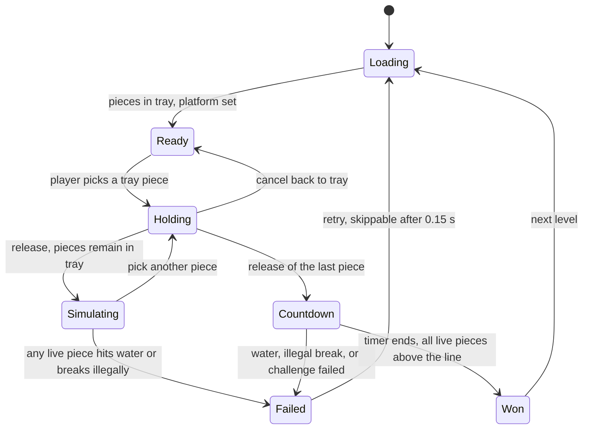

```markdown
# Art of Balance — Unity 6.6 Implementation Plan

Working title: **Still Water**  
Engine: **Unity 6.6** (`6000.6.x`)  
Focus: recreate the **visual diorama** and the **arcade placement loop**. Multiplayer, endurance, and online modes are out of scope.

This is a mechanics-and-feel recreation plan. Do not ship Shin’en’s name, logo, music, textures, or level data. Build original art in the same genre: a quiet lounge, a bowl of water, wooden pieces, window light.

---

## 1. What you are actually cloning

Art of Balance (Shin’en, WiiWare 2010; later HD ports) is a side-view physics puzzler.

The player is given a small set of pieces. They pick them in any order, carry them over a stone plinth standing in a bowl of water, rotate them in **45° steps only**, and drop them. Already-dropped pieces keep simulating. If any piece touches the water, the level fails immediately and restarts. When the last piece is released, a short countdown runs while physics stays live. If every piece is still above the water when the countdown hits zero, the level is won — even if the stack is still finishing a collapse, provided nothing has hit the water.

Documented facts the clone must match:

| Fact | Source of the rule |
|---|---|
| Place every given piece on a stone base in a bowl of water | All versions |
| Rotate only in 45° increments, by a button, not by free spin | Wii, Wii U, 3DS reviews |
| Same shape is always the same size, so the player learns how pieces interlock | Wii U write-up |
| Physics keeps running between drops; precision and order both matter | Core loop |
| After the last piece is used, a countdown must reach zero | Wikipedia; 3 s in the TOUCH / Wii U era, shortened from the original |
| Win if nothing is in the water when the timer ends, including a collapse that finishes in time | Wii U review |
| Fail if a piece touches the water; retry is immediate | All versions |
| Some pieces break under load | Official copy + reviews |
| Some pieces start a break timer once something rests on them | WiiWare review |
| Some platforms sink when loaded | 3DS review |
| Gravity pieces reverse gravity when released; fail is an invisible line, not “floating” | Official copy; World F; Wii U write-up |
| Fire pieces break if they touch each other | World G |
| Challenge levels add a place-timer or a minimum height | 3DS review |
| 8 lounge environments, calm jazz, wooden impact sounds, reflective water, window light blocked by the piece you are holding | HD reviews + Dolphin water-reflection reports |

Later arcade structure, for when you scale content: **8 worlds × 25 levels = 200**, with about 3–5 challenge levels per world. The original WiiWare set was 100 levels. Build the loop first. Do not block the vertical slice on 200 levels.

Out of scope for this plan: co-op, Tower Tumble, Swift Stacker, endurance, online leaderboards, Wii Remote motion.

---

## 2. Engine decision

### 2.1 Why Unity 6.6, and which template

Use **Unity 6.6** (`6000.6.x`). Unity 6.5 is already end-of-life; 6.6 is the supported line on the way to 6.7 LTS. Create the project from the **Universal 3D** template, not the 2D URP template.

The game **plays** in a plane. It **looks** like a small 3D room: a ceramic bowl, a stone plinth, wooden pieces with thickness, a window, plants, and a reflection in the water. A 2D renderer cannot deliver that diorama without fighting the pipeline. A 3D URP scene with a locked side camera can.

### 2.2 Physics: 2D simulation, 3D visuals

Use **Physics 2D** for gameplay and **3D meshes** for rendering.

- Gameplay plane is XY. Camera looks down the Z axis.
- Each piece root has a `Rigidbody2D` and 2D colliders.
- A child mesh is extruded on Z (~0.35× the piece’s height) so the piece reads as wood, not a sprite.
- The mesh is visual only. Never use a 3D `MeshCollider` for stacking.

Why not constrained 3D rigidbodies: this game is a stacking puzzle. Stability, one-axis rotation, per-body `gravityScale`, and deterministic `Physics2D.Simulate` steps matter more than 3D contact manifolds. Polygon colliders also match authored silhouettes exactly, including arrows and dumbbells.

Do **not** use `BuoyancyEffector2D`. In this game the water is a kill plane plus a shader. Pieces must fall through it, not float.

### 2.3 Packages

Install only what the loop needs:

| Package | Use |
|---|---|
| Universal RP (project default) | Lit diorama, real shadows, Shader Graph water |
| Input System | Mouse pointer, touch, gamepad cursor |
| Cinemachine 3.x | One locked gameplay camera, one win punch-in |
| Shader Graph | Water, sun shaft, piece ghosts |
| UI Toolkit | Countdown, pause, world select. No uGUI |
| Test Framework | Placement replay tests |
| Timeline | Optional win beat only |

Skip Addressables until you have more than a handful of lounge scenes. Skip Visual Effect Graph for splashes unless the 6.6 package explicitly lists URP as supported; use the built-in Particle System, which is reliable on URP.

---

## 3. Project layout

```text
Assets/
  Art/
    Meshes/Pieces/          # visual meshes, gameplay-thickness on Z
    Meshes/Lounge/          # bowl, plinth, window, plants
    Materials/
    Shaders/                # Shader Graph: water, ghost, sun shaft
    Textures/
    Audio/Music/
    Audio/SFX/
  Data/
    Pieces/                 # PieceDefinition assets
    Levels/WorldA/ ...      # LevelDefinition assets
    Lounges/                # LoungeProfile assets
    Physics/                # PhysicsMaterial2D presets
  Prefabs/
    Pieces/
    Lounge/
    VFX/
  Scenes/
    Boot.unity
    Game.unity              # one scene; lounges and levels are data
  Scripts/
    Core/                   # loop, state machine
    Pieces/
    Physics/
    Levels/
    Presentation/
    Input/
    Editor/                 # collider baker, level dry-run
  Tests/
    EditMode/
    PlayMode/
```

One gameplay scene. Worlds are lighting and set-dressing profiles, not eight copies of the game.

---

## 4. Scene hierarchy

```text
Game
├── Systems
│   ├── GameLoop
│   ├── PhysicsStepper          # calls Physics2D.Simulate
│   ├── InputRouter
│   ├── AudioDirector
│   └── LevelRunner
├── GameplayPlane               # Z = 0
│   ├── Platform                # Static Rigidbody2D + BoxCollider2D
│   ├── WaterKill               # trigger volume + Y backup check
│   ├── CeilingKill             # disabled until gravity flips
│   ├── PieceRoot               # spawned pieces parent here
│   └── TrayAnchors             # 8 empty transforms along the top
├── Diorama                     # no gameplay colliders
│   ├── Bowl
│   ├── WaterSurface
│   ├── Room
│   ├── WindowLight
│   ├── SetDressing             # swapped per lounge profile
│   └── ReflectionCamera        # renders the stack into a water RT
├── Cameras
│   ├── CM_Gameplay             # orthographic, no noise
│   └── CM_Win                  # 8% punch-in, 0.6 s blend
└── UIDocument                  # countdown, fail flash, pause
```

Sorting is by physical depth, not sprite order. Pieces sit at Z = 0. The bowl interior is behind them. Set dressing that could overlap the playfield is forbidden. Foliage never crosses the waterline or the plinth.

---

## 5. Visual recreation

The HD game’s look is a **quiet, specific room**, not a generic physics sandbox. Recreate the staging before you chase shaders.

### 5.1 Camera

- Orthographic. Orthographic size about **4.6**.
- Looking straight down −Z. No Dutch angle. No handheld noise. Zen, not documentary-cam.
- Framing is identical in every level of a world. The plinth sits slightly below center. The water surface is a hard horizontal line about 28% up from the bottom of the frame. The tray sits in the top 12%.
- Leave vertical room for a stack of roughly 8–10 units. Do not follow the stack. A moving camera makes balance unreadable.
- On win only: Cinemachine blend to a virtual camera 8% closer, 0.6 s, ease in-out, then hold. No shake on failure. A tiny positional impulse (under 0.02 units, one frame of camera, optional and off by default) is the most you should add on a heavy impact. Default is no shake.

Suggested world scale: **1 unit = 10 cm**. Early plinth is **2.4 units** wide. Bowl interior is about **6.5 units** wide. Pieces live in a consistent library (section 7), never scaled per level.

### 5.2 The diorama, constant vs. per world

These objects never change, because they are gameplay readability:

- Stone plinth, top face bright enough to read against wood.
- Bowl rim and waterline, high contrast, same screen position.
- Back wall behind the stack, flat enough that piece silhouettes read.

These swap per lounge profile:

- Time-of-day color, window intensity, practical lamps.
- Plants, shelves, fabric, one or two hero props.
- Music stem.
- Water tint (still clearly “water”).

Eight proposed lounges. These are **not** claimed as Shin’en’s official set dressing. They are a production plan that matches the documented mood: a real room, window light, plants, and a change of lounge per world without ever hiding the waterline.

| World | Lounge | Light | Why it is here |
|---|---|---|---|
| A | Morning, linen, two plants, sheer curtain | Warm window, soft | Teach the toy |
| B | Afternoon, wood shelves, ceramic | Harder sun, shorter shadows | Rounded pieces need clear contact shadows |
| C | Overcast stone corner | Cool, low contrast carefully avoided on the plinth | Heavier, narrower stacks |
| D | Evening, one amber lamp plus residual window | Mixed color, lamp does not hit the playfield | Timer pieces; lamp is a diegetic clock, not a HUD |
| E | Blue hour, moon in the window | Cool key, warm plinth fill so wood still reads | Setup for the flip |
| F | Same room, visually mirrored ceiling motif | Key from above as well as the window | Gravity levels; the ceiling line must be visible before the flip |
| G | Hearth room, fire **behind** the bowl, never on the pieces’ palette | Warm practical, water kept cool so it doesn’t look like lava | Fire pieces must not camouflage against the hearth |
| H | Dawn, almost empty, highest contrast | Clean sun shaft | Hardest stacks, least decoration |

Rule: if a screenshot’s playfield could be mistaken for the background, the lounge fails. Desaturate set dressing before you desaturate pieces.

### 5.3 Window light and occlusion

The HD review detail worth copying: a piece carried across the window **blocks the sunlight**.

- One directional or narrow spot from the window, slightly above and behind the stack, casting onto the back wall and the near rim of the bowl.
- Pieces cast shadows. Back wall and plinth receive them. Water receives a softened shadow mask, not a hard stencil.
- A cheap sun-shaft mesh (additive cone, scrolling noise, Shader Graph) sells the beam. Real shadows sell the occlusion. You need both.
- Shadow distance short. This is a 1-meter diorama, not a landscape. Bias low enough that pieces don’t hover off the plinth visually.
- No baked GI for pieces. They move. Bake the room only.

### 5.4 Water

Water is the signature image and the fail condition. Keep those jobs separate.

**Visual**

- A flat surface mesh clipped to the bowl interior, plus a simple volume or dark underside so the bowl doesn’t look empty.
- Shader Graph:
  - Depth gradient, teal at the rim to deep blue-green in the middle. Not cartoon cyan, not murky brown.
  - Slow normal scroll for caustics. Amplitude small. The lounge is still.
  - Fresnel rim so the surface reads at a glancing orthographic angle. Orthographic water often looks like a sticker; fresnel plus a 2–3° camera tilt (camera still functionally side-on) fixes that. If you tilt, tilt the gameplay plane the same amount or keep colliders in axis-aligned world XY and tilt only the diorama parent. **Do not tilt the physics plane.** Preferred: physics axis-aligned, diorama and camera yawed together by 0°, and fake the glancing read with normals and reflection. Add a 3° pitch only if the water still looks flat, and bake that pitch into the camera, not the colliders.
  - Planar reflection: a second camera, mirrored across the water plane, rendering pieces and the plinth into a Render Texture, sampled only inside the bowl mask. This is the look Dolphin’s water-flash bug was failing to emulate. It matters.
  - On impact, a short normal impulse at the contact X, decaying in ~0.4 s. Not a big splash during play. The big splash is the fail beat.

**Gameplay**

- `WaterKill` is a trigger `BoxCollider2D` whose top edge is the visual waterline and whose bottom extends through the bowl.
- Every fixed step, also test each live piece’s lowest collider point against `waterlineY`. Tunneling must not be a free pass.
- Crossing the line fails the level immediately. No buoyancy. No swimming. Debris counts.

### 5.5 Pieces as objects

- One wood material family: warm, low roughness variation, beveled edges, subtle grain. Not a photogrammetry plank.
- Thickness constant in Z so a circle and a long rectangle feel like the same set of blocks.
- Contact readability comes from the silhouette and a slightly darker edge, not from unique colors per shape. Special behaviours get a small glyph, not a recolor of the whole piece:
  - Fragile: hairline crack decal, visible before it breaks.
  - Timer: inlaid hourglass mark. The countdown number appears above the piece, not on a HUD.
  - Gravity: pale inlay, a small upward chevron.
  - Fire: ember edge emissive, restrained. The piece is still wood.
- Held piece: 70% opacity ghost, same mesh. Valid placement is the normal wood color. Overlapping a solid tints the ghost a dull red and the drop is rejected.
- Dropped piece: full material, interpolation on, so the mesh doesn’t stutter between physics steps.

### 5.6 Animation and juice, kept quiet

Match the tone. The game is calm even when the stack is not.

| Event | Visual | Length |
|---|---|---|
| Pick up from tray | Piece lifts and eases to the pointer | 0.12 s |
| Rotate | 45° about the collider centroid | 0.08 s, no overshoot |
| Light impact | Nothing but the shadow and a one-frame contact squash under 2% | — |
| Fragile break | Piece splits along the crack decal into 2–3 kinematic shards, then those shards become dynamic | 1 frame split, then physics |
| Fire break | Both pieces char and shatter; short ember burst, Particle System, under 0.5 s | — |
| Gravity flip | 0.35 s. Gravity vector eases from down to up. Ceiling line fades in. Do not spin the camera. | 0.35 s |
| Fail | Pieces already in the bowl stay. A ripple and a soft splash. Reset | 0.45 s, skippable |
| Win | Countdown resolves, music ducks back in, camera punch-in, pieces stay where they are | 0.8 s |

No confetti. No screen flash beyond a 10% white on fail, one frame.

---

## 6. Main gameplay loop

### 6.1 State machine



Physics for released pieces **never freezes** while the player holds the next piece. That is the skill. A stack can still be rocking when you commit.

### 6.2 Rules, exact

1. A level provides an ordered tray, a platform pose, a waterline, a countdown duration, and optional challenge rules.
2. The player may pick any remaining tray piece. Order is a decision, not a queue.
3. While held, the piece is `Rigidbody2D` kinematic, follows the pointer on the gameplay plane, and does not collide. It rotates only in 45° steps around its centroid.
4. Release is rejected if the ghost overlaps a solid collider or is outside the bowl’s horizontal interior. The piece stays held.
5. A legal release switches the body to dynamic, sets velocity to a small downward bias (about `0.4` units/s), sets angular velocity to `0`, and keeps the snapped rotation. No inherited pointer velocity. The original drops; it does not throw.
6. If a live piece’s lowest point crosses the active fail line, fail now.
7. If a piece breaks because of load, timer, or fire, fail now. Breaking is not a scoring trick. It is a collapse.
8. When the tray is empty and the last piece has been legally released, start the countdown. Default **3.0 s**. Store it on the level so you can A/B the longer original feel later.
9. During the countdown, physics keeps stepping. The player cannot pick pieces. They can only watch.
10. At zero, if every spawned gameplay piece is still intact and above the active fail line, win. A piece still in the air above the line counts as safe. That matches the documented rule and is slightly generous. Do not add a hidden “must be asleep” requirement.
11. Retry reloads from the `LevelDefinition`. It does not reload the scene.

### 6.3 Pointer

The Wii version is an absolute pointer. Copy that.

- Mouse: cursor position maps to a world point on Z = 0. Clamp X to the bowl interior, Y from `waterline + 0.35` to the underside of the tray.
- Touch: same absolute mapping. A rotate button, because a two-finger twist will fight the 45° rule.
- Gamepad: a cursor moves with the stick at a fixed world speed, not scaled by frame time inside physics. Rotate on a shoulder button. Drop on the south button. Cancel on the east button.
- Rotate input is discrete. Holding the button does not spin. A second press is a second 45° step, with a 0.12 s repeat delay if you want hold-to-step. Default is one step per press.

### 6.4 Countdown presentation

- Hidden until the last release.
- Then a quiet three-beat: a numeral at center-top, not over the stack, plus a soft tick.
- Music low-passes slightly. SFX stay dry.
- The numeral is the only new HUD element. Level index can live in the corner at 40% opacity. No score popup in the core loop.

### 6.5 Fail and retry

Fail must be fast. The game is experimentation. A 0.45 s splash is enough. After 0.15 s, any drop or click retries. Do not show a modal. On the second consecutive fail of the same level, still no modal. Respect the player’s attempt to repeat a placement.

---

## 7. Piece library

Every shape the player can learn must be a stable definition: same collider, same mass, same friction, every level.

Mass = collider area × density. Density default **1.0 kg per unit²**. A wide rectangle outweighs a small triangle. Do not hand-tune mass per level. Tune density only if the whole set feels like foam or like iron.

Friction preset `Wood`:

| Property | Value |
|---|---|
| Friction | 0.72 |
| Bounciness | 0 |
| Friction combine | Maximum |
| Bounce combine | Minimum |

Circles use the same material. They roll because of shape, not because of ice friction. If circles feel too lively, raise angular drag on the circle prefab only (start at `0.4`), do not drop global friction or rectangles will skate.

Starting library. Dimensions are local, in units, collider = visual silhouette inset by **0.01** so meshes can kiss without snagging.

| Id | Collider | Approx size | Notes |
|---|---|---|---|
| `square` | Box | 1.0 × 1.0 | Teaching piece |
| `rect_flat` | Box | 2.0 × 0.5 | Bridge |
| `rect_long` | Box | 3.0 × 0.5 | The piece that punishes a high center of mass |
| `rect_tall` | Box | 0.5 × 2.0 | |
| `circle_s` | Circle | r = 0.45 | |
| `circle_l` | Circle | r = 0.75 | |
| `semicircle` | Polygon | r = 0.75 | Flat edge is the useful face |
| `triangle` | Polygon | side 1.2 | |
| `wedge` | Polygon | 1.2 × 0.6 | |
| `cross` | Compound of two boxes | arm length 1.6, thickness 0.4 | Concave; do not convex-hull this |
| `arrow` | Polygon | length 2.2 | Documented awkward piece |
| `dumbbell` | Two circles + a box | circles r = 0.4, bar 1.4 × 0.28 | Compound collider |

Special behaviours are components on the same prefabs, enabled by the level spawn entry, not separate meshes. A `rect_flat` can be ordinary, fragile, timed, or fire. The glyph swaps. The collider does not.

Collider authoring: an editor baker projects the visual mesh onto XY, traces the silhouette, and writes a `PolygonCollider2D` or a compound. Circles stay `CircleCollider2D`. Never leave a default box on a round mesh.

---

## 8. Physics that feels like the original

Stacking puzzles fall apart when the solver is soft, the timestep wanders, or overlap resolution kicks a piece out of a gap. Treat stability as a feature, not a tuning pass you do later.

### 8.1 Project settings

`Edit > Project Settings > Physics 2D`:

| Setting | Start here |
|---|---|
| Gravity | `(0, -12)` |
| Default material | `Wood` |
| Velocity iterations | 16 |
| Position iterations | 10 |
| Simulation mode | Script |
| Queries hit triggers | On |
| Reuse collision callbacks | On |
| Baumgarte scale | 0.2 |
| Time to sleep | 0.4 |
| Linear sleep tolerance | 0.01 |
| Angular sleep tolerance | 2° |

Simulation mode **Script** means you step the world yourself. Do not also let auto-simulate run.

### 8.2 The stepper

```csharp
// Intent, not a final class.
// One fixed dt. Never pass Time.deltaTime into Simulate.
const float Step = 1f / 60f;

void Update()
{
    accumulator += Time.deltaTime;
    // Clamp so a hitch cannot dump 30 steps and explode the stack.
    accumulator = Mathf.Min(accumulator, Step * 5f);
    while (accumulator >= Step)
    {
        // Gameplay queries (load, timers, fail line) run here,
        // before the step, against the previous poses.
        loop.BeforePhysicsStep(Step);
        Physics2D.Simulate(Step);
        accumulator -= Step;
    }
}
```

`Physics2D.Simulate` does not call `FixedUpdate`. Put per-step gameplay in `BeforePhysicsStep`, not in `FixedUpdate`, or it will drift from the physics clock.

Bodies that matter:

- Released pieces: dynamic, collision detection **Continuous**, interpolation **Interpolate**, constraints **Freeze Position Z** and **Freeze Rotation X/Y** are irrelevant on a 2D body. Freeze rotation is **off**. Pieces must be able to tip. That is the puzzle.
- Held piece: kinematic, simulated so queries work, collisions disabled via a layer.
- Platform: static rigidbody, not a collider without a body. A static body sleeps cleanly and gives consistent contacts.

Layers:

| Layer | Collides with |
|---|---|
| Held | nothing |
| Piece | Piece, Platform |
| Platform | Piece |
| Kill | trigger queries only, no physical collision |

### 8.3 Load, not impulse, for breakable pieces

Contact impulses flicker. Puzzle thresholds cannot.

Each step, build a contact graph of `Piece` colliders. A piece **supports** another if there is a contact whose normal is mostly upward in the current gravity direction (dot > 0.5) and the upper piece’s centroid is on the supported side. Sum the mass of everything a piece supports, including itself if you want “self weight,” but do not include the platform.

- Fragile breaks when supported mass stays above `breakMass` for **0.20 s**, not for one frame. A landing spike should not shatter a legal placement.
- Timer pieces arm when they gain a supporting contact that persists **0.15 s**. The visible countdown is level data, default **5 s**. At zero they break, then anything they supported falls, then the waterline fails the level. That is the WiiWare timer piece.
- Fire: `OnCollisionEnter2D` with another fire piece breaks both immediately. Touching, not “resting.”
- Gravity: on legal release, ease `Physics2D.gravity` from `(0, -12)` to `(0, +12)` over 0.35 s. Set every live piece’s `gravityScale` to `1` so the global flip is the only switch. Move the active fail line from the waterline to a ceiling line that was authored in the level and hidden until now. Do not flip the transforms. The stack falls up. Loss is crossing that line, matching the write-up: an invisible line, not a moving bowl.

Sinking platforms are kinematic, not dynamic. Supported mass maps to a target Y through a damped spring (frequency ~2 Hz, damping 0.8). Author a minimum Y still above the water. The platform is a tightening constraint, not an instant kill. Drive it with `MovePosition` on the kinematic body during the scripted step, never by writing `transform.position`.

### 8.4 What “the same drop” means

Store every legal release as:

```text
pieceId, position.x, position.y, rotationSteps (0..7)
```

Quantize position to **0.001** units at release so replay does not depend on float dust from the pointer. A PlayMode test loads a level, replays a recorded solution, steps N seconds, and asserts win. If this test is noisy, the game is not done. Fix the solver before you add levels.

---

## 9. Level data

One `LevelDefinition` ScriptableObject per level. No scene-per-level.

```csharp
[CreateAssetMenu(menuName = "Still Water/Level")]
public sealed class LevelDefinition : ScriptableObject
{
    public string WorldId;          // "A" .. "H"
    public int Index;               // 1 .. 25
    public PieceSpawn[] Tray;
    public PlatformSetup Platform;
    public float WaterlineY;
    public float CeilingLineY;      // used only if a gravity piece flips the level
    public float CountdownSeconds = 3f;
    public ChallengeRule Challenge; // None, PlaceTimeLimit, MinHeight
    public float ChallengeValue;
}

public struct PieceSpawn
{
    public PieceDefinition Piece;
    public PieceBehaviour Behaviour; // None, Fragile, Timer, Fire, Gravity
    public float BreakMass;          // fragile
    public float BreakDelay;         // timer pieces
}
```

Platform setup is a width, a local center, and an optional sink curve. Early levels: one static plinth. Later levels: narrower plinth, two plinths, or a sink. Do not add moving platforms that the player cannot predict. If it sinks, show the sink on the first placement, not as a surprise after the countdown.

Challenge rules, only on the 3–5 marked levels per world:

- **PlaceTimeLimit**: countdown-to-place starts at level begin. Separate from the stability countdown. Running it out fails.
- **MinHeight**: at the stability countdown’s zero, the highest intact piece top must be at or above an authored Y. Show that line as a faint tick on the back wall before the player starts.

### 9.1 Content plan, not a 200-level blockade

Ship the loop against a vertical slice, then fill worlds in this order:

| Milestone | Levels | Mechanics introduced |
|---|---|---|
| Slice | 1 | Four rectangles, static plinth, waterline, win, fail, retry |
| Toy | 10 | Full basic library, 45° rotate, tray choice, two lounge lighting setups |
| World A–B | 25 + 25 | Shape language only. No specials. This is where physics tuning is judged |
| World C–D | 50 | Fragile, timer, one sinking platform |
| World E–F | 50 | Gravity flip, ceiling line, lounge that teaches the ceiling |
| World G–H | 50 | Fire, then mixed challenges |
| Challenges | 3–5 per world | Place timer or min height, retrofitted once the parent world is stable |

A world is not done until five recorded solutions replay as wins on a fresh process, and five known-bad drops replay as fails. Author solutions while you tune. If you tune after authoring 200 levels, you will rewrite 200 levels.

---

## 10. Audio

The soundtrack is half the product. It is also the half you must not copy. Commission or compose a short lounge set: brushed drums, upright bass, a soft electric piano. One stem per world, 90–110 BPM, no vocals, loopable, low dynamic range so a wood clack can cut through.

Mixer groups: `Music`, `SFX`, `UI`. Duck music −4 dB during the countdown via a mixer snapshot, not via a scripted volume write.

| Event | Sound | Notes |
|---|---|---|
| Rotate | Soft wood tick | One shot, no pitch randomization beyond ±2% |
| Release | Quiet cloth | The drop is not the impact |
| Impact | Wood clack, 3 layers by impulse | Cooldown 40 ms per piece so a rattle doesn’t machine-gun |
| Water fail | Single splash, short reverb | `AudioReverbZone` on the bowl, small radius, wet only the splash |
| Fragile / fire | Dry crack, then the clacks of the shards | |
| Countdown | Three soft ticks, lower pitch on the last | |
| Win | One resolved chord, not a fanfare | |

Impacts read velocity at the contact. Map impulse to volume with a curve that saturates early. A fallen tower should sound serious, not louder than the room.

---

## 11. Implementation phases

### Phase 0 — Project

- Unity 6.6, URP 3D, Input System active, both input backends off once Input System is verified.
- Physics 2D set to Script mode. Stepper in the scene. A debug key dumps solver sleep state.
- Folders and asmdefs: `Gameplay`, `Presentation`, `Editor`. Tests reference `Gameplay` only.

### Phase 1 — The slice (the only phase that matters until it is good)

One scene, one plinth, four `rect` pieces, placeholder wood cubes, a blue quad for water.

Done when:

- Absolute pointer, 45° rotate, reject-overlap release.
- Physics runs while you hold the next piece.
- Waterline fail is immediate and retry is under half a second.
- Last release starts a 3 s countdown and a settled stack wins.
- A recorded four-piece solution replays to a win twice in a row.

Do not art this phase. If placeholder cubes don’t feel fair, lit meshes will not save them.

### Phase 2 — Piece kit and tray

- Baker writes colliders from meshes.
- Full basic library, consistent scale.
- Tray at the top, any-order pick, cancel back to tray.
- Mass from area. Wood material. Continuous collision.

Done when circles can be placed and don’t jitter-walk across a flat rectangle, and a long rectangle can balance on a square for the full countdown without a hidden torque.

### Phase 3 — Diorama

- Bowl, plinth, back wall, window, two plants.
- Shadow-casting pieces, receiving wall, sun shaft.
- Water shader with bowl-masked reflection.
- Two lounge profiles swapped by `WorldId` with no scene load.
- Orthographic framing locked. Playfield unobstructed.

Done when a video of a piece crossing the window shows the shaft occluded, and the water reflection shows the stack.

### Phase 4 — Specials

In order: fragile (contact-graph mass), timer, sinking platform, gravity flip, fire. One test level each. Each special has a replay win and a replay fail.

### Phase 5 — Feel pass

- Impact audio, countdown duck, fail splash, win camera.
- Ghost tint, rotate timing at 0.08 s, pickup ease at 0.12 s.
- Sit with the slice and the ten-level toy. Adjust gravity and friction once. Re-run every replay. If more than one solution breaks, revert the physics change.

### Phase 6 — Content pipeline

- Custom inspector: paint tray, set plinth width, enter play mode from the asset, write the last attempt as a replay clip.
- Author worlds A and B before any special-heavy world.
- Only then scale toward 8 × 25.

---

## 12. Acceptance checks

The clone is faithful enough when a player who knows the original recognizes the loop in under a minute, without your UI explaining it.

**Gameplay**

- [ ] Pieces rotate only by 45°.
- [ ] Any tray piece can be chosen next.
- [ ] Released pieces keep simulating while another is held.
- [ ] Overlap releases do not explode the stack; they are rejected.
- [ ] Water contact fails immediately.
- [ ] Countdown starts only after the last legal release, physics live, default 3 s.
- [ ] Airborne-but-above-water at t = 0 wins.
- [ ] A collapse that finishes above water during the countdown wins.
- [ ] A collapse that hits water during the countdown fails.
- [ ] Retry does not reload the scene and does not show a modal.
- [ ] Same recorded input produces the same result.

**Specials**

- [ ] Fragile uses sustained supported mass, not a one-frame impulse.
- [ ] Timer arms only after a piece rests, then breaks and drops what it held.
- [ ] Sinking platform is kinematic, predictable, and stops above the water.
- [ ] Gravity piece flips the gravity vector and the fail line, not the camera.
- [ ] Fire pieces break on touch with each other.

**Visuals**

- [ ] Side-on diorama: bowl, plinth, window, plants, wooden thickness.
- [ ] Piece carried through the sun shaft blocks the light on the back wall.
- [ ] Water reflects the stack and is masked to the bowl.
- [ ] Waterline is readable in all eight lounges.
- [ ] No set dressing crosses the playfield.
- [ ] Specials are glyphs on the same wood set, not eight unrelated materials.
- [ ] No screen shake by default. Win beat is a small punch-in and a chord.

**Not required for this plan**

- Co-op, versus, endurance, online, motion controls, a cloned soundtrack, the original level order.

---

## 13. Risks

| Risk | What to do |
|---|---|
| Stacks jitter or walk | Raise position iterations before you touch friction. Inset colliders 0.01. Confirm you are not writing transforms on dynamic bodies. |
| Legal drops get rejected as overlaps | Inset is too small, or the ghost uses a different collider than the live piece. They must be the same asset. |
| Countdown wins feel random | You are simulating on `Time.deltaTime` or auto-simulate is still on. Script mode, fixed 1/60. |
| Gravity flip launches pieces sideways | Flip only the Y component of gravity. Zero residual angular velocity at the flip only if you also ease it; don’t teleport velocities. |
| Water looks like a flat sprite | Reflection RT plus fresnel. Do not tilt physics to fix a shader. |
| Reflections cost a frame on mid hardware | Reflection camera renders pieces and plinth only, half res, no shadows. The main camera keeps the real shadows. |
| Authoring 200 levels before the solver is frozen | Worlds A–B replay suite is the gate. No World C content until it is green. |
| Scope drift into multiplayer | The loop is not done until retry is instant and a 10-level toy is something you replay on purpose. Modes wait. |

---

## 14. First week, concrete

1. Create the 6.6 URP project and the folder layout.
2. Implement the stepper and a static plinth. Drop one dynamic box. Confirm it sleeps and does not creep.
3. Add the pointer, 45° rotate, ghost, and reject-overlap release.
4. Add the waterline fail and the 3 s countdown. Record one winning replay and one failing replay. Automate both.
5. Only then replace the cubes with a bowl, a window light, and a reflective water surface.

If step 4 is unfair, do not start step 5.
```
