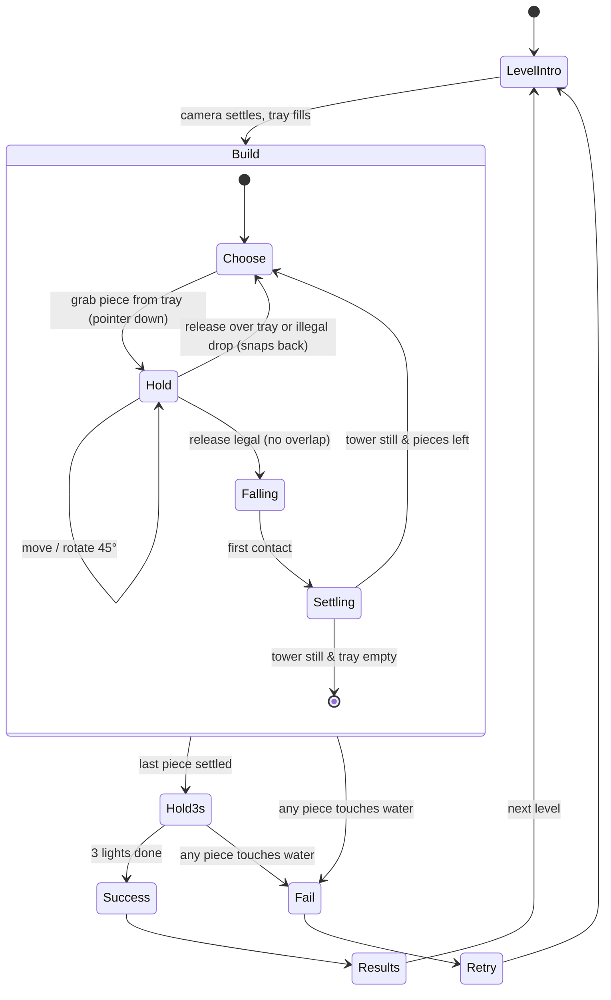

# Implementation Plan — Rebuilding *Art of Balance* from Scratch in Unity 6.6

**Scope:** a from-scratch rebuild focused on recreating the **visuals** and the **main gameplay loop** of Shin'en's WiiWare *Art of Balance* (2010).

**Date:** 2026-09-23.

**Companions:**
- [FrameRate_EventDriven_DeepDive.md](FrameRate_EventDriven_DeepDive.md): the runtime architecture to reuse.
- [WeightedShape_SOLID_EDD_DeepDive.md](WeightedShape_SOLID_EDD_DeepDive.md): the tested stacking core to reuse.
- [Scripts_Master_Index.md](Scripts_Master_Index.md): lessons from the current prototype.

---

## 0. Engine version decision

| Option | Version (Sep 2026) | Support | Use it for |
|---|---|---|---|
| **Unity 6.6** (recommended) | **6000.6.2f1**, released 2026-09-18; 6.6 launched 2026-09-01 | *Supported* Update release, supported until the next release | New project start: newest features, and the release Unity recommends for new and mid-cycle productions |
| Unity 6.7 LTS | alpha now (6000.7.0a6 appears in the 6.6.2 known-issues list); reported for **Q4 2026** | LTS (2 years) | **Upgrade target before content lock / release** |
| Unity 6.3 LTS | current LTS | until Dec 2027 | Fallback if a 6.6 regression blocks you |
| Unity 6.0 LTS | — | ends Oct 2026 | Do not start here |

**6.6 changes that matter to this project** (as reported at launch):

| Change | Why it matters here |
|---|---|
| **Fast Enter Play Mode is the default**: scenes reload, the script domain does not | Static fields and static events survive between Play sessions. The architecture below bans static mutable state, and every listener must unsubscribe in `OnDisable` |
| **Dictionary serialization** (`[SerializeField]` on `Dictionary<,>`) | Piece-catalogue lookups can be authored directly |
| **Compute Light Baker** for lightmaps, probes and Adaptive Probe Volumes | Much faster bakes of the backdrop dioramas |
| **Content Directories** (local content without up-front AssetBundle layout; works with Addressables APIs) | Per-world content loading |
| **Build Analysis window** | Tracking build size across worlds |
| **WebGPU production-ready** | Optional browser demo |
| **UI Toolkit backdrop-filter / drop-shadow** (reported by secondary coverage) | Frosted-glass pause and results panels without render textures. Verify in the 6.6 release notes |
| Preparation for **CoreCLR** in Unity 7 | Keep code free of reflection-heavy tricks and domain-reload assumptions |

**Policy:**
- Pin `6000.6.x` in `ProjectVersion.txt` and CI.
- Take patch releases every 2–4 weeks.
- Plan a one-week upgrade to **6.7 LTS** once it ships, before content lock.

Sources: [Unity 6000.6.2f1 release page](https://unity.com/releases/editor/whats-new/6000.6.2f1) · [Unity 6 support](https://unity.com/releases/unity-6/support) · [Unity 6 releases](https://unity.com/releases/unity-6) · [GameFromScratch: Unity 6.6 released](https://gamefromscratch.com/unity-6-6-released/) · [MGoddess: 6.6 launch and 6.7 LTS in Q4](https://www.mgoddess.com/news/7-lts-6-6-gamemeca-com) · [makaka.org version guide](https://makaka.org/unity-tutorials/best-version)

---

## 1. What we are recreating

### 1.1 Facts about the original (sourced)

| Aspect | What the sources say |
|---|---|
| Core premise | Stack a given set of blocks on a platform **floating in water** without any block falling into the water ([Wikipedia](https://en.wikipedia.org/wiki/Art_of_Balance), [Nintendo Life](https://www.nintendolife.com/reviews/2010/02/art_of_balance)) |
| Rotation | Blocks rotate in **45° steps** ([Wikipedia](https://en.wikipedia.org/wiki/Art_of_Balance)) |
| Win condition | After the last block is placed, the tower must stay up for **three seconds**, shown by **three lights at the bottom of the screen** ([Nintendo Life](https://www.nintendolife.com/reviews/2010/02/art_of_balance)); the countdown was shortened in later versions ([Wikipedia](https://en.wikipedia.org/wiki/Art_of_Balance)) |
| Piece supply | At least 3 pieces are shown at the bottom of the screen; extras beyond 3 are **greyed out** (review coverage) |
| Special pieces | **Weight-limited (glass) pieces** break after a certain number of pieces are stacked on them. **Timer pieces** start counting down once something is stacked on them and then break, so everything above falls ([Nintendo Life](https://www.nintendolife.com/reviews/2010/02/art_of_balance)) |
| Shapes | Various shapes, including **rounded edges** later on ([Nintendo Life](https://www.nintendolife.com/reviews/2010/02/art_of_balance)) |
| Level variants | Some levels set a **time** or **height** requirement; "super puzzles" with a time limit or a **platform swaying on the water** ([Nintendo Life](https://www.nintendolife.com/reviews/2010/02/art_of_balance), [Wikipedia](https://en.wikipedia.org/wiki/Art_of_Balance)) |
| Modes | Arcade (about 100 puzzles on WiiWare; later versions have more), **co-op** with a second player, **versus** split-screen race ([Nintendo Life](https://www.nintendolife.com/reviews/2010/02/art_of_balance), [Wikipedia](https://en.wikipedia.org/wiki/Art_of_Balance)) |
| Controls | Wii Remote pointer, "easy to pick up and perfectly implemented" ([Nintendo Life](https://www.nintendolife.com/reviews/2010/02/art_of_balance)) |
| Look and feel | Smooth-looking blocks; eccentric 3D backdrops (criticised for jagged edges); "serene soundtrack" ([Nintendo Life](https://www.nintendolife.com/reviews/2010/02/art_of_balance), [Wikipedia](https://en.wikipedia.org/wiki/Art_of_Balance)) |

### 1.2 Design interpretation (ours; confirm against footage before art lock)

- **Camera:** a side-on 3D view of the pedestal and water, with the tray of pieces at the bottom. Gameplay happens in one vertical plane (2.5D: pieces move in X/Y and rotate around Z).
- **Blocks:** chunky, softly bevelled, glossy "toy" solids with clean single colours per type. Glass pieces are translucent and show their remaining capacity as a number. Timer pieces show their seconds.
- **Scenes:** a calm lake or pool with gentle waves, a rock or stone pedestal, and a stylised diorama backdrop per world, with soft daylight and mild bloom.
- **Audio:** ambient, sparse music; tactile "clack" contacts; glass crack; a timer tick; a splash when a piece falls.
- **We improve on the original** where reviewers complained: clean anti-aliased backdrops, 60+ fps, touch, mouse and gamepad support.

### 1.3 Legal guardrail

Game mechanics are not protected, but names, logos, music, art and level layouts are. Use an **original title, art, music and levels** that evoke the feel. Do not trace screenshots or rip assets.

---

## 2. The main gameplay loop



Special-piece reactions run **inside `Settling`**, on the event-driven stack analysis:
- A glass piece with more pieces on it than its capacity **cracks and breaks**, and the pieces above fall. Any piece reaching the water means **Fail**.
- A timer piece with anything on it **arms its fuse**; when the fuse ends it breaks.

**Challenge modifiers** plug into the same loop as rules rather than new loops:
- **height target:** success requires `StackTopY ≥ target` during the hold;
- **time limit:** fail when the level clock ends before success;
- **swaying pedestal:** a kinematic platform animated in `FixedUpdate`.

---

## 3. Architecture

### 3.1 Assemblies

| Assembly (asmdef) | Contents | References |
|---|---|---|
| `AoB.Core` (`noEngineReferences: true`) | Stack analyzer, rules, scoring maths, level validation: **reuse `WeightLab~/Core` as-is** | — |
| `AoB.Gameplay` | Piece state machine, held-piece services, stack services, level flow, spawner, input, camera rig | Core, Input System, Cinemachine, DOTween (or Unity's native tweening) |
| `AoB.Presentation` | Piece views, water, splash, glass crack, HUD presenters, audio | Gameplay |
| `AoB.UI` | UI Toolkit screens (title, world map, level select, pause, results, settings) | Gameplay |
| `AoB.Data` | ScriptableObject definitions (`PieceDefinition`, `LevelDefinition`, `WorldDefinition`, `PhysicsTuning`, `ScoringRules`), save data | Core |
| `AoB.Editor` | Level editor window, piece collider baker, validators | all |
| `AoB.Tests.EditMode` / `AoB.Tests.PlayMode` | Core tests (port the 92 lab tests to NUnit), real-physics tests (reuse `RealPhysicsStackTests`) | all |

### 3.2 Runtime composition

```text
Bootstrap scene (persistent)            Game scene (per level, additive)           UI (UI Toolkit, additive)
├─ AppRoot (composition root)           ├─ LevelRoot (spawns from LevelDefinition)   ├─ HUD (tray, rotate, 3 lights)
│   FrameRateBootstrap / FramePacing    ├─ Pedestal(s) [StackBody: Platform]         ├─ Pause / Results / Retry
│   SaveService, AudioService           ├─ Water [WaterKillZone + water surface]     └─ World map / level select
│   Event channels (SO assets)          ├─ StackSystems (registry, capture, settle,
└─ CameraRig (Cinemachine)              │   analysis, breaker)
                                        ├─ HeldPieceServices (tracker, validator, rotator)
                                        └─ LevelFlow (outcome, clock, countdown)
```

**Rules:**
- **No singletons with static state.** Required by Fast Enter Play Mode, and good practice anyway. If a static is unavoidable, reset it in `[RuntimeInitializeOnLoadMethod(RuntimeInitializeLoadType.SubsystemRegistration)]`.
- **Every listener unsubscribes in `OnDisable`.** ScriptableObject channels survive scene reloads and play sessions.
- **No `Update` unless a component is enabled only while active** ([Deep Dive 1 §3](FrameRate_EventDriven_DeepDive.md)).

### 3.3 Data model

```csharp
public enum PieceKind { Regular, Glass, Timer }          // + later: Vanish (Wii U-style), Fire (this project's variant)

[CreateAssetMenu(menuName = "AoB/Piece")]
public sealed class PieceDefinition : ScriptableObject
{
    public string id;
    public GameObject prefab;              // mesh + baked convex colliders (see §5.2), StackBody, ShapeStateMachine, view
    public PieceKind kind;
    [Min(0)] public int glassCapacity = 2; // Glass: pieces it can hold (breaks at capacity + 1)
    [Min(0)] public float fuseSeconds = 3; // Timer
    [Min(0.1f)] public float massPerUnitArea = 1f;
    public Material materialOverride;      // per-world palettes via MaterialPropertyBlock colours instead, if possible
}

[CreateAssetMenu(menuName = "AoB/Level")]
public sealed class LevelDefinition : ScriptableObject
{
    public string id;
    public GameObject pedestalPrefab;      // rock formation(s): static colliders
    public PieceSlot[] pieces;             // order = tray order
    [Min(1)] public int visibleTraySlots = 3;
    public ChallengeKind challenge;        // Standard | HeightTarget | TimeLimit | SwayingPedestal
    public float heightTarget, timeLimitSeconds, swayAmplitude, swayPeriod;
    public float holdSeconds = 3f;         // the three lights
    public LevelSolution recordedSolution; // input replay recorded by the designer: proves solvability, drives regression tests
}

[System.Serializable] public struct PieceSlot { public PieceDefinition piece; public int glassCapacityOverride; public float fuseOverride; }
```

The save file is JSON in `Application.persistentDataPath` and holds: best result per level, stars, unlocked worlds, and settings. Do **not** use PlayerPrefs for progress; the prototype's PlayerPrefs keys are a migration input only.

---

## 4. Gameplay systems: implementation order and details

The first eight are reused or adapted from the tested and type-checked code in `Assets/Scripts/Docs/WeightLab~`.

| # | System | Source | Notes |
|---|---|---|---|
| 1 | `ShapeStateMachine` (Docked/Held/Returning/Dropping/Landed/Locked) | `WeightLab~/FrameRate` | Replace Lean Touch with the **Input System** (below) |
| 2 | `HeldPieceServices` + `HeldShapeTracker` + `DropValidator` + `HeldShapeRotator` | `WeightLab~/FrameRate` | 45° steps; illegal drops snap back; tint the held piece red while blocked |
| 3 | `SettleMonitor`, `ContactCapture`, `StackAnalysisService`, `ShapeBreaker`, `StackBody*` | `WeightLab~/Unity` | Glass = `WeightLimitRule` with `MaxLoad = capacity`; timer = `TimerFuseRule` |
| 4 | `StackAnalyzer`, rules, `WeightDisplay` | `WeightLab~/Core` | Unchanged; 92 tests come with it |
| 5 | `LevelOutcomeService`, `CountdownTimer` (3 lights), `LevelClock` | `WeightLab~/FrameRate` | Add `HeightTargetRule`/`TimeLimitRule` as outcome guards |
| 6 | `WaterKillZone` | `WeightLab~/FrameRate` | Also triggers splash VFX/SFX and a camera nudge |
| 7 | **Tray** (new) | — | See below |
| 8 | **Level spawner** (new) | — | Instantiates the pedestal, the tray pieces, and wires `Initialize(services, dockPos, scales, locked)` |
| 9 | **Camera framing** (new) | — | See below |
| 10 | **Swaying pedestal** (new) | — | Kinematic Rigidbody; `MovePosition`/`MoveRotation` in `FixedUpdate` from a sine curve; register as Platform; `SettleMonitor` ignores kinematic bodies, so the stillness check uses pieces only |

**Tray.** It shows `visibleTraySlots` (3) usable pieces; the rest are shown greyed (`ShapeState.Locked`). When a piece leaves the tray (`ShapeReleased`), the next locked piece unlocks and slides into the slot with a 0.2 s tween. This is event-driven: no polling.

**Camera framing.** Use a Cinemachine 3 `CinemachineCamera` with a Group Framing extension on a `CinemachineTargetGroup` made of the pedestal and the landed pieces. Add targets on `ShapeLanded` and remove them on `ShapeDestroyed`. Use damping of about 1 s so the camera rises gently as the tower grows, and keep the tray in a UI band that never overlaps the framing.

**Input** (Input System 1.x, one action map `Gameplay`):

| Action | Bindings | Behaviour |
|---|---|---|
| `Point` (Value, Vector2) | Pointer position, touch #0, gamepad virtual cursor | Moves the held piece |
| `Grab` (Button) | Mouse left, touch press, gamepad South | Pick up / release (release → `OnDeselected` logic) |
| `RotateCW` / `RotateCCW` (Button) | Mouse wheel, Q/E, shoulder buttons, on-screen buttons | `HeldShapeRotator.RotateStep(±1)` on `performed` |
| `Twist` (Value, float) | Two-finger twist (touch) | Accumulate; step 45° when |Δ| ≥ 30° |

**Pointer to world.** Raycast onto the gameplay plane (z = 0) with `Plane.Raycast`, and move the held **kinematic** piece with `Rigidbody.MovePosition` in `FixedUpdate`, only while held (1 object). Offset the grab point so the finger never hides the piece: the original Wii pointer sat above the piece, and on touch the piece should sit about 1.5 cm above the finger.

---

## 5. Physics design (the feel)

### 5.1 Settings

| Setting | Value | Why |
|---|---|---|
| Simulation | PhysX 3D, gameplay plane XY; pieces `FreezePositionZ \| FreezeRotationX \| FreezeRotationY` | Classic 2.5D stacking with 3D visuals and lighting |
| Fixed timestep | 1/60 s | Matches the 60 fps render; the tower is small |
| Default solver iterations | 8; **piece** `solverIterations` 20 (tune 12–30) | Stable towers without taxing everything |
| Sleep | default thresholds; nothing writes resting transforms | Settled towers cost nearly nothing |
| Contact offset | 0.01 (default); piece colliders ≥ 0.1 thick | Stable resting contacts |
| Physics material | friction 0.7 static / 0.6 dynamic, bounciness 0, *Average* combine | "Grippy toy blocks": towers can lean without skating |
| Mass | `massPerUnitArea × silhouette area` | Big pieces feel heavy; consistent with the mass-load option |
| Collision detection | ContinuousSpeculative while falling, Discrete once landed | Prevents tunnelling on fast drops |
| Interpolation | on while held or falling, off when landed | Smooth motion without the cost across the tower |
| Layers | Pieces, Pedestal, Water (trigger), Tray (no collisions) | Minimal broad-phase pairs |

### 5.2 Colliders for concave pieces

1. Model each piece as a **union of convex parts** (boxes, capsules, convex meshes). This is what the analyzer was tested against: L, T, +, ^, U, and multi-part convex pieces.
2. **Bake colliders into the prefab** with an editor tool that runs a convex decomposition (V-HACD-style, or hand-placed primitives for simple pieces). Never generate colliders in `Awake`: the prototype's `ExtendedColliders3D` does, and that creates ordering hazards.
3. Keep parts as **child colliders of one Rigidbody**, so PhysX reports one body with per-collider contacts. The analyzer merges them per body.

### 5.3 Tuning protocol

Record the designer's solution for every level as an input replay. A PlayMode test replays all of them after any physics change, and a level whose recorded solution stops succeeding **fails CI**. That turns "feel" tweaks into a safe, measurable process.

---

## 6. Visual recreation (URP, Unity 6.6)

### 6.1 Pipeline and quality tiers

| Setting | Mobile | PC / console |
|---|---|---|
| Render pipeline | URP (Forward+), Render Graph | same |
| Anti-aliasing | MSAA 2× + **STP** upscaling (render scale 0.8) | MSAA 4× (clean edges, which fixes the original's jaggies) |
| HDR / tonemapping | on / Neutral | on / ACES or Neutral per world |
| Shadows | 1 directional, 2 cascades, 25 m distance, soft low | 4 cascades, soft high |
| Global illumination | Baked **Adaptive Probe Volumes** for the diorama; pieces lit by probes and the sun | same, denser probes |
| Post-processing | Bloom (threshold 1.1, intensity 0.15), Colour Adjustments, soft Vignette | + subtle Depth of Field on the backdrop only (Gaussian, far) |
| Target | 60 fps | 120 fps |

### 6.2 Pieces: glossy toy material (Shader Graph, URP Lit)

- **Geometry:** a real bevel (0.04–0.08 units) authored in the DCC tool or ProBuilder, with smoothed normals on the bevels. The bevel is what makes the "smooth block" look, and it catches highlights.
- **Surface:** Smoothness 0.75–0.85, Metallic 0; base colour from a per-type palette via `MaterialPropertyBlock` (SRP-Batcher compatible). Add a subtle **Fresnel rim** (power 3, intensity 0.25) toward the sky colour, and a mild **top-down ambient occlusion** tint baked into vertex colour.
- **States:**
  - held piece: +10% emission, plus a soft drop shadow projected onto the tower (URP Decal Projector);
  - illegal drop: red rim;
  - locked in the tray: desaturated to 60% with alpha 0.6.

### 6.3 Glass pieces

- A transparent Lit shader: Smoothness 0.95, alpha 0.35, and **refraction** by sampling *Scene Color* with a screen UV offset of `normalWS.xy × 0.03`. Enable the *Opaque Texture* in the URP asset.
- Thin bright edges come from a Fresnel term, plus a baked edge mask in UV2.
- **Capacity number:** a world-space TextMeshPro (or UI Toolkit world-space panel) child that always faces the camera. `WeightedShapeView` updates it on `LoadChanged` only.
- **Critical state** (one more piece breaks it): a red pulse from a single tween.
- **Break:** swap to a pre-fractured mesh (pooled), apply an outward impulse, add a glass-shard particle burst and a crack SFX, and fade the shards out after 1.5 s.

### 6.4 Timer pieces

A digit decal (0–9 texture array) or TMP text on the face. On `FuseArmed(seconds)`:
- the digits count down at one change per second, from one tween;
- a radial **fill ring** runs in the shader through a `_Fill` property block value;
- the tick SFX speeds up in the last second.

### 6.5 Water (the signature element)

URP has no built-in water system (Unity's water system is HDRP), so build a custom Shader Graph surface:

| Layer | Recipe |
|---|---|
| Surface waves | Two scrolling normal maps, one large and slow and one small and fast, plus optional vertex displacement from a sum of 2 Gerstner waves (low amplitude) |
| Colour by depth | *Scene Depth* minus fragment depth → lerp from a shallow turquoise to a deep teal (enable the *Depth Texture*) |
| Shoreline and pedestal foam | Depth difference < 0.15 → animated foam noise |
| Reflection | Reflection probe of the backdrop (baked) plus Fresnel; optionally a planar-reflection camera on high tier only |
| Refraction | Scene Color offset by the normal (as for glass) |
| Splash | Pooled Particle System burst + expanding ripple ring (decal or shader) + SFX; triggered by `ShapeDestroyed(Fell)` |
| Swaying levels | The pedestal bobs and tilts; add matching wave amplitude so the motion reads as "floating" |

### 6.6 Pedestal and backdrops

- **Pedestal:** sculpted rock or stone formations with a flat-ish but slightly irregular top, matching the "small rock formations in a bowl" description. A triplanar rock material has moss or sand variants per world.
- **Backdrops:** one diorama per world, with a stylised, readable silhouette (e.g. a lakeside, zen garden, desert oasis, snowy lake, night lanterns, cloud temple). Each has:
  - baked APV lighting (fast with 6.6's Compute Light Baker);
  - distance fog, layered for parallax, and **low contrast behind the tower** so pieces always read;
  - a gradient skybox and a slow cloud-layer scroll.
- **Readability rule:** piece palettes must stay at least 30% luminance-contrast from the backdrop in each world. Automate it with an editor check that samples a screenshot.

### 6.7 UI (UI Toolkit)

- **HUD:**
  - the **tray bar** at the bottom: 3 active slots and greyed extras;
  - **rotate buttons** (touch);
  - the **three countdown lights**, centred at the bottom as in the original;
  - the level number and, when relevant, the height target line drawn in world space.
- **Screens:** title, world map, level grid with star or "clear" marks, pause, results, settings. Use 6.6's backdrop-filter blur for pause and results panels if confirmed.
- **Typography:** one rounded sans-serif family; large hit targets (≥ 9 mm on touch).

### 6.8 Audio

- Ambient music per world, with 2–3 layers cross-faded by tension (tower height or countdown).
- Contact "clack" SFX pitched by impact impulse, rate-limited by the contact capture so they aren't spammed.
- Glass crack, timer tick, splash, and three rising "light" chimes during the hold.

---

## 7. Milestones

Estimates assume 1 programmer, 1 artist and part-time audio; days are working days.

| Milestone | Duration | Deliverables | Exit criteria |
|---|---|---|---|
| **M0 Pre-production** | 5 d | Project on 6000.6.x (URP 3D template), repo + CI (build + EditMode tests), asmdefs, event-channel assets, input map, reference board, grey-box pedestal and water plane | CI green; blank level runs at 60 fps on the reference phone |
| **M1 Core loop (grey-box)** | 12 d | Piece state machine, held-piece services, tray (3 visible), drop validation, physics tuning v1, settle, water kill, 3-light hold, win/lose/retry, 5 grey-box levels | A new player finishes 5 levels without help; no per-frame GC; frame time ≤ 8 ms |
| **M2 Special pieces** | 6 d | Glass (capacity number, crack, break), timer (fuse, countdown), stack services, rules, views | All 92 core tests + real-physics PlayMode suite green (§8) |
| **M3 Level pipeline** | 10 d | `LevelDefinition`, level editor window (place pedestals, order the tray, set the challenge), solution recorder and replayer, validation (solvable, readable, the tray fits), first 30 levels | Every level has a recorded solution that passes in CI |
| **M4 Visual slice** | 18 d | Piece shader + bevelled piece set, glass, timer, water shader + splash, pedestal set, **one complete world** diorama with APV lighting and post, camera framing | Side-by-side art review against the original's footage (feel, not copy) |
| **M5 UI and audio** | 10 d | UI Toolkit HUD and screens, save system, settings (audio, handedness, high-fps toggle), music and SFX pass, haptics | Usability test: tray, rotate and hold feedback understood without a tutorial |
| **M6 Content** | 20 d | Remaining worlds (dioramas + palettes), 100 levels with a difficulty curve, challenge levels (height, time, sway) | Difficulty curve playtest; completion telemetry per level |
| **M7 Performance and platforms** | 8 d | Build Profiles per platform, quality tiers, profiling pass (§9), memory and load-time pass, Content Directories per world | Targets in §9 met on the device matrix |
| **M8 Optional modes** | 10 d | Local co-op (two cursors on one tower); versus split-screen (one additive scene per player, each with its own `PhysicsScene`) | Two-player sessions stable at target fps |
| **M9 LTS upgrade, polish, release** | 10 d | Upgrade to 6.7 LTS, bug bash, store assets | Release candidate |

**Total:** about 109 working days core (M0–M7 + M9), plus 10 for M8.

---

## 8. Testing strategy

| Layer | What | Tooling |
|---|---|---|
| Core logic | Stack analyzer, rules, display maths, scoring: port the 92 WeightLab tests to NUnit EditMode | Unity Test Framework |
| Real physics | `RealPhysicsStackTests`: compound L/T/+/^/U pieces under PhysX, normal-sign calibration, impulse split | UTF PlayMode, batch mode in CI (licensed runner) |
| Level regression | Every level's recorded solution must still win; runs after physics, collider or piece changes | PlayMode + input replay |
| Performance | `Measure.Frames()` on replays; fail on p95 frame time or GC regressions | Performance Testing package + Profile Analyzer |
| Visual | Golden screenshots per world at fixed camera and time | Graphics Test Framework |
| Devices | Low / mid / high Android, 2 iPhones, PC, gamepad | Manual matrix per milestone |

---

## 9. Performance budget

| Metric | Mobile (mid-range 2022) | PC |
|---|---|---|
| Frame rate | 60 fps (p95 ≤ 16.6 ms) | 120 fps |
| Main-thread scripts | ≤ 1 ms idle, ≤ 2 ms dragging | ≤ 1 ms |
| Physics | ≤ 2 ms at 30 pieces | ≤ 1 ms |
| Stack analysis | ≤ 0.1 ms per settle (measured core: ~10 µs at 15 pieces) | same |
| GC allocations | **0 B per frame** in steady state | same |
| Draw calls / SetPass | ≤ 120 / ≤ 40 (SRP Batcher; property blocks, no material instances) | — |
| Memory | ≤ 450 MB | — |
| Load time per level | ≤ 1.5 s | ≤ 0.5 s |

The frame-rate architecture from [Deep Dive 1](FrameRate_EventDriven_DeepDive.md) makes these achievable by construction:
- nothing runs per frame unless it is active;
- the held-piece services act on one object;
- the analysis runs only when the stack settles.

---

## 10. Risks

| Risk | Impact | Mitigation |
|---|---|---|
| Physics feel differs from the original (too slippery, too stable, jitter) | High | Tuning protocol with replays (§5.3); per-piece solver iterations; friction presets; early playtests in M1 |
| 6.6 is an Update release (shorter support window) | Medium | Pin patches; budgeted 6.7 LTS upgrade (M9); keep 6.3 LTS as a fallback branch |
| Fast Enter Play Mode surprises (stale statics, double subscriptions) | Medium | No static mutable state; `OnDisable` unsubscription enforced in code review and by an analyzer rule |
| Content volume (100 levels) | High | Level editor + solution recorder in M3; difficulty tagging; reuse pedestal kits |
| Readability of glass or timer pieces against backdrops | Medium | Contrast check tool; strong silhouettes; numbers always camera-facing |
| IP similarity | Medium | Original name, art, music and levels (§1.3) |
| Transparent glass + water overdraw on low-end phones | Medium | Glass refraction only on mid and high tiers; opaque "frosted" fallback on low |

---

## 11. Definition of done (vertical slice, end of M4)

- [ ] One world with 10 levels plays start to finish on phone and PC at the target frame rate, with 0 B/frame GC.
- [ ] Pieces: at least 8 shapes, including L, T, +, ^ and U concave pieces, plus glass and timer variants.
- [ ] Loop: tray (3 visible) → grab → 45° rotate → legal/illegal drop → settle → glass/timer reactions → 3-light hold → success/fail → retry/next.
- [ ] Visuals: bevelled glossy pieces, refractive glass with capacity numbers, timer countdown, custom water with foam and splash, rock pedestal, lit diorama, bloom and grading.
- [ ] Tests: core (NUnit), real-physics PlayMode, level-solution replays and performance tests all green in CI.
