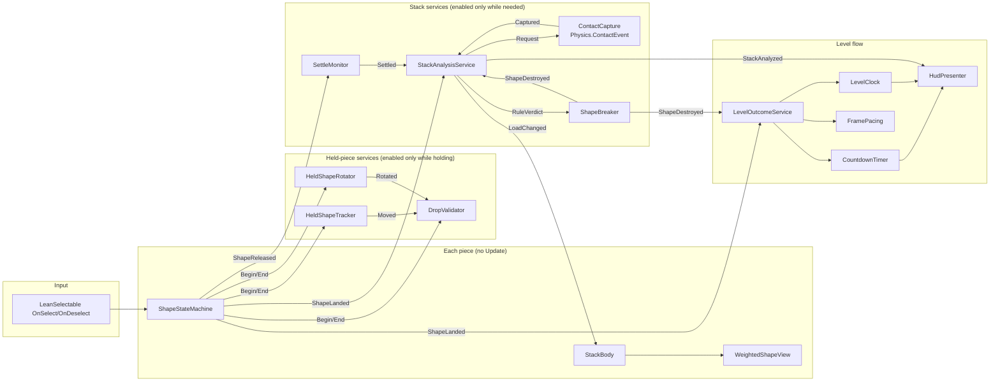

# Deep Dive 1 — Raising the Frame Rate with Event-Driven Design (EDD)

**Project:** Balance Stack Hero (an *Art of Balance* clone) · **Current engine:** Unity 2023.1.6f1 · **Target:** Unity 6.x (see the upgrade plan) · **Date:** 2026-09-23

**Companion documents:**
- [Scripts_Master_Index.md](Scripts_Master_Index.md): architecture atlas.
- [Unity6_Upgrade_and_Performance_Modernization_Plan.md](Unity6_Upgrade_and_Performance_Modernization_Plan.md), §9–11: the audit this document turns into code.
- [WeightedShape_SOLID_EDD_DeepDive.md](WeightedShape_SOLID_EDD_DeepDive.md): the stack/weight subsystem.
- [ArtOfBalance_FromScratch_Unity6.6_Implementation_Plan.md](ArtOfBalance_FromScratch_Unity6.6_Implementation_Plan.md): the from-scratch plan.

**Code produced for this document:** [`WeightLab~/FrameRate/`](WeightLab~/FrameRate) (11 gameplay components) and [`WeightLab~/Unity/`](WeightLab~/Unity) (stack-analysis adapters).

> The folder ends in `~`, so Unity ignores it: nothing in it is compiled into the game until you move it into `Assets/Scripts`.

---

## 0. How to read this document (and what was verified)

| Claim type | Label used | Meaning |
|---|---|---|
| Read directly from the source, prefabs or ProjectSettings | **Confirmed** | File and line cited |
| Follows from how Unity/PhysX work, not measured here | **Inferred** | Verify with the Profiler steps in §10 |
| Code in this document | **Type-checked** | Compiled with Roslyn (C# 9) against the Unity 2023.1.6f1 engine DLLs, the project's own Lean Touch sources, DOTween and uGUI via [`typecheck-unity.sh`](WeightLab~/typecheck-unity.sh). Result: `Type-check OK` for all three assemblies |
| Frame-time numbers on device | **Not measured** | This machine has no activated Unity licence, so nothing could be profiled in Play Mode. §10 gives the exact measurement protocol |

---

## 1. Executive summary

The game spends its frame budget on **polling**: code that runs every frame to find out whether something happened. The design goal is to invert this. **Nothing runs unless an event says it must**, and the few things that must be continuous (the held piece following the finger, a countdown) run only while they are active, on one object rather than on every piece.

| # | Change | Old (per frame) | New | Expected effect |
|---|---|---|---|---|
| 1 | **Frame-rate policy** | No `Application.targetFrameRate` anywhere, so mobile runs at the 30 fps default (Confirmed absence) | `FrameRateBootstrap`: display refresh rate capped at 120, and `OnDemandRendering` on menus | **2× ceiling** on mobile (30 → 60) |
| 2 | **Shape state machine** | `ShapeController.Update` + `LateUpdate` on **every** piece; `GetComponents<Collider>()` allocation per docked piece per frame | `ShapeStateMachine`: **no Update at all**; physics and scale set once per transition | ≈ 2·N callbacks → 0 |
| 3 | **Lean gestures only while held** | `LeanDragTranslate.Update` + `LeanTwistRotateAxis.Update` on **every** piece, each writing the transform every frame | Enabled on the held piece only | 2·N callbacks → 2; stops per-frame transform writes on resting Rigidbodies |
| 4 | **Drop validator** | A new coroutine **every drag frame**, each scanning every collider pair with `ComputePenetration` | Dirty flag; ≤ 1 broad-phase + narrow-phase check per physics step, only while dragging; event on change | Up to 60 coroutines/s and 60 scans/s → ≤ 50 cheap checks/s while dragging, 0 otherwise |
| 5 | **Settle detection** | Two 0.1 s polling coroutines per piece | One `SettleMonitor`, disabled until disturbed | N coroutines → 1 component, on only while settling |
| 6 | **Stack analysis** | Full O(n²c²) AABB recompute + infinite-tween creation on every settle event | Contact-based analyzer: ~10 µs, 0 B, runs only on settle ([Deep Dive 2](WeightedShape_SOLID_EDD_DeepDive.md)) | Removes the settle-time spikes and the tween leak |
| 7 | **HUD/clock/countdown** | `TimeSpan` + `string.Format` every frame; `ToString("N0")` every countdown frame | `LevelClock` / `CountdownTimer` raise per-second events; `HudPresenter` writes text only on change | 0 B/frame GC from the HUD |
| 8 | **Level outcome** | 5 booleans polled in `LevelManager.Update`; win and lose can both fire | `LevelOutcomeService`: explicit phase, the first terminal event wins | Correctness and less per-frame branching |
| 9 | **Debug input** | 31 `Input.GetKey` polls in `SpawnManager.Update` plus 4 in `GameManager.Update`, in release builds | Development builds only, event-based | 35 polls/frame → 0 in release |
| 10 | **Rendering** | `renderer.material` instance per piece (breaks batching); outline effect enabled on almost every piece; outline tweens leak | `MaterialPropertyBlock`; outline only on pieces that need it; one reusable tween | Fewer draw calls and passes; stable tween count |

**Per-frame callback count** (Confirmed from code, for a level with N = 14 pieces and 3 platforms):

| State | Before | After |
|---|---|---|
| Idle (no finger down, tower at rest) | 4 × 14 (shape + 2 Lean) + GameManager + LevelManager + SpawnManager ×2 + 9 empty `Update`s + 3 platform `Update`s + LeanTouch ≈ **73** | LeanTouch + LevelClock = **2** |
| Dragging a piece | the same 73, **plus one coroutine and one full penetration scan per frame** | 2 + drag + twist + tracker + rotator = **6**, and ≤ 1 validator check per physics step |
| Tower settling after a drop | 73 + N polling coroutines | 2 + one `SettleMonitor.FixedUpdate` |

---

## 2. Where the frame time goes today (Confirmed inventory)

### 2.1 Per piece, every frame (× N ≈ 9–14 pieces per level)

| Source | What it does every frame | Evidence |
|---|---|---|
| `ShapeController.Update` | Copies `lts.IsSelected` into two flags; reads `col.bounds.max.y` while resting or touching; moves the dormant `txtpop` | [ShapeController.cs:225-296](../ShapeController.cs#L225) |
| `ShapeController.LateUpdate` | Dock-line test; rebuilds physics mode from flags. **Docked pieces call `SetColliderTriggerStatus(false)` every frame**, which calls `GetComponents<Collider>()` (a new array each time). Also starts `Release()` whenever `isreleasing` is false, so a docked piece re-tweens itself back to the dock about every 0.5 s (3 DOTweens, plus `new WaitForSeconds` and `new WaitForEndOfFrame`) | [ShapeController.cs:298-420](../ShapeController.cs#L298), [812-820](../ShapeController.cs#L812), [422-481](../ShapeController.cs#L422) |
| `LeanDragTranslate.Update` | `Use.GetFingers()`, gesture math, and **`transform.localPosition = …` every frame**, even when nothing moved | [Lean/Touch/Extras/LeanDragTranslate.cs](../../Lean/Touch/Extras/LeanDragTranslate.cs) (Update) |
| `LeanTwistRotateAxis.Update` | `Use.GetFingers()` and **`transform.Rotate(axis, 0)` every frame** | [Lean/Touch/Extras/LeanTwistRotateAxis.cs](../../Lean/Touch/Extras/LeanTwistRotateAxis.cs) |
| Outline tweens | Every stack pass, `SetFaceProperties` starts **new** infinite `DOFade` loops on loaded weighted and timer pieces, and never kills the old ones. DOTween then updates a growing list of tweens every frame | [ShapeController.cs:727-766](../ShapeController.cs#L727) |

> **Inferred, and high impact:** the two Lean components write the transform of a **Rigidbody** every frame on every piece, including pieces resting in the tower. With `autoSyncTransforms` off (the project setting, Confirmed in `DynamicsManager.asset`), Unity pushes every changed transform into PhysX before the next simulation step. Moving a body that way normally **wakes it up**. The likely result is that a settled tower never sleeps, so PhysX keeps solving every contact of every piece at 50 Hz, with **30 solver iterations** (Confirmed, 5× Unity's default). Verify with the Profiler's *Physics › Active Dynamic Bodies* counter (§10). If confirmed, simply disabling the Lean components on non-held pieces may be the single largest physics saving.

### 2.2 Managers, every frame

| Source | Work | Evidence |
|---|---|---|
| `GameManager.Update` | 4 `Input.GetKey` polls. While the finger drags: **`StartCoroutine(ProcessCtrlGesture())` on every drag frame**; each coroutine runs `SpawnManager.CalculateCurShapePenetration()` (every held collider × every platform/played collider, with `GetComponents` allocations) and then allocates a `WaitForSeconds`. `StopAndRotate()` accumulates degrees and calls `GetComponent<LeanTwistRotateAxis>()` every frame | [GameManager.cs:109-185](../GameManager.cs#L109), [318-325](../GameManager.cs#L318), [355+](../GameManager.cs#L355), [SpawnManager.cs:1836-1887](../SpawnManager.cs#L1836) |
| `LevelManager.Update` | Clock: `TimeSpan.FromSeconds` + `string.Format` + UI text write **every frame**. Countdown: `ToString("N0")` every frame; win/lose checks by polling flags | [LevelManager.cs:82-113](../LevelManager.cs#L82) |
| `SpawnManager.Update` | 31 `Input.GetKey` polls (Level Maker hotkeys), shipped in release builds | [SpawnManager.cs:238-593](../SpawnManager.cs#L238) |
| Empty methods | 9 empty `Update`/`LateUpdate` (Camera, DockCollider, FloorCollider, Loader, PlatformController × platforms, RdWAnalytics, ScoreEffect, ScoreManager, UIManager) and an empty `SpawnManager.LateUpdate`. Each still costs a native→managed call per object | [Unity6 plan §10](Unity6_Upgrade_and_Performance_Modernization_Plan.md) |

### 2.3 Event-time spikes (not per frame, but felt as hitches)

- **Every settle or bump:** `ShapeController.collisionEvent` → `SpawnManager.GetStackInformation` runs a full AABB graph rebuild, an "above" walk, `ToArray` ×5+, `GetComponents` per pair and string concatenation. The lab port measures **240 µs and ~10 KB of garbage per pass** for a 15-piece tower, rising to **5.4 ms / 236 KB at 66 pieces** ([Deep Dive 2 §8](WeightedShape_SOLID_EDD_DeepDive.md)).
- **Explosions** re-enter that pass (`ShapeDestroyer` → `UpdateStackInformation`).

### 2.4 Project settings that cap or tax the frame (Confirmed)

| Setting | Value | File | Note |
|---|---|---|---|
| `Application.targetFrameRate` | never set | — | Mobile default is 30 fps |
| Default solver iterations | **30** | `DynamicsManager.asset:12` | 5× default; every contact pays for it |
| Fixed timestep | 0.02 s (50 Hz) | `TimeManager.asset:6` | Fine, but a 60 fps render needs interpolation on moving pieces |
| Sleep threshold | 0.005 | `DynamicsManager.asset:10` | Unity's default; bodies sleep once still, **unless something keeps moving them** (see §2.1) |
| Auto-sync transforms | off | `DynamicsManager.asset:22` | Good; do not turn it on |
| Reuse collision callbacks | on | `DynamicsManager.asset:23` | Good |
| Incremental GC | **off** | `ProjectSettings.asset:847` | Every garbage collection is a full stop-the-world spike |
| Shape Rigidbody CCD | ContinuousSpeculative | shape prefabs (`m_CollisionDetection: 3`) | Fine; relevant to contact separation in Deep Dive 2 |

---

## 3. EDD principles applied to Unity

1. **A disabled `MonoBehaviour` costs nothing per frame.** Unity does not call `Update`, `LateUpdate` or `FixedUpdate` on disabled components. The core pattern here is *"enable only while needed"*: `enabled = false` in `Awake`, `enabled = true` when an event starts the activity, and `enabled = false` when it ends.
2. **Turn "N objects poll" into "1 service reacts".** Only one piece can be held at a time, so dock-line tracking, drop validation and auto-rotation are single scene services bound to the held piece (`HeldPieceServices`), not per-piece `LateUpdate`s.
3. **Use the right event mechanism for the scope:**

   | Scope | Mechanism | Used for |
   |---|---|---|
   | Inside one object or subsystem | Plain C# `event Action<…>` | `StackBody.LoadChanged`, `ShapeStateMachine.StateChanged`, `DropValidator.CanDropChanged` |
   | Across systems, Inspector-wired | **ScriptableObject event channels** (`EventChannel<T>`) | `ShapeReleased`, `ShapeLanded`, `ShapeDestroyed`, `StackAnalyzed`, `RuleVerdict` |
   | UI buttons and vendor components | `UnityEvent` | Rotate buttons, Lean's `OnSelect`/`OnDeselect` |
   | Engine physics | Physics callbacks (`OnCollisionEnter`, `OnTriggerEnter`) and the batched `Physics.ContactEvent` | Landing, water, stack contacts |

   **Avoid static events.** Today's two static events are never unsubscribed, and with Unity 6.6's default *Fast Enter Play Mode* (no domain reload) static invocation lists survive between Play sessions.
4. **Subscribe in `OnEnable`, unsubscribe in `OnDisable`.** No script in the current project has either method (Confirmed). ScriptableObject channels outlive scenes, so a missing unsubscribe leaks a destroyed listener.
5. **Coalesce and mark dirty.** Many triggers in one step (finger moved, piece rotated, crossed the dock line) set a flag, and the expensive work runs once per step (`DropValidator`, `ContactCapture.Request()`).
6. **Payloads carry what listeners need** (`ShapeDestroyedEvent(body, reason)`, `WeightChange(id, old, new)`), so listeners do not query managers back. That removes the bidirectional Inspector references.
7. **Idempotent terminal events.** The first `Won`/`Lost` wins (`LevelOutcomeService`) and a piece breaks at most once (`ShapeBreaker`).
8. **Defer destructive work out of analysis passes.** Rules emit verdicts; one component applies them. `Destroy` is already deferred to the end of the frame, so there is no re-entrancy.

---

## 4. Target architecture



---

## 5. Refactor recipes (before → after)

Every "after" block below is an excerpt from a type-checked file in `WeightLab~/FrameRate` or `WeightLab~/Unity`.

### 5.1 Frame-rate policy: 30 fps → display rate

**Before:** nothing sets a target, so iOS and Android render at 30 fps.

**After** ([FramePacing.cs](WeightLab~/FrameRate/FramePacing.cs)):

```csharp
public static class FrameRateBootstrap
{
    public const int MaxFps = 120;

    [RuntimeInitializeOnLoadMethod(RuntimeInitializeLoadType.BeforeSceneLoad)]
    private static void Apply()
    {
        QualitySettings.vSyncCount = 0;
        double hz = Screen.currentResolution.refreshRateRatio.value;
        int target = hz >= 59 ? (int)System.Math.Round(hz) : 60;
        Application.targetFrameRate = Mathf.Min(target, MaxFps);
    }
}

public sealed class FramePacing : MonoBehaviour   // menus/results render at half rate; input and physics unaffected
{
    [SerializeField] private LevelOutcomeService outcome;
    [SerializeField, Range(1, 4)] private int idleRenderInterval = 2;
    private void OnEnable()  => outcome.PhaseChanged += OnPhase;
    private void OnDisable() => outcome.PhaseChanged -= OnPhase;
    private void OnPhase(LevelPhase phase)
    {
        bool gameplay = phase == LevelPhase.Playing || phase == LevelPhase.Countdown;
        OnDemandRendering.renderFrameInterval = gameplay ? 1 : idleRenderInterval;
    }
}
```

**Notes:**
- 120 Hz doubles the CPU and GPU work per second compared with 60 Hz. Ship 60 as the default on phones and offer a "High frame rate" toggle, which is kinder to battery and heat.
- On Unity 6, pair this with **Adaptive Performance** (Samsung/Android) to step down under thermal pressure.

### 5.2 `ShapeController.Update`/`LateUpdate` → `ShapeStateMachine` (no per-frame code)

**Before:** 12 boolean flags (`isdocked`, `isdropping`, `isinplayfield`, `hasbeenplayed`, `isselected`, `ismoving`, `isreturned`, `isresting`, `islsts`, `isreleasing`, `istouching`, `seqnumset`) re-derived every frame. Physics mode, trigger state and scale were re-applied every frame.

**After:** explicit states. All side effects happen **once on entry**.

| State | Entered by | One-time actions on entry |
|---|---|---|
| `Locked` | spawner (`locked`) | kinematic, solid, selection off |
| `Docked` | spawner / end of return tween / `Unlock()` | kinematic, solid, Lean drag+twist **off**, selectable on |
| `Held` | `LeanSelectable.OnSelect` | kinematic + trigger ("ghost"), Lean drag+twist **on**, grow tween, `HeldPieceServices.Begin` |
| `Returning` | `OnDeselect` with an illegal drop | services end, single DOTween `Sequence` back to the dock → `Docked` |
| `Dropping` | `OnDeselect` with a legal drop | dynamic, solid, interpolation on, one raycast for drop height, raise `ShapeReleased` |
| `Landed` | `OnCollisionEnter` while `Dropping` | interpolation off, raise `ShapeLanded` (registry + analysis + level flow) |

```csharp
private void OnEnable()
{
    selectable.OnSelect.AddListener(OnSelected);      // Lean's UnityEvent<LeanFinger>
    selectable.OnDeselect.AddListener(OnDeselected);
}
private void OnDeselected()
{
    if (State != ShapeState.Held) return;
    bool canDrop = _services.Tracker.InPlayfield && _services.Validator.EvaluateNow();   // one synchronous check at release
    Enter(canDrop ? ShapeState.Dropping : ShapeState.Returning);
}
private void OnCollisionEnter(Collision collision)
{
    if (State == ShapeState.Dropping) Enter(ShapeState.Landed);   // replaces the 0.1 s CheckPlayedStatus polling
}
private void SetGestures(bool on) { drag.enabled = on; twist.enabled = on; }   // Lean Update() runs only on the held piece
private void SetPhysics(bool kinematic, bool trigger)
{
    _rb.isKinematic = kinematic;
    for (int i = 0; i < _colliders.Length; i++) _colliders[i].isTrigger = trigger;   // cached once in Awake
}
```

**Also fixed on the way:**
- `FindObjectOfType<SpawnManager>()` and `GameObject.Find("DockCollider")` in `Start` are replaced by `Initialize(services, dockPosition, …)`, called by the spawner.
- Colliders are cached in `Initialize`, **not in `Awake`**. The Plus prefab's colliders are created by `ExtendedColliders3D.Awake` at runtime (Confirmed), and Unity does not guarantee `Awake` order between components on the same object.
- The docked re-tween loop is gone.
- `_tween?.Kill()` before every new tween means at most one tween per piece.

### 5.3 Dock line → `HeldShapeTracker` (1 object, only while holding)

**Before:** every piece tested `transform.position.y > spawnmgr.dockloc` in `LateUpdate` and wrote `spawnmgr.curshape`.

**After** ([HeldShapeTracker.cs](WeightLab~/FrameRate/HeldShapeTracker.cs)): enabled in `Begin`, disabled in `End`. It raises `Moved` only when the position changed and `DockLineCrossed` only when the side changed. `SpawnManager.curshape` disappears: `HeldPieceServices.Held` is the single source of truth.

### 5.4 Drop legality → `DropValidator` (dirty flag + broad phase)

**Before:**

```csharp
// GameManager.Update — every frame the finger moves:
if (lte.dragdelta.magnitude > 0.0f) { …; StartCoroutine(ProcessCtrlGesture()); }
// ProcessCtrlGesture → spawnmgr.CalculateCurShapePenetration() → for every held collider × every platform collider ×
// every played collider: GetComponents<Collider>() + Physics.ComputePenetration(...) → canplayshape (global bool)
```

**After** ([DropValidator.cs](WeightLab~/FrameRate/DropValidator.cs)):

```csharp
private void FixedUpdate()                       // component enabled only while a piece is held
{
    if (!_dirty) return;                         // nothing moved or rotated since the last check
    _dirty = false;
    Publish(Evaluate());                         // raises CanDropChanged only when the answer flips
}
private bool Evaluate()
{
    for (int i = 0; i < _held.Length; i++)
    {
        Collider mine = _held[i];
        Bounds b = mine.bounds;
        int n = Physics.OverlapBoxNonAlloc(b.center, b.extents, _hits, Quaternion.identity, stackLayers, QueryTriggerInteraction.Ignore);
        for (int k = 0; k < n; k++)              // narrow phase only on real neighbours
        {
            Collider other = _hits[k];
            if (other.attachedRigidbody != null && other.attachedRigidbody == _heldBody) continue;
            if (Physics.ComputePenetration(mine, mine.transform.position, mine.transform.rotation,
                                           other, other.transform.position, other.transform.rotation, out _, out float depth)
                && depth > allowedPenetration) return false;
        }
    }
    return true;
}
```

**UX bonus:** `CanDropChanged` can tint the held piece red while the drop is illegal. The original game gives similar "can't place" feedback; today the player finds out only when the piece snaps back.

### 5.5 Rotation → `HeldShapeRotator`

**Before:** `StopAndRotate()` accumulated `ctrlrotspeed * deltaTime` every frame even with nothing held. It called `GetComponent<LeanTwistRotateAxis>()` every frame, and the arrow keys were polled 4× per frame.

**After** ([HeldShapeRotator.cs](WeightLab~/FrameRate/HeldShapeRotator.cs)):
- Auto-rotation runs only while a piece is held and the finger is still.
- `RotateStep(±1)` is bound directly to the on-screen buttons (a UI event) and to Input System actions (`performed` callback).
- Every step raises `Rotated`, which marks the validator dirty. Art of Balance rotates in **45° steps**, and so does this.

### 5.6 Settle detection → `SettleMonitor`

**Before:** each dropped piece ran `CheckPlayedStatus` and later `CheckReplayStatus`, polling every 0.1 s with a new `WaitForSeconds` each time. Any piece touched by another restarted its coroutine.

**After** ([SettleMonitor.cs](WeightLab~/Unity/SettleMonitor.cs)): one component, **disabled** until `Disturb()`, which is called by `ShapeReleased`, `ShapeLanded` and `ShapeDestroyed`. While enabled, one `FixedUpdate` checks the registered bodies (skipping sleeping and kinematic ones). After `holdSeconds` of stillness it raises `Settled` **once** and disables itself.

### 5.7 Stack analysis trigger → `ContactCapture` + `StackAnalysisService`

- **Steady-state cost:** one delegate call per physics step that returns immediately (`if (!_requested) return;`).
- **On `Settled`:** the registered bodies are woken for one step (sleeping PhysX pairs report no contacts), `Request()` is called, and the next step's `Physics.ContactEvent` batch is copied without allocation and analyzed in ~10 µs.
- Only pieces whose load changed receive `LoadChanged`.

Full design in [Deep Dive 2](WeightedShape_SOLID_EDD_DeepDive.md).

### 5.8 Clock, countdown and outcome

**Before:** `LevelManager.Update`:

```csharp
if ((!countdownstarted) && (levelstarted)) { levelElapsedTime += Time.deltaTime; UpdateGameClockDisplay(); } // TimeSpan + string.Format every frame
if ((countdownstarted) && (!levelstarted)) { elapsedTime -= Time.deltaTime; cdt.text = elapsedTime.ToString("N0"); … LevelWon(); … LevelLost(); }
```

**After:**
- [LevelClock.cs](WeightLab~/FrameRate/LevelClock.cs): enabled only while playing; one int compare per frame; `SecondTicked(s)` once per second.
- [CountdownTimer.cs](WeightLab~/FrameRate/CountdownTimer.cs): the original's **three lights**; `Tick(3,2,1,0)` and `Expired`.
- [HudPresenter.cs](WeightLab~/FrameRate/HudPresenter.cs): caches `m:ss` strings once, toggles the light objects, and updates the height label only when it changes. With TextMeshPro, use `SetText("{0}:{1:00}", m, s)`, which does not allocate.
- [LevelOutcomeService.cs](WeightLab~/FrameRate/LevelOutcomeService.cs): `Idle → Playing → Countdown → Won | Lost`. The first terminal event wins, which fixes the double `LevelLost` and win+lose in one frame. Only `BreakReason.Fell` loses; a glass piece breaking is not by itself a loss, which matches the original.

### 5.9 Kill floor → `WaterKillZone`

**Before:** `FloorColliderController.OnCollisionEnter` → `GetComponent<ShapeController>()` → `Destroy` + static payload-less event. The piece stayed in `SpawnManager.playedshapes`.

**After** ([WaterKillZone.cs](WeightLab~/FrameRate/WaterKillZone.cs)): a trigger volume. It calls `rb.TryGetComponent(out StackBody)` and then `ShapeBreaker.Break(body, Fell)`. That one call unregisters the piece, plays the effect, raises `ShapeDestroyed(body, Fell)` for the outcome, camera shake and splash listeners, and destroys the piece.

### 5.10 Weighted/timer visuals → `WeightedShapeView` (fixes the tween leak)

**Before:** `SetFaceProperties()` was called for **every** played piece on **every** stack pass. Each call:
- assigned a material, creating an instance;
- fetched `Outlinable`;
- started a **new infinite** `DOFade` loop on loaded weighted and timer pieces without killing the previous one.

**After** ([WeightedShapeView.cs](WeightLab~/Unity/WeightedShapeView.cs), [RendererTintLoadIndicator.cs](WeightLab~/Unity/RendererTintLoadIndicator.cs)):
- The view listens to `StackBody.LoadChanged`, which only fires on change.
- The indicator keeps **one** tween handle, killed before any replacement, with a cached setter delegate (no closure allocation).
- Colour goes through a `MaterialPropertyBlock` (no material copies), and the label text changes only when the number changes.
- Outline plugins sit behind `ILoadIndicator`, so the Easy Performant Outline effect can be enabled only on pieces in the `Loaded` or `Critical` state.

### 5.11 Debug and Level Maker input: out of release builds

Move the 31 `SpawnManager.Update` hotkeys into a `LevelMakerDebugInput` component wrapped in `#if UNITY_EDITOR || DEVELOPMENT_BUILD`. Use Input System actions (`action.performed += …`) rather than per-frame `GetKey`. In a release build the component does not exist.

### 5.12 Mechanical cleanups (low risk, do first)

| Cleanup | Where | Why |
|---|---|---|
| Delete the 10 empty `Update`/`LateUpdate` methods | see §2.2 | Per-object native→managed call |
| Cache `GetComponent`/`GetComponents` in `Awake`; use `TryGetComponent` | ShapeController, GameManager, SpawnManager, Platform/Floor controllers | Garbage and CPU |
| `renderer.material` getter → `sharedMaterial` + `MaterialPropertyBlock` | ShapeController.Start (`ml = mr.material`, `GetComponent<Renderer>().material.color`) | Reading `.material` clones the material per object, breaking SRP Batcher and dynamic batching; per-piece colours belong in a property block |
| Remove `Debug.Log` from hot paths or wrap them in a `[Conditional("DEVELOPMENT_BUILD")]` logger | `ShapeController.LateUpdate` ("can not play" every frame while blocked), `UpdateSpawnInfo`, `ScoreManager` | String building and console I/O |
| Turn on **Incremental GC** | Player Settings | Splits collections across frames |
| `FindObjectOfType` → injected references | ShapeController, PlatformController | Scene scan per spawn; `FindObjectOfType` is obsolete in Unity 6 (`FindFirstObjectByType`) |

---

## 6. Physics settings for frame rate *and* stability

| Setting | Recommendation | Reason |
|---|---|---|
| Solver iterations | Global **back to 6–10**; set `rb.solverIterations = 20–30` **on pieces only** if stacks wobble | Platforms and triggers stop paying for tower stability |
| Sleeping | Keep default thresholds; **stop the per-frame Lean transform writes** (§2.1) so resting pieces can actually sleep | Sleeping bodies cost nearly nothing |
| Interpolation | `Interpolate` only while `Dropping`; `None` once landed (done in `ShapeStateMachine`) | Smooth 60–120 fps rendering of 50 Hz physics without interpolating the whole tower |
| Fixed timestep | Keep 0.02 s (50 Hz); consider 1/60 only if tuning needs it | Physics cost scales with the step rate |
| Collision detection | ContinuousSpeculative while dropping; Discrete once settled (optional) | Speculative contacts cost extra pairs |
| Layer collision matrix | Pieces↔pieces, pieces↔platforms, pieces↔water only; UI and dock layers collide with nothing | Fewer broad-phase pairs |
| `Physics.ContactEvent` | Set `providesContacts` only on registered bodies (done in `StackBodyRegistry.Register`) | Contact reports only where they are used |
| Radial gravity plugin (`CircularGravityForce`) | If used, restrict its layer mask to pieces and skip sleeping bodies | It runs overlap + `AddForce` per body every step |

---

## 7. Rendering and GPU budget

1. **SRP Batcher and shared materials.** Every piece currently gets its own material instance (`mr.material`). With shared materials plus `MaterialPropertyBlock` (URP: per-renderer `_BaseColor`), 14 pieces can draw in a handful of SRP-batched calls.
2. **Outlines are passes, not free.** Easy Performant Outline renders every enabled `Outlinable` into extra mask and blur passes. Today `SetFaceProperties` enables it on every unlocked regular, weighted and timer piece. Enable it only for the held piece and for weighted pieces in `Loaded`/`Critical`.
3. **Explosions.** `MeshExploder.Explode()` builds fragment meshes at break time. Pre-warm a small fragment pool per piece type, or use a baked particle burst, to avoid a GC and CPU spike exactly when the player is watching.
4. **Shadows:** one directional light, 2 cascades, short shadow distance (the tower is small), soft shadows off on low-end tiers.
5. **Post-processing:** bloom and colour grading are cheap in URP (on-tile on mobile). Avoid screen-space ambient occlusion and depth of field on phones.

---

## 8. Garbage collection: target 0 B per frame

| Old allocation source | Frequency | New |
|---|---|---|
| `GetComponents<Collider>()` in `SetColliderTriggerStatus` | per docked piece per frame | Cached `Collider[]` |
| `StartCoroutine(ProcessCtrlGesture())` + `new WaitForSeconds` | per drag frame | `DropValidator` (no coroutine) |
| `Release()` re-arm: 3 tweens + 2 yield instructions | per docked piece every ~0.5 s | Single tween on real transitions only |
| Settle polling `new WaitForSeconds(0.1f)` | per dropped piece, 10×/s | `SettleMonitor` (no coroutine) |
| Clock `TimeSpan`/`string.Format`; countdown `ToString` | per frame | Cached strings, change-only writes |
| Stack pass: `ToArray`, `GetComponents`, `List` growth, strings | per settle | Analyzer: **0 B measured** |
| Infinite `DOFade` loops | per settle, accumulating | One tween per piece |

Once no code allocates per frame, **enable Incremental GC** so any remaining level-load garbage is collected in slices.

---

## 9. Migration plan (safe order)

| Step | Change | Risk | How to verify |
|---|---|---|---|
| 1 | Frame-rate bootstrap; Incremental GC; delete empty Updates; cache components; strip debug keys and logs | Low | Profiler: callbacks per frame drop; nothing else changes |
| 2 | Disable Lean drag/twist on non-held pieces (a two-line change in today's `ShapeController`, before the full state machine) | Low | *Active Dynamic Bodies* drops to ~0 when the tower is still |
| 3 | `HudPresenter` + `LevelClock` + `CountdownTimer` | Low | GC Alloc per frame = 0 during play |
| 4 | `DropValidator` + `HeldPieceServices` + `HeldShapeTracker` + `HeldShapeRotator` (replace `GameManager.Update`) | Medium (feel) | Blocked-drop and snap-back regression tests; drag at 60 fps |
| 5 | `ShapeStateMachine` replaces `ShapeController`, with the prefab variant swapped per piece | Medium | Every piece type: pick, rotate, illegal drop, legal drop, land |
| 6 | Stack services (`SettleMonitor`, `ContactCapture`, `StackAnalysisService`, `ShapeBreaker`, `WeightedShapeView`) in **shadow mode** first: run both algorithms, log disagreements, keep the old rules authoritative | Medium–High (gameplay) | Disagreement log on the real levels; then flip the flag |
| 7 | `LevelOutcomeService` + `WaterKillZone`; retire the `LevelManager.Update` state machine | Low–Medium | Win, lose and "lose during countdown" cases; no double outcome |

---

## 10. Measurement protocol (to do on a licensed editor and a device)

1. **Baseline first.** Development build with *Autoconnect Profiler*. Record 3 scripted sessions: idle 20 s; dragging 20 s; dropping 10 pieces. Save the `.data` files.
2. **Profiler modules and counters:**
   - CPU: *PlayerLoop › Update.ScriptRunBehaviourUpdate / LateUpdate*, *FixedUpdate.PhysicsFixedUpdate*.
   - Physics: *Active Dynamic Bodies*, *Contacts*.
   - Memory: *GC Allocated In Frame*.
   - Rendering: *SetPass Calls*, *Draw Calls*.
3. **Custom markers:** wrap `StackAnalyzer.Analyze` and `DropValidator.Evaluate` in `ProfilerMarker.Auto()` blocks so their event-time cost shows up by name.
4. **Compare** before and after with the **Profile Analyzer** package (median and 95th percentile frame time, per-marker deltas).
5. **Automate** with the **Performance Testing** package: `Measure.Frames().WarmupCount(30).MeasurementCount(300).Run()` inside a PlayMode test that plays a recorded input replay, and fail CI on regressions.
6. **Acceptance targets** (mid-range 2022 Android phone):

   | Metric | Target |
   |---|---|
   | Frame rate | 60 fps stable (95th percentile ≤ 16.6 ms) |
   | Main-thread scripts | ≤ 1 ms idle, ≤ 2 ms while dragging |
   | Physics | ≤ 2 ms at 15 pieces |
   | Garbage | 0 B GC Alloc per frame in steady state |
   | Settle event | No frame over 20 ms when a piece settles or breaks |

---

## 11. What was verified in this session, and what was not

| Item | Status |
|---|---|
| All code in `WeightLab~/FrameRate` and `WeightLab~/Unity` compiles against the Unity 2023.1.6f1 engine DLLs, the project's own Lean Touch sources, DOTween and uGUI (C# 9) | ✅ Type-checked (`typecheck-unity.sh`) |
| The Unity 6 branch (`linearVelocity`) | Guarded by `#if UNITY_6000_0_OR_NEWER`; fails against 2023.1 DLLs as expected; compile it in Unity 6 |
| The stack-analysis core that `StackAnalysisService` calls | ✅ 92 automated tests pass, 0 B allocated per analysis ([Deep Dive 2](WeightedShape_SOLID_EDD_DeepDive.md)) |
| Per-frame callback counts and allocation sources in §1–2 | ✅ Confirmed from source and prefabs |
| "Resting pieces never sleep because Lean writes their transforms every frame" | ⚠️ Inferred; verify with *Active Dynamic Bodies* |
| Frame-time gains on device | ❌ Not measured: no licensed editor on this machine. Use §10 |

---

## 12. File inventory (new code)

| File | Replaces |
|---|---|
| `FrameRate/FramePacing.cs` (`FrameRateBootstrap`, `FramePacing`) | — (missing policy) |
| `FrameRate/ShapeStateMachine.cs` | `ShapeController.Update/LateUpdate/Release/CheckPlayedStatus` |
| `FrameRate/HeldPieceServices.cs` | `SpawnManager.curshape`, parts of `GameManager.Update` |
| `FrameRate/HeldShapeTracker.cs` | dock-line test in `ShapeController.LateUpdate` |
| `FrameRate/DropValidator.cs` | `GameManager.ProcessCtrlGesture`, `SpawnManager.CalculateCurShapePenetration`, `canplayshape` |
| `FrameRate/HeldShapeRotator.cs` | `GameManager.StopAndRotate`, arrow-key polling |
| `FrameRate/LevelClock.cs`, `CountdownTimer.cs`, `HudPresenter.cs` | `LevelManager.Update`, `UpdateGameClockDisplay` |
| `FrameRate/LevelOutcomeService.cs` | `LevelManager` outcome booleans, `UpdateLevelStatus` |
| `FrameRate/WaterKillZone.cs` | `FloorColliderController` |
| `Unity/SettleMonitor.cs`, `ContactCapture.cs`, `StackAnalysisService.cs`, `StackBody*.cs`, `ShapeBreaker.cs`, `WeightedShapeView.cs`, `RendererTintLoadIndicator.cs`, event channels | `SpawnManager` stack pass, `ShapeController.SetFaceProperties`, static `collisionEvent` |
