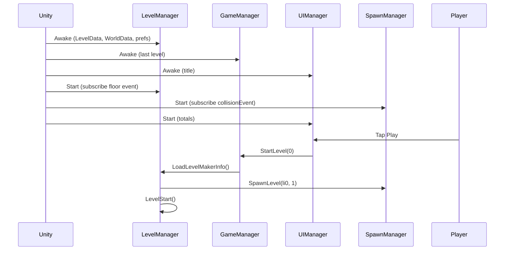
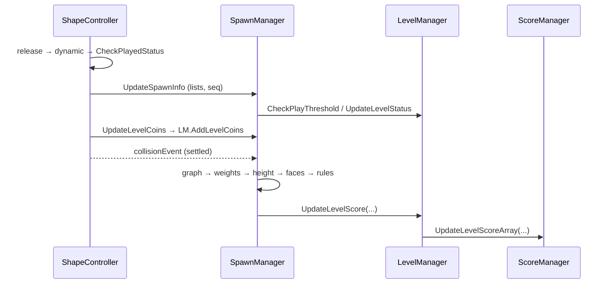
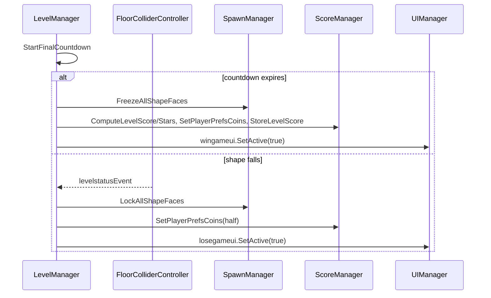

# Balance Stack Hero — `Assets/Scripts` Master Index

## 1. Title and Scope

| Item | Value |
|---|---|
| Documentation title | Balance Stack Hero: Script Reverse-Engineering Atlas |
| Analyzed folder | `Assets/Scripts/` (recursive; includes `Game/`; `UI/` is empty) |
| Unity version | **Unity 2023.1.6f1** (Confirmed: `ProjectSettings/ProjectVersion.txt`) |
| Scripts analyzed | **27 C# files** (29 top-level types; `SpawnManager.cs` also declares `ShapeInfo` and `PlatformInfo`) · 6 141 lines |
| Analysis date | 2026-09-23 |
| Method | Static analysis of the source, plus a scan of scene/prefab GUID references (which scripts are attached where) and UnityEvent method-name bindings in `Scenes/Game.unity` and prefabs |
| Out of scope | `Assets/Scripts[Orig]` (a reference copy, ignored per the project owner), third-party plugins (documented only where called) |

This document is the landing page for the per-script companion docs (`<Script>.cs.md`, one per file, mirrored under `Docs/`). It gives the architecture, dependencies, execution roots, runtime flows, risks and a reading order.

**Confidence labels used throughout:** **Confirmed from code**, **Inferred from code structure/naming**, **Unknown from current scope**.

---

## 2. Executive Overview

**What the game is (Confirmed from code).** A physics stacking puzzle for mobile (iOS/Android targets in ProjectSettings). The player drags shapes from a **dock/tray** at the top into the **playfield**, rotates them (auto 45° steps while the finger is still, or buttons/keys), and releases them onto one or more **platforms**. Shapes have types: **Regular (0), Weighted (1), Timer (2), Fire (3)**.
- Weighted shapes explode when too many shapes are "above" them.
- Timer shapes explode after a fuse once loaded.
- Touching fire shapes destroy each other.
- A shape that falls onto the floor collider loses the level.

After all shapes are played, a **final countdown** runs; if the tower survives, the level is won and scored (height, drop, bonuses, time) with 1–3 stars and coins persisted in PlayerPrefs.

**Architectural style (Inferred).**
- **Manager-heavy, Inspector-wired MonoBehaviour architecture** with bidirectional references between a handful of hub managers (`LevelManager`, `SpawnManager`, `GameManager`, `ScoreManager`, `UIManager`).
- **Polling-dominant:** per-frame `Update`/`LateUpdate` state machines, and polling coroutines at 0.1 s for settle detection.
- **Lightly event-driven:** exactly **two** static C# events are used in gameplay (`ShapeController.collisionEvent`, `FloorColliderController.levelstatusEvent`), plus unused audio events in `SoundManager`.
- **Content-as-code:** levels and worlds are hard-coded in constructors; the playable level currently comes from the Inspector-driven **Level Maker** (`LevelMakerData`), because the Play button calls `StartLevel(0)` ("temp").
- **Heavy plugin reliance:** Lean Touch (project-modified), DOTween, Easy Performant Outline, Mesh Explosion, Circular Gravity Force, TextMeshPro, HighlightPlus (unused path).

**Major observations.**
- `SpawnManager` (1 976 lines) and `ShapeController` (1 022 lines) together hold ~50 % of the code and most of the gameplay logic.
- Several latent defects are significant: an infinite loop in the level-clear path (`SpawnManager.LevelClearShapes`), non-idempotent win/lose, score arrays that never reset, unbounded outline tween creation, order-dependent explosion rules, and weight semantics based on AABBs and top-Y rather than physical support.
- About 10 scripts are stubs, orphans or dormant (`Loader`, `RdWAnalytics`, `DurationScale`, `ScoreEffect`, `DamagePopup`, `EffectManager`, `WorldData`/`WorldInfo`, `RdWUtilities` from Scripts' point of view).

---

## 3. Folder and Namespace Map

All types are in the **global namespace** (Confirmed). There are no asmdefs in `Assets/Scripts`; everything compiles into `Assembly-CSharp`.

```text
Assets/Scripts/
├── AnimatedButton.cs            UI (Ricimi-derived button)
├── CameraController.cs          Camera FX (shake)
├── DamagePopup.cs               UI stub (floating text)
├── DockColliderController.cs    Gameplay config relay (dock line)
├── DurationScale.cs             UI FX (orphan)
├── FloorColliderController.cs   Gameplay rule sensor (kill floor) + static event
├── GameManager.cs               Hub: level entry, rotation input, session stats
├── LevelData.cs                 Data: level catalog (ctor-built)
├── LevelInfo.cs                 Data: level definition
├── LevelMakerData.cs            Authoring adapter (Inspector → level 0)
├── LevelManager.cs              Hub: level lifecycle, rules, HUD, progress
├── LevelStatus.cs               Data: level metadata/progress
├── Loader.cs                    Bootstrap stub (empty)
├── PlatformController.cs        Gameplay: platform prefab behaviour
├── RdWAnalytics.cs              Analytics stub (empty)
├── ScoreEffect.cs               UI FX prototype (test scene)
├── ScoreManager.cs              Hub: scoring, stars, coins, persistence
├── ShapeController.cs           Core gameplay: per-shape state machine
├── SpawnManager.cs              Hub/god-object: spawn, stack analysis, rules, level maker (+ ShapeInfo, PlatformInfo)
├── UIManager.cs                 UI screen flow + Play entry point
├── WorldData.cs                 Data: world catalog (dormant)
├── WorldInfo.cs                 Data: world record (dormant)
├── Game/
│   ├── AppInfo.cs               Persistent config singleton (store/social)
│   ├── EffectManager.cs         VFX singleton (dormant)
│   ├── RdWUtilities.cs          Static helpers (links, prefs time, shuffle)
│   ├── Sound.cs                 Data: audio cue
│   └── SoundManager.cs          Persistent audio singleton
├── UI/                          (empty)
└── Docs/                        ← this documentation set
```

**Likely subsystem boundaries (Inferred):** the root folder is gameplay and level flow; `Game/` holds reusable template-style services (app metadata, audio, VFX, utilities), probably imported from a mobile game template (placeholder strings such as `"[YOUR_APP_NAME]"`).

---

## 4. Script Inventory Table

| Script | Path | Type | Category | Purpose | Subsystem | Companion Doc |
|---|---|---|---|---|---|---|
| AnimatedButton | `AnimatedButton.cs` | UIBehaviour, IPointerDownHandler | UI component | Press animation + delayed UnityEvent | UI | [AnimatedButton.cs.md](AnimatedButton.cs.md) |
| CameraController | `CameraController.cs` | MonoBehaviour | Controller | Camera shake | Camera/FX | [CameraController.cs.md](CameraController.cs.md) |
| DamagePopup | `DamagePopup.cs` | MonoBehaviour | Stub | Floating text holder | UI/FX | [DamagePopup.cs.md](DamagePopup.cs.md) |
| DockColliderController | `DockColliderController.cs` | MonoBehaviour | Relay | Publishes the dock line Y | Interaction | [DockColliderController.cs.md](DockColliderController.cs.md) |
| DurationScale | `DurationScale.cs` | MonoBehaviour | UI FX | Count-up label (orphan) | UI/FX | [DurationScale.cs.md](DurationScale.cs.md) |
| FloorColliderController | `FloorColliderController.cs` | MonoBehaviour | Rule sensor / emitter | Kill floor, lose event | Level rules | [FloorColliderController.cs.md](FloorColliderController.cs.md) |
| GameManager | `GameManager.cs` | MonoBehaviour | Manager/Controller | Level entry, rotation input, stats | Core / Input | [GameManager.cs.md](GameManager.cs.md) |
| LevelData | `LevelData.cs` | Serializable class | Data model | Level catalog | Level data | [LevelData.cs.md](LevelData.cs.md) |
| LevelInfo | `LevelInfo.cs` | Serializable class | Data model | Level definition | Level data | [LevelInfo.cs.md](LevelInfo.cs.md) |
| LevelMakerData | `LevelMakerData.cs` | MonoBehaviour | Authoring adapter | Inspector → level 0 | Level data / tools | [LevelMakerData.cs.md](LevelMakerData.cs.md) |
| LevelManager | `LevelManager.cs` | MonoBehaviour | Manager | Level lifecycle and rules | Level flow | [LevelManager.cs.md](LevelManager.cs.md) |
| LevelStatus | `LevelStatus.cs` | Serializable class | Data model | Metadata + progress | Level data | [LevelStatus.cs.md](LevelStatus.cs.md) |
| Loader | `Loader.cs` | MonoBehaviour | Stub | Empty bootstrap | Core | [Loader.cs.md](Loader.cs.md) |
| PlatformController | `PlatformController.cs` | MonoBehaviour | Controller | Platform behaviour; first-touch flag | Stack gameplay | [PlatformController.cs.md](PlatformController.cs.md) |
| RdWAnalytics | `RdWAnalytics.cs` | MonoBehaviour | Stub | Analytics placeholder | Analytics | [RdWAnalytics.cs.md](RdWAnalytics.cs.md) |
| ScoreEffect | `ScoreEffect.cs` | MonoBehaviour | UI FX prototype | Count-up test | UI/FX | [ScoreEffect.cs.md](ScoreEffect.cs.md) |
| ScoreManager | `ScoreManager.cs` | MonoBehaviour | Manager | Score/stars/coins/persistence | Scoring | [ScoreManager.cs.md](ScoreManager.cs.md) |
| ShapeController | `ShapeController.cs` | MonoBehaviour | Controller/state machine | Per-shape drag/drop/settle/visuals | Stack gameplay | [ShapeController.cs.md](ShapeController.cs.md) |
| SpawnManager (+ShapeInfo, PlatformInfo) | `SpawnManager.cs` | MonoBehaviour (+2 data classes) | Manager (god object) | Spawn, stack analysis, rules, level maker | Stack gameplay / Level | [SpawnManager.cs.md](SpawnManager.cs.md) |
| UIManager | `UIManager.cs` | MonoBehaviour | Manager | Screen flow; Play | UI | [UIManager.cs.md](UIManager.cs.md) |
| WorldData | `WorldData.cs` | Serializable class | Data model | World catalog | Level data (dormant) | [WorldData.cs.md](WorldData.cs.md) |
| WorldInfo | `WorldInfo.cs` | Serializable class | Data model | World record | Level data (dormant) | [WorldInfo.cs.md](WorldInfo.cs.md) |
| AppInfo | `Game/AppInfo.cs` | MonoBehaviour | Config singleton | Store/social metadata | Platform services | [Game/AppInfo.cs.md](Game/AppInfo.cs.md) |
| EffectManager | `Game/EffectManager.cs` | MonoBehaviour | Service singleton | VFX spawner (dormant) | FX | [Game/EffectManager.cs.md](Game/EffectManager.cs.md) |
| RdWUtilities | `Game/RdWUtilities.cs` | static class | Utility | Links, prefs time, shuffle | Platform services | [Game/RdWUtilities.cs.md](Game/RdWUtilities.cs.md) |
| Sound | `Game/Sound.cs` | Serializable class | Data model | Audio cue | Audio | [Game/Sound.cs.md](Game/Sound.cs.md) |
| SoundManager | `Game/SoundManager.cs` | MonoBehaviour | Service singleton | Audio + prefs + events | Audio | [Game/SoundManager.cs.md](Game/SoundManager.cs.md) |

**Scene/prefab attachment (Confirmed from the GUID scan):**
- `Game.unity`: AnimatedButton (3), CameraController, FloorColliderController, AppInfo, EffectManager, SoundManager, GameManager, LevelMakerData, LevelManager, Loader, RdWAnalytics, ScoreManager, SpawnManager, UIManager.
- Prefabs: ShapeController (24), PlatformController (8), AnimatedButton (2), DamagePopup (1), DockColliderController (1).
- `ScoreEffect.unity`: ScoreEffect.
- Not attached anywhere: DurationScale.

---

## 5. Script Classification Summary

| Category | Scripts | Role |
|---|---|---|
| **Managers (hubs)** | GameManager, LevelManager, SpawnManager, ScoreManager, UIManager | Orchestrate the level lifecycle, spawning, rules, scoring and screens. Heavily interlinked through the Inspector. |
| **Controllers (per-object)** | ShapeController, PlatformController, CameraController, FloorColliderController, DockColliderController | Behaviour of scene/prefab objects; physics callbacks; per-frame state. |
| **Service singletons** | SoundManager (persistent), AppInfo (persistent), EffectManager (scene) | Cross-cutting services (template-derived). |
| **Data models** | LevelData, LevelInfo, LevelStatus, WorldData, WorldInfo, Sound, ShapeInfo*, PlatformInfo* | Plain serializable classes for content and progress. (*in SpawnManager.cs) |
| **Authoring adapter** | LevelMakerData | Inspector-driven level definition. |
| **UI components** | AnimatedButton, DamagePopup | UI input/visual parts. |
| **Static utilities** | RdWUtilities | Platform links and helpers. |
| **Stubs/prototypes/orphans** | Loader, RdWAnalytics, DurationScale, ScoreEffect | No functional effect in the Game scene. |
| **Interfaces / ScriptableObjects / Editor tools / explicit state machines** | none | None exist. The state machines are implicit (boolean flags) in ShapeController and LevelManager. |

---

## 6. Architectural Subsystems

### 6.1 Core bootstrap & level entry
- **Purpose:** start the session and route "Play" into a level.
- **Scripts:** UIManager (Play), GameManager (StartLevel), LevelManager (LoadLevel*), Loader (stub).
- **Entry points:** `UIManager.PlayButtonPressed` (UI), Awake/Start of the managers.
- **Critical dependencies:** Inspector cross-references; Awake order (UIManager ↔ GameManager).
- **Risks:** hard-coded `StartLevel(0)`; no explicit init order; the debug canvas is shown in production.
- **Docs:** [UIManager.cs.md](UIManager.cs.md), [GameManager.cs.md](GameManager.cs.md), [LevelManager.cs.md](LevelManager.cs.md), [Loader.cs.md](Loader.cs.md)

### 6.2 Input & shape interaction
- **Purpose:** pick, move, rotate and drop shapes; enforce the dock line and no-overlap drops.
- **Scripts:** ShapeController, GameManager, DockColliderController, SpawnManager (`curshape`, `canplayshape`, `CalculateCurShapePenetration`), Lean Touch (external).
- **Entry points:** `ShapeController.Update/LateUpdate` (polling Lean selection), `GameManager.Update` (keys + drag delta), UI rotation buttons.
- **Risks:** per-frame polling, a coroutine storm while dragging, expensive penetration checks, legacy Input Manager.
- **Docs:** [ShapeController.cs.md](ShapeController.cs.md), [GameManager.cs.md](GameManager.cs.md), [DockColliderController.cs.md](DockColliderController.cs.md), [SpawnManager.cs.md](SpawnManager.cs.md)

### 6.3 Stack physics analysis & shape rules (weights, timers, fire)
- **Purpose:** turn physics state into a touching graph, weights, height and explosions.
- **Scripts:** SpawnManager (graph/rules), ShapeController (settle detection, visuals, `collisionEvent`), PlatformController (first-contact flag).
- **Entry points:** `ShapeController.collisionEvent` → `SpawnManager.UpdateStackInformation`.
- **Risks:** AABB and top-Y weight semantics; order-dependent and re-entrant rules; tween accumulation; O(n²c²) passes per settle.
- **Docs:** [SpawnManager.cs.md](SpawnManager.cs.md), [ShapeController.cs.md](ShapeController.cs.md), [PlatformController.cs.md](PlatformController.cs.md)

### 6.4 Level flow & rules (win/lose/countdown)
- **Purpose:** level phases, the countdown, the win/lose rules and outcomes.
- **Scripts:** LevelManager, FloorColliderController, SpawnManager (relay), UIManager (popups).
- **Entry points:** `LevelManager.Update`, `FloorColliderController.OnCollisionEnter` → static event, `SpawnManager` → `LevelManager.UpdateLevelStatus`.
- **Risks:** non-idempotent outcomes, the min-height rule firing on the first shape, the Retry/Next freeze.
- **Docs:** [LevelManager.cs.md](LevelManager.cs.md), [FloorColliderController.cs.md](FloorColliderController.cs.md)

### 6.5 Scoring, coins & progress persistence
- **Scripts:** ScoreManager, LevelManager (grand totals, unlocks), GameManager (games played), SoundManager (audio prefs), RdWUtilities (time prefs).
- **PlayerPrefs keys (Confirmed):** `CurrentLevel`, `LevelLocked-N`, `LevelScore-N`, `LevelStars-N`, `PlayerCoins`, `TotalGamesPlayed`, `MusicPreference`, `SoundPreference`.
- **Risks:** score arrays not reset (`Array.Initialize` no-op), Level Maker tallies missing, coins halved twice on a double loss.
- **Docs:** [ScoreManager.cs.md](ScoreManager.cs.md), [LevelManager.cs.md](LevelManager.cs.md)

### 6.6 Level & world data / authoring
- **Scripts:** LevelData, LevelInfo, LevelStatus, LevelMakerData, WorldData, WorldInfo, ShapeInfo/PlatformInfo.
- **Risks:** hard-coded content (only level 1 authored); no bounds checks; parallel-array authoring; `li[0]` polluted by spawning.
- **Docs:** [LevelData.cs.md](LevelData.cs.md), [LevelInfo.cs.md](LevelInfo.cs.md), [LevelMakerData.cs.md](LevelMakerData.cs.md), [LevelStatus.cs.md](LevelStatus.cs.md), [WorldData.cs.md](WorldData.cs.md), [WorldInfo.cs.md](WorldInfo.cs.md)

### 6.7 UI / HUD / FX
- **Scripts:** UIManager, LevelManager (HUD texts), AnimatedButton, CameraController, EffectManager (dormant), DamagePopup (stub), DurationScale/ScoreEffect (prototypes).
- **Risks:** per-frame clock string formatting; UI and state coupled through GameObject toggles.

### 6.8 Platform services & audio
- **Scripts:** SoundManager, Sound, AppInfo, RdWUtilities, RdWAnalytics (stub).
- **Risks:** gameplay audio is unwired; placeholder store IDs; legacy analytics package.
- **Docs:** [Game/SoundManager.cs.md](Game/SoundManager.cs.md), [Game/AppInfo.cs.md](Game/AppInfo.cs.md), [Game/RdWUtilities.cs.md](Game/RdWUtilities.cs.md), [RdWAnalytics.cs.md](RdWAnalytics.cs.md)

---

## 7. Cross-Script Dependency Map

```text
                                   ┌────────────────┐
                    Play button ──►│   UIManager    │◄──────────────┐ (wingameui / losegameui)
                                   └───────┬────────┘               │
                                           │ StartLevel(0)          │
                                           ▼                        │
 FloorColliderController ─camctlr─►┌────────────────┐ ◄─────────────┼───────────────┐
   │  (static levelstatusEvent)    │  GameManager   │──LoadLevel*──►│               │
   │                               └───┬───────┬────┘               │               │
   │                    curshape/pen.  │       │ Get*/Increment     │               │
   │                                   ▼       ▼                    │               │
   │                         ┌────────────────┐ UpdateLevelStatus ┌─┴──────────────┐│
   │                         │  SpawnManager  │──────────────────►│  LevelManager  ││
   │                         │  (god object)  │◄──SpawnLevel──────│  (orchestrator)││
   │                         └──┬─────────▲───┘  Freeze/Lock      └──┬──────┬──────┘│
   │     touching/above/weight  │         │ collisionEvent (static)  │      │       │
   │     SetFaceProperties      ▼         │ UpdateSpawnInfo          │      │ reads │
   │                         ┌────────────┴───┐                     │      ▼       │
   └──(destroys shapes)────► │ShapeController │ ◄── istouching ── PlatformController│
                             │  (×N, prefab)  │                     │  ScoreManager ─┘
                             └────────────────┘                     │  (reads curlevelinfo)
                                      ▲ dockloc                     ▼
                           DockColliderController         LevelData / LevelInfo / LevelStatus
                                                          LevelMakerData / WorldData / WorldInfo
 Game/: RdWUtilities ─► SoundManager, AppInfo       (EffectManager, Loader, RdWAnalytics: isolated)
```

**Hubs (distinct script-to-script edges, computed in [Scripts_Dependency_Map.md](Scripts_Dependency_Map.md)):** LevelManager (in 6 / out 12), SpawnManager (in 5 / out 10), GameManager (in 5 / out 4), ShapeController (in 5 / out 2, plus 8 external categories), ScoreManager (in 2 / out 3).

**Most important dependency chains:**
1. **Play loop:** `UIManager → GameManager → LevelManager → SpawnManager → ShapeController ⟲ SpawnManager → LevelManager → ScoreManager`.
2. **Settle loop (event):** `ShapeController.collisionEvent → SpawnManager (graph, weights, rules) → ShapeController.SetFaceProperties / MeshExploder → LevelManager.UpdateLevelScore → ScoreManager`.
3. **Lose loop (event):** `FloorColliderController.levelstatusEvent → LevelManager.UpdateLevelStatus → LevelLost → SpawnManager.LockAllShapeFaces, ScoreManager coins, UIManager.losegameui`.
4. **Drop permission:** `GameManager.Update → SpawnManager.CalculateCurShapePenetration → canplayshape → ShapeController.Release`.

**Cycles (bidirectional Inspector references):** LevelManager↔SpawnManager, LevelManager↔ScoreManager, LevelManager↔GameManager, LevelManager↔UIManager, GameManager↔SpawnManager, SpawnManager↔ShapeController.

**Static/global patterns:** `SoundManager.Instance`, `AppInfo.Instance`, `EffectManager.instance`, 2 static gameplay events, 2 static audio events, `FindObjectOfType` in ShapeController/PlatformController, `GameObject.Find` by name in SpawnManager/ShapeController, `FindGameObjectsWithTag` in LevelManager/SpawnManager.

**Inheritance/interfaces:** only `AnimatedButton : UIBehaviour, IPointerDownHandler`. There are no project interfaces.

---

## 8. Execution Roots and Global Entry Points

| Root type | Scripts / methods |
|---|---|
| Scene lifecycle (Awake) | LevelManager (catalogs, progress), GameManager (last level), UIManager (screens), AppInfo/SoundManager/EffectManager (singletons) |
| Scene lifecycle (Start) | LevelManager (subscribe floor event), SpawnManager (subscribe collision event, CGF), GameManager (scheme, stats), UIManager (totals), SoundManager (prefs), AppInfo (links), DockColliderController (dock line) |
| Per-frame | **GameManager.Update** (input/rotation), **LevelManager.Update** (clock/countdown), **SpawnManager.Update** (debug keys), **ShapeController.Update + LateUpdate ×N**, plus 9 empty Update/LateUpdate methods |
| UI-driven | UIManager.PlayButtonPressed; GameManager rotation/speed/scheme buttons; SpawnManager.Button*; AnimatedButton.OnPointerDown |
| Physics-driven | FloorColliderController.OnCollisionEnter, PlatformController.OnCollisionEnter, ShapeController.OnCollisionEnter |
| Event-driven | ShapeController.collisionEvent → SpawnManager.UpdateStackInformation; FloorColliderController.levelstatusEvent → LevelManager.UpdateLevelStatus |
| Coroutine flows | SpawnManager.CreateShapeDelay/TimedDestroy/debug; ShapeController.Release/CheckPlayedStatus/CheckReplayStatus; GameManager.ProcessCtrlGesture; CameraController.Shake; SoundManager.CRPlaySound |
| Static init | None (no static constructors) |

---

## 9. End-to-End Runtime Flow Summary

1. **Game.unity loads.** Singletons claim their instances. `LevelManager.Awake` builds `LevelData`/`WorldData` and reads PlayerPrefs totals. `GameManager.Awake` reads `CurrentLevel`. `UIManager.Awake` shows the title.
2. **Start.** Managers subscribe to the static events. `UIManager` shows the coin, score and star totals. The dock line is published. Audio prefs are applied.
3. **Title idle.** Per-frame `Update`s already run (GameManager accumulates play time, SpawnManager polls debug keys).
4. **Player taps Play.** `UIManager` switches to the HUD (and debug canvas) → `GameManager.StartLevel(0)` → `LevelManager.LoadLevelMakerInfo()` → `LevelMakerData` fills slot 0 → `SpawnManager.SpawnLevel` (platforms now, shapes every 0.3 s) → `ScoreManager.LoadScoreInformation` → `LevelStart` (reset, HUD, clock).
5. **Play.** The player drags shapes (Lean → ShapeController), rotates (GameManager), and drops when there is no overlap (SpawnManager penetration check). Landing sets `istouching`; the shape is registered as played → level rules → coins. When it settles, `collisionEvent` triggers the stack analysis → weights and visuals → explosions → score snapshot.
6. **All shapes played** → the level-type checks → final countdown (LevelManager.Update).
7. **Outcome.** Win: freeze the tower, compute score, stars and coins, persist, show the win popup. Lose (a shape fell): lock shapes, halve the coins, show the lose popup.
8. **After.** No code path in Scripts returns to the title or advances levels safely (`StartNextLevel`/`LevelReset` would hang).

---

## 10. Cross-Script Call Flow Atlas

### 10.1 Startup / boot
```text
Scene Load
 ├─ AppInfo.Awake / SoundManager.Awake / EffectManager.Awake        (singletons)
 ├─ LevelManager.Awake → new LevelData() → new WorldData() → GetLevelAllStatus → ComputeGrandScore → ScoreManager.GetPlayerPrefsCoins
 ├─ GameManager.Awake  → LevelManager.GetLastPlayedLevel
 └─ UIManager.Awake    → canvases → GameManager.GetCurrentLevel      (order-sensitive)
Start
 ├─ LevelManager.Start  → FloorColliderController.levelstatusEvent += UpdateLevelStatus
 ├─ SpawnManager.Start  → ShapeController.collisionEvent += UpdateStackInformation ; CGF.ForcePower
 ├─ GameManager.Start   → SpawnManager.ctrlscheme ; GetTotalGamesPlayed
 ├─ UIManager.Start     → LevelManager.GetPlayerCoins/GrandScore/GrandStars
 ├─ DockColliderController.Start → SpawnManager.dockloc
 └─ SoundManager.Start  → prefs → mute
```

### 10.2 UI Play → level spawn
```text
UIManager.PlayButtonPressed
 └─ GameManager.StartLevel(0)
     └─ LevelManager.LoadLevelMakerInfo
         ├─ RefreshFromInspector → LevelMakerData.SetLevelMakerShapes(ref ld)
         ├─ LevelData.GetLevelData(0)
         ├─ SpawnManager.SpawnLevel(li0, 1)
         │    ├─ Coroutine CreateShapeDelay → Instantiate shapes (0.3 s cadence) → ShapeController.Start
         │    └─ Instantiate platforms → PlatformController.Awake/SetPlatformMaterial → DOPunchScale
         ├─ ScoreManager.LoadScoreInformation(1)
         ├─ SetLevelInfoVars
         └─ LevelStart → ScoreManager.InitializeLevelScore → GameHUDResetUI → BeginLevelStopWatch
```

### 10.3 Interaction: drag, rotate, drop
```text
Lean Touch → LeanSelectable.IsSelected ──(polled)──► ShapeController.Update/LateUpdate
                                                        ├─ y ≤ dockloc → SpawnManager.curshape = this (ghost: trigger+kinematic)
LeanTouch.OnGesture → LeanTouchEvents.dragdelta ─(polled)─► GameManager.Update
                                                        ├─ drag → ProcessCtrlGesture → SpawnManager.CalculateCurShapePenetration → canplayshape
                                                        └─ still → StopAndRotate → LeanTwistRotateAxis.RotateMe(45) → CalculateCurShapePenetration
Release → ShapeController.LateUpdate → Release()
          ├─ !canplayshape → tween back to dock
          └─ ok → dynamic physics → raycast dropheight → CheckPlayedStatus
```

### 10.4 Played shape & settle (event)
```text
PhysX → PlatformController/ShapeController.OnCollisionEnter → istouching
ShapeController.CheckPlayedStatus
 ├─ UpdateSpawnInfo → SpawnManager lists → ScoreManager.AddPlayedShapeToSeq
 │                  → LevelManager.CheckPlayThreshold (unlock) → LevelManager.UpdateLevelStatus (rules/complete)
 │                  → CalculateShapeScore → LevelManager.AddLevelCoins
 └─ (rest) ForceScoreUpdate → collisionEvent
        └─ SpawnManager.UpdateStackInformation → GetShapeInfo2 → GetShapeInfoAbove → GetStackInfo
              → SetAllShapeFaces → ProcessShapeStack(→ ShapeDestroyer/TimedDestroy → MeshExploder)
              → CallLevelScoreStatus → LevelManager.UpdateLevelScore → ScoreManager.UpdateLevelScoreArray
```

### 10.5 Win / lose
```text
LevelManager.UpdateLevelStatus(all played) → LevelCompleteChecks → StartFinalCountdown
LevelManager.Update (countdown)
 ├─ expires → LevelWon → SpawnManager.FreezeAllShapeFaces → ScoreManager.Compute*/SetCoins/Store → UIManager.wingameui
 └─ shapefell → LevelLost(0)
FloorColliderController.OnCollisionEnter → Destroy + CameraController.ShakeStaticCamera → levelstatusEvent
 → LevelManager.UpdateLevelStatus() → [playing] LevelLost(3) → SpawnManager.LockAllShapeFaces → ScoreManager coins → UIManager.losegameui
```

### 10.6 Scene transition / next level
```text
(no bound UI) LevelManager.StartNextLevel → UnlockNextLevel → NextLevelSequence → SpawnManager.LevelClearShapes → ∞ LOOP (freeze)
(debug) SpawnManager keys L/K → Advance/RetreatLevel → DestroyAll* + LevelManager.LoadLevelInfo(±1)
```

---

## 11. Data Flow Across Scripts

| Flow | Source | Transformations | Destination | Scripts |
|---|---|---|---|---|
| Level content | LevelData ctor / LevelMakerData Inspector | `LevelInfo` lists → spawn | Shape/platform instances | LevelData, LevelMakerData, LevelManager, SpawnManager |
| Input | Lean Touch, legacy Input | selection mirror; drag delta → rotation speed; 45° accumulation | Shape transform, `curshape`, `canplayshape` | ShapeController, GameManager, SpawnManager |
| Stack height | collider AABB top (first collider) | max over played shapes | ScoreManager.levelscoredata[0] → height score; min-height rule | ShapeController, SpawnManager, LevelManager, ScoreManager |
| Weight | AABB touching graph + top-Y | transitive "higher" count | outline visuals; overweight explode; total weight score | SpawnManager, ShapeController |
| Coins | drop height + play order | map + ceil + seqnum | curlevelcoins → HUD → PlayerPrefs (full on win, half on loss) | ShapeController, SpawnManager, LevelManager, ScoreManager |
| Game state flags | physics and timer events | booleans | Won/Lost UI, locks | LevelManager, FloorColliderController |
| Progress | PlayerPrefs | grand sums, unlocks | Title totals | LevelManager, ScoreManager, UIManager |
| Config | Inspector (SpawnManager) | read at shape Start | Rigidbody, scale, materials | SpawnManager → ShapeController |

```text
[Finger] → Lean → ShapeController ─drop→ PhysX ─contact→ istouching ─→ SpawnManager lists ─→ LevelManager rules ─→ ScoreManager
                                              │
                                              └─settle→ collisionEvent → SpawnManager graph ─→ weights ─→ ShapeController visuals
                                                                                   │            └──→ explode rules → MeshExploder
                                                                                   └─→ height/weight/tallies → LevelManager → ScoreManager → PlayerPrefs
```

---

## 12. Event Flow and Messaging Summary

| Event | Emitter | Listener(s) | Meaning | Coupling / lifecycle concerns |
|---|---|---|---|---|
| `ShapeController.collisionEvent` (static, no payload) | ShapeController.ForceScoreUpdate | SpawnManager.UpdateStackInformation | A shape settled or re-settled; recompute everything | Never unsubscribed; fires often; a full O(n²c²) pass per fire; its "has subscribers" state gates the replay logic |
| `FloorColliderController.levelstatusEvent` (static, no payload) | FloorColliderController.OnCollisionEnter | LevelManager.UpdateLevelStatus() | A shape fell | Never unsubscribed; no payload (the shape is not removed from registries) |
| `SpawnManager.touchingEvent` (static) | none | SpawnManager.ProcessShapeStack | dead | — |
| `SoundManager.MusicStatusChanged/SoundStatusChanged` (static) | SoundManager | none in Scripts | pref toggles | unknown external listeners |
| UnityEvents (scene) | UI buttons/touch controls | UIManager.PlayButtonPressed, GameManager rotation methods, SpawnManager.Button* | UI actions | Inspector-only wiring |
| `AnimatedButton.m_OnClick` | AnimatedButton | Inspector listeners | delayed click | the getter is recursive |

Everything else is **direct method calls** through Inspector references.

---

## 13. Use Cases and User Journeys Across the Codebase

| Journey | User-facing action | Scripts | Execution chain | Docs |
|---|---|---|---|---|
| Launch | Open the app, see the title with totals | UIManager, LevelManager, GameManager, singletons | §10.1 | UIManager, LevelManager |
| Start playing | Tap Play | UIManager → GameManager → LevelManager → LevelMakerData → SpawnManager | §10.2 | UIManager, LevelMakerData |
| Place a shape | Drag, rotate, release | ShapeController, GameManager, SpawnManager, DockColliderController | §10.3 | ShapeController, GameManager |
| Blocked drop | Release while overlapping → returns to the tray | ShapeController.Release, SpawnManager.CalculateCurShapePenetration | §10.3 | ShapeController, SpawnManager |
| Build the tower | Shapes land, coins increase | PlatformController, ShapeController, SpawnManager, LevelManager, ScoreManager | §10.4 | SpawnManager |
| Weighted warning / explosion | Outline turns yellow/red, then explodes | SpawnManager, ShapeController | §10.4 | SpawnManager, ShapeController |
| Unlock locked shapes | After N plays, grey shapes become playable | LevelManager.CheckPlayThreshold, ShapeController | §10.4 | LevelManager |
| Win | Countdown ends → "YOU WON!!" | LevelManager, ScoreManager, SpawnManager, UIManager | §10.5 | LevelManager, ScoreManager |
| Lose | A shape hits the floor → shake → "YOU LOST!!" | FloorColliderController, CameraController, LevelManager, UIManager | §10.5 | FloorColliderController |
| Toggle audio | Settings toggle (if wired) | SoundManager | ToggleSound/Music | Game/SoundManager |
| Rate / contact | Tap a link button (if wired) | RdWUtilities, AppInfo | OpenURL | Game/RdWUtilities |

---

## 14. Sequence Diagrams for Major Flows

### Startup → Play


### Shape played → stack analysis


### Win / lose


---

## 15. Key Hub Scripts and High-Risk Change Points

| Script | Why it matters | Depends on it | Change risk | Blast radius |
|---|---|---|---|---|
| **SpawnManager** | Spawning, drop legality, stack graph, weights, rules, relays | ShapeController, GameManager, LevelManager, PlatformController, DockCollider | **Very high** (freeze bug, re-entrancy) | Whole play loop |
| **LevelManager** | Level state machine, rules, outcomes, persistence, HUD | GameManager, SpawnManager, ScoreManager, UIManager, FloorCollider | **Very high** | All outcomes, progress |
| **ShapeController** | Per-shape interaction and settle; emits the stack event; visuals | SpawnManager, GameManager, LevelManager, PlatformController | **Very high** (per-frame ×N) | Feel, performance, scoring |
| **GameManager** | Input/rotation, level entry, stats | UIManager, LevelManager, SpawnManager, FloorCollider | High | Rotation feel, drop permission |
| **ScoreManager** | Score correctness, persistence | LevelManager | High | Scores, stars, coins |
| **FloorColliderController** | The lose condition | LevelManager (event) | Medium–High | Lose flow |
| **LevelMakerData** | Defines the level actually played | LevelManager | Medium–High | Content |

---

## 16. Dead Ends, Orphans, and Ambiguous Scripts

| Script / member | Status | Confidence |
|---|---|---|
| DurationScale | Not attached anywhere (orphan) | Confirmed (GUID scan) |
| ScoreEffect | Only in the test scene `ScoreEffect.unity` | Confirmed |
| Loader | Attached, but empty | Confirmed |
| RdWAnalytics | Attached, but empty (commented examples) | Confirmed |
| EffectManager | Attached; `ShowVFX` has no callers in Scripts | Confirmed (callers outside Scripts Unknown) |
| DamagePopup / `SpawnManager.DoFloatingText` / `ShapeController.txtpop` | Dormant floating-text path | Confirmed |
| WorldData / WorldInfo / `LevelManager.GetWorldInfoData` / `UIManager.LoadLevelSelectScreen` | Dormant level-select subsystem | Confirmed |
| RdWUtilities | No callers in Scripts; same-named prefab UnityEvent bindings target unresolved components | Unknown |
| SoundManager gameplay cues | Defined but never played | Confirmed |
| `LevelManager.LevelReset` / `StartNextLevel` | Not bound; would hang | Confirmed |
| `SpawnManager.touchingEvent`, `UpdateShapeStatus`, `UpdateAfterStackProcess`, `Begin/SpawnNew`, `ClearPSpawnPoint`, `SetPlatSpawnLoc` | Dead code | Confirmed |
| `ShapeController` helpers (`CalcOverlapDistance`, `BoundsContainedPercentage`, `GetClosestPoint`, `UpdateSpawnInfoLastShape`) | Dead code | Confirmed |
| Root-level copies of these scripts directly under `Assets/` (identical content) | The project owner states the game compiles; the generated csproj (May 2024) lists only `Assets\Scripts\*`. They are treated as reference copies | Unknown / verify before the Unity 6 upgrade |

---

## 17. Codebase Smells and Maintainability Notes

- **God objects:** SpawnManager (6+ responsibilities) and LevelManager (5+).
- **Bidirectional coupling** through public Inspector fields between all managers; no interfaces; everything public.
- **Implicit state machines** built from 6–12 booleans (ShapeController, LevelManager), with reachable invalid states.
- **Polling over events:** Lean selection, drag delta, settle detection (0.1 s polls), per-frame clock text, debug key polling.
- **Static events without unsubscription.**
- **Execution-order fragility:** UIManager.Awake reads GameManager state; no `DefaultExecutionOrder`; `Loader` is unused.
- **Magic numbers and codes:** shape types 0–3, level types 0–2, loss types, score array indices, 45°, 0.1 s polls.
- **Content as code** (LevelData/WorldData constructors).
- **Allocation-heavy hot paths:** `GetComponents`, `ToArray`, `FindGameObjectsWithTag`, `new WaitForSeconds`, string concatenation/formatting, `Debug.Log`.
- **Dead code and large commented blocks** in most scripts.
- **Testability:** none; logic is embedded in MonoBehaviours and relies on scene wiring and PlayerPrefs.
- **Obsolete/renamed APIs to watch for Unity 6:** `FindObjectOfType`, `Rigidbody.angularDrag`, legacy Input Manager, legacy uGUI `Text` (still supported), legacy Analytics package.

---

## 18. Recommended Reading Order

1. [Scripts_Master_Index.md](Scripts_Master_Index.md) (this file)
2. [UIManager.cs.md](UIManager.cs.md): how play starts
3. [GameManager.cs.md](GameManager.cs.md): level entry + rotation input
4. [LevelManager.cs.md](LevelManager.cs.md): level lifecycle and rules
5. [ShapeController.cs.md](ShapeController.cs.md): the per-shape state machine
6. [SpawnManager.cs.md](SpawnManager.cs.md): spawning, stack graph, weights, explosions
7. [ScoreManager.cs.md](ScoreManager.cs.md): scoring and persistence
8. [FloorColliderController.cs.md](FloorColliderController.cs.md), [PlatformController.cs.md](PlatformController.cs.md), [DockColliderController.cs.md](DockColliderController.cs.md): physics touchpoints
9. [LevelData.cs.md](LevelData.cs.md), [LevelInfo.cs.md](LevelInfo.cs.md), [LevelMakerData.cs.md](LevelMakerData.cs.md), [LevelStatus.cs.md](LevelStatus.cs.md): data
10. [CameraController.cs.md](CameraController.cs.md), [AnimatedButton.cs.md](AnimatedButton.cs.md): presentation
11. `Game/` services: [SoundManager](Game/SoundManager.cs.md), [Sound](Game/Sound.cs.md), [AppInfo](Game/AppInfo.cs.md), [RdWUtilities](Game/RdWUtilities.cs.md), [EffectManager](Game/EffectManager.cs.md)
12. Stubs: [Loader](Loader.cs.md), [RdWAnalytics](RdWAnalytics.cs.md), [DamagePopup](DamagePopup.cs.md), [DurationScale](DurationScale.cs.md), [ScoreEffect](ScoreEffect.cs.md), [WorldData](WorldData.cs.md), [WorldInfo](WorldInfo.cs.md)

---

## 19. Companion Markdown Index

**Core flow & managers**
- [GameManager.cs.md](GameManager.cs.md) · [LevelManager.cs.md](LevelManager.cs.md) · [SpawnManager.cs.md](SpawnManager.cs.md) · [ScoreManager.cs.md](ScoreManager.cs.md) · [UIManager.cs.md](UIManager.cs.md) · [Loader.cs.md](Loader.cs.md)

**Stack gameplay (controllers)**
- [ShapeController.cs.md](ShapeController.cs.md) · [PlatformController.cs.md](PlatformController.cs.md) · [FloorColliderController.cs.md](FloorColliderController.cs.md) · [DockColliderController.cs.md](DockColliderController.cs.md)

**Data & authoring**
- [LevelData.cs.md](LevelData.cs.md) · [LevelInfo.cs.md](LevelInfo.cs.md) · [LevelStatus.cs.md](LevelStatus.cs.md) · [LevelMakerData.cs.md](LevelMakerData.cs.md) · [WorldData.cs.md](WorldData.cs.md) · [WorldInfo.cs.md](WorldInfo.cs.md)

**Presentation / FX**
- [AnimatedButton.cs.md](AnimatedButton.cs.md) · [CameraController.cs.md](CameraController.cs.md) · [DamagePopup.cs.md](DamagePopup.cs.md) · [DurationScale.cs.md](DurationScale.cs.md) · [ScoreEffect.cs.md](ScoreEffect.cs.md)

**Services (`Game/`)**
- [Game/AppInfo.cs.md](Game/AppInfo.cs.md) · [Game/EffectManager.cs.md](Game/EffectManager.cs.md) · [Game/RdWUtilities.cs.md](Game/RdWUtilities.cs.md) · [Game/Sound.cs.md](Game/Sound.cs.md) · [Game/SoundManager.cs.md](Game/SoundManager.cs.md)

**Analytics**
- [RdWAnalytics.cs.md](RdWAnalytics.cs.md)

**Follow-on documents in this folder**
- [Scripts_Dependency_Implementation_Plan.md](Scripts_Dependency_Implementation_Plan.md) · [Scripts_Dependency_Map.md](Scripts_Dependency_Map.md) · [Scripts_Dependency_Showcase.html](Scripts_Dependency_Showcase.html)
- [Unity6_Upgrade_and_Performance_Modernization_Plan.md](Unity6_Upgrade_and_Performance_Modernization_Plan.md)

---

## 20. Final Codebase Summary

- **What it does:** a mobile physics stacking game. Drag, rotate and drop typed shapes onto platforms; weighted, timer and fire rules; a final countdown; scored with stars and coins persisted in PlayerPrefs.
- **How it is structured:** five Inspector-wired managers around a per-shape controller, with polling-heavy per-frame logic, two static events, hard-coded or Inspector-authored level data, and template-style services in `Game/`.
- **Scripts that matter most:** SpawnManager, LevelManager, ShapeController, GameManager, ScoreManager.
- **Biggest risks:**
  1. The freeze in `SpawnManager.LevelClearShapes` (Retry/Next).
  2. Non-idempotent win/lose and first-shape loss on min-height levels.
  3. Score arrays that never reset.
  4. Unbounded outline tween creation.
  5. Order-dependent and re-entrant explosion rules with non-physical weight semantics.
  6. Per-frame allocations and polling (drag coroutine storm, docked shape churn).
- **Where to start:** read `ShapeController` → `SpawnManager` for gameplay, and `LevelManager` for flow. For the upgrade and performance work, see the dependency atlas and the Unity 6 modernization plan in this folder.
