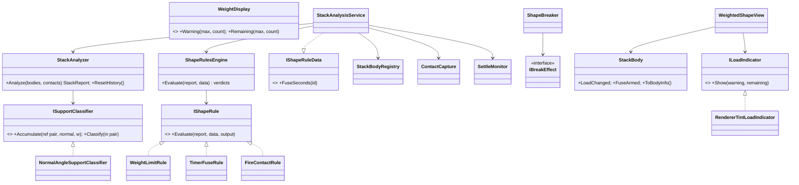

# Deep Dive 2 — Weighted-Shape Calculation & Display with SOLID + Event-Driven Design

**Project:** Balance Stack Hero (an *Art of Balance* clone) · **Current engine:** Unity 2023.1.6f1 · **Date:** 2026-09-23

**Companion documents:**
- [FrameRate_EventDriven_DeepDive.md](FrameRate_EventDriven_DeepDive.md): the frame loop.
- [SpawnManager.cs.md](SpawnManager.cs.md), [ShapeController.cs.md](ShapeController.cs.md): the current code.
- [ArtOfBalance_FromScratch_Unity6.6_Implementation_Plan.md](ArtOfBalance_FromScratch_Unity6.6_Implementation_Plan.md): the from-scratch plan.

**Everything described here exists as code and tests** in [`WeightLab~/`](WeightLab~). Unity ignores that folder because its name ends in `~`.

| Part | Path | Verification |
|---|---|---|
| Engine-agnostic core (analyzer, classifier, rules, display maths) | [`Core/`](WeightLab~/Core) | **92 automated tests pass** ([`TestResults.md`](WeightLab~/TestResults.md)); 0 B allocated per analysis |
| Unity adapters (bodies, registry, contact capture, settle monitor, service, breaker, views, event channels) | [`Unity/`](WeightLab~/Unity) | Type-checked against the Unity 2023.1.6f1 engine DLLs + DOTween |
| Test lab (2D multi-part geometry, contact generation, legacy port, fuzzer, benchmarks) | [`Lab/`](WeightLab~/Lab) | `bash build.sh` |
| Real-PhysX PlayMode tests (compound colliders, `Physics.ContactEvent`, normal-sign calibration) | [`UnityPlayModeTests/`](WeightLab~/UnityPlayModeTests) | Type-checked against Unity + NUnit + TestRunner. **Not run**: this machine has no activated Unity licence (§8.9) |

---

## 1. Executive summary

**The current weight algorithm answers the wrong question.** It asks "which touching pieces have a higher top?", when the rule needs "which pieces rest on me?". It also uses axis-aligned boxes (AABBs) for "touching" and only the **first** collider for "height". On concave multi-collider pieces (L, T, +, ^, U, candy cane), and on any piece rotated by 45°, it produces false weights, missed weights and inverted weights.

In the lab it disagreed with the correct answer on **6 of 39** hand-built cases and on **16.3% of pieces** across 500 random towers. Its rule loop can also **skip** a weighted piece entirely and **destroy another twice**.

**The replacement:**

1. **Contact-support graph.** PhysX already knows exactly where pieces touch and in which direction (contact points and normals). A contact supports a piece when its normal is within 60° of up. Contacts are merged per body pair, so a piece with many colliders counts once.
2. **Guaranteed acyclic support graph.** Edges are inserted strongest-first using transitive reach bitsets. Interlocking or noisy contacts can never create a loop.
3. **Two loads per body, computed together.**
   - `CountAbove`: pieces resting on it directly or through other pieces. This is the Art of Balance "glass piece holds N pieces" rule.
   - `MassAbove`: mass split physically by contact impulse. Use it for a weight-in-kilograms rule, a score, or a sway effect.
4. **SOLID boundaries.** The core has no `UnityEngine` reference (an asmdef with `noEngineReferences: true` enforces this). Classifier, rules, indicator and break effect are strategies behind interfaces.
5. **Event-driven.** The analysis runs only when the stack **settles**, a piece **lands**, or a piece **breaks**. Contacts come from the batched, non-allocating `Physics.ContactEvent`, captured for one step on request. Only pieces whose load **changed** are notified. Rule verdicts are applied after the pass (no re-entrancy). **Cost when nothing happens: zero.**
6. **Performance.**

   | Scene | New analysis | New garbage | Legacy (lab port) |
   |---|---|---|---|
   | Typical 15-piece concave tower | **9.7 µs** | **0 B** | 240 µs, ~10 KB |
   | 66 pieces | 149 µs | 0 B | 5.4 ms, 236 KB |
   | 253 pieces | 1.3 ms | 0 B | 212 ms, 3.4 MB |

---

## 2. How the current algorithm works

Triggered by the static, payload-less `ShapeController.collisionEvent`, which fires after each settle and re-settle, and after every explosion via `ShapeDestroyer` → `UpdateStackInformation`:

```text
SpawnManager.GetStackInformation()                              SpawnManager.cs:623-641
 ├─ GetShapeInfo2()          touching lists                     SpawnManager.cs:803-883
 │    for each played s: for each played v: for each collider f of s: for each collider g of v:
 │        if f.bounds.Intersects(g.bounds) → s.touchingshapes.Add(v)        (AABB test, GetComponents per pair)
 ├─ GetShapeInfoAbove()      "above" sets → weight              SpawnManager.cs:732-775, 886-933
 │    for each s: for each t in s.touching: GetShapeDataAbove(t, s):
 │        if t.shapeheight > s.shapeheight → s.aboveshapes.Add(t), recurse into t.touching
 │    s.shapeweight = s.aboveshapes.Count
 ├─ GetStackInfo()           stack height = max shapeheight     SpawnManager.cs:697-729
 ├─ SetAllShapeFaces()       SetFaceProperties() on every piece  ShapeController.cs:678-767
 ├─ ProcessShapeStack()      fire / timer / weighted rules      SpawnManager.cs:1704-1805
 └─ CallLevelScoreStatus()   totals → LevelManager → ScoreManager
shapeheight = col.bounds.max.y, where col = GetComponent<Collider>()   ShapeController.cs:138, 275-287 (updated in Update)
```

---

## 3. Defect catalogue (each reproduced in the lab)

| ID | Defect | Root cause (code) | Lab evidence (legacy port vs truth) |
|---|---|---|---|
| **D1** | "Touching" without touching | AABB `Bounds.Intersects`. A 45° rotated arm's AABB is ~1.4× wider and taller than the arm | **S7b** big ^ roof over a small box with no contact: legacy weight 1, truth 0 |
| **D2** | "Above" means "has a higher top", not "rests on me" | `d.shapeheight > top.shapeheight` on any touching piece | **S2** taller neighbour beside a box: legacy 1, truth 0. **S3** box under a T's bar, touching only the stem: legacy 1, truth 0. **S6b** box under a +'s arm: legacy 1, truth 0 |
| **D3** | Height uses the first collider only | `col = GetComponent<Collider>()`; the Plus prefab has **no** prefab collider, and two `ExtendedColliders3D` components generate its colliders at runtime | **S11** L whose tall stem is its first collider: the box **on its foot** gets weight 2 and the L gets 0 (truth: L 1, box 0), which is inverted. Height test: a T measures 2 instead of 3 |
| **D4** | Transitive walk leaks through side contacts | the recursion follows `d.touchingshapes` whatever the contact direction | **S11**: the tall neighbour beside the L is counted on the box sitting on the L's foot |
| **D5** | Rule loop skips pieces and duplicates others | `ProcessShapeStack` evaluates a piece's rules only while one of its neighbours is still "unchecked", and appends once per neighbour | Two weighted pieces side by side under a bridge: legacy destroy list is **`[X, X]`** (X destroyed twice) and **W is never evaluated**. New: one break each |
| **D6** | Tween leak | `SetFaceProperties` starts a **new** infinite `DOFade` every pass and never kills the old one | Code (Confirmed); the tween count grows with every settle |
| **D7** | Full recompute, allocations, re-entrancy | O(n²·c²) AABB pairs, `ToArray` ×5+, `GetComponents` per pair; explosions call back into the same pass | Benchmarks: 240 µs / 10 KB (15 pieces), 212 ms / 3.4 MB (253 pieces) |
| **D8** | Stale heights | `shapeheight` is refreshed in `Update` only while `isresting \|\| istouching` | Code (Confirmed); heights lag the physics state |
| **D9** | Platforms are invisible to the graph | only `playedshapes` participate | Cannot express "grounded", or "a pillar standing on the pedestal holds 3 pieces" |
| **D10** | Order-dependent results | list order decides which pieces reach the rules and in what order | The new algorithm is proven order-independent (200 permutations, §8.7) |

Random towers: across 500 towers (8,926 pieces), legacy disagreed on **1,455 pieces (16.3%)**, over-counting 1,184 and under-counting 271.

---

## 4. Requirements for the replacement

| # | Requirement | How it is met |
|---|---|---|
| R1 | Correct for **concave** pieces made of several convex colliders (L, T, +, ^, U, hooks) | Contacts are generated per collider pair by PhysX and aggregated per **body pair** |
| R2 | Correct for **convex** pieces with one or several colliders, at any 45° step | Same pipeline; tested with rotated boxes, a rotated L, a rotated +, and a two-collider box |
| R3 | "Weight" = pieces resting on a piece, directly or transitively (Art of Balance glass pieces) | `CountAbove` over the support DAG |
| R4 | A physically meaningful load is available too | `MassAbove`, distributed by contact-impulse shares |
| R5 | No per-frame cost; spikes only at events, in microseconds | Event-driven capture; 9.7 µs typical; 0 B allocated |
| R6 | Deterministic and order-independent | Strongest-first insertion with id tie-breaks, quantised weights (§8.7) |
| R7 | Rules are independent, extensible, and cannot re-enter the analysis | `IShapeRule` strategies → verdicts → one applier |
| R8 | Display updates only on change; no tween or material leaks | `StackBody.LoadChanged` → `WeightedShapeView` → `ILoadIndicator` (single tween, `MaterialPropertyBlock`) |
| R9 | Core testable without Unity | `BalanceStack.Stacking.Core` asmdef with `noEngineReferences: true` |

---

## 5. The algorithm

### 5.1 Inputs

- **`BodyInfo`** per registered body (platforms and pieces that have landed): `Id`, `Kind` (Shape / Platform / Hazard), `ShapeKind`, `Mass`, `MaxLoad`, and `TopY`, the highest point over **all** colliders, or over the exact mesh vertices when `HeightProbeMode.MeshVertices` is set.
- **`ContactSample`** per contact point, from `Physics.ContactEvent`: `BodyA`, `BodyB`, `Point`, `Normal` (unit, pointing from B to A), `Impulse`, `Separation`.

### 5.2 Step 1: classify contact points and aggregate per body pair

```text
for each contact c with c.Separation ≤ tolerance (0.02), between two known, non-hazard bodies:
    orient to the pair (lowId, highId); flip the normal if needed
    w = max(c.Impulse, 0) + ε          (ε = 1e-3 keeps pure-geometry contacts meaningful)
    up = n · worldUp
    if up ≥ cos 60°  → pair.AonB += w     (B pushes A upward: A rests on B)
    elif up ≤ −cos 60° → pair.BonA += w
    else               → pair.Side += w   (lateral contact: touching, but no load)
classify pair: an edge exists in a direction if its weight ≥ 20% of the pair's total weight
```

This handles the hard cases:
- **Multi-collider pieces:** every collider pair's manifold lands in the same body-pair accumulator, so a piece resting across the seam of a two-collider box counts **once** (S10).
- **Concave overhangs:** a box under a T's bar touching only the stem produces horizontal normals (side contacts), so no edge (S3).
- **Angled support:** ^ arms on a box's corners have normals 45° from up, which is support (S7). The 60° threshold is tunable (§9).
- **Mixed evidence:** a box in a U cup touching the base (support) and a wall (side) still gets one support edge (S8).
- **Impulse weighting:** the load-bearing contact dominates light grazing contacts (unit test "1 loaded support point vs 20 light side points").

### 5.3 Step 2: build a guaranteed-acyclic support graph

Candidate edges (carrier → carried) are sorted by quantised weight, strongest first, with ties broken by body id so the order is deterministic. Each edge is inserted if and only if the carried body does not already carry the carrier transitively:

```text
R[u] = bitset of everything u carries (transitively)
for edge c→x in strongest-first order:
    if x is a Platform or c ∈ R[x]:  reject (cycle)        ← interlocking or noisy contacts
    accept; for every u with u == c or c ∈ R[u]:  R[u] |= {x} ∪ R[x]
```

Bitsets are `ulong` words, so the closure costs O(E·n·n/64): trivial for n ≤ 100 and still about 1 ms at n = 255. In 500 random towers, 2 cycle edges were rejected; 2-cycle and 3-cycle unit tests prove the weakest edge is the one dropped.

### 5.4 Step 3: loads

- **`CountAbove(u)` = popcount(R[u] ∩ shapes).** This is the number of distinct pieces resting on u directly or transitively. A piece resting on two supporters counts on **both**, which is correct for glass pieces ("3 pieces are on me").
- **`MassAbove`** is processed top-down, in reverse topological order (Kahn's algorithm on the DAG):

  ```text
  load[c] += (mass[x] + load[x]) · w(c→x) / Σ_supporters w(·→x)
  ```

  Mass is conserved: in every fuzz tower, the total reaching the platforms equals the total grounded mass.
- **Grounded** = carried, transitively, by a platform. **Stack height** = max `TopY` over grounded pieces. Held pieces and pieces in the water are excluded.

### 5.5 Step 4: change detection

The analyzer keeps last pass's `CountAbove` per id (two swapped dictionaries, no allocation) and reports `WeightChange(id, old, new)` **only for pieces whose count changed**. An unchanged stack produces zero events.

### 5.6 Step 5: rules → verdicts (no side effects)

| Rule (`IShapeRule`) | Condition | Verdict |
|---|---|---|
| `WeightLimitRule` | Weighted and `CountAbove > MaxLoad` | `Break(Overweight)` |
| `TimerFuseRule` | Timer and `CountAbove > 0` | `ArmFuse(delay = the piece's own fuse)` |
| `FireContactRule` | two Fire pieces in **any** contact (support or side) | `Break(FireContact)` on both |

`ShapeRulesEngine` de-duplicates: one verdict per (piece, action), and a `Break` suppresses an `ArmFuse`. Verdicts are sorted by id. **Mapping from today's setting:** legacy `shapemaxweight` (break when weight ≥ it) equals `MaxLoad = shapemaxweight − 1`.

### 5.7 Complexity and cost

| Phase | Complexity |
|---|---|
| Aggregate contacts | O(C) dictionary operations |
| Sort candidates | O(P log P) |
| DAG and closure | O(E · n · ⌈n/64⌉) |
| Mass flow | O(n + E) |
| Report | O(n · ⌈n/64⌉) |

All buffers are pooled; after warm-up the analysis allocates **0 bytes** (measured).

### 5.8 Alternatives considered

| Alternative | Why not |
|---|---|
| Keep AABBs and fix the "above" test | Rotated and concave AABBs are fundamentally wrong (D1) |
| Raycast up from each piece | Misses overhangs and concave notches; O(pieces × rays); fragile at 45° |
| `Physics.ComputePenetration` between pieces | Resting contacts are often **separated** by up to the contact offset, so it returns "no overlap" |
| `OnCollisionStay` per piece | A managed callback per pair per step (thousands per second), and it stops once bodies sleep |
| Pure impulse "weight" (force read from the solver) | Noisy frame to frame and solver-dependent; used here only as the **share** weight, where noise averages out |

---

## 6. SOLID design



| Principle | Where it shows | What it buys |
|---|---|---|
| **S**ingle responsibility | Analyzer (graph + loads only) · rules engine (verdicts only) · `ShapeBreaker` (the only destroyer) · `ContactCapture` (the only PhysX contact reader) · `SettleMonitor` (only "is it still?") · `WeightedShapeView` (only presentation) · `StackAnalysisService` (only orchestration) | Today `SpawnManager` does all of these in one 1,976-line class |
| **O**pen/closed | New rule = new `IShapeRule` class (e.g. a `MassLimitRule` using `MassAbove`, a "melts under timer" rule); new support model = new `ISupportClassifier` (e.g. friction-cone); new look = new `ILoadIndicator` (EPO outline, shader glow, UI badge) | No edits to tested code |
| **L**iskov substitution | Any `ILoadIndicator` or `IBreakEffect` can stand in; tests use plain classes | Swap visuals per world or platform |
| **I**nterface segregation | Rules receive `IShapeRuleData` (fuse seconds) rather than a registry; views see `StackBody` events only | No manager references in rules or views |
| **D**ependency inversion | The core depends on its own `Vec3`, `BodyInfo` and `ContactSample`, never on `UnityEngine`. Adapters convert. The asmdef `BalanceStack.Stacking.Core` has `noEngineReferences: true`, so the compiler enforces it | 92 tests run in 1 s outside Unity; the same code ships in the game |

---

## 7. Event-driven flow

```mermaid
sequenceDiagram
    participant P as ShapeStateMachine
    participant SM as SettleMonitor
    participant S as StackAnalysisService
    participant CC as ContactCapture
    participant PX as PhysX (ContactEvent)
    participant A as StackAnalyzer (core)
    participant B as StackBody / WeightedShapeView
    participant R as ShapeRulesEngine
    participant BR as ShapeBreaker
    P->>S: ShapeLanded(body)  [SO channel]
    S->>S: registry.Register(body); SM.Disturb()
    S->>CC: Request()  (immediate feedback on landing)
    Note over SM: enabled only while settling
    SM-->>S: Settled (once)
    S->>S: registry.WakeDynamicBodies()
    S->>CC: Request()
    PX-->>CC: ContactEvent(headers) next step
    CC-->>S: Captured(samples)  [reused list]
    S->>A: Analyze(bodies, samples)
    A-->>S: StackReport (+WeightChanges)
    S->>B: ApplyLoad(n) only for changed ids → LoadChanged → Show(warning, remaining)
    S->>R: Evaluate(report)
    R-->>BR: RuleVerdict(s)  [SO channel]
    BR->>BR: Break → IBreakEffect.Play, Unregister, Destroy (deferred)
    BR-->>S: ShapeDestroyed(body, reason) → SM.Disturb() → … next settle
```

**Idle cost:**
- `SettleMonitor` is disabled.
- `ContactCapture`'s handler returns on its first line.
- No `Update` exists in any of these classes.
- Views change only on `LoadChanged`.

**Why wake before capturing?** PhysX does not report contacts for sleeping pairs. `SettleMonitor`'s 0.25 s hold is shorter than PhysX's ~0.4 s sleep delay, so the tower is usually still awake. `WakeDynamicBodies()` makes it certain; a woken body at rest stays at rest and sleeps again after the capture step.

---

## 8. Test report (requirement 2a)

### 8.1 Method

- **Geometry.** A 2D rigid-part engine where each piece is a **union of oriented boxes**, exactly like the prefabs (the Plus prefab is two overlapping convex 1×1×3 colliders; CandyCane has 6; PlusCircle has 9).
- **Resting poses.** Each piece is **dropped** straight down (march, then bisection to 1e-5) until first contact, reproducing a resting pose without a solver.
- **Contacts.** Generated **per part pair**, like PhysX: a separating-axis normal plus the vertices within tolerance.
- **Legacy.** The current algorithm is ported line for line: AABB touching, first-part height, recursive "above", and `ProcessShapeStack`. Its AABBs are inflated by 0.01 (PhysX contact offset), a *favourable* assumption so resting pieces register as touching.
- **Build and run:** `bash build.sh` (Roslyn, C# 9, .NET Framework 4.8). Result: **92 passed, 0 failed.**

### 8.2 Concave and convex scenarios (CountAbove)

| Scenario | Body | Truth | **New** | Legacy |
|---|---|---|---|---|
| S1 box tower (convex, 1 collider) | bottom / middle / top / platform | 2 / 1 / 0 / 3 | **2 / 1 / 0 / 3** ✅ | 2 / 1 / 0 / n/a |
| S2 taller neighbour touching the side | A / B | 0 / 0 | **0 / 0** ✅ | **1** ❌ / 0 |
| S3 **T** umbrella: box under the bar, side contact with the stem | X / T | 0 / 0 | **0 / 0** ✅ | **1** ❌ / 0 |
| S4 **Γ** arm on a pillar + box on the arm | pillar / Γ / box | 2 / 1 / 0 | **2 / 1 / 0** ✅ | 2 / 1 / 0 |
| S5 **⊥** bridging two pillars + box | P1 / P2 / ⊥ / box | 2 / 2 / 1 / 0 | **2 / 2 / 1 / 0** ✅ (mass 1.0 / 1.0) | 2 / 2 / 1 / 0 |
| S6 **+** arms on two pillars + box in the notch | L pillar / R pillar / + / box | 2 / 2 / 1 / 0 | **2 / 2 / 1 / 0** ✅ | 2 / 2 / 1 / 0 |
| S6b **+** overhanging a box (0.1 gap) | Q / + | 0 / 0 | **0 / 0** ✅ | **1** ❌ / 0 |
| S7 **^** straddling a box (45° contacts) | box / ^ | 1 / 0 | **1 / 0** ✅ | 1 / 0 |
| S7b big **^** roof over a small box, no contact | box / ^ | 0 / 0 | **0 / 0** ✅ | **1** ❌ / 0 |
| S8 **U** cup, box touching a wall | U / box | 1 / 0 | **1 / 0** ✅ | 1 / 0 |
| S9 diamond (45° box) wedged in a V | left / right / diamond | 1 / 1 / 0 | **1 / 1 / 0** ✅ (mass 0.5 / 0.5) | 1 / 1 / 0 |
| S10 **two-collider convex** box, piece on the seam | base / split / top | 2 / 1 / 0 | **2 / 1 / 0** ✅ | 2 / 1 / 0 |
| S11 **L** foot holding a box, tall neighbour | L / box on foot / neighbour | 1 / 0 / 0 | **1 / 0 / 0** ✅ | **0** ❌ / **2** ❌ / 0 |
| S12 **L rotated 45°** with a box on it | L / box / platform | 1 / 0 / 2 | **1 / 0 / 2** ✅ | 1 / 0 / n/a |
| S13 **+ rotated 45°** (an X) with a box in its V | X / box / platform | 1 / 0 / 2 | **1 / 0 / 2** ✅ | 1 / 0 / n/a |

**New algorithm: 42 of 42 correct. Legacy: wrong on 6 of 39 piece rows.** The full table is in [`TestResults.md`](WeightLab~/TestResults.md).

### 8.3 Classifier

- Normals at 0°, 30° and 59° → support. At 61°, 90° and 119° → side. At 121° and 180° → reversed support.
- 1 support point vs 9 side points → no edge (share 0.1). 3 vs 7 → edge. 1 loaded point vs 20 light side points → edge (impulse weighting).
- `MaxSupportAngle` 30° turns the ^'s 45° contacts into side contacts (tuning works).

### 8.4 Cycles

- A noisy reverse contact (17% share) is filtered by the classifier.
- A genuine interlock (5 vs 3) keeps the stronger direction and rejects one edge.
- A 3-cycle rejects the weakest edge, and all mass reaches the platform.
- Self-contacts, unknown ids and water contacts are ignored.

### 8.5 Rules

- **Weight limit:** MaxLoad 2 with 3 pieces above → one `Break(Overweight)`; MaxLoad 3 → none.
- **The T umbrella case (S3)** through the rules: legacy would break the weighted box; new → nothing.
- **Timer:** no fuse while unloaded; loaded → `ArmFuse(4.5 s)`, using the piece's own fuse time.
- **Fire:** two side-by-side fire pieces → both break; fire under a regular piece → nothing.
- **De-duplication:** one verdict per (piece, action).
- **Legacy rule-loop defect D5:** reproduced (`[X, X]`, W skipped) and fixed.
- **Display thresholds:** `None / Loaded / Critical / Broken`, including the MaxLoad 0 edge case.

### 8.6 Height and grounding

- A T measures **3**, the top of all colliders; legacy measured 2.
- Held and floating pieces are excluded from height and grounding.
- A piece in the water is not grounded.

### 8.7 Change tracking and order independence

- The first pass reports only A 0→1.
- An unchanged stack produces **0** events.
- Adding a piece reports exactly the changed ids; removing one reverses them.
- `ResetHistory` re-announces loaded pieces.
- **200 random permutations** of the body and contact lists of an 18-piece mixed tower give identical counts and loads.

### 8.8 Fuzz: 500 random towers (seed 20260923)

Each tower has:
- 1–3 platforms at random heights, with water below;
- 5–30 pieces from {1×1, 1×3, 2×1, **L, Γ, T, ⊥, +, ^, U**, two-collider box};
- each piece rotated by a **random multiple of 45°** and dropped at a random x;
- a random type (Regular / Weighted / Timer / Fire).

| Metric | Value |
|---|---|
| Bodies analysed | 10,437 |
| Contact points | 15,437 |
| Support edges accepted / rejected as cycles | 8,680 / 2 |
| **Invariant violations** | **0** |
| Legacy disagreed | 1,455 of 8,926 pieces (**16.3%**): 1,184 over-counts, 271 under-counts |

Invariants checked on every tower:
1. `CountAbove` equals an **independent DFS** over the reported edges.
2. The graph is acyclic.
3. Mass reaching the platforms never exceeds the grounded mass, and matches it exactly when no load path ends in the water.
4. Loads are non-negative, `MassAbove > 0` exactly when `CountAbove > 0`, and load ≤ count for unit masses.

### 8.9 Performance (pure core, .NET Framework 4.8 x64 JIT)

| Scene | Bodies | Contacts | **New µs** | **New B/analysis** | Rules µs | Legacy µs | Legacy B |
|---|---|---|---|---|---|---|---|
| Typical 15-piece mixed concave tower | 17 | 22 | **9.7** | **0** | 1.4 | 239.8 | 10,208 |
| Pyramid, 15 boxes | 17 | 90 | **24.0** | **0** | 1.4 | 128.5 | 14,844 |
| Pyramid, 66 boxes | 68 | 462 | **148.9** | **0** | 7.8 | 5,413.9 | 235,652 |
| Pyramid, 136 boxes | 138 | 992 | **439.9** | **0** | 12.2 | 32,818.8 | 979,018 |
| Pyramid, 253 boxes | 255 | 1,892 | **1,328.5** | **0** | 38.2 | 212,286.0 | 3,382,065 |

The analysis runs a few times per drop, never per frame. At 60 fps a frame is 16,600 µs; a typical level spends about 10 µs per analysis. Unity's Mono and IL2CPP will differ from the .NET Framework JIT by a small constant factor; confirm with the `ProfilerMarker` in §10.

### 8.10 Real-PhysX PlayMode suite: prepared, **not run**

[`UnityPlayModeTests/RealPhysicsStackTests.cs`](WeightLab~/UnityPlayModeTests/RealPhysicsStackTests.cs) builds compound pieces from child `BoxCollider`s:
- each piece gets a Rigidbody (Z position and X/Y rotation frozen, ContinuousSpeculative, as in the game);
- it is placed by `Rigidbody.SweepTest` and allowed to settle under real PhysX;
- `Physics.ContactEvent` is captured through `ContactCapture`, and the analyzer runs on it.

It contains:
- **`NormalSign_Calibration`**: a box on a platform must be "supported by" it. This decides whether PhysX's normal points from `OtherCollider` to `Collider` (`normalSign = +1`, the expected value based on PhysX's documented "from the second shape to the first shape" convention) or the reverse. Unity's own XML docs do not state the direction, so this test is the authority.
- **R1–R11:** tower, taller neighbour, T umbrella, ⊥ bridge (checks a 30–70% impulse split), + on pillars, ^ straddle, big ^ roof, L foot plus neighbour, U cup, two-collider seam, and a 45° +.
- A guard, `RequireStandingNear`, which reports **Inconclusive** rather than failed if real physics topples a hand-built pose.
- A results summary written to `<project>/WeightLabUnityResults.md`, including µs and bytes per real analysis.

It type-checks against the Unity 2023.1 engine, NUnit and TestRunner. **It could not be executed here**: Unity batch mode reported *"No valid Unity Editor license found"*, and activating a licence requires your credentials. To run it:

```bash
bash "Assets/Scripts/Docs/WeightLab~/install-playmode-tests.sh" "/path/to/a/copy/of/the/project"
```

```bash
"D:/stuff/Unity/UnitySoftware/Unity2023.1.6f1/Editor/Unity.exe" -batchmode -projectPath "/path/to/a/copy/of/the/project" -runTests -testPlatform PlayMode -testResults results.xml
```

You can also open the copy and use **Window › General › Test Runner › PlayMode › Run All**.

---

## 9. Tuning guide

| Setting | Default | Raise it when… | Lower it when… |
|---|---|---|---|
| `MaxSupportAngleDeg` | 60° | Pieces resting on steep faces (e.g. a 70° wedge) should count as load | Leaning pieces are counted as weight too often |
| `MinSupportShare` | 0.2 | Grazing contacts create spurious edges | Pieces that genuinely rest on a small lip are missed |
| `ContactTolerance` | 0.02 | Speculative contacts at resting separations are dropped (raise toward 2× contact offset) | Near-miss contacts create phantom support |
| `GeometricPointWeight` | 1e-3 | — (keeps zero-impulse contacts countable) | — |
| `SettleMonitor.holdSeconds` | 0.25 s | Analysis fires before a slow wobble ends | Feedback feels late (keep it below the ~0.4 s sleep delay) |
| `SettleMonitor.linear/angularThreshold` | 0.05 m/s, 0.1 rad/s | The tower never "settles" (micro-jitter) | Settles too early |

**Semantics choice.** Art of Balance glass pieces use a **count** ("holds N pieces"), which is `WeightLimitRule`. For a heavier-pieces variant, add a `MassLimitRule` that compares `MassAbove` with `MaxLoad × pieceMass`; no other code changes (Open/Closed).

---

## 10. Display algorithm (weighted and timer pieces)

| `LoadWarning` | Condition | Original-style presentation | Implementation |
|---|---|---|---|
| `None` | nothing on it | calm tint; shows its capacity number | `RendererTintLoadIndicator`: idle colour, label = `MaxLoad` |
| `Loaded` | 0 < count < MaxLoad | amber tint; the number counts down (remaining) | colour change only, label = `MaxLoad − count` |
| `Critical` | count == MaxLoad (the next piece breaks it) | red pulse | **one** `DOVirtual.Float` yoyo tween with a cached setter, killed before replacement, `SetLink(gameObject)` |
| `Broken` | count > MaxLoad | crack and explode | `ShapeBreaker` → `IBreakEffect` (e.g. `MeshExploder`, glass particles, crack SFX) |

- **Timer pieces:** the view subscribes to `StackBody.FuseArmed(seconds)` and animates a countdown (digits, a ring shader parameter, or ticking audio). No per-frame polling is needed beyond the one tween the view owns.
- **EPO outline adapter** (optional, not compiled here because the plugin sources aren't part of the type-check): implement `ILoadIndicator` on a component that holds the `Outlinable`. In `Show`, set `OutlineParameters.Color` and enable the outline only for `Loaded`/`Critical`, then run the same single-tween pattern on `OutlineParameters` alpha. Everything else stays unchanged (Liskov).

---

## 11. Integration into the current project

1. **Move the code:**
   - `WeightLab~/Core` → `Assets/Scripts/Stacking/Core`, with its asmdef: `noEngineReferences: true`.
   - `WeightLab~/Unity` → `Assets/Scripts/Stacking/Unity`, with its asmdef referencing Core.
   - Assembly-CSharp references both automatically.
2. **Scene:** add one `StackSystems` GameObject holding `StackBodyRegistry`, `ContactCapture`, `SettleMonitor`, `StackAnalysisService` and `ShapeBreaker`. Create the 4 event-channel assets (*Create › BalanceStack › Events*).
3. **Prefabs:** add `StackBody` to every piece and platform (kind, type, `MaxLoad`, fuse). Add `WeightedShapeView` + `RendererTintLoadIndicator` (or your EPO adapter) to weighted pieces.
4. **Bridge while `ShapeController` still exists:** where it calls `UpdateSpawnInfo` (first touch), raise `ShapeLanded`. Where it raises `collisionEvent`, call `settleMonitor.Disturb()` instead. Stop subscribing `SpawnManager.UpdateStackInformation`.
5. **Shadow mode first:** for one test cycle, keep the old pass and log where `CountAbove` ≠ `shapeweight`. The lab predicts disagreements on ~16% of pieces in random towers, so review them on your real levels, then flip.
6. **Remove** `GetShapeInfo2`, `GetShapeData2`, `GetShapeInfoAbove`, `GetShapeDataAbove`, `GetStackInfo`, `SetAllShapeFaces`, `ProcessShapeStack`, `ShapeDestroyer`'s re-entry, `ShapeController.SetFaceProperties`'s tweening, the `touchingshapes`/`aboveshapes`/`connectedshapes` lists, and the static `collisionEvent`.
7. **Score inputs** (`CallLevelScoreStatus`): feed `ScoreManager` from the `StackAnalyzed` channel (`StackTopY`, `GroundedShapeCount`, the sum of `CountAbove` for the "total weight" bonus) instead of `SpawnManager` fields.

---

## 12. Risks and limitations

| Risk | Mitigation |
|---|---|
| **Gameplay changes:** some weighted pieces that used to break will not, and vice versa (because the old answers were wrong) | Shadow mode plus a designer review of each level; retune `MaxLoad` where intent differs |
| **Runtime-generated colliders.** `ExtendedColliders3D.Awake` adds the Plus prefab's `MeshCollider`s at runtime (Confirmed, `ExtendedColliders3D.cs:60-63`), and `Awake` order between components is undefined | `StackBody.Colliders` is cached **lazily on first use**, and `ShapeStateMachine` caches in `Initialize`, never in `Awake`. Longer term, bake the colliders into the prefabs |
| PhysX normal direction | `NormalSign_Calibration` test; single `normalSign` setting |
| Sleeping bodies report no contacts | `WakeDynamicBodies()` before every capture (built in) |
| Speculative CCD contacts can have positive separation | `ContactTolerance` filter; tune with the PlayMode summary |
| Leaning pieces (steep contact) are not counted as load | Intentional for count semantics; use `MassAbove` or raise `MaxSupportAngleDeg` if designers disagree |
| `ContactEvent` runs inside the physics callback phase | The handler copies data and runs the analysis. Rule effects go through `ShapeBreaker`, whose `Destroy` is deferred. Anything that must move bodies should be queued to the next `FixedUpdate` |
| Very large towers (> 250 pieces) | ~1.3 ms per analysis. If ever needed, analyse only the dirty connected component |

---

## 13. File inventory

| File | Role |
|---|---|
| `Core/StackModel.cs` | `Vec3`, `BodyKind`, `ShapeKind`, `BodyInfo`, `ContactSample`, `StackAnalysisSettings` |
| `Core/StackAnalyzer.cs` | `ISupportClassifier`, `NormalAngleSupportClassifier`, `StackAnalyzer`, `StackReport`, `BodyLoad`, `WeightChange`, `SupportEdge` |
| `Core/ShapeRules.cs` | `IShapeRule`, `WeightLimitRule`, `TimerFuseRule`, `FireContactRule`, `ShapeRulesEngine`, `RuleVerdict`, `WeightDisplay`, `LoadWarning` |
| `Unity/StackBody.cs` | Per-body adapter (all colliders, height probe, `LoadChanged`, `FuseArmed`, `PhysicsCompat`) |
| `Unity/StackBodyRegistry.cs` | O(1) body and collider lookup, snapshot, wake |
| `Unity/ContactCapture.cs` | On-demand `Physics.ContactEvent` capture |
| `Unity/SettleMonitor.cs` | Settle detection, enabled only while needed |
| `Unity/StackAnalysisService.cs` | Orchestration and `IShapeRuleData` |
| `Unity/ShapeBreaker.cs` | Applies verdicts, idempotent; fuses; `IBreakEffect` |
| `Unity/WeightedShapeView.cs`, `RendererTintLoadIndicator.cs` | Display |
| `Unity/EventChannel.cs` + 4 channel files | ScriptableObject event channels |
| `Lab/*` | 2D multi-part geometry, legacy port, 92 tests, fuzzer, benchmarks |
| `UnityPlayModeTests/*` | Real-PhysX suite + asmdefs; `install-playmode-tests.sh` |
| `build.sh`, `typecheck-unity.sh` | Reproduce every result in this document |
