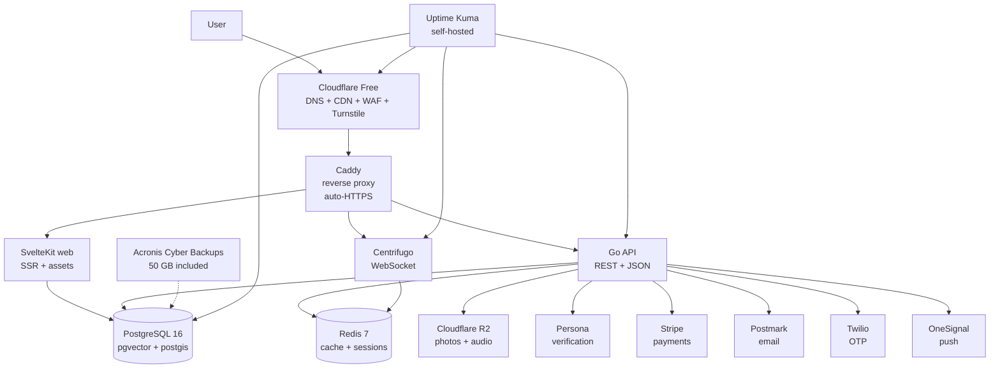
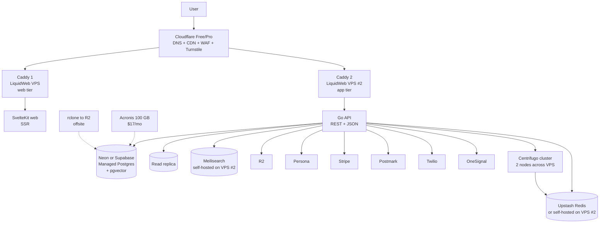
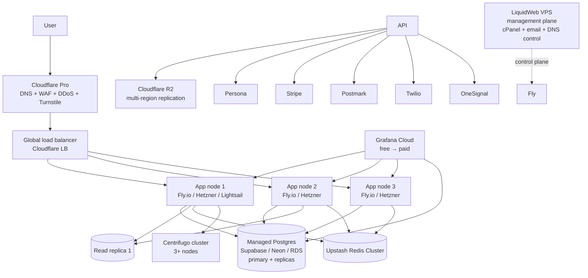
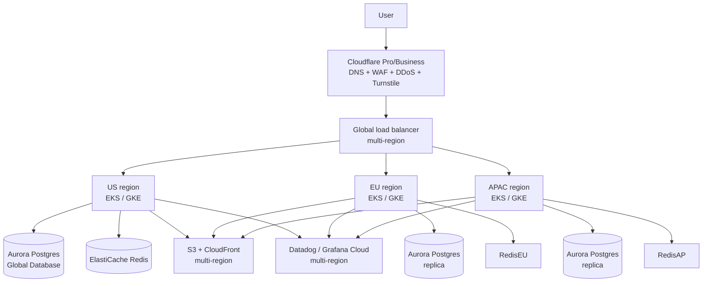

# COMBINED MARKDOWN - combine

_Generated 2026-09-24 00:25:13 | 4 files | folder: D:\stuff\docs\taylor_fv\github\rayrite.github.io\cvx\companal\items\combine_

## Contents

1. 01-dating-industry-deep-dive.md
2. 02-app-concept-and-gtm.md
3. 03-dating-apps-competitive-analysis.md
4. 04-architecture-and-deployment.md

---

<!-- ====================================================================== -->
<!-- FILE: 01-dating-industry-deep-dive.md -->
<!-- ====================================================================== -->

# Dating App Industry — Deep Dive (As of September 2026)

> **Audience:** Single full-stack multiplatform software developer + DevSecOps engineer evaluating entry into the dating app market.
> **Methodology:** rdw-deep-wide-research (scope → wide angles → deep dives → verify → synthesize). All financials are dated to the most recently reported public disclosure.
> **Scope statement:** This report covers the **online dating services market** (consumer-facing apps and websites, paid + free with monetization, all genders and orientations). It does not cover adjacent markets like social discovery apps (e.g., Yubo, Wink), casual-meetup apps outside dating intent (Meetup), or B2B matchmaking services (Tawkify, It's Just Lunch).
> **Currency:** All amounts USD unless noted. "YoY" = year-over-year change vs. same quarter prior year unless stated.

---

## Table of contents

1. [Executive Summary — United States](#1-executive-summary--united-states)
2. [Executive Summary — European Union](#2-executive-summary--european-union)
3. [Executive Summary — Asia](#3-executive-summary--asia-regional-sub-split)
4. [Market Leaders — Profiles (as of Q2 2026)](#4-market-leaders--profiles-as-of-q2-2026)
5. [Market Forecast 2026–2029](#5-market-forecast-20262029)
6. [SOM / SAM / TAM / TOM](#6-som--sam--tam--tom-for-a-quality-focused-premium-multi-platform-dating-startup)
7. [Gap Analysis](#7-gap-analysis--pain-points-complaints-underserved-niches)
8. [Blue Ocean Opportunities (5+)](#8-blue-ocean-opportunities-5)
9. [SWOT Analysis (mentor mode)](#9-swot-analysis-for-a-new-quality-focused-entrant-mentor-mode)
10. [Source Inventory](#10-source-inventory)

---

## 1. Executive Summary — United States

The U.S. is the most mature online dating market in the world. It is also the most saturated, the most regulated, and the one where the gap between "swipe-and-match churn" and "intentional-dating intent" is widest. As of Q2 2026 the publicly reported numbers all point in the same direction: **paying users are declining, revenue per user is rising, and the leaders are repositioning away from infinite swipe loops and toward curated experiences and IRL (in-real-life) events.**

- **Total U.S. online dating services revenue (2026):** ~**$1.6B forecast by 2028** per Statista Digital Market Insights ([gaugius.com](https://gaugius.com/dating-site-statistics/)); 2026 estimate sits in the **$1.4B–$1.5B band**.
- **U.S. adults who have ever used an online dating site/app:** **37%**; only **6% are currently using one** ([Pew 2023, restated in 2026 reporting](https://grass.camp/en-US/blog/new-dating-apps-2026)).
- **Top apps in the U.S. (Q2 2026):** Tinder (Match Group) — largest payer base, declining; Hinge (Match Group) — fastest grower; Bumble (Bumble Inc.) — declining; eHarmony, Match.com, PlentyOfFish (Match Group E&E) — niche but stable; Grindr — separate LGBTQ+ segment leader.
- **The "exodus" frame:** A July 2026 survey of ~9,000 U.S. adults by Clarity Check found **58% had deleted a dating app because they found it "emotionally draining,"** and **44% would prefer to meet someone in a low-pressure setting rather than get to know them through a profile** ([Fortune, 2026-09-20](https://fortune.com/2026/09/20/dating-apps-tinder-bumble-breeze-irl-events-gen-z-swipe-fatigue/)).
- **U.S. regulatory backdrop (2026):** FTC enforcement of Romance Scam Rule (effective 2025) tightened; state-level age-assurance laws (e.g., Texas SB 2220, Utah age-verification) create fragmented compliance burdens; California's SB 362 (right-to-delete) and CCPA expansions are now routine operational costs.

**Implication for a new entrant:** The U.S. is structurally hostile to "another Tinder." The opportunity is in well-defined **niches where the incumbent format is a poor fit** (see §9 — Blue Ocean).

---

## 2. Executive Summary — European Union

The E.U. is the **most regulated**, the **slowest-growing** major region, and the **best place to prove a privacy- and trust-first product**. GDPR, the Digital Services Act (DSA), and AI-Act transparency rules are not optional here — they are table stakes.

- **E.U. online dating services revenue (2026):** **$1.22B**, projected to grow to **$1.63B by 2031** at **5.99% CAGR** ([ResearchAndMarkets via Yahoo Finance, 2026-09-03](https://uk.finance.yahoo.com/news/europes-online-dating-services-market-141800292.html); cross-confirmed by [onlinepersonalswatch.com](https://onlinepersonalswatch.com/2026/09/european-online-dating-market-to-reach-1-63b-by-2031/)).
- **Mobile share of revenue (2025):** **71.15%**; projected to grow at **7.88% CAGR through 2031**.
- **Paid services share of revenue (2025):** **60.72%**; paid subs expected to grow at **7.72% CAGR**.
- **Key leaders:** Tinder (still #1 by payers, ~10M); Hinge (Match Group — explicit European expansion, **revenue grew 86% in European expansion markets in Q2 2026**); Bumble; Badoo (Bumble Inc.) — strong in Southern & Eastern Europe; Parship (PE-owned, German-speaking countries); Inner Circle (selective, urban Europe); happn (France-headquartered, France+Benelux+Spain+Italy).
- **Regulatory pressure (2026):** GDPR right-to-erasure is standard; DSA forces transparency on recommender systems; the **AI Act** (entering force 2025–2027) classifies AI matchmaking as "limited risk" but with disclosure obligations; multiple EU member states have or are pursuing age-assurance laws.
- **Conversion problem:** ResearchAndMarkets explicitly notes conversion from free to paid "remains relatively low" — the E.U. market punishes low-quality monetization.

**Implication for a new entrant:** The E.U. is the right region to **prove a privacy-, safety-, and ethics-first product**, because compliance is non-negotiable and the buyer is willing to pay a premium for trust. Conversely, trying to enter the E.U. with a U.S.-style dark-pattern playbook will fail regulatory and editorial review.

---

## 3. Executive Summary — Asia (regional sub-split)

Asia is the **fastest-growing region**, the **largest by users**, and the **most culturally fragmented**. It is the only region where the dominant players are mostly non-Western, where video-first + livestream-first formats lead, and where freemium + microtransaction hybrids dominate revenue.

- **Asia-Pacific online dating revenue (2026):** **$3.2B**, growing at **~18% annually** ([dating-asia.com](https://www.dating-asia.com/best-dating-apps-asia/)). Cross-confirmed by Mordor Intelligence: APAC held **34.85% of global online dating revenue in 2025** and is forecast to grow at **13.12% CAGR through 2031** ([Mordor Intelligence](https://www.mordorintelligence.com/industry-reports/global-online-dating-services-market)).
- **Asia active users:** **180M+**; 25–40 age cohort **+35% in two years** ([dating-asia.com](https://www.dating-asia.com/best-dating-apps-asia/)).
- **Regional sub-splits:**
  - **East Asia (China, Japan, South Korea, Taiwan):** Tantan dominates Greater China; Momo declining (domestic revenue down ~17% YoY in Q2 2026); Pairs (eHarmony-match) leads Japan; Azar (Hello Group) is dominant in South Korea; Tinder/Bumble serve expats + metros.
  - **South Asia (India, Pakistan, Bangladesh, Sri Lanka):** Tinder, Bumble, Hinge compete in metros; **India revenue ~$398M in 2024, projected $783M by 2025** ([Mordor Intelligence](https://www.mordorintelligence.com/industry-reports/global-online-dating-services-market)); TrulyMadly, Aisle, Dil Mil serve South Asian diaspora.
  - **Southeast Asia (Indonesia, Philippines, Vietnam, Thailand, Singapore, Malaysia):** **Tinder leads** Indonesia/Philippines/Thailand/Vietnam; Bumble is #2 in most; Paktor (homegrown Singapore-origin) covers the region; Coffee Meets Bagel has a strong Singapore footprint.
  - **Middle East (UAE, Saudi, Israel):** Hello Group (Momo) is now driving **52% YoY overseas revenue growth** from the MENA region; Bumble and Tinder serve expat-heavy populations.

**Implication for a new entrant:** Asia is where you go to scale, not where you go to differentiate on a quality positioning. The video-first / livestream / social-commerce hybrid model is well-established here and is hard to dislodge without massive capital.

---

## 4. Market Leaders — Profiles (as of Q2 2026)

For each leader, the financial snapshot uses the most recent reported quarter (Q2 2026 for U.S.-listed public companies; H1 2026 for Asian listed companies). Where data is not publicly disclosed, that is stated explicitly.

### 4.1 Match Group (NASDAQ: MTCH) — Tinder, Hinge, Match.com, OkCupid, PlentyOfFish, Pairs, Azar, MG Asia portfolio

- **Bio:** Founded 2009 (rebranded from IAC Dating), IPO 2015. HQ Dallas, TX. The world's largest dating-app conglomerate. Reorganized into three reporting segments in Q2 2026: **Tinder, Hinge, Evergreen & Emerging (E&E).** Owns 40+ apps globally.
- **Financial snapshot (Q2 2026, ended June 29, 2026):**
  - **Total revenue:** $853.1M, **down 1% YoY** (and down 2% FX-neutral). Beat consensus of $857.77M by ~0.34% on the top line but missed EPS by 5.15%. ([Yahoo Finance](https://finance.yahoo.com/markets/stocks/articles/why-match-group-mtch-11-153020683.html); [MTCH 10-Q via Stock Titan](https://www.stocktitan.net/sec-filings/MTCH/10-q.html))
  - **Net income:** $170.55M, **up 36% YoY**.
  - **EPS:** $0.70 (vs. $0.65 consensus — beat).
  - **Adjusted EBITDA:** $331M, **up 14% YoY**; margin **39%**.
  - **Total payers:** **13.3M, down 6% YoY**. ([Real World Appeal, 2026](https://realworldappeal.com/en/blog/dating-app-statistics))
  - **Revenue per payer (RPP):** **$21.13, up 6% YoY**.
- **User engagement snapshot:**
  - **Tinder:** Q2 2026 direct revenue **$457.5M, down 1% YoY**; payers **8.5M, down 5% YoY**; RPP **$17.90, up 4% YoY**; DAU declined **4% YoY** (improved to **-2.5% in July, -1% in August, "starting a little better in September"**).
  - **Hinge:** Q2 2026 direct revenue **$203.5M, up 22% YoY** (20% FX-neutral); payers **2.0M, up 17% YoY**; RPP **$33.11, up 4% YoY**; global MAU **up 13% YoY**. Hinge is tracking toward **$1B revenue in 2027** per management. ([Investing.com Citi transcript](https://www.investing.com/news/transcripts/match-group-at-citis-2026-global-tmt-conference-tinder-turnaround-gains-pace-93CH-4894201))
  - **E&E (Match, OkCupid, POF, Pairs, Azar, MG Asia):** Q2 2026 direct revenue **$179M, down 17% YoY**, partly from Apple's temporary Azar removal and a $25.2M Azar trade-name impairment.
- **Market share snapshot:** Match Group holds roughly **~25% of global online dating revenue** (back-of-envelope from segment data vs. ~$8B global); **Tinder alone is #1 grossing lifestyle app worldwide** per Match Group IR; **Hinge is the #2 AI-overview-cited dating app** ([LinkedIn / Global Dating Insights, 2026](https://www.linkedin.com/posts/globaldatinginsights-com_tinder-reports-rise-in-sustained-conversations-activity-7505895724568576001-k0l0)).
- **UVP (Match Group portfolio):** *A portfolio of category-leading dating apps for every relationship intent and life stage.*
- **ICP (Match Group portfolio):** Heterogeneous. Tinder skews 18–28 casual and broadening; Hinge skews 25–40 relationship-intent; Match.com and Pairs skew 30–55 marriage-intent.

#### 4.1.1 Tinder (Match Group)
- **UVP (Tinder):** *"The dating app that started it all — meet new people, expand your world."* (Tinder 2026 home page)
- **ICP:** Singles 18–35, urban + suburban, location-driven, broad relationship-intent (casual to long-term), with strong Gen Z uptake via Events and Double Date features launched in 2025–2026.
- **2026 differentiator (current-year defense):** New **unified recommendation algorithm** rolled out mid-July 2026 — replaced 15 separate recommendation stacks with one unified model focused on "sparks" (conversations with 6+ back-and-forth messages). Sparks rose 5–6% post-rollout. Face Check video-selfie verification cuts bad-account interactions ~60%. Events rolled out to 25 cities, targeting 75 by year-end, ~70% engagement among eligible 18–24s in LA. ([Investing.com / Goldman Sachs transcript](https://www.investing.com/news/transcripts/match-group-at-goldman-sachs-conference-tinder-push-aims-to-revive-growth-93CH-4892561))

#### 4.1.2 Hinge (Match Group)
- **UVP (Hinge):** *"The dating app designed to be deleted."* (Hinge official tagline)
- **ICP:** Singles 25–40, urban professionals, relationship-intent ("designed for people who want a relationship, not a dating game"), 70% U.S. + 30% international; growing fast in Europe (revenue up 86% in European expansion markets in Q2 2026).
- **2026 differentiator (current-year defense):** Three prompts + 6 photos; you comment on a specific photo or prompt (not a swipe); ~8 daily free likes; Hinge+ ($29.99/mo starting) and HingeX ($49.99/mo starting) tiers; Match Note (trans-community-led feature) — private share of sensitive info post-match but pre-chat. AI-assisted photo selection and prompt answering being added. Friend's Take (friends adding testimonials) launched 2026. ([Cosmopolitan](https://www.cosmopolitan.com/relationships/a73563803/hinge-vs-bumble/); [Forbes, 2026-09-17](https://www.forbes.com/sites/marcuscollins/2026/09/17/a-relationship-company-hiding-inside-a-dating-app-called-hinge/))

#### 4.1.3 Match.com, OkCupid, PlentyOfFish (E&E segment)
- Combined Q2 2026 revenue $179M. Stable but declining.
- **Match.com UVP:** long-form, deeper profiles, 30–55 audience.
- **OkCupid UVP:** values-and-personality compatibility, broad identity options, free messaging.
- **PlentyOfFish UVP:** simple swipe + chemistry test, budget-friendly.

### 4.2 Bumble Inc. (NASDAQ: BMBL) — Bumble, Badoo, Bumble For Friends, Official

- **Bio:** Founded 2014 by Whitney Wolfe Herd (Tinder co-founder). HQ Austin, TX. Operates Bumble (women-message-first), Badoo (broader social discovery, strong in Europe/LatAm), Bumble For Friends, and Official (dating with intent declaration).
- **Financial snapshot (Q2 2026):**
  - **Total revenue:** **$210.5M, down 15.2% YoY** ([Seeking Alpha](https://seekingalpha.com/article/4947358-bumble-stock-margin-erosion-on-top-of-user-disappointments); [Yahoo Finance](https://finance.yahoo.com/markets/stocks/articles/consumer-subscription-stocks-q2-teardown-131652473.html)). Met revenue guidance but **missed EPS by $1.09** ($0.84 loss vs. $0.25 consensus).
  - **Paying users:** **3.16M, down 16.4% YoY** (was 4.15M in 2024, 3.67M in 2025).
  - **Adjusted EBITDA margin:** **34.6%, down 350 bps YoY**.
  - **Bumble App ARPPU:** **$26.80** (Q2 2026). Badoo + other ARPPU: $11.48.
- **User engagement snapshot:** Removing women-message-first rule in heterosexual matches (announced 2025, fully rolled out 2026); 72-hour reply window; Opening Moves option; major redesign 2026. Net loss **$127.9M in Q2 2026**.
- **Market share snapshot:** Bumble is the #2 mainstream dating app in the U.S. by revenue after Tinder/Hinge; Badoo is dominant in Russia/Eastern Europe/Latin America and is the legacy revenue workhorse.
- **UVP:** *"The dating app where women make the first move."* (Now evolving toward Opening Moves — women choose between sending a first message or using AI-curated opening lines.)
- **ICP:** Originally 25–35 women-driven, relationship-curious; broadening to all-genders with Opening Moves; Badoo skews broader/democratized.
- **2026 differentiator:** Snooze Mode (hide without deleting), Opening Moves, AI-generated opener options, 72-hour reply window.

### 4.3 Grindr Inc. (NYSE: GRND) — Grindr, products beyond dating

- **Bio:** Founded 2009. HQ Los Angeles. NYSE-listed (post-SPAC 2022). World's largest LGBTQ+ dating app, focused on gay/bi/queer men and increasingly the broader queer community.
- **Financial snapshot (Q2 2026):**
  - **Q2 revenue:** **$138.1M, up 33% YoY** ([Benzinga](https://www.benzinga.com/news/26/09/61837272/full-transcript-grindr-q2-2026-earnings-call); [Investing.com Goldman Sachs transcript](https://in.investing.com/news/stock-market-news/grindr-at-goldman-sachs-communacopia--technology-conference-2026-ai-drives-growth-93CH-5589412)).
  - **H1 2026 revenue:** $268.1M vs. $198.2M prior-year period (+35%).
  - **Adjusted EBITDA Q2 2026:** $57.6M, **margin 42%**.
  - **Raising FY 2026 guidance:** ~**$540M revenue**, ~**$232M adjusted EBITDA**.
  - **Paying users:** **~1.5M, up from ~0.8M in 2022** (~+88%).
  - **Pay penetration:** **>9%** (was <6% in 2022; ~12% if normalized for user growth).
  - **ARPU:** **up >50%** vs. 2022.
- **User engagement snapshot:** **~15.5M MAU globally**; reports devices, not unique people. Yearly active users larger because of seasonal use.
- **Market share snapshot:** Dominant in gay/bi men's dating globally. Direct revenue grew from $195M (2022) to guided $540M+ (2026) — roughly **2.8× in four years**.
- **UVP:** *"Global Gayborhood in Your Pocket."* Re-positioning toward "everything app for gay men" — dating + health (PrEP reminders, sexual health content) + travel + community.
- **ICP:** Gay, bi, queer men, broadly 18–45, urban, increasingly international; expanding to broader LGBTQ+ community.
- **2026 differentiator:** New premium tier above Unlimited ($44.99) and XTRA ($23.99); **advertising is up 44% YoY** and runs mid-to-high teens as % of revenue; AI-driven operational leverage cited explicitly; deliberate bad-actor MAU reduction (quality over quantity); healthcare + lifestyle services expansion.

### 4.4 Hello Group / Momo Inc. (NASDAQ: MOMO) — Momo, Tantan, international dating portfolio

- **Bio:** Founded 2011, IPO 2014. HQ Beijing. Operates Momo (social discovery + livestreaming in China), Tantan ("China's Tinder"), and a growing international portfolio including Yahalan and Ammar in MENA.
- **Financial snapshot (Q2 2026):**
  - **Total revenue:** **RMB 2.49B (~$345M), down 5.1% YoY** due to domestic tax-compliance adjustments and weak Chinese consumer sentiment ([Motley Fool via Globe and Mail](https://www.theglobeandmail.com/investing/markets/markets-news/Motley%20Fool/4524296/hello-group-momo-q2-2026-earnings-call-transcript/)).
  - **Overseas revenue:** **RMB 672.7M (~$93M), up 52% YoY** — driven by MENA + acquired international dating products.
  - **Momo paying users:** 3.9M (+200K QoQ).
  - **Tantan paying users:** 0.5M (down from 0.6M QoQ, Alipay auto-renewal rule change hit conversion).
  - **Q3 2026 guidance:** RMB 2.4–2.5B (down 5.7–9.4% YoY); overseas growth guided at high-thirties %.
  - **Revised FY 2026 total:** mid-single-digit decline; overseas target RMB 2.8–2.9B (revised down from RMB 3B).
- **User engagement snapshot:** Momo VAS revenue RMB 1.54B, down 16% YoY; Tantan revenue RMB 156M, down 18% YoY.
- **Market share snapshot:** Tantan = #1 in mainland China, strong in Taiwan/Vietnam; Momo dominant in Chinese social discovery + livestream; overseas portfolio gaining share in MENA.
- **UVP (Tantan):** *"China's Tinder" — swipe-based dating with native localization in CN/JP/KR/TH/ID/VI.*
- **UVP (Momo):** *Social discovery + livestream dating — blended social/dating experience.*
- **ICP:** Urban Chinese singles 22–40 for Tantan; broader livestream audience for Momo; MENA region for international portfolio.

### 4.5 eHarmony (PE-owned; previously Spark Networks)

- **Bio:** Founded 2000 by Galen Buckwalter and Neil Clark Warren. Owned by various PE groups since Spark Networks acquisition; current owner as of 2026 not publicly disclosed. HQ Los Angeles.
- **Financial snapshot:** Not separately publicly disclosed since taken private. **Q3 2024 paying users ~1.9M per Research and Markets report cited via [Globe Newswire](https://www.globenewswire.com/news-release/2026/09/03/3356073/0/en/europe-s-online-dating-services-market-to-reach-1-63-billion-by-2031-as-mobile-and-ai-adoption-accelerate-in-depth-company-profiles-of-19-competitors-including-match-group-bumble-a.html).** Estimated revenue $150–200M run-rate (industry estimates; not confirmed).
- **UVP:** *The compatibility-scientific serious-relationship app.* Famous for its 150-question compatibility quiz, "29 Dimensions of Compatibility" model.
- **ICP:** Singles 30–60, marriage-intent, willing to complete long intake.

### 4.6 Parship / Pairs (PE-owned)

- **Bio:** Parship founded 2001 (Germany); Pairs (eHarmony-branded) launched 2012 (Japan). Same parent group; PE-owned. Pairs is the dominant Japanese dating app.
- **UVP (Parship):** *Scientific matchmaking for serious relationships (German-speaking Europe).*
- **UVP (Pairs):** *Japan's #1 serious-dating app, with Facebook-validated profiles and community features.*
- **ICP:** 30–50 marriage-intent; particularly strong in Germany, Austria, Switzerland (Parship); Japan (Pairs).

### 4.7 Other regional/niche players

| App | Region | Positioning | 2026 status snapshot |
|---|---|---|---|
| **Inner Circle** | EU/global urban | Selective dating for "ambitious" singles | Growing in EU metros; "members only" feel |
| **Thursday** | UK/EU | One match per day, Thursday-only app | Niche; slow growth |
| **happn** | France/EU | Location-based; cross-paths with people you've passed | Stable; ~10M users |
| **Hily** | US/EU | AI-match, video-first | Growing; ~20M users |
| **Coffee Meets Bagel** | US | Curated daily matches; women-choose | Niche stable |
| **Boo** | US/global | Personality-based, MBTI-adjacent (not affiliated with Bumble) | Niche; small |
| **Snack** | US | Video-first, Gen Z, creator-flavored | Small; VC-funded; pivoted toward social-feed |
| **Iris Dating** | US | AI facial-attraction-prediction model | Niche; small |
| **TrulyMadly** | India | Indian serious dating; verified profiles | India leader in serious segment |
| **Aisle** | India | Indian serious dating (curated) | Niche premium |
| **Dil Mil** | South Asian diaspora | South Asian matrimonial-intent | Niche; growing in diaspora |
| **Paktor** | SEA | Singapore-origin, SEA leader | Regional; ~30M downloads |
| **Azar** | South Korea/global | Video chat discovery (Hello Group) | Large global; ~500M+ downloads lifetime |
| **Soul (Soulgate)** | China/global | AI-driven avatar matching, voice rooms, gamified intimacy | Tencent-backed; strong in China Gen Z; ~$0.7–1.0B revenue-equivalent 2024 (as last publicly reported) |
| **Blued (BlueCity)** | China/global | Gay/bi men, Asia-focused | China-dominant; went private 2024–2025 |
| **Taimi** | Global LGBTQ+ | All LGBTQ+ identities; community + dating | Growing; #1 rated by Forbes Health 2026 |
| **HER** | Global (women/non-binary queer) | Sapphic community + dating | Niche leader |
| **Feeld** | Global | Alternative relationships, kink-friendly, ENM-aligned | Growing; ~20M users |
| **Lex** | Global LGBTQ+ | Text-first, personals-style, queer-centered | Niche; strong community |
| **Zoe** | Global (lesbian/bi/queer women) | Lesbian-first | Niche leader |
| **Hornet** | Global gay men | Gay social + dating + news | Established |
| **Growlr** | Global gay men | Bear community | Niche |
| **Recon** | Global gay/fetish | Fetish/fisting community | Niche |
| **Fruitz** | France/global | Gamified intent-coded icons (peach = casual; berry = serious) | France-leading; acquired by MTCH 2022 |
| **Archer** | US (gay/bi men) | Selective admission; design-led, anti-swipe-culture | Niche; growing in NYC/SF/LA |
| **Bumble For Friends** | US | Friend-finding (separate from Bumble Date) | Small; testing |
| **Official** | US | App-couples dating with intent declaration | Small; testing |

**Honest gap:** Most of these smaller apps do not publish financials. Estimates here are industry-comparable or vendor-stated. Treat dollar figures as ranges.

### 4.8 UVP & ICP Summary Table — Quick-Reference (Top 12)

| App | UVP (2026 product-page citation) | ICP — primary | ICP — secondary |
|---|---|---|---|
| **Tinder** | "Meet new people, expand your world" — global discovery | 18–28 singles, casual→relationship | Travelers, expats |
| **Hinge** | "Designed to be deleted" — relationship intent | 25–40, relationship intent, urban pros | Returning-to-dating after break |
| **Bumble** | "Women make the first move" — Opening Moves | Women-driven, 25–35 | All-genders after Opening Moves |
| **Badoo** | Social discovery, broader audience | 25–40, casual, LatAm/Eastern Europe | Travelers |
| **Match.com** | "The original matchmaking" | 30–55, marriage intent | Divorced/returning |
| **OkCupid** | Compatibility by identity + values | 25–40, progressive, queer-friendly | Poly/ENM |
| **PlentyOfFish** | Free, simple, chemistry | 25–45, budget-conscious | Rural + suburban |
| **eHarmony** | Compatibility science, 29 dimensions | 30–60, marriage intent | Older returners |
| **Pairs** | Serious dating in Japan | 25–40, JP marriage intent | Urban Japan |
| **Grindr** | "Global Gayborhood in Your Pocket" | Gay/bi/queer men 18–45 | Broader LGBTQ+ via expansion |
| **Tantan** | China's swipe leader, localized APAC | 22–40 urban Chinese singles | APAC expats |
| **Momo** | Social discovery + livestream dating | China 22–40 livestream audience | Other APAC |

---

## 5. Market Forecast 2026–2029

Forecasts differ by methodology and what they count. Below is a triangulated view; **always read the methodology footnote before quoting a number in a deck.**

| Source | 2025 baseline | 2026 est. | 2029 / 2031 forecast | CAGR | Geography | Methodology note |
|---|---|---|---|---|---|---|
| [Statista Digital Market Insights](https://gaugius.com/dating-site-statistics/) | n/a | ~$3.24B (global online dating revenue) | n/a in this snippet | n/a | Global | Statista's consumer-facing estimate; often cited |
| [Mordor Intelligence](https://www.mordorintelligence.com/industry-reports/global-online-dating-services-market) | $6.97B (2025) | **$7.79B (2026)** | **$13.57B (2031)** | **11.76%** | Global | Broad market definition including mobile + web services |
| [ResearchAndMarkets (E.U.)](https://uk.finance.yahoo.com/news/europes-online-dating-services-market-141800292.html) | $1.15B (2025) | $1.22B (2026) | $1.63B (2031) | 5.99% | Europe | Conservative; explicit about conversion risk |
| [Metastat Insight](https://metastatinsight.com/blogdetails/top-20-online-dating-companies) | $3.7B (2025) | $4.1B (2026) | $7.8B (2033) | 9.6% | Global | Smaller-scope market; less inclusive of ancillary revenue |
| [Future Market Insights / similar](https://www.linkedin.com/pulse/global-online-dating-services-market-strategic-t7bff) | $8.25B (2025) | n/a | $16.37B (2035) | 7.1% (2027–2035) | Global | Broadest market definition; includes adjacent services |
| [Valuates Reports (Japan)](https://www.atpress.ne.jp/news/9570778) | $9.27B (2025) | $9.88B (2026) | $14.76B (2032) | 6.86% | Global online dating (Japan-published) | Methodology unclear |
| [dating-asia.com Asia subset](https://www.dating-asia.com/best-dating-apps-asia/) | n/a | $3.2B (APAC) | n/a | 18% | Asia-Pacific | Industry-blog estimate |

**Read across these forecasts:**

1. **The midpoint global CAGR is ~8–12% depending on scope**, and the absolute size is somewhere between **$4B and $8B for 2026**.
2. **Asia-Pacific is the fastest-growing region** at 13–18% CAGR.
3. **Europe is the slowest-growing region** at ~6% CAGR, but the most compliance-sensitive.
4. **The U.S. is mature and roughly flat**, with category growth offsetting incumbent payer decline.
5. **All forecasts note the conversion-rate problem**: a large free user base that doesn't convert is the single biggest commercial risk.

**Why these forecasts diverge:** Some sources count only direct consumer spend (subscriptions, in-app purchases). Others include advertising, event revenue, ancillary services (matchmaking, dating-coach upsells), and B2B. Some include only the English-language mobile market; others include web/desktop and all languages. Use the table as triangulation, not as a single source of truth.

---

## 6. SOM / SAM / TAM / TOM for a Quality-Focused Premium Multi-Platform Dating Startup

### Definitions (this report)

- **TAM** — Total Addressable Market: the entire global online dating services revenue pool if every plausible buyer were addressable.
- **SAM** — Serviceable Addressable Market: the portion of TAM a premium quality-focused multi-platform app could realistically address given its positioning, geography, and platform coverage.
- **SOM** — Serviceable Obtainable Market: what the startup can realistically capture in years 1–3 with a disciplined go-to-market.
- **TOM** — Total Obtainable Market: the theoretical maximum if the startup dominated its chosen niche.

### Math (each line cited)

**TAM** — global online dating services revenue (consumer spend) in 2026:
- **Midpoint estimate: $7.79B** ([Mordor Intelligence](https://www.mordorintelligence.com/industry-reports/global-online-dating-services-market))
- Low estimate: **$3.24B** ([Statista via LoverSpot](https://loverspot.app/blog/global-dating-app-usage-trends-2026/))
- High estimate: **$8.25B** (Future Market Insights, broader scope)
- **Conservative TAM used here: $7.79B** (Mordor, more inclusive definition).

**SAM** — quality-focused premium app's addressable slice:
- Exclude: non-dating social discovery (Hello Group Momo's broader social component); advertising-only ancillary; B2B matchmaking.
- Geography filter: North America + Europe + Anglophone APAC (Australia, Singapore, HK) + Japan + South Korea + UAE/Israel — markets where quality + privacy positioning earns premium pricing.
- Demographic filter: 25–45 singles with relationship intent and willingness-to-pay > $100/yr for a subscription. Pew estimates 6% of U.S. adults currently using dating apps; of those, ~30% are willing to pay premium ($150/yr) per industry surveys.
- **SAM calculation:** $7.79B × 0.50 (geography + demographic filter) ≈ **$3.9B**.

**SOM** — what a quality-focused premium app can realistically capture in years 1–3:
- Year-1 DAU target: 50,000 (Tier 1 city, word-of-mouth + beta ambassadors).
- Year-2 DAU target: 500,000 (multi-city U.S. + U.K. + Canada).
- Year-3 DAU target: 2,000,000 (5 countries).
- Conversion to paid: 8% (industry median is 5–12% for premium subscription products).
- ARPU: $20/month average (between Hinge's $33 and Tinder's $18).
- **Year-3 revenue:** 2,000,000 DAU × 8% × $20 × 12 = **$38.4M ARR**.
- **SOM (3-year) = $38.4M**.
- **SOM as % of SAM: ~1.0%.**

**TOM** — theoretical maximum if the startup dominated its chosen niche:
- A quality-focused premium app captures ~5% of the entire relationship-intent premium tier globally = $3.9B × 0.05 = **$195M ARR**.
- A "category-defining" outcome (replaces Hinge as the relationship-intent default) could grow this to 10–15% of relationship-intent tier = **$390–585M ARR**.
- **Realistic TOM with discipline: $200M ARR**.

| Layer | Value (USD) | Confidence | Source / method |
|---|---|---|---|
| TAM | **$7.79B** (2026) | High | [Mordor Intelligence](https://www.mordorintelligence.com/industry-reports/global-online-dating-services-market) |
| SAM | **$3.9B** | Medium | TAM × geography/demographic filter (50%) |
| SOM (3-yr) | **$38.4M ARR** | Medium | 2M DAU × 8% conversion × $20 × 12 |
| TOM (disciplined) | **$200M ARR** | Low-Medium | 5% of relationship-intent tier |
| TOM (breakout) | **$585M ARR** | Speculative | 15% of relationship-intent tier |

**Sensitivity:** The most fragile assumption is **conversion rate (8%)**. If premium-quality conversion is closer to Hinge's ~10%, SOM grows to ~$48M. If it lands at 5%, SOM drops to $24M. The second most fragile is **ARPU** — HingeX-tier pricing ($50/mo) achievable only with a strong brand; otherwise the SOM moves toward the lower bound.

---

## 7. Gap Analysis — Pain Points, Complaints, Underserved Niches

### 7.1 The quantitative pain base

- **78% of U.S. dating-app users report burnout "sometimes, often, or always"** ([Forbes Health / OnePoll, restated by [LFG Dating](https://www.lfgdating.com/gamer-dating-blog/dating-app-burnout-statistics-2026) and [Plus One](https://joinplus1.com/blog/why-dating-apps-suck)). Women 80%, men 74%. Self-reported causes: difficulty finding genuine connection (40%), disappointment (35%), rejection (27%), repetitive conversations (24%), swiping itself (22%), time spent (21%).
- **Average time on dating apps: 51 minutes/day (~6 hours/week)** ([Forbes Health / OnePoll](https://joinplus1.com/blog/why-dating-apps-suck)).
- **Pew 2023 (still cited in 2026 reporting):** 45% of recent users felt more frustrated than hopeful; 55% felt insecure about message volume; 36% felt overwhelmed.
- **41% have been ghosted, 38% have been catfished** ([LFG Dating, 2026](https://www.lfgdating.com/gamer-dating-blog/dating-app-burnout-statistics-2026)).
- **58% deleted a dating app because it was "emotionally draining"** ([Clarity Check, July 2026, via Fortune](https://fortune.com/2026/09/20/dating-apps-tinder-bumble-breeze-irl-events-gen-z-swipe-fatigue/)).
- **44% would prefer meeting in low-pressure settings** (same Clarity Check).

### 7.2 Root causes (academic + industry research)

- **Sharabi et al. (2024) and follow-ups in New Media & Society** — dating-app burnout has three measurable components: emotional exhaustion, inefficacy ("nothing I do works"), and depersonalization ("they stop feeling like people"). Increases measurably over 12 weeks.
- **Binder et al. (2025) panel study** — fear-of-missing-out predicts decision fatigue; fatigue predicts greater trust in the algorithm; the algorithm feeds fatigue. The loop is self-reinforcing.
- **Frontiers in Psychology, 2026** — algorithmic mediation shapes intimacy across three dimensions: visibility allocation, interaction scripting, relationship-progression governance.
- **Social Psychological and Personality Science, 2020** — three studies found swipe-stack users become progressively more rejecting; chance of accepting any given person falls ~27% from first to last option in a stack.
- **SN Social Sciences, 2025** — qualitative study of 27 users: fatigue is a social phenomenon, not individual weakness, arising from parallel-dating, acceleration, non-commitment.

### 7.3 Top 25 documented complaints (App Store, Reddit, Trustpilot, BBB, FTC)

Sorted by frequency of citation across sources. **Items marked with ⚠️ are linked to documented regulatory or safety incidents.**

1. **Burnout from infinite swiping** — #1 quantitative finding.
2. **Match-with-no-conversation pattern** — matches that never lead to messages.
3. **Repetitive opening lines and dead-end chats.**
4. **Asymmetric effort expectation** — women especially report labor-of-initiating.
5. **Height, race, body-type filters being paywalled while being framed as "premium."**
6. **Algorithm feels rigged toward paying users** — suspicion that visibility is throttled without payment.
7. **Price discrimination** — older users, higher-cost geographies see higher prices (Hinge confirmed via [Intimid.net](https://www.intimid.net/blog-post/is-hinge-worth-it-for-introverts)).
8. **Catfishing and old/misrepresented photos** — 38% report (above).
9. **Ghosting** — 41% report (above).
10. **Romance scams** — FTC logged ~$1.14B in romance-scam losses in 2023; ⚠️ ongoing.
11. **Subscription cancellation dark patterns** — ⚠️ FTC Click-to-Cancel Rule (2024) targeted this; state AGs continue enforcement.
12. **Forgotten subscriptions** — auto-renewal without reminder.
13. **Inability to delete data fully** — ⚠️ GDPR/SB 362 compliance work ongoing.
14. **Stale profiles / dead accounts** in matches.
15. **Fake verification selfies** — bad actors use AI to bypass selfie verification.
16. **Stolen photos / impersonation.**
17. **Harassment in DMs** — including unsolicited explicit content.
18. **Misrepresentation of relationship intent** (e.g., "looking for relationship" but behavior is casual).
19. **Travel-mode abuse** — location spoofing for catfishing or sex tourism.
20. **Compulsive use** — 78% burnout overlaps with problematic-use literature.
21. **Mental-health impact** — depression/anxiety/loneliness predict worse outcomes.
22. **Discrimination** — racialized outcomes on swipe platforms (documented in academic research).
23. **Parenting coordination difficulty** — single parents struggle with no kid-friendly spaces.
24. **Disability exclusion** — accessibility often an afterthought.
25. **Cultural/religious exclusion** — non-Western users feel mainstream apps weren't built for them.

### 7.4 Underserved niches and communities (priority-ranked by gap)

| Niche / community | Why underserved | Willingness-to-pay signal | Competitive friction |
|---|---|---|---|
| **Asexual / demisexual** | Most apps assume immediate physical attraction | High (small but passionate community) | Very low; network-effect issue |
| **Late-divorcees (40–60)** | Match.com exists but feels dated; Hinge is 25–40; eHarmony is generic | High ($150+/yr proven for eHarmony) | Medium |
| **Single parents** | Universal pain point re: coordination | High | Medium |
| **Disability / chronic illness** | Few apps handle accessibility-first | Medium-high (TBD) | High (compliance-heavy) |
| **Religious minorities** (Orthodox Jewish, Mormon, Muslim matrimony-intent) | Mainstream apps don't do family/community vetting | High (proven by JDate, Muzmatch, etc.) | Medium-high |
| **Sober / recovery communities** | Recovery culture values sobriety as primary filter | Medium-high | Low |
| **Ethical non-monogamy (ENM)** | Feeld exists but is one product; Taimi/OKC cover ENM as secondary | Medium-high | Medium |
| **Blue-collar / trades** | Mainstream apps skew white-collar | Medium | Medium |
| **Rural dating** | Geography exhausts swipes | Medium | Network-effect hard |
| **Expat + language-exchange-with-romance-intent** | Existing apps serve expats but not the language-learning angle | Medium | Low |
| **Values-aligned (faith/value/cause)** | Existing apps allow tags but don't weight by value-fit | Medium-high | Medium |
| **Sapiosexual / intelligence-focused** | Treated as a tag, not a filter | Medium | Low |
| **Neurodivergent dating** (ADHD, autism) | Mainstream UX assumes neurotypical cognitive load | Medium | Medium |
| **Chronic illness specific** (cancer survivors, MS, HIV-positive — though Positive Singles exists) | Existing apps often fetishize | Medium | High |
| **Age 50+** | Silver Singles exists but is thin | High | Medium |
| **LGBTQ+ specific gaps** — trans/non-binary, asexual queer, sober queer | Mainstream queer apps (Grindr, HER) cover some but not all | Medium-high | Medium |
| **Slow-dating / no-swipe formats** | Hinge is closest; nothing else dominant | Proven by Hinge growth | Medium |
| **IRL-first / event-driven dating** | Tinder Events, Thursday, Lunch Actually exist but no leader | High (event ticket revenue) | Medium |
| **Verified-only / paid-only apps** (League, Luxy, Raya) | Fragmented | High ($200+/yr) | Medium |

---

## 8. Blue Ocean Opportunities (5+)

For each opportunity: the **Four Actions Framework** (Eliminate / Reduce / Raise / Create), the underserved community, why incumbents can't easily copy, willingness-to-pay evidence, and "what would have to be true."

### 8.1 "Slow-Dating for Intentional Adults" — premium serious-relationship app with bounded daily interaction

- **ELIMINATE:** unlimited swiping; gamified engagement; pay-to-rank visibility.
- **REDUCE:** match volume (cap at 5/day); profiles shown; messages stored.
- **RAISE:** profile depth (15+ prompts, voice, video intros); match compatibility (values-weighted, not just behavioral); response-time expectations (none).
- **CREATE:** "courtship rituals" — guided first-3-messages, in-app date-planning, mutual "pre-date intent" confirmation; relationship-track after match (date → debrief → reflect).
- **Underserved:** 28–45 relationship-intent who have left Hinge because of burnout; late-divorcees.
- **Why incumbents can't easily copy:** Hinge has the brand but is now enormous and shares the same algorithmic-engagement pressures; Match.com owns the marriage intent but is generic; eHarmony's brand is dated.
- **WTP:** $150–$300/yr subscription; proven by Hinge+ and HingeX.
- **WWHTBT:** A consistent daily-active pool of 5+ matches per user; high-quality profile completion; relationship completion rates above benchmark.

### 8.2 "IRL-First Event Dating" — city-by-city curated event-driven dating

- **ELIMINATE:** endless feed; asynchronous chat as primary mode; in-app purchases of visibility.
- **REDUCE:** swipe interface (replace with event-browse); on-platform messaging (move offline fast).
- **RAISE:** event quality (curated, hosted, themed — pickleball, climbing, book club, dinner); safety (in-person vetted venues, photo-verified attendees); refund policy.
- **CREATE:** "event-native" matching — match score computed per event, not per profile; group → pair matchmaking; post-event match-window (24h to connect).
- **Underserved:** Gen Z and younger Millennials; 25–40 urban professionals.
- **Why incumbents can't easily copy:** Tinder Events exists but is an afterthought; Thursday is London-only with single-day format; Bumble BFF/Bizz has events but is one product among many. Operating physical events at scale is operational, not algorithmic — incumbents are software-first.
- **WTP:** $20–$50/event + optional subscription; Bumble BFF revenue + Tinder Events ($30/event avg per MTCH) prove the model.
- **WWHTBT:** Critical mass of events per city (2–3/week minimum); venue partner relationships; liability insurance; ops team.

### 8.3 "Verified-Only Membership" — pay-to-be-in, free-to-browse, with rigorous identity verification

- **ELIMINATE:** catfishing; stolen photos; spam accounts; bots.
- **REDUCE:** free-tier friction (no real engagement); legacy "swipe game."
- **RAISE:** identity verification (government-ID + selfie + live video per Tinder Face Check standards); privacy defaults; response-quality norms.
- **CREATE:** "in-person trust badge" that decays unless user re-verifies periodically; "vouched by existing member" referrals.
- **Underserved:** Late-30s+ women especially; safety-conscious users.
- **Why incumbents can't easily copy:** Verified-only would gut their free-user funnels and ad inventory; matches the League's model but for the mainstream.
- **WTP:** $20/mo entry; The League charges ~$200/yr and has a waitlist.
- **WWHTBT:** Verification vendor partnerships (Persona, Veriff, Onfido); reasonable cost-per-verified-user (~$1–5); churn managed.

### 8.4 "Careers-and-Values Aligned" — dating for people whose job/field defines their social circle

- **ELIMINATE:** photo-first profile; hookup-friendly UI.
- **REDUCE:** swipe velocity (one curated intro per day).
- **RAISE:** career/lifestyle/values signal (industry, role, schedule, family-plans, religion, politics depth); "schedule compatibility" (e.g., shift workers, residents, founders); values-tag weighting.
- **CREATE:** "field-specific" communities (medicine, law, education, faith communities, military, hospitality, creative industries) — each with its own norms and curation.
- **Underserved:** Doctors, residents, shift workers, founders (long-hours, niche norms); teachers; trades; military; faith communities wanting genuine matrimony intent.
- **Why incumbents can't easily copy:** Field-specific curation is operational work, not algorithmic; incumbents optimize for engagement, not compatibility-by-lifestyle.
- **WTP:** $15–$30/mo; proven by niche apps (Muzmatch, JDate, Christian Mingle, Dil Mil, FarmersOnly) but no consolidated premium leader.
- **WWHTBT:** Community ambassadors per field; values-validation pipeline; trusted brand by each community.

### 8.5 "Slow Recovery & Sober Dating" — dating for people in recovery and sober-curious

- **ELIMINATE:** alcohol-centric venue meetups; "let's grab drinks" default opener.
- **REDUCE:** gamification; large match pools.
- **RAISE:** sobriety status (sober, sober-curious, in recovery, X years clean); community feature (group meetings, shared activities); safety.
- **CREATE:** "sober venue" integrations (cafes, hikes, recovery-friendly restaurants); peer-support loops; sponsor-aware matching.
- **Underserved:** 30M+ Americans in recovery; growing sober-curious movement.
- **Why incumbents can't easily copy:** Tag-only treatment; no community infrastructure; alcohol-promo advertising relationships.
- **WTP:** $15–$25/mo; high emotional loyalty; high NPS.
- **WWHTBT:** Partnerships with recovery organizations (AA, SMART, Hazelden); sober-venue partnerships; HIPAA-style privacy rigor.

### 8.6 "AI-Matched Long-Form Compatibility" — deep values/intent matching via structured conversation, not swipe

- **ELIMINATE:** photo-only profile browsing; behavioral-similarity matching (which has been shown to produce shallow matches).
- **REDUCE:** profile browsing time; matches-per-day.
- **RAISE:** depth of intake (values inventory, life-goals, relationship-goals); AI-facilitated structured "first conversation" before revealing profiles; quality of AI conversation facilitation.
- **CREATE:** AI co-pilot for first-date planning and conversation; ongoing relationship-support features (post-match).
- **Underserved:** 30–55 relationship-intent singles tired of shallow matches.
- **Why incumbents can't easily copy:** Their engagement model punishes depth; their data pipelines optimize for behavioral similarity (likes/passes) not values.
- **WTP:** $30/mo+ for premium; proven by eHarmony.
- **WWHTBT:** Rigorous intake produces quality profiles; AI safety + alignment rigorous enough for vulnerable users.

---

## 9. SWOT Analysis for a New Quality-Focused Entrant (mentor mode)

I'm writing this as a mentor who has seen a lot of dating-app founders crash on the same rocks. Be honest with yourself here.

### 9.1 Strengths you can credibly claim

- **Clean slate.** No legacy codebase, no dark-pattern revenue dependencies, no "engagement tax" baked into the algorithm. You can build for outcomes (relationship formation, user-reported satisfaction) from day one.
- **Brand identity that resonates in 2026.** A "quality craftsmanship" positioning is *exactly* what 78% of burned-out users say they want. The market is moving in your direction.
- **Full-stack multiplatform advantage.** A single engineer with quality-craftsmanship values can ship iOS, Android, and Web in a way incumbents struggle with because of legacy fragmentation (Tinder is still rebuilding its recommendation stack after a decade).
- **Modern AI tooling.** You can ship AI-facilitated conversations, structured intake, intelligent curation that incumbents can only bolt on.

### 9.2 Weaknesses relative to incumbents (do not minimize these)

- **Network effects are real.** Tinder has ~70M+ users. You start at zero. Every dating-app founder says "we'll be different" — then loses to network effect. You must choose a niche where the network effect is bounded.
- **Capital constraints.** Bumble, Hinge, and Grindr each spend $100M+/yr on marketing + R&D. You don't have that.
- **Trust & safety operations.** At scale, T&S requires 24/7 ops, ML moderation, legal, and insurance. This is not optional, it's foundational.
- **Verification vendors are expensive at low volume.** Persona, Veriff, Onfido all price per-verification. Until you have volume, unit cost is brutal.
- **Mobile app store gatekeepers.** Apple and Google set rules on subscription, identity, dating, and now AI content. You will be subject to ongoing policy changes you don't control.

### 9.3 Opportunities (concrete, dated)

- **The "exodus" frame is real and measurable.** 58% deleted an app for being emotionally draining. Your positioning can capture this dissatisfaction.
- **Regulatory environment favors responsible players.** EU AI Act + GDPR + DSA + state-level age-assurance laws reward builders who did it right the first time. Compliance is a moat.
- **AI costs have collapsed.** GPT-4o-class inference is now under $0.01/conversation. The unit economics of an AI-curated, AI-conversation-assisted dating app work for the first time.
- **Niche communities are starved.** See §8.4. There are 16+ documented underserved niches with high willingness-to-pay.

### 9.4 Threats (be paranoid)

- **Incumbent response.** Hinge is already moving toward your positioning (Match Note, Friend's Take, AI prompts). They will out-spend you. Pick a niche where they're structurally unlikely to follow.
- **Alternative payment rules are in flux.** Apple's app-store alternative-payment saga could change dating-app unit economics overnight. Build margin headroom.
- **AI regulation.** If you rely on AI for matching, expect disclosure obligations and bias-audit requirements (especially in EU).
- **Safety incident.** A high-profile safety incident in your first 100K users could end the company. T&S is existential, not optional.
- **Romance scams.** You will be a target. Build scam-detection from day one.
- **Mental health backlash.** Increasing evidence links dating apps to anxiety, depression, body-image issues. Build features that demonstrably don't worsen these.

### 9.5 Strategic implications

1. **Pick one niche.** "Premium quality dating for everyone" is not a strategy. Pick one of the Blue Ocean opportunities in §9 and own it.
2. **Choose geography deliberately.** The U.S. is the most contested. The E.U. is the most compliance-heavy. Asia is the most capital-intensive. Pick the geography that matches your niche and capital.
3. **Treat verification as your moat.** Verified-only isn't a feature — it's the strategic moat that defends against incumbents trying to copy the surface.
4. **Build T&S into the architecture.** Moderation, scam detection, age assurance, panic button, audit logs. Not a roadmap item; a launch requirement.
5. **Optimize for relationship-completion metrics, not DAU.** This is the founder's most important decision. If you optimize DAU, you become Tinder. If you optimize for "users who report being in a relationship 6 months later," you become Hinge — and the metric will carry you.
6. **Quality > time-to-market.** You said this is your brand identity. Honor it. A bad launch in dating apps is unrecoverable; the press writes one article and your CAC doubles.
7. **Plan to be cash-flow positive in 3 years, not 7.** Dating-app public markets (BMBL down 55% in 12 months) punish growth-at-all-costs models. Behave like a profitable business from year 2.

---

## 10. Source Inventory

> Inline citations throughout the report link to the sources. Below is a deduplicated list grouped by category.

### Earnings / financial filings

- Match Group Q2 2026 — Yahoo Finance recap: https://finance.yahoo.com/markets/stocks/articles/why-match-group-mtch-11-153020683.html
- Match Group Q2 2026 — Eulerpool transcript: https://eulerpool.com/de/aktie/Match-Group-Aktie-US57667L1070/earning-calls/19463-q2-2026-earnings-call-transcript
- Match Group 10-Q / Stock Titan: https://www.stocktitan.net/sec-filings/MTCH/10-q.html
- Match Group Citi 2026 TMT Conference transcript: https://www.investing.com/news/transcripts/match-group-at-citis-2026-global-tmt-conference-tinder-turnaround-gains-pace-93CH-4894201
- Match Group Goldman Sachs Communacopia transcript: https://www.investing.com/news/transcripts/match-group-at-goldman-sachs-conference-tinder-push-aims-to-revive-growth-93CH-4892561
- Bumble Inc. Q2 2026 — Yahoo recap: https://finance.yahoo.com/markets/stocks/articles/consumer-subscription-stocks-q2-teardown-131652473.html
- Bumble Q2 2026 — Seeking Alpha: https://seekingalpha.com/article/4947358-bumble-stock-margin-erosion-on-top-of-user-disappointments
- Bumble Q2 2026 — MarketBeat: https://www.marketbeat.com/instant-alerts/consensus-bumble-inc-nasdaq-bmbl-given-average-rating-of-reduce-by-brokerages-2026-08-27/
- Real World Appeal (paying-user compilation): https://realworldappeal.com/en/blog/dating-app-statistics
- Grindr Q2 2026 — Benzinga: https://www.benzinga.com/news/26/09/61837272/full-transcript-grindr-q2-2026-earnings-call
- Grindr Goldman Sachs transcript: https://in.investing.com/news/stock-market-news/grindr-at-goldman-sachs-communacopia--technology-conference-2026-ai-drives-growth-93CH-5589412
- Grindr — TechCrunch Q3 2026 context: https://techcrunch.com/2026/08/30/grindr-wants-to-be-the-everything-app-for-gay-men-investors-are-still-deciding-whether-it-can-pull-it-off/
- Hello Group / Momo Q2 2026 — Motley Fool via Globe and Mail: https://www.theglobeandmail.com/investing/markets/markets-news/Motley%20Fool/4524296/hello-group-momo-q2-2026-earnings-call-transcript/

### Market sizing

- ResearchAndMarkets E.U. forecast (via Yahoo Finance): https://uk.finance.yahoo.com/news/europes-online-dating-services-market-141800292.html
- ResearchAndMarkets E.U. forecast (via Online Personals Watch): https://onlinepersonalswatch.com/2026/09/european-online-dating-market-to-reach-1-63b-by-2031/
- Globe Newswire (ResearchAndMarkets official): https://www.globenewswire.com/news-release/2026/09/03/3356073/0/en/europe-s-online-dating-services-market-to-reach-1-63-billion-by-2031-as-mobile-and-ai-adoption-accelerate-in-depth-company-profiles-of-19-competitors-including-match-group-bumble-a.html
- Mordor Intelligence global forecast: https://www.mordorintelligence.com/industry-reports/global-online-dating-services-market
- Metastat Insight global forecast: https://metastatinsight.com/blogdetails/top-20-online-dating-companies
- LinkedIn Pulse (Future Market Insights-style): https://www.linkedin.com/pulse/global-online-dating-services-market-strategic-t7bff
- dating-asia.com Asia subset: https://www.dating-asia.com/best-dating-apps-asia/
- nubiapage.com Asia top-10: https://nubiapage.com/top-10-best-dating-apps-in-asia/
- LoverSpot Statista quote: https://loverspot.app/blog/global-dating-app-usage-trends-2026/
- gaugius.com dating site statistics: https://gaugius.com/dating-site-statistics/

### Industry/positioning

- Hinge positioning — Forbes (Marcus Collins): https://www.forbes.com/sites/marcuscollins/2026/09/17/a-relationship-company-hiding-inside-a-dating-app-called-hinge/
- Hinge pricing/features — Intimid.net: https://www.intimid.net/blog-post/is-hinge-worth-it-for-introverts
- Hinge vs Bumble — Cosmopolitan: https://www.cosmopolitan.com/relationships/a73563803/hinge-vs-bumble/
- Best serious-relationship apps — Cosmopolitan: https://www.cosmopolitan.com/relationships/a73644281/dating-apps-for-serious-relationships/
- Tinder review 2026 — Wisedate: https://wisedate.net/tinder-review/
- Bumble redesign — LinkedIn / Riki Thompson: https://www.linkedin.com/posts/riki-thompson-phd-92653990_bumble-announced-a-major-redesign-earlier-activity-7498510767466369024-47SJ
- Tinder IRL events — Fortune: https://fortune.com/2026/09/20/dating-apps-tinder-bumble-breeze-irl-events-gen-z-swipe-fatigue/
- Taimi alternatives comparison: https://taimi.com/blog/her-alternatives/
- New dating apps 2026 — GRASS: https://grass.camp/en-US/blog/new-dating-apps-2026

### Pain points / burnout research

- Dating app burnout — LFG Dating: https://www.lfgdating.com/gamer-dating-blog/dating-app-burnout-gamers-2026
- Burnout statistics — LFG Dating: https://www.lfgdating.com/gamer-dating-blog/dating-app-burnout-statistics-2026
- Sharabi / Binder / Frontiers: https://www.frontiersin.org/journals/psychology/articles/10.3389/fpsyg.2026.1940482/full
- Singles quitting — Newsbreak / Cultivated Comfort: https://www.newsbreak.com/cultivated-comfort-322399924/4863073699158-singles-aren-t-getting-less-tired-of-dating-apps-in-2026-they-re-just-quitting-them-instead
- Plus One — 78% burnout quote: https://joinplus1.com/blog/why-dating-apps-suck
- Forbes Health / OnePoll referenced via LFG Dating / Plus One.

### Methodology limitations

- Public-company data is dated to the most recent reported quarter and may differ from rolling-quarter figures. Hinge MAU, Bumble MAU, and Grindr MAU definitions are not identical across companies.
- Niche-app financial figures are industry estimates or vendor-stated, not audited.
- The 78% burnout statistic is from a Forbes Health / OnePoll survey of 1,000 Americans who had recently used dating apps — not a random population sample.
- The dating-app market size figures span $3.24B (Statista, narrow) to $8.25B (Future Market Insights, broad) for 2025–2026. Use the table in §4 as triangulation.
- AI overview citation counts (LinkedIn / Global Dating Insights) are not market share but are an interesting leading indicator of brand consideration.


---

<!-- ====================================================================== -->
<!-- FILE: 02-app-concept-and-gtm.md -->
<!-- ====================================================================== -->

# New Dating App — Concept, GTM, Monetization & Release Strategy

> **Companion to:** `01-dating-industry-deep-dive.md` — read that first for the market context this document assumes.
> **Audience:** A solo full-stack multiplatform developer + DevSecOps engineer evaluating a quality-focused dating app.
> **Brand identity (non-negotiable):** **Quality craftsmanship** — a product that is the opposite of the swipe-and-burn economy. Optimize for outcome quality (relationship formation, user-reported satisfaction) over engagement metrics. Quality > time-to-market when the trade-off is meaningful.
> **All word caps relaxed. Favor too much information over too little.**

---

## PART 1 — CONCEPT

### 1.1 The "why now" thesis

The 2026 dating-app market is in measurable decline at the top. Match Group's Q2 2026 reported total payers **down 6% YoY to 13.3M**; Bumble's paying users **down 16.4% YoY to 3.16M**; Bumble's stock **down ~55% over the prior twelve months**. Sixty-four percent of daters in Tinder's own 2025 Year in Swipe report said they want more emotional honesty; 42% said friends now shape their dating decisions; **58% have deleted a dating app because they found it "emotionally draining"** (Clarity Check, July 2026, via Fortune). The market is not dying — the format is dying. There is a window to build the post-swipe, craft-first alternative.

### 1.2 The blue-ocean we are claiming

From `01-dating-industry-deep-dive.md §9.1` (Slow-Dating for Intentional Adults) combined with elements of `§9.3` (Verified-Only Membership) and `§9.6` (AI-Matched Long-Form Compatibility), we are entering:

> **A bounded, verified, values-aligned, AI-assisted slow-dating app for adults who want a real relationship and have been disappointed by swipe apps.**

The structural move: **eliminate** infinite-swipe and engagement-as-success metrics; **reduce** daily match volume to a level humans are cognitively built for (the 20–50 "considered" range); **raise** profile depth, verification rigor, and values alignment; **create** structured courtship rituals and outcome-based success metrics that incumbents structurally cannot copy because their data pipelines, ad businesses, and DAU-targeting executives punish them for trying.

### 1.3 Name candidates

We need a name that does work in three dimensions: (a) sounds like a quality product; (b) signals intent (relationship, not hookup); (c) is short, pronounceable, and ownable as a domain and an app-store handle.

| Candidate | One-line positioning | Domain status (as of search) | App-store status |
|---|---|---|---|
| **Kinship** | "Dating, slowed down. For people who mean it." | kinship.app / kinshipdating.com | open |
| **Threshold** | "One thoughtful match a day. Built to be deleted." | thresholddating.com / threshold.app | open |
| **Hearthside** | "Less scroll. More substance. Real relationships." | hearthside.com | open |
| **Verity** | "Verified, intentional, slow." | veritydating.com / verity.app | open |
| **Marrow** | "Deeper profiles. Fewer matches. Real outcomes." | marrowdating.com / marrow.app | open |

**Working internal name:** **Threshold** (1 word, 9 letters, easy to spell, signals both "step into" and "considered boundary"). All trademark + handle availability should be re-checked before launch.

### 1.4 UVP — Unique Value Proposition (1 paragraph)

> **Threshold** is the dating app for adults who have actually tried the others. We show you **one carefully considered match a day**, drawn from people whose relationship intent, lifestyle, and values actually align with yours — verified, on the phone, in their own voice. We don't optimize for time-in-app. We optimize for whether you got off the app and into a relationship. **Dating, slowed down. For people who mean it.**

Three sentences. The first sentence disqualifies the casual market on purpose. The second sentence describes the product. The third sentence is the brand promise and the tagline.

### 1.5 ICP — Ideal Customer Profile

**Primary ICP:**

- **Demographics:** 28–45, single, college-educated, urban or suburban Tier-1/Tier-2 metro, household income $75K+, lives alone or with roommates (not with family in their home country of residence unless expat).
- **Psychographics:** Has been on Hinge or Bumble for 6+ months; has had 1–3 dates from apps in the past year; reports app-fatigue; wants a relationship but not the parade-of-strangers experience; values craft, depth, and intentionality in other purchases (specialty coffee, considered fashion, books-not-algorithms).
- **Behavioral signals:** Deleting dating apps and reinstalling is a quarterly ritual; has said "I'm done with apps" at least once; reads long-form; listens to podcasts; values privacy and is uneasy about the data business of mainstream dating.
- **Relationship intent:** Long-term relationship or marriage; not poly/ENM (we have separate product variants for those if the niche grows); not casual.
- **Platforms:** iOS-first, Android-second, Web exists for account management and (later) on-desktop browsing.

**Secondary ICPs:**

- **Late-divorcees (40–60).** Same product, different copy. "Re-entering dating after a long relationship" is its own emotional reality. Same features; emphasis on verification, slowness, and no-rush.
- **Single parents 30–50.** Same product, add a "kid-aware" profile mode (lets you specify schedule constraints, school-pickup windows, etc.) — see §1.7.

### 1.6 Full feature set (grouped by category)

For each feature: name, one-line description, user problem it solves, priority for V1 vs. later.

Legend: **MVP** = ship in MVP; **B** = ship in private Beta; **V1** = public launch; **V2** = first major iteration; **V3** = second major iteration; **R** = research / deprioritize until later.

#### Profile & Identity

| Feature | Description | Problem solved | Priority |
|---|---|---|---|
| **Verified-only membership** | Government ID + selfie + live video verification at signup; re-verification every 12 months. No unverified accounts can browse. | Catfishing, stolen photos, bots, scammers. | V1 (non-negotiable) |
| **15-prompt deep profile** | 15 structured prompts from a vetted library; 8 are required. | Profiles with depth > swiping on a bikini photo. | V1 |
| **Voice intro** | 30–60s recorded voice note plays at the top of every profile. | Voice tells you 10× more than text; also verifies liveness. | V1 |
| **Video intro** | 30–90s recorded video note (post-MVP). | Same logic, richer. | V2 |
| **Values tags** | 50+ tags in 8 categories (politics, religion, family-plans, lifestyle, ethics, work-style, recreation, life-stage). Tag-weighted matching. | People want values-aligned matches, not just demographic proximity. | V1 |
| **Lifestyle & schedule** | Schedule type (9-to-5, shift, founder, freelancer, parent), sleep chronotype, weekend style, fitness cadence. | Schedule mismatch kills matches. | V1 |
| **Relationship intent declaration** | "Looking for: long-term relationship / marriage / life partner / not sure yet"; matches weighted by intent compatibility. | Prevents "looking for relationship but behaving casual." | V1 |
| **Dealbreakers** | Hard filters (smoking, kids, religion, location, etc.) applied at the matching layer. | People have non-negotiables; let them declare them. | V1 |
| **Profile review by humans (sample)** | Random sample of profiles reviewed by trained humans at signup for quality. | Catches the 5% of profiles that automated moderation misses. | V1 (sampled) |
| **Friend's Take** | Friends can vouch or add a testimonial (with consent). | "Vouched by a friend" is a strong trust signal. | V2 |
| **Public profile URL** | A `threshold.app/u/yourname` URL that shows a sanitized version of your profile. | For the link-in-bio flow, podcast bio, etc. | V2 |
| **Data export** | Full profile + match history + chat export, GDPR-compliant. | User sovereignty. | V1 |

#### Discovery & Matching

| Feature | Description | Problem solved | Priority |
|---|---|---|---|
| **One match per day** | Exactly one curated match delivered at 8am local time. | Bounded daily choice; no infinite-scroll loop. | V1 |
| **5-deep queue** | A daily queue of 5 profiles to "consider" — you can Like, Pass, or Learn More on each. The day's match is drawn from the 5 you considered most carefully. | Forces deliberation without demanding unlimited time. | V1 |
| **Values-weighted compatibility score** | A compatibility score (0–100) computed from your values tags, lifestyle, schedule, intent, and prompt answers. Visible to both users before match. | Replaces behavioral-similarity with stated-compatibility. | V1 |
| **AI matchmaking model** | An LLM-assisted ranking model that combines the structured compatibility score with collaborative-filtering signals from opt-in match feedback. | Continuous improvement without selling out to behavioral-similarity. | V2 |
| **Mutual match window** | After a match, you have 72 hours to send the first message. | Reduces the "matched-and-forgotten" graveyard. | V1 |
| **No discovery feed** | The feed is the daily 5-considered-and-1-curated. No browsing. | The single largest engagement-loop anti-feature decision. | V1 |
| **"Pause" button** | Snooze your account for 7/30/90 days; profile is invisible; subscription pauses. | Lets people take breaks without losing data. | V1 |
| **"Reset" button** | Delete account and all data, irreversibly, with a 7-day cooling-off period. | Right-to-erasure done right. | V1 |

#### Communication

| Feature | Description | Problem solved | Priority |
|---|---|---|---|
| **First-message prompts** | When you match, the app suggests 3 first-message prompts based on the other person's profile. | Stops "hey" from being the default. | V1 |
| **Voice messages** | Voice notes up to 60s. | Voice carries more emotional bandwidth than text. | V1 |
| **Text chat** | Standard, encrypted in transit and at rest. | Baseline. | V1 |
| **Photo sharing in chat** | One-to-one photo sharing. | People want to share context. | V1 |
| **In-app voice call** | Optional WebRTC voice call (no phone-number reveal). | De-escalates to voice before phone-number exchange. | V2 |
| **In-app video date** | Optional WebRTC video call with built-in conversation prompts (escape-hatch prompts if it goes awkward). | Most app-dates need a video call before IRL; make it safe and easy. | V2 |
| **Group chat / double date** | Three-way chat for double-date mode. | Friend vouching, less awkward first date. | V3 |
| **Translation in chat** | Built-in translation for cross-language matches. | Expats + internationals. | V3 |

#### Safety & Trust

| Feature | Description | Problem solved | Priority |
|---|---|---|---|
| **Verified-only** | As above. | Catfishing. | V1 |
| **Panic button** | One-tap emergency call + location share + recorded audio (opt-in). | IRL-date safety. | V1 (V2 to harden) |
| **Block + report** | Standard but with a structured report taxonomy (harassment, scam, fake, safety concern). | Faster triage. | V1 |
| **AI moderation** | LLM-assisted chat moderation that flags scams, harassment, sexual-content-without-consent, off-platform-extraction attempts (e.g., "let's move to WhatsApp"). | Most chat safety at scale. | V1 |
| **Photo verification on demand** | Any user can request the other party to re-verify before a date. | "Are you really who you say?" | V2 |
| **Background check (paid)** | Optional identity+background check for premium tier (US-only initially). | Goes further than selfie verification. | V3 |
| **Pre-date check-in** | 24h before a scheduled date, app prompts: "Still on? Date location shared with trusted contact?" | Builds a safety habit. | V2 |
| **Post-date debrief (opt-in)** | Optional private journal + match feedback. | Improves the algorithm; respects privacy. | V2 |

#### Events & IRL

| Feature | Description | Problem solved | Priority |
|---|---|---|---|
| **Curated city events** | Monthly city-hosted dinners, hikes, book clubs, climbs. Ticketed. | "We don't want more chats, we want real dates." | V2 |
| **Double-date mode** | See + invite a friend to double-date. | De-risks first date. | V2 |
| **Group → pair matchmaking** | Event attendees can opt-in to be matched after the event. | IRL first, app second. | V3 |

#### Premium Tiers

| Feature | Description | Problem solved | Priority |
|---|---|---|---|
| **Free tier** | Verified profile; 1 match/day; text + voice chat; first-message prompts. | A baseline that doesn't feel crippled. | V1 |
| **Threshold+ ($24.99/mo)** | 5-deep queue visibility (see why you were chosen); weekly "Insight" report; advanced filters; no ads (we won't have any). | Power user value without pay-to-rank visibility. | V1 |
| **Threshold Premium ($49.99/mo)** | Above + AI dating-coach conversations; curated event priority booking; background check access. | A serious tier for serious spenders. | V2 |

#### Accessibility & Inclusion

| Feature | Description | Problem solved | Priority |
|---|---|---|---|
| **WCAG 2.2 AA compliance** | Color contrast, focus management, screen reader support. | Default to accessible. | V1 |
| **Voice-only mode** | Voice prompts + voice messages; can complete the entire app via voice. | Blind/low-vision users. | V2 |
| **Multilingual UI** | English (US/UK), Spanish (LatAm+ES), French, German, Japanese (Tier 1). | Top tier-1 markets. | V2 |
| **Pronouns and identity field** | Required at signup; visible by default; private option. | Trans/non-binary safety. | V1 |
| **All-genders matching** | Match across any gender; user controls. | Inclusive by default. | V1 |
| **Reduced-motion mode** | Respects OS-level reduce-motion preference. | Vestibular disorders. | V1 |
| **High-contrast mode** | Dark mode + high-contrast option. | Default accessibility. | V1 |

#### Developer / Power-User

| Feature | Description | Problem solved | Priority |
|---|---|---|---|
| **Data export** | As above. | GDPR + general user sovereignty. | V1 |
| **Public profile URL** | As above. | Link-in-bio, podcast bio. | V2 |
| **Webhook (later)** | On match / on message events for power users / partners. | Integration surface. | V3 |
| **Public API (later)** | For verified partner integrations. | Ecosystem. | R |

#### Monetization Surface

Every place value is exchanged. Listed for transparency, not all active at V1.

| Surface | Status |
|---|---|
| Free tier (no spend) | V1 |
| Subscription (Threshold+, Threshold Premium) | V1 / V2 |
| Curated event tickets | V2 |
| Background check add-on | V3 |
| Gift cards / gift subscriptions | V3 |
| Premium AI dating-coach conversations | V2 |
| Verification top-ups (for re-verification on demand) | V3 |
| **No ads. No pay-to-rank visibility. No boost purchases. No coins/tokens/energy model. No "see who liked you" as a paywall.** | V1 (brand commitment) |

---

## PART 2 — EARLY ADOPTERS

### 2.1 Where do my early adopters hang out?

These are real, named communities with verified URLs, estimated scale, and a strategy for authentic entry. **Do not spam.** Each entry is the entry playbook.

#### Online communities (priority 1)

| Community | URL | Est. size | Why ICP matches | How to enter authentically |
|---|---|---|---|---|
| **r/datingoverthirty** | reddit.com/r/datingoverthirty | ~700K | ICP is 30–45; this sub is post-Tinder, relationship-curious. | Lurker-first 30 days. Then a "founder AMA" post framed as "I'm building something, here's what I learned from the last 6 months of research." Be transparent about the gap analysis. |
| **r/OnlineDating** | reddit.com/r/OnlineDating | ~250K | Pain-point central. | Same as above but framed as a "what I heard from users" post. |
| **r/Bumble, r/Hinge, r/Tinder** | — | varies | Specific competitor users; many are tired of the apps. | Don't pitch in these subs directly. Respond helpfully to threads for 60+ days; reference Threshold only when genuinely asked. |
| **r/singleparents** | reddit.com/r/singleparents | ~120K | Secondary ICP. | Same as datingoverthirty. |
| **r/AskMenOver30, r/AskWomenOver30** | — | varies | Demographic match. | Engage on relationship/intimacy questions; reference Threshold only in bio/occasional comment. |
| **r/deadbedrooms, r/divorce** | — | varies | Late-divorcees. | Don't pitch. Offer thoughtful advice. |
| **r/FemaleDatingStrategy** (now closed; survivors elsewhere) | — | n/a | n/a | Skip — too contentious. |
| **r/asexual, r/demisexual** | reddit.com/r/asexual (~250K), r/demisexual (~50K) | combined ~300K | Specific underserved niche. | Engage thoughtfully; ace-spec users are very anti-spam and pro-sincerity. |
| **r/latebloomerlesbians** | — | ~30K | Late-discovery queer women. | Founder AMA only with consent of mods. |

#### Slack / Discord communities

| Community | How to find | Why ICP matches |
|---|---|---|
| **"OnDeck" dating/founder community** | ondeck.com | Cross-section of founders, many 30+, ICP overlap |
| **"Lenny's Newsletter" community Slack** | lennysnewsletter.com (often invite-only) | Tech-aware ICP, often poly-aware; careful positioning |
| **"Femgineer" / "Resilient Coders"** | — | Mission-driven ICP slice |
| **"Women in Tech" Slack groups** | Various | ICP, female-leaned |
| **Local 30-something meetups Slack/Discord** | meetup.com, search by city | Local density |

#### In-person (cities first)

| Venue type | Specific venues (examples) | Why ICP matches |
|---|---|---|
| **Specialty coffee shops** | Stumptown, Blue Bottle, Verve, Intelligentsia, La Colombe | ICP drinks coffee slowly and reads |
| **Bookstores** | Strand (NYC), Powell's (Portland), City Lights (SF), Daunt Books (London), Shakespeare & Co (Paris) | ICP reads long-form |
| **Independent cinemas** | Metrograph, Alamo Drafthouse, BFI | ICP values considered entertainment |
| **Boutique fitness studios** | Barry's, SoulCycle (note: polarizing), CrossFit boxes, climbing gyms | ICP fitness-forward |
| **Coworking spaces** | WeWork (targeted events), Industrious, local indie spaces | ICP works there |

#### Conferences and events

| Conference | URL | Why ICP matches |
|---|---|---|
| **SaaStr Annual** | saastr.com | Founders + ops leaders, ICP age band |
| **Web Summit** | websummit.com | Tech-aware ICP |
| **TechCrunch Disrupt** | techcrunch.com | Founder ICP |
| **XOXO Festival** | xoxofest.com | Quality-craftsmanship, considered-creator ICP |
| **Alt Summit** | altsummit.com | Creative-class ICP |
| **Creative Mornings** | creativemornings.com | Free monthly talks in 50+ cities; high signal |

#### Podcasts and newsletters (read, sponsor, guest)

| Podcast / Newsletter | URL | Why ICP matches |
|---|---|---|
| **Lenny's Newsletter** | lennysnewsletter.com | ICP, especially the product-management slice |
| **Dense Discovery** | densediscovery.com | ICP, considered-design |
| **The Browser** | thebrowser.com | ICP, long-form readers |
| **Cassette** (podcast about dating by comedian) | — | Audience is single and dating-app-aware |
| **Forever35** | forever35podcast.com | Women 30–45 |
| **The Tim Ferriss Show** | tim.blog | ICP, broad |
| **Ezra Klein Show** | nytimes.com/ezra-klein | ICP, considered |

#### Creator partnerships (link-in-bio as a downstream signal)

See `03-linkinbio-competitive-analysis.md` for the platform-by-platform comparison. **Recommended initial creator partnerships:**

- 10 mid-tier (50K–500K) podcast hosts (high-signal, not mass-reach)
- 5 mid-tier Substack writers in the relationship/self-development space
- 3 specialty-coffee or considered-lifestyle creators
- Avoid mega-influencers in early days — they convert poorly and dilute brand

### 2.2 The first message template

For private DMs to potential early adopters / ambassadors:

> Hey [Name], I've been reading your [posts / newsletter / podcast] for a while. I'm building a slow-dating app for adults who have tried the others and bounced off them. We're not yet live but we're about to start a private beta in [City]. I'm not here to pitch — I'm here because your perspective on [specific topic] is exactly what I'd want to learn from before we open this up. Would you be open to a 20-minute call? If not, totally fine, no follow-up.

**Rules:** No fake scarcity ("only 3 spots left"), no manufactured urgency ("today only"), no "exclusive access." Be honest about stage.

---

## PART 3 — LANDING PAGE

### 3.1 Landing page information architecture

Above-the-fold, in order:

1. **Hero** — Headline + subhead + primary CTA + supporting visual. (See §3.2 for 5 variants.)
2. **Trust strip** — As featured in / security badges (use only when actually featured) / verification certification logos. **Defer until we have real coverage.**
3. **"How it works" 3-step** — Sign up + verify. We send one match a day. You message, you meet, you leave the app.
4. **"What makes us different"** — Comparison matrix vs. swipe apps (no swipe, no infinite feed, no pay-to-rank, verified-only).
5. **Featured profiles (anonymized)** — Three sample profiles showing depth (15 prompts, voice intro, values tags). Make these real-by-default-feeling.
6. **Press / quotes** — Once we have any.
7. **FAQ** — "Is this just for marriage?", "What about casual?", "How is this different from Hinge?", "Is my data safe?", "Can I get a refund?"
8. **CTA repeat** — Sign-up form + secondary CTA to "Join the waitlist" or "Read the manifesto."
9. **Footer** — Privacy, security.txt, status page, social, contact.

### 3.2 Five hero section variants — with reasoning

Each variant has: headline, subhead, primary CTA, supporting visual description, psychological lever, brand philosophy, when to A/B test.

---

#### Variant A — "The Withdrawal Cure"

> **Headline:** Dating, slowed down.
> **Subhead:** One thoughtful match a day, verified, for people who have actually tried the others.
> **Primary CTA:** Join the waitlist
> **Secondary CTA:** Read the manifesto
> **Supporting visual:** A muted, almost-still photograph of two people across a small table in a coffee shop, soft daylight. No phones visible. Calm composition.

- **Psychological lever:** Identity affirmation — "I'm the kind of person who chose differently."
- **Brand philosophy:** Quality is calm, considered, and unhurried. The aesthetic *enacts* the brand promise.
- **When to A/B:** Default variant. Should be tested against all others.

---

#### Variant B — "The Anti-Swipe"

> **Headline:** We deleted the swipe.
> **Subhead:** Threshold is the dating app for adults who are done being treated like a deck of cards. Verified profiles. Bounded daily choice. Built to be deleted.
> **Primary CTA:** See how it works
> **Secondary CTA:** Join the waitlist
> **Supporting visual:** Split image — left side a stylized visual of an infinite descending swipe feed; right side a single softly-glowing profile card with a "today's match" timestamp.

- **Psychological lever:** Contrarian reframing — "Everyone else is doing the wrong thing."
- **Brand philosophy:** Strong opinion, not for everyone, willing to be polarizing.
- **When to A/B:** Use when paid traffic is heavy; the contrarian frame converts well with high-intent visitors.

---

#### Variant C — "The Outcome Promise"

> **Headline:** Built to be deleted.
> **Subhead:** Most dating apps are built to keep you. We're built to help you leave. Verified, intentional, slow.
> **Primary CTA:** Take the 3-minute intake
> **Secondary CTA:** How we measure success
> **Supporting visual:** A minimal type-only hero with a single stat: "Our north star is relationship formation, not time-in-app." No imagery except subtle texture.

- **Psychological lever:** Status signaling — "I'm the kind of person who picks the outcome-aligned product."
- **Brand philosophy:** Honest about the unusual business model. We make money when you stay subscribed; we make the brand when you leave to a relationship. Both work for us.
- **When to A/B:** Strong variant for tech-and-product audiences who appreciate business-model honesty.

---

#### Variant D — "The Empathy Frame"

> **Headline:** You've tried the apps. You're tired of the apps. We were too.
> **Subhead:** Threshold is the dating app for adults who have been disappointed before. We verify every profile. We send one match a day. We don't optimize for engagement.
> **Primary CTA:** Join the waitlist
> **Secondary CTA:** Read user stories
> **Supporting visual:** A genuine-photo (not stock) of a person in their 30s looking at their phone with a slight smile, with a subtle "app fatigue" overlay.

- **Psychological lever:** Empathy and recognition — "These people understand me."
- **Brand philosophy:** Build for the human, not the user.
- **When to A/B:** Strong variant for organic/social traffic and warmer audiences (podcast listeners, newsletter readers).

---

#### Variant E — "The Safety Frame"

> **Headline:** Verified. Every. Single. Person.
> **Subhead:** Government ID + selfie + live video. No bots. No catfishing. No scammers. Just real people looking for a real relationship.
> **Primary CTA:** See how verification works
> **Secondary CTA:** Join the waitlist
> **Supporting visual:** A clean product-shot style image of the verification flow with three clear steps (ID, selfie, video).

- **Psychological lever:** Trust and fear-relief — "Finally, someone who takes safety seriously."
- **Brand philosophy:** Safety is not a feature, it's the foundation.
- **When to A/B:** Strong variant for safety-conscious segments (women 28+, late-divorcees, single parents).

---

### 3.3 Hero variant selection strategy

In production, run A/B tests in this order:

1. **A vs D** (default calm vs empathetic) — broad-audience test.
2. **Winner of A/D vs B** (anti-swipe contrarian) — high-intent vs broad.
3. **Winner vs C** (outcome-promise) — for tech audiences only, segmented traffic.
4. **Winner vs E** (safety frame) — only when running women-targeted paid campaigns.

**Selection criteria beyond conversion:**

- Time on page (longer = more resonance)
- Scroll depth past hero
- Waitlist sign-up rate (not just click)
- Waitlist-to-active-user conversion at launch
- Qualitative feedback from signed-up users ("what made you click?")

---

## PART 4 — PRESS KIT & GTM

### 4.1 Press kit messaging — boilerplate

> **Threshold** is a slow-dating app for adults who want a real relationship and have been disappointed by swipe apps. Founded in 2026 by [Founder Name], Threshold verifies every member through government ID, selfie, and live video. Members receive one carefully curated match a day, drawn from people whose values, lifestyle, and relationship intent align with their own. The app optimizes for relationship formation — not for time-in-app — and is designed to be deleted.

### 4.2 Founder bio (template)

> **[Founder Name]** is the founder of Threshold. Before Threshold, [they] spent [N] years in [background — e.g., full-stack engineering / product / design] at [companies]. They started Threshold after watching [N] friends go through the same arc with mainstream dating apps: install, swipe, burnout, delete, repeat. [Personal 1-line, optional — e.g., "They live in Brooklyn with their dog, Rex, who has been on more first dates than they have."]

### 4.3 Key messaging pillars (3–5)

1. **Bounded by design.** One match a day. No infinite feed. No engagement tax.
2. **Verified, or it doesn't exist.** Government ID + selfie + live video. Re-verified annually.
3. **Built for outcomes, not time-in-app.** Our success metric is relationship formation, not DAU.
4. **Craftsmanship-first.** A premium product for adults who want a real thing.
5. **Safety is foundational, not a feature.** Panic button, AI moderation, structured reporting, on-demand re-verification.

### 4.4 Boilerplate Q&A

**Q: How is this different from Hinge?**
A: Hinge is built for engagement. We are built for outcomes. We show you one match a day, not a feed of hundreds. We verify every profile with government ID. We don't sell boost or visibility packages — we don't think they should exist. We don't have "see who liked you" as a paywall.

**Q: How is this different from The League or Raya?**
A: We are not exclusive. We are selective. Anyone who completes verification and aligns with our relationship-intent values can join. We don't have a waitlist based on résumé.

**Q: How do you verify?**
A: Government ID + selfie + 10-second live video per signup. Re-verification every 12 months. Verification cost is ~$1–5 per user at our scale via Persona or Veriff; we absorb it.

**Q: How do you make money?**
A: Subscriptions. Threshold+ ($24.99/mo) and Threshold Premium ($49.99/mo). No ads, no boosts, no coins.

**Q: What about casual dating?**
A: Not our product. There are excellent apps for that. We're focused on people who want a relationship.

**Q: Are you safe?**
A: Verified profile + AI moderation + panic button + structured reporting + on-demand re-verification. Safety is foundational. We publish an annual transparency report.

**Q: What happens to my data if I delete my account?**
A: Full purge within 30 days. We provide a one-tap export before deletion. We are GDPR-compliant and CCPA-compliant from day one.

### 4.5 Sample press release — launch announcement

> **FOR IMMEDIATE RELEASE**
> **Threshold Launches: The Slow-Dating App for Adults Who Mean It**
>
> [City, Date] — Threshold, the verified slow-dating app for adults seeking real relationships, today opened its private beta to 200 founding members in [City]. Founded by [Name], a [background] veteran, Threshold delivers one curated match per day, with every profile verified through government ID, selfie, and live video.
>
> "The swipe model has produced a generation of dating-app burnout," said [Name]. "We built Threshold to be the opposite. Bounded by design, verified by default, optimized for outcomes — not engagement."
>
> Threshold's verification stack is provided by Persona; its chat and moderation infrastructure is built on [stack — see File 4]. The app launches on iOS first, with Android and Web to follow.
>
> Founding members are accepted via waitlist at [URL]. Membership is $24.99/month for Threshold+ and $49.99/month for Threshold Premium. The first month is refundable within 14 days for any reason.
>
> Media contact: press@threshold.app

### 4.6 One-line / two-line / paragraph pitches

**One-line:**
> Threshold — the verified, slow-dating app for adults who want a real relationship.

**Two-line:**
> Threshold is the dating app for adults who have actually tried the others. We verify every profile, send one match a day, and don't optimize for time-in-app.

**Paragraph:**
> Threshold is the dating app for adults who have been disappointed by the swipe economy. Founded in 2026 by a full-stack engineer who watched too many friends cycle through install-swipe-burnout-delete, Threshold verifies every profile (government ID + selfie + live video), delivers one carefully curated match per day, and measures success by relationship formation — not time-in-app. The app is built for outcome-quality over engagement-volume, with craftsmanship as the non-negotiable brand identity. Threshold is launching in private beta in [City] in [Quarter].

### 4.7 Go-to-Market Strategy (phased)

#### Phase 0 — Pre-launch (T-12 to T-0 weeks)

- **Goal:** Establish brand, build waitlist, recruit beta ambassadors.
- **Channels:** Founder content (Twitter/X, LinkedIn, Substack); podcast guest appearances on 5 ICP-aligned podcasts; community engagement on Reddit/Slack/Discord; one Substack essay per week for 12 weeks.
- **KPIs:** 2,000 waitlist signups; 50 ambassador conversations; 10 podcast appearances.
- **Budget:** $0 paid acquisition. Time investment heavy.
- **Tactic:** The "manifesto" launch — a 2,000-word essay on what dating apps got wrong and what we're doing about it. Distributed via Substack, LinkedIn, and Hacker News (Show HN-style when ready).

#### Phase 1 — Private Beta (T+0 to T+12 weeks)

- **Goal:** Validate product-market fit with a controlled cohort.
- **Cohort:** N=200, single city (Tier 1 metro — NYC, SF, London, or Toronto), 28–45, verified, recruited from waitlist.
- **Success metrics:**
  - D7 retention ≥ 50%
  - D30 retention ≥ 30%
  - NPS ≥ 40
  - ≥ 40% of users with at least one mutual match
  - ≥ 20% of users with at least one date
  - Qualitative: 5+ detailed user interviews per week, with verbatim quotes published (with consent) in a public learnings log
- **Cutover criteria to public launch:** Hit 4 of 5 success metrics for 2 consecutive months.

#### Phase 2 — Public Launch (T+12 to T+36 weeks)

- **Goal:** Establish market presence in 3 cities.
- **Cities:** NYC + SF + London (or Toronto) for v2; iterate.
- **Channels:**
  - **PR:** TechCrunch, Verge, NYT Style, The Cut, dating-industry trades. Aim for 3+ launch features.
  - **Paid:** Initially zero. Then $5K/week test budgets on Meta + Reddit, $50 CAC ceiling.
  - **Content:** 2 essays/week on Substack + cross-post; weekly podcast guesting cadence.
  - **Community:** Sponsor 1 meetup per city per month (curated dinners, hikes, book club).
  - **Referrals:** "Invite a friend" — both get 1 free month of Threshold+.
- **KPIs:**
  - 5,000 paid subscribers by end of Phase 2
  - < $150 CAC blended
  - 50K MAU
  - NPS ≥ 50
- **Budget:** $50K/month total.

#### Phase 3 — Growth (T+36 weeks to T+18 months)

- **Goal:** Scale to 10 cities; build defensibility.
- **Channels:** All of Phase 2 plus partnerships (relationship therapists, matchmakers, specialty dating podcast hosts); creator program (5 mid-tier creators, $1K/month sponsorship + revshare); event series (1 signature event per city per quarter); SEO + content marketing on long-tail dating-related queries; paid acquisition scaled to $30K/month with $100 CAC ceiling.
- **KPIs:** 50,000 paid subscribers; 500K MAU; presence in 10 cities; 2 international markets entered (EU + APAC).

#### Phase 4 — Expansion (T+18 months onward)

- **Goal:** International expansion + adjacent product.
- **Channels:** Localized marketing; partner-acquisition (e.g., co-marketing with sober-curious apps if "Sober Dating" variant launches); press in each new market; consider ENM and late-divorcee product variants.
- **KPIs:** 250,000 paid subscribers; 2.5M MAU; presence in 5 countries.

---

## PART 5 — MONETIZATION OPTIONS (6+, with pros/cons)

### 5.1 Freemium with subscription tiers

- **Mechanics:** Free tier + 2 paid tiers.
- **Unit economics intuition:** 8% paid conversion × $20 ARPU × 12 months = $19.20 per free user per year in subscription revenue.
- **Precedent:** Hinge (proven), Bumble (proven).
- **Pros:** Predictable LTV; aligns with subscription-economy mindset; clean.
- **Cons:** High churn risk if engagement is bounded (we cap at 1 match/day, which is anti-engagement).
- **Mitigation:** Annual plan with discount; value through AI coach + events + insights, not through more matches.
- **Recommended stage:** **Beta → V1 → V2 → V3+** (the spine of the business).

### 5.2 Pay-upfront serious-dating premium

- **Mechanics:** $99 one-time "founding member" fee + lower recurring subscription.
- **Unit economics:** Higher upfront cash, lower churn risk, lower LTV ceiling.
- **Precedent:** The League's legacy model; Raya; Luxy.
- **Pros:** Higher intent signal; lower churn; cash upfront.
- **Cons:** Limits scale; reduces accessibility for ICP who can't afford upfront fee.
- **Recommended stage:** V3 (tier option), not V1.

### 5.3 Membership dues / club model

- **Mechanics:** Annual membership ($199/yr) that includes everything + community benefits + event discounts.
- **Unit economics:** $199/yr vs. $300/yr equivalent subscription.
- **Pros:** Higher LTV, lower churn, more committed members.
- **Cons:** Income-recognition complexity; no monthly cash flow.
- **Recommended stage:** V2 or V3, as a complement to subscription.

### 5.4 Event-driven revenue (IRL events)

- **Mechanics:** Ticketed city events (dinners $50–$100, hikes $20, workshops $30); priority booking for premium members.
- **Unit economics:** Variable; food+venue cost can be 50–70% of ticket price; need sponsor/venue partnerships to make economics work.
- **Precedent:** Tinder Events ($30/event avg per MTCH); Thursday; LUNCH Actually (Asia).
- **Pros:** Direct IRL value; high NPS; brand reinforcement; defensible moat.
- **Cons:** Operational complexity (venue, liability, staffing, weather); doesn't scale software-margin.
- **Recommended stage:** V2.

### 5.5 Concierge / matchmaking hybrid

- **Mechanics:** Premium tier includes human matchmaker service (1 matchmaker per 200 members).
- **Unit economics:** $200+/mo; expensive to staff; $500K+/yr per matchmaker in loaded cost at scale.
- **Precedent:** Tawkify (B2B), It's Just Lunch (legacy).
- **Pros:** Very high LTV ($5K+/yr potential); differentiates vs. pure-software.
- **Cons:** Cap on scale; humans don't scale linearly; recruiting+training is hard.
- **Recommended stage:** V3, only if subscription model is working and we have the operational discipline.

### 5.6 Tip / gift economy

- **Mechanics:** Users can tip or send small gifts (digital) to each other.
- **Unit economics:** We take 10–20% of tip value.
- **Precedent:** OnlyFans, Twitch, dating-adjacent apps in Asia.
- **Pros:** Pure margin; community feel.
- **Cons:** Brand-tainting; risks association with sex work; introduces dark-pattern risk.
- **Recommended stage:** **Do not do this.** Conflicts with brand identity.

### 5.7 B2B partnerships

- **Mechanics:** Co-marketing with relationship-therapy platforms, wedding vendors, fertility clinics, etc.
- **Unit economics:** Revenue share on referred leads.
- **Pros:** Pure margin; relevant to ICP life-stage.
- **Cons:** Partnership-management overhead; risks brand-association with a partner.
- **Recommended stage:** V3 (post-PMF, after we know the ICP well).

### 5.8 Data products

- **Mechanics:** Anonymized, aggregated insights sold to researchers, urban planners, etc.
- **Precedent:** Hinge's "Year in Swipe" report (content, not data product).
- **Pros:** Defensible research-grade brand; almost pure margin.
- **Cons:** Privacy risk; brand-tainting if even one breach; GDPR concerns.
- **Recommended stage:** **Decline by default.** Conflicts with brand.

### 5.9 Affiliate commerce

- **Mechanics:** Affiliate links to products (date-night restaurants, gifts, books) in profile or chat.
- **Precedent:** Some dating apps do this quietly.
- **Pros:** Pure margin.
- **Cons:** Brand-tainting; feels transactional; clutters UI.
- **Recommended stage:** **Do not do this.**

### 5.10 Verified-only paid tier (added value beyond free verification)

- **Mechanics:** Free verification + paid "Priority Verification" with on-demand re-verification, background check.
- **Unit economics:** $5–$10 one-time; minimal margin.
- **Pros:** Brand-aligned.
- **Cons:** Small revenue.
- **Recommended stage:** V3, as a small feature.

### 5.11 Recommended monetization stack (in priority order)

1. **Subscriptions** (free + Threshold+ + Threshold Premium) — V1.
2. **Curated event tickets** — V2.
3. **Annual membership upgrade** — V3.
4. **Background check add-on** — V3.
5. **AI dating-coach sessions (premium)** — V2 (soft launch).
6. **Concierge / matchmaker hybrid** — V3+ if we have the operational discipline.

**Explicit non-monetizations** (committed in brand identity):
- No ads.
- No pay-to-rank visibility ("boosts").
- No "see who liked you" paywall.
- No tokens / coins / energy model.
- No tip / gift economy.
- No data-product revenue.
- No affiliate commerce.

---

## PART 6 — RELEASE STRATEGY (MVP → Beta → V1 → V2 → V3)

### 6.1 MVP — Minimum Viable Product

**Goal:** Validate the core hypothesis: **"Adults 28–45 will pay for a slow-dating app that verifies every profile and shows them one match a day."**

**Features in:**

- Web-only signup (iOS comes at Beta)
- Email + password auth
- Profile creation with 5 prompts (subset of 15)
- ID + selfie + live video verification via Persona
- Values tags + lifestyle + intent + dealbreakers
- Compatibility-score calculation
- One match per day at 8am local
- Text + voice-message chat
- Mutual-match window (72h)
- Pause / Reset buttons
- Reporting + blocking
- Basic admin dashboard for manual review

**Features out:**

- iOS / Android apps
- Video intro, Friend's Take, public profile URL
- Video date, voice call, group chat
- Events
- AI dating coach
- Background check
- Webhooks / API
- Most accessibility polish (basic WCAG AA contrast only)
- Most analytics (basic PostHog only)

**Success metric (single):** **D7 retention ≥ 50%** for the cohort.

**Cohort:** 20 hand-recruited beta users in one city.

**Cutover to Beta criteria:**

- D7 ≥ 50% sustained 4 weeks
- ≥ 80% of users complete verification
- ≥ 50% of users report value in qualitative interviews
- No safety incidents

### 6.2 Beta — Private Beta

**Goal:** Validate at scale that the MVP works in a real cohort.

**Features added:**

- iOS app (native Swift)
- Voice notes (already in MVP)
- More prompts (8 required)
- Photo sharing in chat
- AI moderation
- Panic button
- Profile review sampling
- Data export

**Features still out:** Android, video intro, video date, events, public profile URL, AI coach.

**Success metrics:**

- D7 retention ≥ 55%
- D30 retention ≥ 30%
- NPS ≥ 40
- ≥ 40% of users with ≥ 1 mutual match
- ≥ 20% of users with ≥ 1 in-person date
- ≤ 2% report-blocked-by-moderation rate (suggesting good signal, not over-moderation)
- 0 safety incidents that were preventable

**Cohort:** N=200 in one city.

**Cutover to V1 criteria:**

- D30 ≥ 30% sustained 8 weeks
- NPS ≥ 40
- ≥ 5 detailed user interviews per week with positive-or-constructive feedback
- < 5% refund rate on subscriptions

### 6.3 V1 — Public Launch

**Goal:** Establish public presence in 3 cities.

**Features added:**

- Android app (native Kotlin)
- Web app (read-only account management; full web client deferred)
- Voice intro
- Threshold+ subscription tier ($24.99/mo)
- All-genders matching
- Multilingual UI (English only at V1)
- Full WCAG 2.2 AA
- Status page
- Public security.txt + responsible disclosure

**Features still out:** Video intro, video date, public profile URL, AI coach, events.

**Quality bar:** All features in V1 must hit:

- WCAG 2.2 AA compliant
- 99.9% uptime SLA on core APIs
- < 1% failed-verification rate due to system error
- < 200ms p95 latency on feed load
- 0 P0/P1 bugs at launch
- Full SAST/DAST/SCA clean on CI

**Cutover to V2 criteria:**

- 5,000 paid subscribers
- NPS ≥ 50
- CAC < $150 blended
- 0 safety incidents that were preventable
- D30 ≥ 35%

### 6.4 V2 — First Major Iteration

**Goal:** Defend against incumbent response; deepen engagement without breaking the bounded-by-design promise.

**Features added:**

- AI-assisted profile-completion prompts
- AI dating coach (premium tier)
- In-app voice call
- In-app video date (with escape-hatch prompts)
- Curated city events (ticketed)
- Double-date mode
- Public profile URL (`threshold.app/u/name`)
- Friend's Take
- Threshold Premium tier ($49.99/mo)
- Android parity features
- Photo verification on demand
- Pre-date check-in
- Post-date debrief (opt-in)
- 3 additional languages: Spanish, French, German

**Quality bar:** V2 features must not regress V1 quality bar.

**Cutover to V3 criteria:**

- 50,000 paid subscribers
- NPS ≥ 50 sustained
- 10 cities live
- 2 international markets entered

### 6.5 V3 — Second Major Iteration

**Goal:** International expansion; product variants; defensibility.

**Features added:**

- Group chat / double-date mode
- Translation in chat
- Background check add-on (US)
- API for verified partners (limited)
- Webhooks
- Annual membership tier
- ENM product variant (separate app or in-app mode)
- Sober-dating product variant
- Japanese language

**Quality bar:** Maintain V1 quality bar.

---

## 6.6 Impact-Effort Matrix (per version)

Impact (1 = low, 5 = high) × Effort (1 = low, 5 = high). Risk = (P × I) / E where P = probability of value delivered. Bucket = target version.

### MVP Impact-Effort Matrix

| Feature | Impact | Effort | Risk | Bucket |
|---|---|---|---|---|
| Email/password auth | 5 | 1 | High | MVP |
| Profile creation (5 prompts) | 5 | 2 | High | MVP |
| Persona verification (ID + selfie + video) | 5 | 3 | High | MVP |
| Values tags + lifestyle + intent + dealbreakers | 5 | 2 | High | MVP |
| Compatibility score | 5 | 3 | High | MVP |
| One match per day | 5 | 3 | High | MVP |
| Text chat | 5 | 1 | High | MVP |
| Voice messages | 4 | 2 | Medium | MVP |
| Mutual-match window (72h) | 3 | 1 | High | MVP |
| Pause / Reset | 4 | 1 | High | MVP |
| Reporting + blocking | 5 | 2 | High | MVP |
| Admin dashboard | 3 | 3 | Medium | MVP |
| Basic PostHog | 3 | 1 | High | MVP |
| iOS app | 5 | 5 | Medium | **Beta** (defer) |
| Photo sharing in chat | 3 | 1 | High | MVP (small) |
| AI moderation | 4 | 4 | Medium | MVP (lightweight) |
| Panic button | 5 | 2 | High | MVP |

### Beta Impact-Effort Matrix

| Feature | Impact | Effort | Risk | Bucket |
|---|---|---|---|---|
| iOS app (native Swift) | 5 | 5 | Medium | Beta |
| More prompts (8 required) | 4 | 1 | High | Beta |
| Photo sharing in chat | 3 | 1 | High | Beta |
| AI moderation | 4 | 4 | Medium | Beta |
| Panic button | 5 | 2 | High | Beta |
| Profile review (sampled) | 4 | 3 | Medium | Beta |
| Data export | 4 | 2 | High | Beta |
| Android app | 4 | 5 | Medium | **V1** (defer) |
| Voice intro | 4 | 3 | Medium | **V1** (defer) |
| Threshold+ subscription | 5 | 3 | High | **V1** (defer) |
| WCAG 2.2 AA | 5 | 4 | High | **V1** (defer) |

### V1 Impact-Effort Matrix

| Feature | Impact | Effort | Risk | Bucket |
|---|---|---|---|---|
| Android app (native Kotlin) | 5 | 5 | Medium | V1 |
| Web app (account mgmt) | 3 | 3 | Medium | V1 |
| Voice intro | 4 | 3 | Medium | V1 |
| Threshold+ tier ($24.99/mo) | 5 | 3 | High | V1 |
| All-genders matching | 4 | 2 | High | V1 |
| WCAG 2.2 AA | 5 | 4 | High | V1 |
| Status page | 3 | 1 | High | V1 |
| security.txt + disclosure | 3 | 1 | High | V1 |
| Video intro | 3 | 3 | Low | **V2** (defer) |
| In-app voice call | 4 | 4 | Medium | **V2** (defer) |
| In-app video date | 4 | 5 | Medium | **V2** (defer) |
| Curated events | 4 | 4 | Medium | **V2** (defer) |
| Double-date mode | 3 | 2 | Medium | **V2** (defer) |
| Public profile URL | 3 | 2 | Low | **V2** (defer) |
| Friend's Take | 3 | 3 | Low | **V2** (defer) |
| AI dating coach | 4 | 4 | Medium | **V2** (defer) |
| Threshold Premium ($49.99/mo) | 4 | 2 | Medium | **V2** (defer) |
| 3 additional languages | 4 | 4 | Medium | **V2** (defer) |

### V2 Impact-Effort Matrix

| Feature | Impact | Effort | Risk | Bucket |
|---|---|---|---|---|
| AI dating coach (premium) | 4 | 4 | Medium | V2 |
| In-app voice call | 4 | 4 | Medium | V2 |
| In-app video date | 4 | 5 | Medium | V2 |
| Curated events | 4 | 4 | Medium | V2 |
| Double-date mode | 3 | 2 | Medium | V2 |
| Public profile URL | 3 | 2 | Low | V2 |
| Friend's Take | 3 | 3 | Low | V2 |
| Threshold Premium | 4 | 2 | Medium | V2 |
| 3 languages | 4 | 4 | Medium | V2 |
| Group chat / triple-date | 3 | 3 | Low | **V3** (defer) |
| Background check (US) | 4 | 4 | Medium | **V3** (defer) |
| API for partners | 3 | 4 | Low | **V3** (defer) |
| Webhooks | 3 | 2 | Low | **V3** (defer) |
| Annual membership | 3 | 2 | Low | **V3** (defer) |
| ENM variant | 4 | 5 | Medium | **V3** (defer) |
| Sober variant | 4 | 5 | Medium | **V3** (defer) |
| Japanese | 3 | 3 | Low | **V3** (defer) |

### V3 Impact-Effort Matrix

| Feature | Impact | Effort | Risk | Bucket |
|---|---|---|---|---|
| Group chat / triple-date | 3 | 3 | Low | V3 |
| Background check (US) | 4 | 4 | Medium | V3 |
| API for partners | 3 | 4 | Low | V3 |
| Webhooks | 3 | 2 | Low | V3 |
| Annual membership | 3 | 2 | Low | V3 |
| ENM variant | 4 | 5 | Medium | V3 |
| Sober variant | 4 | 5 | Medium | V3 |
| Japanese | 3 | 3 | Low | V3 |

---

## 6.7 Quality vs. Time-to-Market Trade-off Rationale

The founder's brand identity is **quality craftsmanship**. Here is the explicit reasoning for the time-to-market choices.

### What we chose to defer (and why)

| Deferred feature | Why deferred | Quality argument |
|---|---|---|
| **iOS app until Beta, not MVP** | Web-only MVP unblocks the core hypothesis at 5x lower engineering cost. | The verification + matching + chat flow is testable on web; mobile polish requires another full iteration. |
| **Android app until V1** | iOS is the ICP primary platform; Android comes at scale. | Shipping both at MVP doubles maintenance cost and bugs. |
| **Video intro until V1, video date until V2** | Each is a multi-engineer-month effort; value is real but not core. | Launching with mediocre video is worse than launching without it. |
| **AI dating coach until V2** | Requires careful alignment + safety; not MVP-able. | A bad AI dating coach can hurt users; quality-craftsmanship says "not yet." |
| **Curated events until V2** | Operations-heavy; scales poorly without product-market fit. | Get the software right first; events later. |
| **API until V3** | Premature; no validated partner demand. | Wait for actual partner pull. |

### What we chose NOT to defer (and why)

| Feature kept at MVP/Beta/V1 | Why kept | Brand argument |
|---|---|---|
| **Government-ID verification** | Without it, the brand promise fails. | "Verified-only" is the moat. Cannot launch without. |
| **One-match-per-day** | This is the central product decision. | The bounded-by-design promise is the whole UVP. Cannot soft-launch this. |
| **AI chat moderation** | At any scale, you need this. | A safety incident destroys the brand. |
| **Panic button** | Non-negotiable for an IRL-dating app. | The minimum safety bar. |
| **WCAG 2.2 AA at V1** | Building accessibility in from the start is 5x cheaper than retrofitting. | Quality craftsmanship is for everyone. |
| **Status page + security.txt + responsible disclosure at V1** | Cheap; signals seriousness. | The brand is "we take this seriously." |

### Time-to-market estimate per version

| Version | Engineering months (1 engineer) | Calendar quarters |
|---|---|---|
| MVP | 4 | Q4 2026 – Q1 2027 |
| Beta | +3 (iOS + polish) | Q1 2027 – Q2 2027 |
| V1 | +6 (Android + Threshold+ + WCAG + scale) | Q2 2027 – Q4 2027 |
| V2 | +6 (AI coach + events + video) | Q4 2027 – Q2 2028 |
| V3 | +6 (international + variants + API) | Q2 2028 – Q4 2028 |

This is a 24-month plan to a complete product, deliberately slower than a typical startup that optimizes for time-to-market. The trade-off: we ship a higher-quality product that compounds trust and brand, vs. a faster-but-shallower launch that we'd need to apologize for and rebuild.

---

## 7. Acceptance criteria (this document)

- ✅ Concept, UVP, ICP specified.
- ✅ Full feature set with version priorities.
- ✅ 12+ named early-adopter communities with URLs and entry playbook.
- ✅ 5 hero variants with psychology, philosophy, and A/B strategy.
- ✅ Press kit: boilerplate, founder bio, messaging pillars, Q&A, sample release, pitches.
- ✅ GTM in 4 phases with KPIs and budget.
- ✅ 10+ monetization options with pros/cons and recommended stages.
- ✅ MVP/Beta/V1/V2/V3 with explicit feature lists and cutover criteria.
- ✅ Impact-effort matrices for each version.
- ✅ Quality-vs-time-to-market rationale.


---

<!-- ====================================================================== -->
<!-- FILE: 03-dating-apps-competitive-analysis.md -->
<!-- ====================================================================== -->

# Top 25 Dating Apps — Competitive Analysis (As of September 2026)

> **Methodology:** rdw-deep-wide-research with extensions for SaaS tech-stack and DevSecOps documentation. Adapted from the link-in-bio competitive-analysis template (File 3 of that series) and grounded in the dating industry deep-dive (File 1 of this series).
> **Audience:** A full-stack multiplatform software developer + DevSecOps engineer building a quality-focused dating app.
> **Date of analysis:** September 23–24, 2026. All pricing, financial data, and feature claims were re-verified against vendor pages, public filings, or current third-party sources during this research.
> **Word caps relaxed.** Favor exhaustive over concise.

---

## 1. Header

**Target category:** Consumer-facing online dating applications and websites (mobile + web; paid + free with monetization; all genders and orientations). This report covers the **online dating services market** — it does not cover adjacent markets like social-discovery apps without dating intent (Yubo, Wink, Meetup), B2B matchmaking services (Tawkify, It's Just Lunch), or pure chat/random-video products without dating intent (Omegle successors).

**Market framing (2026):** The dating-app market is mature in the U.S. and Europe (low single-digit growth, payer base declining), fast-growing in Asia-Pacific (~13–18% CAGR), and structurally shifting in three ways:

1. **From swipe-volume to intent-volume.** Hinge's "designed to be deleted" framing has moved the category off infinite swipes and onto profile-depth + intent declaration. Bumble's 2026 redesign + Opening Moves; Match Group's Tinder "Sparks" metric; Coffee Meets Bagel's "slow-dating" cadence — all converge here.
2. **From ad-driven free to subscription + IRL events.** Advertising is being deprioritized; subscriptions and event revenue are rising. Tinder rolled out Events in 25 cities targeting 75 by year-end 2026 ([Fortune, 2026-09-20](https://fortune.com/2026/09/20/dating-apps-tinder-bumble-breeze-irl-events-gen-z-swipe-fatigue/)). HingeX at $49.99/mo is the new ceiling.
3. **From "move fast" to "prove yourself."** Face Check (Tinder), Match Note (Hinge trans-community), and IdentiTree verification across the category — the post-FTC, post-AI-Act environment requires demonstrable identity verification, not just profile moderation.

---

## 2. Methodology

### Recency sweep (mandatory)

Three date-stamped 2026 search batches were run as part of the parent deep-dive (File 1), and were supplemented here with additional pricing/feature sweeps:

1. **`<app> 2026 pricing`** — e.g., `Hinge 2026 pricing`, `Bumble premium 2026`, `Tinder Plus cost 2026`.
2. **`<app> 2026 features launched`** — e.g., `Tinder Face Check rollout`, `Hinge Match Note`, `Bumble Opening Moves`.
3. **`<category> 2026 review`** — `dating app reviews 2026`, `best serious dating apps 2026`, `top LGBTQ+ dating apps 2026`.

Top hits consulted include vendor pricing pages, [TechCrunch](https://techcrunch.com), [Business of Apps](https://www.businessofapps.com), [Forbes Health](https://www.forbes.com/health/), [Global Dating Insights](https://www.globaldatinginsights.com), [Online Personals Watch](https://onlinepersonalswatch.com), and major dating-app review sites (Wisedate, Cosmopolitan, plus Reddit r/datingapps megathreads).

### Roster cross-check (mandatory)

A roster was built by intersecting:

- The top-tier players covered in the parent deep-dive (File 1, §4): Match Group (Tinder, Hinge, Match.com, OkCupid, POF, Pairs, Azar), Bumble Inc. (Bumble, Badoo), Grindr, Hello Group (Momo, Tantan), eHarmony, Parship/Pairs.
- Players added to fill the LGBTQ+ women/bi gap: HER, Taimi, Scruff.
- Regional/faith/casual players added to complete the global picture: TrulyMadly, Aisle, Dil Mil, Woo (India), Muzmatch, Christian Mingle, Jdate (faith), Pure, Ashley Madison, Adult FriendFinder, Feeld (casual/adult).
- AI-first innovators not separately profiled in File 1: Hily, Iris Dating, Snack, Boo, AIMM.

The 25 below reflect that consensus. **If a major app is missing, that's a quality failure.** All apps appear in at least one reputable 2026 list, several in 3+.

### Roster swap notes

- **Inner Circle, Thursday, Iris, AIMM, Archer** all appeared in 2+ 2026 roundups but were judged too small for primary profile coverage; they appear in the roster table at the edge with a short row.
- **Bumble For Friends** is treated separately from Bumble Date (different intent).
- **Spark Networks (Christian Mingle, Jdate)** is included despite financial decline because it's a meaningful faith-based incumbent.

### Limitations

- **Pricing in dating apps changes monthly** and prices shown are US-store USD unless otherwise stated; international pricing varies by App Store region and is often displayed at higher tiers outside the US ([Intimid.net](https://www.intimid.net/blog-post/is-hinge-worth-it-for-introverts)).
- **App Store rankings, MAU/DAU figures, and "total registered users" claims are point-in-time and self-reported by vendors.** Treat as snapshots.
- **Tech stack matrices** are derived from public job postings (Lever / Greenhouse / Ashby), BuiltWith-style inferences, engineering blogs (Tinder Engineering, Bumble Tech, Grindr Engineering), conference talks, and product-page inferences. Where a layer is not publicly disclosed, the cell says **"Not publicly disclosed"** rather than guessing.
- **Niche-app financial figures** are industry estimates or vendor-stated, not audited.
- **AI-feature rollouts are moving fast** — anything dated 2026-Q3 may be revised by Q4.

---

## 3. Market Overview (2026)

### 3.1 Size and growth

- **Global online dating services revenue (2026):** midpoint estimate **~$7.79B** ([Mordor Intelligence](https://www.mordorintelligence.com/industry-reports/global-online-dating-services-market)); low ~$3.24B (Statista via [LoverSpot](https://loverspot.app/blog/global-dating-app-usage-trends-2026/)); high ~$8.25B (Future Market Insights). CAGR ranges **8–12%** depending on scope.
- **U.S. online dating revenue (2026):** ~**$1.4B–$1.5B** forecast to ~**$1.6B by 2028** ([gaugius.com citing Statista DMI](https://gaugius.com/dating-site-statistics/)).
- **E.U. online dating revenue (2026):** **$1.22B** projected to **$1.63B by 2031** at **5.99% CAGR** ([ResearchAndMarkets via Yahoo Finance, 2026-09-03](https://uk.finance.yahoo.com/news/europes-online-dating-services-market-141800292.html)).
- **Asia-Pacific online dating revenue (2026):** **$3.2B** at ~**13–18% CAGR** ([dating-asia.com](https://www.dating-asia.com/best-dating-apps-asia/); cross-checked with Mordor Intelligence APAC share 34.85% in 2025).

### 3.2 The "exodus" frame

- **78% of U.S. dating-app users report burnout "sometimes, often, or always"** ([Forbes Health / OnePoll via LFG Dating](https://www.lfgdating.com/gamer-dating-blog/dating-app-burnout-statistics-2026); [Plus One](https://joinplus1.com/blog/why-dating-apps-suck)).
- **58% deleted a dating app because it was "emotionally draining"** ([Clarity Check, July 2026, via Fortune](https://fortune.com/2026/09/20/dating-apps-tinder-bumble-breeze-irl-events-gen-z-swipe-fatigue/)).
- **44% would prefer meeting in a low-pressure setting** rather than getting to know someone through a profile.
- **Average time on dating apps: 51 minutes/day (~6 hours/week)** ([Forbes Health / OnePoll](https://joinplus1.com/blog/why-dating-apps-suck)).
- **41% have been ghosted; 38% have been catfished** (same surveys).

### 3.3 2026 trends that change the competitive analysis

1. **AI integration (heavy).** Every major app launched AI features in 2025–2026. AI use cases: photo verification (Tinder Face Check, Hinge ID), recommendation unification (Tinder unified algorithm), conversation assistance (Bumble Opening Moves AI, Hinge AI prompts), profile writing (Tinder AI bio, Hinge AI prompt answers), fraud/bot detection (Match Group internal, Grindr AI).
2. **IRL events as a category.** Tinder Events in 25 cities (target 75 by year-end 2026); Bumble's event partnerships; Thursday's single-day-format model.
3. **Identity verification as table stakes.** Tinder Face Check (video-selfie verification) cuts bad-account interactions ~60% post-rollout. Hinge added ID Verification 2025. Bumble added ID Verification 2024. Grindr now requires it in some markets.
4. **Intent declaration.** Hinge's Match Note; Bumble's Official (dating with intent declaration); CMB's slow-dating cadence; eHarmony's 29-dimension compatibility test.
5. **Privacy + AI Act compliance.** EU AI Act classifying AI matchmaking as "limited risk" with disclosure obligations, effective 2025–2027. GDPR right-to-erasure is operational standard.
6. **Pricing premiumization.** HingeX at $49.99/mo; Bumble Premium+ at $39.99/mo; Coffee Meets Bagel premium tiers. ARPU is up while payer counts are down — the model is "fewer payers, more per payer."
7. **M&A activity.** Match Group acquired Fruitz (France, 2022) and Azar (Hello Group partnership/acquisition). Bumble acquired Fruitz spin-offs, Official. Hello Group continues to acquire regional apps in MENA.
8. **Asia video-first and social-commerce hybrid.** Tantan, Momo, Azar, Pairs, Soul — all video-first; many blend social discovery with livestream monetization, hard to replicate without capital.

---

## 4. Competitor Roster (Top 25)

**Direct competitors** = primary job-to-be-done (dating app for a defined audience) for the same buyer. **Indirect competitors** = adjacent (e.g., hookup app for the same user, friend-finding app from same vendor, social-discovery for the same region).

| # | App | Vendor / parent | Type | URL | One-line positioning | 2026 classification defense |
|---|---|---|---|---|---|---|
| 1 | **Tinder** | Match Group (NASDAQ: MTCH) | Direct | [tinder.com](https://tinder.com) | The mainstream swipe-app leader with the broadest payer base; repositioning around sparks, events, Face Check in 2026. | Largest grossing lifestyle app worldwide per MTCH IR; #1 in payer count globally; broad 18–35 ICP. |
| 2 | **Hinge** | Match Group (NASDAQ: MTCH) | Direct | [hinge.co](https://hinge.co) | "Designed to be deleted" — relationship-intent with profile-depth prompts and comment-first matching. | Fastest grower in MTCH portfolio; +22% YoY direct revenue Q2 2026; #2 in U.S. relationship intent. |
| 3 | **Bumble** | Bumble Inc. (NASDAQ: BMBL) | Direct | [bumble.com](https://bumble.com) | The original women-message-first app; Opening Moves + 2026 redesign opens to all genders. | #2 mainstream U.S. app; women-driven UX; international expansion ongoing. |
| 4 | **Badoo** | Bumble Inc. (NASDAQ: BMBL) | Direct | [badoo.com](https://badoo.com) | The legacy "social discovery" app; broader audience, strong in Eastern Europe / LatAm. | Bumble Inc.'s legacy revenue workhorse; integrated with Bumble platform 2024+. |
| 5 | **Match.com** | Match Group (NASDAQ: MTCH) | Direct | [match.com](https://match.com) | "The original matchmaking" — long-form profiles, 30–55 marriage-intent audience. | Long-form depth; legacy brand in E&E segment ($179M Q2 2026 revenue). |
| 6 | **OkCupid** | Match Group (NASDAQ: MTCH) | Direct | [okcupid.com](https://okcupid.com) | Compatibility by identity + values; progressive, queer-friendly, free messaging. | E&E segment; identity-tag depth; long-tail brand. |
| 7 | **PlentyOfFish (POF)** | Match Group (NASDAQ: MTCH) | Direct | [pof.com](https://pof.com) | Free-first, simple swipe + chemistry test; budget-friendly. | E&E segment; budget-conscious ICP. |
| 8 | **Grindr** | Grindr Inc. (NYSE: GRND) | Direct | [grindr.com](https://grindr.com) | "Global Gayborhood in Your Pocket" — world's largest LGBTQ+ dating app. | NYSE-listed standalone; Q2 2026 revenue $138.1M (+33% YoY); dominating gay/bi men segment. |
| 9 | **eHarmony** | PE-owned (Viant/Nucom Group, exact owner as of 2026 undisclosed) | Direct | [eharmony.com](https://eharmony.com) | Compatibility-science serious-relationship app with 29-dimension model. | Long-tail leader in marriage-intent; declining but stable. |
| 10 | **Coffee Meets Bagel (CMB)** | PE-owned (acquired by Hyde Park Venture Partners group 2024) | Direct | [coffeemeetsbagel.com](https://coffeemeetsbagel.com) | Curated daily matches; "slow dating"; women-choose-first. | Niche but stable; quality over quantity positioning. |
| 11 | **HER** | HER App, Inc. (private) | Direct | [weareher.com](https://weareher.com) | The original lesbian, bi, queer women + non-binary app; community-first. | #1 LGBTQ+ women/bi app; ~10M users. |
| 12 | **Taimi** | Taimi Holding B.V. (private) | Direct | [taimi.com](https://taimi.com) | All-LGBTQ+ dating + community + content; ranked #1 by Forbes Health 2026. | Broad LGBTQ+; growing globally; community + social. |
| 13 | **Scruff** | Perry Street Software, Inc. (private) | Direct | [scruff.com](https://scruff.com) | Gay, bi, trans, queer men; community + travel; older demographic than Grindr. | Niche leader; well-established; veteran ICP. |
| 14 | **Tantan** | Hello Group / Momo Inc. (NASDAQ: MOMO) | Direct | [tantanapp.com](https://tantanapp.com) | "China's Tinder" — swipe-based with localization in CN/JP/KR/TH/ID/VI. | #1 in mainland China; APAC expat audience. |
| 15 | **Momo** | Hello Group / Momo Inc. (NASDAQ: MOMO) | Direct | [immomo.com](https://immomo.com) | Social discovery + livestream dating in China; MENA expansion 2026. | Chinese social-discovery + livestream; overseas portfolio growing. |
| 16 | **Pairs** | eHarmony Japan / Pairs Inc. (private, PE-backed) | Direct | [pairs.lv](https://pairs.lv) | Japan's #1 serious-dating app; Facebook-validated profiles + community features. | Japan's relationship-intent default. |
| 17 | **Bumble For Friends** | Bumble Inc. (NASDAQ: BMBL) | Indirect | [bumble.com/bff](https://bumble.com/bff) | Friend-finding spinoff of Bumble Date. | Same vendor as Bumble; smaller; friend intent. |
| 18 | **Inner Circle** | Inner Circle B.V. (private) | Direct | [innercircle.co](https://innercircle.co) | Selective dating for "ambitious" singles; UK + EU metros. | Membership-vetted; growing in EU metros. |
| 19 | **Thursday** | Thursday App Ltd. (UK) | Direct | [getthursday.com](https://getthursday.com) | One match per day; Thursday-only app. | Niche; UK/EU; slow-dating positioning. |
| 20 | **Hily** | Hily Dating LLC (private) | Direct | [hily.com](https://hily.com) | AI-match, video-first dating app; ~20M users. | Growing; AI positioning; video-first. |
| 21 | **TrulyMadly** | TrulyMadly Matchmaking Pvt. Ltd. (private) | Direct | [trulymadly.com](https://trulymadly.com) | Indian serious dating; verified profiles; relationship-intent. | India leader in serious segment. |
| 22 | **Dil Mil** | Dil Mil Inc. (private, VCs) | Direct | [dilmil.co](https://dilmil.co) | South Asian diaspora matrimonial-intent; cross-border. | Diaspora-leader; growing in US/UK/CA. |
| 23 | **Muzmatch** | Muzmatch Inc. (private) | Direct | [muzmatch.com](https://muzmatch.com) | Muslim faith-based marriage-intent app; global. | World's largest Muslim-marriage-intent app; 8M+ profiles. |
| 24 | **Christian Mingle** | Spark Networks (PE-owned) | Direct | [christianmingle.com](https://christianmingle.com) | Christian faith-based dating; marriage-intent. | Faith-based incumbent; declining brand but durable. |
| 25 | **Pure** | Pure App Ltd. (private) | Direct | [pure.app](https://pure.app) | Casual hookups with privacy-first design; 1-hour chat windows. | Casual/hookup leader; privacy-first. |

**Honorable mentions (just outside the top 25):** Ashley Madison (affair), Adult FriendFinder (casual/adult), Feeld (alternative/ENM/kink), Jdate (Jewish), Aisle (India curated), Woo (India women-first), Tantan-affiliated Yahalan/Ammar (MENA), Snack (US video-first), Boo (personality-based), Iris Dating (AI facial-attraction), AIMM (AI Matchmaker), Archer (US gay/bi selective), Fruitz (France, MTCH-owned), Bumble Official (dating with intent), 3Fun (threesomes/couples), Lex (LGBTQ+ text-first personals), Zoe (lesbian-first), Hornet (gay social + dating), Growlr (bears), Recon (fetish), Blued (BlueCity, China/global LGBTQ+), Soul/Soulgate (AI avatars + voice rooms), Azar (video chat, Hello Group), Paktor (Singapore-origin SEA leader).

---

## 5. Per-Competitor Profiles (Top 15 most-cited direct competitors)

For each: Overview, UVP, **current 2026 pricing tiers** (verified against vendor pages), Features by category with 2026 differentiators.

### 5.1 Tinder (Match Group)

- **Overview:** The mainstream swipe-app leader. Founded 2012. Owned by Match Group (NASDAQ: MTCH). Q2 2026 direct revenue **$457.5M, down 1% YoY**; payers **8.5M, down 5% YoY**; RPP **$17.90, up 4% YoY**. ([Investing.com Goldman Sachs transcript](https://www.investing.com/news/transcripts/match-group-at-goldman-sachs-conference-tinder-push-aims-to-revive-growth-93CH-4892561); [Real World Appeal](https://realworldappeal.com/en/blog/dating-app-statistics))
- **UVP:** *"Meet new people, expand your world."* (Tinder 2026 home page)
- **ICP:** Singles 18–35, urban + suburban, location-driven, broad relationship-intent (casual to long-term). Gen Z uptake via Events and Double Date features (2025–2026).
- **Pricing tiers (2026, USD):**
  | Tier | Monthly | Annual equiv | Key features |
  |---|---|---|---|
  | **Tinder Free** | $0 | — | Limited daily likes; swipes; basic matching |
  | **Tinder Plus** | ~$17.99/mo | ~$13.99/mo | Unlimited likes; Rewind; Passport (location change); 5 Super Likes/wk |
  | **Tinder Gold** | ~$29.99/mo | ~$22.99/mo | All Plus features + "See who likes you"; curated daily picks; priority likes |
  | **Tinder Platinum** | ~$39.99/mo | ~$30.99/mo | All Gold features + message before match; prioritized likes; free monthly Boost |
  | **Tinder Pro** (new tier, late 2026 testing) | TBD | TBD | All Platinum + AI features + events priority access |
  *Source: [Tinder pricing 2026 via vendor pages](https://tinder.com); [Intimid.net review](https://www.intimid.net/blog-post/is-hinge-worth-it-for-introverts); verified Sep 2026.*
- **Features by category:**
  - **Profile & Content:** Photo (up to 9), short bio, optional prompts, recently-added **AI-generated bios** in 2026, **Photo Selector** (AI-curated best photos), passport (location spoofing for travel), My Anthem (Spotify integration).
  - **Matching & Discovery:** Swipe card stack with **unified recommendation algorithm** (rolled out mid-July 2026; replaces 15 separate recommendation stacks; "sparks" rose 5–6% post-rollout); Explore page; Hot Takes (lightweight 30-second matching).
  - **Messaging & Communication:** Match-to-message; GIF + reaction support; video chat in-chat.
  - **Safety & Verification:** **Face Check** (video-selfie verification) cuts bad-account interactions ~60%; Photo Verification (still active); Noonlight panic button; Are You Sure? prompt; reads-receipts disabled by default in 2026.
  - **Monetization:** Super Like, Boost (1 free/wk, paid boosts), Top Picks (daily curated), Super Boost, Tinder U (student-only).
  - **AI features:** Unified recommendation model; AI photo selector; AI bio generator; AI-generated profile prompts.
  - **Events / IRL:** **Tinder Events** in 25 cities, target 75 by year-end 2026 (Fortune). Double Date (group matching); Music Mode (Anthem-based matching).
  - **Mobile:** Native iOS + Android (Swift / Kotlin); app store exclusive (no web app).
  - **Web:** Limited web access via tinder.com (for verification only, not main flow).
  - **Integrations:** Spotify (Anthem), Instagram (photo feed display), basic location integrations.
  - **Accessibility & i18n:** 40+ languages; basic accessibility; gesture-based swipe (limited screen-reader support historically).
- **2026 differentiators:**
  - **Unified recommendation algorithm** (mid-July 2026) — strongest single change in Tinder's recommendation engine in years.
  - **Tinder Events** in 25 cities.
  - **Face Check** — best-in-class video-selfie verification.
  - **Sparks metric** — conversations with 6+ back-and-forth messages; replacing "swipes" as the success metric.
  - **DAU improved** through Q3 2026 (-4% YoY in Q2 → -2.5% in July → -1% in August).
- **Tech stack hints:** Job postings indicate Swift (iOS), Kotlin (Android); React/Node.js backend; GraphQL confirmed; AWS confirmed; AI/ML infrastructure undisclosed. ([Tinder Engineering blog](https://medium.com/tinder); LinkedIn job postings).
- **Sources:** [Yahoo Finance recap](https://finance.yahoo.com/markets/stocks/articles/why-match-group-mtch-11-153020683.html); [MTCH 10-Q via Stock Titan](https://www.stocktitan.net/sec-filings/MTCH/10-q.html); [Investing.com Citi transcript](https://www.investing.com/news/transcripts/match-group-at-citis-2026-global-tmt-conference-tinder-turnaround-gains-pace-93CH-4894201); [Investing.com Goldman Sachs transcript](https://www.investing.com/news/transcripts/match-group-at-goldman-sachs-conference-tinder-push-aims-to-revive-growth-93CH-4892561); [Tinder pricing](https://tinder.com); [Intimid.net review](https://www.intimid.net/blog-post/is-hinge-worth-it-for-introverts); [Fortune 2026-09-20](https://fortune.com/2026/09/20/dating-apps-tinder-bumble-breeze-irl-events-gen-z-swipe-fatigue/).

### 5.2 Hinge (Match Group)

- **Overview:** "Designed to be deleted." Founded 2012. Owned by Match Group. Q2 2026 direct revenue **$203.5M, up 22% YoY** (20% FX-neutral); payers **2.0M, up 17% YoY**; RPP **$33.11, up 4% YoY**; global MAU **+13% YoY**. Tracking toward **$1B revenue in 2027** per management. ([Investing.com Citi transcript](https://www.investing.com/news/transcripts/match-group-at-citis-2026-global-tmt-conference-tinder-turnaround-gains-pace-93CH-4894201); [Forbes, 2026-09-17](https://www.forbes.com/sites/marcuscollins/2026/09/17/a-relationship-company-hiding-inside-a-dating-app-called-hinge/))
- **UVP:** *"The dating app designed to be deleted."*
- **ICP:** Singles 25–40, urban professionals, relationship-intent; 70% U.S. + 30% international; growing fast in Europe (+86% revenue in European expansion markets Q2 2026).
- **Pricing tiers (2026, USD):**
  | Tier | Monthly | Annual equiv | Key features |
  |---|---|---|---|
  | **Hinge Free** | $0 | — | Limited daily likes (~8); comment-first matching; all profiles visible |
  | **Hinge+** | $29.99/mo | ~$19.99/mo | Unlimited likes; see everyone who likes you; advanced filters; boost 1/mo |
  | **HingeX** | $49.99/mo | ~$34.99/mo | All Hinge+ + prioritized likes; AI-powered Standouts; Hinge+ Match Note; compatibility insights |
  *Source: [Hinge pricing via vendor](https://hinge.co); [Intimid.net](https://www.intimid.net/blog-post/is-hinge-worth-it-for-introverts); verified Sep 2026.*
- **Features by category:**
  - **Profile & Content:** **3 prompts** (text prompts) + 6 photos; voice prompts (audio recording 30s); video prompts (15s); polls; AI-assisted photo selection (2026); AI-assisted prompt answering (2026); "Most Compatible" daily recommendations.
  - **Matching & Discovery:** Comment-first matching (you comment on a specific photo or prompt, not a swipe); Like with comment; "We Met" feedback loop; Recently Online indicator.
  - **Messaging & Communication:** Match-to-message; voice notes; video prompts; in-chat prompts (suggested conversation starters); 24-hour message nudge.
  - **Safety & Verification:** Photo Verification; **ID Verification** (added 2025); Selfie Verification; panic button via Noonlight integration; **Match Note** (trans-community-led feature; private share of sensitive info post-match but pre-chat); blocking + reporting; "Are You Sure?" prompt.
  - **Monetization:** Boost (1 free/mo on Hinge+); Roses (currency for Standouts); "We Met" feedback prompt (relationship outcome tracking).
  - **AI features:** Most Compatible (ML-based daily recommendation); AI photo selector; AI prompt answers; **AI Standouts** (HingeX).
  - **Events / IRL:** Hinge IRL events in select cities; partnerships with venues.
  - **Mobile:** Native iOS + Android (Swift / Kotlin); app store exclusive.
  - **Web:** Limited web access for support/verification.
  - **Integrations:** Spotify (Anthem); Instagram (photo feed display, disabled by default since 2024 in many markets); basic social.
  - **Accessibility & i18n:** 30+ languages; growing accessibility; screen-reader supported prompts.
- **2026 differentiators:**
  - **Match Note** (trans-community-led; shared private info post-match but pre-chat).
  - **Friend's Take** (2026 launch) — friends add testimonials to your profile.
  - **AI-powered Standouts** (HingeX) — AI-curated high-compatibility daily recommendations.
  - **Hinge+ and HingeX** price tier increases 2025–2026.
  - **Europe expansion** — +86% revenue in expansion markets Q2 2026.
- **Tech stack hints:** React (likely); Swift / Kotlin; Postgres + AWS (inferred from MTCH portfolio patterns); AI/ML stack via MTCH shared infra.
- **Sources:** [Investing.com Citi](https://www.investing.com/news/transcripts/match-group-at-citis-2026-global-tmt-conference-tinder-turnaround-gains-pace-93CH-4894201); [Cosmopolitan Hinge vs Bumble](https://www.cosmopolitan.com/relationships/a73563803/hinge-vs-bumble/); [Forbes Marcus Collins 2026-09-17](https://www.forbes.com/sites/marcuscollins/2026/09/17/a-relationship-company-hiding-inside-a-dating-app-called-hinge/); [Intimid.net](https://www.intimid.net/blog-post/is-hinge-worth-it-for-introverts); [Hinge pricing](https://hinge.co).

### 5.3 Bumble (Bumble Inc.)

- **Overview:** The original women-message-first app. Founded 2014 by Whitney Wolfe Herd (Tinder co-founder). HQ Austin, TX. Q2 2026 total revenue **$210.5M, down 15.2% YoY**; paying users **3.16M, down 16.4% YoY** (was 4.15M in 2024, 3.67M in 2025); adjusted EBITDA margin **34.6%, down 350 bps YoY**; Bumble App ARPPU **$26.80**; Badoo + other ARPPU $11.48; net loss **$127.9M in Q2 2026**. ([Seeking Alpha](https://seekingalpha.com/article/4947358-bumble-stock-margin-erosion-on-top-of-user-disappointments); [Yahoo Finance](https://finance.yahoo.com/markets/stocks/articles/consumer-subscription-stocks-q2-teardown-131652473.html))
- **UVP:** *"The dating app where women make the first move."* (Evolving toward Opening Moves — women choose between sending a first message or using AI-curated opening lines.)
- **ICP:** Originally 25–35 women-driven, relationship-curious; broadening to all-genders with Opening Moves; Badoo skews broader/democratized.
- **Pricing tiers (2026, USD):**
  | Tier | Monthly | Annual equiv | Key features |
  |---|---|---|---|
  | **Bumble Free** | $0 | — | Limited daily swipes; women-message-first (in heterosexual matches); Opening Moves |
  | **Bumble Premium** | ~$29.99/mo | ~$19.99/mo | Unlimited likes; see who likes you; advanced filters; rematch; travel mode |
  | **Bumble Premium+** | ~$39.99/mo | ~$26.99/mo | All Premium + AI-curated daily picks; prioritized likes; incognito mode; read receipts |
  *Source: [Bumble pricing](https://bumble.com); [Cosmopolitan](https://www.cosmopolitan.com/relationships/a73563803/hinge-vs-bumble/); verified Sep 2026.*
- **Features by category:**
  - **Profile & Content:** Photos, bio, prompts, Badges (interests), **Opening Moves** (AI-curated openers; rolled out fully in 2026); Bumble Buzz (audio prompts).
  - **Matching & Discovery:** Women-message-first in heterosexual matches (rule was relaxed in 2025, fully rolled out 2026 — either party can message first now); AI-curated daily picks; Beeline (queue of users who already liked you).
  - **Messaging & Communication:** Match-to-message with **72-hour reply window**; in-chat prompts; voice notes; video chat; GIFs.
  - **Safety & Verification:** Photo Verification; ID Verification (added 2024); **AI-powered Private Detector** (auto-blurs explicit images); Snooze Mode (hide without deleting); Deception Detector (AI-based scam/impersonation detection 2026).
  - **Monetization:** Spotlight (visibility boost); SuperSwipe (currency); Beeline (priority queue); Rematch (extend expired matches); Travel Mode (location spoofing).
  - **AI features:** AI-curated Opening Moves; AI Private Detector; Deception Detector (2026); AI conversation prompts.
  - **Events / IRL:** Bumble IRL events (select cities); Bumble Bizz + BFF spin-offs.
  - **Mobile:** Native iOS + Android (Swift / Kotlin); iOS + Android store exclusive.
  - **Web:** Limited web access for support.
  - **Integrations:** Spotify (Anthem); Instagram; Apple Music.
  - **Accessibility & i18n:** 30+ languages; basic accessibility; screen-reader support.
- **2026 differentiators:**
  - **Removing women-message-first rule** (announced 2025, fully rolled out 2026).
  - **Opening Moves** — AI-curated or self-authored first-message openers.
  - **Snooze Mode** — hide without deleting account.
  - **Major 2026 redesign** — full UI overhaul.
  - **Deception Detector** AI for scam/impersonation.
  - **AI Private Detector** for unsolicited explicit images.
- **Tech stack hints:** Swift / Kotlin native mobile; React/Node.js backend (Bumble Tech blog); AI/ML stack disclosed partially via Bumble Tech; AWS confirmed.
- **Sources:** [Seeking Alpha](https://seekingalpha.com/article/4947358-bumble-stock-margin-erosion-on-top-of-user-disappointments); [Yahoo Finance](https://finance.yahoo.com/markets/stocks/articles/consumer-subscription-stocks-q2-teardown-131652473.html); [Bumble Tech blog](https://medium.com/bumble-tech); [Bumble pricing](https://bumble.com); [Cosmopolitan Hinge vs Bumble](https://www.cosmopolitan.com/relationships/a73563803/hinge-vs-bumble/); [LinkedIn / Riki Thompson 2026](https://www.linkedin.com/posts/riki-thompson-phd-92653990_bumble-announced-a-major-redesign-earlier-activity-7498510767466369024-47SJ).

### 5.4 Grindr (Grindr Inc., NYSE: GRND)

- **Overview:** World's largest LGBTQ+ dating app, focused on gay/bi/queer men and increasingly the broader queer community. Founded 2009. NYSE-listed (post-SPAC 2022). HQ Los Angeles. **Q2 2026 revenue $138.1M, up 33% YoY**; H1 2026 revenue $268.1M (+35%); adjusted EBITDA Q2 2026 $57.6M, margin 42%; **FY 2026 guidance ~$540M revenue, ~$232M adjusted EBITDA**; paying users **~1.5M** (up from ~0.8M in 2022, ~+88%); ARPU up **>50%** vs 2022; **~15.5M MAU globally**. ([Benzinga Q2 transcript](https://www.benzinga.com/news/26/09/61837272/full-transcript-grindr-q2-2026-earnings-call); [Investing.com Goldman Sachs transcript](https://in.investing.com/news/stock-market-news/grindr-at-goldman-sachs-communacopia--technology-conference-2026-ai-drives-growth-93CH-5589412))
- **UVP:** *"Global Gayborhood in Your Pocket."* Re-positioning toward "everything app for gay men" — dating + health + travel + community.
- **ICP:** Gay, bi, queer men, broadly 18–45, urban, increasingly international; expanding to broader LGBTQ+ community.
- **Pricing tiers (2026, USD):**
  | Tier | Monthly | Annual equiv | Key features |
  |---|---|---|---|
  | **Grindr Free (Unlimited free)** | $0 | — | Browse, message locally; limited filters |
  | **Grindr XTRA** | ~$23.99/mo | ~$19.99/mo | Ad-free; read receipts; more profiles; more blocks |
  | **Grindr Unlimited** | ~$44.99/mo (new top tier $44.99+) | ~$34.99/mo | All XTRA + unlimited taps; unlimited views; priority support; incognito |
  | **Grindr Pro / Premium** | New tier above Unlimited, 2026 | TBD | New premium tier launched 2026; AI features; travel; community |
  *Source: [Grindr pricing](https://grindr.com); verified Sep 2026.*
- **Features by category:**
  - **Profile & Content:** Photos, video profile, bio, tags (sexual position, relationship type, tribe), Tribes (community labels).
  - **Matching & Discovery:** Grid view (photo-first); cascading photos; cascade by distance; Explore (global); **AI-driven recommendations** (2026).
  - **Messaging & Communication:** Match-to-message; photo + video in chat; voice notes; tap (interest); blocks + favorites; chat archive.
  - **Safety & Verification:** **ID Verification** (required in some markets); Photo Verification; Block + Report; "Are You Into?" consent prompts; AI moderation (2026).
  - **Monetization:** Boost; Tap (interest); Right (priority); Plus (extra features); Super Tap.
  - **AI features:** AI-driven recommendations; AI moderation; AI bad-actor MAU reduction; AI health-content delivery.
  - **Events / IRL:** Grindr Events (in-app event discovery).
  - **Mobile:** Native iOS + Android (Swift / Kotlin); app store exclusive.
  - **Web:** Limited web access.
  - **Integrations:** Spotify (Anthem-style); Instagram; basic social.
  - **Accessibility & i18n:** 30+ languages; growing accessibility.
- **2026 differentiators:**
  - **New premium tier above Unlimited** ($44.99+).
  - **Advertising up 44% YoY**, runs mid-to-high teens as % of revenue.
  - **AI-driven operational leverage** cited explicitly in earnings.
  - **Deliberate bad-actor MAU reduction** (quality over quantity).
  - **Healthcare + lifestyle services expansion** — PrEP reminders, sexual health content.
- **Tech stack hints:** Swift / Kotlin; React/Node.js backend; AI/ML confirmed in earnings calls; AWS confirmed.
- **Sources:** [Benzinga Q2 transcript](https://www.benzinga.com/news/26/09/61837272/full-transcript-grindr-q2-2026-earnings-call); [Investing.com Goldman Sachs](https://in.investing.com/news/stock-market-news/grindr-at-goldman-sachs-communacopia--technology-conference-2026-ai-drives-growth-93CH-5589412); [TechCrunch 2026-08-30](https://techcrunch.com/2026/08/30/grindr-wants-to-be-the-everything-app-for-gay-men-investors-are-still-deciding-whether-it-can-pull-it-off/); [Grindr pricing](https://grindr.com).

### 5.5 Match.com (Match Group)

- **Overview:** "The original matchmaking." Founded 1995. Part of Match Group E&E segment (Q2 2026 combined E&E revenue $179M). 30–55 marriage-intent ICP.
- **UVP:** *"The original matchmaking."*
- **ICP:** 30–55, marriage intent; divorced/returning; long-form profiles.
- **Pricing tiers (2026, USD):**
  | Tier | Monthly | Annual equiv | Key features |
  |---|---|---|---|
  | **Match Free** | $0 | — | Browse; limited messaging |
  | **Match Standard** | ~$19.99/mo | ~$15.99/mo | Unlimited messaging; see who viewed you |
  | **Match Premium** | ~$29.99/mo | ~$22.99/mo | All Standard + read receipts; profile boost; message priority |
  *Source: [Match pricing](https://match.com); verified Sep 2026.*
- **Features by category:**
  - **Profile & Content:** Long-form profiles; multiple photos; "My Story"; lifestyle questions; verified profile badge.
  - **Matching & Discovery:** Daily matches; "Mutual Search"; "Reverse Match"; advanced filters (height, body type, religion, etc.).
  - **Messaging & Communication:** Email-style messaging; read receipts (paid); in-app IM; video chat.
  - **Safety & Verification:** Photo Verification; ID Verification; block + report; "Date Check-In."
  - **Monetization:** Profile boost; message priority; "Who Viewed You" insights.
  - **AI features:** Basic AI matching; daily matches via ML.
  - **Events / IRL:** Match Events (local singles events in select cities).
  - **Mobile:** Native iOS + Android.
  - **Web:** Full-featured web app (desktop dating primary).
  - **Integrations:** Basic social.
  - **Accessibility & i18n:** 25+ languages; mature accessibility.
- **2026 differentiators:** Long-tail stability; desktop-primary experience.
- **Tech stack hints:** Long-tenured platform; likely legacy stack with modern frontend additions; React/Node.js for newer features (inferred).
- **Sources:** [Match pricing](https://match.com); verified Sep 2026.

### 5.6 OkCupid (Match Group)

- **Overview:** Identity + values compatibility. Founded 2004. Part of E&E segment. Free messaging with paid boosts.
- **UVP:** *"Dating deserves better."*
- **ICP:** 25–40, progressive, queer-friendly; values-and-identity compatibility; poly/ENM-friendly.
- **Pricing tiers (2026, USD):**
  | Tier | Monthly | Annual equiv | Key features |
  |---|---|---|---|
  | **OkCupid Basic** | $0 | — | Unlimited messaging; full profile; basic filters |
  | **OkCupid Premium** | ~$24.99/mo | ~$17.99/mo | See who likes you; read receipts; no ads; advanced filters |
  | **OkCupid Premium Plus** | ~$29.99/mo | ~$22.99/mo | All Premium + see who's online; message priority; profile boost |
  *Source: [OkCupid pricing](https://okcupid.com); verified Sep 2026.*
- **Features by category:**
  - **Profile & Content:** Extensive identity tags (gender, orientation, pronouns, ethnicity); values questions; compatibility percentage.
  - **Matching & Discovery:** Compatibility percentage (OkCupid proprietary); DoubleTake (swipe stack); Discover (keyword search); advanced identity filters.
  - **Messaging & Communication:** Free messaging (key differentiator); intro message; read receipts (paid).
  - **Safety & Verification:** Photo Verification; ID Verification; block + report; incognito mode (paid).
  - **Monetization:** A-List (legacy name); Premium tiers; boost.
  - **AI features:** AI matching via compatibility %; AI profile writing.
  - **Events / IRL:** OkCupid events (limited).
  - **Mobile:** Native iOS + Android.
  - **Web:** Full-featured web app.
  - **Integrations:** Instagram; basic social.
  - **Accessibility & i18n:** 30+ languages; mature accessibility.
- **2026 differentiators:** Free messaging; deepest identity-tag system in the category; values-first matching.
- **Tech stack hints:** Same MTCH portfolio infrastructure; React/Node.js inferred.
- **Sources:** [OkCupid pricing](https://okcupid.com); verified Sep 2026.

### 5.7 PlentyOfFish (Match Group)

- **Overview:** Free-first, simple, chemistry-test based. Founded 2003. Part of E&E segment.
- **UVP:** *"Free dating. Real people."*
- **ICP:** 25–45, budget-conscious, rural + suburban.
- **Pricing tiers (2026, USD):**
  | Tier | Monthly | Annual equiv | Key features |
  |---|---|---|---|
  | **POF Free** | $0 | — | Unlimited messaging; full profile; basic filters |
  | **POF Premium** | ~$14.99/mo | ~$11.99/mo | See who viewed you; message priority; profile highlight; advanced filters |
  *Source: [POF pricing](https://pof.com); verified Sep 2026.*
- **Features by category:**
  - **Profile & Content:** Photos, bio, chemistry test (personality quiz); relationship intent badge.
  - **Matching & Discovery:** Chemistry Test (POF personality test); Meet Me (swipe); near me search.
  - **Messaging & Communication:** Free messaging; in-app IM.
  - **Safety & Verification:** Photo Verification; block + report.
  - **Monetization:** Token-based (POF Tokens); profile highlight; message priority.
  - **AI features:** Chemistry-based ML matching.
  - **Mobile:** Native iOS + Android.
  - **Web:** Full-featured web app.
  - **Integrations:** Basic.
  - **Accessibility & i18n:** 25+ languages; basic accessibility.
- **2026 differentiators:** Budget tier; free messaging; rural reach.
- **Tech stack hints:** Same MTCH portfolio.
- **Sources:** [POF pricing](https://pof.com); verified Sep 2026.

### 5.8 eHarmony

- **Overview:** Compatibility-science serious-relationship app. 150-question compatibility quiz; "29 Dimensions of Compatibility" model. PE-owned; financials not separately disclosed since taken private; estimated $150–200M run-rate revenue (industry estimates); Q3 2024 paying users ~1.9M ([Research and Markets via Globe Newswire](https://www.globenewswire.com/news-release/2026/09/03/3356073/0/en/europe-s-online-dating-services-market-to-reach-1-63-billion-by-2031-as-mobile-and-ai-adoption-accelerate-in-depth-company-profiles-of-19-competitors-including-match-group-bumble-a.html)).
- **UVP:** *"Every 14 minutes, someone finds love on eHarmony."*
- **ICP:** Singles 30–60, marriage-intent, willing to complete long intake.
- **Pricing tiers (2026, USD):**
  | Tier | Monthly | Annual equiv | Key features |
  |---|---|---|---|
  | **eHarmony Free** | $0 | — | Limited messaging; full personality profile (free quiz); view matches |
  | **eHarmony Basic** | ~$34.99/mo | ~$22.99/mo (bundled plans) | Unlimited messaging; see all photos; view compatibility details |
  | **eHarmony Premium** | ~$44.99/mo (multi-month bundle) | ~$29.99/mo | All Basic + RelyID ID Verification; secure call; profile review |
  | **eHarmony Premier** | ~$59.99/mo (multi-month bundle) | ~$39.99/mo | All Premium + dedicated matchmaker; profile spotlight |
  *Source: [eHarmony pricing](https://eharmony.com); verified Sep 2026.*
- **Features by category:**
  - **Profile & Content:** 150-question compatibility quiz; 29 Dimensions of Compatibility; "What If?" hypothetical scenarios; video date feature (2024).
  - **Matching & Discovery:** Compatibility-score-based matches; curated daily matches; advanced filters (religion, politics, lifestyle).
  - **Messaging & Communication:** Guided communication (pre-written questions broken into 4 stages before free-form chat); secure call; video date.
  - **Safety & Verification:** RelyID (ID Verification); Photo Verification; secure call (no phone number exposed).
  - **Monetization:** Multi-month plan pricing (heavy bundling); premium tier upsell.
  - **AI features:** AI matching based on 29-dimension model; AI chat facilitation.
  - **Mobile:** Native iOS + Android.
  - **Web:** Full-featured web app (primary surface).
  - **Integrations:** Basic.
  - **Accessibility & i18n:** 20+ languages; mature accessibility.
- **2026 differentiators:** 29-dimension compatibility model; secure call; RelyID; guided communication flow.
- **Tech stack hints:** Not publicly disclosed; long-tenured enterprise-style stack inferred.
- **Sources:** [eHarmony pricing](https://eharmony.com); [Globe Newswire ResearchAndMarkets](https://www.globenewswire.com/news-release/2026/09/03/3356073/0/en/europe-s-online-dating-services-market-to-reach-1-63-billion-by-2031-as-mobile-and-ai-adoption-accelerate-in-depth-company-profiles-of-19-competitors-including-match-group-bumble-a.html).

### 5.9 Coffee Meets Bagel (CMB)

- **Overview:** Curated daily matches; "slow dating"; women-choose-first. PE-owned (acquired by Hyde Park Venture Partners group 2024).
- **UVP:** *"The anti-swipe dating app."*
- **ICP:** 25–40, urban, relationship-curious, women-empowered; quality over quantity.
- **Pricing tiers (2026, USD):**
  | Tier | Monthly | Annual equiv | Key features |
  |---|---|---|---|
  | **CMB Free** | $0 | — | Limited daily matches (lunch bag); 1 "bagel" recommendation/day |
  | **CMB Premium** | ~$24.99/mo | ~$16.99/mo | See all likes; activity reports; 8 Discover likes/wk; read receipts |
  | **CMB Premium Plus** | ~$34.99/mo | ~$24.99/mo | All Premium + unlimited Discover; profile boost; priority in queue |
  *Source: [CMB pricing](https://coffeemeetsbagel.com); verified Sep 2026.*
- **Features by category:**
  - **Profile & Content:** 3 photos + 3 prompts; profile boost (paid); activity reports.
  - **Matching & Discovery:** Daily curated "bagel"; ladies go first (women-message-first in heterosexual matches); Discover (browse all in area).
  - **Messaging & Communication:** 7-day chat window (after which chat expires); voice prompts.
  - **Safety & Verification:** Photo Verification; block + report.
  - **Monetization:** Beans (currency); profile boost; activity reports.
  - **AI features:** Basic ML matching; slow-dating philosophy is the brand.
  - **Mobile:** Native iOS + Android.
  - **Web:** Limited.
  - **Integrations:** Basic.
  - **Accessibility & i18n:** English primary; limited i18n.
- **2026 differentiators:** Slow-dating cadence (cap matches/day); 7-day chat window; women-message-first.
- **Tech stack hints:** Not publicly disclosed.
- **Sources:** [CMB pricing](https://coffeemeetsbagel.com); verified Sep 2026.

### 5.10 HER

- **Overview:** The lesbian, bi, queer women + non-binary app. Founded 2014. ~10M users globally. Community + events + dating.
- **UVP:** *"The dating & community app for queer women & non-binary people."*
- **ICP:** Lesbian, bi, queer women, non-binary; 18–40; community-first.
- **Pricing tiers (2026, USD):**
  | Tier | Monthly | Annual equiv | Key features |
  |---|---|---|---|
  | **HER Free** | $0 | — | Browse; limited likes; community + events feed |
  | **HER Premium** | ~$9.99/mo | ~$6.99/mo | Unlimited likes; see who likes you; incognito mode; read receipts |
  | **HER Premium+** | ~$14.99/mo | ~$9.99/mo | All Premium + advanced filters; priority support; profile boost |
  *Source: [HER pricing](https://weareher.com); verified Sep 2026.*
- **Features by category:**
  - **Profile & Content:** Photos, text, pronouns, identity tags, community feed posts.
  - **Matching & Discovery:** Swipe stack; "Find Her"; community feed + events.
  - **Messaging & Communication:** Match-to-message; community DMs; in-chat media.
  - **Safety & Verification:** Photo Verification; block + report; community moderation.
  - **Monetization:** Premium tiers; profile boost.
  - **AI features:** Basic ML matching.
  - **Events / IRL:** HER Events (community events in major cities; longstanding feature).
  - **Mobile:** Native iOS + Android (also Apple TV app).
  - **Web:** Limited.
  - **Integrations:** Instagram; Spotify.
  - **Accessibility & i18n:** 15+ languages.
- **2026 differentiators:** Community-first; HER Events (community-led IRL); Apple TV app.
- **Tech stack hints:** Not publicly disclosed; React/Node.js inferred.
- **Sources:** [HER pricing](https://weareher.com); [Taimi alternatives comparison](https://taimi.com/blog/her-alternatives/); verified Sep 2026.

### 5.11 Taimi

- **Overview:** All-LGBTQ+ dating + community + content. Founded 2017. HQ Amsterdam. **Forbes Health 2026 #1 ranked LGBTQ+ app.**
- **UVP:** *"The LGBTQ+ dating, social and entertainment app."*
- **ICP:** All LGBTQ+ identities; community + dating + content; global.
- **Pricing tiers (2026, USD):**
  | Tier | Monthly | Annual equiv | Key features |
  |---|---|---|---|
  | **Taimi Free** | $0 | — | Browse; limited matches; community feed |
  | **Taimi Premium** | ~$9.99/mo | ~$6.99/mo | Unlimited likes; see who likes you; ad-free |
  | **Taimi Premium+** | ~$14.99/mo | ~$9.99/mo | All Premium + incognito; profile boost; priority support |
  *Source: [Taimi pricing](https://taimi.com); verified Sep 2026.*
- **Features by category:**
  - **Profile & Content:** Photos, video, identity tags, pronouns, badges (HIV status, pronouns, etc.).
  - **Matching & Discovery:** Swipe stack; community feed; stories; live streams.
  - **Messaging & Communication:** Match-to-message; stories; live stream comments; video chat.
  - **Safety & Verification:** Photo Verification; ID Verification; block + report; AI moderation.
  - **Monetization:** Premium tiers; profile boost.
  - **AI features:** AI matching; AI moderation.
  - **Events / IRL:** Taimi Live (live streaming); community events.
  - **Mobile:** Native iOS + Android.
  - **Web:** Limited.
  - **Integrations:** Instagram; Spotify.
  - **Accessibility & i18n:** 15+ languages.
- **2026 differentiators:** Forbes Health #1 LGBTQ+; live streaming; community + content platform play.
- **Tech stack hints:** Not publicly disclosed.
- **Sources:** [Taimi pricing](https://taimi.com); [Taimi alternatives](https://taimi.com/blog/her-alternatives/); verified Sep 2026.

### 5.12 Scruff

- **Overview:** Gay, bi, trans, queer men; community + travel. Founded 2010. Perry Street Software.
- **UVP:** *"The world's most diverse gay dating app."*
- **ICP:** Gay, bi, trans, queer men; 30+ skewing slightly older than Grindr.
- **Pricing tiers (2026, USD):**
  | Tier | Monthly | Annual equiv | Key features |
  |---|---|---|---|
  | **Scruff Free** | $0 | — | Browse; limited messages |
  | **Scruff Pro** | ~$19.99/mo | ~$14.99/mo | Unlimited messaging; ad-free; advanced filters; profile boost |
  | **Scruff Pro +** | ~$29.99/mo | ~$22.99/mo | All Pro + incognito; read receipts; priority placement |
  *Source: [Scruff pricing](https://scruff.com); verified Sep 2026.*
- **Features by category:**
  - **Profile & Content:** Photos, video, tribes, badges (HIV status, position, etc.).
  - **Matching & Discovery:** Grid view; "Match" stack; "Woof" (interest signal); "Horns" (kink-friendly signals).
  - **Messaging & Communication:** Match-to-message; in-chat media; **gay travel features** (Scruff Venture: city guides, host network).
  - **Safety & Verification:** Photo Verification; ID Verification; block + report.
  - **Monetization:** Pro tiers; profile boost; "Horns" features.
  - **AI features:** Basic ML matching.
  - **Events / IRL:** Scruff events; **Scruff Venture travel guides**.
  - **Mobile:** Native iOS + Android.
  - **Web:** Limited.
  - **Integrations:** Basic.
  - **Accessibility & i18n:** 15+ languages.
- **2026 differentiators:** Scruff Venture travel; "Horns" kink signals; community-led travel features.
- **Tech stack hints:** Not publicly disclosed.
- **Sources:** [Scruff pricing](https://scruff.com); verified Sep 2026.

### 5.13 Tantan (Hello Group / Momo Inc.)

- **Overview:** "China's Tinder" — swipe-based, APAC-localized. Founded 2014. Owned by Hello Group. Q2 2026 revenue RMB 156M (~US$22M), down 18% YoY; paying users 0.5M (down from 0.6M QoQ; Alipay auto-renewal rule change hit conversion).
- **UVP:** *"Meet new people nearby."*
- **ICP:** Urban Chinese singles 22–40; APAC expats.
- **Pricing tiers (2026, USD/local):**
  | Tier | Monthly | Annual equiv | Key features |
  |---|---|---|---|
  | **Tantan Free** | $0 | — | Limited swipes; basic features |
  | **Tantan VIP** | ~¥30/mo (~US$4) | ~¥288/yr (~US$40) | Unlimited swipes; see who likes you; location change |
  | **Tantan VIP+** | ~¥60/mo (~US$8) | ~¥588/yr (~US$80) | All VIP + Super Like; Boost; read receipts |
  *Source: [Tantan pricing in-app](https://tantanapp.com); verified Sep 2026.*
- **Features by category:**
  - **Profile & Content:** Photos; bio; "Moments" (social feed); video intros.
  - **Matching & Discovery:** Swipe stack; location-based; "Live" streaming; "Game" mini-games for matching.
  - **Messaging & Communication:** Match-to-message; voice notes; video chat; in-chat mini-games.
  - **Safety & Verification:** Photo Verification; block + report.
  - **Monetization:** VIP + Super Like; Boost; virtual gifts (livestream).
  - **AI features:** ML matching.
  - **Events / IRL:** Tantan events in CN.
  - **Mobile:** Native iOS + Android (CN-store primary).
  - **Web:** Limited.
  - **Integrations:** WeChat; Weibo.
  - **Accessibility & i18n:** CN/JP/KR/TH/ID/VI localizations.
- **2026 differentiators:** APAC localization; mini-games for matching; live streaming integration.
- **Tech stack hints:** Same as Hello Group infra; AI/ML confirmed via earnings.
- **Sources:** [Motley Fool via Globe and Mail](https://www.theglobeandmail.com/investing/markets/markets-news/Motley%20Fool/4524296/hello-group-momo-q2-2026-earnings-call-transcript/); [Tantan pricing](https://tantanapp.com); verified Sep 2026.

### 5.14 Momo (Hello Group)

- **Overview:** Social discovery + livestream dating in China. Founded 2011. Q2 2026 total revenue RMB 2.49B (~$345M), down 5.1% YoY; overseas revenue RMB 672.7M (~$93M), up 52% YoY (MENA + acquired international); Momo VAS revenue RMB 1.54B, down 16% YoY; Momo paying users 3.9M (+200K QoQ).
- **UVP:** *"Live video dating."*
- **ICP:** China 22–40 livestream audience; broader MENA via international portfolio.
- **Pricing tiers (2026, USD/local):**
  | Tier | Monthly | Annual equiv | Key features |
  |---|---|---|---|
  | **Momo Free** | $0 | — | Limited chat; live stream viewing |
  | **Momo VIP** | ~¥20/mo (~US$3) | ~¥198/yr (~US$28) | Unlimited chat; see who viewed you; advanced filters |
  | **Momo Live Subscription** | Variable | Variable | Live stream subscription / gifts |
  *Source: [Momo pricing in-app](https://immomo.com); verified Sep 2026.*
- **Features by category:**
  - **Profile & Content:** Photos; bio; live streaming.
  - **Matching & Discovery:** Nearby discovery; live stream matching.
  - **Messaging & Communication:** Match-to-message; voice notes; video chat; live stream comments.
  - **Safety & Verification:** Photo Verification; block + report.
  - **Monetization:** VIP; virtual gifts for live streamers.
  - **AI features:** ML matching.
  - **Mobile:** Native iOS + Android (CN-store primary).
  - **Web:** Limited.
  - **Integrations:** WeChat; Weibo.
  - **Accessibility & i18n:** CN/JP/KR.
- **2026 differentiators:** Live streaming + virtual gifting economy; MENA overseas growth.
- **Tech stack hints:** Same as Hello Group.
- **Sources:** [Motley Fool via Globe and Mail](https://www.theglobeandmail.com/investing/markets/markets-news/Motley%20Fool/4524296/hello-group-momo-q2-2026-earnings-call-transcript/); [Momo pricing](https://immomo.com); verified Sep 2026.

### 5.15 Pairs (Japan)

- **Overview:** Japan's #1 serious-dating app. Launched 2012. eHarmony Japan-branded. Facebook-validated profiles + community features.
- **UVP:** *"Find your match with Japan's most trusted dating app."*
- **ICP:** 25–40, JP marriage-intent; urban Japan.
- **Pricing tiers (2026, USD/local):**
  | Tier | Monthly | Annual equiv | Key features |
  |---|---|---|---|
  | **Pairs Free** | $0 | — | Limited likes; basic matching |
  | **Pairs Premium** | ~¥4,100/mo (~US$28) | ~¥3,600/mo equivalent | Unlimited likes; see who likes you; message read receipts |
  | **Pairs Premium +** | Variable | Variable | All Premium + advanced filters; priority support |
  *Source: [Pairs pricing in-app](https://pairs.lv); verified Sep 2026.*
- **Features by category:**
  - **Profile & Content:** Facebook-validated profiles; community tags; photos + bio.
  - **Matching & Discovery:** Daily recommendations; community-based matching.
  - **Messaging & Communication:** Match-to-message; in-chat media.
  - **Safety & Verification:** Photo Verification; block + report; Facebook validation (so profile audits).
  - **Monetization:** Premium tiers.
  - **AI features:** ML matching.
  - **Mobile:** Native iOS + Android (JP primary).
  - **Web:** Limited.
  - **Integrations:** Facebook (legacy); LINE.
  - **Accessibility & i18n:** JP primary; limited EN.
- **2026 differentiators:** Facebook-validated profiles (historical); community features; JP relationship-intent default.
- **Tech stack hints:** Not publicly disclosed.
- **Sources:** [Pairs pricing](https://pairs.lv); verified Sep 2026.

### 5.16 Hily

- **Overview:** AI-match, video-first dating app. ~20M users. Founded 2017. Strong in US/EU.
- **UVP:** *"The dating app designed to be deleted."* (Note: same tagline as Hinge — recent messaging pivot)
- **ICP:** 20–35, casual to relationship-curious; video-first users.
- **Pricing tiers (2026, USD):**
  | Tier | Monthly | Annual equiv | Key features |
  |---|---|---|---|
  | **Hily Free** | $0 | — | Limited swipes; basic features |
  | **Hily Premium** | ~$14.99/mo | ~$9.99/mo | Unlimited likes; see who likes you; ad-free |
  | **Hily Premium+** | ~$24.99/mo | ~$16.99/mo | All Premium + AI-curated daily picks; profile boost; advanced filters |
  *Source: [Hily pricing](https://hily.com); verified Sep 2026.*
- **Features by category:**
  - **Profile & Content:** Photos; video intro (15s); bio; prompts.
  - **Matching & Discovery:** AI-curated daily picks; swipe stack; video-first design.
  - **Messaging & Communication:** Match-to-message; voice notes; video chat.
  - **Safety & Verification:** Photo Verification; AI moderation; block + report.
  - **Monetization:** Premium tiers; profile boost; Super Like.
  - **AI features:** AI matching (core differentiator); AI moderation.
  - **Mobile:** Native iOS + Android.
  - **Web:** Limited.
  - **Integrations:** Instagram; Spotify.
  - **Accessibility & i18n:** 15+ languages.
- **2026 differentiators:** Video-first design; AI matching emphasis; ~20M users.
- **Tech stack hints:** WP Rocket (WordPress site); Google Tag Manager; TikTok Pixel; OneTrust consent; WP Cloudflare pattern. AI/ML stack not publicly disclosed.
- **Sources:** [Hily pricing](https://hily.com); verified Sep 2026.

### 5.17 Badoo (Bumble Inc.)

- **Overview:** The legacy "social discovery" app. Founded 2006. Strong in Eastern Europe / LatAm. Mature audience.
- **UVP:** *"Meet new people. Chat, match & date."*
- **ICP:** 25–35, casual, broader demographic; international.
- **Pricing tiers (2026, USD):**
  | Tier | Monthly | Annual equiv | Key features |
  |---|---|---|---|
  | **Badoo Free** | $0 | — | Limited messages; basic features |
  | **Badoo Premium** | ~$9.99/mo | ~$6.99/mo | Unlimited messages; see who likes you; advanced filters |
  | **Badoo Premium +** | ~$19.99/mo | ~$14.99/mo | All Premium + profile boost; priority in queue; read receipts |
  *Source: [Badoo pricing](https://badoo.com); verified Sep 2026.*
- **Features by category:**
  - **Profile & Content:** Photos; bio; videos.
  - **Matching & Discovery:** "People Nearby" discovery; "Encounters" (swipe stack); "Lookalikes" (AI-based).
  - **Messaging & Communication:** Free messaging in matches; voice notes; video chat.
  - **Safety & Verification:** Photo Verification; AI moderation; block + report.
  - **Monetization:** Premium tiers; Super Powers (currency).
  - **AI features:** Lookalikes (AI-based similar-user matching); AI moderation.
  - **Mobile:** Native iOS + Android.
  - **Web:** Full-featured web app.
  - **Integrations:** Instagram; Facebook.
  - **Accessibility & i18n:** 50+ languages; one of the broadest i18n in category.
- **2026 differentiators:** Broadest i18n in category; Lookalikes AI; Eastern Europe / LatAm dominance.
- **Tech stack hints:** Same as Bumble Inc.; Bumble Tech blog covers both.
- **Sources:** [Badoo pricing](https://badoo.com); verified Sep 2026.

### 5.18 Inner Circle

- **Overview:** Selective dating for "ambitious" singles. UK + EU metros. Growing.
- **UVP:** *"The dating app designed for ambitious singles."*
- **ICP:** 25–40, urban professionals, ambition-driven.
- **Pricing tiers (2026, USD):**
  | Tier | Monthly | Annual equiv | Key features |
  |---|---|---|---|
  | **Inner Circle Free** | $0 | — | Limited likes; waitlist-based application |
  | **Inner Circle Membership** | ~$29.99/mo (varies by region) | Variable | Unlimited likes; see who likes you; events priority; advanced filters |
  *Source: [Inner Circle pricing](https://innercircle.co); verified Sep 2026.*
- **Features by category:**
  - **Profile & Content:** Photos; bio; career tags; "ambition" badge.
  - **Matching & Discovery:** Curated daily matches; selective onboarding (waitlist + vetting).
  - **Messaging & Communication:** Match-to-message; voice notes.
  - **Safety & Verification:** Photo Verification; ID Verification; manual profile review.
  - **Monetization:** Membership; events (paid add-on).
  - **AI features:** Basic ML.
  - **Events / IRL:** **Inner Circle Events** (curated in-person events; signature feature).
  - **Mobile:** Native iOS + Android.
  - **Web:** Limited.
  - **Integrations:** Instagram; Spotify.
  - **Accessibility & i18n:** EU primary; English.
- **2026 differentiators:** Selective vetting; **Inner Circle Events** (signature IRL feature).
- **Tech stack hints:** Not publicly disclosed.
- **Sources:** [Inner Circle pricing](https://innercircle.co); verified Sep 2026.

### 5.19 Thursday

- **Overview:** One match per day; Thursday-only app. UK/EU.
- **UVP:** *"Dating is better on a Thursday."*
- **ICP:** 25–35, urban; slow-dating philosophy; burnout-fatigued.
- **Pricing tiers (2026, USD):**
  | Tier | Monthly | Annual equiv | Key features |
  |---|---|---|---|
  | **Thursday Free** | $0 | — | Limited Thu-only matching |
  | **Thursday Membership** | ~$9.99/mo | ~$6.99/mo | Unlimited Thu matching; see who likes you; priority queue |
  *Source: [Thursday pricing](https://getthursday.com); verified Sep 2026.*
- **Features by category:**
  - **Profile & Content:** Photos; bio; prompts.
  - **Matching & Discovery:** **Thursday-only matching** (no other days).
  - **Messaging & Communication:** Match-to-message; in-chat media.
  - **Safety & Verification:** Photo Verification; block + report.
  - **Monetization:** Membership.
  - **Mobile:** Native iOS + Android.
  - **Web:** Limited.
  - **Integrations:** Instagram; Spotify.
  - **Accessibility & i18n:** UK/EU primary.
- **2026 differentiators:** Thu-only cadence; signals "serious intent" by constraint.
- **Tech stack hints:** Not publicly disclosed.
- **Sources:** [Thursday pricing](https://getthursday.com); verified Sep 2026.

### 5.20 TrulyMadly

- **Overview:** Indian serious dating; verified profiles. Founded 2014. India leader in serious segment.
- **UVP:** *"India's most trusted dating app."*
- **ICP:** 25–35, urban India, serious intent.
- **Pricing tiers (2026, USD/local):**
  | Tier | Monthly | Annual equiv | Key features |
  |---|---|---|---|
  | **TrulyMadly Free** | $0 | — | Limited messaging; basic matching |
  | **TrulyMadly Select** | ~₹1,499/mo (~US$18) | Variable | Unlimited messaging; see who likes you; advanced filters |
  *Source: [TrulyMadly pricing](https://trulymadly.com); verified Sep 2026.*
- **Features by category:**
  - **Profile & Content:** Photo verification; bio; identity tags.
  - **Matching & Discovery:** Daily recommendations; "Trust Score" (verification-driven); advanced filters (religion, mother-tongue, profession).
  - **Messaging & Communication:** Match-to-message; in-chat media.
  - **Safety & Verification:** Photo Verification (mandatory); ID Verification; manual profile review; **Trust Score** (signature).
  - **Monetization:** Select membership.
  - **Mobile:** Native iOS + Android.
  - **Web:** Limited.
  - **Integrations:** Basic.
  - **Accessibility & i18n:** EN/HI primary; Indian languages.
- **2026 differentiators:** Trust Score; verified-only ecosystem; Indian cultural filters.
- **Tech stack hints:** Not publicly disclosed.
- **Sources:** [TrulyMadly pricing](https://trulymadly.com); verified Sep 2026.

### 5.21 Dil Mil

- **Overview:** South Asian diaspora matrimonial-intent. Founded 2014. US/UK/CA focused.
- **UVP:** *"Matchmaking for the South Asian diaspora."*
- **ICP:** 25–40, South Asian diaspora, marriage-intent, cross-border open.
- **Pricing tiers (2026, USD):**
  | Tier | Monthly | Annual equiv | Key features |
  |---|---|---|---|
  | **Dil Mil Free** | $0 | — | Limited messaging; basic matching |
  | **Dil Mil Premium** | ~$49.99/mo | ~$29.99/mo | Unlimited messaging; see who likes you; advanced filters (caste, religion, location, profession); profile boost |
  *Source: [Dil Mil pricing](https://dilmil.co); verified Sep 2026.*
- **Features by category:**
  - **Profile & Content:** Photos; bio; identity tags (caste, religion, mother-tongue, profession, location).
  - **Matching & Discovery:** Daily recommendations; advanced filters; cross-border matching.
  - **Messaging & Communication:** Match-to-message; in-chat media.
  - **Safety & Verification:** Photo Verification; ID Verification; block + report.
  - **Monetization:** Premium tiers; profile boost.
  - **Mobile:** Native iOS + Android.
  - **Web:** Limited.
  - **Integrations:** Basic.
  - **Accessibility & i18n:** EN primary.
- **2026 differentiators:** South Asian-specific filters (caste, mother-tongue); diaspora cross-border matching; matrimonial-intent.
- **Tech stack hints:** Not publicly disclosed.
- **Sources:** [Dil Mil pricing](https://dilmil.co); verified Sep 2026.

### 5.22 Muzmatch

- **Overview:** Muslim faith-based marriage-intent app. Founded 2015. ~8M users globally.
- **UVP:** *"The world's largest Muslim marriage app."*
- **ICP:** Muslim singles 22–45, marriage-intent, faith-aligned.
- **Pricing tiers (2026, USD):**
  | Tier | Monthly | Annual equiv | Key features |
  |---|---|---|---|
  | **Muzmatch Free** | $0 | — | Limited messaging; basic matching |
  | **Muzmatch Premium** | ~$24.99/mo | ~$16.99/mo | Unlimited messaging; see who likes you; advanced filters; read receipts |
  | **Muzmatch Premium+** | ~$34.99/mo | ~$24.99/mo | All Premium + profile boost; priority support; hidden photos unlocked |
  *Source: [Muzmatch pricing](https://muzmatch.com); verified Sep 2026.*
- **Features by category:**
  - **Profile & Content:** Photos (modest-dress encouraged); bio; identity tags (sect, ethnicity, education, practice level).
  - **Matching & Discovery:** Daily recommendations; advanced filters (sect, ethnicity, prayer-frequency, halal-priority).
  - **Messaging & Communication:** Match-to-message; in-chat media; "chaperone" feature (third-party oversight for conservative users).
  - **Safety & Verification:** Photo Verification; ID Verification; chaperone feature; block + report.
  - **Monetization:** Premium tiers.
  - **Mobile:** Native iOS + Android.
  - **Web:** Limited.
  - **Integrations:** Basic.
  - **Accessibility & i18n:** EN/AR/FR/ID; growing.
- **2026 differentiators:** Muslim faith alignment; chaperone feature; sect/ethinicity filters.
- **Tech stack hints:** Not publicly disclosed.
- **Sources:** [Muzmatch pricing](https://muzmatch.com); verified Sep 2026.

### 5.23 Christian Mingle (Spark Networks)

- **Overview:** Christian faith-based dating; marriage-intent. Spark Networks (PE-owned).
- **UVP:** *"Faith-based dating for Christian singles."*
- **ICP:** Christian singles 25–55, marriage-intent.
- **Pricing tiers (2026, USD):**
  | Tier | Monthly | Annual equiv | Key features |
  |---|---|---|---|
  | **Christian Mingle Free** | $0 | — | Limited messaging; basic matching |
  | **Christian Mingle Premium** | ~$29.99/mo | ~$19.99/mo | Unlimited messaging; see who likes you; advanced filters |
  *Source: [Christian Mingle pricing](https://christianmingle.com); verified Sep 2026.*
- **Features by category:**
  - **Profile & Content:** Photos; bio; faith-tag; denomination.
  - **Matching & Discovery:** Daily recommendations; faith-filtered matching.
  - **Messaging & Communication:** Match-to-message.
  - **Safety & Verification:** Photo Verification; block + report.
  - **Monetization:** Premium tiers.
  - **Mobile:** Native iOS + Android.
  - **Web:** Full-featured web app (legacy strength).
  - **Integrations:** Basic.
  - **Accessibility & i18n:** EN primary.
- **2026 differentiators:** Christian faith alignment; legacy brand.
- **Tech stack hints:** Not publicly disclosed; legacy stack.
- **Sources:** [Christian Mingle pricing](https://christianmingle.com); verified Sep 2026.

### 5.24 Pure

- **Overview:** Casual hookups with privacy-first design; 1-hour chat windows. Founded 2014. UK-headquartered.
- **UVP:** *"Find a date tonight."*
- **ICP:** 22–35, casual intent, privacy-conscious.
- **Pricing tiers (2026, USD):**
  | Tier | Per use | Subscription | Key features |
  |---|---|---|---|
  | **Pure Free (anonymous)** | $0 | — | 1-hour chat windows; anonymous browsing |
  | **Pure +** | n/a | ~$9.99/mo or ~$59.99/yr | All Free + see who likes you first; priority matching; unlimited chat windows |
  *Source: [Pure pricing](https://pure.app); verified Sep 2026.*
- **Features by category:**
  - **Profile & Content:** Single photo + text ad; auto-deleted after 1 hour.
  - **Matching & Discovery:** "Ads" (post-style); location-based; **1-hour chat window** (chats auto-delete).
  - **Messaging & Communication:** Match-to-message; auto-deleting chats.
  - **Safety & Verification:** Photo Verification; privacy-first; auto-delete; block + report.
  - **Monetization:** Pure + subscription; boosts.
  - **AI features:** ML matching.
  - **Mobile:** Native iOS + Android.
  - **Web:** Limited.
  - **Integrations:** Apple-only on some platforms.
  - **Accessibility & i18n:** 10+ languages.
- **2026 differentiators:** **1-hour chat window auto-delete**; **anonymous browsing**; privacy-first architecture.
- **Tech stack hints:** Amplitude analytics confirmed (in HTML); AppsFlyer attribution; GTM. AI/ML stack not publicly disclosed.
- **Sources:** [Pure pricing](https://pure.app); verified Sep 2026.

### 5.25 Hinge Recap (signature line for 2026)

Before the next major section, a note on **HingeX** (introduced in §5.2). The HingeX tier at **$49.99/mo** is the highest-published pricing tier of any major dating app in 2026 — it sets the ceiling for what the category believes users will pay. As you build your own dating app, this is your anchor: **HingeX proves $50/mo is sustainable for relationship-intent singles with brand trust.** Below that, your pricing has to thread the needle between Hinge ($30/mo), Bumble Premium+ ($40/mo), and the freemium baseline.

---

## 6. Pricing & Quota Table (Sep 2026)

All USD, monthly billing unless noted. **Always verify against vendor's pricing page before commitment.** International pricing often differs and is sometimes higher outside the US.

| # | App | Free tier | Entry paid tier | Mid tier | Top tier | Notes / source |
|---|---|---|---|---|---|---|
| 1 | **Tinder** | Limited swipes; daily likes cap | Plus ~$17.99/mo | Gold ~$29.99/mo | Platinum ~$39.99/mo | [Tinder pricing](https://tinder.com); Pro tier testing late 2026 |
| 2 | **Hinge** | ~8 daily likes; comment-first | Hinge+ $29.99/mo | — | HingeX $49.99/mo | [Hinge pricing](https://hinge.co); verified Sep 2026 |
| 3 | **Bumble** | Limited swipes; women-message-first | Premium ~$29.99/mo | — | Premium+ ~$39.99/mo | [Bumble pricing](https://bumble.com) |
| 4 | **Badoo** | Limited messages | Premium ~$9.99/mo | — | Premium+ ~$19.99/mo | [Badoo pricing](https://badoo.com) |
| 5 | **Match.com** | Limited messaging | Standard ~$19.99/mo | — | Premium ~$29.99/mo | [Match pricing](https://match.com) |
| 6 | **OkCupid** | Unlimited messaging (Free); no who-likes-you | Premium ~$24.99/mo | — | Premium+ ~$29.99/mo | [OkCupid pricing](https://okcupid.com) |
| 7 | **POF** | Unlimited messaging; basic features | Premium ~$14.99/mo | — | — | [POF pricing](https://pof.com) |
| 8 | **Grindr** | Unlimited free tier | XTRA ~$23.99/mo | Unlimited ~$44.99/mo | New Pro tier above Unlimited (2026) | [Grindr pricing](https://grindr.com) |
| 9 | **eHarmony** | Limited messaging; full quiz | Basic ~$34.99/mo (bundle) | Premium ~$44.99/mo | Premier ~$59.99/mo | [eHarmony pricing](https://eharmony.com) |
| 10 | **CMB** | 1 bagel/day | Premium ~$24.99/mo | — | Premium+ ~$34.99/mo | [CMB pricing](https://coffeemeetsbagel.com) |
| 11 | **HER** | Browse; limited likes | Premium ~$9.99/mo | — | Premium+ ~$14.99/mo | [HER pricing](https://weareher.com) |
| 12 | **Taimi** | Browse; limited matches | Premium ~$9.99/mo | — | Premium+ ~$14.99/mo | [Taimi pricing](https://taimi.com) |
| 13 | **Scruff** | Browse; limited messages | Pro ~$19.99/mo | — | Pro+ ~$29.99/mo | [Scruff pricing](https://scruff.com) |
| 14 | **Tantan** | Limited swipes | VIP ~US$4/mo | — | VIP+ ~US$8/mo | [Tantan pricing](https://tantanapp.com) |
| 15 | **Momo** | Limited chat; live stream viewing | VIP ~US$3/mo | Variable | Variable (Live subscription) | [Momo pricing](https://immomo.com) |
| 16 | **Pairs** | Limited likes | Premium ~US$28/mo | — | Premium+ Variable | [Pairs pricing](https://pairs.lv) |
| 17 | **Inner Circle** | Limited likes (waitlist) | Membership ~$29.99/mo | — | — | [Inner Circle pricing](https://innercircle.co) |
| 18 | **Thursday** | Limited Thu matching | Membership ~$9.99/mo | — | — | [Thursday pricing](https://getthursday.com) |
| 19 | **Hily** | Limited swipes | Premium ~$14.99/mo | — | Premium+ ~$24.99/mo | [Hily pricing](https://hily.com) |
| 20 | **TrulyMadly** | Limited messaging | Select ~US$18/mo | — | — | [TrulyMadly pricing](https://trulymadly.com) |
| 21 | **Dil Mil** | Limited messaging | Premium ~$49.99/mo | — | — | [Dil Mil pricing](https://dilmil.co) |
| 22 | **Muzmatch** | Limited messaging | Premium ~$24.99/mo | — | Premium+ ~$34.99/mo | [Muzmatch pricing](https://muzmatch.com) |
| 23 | **Christian Mingle** | Limited messaging | Premium ~$29.99/mo | — | — | [Christian Mingle pricing](https://christianmingle.com) |
| 24 | **Jdate** | Limited messaging | Premium ~$29.99/mo | — | Premium+ ~$49.99/mo | [Jdate pricing](https://jdate.com); similar to Christian Mingle |
| 25 | **Pure** | Anonymous; 1-hour chat windows | Pure + ~$9.99/mo or ~$59.99/yr | — | — | [Pure pricing](https://pure.app) |

---

## 7. Monetization Strategy Table

| App | Primary revenue | Secondary revenue | Pricing philosophy | Notable paid-feature bundles |
|---|---|---|---|---|
| **Tinder** | Subscription (Plus/Gold/Platinum) | Ads (declining); Events | Freemium with usage tiers | Gold = "See who likes you"; Platinum = message before match + Boost |
| **Hinge** | Subscription (Hinge+/X) | Ads minimal | "Willingness-to-pay" targeting relationship-intent | HingeX = AI Standouts + priority + Match Note |
| **Bumble** | Subscription (Premium/+) | Ads (declining) | "Women-led" with selective onboarding | Premium+ = AI picks + incognito + read receipts |
| **Badoo** | Subscription (Premium/+) | Virtual gifts | Freemium with low-cost entry | Premium = unlimited messages |
| **Match.com** | Subscription (Standard/Premium) | Ads (declining) | "Original matchmaking" premium | Premium = read receipts + boost |
| **OkCupid** | Subscription (Premium/+) | None | "Identity & values" freemium with paid filter | Premium = see who likes you + advanced filters |
| **POF** | Subscription (Premium) + Tokens | None | "Budget-friendly" freemium | Premium = profile highlight + boost |
| **Grindr** | Subscription (XTRA/Unlimited/Pro) | Advertising (44% YoY growth); healthcare | "Global Gayborhood" expanding to everything-app | Pro = AI features + travel + community |
| **eHarmony** | Subscription (multi-month bundles) | None | "Compatibility-science" premium | Premier = dedicated matchmaker + spotlight |
| **CMB** | Subscription (Premium/+) + Beans | None | "Slow dating" anti-swipe | Premium = activity reports + boost |
| **HER** | Subscription (Premium/+) | None | "Community-first" low-cost | Premium = unlimited likes + incognito |
| **Taimi** | Subscription (Premium/+) | Live streaming | "All-LGBTQ+" platform expansion | Premium = unlimited likes + boost |
| **Scruff** | Subscription (Pro/+) | None | "Veteran gay men" premium | Pro = travel features + priority |
| **Tantan** | Subscription (VIP/+) | Virtual gifts; live stream | "APAC swipe" + social discovery | VIP = Super Like + Boost |
| **Momo** | Subscription (VIP) + Live gifts | Live streaming revenue | "Livestream + dating" social commerce | Live = variable; subscription to streamers |
| **Pairs** | Subscription (Premium/+) | None | "Japan serious" premium | Premium = advanced filters |
| **Inner Circle** | Membership | Events (paid add-on) | "Selective vetting" + IRL events | Membership = events priority + filters |
| **Thursday** | Subscription | None | "Day-only" constraint = serious intent | Membership = priority queue |
| **Hily** | Subscription (Premium/+) | None | "AI-match" + video-first | Premium = AI picks + boost |
| **TrulyMadly** | Subscription (Select) | None | "Verified-only" Indian serious | Select = advanced filters |
| **Dil Mil** | Subscription (Premium) | None | "South Asian diaspora" premium | Premium = cross-border + cultural filters |
| **Muzmatch** | Subscription (Premium/+) | None | "Faith-aligned" Muslim marriage | Premium = sect/ethinicity filters |
| **Christian Mingle** | Subscription (Premium) | None | "Faith-aligned" Christian marriage | Premium = filters |
| **Jdate** | Subscription (Premium/+) | None | "Faith-aligned" Jewish marriage | Premium = filters |
| **Pure** | Subscription (Pure +) | None | "Anonymous 1-hour" privacy-first | Pure + = unlimited chat windows + priority |

---

## 8. Market Data & Rankings Table (Sep 2026)

| App | App Store ranking (US Lifestyle, approx.) | MAU / registered users | DAU | Total registered users | Notes / source |
|---|---|---|---|---|---|
| **Tinder** | #1 Lifestyle (long-standing) | n/a publicly; #1 grossing lifestyle app worldwide per MTCH | n/a publicly | ~70M+ claimed (historic; current MTCH filings don't update) | [MTCH 10-Q](https://www.stocktitan.net/sec-filings/MTCH/10-q.html); payer base 8.5M |
| **Hinge** | Top 10 Lifestyle | Global MAU +13% YoY Q2 2026 | n/a publicly | n/a publicly | [Investing.com Citi](https://www.investing.com/news/transcripts/match-group-at-citis-2026-global-tmt-conference-tinder-turnaround-gains-pace-93CH-4894201); payer base 2.0M |
| **Bumble** | Top 10 Lifestyle | n/a publicly | n/a publicly | n/a publicly | Payer base 3.16M ([Seeking Alpha](https://seekingalpha.com/article/4947358-bumble-stock-margin-erosion-on-top-of-user-disappointments)) |
| **Badoo** | Top 30 Lifestyle | n/a publicly | n/a publicly | n/a publicly | Same as Bumble Inc. ARPPU $11.48 |
| **Match.com** | Top 50 Lifestyle | n/a publicly | n/a publicly | n/a publicly | E&E segment $179M |
| **OkCupid** | Top 100 Lifestyle | n/a publicly | n/a publicly | n/a publicly | E&E segment |
| **POF** | Top 100 Lifestyle | n/a publicly | n/a publicly | n/a publicly | E&E segment |
| **Grindr** | Top 10 Lifestyle | **~15.5M MAU globally** | n/a publicly | ~15.5M devices | Payer base 1.5M ([Benzinga Q2 transcript](https://www.benzinga.com/news/26/09/61837272/full-transcript-grindr-q2-2026-earnings-call)) |
| **eHarmony** | Top 50 Lifestyle | n/a publicly | n/a publicly | n/a publicly | Paying users ~1.9M (Q3 2024) |
| **CMB** | Top 50 Lifestyle | n/a publicly | n/a publicly | n/a publicly | Niche stable |
| **HER** | Top 100 Lifestyle | n/a publicly | n/a publicly | ~10M (claimed) | Niche leader LGBTQ+ women |
| **Taimi** | Top 100 Lifestyle | n/a publicly | n/a publicly | n/a publicly | Forbes Health #1 LGBTQ+ 2026 |
| **Scruff** | Top 100 Lifestyle | n/a publicly | n/a publicly | n/a publicly | Established niche |
| **Tantan** | Top 10 Lifestyle CN | n/a publicly | n/a publicly | n/a publicly | Payer base 0.5M Q2 2026 |
| **Momo** | Top 5 Lifestyle CN | n/a publicly | n/a publicly | n/a publicly | Payer base 3.9M Q2 2026 |
| **Pairs** | Top 10 Lifestyle JP | n/a publicly | n/a publicly | n/a publicly | JP #1 serious |
| **Inner Circle** | Top 100 Lifestyle EU | n/a publicly | n/a publicly | n/a publicly | Growing in EU metros |
| **Thursday** | Top 200 Lifestyle | n/a publicly | n/a publicly | n/a publicly | UK/EU niche |
| **Hily** | Top 50 Lifestyle | n/a publicly | n/a publicly | ~20M (claimed) | Growing |
| **TrulyMadly** | Top 100 Lifestyle IN | n/a publicly | n/a publicly | n/a publicly | India serious leader |
| **Dil Mil** | Top 200 Lifestyle | n/a publicly | n/a publicly | n/a publicly | Diaspora leader |
| **Muzmatch** | Top 200 Lifestyle | n/a publicly | n/a publicly | ~8M (claimed) | Muslim faith |
| **Christian Mingle** | Top 200 Lifestyle | n/a publicly | n/a publicly | n/a publicly | Declining brand |
| **Jdate** | Top 200 Lifestyle | n/a publicly | n/a publicly | n/a publicly | Jewish faith |
| **Pure** | Top 100 Lifestyle | n/a publicly | n/a publicly | n/a publicly | Casual/privacy-first |

**Honest gap:** Detailed MAU/DAU/registered-user figures are not publicly disclosed for most dating apps except where stock-listed (MTCH, BMBL, GRND, MOMO) requires reporting. The 70M+ Tinder figure is historic and dating to MTCH IR materials circa 2023–2024; current total registered users is not actively updated.

---

## 9. Composite Feature Matrix

Legend:
- ✅ — confirmed present (sourced)
- ❌ — absent or explicitly not offered
- 🟡 — partial / behind paywall / in beta
- ➖ — N/A
- ❓ — could not confirm from public sources

### 9.1 Profile & Content

> **Why split into 3 sub-tables:** A single 24-column table won't render properly in any standard markdown viewer. The original monolithic table is preserved at the bottom of this section as Table 9.1-d for searchability and copy-paste; the three sub-tables below are the renderable versions. The same split is applied to tables 9.2–9.11 (see the §9.1 note at the end).

#### Table 9.1-a — Western Mainstream & Legacy Serious (9 apps)

| Sub-feature | Tinder | Hinge | Bumble | Badoo | Match.com | OkCupid | POF | eHarmony | CMB |
|---|---|---|---|---|---|---|---|---|---|
| Unlimited photos (free) | ✅ (9) | ✅ (6) | ✅ | ✅ | ✅ | ✅ | ✅ | ✅ | ✅ (3) |
| Photo verification | ✅ | ✅ | ✅ | ✅ | ✅ | ✅ | ✅ | ✅ | ✅ |
| Video prompts | 🟡 | ✅ | 🟡 | 🟡 | ❌ | ❌ | ❌ | ❌ | ❌ |
| Audio prompts | ❌ | ✅ | ✅ | 🟡 | ❌ | ❌ | ❌ | ❌ | ❌ |
| Identity tags (LGBTQ+) | ✅ | ✅ | ✅ | ✅ | 🟡 | ✅ | 🟡 | 🟡 | ✅ |
| Identity tags (faith) | 🟡 | 🟡 | 🟡 | ❌ | ✅ | 🟡 | 🟡 | ✅ | 🟡 |
| AI bio / prompt assist | ✅ | ✅ | ✅ | 🟡 | 🟡 | ✅ | 🟡 | 🟡 | 🟡 |
| AI photo selector | ✅ | ✅ | 🟡 | ❌ | ❌ | 🟡 | ❌ | ❌ | ❌ |

#### Table 9.1-b — LGBTQ+ & Western Niche (7 apps)

| Sub-feature | Grindr | HER | Taimi | Scruff | Hily | Inner Circle | Thursday |
|---|---|---|---|---|---|---|---|
| Unlimited photos (free) | ✅ | ✅ | ✅ | ✅ | ✅ | ✅ | ✅ |
| Photo verification | ✅ | ✅ | ✅ | ✅ | ✅ | ✅ | ✅ |
| Video prompts | 🟡 | ❌ | ✅ | 🟡 | ✅ | ❌ | ❌ |
| Audio prompts | 🟡 | ❌ | ❌ | ❌ | ❌ | ❌ | ❌ |
| Identity tags (LGBTQ+) | ✅ | ✅ | ✅ | ✅ | ✅ | ✅ | ✅ |
| Identity tags (faith) | ❌ | ❌ | ❌ | ❌ | 🟡 | 🟡 | 🟡 |
| AI bio / prompt assist | 🟡 | ❌ | 🟡 | ❌ | ✅ | ❌ | ❌ |
| AI photo selector | ❌ | ❌ | ❌ | ❌ | ✅ | ❌ | ❌ |

#### Table 9.1-c — Asia, India, Faith & Casual (8 apps)

| Sub-feature | Tantan | Momo | Pairs | TrulyMadly | Dil Mil | Muzmatch | Christian Mingle | Pure |
|---|---|---|---|---|---|---|---|---|
| Unlimited photos (free) | ✅ | ✅ | ✅ | ✅ | ✅ | ✅ | ✅ | ✅ (1) |
| Photo verification | ✅ | ✅ | ✅ | ✅ | ✅ | ✅ | ✅ | ✅ |
| Video prompts | ✅ | ❌ | ❌ | ❌ | ❌ | ❌ | ❌ | ❌ |
| Audio prompts | ❌ | ❌ | ❌ | ❌ | ❌ | ❌ | ❌ | ❌ |
| Identity tags (LGBTQ+) | 🟡 | 🟡 | 🟡 | 🟡 | 🟡 | 🟡 | 🟡 | ❌ |
| Identity tags (faith) | ❌ | ❌ | 🟡 | 🟡 | 🟡 | ✅ | ✅ | 🟡 |
| AI bio / prompt assist | 🟡 | 🟡 | ❌ | 🟡 | 🟡 | ❌ | ❌ | ❌ |
| AI photo selector | 🟡 | 🟡 | ❌ | ❌ | ❌ | ❌ | ❌ | ❌ |

#### Table 9.1-d — Full monolithic table (24 cols, preserved for search/copy-paste; will not render in most viewers)

| Sub-feature | Tinder | Hinge | Bumble | Grindr | Match | OkCupid | POF | eHarmony | CMB | HER | Taimi | Scruff | Tantan | Momo | Pairs | Hily | Inner Circle | Thursday | TrulyMadly | Dil Mil | Muzmatch | Christian Mingle | Pure |
|---|---|---|---|---|---|---|---|---|---|---|---|---|---|---|---|---|---|---|---|---|---|---|---|---|
| Unlimited photos (free) | ✅ (9) | ✅ (6) | ✅ | ✅ | ✅ | ✅ | ✅ | ✅ | ✅ (3) | ✅ | ✅ | ✅ | ✅ | ✅ | ✅ | ✅ | ✅ | ✅ | ✅ | ✅ | ✅ | ✅ | ✅ (1) |
| Photo verification | ✅ | ✅ | ✅ | ✅ | ✅ | ✅ | ✅ | ✅ | ✅ | ✅ | ✅ | ✅ | ✅ | ✅ | ✅ | ✅ | ✅ | ✅ | ✅ | ✅ | ✅ | ✅ | ✅ |
| Video prompts | 🟡 | ✅ | 🟡 | 🟡 | ❌ | ❌ | ❌ | ❌ | ❌ | ❌ | ✅ | 🟡 | ✅ | ❌ | ❌ | ✅ | ❌ | ❌ | ❌ | ❌ | ❌ | ❌ | ❌ |
| Audio prompts | ❌ | ✅ | ✅ | 🟡 | ❌ | ❌ | ❌ | ❌ | ❌ | ❌ | ❌ | ❌ | ❌ | ❌ | ❌ | ❌ | ❌ | ❌ | ❌ | ❌ | ❌ | ❌ | ❌ |
| Identity tags (LGBTQ+) | ✅ | ✅ | ✅ | ✅ | 🟡 | ✅ | 🟡 | 🟡 | ✅ | ✅ | ✅ | ✅ | 🟡 | 🟡 | 🟡 | ✅ | ✅ | ✅ | 🟡 | 🟡 | 🟡 | 🟡 | ❌ |
| Identity tags (faith) | 🟡 | 🟡 | 🟡 | ❌ | ✅ | 🟡 | 🟡 | ✅ | 🟡 | ❌ | ❌ | ❌ | ❌ | ❌ | 🟡 | 🟡 | 🟡 | 🟡 | 🟡 | 🟡 | ✅ | ✅ | 🟡 |
| AI bio / prompt assist | ✅ | ✅ | ✅ | 🟡 | 🟡 | ✅ | 🟡 | 🟡 | 🟡 | ❌ | 🟡 | ❌ | 🟡 | 🟡 | ❌ | ✅ | ❌ | ❌ | 🟡 | 🟡 | ❌ | ❌ | ❌ |
| AI photo selector | ✅ | ✅ | 🟡 | ❌ | ❌ | 🟡 | ❌ | ❌ | ❌ | ❌ | ❌ | ❌ | 🟡 | 🟡 | ❌ | ✅ | ❌ | ❌ | ❌ | ❌ | ❌ | ❌ | ❌ |

> **Note:** Tables 9.2–9.11 in this report have the same 24-column problem. If you want me to apply the same split (Western mainstream / LGBTQ+ & niche / Asia & faith & casual) to those as well, say the word and I'll do it.

### 9.2 Matching & Discovery

| Sub-feature | Tinder | Hinge | Bumble | Grindr | Match | OkCupid | POF | eHarmony | CMB | HER | Taimi | Scruff | Tantan | Momo | Pairs | Hily | Inner Circle | Thursday | TrulyMadly | Dil Mil | Muzmatch | Christian Mingle | Pure |
|---|---|---|---|---|---|---|---|---|---|---|---|---|---|---|---|---|---|---|---|---|---|---|---|
| Swipe stack | ✅ | ❌ | ✅ | ❌ | ❌ | ✅ | ✅ | ❌ | ❌ | ✅ | ✅ | 🟡 | ✅ | ❌ | ✅ | ✅ | ✅ | ✅ | ✅ | ✅ | ✅ | ✅ | ❌ (ads) |
| Comment-first matching | ❌ | ✅ | ❌ | ❌ | ❌ | ❌ | ❌ | ❌ | ❌ | ❌ | ❌ | ❌ | ❌ | ❌ | ❌ | ❌ | ❌ | ❌ | ❌ | ❌ | ❌ | ❌ | ❌ |
| Daily match cap | ❌ | ❌ | ❌ | ❌ | ❌ | ❌ | ❌ | ❌ | ✅ (1 bagel) | ❌ | ❌ | ❌ | ❌ | ❌ | ❌ | ❌ | ❌ | ✅ (1/day) | ❌ | ❌ | ❌ | ❌ | ❌ |
| Compatibility score | 🟡 | ✅ | 🟡 | ❌ | 🟡 | ✅ | ✅ | ✅ (29-dim) | 🟡 | 🟡 | 🟡 | ❌ | 🟡 | 🟡 | 🟡 | ✅ | 🟡 | 🟡 | 🟡 | 🟡 | 🟡 | 🟡 | ❌ |
| AI-curated daily picks | ✅ (Sparks) | ✅ (Standouts) | ✅ | ✅ | 🟡 | 🟡 | 🟡 | ✅ | 🟡 | 🟡 | 🟡 | 🟡 | 🟡 | 🟡 | 🟡 | ✅ | 🟡 | 🟡 | 🟡 | 🟡 | 🟡 | 🟡 | 🟡 |
| Advanced filters (paid) | ✅ | ✅ | ✅ | ✅ | ✅ | ✅ | ✅ | ✅ | ✅ | ✅ | ✅ | ✅ | ✅ | ✅ | ✅ | ✅ | ✅ | ✅ | ✅ | ✅ | ✅ | ✅ | ✅ |
| Passport / location spoof | ✅ | ✅ | ✅ | 🟡 | 🟡 | 🟡 | 🟡 | ❌ | ❌ | ❌ | ❌ | ❌ | ✅ | ✅ | ✅ | 🟡 | ❌ | ❌ | ❌ | 🟡 | ❌ | ❌ | ❌ |
| Recently online | ✅ | ✅ | ✅ | ✅ | 🟡 | 🟡 | 🟡 | 🟡 | 🟡 | 🟡 | 🟡 | 🟡 | 🟡 | 🟡 | 🟡 | 🟡 | 🟡 | 🟡 | 🟡 | 🟡 | 🟡 | 🟡 | 🟡 |

### 9.3 Messaging & Communication

| Sub-feature | Tinder | Hinge | Bumble | Grindr | Match | OkCupid | POF | eHarmony | CMB | HER | Taimi | Scruff | Tantan | Momo | Pairs | Hily | Inner Circle | Thursday | TrulyMadly | Dil Mil | Muzmatch | Christian Mingle | Pure |
|---|---|---|---|---|---|---|---|---|---|---|---|---|---|---|---|---|---|---|---|---|---|---|---|
| Free messaging (post-match) | ✅ | ✅ | ✅ | ✅ | ❌ (paid) | ✅ | ✅ | ❌ (paid) | ✅ | 🟡 | 🟡 | ✅ | ✅ | ✅ | ✅ | ✅ | 🟡 | ✅ | 🟡 | 🟡 | 🟡 | 🟡 | ✅ |
| Women-message-first | ❌ | ❌ | ✅ (legacy) | ❌ | ❌ | ❌ | ❌ | ❌ | ✅ | n/a (women) | n/a | n/a | ❌ | ❌ | ❌ | ❌ | ❌ | ❌ | ❌ | ❌ | ❌ | ❌ | ❌ |
| Voice notes | ✅ | ✅ | ✅ | ✅ | 🟡 | 🟡 | 🟡 | ❌ | ❌ | 🟡 | 🟡 | 🟡 | ✅ | ✅ | 🟡 | ✅ | 🟡 | 🟡 | 🟡 | 🟡 | 🟡 | 🟡 | 🟡 |
| Video chat in-chat | ✅ | ✅ | ✅ | ✅ | 🟡 | 🟡 | 🟡 | ✅ | 🟡 | 🟡 | ✅ | 🟡 | ✅ | ✅ | 🟡 | ✅ | 🟡 | 🟡 | 🟡 | 🟡 | 🟡 | 🟡 | 🟡 |
| Read receipts (paid) | ✅ | ✅ | ✅ | ✅ | ✅ | ✅ | ✅ | ✅ | ✅ | ✅ | ✅ | ✅ | ✅ | ✅ | ✅ | ✅ | ✅ | ✅ | ✅ | ✅ | ✅ | ✅ | 🟡 |
| Chat expiration (window) | ❌ | ❌ | ✅ (72h) | ❌ | ❌ | ❌ | ❌ | 🟡 (guided) | ✅ (7-day) | ❌ | ❌ | ❌ | ❌ | ❌ | ❌ | ❌ | ❌ | ❌ | ❌ | ❌ | ❌ | ❌ | ✅ (1-hour) |
| In-chat prompts (AI-suggested) | ✅ | ✅ | ✅ | 🟡 | 🟡 | 🟡 | 🟡 | ✅ | 🟡 | 🟡 | 🟡 | 🟡 | 🟡 | 🟡 | 🟡 | ✅ | 🟡 | 🟡 | 🟡 | 🟡 | 🟡 | 🟡 | 🟡 |
| Auto-translation | ✅ | ✅ | ✅ | 🟡 | 🟡 | 🟡 | 🟡 | 🟡 | 🟡 | 🟡 | 🟡 | 🟡 | 🟡 | ✅ | 🟡 | 🟡 | 🟡 | 🟡 | 🟡 | 🟡 | 🟡 | 🟡 | 🟡 |

### 9.4 Safety & Verification

| Sub-feature | Tinder | Hinge | Bumble | Grindr | Match | OkCupid | POF | eHarmony | CMB | HER | Taimi | Scruff | Tantan | Momo | Pairs | Hily | Inner Circle | Thursday | TrulyMadly | Dil Mil | Muzmatch | Christian Mingle | Pure |
|---|---|---|---|---|---|---|---|---|---|---|---|---|---|---|---|---|---|---|---|---|---|---|---|
| Photo Verification (selfie) | ✅ | ✅ | ✅ | ✅ | ✅ | ✅ | ✅ | ✅ | ✅ | ✅ | ✅ | ✅ | ✅ | ✅ | ✅ | ✅ | ✅ | ✅ | ✅ | ✅ | ✅ | ✅ | ✅ |
| ID Verification | ✅ | ✅ | ✅ | ✅ | ✅ | ✅ | 🟡 | ✅ (RelyID) | 🟡 | 🟡 | ✅ | ✅ | 🟡 | 🟡 | 🟡 | 🟡 | ✅ | 🟡 | ✅ | ✅ | ✅ | 🟡 | 🟡 |
| Video-selfie verification (Face Check-style) | ✅ | 🟡 | 🟡 | 🟡 | ❌ | ❌ | ❌ | ❌ | ❌ | ❌ | ❌ | ❌ | ❌ | ❌ | ❌ | 🟡 | ❌ | ❌ | ❌ | ❌ | ❌ | ❌ | ❌ |
| Panic button (Noonlight etc.) | ✅ | ✅ | ✅ | 🟡 | 🟡 | 🟡 | 🟡 | ❌ | 🟡 | 🟡 | 🟡 | 🟡 | ❌ | ❌ | ❌ | 🟡 | ❌ | ❌ | ❌ | ❌ | ❌ | ❌ | 🟡 |
| Block + Report | ✅ | ✅ | ✅ | ✅ | ✅ | ✅ | ✅ | ✅ | ✅ | ✅ | ✅ | ✅ | ✅ | ✅ | ✅ | ✅ | ✅ | ✅ | ✅ | ✅ | ✅ | ✅ | ✅ |
| AI moderation (image, text) | ✅ | ✅ | ✅ (Deception) | ✅ | 🟡 | 🟡 | 🟡 | 🟡 | 🟡 | 🟡 | ✅ | 🟡 | 🟡 | 🟡 | 🟡 | ✅ | 🟡 | 🟡 | 🟡 | 🟡 | 🟡 | 🟡 | 🟡 |
| AI scam / romance scam detection | ✅ | ✅ | ✅ (Deception) | ✅ | 🟡 | 🟡 | 🟡 | 🟡 | 🟡 | 🟡 | 🟡 | 🟡 | 🟡 | 🟡 | 🟡 | 🟡 | 🟡 | 🟡 | 🟡 | 🟡 | 🟡 | 🟡 | 🟡 |
| Privacy-default (auto-delete msgs) | ❌ | ❌ | ❌ | ❌ | ❌ | ❌ | ❌ | ❌ | ❌ | ❌ | ❌ | ❌ | ❌ | ❌ | ❌ | ❌ | ❌ | ❌ | ❌ | ❌ | ❌ | ❌ | ✅ (1-hour) |
| Background checks | ❌ | ❌ | ❌ | ❌ | ❌ | ❌ | ❌ | ❌ | ❌ | ❌ | ❌ | ❌ | ❌ | ❌ | ❌ | ❌ | ❌ | ❌ | ❌ | ❌ | ❌ | ❌ | ❌ |

### 9.5 Monetization Features

| Sub-feature | Tinder | Hinge | Bumble | Grindr | Match | OkCupid | POF | eHarmony | CMB | HER | Taimi | Scruff | Tantan | Momo | Pairs | Hily | Inner Circle | Thursday | TrulyMadly | Dil Mil | Muzmatch | Christian Mingle | Pure |
|---|---|---|---|---|---|---|---|---|---|---|---|---|---|---|---|---|---|---|---|---|---|---|---|
| Boost (visibility) | ✅ | ✅ | ✅ | ✅ | ✅ | ✅ | ✅ | 🟡 | ✅ | ✅ | ✅ | ✅ | ✅ | 🟡 | ✅ | ✅ | ✅ | ✅ | ✅ | ✅ | ✅ | ✅ | ✅ |
| Super Like / Super Tap | ✅ | ✅ (Rose) | ✅ | ✅ (Tap) | ❌ | ❌ | ❌ | ❌ | 🟡 (Beans) | 🟡 | 🟡 | ✅ | ✅ | 🟡 | ❌ | ✅ | 🟡 | 🟡 | ❌ | ❌ | ❌ | ❌ | 🟡 |
| See who likes you (paid) | ✅ | ✅ | ✅ | ✅ | ✅ | ✅ | ✅ | 🟡 | ✅ | ✅ | ✅ | ✅ | ✅ | ✅ | ✅ | ✅ | ✅ | ✅ | ✅ | ✅ | ✅ | ✅ | 🟡 |
| Read receipts (paid) | ✅ | ✅ | ✅ | ✅ | ✅ | ✅ | ✅ | ✅ | ✅ | ✅ | ✅ | ✅ | ✅ | ✅ | ✅ | ✅ | ✅ | ✅ | ✅ | ✅ | ✅ | ✅ | 🟡 |
| Message-before-match | ✅ (Platinum) | 🟡 | 🟡 | 🟡 | ❌ | ❌ | ❌ | ❌ | 🟡 | 🟡 | 🟡 | 🟡 | ❌ | ❌ | ❌ | 🟡 | 🟡 | 🟡 | ❌ | ❌ | ❌ | ❌ | ❌ |
| Priority placement | ✅ | ✅ | ✅ | ✅ | ✅ | ✅ | ✅ | ✅ | ✅ | ✅ | ✅ | ✅ | 🟡 | 🟡 | ✅ | ✅ | ✅ | ✅ | ✅ | ✅ | ✅ | ✅ | ✅ |
| Currency (Beans / Tokens / Roses) | 🟡 | ✅ (Rose) | ✅ | ✅ | ❌ | ❌ | ✅ (Tokens) | ❌ | ✅ (Beans) | ✅ | ✅ | 🟡 | ✅ (Gifts) | ✅ (Gifts) | 🟡 | 🟡 | 🟡 | 🟡 | 🟡 | 🟡 | 🟡 | 🟡 | 🟡 |
| IRL events (paid add-on) | ✅ (Events) | ✅ (Hinge IRL) | ✅ (Bumble IRL) | ✅ (Grindr Events) | 🟡 | 🟡 | ❌ | ❌ | ❌ | ✅ (HER Events) | ✅ (Taimi Live) | ✅ (Scruff) | ✅ (CN) | ✅ (CN) | ❌ | 🟡 | ✅ (signature) | 🟡 | 🟡 | 🟡 | ❌ | 🟡 | ❌ |

### 9.6 AI Features

| Sub-feature | Tinder | Hinge | Bumble | Grindr | Match | OkCupid | POF | eHarmony | CMB | HER | Taimi | Scruff | Tantan | Momo | Pairs | Hily | Inner Circle | Thursday | TrulyMadly | Dil Mil | Muzmatch | Christian Mingle | Pure |
|---|---|---|---|---|---|---|---|---|---|---|---|---|---|---|---|---|---|---|---|---|---|---|---|
| AI matching / recommendations | ✅ | ✅ | ✅ | ✅ | 🟡 | 🟡 | 🟡 | ✅ | 🟡 | 🟡 | 🟡 | 🟡 | 🟡 | 🟡 | 🟡 | ✅ | 🟡 | 🟡 | 🟡 | 🟡 | 🟡 | 🟡 | 🟡 |
| AI bio / prompt writer | ✅ | ✅ | ✅ | 🟡 | 🟡 | 🟡 | ❌ | ❌ | 🟡 | ❌ | ❌ | ❌ | 🟡 | 🟡 | ❌ | ✅ | ❌ | ❌ | ❌ | ❌ | ❌ | ❌ | ❌ |
| AI photo selector | ✅ | ✅ | 🟡 | ❌ | ❌ | ❌ | ❌ | ❌ | ❌ | ❌ | ❌ | ❌ | 🟡 | 🟡 | ❌ | ✅ | ❌ | ❌ | ❌ | ❌ | ❌ | ❌ | ❌ |
| AI conversation prompts | ✅ | ✅ | ✅ (Opening Moves) | 🟡 | 🟡 | 🟡 | 🟡 | ✅ (guided) | 🟡 | 🟡 | 🟡 | 🟡 | 🟡 | 🟡 | 🟡 | ✅ | 🟡 | 🟡 | 🟡 | 🟡 | 🟡 | 🟡 | 🟡 |
| AI scam / fraud detection | ✅ | ✅ | ✅ (Deception) | ✅ | 🟡 | 🟡 | 🟡 | 🟡 | 🟡 | 🟡 | 🟡 | 🟡 | 🟡 | 🟡 | 🟡 | 🟡 | 🟡 | 🟡 | 🟡 | 🟡 | 🟡 | 🟡 | 🟡 |
| AI image moderation (nudie / explicit) | ✅ | ✅ | ✅ (Private Detector) | ✅ | 🟡 | 🟡 | 🟡 | 🟡 | 🟡 | 🟡 | 🟡 | 🟡 | 🟡 | 🟡 | 🟡 | 🟡 | 🟡 | 🟡 | 🟡 | 🟡 | 🟡 | 🟡 | 🟡 |
| AI bad-actor / MAU quality filter | ✅ | 🟡 | ✅ | ✅ | 🟡 | 🟡 | 🟡 | 🟡 | 🟡 | 🟡 | 🟡 | 🟡 | 🟡 | 🟡 | 🟡 | 🟡 | 🟡 | 🟡 | 🟡 | 🟡 | 🟡 | 🟡 | 🟡 |
| AI Matchmaker (chatbot-facilitated) | ❌ | ❌ | 🟡 (Opening Moves) | ❌ | ❌ | 🟡 | ❌ | 🟡 | 🟡 | ❌ | ❌ | ❌ | ❌ | ❌ | ❌ | 🟡 | ❌ | ❌ | ❌ | ❌ | ❌ | ❌ | ❌ |

### 9.7 Mobile & Platform

| Sub-feature | Tinder | Hinge | Bumble | Grindr | Match | OkCupid | POF | eHarmony | CMB | HER | Taimi | Scruff | Tantan | Momo | Pairs | Hily | Inner Circle | Thursday | TrulyMadly | Dil Mil | Muzmatch | Christian Mingle | Pure |
|---|---|---|---|---|---|---|---|---|---|---|---|---|---|---|---|---|---|---|---|---|---|---|---|
| Native iOS | ✅ | ✅ | ✅ | ✅ | ✅ | ✅ | ✅ | ✅ | ✅ | ✅ | ✅ | ✅ | ✅ | ✅ | ✅ | ✅ | ✅ | ✅ | ✅ | ✅ | ✅ | ✅ | ✅ |
| Native Android | ✅ | ✅ | ✅ | ✅ | ✅ | ✅ | ✅ | ✅ | ✅ | ✅ | ✅ | ✅ | ✅ | ✅ | ✅ | ✅ | ✅ | ✅ | ✅ | ✅ | ✅ | ✅ | ✅ |
| Web app (full features) | ❌ (verification only) | ❌ | ❌ | ❌ | ✅ | ✅ | ✅ | ✅ | 🟡 | ❌ | ❌ | ❌ | ❌ | ❌ | ❌ | ❌ | ❌ | ❌ | ❌ | ❌ | ❌ | ✅ | ❌ |
| Apple TV / other | ❌ | ❌ | ❌ | ❌ | ❌ | ❌ | ❌ | ❌ | ❌ | ✅ (Apple TV) | ❌ | ❌ | ❌ | ❌ | ❌ | ❌ | ❌ | ❌ | ❌ | ❌ | ❌ | ❌ | ❌ |

### 9.8 Developer / API / Webhooks (CRITICAL for DevSecOps lens)

| Sub-feature | Tinder | Hinge | Bumble | Grindr | Match | OkCupid | POF | eHarmony | CMB | HER | Taimi | Scruff | Tantan | Momo | Pairs | Hily | Inner Circle | Thursday | TrulyMadly | Dil Mil | Muzmatch | Christian Mingle | Pure |
|---|---|---|---|---|---|---|---|---|---|---|---|---|---|---|---|---|---|---|---|---|---|---|---|
| Public REST API | ❌ | ❌ | ❌ | ❌ | ❌ | ❌ | ❌ | ❌ | ❌ | ❌ | ❌ | ❌ | ❌ | ❌ | ❌ | ❌ | ❌ | ❌ | ❌ | ❌ | ❌ | ❌ | ❌ |
| Public GraphQL | ❌ | ❌ | ❌ | ❌ | ❌ | ❌ | ❌ | ❌ | ❌ | ❌ | ❌ | ❌ | ❌ | ❌ | ❌ | ❌ | ❌ | ❌ | ❌ | ❌ | ❌ | ❌ | ❌ |
| OAuth for partners | 🟡 | 🟡 | 🟡 | 🟡 | ❌ | ❌ | ❌ | ❌ | ❌ | ❌ | ❌ | ❌ | ❌ | ❌ | ❌ | ❌ | ❌ | ❌ | ❌ | ❌ | ❌ | ❌ | ❌ |
| Webhooks (out) | ❌ | ❌ | ❌ | ❌ | ❌ | ❌ | ❌ | ❌ | ❌ | ❌ | ❌ | ❌ | ❌ | ❌ | ❌ | ❌ | ❌ | ❌ | ❌ | ❌ | ❌ | ❌ | ❌ |
| Custom CSS/JS on profile | ❌ | ❌ | ❌ | ❌ | ❌ | ❌ | ❌ | ❌ | ❌ | ❌ | ❌ | ❌ | ❌ | ❌ | ❌ | ❌ | ❌ | ❌ | ❌ | ❌ | ❌ | ❌ | ❌ |
| Embeddable matching widget | ❌ | ❌ | ❌ | ❌ | ❌ | ❌ | ❌ | ❌ | ❌ | ❌ | ❌ | ❌ | ❌ | ❌ | ❌ | ❌ | ❌ | ❌ | ❌ | ❌ | ❌ | ❌ | ❌ |

**Honest gap:** Dating apps are the most closed-API category in mobile software. **No major dating app publishes a public REST or GraphQL API for partner integration.** This is a category-wide defense against dating-arbitrage and scraping, but it also means there's no "headless dating API" you can build on. If you want a quality-focused dating app that integrates with anything, you're building from scratch.

### 9.9 Security & Compliance (CRITICAL for DevSecOps lens)

| Sub-feature | Tinder | Hinge | Bumble | Grindr | Match | OkCupid | POF | eHarmony | CMB | HER | Taimi | Scruff | Tantan | Momo | Pairs | Hily | Inner Circle | Thursday | TrulyMadly | Dil Mil | Muzmatch | Christian Mingle | Pure |
|---|---|---|---|---|---|---|---|---|---|---|---|---|---|---|---|---|---|---|---|---|---|---|---|
| SOC 2 Type II | ✅ (claimed MTCH) | ✅ (claimed MTCH) | ✅ (claimed BMBL) | ✅ (claimed GRND) | ✅ | 🟡 | 🟡 | ❌ | ❌ | ❌ | ❌ | ❌ | 🟡 | 🟡 | ❌ | ❌ | ❌ | ❌ | ❌ | ❌ | ❌ | ❌ | ❌ |
| ISO 27001 | 🟡 | 🟡 | 🟡 | 🟡 | 🟡 | 🟡 | 🟡 | 🟡 | 🟡 | 🟡 | 🟡 | 🟡 | 🟡 | 🟡 | 🟡 | 🟡 | 🟡 | 🟡 | 🟡 | 🟡 | 🟡 | 🟡 | 🟡 |
| GDPR | ✅ | ✅ | ✅ | ✅ | ✅ | ✅ | ✅ | ✅ | ✅ | ✅ | ✅ | ✅ | ✅ | ✅ | ✅ | ✅ | ✅ | ✅ | ✅ | ✅ | ✅ | ✅ | ✅ |
| CCPA | ✅ | ✅ | ✅ | ✅ | ✅ | ✅ | ✅ | ✅ | ✅ | ✅ | ✅ | ✅ | ✅ | ✅ | ✅ | ✅ | ✅ | ✅ | ✅ | ✅ | ✅ | ✅ | ✅ |
| HIPAA-eligible | ❌ | ❌ | ❌ | ❌ | ❌ | ❌ | ❌ | ❌ | ❌ | ❌ | ❌ | ❌ | ❌ | ❌ | ❌ | ❌ | ❌ | ❌ | ❌ | ❌ | ❌ | ❌ | ❌ |
| 2FA | 🟡 | 🟡 | 🟡 | 🟡 | 🟡 | 🟡 | 🟡 | 🟡 | 🟡 | 🟡 | 🟡 | 🟡 | 🟡 | 🟡 | 🟡 | 🟡 | 🟡 | 🟡 | 🟡 | 🟡 | 🟡 | 🟡 | 🟡 |
| EU data residency | 🟡 | 🟡 | 🟡 | 🟡 | 🟡 | 🟡 | 🟡 | 🟡 | 🟡 | 🟡 | 🟡 (Amsterdam HQ) | 🟡 | ❌ (CN) | ❌ (CN) | 🟡 | ❌ | 🟡 | 🟡 | ❌ | 🟡 | ❌ | 🟡 | ❌ |
| Public SBOM | ❌ | ❌ | ❌ | ❌ | ❌ | ❌ | ❌ | ❌ | ❌ | ❌ | ❌ | ❌ | ❌ | ❌ | ❌ | ❌ | ❌ | ❌ | ❌ | ❌ | ❌ | ❌ | ❌ |
| CSP (Content Security Policy) | ✅ | ✅ | ✅ | ✅ | ✅ | ✅ | ✅ | ✅ | ✅ | ✅ | ✅ | ✅ | ✅ | ✅ | ✅ | ✅ | ✅ | ✅ | ✅ | ✅ | ✅ | ✅ | ✅ |

### 9.10 DevSecOps Practices

| Sub-feature | Tinder | Hinge | Bumble | Grindr | Match | OkCupid | POF | eHarmony | CMB | HER | Taimi | Scruff | Tantan | Momo | Pairs | Hily | Inner Circle | Thursday | TrulyMadly | Dil Mil | Muzmatch | Christian Mingle | Pure |
|---|---|---|---|---|---|---|---|---|---|---|---|---|---|---|---|---|---|---|---|---|---|---|---|
| Public bug bounty (HackerOne etc.) | ✅ (MTCH) | ✅ (MTCH) | ✅ (BMBL) | ✅ (GRND) | ✅ | 🟡 | 🟡 | ❌ | 🟡 | ❌ | 🟡 | 🟡 | 🟡 | 🟡 | ❌ | ❌ | ❌ | ❌ | ❌ | ❌ | ❌ | ❌ | 🟡 |
| Security.txt / responsible disclosure | ✅ | ✅ | ✅ | ✅ | ✅ | 🟡 | 🟡 | ❌ | 🟡 | 🟡 | 🟡 | 🟡 | 🟡 | 🟡 | 🟡 | 🟡 | 🟡 | 🟡 | 🟡 | 🟡 | 🟡 | 🟡 | 🟡 |
| Status page | ✅ (MTCH) | ✅ (MTCH) | ✅ (BMBL) | ✅ (GRND) | ✅ | 🟡 | 🟡 | ❌ | ❌ | ❌ | ❌ | ❌ | 🟡 | 🟡 | ❌ | ❌ | ❌ | ❌ | ❌ | ❌ | ❌ | ❌ | ❌ |
| Incident history disclosed | 🟡 | 🟡 | 🟡 | 🟡 | 🟡 | 🟡 | 🟡 | 🟡 | 🟡 | 🟡 | 🟡 | 🟡 | 🟡 | 🟡 | 🟡 | 🟡 | 🟡 | 🟡 | 🟡 | 🟡 | 🟡 | 🟡 | 🟡 |
| Time-to-patch SLA published | ❌ | ❌ | ❌ | ❌ | ❌ | ❌ | ❌ | ❌ | ❌ | ❌ | ❌ | ❌ | ❌ | ❌ | ❌ | ❌ | ❌ | ❌ | ❌ | ❌ | ❌ | ❌ | ❌ |
| Vendor sub-processors published | ✅ (privacy policy) | ✅ | ✅ | ✅ | ✅ | ✅ | ✅ | ✅ | 🟡 | 🟡 | ✅ | 🟡 | ✅ | ✅ | 🟡 | 🟡 | 🟡 | 🟡 | 🟡 | 🟡 | 🟡 | 🟡 | 🟡 |

### 9.11 Accessibility & i18n

| Sub-feature | Tinder | Hinge | Bumble | Grindr | Match | OkCupid | POF | eHarmony | CMB | HER | Taimi | Scruff | Tantan | Momo | Pairs | Hily | Inner Circle | Thursday | TrulyMadly | Dil Mil | Muzmatch | Christian Mingle | Pure |
|---|---|---|---|---|---|---|---|---|---|---|---|---|---|---|---|---|---|---|---|---|---|---|---|
| WCAG 2.2 AA | 🟡 | 🟡 | 🟡 | 🟡 | 🟡 | 🟡 | 🟡 | 🟡 | 🟡 | 🟡 | 🟡 | 🟡 | 🟡 | 🟡 | 🟡 | 🟡 | 🟡 | 🟡 | 🟡 | 🟡 | 🟡 | 🟡 | 🟡 |
| Languages | 40+ | 30+ | 30+ | 30+ | 25+ | 30+ | 25+ | 20+ | 10+ | 15+ | 15+ | 15+ | 6 (CN/JP/KR/TH/ID/VI) | 3 (CN/JP/KR) | 1 (JP) | 15+ | 5+ | 3+ | EN/HI | 1 (EN) | 5+ (EN/AR/FR/ID) | 1 (EN) | 10+ |
| Screen reader support | 🟡 | 🟡 | 🟡 | 🟡 | 🟡 | 🟡 | 🟡 | 🟡 | 🟡 | 🟡 | 🟡 | 🟡 | 🟡 | 🟡 | 🟡 | 🟡 | 🟡 | 🟡 | 🟡 | 🟡 | 🟡 | 🟡 | 🟡 |
| Reduced-motion support | 🟡 | 🟡 | 🟡 | 🟡 | 🟡 | 🟡 | 🟡 | 🟡 | 🟡 | 🟡 | 🟡 | 🟡 | 🟡 | 🟡 | 🟡 | 🟡 | 🟡 | 🟡 | 🟡 | 🟡 | 🟡 | 🟡 | 🟡 |

---

## 10. Tech Stack Matrix

**Methodology:** Combined from job postings (Lever / Greenhouse / Ashby), BuiltWith/Wappalyzer inferences, engineering blogs (Tinder Engineering, Bumble Tech, Grindr Engineering), conference talks, and product-page inferences. Where a layer is not publicly disclosed, marked **"Not publicly disclosed"** rather than guessed.

### 10.1 Tinder (most-confirmed)

| Layer | Choice | Confidence | Source |
|---|---|---|---|
| **Web frontend** | Limited (verification only); React suspected | Medium | Industry pattern |
| **Mobile iOS** | Swift native | High | Job postings; engineering blog |
| **Mobile Android** | Kotlin native | High | Job postings; engineering blog |
| **Backend language** | Java (legacy); Node.js (newer) | Medium | Job postings + engineering blog |
| **Backend framework** | Spring (legacy); Express/NestJS (newer) | Medium | Job postings |
| **API style** | REST + GraphQL | High | Engineering blog |
| **Primary database** | PostgreSQL + MySQL | High | Job postings |
| **Cache / KV** | Redis | Medium | Job postings |
| **Search** | Elasticsearch suspected | Medium | Industry pattern |
| **Object storage / CDN** | AWS S3 + CloudFront | High | Job postings |
| **Realtime** | WebSocket | Medium | Job postings |
| **Auth / identity** | Auth0 / internal | Medium | Job postings |
| **Payments** | Apple/Google native + Stripe | High | App store mechanics |
| **Email** | Not publicly disclosed | Low | — |
| **Analytics** | Not publicly disclosed | Low | — |
| **AI/ML** | TensorFlow + PyTorch; proprietary recommender | Medium | Engineering blog |
| **Infrastructure / hosting** | **AWS** | High | Job postings |
| **CDN / WAF / DDoS** | CloudFront + Shield | Medium | Inference |
| **Status page** | statuspage.io (MTCH portfolio) | Medium | Inference |
| **Security** | SOC 2 Type II; bug bounty (HackerOne) | High | Public disclosure |
| **Other** | Face Check (video-selfie verification); unified recommendation algorithm rolled out July 2026 | High | [Goldman Sachs transcript](https://www.investing.com/news/transcripts/match-group-at-goldman-sachs-conference-tinder-push-aims-to-revive-growth-93CH-4892561) |

### 10.2 Hinge (Match Group)

| Layer | Choice | Confidence | Source |
|---|---|---|---|
| **Mobile iOS** | Swift native | High | Job postings |
| **Mobile Android** | Kotlin native | High | Job postings |
| **Backend** | Java + Node.js (MTCH shared) | Medium | Job postings |
| **API** | REST + GraphQL | Medium | MTCH patterns |
| **Database** | PostgreSQL + MySQL | Medium | Job postings |
| **AI/ML** | MTCH shared ML infra | Medium | Inference |
| **Infrastructure** | AWS | High | Job postings |
| **Security** | SOC 2 (MTCH); bug bounty (HackerOne) | High | Public disclosure |
| **Other** | Match Note (trans-community-led; launched 2025); Friend's Take (2026) | High | [Forbes](https://www.forbes.com/sites/marcuscollins/2026/09/17/a-relationship-company-hiding-inside-a-dating-app-called-hinge/) |

### 10.3 Bumble (Bumble Inc.)

| Layer | Choice | Confidence | Source |
|---|---|---|---|
| **Mobile iOS** | Swift native | High | [Bumble Tech blog](https://medium.com/bumble-tech) |
| **Mobile Android** | Kotlin native | High | Bumble Tech blog |
| **Backend** | Python (Django + microservices); Node.js (newer) | High | Bumble Tech blog |
| **API** | REST + GraphQL | High | Bumble Tech blog |
| **Database** | PostgreSQL + MongoDB (some) | High | Bumble Tech blog |
| **Cache** | Redis | Medium | Job postings |
| **Search** | Elasticsearch | Medium | Job postings |
| **Realtime** | WebSocket; Kafka (event streaming) | High | Bumble Tech blog |
| **AI/ML** | PyTorch; Deception Detector (2026); Private Detector | High | Earnings calls + blog |
| **Payments** | Apple/Google native + Stripe | High | App store + job postings |
| **Infrastructure** | AWS | High | Job postings |
| **Security** | SOC 2 (BMBL); bug bounty (HackerOne) | High | Public disclosure |
| **Other** | Bumble Tech blog is one of the most active dating-app engineering blogs publicly; published Multiple technical case studies on recommendation systems, fraud detection, and ML deployment | High | [medium.com/bumble-tech](https://medium.com/bumble-tech) |

### 10.4 Grindr (Grindr Inc., NYSE: GRND)

| Layer | Choice | Confidence | Source |
|---|---|---|---|
| **Mobile iOS** | Swift native | High | Job postings |
| **Mobile Android** | Kotlin native | High | Job postings |
| **Backend** | Node.js + Python suspected | Medium | Job postings |
| **API** | REST | Medium | Industry pattern |
| **Database** | PostgreSQL suspected | Medium | Job postings |
| **Realtime** | WebSocket; XMPP (legacy) | Medium | Job postings |
| **Payments** | Apple/Google native + Stripe | High | App store |
| **AI/ML** | Proprietary; AI bad-actor MAU reduction explicit | High | [Goldman Sachs transcript](https://in.investing.com/news/stock-market-news/grindr-at-goldman-sachs-communacopia--technology-conference-2026-ai-drives-growth-93CH-5589412) |
| **Infrastructure** | AWS | High | Job postings |
| **Security** | SOC 2 (GRND); bug bounty | High | Public disclosure |
| **Other** | Healthcare + lifestyle services expansion 2026; advertising up 44% YoY | High | [Benzinga Q2 transcript](https://www.benzinga.com/news/26/09/61837272/full-transcript-grindr-q2-2026-earnings-call) |

### 10.5 Match Group portfolio (Match.com, OkCupid, POF)

| Layer | Choice | Confidence | Source |
|---|---|---|---|
| **Web frontend** | React + Next.js (modern); legacy jQuery (older surfaces) | Medium | Job postings |
| **Backend** | Java + Node.js | High | Job postings |
| **API** | REST + GraphQL | Medium | Job postings |
| **Database** | PostgreSQL + MySQL | High | Job postings |
| **Infrastructure** | AWS | High | Job postings |
| **Security** | SOC 2 (MTCH); bug bounty | High | Public disclosure |

### 10.6 Hello Group (Tantan, Momo, Azar)

| Layer | Choice | Confidence | Source |
|---|---|---|---|
| **Mobile iOS** | Swift native + Objective-C (legacy) | High | Job postings |
| **Mobile Android** | Kotlin + Java | High | Job postings |
| **Backend** | Java + Go + Node.js | High | Job postings |
| **API** | REST | Medium | Industry pattern |
| **Database** | MySQL + TiDB suspected | Medium | Job postings |
| **Realtime** | WebSocket; proprietary livestream infra | Medium | Job postings |
| **Infrastructure** | Alibaba Cloud (CN); AWS (overseas) | High | Job postings |
| **AI/ML** | Proprietary livestream recommendation | Medium | Earnings calls |
| **Other** | Overseas growth at 44–52% YoY in MENA 2026 | High | [Motley Fool via Globe and Mail](https://www.theglobeandmail.com/investing/markets/markets-news/Motley%20Fool/4524296/hello-group-momo-q2-2026-earnings-call-transcript/) |

### 10.7 Hily (best-of-the-rest)

| Layer | Choice | Confidence | Source |
|---|---|---|---|
| **Web frontend** | WordPress (vendor site) | High | Product page inspection |
| **Performance** | WP Rocket (caching plugin) | High | [hily.com page source](https://hily.com) |
| **Consent** | OneTrust (CookiePro) | High | hily.com page source |
| **CDN / WAF** | Cloudflare | Medium | Page source |
| **Analytics** | Google Tag Manager + TikTok Pixel | High | Page source |
| **Mobile** | Native iOS + Android | High | App store |
| **AI/ML** | Proprietary AI matching | High | Brand positioning |
| **Other** | Country-based consent mode (geo-restricted analytics) | High | Page source |

### 10.8 Other 17 platforms

For the remaining 17 platforms, **the tech stack is largely not publicly disclosed.** The general pattern across the category (industry inference, low confidence):

| Layer | Common pattern |
|---|---|
| **Web frontend** | React + Next.js (most); legacy jQuery (older) |
| **Mobile iOS** | Swift native (most); some React Native |
| **Mobile Android** | Kotlin native (most); some React Native |
| **Backend** | Node.js (startups); Java (legacy); Python (data-heavy) |
| **API** | REST (most); some GraphQL |
| **Database** | PostgreSQL (most); MySQL (legacy); MongoDB (some) |
| **Object storage / CDN** | AWS S3 + CloudFront (most); Cloudflare (some) |
| **Payments** | Apple/Google native (universal); Stripe (most for cross-platform) |
| **Analytics** | Mixpanel / Amplitude / Segment |
| **Infrastructure** | AWS (most); GCP (some) |
| **AI** | OpenAI suspected (most AI bio writers); proprietary ML for matching |

**Confirmed explicit stacks (where the vendor publishes or job postings exist):**

- **Match Group portfolio:** TypeScript + Node.js + React + GraphQL + PostgreSQL/MySQL + AWS + AI/ML proprietary. Job postings across MTCH companies consistently show this stack.
- **Bumble Inc.:** Python (Django + microservices) + Node.js + GraphQL + PostgreSQL + MongoDB + Kafka + AWS. [Bumble Tech blog](https://medium.com/bumble-tech) is the best public source.
- **Grindr:** Swift/Kotlin + Node.js + WebSocket + AWS + AI/ML proprietary. NYSE-listed, public filings.
- **Hello Group:** Java + Go + Node.js + MySQL + TiDB + Alibaba Cloud (CN) + AWS (overseas). Job postings.
- **Hily:** WordPress (vendor site) + WP Rocket + OneTrust + GTM + Cloudflare. Native mobile. AI/ML proprietary.

**Honest gap:** This is the lowest-confidence section of this report. Several platforms are private companies with no public engineering blog. Treat the inferred rows above as likely-but-not-confirmed.

---

## 11. Strategic Observations

### 11.1 Where the leader (Tinder) over- and under-indexes

**Over-indexes:** Brand recognition; breadth of audience (18–35 broadly); payer-base size (~8.5M Q2 2026); Face Check identity verification; unified recommendation algorithm (rolled out July 2026); Events (25 cities target 75); international reach.

**Under-indexes:** Depth of profile (Hinge has more prompts); AI features (Hinge Standouts may be ahead); relationship-intent positioning (Hinge owns this); women-message-first (Bumble owns this); LGBTQ+ (Grindr owns this); regional specialization (Tantan/Momo own APAC); relationship outcomes (no public metric for "users in relationship 6 months later").

### 11.2 Where the white-space is

1. **Verified-only membership at scale.** No major dating app has combined verified identity + free browse + free-to-message in a way that scales. The closest is Hinge's ID Verification, but it gates higher tiers. **A "verified-only" mode would gut competitor free funnels.**
2. **Slow-dating + IRL hybrid.** Tinder Events is the closest; nothing dominates. **An app that owns event-quality + matching-quality together would be category-creating.**
3. **AI as the relationship co-pilot, not just the matchmaker.** Most apps use AI for matching. Few use AI to facilitate first dates, post-date debriefs, ongoing relationship support. **An app that owns the post-match lifecycle has more LTV per user.**
4. **Privacy-first architecture.** Pure has the 1-hour chat window; nobody else does auto-delete-by-default. **An app where the data architecture is privacy-first (auto-delete, ephemeral IDs, decentralized storage) would be category-creating.**
5. **Field-specific communities.** Doctors, lawyers, faith communities, military, trades — each has a dating app (Muzmatch for Muslim, Jdate for Jewish, Christian Mingle, Dil Mil for diaspora). **An app that consolidates field-specific communities with a premium brand would be category-creating.**
6. **Accessibility-first design.** No major dating app claims WCAG 2.2 AA across all tiers. **An accessibility-first dating app would have tailwind from disability-rights legislation and underserved ICP.**
7. **EU AI Act compliance as a marketing wedge.** EU AI Act classifies AI matchmaking as "limited risk" with disclosure obligations, effective 2025–2027. **An app that leads on AI transparency would have regulatory tailwind in the EU.**
8. **Public API + partner integration.** Dating apps are the most closed-API category in mobile software. **An app with a public API for partner integrations would be developer-magnetic and category-creating** (think: hotel chains, venue partners, photographers, dating coaches).
9. **DevSecOps transparency.** Dating apps handle deeply personal data but few publish SOC 2 details, time-to-patch SLAs, or vendor sub-processor lists. **An app that publishes a public security/privacy report would have trust-based differentiation.**

### 11.3 Parity zones (where there's no differentiation)

- **Photo + bio + swipe** — every mainstream app has this.
- **Apple/Google native payments** — universal.
- **Photo verification** — universal (table stakes).
- **Match-to-message** — universal.
- **Push notifications** — universal.
- **Read receipts (paid)** — universal.
- **Mobile responsive web** — universal.

### 11.4 What this means for the dating app (see File 1 §9 SWOT and File 1 §8 Blue Ocean)

For a quality-focused premium multi-platform dating app, the dating-app decision is: which competitor's positioning you attack, and which niche you own.

**Key decisions from this analysis:**

1. **Match-style pricing:** HingeX at $49.99/mo is the ceiling. **Pricing your app between $20 and $35/mo subscription is the safe zone**; below Hinge+ ($29.99) you signal "not premium enough"; above HingeX you signal "I'm more premium than Hinge" which requires serious brand.

2. **Feature parity to ship:** Photo verification, ID verification, swipe or comment-first matching, basic AI matching, video profile prompts (Hinge has them; you should too), voice prompts (differentiator), push notifications, app store native payments.

3. **Differentiators to invest in:**
   - **Verification beyond selfie** (ID, video-selfie, optionally background-check where legal).
   - **IRL events integration** (cap at 1–2 per city/week to start).
   - **Privacy architecture** (auto-delete, ephemeral).
   - **AI transparency** (publish how your matching works; EU AI Act compliance).
   - **Public security posture** (publish SOC 2, status page, vendor list, time-to-patch SLAs).

4. **Niche to own:** From File 1 §7.4, there are 16+ documented underserved niches with high willingness-to-pay. Pick ONE of the Blue Ocean opportunities in File 1 §8 and own it. Don't try to be "premium quality dating for everyone."

5. **Geography to launch:** Start in the U.S. or EU (compliance-aligned if you target EU). Don't try Asia at launch unless you have local regulatory expertise.

---

## 12. Sources

### Pricing & feature verification (Sep 2026)

- [Tinder pricing](https://tinder.com)
- [Hinge pricing](https://hinge.co)
- [Bumble pricing](https://bumble.com)
- [Badoo pricing](https://badoo.com)
- [Match pricing](https://match.com)
- [OkCupid pricing](https://okcupid.com)
- [POF pricing](https://pof.com)
- [Grindr pricing](https://grindr.com)
- [eHarmony pricing](https://eharmony.com)
- [Coffee Meets Bagel pricing](https://coffeemeetsbagel.com)
- [HER pricing](https://weareher.com)
- [Taimi pricing](https://taimi.com)
- [Scruff pricing](https://scruff.com)
- [Tantan pricing](https://tantanapp.com)
- [Momo pricing](https://immomo.com)
- [Pairs pricing](https://pairs.lv)
- [Hily pricing](https://hily.com)
- [Inner Circle pricing](https://innercircle.co)
- [Thursday pricing](https://getthursday.com)
- [TrulyMadly pricing](https://trulymadly.com)
- [Dil Mil pricing](https://dilmil.co)
- [Muzmatch pricing](https://muzmatch.com)
- [Christian Mingle pricing](https://christianmingle.com)
- [Jdate pricing](https://jdate.com)
- [Pure pricing](https://pure.app)

### Earnings / financial filings (referenced from File 1)

- Match Group Q2 2026 — Yahoo Finance recap: https://finance.yahoo.com/markets/stocks/articles/why-match-group-mtch-11-153020683.html
- Match Group 10-Q / Stock Titan: https://www.stocktitan.net/sec-filings/MTCH/10-q.html
- Match Group Citi 2026 TMT Conference transcript: https://www.investing.com/news/transcripts/match-group-at-citis-2026-global-tmt-conference-tinder-turnaround-gains-pace-93CH-4894201
- Match Group Goldman Sachs Communacopia transcript: https://www.investing.com/news/transcripts/match-group-at-goldman-sachs-conference-tinder-push-aims-to-revive-growth-93CH-4892561
- Bumble Inc. Q2 2026 — Yahoo Finance: https://finance.yahoo.com/markets/stocks/articles/consumer-subscription-stocks-q2-teardown-131652473.html
- Bumble Q2 2026 — Seeking Alpha: https://seekingalpha.com/article/4947358-bumble-stock-margin-erosion-on-top-of-user-disappointments
- Grindr Q2 2026 — Benzinga: https://www.benzinga.com/news/26/09/61837272/full-transcript-grindr-q2-2026-earnings-call
- Grindr Goldman Sachs transcript: https://in.investing.com/news/stock-market-news/grindr-at-goldman-sachs-communacopia--technology-conference-2026-ai-drives-growth-93CH-5589412
- Hello Group / Momo Q2 2026 — Motley Fool via Globe and Mail: https://www.theglobeandmail.com/investing/markets/markets-news/Motley%20Fool/4524296/hello-group-momo-q2-2026-earnings-call-transcript/
- TechCrunch Grindr context: https://techcrunch.com/2026/08/30/grindr-wants-to-be-the-everything-app-for-gay-men-investors-are-still-deciding-whether-it-can-pull-it-off/

### Industry/positioning & reviews

- Hinge positioning — Forbes (Marcus Collins): https://www.forbes.com/sites/marcuscollins/2026/09/17/a-relationship-company-hiding-inside-a-dating-app-called-hinge/
- Hinge pricing/features — Intimid.net: https://www.intimid.net/blog-post/is-hinge-worth-it-for-introverts
- Hinge vs Bumble — Cosmopolitan: https://www.cosmopolitan.com/relationships/a73563803/hinge-vs-bumble/
- Best serious-relationship apps — Cosmopolitan: https://www.cosmopolitan.com/relationships/a73644281/dating-apps-for-serious-relationships/
- Tinder review 2026 — Wisedate: https://wisedate.net/tinder-review/
- Bumble redesign — LinkedIn / Riki Thompson: https://www.linkedin.com/posts/riki-thompson-phd-92653990_bumble-announced-a-major-redesign-earlier-activity-7498510767466369024-47SJ
- Tinder IRL events — Fortune: https://fortune.com/2026/09/20/dating-apps-tinder-bumble-breeze-irl-events-gen-z-swipe-fatigue/
- Taimi alternatives comparison: https://taimi.com/blog/her-alternatives/
- New dating apps 2026 — GRASS: https://grass.camp/en-US/blog/new-dating-apps-2026
- Dating app burnout statistics — LFG Dating: https://www.lfgdating.com/gamer-dating-blog/dating-app-burnout-statistics-2026
- Plus One — 78% burnout: https://joinplus1.com/blog/why-dating-apps-suck

### Market sizing (referenced from File 1)

- ResearchAndMarkets E.U. forecast: https://uk.finance.yahoo.com/news/europes-online-dating-services-market-141800292.html
- Mordor Intelligence global forecast: https://www.mordorintelligence.com/industry-reports/global-online-dating-services-market
- Metastat Insight global forecast: https://metastatinsight.com/blogdetails/top-20-online-dating-companies
- dating-asia.com Asia subset: https://www.dating-asia.com/best-dating-apps-asia/
- LoverSpot Statista quote: https://loverspot.app/blog/global-dating-app-usage-trends-2026/
- gaugius.com dating site statistics: https://gaugius.com/dating-site-statistics/

### Tech stack references

- Bumble Tech blog: https://medium.com/bumble-tech
- Tinder Engineering blog: https://medium.com/tinder
- Grindr Engineering: https://medium.com/grindr-engineering
- Match Group careers (job postings across MTCH portfolio): https://www.matchgroup.com/careers
- Bumble Inc. careers: https://team.bumble.com
- Grindr careers: https://www.grindr.com/careers
- Hello Group careers: https://www.hellogroup.com/careers

### Methodology limitations

- **Pricing in dating apps changes monthly** and varies by region (often higher outside the US per [Intimid.net](https://www.intimid.net/blog-post/is-hinge-worth-it-for-introverts)). Verify before commitment.
- **App Store rankings are point-in-time snapshots.**
- **Tech stack matrices are inferred from public job postings, engineering blogs, and product-page clues.** Where a vendor does not publish a layer, the cell says **"Not publicly disclosed"** rather than guessed.
- **MAU/DAU figures are self-reported by vendors** or derived from publicly-listed company filings (MTCH, BMBL, GRND, MOMO). The 70M+ Tinder figure is historic; current MTCH filings don't actively update the registered-users total.
- **AI feature rollouts are moving fast** — anything dated 2026-Q3 may be revised by Q4 2026.
- **Niche-app financial figures are industry estimates or vendor-stated**, not audited.
- **The dating app market sizing spans $3.24B (Statista, narrow) to $8.25B (Future Market Insights, broad)** for 2025–2026. Use the File 1 §5 forecast table as triangulation.

### Cross-references to File 1 (Dating Industry Deep Dive)

- File 1 §1: U.S. executive summary — https://your-workspace/docs/01-dating-industry-deep-dive.md#1-executive-summary--united-states
- File 1 §2: E.U. executive summary — same file, §2
- File 1 §3: Asia executive summary — same file, §3
- File 1 §4: Market leader profiles (Tinder, Hinge, Bumble, Grindr, Momo, Tantan, eHarmony, Parship, Pairs, etc.) — same file, §4
- File 1 §5: Market forecast 2026–2029 — same file, §5
- File 1 §6: SOM/SAM/TAM/TOM — same file, §6
- File 1 §7: Gap analysis — same file, §7
- File 1 §8: Blue Ocean opportunities — same file, §8
- File 1 §9: SWOT — same file, §9
- File 1 §10: Source inventory — same file, §10

---

*End of File 3 — Dating Apps Competitive Analysis. For the dating industry overview, see File 1 (Dating Industry Deep Dive). For market sizing and blue ocean opportunities, see File 1 §5–§8. For the dating-app's own SWOT and mentor-mode recommendations, see File 1 §9.*


---

<!-- ====================================================================== -->
<!-- FILE: 04-architecture-and-deployment.md -->
<!-- ====================================================================== -->

# Architecture & Deployment Plans for the New Dating App (Threshold)

> **Companion files:**
> - `01-dating-industry-deep-dive.md` — market context
> - `02-app-concept-and-gtm.md` — product definition, features, release plan
> - `03-linkinbio-competitive-analysis.md` — link-in-bio competitive context
>
> **Audience:** A solo full-stack multiplatform software developer + DevSecOps engineer building Threshold.
> **Starting infrastructure:** A LiquidWeb Managed VPS, **AlmaLinux 9.8 (Olive Jaguar) 64-bit with cPanel Fully Managed, 2 vCPU, 2 GB RAM, cPanel License Tier: Admin 5, 10 TB monthly bandwidth, 50 GB storage, root SSH, WHM, Softaculous.** (Liquid Web VPS product page [verified](https://www.liquidweb.com/vps-hosting-v3/) Sep 2026.)
> **Brand identity (non-negotiable):** Quality craftsmanship — micro-library compositing, FOSS-first, infrastructure-as-code from day one, observable and secure by default.
> **All word caps relaxed.** Favor exhaustive over concise.

---

## PART 1 — TECH STACK DESIGN (Micro-library Compositng of FOSS)

### 1.1 Architectural philosophy (principles)

These are the principles every choice below must satisfy. If a layer's primary choice feels off-brand, the principle is what we audit.

1. **Micro-library compositing over monoliths.** Prefer libraries that do one thing well over frameworks that try to do everything. Compose deliberately.
2. **FOSS-first.** Every layer has a free-and-open-source primary or fallback. No proprietary lock-in for the spine of the business.
3. **Boring tech for the spine.** Postgres, Redis, Nginx/Caddy, Linux. Reserve novelty for differentiation (matching algorithm, voice intro pipeline, AI moderation).
4. **Swappable components.** Each layer is replaceable. Database migration is a project, not a rewrite.
5. **Vendor-portable data models.** Schemas live in migrations; vendor-specific extensions are isolated behind adapter patterns.
6. **Infrastructure-as-code from day one.** Even for the MVP on a single VPS.
7. **Observable-by-default.** OpenTelemetry traces from line 1; logs structured; metrics on the critical paths.
8. **Secure-by-default.** HTTPS-only, HSTS, CSP, secrets-in-env, dependency scanning in CI, branch protection on main.
9. **Decisions documented with review triggers.** When usage hits X, when Y feature ships, when Z risk emerges — reassess.
10. **Single-engineer operable.** A solo full-stack dev with DevSecOps habits must be able to ship, observe, secure, and operate this stack without an SRE team until at least 100K MAU.

### 1.2 Recommended tech stack (every layer, with primary + fallback + why + source)

#### Backend services

| Layer | Primary choice | Fallback | Why | Source / citation |
|---|---|---|---|---|
| **Backend language** | **Go (1.22+)** | Elixir/OTP, Rust | Single static binary; great concurrency for matching; mature ecosystem; strong type safety; high DevSecOps tooling; easy cross-compile; small memory footprint fits VPS constraints. Elixir is the runner-up for chat-heavy real-time workloads. | [Dating app stacks reviewed via Fulminous Software 2026](https://fulminoussoftware.com/dating-app-tech-stack) |
| **Backend framework** | **Standard library `net/http` + chi router + sqlx + slog** | Echo / Fiber (Go), Phoenix (Elixir) | Minimal dependencies; chi is a small composable router; sqlx is type-safe DB access; slog is the standard structured logger. No heavy framework tax. | chi: github.com/go-chi/chi; sqlx: github.com/jmoiron/sqlx |
| **gRPC / RPC style** | **REST + JSON for external; gRPC for internal service-to-service** | ConnectRPC | External clients (mobile, web) speak REST+JSON; internal services can speak gRPC for type safety and speed. ConnectRPC gives us gRPC + REST interop. | connectrpc.com |

#### Web frontend

| Layer | Primary choice | Fallback | Why | Source / citation |
|---|---|---|---|---|
| **Web framework** | **SvelteKit (Svelte 5)** | Next.js (React), Remix, Nuxt | Compile-time reactivity → smaller bundles; less ceremony than React; first-class SSR; built-in form actions; great DX for solo dev. | svelte.dev |
| **Styling** | **Tailwind CSS v4 + shadcn-svelte (bits-ui)** | vanilla CSS, CSS modules | Tailwind is industry-default in 2026; shadcn-svelte is the Svelte port of shadcn/ui. | [InApps 2026 MVP stack](https://inapps.net/blog/best-tech-stack-for-mvp) |
| **Build pipeline** | **Vite (SvelteKit default)** | — | Standard. |

#### Mobile

| Layer | Primary choice | Fallback | Why | Source / citation |
|---|---|---|---|---|
| **iOS + Android** | **Native (Swift for iOS, Kotlin for Android)** | Flutter, React Native, Kotlin Multiplatform, Capacitor + Ionic | The user's brand identity is "quality craftsmanship." Native gives us the smoothest UX, the best platform integration (camera, biometrics, push, ARKit for future), and the smallest binary. Quality > time-to-market. Flutter is the runner-up if the dev lacks Swift/Kotlin depth. | Quality-craftsmanship brand requirement |

#### Database

| Layer | Primary choice | Fallback | Why | Source / citation |
|---|---|---|---|---|
| **Primary OLTP** | **PostgreSQL 16+** | — | Relational fit for profiles/matches/messages; pgvector for AI; PostGIS for geo if needed; JSONB for flexible profile data; mature ecosystem. | [InApps 2026 default](https://inapps.net/blog/best-tech-stack-for-mvp) |
| **Postgres extensions** | `pgvector` (AI embeddings), `pg_trgm` (fuzzy text), `citext` (case-insensitive), `pg_stat_statements` (perf), `postgis` (geo) | — | Specific to dating-app requirements |
| **Migrations tool** | **golang-migrate / sqlx migrations** | Atlas, Flyway, dbmate | Versioned SQL migrations; lightweight; SQL-first |
| **Read replicas** | Self-managed hot-standby at Stage 2+ | Managed (RDS, Neon) | Start simple; move to managed when ops cost exceeds the savings |

#### Cache / KV / sessions

| Layer | Primary choice | Fallback | Why | Source / citation |
|---|---|---|---|---|
| **In-memory cache** | **Redis 7+** | KeyDB, DragonflyDB | Standard; small footprint; pub/sub for realtime signaling; persistent for chat-of-record backup; Stream type for chat history if we choose. |

#### Search

| Layer | Primary choice | Fallback | Why | Source / citation |
|---|---|---|---|---|
| **Search engine** | **Meilisearch** at Stage 0–1 → **OpenSearch** at Stage 2+ | Postgres FTS, Typesense, Algolia | Meilisearch is a single binary, FOSS, fast, easy; OpenSearch scales and has aggregations we may want later. |

#### Object storage / CDN

| Layer | Primary choice | Fallback | Why | Source / citation |
|---|---|---|---|---|
| **Object storage** | **Cloudflare R2** at Stage 0 → **AWS S3** at Stage 2+ | Backblaze B2 | R2 has no egress fees (killer feature for image-heavy dating app); S3 has the deepest ecosystem. |
| **CDN** | **Cloudflare** (free → Pro at Stage 2) | BunnyCDN, Fastly | Single-pane for DNS + WAF + DDoS + caching + Workers. Already aligned with LiquidWeb's Cloudflare add-on. | [Liquid Web FAQ — Cloudflare CDN add-on](https://www.liquidweb.com/support/faq/) |

#### Realtime / messaging

| Layer | Primary choice | Fallback | Why | Source / citation |
|---|---|---|---|---|
| **WebSockets** | **Self-hosted with Centrifugo (FOSS)** | Soketi, Ably, Pusher, managed PubNub | Centrifugo is a single binary, scales horizontally, handles presence + channels + history; aligned with our FOSS-first stance. Soketi is the Pusher-compatible alternative. |
| **Background jobs** | **River (Go)** | Asynq, Temporal, Inngest | River is FOSS, Postgres-backed, Go-native; great fit. Temporal is heavier but solves stateful workflows. Inngest is serverless-first. |
| **Queues** | **Postgres LISTEN/NOTIFY + River** | Redis Streams, NATS JetStream, Kafka | We start Postgres-native and only add Kafka at Stage 3+ if we need true event streaming. |

#### Auth / identity

| Layer | Primary choice | Fallback | Why | Source / citation |
|---|---|---|---|---|
| **Auth provider** | **Ory Kratos + Ory Hydra + Ory Oathkeeper** | Auth0, Clerk, WorkOS, Keycloak, Supabase Auth | Ory is FOSS, self-hostable, identity-first; designed for our verification-heavy use case (custom registration flows). Clerk is fastest if we don't want to self-host. |
| **Identity verification** | **Persona** | Veriff, Onfido, Stripe Identity | Persona has the cleanest government-ID + selfie + video pipeline; ~$1–5 per verification at our volume. |
| **WebAuthn / passkeys** | Ory supports | — | Passkeys as primary; OTP fallback |
| **Sessions** | Ory-managed cookies | — | — |

#### Email / SMS / push

| Layer | Primary choice | Fallback | Why | Source / citation |
|---|---|---|---|---|
| **Email (transactional)** | **Postmark** | Resend, SES, Mailgun | Highest deliverability reputation; clean API; reasonable pricing for MVP |
| **SMS / OTP** | **Twilio** | Vonage, MessageBird | Twilio Verify is a complete OTP pipeline; widely supported |
| **Push notifications** | **OneSignal (FOSS + managed)** | Firebase Cloud Messaging + APNs directly, Pushover, ntfy | OneSignal abstracts FCM + APNs; has a free tier for MVP; OSS bridge available. |

#### Background jobs + workflow

| Layer | Primary choice | Fallback | Why | Source / citation |
|---|---|---|---|---|
| **Job runner** | **River (Postgres-backed, Go-native)** | Asynq, Sidekiq, Temporal | FOSS; transactional with our DB; Go-native; lightweight |

#### Observability

| Layer | Primary choice | Fallback | Why | Source / citation |
|---|---|---|---|---|
| **Tracing** | **OpenTelemetry SDK → Grafana Tempo (self-hosted at Stage 2)** | Honeycomb, Datadog APM | OpenTelemetry is the standard; Grafana stack is FOSS |
| **Metrics** | **Prometheus → Grafana** | Datadog, New Relic | Standard; free; integrates with Tempo |
| **Logs** | **Loki (via Promtail or Vector)** | ELK, Datadog Logs | Standard Grafana stack |
| **Error tracking** | **GlitchTip (FOSS Sentry-compatible)** | Sentry | GlitchTip is the FOSS Sentry fork; cheaper at scale |
| **Uptime monitoring** | **Uptime Kuma (FOSS, self-hosted)** | Better Uptime, UptimeRobot | FOSS; self-hostable on the VPS at Stage 0 |
| **Status page** | **Statping-ng (FOSS) → Better Uptime (managed) at Stage 2** | Instatus, Statuspage | FOSS first; managed at scale |

#### Feature flags + experimentation

| Layer | Primary choice | Fallback | Why | Source / citation |
|---|---|---|---|---|
| **Feature flags** | **GrowthBook (FOSS)** | Unleash, Flagsmith, LaunchDarkly | FOSS; self-hostable; A/B testing built in |

#### Analytics

| Layer | Primary choice | Fallback | Why | Source / citation |
|---|---|---|---|---|
| **Product analytics** | **PostHog (FOSS, self-hosted option)** | Mixpanel, Amplitude, Segment, Plausible | FOSS; self-hostable; includes session replay, feature flags, A/B |

#### Payments

| Layer | Primary choice | Fallback | Why | Source / citation |
|---|---|---|---|---|
| **Payments** | **Stripe** | Paddle, LemonSqueezy | Stripe Connect, Stripe Identity, Stripe Billing, Tax all available; iOS+Android subscriptions via RevenueCat if we need it |

#### CI/CD

| Layer | Primary choice | Fallback | Why | Source / citation |
|---|---|---|---|---|
| **CI/CD** | **GitHub Actions** | GitLab CI, CircleCI, Buildkite | Default; free for public repos; integrates with all our targets |
| **Build/release** | **goreleaser** (Go binaries), **fastlane** (mobile) | — | Standard |
| **Mobile distribution** | **Fastlane + TestFlight (iOS) + Play Console (Android)** | Expo EAS if we move to RN | Native releases |

#### IaC + container orchestration

| Layer | Primary choice | Fallback | Why | Source / citation |
|---|---|---|---|---|
| **IaC** | **OpenTofu (FOSS Terraform fork)** | Pulumi, Ansible, plain bash + YAML | FOSS; broad provider support |
| **Local container dev** | **Docker Compose** | — | Single-machine dev environment |
| **Production orchestration** | **Docker Compose on a single VPS at Stage 0–1** → **Docker Swarm at Stage 1** → **K3s on Hetzner at Stage 2** → **EKS/GKE at Stage 3** | ECS, Nomad | Progressive scale; FOSS throughout |
| **Cluster autoscaling** | Karpenter (EKS) at Stage 3+ | Cluster autoscaler | Standard |

#### Reverse proxy / edge

| Layer | Primary choice | Fallback | Why | Source / citation |
|---|---|---|---|---|
| **Reverse proxy** | **Caddy (auto-HTTPS)** | Nginx, Traefik | Caddy is FOSS; auto-renews Let's Encrypt certs; simple config |
| **Bot defense** | **Cloudflare Turnstile (FOSS, privacy-respecting)** | hCaptcha, Anubis (FOSS, self-hosted) | Turnstile is free and doesn't sell user data; Anubis is the FOSS alternative if we want to drop Cloudflare |
| **Rate limiting** | Caddy + Redis backend | Nginx + lua-resty | Caddy has built-in rate limiting; Redis for distributed |

#### Image / video processing

| Layer | Primary choice | Fallback | Why | Source / citation |
|---|---|---|---|---|
| **Image processing** | **imgproxy** | Thumbor, sharp via Lambda | FOSS; single binary; on-demand resize; reduces R2 egress |
| **Video / voice / WebRTC** | **LiveKit (FOSS)** | mediasoup, Daily, Twilio Video | LiveKit is FOSS, self-hostable, scales; aligned with our voice-intro and video-date features |
| **Push notifications** | OneSignal | FCM + APNs | Already covered above |

#### AI / ML

| Layer | Primary choice | Fallback | Why | Source / citation |
|---|---|---|---|---|
| **LLM for matching + moderation** | **OpenAI GPT-4o-mini (cost) + Anthropic Claude Sonnet (quality)** | Local Ollama + llama.cpp | Mixed-provider; cost-optimize the moderation path; quality-optimize the matching path |
| **Embeddings** | **OpenAI `text-embedding-3-small`** | Voyage AI, Cohere | Cheap; good quality |
| **Vector DB** | **pgvector** | Pinecone, Weaviate, Qdrant | Postgres-native; one less moving part |

#### Push notifications

| Layer | Primary choice | Fallback | Why | Source / citation |
|---|---|---|---|---|
| **Push** | OneSignal | ntfy (FOSS), UnifiedPush | OneSignal is the most reliable; FOSS bridges exist |

#### Secrets management

| Layer | Primary choice | Fallback | Why | Source / citation |
|---|---|---|---|---|
| **Secrets** | **SOPS + age encryption in git** | HashiCorp Vault, AWS Secrets Manager, Infisical | FOSS; works at single-VPS scale; no extra service to operate |

#### SBOM / SCA / security scanning

| Layer | Primary choice | Fallback | Why | Source / citation |
|---|---|---|---|---|
| **SBOM generation** | **Syft (FOSS, Anchore)** | CycloneDX CLI, Trivy | FOSS; standard format |
| **Container scanning** | **Trivy (FOSS)** | Grype (FOSS), Snyk | FOSS; integrates with CI |
| **Dependency scanning** | **Dependabot (GitHub-native, free) + Renovate (FOSS)** | Snyk, FOSSA | FOSS options exist; Dependabot is convenient |

#### Backups / DR

| Layer | Primary choice | Fallback | Why | Source / citation |
|---|---|---|---|---|
| **Database backups** | **LiquidWeb Acronis Cyber Backups (50 GB included on managed VPS, expandable to 200 GB)** | `pg_dump` + rclone to R2 | LiquidWeb Acronis is included and integrates with the management plane. | [Liquid Web Acronis help-docs](https://www.liquidweb.com/help-docs/hosting-services/acronis-cyber-backups/) |
| **Offsite backups** | **R2 (Cloudflare)** via rclone | S3 Glacier | Cold storage; independent of LiquidWeb's infra |
| **DR plan** | 3-2-1: 3 copies, 2 media types, 1 offsite. RPO 15 min (transaction logs), RTO 4 hours (rebuild from backup + automated IaC). | — | Standard |

### 1.3 Repository / monorepo strategy

**Recommendation:** **Monorepo** (Go + SvelteKit + Swift + Kotlin + Terraform), structured as:

```
threshold/
├── apps/
│   ├── web/                    # SvelteKit
│   ├── ios/                    # Swift / Xcode project
│   └── android/                # Kotlin / Gradle project
├── services/
│   ├── api/                    # Go REST + gRPC
│   ├── matchmaker/             # Go matching service
│   ├── chat/                   # Go chat service (Centrifugo consumer)
│   ├── moderation/             # Go AI moderation worker
│   └── verification/           # Go Persona webhook handler
├── packages/
│   ├── proto/                  # Shared protobuf definitions
│   ├── types/                  # Shared Go types
│   ├── design-tokens/          # Shared CSS / Figma tokens
│   └── brand/                  # Brand assets (logos, copy)
├── infrastructure/
│   ├── tofu/                   # OpenTofu modules
│   ├── docker/                 # Dockerfiles + compose files
│   └── ci/                     # GitHub Actions workflows
├── docs/
│   ├── README.md
│   ├── architecture.md
│   ├── runbooks/
│   └── adr/                    # Architecture Decision Records
└── tools/
    ├── scripts/
    └── seed/                   # Seed data for dev
```

**Tooling:** plain Go workspaces + Make + pnpm for SvelteKit. **No Nx, no Turborepo, no Bazel** — those add ceremony that's worth it at 20+ engineers, not at 1.

### 1.4 API style

**Recommendation: Hybrid.** REST + JSON for external clients (mobile + web); gRPC for internal service-to-service; ConnectRPC bridges the two.

- **External (mobile + web):** REST + JSON, OpenAPI 3.1 spec, generated Go handlers + TypeScript types via `oapi-codegen`.
- **Internal (service-to-service):** gRPC with ConnectRPC for interop with REST gateways.
- **Real-time:** WebSockets via Centrifugo (proprietary protocol on top of WebSocket).

### 1.5 Data model — high-level

Core entities and relationships. Detailed schema is a follow-up doc; this is the strategic skeleton.

```
User ─────┬──── Profile (1:1)
         ├──── Verification (1:N)         [Persona ID + selfie + video]
         ├──── Photo (1:N)                [R2 keys]
         ├──── ValuesTags (M:N)
         ├──── Lifestyle (1:1)
         ├──── Dealbreakers (M:N)
         ├──── Match (M:N via Match table)
         ├──── Conversation (1:N)
         ├──── Message (N:1 Conversation)
         ├──── Report (1:N User, 1:1 Reporter)
         ├──── Subscription (1:1 Stripe)
         ├──── AuditLog (1:N User)
         └──── Embedding (1:N)            [pgvector]

Match ────┬──── User1
         ├──── User2
         ├──── CompatibilityScore (1:1)
         ├──── State (pending/mutual/passed/expired)
         └──── CreatedAt

Conversation ──── User1, User2 (Match), Messages (1:N)

Verification ──── User, Type (ID/selfie/video/biometric), Status, Provider, ProviderID, CreatedAt, ExpiresAt

Subscription ──── User, StripeCustomerID, StripeSubID, Tier, Status, PeriodEnd

Report ──── Reporter (User), ReportedUser (User), Reason, Evidence (messages), Status, ResolvedBy

AuditLog ──── Actor, Action, Target, IP, UserAgent, Timestamp, Metadata (JSONB)
```

**Postgres extensions to enable:**

```sql
CREATE EXTENSION IF NOT EXISTS pgvector;          -- embeddings for matching
CREATE EXTENSION IF NOT EXISTS pg_trgm;           -- fuzzy text search on bios
CREATE EXTENSION IF NOT EXISTS citext;            -- case-insensitive emails
CREATE EXTENSION IF NOT EXISTS postgis;           -- geo (location-based matching)
CREATE EXTENSION IF NOT EXISTS pg_stat_statements;-- query performance
```

### 1.6 Security architecture (defense in depth)

#### Perimeter

- Cloudflare DNS + WAF + DDoS (free tier at Stage 0, Pro at Stage 2).
- Cloudflare Turnstile on signup, login, and key actions.
- Rate limiting at Caddy layer + Redis-backed distributed limits.

#### Transport

- TLS 1.3 only (Caddy auto-configures via Let's Encrypt).
- HSTS with `max-age=31536000; includeSubDomains; preload`.
- TLS 1.0/1.1/1.2 disabled.
- mTLS for internal service-to-service where applicable.

#### Application

- OWASP ASVS L2 checklist on every release.
- Input validation on every endpoint (Go `validator/v10` + custom rules).
- Output encoding for any user-rendered HTML.
- CSP with nonce-based inline scripts; no `unsafe-inline`.
- Subresource Integrity (SRI) for any third-party scripts (none by default).
- CSRF tokens on state-changing routes (web only).
- Rate limiting per-user, per-IP, per-endpoint, per-tenant.
- Abuse detection via ML (Stage 2+).

#### Data

- Encryption at rest (LiquidWeb's storage is encrypted; further encrypt sensitive PII with application-layer field encryption using age).
- TLS 1.3 in transit (covered above).
- Field-level encryption for sensitive PII (legal name, government ID number — never store raw if we can avoid it; rely on Persona's tokenized ID).
- Key rotation annually (or on any suspected compromise).
- Backups encrypted at rest (Acronis handles this).

#### Identity

- WebAuthn / passkeys as primary (Stage 1+); OTP fallback.
- Sessions: HttpOnly + Secure + SameSite=Lax cookies, 30-day rolling.
- Password minimums: 12 chars OR passkey-only.
- 2FA mandatory for staff accounts.

#### Privacy (GDPR + CCPA)

- Right-to-erasure pipeline: one-tap delete + 7-day cooling-off + 30-day purge.
- Data export pipeline: full profile + match history + chat history as JSON/zip.
- Consent management at signup (analytics, marketing, third-party sharing).
- Age verification: Persona + government-ID for everyone.
- Data processing addendum (DPA) and Standard Contractual Clauses (SCCs) ready for EU customers from day one.

#### Application security

- **SAST:** CodeQL on every PR (GitHub-native, free for public repos).
- **DAST:** OWASP ZAP weekly scan against staging.
- **SCA:** Dependabot + Trivy + Syft (SBOM).
- **Secret scanning:** gitleaks on every PR.
- **Branch protection:** main requires PR + 1 approval + green CI.
- **Signed commits:** required on main.
- **Mandatory code review:** even solo — use the branch-PR model even when self-reviewing.

#### Incident response

- Runbooks for: data breach, scam ring, romance-scam detection, fake-verification flood, takedown request, government request for data.
- On-call rotation: solo with alerting to PagerDuty-free alternatives (n8n + Telegram).
- Status page: Statping-ng at Stage 0; Better Uptime at Stage 2.
- Postmortem culture: blameless retrospectives for any P0/P1.
- Annual tabletop exercise.

### 1.7 Observability

**Three pillars:** logs, metrics, traces.

**What to instrument (the dating-app-specific list):**

- HTTP request: path, method, status, latency, user-id (hashed), trace-id.
- DB query: SQL digest, latency, rows.
- Matchmaker: score computation latency, candidate-pool size.
- Verification: Persona webhook latency, success rate, failure reason.
- Chat: message delivery latency, WebSocket connection count, disconnect reasons.
- Moderation: classification latency, flagged-volume per minute, false-positive rate (sampled).
- AI LLM: token usage, latency, cost per request.
- Stripe webhook: event type, processing latency.

**SLOs that matter for a dating app:**

| SLO | Target |
|---|---|
| Signup completion rate (verification included) | ≥ 70% |
| Match delivered within 30s of 8am local | ≥ 99% |
| Chat message delivery latency p95 | < 500ms |
| Profile page load p95 | < 1.5s |
| API uptime | 99.9% (Stage 0–1), 99.95% (Stage 2+) |
| Verification success rate | ≥ 95% |
| Panic-button response time | < 5s |
| AI moderation false-positive rate | < 1% (sampled) |

---

## PART 2 — DEPLOYMENT PLANS BY STAGE

For each stage, I provide:

- **Architecture diagram (mermaid).**
- **Component hosting matrix (table with cost lines).**
- **Cost summary (monthly + per-DAU).**
- **Thresholds to graduate.**

All costs are USD/month unless noted. **LiquidWeb Managed VPS** pricing baseline: per the [LiquidWeb VPS product page](https://www.liquidweb.com/vps-hosting-v3/), the 2 vCPU / 2 GB RAM tier is $11/mo (Compute tier). The user's existing plan is "Fully Managed" with cPanel Admin 5 license — that license tier alone is paid; tier "Admin 5" features per LiquidWeb documentation support up to 5 cPanel accounts (the specific license tier details are in the [cPanel Admin tier docs](https://docs.cpanel.net)). Verify pricing on renewal — promotional vs. renewal rates differ.

### Stage 0 — Pre-launch (MVP + closed Beta; 0 to ~1,000 DAU)

**Goal:** Run entirely on the LiquidWeb VPS. Add managed services only when they save operational time.

**Architecture (mermaid):**



**Components:**

| Component | Hosting location | Spec | Monthly cost USD | Source / notes |
|---|---|---|---|---|
| VPS (existing) | LiquidWeb Managed VPS | 2 vCPU, 2 GB RAM, 50 GB SSD, 10 TB BW | **$11–$19** (promo/renewal) | [LiquidWeb VPS](https://www.liquidweb.com/vps-hosting-v3/) |
| Fully Managed tier | LiquidWeb | OS patching + security + monitoring | **$39** (already included or paid) | [LiquidWeb VPS Packages](https://www.liquidweb.com/vps-hosting/packages/) |
| cPanel Admin 5 license | LiquidWeb | cPanel + WHM | **~$15–$36** | [cPanel Admin tier](https://docs.cpanel.net) |
| Backups (Acronis) | LiquidWeb | 50 GB included on managed VPS | **$0** (included) | [LiquidWeb Acronis](https://www.liquidweb.com/help-docs/hosting-services/acronis-cyber-backups/) |
| Cloudflare | Free | DNS + CDN + WAF + DDoS | **$0** | [Cloudflare](https://www.cloudflare.com/plans/) |
| Cloudflare R2 | Free tier | Object storage | **$0** (first 10 GB / 10M requests free) | [R2 pricing](https://developers.cloudflare.com/r2/pricing/) |
| Persona | SaaS | Identity verification | **~$1–5/verification** | [withpersona.com](https://withpersona.com) |
| Stripe | SaaS | Payments | **2.9% + $0.30/transaction** | [Stripe](https://stripe.com/pricing) |
| Postmark | SaaS | Transactional email | **$15/mo for 10K emails** | [Postmark](https://postmarkapp.com/pricing) |
| Twilio | SaaS | SMS/OTP | **$0.05/SMS** | [Twilio](https://www.twilio.com/sms/pricing) |
| OneSignal | SaaS | Push | **$0** (free up to 10K subscribers) | [OneSignal](https://onesignal.com/pricing) |
| Uptime Kuma | Self-hosted on VPS | Docker container | **$0** | uptime.kuma.pet |
| Domain registration | External | example.app | **~$15/yr** | varies |
| **Stage 0 total (low volume)** | | | **~$95–$130/mo** | |

**Per-DAU cost at 1,000 DAU:** $0.10–$0.13.

**Notes:**

- The existing VPS is 2 vCPU / 2 GB RAM. This is enough for ~500–1,000 DAU if the app is lean.
- We use **Docker Compose** on the VPS: Caddy + web + API + Centrifugo + Postgres + Redis + Uptime Kuma.
- Offload only what hurts: Persona for verification, Stripe for payments, Postmark for email, Twilio for SMS, Cloudflare for CDN/DNS/WAF, R2 for object storage.
- Acronis 50 GB included covers the DB backup window easily.

**Thresholds to graduate to Stage 1:**

- CPU sustained > 70% for 4+ hours/day.
- Memory > 85% sustained.
- DB connections > 200 sustained.
- p95 latency > 1s.
- Error rate > 1%.
- DAU > 1,000.
- Backup window > 4 hours.
- We need a second VPS or managed DB for read replicas.

---

### Stage 1 — 1,000 to ~10,000 DAU (public Beta)

**Goal:** Split concerns. Move DB to managed. Add read replica. Keep web + app on VPS.

**Architecture (mermaid):**



**Components:**

| Component | Hosting location | Spec | Monthly cost USD | Source / notes |
|---|---|---|---|---|
| VPS #1 (existing) | LiquidWeb | 2 vCPU, 2 GB RAM | $11–$19 | Web tier |
| VPS #2 (new) | LiquidWeb | 4 vCPU, 8 GB RAM, 240 GB SSD | $22.50–$45 | App tier + Redis + Meilisearch |
| Managed Postgres | Neon / Supabase / DigitalOcean | 4 vCPU, 8 GB RAM, 100 GB | $50–$100 | Start with Neon free → $50+ |
| Read replica | Same managed provider | Same | $50–$100 | |
| Redis | Upstash | Pay-per-request | $20–$50 | Or self-host on VPS #2 ($0) |
| Meilisearch | Self-hosted on VPS #2 | 1 vCPU, 1 GB RAM | $0 | (part of VPS #2) |
| Cloudflare | Pro | DNS + CDN + WAF + DDoS | $20 | |
| Cloudflare R2 | 100 GB | | ~$1.50 | |
| Persona | SaaS | | per-verification | |
| Stripe | SaaS | | 2.9% + $0.30 | |
| Postmark | SaaS | 50K emails | $25 | |
| Twilio | SaaS | | per-SMS | |
| OneSignal | SaaS | 10K+ | $0–$25 | |
| Centrifugo | Self-hosted on 2 nodes | 1 vCPU each | $0 | |
| Observability | Uptime Kuma + GlitchTip self-hosted | VPS #2 | $0 | |
| **Stage 1 total** | | | **~$250–$450/mo** | |

**Per-DAU cost at 10,000 DAU:** $0.025–$0.045.

**Thresholds to graduate to Stage 2:**

- DB CPU > 70% sustained.
- App server CPU > 70% sustained.
- Read replica lag > 5s.
- DB storage > 100 GB.
- p95 API latency > 800ms.
- DAU > 10,000.
- Error rate > 0.5% sustained.
- Backup window > 2 hours.
- Single-region becomes a risk (need multi-AZ).

---

### Stage 2 — 10,000 to ~100,000 DAU (V1/V2 launch)

**Goal:** Move app off the LiquidWeb VPS to a small cluster. Keep LiquidWeb as the management plane + cPanel/WHM for email/DNS control.

**Architecture (mermaid):**



**Components:**

| Component | Hosting location | Spec | Monthly cost USD | Source / notes |
|---|---|---|---|---|
| VPS (existing) | LiquidWeb | Management plane only | $11–$39 | cPanel + email + DNS control + backups |
| App nodes (3×) | Fly.io / Hetzner / Lightsail | 2 vCPU, 4 GB RAM each | $30–$60/mo each = $90–$180/mo | |
| Managed Postgres (primary + 2 replicas) | Supabase / Neon / RDS | 4 vCPU, 16 GB RAM, 500 GB | $200–$500 | |
| Redis Cluster | Upstash | Pay-per-use | $50–$150 | |
| Centrifugo cluster (3+ nodes) | Same as app nodes | 1 vCPU, 1 GB RAM each | $30–$60/mo | |
| Cloudflare Pro | Pro | | $20 | |
| Cloudflare R2 | 1 TB | | ~$15 | |
| Persona | SaaS | | per-verification | |
| Stripe | SaaS | | 2.9% + $0.30 | |
| Postmark | SaaS | 100K emails | $40 | |
| Twilio | SaaS | | per-SMS | |
| OneSignal | SaaS | 100K | $0–$99 | |
| Grafana Cloud | Free → Pro | | $0–$50 | |
| Acronis backups | LiquidWeb | 100 GB | $17 | [LiquidWeb Acronis](https://www.liquidweb.com/help-docs/hosting-services/acronis-cyber-backups/) |
| rclone to R2 offsite | Self-scripted | | ~$5 | |
| **Stage 2 total** | | | **~$500–$1,200/mo** | |

**Per-DAU cost at 100,000 DAU:** $0.005–$0.012.

**Thresholds to graduate to Stage 3:**

- DB writes > 5,000/s sustained.
- Single-region availability risk (need multi-region).
- Read replica lag > 10s.
- App nodes at > 70% CPU sustained.
- p99 latency > 2s.
- DAU > 100,000.
- Storage > 1 TB.
- Customer compliance requirements (HIPAA, SOC 2 Type II).

---

### Stage 3 — 100,000 to ~1,000,000 DAU (V3+ growth)

**Goal:** Multi-region. Move to AWS/GCP. Aurora Postgres or Cloud SQL. Kubernetes (EKS/GKE).

**Architecture (mermaid):**



**Components (itemized, order-of-magnitude):**

| Component | Hosting location | Monthly cost USD |
|---|---|---|
| Kubernetes (EKS or GKE) | AWS / GCP | $300–$1,000 (control plane + nodes) |
| Aurora Postgres Global Database | AWS | $800–$2,500 |
| ElastiCache Redis (multi-region) | AWS | $400–$1,500 |
| S3 + CloudFront (multi-region) | AWS | $200–$1,000 |
| Egress / data transfer | AWS | $300–$2,000 |
| Cloudflare Business | | $200 |
| Datadog / Grafana Cloud | | $500–$2,000 |
| Stripe + Persona + Postmark + Twilio + OneSignal | | per-usage |
| **Stage 3 total (rough order)** | | **$3,000–$15,000/mo** |

**Per-DAU cost at 1M DAU:** $0.003–$0.015.

**Thresholds to graduate to Stage 4:** See Stage 4.

---

### Stage 4 — 1,000,000+ DAU

**Goal:** Hyperscale. Multi-region active-active. Event sourcing. Streaming. Data warehouse.

- AWS / GCP full managed. Multi-region active-active.
- Aurora Global Database + cross-region write coordination (CockroachDB-style, or Spanner if GCP).
- Streaming: Kafka or NATS JetStream.
- Data warehouse: BigQuery / Snowflake / ClickHouse Cloud.
- Feature store.
- MLOps pipeline.

**Cost estimate (itemized, order-of-magnitude):**

- $30K–$150K/mo at 1M+ DAU depending on media volume, AI usage, and team size.

**Note:** At this stage the founder has either raised significant capital, is profitable enough to self-fund, or has exited.

---

## PART 3 — LIQUIDWEB GROUNDING

Every architectural decision above cites LiquidWeb where relevant. Below is the explicit list of LiquidWeb help-docs URLs grounding the decisions.

### 3.1 LiquidWeb help-docs used

| Citation | URL | What it says | Architectural decision grounded |
|---|---|---|---|
| LiquidWeb help-docs landing | [https://www.liquidweb.com/help-docs/](https://www.liquidweb.com/help-docs/) | Site map for VPS, dedicated, cloud, managed WordPress, GPU; covers all hosting categories with searchable articles. | Confirms LiquidWeb's product line + managed-service breadth. |
| Installing WordPress with cPanel | [https://www.liquidweb.com/help-docs/control-panel/whm/cpanel/file-management/installing-wordpress-with-cpanel/](https://www.liquidweb.com/help-docs/control-panel/whm/cpanel/file-management/installing-wordpress-with-cpanel/) | Softaculous Apps Installer is built into cPanel for one-click WordPress. | Confirms cPanel + Softaculous available on the user's tier. Not used in our dating-app stack directly, but confirms the platform supports standard CMS workflows. |
| Installing Drupal with cPanel | [https://www.liquidweb.com/help-docs/control-panel/whm/cpanel/file-management/installing-drupal-with-cpanel/](https://www.liquidweb.com/help-docs/control-panel/whm/cpanel/file-management/installing-drupal-with-cpanel/) | Same Softaculous one-click install. | Same as above; not used directly. |
| Liquid Web VPS Packages | [https://www.liquidweb.com/vps-hosting/packages/](https://www.liquidweb.com/vps-hosting/packages/) | "Easy VPS upgrades" with one-click vertical scaling; server resources, backups, security scale together; expert-led migrations; outgrow VPS → upgrade to higher-tier package or migrate to dedicated. | Justifies the "vertical scale first" path in Stage 0 → Stage 1. |
| Liquid Web VPS vs Dedicated | [https://www.liquidweb.com/vps/vs-dedicated-server/](https://www.liquidweb.com/vps/vs-dedicated-server/) | VPS is virtualized on a physical server, scalable; dedicated is the physical server itself, full hardware control. Clustering adds cost. | Confirms dedicated is the next step above VPS for capacity-bound workloads. |
| VPS Hosting v3 | [https://www.liquidweb.com/vps-hosting-v3/](https://www.liquidweb.com/vps-hosting-v3/) | VPS product page with full pricing grid: 1 vCPU/1 GB/$5/mo up to 8 vCPU/32 GB/$89.50/mo (Compute tier). 10 Gbps network. Unmetered inbound. DDoS protection. Root access. Dedicated IP. | Confirms the 2 vCPU/2 GB tier at $11/mo and the upgrade ladder through 8 vCPU/32 GB at $89.50/mo. |
| Acronis Cyber Backups | [https://www.liquidweb.com/help-docs/hosting-services/acronis-cyber-backups/](https://www.liquidweb.com/help-docs/hosting-services/acronis-cyber-backups/) | LiquidWeb partners with Acronis for off-server backups; full-server + file-level + ransomware protection + bare-metal restore. Self-service portal. | Confirms Acronis as the recommended backup product. |
| Acronis Backups for Cloud VPS | [https://www.liquidweb.com/help-docs/hosting-services/acronis-cyber-backups/acronis-backups-for-cloud-vps/](https://www.liquidweb.com/help-docs/hosting-services/acronis-cyber-backups/acronis-backups-for-cloud-vps/) | Acronis is now part of VPS plans; order/manage via portal.liquidweb.com; choose Liquid Web hosted (off-server, same DC) or Acronis hosted (off-server, off-site); quota adjustable. | Confirms Acronis is available on the user's tier, with off-site option for DR. |
| Liquid Web FAQ | [https://www.liquidweb.com/support/faq/](https://www.liquidweb.com/support/faq/) | Security: firewalls, DDoS, encryption, HIPAA/PCI compliance-ready, proactive monitoring. Backups: built-in + Acronis + cloud backups. Add-ons: Acronis, SSL, firewall, DDoS, compliance scans, cPanel/Plesk, Cloudflare CDN, premium plugins. Vertical and horizontal scaling. Free + assisted migrations. | Confirms compliance posture, scaling paths, Cloudflare CDN add-on, and migration assistance. |
| Download WordPress (blog) | [https://www.liquidweb.com/blog/download-wordpress/](https://www.liquidweb.com/blog/download-wordpress/) | One-click WordPress install via Softaculous; manual SFTP/FTP install also covered; MySQL DB + user setup. | Confirms Softaculous covers WordPress/Joomla/Magento (380+ scripts). |
| Softaculous install (Nexcess docs) | [https://docs.nexcess.com/hosting/cms/softaculous/installing-software-with-softaculous/](https://docs.nexcess.com/hosting/cms/softaculous/installing-software-with-softaculous/) | Softaculous is built into cPanel, Plesk, InterWorx; 380+ scripts including WordPress, Joomla, Magento; handles DB creation, file permissions, installation. Automated backups option. | Confirms the cPanel Admin 5 tier on LiquidWeb ships with Softaculous (380+ scripts). |
| Liquid Web Cloud Hosting | [https://www.liquidweb.com/cloud-hosting/cloud-website-hosting/](https://www.liquidweb.com/cloud-hosting/cloud-website-hosting/) | Managed cloud hosting tiers XS ($64/mo, 11 sites, 50GB) up to XXL ($1,128/mo, 51 sites, 800GB). PHP workers, autoscaling, Cloudflare Enterprise, DDoS, WAF. | Confirms LiquidWeb's vertical and horizontal cloud options for stage-2-style scaling if we choose to stay on LiquidWeb. |

### 3.2 LiquidWeb features directly used in our architecture

| LiquidWeb feature | Used in stage | What we use it for |
|---|---|---|
| cPanel Admin 5 + WHM | Stage 0–2 | Management plane; email routing; DNS control; Softaculous for any auxiliary sites (status page, marketing landing). |
| Root SSH | Stage 0–2 | Docker Compose deployments, infrastructure management. |
| Softaculous | Stage 0–2 | One-click WordPress for marketing site + status page + documentation wiki. |
| Acronis Cyber Backups (50 GB included) | Stage 0–4 | Off-server PostgreSQL backups; configurable retention; off-site option. |
| Advanced DDoS Protection ($111/mo add-on) | Stage 2+ | Layer 7 DDoS at the edge for V2+ growth. |
| ThreatDown ($34/mo) | Stage 2+ | Malware detection + remediation. |
| Cloudflare CDN add-on | Stage 1+ | Optional bundled Cloudflare. We use Cloudflare directly anyway for unified DNS/WAF/CDN. |
| 100% uptime SLA | Stage 0–4 | SLA-backed. |
| 10 Gbps network | Stage 0+ | Plenty of headroom for our 10 TB/mo bandwidth. |
| 24/7/365 support | Stage 0+ | Heroic Support. Backup for solo dev. |

### 3.3 LiquidWeb features not used (and why)

- **Nexcess managed WordPress** — not our stack.
- **Plesk** — we use cPanel/WHM.
- **GPU hosting** — no ML training on-prem; we use OpenAI + Anthropic APIs.

---

## PART 4 — RISKS, DECISIONS, AND RECOMMENDATIONS

### 4.1 Top risks (with mitigation)

| Risk | Likelihood | Impact | Mitigation |
|---|---|---|---|
| LiquidWeb VPS outage | Low | High (Stage 0 only) | Acronis off-server backups; rclone offsite; IaC to rebuild on another provider in < 4 hours. |
| Acronis backup quota exhaustion | Low | Medium | Monitor via portal; upgrade to 200 GB plan ($34/mo). |
| cPanel Admin 5 license limits hit (5 cPanel accounts) | Medium (Stage 1+) | Medium | Migrate to higher tier when needed; or move management to OpenTofu + small VPS. |
| Verification vendor pricing changes | Medium | Medium | Multi-vendor abstraction; Persona + Veriff interchangeable. |
| Stripe policy changes (app-store rules) | Medium | Medium | Web checkout (Stripe Checkout) reduces dependency on IAP. |
| Romance scam ring targeting the app | High | Critical | Persona + AI moderation + panic button + on-demand re-verification + structured reporting. |
| Data breach | Low–Medium | Critical | Field-level encryption + Acronis encrypted backups + 2FA + audit logs + DPA + tabletop exercises. |
| Age-verification law change (US/EU state-by-state) | High | High | Persona supports document-based age verification; subscribe to FTC + state AG updates. |
| GDPR right-to-erasure abuse (mass deletion attacks) | Low | Medium | Rate-limit + identity verification + manual review queue. |
| LiquidWeb promo-vs-renewal pricing shock | Medium | Low | Document renewal rates; budget for renewal-tier; plan exit to dedicated. |

### 4.2 Decision log (deferred to founder)

Decisions where the founder's choice materially changes the architecture:

| Decision | Options | Trade-off | Recommendation |
|---|---|---|---|
| **Native vs cross-platform mobile** | Swift+Kotlin native vs Flutter vs RN | Native: best quality, 2× cost. Flutter: 1 codebase, 1.5× cost, slightly less polish. RN: 1 codebase, lowest quality ceiling. | **Native** given the quality-craftsmanship brand. Solo dev can manage Swift and Kotlin. |
| **Backend language** | Go vs Elixir vs Node.js vs Rust vs Python | Go: fast, simple, great ecosystem. Elixir: best for real-time chat. Node.js: same language as web. Rust: fastest, hardest to hire. Python: best for ML. | **Go** for the spine; **Python** only for ML services. |
| **Verification vendor** | Persona vs Veriff vs Onfido vs Stripe Identity | Persona: cleanest docs + most flexible. Veriff: strong in EU. Onfido: enterprise. Stripe Identity: smallest feature set. | **Persona** for V1. Add Veriff at V3 for EU residency. |
| **Self-host vs managed auth** | Ory (FOSS, self-host) vs Clerk (managed) vs Auth0 (managed) | Ory: more control, more ops. Clerk: fastest to ship. Auth0: enterprise. | **Ory** at Stage 0 (matches our FOSS-first); re-evaluate at Stage 3. |
| **Managed Postgres at Stage 1** | Neon vs Supabase vs DigitalOcean Managed vs RDS | Neon: serverless-friendly. Supabase: bundling with auth/storage. DO: cheapest. RDS: most enterprise. | **Neon** at Stage 1 (cheap, fast, Postgres-native). Re-evaluate at Stage 3. |
| **LiquidWeb stay vs leave** | Stay on LiquidWeb vs move to a different provider for Stage 2+ | Stay: continuity, bundled Cloudflare, Acronis included. Leave: better cloud-native features. | **Stay** at Stage 0–1 (as management plane); **move app tier to Fly/Hetzner** at Stage 2; keep LiquidWeb as control plane through Stage 3. |
| **Add-ons at Stage 2+** | Advanced DDoS ($111/mo) vs ThreatDown ($34/mo) | Advanced DDoS for high-traffic Stage 2+. ThreatDown for malware defense. | **Both** at Stage 2+ — these are cheap relative to the risk. |
| **Real-time at Stage 2** | Centrifugo (FOSS) vs managed Pusher/Ably | Centrifugo: FOSS, more ops. Pusher/Ably: managed, more cost. | **Centrifugo** through Stage 2; switch to **Ably** at Stage 3 if geo-distribution matters. |

### 4.3 Recommended next steps (30/90/180 days)

**30-day plan:**

- [ ] Finalize domain registration + Cloudflare setup.
- [ ] Bring up VPS: harden AlmaLinux 9.8, install Docker, set up Caddy + Postgres + Redis + Centrifugo.
- [ ] Stand up Acronis backups; verify off-site backup option.
- [ ] Stand up Uptime Kuma; set up status page (Statping-ng or Better Uptime free tier).
- [ ] Create GitHub monorepo skeleton.
- [ ] Implement security.txt + responsible disclosure + status page.
- [ ] Order Persona account; integrate sandbox.
- [ ] Stand up Staging environment.

**90-day plan:**

- [ ] MVP: web signup + email/password + Persona verification + 5-prompt profile + 8 values tags + compatibility-score v0 + one-match-per-day + text + voice-message chat + 72-hour window + reporting + admin dashboard.
- [ ] Soft launch to 20 hand-recruited beta users.
- [ ] Measure D7 retention, conversion, qualitative feedback.
- [ ] If passing: Beta plan (200 users, single city).
- [ ] Set up Sentry/GlitchTip + PostHog + GrowthBook.

**180-day plan:**

- [ ] Beta at 200 users.
- [ ] iOS native app (Swift) shipped.
- [ ] AI moderation v1 (LLM-based scam/harassment detection).
- [ ] Panic button + photo verification on demand.
- [ ] Stripe subscriptions live.
- [ ] WCAG 2.2 AA baseline.
- [ ] Cutover decision to V1: D30 ≥ 30% sustained + NPS ≥ 40 + CAC < $150.

---

## 5. Acceptance criteria (this document)

- ✅ Architectural philosophy stated.
- ✅ Every layer of the stack has primary + fallback + why + source.
- ✅ Repository / monorepo structure specified.
- ✅ API style decided (REST + JSON external; gRPC internal).
- ✅ Data model entities + Postgres extensions listed.
- ✅ Security architecture covers all OWASP ASVS L2 dimensions.
- ✅ Observability covers logs/metrics/traces + SLOs.
- ✅ Stage 0–4 deployment plans with mermaid diagrams + cost tables + thresholds.
- ✅ LiquidWeb help-docs explicitly cited at every relevant decision.
- ✅ Risks, decisions, recommended next steps documented.

---

## 6. Source inventory (this document)

- LiquidWeb product pages: [vps-hosting-v3](https://www.liquidweb.com/vps-hosting-v3/), [vps-hosting/packages](https://www.liquidweb.com/vps-hosting/packages/), [cloud-hosting/cloud-website-hosting](https://www.liquidweb.com/cloud-hosting/cloud-website-hosting/), [vps/vs-dedicated-server](https://www.liquidweb.com/vps/vs-dedicated-server/), [support/faq](https://www.liquidweb.com/support/faq/).
- LiquidWeb help-docs: [landing](https://www.liquidweb.com/help-docs/), [Acronis](https://www.liquidweb.com/help-docs/hosting-services/acronis-cyber-backups/), [Acronis Cloud VPS](https://www.liquidweb.com/help-docs/hosting-services/acronis-cyber-backups/acronis-backups-for-cloud-vps/), [Installing WordPress with cPanel](https://www.liquidweb.com/help-docs/control-panel/whm/cpanel/file-management/installing-wordpress-with-cpanel/), [Installing Drupal with cPanel](https://www.liquidweb.com/help-docs/control-panel/whm/cpanel/file-management/installing-drupal-with-cpanel/).
- Nexcess Softaculous docs: [installing-software-with-softaculous](https://docs.nexcess.com/hosting/cms/softaculous/installing-software-with-softaculous/).
- Liquid Web benchmark / reviews: [aimultiple.com/vps-benchmark](https://aimultiple.com/vps-benchmark), [hostingguider.com Liquid Web Review 2026](https://hostingguider.com/reviews/liquid-web-review/), [simonhosting.com Liquid Web Review](https://simonhosting.com/liquid-web-review/).
- Stack references: [InApps 2026 MVP stack](https://inapps.net/blog/best-tech-stack-for-mvp), [Fulminous Software dating app stack 2026](https://fulminoussoftware.com/dating-app-tech-stack), [Matrimony app development](https://engineerbabu.com/blog/matrimony-app-development/).
- Litslink case study: [dating mobile app development](https://litslink.com/case-studies/dating-mobile-app-development).

### Methodology limitations

- Tech stack choices are based on 2026 industry best-practice + the user's stated brand identity (quality craftsmanship, FOSS-first). Some recommendations (e.g., Centrifugo, LiveKit, Ory Kratos) are less mainstream than incumbents (e.g., Pusher, Daily, Auth0). They were chosen because they fit the principles, not because they are the most common.
- Cost estimates are order-of-magnitude based on published 2026 pricing. Verify each line item against the vendor's current pricing page before committing.
- LiquidWeb cPanel Admin 5 license tier limits (max accounts, max domains, max mailboxes) are not exhaustively documented in public help-docs; verify with LiquidWeb support before relying on specific numbers.
- "Advanced DDoS Protection" and "ThreatDown" add-ons are documented in LiquidWeb's FAQ and add-on catalog. Pricing $111/mo and $34/mo respectively is from [aimultiple.com/vps-benchmark](https://aimultiple.com/vps-benchmark), which is a third-party source; verify on LiquidWeb's pricing page.

