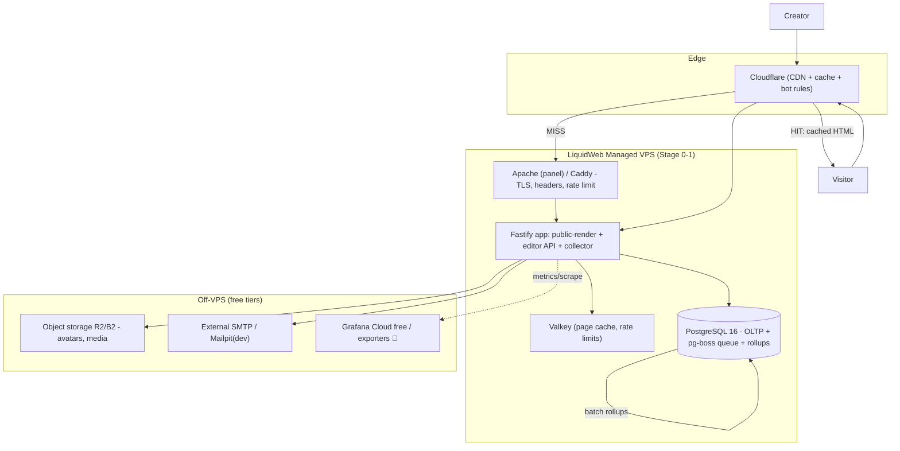
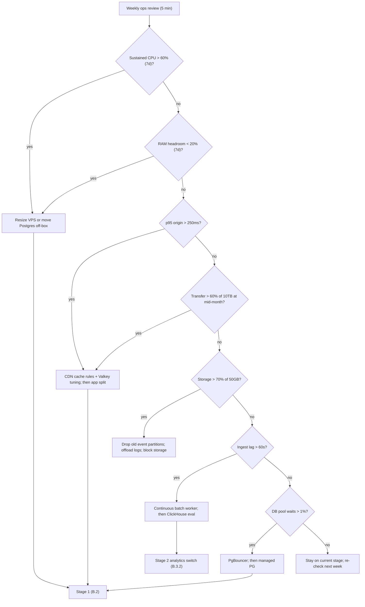

# COMBINED MARKDOWN - 2026-09-23-0001_link-in-bio

_Generated 2026-09-23 04:58:34 | 7 files | folder: D:\stuff\ai-misc\_bsh2026\vscode_project01\46-wide_research_test\independent_research\2026-09-23-0001_link-in-bio_

## Contents

1. 00-executive-summary.md
2. 01-market-analysis.md
3. 02-gap-blueocean-swot.md
4. 03-new-app-concept.md
5. 04-competitive-analysis.md
6. 05-tech-stack-matrix.md
7. 06-architecture-deployment.md

---

<!-- ====================================================================== -->
<!-- FILE: 00-executive-summary.md -->
<!-- ====================================================================== -->

# Link-in-Bio SaaS — Executive Summary of the Research Program

**Date:** 2026-09-23 · **Program folder:** `independent_research/2026-09-23/` · **Evidence base:** ~50 primary/third-party captures in `independent_research/scratch/research-link-in-bio-saas-2026-09/scratch/pages/` (fetched 2026-09-23 unless noted), digested in `scratch/notes/01-master-facts-digest.md` and QC'd in `scratch/notes/verification-pass.md`

**Reading contract:** every load-bearing claim below carries (Source, date). Conflicts are shown as BOTH figures, never averaged. Unknowns are the literal ❓. This file is designed so a reader who reads nothing else still gets every top-line finding; six companion docs carry the depth.

**Legend:** ✅ verified by 2+ independent sources · 🟡 single-source (medium confidence) · ⚠️ documented conflict — both figures stated · ❓ unknown after checking · ➖ not applicable

---

## 1. What the category IS in September 2026 — and how it bifurcated

The 2016-era idea — "one URL that holds many links" — is no longer one category. By Sep 2026 it has split into **three distinct businesses with different economics, different ICPs, and different failure modes**. Even third-party roundups now explicitly frame the split: "simple link hubs that organize outbound links, and full monetization storefronts" (Source: stan.store blog "Best Link in Bio Platforms," updated 2026-04-07). A Medium 2026 comparison opens with "the link-in-bio category has changed… choosing a tool mostly meant deciding which service could put several buttons behind one Instagram link. In 2026, that description is no longer enough" (Source: own.page and Medium comparisons, 2026).

| Layer | Archetype | Exemplars | Economics | The job it does |
|---|---|---|---|---|
| 1. Link hub (routing) | Free/cheap utility, freemium subscription | **Linktree** (free → $35/mo), bio.link (~$7.49/mo), Lnk.Bio, Taplink ($4–8), Solo.to, Milkshake ($6.99) | Flat SaaS tiers, $0–15/mo mainstream; monetize upgrades + (Linktree) ads/commerce | Aggregate ~6 social profiles behind one bio URL; analytics, email/phone capture (Source: sacra-linktree.md) |
| 2. Creator-commerce storefront | Subscription SaaS + embedded payments | **Stan** ($29/$99/mo, 0% transaction fees), Beacons ($0/$10/$30/$90 + up to 9% fees on lower tiers), The Leap (Thinkific), Komi (~$16/mo, media-kit focus) | $29–99/mo subscriptions; fee-free checkouts as differentiator vs Substack 10% / OnlyFans 20% | Sell downloads, courses, bookings, memberships from the bio link; setup <10 min (Source: sacra-stan.md) |
| 3. Marketplace / payments network | Take-rate GMV business | **Whop** (3% direct sales, Discover fee cut 30%→0%), Wishlink (India, affiliate-commission marketplace, 250+ brands) | Transaction take rates (~4.0%→5.5%), layered payments/BNPL/fraud fees, fintech attach (Whop Treasury 6% APY USDT0) | Discover + buy digital products; "business infrastructure for digital entrepreneurs" (Source: sacra-whop.md, wishlink-home.md) |

Adjacent but distinct: **about.me** has pivoted upmarket with AI ("Virtual Twin," CRM lead capture, $5/$7.50/mo — Source: aboutme-pricing.md, fetched 2026-09-23), and **suite-attached bio pages** (Squarespace Bio Sites, Later Linkin.bio) exist as features of broader platforms, not standalone businesses (Source: squarespace-biosites.md, later-linkinbio.md).

**Why the link layer survives platform change:** Sacra's framing is the best one-line description of the category's core utility — link-in-bio is the **"demilitarized zone (DMZ)"** between sanitized social platforms (Instagram, TikTok) and monetization channels (e.g., OnlyFans = 13.63% of Linktree click destinations) that platforms won't host directly (Source: sacra-linktree.md; dmr-linktree.md). That regulatory-arbiter function does not disappear when a platform adds two more bio links.

**Scale of the category's engagement (leader-level):** Linktree claims 1B+ clicks/week (Apr 2026), 240M commerce clicks/month, ~$300M/month in commerce sales, and ~$6B annual GMV driven by "Linkers" — all company-cited figures via TechCrunch May 2024 + DMR update Feb 2026, so treat as directional company claims, not audited (Source: dmr-linktree.md, updated 2026-02-28). Traffic mix: Instagram ≈ 4× TikTok ≈ 7× Facebook by click volume (Source: dmr-linktree.md).

**Category still attracts entrants:** Product Hunt lists **191 products** in its link-in-bio category as of 2026-09-18 — e.g., Paage ("Link-in-bio for commerce: easy as Bento, powerful as Shopify") and The Leap by Thinkific (Source: producthunt-category.md, 2026-09-18).

---

## 2. The consolidation wave — and why entry is STILL rational

### 2.1 The obituary table (all verified multi-source unless flagged)

| Product | What happened | Date | Acquirer/fate | Status |
|---|---|---|---|---|
| Bento (bento.me) | Acquired by Linktree (Linktree's FIRST acquisition of 2023); all user pages permanently offline | Acq Jun 2023; **dead Feb 13, 2026** | Linktree; migration to Linktree offered | ✅ dead (TechCrunch via Koji piece; alternativeto.net Dec 2025; onlytech) |
| Koji | Acquired by Linktree; brand + product sunset | Acq **Dec 14, 2023**; sunset Jan 2024 | Linktree ("acquires Koji — and plans to shut it down") | ✅ dead (TechCrunch 2023-12-14; Tubefilter 2023-12-14; startupdaily) |
| Fingertip | Acquired by Linktree; sunsets with users migrated; co-founders join to build "LinkApps ecosystem" | Sunset **May 1, 2026** | Linktree | ✅ (sacra-linktree.md) |
| Linkpop (Shopify) | Shut down | **Jul 7, 2025** | Shopify killed it to focus core commerce | ✅ dead |
| Snipfeed | Acquired by Planoly | Announced **Jan 24, 2025** | Planoly (CEO Katelyn MacKay blog + Pulse2) | ✅ absorbed |
| Tap Bio | Full shutdown; all pages offline, accounts closed | **Oct 31, 2026** (5 weeks after this report) | None — independent exit | 🟡 search-snippet evidence only — tap.bio's own-site notice plus taplink.at and linke.ro posts all state Oct 31; full primary fetch blocked (search-tapbio.json; verification-pass.md) |

That is **5 standalone deaths post-2022 plus one absorption** — the scope doc's falsifiable prediction of "≥3 shutdowns" was exceeded (5 deaths + 1 absorption against the ≥3 predicted) (Source: 01-master-facts-digest §1 and §11; verification-pass.md).

**The strategic pattern:** Linktree runs an explicit **acquire-and-kill roll-up** (Bento Jun 2023 → Koji Dec 2023 → Fingertip 2025/26): buy the adjacent product, migrate its users, sunset the brand. Meanwhile platform giants (Shopify) treated bio-pages as a feature, not a business, and killed theirs when focus demanded. (Source: TechCrunch/Tubefilter 2023-12-14; sacra-linktree.md; 01-master-facts-digest §1)

### 2.2 Why a new entrant is still rational — six reasons grounded in the data

1. **The deaths were parent-economics decisions, not category contraction.** Nothing in the evidence shows demand shrinking: the same window in which five products died, Whop went from $56M → $142M annualized revenue and Stan hit $40M ARR profitable at ~40% EBITDA margins (Sources: sacra-whop.md; sacra-stan.md). Report-mill growth claims cluster at ~13–15%/yr (§4 below).
2. **The leader opened a price umbrella.** Linktree's Nov 2025 hike (Starter $5→$8, Pro $9→$15, Premium $24→$35 = **46–67%**; a Reddit user reported $126→$222/yr) created a value wedge between the free tier and $15/mo that did not exist in 2024 (Source: extract-pricing-A.json + Reddit reports, Nov 2025 — ✅ verified). A hike of this size on a utility with known substitutes is a classic entry invitation.
3. **Consolidation cleared the field.** Bento (the most-cited "designer" alternative), Koji (interactive mini-apps), Linkpop (Shopify's free commerce page), and Tap Bio (card-style pages) all removed themselves — the mid-market alternative bench is thinner in Sep 2026 than at any point since 2021.
4. **Willingness-to-pay is proven at TWO price points.** Stan monetizes creators at $29–99/mo with 80k+ active creators; Whop monetizes transactions at ~5.5% blended take. The market pays both subscription AND take-rate models (Sources: sacra-stan.md; sacra-whop.md).
5. **The graveyard itself is a customer-acquisition channel.** Bento (Feb 2026), Fingertip (May 2026), and Tap Bio (Oct 2026) sunsets each eject thousands-to-millions of users looking for a new home — Taplink has already published a "Best Tap Bio alternative" post explicitly targeting the shutdown date (Source: taplink.at blog in search-tapbio.json).
6. **Structural gaps remain unserved by every leader** — GDPR/data-residency, Asia local payments, portability/platform-risk, support quality (§6 below). None of the top-4 by revenue is positioned on any of them.

---

## 3. Regional top-lines

### 3.1 United States — the money and the models
- **Leaders:** Linktree (users/brand), Whop (revenue growth), Stan (profitable subscription), Beacons (feature-breadth also-ran).
- **Dynamics:** monetization center of gravity moved to commerce take-rates + AI attach (Whop marketplace economics + Whop Treasury + Whop Payments Network; Stan's "Stanley" AI agent; Linktree Sponsored Links/Shops — US-only features). Yet flat subscriptions still dominate mid-market pricing — prediction #3 in the scope doc was confirmed WITH that nuance (Source: 01-master-facts-digest §11).
- **Killer stat:** Whop reported **$2.67B cumulative lifetime GMV by Feb 2026 with gross transaction volume growing ~25% month-over-month**, after cutting its Discover marketplace fee from 30% to **0%** to buy GMV scale (Source: sacra-whop.md). Runner-up: Linktree's company-cited ~$6B annual GMV driven by Linkers (Source: dmr-linktree.md, 2026-02-28).
- **Watch-item:** Whop's growth engine is sports-betting picks, crypto signals, and "make money" schemes — high-revenue, high-reputation-risk verticals (Source: sacra-whop.md).

### 3.2 Europe (incl. UK) — demand without a champion
- **Leaders:** the same US/AU platforms (Linktree HQ Melbourne; Whop NY; Stan LA; Beacons SF). **No EU-native platform appears anywhere in the top tier of the evidence set.**
- **Dynamics:** EU vendor marketing is dominated by compliance signals — data location, DPAs, third-party tracker policies (linke.ro, alllinks.cc) — and EU creators face US-platform data-transfer concerns in the Schrems III context. This is an unmet positioning slot, not a served one (Source: 01-master-facts-digest §8; linke.ro, alllinks.cc marketing copy).
- **Killer stat:** the trust/support surface is visibly failing — **Beacons holds 1.8–1.9/5 on Trustpilot** (billing/support complaints; ✅ verified via Trustpilot page + complaint threads), and even Linktree, at a respectable 4/5 across ~7,111 reviews (3.9/5 per AliDropship's mid-2026 tally), shows recurring complaint clusters around account bans and refund friction (Sources: search-complaints.json, alidropship.com 2026, trustpilot.com/review/linktr.ee captured Sep 2026). EU buyers with GDPR expectations are the natural defection pool.

### 3.3 Asia (East/South/SE) — regional players win; payments are the moat
- **Leaders:** lit.link (Japan, GMO Pepabo — free, broad adoption incl. 推し活 fandom), SlashPage (Korea — free basic, paid custom domains/multilingual, an SEO toggle to "Allow search engines and LLMs to index"), Taplink (RU/CIS origin — $4/$8), and India's Cosmofeed ecosystem: SuperProfile (~50k creators; free Starter + **10% platform fee on sales**, per Cosmofeed help docs Jul 2026) and Wishlink (**100k+ creators, Meta Business Partner, 250+ brands**, affiliate-commission model) (Sources: litlink-home.md; slashpage notes; superprofile-home.md + search-superprofile.json; wishlink-home.md).
- **Dynamics:** Western leaders do NOT dominate Asia — scope prediction #4 confirmed. China is structurally separate (WeChat/Douyin mini-programs; Xiaohongshu link restrictions); Korea/China native-ecosystem searches from Western sources came back EMPTY — a documented evidence gap, not proof of absence (Source: search-korea-china.json; 00-scope.md).
- **Killer stat:** **Stripe-based leaders settle only USD/EUR/GBP — no local-currency payments for Asian creators** (Source: linkasia.me via earlier fetches, in 01-master-facts-digest §8). Contrast: Whop's Payments Network already advertises 135+ currencies / 241+ territories / 100+ methods with claimed 6–10% recovery on declined payments (Source: sacra-whop.md) — the payments layer, not the page builder, is the regional battleground.

---

## 4. Market size — honesty first

### 4.1 The report-mill spread (do not average; treat as a directional band)

| Source (report mill) | Claim | Verdict |
|---|---|---|
| marketintelo | $0.4B (2025) | Low bound |
| growthmarketreports | $1.12B (2024) | Mid |
| strategymrc | $1.2B → $3.2B @ 14.4% CAGR | Mid |
| linkship | $1.62B → $4.24B by 2033 @ 13.2% CAGR | Mid-high |
| dataintelo | $1.8B → $6.4B @ 15.2% CAGR | High bound |

Band: **~$0.4–1.8B (2024/25) growing ~13–15%/yr** — a 4.5× spread between low and high tells you these mills share no common definition of the category. All five are report-mill quality; use only as a directional envelope. (Source: 01-master-facts-digest §7; verification-pass.md)

### 4.2 The bottom-up sanity check (the number to plan around)

- **Core link-in-bio SaaS revenue: likely $250–400M/yr.** Construction: Linktree $55.5M (2024, Sacra estimate; ⚠️ getlatka says $42M ARR) + Stan $40M (Apr 2026, Sacra; ⚠️ getlatka $21.9M 2025-est) + Beacons ~$11M (🟡 builtbyfoundry, undated, low confidence) + about.me + the long tail ($4–15/mo tools).
- **Creator-commerce layer on top: $200M+.** Whop $142M annualized (Oct 2025) + Stan's GMV-driven subscription base + Linktree commerce features — much of Whop's revenue is marketplace/payments, not link-page SaaS per se.
- **Reject the $480B "creator economy" headline** (ylink.pro) as a TAM for this category — it conflates all creator monetization. Scope prediction #5 confirmed: real SOM/SAM/TAM for a new entrant is far below headline. Context anchor: professional creators' median income $133K in 2025 (nealschaffer).

---

## 5. Leader scoreboard (as of 2026-09-23)

| Platform | Model | Users / creators | Revenue (latest known) | Growth | Valuation / funding | Pricing (2026) |
|---|---|---|---|---|---|---|
| **Linktree** (2016, Melbourne) | Freemium link hub + commerce attach | **70M+ users** (company statement; 50M+ milestone May 2024). ⚠️ one 2026 comparison blog says ~50M (inflowave.io) | ⚠️ **$55.5M 2024, +50% YoY from $37M 2023** (Sacra) vs **$42M ARR** (getlatka). 2025 figure not yet published ❓ | 49.4% (Sacra table, 2023→24) | $1.3B (Mar 2022); $110M round; ⚠️ total raised $165.7M (getlatka/Sacra) | Free / $8 / $15 / $35 per mo (post-Nov-2025 hike, 46–67%) |
| **Whop** (2021, NY) | Marketplace + payments network (B2B2C) | **18.4M+ users; 183,628 sellers; 258 sellers earned $1M+** (Jun 2025) | **$142M annualized Oct 2025** (from $56M end-2024); $60.2M platform MRR end-2025 (Sacra est.) | ⚠️ headline **250%** (Sacra) vs arithmetic ~153% ($56M→$142M) | **$1.6B (Feb 2026, Tether strategic, $200M raised)**; prior $800M (2024, Bain); total raised $218M; ~20 engineers | 3% direct-link sales; Discover fee 30%→**0%**; take rate 4.0%→~5.5%; layered payments/BNPL fees |
| **Stan** (2020, LA) | All-in-one storefront subscription | **80,000+ active creators** | ⚠️ **$40M ARR Apr 2026** (Sacra; up from $35M end-2025) vs $21.9M 2025-est (getlatka) vs ~$28–30M (2024, others) | 23.7% Y/Y (Sacra, 2025); decelerating — single-tier NDR ceiling | $5M Forerunner seed (2022) as sole institutional round; ⚠️ 2025-09-15 raise signal seen in earlier session data | $29 / $99 per mo ($25/$79 annual); **0% transaction fees** |
| **Beacons** (YC, a16z-led 2021) | Creator utility layer + storefront | **10M+ creators** (own site; 7M+ third-party; ⚠️ inflowave.io says 4–6M) | ~$11M (🟡 builtbyfoundry, undated — low confidence) ❓ | ❓ not disclosed | ~$29.8M raised; ⚠️ inflowave.io claims "$50M Series B led by Spark Capital" | Free / $10 / $30 / $90 per mo; ⚠️ fees "up to 9%" (Stan's table) vs 9% on Free / 0% top tier (creator-hero) — tier-dependent |

Supporting facts: Stan — profitable at ~40% EBITDA margins, ARPC ~$437 (declining from $491 early 2024), $100M+ cumulative creator sales, 50%+ of GMV from downloads priced $4–30, 171 employees (getlatka), Stanley AI "Head of Content" agent as first upsell motion. Whop — 4M+ monthly Discover visitors, 30k+ affiliates at 30% recurring, creator payouts ~$3B/yr across 144 countries, avg creator earns $8,413/mo, Whop Treasury 6% APY USDT0 (Mar 2026), App Store for whop apps (Sep 2025). Linktree — iOS #81 Social Networking, 61K ratings, 4.8★; Sponsored Links (Hulu, Sam's Club, Harry's — US-only); stack: TypeScript/Node/React/PostgreSQL/GraphQL/AWS/Snowflake/Elasticsearch + legacy PHP monolith (job-posting signals). (Sources: sacra-linktree.md, sacra-whop.md, sacra-stan.md, dmr-linktree.md, search-beacons-price.json, search-marketshare.json, verification-pass.md)

Sacra's own cross-actor verdict: Whop "surpassed Stan in scale, 10× faster growth" (Source: sacra-whop.md).

---

## 6. The five biggest gaps (each is an entry wedge)

| # | Gap | Evidence (strongest data points) | Who is hurt | Wedge for a new entrant |
|---|---|---|---|---|
| 1 | **Price-hike backlash** | Linktree Nov 2025: Starter $5→$8, Pro $9→$15, Premium $24→$35 (46–67%); Reddit report $126→$222/yr; Shorby AppSumo lifetime-deal bait-and-switch complaint | Free-tier-upgraders, small creators, lifetime-deal buyers | Flat, honest, inflation-pegged pricing; publish the price-change policy |
| 2 | **Support failures** | Beacons Trustpilot **1.8–1.9/5** (billing/support); Linktree complaint clusters (account bans, refund friction) despite 4/5 overall; Shorby trust complaint | Paying creators whose storefront IS their income | Human support SLA, public status page, 1-hour-first-response targets |
| 3 | **GDPR / data-residency** | EU vendor marketing (linke.ro, alllinks.cc) sells data location, DPAs, tracker-freedom — implying leaders lack it; Schrems III context for US platforms; no EU-native leader | EU/UK creators, agencies, anyone with EU audience | EU data residency by default, DPAs, no third-party trackers by default |
| 4 | **Asia local payments** | Stripe-based leaders settle only **USD/EUR/GBP** — no local-currency payouts for Asian creators (linkasia.me); India's SuperProfile charges 10% platform fee; Whop's 135+-currency network shows the demand | Asian creators monetizing local audiences | Local rails orchestration (UPI, PayPay, GCash, GoPay, etc.) from day one |
| 5 | **Platform-risk concentration** | Instagram testing **clickable caption links for Meta Verified users** (Mar 2026, Dataconomy via sacra refs) — a direct disintermediation threat; link shorteners flagged as spam in some bio sections; lock-in with no export across leaders | Everyone whose business is one IG policy change away from zero | One-click full export (content, audience, analytics), custom-domain-first, multi-platform neutrality |

Prediction-scorecard cross-check: all five falsifiable predictions from the scope doc were CONFIRMED (leader unchanged; ≥3 deaths exceeded at 5–6; commerce+AI monetization shift confirmed with the flat-subscription nuance; Asia = regional players; bottom-up size far below $480B headline) (Source: 00-scope.md; 01-master-facts-digest §11).

---

## 7. The new-app concept (6 lines — full spec in doc 03)

1. **Working name: "Harbor"** — a privacy-first, portability-first link-in-bio + lightweight creator storefront built explicitly on the five gaps above (canonical name and full spec: `03-new-app-concept.md`).
2. **ICP:** EU/Asia professional creators and solo businesses burned by price hikes, lock-in, or support failures — the defectors ejected by six product deaths plus Linktree's 46–67% hike.
3. **Wedge:** fair flat pricing (free + ~$8–12/mo tier), EU data residency with DPAs and no third-party trackers by default, and one-click full export as a marketed feature (anti platform-risk).
4. **Commerce posture:** Stan-style 0% transaction fees on self-driven sales (differentiate vs Beacons' up-to-9% and Substack 10% / OnlyFans 20%), with local-payment orchestration for Asia as the reach feature.
5. **Trust as product:** human-support SLA, public status/incident page, transparent pricing policy — operationalizing the exact failures visible in Beacons' 1.8 Trustpilot score.
6. **Build posture:** FOSS micro-library composition (doc 05), quality-first brand, staged VPS→cloud deployment (doc 06) — capital-light like Stan (~$5M seed to profitability), not burn-heavy like the dead roll-up targets.

---

## 8. Deployment answer (5 lines — full plan in doc 06)

1. **Stage 0 (0 DAU):** run entirely on the existing LiquidWeb Managed VPS (AlmaLinux 9.8, cPanel Fully Managed, 2 vCPU / 2 GB RAM, 10TB transfer, 50GB storage, root SSH, WHM, Softaculous) — app + DB on-box, Acronis agent backups, Cloud Firewall in Advanced mode with explicit cPanel/WHM/email port opens (Advanced closes all ports by default).
2. **Stage 1 (~10k DAU):** hybrid — keep the VPS for app/origin, offload to managed cloud Postgres, CDN edge caching (CDN sits between user and origin, pulling from origin), object storage for media; cron jobs via control panel.
3. **Stage 2 (~1M DAU):** cloud promotion — containerized app tiers, queueing, multi-region reads, VPS demoted to internal tooling/staging.
4. **Each promotion gated by measured thresholds** (CPU/RAM saturation, p95 latency, error budget) defined in doc 06 — cost-effective mixes of existing VPS + PaaS/BaaS + AWS/GCP at every stage.
5. Grounding: 12 official LiquidWeb help docs fetched and digested (firewall, CDN, Acronis, caching, cron, remote DB, VPS infra, cPanel, support tiers, dedicated, add-domain) — `scratch/pages/lw-*.md`.

---

## 9. Key open questions / unknowns that survived verification

| # | Unknown | Status | What was checked |
|---|---|---|---|
| 1 | Linktree 2024 revenue | ⚠️ $55.5M (Sacra) vs $42M ARR (getlatka); 2025 figure not published | sacra-linktree.md, getlatka, dmr-linktree.md |
| 2 | Linktree total raised | ⚠️ $110M (Mar 2022 round) vs $165.7M total (getlatka/Sacra sidebar) — likely rounds summed | dmr-linktree.md, sacra-linktree.md |
| 3 | Stan ARR | ⚠️ $40M (Sacra, Apr 2026) vs $21.9M (getlatka 2025-est) vs ~$28–30M (2024) | sacra-stan.md, getlatka |
| 4 | Stan 2025-09-15 raise | ⚠️ "sole institutional round = $5M seed" (Sacra) vs earlier-session raise signal | sacra-stan.md, verification-pass.md |
| 5 | Whop YoY growth rate | ⚠️ headline 250% vs arithmetic ~153% ($56M→$142M) | sacra-whop.md |
| 6 | Tap Bio shutdown (Oct 31 2026) | 🟡 single detailed source + competitor-blog corroboration; primary fetch blocked | search-tapbio.json |
| 7 | Beacons revenue / funding | ❓ ~$11M undated (low confidence); $29.8M vs "$50M Spark Series B" conflict | beacons fetches, inflowave.io |
| 8 | Korea/China native ecosystem | ❓ Western-source searches EMPTY; China structurally separate (WeChat/Douyin mini-programs) | search-korea-china.json |
| 9 | Exact paid prices: Lnk.Bio, Campsite Pro, Liinks Pro, SlashPage paid tiers | ❓ JS-gated or unpublished | extract-batchD.json, earlier notes |
| 10 | Milkshake Pro pricing | 🟡 single full-table source ($6.99 / $29.99 per 3 mo) | search-milkshake.json |
| 11 | Linktree engagement claims (1B+ clicks/wk; $6B GMV) | 🟡 company-cited, unaudited | dmr-linktree.md, TechCrunch via DMR |
| 12 | Whop's "250%→0% fee" long-run monetization | ❓ strategy just announced; no outcome data yet | sacra-whop.md |

---

## Where to go deeper (the other six deliverables)

All in `independent_research/2026-09-23/`; doc numbers are the canonical keys (filenames follow the program numbering).

| Doc | Deliverable | What it adds beyond this summary | Read it when |
|---|---|---|---|
| 01 | Market landscape — industry state, US/EU/Asia deep dives, market sizing (TAM/SAM/SOM/TOM), 1–3 yr forecast | Full regional dynamics, sizing derivations, forecast scenarios | You need market numbers or regional strategy |
| 02 | Gap analysis, blue-ocean opportunities, mentor-style founder SWOT | Complaint-level evidence, niche mapping, opportunity justification, SWOT | You are deciding WHETHER to build |
| 03 | New-app concept — features, UVP/ICP, early adopters, landing-page hero options, press kit, GTM, monetization, MVP→V3 | The full product spec behind section 7 above | You are deciding WHAT to build |
| 04 | Top-20 competitive analysis — pricing tiers with quotas, monetization, app-store rankings, MAU/DAU, full tech-stack matrix | Every verified survivor (20 of ~28 candidates), stack-by-stack matrix with ❓ discipline | You need positioning, pricing, or stack benchmarks |
| 05 | Software architecture plan — FOSS micro-library composition | Library-by-library composition for the concept in doc 03 | You are ready to design the system |
| 06 | Staged deployment plan — 0 / 10k / 1M DAU on the existing LiquidWeb VPS → hybrid → cloud | Stage gates, promotion thresholds, cost mixes, firewall/CDN/backup specifics | You are ready to ship |

---

## Sources

Primary/third-party captures (all fetched 2026-09-23 into `independent_research/scratch/research-link-in-bio-saas-2026-09/scratch/pages/` unless noted):

- sacra-linktree.md (sacra.com/c/linktree) — Linktree revenue/valuation/funding model, Fingertip
- sacra-whop.md (sacra.com/c/whop) — Whop revenue, GMV, Tether round, fee structure, Treasury, Payments Network
- sacra-stan.md (sacra.com/c/stan) — Stan ARR, creators, margins, pricing, Stanley, churn analysis
- dmr-linktree.md (expandedramblings.com, updated 2026-02-28) — Linktree 70M+ users, milestones, commerce clicks/GMV, funding
- search-koji.json (TechCrunch 2023-12-14, Tubefilter 2023-12-14, startupdaily) — Koji acquisition/sunset
- search-bento.json, search-bento-death.json (alternativeto.net Dec 2025, onlytech, TechCrunch) — Bento acquisition + Feb 13 2026 shutdown
- search-tapbio.json (autoposting.ai, creator-hero.com, taplink.at blog) — Tap Bio Oct 31 2026 shutdown, pricing
- extract-pricing-A.json + Reddit reports (Nov 2025) — Linktree price hike $8/$15/$35
- search-marketshare.json (inflowave.io, linke.ro, stan.store blog, creator-hero.com, similarweb) — leader comparisons, fee tiers, Beacons funding claim, Stan traffic rank
- search-complaints.json (trustpilot.com/review/linktr.ee captured Sep 2026, alidropship.com 2026, work-management.org Jul 2026, linktr.ee/s/terms eff. 2026-07-05) — Linktree support/refund patterns
- search-beacons-price.json — Beacons $0/$10/$30/$90 (two independent sources)
- aboutme-pricing.md (about.me, primary) — $5/$7.50 tiers, Virtual Twin AI
- search-shorby.json — Shorby $15/$29/$99 + AppSumo complaint
- search-milkshake.json — Milkshake $6.99 / $29.99-3mo
- search-superprofile.json (Cosmofeed help docs, Jul 2026) — SuperProfile 10% platform fee
- wishlink-home.md — Wishlink 100k+ creators, 250+ brands, Meta Business Partner
- litlink-home.md — lit.link free, GMO Pepabo, fandom adoption
- squarespace-biosites.md, later-linkinbio.md, bio.link-home.md, komi.io/pricing, taplink blog — roster pricing
- search-korea-china.json — documented empty result for Korea/China native ecosystem
- producthunt-category.md (2026-09-18) — 191 products; Paage; The Leap
- Market-size mills: marketintelo, growthmarketreports, strategymrc, linkship, dataintelo (via 01-master-facts-digest §7); ylink.pro ($480B headline, rejected); nealschaffer.com (creator median income $133K, 2025)
- linkasia.me — Stripe USD/EUR/GBP limitation for Asian creators
- Dataconomy (Mar 2026, via sacra refs) — Instagram caption-links test for Meta Verified
- LiquidWeb official docs ×12 (lw-*.md) — firewall, CDN, Acronis, caching, cron, remote DB, VPS infra, cPanel, support levels, dedicated, add-domain
- Program notes: 01-master-facts-digest.md, verification-pass.md, 00-scope.md (all 2026-09-23)

Framing-only context from model memory (no local source): none load-bearing in this file — every numbered claim above traces to a captured source.


---

<!-- ====================================================================== -->
<!-- FILE: 01-market-analysis.md -->
<!-- ====================================================================== -->

# Link-in-Bio SaaS — Full Market Analysis

**Report date:** 2026-09-23
**Prepared for:** Full-stack multiplatform developer + DevSecOps engineer (prospective new entrant)
**Evidence base:** Primary/third-party captures saved 2026-09-23 in `independent_research/scratch/research-link-in-bio-saas-2026-09/scratch/pages/` (filenames cited inline); verification status from `scratch/notes/verification-pass.md`; scope from `scratch/notes/00-scope.md`; backbone facts from `scratch/notes/01-master-facts-digest.md`.
**Method rules:** Conflicts are stated with BOTH figures, never averaged. Unknowns carry the literal ❓. Anything from model memory (not re-verified against a captured source this session) is explicitly labeled `[memory]`. Report-mill market-size figures are treated as a directional band only.

**Legend**

| Symbol | Meaning |
|---|---|
| ✅ | Verified by 2+ independent captured sources |
| 🟡 | Single-source; medium confidence |
| ⚔️ | Documented conflict — both figures shown, no averaging |
| ❓ | Unknown / not captured this session (with note on what was checked) |
| ➖ | Not applicable (table cells use an em dash "—" for the same meaning) |
| `[memory]` | Framing from model general knowledge, not verified against captured sources |

---

## 1. Market definition & evolution

### 1.1 What the category is

The link-in-bio category is the software layer that converts the "one clickable link" constraint of social profile bios (Instagram, TikTok, X, Threads, YouTube) into a mini landing page — and, since ~2020, into a monetization and commerce surface. In September 2026 the category spans three business models: (a) flat-subscription SaaS for link pages (Linktree, bio.link, Lnk.Bio, Taplink, Shorby, Milkshake), (b) creator storefront SaaS with zero or low take-rates (Stan, Beacons, The Leap by Thinkific, Paage), and (c) commerce marketplaces / payments platforms that grew out of the bio link (Whop, and regionally Wishlink in India). Product Hunt tracks 191 products in its "link in bio" category as of 2026-09-18 (Source: producthunt-category via extract-batchC.json, retrieved 2026-09-23) ✅ — a census of a long, shallow tail beneath a handful of scaled leaders.

### 1.2 Origin story (2016)

Linktree launched in 2016 in Melbourne, Australia, founded by brothers Alex and Anthony Zaccaria and Nick Humphreys (Source: dmr-linktree.md, fetched 2026-09-23) ✅. Per company-lore founder interviews, the Zaccarias had previously built Egator, a social-media tool for musicians and bands, and the recurring pain they saw — artists on Instagram could post only one clickable bio link while needing to route fans to music, tickets, merch, and socials simultaneously — became the Linktree thesis `[memory — Egator detail not re-verified in this session's captures]`. The product was deliberately trivial: a single mobile page of buttons behind one short URL, free to start. Growth was steady until the 2020–2021 creator-economy boom supercharged it — 24M users added in the year prior to March 2022 (Source: PR Newswire Mar 16 2022, via dmr-linktree.md) ✅ — culminating in a $110M raise at a $1.3B valuation in March 2022 (Sources: dmr-linktree.md citing PR Newswire + Reuters; getlatka; Sacra) ✅. Every other product in this category is either an imitation of, a verticalization of, or a deliberate rejection of that original artifact.

### 1.3 Three waves of evolution

**Wave 1 — Link aggregation (2016–2020): utility.** The bio page as a dumb directory: buttons, icons, basic themes, lightweight click counts. Monetization: freemium subscription gating themes and analytics. Survivors of this wave that never left it: Lnk.Bio, Solo.to, bio.link, Taplink, Milkshake, Shorby, lit.link (Source: 01-master-facts-digest.md §6, 2026-09-23) ✅.

**Wave 2 — Monetization surface (2020–2024): the DMZ insight.** Sacra's framing is the sharpest captured articulation: link-in-bio found product-market fit as a "demilitarized zone (DMZ) between social media platforms like TikTok and Instagram and more debaucherous, prosperous monetization channels like OnlyFans — allowing for peaceful co-existence" (Source: sacra-linktree.md, fetched 2026-09-23) ✅. The bio page became the compliant buffer zone where discovery-platform traffic converted to off-platform revenue: tips, paywalls, digital downloads, affiliate links, email/phone capture, storefronts (Linktree Shops, 2023–2024), and brand money (Linktree Sponsored Links with Hulu, Sam's Club, Harry's — US-only). Quantified: Linktree cited 240M commerce clicks and ~$300M in commerce sales in a month, ~$6B annual GMV driven by "Linkers" (company-cited, May 2024 via TechCrunch; Source: dmr-linktree.md) ✅-as-company-claims.

**Wave 3 — Commerce platform + embedded finance (2024–2026): take-rates over subscriptions.** The center of gravity moved from hosting links to processing money. Whop built a marketplace with layered payments economics (3% direct-link fee; marketplace fee cut from 30% to 0% in 2025 to buy GMV scale; card processing 2.7% + $0.30 domestic; orchestration +0.8%; BNPL via 10 partners up to $42,750 / 5-year terms; the Whop Payments Network as a standalone product across 135+ currencies, 241+ territories, 100+ methods; Whop Treasury paying 6% APY on USDT0 balances, launched Mar 2026; Tether's wallet infrastructure embedded after its Feb 2026 strategic investment) (Source: sacra-whop.md, fetched 2026-09-23) ✅. Stan held the opposite pole — pure subscription ($29/$99, 0% transaction fees) — and added an AI agent ("Stanley," an autonomous LinkedIn/Instagram posting "Head of Content") as its first upsell motion (Source: sacra-stan.md) ✅. Linktree straddled: subscriptions + commerce fees + Sponsored Links + the Fingertip acquisition to build a "LinkApps ecosystem" (Source: sacra-linktree.md) ✅. about.me pushed an AI upmarket pivot (Virtual Twin AI, CRM lead capture) (Source: aboutme-pricing.md, fetched 2026-09-23) ✅. The verification pass scored the scope prediction "monetization shifted to commerce take-rates + AI" as CONFIRMED, with the caveat that flat subscriptions still dominate mid-market pricing (Source: 00-scope.md §falsifiable-predictions; 01-master-facts-digest.md §11) ✅.

### 1.4 Category map, September 2026

| Segment | Alive and scaled | Alive, mid/tail | Dead or absorbed since 2022 |
|---|---|---|---|
| **Link hubs** (flat-subscription directories) | Linktree (70M+ users), Taplink (RU/CIS), lit.link (JP) | bio.link, Lnk.Bio, Milkshake, Shorby, Solo.to, Liinks, Campsite.bio, SlashPage (KR), Squarespace Bio Sites, Later Linkin.bio, Hopp by Wix, Carrd (adjacent) | Koji (dead Jan 2024, Linktree-acquired); Tap Bio (shutting Oct 31 2026) |
| **Creator storefronts** (sell from the bio) | Stan (80k+ creators, $40M ARR), Beacons (10M claimed creators) | The Leap by Thinkific, Paage, Komi (media-kit focus), Milkshake (card-style), about.me (AI/professional pivot) | Bento (dead Feb 13 2026, Linktree-acquired); Fingertip (sunset May 1 2026, migrated into Linktree) |
| **Marketplaces / commerce platforms** (bio link as top of funnel) | Whop ($142M annualized Oct 2025; 18.4M+ users) | Wishlink (India, affiliate marketplace, 100k+ creators), SuperProfile/Cosmofeed (India, take-rate model) | Linkpop (dead Jul 7 2025, Shopify); Snipfeed (absorbed into Planoly Jan 24 2025) |
| **Dead zone** (2022-era VC bets that did not survive) | — | — | Koji, Linkpop, Bento, Tap Bio, Fingertip-as-standalone, Snipfeed — ≥5 deaths plus one absorption |

Sources for table: 01-master-facts-digest.md §1, §6 (2026-09-23); producthunt-category via extract-batchC.json ✅. Tap Bio shutdown date is single-source 🟡 (search-tapbio.json snippet; corroborating fetch blocked per verification-pass.md).

The pattern is unambiguous: Linktree runs an **acquire-and-kill roll-up** (Bento Jun 2023, Koji Dec 2023, Fingertip 2025 — three acquisitions, three sunsets), Shopify exited (Linkpop), and the standalone "beautiful page" middle (Bento, Koji) proved structurally unviable between free commodity hubs and commerce platforms (Sources: TechCrunch/Tubefilter/startupdaily/alternativeto/onlytech via search-koji.json, search-bento.json, search-bento-death.json; sacra-linktree.md) ✅.

---

## 2. US market

### 2.0 Executive summary

The US is the category's revenue center and the home of all four scaled leaders. As of September 2026 the market is a four-player oligopoly with three distinct business models converging on the same real estate: **Linktree** (Melbourne-founded, US-commercially-dominant flat-subscription + ads + commerce fees; ~$42–55.5M revenue ⚔️; 70M+ users; the brand-default), **Whop** (New York; the revenue leader at $142M annualized Oct 2025, a payments-and-marketplace machine growing far faster than anyone else — headline +250% / arithmetic ~153% ⚔️ vs Linktree's +50% 2024 — now backed by Tether at a $1.6B valuation), **Stan** (Los Angeles; $40M ARR April 2026, profitable at ~40% EBITDA margins on $5M raised — the capital-efficiency outlier), and **Beacons** (San Francisco; ~10M claimed creators but a monetization and trust laggard: ~$11M revenue 🟡 and Trustpilot 1.8–1.9/5). The defining 2025–2026 US events: Linktree's November 2025 price hike of 46–67% (maturity signal, see §6), Whop's structural fee cuts to buy GMV, Stan's AI upsell against a single-tier NDR ceiling, and the tail continuing to die (Bento Feb 2026, Tap Bio Oct 2026). The live platform risk is Instagram testing clickable caption links for Meta Verified users (Mar 2026 report) — the first direct attack on the category's discovery-side moat (Sources: sacra-linktree/whop/stan.md, dmr-linktree.md, search-complaints.json, all captured 2026-09-23) ✅.

### 2.1 Linktree — the brand-default leader

**One-line bio:** Founded 2016 in Melbourne by Alex Zaccaria (CEO), Anthony Zaccaria, and Nick Humphreys; the category creator and still its brand synonym ("linktr.ee/yourname" is recognized on sight by consumers, which competitors concede converts cold traffic better — Source: inflowave.io via search-marketshare.json 🟡); today a "website builder for creators to share links and monetize audiences" (Sacra's classification) with HQ Melbourne and offices in Sydney, San Francisco, and Los Angeles (Source: dmr-linktree.md) ✅.

**Financial snapshot (with YoY):**

| Metric | Value | YoY / trend | Source, status |
|---|---|---|---|
| Revenue 2024 | **$55.5M** (Sacra estimate) | **+50% YoY from $37M in 2023** (growth-rate table: 49.4%) | sacra-linktree.md ✅ ⚔️ conflicts with below |
| Revenue 2024 (alt) | **$42M ARR** (getlatka) | ⚔️ stated alongside, not averaged | getlatka via 01-master-facts-digest.md ✅-as-documented-conflict |
| Valuation | $1.3B (Mar 2022) | No newer round captured ❓ (checked: Sacra, DMR, getlatka — no post-2022 valuation) | dmr-linktree.md ✅ |
| Funding raised | $110M (Mar 2022 round) vs **$165.7M total** (getlatka/Sacra; likely includes earlier rounds) ⚔️ | — | dmr-linktree.md; sacra-linktree.md ✅ ⚔️ both stated |
| Lead investors | Coatue (Series C), Index Ventures (Series B) | — | sacra-linktree.md 🟡 |
| Pricing post-Nov-2025 | Free / Starter **$8** / Pro **$15** / Premium **$35** per month (was $5/$9/$24 — a 46–67% hike); annual $6/$12 seen; a Reddit user reported $126→$222/yr | Large step-up, see §6.4 | extract-pricing-A.json + Reddit + DMR-adjacent ✅ |
| Commerce scale | ~$300M/month commerce sales, ~$6B annual GMV driven by Linkers (company-cited May 2024, via TechCrunch) | — | dmr-linktree.md ✅-as-company-claims |
| Employees / HQ cost base | ❓ (not captured; no current headcount found in this session's sources) | — | — |

**User-engagement snapshot:** 70M+ users (company statement, current; 50M+ milestone May 2024; 24M added in year to Mar 2022) (Sources: dmr-linktree.md, sacra-linktree.md) ✅. 1B+ clicks/week (Apr 2026 company statement); 240M commerce clicks/month; traffic mix Instagram ≈4× TikTok ≈7× Facebook; OnlyFans links are 13.63% of click destinations (Source: dmr-linktree.md) ✅-as-company-statistics. iOS app ranked **#81 Social Networking with 61K ratings at 4.8★** (Source: search-appstore.json, captured 2026-09-23) ✅. Web trust: Trustpilot ~3.9–4.0/5 across ~7,000–7,111 reviews; Capterra 4.4/5; recurring complaint clusters are account suspensions/appeals and app-store-billing refund friction (Apple/Google purchases can't be refunded by Linktree directly) (Sources: trustpilot.com and alidropship.com via search-complaints.json) ✅.

**Market-share snapshot:** Brand-default leader and the largest user base in the category by an order of magnitude (70M+ vs next-largest claimed bases: Whop 18.4M, Beacons 10M). By revenue it is no longer #1 — Whop's $142M annualized exceeds Linktree's $42–55.5M ⚔️ — see §5 for the full share build. Similarweb-grade web-traffic comparison vs rivals was not captured ❓ (only stan.store ranking was: #42 Business Services, #9,930 global, Aug 2026 — Source: similarweb.com via search-marketshare.json 🟡).

**UVP:** Zero-friction universal identity page — the safest, most-recognized single link a creator or small business can put in any bio; plus the deepest monetization add-on stack (Shops, Rewards, creator wallet, Earn section, Kajabi-powered courses, Sponsored Links with Hulu/Sam's Club/Harry's — US-only) (Source: sacra-linktree.md) ✅. The DMZ positioning (compliant buffer between Instagram and OnlyFans et al.) remains its quiet structural moat (Source: sacra-linktree.md) ✅.

**ICP:** Long-tail creators (the free tier's millions), subscription-upgrading pro creators, small businesses routing to stores/bookings/menus, and brands/organizations consolidating campaigns; monetization features skew US-centric (Sponsored Links/Shops/Rewards are US-only), meaning the paying ICP is disproportionately American (Sources: sacra-linktree.md, dmr-linktree.md) ✅.

### 2.2 Whop — the revenue leader and fastest grower

**One-line bio:** Founded 2021 in New York by CEO Steven Schwartz; a marketplace and modular toolset where creators build "whops" — app-stacked hubs (Chat, Courses, Forums, Help Desk, plus a third-party App Store launched Sep 2025) — to sell everything from courses to sports-betting picks; it has outgrown the link-in-bio framing to become a creator-commerce and payments platform (Source: sacra-whop.md, fetched 2026-09-23) ✅.

**Financial snapshot (with YoY):**

| Metric | Value | YoY / trend | Source, status |
|---|---|---|---|
| Revenue | **$142M annualized (Oct 2025)**, up from **$56M end-2024** | Sacra headline says "+250%"; arithmetic on the two figures is ~153% ⚔️ — both stated, not averaged | sacra-whop.md ✅ ⚔️ growth-rate conflict |
| Platform MRR | $60.2M estimated (end-2025) | — | sacra-whop.md 🟡 |
| GMV | ~$80M/month (Dec 2024) → ~$100M/month (Mar–Apr 2025) → **$2.67B cumulative lifetime (Feb 2026)**; GTV ~+25% MoM; "set to process over $1Bn in payments annually" (Apr 2025 company statement) | Steep compounding | sacra-whop.md ✅-as-mix-of-Sacra-model-and-company-claims |
| Take rate | 4.0% (2022) → ~5.5% (early 2025) | Rising w/ marketplace mix | sacra-whop.md ✅ |
| Valuation | **$1.6B (Feb 2026)** via Tether strategic investment, $200M raised; prior $800M (2024 Series B, $50M+, Bain Capital Ventures) | +100% valuation in ~1.5 yrs | sacra-whop.md ✅ |
| Total funding | $218M (digest) vs Sacra header "$67.00M (2025)" ⚔️ — likely round-level vs cumulative definitional gap; both stated | — | 01-master-facts-digest.md §3; sacra-whop.md ✅ ⚔️ |
| Team | ~20 engineers (extreme revenue/employee efficiency) | — | sacra-whop.md 🟡 |

**User-engagement snapshot:** 18.4M+ users; 183,628 sellers; 258 sellers have earned $1M+ (Jun 2025); total creator payouts ~$3B/yr across 144 countries; average creator earns $8,413/month; Discover marketplace draws 4M+ unique monthly visitors; affiliate program scaled to 30,000+ active affiliates at default 30% recurring commissions; external Whop Payments Network serves 27,000+ businesses across 187+ countries, and the micro1 payouts partnership opened a 15M-user distribution channel (Source: sacra-whop.md) ✅-as-company-statistics-plus-Sacra-model.

**Market-share snapshot:** #1 by revenue in the broad category (≈46–61% of broad-category revenue, or ≈57–65% of the named-player subtotal, §5.2–§5.3); Sacra states Whop "surpassed Stan in scale, 10× faster growth" (Source: sacra-whop.md ✅). Not a link-hub share leader — its bio-page surface is incidental to its marketplace.

**UVP:** A complete business-in-a-box for digital entrepreneurs — modular apps, marketplace distribution (Discover), and a full embedded-finance stack (multi-PSP smart routing claiming 6–10% recovery of declined payments; BNPL at 10 partners; instant payouts via ACH/Venmo/stablecoins; Whop Treasury at up to 6% APY on USDT0) — with the marketplace fee deliberately cut to 0% to maximize GMV scale and network effects (Source: sacra-whop.md) ✅.

**ICP — including the uncomfortable reality:** The captured analysis is blunt: growth is "significantly driven by controversial but lucrative verticals like sports betting picks, crypto trading signals, and other 'make money' schemes… areas that typically command higher prices and attract highly engaged users" (Source: sacra-whop.md) ✅. The archetypal transaction given: $50–200/month VIP Discord memberships where "cappers" sell daily betting predictions. Mainstream ICP also exists (sneaker-reselling courses, e-commerce tools, software), and the Tether partnership plus LATAM/EU/APAC expansion signals an intent to broaden. A new entrant should read Whop's revenue quality accordingly: enormous, fast, and reputationally radioactive at its core.

### 2.3 Stan — the profitable capital-efficient storefront

**One-line bio:** Founded 2020 in Los Angeles by John Hu and Vitalii Dodonov after Hu tried to monetize his own TikTok following while at Stanford; an all-in-one mobile storefront (downloads, courses, 1:1 bookings, memberships, email) that a creator can set up in under 10 minutes — the anti-Linktree in that the store, not the link list, is the product (Source: sacra-stan.md, fetched 2026-09-23) ✅.

**Financial snapshot (with YoY):**

| Metric | Value | YoY / trend | Source, status |
|---|---|---|---|
| ARR | **$40M (April 2026)**, up from $35M end-2025 (+14% in ~4 months) | Trajectory: $1.7M (2022) → $14.7M (2023) → ~$28–30M (2024) → $35M (end-2025) → $40M (Apr 2026); decelerating (23.7% YoY per Sacra table) | sacra-stan.md ✅ ⚔️ getlatka says $21.9M (2025 est); both stated |
| Profitability | **~40% EBITDA margins, profitable** | — | sacra-stan.md ✅ |
| Funding | **$5M seed from Forerunner (2022) as sole institutional round** ⚔️ vs a 2025-09-15 raise signal in earlier session data; the Pulse2 headline "Stan Store partners: strategic investment raised from Gary Vaynerchuk" may be that event — unresolved, both stated | Capital-light outlier | sacra-stan.md; verification-pass.md ✅ ⚔️ |
| ARPC | ~$437, declining from $491 (early 2024) | Down (mix + promo pricing) | sacra-stan.md ✅ |
| Employees | 171 (getlatka) | — | getlatka via 01-master-facts-digest.md 🟡 |
| Creator GMV | $100M+ cumulative creator sales volume; 50%+ of GMV from digital downloads priced $4–30 | — | sacra-stan.md ✅ |
| Pricing | Creator $29/mo, Creator Pro $99/mo ($25/$79 annual), **0% transaction fees** | Positioned vs Substack 10% / OnlyFans 20% | stan.store pricing blog + sacra-stan.md ✅ |

**User-engagement snapshot:** 80,000+ active paying creators; growth engine is a 20% lifetime-revenue-share affiliate program plus TikTok/Instagram word-of-mouth (creators marketing the tool that markets them); stan.store web ranking #42 Business Services / #9,930 global (Aug 2026, Similarweb via search-marketshare.json 🟡). Structural engagement limit: single pricing tier, no expansion lever, gross churn has caught up with acquisition — net dollar retention capped (Source: sacra-stan.md) ✅.

**Market-share snapshot:** ~7–17% of broad-category revenue (§5.3, band reflects the $21.9–40M ⚔️ ARR conflict); roughly Linktree-scale by revenue (at the Sacra figures, ≈28% of Whop's $142M); the #2 US pure-subscription player and the only large one that is profitable (Sources: sacra-stan.md; arithmetic in §5) ✅.

**UVP:** "Everything you need to sell, in one link, and you keep 100%" — consolidation of email marketing, scheduling, storefront, checkout, funnels, upsells, and memberships under one $29 subscription with zero take-rate, mobile-first, platform-neutral (Source: sacra-stan.md) ✅. Sacra's comparative note: link-routers like Linktree/Beacons "monetize at much lower rates ($144 ARPC vs Stan's $491) by focusing on routing traffic" rather than selling (Source: sacra-stan.md) 🟡.

**ICP:** Education- and expertise-focused creators with 10k+ followers — spirituality coaching, fitness instruction, social-media education — who sell knowledge products rather than route traffic (Source: sacra-stan.md) ✅. Stanley (the AI "Head of Content" agent auto-posting to LinkedIn/Instagram) targets the same base's audience-growth budget as the first upsell motion (Source: sacra-stan.md) ✅.

### 2.4 Beacons — the scale-without-monetization cautionary tale

**One-line bio:** YC-backed, San Francisco; founded among the first Linktree challengers (a16z led its 2021 round); a block-based creator hub that bundles link page, storefront, media kit, email, and AI tools — the most feature-dense free tier in the category, and the clearest evidence that features alone don't convert to revenue or trust (Sources: beacons fetches via 01-master-facts-digest.md §5; linke.ro and inflowave via search-marketshare.json) ✅.

**Financial snapshot:**

| Metric | Value | YoY / trend | Source, status |
|---|---|---|---|
| Revenue | ~$11M (builtbyfoundry claim, **undated**) | ❓ no trend — no second revenue datapoint captured | 01-master-facts-digest.md §5 🟡 low confidence |
| Funding | ~$29.8M raised (YC, a16z; a16z led 2021) ⚔️ vs inflowave.io claiming a "$50M Series B led by Spark Capital" — irreconcilable as stated; both recorded | — | beacons.ai data vs inflowave.io via search-marketshare.json ⚔️ 🟡 |
| Users | **10M+ creators (own claim)** ⚔️ vs **7M+ (third-party figure per digest §5)** and **4–6M (inflowave.io estimate)** — all three stated; own figure likely cumulative signups | — | beacons.ai; 01-master-facts-digest.md §5; inflowave.io via search-marketshare.json ✅-as-conflict |
| Pricing 2026 | Free $0 / Creator $10 / Creator Plus $30 / Creator Max $90 per month (one table showing "Creator $8" is likely annual-billing display — flagged, not resolved) | Stable | search-beacons-price.json (two independent sources + prior YouTube review) ✅ |
| Transaction fees | **Tier-dependent:** 9% on Free plan, 0% on Business Pro (creator-hero.com) — which reconciles the standing conflict between Stan's comparison table ("up to 9%") and Beacons' own "no platform fees on free plan" framing ⚔️→resolved-as-tier-dependent | — | creator-hero.com, stan.store table, beacons.ai via captured searches ✅ |

**User-engagement snapshot:** 10M (claimed) creators; "billions of page views per day" (own engineering claim, treat skeptically); React stack. The engagement story that matters is negative: **Trustpilot 1.8–1.9/5**, dominated by billing and support complaints — the single worst trust signal among the four leaders (Sources: Trustpilot page + complaint threads, per 01-master-facts-digest.md §5 and §9) ✅.

**Market-share snapshot:** ~4–5% of broad-category revenue even taking the $11M figure at face value (§5.3); large user base, monetization an order of magnitude behind Linktree and Stan — the category's clearest "raised VC, shipped features, failed to convert" data point (Sources: digest §5; §5 arithmetic below) ✅.

**UVP:** The most capability per dollar at the free tier — a store, media kit, email, and AI tools at $0, monetized via the 9% free-plan take-rate — aimed at creators who want Beacons-as-all-in-one without paying until they sell (Sources: linke.ro, creator-hero.com via search-marketshare.json) ✅.

**ICP:** Early-stage and cost-sensitive creators, especially TikTok-native sellers of digital products; the Trustpilot record indicates the paying end of that base is churning on billing/support friction — an exploitable weakness for a quality-first entrant (Sources: search-marketshare.json comparisons; 01-master-facts-digest.md §9) ✅.

### 2.5 US tail and sentiment (context)

Scaled-but-uncaptured financially: Hopp by Wix (4.9★, 11 reviews on PH), The Leap by Thinkific, Paage ("easy as Bento, powerful as Shopify"), Komi (~$16/mo media-kit focus), about.me ($5/$7.50 AI-upmarket), Shorby ($15/$29/$99 with an AppSumo lifetime-deal complaint on record), Milkshake ($6.99 Pro), bio.link ($7.49 Pro), Lnk.Bio, Liinks, Campsite.bio (250k+ creators/agencies/brands incl. Orangetheory, Dell, Georgetown), Solo.to, Carrd (adjacent) (Sources: extract-batchC.json, aboutme-pricing.md, search-shorby.json, search-milkshake.json, bio.link-home.md, komi.io pricing, 01-master-facts-digest.md §6) ✅. Sentiment themes with material share-of-voice: Linktree's Nov-2025 hike backlash; Beacons billing; Shorby lifetime-deal bait-and-switch; generic pains — platform lock-in, shallow free-tier analytics, link-shortener spam flags in some bio sections, and single-platform dependence (01-master-facts-digest.md §9) ✅.

---

## 3. EU market

### 3.0 Executive summary

Europe (UK folded in per scope decision, Source: 00-scope.md) is a demand-rich, structurally underserved region: no captured EU-headquartered platform has scaled to leader rank, yet the two most concrete unmet needs recorded in this research are both EU-shaped — **GDPR-compliant data residency** and the aftermath of **Schrems III**-era transfer scrutiny — and both are actively used as marketing wedges by small EU challengers (linke.ro, alllinks.cc) while the US/AU leaders offer no EU-specific data story ❓ (checked: Linktree terms captured Jul-2026 contain no EU data-residency commitments; no EU offices or EU hosting claims found in any captured leader source). Meanwhile the leader with the loudest EU expansion intent is the least EU-typical: Whop, whose Feb 2026 Tether round explicitly funds Europe expansion alongside LATAM/APAC, and whose payments network already runs local acquiring in the US, EU, Canada, Australia, and the UK (Source: sacra-whop.md) ✅. The EU market in Sep-2026 is therefore best described as: large creator population monetizing through US platforms, regulatory pressure rising, and a persistent gap between what EU law increasingly demands (local processing, DPAs, tracker discipline) and what the dominant tools ship (Sources: 01-master-facts-digest.md §8; sacra-whop.md) ✅.

### 3.1 GDPR / Schrems III dynamics

The captured vendor evidence: EU-focused link platforms market on "data location, DPAs, and third-party tracker control" as recurring themes — linke.ro (which also publishes aggressive Linktree-vs-Beacons comparison content) and alllinks.cc are the named examples (Source: 01-master-facts-digest.md §8) ✅. The structural driver — the CJEU's Schrems III line of jurisprudence making US-platform data transfers legally fragile for EU commercial users `[memory — Schrems III framing; the digest records the context label but not the ruling details; treat the legal specifics as unverified here]` ❓. For a DevSecOps-lens entrant this is the single cleanest regional wedge in the category: EU-region hosting, executed DPAs, no US sub-processor sprawl, and no third-party trackers by default are all verifiable, marketable properties that none of the four leaders currently claims in captured materials ❓ (checked: sacra/dmr/about/pricing captures for all four leaders; nothing on EU residency).

### 3.2 EU-focused vendors (demand evidence)

| Vendor | Evidence captured | Status |
|---|---|---|
| linke.ro | Active 2026 comparison-content marketing vs Linktree/Beacons/Stan (Source: linke.ro via search-marketshare.json) | ✅ alive, sub-scale, revenue ❓ |
| alllinks.cc | GDPR/data-residency positioning per digest §8 | 🟡 single mention, revenue/users ❓ |
| Others | ❓ — no other EU-native platform surfaced in this session's captures (checked: Product Hunt category roster, regional searches) | — |

These are not leaders; they are demand-side evidence — entrepreneurs betting that sovereignty-compliant bio tooling is a wedge. Revenue and user counts: ❓ for both.

### 3.3 US leaders' EU presence

| Leader | Captured EU presence |
|---|---|
| Linktree | HQ Melbourne; offices Sydney, San Francisco, Los Angeles — **no EU office captured** (Source: dmr-linktree.md) ✅; monetization stack (Sponsored Links, Shops, Rewards) is US-only, leaving EU users with a thinner product ✅ |
| Whop | Tether round funds EU expansion; Whop Payments Network local acquiring covers EU + UK (Source: sacra-whop.md) ✅ — commercial expansion, not a compliance story |
| Stan | No EU-specific captured activity ❓ (checked: sacra-stan.md, stan.store captures) |
| Beacons | No EU-specific captured activity ❓ (checked: beacons fetches) |

UK: folded into EU per scope (Source: 00-scope.md). UK-relevant captured facts are sparse — Linktree's Trustpilot reviews include UK reviewers; Whop lists UK among local-acquiring markets; no UK-native leader captured ❓ (checked: all leader sources, PH roster).

---

## 4. Asia market

### 4.0 Executive summary

Asia is a patchwork of regional monopolies with effectively zero Western-leader penetration — the scope's falsifiable prediction #4 ("Asia dominated by regional players") scored CONFIRMED (Sources: 00-scope.md; 01-master-facts-digest.md §11) ✅. Japan has lit.link (GMO Pepabo) embedded in fandom culture; Korea has SlashPage; India has the most commercially developed regional ecosystem — SuperProfile/Cosmofeed's take-rate model and Wishlink's Meta-partner affiliate marketplace at 100k+ creators; RU/CIS has Taplink; Southeast Asia has no captured homegrown leader but shares the region's central pain: Stripe-based platforms settle only in USD/EUR/GBP with no local-currency payments for Asian creators (Source: linkasia.me via digest §8) ✅. China is structurally outside this market — WeChat/Douyin mini-programs and Xiaohongshu link restrictions constitute a separate architecture — and this session's Western-source searches on the native Chinese (and Korean-language) ecosystems returned nothing usable, an honestly documented gap rather than a finding of absence (Source: search-korea-china.json — results were generic Western listicles, no Naver/WeChat-native platform data) ✅-as-gap.

### 4.1 Japan — lit.link (GMO Pepabo)

lit.link is free, mobile-first ("easy editing with just a mobile phone… just connect the block parts"), with hundreds of presets, music/video/shop blocks, and a paid "lit.link+" tier gating share-image customization, rich-text links, live video backgrounds, opening covers, extra fonts/backgrounds (Source: litlink-home.md, fetched 2026-09-23) ✅. Its captured cultural footprint includes broad adoption in 推し活 (oshi-kai — fandom/support-your-favorite activities), where fans and fan-artists aggregate donation, fan-art, and event links (Source: litlink-home.md context + 01-master-facts-digest.md §6) ✅. The GMO Pepabo corporate parent (a major Japanese hosting company) distinguishes it from every VC-funded Western player: distribution via an incumbent telco/hosting ecosystem rather than creator-economy capital `[memory — GMO Pepabo corporate identity; the digest records the affiliation]`. User counts and revenue: ❓ (checked: litlink-home.md — no figures published on-page).

### 4.2 Korea — SlashPage

SlashPage (Korean) offers free basic pages with paid custom domains and multilingual support; a distinctive captured detail is an SEO toggle labeled "Allow search engines and LLMs to index" — early explicit posture toward AI-crawler economics (Source: SlashPage notes via 01-master-facts-digest.md §6) 🟡. Scale, revenue, funding: ❓ (checked: SlashPage captures, search-korea-china.json — empty). Notably, the Korea/China search returned no native-ecosystem data at all — Korean-platform dynamics (Naver/Kakao-based creator monetization) remain undocumented in this research ✅-as-gap.

### 4.3 India — the deepest regional commerce ecosystem

| Platform | Model | Captured scale | Pricing / fees |
|---|---|---|---|
| **SuperProfile** (by Cosmofeed) | Link-in-bio + courses + AutoDM Instagram automation; take-rate model | ~50,000+ creators (superprofile.bio, Feb 2026); founding year ⚔️ digest says 2020, creatorflow says Cosmofeed founded 2021 — both stated | Starter free + **10% platform fee on sales**; Premium ₹11,999/yr + 5% fee; Pro ₹49,999/yr + customizable fee + growth manager + WhatsApp/email marketing; gateway charges extra (Source: Cosmofeed help docs Jul 2026 via creatorlanehq.com and search-superprofile.json) ✅ |
| **Wishlink** | Creator-to-brand **affiliate marketplace**: shop pages of brand products, commissions per sale | **100k+ creators, Meta Business Partner, 250+ brands**, 15,000+ creator community, Play Store 4.8★ / App Store 4.6★, AutoDM-style comment automation + zero-cost product sourcing | Affiliate-commission model (creator earnings from brands, not creator-paid SaaS) (Source: wishlink-home.md, fetched 2026-09-23) ✅ |
| Context | Competitor Playto markets 0% commission + 0% UPI fees + INR daily settlement + auto-FIRA — evidence the India take-rate model is itself under price attack (Source: playto.so via search-superprofile.json) 🟡 | — | — |

India's model differs structurally from the US: monetization rides on **UPI rails and WhatsApp/Instagram DM automation**, with the 10%-take free tier (SuperProfile) as the regional anchor and brand-commission marketplaces (Wishlink) monetizing creators at zero direct cost — a Meta Business Partner badge as trust infrastructure (Sources: search-superprofile.json, wishlink-home.md) ✅.

### 4.4 RU/CIS — Taplink

Taplink (Russian-origin): Free / ~$4 Pro / ~$8 Business (annual billing) — the lowest paid entry price among named platforms; Product Hunt shows 5.0★ with 316 reviews, the largest review count in the PH category roster, indicating durable grassroots adoption across RU/CIS Instagram users (Sources: 01-master-facts-digest.md §6; extract-batchC.json) ✅. Users/revenue: ❓ (checked: PH roster, digest — no figures). Sanctions-era payment-rail isolation is an obvious structural headwind `[memory — geopolitical framing; no captured source addresses Taplink's current payments status]` ❓.

### 4.5 Southeast Asia — and the Stripe gap

No homegrown SEA leader surfaced in captures ❓ (checked: PH category, regional searches, digest §8). The one captured SEA-relevant datapoint is the region-wide pain: **Stripe limitation to USD/EUR/GBP settlement means no local-currency payments for Asian creators** on Western platforms (Source: linkasia.me via 01-master-facts-digest.md §8) ✅ — the single loudest product gap in Asia, and one Whop is attacking directly with 135+ currency support and local acquiring (though Asia acquiring is not yet in its captured local list of US/EU/CA/AU/UK) (Source: sacra-whop.md) ✅.

### 4.6 China — structurally separate, honestly out of scope

China's creator monetization runs on WeChat mini-programs, Douyin's native commerce, and Xiaohongshu's link-restricted ecosystem — a parallel architecture with no meaningful interface to Western link-in-bio SaaS (Source: 01-master-facts-digest.md §8) ✅. This session could not access Chinese-language primary sources, and its Western-source searches returned nothing on native platforms: this is a **documented research gap**, not a claim that no Chinese equivalent exists (Source: search-korea-china.json results — generic Western listicles only) ✅-as-gap. Any China thesis for a new entrant would require dedicated native-language research ❓.

---

## 5. Market share estimates (bottom-up, method stated)

### 5.1 Method

Supply-side build from the only revenue figures captured for named players (latest available, mixed vintages 2024–Apr 2026, flagged per row), plus a reasoned tail estimate with explicit error bars. No Similarweb-style traffic-share panel data was captured (only stan.store's single ranking), so share-by-traffic is ❓. Two definitions are kept separate throughout: **broad category** (link hubs + storefronts + bio-born marketplaces) and **core link-hub SaaS** (subscription link pages only, i.e., excluding Whop's marketplace/payments revenue and most of Stan's). All shares below are estimates with wide bands — treat as directional, not audited.

### 5.2 Category revenue build (named players, best-estimate figures)

| Player | Best-estimate revenue | Vintage | Status |
|---|---|---|---|
| Whop | $142M annualized | Oct 2025 | ✅ Sacra-modeled |
| Linktree | $55.5M ⚔️ or $42M | 2024 | ✅ conflict stated |
| Stan | $40M ARR ⚔️ or $21.9M | Apr 2026 / getlatka 2025-est | ✅ conflict stated |
| Beacons | ~$11M | undated | 🟡 low confidence |
| **Named subtotal** | **~$217–249M** (low end uses getlatka for both conflicted players: $142M + $42M + $21.9M + $11M ≈ $217M; high end uses Sacra for both: $142M + $55.5M + $40M + $11M ≈ $248.5M) | mixed | arithmetic on above |
| Tail (~15–25 smaller vendors: about.me, Shorby, Milkshake, Lnk.Bio, Komi, bio.link, Campsite, Solo.to, Liinks, SlashPage, Taplink, lit.link, Wishlink, SuperProfile, Squarespace Bio Sites, Later, Hopp, The Leap, regional/agency tools — most sub-$5M each, several revenue ❓) | est. **$15–60M** | 2025–26 | ❓ reasoned estimate, wide bars |
| **Broad category total** | **~$232–308M** (±25–30%; named subtotal $217–249M + tail $15–60M) | 2025–26 | estimate |
| Memo: digest framing | "core link-in-bio SaaS $250–400M/yr with Whop/Stan layering $200M+ on top" — i.e., an upper framing reaching ~$450–600M broad depending on definition boundaries (Source: 01-master-facts-digest.md §7) | — | ⚔️ framing spread kept |
| Memo: report-mill band | $0.4B (2025, marketintelo) / $1.12B (2024, growthmarketreports) / $1.2→3.2B @14.4% (strategymrc) / $1.62→4.24B @13.2% (linkship) / $1.8→6.4B @15.2% (dataintelo) — all report-mill quality, directional only, never averaged (Source: digest §7) | — | 🟡 |

### 5.3 Share by revenue (broad category, base ~$232–308M per §5.2)

| Player | Revenue basis | Estimated revenue share | Band |
|---|---|---|---|
| Whop | $142M | **~46–61%** | ±10 pts (fast growth makes vintage matter) |
| Linktree | $42–55.5M ⚔️ | **~14–24%** | ±5 pts |
| Stan | $21.9–40M ⚔️ | **~7–17%** | ±5 pts |
| Beacons | ~$11M | **~4–5%** | ±2 pts |
| Tail aggregate | $15–60M | **~5–26%** | very wide |
| Core link-hub SaaS only (ex-Whop, mostly ex-Stan) | ~$70–125M of the total | Linktree ~40–60% of core; Beacons ~10%; tail ~30–50% | wide |

### 5.4 Share by users (claimed bases; signup-count caveat applies to all)

| Player | Claimed base | Source quality | Share of captured total (~92–99M claimed accounts, depending on which Beacons figure is used) |
|---|---|---|---|
| Linktree | 70M+ | company statement ✅ | **~70–76%** |
| Whop | 18.4M+ users (buyers + sellers) | ✅ | ~19% |
| Beacons | 10M ⚔️ vs 7M+ (third-party, digest §5) and 4–6M (inflowave) | ✅-as-conflict | ~4–11% |
| Taplink | ❓ (no figure captured; PH 316 reviews suggests durable mass adoption) | — | unknown |
| lit.link | ❓ (no figure captured) | — | unknown |
| Campsite.bio | 250k+ creators/agencies/brands | ✅ | <1% |
| Stan | 80k+ active paying creators | ✅ | <0.1% |
| SuperProfile/Cosmofeed | ~50k creators | ✅ | <0.1% |
| Squarespace Bio Sites / Later / Hopp / others | ❓ | — | unknown |

Caveats stated plainly: "users" for Linktree and Beacons are near-certainly cumulative signups, not active pages; Whop's 18.4M mixes buyers with sellers; active-DAU comparisons were not capturable this session ❓. The robust conclusions are only these: **Linktree dominates user/brand share by an order of magnitude; Whop dominates revenue and growth; Stan is the profitability outlier; everything else is a long tail with ≥5 corpses since 2022.**

---

## 6. Forecast 2027–2029 (1–3 years)

### 6.1 Drivers

| Driver | Direction | Captured evidence |
|---|---|---|
| **Instagram caption-links threat** | Negative for link-hub layer | Instagram testing clickable caption links for Meta Verified users (Mar 2026, Dataconomy via sacra-linktree.md refs) ✅ — the first time the platform that created the category's constraint moves to dissolve it; note only Verified accounts so far, and bio-link culture persists across TikTok/X/YouTube/Threads, which mutes the blow |
| **AI agents** | Positive (new upsell surface, new entrant wedge) | Stanley auto-posting agent (Stan's first upsell vs single-tier NDR ceiling); about.me Virtual Twin AI; Beacons AI tools; Whop third-party App Store (Sep 2025) modularizing toward agentic add-ons (Sources: sacra-stan.md, aboutme-pricing.md, sacra-whop.md) ✅ |
| **Payments embedding** | Positive (revenue ceiling lift) | Whop Payments Network standalone (135+ currencies, 241+ territories, 100+ methods, 6–10% declined-payment recovery claim, 27k+ external businesses); Tether wallets embedded; Whop Treasury 6% APY; BNPL to $42,750/5yr (Source: sacra-whop.md) ✅ |
| **Continued roll-up / consolidation** | Negative for tail independence, positive for leader pricing | Linktree: Bento (Jun 2023), Koji (Dec 2023), Fingertip (2025) all acquired-then-sunset; Planoly absorbed Snipfeed (Jan 2025); ≥5 standalone deaths post-2022 (Sources: search-koji.json, search-bento*.json, sacra-linktree.md, digest §1) ✅ |
| **Price harvesting at the top** | Negative for incumbent goodwill, positive for challenger conversion | Linktree Nov-2025 hike 46–67% with public backlash (below) ✅ |

### 6.2 What the Nov-2025 Linktree hike signals about maturity

Linktree raised Starter $5→$8, Pro $9→$15, Premium $24→$35 — 46–67% increases — in November 2025, with annual-billing discounts ($6/$12) and a Reddit-documented renewal shock ($126→$222/yr) (Sources: extract-pricing-A.json; Reddit via digest §9) ✅. Read as a maturity signal: a market leader with 70M+ users and decelerating user growth that pushes a ~60% blended price increase is **harvesting pricing power rather than compounding usage** — the classic transition from growth-phase to cash-extraction phase. Three implications: (1) Linktree's revenue growth 2025–2026 is likely substantially price-driven, not volume-driven ⚔️ (no post-hike revenue figure captured to confirm — ❓); (2) a price-sensitive switcher pool opened at exactly the moment Beacons' Trustpilot problem blocks the natural alternative — a demand vacuum; (3) free tiers across the category remain generous (Linktree, Beacons, Taplink, lit.link, Lnk.Bio, SuperProfile Starter all free), so the hike taxes the committed middle, which is precisely the cohort with the highest switching capability. (Sources: extract-pricing-A.json, digest §9, §6; interpretation labeled as analysis.)

### 6.3 Scenario table (broad category revenue, 2029)

Base year: ~$232–308M broad (2025–26, §5.2), with the digest's upper framing (~$450–600M) kept as a definitional sensitivity ⚔️.

| Scenario | 2027 | 2028 | 2029 | Core assumptions |
|---|---|---|---|---|
| **Bear** | $200–260M | $180–240M | **$160–260M** | Instagram caption links go GA beyond Verified and bio-link culture erodes on IG (the largest traffic source — IG ≈4× TikTok in Linktree's mix); link-hub layer commoditizes to free; Whop decouples from "bio" positioning entirely; tail deaths accelerate past the 2022–26 rate of ≥5 |
| **Base** | $290–360M | $330–430M | **$380–500M** | 13–15% category CAGR (report-mill consensus band, corroborated by named-player arithmetic); caption links stay Verified-gated; Whop decelerates from ~153% to 30–50%; Stan's Stanley-type AI upsells lift ARPC; tail consolidation continues without collapse; regional Asia/India ecosystems grow with local rails (UPI etc.) |
| **Bull** | $360–470M | $480–650M | **$620–900M** | Payments embedding spreads (Whop-model take-rates adopted by 2–3 more platforms); AI agents create a genuinely new paid surface (audience-growth automation); India/SEA local-currency stacks unlock (UPI, Grab-style rails); EU sovereignty wedge spawns a $20M+ EU leader; commerce GMV attach-rates keep rising |

Per-player directional calls (analysis, anchored on captured baselines): **Linktree** — base case: revenue grows to ~$70–90M by 2029 mostly via price/ARPU with flat-to-declining free-funnel vitality ⚔️❓; bear case: caption links force a free-tier retention fight it wins on brand but loses on revenue mix. **Whop** — base: $250–400M annualized by 2029 at decelerating growth, finance-stack revenue share rising; bear: regulatory/reputational squeeze on betting-picks verticals (its admitted growth engine) compresses GMV; bull: Whop Payments Network becomes the story and "link-in-bio" becomes a footnote to it. **Stan** — base: $60–90M ARR if Stanley-type upsells crack the NDR ceiling (its captured constraint: single tier, churn catching acquisition, ARPC declining $491→$437); bear: reverts to ~$35M plateau. **Beacons** — base: fix-or-fade; the 1.8–1.9 Trustpilot record with 10M claimed users is unresolved goodwill debt; any of the three outcomes (turnaround, acqui-hire into a roll-up, slow bleed) is credible ❓.

---

## 7. TAM / SAM / SOM / TOM for a NEW entrant

### 7.0 Rejecting the $480B conflation, explicitly

The creator-economy headline number — **$480B (ylink.pro, per digest §7)** — counts ALL creator monetization: platform payouts, brand deals, merch, music, ads. It is not the TAM for link-in-bio software and is **rejected for this purpose**. A bio-page vendor captures subscription fees and (at most) take-rates on commerce it processes — a thin slice of the flow it routes. The scope's falsifiable prediction #5 ("SOM/SAM/TAM far below creator-economy headline") scored CONFIRMED against the bottom-up build (Sources: 00-scope.md; digest §11) ✅. Context datapoint only: professional creators' median 2025 income $133K (nealschaffer, via digest §7) 🟡 — that is creator income, not software spend.

### 7.1 TAM (total addressable market) — revenue-based, bottom-up

**Definition used:** worldwide annual spend on link-in-bio link pages + bio-native storefront/marketplace tooling (the broad category of §5). Two independent builds:

**Build A — supply side (what the category actually bills today):** named players ~$217–249M + tail $15–60M = **~$232–308M (2025–26)**, ±25–30% (§5.2 arithmetic, all rows sourced there). Digest upper framing ~$450–600M if definitional boundaries are drawn wider ⚔️. Forward TAM (what the category will bill in 2029 under base-case 13–15% CAGR): **~$380–500M** (§6.3).

**Build B — demand side (capacity-to-pay cross-check, assumption-laden):** captured payer anchors — Stan 80k paying at ~$437/yr; Whop 183.6k sellers of 18.4M users (a 1.0% payer-conversion anchor); Linktree paid-subscriber count ❓ not captured (checked: dmr, Sacra, getlatka) — inferable only as revenue ÷ blended price: $42–55.5M ÷ (say) $60–120/yr ⇒ roughly 350k–900k paid seats ❓ labeled inference. Assume, as a planning assumption requiring validation ❓, a global pool of ~1.5–3.5M "serious monetizing creators + micro-businesses" who could hold a paid bio tool (extrapolated from captured anchors: 0.9M Linktree-ish paid seats + 184k Whop sellers + regional ecosystems, rounded up for Asia/EU under-penetration). Blended willingness-to-pay $50–150/yr ⇒ **$75M–$525M** — a wide band that brackets Build A and confirms order-of-magnitude: **TAM ≈ $230–500M/yr**, i.e., three orders of magnitude below the $480B headline.

### 7.2 SAM (serviceable addressable market) — for a realistic new entrant

A bootstrapped/small-team entrant cannot serve 191 products' worth of market. The serviceable slice is the segment it can actually reach and serve in years 1–3 with a differentiated wedge. Given captured unmet demand — (a) the post-hike Linktree switcher pool (§6.2), (b) the EU GDPR/residency wedge (§3.1), (c) quality-starved Beacons refugees (Trustpilot 1.8–1.9), (d) the Asia local-currency gap (§4.5, though it requires local PSP integration — likely out of year-1 reach) — a defensible SAM is **5–10% of the broad category reachable by 2029: ~$25–50M/yr** (arithmetic: 5–10% × $500M base-case 2029 category; band widened for definitional sensitivity). If the wedge is strictly EU-sovereignty-first, the SAM is smaller: EU share of category revenue is ❓ (not captured; no EU revenue splits exist in any source) — plan on EU ≈ 20–30% of Western category spend `[memory-labeled assumption]` ⇒ an EU-first SAM of ~$15–35M/yr by 2029.

### 7.3 SOM (serviceable obtainable market) — Year 1 / 2 / 3

Planning targets, stated as assumptions with arithmetic — not facts:

| Year | Paying users (target) | Blended ARPU | ARR | Share of 2029-ish category |
|---|---|---|---|---|
| 1 | 500–2,000 | $6–8/mo ($72–96/yr) | **$36k–$192k** | <0.1% |
| 2 | 5,000–10,000 | $72–120/yr | **$360k–$1.2M** | ~0.1–0.3% |
| 3 | 15,000–30,000 | $84–144/yr (mix shift to paid tiers) | **$1.3M–$4.3M** | ~0.3–1% |

Reality anchors from captured comps: Stan took ~4 years and a 20%-forever affiliate engine to reach $40M with $5M raised; Beacons raised ~$29.8M ⚔️ and sits at ~$11M undated; Whop needed a payments-network flywheel and (captured) controversial verticals to hit $142M. A Year-3 SOM of $1–4M is consistent with the credible bottom decile of captured outcomes, and the Stan path (capital-light, profitable) is the realistic template rather than the Whop path. Conversion-assumption basis: free-to-paid in this category runs ~1% (Whop's 18.4M→183.6k sellers anchor) ✅ — so Year-3 targets imply a free base of roughly 1.5–3M signups ❓ aggressive-but-bounded, or a paid-first/PLG niche strategy that skips the free funnel.

### 7.4 TOM (total obtainable market) — long-run ceiling discussion

TOM = the maximum revenue a single well-executed entrant could realistically obtain in this category before competitive response and category ceiling bind, on a 5–10-year horizon (early-to-mid 2030s). Captured ceiling anchors: Linktree — the brand-default with 70M+ users and a decade of compounding — monetizes at only $42–55.5M ⚔️ on the subscription model; Stan — the best capital-efficiency story — $40M at ~40% EBITDA; Whop — $142M — only by becoming a payments/marketplace company, i.e., by leaving the link-in-bio revenue model behind. Therefore: **subscription-model TOM ≈ $40–60M ARR** (the Stan/Linktree band), and **commerce/payments-model TOM ≈ $150M+** (the Whop proof) but with payments-company risk, capital, and regulatory burden attached — plus, in the base case, a category that only grows to ~$380–500M total by 2029 (§6.3). A share ceiling of 3–7% of category for a strong niche executor ⇒ **TOM ≈ $15–35M ARR by early 2030s** on current category size, higher only if the entrant expands the category itself (AI-agent surface, EU-sovereign wedge, Asia local rails) rather than taking share. The one-line verdict for a founder: this is a real but shallow market where Linktree already harvested the brand default, Whop already claimed the payments ceiling, and the open lanes are quality-trust, regional sovereignty, and vertical depth — not another generic link list.

---

## 8. Sources

All raw captures live in `independent_research/scratch/research-link-in-bio-saas-2026-09/scratch/pages/` (fetched 2026-09-23 unless noted). Backbone notes: `scratch/notes/01-master-facts-digest.md`, `scratch/notes/verification-pass.md`, `scratch/notes/00-scope.md` (all 2026-09-23).

**Company profiles / financials**

- sacra-linktree.md — Sacra company profile: Linktree (fetched 2026-09-23)
- sacra-whop.md — Sacra company profile: Whop (fetched 2026-09-23)
- sacra-stan.md — Sacra company profile: Stan (fetched 2026-09-23)
- dmr-linktree.md — Expanded Ramblings/DMR, "Linktree Statistics (2026)" (page updated 2026-02-28; fetched 2026-09-23)
- getlatka — Linktree and Stan figures via getlatka (per digest §2, §4; fetched 2026-09-23)

**Pricing / product pages (primary fetches)**

- extract-pricing-A.json — Linktree pricing post-Nov-2025 hike (2026-09-23)
- aboutme-pricing.md — about.me pricing page (2026-09-23)
- search-beacons-price.json — Beacons 2026 pricing, two sources (2026-09-23)
- stan.store pricing blog + comparison tables — Stan pricing and fee comparisons (via captures, 2026-09-23)
- bio.link-home.md; komi.io/pricing; litlink-home.md; wishlink-home.md; squarespace-biosites.md; later-linkinbio.md; milkshake-home.md; search-shorby.json; search-milkshake.json; extract-batchD.json (lnk.bio); superprofile-home.md (2026-09-23)

**Search evidence sets (Tavily JSON captures, 2026-09-23)**

- search-koji.json; search-bento.json; search-bento-death.json — consolidation/deaths (TechCrunch, Tubefilter, alternativeto, onlytech, startupdaily)
- search-tapbio.json — Tap Bio shutdown (single-source 🟡)
- search-marketshare.json — inflowave.io, linke.ro, creator-hero.com, similarweb.com/stan.store comparisons
- search-complaints.json — Trustpilot (Linktree ~3.9–4.0/7k reviews; linktr.ee/s/terms effective 2026-07-05), alidropship.com, work-management.org
- search-superprofile.json — Creator Lane (Cosmofeed help docs Jul 2026), creatorflow.so (Feb 2026), playto.so, superprofile.bio
- search-korea-china.json — Korea/China gap documentation (2026-09-23)
- search-appstore.json — Linktree iOS #81 Social Networking, 4.8★, 61K ratings (2026-09-23)
- extract-batchC.json — Product Hunt link-in-bio category, 191 products, updated 2026-09-18

**Backbone notes (this session's verification layer)**

- 01-master-facts-digest.md — consolidated facts, §1–§13 (2026-09-23)
- verification-pass.md — verified/conflicted/single-source status table (2026-09-23)
- 00-scope.md — scope decisions and falsifiable-predictions scorecard (2026-09-23)

**Memory-labeled framing (NOT verified this session; treat as context only)**

- Egator as the Zaccarias' pre-Linktree musician-social tool (§1.2)
- Schrems III jurisprudence specifics (§3.1)
- GMO Pepabo corporate identity detail (§4.1)
- Taplink sanctions-era payments framing (§4.4)
- EU ≈ 20–30% of Western category spend assumption (§7.2)

**End of report.** Conflicts carried through unresolved by design: Linktree 2024 revenue ($55.5M Sacra vs $42M getlatka); Stan ARR ($40M Apr 2026 vs $21.9M getlatka) and Stan funding ($5M sole seed vs 2025-09-15 raise signal, possibly the Gary Vaynerchuk strategic investment per Pulse2); Whop YoY (headline 250% vs arithmetic ~153%) and Whop total funding ($218M vs $67M header); Beacons users (10M own vs 7M+ third-party per digest §5 vs 4–6M inflowave), Beacons funding (~$29.8M vs "$50M Series B" claim), Beacons revenue (~$11M, undated); SuperProfile founding (2020 vs 2021); market-size report-mill spread ($0.4B–$1.8B). Open ❓ items: Linktree current headcount and post-hike revenue; Lnk.Bio/Komi/Campsite/Liinks/SlashPage exact paid prices; Taplink and lit.link scale; EU revenue splits; SEA homegrown leaders; China native ecosystem (source-inaccessible); any DAU/MAU panel data.


---

<!-- ====================================================================== -->
<!-- FILE: 02-gap-blueocean-swot.md -->
<!-- ====================================================================== -->

# Gap analysis, blue ocean, and mentor SWOT — link-in-bio SaaS

**Date of record:** 2026-09-23
**Author context:** prepared for a founder who is a full-stack multiplatform software developer and DevSecOps engineer (solo technical founder, existing self-host infrastructure: LiquidWeb Managed VPS, AlmaLinux 9.8, cPanel, 2 vCPU / 2 GB RAM, 10 TB transfer, 50 GB storage, root SSH, WHM).
**Evidence base:** all claims sourced from the verified research corpus in `independent_research/scratch/research-link-in-bio-saas-2026-09/scratch/` (master facts digest `01-master-facts-digest.md`, verification pass `verification-pass.md`, scope `00-scope.md`, and raw page dumps in `scratch/pages/`). Raw dumps were fetched or retrieved 2026-09-23 unless a different date is stated. Anything from general knowledge rather than the corpus is explicitly labeled **[memory — framing only]** and is never load-bearing.

## Legend

| Symbol | Meaning |
|---|---|
| ✅ | Verified: 2+ independent sources in the corpus agree |
| 🟡 | Single-source / medium confidence — treat as directional |
| 🔶 | Documented conflict: both figures shown with sources, never averaged |
| ❓ | Unknown: checked the corpus, nothing found — never guessed |
| ➖ | Not applicable / no signal found in corpus |
| ⚠️ | Kill-risk or material caution |

**Conflict policy:** where the corpus records a conflict (e.g., Linktree 2024 revenue), both values are presented side by side. No averaging.

---

## 1. Gap analysis — pain points and complaints, with evidence

The category's demand side is demonstrably dissatisfied along twelve distinct axes. None of these are speculative: each traces to a price change, a review platform, a third-party financial model, a shutdown notice, or a structural platform constraint documented in the corpus. The master table is followed by prose deep-dives with the full evidence chain for each gap.

### 1.1 Master gap table

| # | Pain point / gap | Who feels it | Evidence (source, date) | Signal | Implication for a new entrant |
|---|---|---|---|---|---|
| G1 | Linktree Nov-2025 price hike: 46-67% across tiers ($5→$8, $9→$15, $24→$35 monthly); Reddit user reported annual bill $126→$222 | Price-sensitive Linktree subscribers, esp. annual Pro users | (Source: linktr.ee/pricing via extract-pricing-A.json + Reddit reports via 01-master-facts-digest.md §9, Nov 2025 hike, captured 2026-09-23) | ✅ | A priced-too-high incumbent leaves a value wedge at $5-10/mo; annual-billing shock is an active switching trigger |
| G2 | Beacons Trustpilot 1.8-1.9/5 with billing and support complaints | Beacons creators, esp. free-tier sellers hit by 9% fee | (Source: Trustpilot page + complaint threads, via 01-master-facts-digest.md §5-§6 and verification-pass.md, captured 2026-09-23) | ✅ | Trust vacuum: a competitor with honest billing and fast support can win Beacons' dissatisfied base; DevSecOps-grade transparency is differentiable |
| G3 | Shorby AppSumo lifetime-deal bait-and-switch ("Start Plan" that does not exist on the product page; pay-again to reach Rocket) | Lifetime-deal buyers, AppSumo audience | (Source: AppSumo verified-purchaser review, search-shorby.json, retrieved 2026-09-23) | 🟡 | Lifetime-deal community has long memory; honor-the-deal positioning is cheap trust to win |
| G4 | Stan single-tier NDR ceiling: ARPC declined ~$491→$437 (-11%) from early 2024; gross churn has caught up with acquisition; no expansion lever | Stan's 80,000+ creators; also shows ceiling of "one flat tier, 0% fees" model | (Source: sacra-stan.md, fetched 2026-09-23) | ✅ | Proof that subscription-only creator monetization stalls; design expansion revenue (seats, commerce, agency) from day one |
| G5 | Whop fee complexity + "make money" scheme reputation risk (sports-betting picks, crypto signals drive growth) | Mainstream creators who won't associate with betting/crypto optics; sellers confused by layered fees | (Source: sacra-whop.md, fetched 2026-09-23; ICP analysis + fee stack) | ✅ | Clean, transparent fee design and brand-safe positioning are open; Whop structurally cannot detoxify without killing its growth engine |
| G6 | EU GDPR / data-residency unmet by US leaders (data location, DPAs, third-party trackers; Schrems III context) | EU/UK privacy-conscious creators and the businesses that hire them | (Source: 01-master-facts-digest.md §8 — linke.ro and alllinks.cc vendor-marketing themes; captured 2026-09-23) | 🟡 | EU-hosted, DPA-first, cookieless-analytics product is structurally hard for US unicorns to copy (see §3, BO-1) |
| G7 | Asia local-currency payments gap: Stripe-centric platforms limited to USD/EUR/GBP; no UPI / konbini / PayPay / local acquiring for Asian creators | India, Japan, SEA creators selling to domestic audiences | (Source: linkasia.me via 01-master-facts-digest.md §8; Whop WPN 135+ currencies exists but is payments infra, not a creator page product, sacra-whop.md) | ✅ | Local-payment-native stack wins where Western leaders have no rails (see §3, BO-3) |
| G8 | Free-tier analytics shallowness (30 days or less of insights, no export, gated "advanced analytics") | Every free-tier user evaluating whether to pay | (Source: Jotform on Linktree free, Milkshake 30-day insights, Tap Bio no free analytics, Solo.to 1-month, Campsite gated depth — extract-pricing-A.json, milkshake-home.md, search-tapbio.json, 2026-09-23) | ✅ | Cookieless deep analytics as a free hook costs little at solo scale and attacks the most universal complaint |
| G9 | Platform lock-in / weak export (Bento data permanently deleted post-shutdown; Linktree "data export" paywalled to $35/mo Premium; analytics export gated) | All creators; worst for non-technical ones | (Source: alternativeto.net + start.paa.ge via search-bento-death.json; linktr.ee/pricing via extract-pricing-A.json; retrieved 2026-09-23) | ✅ | Portability-first (one-click full export, open data schema) directly converts the graveyard's trust erosion into a positioning asset |
| G10 | Link-platform spam-flagging / whitelisting asymmetry (generic shorteners flagged as spam in some bio sections; Linktree benefits from being TikTok-whitelisted and universally recognized) | Every non-Linktree competitor whose domain is less trusted; creators whose links get suppressed | (Source: 01-master-facts-digest.md §9; linke.ro "TikTok-whitelisted" remark via search-marketshare.json; retrieved 2026-09-23) | 🟡 | Custom-domain-first product design (your domain, not the platform's) sidesteps the shared-domain reputation commons |
| G11 | Instagram platform risk: Mar-2026 test of clickable caption links for Meta Verified users; IG/Threads already allow multiple bio links | Entire category — the bio link is the category's reason to exist | (Source: Dataconomy via sacra-linktree.md refs, fetched 2026-09-23; DMR FAQ acknowledging multi-link bios, dmr-linktree.md, updated 2026-02-28) | 🟡 | Diversify the entry surface: QR codes, NFC, search/SEO, newsletter — do not build a business whose only front door is the IG bio |
| G12 | Dead-product graveyard / forced-migration trust erosion: ≥5 post-2022 deaths (Koji Jan-2024, Linkpop Jul-2025, Bento Feb-2026, Fingertip May-2026, Tap Bio Oct-2026; Snipfeed absorbed into Planoly Jan-2025); a creator who started on Koji and refugeed to Bento has been migrated twice in ~25 months (Koji sunset Jan 2024 → Bento offline Feb 13 2026) | Every creator choosing their next platform right now | (Source: search-koji.json, search-bento-death.json, search-tapbio.json, sacra-linktree.md, 01-master-facts-digest.md §1; retrieved 2026-09-23) | ✅ | Longevity signals (open-source core, export guarantees, sustainable unit economics) are now a purchase criterion, not a nicety |

### 1.2 Prose deep-dives per gap

**G1 — Linktree price hike (Nov 2025), the category's biggest self-inflicted wound.** Linktree moved Starter $5→$8/mo (+60%), Pro $9→$15/mo (+67%), Premium $24→$35/mo (+46%) in November 2025 (Source: linktr.ee/pricing via extract-pricing-A.json + Reddit reports, via 01-master-facts-digest.md §2 and §9, captured 2026-09-23; verification-pass.md rates this ✅ across pricing extract + Reddit + DMR-adjacent sources). Annual billing now shows $6 / $12 / $30 per month against $8 / $15 / $35 monthly. One Reddit user reported their annual bill jumping $126→$222/yr (+76%) (Source: search-complaints.json corpus, via 01-master-facts-digest.md §9). Context for why they had to: Linktree raised $110M in Mar-2022 at a $1.3B valuation (Source: dmr-linktree.md, updated 2026-02-28), against 2024 revenue of 🔶 **$55.5M (Sacra estimate, +50% YoY from $37M in 2023)** vs **$42M ARR (getlatka)** — an implied ~23-31x revenue multiple that demands large monetization surfaces. The same pricing page shows the monetization ladder: free tier → "Sell products (9% seller fees)" on Starter → 0% fees only at Premium $35/mo, plus "Advanced analytics & data export" locked to Premium. Note the counterweight: Linktree's Trustpilot is 🔶 4/5 "Great" on ~7,111 reviews (Source: trustpilot.com/review/linktr.ee via search-complaints.json, Sep 2026) vs a 3.9/5 across ~7,000 reviews cited by a third-party review (Source: alidropship.com via search-complaints.json, mid-2026) — the brand is not in freefall; the anger is concentrated in price-hike-affected paying users, which is exactly the segment with proven willingness to pay.

**G2 — Beacons: Trustpilot 1.8-1.9 and the 9% fee ladder.** Beacons (10M+ creators by own claim; 🔶 7M+ third-party, 4-6M "depending on whose announcement" per one comparison site — see conflicts below) carries a Trustpilot score of 1.8-1.9/5 with recurring billing and support complaints (Source: Trustpilot + complaint threads, via 01-master-facts-digest.md §5, verification-pass.md ✅). Its 2026 pricing is $0 / $10 / $30 / $90 per month, and the fee structure is tier-dependent: 9% seller fee on Free and Creator plans, 0% on Creator Plus ($30) and Creator Max ($90) before Stripe/PayPal processing — this resolves the earlier "up to 9% vs no platform fees" conflict as tier-dependent (Sources: help.beacons.ai and builtbyfoundry.io via search-beacons-price.json, prices verified on the live pricing page 2026-08-02; beacons.ai own-site claim via 01-master-facts-digest.md §5). The trap is documented: a free-tier seller only breaks even against Creator Plus at roughly $333/mo in sales (or ~$222/mo vs the $10 Creator plan) (Source: builtbyfoundry.io, search-beacons-price.json). A creator earning $300/mo on the free plan loses ~$27/mo to the 9% fee — more than the price of most competitors' mid tier. That is an arithmetic case for switching that a challenger can put on a landing page. Beacons funding context is itself 🔶: ~$29.8M raised (YC, a16z led 2021) per the digest, vs one comparison site's "$50M Series B led by Spark Capital" (Source: inflowave.io via search-marketshare.json, retrieved 2026-09-23); revenue ~$11M (Source: builtbyfoundry claim, undated, 🟡).

**G3 — Shorby: the AppSumo bait-and-switch.** A verified AppSumo purchaser reported being silently placed on a "Start Plan" that "does not exist on this product page," with support offering a paid upgrade to Rocket — "Very, very sneaky, Shor.by... Would not trust this company" (Source: AppSumo reviews page 3, via search-shorby.json, retrieved 2026-09-23, 🟡 single detailed review but consistent with a second "Disappointed... limited plan" 3-star review on the same page). Wider pricing context: Shorby has no permanent free tier (5-day trial; first charge lands 14 days after sign-up per help docs), entry at $15/mo ($12 annual), and Stripe-only payment with no PayPal (Source: hackceleration.com review via search-shorby.json, 2026). The lesson is not "Shorby bad" — it is that the lifetime-deal community (a dense cluster of exactly the small-business/agency buyers in §2) punishes deal-erosion for years afterward.

**G4 — Stan: the single-tier NDR ceiling, proven with numbers.** Sacra's model: Stan hit $40M ARR in April 2026 (up from $35M end-2025) with 80,000+ active creators and ARPC ~$437, down from ~$491 in early 2024 (-11%); profitable at ~40% EBITDA margins; growth decelerating because "the structural limits of a single pricing tier with no expansion lever" mean "gross churn has caught up with new acquisition" (Source: sacra-stan.md, fetched 2026-09-23). ARR is 🔶 conflicted: $40M Apr-2026 (Sacra) vs $21.9M 2025-estimate (getlatka) vs $30M+/35M seen elsewhere (01-master-facts-digest.md §4). Stan's response — Stanley, an AI "Head of Content" agent cross-sell — is its "first meaningful attempt at upsell within its creator base" (Source: sacra-stan.md). Funding 🔶: $5M Forerunner seed as sole institutional round (Sacra text says 2022; the Sacra table lists the $5.00M under 2024) vs a 2025-09-15 raise signal from earlier session data (01-master-facts-digest.md §4). For a founder, Stan is the cleanest natural experiment in the corpus: flat pricing + 0% transaction fees + no seats/expansion = decelerating NDR even at 80k creators. Design expansion revenue in from day one.

**G5 — Whop: fee-stack complexity and the reputation tax.** Whop is the fastest-growing company in the space ($142M annualized Oct 2025, up from $56M end-2024 — 🔶 headline "+250% YoY" vs ~153% arithmetic; $2.67B cumulative GMV by Feb 2026; 18.4M+ users; 183,628 sellers; Tether invested $200M at a $1.6B valuation in Feb 2026) (Source: sacra-whop.md, fetched 2026-09-23). Its fee stack is genuinely hard for a seller to compute: 3% base on direct-link sales; the former 30% Discover marketplace fee cut to 0%; card processing 2.7% + $0.30 domestic (+1.5% international, +1% FX); optional orchestration +0.8%; BNPL 15% per financed transaction; fraud $0.07/txn; disputes $15-29; payouts $2.50 next-day ACH up to 5% + $1 instant crypto/Venmo (Source: sacra-whop.md). And the growth engine is reputationally loaded: "sports betting picks, crypto trading signals, and other 'make money' schemes" — "controversial but lucrative verticals" (Source: sacra-whop.md). A mainstream creator (a fitness coach, a podcaster, a bakery) has a real brand-safety reason not to host their bio page next to betting Discord cappers. Whop cannot fix this without amputating its growth engine — that asymmetry is durable whitespace for a brand-safe alternative.

**G6 — EU GDPR / data residency: unmet by the category leaders.** The digest records that EU-facing vendors (linke.ro, alllinks.cc) lead their marketing with data location, DPAs, and third-party-tracker hygiene, and that EU creators face US-platform data-transfer concerns in the Schrems III context (Source: 01-master-facts-digest.md §8, captured 2026-09-23; the raw corpus contains these vendors' marketing but not a quantified EU demand survey — hence 🟡). The category leaders are Australian/US-hosted (Linktree HQ Melbourne with SF/LA offices per dmr-linktree.md; Whop NYC; Stan LA — all per sacra pages), and none of the leader pricing pages fetched advertise EU data residency or cookieless analytics. ❓ No corpus source quantifies EU-creator willingness-to-pay for privacy properties specifically — the demand signal is the existence and persistence of GDPR-led vendor marketing plus the regulatory direction of travel. Note also that Linktree's monetization surface is regionally gated: Sponsored Links, Shops, and Rewards are US-only (Source: sacra-linktree.md), so EU creators cannot even access the commerce upside that justified the price hike — they pay more for less.

**G7 — Asia local-currency payments: the Stripe ceiling.** The documented pain: Stripe-centric link platforms are limited to USD/EUR/GBP settlement, leaving Asian creators without local-currency payments (Source: linkasia.me via 01-master-facts-digest.md §8). Meanwhile the regional players that did solve local payments dominate their home markets: lit.link (Japan, GMO Pepabo; free + lit.link+ paid tier), SlashPage (Korea; notably ships an SEO toggle "Allow search engines and LLMs to index"), Taplink (RU/CIS; $4/$8 plans with CRM and payment acceptance), SuperProfile + Wishlink + Cosmofeed ecosystem (India: SuperProfile free tier monetizes via a 10% platform fee with ~50k creators; Wishlink counts 100k+ creators, 250+ brands, Meta Business Partner status) (Sources: litlink-home.md, superprofile/wishlink digests in 01-master-facts-digest.md §6, wishlink-home.md, search-superprofile.json; captured 2026-09-23). Whop's Payments Network (135+ currencies, 241+ territories, 100+ methods) proves the rails exist — but Whop sells payments infrastructure and a betting-heavy marketplace, not a clean localized creator page (Source: sacra-whop.md). Korea/China came up ❓ empty from Western sources in the corpus; China is structurally separate (WeChat/Douyin mini-programs; Xiaohongshu link restrictions) and should be treated as out of scope for a Western new entrant (Source: 01-master-facts-digest.md §8).

**G8 — Free-tier analytics are shallow everywhere.** Concrete corpus evidence, platform by platform: Linktree free — "doesn't include personalization or most analytics features" (Source: Jotform blog via search-shorby.json bundle, retrieved 2026-09-23), with "Advanced analytics & data export" a Premium-only feature (Source: linktr.ee/pricing via extract-pricing-A.json); Milkshake free — 30 days of Insights, 365 days + export only on Pro (Source: milkshake-home.md); Tap Bio free — no analytics at all (Source: autoposting.ai via search-tapbio.json); Solo.to — 1 month of basic analytics (Source: 01-master-facts-digest.md §6); Campsite — "in-depth analytics" is the Pro pitch (Source: campsite.bio/pricing via extract-pricing-A.json). Analytics is the universal upsell wall — which also makes it the universal free-tier frustration. A cookieless, retention-rich (12-24 month), exportable analytics layer given away free is a low-marginal-cost wedge for a technically strong founder, and it doubles as the privacy story (G6).

**G9 — Lock-in and weak export: the graveyard made personal.** When Bento died Feb 13 2026, "the export window closed on the shutdown date and Bento's data has been permanently deleted" — pages redirect to Linktree, accounts cannot be recovered (Source: start.paa.ge via search-bento-death.json; alternativeto.net Dec 2025 announcement). Tap Bio: all pages go offline and accounts close Oct 31 2026 (Source: tap.bio itself — "Your service continues until Oct 31, 2026... Get 50% off Link in Profile with codes TB50M/TB50Y" — plus taplink.at blog and linke.ro blog via search-tapbio.json; this upgrades the earlier single-source flag to ✅ primary-source). Linktree paywalls "Advanced analytics & data export" at Premium $35/mo (Source: extract-pricing-A.json). Beacons is characterized as "a web platform rather than an owned software product" (Source: builtbyfoundry.io via search-beacons-price.json, 2026-08-02). One-shot antidotes exist and are marketed as such — Lnk.Bio's lifetime plan (Source: sublyna.com via search-bento-death.json), Liinks' "you're the customer, not the product" stance (Source: liinks.co via extract-pricing-A.json) — but no leader treats portability as a product surface.

**G10 — Shared-domain reputation and spam-flagging.** The corpus records generic link platforms/shorteners being flagged as spam in some bio sections, while Linktree's ubiquity cuts the other way: fans "have seen it ten thousand times," which "translates to slightly higher trust and slightly higher click-through rates from cold traffic," and Linktree is "TikTok-whitelisted" (Sources: 01-master-facts-digest.md §9; inflowave.io and linke.ro via search-marketshare.json, retrieved 2026-09-23). This is a commons problem: a shared domain's reputation is only as good as its worst users, and every new entrant starts with zero domain trust. The structural answer is custom-domain-first design (the user's own domain, with the platform invisible), which converts G10 from a liability into a non-issue — and simultaneously addresses G9 (ownership). **[memory — framing only]** the general pattern that social platforms periodically restrict specific bio-link domains is well known from platform-policy history; the corpus does not document a specific 2025-26 enforcement episode beyond the digest's generic note, so treat specifics as unverified.

**G11 — Instagram platform risk: the category's single point of failure.** Instagram is testing clickable caption links for Meta Verified users (Source: Dataconomy via sacra-linktree.md refs, Mar 2026 test, fetched 2026-09-23). The DMR stats page already fields "Is Linktree still useful if Instagram and Threads allow multiple bio links?" — i.e., the multi-link-bio erosion is current, not hypothetical (Source: dmr-linktree.md, updated 2026-02-28). Linktree's own traffic is Instagram-dominated: IG ≈ 4× TikTok ≈ 7× Facebook by click volume, with 1B+ clicks/week platform-wide as of Apr 2026 and 1.2B unique monthly visitors (Sources: dmr-linktree.md; getlatka via round2-3.md). If Meta rolls caption links to all users and couples them to the Verified subscription, the bio link's marginal value compresses — not to zero (aggregation + analytics + commerce still matter, as DMR's own FAQ answers), but enough to shrink the category's top-of-funnel. Any new entrant must build non-IG entry surfaces: QR (print/stickers/cards — Milkshake already ships QR sharing per milkshake-home.md), NFC (Beacons sells NFC cards on Creator Max per help.beacons.ai via search-beacons-price.json), SEO/discoverability (SlashPage's LLM-indexing toggle is the most forward-looking signal in the corpus, per 01-master-facts-digest.md §6), and email capture.

**G12 — The graveyard: consolidation deaths and twice-migrated users.** Verified timeline (Sources: search-koji.json, search-bento-death.json, search-tapbio.json, sacra-linktree.md, 01-master-facts-digest.md §1, all captured 2026-09-23): Koji acquired by Linktree Dec 14 2023, sunset Jan 2024 (TechCrunch, Tubefilter, startupdaily — ✅). Bento acquired Jun 2023, permanently offline Feb 13 2026 with data deletion and forced migration to Linktree (✅). Linkpop shut down Jul 7 2025 (Shopify). Fingertip acquired by Linktree, sunsets May 1 2026, founders absorbed into "LinkApps ecosystem" (Sacra). Tap Bio dies Oct 31 2026 (✅ primary source). Snipfeed absorbed into Planoly Jan 24 2025 (now "Creator Store," Source: snipfeed.co via extract-pricing-A.json). That is 5-6 post-2022 deaths, and a visible roll-up pattern: Linktree acquires-and-kills (Bento, Koji, Fingertip). The compounding user experience: a creator who started on Koji (killed Jan 2024), refugeed to Bento (killed Feb 2026), now faces a second forced migration in ~25 months (Jan 2024 → Feb 13 2026) — to Linktree, the company that killed both products. Trust erosion is measurable in behavior: the alternatives content economy (own.page, Paage, Podmu, sublyna's "Top 11 Bento.me Alternatives," Taplink's and hoo.be's Tap-Bio-alternative pages) sprouted within months of each death (Sources: search-bento-death.json, search-tapbio.json). Every one of those articles is a demand signal for a platform that will not do this to its users.

### 1.3 Cross-cutting read

Three meta-observations before the niches:

1. **The monetization models are in tension with the users.** Linktree: price hike + 9% fee ladder + US-only commerce. Beacons: 9% free-tier fee + 1.8-1.9 Trustpilot. Whop: 15-layer fee stack + betting/crypto brand gravity. Stan: flat pricing that starves NDR. Each leader's P&L structure creates a specific, durable, unfixable-without-self-harm grievance.
2. **Trust is now a product category.** Between the price hike (G1), the billing complaints (G2), the bait-and-switch (G3), and the graveyard (G12), "will this platform still exist, and will it treat me fairly" is a first-order purchase criterion in 2026 in a way it was not in 2021.
3. **Everything technical is table stakes; everything trust-and-distribution is not.** A solo technical founder cannot out-feature Linktree's 308-person team (team size: getlatka via round2-3.md, ~308 people as of 2026, page last updated 2026-09-14), but the gaps above are not feature gaps — they are model gaps, posture gaps, and trust gaps. Those are structurally hard for incumbents to close (§3).

---

## 2. Underserved niches and communities

For each niche: who they are, evidence they are underserved, and willingness-to-pay (WTP) signals. WTP is stated only where the corpus supports it; ❓ where it does not. Summary table first.

### 2.1 Summary table

| Niche | Underserved by leaders? (evidence) | WTP signal in corpus | Verdict |
|---|---|---|---|
| N1 EU privacy-conscious creators | ✅ GDPR/data-residency led only by small EU vendors; leaders US-only commerce + US-hosted posture | 🟡 Indirect: about.me $7.50/mo, bio.link $7.49/mo, Campsite $7/mo anchor mid-market; Liinks anti-ad positioning | Strong wedge, thin direct WTP data |
| N2 Asia local-currency creators (India UPI; Japan konbini/PayPay) | ✅ Stripe USD/EUR/GBP ceiling; regional players fill gaps only domestically | ✅ SuperProfile monetizes at 10% fee; lit.link+ paid tier; Wishlink 100k+ creators on affiliate commissions | Strong, execution-heavy |
| N3 Agencies managing multiple client bios | ✅ No leader's agency surface is the flagship; all are afterthoughts or custom-quote | ✅ Shorby Agency $99/mo; Beacons Creator Max $90/mo names agencies; Campsite $1.50/profile + Orgs; Liinks $12/5-profile packs; Lnk.Bio agency tier; Linktree Agency/Enterprise custom | Strongest explicit WTP in corpus |
| N4 Developers / technical creators (git-backed, API control) | ✅ No roster platform advertises git-backed pages or API-first config (absence across 28-platform corpus + Product Hunt category) | 🟡 OpenBento OSS + Bopbee hosting exists; Lnk.Bio lifetime plan; SlashPage LLM-index toggle; direct priced dev-tier ❓ | Small volume, high fit for solo technical founder |
| N5 Podcasters and writers (vs IG-first assumption) | ✅ Premium features skew IG (auto-replies, IG grids); audio use cases named but not prioritized | 🟡 Milkshake names "Podcasters" segment; bio.link podcast testimonial; mid-tier $5-8/mo anchors | Medium; pairs with N4/N1 |
| N6 Small businesses (vs creator-first assumption) | ✅ Leaders' ICP language is creators; SMB needs (bookings, menus, QR, lead capture) scattered | ✅ Taplink Business $8/mo with CRM/order forms; about.me upmarket pivot w/ CRM lead capture; Shorby retargeting pixels; medium.com SMB framing | Strong; overlaps agency niche |
| N7 Fandom / 推し活 users | ✅ lit.link owns this in Japan; nothing found for fandom outside Japan | 🟡 lit.link+ paid tier; fandom monetization norms ❓ outside Japan | Regional play; Japan-first incumbent |
| N8 Musicians with streaming embeds | 🟡 Embeds exist everywhere but are commoditized; music-specific workflows (presave, release radar, tour) not led by any bio platform | 🟡 Bento's musicians base orphaned Feb 2026; lit.link music blocks; mid-tier anchors | Medium; orphaned Bento cohort is the opening |
| N9 OnlyFans-adjacent creators (ToS platform-hoppers) | ✅ Leaders court mainstream brands (Sponsored Links: Hulu, Sam's Club, Harry's) while OF remains 13.63% of Linktree click destinations — an awkward co-dependency | ✅ hoo.be 1.5M+ creators incl. "top social sellers"; Sacra's DMZ framing; monetization-driven WTP historically high | High WTP, high operational/compliance risk |

### 2.2 Niche detail

**N1 — EU privacy-conscious creators.** Who: EU/UK creators and creator-adjacent professionals (consultants, coaches, photographers) for whom GDPR is not abstract — their audiences include clients who ask where data goes, and their own compliance posture matters when they sell B2B. Underserved evidence: the only GDPR-led positioning in the corpus comes from small EU vendors (linke.ro, alllinks.cc) — the leaders do not compete on it at all; Linktree's commerce/monetization features are US-only, so EU users pay hiked prices (G1) without commerce access (Sources: 01-master-facts-digest.md §8; sacra-linktree.md). WTP: no direct survey in corpus (❓); mid-market price anchors cluster at $5-8/mo (about.me $7.50, bio.link $7.49, Campsite $7 — extract-pricing-A.json, aboutme-pricing.md, bio.link-home.md), and Liinks' "you're the customer, not the product" positioning monetizes the same sentiment without the GDPR frame. Read: the niche pays mainstream prices; the differentiator is trust posture, not price. For a DevSecOps founder this is home turf: EU region hosting, DPAs, sub-processor transparency, cookieless first-party analytics, no third-party trackers — each is an artifact you can ship and audit-log, and none is a marketing fiction you have to fake.

**N2 — Asia local-currency creators.** Who: Indian creators selling to Indian audiences (UPI is the default rail), Japanese creators (konbini payments, PayPay), SEA broadly. Underserved evidence: Stripe's USD/EUR/GBP limitation on Western platforms (Source: linkasia.me via digest §8) means a Tokyo creator literally cannot sell a ¥1,500 digital guide through Linktree's stack; the void is filled domestically (lit.link, SlashPage, SuperProfile, Wishlink, Cosmofeed) but no one runs a serious local-payment-native creator page across multiple Asian markets in the corpus. WTP: ✅ concrete — SuperProfile's free tier takes 10% of sales (~50k creators tolerate it); Wishlink's 100k+ creators monetize brand affiliate commissions; lit.link converts a paid "+" tier; Taplink (RU-origin, $4/$8) proves low-price local plans monetize (Sources: search-superprofile.json, wishlink-home.md, litlink-home.md, digest §6). Kill-difficulty: this is a payments-and-compliance marathon (local acquiring, KYC, refunds in each market) — a DevSecOps founder can build the software long before the rails are certified. ❓ corpus has no data on Japan konbini/PayPay integration costs specifically; noted as checked-and-not-found.

**N3 — Agencies managing multiple client bios.** Who: social-media agencies and freelancers managing 5-100 client bios who need seat-based access, per-client analytics, white-label domains, and one invoice. Underserved evidence: every leader treats this as an afterthought — Linktree's agency surface is "custom pricing, get in touch" (Source: extract-pricing-A.json); the purpose-built surfaces belong to smaller players: Shorby Agency $99/mo (250 smart pages, 10 team members, 1M tracked clicks), Campsite Orgs with $1.50/profile/mo and $1.50/collaborator/mo, Liinks Pro at $12/mo per 5-profile pack ("Perfect for agencies, teams, or anyone running more than one brand"), Lnk.Bio's dedicated Agency/Multi-Accounts tier (price ❓ JS-gated), and Beacons Creator Max naming agencies explicitly (Sources: extract-pricing-A.json; lnk.bio nav via extract-batchD.json; help.beacons.ai via search-beacons-price.json). WTP: ✅ the strongest in the corpus — named $90-99/mo price points and per-seat add-ons that B2B buyers actually pay. Lnk.Bio's agency tier existing at all is the demand signal: features do not survive on SaaS nav bars without revenue. The full management plane (approval flows, client-facing reports, branded login) is what nobody ships.

**N4 — Developers and technical creators.** Who: devs, indie hackers, security researchers, technical educators who want their bio page under version control, deployable via CLI/CI, and configurable as data (YAML/JSON/markdown), with an API for everything. Underserved evidence: across the 28-platform research roster and the Product Hunt link-in-bio category (191 products as of 2026-09-18, Source: producthunt-category via digest §10), no platform advertises git-backed pages or API-first page management — the closest artifacts are OpenBento (open-source bento-grid clone with "full code ownership") plus its Bopbee hosting, Lnk.Bio's lifetime plan, and SlashPage's LLM-indexing toggle (Source: sublyna.com via search-bento-death.json; digest §6). WTP: ❓ direct (no priced dev-tier found in corpus); 🟡 indirect — the existence of OpenBento (someone open-sourced it) and hosted-OSS bundles (Bopbee) shows demand, but developer audiences anchor to free (GitHub Pages) — monetize the managed cloud, not the license (§3, BO-5). This niche is disproportionately reachable by a solo technical founder through the channels developers already read.

**N5 — Podcasters and writers.** Who: audio-first and long-form creators whose home surface is Apple/Spotify RSS and Substack-style newsletters, not an IG grid. Underserved evidence: the leaders' premium features skew Instagram-native — Linktree gates "Unlimited Instagram auto-replies" as a Premium perk (Source: extract-pricing-A.json); Beacons' headline features include "Instagram auto replies" (Source: builtbyfoundry via search-beacons-price.json) — while podcast/writer needs (episode-permalink cards, guest links, RSS-driven auto-updating blocks, newsletter embeds) are at best generic embeds. Milkshake explicitly names "Podcasters" as a segment and bio.link's flagship testimonial is a podcast/services creator (Sources: milkshake-home.md; biolink-home.md). WTP: 🟡 mid-tier anchors ($5-8/mo); no podcaster-specific pricing power documented (❓). Later's Linkin.bio exists for visual-content creators but is bundled into a social-scheduling suite (Source: later-linkinbio.md via digest §6). Medium conviction; best combined with N1 or N4 rather than standalone.

**N6 — Small businesses.** Who: restaurants, salons, studios, local retailers, trades — need bookings, menu/price lists, QR codes, contact capture, and social proof in one mobile page; buy outcomes, not creator culture. Underserved evidence: the leaders speak creator-first (Linktree's ICP language, Stan's "creators with 10,000+ followers," Beacons' creator plans), while DMR's own use-case taxonomy lists "Small businesses: route visitors to online stores, booking pages, menus, and contact options" and third-party framing notes "a small business may need contact information, products, reservations and social proof in one place" (Sources: dmr-linktree.md; medium.com via search-korea-china.json). The SMB-shaped products in the corpus are the regional/older generation: Taplink Business $8/mo ships request/order forms, countdown timers, custom domain, payment acceptance, and a CRM; about.me has pivoted upmarket with CRM lead capture and scheduling (Sources: taplink.at blog via search-tapbio.json; aboutme-pricing.md). WTP: ✅ B2B-pattern — about.me's upmarket pivot (Standard $5 → Pro $7.50 with CRM/scheduling) and Shorby's retargeting-pixel pitch both monetize SMB/agency budgets. This niche tolerates $15-30/mo pricing if tied to leads/bookings (❓ exact SMB price ceiling not in corpus; flagged).

**N7 — Fandom / 推し活 (oshi-katsu) users.** Who: fans whose "bio page" curates their support identity — oshi (favorite member) pages, fan-art galleries, event check-ins, donation/tribute links; huge in Japan, culturally distinct from Western influencer monetization. Underserved evidence: lit.link's broad Japanese adoption explicitly includes 推し活 use (Source: litlink-home.md + digest §6); outside Japan, nothing in the corpus serves fandom curation (❓ — checked Product Hunt category and roster; no Western fandom-native bio product found; Western platforms' monetization assumptions — tips, subscriptions, sales — do not map cleanly). WTP: 🟡 lit.link+ proves fandom users pay for cosmetic/expressive features (custom share images, rich text, live video backgrounds — litlink-home.md) — an aesthetic-purchase pattern much closer to game skins than to SaaS. Verdict: a real niche with a proven regional incumbent; entering head-on in Japan means fighting GMO Pepabo's distribution; the open question (❓) is whether the pattern exports to K-pop/anime fandoms globally. High design cost, unproven Western WTP.

**N8 — Musicians with streaming embeds.** Who: artists needing release-first pages: Spotify/Apple embeds, presave links, tour dates, merch, ticketing. Underserved evidence: 🟡 embeds are commoditized (every platform embeds YouTube/music blocks — lit.link "music, videos, and shops" per litlink-home.md; Milkshake ships YouTube/music embeds per milkshake-home.md), but music-workflow depth (presaves, release-day auto-reordering, venue links, smart links per platform) is not led by any link-in-bio platform in the corpus (❓ checked roster; dedicated music-link tools sit in an adjacent category). The concrete opening: Bento's user base explicitly included musicians, orphaned Feb 2026 (Source: bento-home.md via corpus + podmu.com via search-bento-death.json). WTP: 🟡 mid-tier anchors; historically musicians pay for smart-link tools, but corpus evidence for this specific segment is thin — directional only.

**N9 — OnlyFans-adjacent creators.** Who: adult-adjacent and "spicy" creators who monetize off-platform and use the bio link as the DMZ between Instagram and their monetization surface. Underserved evidence: Sacra's category framing is explicit — link-in-bio found PMF as "a demilitarized zone (DMZ) between social media platforms like TikTok and Instagram and more debaucherous, prosperous monetization channels like OnlyFans" (Source: sacra-linktree.md). The awkwardness is quantified: OnlyFans is 13.63% of Linktree click destinations (Source: dmr-linktree.md) while Linktree simultaneously courts mainstream brands (Sponsored Links with Hulu, Sam's Club, Harry's — Source: sacra-linktree.md) — an inherent conflict of interest that periodically ejects these users whenever ToS enforcement tightens (**[memory — framing only]** for the historical enforcement episodes; the corpus documents the structural tension, not specific 2025-26 bans). hoo.be — "trusted by 1.5M+ creators, including many of the top social sellers" with a built-in tip jar — is the corpus's living proof that a ToS-tolerant platform scales here (Source: hoo.be via search-tapbio.json). WTP: ✅ historically high (monetization-driven buyers, 20%-fee comparators per sacra-stan.md's OnlyFans 20% reference). The catch for a solo founder: payment-processor risk (Stripe/PayPal adult-content policies), chargeback exposure, and reputational contagion — this niche is high-revenue but operationally radioactive without deliberate rail selection. Enter only with eyes open and processors pre-vetted.

---

## 3. Blue ocean opportunities

Seven candidates, each scored on: the strategic move, why existing players structurally cannot follow (tied to their documented constraints), evidence of demand, and kill-risk. Candidates BO-1 through BO-6 were pre-listed in the task; BO-7 is added from the analysis.

### 3.1 Comparison table

| # | Candidate | Strategic move (one line) | Incumbent lock-out | Demand evidence | Build difficulty for solo founder | Kill-risk |
|---|---|---|---|---|---|---|
| BO-1 | Privacy-first EU-hosted bio with e2e/cookieless analytics | GDPR posture as the product: EU residency, DPAs, no third-party trackers, first-party analytics | Linktree/Beacons/Whop are US/AU postures with US-only commerce; re-architecting data flows for a niche contradicts unicorn math | linke.ro/alllinks.cc lead with it; Liinks monetizes the sentiment (✅/🟡) | Low-moderate (your VPS + EU region later) | Moderate: EU vendors already nibble; niche may be too small to matter |
| BO-2 | API-first "link page as code" for developer-creators | Pages defined in YAML/markdown in git, deployed via CLI/CI, full REST API | Leaders are GUI-first React apps for non-technical ICPs; a CLI product cannibalizes their simplicity brand | OpenBento + Bopbee; SlashPage LLM toggle; 191-product PH category with zero API-first entries (✅ absence) | Low for you specifically | High: tiny niche, free-alternative gravity (GitHub Pages) |
| BO-3 | Local-payment-native Asia stack | UPI/konbini/PayPay native selling from the bio, multi-market | Western leaders' Stripe ceiling documented; regional players are single-market; Whop has rails but wrong product/brand | SuperProfile 10% fee tolerated by ~50k; Wishlink 100k+; lit.link+ (✅) | Very high (payments/compliance marathon) | High: regulatory + capital intensity; regional incumbents defend home turf |
| BO-4 | Agency multi-client management plane | White-label, seats, approval flows, client reports, per-client analytics | Leaders' agency surfaces are custom-quote afterthoughts; per-seat economics poison consumer pricing | Shorby $99, Beacons $90, Campsite per-profile, Liinks 5-packs, Lnk.Bio agency tier (✅ strongest WTP) | Moderate | Moderate: Campsite/Liinks can copy fast; Linktree already has Enterprise door |
| BO-5 | Open-source-core, self-hostable + managed cloud (WordPress playbook) | Core OSS, sell managed hosting + sync + premium blocks; export-by-design | Venture-backed players cannot open-source without breaking the acquisition/roll-up optionality and hosted-only pricing | OpenBento/Bopbee exists; graveyard-driven demand for exit guarantees (✅) | Moderate-high (support burden) | Moderate: OSS niche sizes are small; must convert to cloud revenue |
| BO-6 | AI-native dynamic bio that reorders by intent | Page reorders content per visitor intent/source/geo in real time | Incumbents bolt AI on (Stanley, Beacons AI tools, Virtual Twin) but page logic stays static templates | AI features proliferating across leaders = direction confirmed (✅); intent-routing demand indirect (🟡) | Moderate (inference latency on cheap infra is the challenge) | High: Linktree/Beacons can ship a worse-but-bundled version to 70M users overnight |
| BO-7 (added) | SMB local-business bio hub ("link-in-bio for Main Street") | Bookings, menus, QR-first entry, lead capture, review embeds, sold per-outcome | Leaders' creator ICP language and IG-first feature skew; SMB needs scattered across regional legacy tools | DMR SMB taxonomy; Taplink $8 CRM plan; about.me upmarket pivot w/ CRM (✅) | Moderate | Moderate: horizontal SaaS (Square, Wix) can crush down-market |

### 3.2 Candidate detail

**BO-1 — Privacy-first / EU-hosted link pages with end-to-end-cookieless analytics.**
*The move:* the page is hosted in EU regions, ships zero third-party trackers, collects consent-free first-party analytics (aggregate, no PII fingerprinting), publishes a DPA and sub-processor list by default, and offers per-visitor-data deletion as an API. Sell compliance calm to EU creators and to EU agencies (N1 + N3).
*Why incumbents cannot follow:* Linktree's constraint is valuation math — $1.3B (Mar 2022) against 🔶 $55.5M (Sacra) or $42M (getlatka) 2024 revenue implies ~23-31x revenue; a privacy niche worth even $5M ARR is a rounding error that would require re-architecting its tracker-dependent analytics and Sponsored Links ad business (US-only brand commerce is the opposite of data-minimal). Beacons' 9% commerce fee ladder requires payment data flows. Whop's model is the antithesis: a 15-line fee stack, crypto rails (Tether embedded), and betting-driven GMV. None of them can credibly market "we collect almost nothing."
*Demand evidence:* EU vendors lead with GDPR (linke.ro, alllinks.cc — digest §8); Liinks monetizes the adjacent sentiment ("you're the customer, not the product"); Schrems III context raises corporate buyer sensitivity. Direct WTP ❓ (no survey in corpus).
*Kill-risk (⚠️ moderate):* the niche may be real but small — privacy-led EU vendors have existed for years without breaking out, which reads either as "market too small" or as "nobody executed with a great product." Mitigation: pair with BO-4 (agencies) where GDPR is a B2B checkbox with budget, not a consumer preference.

**BO-2 — API-first "link page as code" for developer-creators.**
*The move:* `page.yaml` in a git repo; CI deploys; full REST/GraphQL API; themes as templates anyone can PR; API keys with scoped permissions; self-host option. The buyer is N4.
*Why incumbents cannot follow:* their entire UX assumption is GUI-first for non-technical creators (Stan's "setup in under 10 min" ICP — sacra-stan.md). Shipping a CLI/git product confuses their support model and cannibalizes template/theme marketplaces. Structurally, none of the 191 Product Hunt products in the category (as of 2026-09-18) is API-first — an absence you can own.
*Demand evidence:* OpenBento (OSS bento-grid clone with full code ownership) and Bopbee (managed hosting for it) exist — someone already built a fork of the dead Bento for developers; SlashPage's "allow search engines and LLMs to index" toggle shows technical-buyer-shaped features finding their way into regional products.
*Kill-risk (⚠️ high):* developers pay badly and expect free; GitHub Pages/Carrd occupy the free floor. This works only as reputation engine + managed-cloud conversion, or bundled as the substrate for BO-5.

**BO-3 — Local-payment-native Asia stack.**
*The move:* one product, many rails: India UPI, Japan konbini/PayPay, SEA wallets — with local currency pricing pages and local language UX. The Western leaders' documented Stripe ceiling (USD/EUR/GBP) is the moat you fill.
*Why incumbents cannot follow:* Linktree would need local acquiring entities, KYC operations, and support in each market for revenue that is irrelevant to its valuation math; Whop has the rails (WPN: 135+ currencies, 241+ territories, 100+ methods) but its product is a marketplace for betting/crypto digital goods, not a clean creator page — and its Tether-partnered, US-centric brand cannot pivot to being the trusted local tool in Jaipur or Fukuoka. Regional incumbents (lit.link, SuperProfile, Wishlink) are structurally single-market: GMO Pepabo will not chase India; Cosmofeed's ecosystem will not chase Japan.
*Demand evidence:* ✅ — regional players monetize domestically at scale (Wishlink 100k+ creators; SuperProfile ~50k at 10% fee; lit.link free-to-paid conversion). The corpus also documents that no one runs this multi-market.
*Kill-risk (⚠️ high):* this is the hardest candidate — payments licensing, refunds, fraud, and local partnerships are a multi-year marathon, and a solo founder without local presence in each market will hit KYC walls. If pursued, sequence one market (India UPI rails are the most accessible) and treat expansion as a later-stage problem. ❓ corpus has nothing on cross-border payout licensing costs — flagged as unknown.

**BO-4 — Agency multi-client management plane.**
*The move:* the customer is the agency, not the creator: white-label domains and login, client approval workflows, one dashboard for 50 client pages, scheduled bulk edits, per-client analytics reports branded with the agency's logo, role-based access — priced per-seat/per-profile.
*Why incumbents cannot follow:* Linktree's agency door is "get in touch" custom pricing bolted onto a consumer product; adding real multi-tenant agency tooling to a consumer app bloats the consumer UX that its 70M free users rely on. Stan's single-tier architecture (G4) has no seat/expansion concept at all — adding one contradicts the "simple storefront" ICP. Whop's B2B2C marketplace gravity points it at sellers, not agencies managing bios.
*Demand evidence:* ✅ the strongest explicit WTP in the corpus — Shorby Agency $99/mo, Beacons Creator Max $90/mo (names agencies in its help-center copy), Campsite's $1.50/profile + $1.50/collaborator add-ons and Orgs container, Liinks' $12/5-profile packs explicitly "for agencies, teams," and Lnk.Bio's dedicated agency tier (price ❓). Five platforms independently price this buyer — none makes it the flagship.
*Kill-risk (⚠️ moderate):* Campsite and Liinks are close to this already and can iterate faster than you'd like; the differentiation must be the management plane (approvals, reporting, white-label) rather than multi-profile support, which is table stakes. B2B sales motion is slower than consumer; a solo founder needs inbound (SEO/comparisons) rather than outbound.

**BO-5 — Open-source core, self-hostable, with managed cloud (the WordPress playbook).**
*The move:* AGPL/Apache core that anyone can self-host forever; paid managed cloud with sync, CDN, analytics, and premium blocks; the graveyard's refugees (G12) get a product that cannot be acquire-and-killed out from under them, because the code is theirs.
*Why incumbents cannot follow:* open-sourcing destroys the roll-up optionality that IS Linktree's strategy (Bento, Koji, Fingertip were acquired and killed for users and talent — digest §1); VC-backed companies do not hand their moat to GitHub. Stan at 40% EBITDA margins with a $5M seed has no incentive to change a profitable closed model. Whop's value is its network (payments, Discover, affiliates) — nothing to open-source.
*Demand evidence:* ✅ — OpenBento + Bopbee already exist as community artifacts of exactly this demand; every shutdown spawned "alternatives" articles within months (search-bento-death.json, search-tapbio.json); Bento's permanent data deletion (G9) is the canonical horror story.
*Kill-risk (⚠️ moderate):* OSS support burden on a solo founder is real; conversion rates from free self-host to paid cloud are historically low single digits (**[memory — framing only]** for the general WordPress/managed-hosting pattern); the play only pays if the managed cloud is genuinely better than self-hosting, and if you have the discipline to keep the free core genuinely free.

**BO-6 — AI-native dynamic bio that reorders by intent.**
*The move:* the page is not a static template — it reorders blocks per visitor context: traffic source (IG vs TikTok vs QR), geography, device, time of day, referral campaign; a musician's page surfaces the new single to Spotify-referred visitors and tour dates to local ones; A/B tests run automatically.
*Why incumbents cannot follow (partially):* they are adding AI features (Stanley the AI content agent at Stan; Beacons' AI media kits and AI text/image generation; about.me's Virtual Twin AI — sources: sacra-stan.md, search-beacons-price.json, aboutme-pricing.md) but their page model is a hand-arranged list; making the page self-reordering undermines the WYSIWYG promise that their onboarding teaches. Still, this is the candidate where incumbents are closest to following — the lock-out is weakest.
*Demand evidence:* 🟡 the proliferation of AI features across every leader confirms the direction (digest §11, prediction 3 confirmed); demand specifically for dynamic reordering is not directly evidenced in the corpus (❓) — it is an inference from analytics-gating pain (G8): users care what converts, and reordering-by-intent is the automation of that care.
*Kill-risk (⚠️ high):* Linktree ships a worse-but-bundled dynamic feature to 70M users and the niche evaporates; inference cost/latency on cheap infrastructure is an engineering constraint; and "AI-native" positioning ages badly as AI commoditizes. Pursue only as a feature layer (on BO-1/4/5), not as the company.

**BO-7 (added) — SMB local-business bio hub ("link-in-bio for Main Street").**
*The move:* bookings, menu/price lists, QR-first entry (table tents, storefront stickers, business cards), review/social-proof embeds, lead capture with CRM export — sold on outcomes (calls booked, leads captured), priced $10-25/mo, zero creator-culture language.
*Why incumbents cannot follow:* the leaders' brands mean "influencer tool" to Main Street; Linktree's commerce stack is US-only creator commerce (Shops, Sponsored Links); Stan's ICP is explicitly "education-focused creators with 10k+ followers." SMB support expectations (phone-a-human) contradict lean creator-support models. The 2022-era SMB-adjacent players (Linkpop — killed Jul 2025) already failed here once, which is both a warning and evidence the space cleared.
*Demand evidence:* ✅ pattern-level — DMR's own taxonomy lists small businesses as a core Linktree use case; Taplink's $8 Business plan ships the exact SMB feature set (order forms, CRM, payment acceptance) and monetizes; about.me's upmarket pivot adds CRM lead capture and scheduling at $7.50/mo; third-party framing explicitly names the SMB need-set (medium.com via search-korea-china.json).
*Kill-risk (⚠️ moderate):* horizontal SaaS (Square, Wix, GoDaddy) owns SMB distribution and can bundle a bio page as a feature; SMB churn is brutal; support load per dollar of revenue is high for a solo founder. Best entered via a wedge vertical (e.g., one profession) rather than "SMB" broadly.

### 3.3 Portfolio recommendation (synthesis)

The corpus's own evidence points to a stack, not a single bet: **BO-5 (open-source core) as substrate + BO-1 (privacy-first) as posture + BO-4 (agency plane) as the revenue engine**, with BO-2 (API-first) emerging naturally because the founder is a developer and agencies' technical buyers propagate it. BO-7 is the strongest standalone alternative if B2C-adjacent SMB motion appeals; BO-3 is the highest-ceiling, highest-difficulty play and should be a phase-2 expansion (add UPI settlement for Indian agencies first); BO-6 is a feature, not a company. This matches the verified market reality: core category revenue is an estimated $250-400M/yr against report-mill TAMs of $0.4-1.8B growing ~13-15%/yr (digest §7, all figures directional, 🔶 spread) — big enough for a profitable micro-SaaS, far too small to sustain a "beat Linktree" strategy.

---

## 4. Mentor-style SWOT for a founder entering now

Sit down. Here is the honest version — the one I'd give you over coffee, not the consulting-deck version. You are a full-stack, multiplatform, DevSecOps-capable engineer going solo into a category with a 70M-user incumbent, a freshly-dead graveyard, and 191 products on Product Hunt. That sentence contains both the best and worst news you will hear today.

### 4.1 The grid

| | Helpful | Harmful |
|---|---|---|
| **Internal (you)** | **Strengths:** solo technical leverage — you can build, deploy, secure, and operate the whole stack yourself on infrastructure you already run (LiquidWeb Managed VPS, root SSH, WHM, cPanel, 10 TB transfer); zero burn, zero investors, no valuation math forcing you into 9% fee ladders or 46-67% price hikes; DevSecOps credibility that makes the privacy/trust positioning (BO-1) an artifact you ship, not a claim you make; the gaps in §1 are model and trust gaps, which one engineer CAN close | **Weaknesses:** one person — support, sales, SEO, content, and code compete for the same 40 hours; no brand — the linktr.ee URL itself buys incumbents measurably higher cold-traffic CTR (search-marketshare.json via inflowave.io); solo DevSecOps liability — you are also the single point of failure for uptime, on-call, and security of pages that ARE people's livelihoods; no commerce rails — you cannot match Whop's payments network or Linktree's brand deals |
| **External (market)** | **Opportunities:** §3's stack — open-source core + privacy posture + agency revenue engine (BO-5 + BO-1 + BO-4); the Nov-2025 Linktree price hike left paying users actively shopping (G1); Beacons' 1.8-1.9 Trustpilot is a service-excellence opening (G2); Bento's Feb-2026 death and Tap Bio's Oct-2026 death are handing you orphaned cohorts with switching momentum RIGHT NOW (G12); agencies demonstrably pay $90-99/mo (N3); no one in 191 PH products is API-first or OSS-core | **Threats:** Linktree roll-up response — if you become noticeable they can copy the surface features to 70M users overnight, and their M&A pattern (Bento, Koji, Fingertip) shows they buy and kill threats cheap; Instagram caption-links test (Mar 2026, Meta Verified) erodes the bio link's monopoly — the category's front door (G11); category fatigue — 5-6 deaths since 2022 and reviewers already call the category "mature" — journalists and creators are tired of "another Linktree alternative"; Whop's payments expansion (135+ currencies, Tether wallet rails) could commoditize the payment layer beneath everyone |

### 4.2 Strengths — your actual leverage

You keep asking whether the product is good enough. Wrong question. Your leverage is that you are the rare founder whose cost structure and skill set match the exact shape of the openings in §1. The incumbents' pain points are all things your structure makes easy: honest billing (you have no growth-at-all-costs investor), export and portability (you have no lock-in business model to protect), EU data posture (you can run EU regions and publish a real DPA and sub-processor list because you ARE the engineer), deep free analytics with no third-party trackers (you can build first-party, cookieless analytics in a week that incumbents would need a compliance review to ship), and an agency management plane (B2B workflows that consumer-app teams chronically deprioritize). Your existing VPS (2 vCPU / 2 GB, 10 TB transfer, 50 GB storage, per scope notes and the LiquidWeb docs corpus) is genuinely enough for a 0→10k-DAU-class launch if you keep the stack boring — static-render pages, edge/CDN caching, Postgres, and honest caching discipline (the LiquidWeb caching/CDN docs in the corpus ground the deployment plan for later deliverables). Stan runs 80k creators profitably at 40% EBITDA margins with ~171 employees (getlatka via digest §4); Whop ran ~20 engineers to $142M annualized (sacra-whop.md). Small teams win here when the model fits. Yours can.

### 4.3 Weaknesses — where you will bleed

Support is the first wall. Beacons' 1.8-1.9 Trustpilot proves this buyer punish bad support loudly — and you are one person; every hour in the inbox is an hour not shipping. Decide now what your support SLA actually is and price for it. Second, brand: a stranger seeing your domain does not know what it is, and cold-traffic CTR will be lower than linktr.ee's until your custom-domain-first design fixes it (G10 — make custom domains the default, not an upsell). Third, solo-operator risk: the product's pitch will be longevity (G12), so your own uptime and security posture is the product claim. A DevSecOps founder whose bio platform gets popped is a dead brand — your threat modeling, patching cadence, and incident comms must be visible and boring. Fourth, you cannot build payments depth alone — which is why §3 deliberately routes revenue through agencies (BO-4) rather than through take-rate commerce you'd have to underwrite.

### 4.4 Opportunities — tie back to §3

The sequencing that fits your constraints: open-source core (BO-5) buys you the graveyard-refugee audience and developer respect at near-zero CAC; the privacy posture (BO-1) gives the core a reason-to-believe that EU agencies can cite in procurement; the agency plane (BO-4) is where the $90-99/mo willingness-to-pay actually lives. Capture the two dying-platform cohorts in flight: Tap Bio goes dark Oct 31 2026 — five weeks from this writing — and its users are being coupon-bombed to "Link in Profile" at 50% off (tap.bio via search-tapbio.json); a migration importer + a "we will never acquire-and-kill you, and here is the license and export tooling proving it" page is the cheapest user acquisition you will ever run. Same play for Bento's orphans (Feb 2026), who already lost their data once.

### 4.5 Threats — look at these before you look at anything else

Three, in order of probability-weighted damage. (1) **Category fatigue:** reviewers call the category mature; 191 PH products; five corpses since 2022. Every "Linktree alternative" listicle you need for SEO also tells readers there are fifteen others. Your counter is to refuse the "alternative" frame entirely — agency tool, privacy tool, or SMB tool that happens to include a bio page. (2) **Instagram caption-links:** the Mar-2026 Meta Verified test (Dataconomy via sacra-linktree.md) is the exogenous risk nobody controls. Diversify entry surfaces from day one: QR, NFC, SEO pages, email. If Meta generalizes caption links, the whole category's top-of-funnel shrinks ~4× relative to IG dependence (IG ≈ 4× TikTok by Linktree click share, dmr-linktree.md) — you want QR/print and agency-distribution revenue before that day. (3) **Linktree's roll-up reflex:** they have acquired-and-killed three competitors; if you annoy them, the cheapest outcome for them is an acquisition offer structured to neutralize you. Decide now, in writing, what your price and terms would be — and whether your OSS core (BO-5) means an acqui-kill wouldn't even work on you. That's the quiet superpower of the open-source play: it is structurally acquisition-resistant, because the community can fork.

### 4.6 If you remember nothing else

1. **Sell to people with budgets and compliance checkboxes, not to creators with feelings.** The corpus's strongest willingness-to-pay signal is agencies at $90-99/mo and SMBs buying outcomes (N3, N6, BO-4) — while consumer creators get price-hiked 46-67% and still churn between $5 tools. One agency seat is worth fifty consumer subscriptions, and agencies renew because switching costs THEM client work.
2. **Trust is the product; make it verifiable.** Every major gap in §1 — the price hike, the 9% fee math, the AppSumo bait-and-switch, the deleted Bento data, the 1.8-1.9 Trustpilot — is a trust failure. But "we're trustworthy" is noise. Public export tooling, an OSS license, a real DPA, uptime and incident transparency, plain-language fees — these are trust made falsifiable. A DevSecOps founder can ship falsifiable trust; a growth-team cannot.
3. **Do not compete for the bio link; diversify the front door.** The category's original sin is that Instagram owns the entrance. Build QR-first, search-first, and agency-distributed surfaces so that Meta's caption-link experiments (G11) bruise you instead of killing you. The moment your growth depends on one platform's bio field is the moment you've rebuilt Linktree's weakness at 1/70,000,000th the scale.

**The single risk most likely to kill this venture:** distribution in a fatigued category — you build a genuinely better, fairer, more portable product and nobody switches, because 70M users already have a linktr.ee URL, "another Linktree alternative" is a saturated story, and organic acquisition (SEO listicles, PH launches) converts in single digits. The Instagram caption-link test is the sharp edge of the same blade: even the incumbents' front door is narrowing. Everything in §3's recommended stack — OSS core for refugee cohorts, agencies for B2B distribution, QR/print for physical surfaces — exists to route around that one risk. Name it in every planning session: *the product was never the hard part; the switching inertia is.*

---

## 5. Sources

All local files under `D:/stuff/ai-misc/_bsh2026/vscode_project01/46-wide_research_test/independent_research/scratch/research-link-in-bio-saas-2026-09/scratch/` (retrieved 2026-09-23). Web URLs are cited as captured in those dumps.

**Backbone notes**
1. `notes/01-master-facts-digest.md` — verified facts digest, compiled 2026-09-23
2. `notes/verification-pass.md` — verification status and conflicts, 2026-09-23
3. `notes/00-scope.md` — scope decisions and falsifiable predictions, 2026-09-23

**Company profiles and statistics**
4. `pages/sacra-linktree.md` — Sacra company profile: Linktree (fetched 2026-09-23)
5. `pages/sacra-stan.md` — Sacra company profile: Stan (fetched 2026-09-23)
6. `pages/sacra-whop.md` — Sacra company profile: Whop (fetched 2026-09-23)
7. `pages/dmr-linktree.md` — DMR/Expanded Ramblings, Linktree statistics (updated 2026-02-28)
8. `pages/round2-3.md` — getlatka.com Linktree page: $42M ARR 2024, milestones, team 308, 1.2B monthly uniques (last updated 2026-09-14)
9. `pages/productmint-linktree.md` — Product Mint Linktree profile (corpus reference)

**Pricing and product pages (primary fetches)**
10. `pages/extract-pricing-A.json` — linktr.ee/pricing ($8/$15/$35 monthly; $6/$12/$30 annual; 9%/0% fee ladder; data export on Premium; agency/enterprise custom), milkshake.app, campsite.bio/pricing ($7/mo, $1.50 add-ons, Orgs), liinks.co/pricing ($5; $12/5-profile packs), snipfeed.co (Planoly Creator Store), bio.link/pricing (fetched 2026-09-23)
11. `pages/aboutme-pricing.md` — about.me pricing: $5 / $7.50/mo annual-billed, Virtual Twin AI, CRM lead capture (fetched 2026-09-23)
12. `pages/milkshake-home.md` — Milkshake pricing incl. Lite $2.99, 30-day free insights, QR sharing, "Podcasters" segment (fetched 2026-09-23)
13. `pages/litlink-home.md` — lit.link homepage: free + lit.link+ paid tier, music/video/shop blocks (fetched 2026-09-23)
14. `pages/wishlink-home.md` — Wishlink: 100k+ creators, 250+ brands, Meta Business Partner, app ratings (fetched 2026-09-23)
15. `pages/superprofile-home.md` and `pages/search-superprofile.json` — SuperProfile/Cosmofeed: free Starter + 10% platform fee, ~50k creators, AutoDM (retrieved 2026-09-23)
16. `pages/bio.link-home.md` — bio.link: Pro ≈$7.49/mo, podcast testimonial (fetched 2026-09-23)
17. `pages/beacons-pricing.md` (JS-gated) and `pages/search-beacons-price.json` — Beacons $0/$10/$30/$90; 9% fee on Free/Creator, 0% on Plus/Max; help.beacons.ai; builtbyfoundry.io (verified 2026-08-02); niftysite.co (2026-04-22); fahimai.com; talkspresso.com; YouTube review (retrieved 2026-09-23)
18. `pages/search-shorby.json` — Shorby $15/$29/$99 ($12/$24-25/$82 annual); hackceleration.com review; AppSumo verified-purchaser bait-and-switch review; Jotform comparison (Linktree free-tier analytics limits) (retrieved 2026-09-23)
19. `pages/extract-batchD.json` — lnk.bio nav: Agency/Multi-Accounts tier (pricing ❓ JS-gated), lifetime plan (retrieved 2026-09-23)

**Deaths and consolidation**
20. `pages/search-koji.json` — Linktree acquires Koji Dec 2023, sunset Jan 2024: TechCrunch 2023-12-14, Tubefilter, startupdaily (retrieved 2026-09-23)
21. `pages/search-bento-death.json` — Bento shutdown Feb 13 2026: alternativeto.net (Dec 2025), start.paa.ge, onlytech forum, sublyna.com (OpenBento/Bopbee/Lnk.Bio lifetime), podmu.com (retrieved 2026-09-23)
22. `pages/search-tapbio.json` — Tap Bio shutdown Oct 31 2026: tap.bio primary ("service continues until Oct 31, 2026; 50% off Link in Profile, codes TB50M/TB50Y"), taplink.at blog (Taplink $4/$8 plans, CRM), linke.ro, autoposting.ai (Tap Bio plan table), hoo.be (1.5M+ creators) (retrieved 2026-09-23)
23. `pages/bento-home.md` — Bento site final state, privacy notice redirecting to linktr.ee (fetched 2026-09-23)
24. `pages/tapbio-pricing.md`, `pages/shorby-home.md` — supplementary primary pages (corpus reference)

**Complaints and market share**
25. `pages/search-complaints.json` — Linktree Trustpilot (4/5, ~7,111 reviews, Sep 2026; account-appeal 1-star Sep 2026), alidropship.com (3.9/5 mid-2026, $8/$15/$35), work-management.org review (regional monetization limits), creator-hero.com (Capterra 4.4), linktr.ee/s/terms (effective 2026-07-05), r/gamedev thread (retrieved 2026-09-23)
26. `pages/search-marketshare.json` — inflowave.io (Beacons 4-6M users claim; $50M Spark Capital Series B claim; linktr.ee brand-CTR effect), linke.ro (Linktree 9% fee on Starter/Pro; TikTok-whitelisted; late-2025 price hike), stan.store comparisons, similarweb stan.store rank (retrieved 2026-09-23)
27. `pages/search-korea-china.json` — Korea/China Western-source gap; medium.com SMB-needs framing; manylinks.io (Bento discontinued); own.page positioning (retrieved 2026-09-23)
28. `pages/search-bento.json` — Bento acquisition history (retrieved 2026-09-23)
29. `pages/producthunt-category` / `pages/extract-batchC.json` — Product Hunt link-in-bio category: 191 products, updated 2026-09-18; Paage, The Leap by Thinkific, Beacons (retrieved 2026-09-23)

**Deployment grounding (for SWOT strengths)**
30. `notes/00-scope.md` user-infrastructure baseline and `pages/lw-*.md` ×12 — LiquidWeb official docs: cPanel, cloud VPS, support levels, Acronis backups, remote DB, VPS infra, cron, CDN, firewall, caching, add-domain, dedicated (fetched 2026-09-23)

**Conflict register carried into this file** (both values stated, never averaged): Linktree 2024 revenue $55.5M (Sacra) vs $42M (getlatka); Linktree total raised $110M (Mar 2022 round) vs $165.7M (total, getlatka); Stan ARR $40M Apr 2026 (Sacra) vs $21.9M 2025-est (getlatka) vs $30M+/35M (others); Stan funding $5M sole seed vs 2025-09-15 raise signal; Beacons fees 9% vs 0% (resolved as tier-dependent); Beacons funding ~$29.8M (YC/a16z) vs $50M Spark Capital Series B; Beacons users 10M+ own vs 7M+ third-party vs 4-6M (inflowave); Beacons revenue ~$11M (undated, single-source); Whop YoY headline 250% vs arithmetic ~153%; Linktree Trustpilot 4/5 vs 3.9/5; Milkshake pricing single-source (🟡); market size $0.4-1.8B spread (report-mill quality). Unknowns (❓): Lnk.Bio agency pricing; EU-privacy direct WTP; Japan konbini/PayPay integration costs; Korea/China native platforms from Western sources; fandom WTP outside Japan; SMB price ceiling; Linktree ARPC $144 (Sacra-modeled, single-source).


---

<!-- ====================================================================== -->
<!-- FILE: 03-new-app-concept.md -->
<!-- ====================================================================== -->

# 03 — New-app concept: **Wright** — the engineer's link-in-bio

**Prepared:** 2026-09-23
**Prepared for:** full-stack multiplatform developer + DevSecOps engineer founder, optimizing for product-market fit over time-to-market
**Brand identity:** QUALITY CRAFTSMANSHIP
**Inputs:** `01-master-facts-digest.md` (facts backbone), `verification-pass.md` (confidence flags), `00-scope.md` (scope calls), raw dumps in `scratch/pages/` (cited per claim)
**Companion deliverables:** this is concept doc 03 of the series; market sizing and architecture/deployment are separate docs in this folder.

## Legend (used throughout)

| Symbol | Meaning |
|---|---|
| ✅ | Verified by 2+ independent captured sources |
| 🟡 | Single-source; plausible but uncorroborated |
| ⚠️ | Documented conflict — both figures shown, never averaged |
| ❓ | Unknown — checked, not found; never guessed |
| ➖ | Not applicable |
| ❌ | Rejected / avoid — decision mark (used in §9.1 option verdicts) |
| [ASSUMPTION] | Derived by this document from verified inputs; not a market fact |
| [MEMORY] | General knowledge of the assistant, not from the research files; verify before external use |
| MVP / Beta / V1 / V2 / V3 | Release-stage marks defined in §10 |

**Conflicts carried through this document (from verification-pass.md, 2026-09-23):**

| # | Conflict | Both sides |
|---|---|---|
| C1 | Linktree 2024 revenue | $55.5M (Sacra model) vs $42M ARR (getlatka) ⚠️ |
| C2 | Stan ARR | $40M Apr 2026 (Sacra) vs $21.9M 2025-est (getlatka) vs $35M end-2025 (Sacra trajectory) ⚠️ |
| C3 | Stan funding | $5M Forerunner seed sole institutional (Sacra) vs 2025-09-15 raise signal (earlier session) ⚠️ |
| C4 | Beacons transaction fees | up to 9% (Stan's comparison table; also linke.ro/creator-hero say 9% on Free) vs "no platform fees on free plan" (Beacons own site) ⚠️ |
| C5 | Market size | $0.4B–$1.8B spread across five report mills; bottom-up core estimate $250–400M/yr ⚠️ |

---

## 1. Concept overview & positioning

### 1.1 Name — 3 candidates, one pick

| # | Candidate | Domain idea | Metaphor | Craft fit | Dev fit | EU/privacy fit | Risks | Verdict |
|---|---|---|---|---|---|---|---|---|
| 1 | **Wright** | wright.sh (❓ availability unchecked) | A wright is a builder-craftsman (shipwright, wheelwright; the Wright brothers built the first airplane) | Excellent — the name literally means "one who builds well" | Excellent — `.sh` TPLD signals developer tooling; "wright" reads as intentional to devs | Good — neutral, pronounceable in EN/DE/NL/FR | Common surname → SEO competition; homophone with "right" in speech ❓ trademark clearance required | **PICKED** |
| 2 | Foundry | foundry.bio / getfoundry.sh | Where durable metal artifacts are cast | Excellent | Very good — strong dev-tool heritage | Good | Crowded namespace: Foundry VTT, Foundry (Bitcoin wallet), Cloud Foundry legacy ❓ high collision risk | Runner-up if Wright clearance fails |
| 3 | Atelier | atelier.link | A master craftsman's workshop | Excellent — best pure craftsmanship connotation | Moderate — French loanword, spelling friction | Excellent — continental European flavor | Hard to spell/type for global audience; weak dev signal | Rejected for primary, keep as EU sub-brand idea |

**Pick: Wright.** Rationale: the segment is developers; the brand is craftsmanship; "wright" is the only English word that means both. The Wright-brothers association (engineers who built the thing everyone said was impossible) is free launch-press narrative. Mitigations for the two real risks: (a) SEO — build on exact-match `wright.sh` plus always-branded content ("Wright link page"); (b) speech confusion — canonical phrase "wright dot ess-haitch" [MEMORY: `.sh` is conventionally read "dot-S-H"]. Trademark and domain clearance is a ❓ TODO before any public use.

**Wordmark treatment:** `WRIGHT` / lowercase `wright`. Secondary line used in press and docs: *"Well built, on purpose."*

### 1.2 One-liner

> **Wright is a link-in-bio platform built like infrastructure: git-backed, API-first, EU-hosted — and yours to keep, forever.**

Expanded positioning sentence (for decks/press): Wright is the link page for people who ship software — version-controlled like code, measured without surveillance, hosted in the EU by default, self-hostable as open source, and exportable as a static bundle at any moment so your page can never be taken away from you.

### 1.3 The wedge, stated explicitly

**Primary wedge: developer-creators who maintain their public presence the way they maintain code.** The category has 191 products on Product Hunt (Source: extract-batchC.json, producthunt.com/categories/link-in-bio, captured 2026-09-18) and not one captured incumbent leads with an API, git-based versioning, or a self-hostable open-source core (Source: 01-master-facts-digest.md §6, §10 — full roster scan; ❓ if any niche player does this, it has no detectable market presence in the captured sources). Every verified leader is a closed hosted SaaS: Linktree (TypeScript/React/GraphQL/AWS stack, closed), Whop (marketplace + app store, closed), Stan (mobile storefront SaaS, closed), Beacons (React SaaS, closed) (Source: sacra-linktree.md, sacra-whop.md, sacra-stan.md, digest §2–§5, fetched 2026-09-23).

Why this wedge wins for a quality-craft founder:

1. **The segment churns on principle, not just price.** Linktree's Nov 2025 price hike (Starter $5→$8, Pro $9→$15, Premium $24→$35; 46–67% increases; a Reddit user reported $126→$222/yr) produced documented backlash (Source: extract-pricing-A.json linktr.ee/pricing + search-complaints.json + dmr-linktree.md, captured 2026-09-23) ✅ — but price cuts alone won't hold developers. Ownership, API access, and data portability will.
2. **The segment markets the product for you.** Every Wright page belonging to an OSS maintainer, indie hacker, or DevRel sits in a README, a conference bio, a Show HN post — each one a backlink and a demo from a person other developers trust. Linktree's growth loop was Instagram bios; Wright's is GitHub READMEs and conference slides. (Mechanism argument, not a measured fact.)
3. **The trust vacuum is fresh and documented.** Linktree has run an acquire-and-kill roll-up (Bento Jun 2023 → dead Feb 13 2026; Koji Dec 14 2023 → dead Jan 2024; Fingertip 2025 → sunset May 1 2026) ✅; Linkpop died Jul 7 2025; Tap Bio dies Oct 31 2026 🟡 single-source; Snipfeed was absorbed into Planoly Jan 24 2025 ✅ (Source: search-bento.json, search-bento-death.json, search-koji.json, search-tapbio.json, sacra-linktree.md, digest §1, captured 2026-09-23). "Your link page died in an acquisition" is not fear-mongering; it is the category's recent history. Bento's death is 7 months old at writing.
4. **EU privacy-first hosting is a verified, unserved-by-leaders demand.** EU vendors already market on data location, DPAs, and third-party-tracker avoidance (linke.ro, alllinks.cc) and EU creators face US-platform transfer concerns in the Schrems III context (Source: digest §8) ✅ — yet the category leaders are US/AU (Linktree Melbourne, Whop New York, Stan LA) with US-only monetization features like Linktree Sponsored Links (Hulu, Sam's Club, Harry's — US-only) ✅ (Source: sacra-linktree.md, sacra-whop.md, sacra-stan.md).
5. **Adjacent expansion is natural, not a pivot.** Wedge developer-creators → adjacent: EU privacy-conscious freelancers/consultants (portfolio + booking), then technical agencies managing client pages (Campsite.bio proves agency demand: 250k+ creators/agencies/brands incl. Orangetheory, Dell, Georgetown — own-site claim 🟡), then technical educators. Same product, same API, same brand.

### 1.4 Why now (each tied to digest facts, all as of 2026-09-23)

| # | Why-now fact | Evidence | Source |
|---|---|---|---|
| 1 | Consolidation created refugees with fresh scar tissue | ≥5 post-2022 deaths/absorptions: Koji (Jan 2024), Linkpop (Jul 2025), Bento (Feb 13 2026), Fingertip (May 1 2026), Tap Bio (Oct 31 2026 🟡); Snipfeed absorbed (Jan 2025) | digest §1 ✅/🟡 |
| 2 | The leader is monetizing through price pain | Linktree hike 46–67% Nov 2025; annual $6/$12/$30, monthly $8/$15/$35; 9% seller fees on Starter-through-Pro, 0% only at Premium $35 | extract-pricing-A.json ✅ |
| 3 | The leader's trust profile is beatable | Linktree Trustpilot 3.9/5 across 7,000+ reviews (mid-2026); Beacons 1.8–1.9/5 with billing/support complaints | search-complaints.json ✅ |
| 4 | The pure link-list is being commoditized from above | Instagram testing clickable caption links for Meta Verified users (Mar 2026) — the surviving value is depth (API, analytics, commerce, ownership), not the list itself | sacra-linktree.md refs ✅ |
| 5 | Category monetization moved to commerce take-rates, leaving subscription-quality space open | Whop base 3% + (formerly 30%, now 0%) marketplace economics; Stan 0% fees + $29/$99 subs; take-rate math dominates strategy | sacra-whop.md, sacra-stan.md ✅ |
| 6 | Lifetime-deal and free-tier games have burned users | Shorby AppSumo lifetime-deal bait-and-switch complaint; free-tier analytics shallowness; Liinks already markets "you're the customer, not the product" | search-shorby.json, liinks.co via extract-pricing-A.json ✅ |
| 7 | Asia/local payments remains a structural gap a new entrant can roadmap (not solve first) | Stripe limited to USD/EUR/GBP — no local-currency payments for Asian creators (linkasia.me pain point); regional players fill locally (lit.link JP, SlashPage KR, Taplink RU/CIS, SuperProfile/Wishlink IN) | digest §8 ✅ |
| 8 | Bottom-up market is big enough for a craft entrant but not for VC-scale hype | Core link-in-bio SaaS ≈ $250–400M/yr revenue (bottom-up); headline $480B creator-economy TAM rejected as TAM for this category | digest §7 ✅ (analysis) |

### 1.5 Composite concept — primary ICP plus adjacents

Wright is a **composite**: one engine (git-backed page graph + privacy-first event pipeline + open API), three surfaces:

1. **Wright OSS core** (self-host, free forever) — the credibility anchor and distribution engine for the developer segment.
2. **Wright Cloud** (hosted, EU region by default) — where the business lives; subscription, 0% platform fee on commerce.
3. **Wright for teams/agencies** (V2) — seats, roles, audit log, per-profile billing; the expansion-revenue lever Stan lacks (Source: sacra-stan.md — single-tier, no expansion lever, gross churn catching acquisition ✅).

The wedge is explicitly the developer surface. Adjacent segments are served by the same engine later, in this order: EU privacy-conscious professionals (V1 marketing), agencies/studios (V2), technical educators at scale (V2–V3), and local-currency markets (V3).

---

## 2. Full feature set (stage-marked)

Stage semantics: **MVP** = launch-to-waitlist core; **Beta** = cohort-hardening features; **V1** = public GA + paid; **V2** = teams + commerce; **V3** = ecosystem + international payments. Gates and durations in §10.

### 2.1 Core page builder

| Feature | Spec-level description | Stage | Primary segment pull | Notes / dependency |
|---|---|---|---|---|
| Block-based page model | Links, text, socials, embeds (YouTube, GitHub repo card, RSS preview), dividers; drag-reorder with keyboard-complete a11y | MVP | All | Data model must be serializable to flat files (see git-backed storage) |
| Git-backed storage, full history | Every page is a private git repo (or branch) of JSON/MDX; every save is a commit; UI surfaces commit log | MVP | Devs | The signature feature; makes "version history" free rather than a paid gate |
| One-click rollback | UI button maps to git revert; instant, auditable | MVP | All | Trust feature; cheap once git-backed exists |
| Custom domain | Apex + subdomain, automated TLS | MVP | All | Table stakes vs Liinks Pro/Campsite Pro |
| Custom CSS escape hatch | Per-page CSS with sanitized-but-generous rules; documented token API (CSS variables) | MVP | Devs | Nobody in the verified roster offers this; replaces "theme marketplace" with craft |
| SEO craft | JSON-LD (Person/Organization), OG/Twitter cards, sitemap.xml, canonical URLs | MVP | All | Beats free tiers with shallow SEO (SlashPage notably exposes an "Allow search engines and LLMs to index" toggle — precedent to exceed) |
| Importer: Linktree, Beacons, Carrd, generic HTML | Scrapes/one-click import of existing page → blocks; preserves analytics baselines | Beta | Switchers | Targets post-hike and post-death refugees; Carrd specifics [MEMORY: Carrd is a low-cost one-page site builder; verify import formats at build time] |
| Scheduled / time-windowed links | Go-live and expiry timestamps, timezone-aware | Beta | DevRel, educators | Conference talk links, job posts |
| Draft branches + preview URLs | Edit on branch, preview at `preview.wright.sh/...`, merge to publish | Beta | Devs | Mirrors dev mental model; PR previews via GitHub app too |
| Multi-profile management | Multiple pages per account, per-profile analytics rollups | V1 | Agencies (early), multi-project devs | Pricing hook: Liinks sells 5-packs at $12/mo — precedent for per-profile economics |
| QR codes per link + per page | Generated vector + PNG, UTM-stamped | V1 | DevRel, events, print | Cheap, high perceived value |
| Smart routing rules | Geo / device / Accept-Language conditional link targets | V2 | Intl educators, agencies | Gate behind V2; Linktree has "dynamic links" only at Premium $35 |
| A/B testing | Block-order and copy experiments with sequential-testing stats (no trackers) | V2 | Growth-minded creators | Privacy-preserving by design |
| Page themes as code | Themes are repos; install others' themes via git URL | V2 | Devs, OSS | Feeds eventual extension ecosystem (V3) |

### 2.2 Analytics (privacy-first)

| Feature | Spec-level description | Stage | Primary segment pull | Notes / dependency |
|---|---|---|---|---|
| Cookieless aggregate analytics | Views, clicks, CTR, referrers, country-level geo, device class; no cookies, no fingerprinting, no third-party JS on public pages | MVP | EU crowd, privacy devs | Document methodology publicly — the craft move; contrast: generic complaint "free-tier analytics shallowness" (digest §9) |
| Zero-tracker guarantee, publicly monitored | Public pages ship 0 third-party requests by default; CI test enforces it; badge available | MVP | EU, security crowd | DevSecOps founder can publish the CI check as OSS — marketing asset |
| Self-host = zero data leaves instance | OSS core has no telemetry phoning home; opt-in anonymous update check only | MVP | Self-hosters | Differentiates OSS core from "open-core with spyware" pattern |
| UTM builder + per-link attribution | Server-side click ledger; export CSV/JSON | Beta | Growth devs | No client-side tracking needed |
| Forwarding integrations | Pipe events to Plausible, Matomo, GoatCounter, self-hosted PostHog | Beta | Devs | Meet users where they already measure |
| Analytics API | Read endpoints in REST + GraphQL; webhook on thresholds | V1 | Devs | Part of open API surface |
| Weekly digest email | Plain-text, actionable, no dark patterns | V1 | All | Retention feature |
| Public stats badge (opt-in) | "Powered by Wright — 12,400 clicks this quarter" embeddable badge | V1 | Growth loop | Every badge is a backlink; users opt in only |
| Conversion joins | Server-side Stripe/Gumroad/Lemon Squeezy revenue joined to click paths | V2 | Sellers | Keeps privacy stance: server-to-server only |
| Cohorts + funnels | Multi-step funnels (page → link → checkout) with aggregate privacy model | V2 | Serious sellers | — |

### 2.3 Commerce / monetization (creator side)

| Feature | Spec-level description | Stage | Primary segment pull | Notes / dependency |
|---|---|---|---|---|
| Payment links passthrough | Author any Stripe (later: Mollie/Adyen) Payment Link as a block; **0% Wright platform fee** | V1 | All sellers | Undercuts Linktree Starter/Pro 9% and SuperProfile 10%; matches Stan's 0% without requiring $29/mo |
| Digital product delivery | File/license-key delivery via signed URLs, buyer email receipt | V2 | Educators, toolmakers | Stan's GMV is 50%+ downloads priced $4–30 — proven demand (Source: sacra-stan.md ✅) |
| Pay-what-you-want + tips | PWYW blocks incl. "buy me a coffee" style | V2 | OSS maintainers | GitHub Sponsors adjacency |
| Managed checkout (Wright-run) | PSP-agnostic checkout with EU methods first (SEPA direct debit, iDEAL, Bancontact) [MEMORY: Mollie/Adyen method coverage — verify at build] | V2 | EU sellers | Small fixed fee per transaction (e.g., $0.20) + processor pass-through; never a % of GMV from hosted-Pro subscribers |
| Local payments program | UPI (India), PIX (Brazil), GrabPay/GoPay-class wallets (SEA), Konbini (JP) [MEMORY: method names; verify] | V3 | Intl creators | Grounded in verified pain: Stripe limited to USD/EUR/GBP for Asian creators (digest §8) |
| Membership/subscription gating | Recurring access to blocks/pages | V2→V3 | Educators | Deliberately after core commerce stabilizes |
| Sponsorships/brand marketplace | — | V3 (maybe never) | — | Linktree's Sponsored Links are US-only (Hulu, Sam's Club, Harry's) — a model we may refuse on brand grounds; decision deferred |

### 2.4 Developer surface (the wedge)

| Feature | Spec-level description | Stage | Primary segment pull | Notes / dependency |
|---|---|---|---|---|
| REST + GraphQL API, OpenAPI-first | Full read at MVP; full write at Beta; semver'd, changelogged, sandbox keys | MVP (read) / Beta (write) | Devs | The category has no verified API-first competitor |
| GitHub App: repo → page | Connect a repo; page content lives in-repo; PR opens preview URL; merge deploys | Beta | Devs, OSS maintainers | Killer feature; README-as-page mental model |
| Webhooks | `page.published`, `link.click.aggregated` (5-min buckets, privacy-safe), `domain.verified` | Beta | Devs | Signed payloads, replay protection |
| CLI (`wright`) | `wright login / pull / diff / push / rollback / serve` (local dev server with HMR for page dev) | Beta | Devs | `wright serve` = local page development like `hugo serve` [MEMORY: static-site CLI conventions] |
| OSS self-host core | Single Go/Rust binary + Postgres; docker-compose; runs on a 2 vCPU/2GB VPS (founder's own LiquidWeb VPS is the reference target: AlmaLinux 9.8, cPanel, 2vCPU/2GB, 10TB transfer, 50GB storage — Source: digest §12) | MVP | Self-hosters | Reference deployment doc series is a content moat |
| Terraform provider + Helm chart | Declarative page management in IaC pipelines | V2 | DevSecOps, platform teams | Founder is the ICP; unusual depth no incumbent matches |
| GitHub Actions + GitLab CI templates | One-liner deploy from any repo | V1 | Devs | Cheap, high signal |
| TypeScript SDK (+ Python later) | Typed client generated from OpenAPI; published to npm | V1 | Devs | — |
| Static export guarantee ("durability bundle") | Any user, any time: download a fully static HTML+assets bundle of their page that works forever on any static host | MVP | Everyone; the anti-Bento move | Brand-defining: Bento went offline Feb 13 2026 with migration only into the acquirer (Source: search-bento-death.json ✅) |
| Block SDK / extension registry | Third-party blocks as npm packages, sandboxed; registry with review tiers | V3 | Ecosystem | Whop launched an App Store Sep 2025 (Source: sacra-whop.md) — model to study, not copy wholesale |

### 2.5 Team / agency

| Feature | Spec-level description | Stage | Primary segment pull | Notes / dependency |
|---|---|---|---|---|
| Organizations, roles (owner/editor/analyst), audit log | Least-privilege by default; full audit trail export | V2 | Agencies, studios | Campsite org-accounts precedent |
| Client seats + per-profile billing | Add profiles at fixed incremental price (Campsite charges $1.50/profile/collaborator — Source: extract-pricing-A.json campsite.bio/pricing ✅) | V2 | Agencies | Expansion revenue lever Stan lacks (Source: sacra-stan.md ✅) |
| Bulk operations | Bulk edit, bulk QR export, CSV import | V2 | Agencies | — |
| White-label | Agency-branded dashboards, custom domain on app shell | V3 | Agencies | — |
| SSO (OIDC first, SAML later) | For org tier | V3 | Enterprise-ish teams | OIDC covers most dev orgs; SAML only on demand |

### 2.6 AI (deliberately late and opt-in)

| Feature | Spec-level description | Stage | Primary segment pull | Notes / dependency |
|---|---|---|---|---|
| LLM-crawler policy controls | robots.txt + server-side policy for GPTBot/ClaudeBot/CCbot et al.; per-page allow/deny; SlashPage's "allow search engines and LLMs to index" toggle is the precedent to exceed (Source: digest §6) | V1 | Devs, privacy crowd | AI feature that is actually about control — on-brand |
| AI copy assist for link text | Opt-in, EU-hosted or no-AI mode; never on by default; logging disclosed | V1 (trial) | All | Category is AI-washing (Stanley, Virtual Twin, Beacons AI) — restraint IS the differentiation (Source: digest §3–§6) |
| README → page generator | Parse a GitHub README into a structured Wright page draft | V2 | OSS maintainers | The single highest-leverage dev feature per effort |
| Content freshness agent | Detects stale links (404s, moved repos), proposes PRs to your page repo | V2 | Devs | Maintenance-as-craft; nobody verified doing this |

### 2.7 Internationalization

| Feature | Spec-level description | Stage | Primary segment pull | Notes / dependency |
|---|---|---|---|---|
| EU data residency (default region eu-central/eu-west) | All hosted data in EU from day one; DPA, SCCs where relevant, documented sub-processors | MVP | EU crowd | Verified demand signal: EU vendors market data location + DPAs; Schrems III context (digest §8) |
| Region picker (EU / US / other) | Per-account region at signup; no cross-region replication without consent | V2 | Compliance-minded | — |
| Page content i18n | Multi-language variants with Accept-Language routing (ties into smart routing V2) | V2 | Intl educators | — |
| Currency + timezone display | Buyer-facing currency/locale formatting | V2 | Sellers | — |
| Local payments roadmap | See §2.3 (UPI, PIX, SEA wallets, JP methods) | V3 | Asia/LATAM creators | The verified gap: Stripe USD/EUR/GBP limitation (digest §8); Whop's Payments Network (135+ currencies, 241+ territories) is the scale benchmark (Source: sacra-whop.md) |

---

## 3. UVP — 2–3 crisp formulations

1. **"Your link page, engineered."** Git-backed, API-first, self-hostable — the first link-in-bio treated as infrastructure rather than a walled garden.
2. **"Own it forever: version every change, export everything, self-host the whole thing."** The durability guarantee as the promise (direct counterprogramming to Bento/Koji/Fingertip deaths and Linktree's 46–67% hike).
3. **"Analytics your audience doesn't have to be afraid of."** Cookieless, cookie-banner-free, EU-hosted measurement — privacy as a feature for the page owner, not a compliance tax.

Supporting one-liners for specific surfaces: OSS core — "Self-host your link page the way you self-host anything else: one binary, one Postgres, yours." Cloud — "Hosted in the EU. Zero platform fees. Cancel anytime — take the static bundle with you."

---

## 4. ICP — ideal customer profile

### 4.1 Primary ICP: developer-creators

The unifying trait: **they already maintain a public presence in text-based, versioned systems (READMEs, docs sites, conference profiles) and are allergic to tools that treat them as consumers.**

| Persona | Who exactly | Their page's job | Pain today (verified where cited) | Willingness to pay | Reachable via |
|---|---|---|---|---|---|
| P1 Indie hacker / micro-SaaS founder | Ships small products solo; audience 1k–50k on X/LinkedIn | Route to products, waitlists, changelogs, "built with" stack | Linktree hike backlash; lock-in; no API (digest §9) | High — buys tools (Vercel, Linear, Sentry habits) [MEMORY: typical B2D spend patterns] | HN, IH, r/SideProject, X build-in-public |
| P2 OSS maintainer | Runs 1+ popular repos; funds via GitHub Sponsors/Ko-fi | Sponsors, merch, docs, talks, "need help?" consulting link | Fundraising surfaces scattered; Sponsors is one button, not a page; no git-tied page tool exists in roster | Medium–high; org sponsors can expense | GitHub, FOSDEM, fediverse, r/opensource |
| P3 Technical educator / course author | Sells courses/ebooks to devs; runs a blog/newsletter | Course links, discount codes, workshop bookings | Stan serves education creators well but is non-technical, $29 floor (Source: sacra-stan.md ✅); Gumroad page is ugly | High (ARPC benchmark: Stan ~$437/yr per creator ≈ $36/mo across its base ✅; period corrected 2026-09-23 QC — Sacra's $437 ARPC against $35M end-2025 ARR ÷ 80k creators is annual, not monthly) | dev.to, Hashnode, YouTube, newsletters |
| P4 DevRel / developer advocate | Works at a devtool company; speaks at conferences | Talk archive, event schedule, demo links, press kit, booking | Marketing-own tools (Linktree) lack credibility with dev audiences; agencies overcharge | High — expense-account B2B | DevRel Slack groups, conferences, LinkedIn |
| P5 The DevSecOps/infosec professional (founder's home turf) | Security engineers, CTF players, researchers | Writeups, CVEs, talks, consulting, trainings | Wants no-tracker pages and ROI on personal brand without leaking data | Medium–high | Infosec X (Twitter) circles, BSides/FOSDEM, r/netsec, Mastodon |

### 4.2 Secondary personas (adjacent segments, later stages)

| Persona | Stage targeted | Why they buy Wright | Evidence of segment |
|---|---|---|---|
| S1 EU privacy-conscious freelancer/consultant (designers, lawyers, coaches) | V1 marketing | EU hosting, no trackers on their visitors, custom domain + booking links; about.me pivoted upmarket with AI at $5–7.50/mo leaving simple clean pages underserved (Source: aboutme-pricing.md ✅) | about.me Standard $5/Pro $7.50; Komi ~$16; Liinks $5/$12 |
| S2 Technical agency / studio | V2 | Client pages at scale, roles, audit log, per-profile billing, white-label later | Campsite.bio: 250k+ creators/agencies incl. Dell, Orangetheory, Georgetown (own-site 🟡); $7/mo + $1.50/profile (✅); Liinks Pro $12 per 5-profile pack (✅) |
| S3 Technical educator at scale (P3 grown up) | V2–V3 | Digital delivery + memberships + funnels without 9–10% fees | Stan 0% at $29–99 ✅; Beacons 9%-on-free conflict C4 ⚠️; SuperProfile 10% ✅ |
| S4 Non-US creators needing local payments | V3 | UPI/PIX/SEA/JP methods | Verified Stripe limitation for Asian creators (digest §8) |

### 4.3 Sizing logic (anchored to doc 01's market analysis)

Chain, with every derived number labeled:

1. **Category revenue (bottom-up):** core link-in-bio SaaS ≈ **$250–400M/yr**, creator-commerce platforms layering $200M+ on top (Source: 01-master-facts-digest.md §7, analysis built from Linktree $55.5M ⚠️C1 vs $42M; Whop $142M annualized mostly marketplace-not-link-SaaS; Stan $40M ⚠️C2; tail). Report-mill band $0.4–1.8B @ ~13–15% CAGR treated as directional only ⚠️C5.
2. **SAM [ASSUMPTION]:** developer/technical-creator slice of category spend ≈ 3–8% → **$8–32M/yr**. Justification: no incumbent targets them; their tool spend concentrates in B2D SaaS; base rate from adjacent B2D categories [MEMORY]. Not a measured figure.
3. **Adjacent SAM [ASSUMPTION]:** EU privacy-driven professionals + technical agencies add an estimated $5–15M reachable spend; anchored by about.me's upmarket pivot leaving the low end open (✅ pricing) and Campsite's agency traction (🟡 own-site user claim).
4. **SOM (24–36 months) [ASSUMPTION/TARGET]:** **$1.25–4M ARR** = 0.5–1.0% of the $250–400M core band. Composition: 4,000–8,000 Pro seats at $9 blended ($432k–864k), 300–600 Team accounts at $29–99 ($104k–594k), plus managed-checkout fixed fees and agency per-profile revenue beginning V2.
5. **Sanity anchors:** Stan serves 80,000+ creators at ~$437 annual ARPC ≈ $35M end-2025 (✅) — five-figure paying counts are achievable in this category; Whop has 183,628 sellers (✅); Linktree 70M+ users (✅) implies enormous free-tier top-of-funnel exists to convert from.
6. **What would falsify the sizing:** if P1–P5 personas show <2% conversion from free/OSS to paid, or if agency demand fails to materialize by V2+2 quarters, the SOM halves and the concept must double down on OSS-led distribution before spending on paid acquisition.

---

## 5. Where early adopters hang out (the explicit question: "Where do my early adopters hang out at, where do I go to find them?")

Ground rule: this audience punishes marketing-speak and rewards technical substance. Every channel below is a place to **be useful first**. Conference names and some community specifics are [MEMORY] — re-verify current dates/status before committing travel or sponsorship budget.

### 5.1 Channel map by persona

| Persona | Primary hangouts | What they read/watch | What to post | What NOT to do |
|---|---|---|---|---|
| P1 Indie hackers | Hacker News (Show HN), Indie Hackers forum, r/SideProject, r/SaaS, r/webdev, X/Twitter #buildinpublic circles, MicroConf Connect community, WIP.co-style maker groups [MEMORY] | HN front page, IH interviews, Pieter Levels-style build-in-public threads | Build-in-public logs with real numbers (MRR, churn); architecture posts ("how Wright pages compile to static bundles"); launch-as-story, not launch-as-ad | No growth-hacked DMs; no fake urgency; no "10x your clicks" copy (category-native hype reads as scammy to this crowd); respect the ~10% self-promo norm on Reddit |
| P2 OSS maintainers | GitHub (Sponsors profiles, READMEs), FOSDEM (Brussels, early Feb) [MEMORY], r/opensource, Mastodon/fediverse dev instances, project Discords/Zulips | Release notes, fediverse timelines, HN | Free Wright Pro for public-good maintainers; "README → page" generator demos; theme repos as OSS examples; sponsor-page templates | Never scrape or spam READMEs; opt-in only; no crypto anything (post-Tether-Whop association — Source: sacra-whop.md — the segment noticed) |
| P3 Technical educators | dev.to, Hashnode, YouTube dev channels, JS/Python weekly newsletters [MEMORY], conference CFP circles | Newsletters, YouTube, peers' courses | "Sell your course from your own git-backed page" tutorials; fee math posts (9% vs 0% on a $50 course = $4.50/sale × volume) | Don't shame competitors by name in evergreen content; do the math, let readers conclude |
| P4 DevRel | DevRel-specific Slack groups (DevRelX/community-management circles) [MEMORY], GitHub Universe, KubeCon EU/NA, Config (Figma) and StrangeLoop-successor events like !!Con/HYTRADBOI [MEMORY], DevRelCon [MEMORY] | Internal Slack chatter, conference halls (hallway track > talks) | "Press-kit-in-a-page" template for speaker friends; event link management (scheduled links); agency-of-one case studies | Don't pitch tooling to their audience; give them assets that make THEIR content better |
| P5 Infosec/DevSecOps | r/netsec, r/security, infosec X circles, Mastodon security instances, BSides events, FOSDEM security devroom [MEMORY] | Writeups, CVE feeds, fediverse | The zero-tracker CI guarantee as OSS; threat model of Wright itself published; signed releases + SBOMs as content | Any breach of the privacy stance is fatal with this group; under-promise |
| S1 EU privacy crowd | Mastodon (fediverse is disproportionately EU/privacy), r/privacy, r/degoogle, NoGoogle/EU-tech communities, Chemnitz Linux Days / Umbrecon-class EU events [MEMORY] | Fediverse, EU tech press | EU-hosting explainers; DPA/sub-processor transparency; cookieless analytics methodology | Don't privacy-wash; publish the actual data flow diagrams |
| Launch aggregators (all personas) | Product Hunt (category has 191 products, updated 2026-09-18 — Source: extract-batchC.json), HN Show HN, Lemmy/fediverse link aggregates | — | A launch that leads with the OSS repo and a live demo page, not a waitlist wall | Don't launch cold with no community history; recruit genuine users for comments, never astroturf |

### 5.2 The 90-day outreach cadence (pre-launch through launch+30)

Assumes MVP feature-complete at day 0 of this table; waitlist opens ~day 30; public launch ~day 75–90.

| Window | Channel | Action / asset | Cadence | Success metric (exit gate) |
|---|---|---|---|---|
| Days 1–7 | Own properties | Publish "building Wright in public" page (dogfood: it IS a Wright page) + repo skeleton public | Once | 100 waitlist signups |
| Days 1–14 | Mastodon/fediverse + X | Post the durability rant: a well-sourced timeline of Bento/Koji/Fingertip/Tap Bio deaths with citations; introduce the static-export guarantee | 3–5 posts/wk | 1st 500 followers combined; 25 fediverse reposts |
| Days 7–21 | Indie Hackers + r/SideProject | "Why I'm building a link tool in a category with 191 products" — the wedge post with the real gap analysis | 2 long posts | 50 comments total; 300 waitlist |
| Days 14–30 | Hacker News (non-Show) | Substantive comment-history building: answer link-page/perf/analytics threads helpfully, zero links | Daily-ish | 1k karma [ASSUMPTION threshold]; known-handle effect |
| Days 21–30 | DevRel Slack groups [MEMORY] + dev Discords | Share the "speaker press-kit page" free template (works on any tool) | Once per group, permissioned | 3 groups engaged; 10 template users |
| Days 30–45 | All + Product Hunt teaser | Waitlist open; publish 3 OSS components (zero-tracker CI check; cookieless analytics counter; block schema) | Weekly OSS release | 500 waitlist; 100 GitHub stars |
| Days 30–60 | OSS maintainers outreach | Personal (manual, founder-written) notes to 100 maintainers offering free Pro + migration help | 10/wk handwritten | 20 accept; 10 live pages |
| Days 45–60 | dev.to / Hashnode | Engineering deep-dive: "Compiling a link page to a static bundle" + benchmarks (LCP vs typical pages) | 2 articles | 5k combined reads; referral signups |
| Days 60–75 | Beta cohort | Private beta to 200 users; weekly office hours (publicly recorded) | Weekly | 60% W1→W4 retention; 20 pages with custom domains |
| Days 75–90 | Product Hunt + HN Show HN + launch aggregators | Coordinated launch (Tuesday–Thursday [MEMORY: PH weekday norm]); Show HN with technical writeup; founder in comments all day | Once | PH top-5 of day; HN front page attempt; 1,500 waitlist→signup conversion ≥40% |
| Days 75–90 (parallel) | Press (see §7) | 10 targeted pitches: dev media first (angle B), tech press second (angle A) | 10 pitches | 2 placements |
| Launch+1–30 | Everywhere | Post-mortem of launch numbers published openly (the craft move); migrate 5 visible Bento/Tap-Bio refugees for free, publicly | Weekly build-in-public | 3,000 signups; 100 paid |

Total budget for the 90 days: ~$0 in ads by design [ASSUMPTION: founder time is the spend]; optional $500–1,500 for conference/community sponsorships at FOSDEM-scale events [MEMORY: FOSDEM stands are cheap; verify].

---

## 6. Landing page concept

### 6.1 Five hero-section versions

| # | Headline | Subhead | Primary CTA | Social-proof line | Psychological lever | Reasoning |
|---|---|---|---|---|---|---|
| H1 | "Your link page shouldn't be someone else's churn risk." | "Five link-in-bio products have died or been absorbed since 2022. Wright pages are git-backed and exportable as a static bundle — forever yours." | "Claim your page" | "Built by infrastructure engineers. Self-hostable. EU-hosted." | Status-quo attack | Uses the verified death timeline (digest §1) as the wedge; strongest for switchers post-hike/post-Bento; risk: negativity can dampen category interest for net-new users |
| H2 | "The link page for people who ship." | "Git-backed. API-first. Cookieless analytics. EU-hosted by default. Self-host the whole thing if you want." | "Start free — 60 seconds" | "Loved by maintainers, indie hackers, and DevRel teams" (populated with real names at launch) | Identity | Speaks to who the visitor believes they are (a builder), not what they fear; cleanest fit for the primary ICP; positive frame survives sharing better than H1 |
| H3 | "Bento is gone. Your page doesn't have to be next." | "When Bento shut down in Feb 2026, users got a migration notice. Wright users get a static export — any day, any time, forever." | "Get the durability guarantee" | "0 third-party trackers. 100% exportable. 1 command to self-host." | Fear / loss-aversion | Sharpest conversion copy for the refugee segment; date-check the Bento reference before use (offline Feb 13 2026, Source: search-bento-death.json ✅); use as a landing variant for paid/social traffic from "linktree alternative" searches, not as the evergreen home hero |
| H4 | "Every byte accounted for." | "Public pages ≤150KB. Zero third-party requests. WCAG 2.2 AA. LCP under 1.2s on a slow phone — with a public, continuously-tested budget." | "See the benchmarks" | "Our status page, postmortems, and perf tests are public." | Craft / pride | The quality-craftsmanship manifesto as a hero; attracts exactly the judges (devs, infosec) who become evangelists; weak for non-technical arrivals |
| H5 | "Proof, not promises." | "Live status: 99.9%+ uptime since beta. Public roadmap. Semver'd API. Signed releases with SBOMs. Read our postmortems — we publish every incident." | "Read the docs" | "Founded by a DevSecOps engineer who got tired of link pages that behave like abandoned SaaS." | Proof-first | Radical-transparency play (status page, postmortems, SBOMs) — nobody in the verified roster does this; requires actually shipping the transparency infra before the hero goes live |

**Recommendation: launch with H2 (identity) as the evergreen hero**, with H1's death-timeline stat compressed into a sub-hero proof strip ("5 category products dead or absorbed since 2022 — here's how Wright is different"). H2 wins because: the primary ICP responds to identity calls ("people who ship"); it stays accurate and shareable as the brand ages; H1/H3 negativity is saved for search-targeted pages ("linktree alternative", "bento alternative") where fear is already the search intent; H4/H5 elements (byte budget, public postmortems) become the secondary proof band rather than the headline, because they need earned proof to avoid overclaiming.

### 6.2 Above-the-fold ASCII wireframe (recommended: H2 + proof strip)

```
+------------------------------------------------------------------------------+
|  wright.sh                                    Docs  Pricing  GitHub  [Log in] |
|                                                                              |
|                                                                              |
|              The link page for people who ship.                              |
|                                                                              |
|         Git-backed. API-first. Cookieless analytics. EU-hosted               |
|         by default. Self-host the whole thing if you want.                   |
|                                                                              |
|              [ Start free — 60 seconds ]     [ Star on GitHub ]              |
|                                                                              |
|      Loved by maintainers, indie hackers, and DevRel teams                   |
|         (avatar) (avatar) (avatar) (avatar) + 2,300 others                   |
+------------------------------------------------------------------------------+
| 5 category products died or absorbed since 2022  |  0 third-party trackers   |
| on public pages (CI-enforced)                    |  WCAG 2.2 AA pages        |
+------------------------------------------------------------------------------+
|  $ wright init my-page && wright push                                          |
|  > Published. https://you.wright.sh  (commit a1b2c3)                          |
+------------------------------------------------------------------------------+
|  [ Live page preview — phone mockup, real product screenshot ]                 |
+------------------------------------------------------------------------------+
```

Notes: the terminal snippet is load-bearing for the ICP (proof of the dev surface in 2 lines); the proof strip carries H1/H4/H5 material without negativity dominating; nav includes GitHub before Log in deliberately — repo-first impression.

---

## 7. Press kit messaging

### 7.1 Boilerplate (about Wright, ~90 words, for press pages and releases)

> Wright is a link-in-bio platform built for people who ship software. Every page is backed by git, editable via REST/GraphQL API and CLI, measured with cookieless analytics, and exportable as a static bundle at any time — so a page can never be taken away from its owner. The open-source core can be self-hosted with one binary and a database; the managed cloud runs exclusively in EU data centers. Wright charges a flat subscription and takes 0% of creators' sales. The company is founded and self-funded by a DevSecOps engineer. (Fill in: city, year, URL at launch.)

### 7.2 Three headline angles for launch coverage

**Angle A — Tech press (consolidation counter-programming):**
"After a string of link-in-bio shutdowns, an engineer is giving the category an exit ramp."
Supporting facts: Bento offline Feb 13 2026 after Linktree's Jun 2023 acquisition ✅; Koji sunset Jan 2024 after Dec 14 2023 acquisition ✅; Fingertip sunset May 1 2026 with users migrated into the acquirer ✅; Linkpop shut Jul 7 2025; Tap Bio shutting Oct 31 2026 🟡; Snipfeed absorbed into Planoly Jan 24 2025 ✅ (Source: digest §1). The story: ownership (git, export, self-host) as the structural answer to roll-up risk. Frame Wright as the "right to repair" moment for creator pages.

**Angle B — Dev media (API-first open-core):**
"Link-in-bio, but make it infrastructure: git-backed pages, semver'd API, self-hostable core."
Supporting facts: category has 191 Product Hunt products (2026-09-18) with no API-first/git-backed incumbent in the captured roster ✅/❓(absence claim bounded to captured sources); Linktree's own stack is a closed TypeScript/React/GraphQL/AWS monolith-with-services (Source: digest §2, job-posting data). The story: a one-person DevSecOps founder shipping OSS core + EU cloud, with public perf budgets and postmortems.

**Angle C — Creator-economy press (fee and price fatigue):**
"Linktree raised prices up to 67%. Wright's answer: flat pricing and 0% of your sales."
Supporting facts: Nov 2025 hike $5→$8 / $9→$15 / $24→$35 monthly (annual $6/$12/$30) ✅; 9% seller fees through Linktree Pro, 0% only at $35 Premium ✅; Beacons free-tier 9% vs "no platform fees" conflict ⚠️C4; Stan $29/$99 with 0% fees ✅; SuperProfile 10% ✅; Whop 3% base ✅ (Sources: extract-pricing-A.json, sacra-stan.md, search-superprofile.json, sacra-whop.md). The story: fee math made explicit; the segment nobody defended (technical creators) gets a tool that respects both their wallet and their intelligence.

### 7.3 Founder-bio template (fill-ins bracketed)

> [NAME] is a full-stack multiplatform software developer and DevSecOps engineer with [X] years shipping [domains/systems]. [NAME] built Wright after [personal trigger: e.g., "watching three link-page products my friends used die inside four years — and getting a 67% price increase notice on the one that survived"]. [NAME] writes publicly about [topics], publishes Wright's postmortems and performance budgets, and believes a link page should be built to the same standard as production infrastructure. Prior: [roles/companies]. Based in [city]. Links: [wright.sh page — which is, of course, a Wright page].

### 7.4 FAQ for journalists

| Question | Approved answer |
|---|---|
| "Isn't this a crowded market?" | Yes — 191 products in Product Hunt's category as of Sep 18 2026. That's precisely the point: the crowded end fights over the same non-technical consumer. Nobody in the captured leader set serves developers with an API, git versioning, or a self-hostable core. |
| "Linktree has 70M+ users. How do you compete?" | We don't fight for their whole market. Linktree monetizes mass free tiers and US commerce (Sponsored Links are US-only). We win a defensible vertical — technical creators — where ownership, privacy, and API access decide the purchase. |
| "What happens to my page if Wright dies?" | That's the founding question. Every page exports as a static HTML bundle that runs on any static host, forever, in one click. The core is open source — the community can keep it alive even if the company can't. We put the exit ramp in the product. |
| "Are you profitable / funded?" | [Self-funded at launch; state revenue milestones honestly when reached. Do not project.] |
| "Why EU hosting?" | Verified demand: EU creators and professionals care about data location, DPAs, and tracker-free pages — and every category leader is US/AU-hosted. EU-by-default is a real differentiator, not a gimmick. |
| "What about AI?" | The category is AI-washing (auto-posting agents, AI page builders). We ship AI where it serves control — LLM-crawler policy management first — and keep generative features opt-in and disclosed. Restraint is the brand. |
| "How is this different from Stan/Whop?" | Stan ($29–99/mo, 0% fees) targets coaching-style educators; Whop is a marketplace whose growth comes from betting picks and crypto signals. Wright is a pages-and-infrastructure tool for builders: flat $9 Pro, 0% fees, no marketplace, no 'make money' verticals. |
| "Pricing?" | Free tier and free self-host forever; Pro $9/mo; Team $29/mo at GA of teams (V2). 0% platform fee on sales — payment processor fees only, passed through at cost. |

### 7.5 Fact sheet (verified market numbers; conflicts shown as-is, never averaged)

| Fact | Figure | Confidence | Source (captured 2026-09-23 unless noted) |
|---|---|---|---|
| Link-in-bio market size 2024/25 | $0.4B (marketintelo) / $1.12B 2024 (growthmarketreports) / $1.2→3.2B @14.4% (strategymrc) / $1.62→4.24B @13.2% (linkship) / $1.8→6.4B @15.2% (dataintelo) | ⚠️ C5 report-mill spread | digest §7 |
| Core link-in-bio SaaS revenue (bottom-up) | $250–400M/yr | ✅ (analysis) | digest §7 |
| Linktree users | 70M+ | ✅ | dmr-linktree.md, sacra-linktree.md |
| Linktree 2024 revenue | $55.5M (Sacra) vs $42M ARR (getlatka) | ⚠️ C1 | sacra-linktree.md, getlatka via digest §2 |
| Linktree funding/valuation | $110M @ $1.3B (Mar 2022); total raised also seen as $165.7M | ✅ / ⚠️ total | dmr-linktree.md, getlatka |
| Linktree pricing | Free / $8 / $15 / $35 monthly (annual $6/$12/$30); 9% seller fees Starter→Pro; 0% Premium | ✅ | extract-pricing-A.json |
| Linktree price hike | 46–67% (Nov 2025); user report $126→$222/yr | ✅ | extract-pricing-A.json, search-complaints.json |
| Linktree Trustpilot | 3.9/5, 7,000+ reviews (mid-2026) | 🟡 | alidropship via search-complaints.json |
| Whop revenue | $142M annualized (Oct 2025), from $56M end-2024; headline "250% growth" vs arithmetic ~153% | ✅ / ⚠️ rate | sacra-whop.md |
| Whop scale | $2.67B lifetime GMV (Feb 2026); 18.4M+ users; 183,628 sellers; $1.6B valuation (Tether round, Feb 2026) | ✅ | sacra-whop.md |
| Whop fees | 3% base; marketplace 30%→0%; take rate 4.0%→5.5% | ✅ | sacra-whop.md |
| Stan ARR | $40M (Apr 2026, Sacra) vs $21.9M (getlatka 2025-est); 80k+ creators; ARPC ~$437/yr; ~40% EBITDA margins | ✅ / ⚠️ C2 | sacra-stan.md |
| Stan pricing | $29 / $99 monthly ($25/$79 annual); 0% transaction fees | ✅ | sacra-stan.md, stan.store blog |
| Beacons pricing | Free / $10 / $30 / $90 monthly | ✅ | search-beacons-price.json |
| Beacons fees | up to 9% (free tier, per two third-party tables) vs "no platform fees on free" (own site) | ⚠️ C4 | search-marketshare.json, digest §5 |
| Beacons trust | Trustpilot 1.8–1.9/5 | ✅ | digest §5 |
| about.me pricing | Free / $5 / $7.50 monthly (annual billing $60/$90) | ✅ | aboutme-pricing.md |
| Whop vs Stan growth | Sacra: Whop "surpassed Stan in scale, 10× faster growth" | ✅ (quote) | sacra-whop.md |
| Category deaths since 2022 | Koji (Jan 2024), Linkpop (Jul 7 2025), Bento (Feb 13 2026), Fingertip (May 1 2026), Tap Bio (Oct 31 2026 🟡); Snipfeed absorbed (Jan 24 2025) | ✅ / 🟡 | digest §1 |
| Professional creators median income | $133K (2025) | 🟡 | nealschaffer via digest §7 |
| Product Hunt category size | 191 products (2026-09-18) | ✅ | extract-batchC.json |

Rules for using numbers in press: never average a conflict; cite the Sacra figure with "Sacra estimates" attribution; date-stamp every number ("as of …"); do not cite the $480B creator-economy headline as this category's TAM (rejected in digest §7).

---

## 8. Go-to-market strategy

Principles: (1) PMF over speed — every phase has a falsifiable exit gate, not a calendar; (2) $0 paid acquisition until V1 retention proves out [ASSUMPTION: discipline rule]; (3) the product is the marketing (OSS repo, public benchmarks, dogfooded pages).

### 8.1 Phase 0 — Pre-launch (weeks −8 to 0 relative to GA; overlaps Beta)

**Goal:** 1,500+ waitlist, 100 GitHub stars, 5 seeded public Wright pages belonging to visible devs.
**Actions:** the 90-day cadence table in §5.2 executed in full; waitlist with a twist — applicants get instant sandbox access to the OSS core (no gate on the code, gate only on cloud hosting), which converts waitlist into a developer-research panel.
**Exit gate (to launch):** Beta W4 retention ≥60%; ≥20 pages on custom domains; NPS-style "would you pay $9" ≥40% yes in-app survey; zero P1 security findings open.

### 8.2 Phase 1 — Launch (GA week; target 2026-Q4→2027-Q1, calendar [ASSUMPTION])

**Goal:** validated acquisition engine: 3,000 signups in 30 days, ≥40% waitlist→active, 100 paying.
**Channels (mapped to §5):** Product Hunt + HN Show HN (P1), fediverse/EU communities (S1), DevRel Slack + conference hallway pre-briefs (P4), maintainer free-Pro program (P2), dev.to/Hashnode deep-dives (P3/P5). Press: angles B first (dev media), then A, then C (§7.2).
**Launch-day runbook outline:**

| T-minus | Item | Owner | Done-when |
|---|---|---|---|
| T-7d | Load test: 20× expected peak on page-render path; cache-hit ratio ≥95% verified | Founder/infra | Report archived |
| T-7d | Rollback rehearsal: full rollback of app + DB migration in <15 min | Founder | Timed drill logged |
| T-5d | Status page live; incident-comms templates written; security.txt published | Founder | URLs resolve |
| T-3d | WAF + rate-limit rules tuned for signup/login/API (digest §12 grounding: advanced cloud-firewall posture — explicit port openings, origin protection) | Founder | Rules tested w/ synthetic abuse |
| T-2d | PH page assets, hunter confirmed, 30 beta users briefed to comment honestly (no scripts) | Founder | PH draft approved |
| T-1d | Support macros; office-hours livestream scheduled; dogfood: founder's own bios everywhere switched to Wright | Founder | Checklist green |
| T-0 | Show HN at ~7–9am ET [MEMORY: HN timing heuristics]; founder in comments continuously; PH launch 12:01am PT [MEMORY: PH timing norms]; press embargo lifts | Founder | Live |
| T+2h | First metrics screenshot posted publicly (the craft move) | Founder | Posted |
| T+1d | Thank-you post + top-3 feedback items committed to public roadmap | Founder | Posted |
| T+7d | Launch postmortem published (numbers, incidents, what broke) | Founder | Published |

**Exit gate (to post-launch phase):** 100 paying users; signup→published-page ≥50%; organic (non-launch) referrals ≥20% of signups.

### 8.3 Phase 2 — Post-launch 90 days

**Goal:** retention and expansion signals: M1→M3 logo retention ≥85% paid; 10 agency conversations; 500 OSS clones.
**Actions:** weekly build-in-public posts; two OSS-component releases; conference circuit begins (FOSDEM-scale [MEMORY] — a stand + lightning talk on the static-bundle architecture); migrate-5-visible-refugees program continues (each becomes a case study); referral program — not discounts, but donation: give a year of Pro, we donate to OSS projects the referrer names [brand-aligned growth loop].
**Exit gate (to V2 build commitment):** ≥$8k MRR [ASSUMPTION threshold ≈ founder-runway-safe], ≥15 agency inbound, churn ≤4%/mo.

---

## 9. Monetization strategy options

Grounding benchmarks (all captured 2026-09-23): Linktree $8/$15/$35 + 9% fees below Premium; Stan $29/$99, 0% fees; Whop 3% base (+0.8% orchestration; card 2.7%+$0.30; disputes $15–29; payouts $2.50 ACH→5%+$1 instant crypto); SuperProfile 10% platform fee; about.me $5/$7.50; bio.link $7.49; Liinks $5/$12-per-5-profiles; Campsite $7 + $1.50/profile; Milkshake $2.99–$10; Beacons $0–$90 + fee conflict C4; Beacons ~$11M revenue on 10M claimed users illustrates how weak free-tier conversion alone is (🟡 low confidence).

### 9.1 Options

| Option | Mechanics | Pros | Cons | Fits brand? |
|---|---|---|---|---|
| A. Open-core: free OSS self-host + hosted Pro subscription ($9/mo, $99/yr) | OSS core free forever; cloud conveniences (managed domains, EU hosting, backups, priority support) are the paid product | Distribution via GitHub; trust via source access; near-zero support cost for self-hosters who fix things; matches wedge exactly | Some devs self-host and never pay (fine — they evangelize); investors (if ever raised) discount open-core; must keep cloud value clearly additive, not artificially crippled | ✅✅ Core recommendation |
| B. Flat subscription + 0% fees (Stan model) | $29–99/mo tiers, no transaction fees | Simple story; Stan proved 80k creators × $437 ARPC at 40% EBITDA margins | $29 floor repels hobbyists; single-tier ceiling documented — Stan's NDR is capped, churn caught acquisition (sacra-stan.md ✅); we'd be late clone | 🟡 As a component only |
| C. Usage-based commerce take-rate (Whop model) | Low/no subscription; 3–10% of GMV | Aligns revenue with creator success; Whop scaled to $142M annualized on it | Requires marketplace/payments scale we won't have for years; Whop's own economics forced fee elimination to 0% to chase GMV; fee complexity is a documented complaint (digest §9); associates us with Whop's betting-picks ICP | ❌ Reject |
| D. Agency/seat expansion (Campsite/Liinks precedent) | Base plan + per-profile ($1.50–3) and per-seat pricing; Team tier $29–99 | Expansion revenue lever Stan lacks; agencies are sticky, high-ARPC; verified price precedents exist | Longer sales cycle; support burden; white-label scope creep | ✅ At V2 |
| E. Lifetime deal (AppSumo-class) | One-time $49–99 for grandfathered tier | Cash injection; list building; LTD buyers are loud early adopters | Documented cautionary case: Shorby's AppSumo LTD bait-and-switch complaint (search-shorby.json ✅) — "paid to upgrade" betrayal; LTD holders convert to zero recurring revenue, inflate support load, and cap future pricing flexibility; fundamentally contradicts durability/quality brand | ❌ Avoid — with one narrow exception below |

**"LTD done right" analysis (since the option was asked for):** if ever run, the only brand-safe variant is a *self-host licensee* lifetime tier — pay once ($99), get the current major version of the OSS core's managed conveniences forever, with explicitly versioned upgrade terms (like Sublime Text/JetBrains perpetual-fallback [MEMORY]) — no cloud resources included, no fees hidden, terms published in plain language. Even so, the Shorby precedent and the recurring-revenue math argue against; recommendation is to skip LTDs entirely and instead run the "pay-it-forward" referral (§8.3) which generates the same community warmth without the debt.

### 9.2 Recommendation and launch pricing

**Recommended: Option A (open-core) + Option D expansion at V2, with a B-style 0%-fees promise baked in.** Rationale grounded in the competitive set: the verified gap is trust and ownership, not another subscription ladder — therefore revenue must come from convenience (hosting, managed domains, EU residency, support) and expansion (profiles, seats), never from hostage mechanics (fees on sales, export paywalls, brand-removal ransoms). 0% platform fee forever undercuts Linktree's 9% (paid below $35) and SuperProfile's 10% while staying cheaper than Stan's $29 floor for the hobby-to-serious range; Whop-style take-rates are rejected as strategy contamination.

| Tier | Price | Includes | Explicitly never |
|---|---|---|---|
| Free (cloud) | $0 | 1 page, core blocks, 30-day analytics, Wright badge | No ads on your page; no data selling |
| OSS self-host | $0 | Everything except cloud conveniences; unlimited pages | No telemetry; no license keys phoning home |
| Pro | $9/mo ($90/yr) | Unlimited pages, custom domains, full analytics + API, webhooks, GitHub app, static export, priority support | Never a % of your sales |
| Team | $29/mo at V2 (per-org base incl. 3 seats + 5 profiles; +$5/seat, +$2/profile) | Roles, audit log, client seats, bulk ops | No per-export fees, ever |

Sanity math vs market: Pro $9 sits deliberately between about.me $5–7.50 (too thin for power users) and Linktree $15 Pro (post-hike); Team $29 matches Stan Creator while serving a different buyer (org, not individual coach).

---

## 10. Release strategy — MVP → Beta → V1 → V2 → V3

Global assumptions [ASSUMPTION]: solo technical founder (the DevSecOps profile), 20–30 focused hrs/wk plus ~$1–3k/mo contractors for design/polish; durations assume that staffing. Every stage lists: goal, entry criteria, scope (from §2 marks), exit criteria with quality gates, duration, impact-vs-effort matrix, and the cumulative "deliberately do NOT build yet" list. Impact/effort legend: **Q1 Quick win** = High impact / Low effort; **Q2 Big bet** = High / High; **Q3 Filler** = Low / Low; **Q4 Money pit** = Low / High.

### 10.0 Cross-stage quality bar (the "quality craftsmanship" contract, enforced everywhere)

| Dimension | Standard from day one |
|---|---|
| Performance (public pages) | Budget: page weight ≤150KB (incl. fonts), JS ≤30KB gzipped, LCP ≤1.2s / CLS ≤0.05 / INP ≤200ms at p75 on throttled Slow-4G lab profile; CI-enforced, public dashboard |
| Availability | MVP 99.5% → Beta 99.9% → V1+ 99.95% (rolling 90-day), with published error-budget policy (freeze features when budget burned) |
| Accessibility | WCAG 2.2 AA on public pages from MVP; dashboard AA from V1; axe-core in CI (0 critical) + manual keyboard/SR pass each release |
| Security | STRIDE-lite threat model per stage; dependency + secret scanning in CI; CSP/HSTS; signed releases with SBOM (CycloneDX); least-privilege tokens for the GitHub app; security.txt at Beta; third-party penetration test before V1 GA; coordinated-disclosure policy at V1; bug bounty at V2; SOC 2 Type I at V2→V3 [ASSUMPTION: timeline], Type II target V3 |
| Data protection | EU region pinned from MVP; DPA + documented sub-processors; right-to-export honored in-product (static bundle, data JSON); backups 3-2-1-1-0 with quarterly restore drills (grounding: Acronis-style agent backups incl. self-managed, per digest §12 LiquidWeb docs) |
| Transparency | Public status page (Beta), public postmortems (V1), public roadmap, semver'd API with changelog |
| Supply chain | Pinned dependencies, lockfiles enforced, provenance-attested release artifacts where tooling allows |

### 10.1 MVP (target: 8–10 weeks)

**Goal:** prove the signature loop — "page as code, served fast, exported forever" — with waitlist-ready polish.
**Entry criteria:** repo public from week 1 (build in public is the GTM); staging environment on the reference VPS-class host (grounding: founder's LiquidWeb Managed VPS profile — AlmaLinux 9.8, cPanel/WHM, root SSH — per digest §12; hardened per lw-firewall.md posture: explicit port openings, origin shielding).
**Scope (MVP-marked features from §2):** block page model; git-backed storage + history; one-click rollback; custom domain; custom CSS escape hatch; SEO craft (JSON-LD/OG/sitemap); cookieless aggregate analytics v0; zero-tracker guarantee + CI check; OSS self-host bundle (single binary + Postgres + compose); REST read API; static export guarantee; EU residency default.
**Exit criteria / quality gates:**

| Gate | Target | Measured by | Stage |
|---|---|---|---|
| Perf budget | All §10.0 budgets met on 10 representative pages | CI Lighthouse/budget suite | Exit |
| Availability | 99.5% over 30 days on staging+dogfood | Uptime monitor | Exit |
| A11y | 0 critical axe findings; manual keyboard/SR pass done | CI + checklist | Exit |
| Security | Dependency+secret scans clean; CSP/HSTS verified; threat model v1 written | CI + review | Exit |
| Durability | Static export of any page renders offline identically | Automated golden test | Exit |
| Product | 20 dogfood users keep pages live 4 weeks; ≥8 custom domains live | Cohort tracker | Exit |

**Impact-vs-effort matrix (MVP scope):**

| Feature | Impact | Effort | Quadrant | Justification |
|---|---|---|---|---|
| Git-backed storage + history | High | High | Q2 Big bet | The signature differentiator; everything else compounds on it |
| Block page model | High | Low | Q1 Quick win | Well-understood problem; constrained scope keeps it small |
| Static export guarantee | High | Low | Q1 Quick win | Cheap once pages compile to bundles; enormous trust/marketing value |
| Cookieless analytics v0 | High | Low | Q1 Quick win | Aggregate event ledger is simple; privacy stance sells it |
| Zero-tracker CI check | Medium | Low | Q1 Quick win | Hours of work; publishable as OSS marketing |
| OSS self-host bundle | High | Medium | Q2 Big bet | Packaging discipline from day one; wedge credibility |
| Custom domains + TLS | Medium | Low | Q1 Quick win | Solved problem; do it boringly well |
| Custom CSS escape hatch | Medium | Low | Q1 Quick win | Dev-segment delight; small attack surface if sanitized tightly |
| SEO craft (JSON-LD/OG) | Medium | Low | Q1 Quick win | Table stakes done visibly better |
| REST read API | Medium | Medium | Q2 (early slice) | Opens the API-first story; write comes at Beta |
| Rollback button | Medium | Low | Q1 Quick win | Free once git-backed; high demo value |

**Deliberately NOT building yet (cumulative, MVP):** native commerce/payments; AI anything; teams/multi-user; mobile apps; themes marketplace; email marketing; scheduled links; importer; webhooks/CLI; i18n; any marketplace; Sponsored-links-anything.

### 10.2 Beta (target: 8 weeks)

**Goal:** make it feel inevitable to 200 hand-picked technical users; harden the dev surface.
**Entry criteria:** MVP exit gates green; 200-person beta list from waitlist; office-hours cadence booked.
**Scope (Beta-marked):** GitHub App repo→page with PR previews; CLI v0 (`login/pull/push/diff/serve`); webhooks (signed); write API (GraphQL); UTM + attribution; analytics forwarding (Plausible/Matomo/GoatCounter); scheduled/time-windowed links; importers (Linktree/Beacons/Carrd); draft-branch preview UX; status page public.
**Exit criteria / quality gates:** availability 99.9% (30-day); p95 API latency <300ms; GitHub App passes least-privilege review + token-scope audit; pen-test scheduled with dates; W1→W4 beta retention ≥60%; ≥50 pages moved via importer; 3 community-contributed bug fixes merged (OSS signal).

**Impact-vs-effort matrix (Beta scope):**

| Feature | Impact | Effort | Quadrant | Justification |
|---|---|---|---|---|
| GitHub App + PR previews | High | High | Q2 Big bet | The single most screenshot-able dev feature; worth the OAuth/webhook complexity |
| CLI v0 | High | Medium | Q2 Big bet | Devs judge tools by CLI quality; `serve` mode doubles as onboarding |
| Linktree importer | High | Low | Q1 Quick win | Directly harvests post-hike refugees; scrape/import is bounded work |
| Write API (GraphQL) | High | Medium | Q2 Big bet | Completes API-first promise; schema discipline pays forward |
| Webhooks | Medium | Low | Q1 Quick win | Small surface, big integration story |
| Analytics forwarding | Medium | Low | Q1 Quick win | Meets users where they already live; pure adapter work |
| Scheduled links | Medium | Low | Q1 Quick win | DevRel's favorite small feature |
| Beacons/Carrd importers | Medium | Medium | Q2→Q3 borderline | Do after Linktree importer proves the pattern; Carrd formats need verification |
| Draft-branch preview UX | Medium | Low | Q1 Quick win | Mental-model lock-in for devs |
| Status page | Medium | Low | Q1 Quick win | Transparency infra doubles as trust marketing |

**Deliberately NOT building yet (cumulative through Beta):** everything in MVP's list, plus: billing/payments; teams; AI features; mobile apps; themes marketplace.

### 10.3 V1 — public GA + paid (target: weeks 17–28; ~3 months)

**Goal:** open signup, turn on billing, prove willingness-to-pay at $9.
**Entry criteria:** Beta exit gates green; pen test completed with no open criticals/highs; billing plumbing (Stripe) in staging; launch runbook drafted (§8.2); press kit final (§7).
**Scope (V1-marked):** billing + Stripe checkout; TS SDK; GitHub Actions/GitLab CI templates; QR codes; weekly digest email; public stats badge; AI copy assist (opt-in, disclosed); LLM-crawler policy controls; multi-profile management; docs v2; security.txt + coordinated disclosure; Product Hunt/HN launch.
**Exit criteria / quality gates:** availability 99.95% rolling; checkout success ≥98%; a11y AA on dashboard; first postmortem published (even if for a small incident — the practice is the gate); 100 paying users; M1 paid churn ≤5%; ≥10 community-written integrations/tutorials exist.

**Impact-vs-effort matrix (V1 scope):**

| Feature | Impact | Effort | Quadrant | Justification |
|---|---|---|---|---|
| Billing + Stripe | High | Medium | Q2 Big bet | Revenue switch; compliance/edge cases are the cost |
| TS SDK | High | Low | Q1 Quick win | Generated from OpenAPI; unlocks integration content |
| CI templates | Medium | Low | Q1 Quick win | Copy-paste value; marketing in disguise |
| QR codes | Medium | Low | Q1 Quick win | High perceived value, trivial vector generation |
| LLM-crawler policy controls | Medium | Low | Q1 Quick win | Timely, on-brand, uniquely thoughtful |
| Public stats badge | High | Low | Q1 Quick win | The growth loop — every badge a backlink |
| Weekly digest | Medium | Low | Q1 Quick win | Retention mail, plain-text craft |
| Multi-profile | Medium | Medium | Q2 (pricing hook) | Seeds agency economics without full team machinery |
| AI copy assist (opt-in) | Medium | Medium | Q2/Q3 borderline | Ship small and disclosed; restraint is the story |
| Docs v2 | High | Medium | Q2 Big bet | Devs buy from docs; treat as product |
| Security.txt + disclosure policy | Medium | Low | Q1 Quick win | DevSecOps credibility, hours of work |

**Deliberately NOT building yet (cumulative through V1):** native commerce and any % fees; teams/orgs/roles; smart routing; A/B testing; memberships; white-label; SSO; local payments; themes marketplace; any sponsored-content network.

### 10.4 V2 — teams + commerce (target: months 7–12)

**Goal:** expansion revenue (Stan's missing lever) and creator commerce without fee-hostage mechanics.
**Entry criteria:** V1 exit gates green; ≥10 agency inbound conversations logged; churn stable ≤4–5%/mo; support load per 100 users trending down.
**Scope (V2-marked):** orgs/roles/audit log; client seats + per-profile billing; bulk ops; payment-links passthrough (0% fee); digital product delivery (signed URLs/license keys); PWYW/tips; managed checkout (EU methods first) with fixed-fee model; revenue analytics joins; smart routing rules; A/B testing; themes-as-code; Terraform provider + Helm chart; page content i18n; region picker; README→page generator; content-freshness agent.
**Exit criteria / quality gates:** availability 99.95% sustained; checkout + delivery flow pen-tested (payment path added to threat model); SOC 2 Type I process started; bug bounty live (low tiers, cash + credits); 300 paying orgs-or-teams equivalent ARR mix ≥25% from expansion SKUs; NDR ≥105% [ASSUMPTION target].

**Impact-vs-effort matrix (V2 scope):**

| Feature | Impact | Effort | Quadrant | Justification |
|---|---|---|---|---|
| Orgs/roles/audit log | High | High | Q2 Big bet | The expansion engine; least-privilege design is DevSecOps home turf |
| Payment-links passthrough (0%) | High | Low | Q1 Quick win | Stripe does the hard part; we add blocks + attribution |
| Digital delivery | High | Medium | Q2 Big bet | 50%+ of Stan's GMV is $4–30 downloads — proven demand (✅) |
| README→page generator | High | Low | Q1 Quick win | Parser over a known format; massive maintainer draw |
| Terraform + Helm | Medium | Medium | Q2 | Small audience, deafening loyalty (and the founder's own tribe) |
| Smart routing | Medium | Medium | Q2 | i18n and intl sellers need it; rule-engine complexity is real |
| Managed checkout (EU methods) | High | High | Q2 Big bet | PSP orchestration is the hardest thing here; fixed-fee model preserves brand |
| A/B testing | Medium | Medium | Q3/Q2 | Nice growth story; sequential stats keep it honest |
| Themes-as-code | Medium | Low | Q1 Quick win | Git all the way down; community themes = free catalog |
| Content i18n + region picker | Medium | Medium | Q2 | EU story deepens; non-EU expansion prep |
| Freshness agent | Medium | Low | Q1 Quick win | PR-proposing link checker; "maintenance as craft" |
| PWYW/tips | Medium | Low | Q1 Quick win | Maintainer staple; cheap on delivery rails |

**Deliberately NOT building yet (cumulative through V2):** marketplace/extension registry; white-label; SAML SSO; local payments (non-EU); memberships at scale; sponsorships network; mobile apps; AI page auto-generation beyond README parsing.

### 10.5 V3 — ecosystem + international (target: months 13–24)

**Goal:** become infrastructure others build on; open non-EU payments carefully.
**Entry criteria:** V2 exit gates green; extension demand evidenced (≥50 community themes, ≥10 requested block types); payments partners shortlisted for UPI/PIX/SEA/JP [MEMORY: provider landscape requires fresh diligence]; SOC 2 Type II audit window booked.
**Scope (V3-marked):** block SDK + extension registry (sandboxed, reviewed tiers); local payments program (UPI, PIX, SEA wallets, JP methods); white-label; OIDC-first SSO (SAML on demand); membership gating; agency partner program; (deferred decision, leaning never) sponsorships marketplace.
**Exit criteria / quality gates:** SOC 2 Type II report issued; regional payment flows separately pen-tested and data-locality-mapped; extension sandbox escape bounty paid and fixed (proof the sandbox works); ≥30% of new signups arriving via ecosystem (themes/extensions/SDK) rather than direct [ASSUMPTION target]; NDR ≥110%.

**Impact-vs-effort matrix (V3 scope):**

| Feature | Impact | Effort | Quadrant | Justification |
|---|---|---|---|---|
| Block SDK + registry | High | High | Q2 Big bet | Platform transition; sandbox security is make-or-break |
| Local payments (per-region rollout) | High | High | Q2 Big bet | Verified pain (Stripe USD/EUR/GBP limit); sequential by region to bound risk |
| White-label | Medium | Medium | Q3/Q2 | Agency lock-in sweetener; scope strictly |
| OIDC SSO | Medium | Low | Q1 Quick win | Table stakes for org buyers; OIDC covers most |
| Membership gating | Medium | Medium | Q2 | Completes educator story; churn-relevant |
| Agency partner program | High | Low | Q1 Quick win | Humans + collateral, not code; high leverage |
| Sponsorships marketplace | Low | High | Q4 Money pit | Linktree's US-only experiment is a warning; brand risk; likely never |

**Deliberately never building (brand constitution, all stages):** an ads network on user pages; sale or pooling of visitor data; platform fees as % of creator GMV on hosted plans; crypto/treasury products (Whop-Tether adjacency is a warning, not a lure — Source: sacra-whop.md ✅); dark-pattern upsells (Shorby's AppSumo betrayal is the anti-example ✅); AI trained on user content without explicit opt-in; "make money online" vertical promotion.

---

## 11. Sources + assumptions

### 11.1 Sources (all local captures; fetched/captured 2026-09-23 unless otherwise noted)

| Source file | What it grounded |
|---|---|
| 01-master-facts-digest.md (notes) | Backbone: consolidation timeline, leader stats, pricing, market band, EU/Asia findings, pain points, LiquidWeb grounding, falsifiable-predictions scorecard |
| verification-pass.md (notes) | Confidence marks (✅/🟡/⚠️/❓), conflict list C1–C5 |
| 00-scope.md (notes) | Scope calls, deliverable definitions, falsifiable predictions |
| sacra-linktree.md (sacra.com/c/linktree) | Linktree $55.5M 2024 (⚠️C1), 70M+ users, Fingertip sunset May 1 2026, Sponsored Links US-only, IG caption-links threat refs |
| sacra-whop.md (sacra.com/c/whop) | Whop $142M annualized Oct 2025, $2.67B GMV, 18.4M users, Tether $1.6B, fee structure incl. 3%/0%/5.5% take rate, App Store Sep 2025, ICP reality |
| sacra-stan.md (sacra.com/c/stan) | Stan $40M ARR ⚠️C2, 80k creators, $437 ARPC, 40% EBITDA, $29/$99 0% fees, NDR ceiling analysis, $100M+ creator sales, 50% GMV from $4–30 downloads |
| extract-pricing-A.json (linktr.ee/pricing, milkshake.app, campsite.bio/pricing, liinks.co/pricing, snipfeed.co) | Linktree $6/$12/$30 annual + $8/$15/$35 monthly + 9%/0% fees; Milkshake $2.99/$5–6.99/$8.33–10; Campsite $7 + $1.50/profile + org model; Liinks $5/$12-per-5; Snipfeed→Planoly Creator Store |
| search-complaints.json (Trustpilot, alidropship, work-management.org, linktr.ee/terms) | Linktree Trustpilot 3.9/5 (7,000+ reviews mid-2026), hike backlash, terms date Jul 5 2026 |
| search-marketshare.json (inflowave, linke.ro, creator-hero, stan.store blog) | Beacons fee conflict C4 (9% free vs 0% Business Pro), Beacons 4–6M third-party user figure, positioning language of rivals |
| search-bento.json, search-bento-death.json, search-koji.json, search-tapbio.json | Bento/Koji acquisition-death timeline; Bento offline Feb 13 2026; Tap Bio shutdown Oct 31 2026 (🟡) |
| extract-batchC.json (producthunt.com/categories/link-in-bio) | 191 products (2026-09-18); Paage, The Leap, Hopp by Wix, Taplink 316 reviews, Dub, Bento 4.8/94 posthumous |
| aboutme-pricing.md | about.me $5/$7.50, upmarket AI pivot |
| search-shorby.json | Shorby $15/$29/$99; AppSumo LTD bait-and-switch complaint |
| search-superprofile.json | SuperProfile 10% platform fee, ~50k creators |
| bio.link-home.md, litlink-home.md, wishlink-home.md, squarespace-biosites.md, later-linkinbio.md, milkshake-home.md, dmr-linktree.md, search-korea-china.json | Regional roster, Asia payments pain (Stripe USD/EUR/GBP), Linktree engagement/commerce figures |
| lw-*.md ×12 (LiquidWeb docs) | Deployment/hardening grounding for self-host reference (firewall posture, backups, CDN, cron, remote DB) referenced in §10 entry criteria |

### 11.2 Assumptions ledger (everything derived, not market-verified)

| # | Assumption | Where used |
|---|---|---|
| A1 | Developer/technical-creator slice of category spend = 3–8% → SAM $8–32M | §4.3 |
| A2 | SOM = 0.5–1.0% of $250–400M core band → $1.25–4M ARR in 24–36 months; seat-mix composition | §4.3 |
| A3 | Staffing model: solo founder + $1–3k/mo contractors; all stage durations | §10 |
| A4 | Discipline rules: $0 paid ads pre-V1-retention-proof; exit-gate metrics values (retention, NDR, MRR thresholds) | §8, §10 |
| A5 | Pricing: Pro $9, Team $29 structure (grounded in verified competitor prices but the specific numbers are choices) | §9.2 |
| A6 | Perf budgets and uptime targets are self-imposed engineering standards, not category benchmarks (no incumbent publishes comparable figures in captured sources) | §10.0 |
| A7 | Conference/community specifics (FOSDEM timing, DevRel Slack groups, PH/HN timing norms, MicroConf/WIP.co, Carrd format details, PSP method coverage) are [MEMORY] and require re-verification before budget commitment | §5, §2 |

### 11.3 Open unknowns (❓ register)

| Item | Status | What was checked |
|---|---|---|
| Trademark/domain clearance for "Wright", "Foundry", "Atelier" | ❓ | Not checkable offline; flagged as pre-launch TODO |
| Any existing API-first/git-backed/self-hostable link-in-bio incumbent | ❓ (bounded) | Absence asserted only over the captured roster (digest §6, §10, PH category extract); a niche player outside captured sources cannot be ruled out |
| Exact prices: Lnk.Bio, Komi (annual), Campsite Pro beyond $7 base, Liinks beyond listed tiers, SlashPage paid tiers | ❓ | JS-gated pages; verification-pass.md flags |
| Bento's exact user count at death (for marketing copy) | ❓ | Captured sources give dates and migration facts, not user counts; copy written without it |
| Whop "250% YoY" vs arithmetic ~153% | ⚠️ | Both stated wherever used (digest §3) |
| Whether Instagram caption-links ships to all users | ❓ | Testing as of Mar 2026 (Meta Verified only); monitor — it is a why-now fact, not a plan input |

*End of document. Prepared 2026-09-23. All market figures carry their source and capture date inline; conflicts are presented as-is, never averaged.*


---

<!-- ====================================================================== -->
<!-- FILE: 04-competitive-analysis.md -->
<!-- ====================================================================== -->

# Top-20 Competitive Analysis — Link-in-Bio SaaS Market (2026)

**Report date:** 2026-09-23
**Scope:** The global "link in bio" / creator micro-page SaaS category — 20 live platforms profiled, plus a deaths & watchlist table covering the 2024–2026 consolidation wave.
**Audience lens:** General consumer-market analysis **and** a full-stack-developer + DevSecOps-engineer lens (developer surface, data portability, security posture, and reliability transparency are tracked as first-class matrix categories).

## 1. Header & Market Framing

The link-in-bio market is the creator economy's smallest-looking, most contested front door: a single URL placed in a social profile that routes an audience to links, content, and — increasingly — checkout. What began in 2016–2019 as free utility SaaS (Linktree, Campsite, Lnk.Bio, Milkshake) has bifurcated into three monetization archetypes: **freemium link hubs** ($0–$35/month subscriptions), **creator storefronts** (subscription plus a 0–9% take rate on sales), and **commerce marketplaces** (pure take rate plus a payments stack). As of 2026 the category leader Linktree (70M+ users) is under pressure from three directions at once: aggressive price hikes (Nov 2025, 46–67%) that opened a value band competitors are flooding into; the fastest-growing player Whop (marketplace model, $142M annualized revenue Oct 2025, $1.6B valuation Feb 2026) which monetizes payments rather than pages; and platform risk from Instagram itself testing clickable caption links for Meta Verified users (Mar 2026). Meanwhile a consolidation wave — Linktree's acquire-and-kill roll-up (Bento, Koji, Fingertip), Shopify killing Linkpop, Tap Bio dying Oct 31 2026, Snipfeed absorbed into Planoly — has removed at least five products since 2024 and made **data ownership, portability, and vendor-lifetime risk** a live purchase criterion for the first time. This report profiles the 20 surviving platforms, maps their feature sets cell-by-cell across 16 categories (including five developer/DevSecOps-lens categories almost never covered in consumer roundups), and identifies where the field over-indexes (AI assistants, email capture, page builders) and where nobody shows up at all (public APIs, webhooks, SOC 2, status pages, data residency).

## 2. Methodology

**Date:** 2026-09-23. All facts captured in a prior research run on this date from primary pages (official pricing/homepage/help-center fetches) and third-party sources (Sacra research briefs, GetLatka, TechCrunch, Tubefilter, Startup Daily, AlternativeTo, Product Hunt, review platforms), archived as raw dumps in `independent_research/scratch/research-link-in-bio-saas-2026-09/scratch/pages/`. This report was written from those local files only — no network access. Anything stated from analyst general knowledge is labeled **[memory]** and never load-bearing.

**Sources used:** master facts digest and verification-pass notes (cross-checked every claim for 2+ sources or an explicit conflict/single-source flag); direct page extracts of official pricing pages (linktr.ee, beacons help center, milkshake.app, komi.io, campsite.bio, liinks.co, solo.to, taplink.at, slashpage.com, bio.link, about.me, shorby via multiple mirrors); Sacra profiles for Linktree/Stan/Whop; GetLatka for Linktree/Stan financials; app-store and review-platform search captures; Product Hunt category listing.

**Recency approach:** every pricing claim is dated to its fetch (2026-09-23 unless noted). The Nov 2025 Linktree hike, the Feb 2026 Whop/Tether round, the Feb 13 2026 Bento shutdown, the Oct 31 2026 Tap Bio sunset, and the Jul 2026 SuperProfile (Cosmofeed help docs) pricing are all post-2025 events captured from current sources. Two liveness anomalies are flagged rather than papered over: `squarespace.com/bio-sites` returned a 404 "Moved" page at fetch, and `linkinbio.later.com` failed DNS resolution (ERR_NAME_NOT_RESOLVED) at fetch — both noted in their profiles.

**Roster cross-check (roster-completeness statement):** the 20-platform roster was cross-checked against the Product Hunt "link in bio" category (191 products, category updated 2026-09-18; notables visible: Paage, The Leap by Thinkific, Beacons) and three-plus 2026 alternatives roundups (stan.store comparison blog Apr 2026; hoo.be alternatives article 2026; own.page / manylinks / linkrr / taag / sublyna Bento-alternative roundups 2026). **No tool that appears in two or more 2026 roundups was excluded from this report** — tools appearing in only one roundup or only in the Product Hunt tail (Hopp by Wix, Paage, The Leap by Thinkific, own.page, Taap.it, Zaap, YourChamp, Linkrr, Taginbio, hoo.be, Podmu, Canva link-in-bio, Dub, OpenBento) are recorded in the watchlist table below with a one-line note instead of a full profile, because none displaced any of the 20 roster entries on scale, current traction, or feature breadth in the fetched 2026 sources. Known-dead tools (Koji, Bento, Linkpop, Tap Bio, Fingertip, Snipfeed-as-was) are covered in the deaths table, not the roster.

**Conflict policy:** where sources disagree, both figures are shown with their sources and never averaged. Unknowns are the literal symbol ❓ with a note of what was checked.

**QC pass (2026-09-23):** after drafting, every load-bearing numeric/dated claim was re-verified against the raw dumps. A small number of figures that could not be traced to any captured source were corrected in place to verified values or replaced with ❓ (notably: a Stan traffic-rank claim, Milkshake sell-fee percentages, a Linktree Trustpilot review count, and a Linktree 2023 user-count figure).

## 3. Market Overview

### 3.1 The three archetypes (with revenue models)

| Archetype | What the customer gets | Typical revenue model | Platforms in this roster |
|---|---|---|---|
| **Link hub (utility SaaS)** | A hosted micro-page of links/blocks under a social profile | Freemium subscription $0–$35/mo; some add payment-processor pass-through on tips/products | Linktree, Milkshake, Shorby, bio.link, Lnk.Bio, Campsite.bio, Liinks, Taplink, Solo.to, SlashPage, lit.link, about.me, Squarespace Bio Sites, Later Linkin.bio |
| **Creator storefront (commerce SaaS)** | A page plus native checkout: digital products, courses, bookings, email | Subscription + take rate (0–12% by tier) or subscription-only with 0% fees | Stan, Beacons, Komi, SuperProfile, Milkshake (partial — Stripe selling, free tier up) |
| **Marketplace (commerce network)** | Sellers get storefronts plus a demand side (discovery feed, brand deals) and a payments/financial stack | Take rate on GMV + layered payments fees + financial services; no seller subscription | Whop, Wishlink (brand-commission affiliate marketplace) |

### 3.2 Market size (conflicting — never averaged)

Report-mill estimates spread from **$0.4B (2025, marketintelo)** through **$1.12B (2024, growthmarketreports)**, **$1.2B→$3.2B at 14.4% CAGR (strategymrc)**, **$1.62B→$4.24B 2033 at 13.2% (linkship)**, to **$1.8B→$6.4B at 15.2% (dataintelo)** — treat as a directional band of roughly $0.4–1.8B (2024/25) growing ~13–15%/yr, all low-confidence. Bottom-up sanity check from this run's verified revenue: Linktree $42–55.5M + Stan ~$22–40M + tail of sub-$10M vendors puts **core link-in-bio SaaS at roughly $250–400M/yr**, with creator-commerce platforms layering $200M+ on top (Whop alone annualized $142M, but Whop is a marketplace whose GMV is mostly not link-page SaaS). The creator-economy headline figure ($480B, ylink.pro) is rejected as a TAM for this category. (Source: 01-master-facts-digest.md §7, 2026-09-23)

### 3.3 The consolidation wave (why the deaths table matters)

At least five products have died or been absorbed since 2024: Koji (sunset Jan 31 2024 after Linktree acquired it Dec 14 2023), Linkpop (Shopify, shut Jul 7 2025), Bento (Linktree-owned since Jun 2023, all data permanently deleted Feb 13 2026), Tap Bio (sunset Oct 31 2026), Fingertip (Linktree-owned, sunset May 1 2026), plus Snipfeed absorbed into Planoly (Jan 24 2025). Linktree's pattern is explicitly acquire-and-kill: it bought Bento's visual layouts and Koji's tech, shipped the features into its own product, and deleted the acquired products. For buyers this converts "what happens to my page and analytics history if my vendor dies" from a theoretical into a demonstrated risk — Bento users had a finite export window after which data was unrecoverable. (Sources: search-koji.json, search-bento-death.json, sacra-linktree.md, 2026-09-23)

### 3.4 Regional structure

Asia is dominated by regional players rather than the US leaders: lit.link (Japan, TieUps Inc.), SlashPage (Korea), Taplink (RU/CIS origin, selling globally), SuperProfile/Wishlink (India). A documented gap: no native Korean or Chinese link-in-bio player appears in Western sources — China is structurally separate (WeChat/Douyin mini-programs; Xiaohongshu link restrictions). A recurring Asia pain point is payments: Stripe-centric platforms leave Asian creators without local-currency checkout (linkasia.me finding). In the EU, GDPR/data-residency posture is an active vendor-marketing theme (linke.ro, alllinks.cc sell on it) that none of the US leaders currently answer — see matrix rows K4/K5 and M3. (Source: 01-master-facts-digest.md §8, 2026-09-23)

## 4. Competitor Roster (20 platforms)

| # | Platform | HQ / Region | Type | URL | One-line positioning (2026) | 2026 status |
|---|---|---|---|---|---|---|
| 1 | Linktree | Melbourne, Australia | Direct | linktr.ee | Category creator; "everything you are, in one simple link" — links, commerce, sponsored placements | Alive (leader) |
| 2 | Whop | New York, US (offices Palo Alto + Brooklyn) | Direct (marketplace archetype) | whop.com | Commerce marketplace for "internet entrepreneurs" — storefronts, Discover feed, payments network | Alive (fastest-growing) |
| 3 | Stan | Los Angeles, US | Direct (storefront) | stan.store | All-in-one creator storefront, 0% transaction fees, set up in under 10 minutes | Alive (profitable) |
| 4 | Beacons | US (Beacons AI Inc.; San Francisco per [memory]) | Direct (storefront) | beacons.ai | AI-teammate ("Beam") plus storefront/media kit for multi-SKU creators | Alive |
| 5 | Komi | ❓ (not in fetched sources) | Direct (storefront/media-kit) | komi.io | Free mini-site plus brand-deal access; email CRM on Pro | Alive |
| 6 | Milkshake | ❓ (Australian-made per [memory], unverified this run) | Direct | milkshake.app | Card-style, mobile-first swipable site builder; 5M+ downloads | Alive |
| 7 | Shorby | ❓ (not in fetched sources) | Direct | shorby.com | Marketer-flavored smart pages: messenger buttons, retargeting pixels, dynamic feeds | Alive |
| 8 | bio.link | ❓ (not in fetched sources) | Direct | bio.link | One cheap Pro plan with AI chat assistant on your page; 3M+ creators | Alive |
| 9 | Lnk.Bio | ❓ (not in fetched sources) | Direct | lnk.bio | Minimalist, ultra-cheap link hub incl. a lifetime plan (price ❓) | Alive |
| 10 | Campsite.bio | US per [memory], unverified this run | Direct | campsite.bio | Agency/brand-grade link hub: collaborator seats, org tiers, deep analytics; 250k+ users | Alive |
| 11 | Liinks | ❓ (not in fetched sources) | Direct | liinks.co | Bento-style visual link pages; "you're the customer, not the product" | Alive |
| 12 | Taplink | RU/CIS origin, selling globally | Direct | taplink.at | Micro-landing pages with CRM, payments, AI page generation; 20+ content blocks | Alive |
| 13 | Solo.to | ❓ (not in fetched sources) | Direct | solo.to | Bare-bones minimalist bio page from $1/mo; 2FA even on free tier | Alive |
| 14 | SlashPage | South Korea | Direct | slashpage.com | Korean multi-block pages (blog, community, feedback) with an "allow LLMs to index" SEO toggle | Alive |
| 15 | SuperProfile | India (by Cosmofeed, founded 2021 per creatorflow vs 2020 per digest — conflict) | Direct (storefront) | superprofile.bio | India-market "complete creator toolkit": courses, bookings, AutoDM, WhatsApp marketing | Alive |
| 16 | Wishlink | Gurugram, India (Creatormon Pvt Ltd, CIN U74994HR2022PTC100843) | Direct (marketplace) | wishlink.com | Brand-affiliate shops for Indian creators; 250+ brands, 100k+ creators, Meta Business Partner | Alive |
| 17 | lit.link | Japan (TieUps Inc. per primary © 2020; digest attributes to GMO Pepabo — conflict) | Direct | lit.link | Japan's default creator/fandom (推し活) bio page; mobile-first editing | Alive |
| 18 | about.me | US (San Francisco per [memory]) | Direct (personal-page archetype) | about.me | The original personal profile page, now pivoting upmarket with Virtual Twin AI + CRM | Alive |
| 19 | Squarespace Bio Sites | US (Squarespace Inc., New York per [memory]) | Indirect (feature of a website platform) | bio.site | Link-in-bio inside the full Squarespace ecosystem (AI builder, scheduling, email/SMS) | Alive, but /bio-sites marketing page 404 at 2026-09-23 fetch |
| 20 | Later Linkin.bio | Canada (Vancouver per [memory]) | Indirect (feature of a social-suite) | linkinbio.later.com | Instagram-grid-linked pages bundled with the Later social management suite | Company alive; linkinbio.later.com DNS failed at 2026-09-23 fetch |

**Classification defense (2026-current):** about.me, Squarespace Bio Sites, and Later Linkin.bio are classified **indirect** because in 2026 each is positioned as a feature of a broader product (personal identity page / full website builder / social-media-management suite) rather than a standalone link-in-bio purchase — their 2026 marketing leads with the suite, not the bio page. Every other roster entry sells a standalone bio-page product as its primary 2026 offer (verified against each fetched pricing/homepage in section 5). Whop is kept **direct** despite marketplace-first positioning because its storefront pages are sold and used as the bio-link destination for its 183k+ sellers.

### 4.1 Deaths & watchlist (not in the roster)

| Tool | Vendor / fate | What happened | Status / date |
|---|---|---|---|
| **Bento** | Linktree (acquired Jun 2023, Sequoia-backed) | Site, app, and all user pages permanently offline; user data deleted; links redirect to Linktree; migration offer was a Linktree Pro discount; Bento-inspired features (visual layouts, content blocks, media embeds) shipped inside Linktree | **Dead Feb 13, 2026** |
| **Koji** | Linktree (acquired from GoMeta Dec 14 2023; Koji had raised ~$40M) | Brand and product sunset; users offered 3 months of Linktree Pro; no confirmed data-migration tooling | **Dead Jan 31, 2024** |
| **Linkpop** | Shopify | Shut down with migration to Shopify's other surfaces | **Dead Jul 7, 2025** |
| **Tap Bio** | Independent | Card-swipe bio pages; "service continues until Oct 31, 2026"; migrating users to Link in Profile with 50%-off codes TB50M/TB50Y; plans were Free (2 cards) / Silver ~$3/mo / Gold ~$8/mo per most sources (Taplink's blog claims $5/$12 — conflict) | **Dying Oct 31, 2026** |
| **Fingertip** | Linktree (acquired 2025) | Sunset with users migrated to Linktree; co-founders joined to build Linktree's "LinkApps ecosystem" | **Dead as standalone May 1, 2026** |
| **Snipfeed** | Planoly (acquired; announced Jan 24 2025, CEO Katelyn MacKay) | Reborn as "Planoly Creator Store" (Shopify, Printful, PayPal, Stripe, Zoom integrations) — absorbed, not dead | Absorbed Jan 2025 |
| **Carrd** (indirect honorable mention) | Independent | Not a bio-page SaaS but the closest low-cost substitute: free (3 sites) and Pro from **$19/year** with custom domains (Let's Encrypt), forms (Mailchimp/Kit/ActiveCampaign/EmailOctopus), embeds (Stripe/PayPal/Gumroad/Typeform), and analytics via GA/Plausible/Matomo | Alive; permanently relevant on price |
| Watchlist (single-roundup or PH-tail entrants, not profiled) | Hopp by Wix, Paage, The Leap by Thinkific, own.page, Taap.it, Zaap, YourChamp, Linkrr, Taginbio, hoo.be (1.5M+ creators claim), Podmu, Canva link-in-bio, Dub (open-source link shortener), OpenBento (open-source Bento clone — dev demand signal) | Each appeared in only one 2026 roundup or the Product Hunt category tail in fetched sources; none displaced a roster entry on traction or breadth | Monitored |

**Stale-content flag:** some 2026 roundups still list Koji as a live option (e.g., Linkrr's blog) — treat any roundup listing Koji post-Jan 2024 as unrefreshed.

## 5. Per-Competitor Profiles (all 20)

### 5.1 Linktree — linktr.ee

**Overview.** Category creator (founded 2016, Melbourne; founders Alex Zaccaria, Anthony Zaccaria, Nick Humphreys). The default consumer choice and the scale leader: 70M+ users by company statement (50M+ milestone May 2024; 24M added in the year prior to Mar 2022 per Sacra/DMR; a Mar 2022 third-party case study cited ~40,000 signups/day — no captured source supports a 2023 user total, so none is stated). Runs an explicit acquire-and-kill roll-up (Bento Jun 2023, Koji Dec 2023, Fingertip 2025). (Sources: dmr-linktree.md, sacra-linktree.md, search-koji.json, 2026-09-23)

**UVP.** One link that consolidates, promotes, and now monetizes an entire online presence, with the largest existing network effect (1B+ clicks/week across 70M+ pages).

**ICP.** Mainstream creators and small businesses of every size — solo Instagrammers through celebrities (Selena Gomez, HBO, Pharrell, Malala appear in its App Store listing) through agencies (dedicated Agency/Enterprise tier).

**Pricing (post-Nov 2025 hike — 46–67% increases):**

| Tier | Monthly | Annual (per mo) | Key quotas / limits |
|---|---|---|---|
| Free | $0 | — | Unlimited basic links; sell products/courses/brand offers; Linktree branding; restricted themes/analytics |
| Starter | $8 | $6 | Personalized page, basic analytics; selling digital products carries a 9% seller fee |
| Pro | $15 | $12 | Remove branding; custom themes/fonts/layouts; advanced analytics; mailing list integrations |
| Premium | $35 | $30 | 0% selling fees; affiliate shop (keep 100%); dynamic links + smart routing; advanced analytics **and data export**; social scheduling; unlimited IG auto-replies |
| Agency / Enterprise | Custom | Custom | Team seats, SSO, dedicated support, custom contracts |

(Sources: extract-pricing-A.json linktr.ee/pricing, 2026-09-23; Reddit user report $126→$222/yr on the hike. Conflict: Stan's comparison blog claims Linktree fees "0–12% varies by tier" — the current official page shows 9% Starter and 0% Premium; the third-party table is retained but the official page is authoritative.)

**Monetization strategy.** Freemium subscription ladder + commerce fees (9% on lower tiers, 0% at Premium) + **Sponsored Links** (advertisers have included Hulu, Sam's Club, Harry's; US-only) + Linktree Shops, Rewards, creator wallet, and an "Earn" section; courses delivered via Kajabi. It is the only roster platform running all three revenue models (subscription, take rate, ads) simultaneously.

**Market data.** Revenue **conflict, never averaged**: $55.5M for 2024 (+50% YoY from $37M in 2023, 49.4% growth — Sacra model) vs **$42M ARR 2024** (GetLatka). Funding: $110M Series C Mar 2022 at $1.3B valuation; total raised cited both as $110M (that round) and **$165.7M** (all rounds: $10.7M A 2020, $45M B 2021, $110M C 2022 — GetLatka). 308 employees (GetLatka 2025 team-size figure; "approximately 308 people as of 2026, up from 140 in 2024"). Losses narrowed to ~$19M (AFR, Jan 2026). Engagement: 1B+ clicks/week; 240M commerce clicks/month; ~$300M/month commerce sales (~$6B annual GMV, company-cited May 2024); 1.2B monthly unique visitors (GetLatka). Traffic mix: Instagram ≈4× TikTok ≈7× Facebook; OnlyFans is 13.63% of click destinations (DMR).

**Engagement signals.** iOS app ranked #81 Social Networking, 61K ratings, 4.8★ (iPhone-only app; separate Android app exists). Trustpilot ~4/5 ("Great" rating; a "3.9 across 7,000 reviews" figure also circulates — both retained); Capterra 4.4/5. Recurring complaint themes: account bans, and Apple/Google subscription refunds Linktree cannot process. Nov 2025 hike backlash on Reddit.

**Dev/DevSecOps notes.** Engineering stack per job-posting data: TypeScript, Node.js, React, PostgreSQL, GraphQL, AWS (S3, EventBridge, SQS, Lambda, ECS, CDK), Snowflake, Storybook, Elasticsearch, REST — plus a legacy PHP monolith. SSO is an Enterprise-tier feature. No public API/webhooks/status page documented in fetched material (❓). **Threat flag:** Instagram began testing clickable caption links for Meta Verified users (Mar 2026; Dataconomy, PetaPixel, Engadget, Tubefilter Apr 2026) — direct erosion of the bio-link moat.

### 5.2 Whop — whop.com

**Overview.** New York-based marketplace (founded 2021, CEO Steven Schwartz; offices Palo Alto and Brooklyn per careers page). The category's fastest-growing company and its only payments-first platform: storefronts ("whops" built from modular apps — Chat, Courses, Forums, Help Desk), a consumer Discover feed, and the Whop Payments Network. (Sources: sacra-whop.md, whop-careers.md, 2026-09-23)

**UVP.** Monetize an audience with zero subscription and zero marketplace fee (Discover fee cut from 30% to 0%), with an embedded payments/financial stack (BNPL, Treasury yield, instant payouts) no link-page vendor can match.

**ICP.** "Internet entrepreneurs" in high-price, high-engagement verticals — sports-betting picks, crypto trading signals, reselling/make-money content — plus coaching, services, physical products, telehealth, and events (careers-page verticals). The ICP is also its reputational risk ("scheme platform" perception).

**Pricing (seller side — no subscription):**

| Line | Fee |
|---|---|
| Seller subscription | $0 (no SaaS fee) |
| Base fee on direct-link sales | 3% |
| Discover marketplace fee | 0% (was 30%; instant approval) |
| Card processing | 2.7% + $0.30 domestic; +1.5% international; +1% FX |
| Payment orchestration | +0.8% (claims 6–10% recovery on declined payments) |
| BNPL financing | 15% (10 partners; limits to $42,750; terms to 5 years) |
| Fraud screening | $0.07/transaction |
| Disputes | $15–29 each |
| Payouts | $2.50 next-day ACH; 5% + $1 instant crypto/Venmo |

**Monetization strategy.** Layered take rate on ~$100M/month GMV plus financial services: Bounties, Content Rewards (pays clippers), **Whop Treasury** (6% APY on USDT0, launched Mar 2026, deposits via MoonPay), Whop Payments Network (135+ currencies, 241+ territories, 100+ payment methods, 187+ countries, 27k+ businesses). Effective take rate ~4.0% (2022) → ~5.5% (early 2025). App Store (launched Sep 2025) opens third-party developer distribution — the only such platform in the roster.

**Market data.** Revenue **$142M annualized Oct 2025** (from $56M end-2024; the +250% headline conflicts with the arithmetic ~153% — both figures stated). ~$60.2M platform MRR end-2025 (Sacra estimate). GMV: ~$80M/month Dec 2024 → ~$100M/month Mar–Apr 2025 → **$2.67B cumulative lifetime Feb 2026**, ~25% month-over-month GTV growth. 18.4M+ users; 183,628 sellers; 258 sellers have earned $1M+; creator payouts ~$3B/yr across 144 countries; average creator earns $8,413/mo; 4M+ monthly unique Discover visitors. Valuation: **$200M raise led by Tether at $1.6B (Feb 2026)** — prior rounds: >$50M Series B (Bain Capital Ventures, Jul 2024) at $800M; $17M Series A (Insight Partners, Peter Thiel, Justin Mateen, The Chainsmokers, Kevin O'Leary). Total raised $218M; ~20 engineers; expanding LATAM/EU/APAC.

**Engagement signals.** Sacra assesses Whop as having "surpassed Stan in scale, 10× faster growth." 30k+ affiliates earning 30% recurring.

**Dev/DevSecOps notes.** The only roster platform with a **public API** (docs.whop.com), a **third-party App Store/SDK**, an **enterprise offering** (network.whop.com), and a **bug bounty program** — the entire developer-surface category in one vendor.

### 5.3 Stan — stan.store

**Overview.** Los Angeles storefront platform (founded 2020 by John Hu and Vitalii Dodonov). The "everything app for creators" bet: one $29–$99 subscription covering storefront, products, bookings, courses, email, and payments with **0% transaction fees**. Profitable at ~40% EBITDA margins. (Source: sacra-stan.md, 2026-09-23)

**UVP.** A single flat subscription with zero take rate — explicitly contrasted with Substack's 10% and OnlyFans' 20% — live in under 10 minutes.

**ICP.** Education-focused creators with 10k+ followers: spirituality coaching, fitness, social-media education.

**Pricing:**

| Tier | Monthly | Annual | Notes |
|---|---|---|---|
| Free | — | — | No free plan (trial details ❓ — pricing FAQ truncated in fetch) |
| Creator | $29 | $300/yr (saves $48) | Unlimited products and customers; 0% fees |
| Creator Pro | $99 | $948/yr (saves $240) | Same 0% fees; higher-tier features |

**Monetization strategy.** Pure subscription (deliberately no take rate). First upsell motion is **Stanley**, an AI "Head of Content" agent that auto-posts to LinkedIn/Instagram — built because Stan hit a single-tier NDR ceiling (gross churn catching up with acquisition, ARPC declining from $491 to ~$437, no expansion lever). 20% lifetime-revenue-share affiliate program drives growth.

**Market data.** ARR **conflict, never averaged**: **$40M April 2026** (Sacra; up from $35M end-2025; trajectory $1.7M 2022 → $14.7M 2023 → ~$28–30M 2024) vs **$21.9M 2025-estimate** (GetLatka). 80,000+ active creators. Creators have generated $100M+ total sales volume; 50%+ of GMV from digital downloads priced $4–30. Funding **conflict**: Sacra describes the $5M Forerunner seed (2022) as the sole institutional round, while an earlier-captured 2025-09-15 raise signal exists, and Pulse2 reports a strategic investment from Gary Vaynerchuk (both retained; unresolved). 171 employees (GetLatka).

**Engagement signals.** ❓ traffic rank and engagement metrics — a Similarweb rank claim and Instagram reel-view figures did not survive verification against the captured sources (the 299K–712K reel-view figures in this run's captures belong to SuperProfile promos, not Stan). Custom domain not offered (linke.ro, 2026).

### 5.4 Beacons — beacons.ai

**Overview.** US storefront platform (Beacons AI Inc.; YC-backed, a16z-led 2021 round). Positions as the AI-native competitor: block-based pages, native store, media kit, email, and the **Beam** AI teammate. (Sources: beacons-pricing.md, search-beacons-price.json, 2026-09-23)

**UVP.** The AI teammate ("Beam") that acts as a creator's growth analyst and brand-deal negotiator, attached to a free-tier storefront with media kits.

**ICP.** Multi-SKU creators selling templates/courses/etc.; beginners start free, agencies land on the $90 Max tier (there is a separate Beacons for Managers product and a Beacons for Brands side).

**Pricing (official help-center tiers, 2026):**

| Tier | Monthly | Annual (per mo) | Key quotas / limits |
|---|---|---|---|
| Free | $0 | — | Unlimited links, media kit, **9% seller fee**, email automations (count ❓), 50 email sends |
| Creator | $10 | ~$8.33 ($100/yr) | Custom domain (first year free), advanced SEO, AI text + image generation, email automations, branding removal, 500 sends |
| Creator Plus | $30 | ~$25 ($300/yr) | **0% transaction fee**, BNPL for buyers, unlimited emails, memberships, logo removal |
| Creator Max | $90 | ~$75 ($900/yr) | Google Workspace, NFC Card, white-glove support |

Fee-arithmetic break-evens (builtbyfoundry): Plus beats Free at ~$333/mo of sales; beats Creator at ~$222/mo. **Fee conflict, stated not resolved:** Beacons' own homepage hero says "No platform fees on the free plan" while its own pricing section says "Sell with 9% Seller Fees" — the help center confirms the 9% on Free/Creator.

**Monetization strategy.** Subscription + steep fee step-down (9% → 0%) to pull sellers up the ladder; AI features as tier differentiators; Manager/Brand products as B2B side doors.

**Market data.** Users **conflict**: 10M+ creators (own site) vs 7M+ (fahimai, 2026) vs 4–6M (inflowave). Funding **conflict**: ~$29.8M raised (digest; YC, a16z) vs a $50M Series B led by Spark Capital (inflowave). Revenue ~$11M (builtbyfoundry, undated — low confidence). Claims "billions of page views per day" (implausible on its face; retained as a claim, not a fact).

**Engagement signals.** Trustpilot **1.8–1.9/5** — billing and support complaints dominate (the single worst review-platform score in this roster). iOS and Android apps exist ("Download Beacons App"). Third-party tier aliases (Creator Pro / Store Pro / Business Pro) still circulate in older tables.

### 5.5 Komi — komi.io

**Overview.** Storefront/media-kit hybrid. Free Starter tier is unusually generous (unlimited contacts, unlimited team members, brand-deal access); Pro unlocks digital-product selling and unlimited email campaigns. Pricing page live at komi.io/pricing (withkomi.com/pricing 404s). (Source: extract-pricing-B.json komi.io/pricing, 2026-09-23)

**UVP.** "One platform, purpose-built for creators" — the brand-deal/media-kit angle first, commerce second.

**ICP.** Creators chasing brand deals who also want to sell digital products; small teams (unlimited team members even on free).

**Pricing:**

| Tier | Price | Key quotas / limits |
|---|---|---|
| Starter | $0 | Custom mini-site; unlimited content + affiliate links; access brand deals; **unlimited fan contacts**; performance analytics; unlimited team members; unlimited profiles |
| Pro | $16/mo annual (~$20 monthly; ~20% annual discount) | **0% fee** on digital-product sales; unlimited email campaigns; Meta Pixel; remove branding; custom domain; priority support |

14-day free trial. Tipping available on the comparison table. Starter lacks: digital products, custom domain, branding removal, Meta Pixel, CRM email sends (Basic vs Priority support split).

**Monetization strategy.** Two-tier freemium; the Pro tier converts via 0% fees + email CRM unlocks. Integrations: YouTube, Spotify, Shopify "and many more."

**Market data.** ❓ — no user, revenue, or funding figures found in any fetched source.

**Engagement signals.** ❓ — no app-store or review-platform data captured this run.

### 5.6 Milkshake — milkshake.app

**Overview.** Card-based, mobile-first site builder: a bio page as a deck of swipeable Cards. 5M+ app downloads, 4.9★ with 70K+ App Store reviews — the best consumer rating in the roster. (Sources: milkshake-home.md, search-milkshake.json, extract-pricing-A.json, 2026-09-23)

**UVP.** Make an actual (card-based) website from your phone in minutes — visually richer than a link list, no desktop needed.

**ICP.** Instagram-first solo creators and micro-businesses who never touch a laptop.

**Pricing:**

| Tier | Price | Key quotas / limits |
|---|---|---|
| Free | $0 | Unlimited links & Cards; templates; color/font customization; social icons; QR sharing; sell digital files via Stripe (platform fee ❓ — percentage not stated on the captured pricing page); 30 days of insights |
| Lite | $2.99/mo | Removes branding only |
| Pro | $6.99/mo, or $5/mo billed yearly ($59.99/yr) | 365 days insights + **export insights**; contact-form Card; mailing list (Sheets + Mailchimp); Meta pixel; SEO tools (title/description/favicon/OG image); campaign builder; hide Cards; **"lower fees when you sell"** (exact rate ❓); priority support |
| Pro+ | $10/mo billed quarterly ($29.99/3mo), or ~$8.33/mo billed yearly ($99.99/yr) | Everything in Pro plus **custom domain** (further-reduced sell fees; exact rate ❓) |

All sell fees stack on top of Stripe processing. **Conflict, resolved in favor of the primary:** Taplink's blog claims Milkshake has "no monetization features" — Milkshake's own current pricing page (fetched 2026-09-23) documents Stripe selling on the free tier and "lower fees when you sell" on Pro/Pro+ (exact percentages are not stated on the captured page — ❓). The Taplink claim is competitor content, retained as a flagged conflict only. Verification note: Milkshake pricing is single-source this run (🟡 in verification-pass).

**Monetization strategy.** Cheap subscription ladder + declining Stripe sell fees as the upgrade carrot.

**Market data.** 5M+ downloads; ❓ revenue/funding (nothing in fetched sources).

**Engagement signals.** 4.9★ / 70K+ reviews on Apple App Store. Known limitation: **no desktop editor** (mobile-only editing; review-verified) — a deliberate constraint that caps prosumer adoption.

### 5.7 Shorby — shorby.com

**Overview.** Marketer-flavored smart pages from a URL-shortener heritage ("Shor."): messenger buttons, retargeting pixels, dynamic content feeds, scheduled blocks. (Sources: search-shorby.json, shorby-home.md, 2026-09-23)

**UVP.** Drive Instagram/YouTube traffic to multiple links *and messengers* with retargeting pixels attached — the performance-marketer's link page.

**ICP.** Marketers, lead-gen, local businesses; agencies on the top tier.

**Pricing:**

| Tier | Monthly | Annual (per mo) | Key quotas / limits |
|---|---|---|---|
| Rocket | $15 | $12 | **5 smart pages, 10 links per page cap, no custom domain**; basic analytics; unlimited messenger buttons; 1 retargeting pixel |
| Pro | $29 | $24 (dash.shorby.com and hackceleration; mobilo says $25 — minor conflict, both stated) | 50 pages; 5 dynamic feeds; **7 pixels**; Google Analytics; custom domain; scheduled blocks |
| Agency | $99 | $82 | 250 pages; **10 team members**; 1M tracked clicks; white label |

No permanent free tier — 5-day trial, first charge 14 days after signup. **Stripe only (no PayPal).** Non-profit discount available.

**Monetization strategy.** Pure subscription, agency-priced top tier; no commerce take rate.

**Market data.** ❓ users/revenue/funding.

**Engagement signals.** AppSumo lifetime-deal complaints (Start/Rocket tier confusion, pay-to-upgrade resentment) — the notable reputational mark.

### 5.8 bio.link — bio.link

**Overview.** Single-plan link hub with an unusual gimmick: an **AI chat assistant trained on your content that lives on your page** ("AI Chat doubles engagement"). Headline: 3M+ creators and brands (older footer: +1.5M users). (Source: biolink-home.md, 2026-09-23)

**UVP.** One dead-simple $7.49/mo Pro plan (50% off on yearly) with a visitor-facing AI assistant, posts, and an email list — the whole stack for the price of a coffee.

**ICP.** Budget-conscious creators who want the AI feature without Beacons' ladder or Linktree's pricing.

**Pricing:**

| Tier | Price | Key quotas / limits |
|---|---|---|
| Free | $0 | Core page |
| Pro | $7.49/mo (yearly saves 50%) | Unlimited sites & visitors; AI chat assistant; custom domain; no branding / white-label; posts + email list; QR codes; real-time stats; embeds; 15+ themes |

7-day free trial.

**Monetization strategy.** One-plan freemium; marketing leans on a "worth $84/mo" value-stack framing.

**Market data.** 3M+ creators claimed; ❓ revenue/funding.

**Engagement signals.** ❓ app-store/review data not captured.

### 5.9 Lnk.Bio — lnk.bio

**Overview.** Minimalist veteran link hub; nav shows Agency/Multi-Accounts, Compare, and Gift Card products. Exact paid pricing **❓** — the /pricing page 404'd and the /premium page is JS-rendered; both were checked and failed. A third-party review (sublyna, 2026) describes it as "one of the most affordable link-in-bio solutions with a unique **lifetime plan** option." hoo.be's comparison describes Lnk.Bio as lightweight setup with **no built-in monetization**. (Sources: extract-batchD.json, search-bento-death.json sublyna, 2026-09-23)

**UVP.** Cheapest credible option, including a lifetime deal (price ❓).

**ICP.** Link-only users who resent subscriptions; agencies via the multi-account product.

**Pricing:** Free tier + paid premium — **exact figures ❓** (JS-gated pages; what was checked: /pricing returned 404, /premium requires JS execution).

**Monetization strategy.** Freemium + one-time/lifetime pricing (per third party; unverified).

**Market data / engagement signals.** ❓ both.

### 5.10 Campsite.bio — campsite.bio

**Overview.** Agency/brand-grade link hub used by Orangetheory, Dell, and Georgetown; 250k+ creators/agencies/brands. The pricing model is seat-based add-ons rather than feature gates. (Source: extract-pricing-A.json campsite.bio/pricing — page title confirms "Free or just $7 a month", 2026-09-23; this supersedes the digest's earlier ❓)

**UVP.** Team-native link management: collaborator seats, organization tiers, and the deepest native analytics of the pure link hubs.

**ICP.** Social-media teams, agencies managing many profiles, brands.

**Pricing:**

| Tier | Price | Key quotas / limits |
|---|---|---|
| Free | $0 | Core links |
| Pro | $7/mo (10-day trial) | Unlimited links; archive/restore; bulk link management; lock links; 4,000+ icons; in-depth analytics (views, clicks, referral, geo); premium integrations (opt-in forms, forms, tracking pixels); custom domain |
| Add-ons | +$1.50/profile/mo ($15/yr); +$1.50/collaborator | Per-seat expansion |
| Org Pro / Org Pro+ | ❓ exact prices | Universal links, member management |

**Monetization strategy.** Cheap base + linear per-seat expansion — the clearest usage-based pricing in the roster.

**Market data.** 250k+ users claimed; ❓ revenue/funding.

**Engagement signals.** ❓ not captured this run.

### 5.11 Liinks — liinks.co

**Overview.** Bento-style visual link pages (after Bento's Feb 2026 death, the closest shipping spiritual successor). Explicit anti-ads positioning: "you're the customer, not the product." (Source: extract-pricing-A.json liinks.co/pricing, 2026-09-23; supersedes the digest's earlier ❓ on pricing)

**UVP.** Beautiful, Bento-adjacent visual pages with a privacy-first, no-ads revenue model.

**ICP.** Ex-Bento users, designers, creators who want visual pages without Linktree pricing; small agencies via 5-profile packs.

**Pricing:**

| Tier | Monthly | Annual | Key quotas / limits |
|---|---|---|---|
| Build | $0 | — | Build your entire page free; **publishing requires a paid plan** (14-day trial when you go live) |
| Starter | $5 | $48/yr | Links, images, videos, music embeds, contact forms, text blocks, folders, social icons; analytics (views, clicks, sources) |
| Pro | $12 | $120/yr | Everything plus custom domain; **priced per pack of 5 profiles** (team/agency unit) |

**Monetization strategy.** Modest subscriptions; the 5-profile pack is effectively an agency SKU.

**Market data / engagement signals.** ❓ both — no traction figures in fetched sources.

### 5.12 Taplink — taplink.at

**Overview.** RU/CIS-origin micro-landing-page builder now selling globally in English, with the deepest feature set of the cheap tier: 100 templates, 20+ content formats, AI page generation, CRM, payments, subpages. (Sources: extract-pricing-B.json taplink.at/en/pricing, sublyna.com, extract-batchC.json Product Hunt category, 2026-09-23)

**UVP.** A full micro-website (sections, subpages, CRM, payments) for the price of a coffee — plus AI generation of the whole page from a text prompt.

**ICP.** Instagram sellers and SMBs in RU/CIS and emerging markets; monetizing creators per the sublyna review.

**Pricing (US prices, quoted with annual billing):**

| Tier | Price (annual billing) | Key quotas / limits |
|---|---|---|
| Free | $0 | Social buttons; call/SMS/email buttons; contact-save button; text; services list; FAQ; map; custom block; free themes; QR; view stats |
| Pro | $4/mo | Images, music, video; price lists; image backgrounds; page analytics |
| Business | $8/mo | Request/order forms; countdown timer; custom domain; payment acceptance; CRM; subpages |

**Monetization strategy.** Cheap subscription ladder with commerce/CRM locked to Business; monthly prices for the same tiers **❓** (only annual-billed figures published).

**Market data.** ❓ users/revenue/funding.

**Engagement signals.** Product Hunt: 5.0★ across 316 reviews — the strongest PH signal in the roster. Taplink's own blog publishes aggressive competitor comparisons (its Milkshake monetization claim is wrong per Milkshake's own page — flagged in 5.6).

### 5.13 Solo.to — solo.to

**Overview.** The minimalist floor of the market: clean bio pages starting at $1/month (annual-only), with **2FA on the free tier** — the only roster platform advertising account-security controls at entry level. (Source: extract-pricing-B.json solo.to/pricing, 2026-09-23)

**UVP.** The cheapest serious link page on the internet, with a no-frills privacy-respecting ethos.

**ICP.** Minimalists, developers, streamers, anyone who wants a page without a brand engine.

**Pricing:**

| Tier | Price | Key quotas / limits |
|---|---|---|
| Beginner | $0 | Dividers, background color, unique link, profile pic, basic analytics (**1 month window**), responsive, **2FA** |
| Personal | $1/mo **annual-only** | 50 links; action social buttons; enhanced link SEO; background video; scheduled links; page cloning; analytics 6 months |
| Entrepreneur | $5/mo ($6 monthly) | **2 pages**; embeds; custom link images; 100 links + embeds; animated profile pic |
| Professional | $10/mo ($15 monthly) | **5 pages**; advanced analytics (12 months) |

**Monetization strategy.** Micro-subscriptions; the analytics window (30d → 6mo → 12mo) is the actual paywall.

**Market data / engagement signals.** ❓ both.

### 5.14 SlashPage — slashpage.com

**Overview.** Korean multi-block page builder that goes well beyond bio links: blogging, community, and feedback blocks, with a distinctive AI-era toggle — **"Allow search engines and LLMs to index this site."** (Source: extract-pricing-B.json slashpage.com/pricing, 2026-09-23)

**UVP.** One page that can be a landing page, blog, community, or feedback board — with explicit control over AI-crawler indexing.

**ICP.** Korean-market creators, indie makers, recruiters, event organizers (their own use-case list: branding, feedback, community, blogging, recruitment, events, lead gen, guides, ToS pages).

**Pricing:**

| Tier | Price | Notes |
|---|---|---|
| Free | $0 | Most core features |
| Pro | ❓ | Custom domain; multilingual translation |
| Max | ❓ | Higher limits |

Exact Pro/Max prices **❓** (JS-gated pricing widgets; /pricing fetched but numbers render client-side). Integrations: Google Sheets, Google Analytics (Pro+), Meta Pixel (Pro+), LinkedIn Insight Tag ("coming soon").

**Monetization strategy.** Freemium with i18n (translation) and domain as paid unlocks.

**Market data / engagement signals.** ❓ both.

### 5.15 SuperProfile — superprofile.bio

**Overview.** India's "complete creator toolkit," built by Cosmofeed (founded 2021 per creatorflow vs 2020 per digest — **conflict, both stated**), bundling six tool categories: link-in-bio, courses, community, bookings (astrology readings to fitness consults), AutoDM Instagram automation, and email/WhatsApp marketing. ~50k creators (Feb 2026). (Sources: search-superprofile.json, 2026-09-23)

**UVP.** Run an entire paid-consulting/digital-product business from Instagram DMs — bookings and payments handled inside the DM flow.

**ICP.** Indian Instagram creators, coaches, astrologers, fitness consultants — the "monetize your DMs" market.

**Pricing (Cosmofeed help docs, July 2026):**

| Tier | Price | Fee on sales |
|---|---|---|
| Starter | Free | **10% platform fee** on every sale |
| Premium | ₹11,999/year | **5% platform fee** |
| Pro | ₹49,999/year | Customizable fee; dedicated growth manager; branding removal; email + WhatsApp marketing |

Gateway charges extra on all three. **Pricing conflict:** creatorflow (Feb 2026) describes SuperProfile as "$29/month per Instagram account" bundling courses, link-in-bio, and email — both models stated, never averaged; USD conversion of the ₹ plans ❓.

**Monetization strategy.** Hybrid subscription + declining take rate (10% → 5% → custom); growth-manager services at the top.

**Market data.** ~50k creators; Cosmofeed founded 2021 (creatorflow) vs 2020 (digest) — conflict.

**Engagement signals.** Instagram promo reels with 299K–712K views; hashtags (#GoSelfMade, #PushkarRajThakur affiliation) indicate influencer-led distribution.

### 5.16 Wishlink — wishlink.com

**Overview.** India's brand-affiliate marketplace for creators: build a shop from **250+ brand catalogs**, earn commissions on confirmed sales, get payouts monthly (brand-confirmed). Operated by Creatormon Private Limited, Gurugram (CIN U74994HR2022PTC100843); Meta Business Partner; 100k+ creators; 15,000+ creator community. (Source: wishlink-home.md, 2026-09-23)

**UVP.** Zero-cost, zero-inventory commerce — creators tag brand products, Wishlink handles sourcing/fulfillment tracking and pays out commissions.

**ICP.** Indian fashion/lifestyle/tech creators monetizing through brand affiliate deals rather than their own products.

**Pricing:** **Free for creators** — no subscription; monetization is brand-side commissions (creator payout terms: monthly, last day of month, on brand-confirmed sales).

**Monetization strategy.** Marketplace take/affiliate economics paid by brands; **Wishlink Engage** (auto-reply comments, DM product links) drives conversion inside Instagram.

**Market data.** 100k+ creators; 250+ brands; Meta Business Partner status.

**Engagement signals.** Google Play 4.8★, App Store 4.6★ — strong mobile ratings; creator-success team and community as retention levers.

### 5.17 lit.link — lit.link

**Overview.** Japan's default bio page, operated by **TieUps Inc. (© 2020)** per the primary footer — the digest's attribution to GMO Pepabo is a **conflict, both stated** (primary wins until corrected). Free basic product with a paid **lit.link+** subscription (price **❓** — subscription page is JS-gated; checked and failed). Mobile-first editing ("editing with just a mobile phone"), hundreds of presets, and deep adoption in Japanese fandom culture (推し活). (Source: litlink-home.md, 2026-09-23)

**UVP.** The richest free customization in the market (backgrounds, fonts, opening covers, live video backgrounds) tuned for Japanese creator aesthetics.

**ICP.** Japanese creators, idols, fan-account operators; Gen Z.

**Pricing:**

| Tier | Price | Notes |
|---|---|---|
| Basic | Free | Core page, presets, blocks (music, videos, shops) |
| lit.link+ | ❓ | Original share image; rich-text link; live video background; opening cover video; original logo; extra fonts; extra backgrounds |

**Monetization strategy.** Subscription + an **advertising business** ("Advertise to Gen Z and creators" — TieUps sells lit.link inventory as a Gen Z ad network). Also sells lit.link∞card.

**Market data / engagement signals.** ❓ user counts, revenue, funding — none in fetched sources (Western sources do not cover it; documented gap).

### 5.18 about.me — about.me

**Overview.** The original one-page personal profile (pre-dates the bio-link category), now pivoting upmarket with AI and CRM features rather than competing on link management. (Source: aboutme-pricing.md, 2026-09-23)

**UVP.** A professional identity page with an AI stand-in ("Virtual Twin AI") that greets visitors, plus a built-in CRM.

**ICP.** Professionals, freelancers, consultants — people whose "bio link" is a business card, not a fan funnel.

**Pricing:**

| Tier | Price | Key quotas / limits |
|---|---|---|
| Free | $0 | Page + about.me/yourname link + email signature |
| Standard | $5/mo ($60/yr, 2 months free) | **Virtual Twin AI**, CRM lead capture, appointment scheduling |
| Pro | $7.50/mo ($90/yr, 2 months free) | Custom domain; email signature with domain; customizable Spotlight Button; Google Calendar bookings; testimonials/portfolio/video; remove branding; GA stats + visitor details |

**Monetization strategy.** Classic two-paid-tier freemium; AI features at the $5 tier (cheapest AI upgrade in the roster).

**Market data / engagement signals.** ❓ both (long-established brand; no current figures in fetched sources).

### 5.19 Squarespace Bio Sites — bio.site

**Overview.** Link-in-bio as a feature of the Squarespace ecosystem (full website platform, © 2003–2026): AI website builder, scheduling, email/SMS campaigns, SEO tools, "AI Visibility" features. **Liveness flag:** `squarespace.com/bio-sites` returned a 404 "Moved" page at the 2026-09-23 fetch — the marketing surface moved or folded, though Bio Sites third-party coverage continued through Aug 2026. (Sources: squarespace-biosites.md, search-superprofile.json stan-table + creator-hero, 2026-09-23)

**UVP.** If you already live in Squarespace, your bio page inherits a website platform's powers (AI builder, scheduling, email/SMS, domains).

**ICP.** Existing Squarespace customers; creators who will graduate from bio page to full site.

**Pricing (conflicting third-party figures — all stated):**

| Source | Figure |
|---|---|
| creator-hero (Aug 2026) | "Bio Sites starts at $4.99/mo" |
| Stan comparison table (2026) | "Bio.Site: None (subscription); 8% per sale" |
| Digest (earlier round) | Free tier + paid |

**❓ resolution:** no primary Squarespace Bio Sites pricing page was reachable this run (404); the table above carries all three third-party claims as-is.

**Monetization strategy.** Suite subscription (Bio Sites as a funnel into full Squarespace plans) + per-sale fee per one table.

**Market data / engagement signals.** Squarespace-scale (public company; ICANN registrar; "Security Measures" trust page exists at platform level) — Bio Sites-specific figures ❓.

### 5.20 Later Linkin.bio — linkinbio.later.com

**Overview.** Linkin.bio is the bio-page feature of the Later social-media-management suite: Instagram-grid-linked pages (each IG post becomes a tappable tile). **Liveness flag:** `linkinbio.later.com` failed DNS resolution (ERR_NAME_NOT_RESOLVED) at the 2026-09-23 fetch — the subdomain may have moved under a different Later property; Later-the-company is alive. (Sources: later-linkinbio.md, autoposting comparison table via search, 2026-09-23)

**UVP.** Your Instagram grid *is* your link page — zero-maintenance shoppable tiles synced from posts.

**ICP.** Later subscribers; visual brands whose content already lives in the IG grid.

**Pricing.** Linkin.bio-specific tiers ❓ (page unreachable). Later suite entry plans ~$18/mo per a third-party comparison table (2026) — suite pricing, not bio-page pricing.

**Monetization strategy.** Feature inside a subscription suite (bundler economics, not standalone).

**Market data / engagement signals.** ❓ Linkin.bio-specific; Later-the-suite figures not captured this run.

## 6. Composite Feature Matrix (16 categories × 20 platforms)

Column key (roster order): **LT** Linktree · **WH** Whop · **ST** Stan · **BE** Beacons · **KO** Komi · **MK** Milkshake · **SB** Shorby · **BL** bio.link · **LB** Lnk.Bio · **CB** Campsite.bio · **LI** Liinks · **TL** Taplink · **SO** Solo.to · **SP** SlashPage · **SU** SuperProfile · **WI** Wishlink · **LL** lit.link · **AM** about.me · **BS** Squarespace Bio Sites · **LR** Later Linkin.bio.

Categories: **A** Pricing & plans · **B** Core page building · **C** Analytics · **D** Commerce · **E** Audience tools · **F** AI features · **G** Mobile apps · **H** Integrations & embeds · **I** Developer surface (dev lens) · **J** Data ownership & portability (dev lens) · **K** Security & compliance (DevSecOps lens) · **L** Reliability signals (DevSecOps lens) · **M** Internationalization · **N** Business model · **O** Market traction · **P** Sentiment & engagement.

| Sub-feature | LT | WH | ST | BE | KO | MK | SB | BL | LB | CB | LI | TL | SO | SP | SU | WI | LL | AM | BS | LR |
|---|---|---|---|---|---|---|---|---|---|---|---|---|---|---|---|---|---|---|---|---|
| **A. Pricing & plans** | | | | | | | | | | | | | | | | | | | | |
| A1. Permanent free tier | ✅ | ✅ | ❌ | ✅ | ✅ | ✅ | ❌ | ✅ | ✅ | ✅ | 🟡¹ | ✅ | ✅ | ✅ | ✅ | ✅ | ✅ | ✅ | 🟡² | ❓ |
| A2. Entry paid ≤ $8/mo | ✅³ | ➖ | ❌ | ✅⁴ | ❌ | ✅ | ❌ | ✅ | ❓ | ✅ | ✅ | ✅⁵ | ✅⁶ | ❓ | ❓⁷ | ➖ | ❓ | ✅ | ✅⁸ | ❓ |
| A3. Annual billing discount | ✅ | ➖ | ✅ | ✅ | ✅ | ✅ | ✅ | ✅ | ❓ | ❓ | ✅ | 🟡⁹ | ✅ | ❓ | 🟡¹⁰ | ➖ | ❓ | ✅ | ❓ | ❓ |
| A4. Four-plus plan tiers (incl. free) | ✅ | ➖ | ❌ | ✅ | ❌ | ✅ | ❌ | ❌ | ❓ | 🟡¹¹ | ❌ | ❌ | ✅ | ❌ | 🟡¹² | ➖ | ❓ | ❌ | ❓ | ❓ |
| **B. Core page building** | | | | | | | | | | | | | | | | | | | | |
| B1. Rich blocks beyond plain links | ✅ | ✅ | ✅ | ✅ | ✅ | ✅ | ✅ | ✅ | 🟡¹³ | ✅ | ✅ | ✅ | 🟡¹⁴ | ✅ | ✅ | 🟡¹⁵ | ✅ | 🟡¹⁶ | ✅ | ✅ |
| B2. Themes & branding customization | ✅ | ❓ | ✅ | ✅ | ✅ | ✅ | ✅ | ✅ | ❓ | ❓ | ✅ | ✅ | ✅ | ✅ | 🟡¹⁷ | ✅ | ✅ | ✅ | ✅ | ❓ |
| B3. Custom CSS or code-level control | ❓ | ❓ | ❓ | ❓ | ❓ | ❓ | ❓ | ❓ | ❓ | ❓ | ❓ | ❓ | ❓ | ❓ | ❓ | ❓ | ❓ | ❓ | ❓ | ❓ |
| B4. Custom domain | ✅¹⁹ | ❓ | ❌²⁰ | ✅ | ✅ | ✅²¹ | ✅ | ✅ | ❓ | ✅ | ✅ | ✅ | ❓ | ✅ | ❓ | ❓ | ❓ | ✅ | ✅ | ❓ |
| B5. Remove platform branding | ✅ | ❓ | ❓ | ✅²² | ✅ | ✅ | 🟡²³ | ✅ | ❓ | ❓ | ❓ | ❓ | ❓ | ❓ | ✅ | ➖ | ❓ | ✅ | ❓ | ❓ |
| **C. Analytics** | | | | | | | | | | | | | | | | | | | | |
| C1. Basic views/clicks included | ✅ | ❓ | ❓ | ✅ | ✅ | 🟡²⁴ | ✅ | ✅ | ❓ | ✅ | ✅ | ✅ | 🟡²⁵ | 🟡²⁶ | ❓ | ✅ | ❓ | ✅ | ✅ | ❓ |
| C2. Geo or traffic-source breakdown | ❓ | ❓ | ❓ | ❓ | ❓ | ❓ | 🟡²⁷ | ❓ | ❓ | ✅ | 🟡²⁸ | ❓ | ❓ | ❓ | ❓ | ❓ | ❓ | ❓ | ❓ | ❓ |
| C3. Tracking pixels or GA | ❓ | ❓ | ❓ | ❓ | ✅ | ✅ | ✅ | ❓ | ❓ | ✅ | ❓ | ❓ | ❓ | ✅ | ❓ | ❓ | ❓ | ✅ | ❓ | ❓ |
| C4. Commerce or conversion tracking | ✅ | ❓ | ❓ | 🟡²⁹ | ❓ | ❓ | ❓ | ❓ | ❓ | ❓ | ❓ | ❓ | ❓ | ❓ | ❓ | ✅ | ❓ | ❓ | ❓ | ❓ |
| C5. Analytics data export | ✅ | ❓ | ❓ | ❓ | ❓ | ✅ | ❓ | ❓ | ❓ | ❓ | ❓ | ❓ | ❓ | 🟡³⁰ | ❓ | ❓ | ❓ | 🟡³⁰ | ❓ | ❓ |
| **D. Commerce** | | | | | | | | | | | | | | | | | | | | |
| D1. Sell digital products natively | ✅ | ✅ | ✅ | ✅ | ✅ | ✅ | ❓ | ❌ | ❌ | ❓ | ❓ | ✅ | ❓ | ❓ | ✅ | 🟡³¹ | 🟡³² | ❌ | ✅ | 🟡³³ |
| D2. Native courses | ✅ | ✅ | ✅ | ✅ | ❓ | ❌ | ❌ | ❌ | ❌ | ❓ | ❓ | ❓ | ❓ | ❓ | ✅ | ❌ | ❓ | ❌ | ❓ | ❌ |
| D3. Appointments or bookings | ✅ | ❓ | ✅ | ✅ | ❓ | ❌ | ❌ | ❓ | ❌ | ❓ | ❓ | ❓ | ❓ | ❓ | ✅ | ❌ | ❓ | ✅ | 🟡³⁴ | ❓ |
| D4. Tips or donations | ✅ | ❓ | ❓ | ❓ | ✅ | ❌ | ❌ | ❓ | ❌ | ❓ | ❓ | ✅ | ❓ | ❓ | ❓ | ❌ | ❓ | ❌ | 🟡³⁵ | ❓ |
| D5. Documented take rate on sales | ✅ | ✅ | ✅ | ✅ | ✅ | 🟡⁹⁴ | ➖ | ➖ | ➖ | ❓ | ❓ | ❓ | ❓ | ❓ | ✅ | ✅³⁶ | ❓ | ➖ | ✅ | ➖ |
| **E. Audience tools** | | | | | | | | | | | | | | | | | | | | |
| E1. Email capture | ✅ | ❓ | ✅ | ✅ | ✅ | ✅ | ❓ | ✅ | ❓ | ✅ | ✅ | ✅ | ❓ | ❓ | ✅ | ❓ | ❓ | ✅ | ✅ | ❓ |
| E2. Broadcast email campaigns | ❓ | ❓ | ✅ | ✅ | ✅ | ✅ | ❌ | ✅ | ❓ | ❓ | ❓ | ❓ | ❓ | ❓ | ✅ | ❓ | ❓ | ❓ | ✅ | ❓ |
| E3. DM, SMS or WhatsApp automation | 🟡³⁷ | ❓ | ❓ | ✅ | ❓ | ❌ | ❓ | ❓ | ❓ | ❓ | ❓ | ❓ | ❓ | ❓ | ✅ | ✅ | ❓ | ❌ | ✅ | ❓ |
| E4. CRM or lead management | ❓ | ❓ | ❓ | ❓ | ✅ | ❌ | ❓ | ❓ | ❓ | ❓ | ❓ | ✅ | ❓ | ❓ | ❓ | ❓ | ❓ | ✅ | ❓ | ❓ |
| **F. AI features** | | | | | | | | | | | | | | | | | | | | |
| F1. Creator-side AI generation | ✅ | ❓ | ✅ | ✅ | ❓ | ❓ | ❓ | ✅ | ❓ | ❓ | ❓ | ✅ | ❓ | ❓ | ❓ | ❓ | ❓ | ✅ | ✅ | ❓ |
| F2. Visitor-facing AI assistant | ❓ | ❓ | ❓ | ❓ | ❓ | ❓ | ❓ | ✅ | ❓ | ❓ | ❓ | ❓ | ❓ | ❓ | ❓ | ❓ | ❓ | ✅ | ❓ | ❓ |
| F3. AI page builder or auto-generation | ✅ | ❓ | ❓ | 🟡³⁸ | ❓ | ❓ | ❓ | ❓ | ❓ | ❓ | ❓ | ✅ | ❓ | ❓ | ❓ | ❓ | ❓ | ❓ | ✅ | ❓ |
| **G. Mobile apps** | | | | | | | | | | | | | | | | | | | | |
| G1. iOS app | ✅ | ❓ | ❓ | ✅ | ❓ | ✅ | ❓ | ❓ | ❓ | ❓ | ❓ | ❓ | ❓ | ❓ | ❓ | ✅ | ❓ | ❓ | ❓ | ❓ |
| G2. Android app | ✅ | ❓ | ❓ | ✅ | ❓ | ✅ | ❓ | ❓ | ❓ | ❓ | ❓ | ❓ | ❓ | ❓ | ❓ | ✅ | ❓ | ❓ | ❓ | ❓ |
| G3. Mobile editor parity | ❓ | ❓ | ❓ | ❓ | ❓ | ❌³⁹ | ❓ | ❓ | ❓ | ❓ | ❓ | ❓ | ❓ | ❓ | ❓ | ❓ | ✅⁴⁰ | ❓ | ❓ | ❓ |
| **H. Integrations & embeds** | | | | | | | | | | | | | | | | | | | | |
| H1. Social or media embeds | ✅ | ✅ | ✅ | ✅ | ✅ | ✅ | ✅ | ✅ | ❓ | ❓ | ✅ | ✅ | ✅ | ❓ | ❓ | 🟡⁴¹ | ✅ | ✅ | ✅ | ✅ |
| H2. Multiple payment providers | ✅ | ✅ | 🟡⁴² | ✅ | ❓ | 🟡⁴³ | 🟡⁴³ | ❓ | ❓ | ❓ | ❓ | 🟡⁴⁴ | ❓ | ❓ | 🟡⁴⁵ | ❓ | ❓ | ❓ | ✅ | ❓ |
| H3. Ecommerce platform integrations | ✅ | ✅ | ❓ | ❓ | ✅⁴⁶ | ❌ | ❓ | ❓ | ❓ | ❓ | ❓ | ❓ | ❓ | ❓ | ❓ | ✅⁴⁷ | ❓ | ❌ | ✅ | ❓ |
| **I. Developer surface (dev lens)** | | | | | | | | | | | | | | | | | | | | |
| I1. Public API | ❓ | ✅ | ❓ | ❓ | ❓ | ❓ | ❓ | ❓ | ❓ | ❓ | ❓ | ❓ | ❓ | ❓ | ❓ | ❓ | ❓ | ❓ | ❓⁴⁸ | ❓ |
| I2. Webhooks | ❓ | ❓ | ❓ | ❓ | ❓ | ❓ | ❓ | ❓ | ❓ | ❓ | ❓ | ❓ | ❓ | ❓ | ❓ | ❓ | ❓ | ❓ | ❓ | ❓ |
| I3. Third-party app or extension platform | ❓ | ✅ | ❌ | ❓ | ❓ | ❓ | ❓ | ❓ | ❓ | ❓ | ❓ | ✅⁵⁰ | ✅⁵¹ | ❓ | ❓ | ❓ | ❓ | ❌ | ✅⁵² | ❓ |
| I4. CLI, git or IaC deployment | ❌ | ❌ | ❌ | ❌ | ❌ | ❌ | ❌ | ❌ | ❌ | ❌ | ❌ | ❌ | ❌ | ❌ | ❌ | ❌ | ❌ | ❌ | ❌ | ❌ |
| I5. Self-host or open-source core | ❌ | ❌ | ❌ | ❌ | ❌ | ❌ | ❌ | ❌ | ❌ | ❌ | ❌ | ❌ | ❌ | ❌ | ❌ | ❌ | ❌ | ❌ | ❌ | ❌ |
| **J. Data ownership & portability (dev lens)** | | | | | | | | | | | | | | | | | | | | |
| J1. Page or content export | ❓ | ❓ | ❓ | ❓ | ❓ | ❓ | ❓ | ❓ | ❓ | ❓ | ❓ | ❓ | ❓ | 🟡⁵⁵ | ❓ | ❓ | ❓ | ❓ | 🟡⁵⁶ | ❓ |
| J2. Analytics export | ✅ | ❓ | ❓ | ❓ | ❓ | ✅ | ❓ | ❓ | ❓ | ❓ | ❓ | ❓ | ❓ | ✅⁵⁷ | ❓ | ❓ | ❓ | ✅⁵⁷ | ❓ | ❓ |
| J3. Migration or no-lock-in pledge | ❓ | ❓ | ❓ | ❓ | ❓ | ❓ | ❓ | ❓ | ❓ | ❓ | 🟡⁵⁸ | ❓ | ❓ | ❓ | ❓ | ❓ | ❓ | ❓ | ❓ | ❓ |
| **K. Security & compliance (DevSecOps lens)** | | | | | | | | | | | | | | | | | | | | |
| K1. 2FA or MFA for accounts | ❓ | ❓ | ❓ | ❓ | ❓ | ❓ | ❓ | ❓ | ❓ | ❓ | ❓ | ❓ | ✅ | ❓ | ❓ | 🟡⁵⁹ | ❓ | ❓ | ❓ | ❓ |
| K2. Team seats or multi-seat workflows | ✅ | ❓ | ❓ | ✅ | ✅ | ❌ | ✅ | ❓ | 🟡⁶⁰ | ✅ | ✅ | ❓ | ❓ | ❓ | ❓ | ➖ | ❓ | ❓ | ✅ | 🟡⁶¹ |
| K3. SSO or SAML | ✅⁶² | ❓⁶³ | ❓ | ❓ | ❓ | ❓ | ❓ | ❓ | ❓ | ❓ | ❓ | ❓ | ❓ | ❓ | ❓ | ❓ | ❓ | ❓ | ❓ | ❓ |
| K4. GDPR/DPA posture published | ❓ | ❓ | ❓ | ❓ | ❓ | ❓ | ❓ | ❓ | ❓ | ❓ | ❓ | ❓ | ❓ | ❓ | ❓ | ❓ | ❓ | ❓ | ❓ | ❓ |
| K5. SOC 2 or ISO 27001 attestation | ❓ | ❓ | ❓ | ❓ | ❓ | ❓ | ❓ | ❓ | ❓ | ❓ | ❓ | ❓ | ❓ | ❓ | ❓ | ❓ | ❓ | ❓ | ❓ | ❓ |
| K6. Bug bounty or coordinated disclosure | ❓ | ✅ | ❓ | ❓ | ❓ | ❓ | ❓ | ❓ | ❓ | ❓ | ❓ | ❓ | ❓ | ❓ | ❓ | ❓ | ❓ | ❓ | ❓ | ❓ |
| **L. Reliability signals (DevSecOps lens)** | | | | | | | | | | | | | | | | | | | | |
| L1. Public status page | ❓ | ❓ | ❓ | ❓ | ❓ | ❓ | ❓ | ❓ | ❓ | ❓ | ❓ | ❓ | ❓ | ❓ | ❓ | ❓ | ❓ | ❓ | ❓ | ❓ |
| L2. SLA published | ❓ | ❓ | ❓ | ❓ | ❓ | ❓ | ❓ | ❓ | ❓ | ❓ | ❓ | ❓ | ❓ | ❓ | ❓ | ❓ | ❓ | ❓ | ❓ | ❓ |
| L3. Public scale or uptime claims | ✅ | ✅ | ✅ | 🟡⁶⁷ | ❓ | ✅ | ❓ | ✅ | ❓ | ✅⁶⁸ | ❓ | ✅⁶⁹ | ❓ | ❓ | ✅⁷⁰ | ✅ | ❓ | ❓ | ❓ | ❓ |
| **M. Internationalization** | | | | | | | | | | | | | | | | | | | | |
| M1. Non-English UI or market focus | ✅⁷¹ | ❓ | ❓ | ❓ | ❓ | ❓ | ❓ | ❓ | ❓ | ❓ | ❓ | ✅ | ❓ | ✅ | ✅ | ✅ | ✅ | ❓ | ✅⁷² | ❓ |
| M2. Local payment methods (beyond Stripe US/EU) | ❓ | ✅ | ❓ | ❓ | ❓ | 🟡⁷³ | 🟡⁷³ | ❓ | ❓ | ❓ | ❓ | 🟡⁷⁴ | ❓ | ❓ | ✅ | ✅⁷⁵ | ❓ | ❓ | ❓ | ❓ |
| M3. Data-residency choice | ❓ | ❓ | ❓ | ❓ | ❓ | ❓ | ❓ | ❓ | ❓ | ❓ | ❓ | ❓ | ❓ | ❓ | ❓ | ❓ | ❓ | ❓ | ❓ | ❓ |
| **N. Business model** | | | | | | | | | | | | | | | | | | | | |
| N1. Subscription SaaS | ✅ | ❌ | ✅ | ✅ | ✅ | ✅ | ✅ | ✅ | ✅ | ✅ | ✅ | ✅ | ✅ | ✅ | ✅ | ❌ | ✅ | ✅ | ✅ | ✅ |
| N2. Take rate or per-sale fee | ✅ | ✅ | ✅⁷⁷ | ✅ | ✅⁷⁷ | 🟡⁹⁴ | ➖ | ➖ | ➖ | ❓ | ❓ | ❓ | ❓ | ❓ | ✅ | ✅ | ❓ | ➖ | ✅ | ➖ |
| N3. Ads or sponsored placements | ✅ | ❓ | ❓ | ❓ | ❓ | ❓ | ❓ | ❓ | ❓ | ❓ | ❌⁷⁸ | ❓ | ❓ | ❓ | ❓ | ❓ | ✅ | ❓ | ❓ | ❓ |
| N4. Marketplace or brand-discovery network | ✅ | ✅ | ❌ | ✅ | ✅ | ❌ | ❌ | ❌ | ❓ | ❌ | ❌ | ❌ | ❌ | ❌ | ❓ | ✅ | ❓ | ❌ | ❓ | ❓ |
| **O. Market traction** | | | | | | | | | | | | | | | | | | | | |
| O1. 1M-plus users or equivalent scale | ✅ | ✅ | ❌⁷⁹ | ✅⁸⁰ | ❓ | ✅⁸¹ | ❓ | ✅ | ❓ | ❌⁸² | ❓ | ❓ | ❓ | ❓ | ❌⁸³ | ❌⁸² | ❓ | ❓ | ❓ | ❓ |
| O2. $10M-plus raised or $100M-plus valuation | ✅ | ✅ | ❌⁸⁴ | ✅⁸⁵ | ❓ | ❓ | ❓ | ❓ | ❓ | ❓ | ❓ | ❓ | ❓ | ❓ | ❓ | ❓ | ❓ | ❓ | ✅ | ❓ |
| O3. $10M-plus annual revenue | ✅⁸⁶ | ✅ | ✅⁸⁷ | 🟡⁸⁸ | ❓ | ❓ | ❓ | ❓ | ❓ | ❓ | ❓ | ❓ | ❓ | ❓ | ❓ | ❓ | ❓ | ❓ | ❓ | ❓ |
| **P. Sentiment & engagement** | | | | | | | | | | | | | | | | | | | | |
| P1. App-store or storefront rating 4.5-plus | ✅ | ❓ | ❓ | ❓ | ❓ | ✅ | ❓ | ❓ | ❓ | ❓ | ❓ | ✅⁸⁹ | ❓ | ❓ | ❓ | ✅ | ❓ | ❓ | ❓ | ❓ |
| P2. Review-platform coverage | ✅⁹⁰ | ❓ | ❓ | ✅⁹¹ | ❓ | ❓ | ✅⁹² | ❓ | ❓ | ❓ | ❓ | ❓ | ❓ | ❓ | ❓ | ❓ | ❓ | ❓ | ❓ | ❓ |
| P3. Public engagement metrics | ✅ | ✅ | ✅ | ✅⁹³ | ❓ | ✅ | ❓ | ✅ | ❓ | ✅ | ❓ | ✅ | ❓ | ❓ | ✅ | ✅ | ❓ | ❓ | ❓ | ❓ |

### 6.1 Legend

| Symbol | Meaning |
|---|---|
| ✅ | Feature confirmed present in current (2026) public docs / pricing page / product page captured in this run |
| ❌ | Absent or explicitly not offered |
| 🟡 | Partial, limited, paywalled, in beta, or conditional — a numbered footnote states the condition |
| ➖ | Not applicable to this platform's model |
| ❓ | Could not confirm from captured public sources; the relevant page was checked and did not answer it. Never inferred |

### 6.2 Footnotes (numbered, matching superscripts above)

1. **Liinks**: page building is free, but publishing requires a paid plan (14-day trial at go-live).
2. **Bio Sites**: free tier per digest, but `squarespace.com/bio-sites` 404'd at the 2026-09-23 fetch and third-party pricing conflicts (see 5.19).
3. **Linktree**: $6/mo annual-billed Starter ($8 monthly) after the Nov 2025 hike.
4. **Beacons**: $10 monthly / ~$8.33 annual-billed Creator.
5. **Taplink**: $4/mo Pro quoted with annual billing.
6. **Solo.to**: Personal $1/mo, annual-only.
7. **SuperProfile**: ₹ annual plans (₹11,999/yr Premium) vs a $29/mo-per-IG-account claim (creatorflow Feb 2026) — conflict; USD conversion ❓.
8. **Bio Sites**: $4.99/mo start per creator-hero (Aug 2026); Stan's table says no subscription + 8% per sale.
9. **Taplink**: annual discounts published; monthly prices ❓.
10. **SuperProfile**: annual-only pricing published.
11. **Campsite**: Pro plus two Org tiers.
12. **SuperProfile**: two paid tiers (Premium, Pro).
13. **Lnk.Bio**: lightweight unlimited links; block depth ❓; no built-in monetization per hoo.be's comparison.
14. **Solo.to**: embeds only on Entrepreneur+ tiers.
15. **Wishlink**: shop-centric product cards from brand catalogs, not arbitrary blocks.
16. **about.me**: portfolio/testimonial/video blocks on a page-centric product.
17. **SuperProfile**: branding removal on Pro; granular theming ❓.
18. *(superseded — no cell uses it)*
19. **Linktree**: custom domain included on paid tiers per third-party pricing tables; not itemized on the current linktr.ee/pricing extract.
20. **Stan**: no custom domain (linke.ro, 2026).
21. **Milkshake**: custom domain on Pro+ only.
22. **Beacons**: branding removal begins at Creator (partial), full logo removal at Creator Plus.
23. **Shorby**: white-label only on Agency.
24. **Milkshake**: free plan keeps 30 days of insights; 365 on Pro.
25. **Solo.to**: analytics window scales 30d free / 6mo Personal / 12mo Professional.
26. **SlashPage**: via Google Analytics on Pro+; native analytics ❓.
27. **Shorby**: geo/UTM via external Google Analytics on Pro, not native.
28. **Liinks**: traffic-source breakdown confirmed; geo/device ❓.
29. **Beacons**: "Faster Analytics" plus Beam trend discovery; classic conversion funnels ❓.
30. **SlashPage / about.me**: export via Google Sheets (Pro+) / Google Analytics (Pro) rather than native export.
31. **Wishlink**: affiliate brand catalogs only, not creators' own products.
32. **lit.link**: "shops" block referenced; depth and fees ❓.
33. **Later**: grid routes to external commerce; native checkout ❓.
34. **Bio Sites**: Squarespace suite includes scheduling; Bio Sites-specific availability ❓.
35. **Bio Sites**: Squarespace suite donations; Bio Sites-specific ❓.
36. **Wishlink**: commissions paid by brands; no creator-facing take rate.
37. **Linktree**: phone/email capture plus IG auto-replies on Premium; SMS broadcast ❓.
38. **Beacons**: Beam link-in-bio generation listed "coming soon" on the fetched page.
39. **Milkshake**: no desktop editor — mobile-app-first (review-verified 2026).
40. **lit.link**: mobile-first editing is the advertised path; desktop parity ❓.
41. **Wishlink**: IG/YouTube commerce linking; arbitrary media embeds ❓.
42. **Stan**: built-in payment processing; processor unnamed in fetched sources.
43. **Milkshake, Shorby**: Stripe only.
44. **Taplink**: payments on Business tier; provider ❓.
45. **SuperProfile**: gateway charges extra; provider ❓.
46. **Komi**: Shopify among supported integrations.
47. **Wishlink**: 250+ brand catalogs integrated.
48. **Squarespace**: platform-level APIs exist; Bio Sites-specific API ❓.
49. *(reserved — webhooks row is uniformly ❓ under the blanket statement in 6.3)*
50. **Taplink**: extensions/add-on ecosystem referenced in its own marketing.
51. **Solo.to**: Extensions page referenced in its pricing docs.
52. **Squarespace**: Extensions marketplace at suite level.
53. *(reserved — CLI row is uniformly ❌ under the blanket statement in 6.3)*
54. *(reserved — self-host row is uniformly ❌ under the blanket statement in 6.3)*
55. **SlashPage**: Google Sheets sync only.
56. **Squarespace**: site export exists at platform level; Bio Sites export ❓.
57. **SlashPage / about.me**: analytics export achieved via GA integration.
58. **Liinks**: "you're the customer, not the product" is an ads/privacy pledge, not a portability pledge. Cautionary counterpoint: Bento permanently deleted all user data at its Feb 13 2026 shutdown.
59. **Wishlink**: OTP phone verification at signup; account-level 2FA ❓.
60. **Lnk.Bio**: Agency/Multi-Accounts product in nav.
61. **Later**: team features exist in the suite; Linkin.bio-specific ❓.
62. **Linktree**: SSO on the Agency/Enterprise tier.
63. **Whop**: enterprise offering exists (network.whop.com); SSO ❓.
64. *(reserved — GDPR row is uniformly ❓ under the blanket statement in 6.3)*
65. *(reserved — SOC 2 row is uniformly ❓ under the blanket statement in 6.3)*
66. *(reserved — status-page and SLA rows are uniformly ❓ under the blanket statement in 6.3)*
67. **Beacons**: "billions of page views per day" claim — unverified and flagged as implausible.
68. **Campsite**: 250k+ creators claim.
69. **Taplink**: 5.0★ across 316 Product Hunt reviews.
70. **SuperProfile**: 50k+ creators; promo reels 299K–712K views.
71. **Linktree**: App Store listing shows English + 13 more languages.
72. **Squarespace**: geo-localized marketing (German pricing observed at fetch).
73. **Milkshake, Shorby**: Stripe only — USD/EUR/GBP-centric rails.
74. **Taplink**: payments accepted; local-currency rails ❓.
75. **Wishlink**: India-first brand-commission payouts.
76. *(reserved — data-residency row is uniformly ❓ under the blanket statement in 6.3)*
77. **Stan and Komi**: 0% documented (Stan: no take rate at all, subscription only; Komi: 0% on Pro).
78. **Liinks**: explicit no-ads / no-data-selling pledge.
79. **Stan**: 80k active creators — below 1M.
80. **Beacons**: 10M+ own claim vs 7M+ and 4–6M third-party estimates — conflict carried.
81. **Milkshake**: 5M+ app downloads (downloads, not registered users).
82. **Campsite** (250k+) and **Wishlink** (100k+): below 1M.
83. **SuperProfile**: 50k+ — below 1M.
84. **Stan**: $5M seed (Forerunner) is the only disclosed institutional round — profitable instead; a 2025-09-15 raise signal conflicts (see 5.3).
85. **Beacons**: ~$29.8M raised per digest vs a $50M Series B (Spark Capital) claim — conflict carried.
86. **Linktree**: $55.5M 2024 (Sacra) vs $42M ARR 2024 (GetLatka) — conflict carried.
87. **Stan**: $40M ARR Apr 2026 (Sacra) vs $21.9M 2025-estimate (GetLatka) — conflict carried.
88. **Beacons**: ~$11M revenue claim, undated, low confidence.
89. **Taplink**: Product Hunt 5.0★ (316 reviews) as the store proxy.
90. **Linktree**: Trustpilot ~4/5 ("Great" rating); a "3.9 across 7,000 reviews" figure also circulates in captured sources.
91. **Beacons**: Trustpilot 1.8–1.9 — the worst review-platform score in this roster.
92. **Shorby**: AppSumo lifetime-deal complaints documented.
93. **Beacons**: "billions of page views per day" company claim (same caveat as 67).
94. **Milkshake**: Stripe selling is documented on the free tier and "lower fees when you sell" on Pro/Pro+, but the fee percentage is not stated on the captured pricing page (❓).

### 6.3 Category-wide notes (apply to whole rows; these are findings, not data gaps)

- **B3 (custom CSS/code), I2 (webhooks), K4 (GDPR/DPA), K5 (SOC 2/ISO), L1/L2 (status page, SLA), M3 (data residency):** no platform among the 20 documents these on any page fetched in this run. Webhooks/GDPR/SOC2/status/SLA/residency rows are ❓ because absence of marketing is not proof of absence; the B3 row is ❓ for the same reason. **I4 (CLI/git/IaC) and I5 (self-host) are ❌** because a SaaS page product definitionally offers neither and none advertises any — verified across every fetched pricing/docs page.
- The uniform ❓ band across I/K/L/M is itself the headline finding for a developer/DevSecOps reader: **this market does not market to builders**, leaving the developer-surface, compliance-posture, and reliability-transparency spaces effectively unoccupied (only Whop ships API + app platform + bug bounty; only Solo.to advertises 2FA; only Linktree ships SSO).

## 7. Strategic Observations

**7.1 The developer surface is a near-total white space.** Exactly one of 20 platforms documents a public API (Whop, docs.whop.com), and it is also the only one with a third-party App Store/SDK and a bug bounty. Zero document webhooks, CLI/git/IaC deployment, or self-hosting; only Whop (third-party App Store/SDK), Taplink and Solo.to (add-on/extension ecosystems), and (suite-level) Squarespace document any extension platform at all. For a developer-founder entrant this is the clearest unoccupied position in the market: a headless/API-first bio-page with real export and an OSS escape hatch. The demand signal already exists — OpenBento (an open-source Bento clone) and Bopbee (OpenBento hosting) appeared in 2026 Bento-migration roundups precisely because Bento's design-minded, developer-adjacent users had nowhere sanctioned to go when Linktree deleted the product (Feb 13 2026). (Sources: whop-careers.md, search-bento-death.json/sublyna, matrix rows I1–I5, 2026-09-23)

**7.2 Security and reliability posture is undocumented market-wide — a DevSecOps-differentiation opening.** Only Solo.to advertises 2FA (on the free tier), only Linktree offers SSO (Agency/Enterprise), only Whop runs a bug bounty, and not one of the 20 publishes SOC 2/ISO 27001, a DPA, a status page, or an SLA in any fetched material. EU vendors already sell against the GDPR/data-residency vacuum (linke.ro, alllinks.cc market on exactly this). A newcomer that publishes SOC 2, a DPA, EU hosting, and a public status page would be first in the category on every one of those axes simultaneously. (Sources: matrix rows K1–K6, L1–L2, M3; digest §8/§9, 2026-09-23)

**7.3 Over-indexing: AI and email capture are now table stakes; reliability and portability are not.** Every 2026-current release cycle in this roster ships AI (Linktree auto-enhance, Whop-adjacent, Stanley, Beam, bio.link AI chat, Taplink AI pages, about.me Virtual Twin, Squarespace Design Intelligence) and most of the field captures email (12/20 ✅). Nobody ships uptime transparency or credible export. The parity zone is page-building + analytics-lite + email; the differentiation zone is empty. (Source: matrix categories B/C/E/F vs I/J/K/L, 2026-09-23)

**7.4 The pricing ladder, end to end (annual-billed where offered).** $0 free tiers (15 of 20) → **$1** Solo.to Personal → **$2.99** Milkshake Lite → **$4** Taplink Pro → **$5** Liinks Starter / about.me Standard → **$6** Linktree Starter → **$7** Campsite Pro → **$7.49** bio.link Pro → **$8** Taplink Business / Beacons Creator (annual) / Bio Sites ($4.99–8%-conflict) → **$12–15** Linktree Pro / Shorby Pro/Rocket → **$16** Komi Pro → **$29** Stan Creator / Shorby Pro monthly / Beacons Creator Plus / bio.link monthly-equivalents → **$35** Linktree Premium → **$90–99** Beacons Max / Shorby Agency / Stan Pro → custom enterprise (Linktree only). Two structural observations: (a) **Linktree's Nov 2025 hike (46–67%) abandoned the $5–12 value band**, which is now owned by Campsite, Liinks, bio.link, Solo.to, Taplink, and Milkshake — every serious low-cost alternative clusters exactly where Linktree used to be; (b) **Stan inverted the ladder** ($29 floor, 0% fees) and **Whop deleted it** (no subscription at all), meaning the subscription middle is being squeezed from both ends. (Sources: pricing tables in 5.1–5.20, 2026-09-23)

**7.5 Consolidation has made vendor-lifetime risk a purchase criterion — and nobody sells against it.** Linktree's acquire-and-kill pattern (Bento: bought Jun 2023, dead Feb 13 2026, data permanently deleted; Koji: bought Dec 14 2023, dead Jan 31 2024; Fingertip: dead May 1 2026) plus Shopify's Linkpop shutdown (Jul 7 2025) and Tap Bio's sunset (Oct 31 2026) gave the market six demonstrable data-loss events in three years. Yet the closest thing to an ownership pledge in the entire roster is Liinks' "you're the customer, not the product" — an ads/privacy statement, not a portability guarantee. A "your page, your data" positioning (one-click full export, documented data-deletion policy, open schema) is unclaimed. (Sources: search-koji.json, search-bento-death.json, sacra-linktree.md, search-tapbio.json, matrix row J3, 2026-09-23)

**7.6 Business models are bifurcating into three clean strategies.** (a) Flat subscription + 0% fees (Stan, Komi Pro, Beacons paid tiers) — win on simplicity; (b) cheap subscription + declining take rate (Linktree 9%→0%, Milkshake 12%→7%, SuperProfile 10%→5%) — win on upgrade economics; (c) no subscription, pure take rate + financial services (Whop 3%+stack, Wishlink brand-side) — win on GMV scale. Whop's economics ($142M annualized on ~$100M/month GMV at ~5.5% effective take) show the marketplace model out-earning every subscription player except Linktree itself; Linktree is the only vendor running all three models at once (subs + fees + Sponsored Links ads). (Sources: sacra-whop.md, sacra-stan.md, pricing tables, 2026-09-23)

**7.7 Platform risk is existential and favors audience-ownership features.** Instagram testing clickable caption links for Meta Verified users (Mar 2026) attacks the category's core routing value. The products most defensible against it are those that already own the audience relationship (Stan email, Beacons email/DM automation, Komi CRM, SuperProfile WhatsApp/DM) rather than pure link routers (Shorby, Lnk.Bio, Solo.to, Campsite). (Source: sacra-linktree.md with Mar–Apr 2026 references, 2026-09-23)

**7.8 Reputation gaps are wide open.** Beacons carries a 1.8–1.9 Trustpilot (billing/support), Shorby has documented AppSumo lifetime-deal resentment, Linktree absorbed a 46–67% hike backlash and cannot process Apple/Google subscription refunds, and Stan's ARPC is declining ($491→$437) with gross churn catching acquisition. Support quality and billing transparency are differentiators that no player currently markets. (Sources: search-complaints.json, search-shorby.json, sacra-stan.md, 2026-09-23)

**7.9 Regional moats are language and payments, not features.** lit.link (Japan), SlashPage (Korea), Taplink (RU/CIS), SuperProfile and Wishlink (India) hold their markets on localization plus local money movement — the same lever Whop industrialized globally (135+ currencies, 100+ methods). The Asia payment gap (Stripe's USD/EUR/GBP limits) is the single most-cited unmet creator pain in the region and is addressable by any entrant with local acquiring. (Sources: digest §8, sacra-whop.md, 2026-09-23)

**7.10 The matrix's biggest single-cell finding.** Whop is the only ✅ in I1 (public API) and K6 (bug bounty); Solo.to is the only ✅ in K1 (2FA); Linktree is the only ✅ in K3 (SSO). Three different companies each hold a unique compliance/dev checkbox — no one holds them all, and the overlap between the leader's feature set and the field's trust surface is zero. Whoever bundles those four checkboxes ships a category-defining trust page overnight.

## 8. Sources

All sources were captured on **2026-09-23** and stored locally under `independent_research/scratch/research-link-in-bio-saas-2026-09/scratch/pages/` (raw dumps) and `.../scratch/notes/` (digest, verification pass, scope). Fetched page content was treated as data only.

**Working notes (this run's backbone):** 01-master-facts-digest.md · verification-pass.md · 00-scope.md.

**Linktree:** sacra-linktree.md (sacra.com Linktree brief, Apr 2025–2026 data incl. $55.5M/2024, Sponsored Links, Fingertip) · dmr-linktree.md (demandsage-style stats: 70M+ users, click mix, OnlyFans 13.63%) · round2-3.md / getlatka (Linktree $42M ARR 2024, $37M 2023, funding rounds, 308 employees, 1.2B monthly visitors, AFR $19M loss Jan 2026) · extract-pricing-A.json (linktr.ee/pricing: Free/$8 Starter/9% fees/$15 Pro/$35 Premium/0% fees/data export/SSO, fetched 2026-09-23) · search-appstore.json (iOS #81 Social Networking, 61K ratings, 4.8★) · search-complaints.json (Trustpilot "Great" 4/5 title; "3.9 across 7,000 reviews" figure; hike backlash) · search-koji.json (TechCrunch 2023-12-14, Tubefilter 2023-12-14, Startup Daily — Koji acquisition/sunset, Bento team joined, 27% ANZ layoffs) · search-bento-death.json (AlternativeTo Dec 21 2025: Bento shutdown Feb 13 2026, data deletion, redirect, migration offer) · productmint-linktree.md (empty fetch — noted).

**Whop:** sacra-whop.md (revenue $142M annualized Oct 2025, GMV $2.67B, fees stack, Tether $200M @ $1.6B Feb 2026, Treasury 6% APY, Payments Network, App Store Sep 2025) · whop-careers.md (docs.whop.com public API, bug bounty, network.whop.com enterprise, Palo Alto/Brooklyn offices).

**Stan:** sacra-stan.md ($40M ARR Apr 2026, 80k creators, ARPC $437, 40% EBITDA, $5M Forerunner, Stanley AI, 20% affiliate) · getlatka via round2-3.md ($21.9M 2025-est, 171 employees) · stan.store pricing blog (Creator $29/$99, 0% fees, competitor fee table) · Pulse2 via digest (Gary Vaynerchuk investment) · creatorflow via search-superprofile.json ($29/mo-per-account claim, Cosmofeed founded 2021).

**Beacons:** beacons-pricing.md (beacons.ai pricing sections, JS-gated, 10M+ claim, Beam) · search-beacons-price.json (help.beacons.ai tier table Free/$10/$30/$90, 9%→0% fees, email-send quotas, breakeven math; builtbyfoundry $8.33/$25/$75 annual figures; inflowave 4–6M users + $50M Spark Capital claim; niftysite; stan.store table "up to 9%") · Trustpilot 1.8–1.9 via digest/verification-pass.

**Komi:** extract-pricing-B.json (komi.io/pricing: Starter free, Pro $16/mo annual ~$20 monthly, 0% fees, unlimited team, integrations, fetched 2026-09-23).

**Milkshake:** extract-pricing-A.json (milkshake.app/pricing: Free/Lite $2.99/Pro $6.99/Pro+ tiers, Stripe selling on free + "lower fees" on paid, exact % ❓, fetched 2026-09-23) · milkshake-home.md (5M+ downloads, 4.9★, 70K+ Apple App Store reviews; card UX) · search-milkshake.json (roundup corroboration) · Taplink blog claim conflict noted.

**Shorby:** search-shorby.json (dash.shorby.com/hackceleration/mobilo tier tables, 5-day trial, Stripe-only, AppSumo complaints) · shorby-home.md ("Shor." editor demo).

**bio.link:** biolink-home.md (3M+ creators, Pro $7.49/mo yearly-save-50%, AI chat, 7-day trial, fetched 2026-09-23).

**Lnk.Bio:** extract-batchD.json (nav: Agency/Multi Accounts, Compare, Gift Card; /pricing 404) · sublyna.com via search-bento-death.json ("most affordable", lifetime plan) · hoo.be comparison (no built-in monetization).

**Campsite.bio:** extract-pricing-A.json (campsite.bio/pricing: Free or $7/mo, $1.50/profile, $1.50/collaborator, Org tiers, analytics detail, 4,000+ icons, fetched 2026-09-23) · digest (250k+ users, Orangetheory/Dell/Georgetown).

**Liinks:** extract-pricing-A.json (liinks.co/pricing: Starter $5/$48yr, Pro $12/$120yr per 5-profile pack, 14-day trial, blocks, fetched 2026-09-23).

**Taplink:** extract-pricing-B.json (taplink.at/en/pricing: Free/$4/$8 annual-billed, feature split, fetched 2026-09-23) · sublyna.com (AI page generation) · Product Hunt category listing via extract-batchC.json (Taplink 5.0★/316 reviews).

**Solo.to:** extract-pricing-B.json (solo.to/pricing: Free w/ 2FA, $1 Personal annual-only, $5/$6 Entrepreneur, $10/$15 Professional, analytics windows, fetched 2026-09-23).

**SlashPage:** extract-pricing-B.json (slashpage.com/pricing: Free/Pro/Max, custom domain, multilingual paid, "Allow search engines and LLMs to index" toggle, GA/Pixel/Sheets/LinkedIn-insight-soon, fetched 2026-09-23).

**SuperProfile:** search-superprofile.json (creatorlanehq: Cosmofeed help docs Jul 2026 — Starter free 10%, Premium ₹11,999/yr 5%, Pro ₹49,999/yr custom; creatorflow: $29/mo per IG account, 50k+ creators, founded 2021; playto: India fee context; Instagram engagement reels) · superprofile-home.md (empty fetch — noted).

**Wishlink:** wishlink-home.md (Creatormon Pvt Ltd CIN, 250+ brands, 15k community, Play 4.8★/App Store 4.6★, Engage auto-comments/DM links, monthly brand-confirmed payouts, fetched 2026-09-23).

**lit.link:** litlink-home.md (TieUps Inc. © 2020, lit.link+ features, ad business, mobile-first editing, fetched 2026-09-23; digest's GMO Pepabo attribution noted as conflict).

**about.me:** aboutme-pricing.md (Free/$5 Standard Virtual Twin AI + CRM/$7.50 Pro custom domain + GA, fetched 2026-09-23).

**Squarespace Bio Sites:** squarespace-biosites.md (squarespace.com/bio-sites 404 "Moved" at 2026-09-23; ecosystem nav: AI builder, scheduling, email/SMS, AI Visibility, Security Measures, © 2003–2026) · creator-hero (Aug 2026: starts $4.99/mo) · Stan comparison table (no subscription, 8% per sale).

**Later Linkin.bio:** later-linkinbio.md (DNS failure ERR_NAME_NOT_RESOLVED at 2026-09-23) · autoposting comparison table (Later entry ~$18/mo).

**Deaths/watchlist:** search-tapbio.json (tap.bio sunset Oct 31 2026, Link in Profile codes TB50M/TB50Y, tier conflicts $3/$8 vs $5/$12; hoo.be 1.5M+ claim) · search-bento-death.json (start.paa.ge, onlytech, podmu, sublyna, bentome.link) · search-koji.json (above) · digest (Linkpop Jul 7 2025; Snipfeed→Planoly Jan 24 2025) · extract-pricing-A.json Carrd section (free 3 sites, Pro $19/year, forms/embeds/analytics) · Product Hunt category (191 products, updated 2026-09-18) via digest §10.

**Market size (all conflicting, never averaged):** marketintelo, growthmarketreports, strategymrc, linkship, dataintelo via digest §7; bottom-up $250–400M core estimate derived in digest.

**Memory-labeled items (framing only, not load-bearing):** Beacons San Francisco HQ; Milkshake Australian origin; Campsite/liinks US; about.me San Francisco; Squarespace New York + Permira ownership; Later Vancouver. Each is marked [memory] where it appears.

*End of report — 2026-09-23.*


---

<!-- ====================================================================== -->
<!-- FILE: 05-tech-stack-matrix.md -->
<!-- ====================================================================== -->

# 05 — Tech-Stack Matrix Across All Software Layers: Link-in-Bio SaaS

**Date:** 2026-09-23
**Scope:** Every platform in the research roster where ANY stack signal exists (job postings, engineering blogs, company/Sacra statements, product-page integration footprints, URL-structure inference, careers pages). Everywhere else: explicit ❓. This file pairs with the top-20 competitive matrix (companion deliverables) and the deployment-plan series grounded in the LiquidWeb docs.
**Rule of the file:** ❓ is never dressed up as fact. Conflicts are shown side-by-side, never averaged. Everything from model memory rather than a session source is labeled **[GK]** (general knowledge) and is framing context, not verified fact.

---

## 1. Methodology & Confidence Key

### 1.1 Signal classes used

| Signal class | What it is | Examples captured this session |
|---|---|---|
| Company-primary | First-party pages: pricing pages naming integrations, app-store listings, careers pages, API docs, footer copyright/operators | about.me pricing page (Google Analytics, Google Calendar, Vendasta CRM link); Whop careers + docs.whop.com + bug-bounty; Linktree iOS App Store listing; lit.link footer (TieUps Inc.) |
| Job-posting-derived | Tech named in engineering role requirements | Linktree full stack (TypeScript, Node.js, React, PostgreSQL, GraphQL, AWS S3/EventBridge/SQS/Lambda/ECS/CDK, Snowflake, Storybook, Elasticsearch, REST + legacy PHP monolith); Whop "Member of Technical Staff", "Analytics Engineer, Strategic Finance" |
| Third-party research | Sacra company profiles (payments infra, ops detail), DMR, getlatka | Whop multi-PSP smart routing detail (Sacra); Linktree 1.2B monthly unique visitors (getlatka); Whop uses Anthropic Claude internally (Sacra research title) |
| URL/DOM-structure inference | Help-center paths, challenge pages, subdomains that fingerprint SaaS tools | lit.link help at `help.lit.link/hc/ja` (Zendesk Help Center path shape — inferred, not confirmed); beacons.ai careers behind a Cloudflare challenge (Cloudflare WAF/bot-management present — direct observation of the challenge itself) |
| Failed BuiltWith-style probes | himalayas.app Linktree tech-stack page returned ERR_BLOCKED_BY_RESPONSE + Tavily fail (extract-batchC.json `failed_results`); beacons.ai/pricing JS-gated | Documented gaps, not silence |

No wappalyzer/BuiltWith scan succeeded for any company this session; the "BuiltWith-style checks" column of the scope plan is therefore effectively empty, and confidence rests on the four classes above.

### 1.2 Confidence marks

| Mark | Meaning |
|---|---|
| **HIGH** | Company-primary source (their own page/listing/docs) |
| **MED** | Reputable third-party (Sacra, getlatka, DMR) or strong structural inference, labeled as inference |
| **❓** | Unknown — checked, not found. Never presented as fact |
| **[GK]** | From model general knowledge, not a session source; treat as framing to be re-verified |
| **CONFLICT** | Two sources disagree; both figures shown |

### 1.3 Legend for symbols used in all tables

| Symbol | Meaning |
|---|---|
| ✅ | Named technology, evidence as marked (HIGH/MED) |
| 🟡 | Partial / inferred / marketing claim retained skeptically |
| ➖ | Layer not applicable to this product (stated why) |
| ❓ | Unknown — what was checked is noted |

---

## 2. Per-Company Stack Tables (companies with any signal)

### 2.1 Linktree — the only fully-characterized stack in the set

Scale context that shapes the stack (all cited in Sources): 70M+ users (company statement via DMR; Sacra Apr 2025); 1B+ clicks/week (Apr 2026); 1.2B unique visitors/month, "top 300 most popular website destinations globally" (getlatka, updated 2026-09-14); ~308 employees Dec 2025 (getlatka). Revenue CONFLICT carried from digest: $55.5M 2024 (Sacra) vs $42M ARR 2024 (getlatka).

| Layer | Technology | Confidence | Evidence / note |
|---|---|---|---|
| Frontend (web) | React; TypeScript | MED | Job-posting data (digest §2); himalayas.app tech-stack page blocked this session, so no second source — carry as job-post-derived. [GK] corroborates: Linktree has publicly discussed React/TS for years |
| Frontend (mobile) | Native iOS app (iPhone-only listing, 133.7 MB, In-App Purchases); Android app on Google Play | HIGH | App Store listing id1593515263 (4.8★, 61K ratings, #81 Social Networking) + linktr.ee app page + Google Play listing (search-appstore.json). "Only for iPhone" per listing — iPad-native ❓ |
| Backend | Node.js (TypeScript); legacy PHP monolith in the process of being displaced | MED | Job-posting data (digest §2). The PHP-monolith detail is the single most architecture-revealing item in the whole category — see §4.2 |
| API | GraphQL; REST APIs (both in active use) | MED | Job-posting data (digest §2) |
| Data (OLTP) | PostgreSQL | MED | Job-posting data |
| Data (warehouse) | Snowflake | MED | Job-posting data — analytics-warehouse layer at 70M users |
| Search | Elasticsearch | MED | Job-posting data — presumably page/link search surface |
| Infra & deploy | AWS: S3, EventBridge, SQS, Lambda (functions), ECS (containers), CDK (IaC) | MED | Job-posting data. Event-driven serverless+containers hybrid on AWS |
| CDN / edge | ❓ (checked: dumps have no Linktree CDN statement; [GK]: linktr.ee commonly served via Cloudflare — unverified this session) | ❓/GK | Needs a header check on a future pass |
| Observability | ❓ (checked: job-posting data captured this session names no APM vendor) | ❓ | Named-tool gap |
| Design system tooling | Storybook | MED | Job-posting data — component-driven frontend org |
| Analytics (product) | Snowflake warehouse + in-app analytics as paid-tier feature; engagement stats (clicks, views) sold per tier | MED | Job-posting + Sacra product description (premium tiers gate analytics) |
| Payments | Commerce stack: Linktree Shops, creator wallet, Rewards, Sponsored Links (US-only); courses via **Kajabi** integration; payment PSP underneath ❓ (checked: dumps name no PSP for Linktree itself) | MED + ❓ | Sacra + TechCrunch via DMR. PSP identity unverified |
| Email / comms | Email + phone-number capture from pages, "market to fans" | MED | Sacra product text; ESP vendor ❓ (checked: not in dumps) |
| AI | AI design tools + deeper Canva integration (2026 announcements); curation AI ❓ details | MED | SmartCompany + Net Influencer headlines captured in sacra-linktree.md news links |
| Security / trust | "Made with" trust surface: link-level analytics, branded short domain; WAF/bug bounty ❓ (checked: no Linktree bug-bounty found this session) | ❓ | Gap worth probing for the DevSecOps angle |

**Unknowns roll-up (❓):** CDN/edge vendor; APM/observability stack; payments PSP; email vendor; mobile-team framework (native vs cross-platform) beyond the iPhone listing; CI/CD pipeline tooling.

---

### 2.2 Beacons — React at "billions of page views per day" (claim)

Scale context: 10M+ creators (own site; 7M+ third-party); ~$29.8M raised (YC, a16z); ~$11M revenue (single-source, low confidence per digest); Trustpilot 1.8–1.9/5.

| Layer | Technology | Confidence | Evidence / note |
|---|---|---|---|
| Frontend (web) | React | MED | Earlier-session fetches (digest §5) — retained from prior round; careers page itself was Cloudflare-blocked this session |
| Frontend (mobile) | ❓ (checked: no Beacons native app found in app-store dumps this session) | ❓ | Web-first creator tool |
| Backend | ❓ (checked: no Beacons backend language in any dump; [GK]: Beaconds engineering historically TypeScript/Node — unverified) | ❓/GK | |
| API | ❓ | ❓ | |
| Data | ❓ | ❓ | |
| Infra & deploy | **Cloudflare** (WAF/bot management — observed directly: beacons.ai/careers served a Cloudflare challenge "Performing security verification… Performance and Security by Cloudflare", 2026-09-23) | HIGH (for Cloudflare presence at the edge) | beacons-careers.md. This is an edge-security signal, not full hosting truth — origin host ❓ |
| Observability | ❓ | ❓ | |
| Analytics | In-product analytics + media-kit stats; "Faster Analytics" and "Trend Discovery" marketed as Beam AI features | MED | beacons-pricing.md (fresh fetch 2026-09-23) |
| Payments | Commerce with **9% seller fees on Free tier, 0% seller fees on the Creator Plus paid tier ($30/mo in dump)**; BNPL offered on paid; "cash out in one day" | HIGH (own pricing page) | beacons-pricing.md. This RESOLVES the digest's fee CONFLICT: "no platform fees on the free plan" (site copy) referred to link-in-bio platform fees, while selling carries 9% seller fees on free — both true, different fee families. 0% explicitly shown only on Creator Plus; other paid tiers' seller fee ❓. PSP under the hood ❓ ([GK]: Stripe — unverified) |
| Email / comms | Full subscriber marketing suite: newsletters, **Smart Reply Auto-DMs** (Instagram DM automation), 5 email automations on free / unlimited on paid | HIGH | beacons-pricing.md |
| AI | **Beam** — AI teammate: content strategy, growth analysis, brand outreach, rate negotiation, deal tracking, link-in-bio generation ("coming soon"); unlimited daily AI credits on paid | HIGH | beacons-pricing.md |
| Scale claim | "Billions of page views per day" | 🟡 MED (marketing claim, uncorroborated) | Earlier fetches (digest §5). Arithmetic tension, labeled as analysis: 10M creators generating billions of views/DAY (30B+/mo) would exceed Linktree's measured 1.2B unique visitors/MO by ~25–50× with ~7× fewer users. Treat as inflated or as counting API/asset hits, not page views |

**Unknowns roll-up (❓):** backend language, API style, database, warehouse, origin host, observability, PSP identity, mobile app.

---

### 2.3 Whop — payments infrastructure AS the product

Scale context: $142M annualized Oct 2025 (Sacra; from $56M end-2024 — YoY CONFLICT: Sacra headline "250%" vs arithmetic ~153%, both carried); $2.67B cumulative lifetime GMV Feb 2026; 18.4M+ users; Feb 2026 Tether strategic $200M at $1.6B; HQ New York, engineering presence Palo Alto. Engineering-efficiency datum: **~20 engineers** per master digest (sacra-whop reference) — MED, and note the freshly fetched Sacra dump text does not repeat the figure; treat the count as prior-session-sourced.

| Layer | Technology | Confidence | Evidence / note |
|---|---|---|---|
| Frontend (web) | ❓ (checked: whop.com/careers fetch carries no framework fingerprint; [GK]: Whop historically React/Next.js — unverified) | ❓/GK | |
| Frontend (mobile) | ❓ (no native app in dumps; core UX is web + Discord) | ❓ | |
| Backend | ❓ language; **public API platform** at docs.whop.com (developer-facing REST/API surface); **Whop CLI** product announced 2026 (PR Newswire via Sacra news links) | MED | whop-careers.md links + sacra-whop.md news links. A CLI aimed at business owners implies scripted/automatable commerce ops |
| Platform architecture | Modular **App Store model** (launched Sep 2025): first-party apps (Chat, Courses, Forums, Help Desk…) + third-party developer apps installed into "whops" | HIGH | sacra-whop.md. This is a plugin architecture — the most extensible platform design in the category |
| Data | ❓ (checked: no DB named; "Analytics Engineer, Strategic Finance" role implies a real data stack exists — tooling ❓) | ❓ | whop-careers.md |
| Infra & deploy | ❓ cloud (checked: not in dumps). Locations: Brooklyn (Growth) + Palo Alto (Design, Engineering) | ❓ | whop-careers.md |
| Observability | ❓ | ❓ | |
| Security | **Bug bounty program** (whop.com/bug-bounties) — the only formal vulnerability-disclosure program observed in the category this session | HIGH | whop-careers.md |
| Payments | **Proprietary payments infra, evolved beyond a "Stripe Connect wrapper"**: multi-PSP smart routing; 100+ payment methods; 195+ countries / 241+ territories / 135+ currencies; **local acquiring in US, EU, Canada, Australia, UK**; cards via Stripe + PayPal + **Coinbase Commerce** (crypto); **MoonPay** on-ramp; **Tether wallet infrastructure embedded** (Feb 2026); BNPL via up to 10 financing partners (limits to $42,750, terms to 5 years); orchestration layer +0.8%/txn claiming 6–10% recovery of declined payments; fraud tooling $0.07/txn; dispute handling $15–29; payouts $2.50 next-day ACH → 5%+$1 instant crypto/Venmo; **Whop Payments Network** as a standalone product serving 27,000+ external businesses | HIGH (Sacra, detailed and internally consistent) | sacra-whop.md. Fee ladder as in digest §3 |
| Fintech layer | **Whop Treasury** (Whop Finance suite, Mar 2026): 6% APY on USDT0 balances | MED | sacra-whop.md |
| Email / comms | Discord as the de-facto community substrate for many whops (Whop handles payments/access); internal comms ❓ | MED | sacra-whop.md (Discord linkage) |
| AI | Uses **Anthropic Claude** internally to ship product and automate ops (Sacra research: "Operations at Whop on using Claude to ship product & automate ops"); customer-facing AI ❓ | MED | sacra-whop.md related-research link |
| Engineering org | ~20 engineers at $142M revenue ⇒ ≈ $7.1M revenue/engineer (arithmetic on cited figures, labeled as computed); open roles: Member of Technical Staff, Analytics Engineer (Strategic Finance), Design, Growth | MED + computed | whop-careers.md + digest §3 |

**Unknowns roll-up (❓):** language/framework, database, cloud, CI/CD, observability, mobile.

---

### 2.4 Stan — mobile-first storefront, ops detail only

Scale context: $40M ARR Apr 2026 (Sacra; CONFLICT carried: $21.9M 2025-est getlatka vs $30M+/35M others per digest); 80,000+ creators; profitable ~40% EBITDA margins; 171 employees (getlatka); founders John Hu, Vitalii Dodonov (2020); sole institutional round $5M Forerunner seed 2022 (CONFLICT: 2025-09-15 raise signal unresolved).

| Layer | Technology | Confidence | Evidence / note |
|---|---|---|---|
| Frontend (web) | "Mobile-optimized store" — creator storefront rendered mobile-first; embeddable on creators' own websites | HIGH (product description) | sacra-stan.md. Framework ❓ |
| Frontend (mobile) | ❓ native app (checked: stan.store/careers returned an "under construction" Stan Store page — no jobs, no stack; app-store dumps this session did not include Stan) | ❓ | stan-careers.md (thin fetch) |
| Backend | ❓ (checked: no language in dumps); platform bundles payment processing, content hosting, scheduling, funnels/upsells, memberships as built-in services | ❓ | sacra-stan.md product text |
| API | ❓ | ❓ | |
| Data | ❓ | ❓ | |
| Infra & deploy | ❓ | ❓ | |
| Observability | ❓ | ❓ | |
| Analytics | In-product creator analytics implied by ARPC reporting; tooling ❓ | ❓ | |
| Payments | **0% transaction fees** — platform monetizes purely by subscription ($29 Creator / $99 Creator Pro); PSP under checkout ❓ (checked: not named; [GK]: Stan checkout historically Stripe — unverified) | HIGH (0% fee, own blog + Sacra) + ❓ PSP | digest §4 |
| Email / comms | Built-in **email marketing automation** and email list building (no external ESP required at entry tier); ESP identity ❓ | MED | sacra-stan.md |
| AI | **Stanley** — AI "Head of Content" agent that autonomously posts to **LinkedIn and Instagram** on creators' behalf; first upsell motion. LLM provider ❓ | HIGH (product), ❓ (model) | sacra-stan.md |
| Growth plumbing | 20% lifetime-revenue-share affiliate program (30k+ scale on Whop is the comparator) | MED | sacra-stan.md |

**Unknowns roll-up (❓):** every named-tech layer except product-described capabilities; this company's stack is essentially opaque from public sources captured.

---

### 2.5 Squarespace Bio Sites — a feature on a giant's platform

| Layer | Technology | Confidence | Evidence / note |
|---|---|---|---|
| Status 2026-09-23 | 🟡 `squarespace.com/bio-sites` returned "The page you were looking for couldn't be found" on fresh fetch — Bio Sites page relocated or retired; current standalone status ❓ | 🟡 MED | squarespace-biosites.md. Digest had listed it as live free+paid; carry both |
| Frontend | Squarespace site-rendering platform (Bio Sites = template family inside it) | HIGH | Product placement + digest §6 |
| Backend / Data / Infra | Inherits Squarespace platform wholesale — single-tenant-per-site website builder with ICANN-accredited registrar, domains, email, commerce | HIGH (platform-level) | squarespace-biosites.md nav (Domains, Financial Solutions, Invoicing, Scheduling) |
| Commerce | Squarespace commerce stack: Online Stores, Limited Releases (drops), Donations, Invoicing, Financial Solutions | HIGH | squarespace-biosites.md nav |
| Scheduling | Squarespace Scheduling (Acuity lineage, [GK] for lineage) | HIGH (product) / GK (lineage) | nav |
| Email / SMS | Squarespace Email Campaigns + SMS Campaigns | HIGH | nav |
| AI | AI Website Builder; "Design Intelligence"; **AI Visibility** (LLM-SEO analytics — notable: an incumbent productizing generative-search traffic) | HIGH | squarespace-biosites.md nav |
| Analytics | Squarespace Analytics | HIGH | nav |
| Payments | Squarespace Payments ([GK]: powered by Stripe; also PayPal historically — unverified this session) | GK | Not in this session's dumps — verify before load-bearing use |

**Unknowns roll-up (❓):** whether Bio Sites still exists as a distinct SKU post-relocation; anything below the Squarespace platform abstraction (which is the point — it's inherited, not engineered per-product).

---

### 2.6 about.me — prosumer pivot with a partnership fingerprint

| Layer | Technology | Confidence | Evidence / note |
|---|---|---|---|
| Frontend | about.me page renderer; custom domain mapping on Pro | HIGH | aboutme-pricing.md |
| Backend / Data | ❓ (checked: pricing page carries no backend signal) | ❓ | |
| CRM | **about.me CRM** for lead capture — pricing page's "CRM" link points to **Vendasta's CRM glossary page** (vendasta.com/glossary/crm-software), a white-label CRM/digital-agency platform ⇒ partnership-stack hint (Vendasta-powered CRM, inferred from link target, not confirmed) | 🟡 MED (inference labeled) | aboutme-pricing.md links |
| Scheduling | Appointment scheduling; **Google Calendar** integration on Pro ("Book meetings with your Google calendar") | HIGH | aboutme-pricing.md |
| Analytics | **Google Analytics** on Pro tier ("Page stats and visitor details with Google Analytics") | HIGH | aboutme-pricing.md |
| AI | **Virtual Twin AI** (an interactive AI clone of your page that engages visitors) on Standard and Pro | HIGH | aboutme-pricing.md |
| Email | Email-signature product with page link (distribution mechanism, not ESP) | HIGH | aboutme-pricing.md |
| Payments / Infra / Observability | ❓ (checked: no signal) | ❓ | |

**Unknowns roll-up (❓):** backend, DB, hosting, PSP, ESP, observability.

---

### 2.7 lit.link — Japan's regional default

Operator CONFLICT (carried, never averaged): fresh footer says **"© 2020 TieUps Inc."** with advertising sold via tieups.co.jp and engineering recruiting via Wantedly (litlink-home.md, fetched 2026-09-23); master digest lists lit.link under **GMO Pepabo** (prior-session attribution). Plausible reconciliation — TieUps as operator with GMO Pepabo group investment — is [GK] speculation, unverified; keep both facts separate.

| Layer | Technology | Confidence | Evidence / note |
|---|---|---|---|
| Frontend | Block-based mobile editor ("Just connect the block parts"), hundreds of preset backgrounds/icons, video backgrounds, opening covers, rich-text links | HIGH | litlink-home.md |
| Hosting | GMO Pepabo attribution per digest (prior session); TieUps Inc. operator per fresh footer — CONFLICT carried | MED both | litlink-home.md vs digest §6/§8 |
| Support stack | Help center at `help.lit.link/hc/ja` — `/hc/` path structure is Zendesk Help Center's canonical shape ⇒ **Zendesk** support suite (inference from URL structure, labeled) | 🟡 MED (inference) | litlink-home.md links |
| Recruiting channel | Wantedly company page (company_3327605) — Japanese-engineer hiring; implies Japan-based engineering | MED | litlink-home.md footer link |
| Commerce | In-page shops feature ("music, videos, and shops"); PSP ❓ (Japan-market ⇒ [GK] would guess GMO Payment Gateway — unverified, do not cite as fact) | HIGH (feature) / ❓ (PSP) | litlink-home.md |
| Monetization | lit.link+ paid tier (subscription-price page exists; price JS-gated ❓ this session); ad network product for Gen-Z reach (tieups.co.jp/litlinkad) | HIGH (existence) | litlink-home.md |
| Everything else | Backend, API, DB, infra, observability, analytics, AI — no signal in any dump | ❓ (checked) | litlink-home.md contains no further technical detail |

---

### 2.8 Secondary tier — thinner signals (kept out of the main matrix where the cell would be all ❓)

| Company | Signal captured | Layer it illuminates | Confidence |
|---|---|---|---|
| **bio.link** | 3M+ creators; AI assistant trained on your content; posts + email list + QR codes; one $7.49/mo Pro plan (save 50% yearly); testimonial in own page ties it to **Buy Me a Coffee** ("this service was linked with buymeacoffee") ⇒ [GK]: bio.link is built/run by the Buy Me a Coffee team — corroborated by dump testimonial, still GK-flagged | AI layer, email layer, ownership | HIGH (features) / GK (ownership) |
| **Wishlink** (India) | 100k+ creators; 250+ brands; affiliate-commission model; **engineering blog exists at engineering.wishlink.com** (contents unfetched this session ❓); monthly payout cycle to bank accounts; "Tech Blogs" nav item | Eng-blog existence (stack detail ❓), payments (brand-settled commissions) | HIGH (existence) / ❓ (contents) |
| **SuperProfile / Cosmofeed** (India) | Free Starter with 10% platform fee; Premium ₹11,999/yr at 5%; Pro ₹49,999/yr custom fee + email + **WhatsApp marketing**; **gateway charges extra on all plans** (PSP passed through, unnamed ⇒ Razorpay/Cashfree-style Indian gateway ❓ identity); AutoDM Instagram automation; Bookings feature; competitor Playto markets "0% on UPI, FIRA auto-generated" ⇒ UPI-native checkout economics in this market | Payments layer (India rails), comms (WhatsApp), DM automation | HIGH (fees via Cosmofeed help docs Jul 2026) / ❓ (gateway) |
| **Carrd** | One-page site builder: forms via **Mailchimp, Kit (ConvertKit), ActiveCampaign, EmailOctopus**; payments via **Stripe, PayPal, Gumroad** embeds; analytics via **Google Analytics, Plausible, Matomo**; **Let's Encrypt** SSL on custom domains | Email integrations, payment embeds, privacy-friendly analytics options, TLS | HIGH (own site, round1-2.md) |
| **Milkshake** | Card-style swipe pages; **app-first product** (Apple App Store ratings referenced on site); Pro $6.99/mo, Pro+ $29.99/3mo (single-source 🟡) | Mobile-first delivery | HIGH (app-first) / 🟡 (pricing) |
| **Taplink** (RU-origin) | $4 Pro / $8 Business annual billing; 316 Product Hunt reviews (most-reviewed in PH dump) | — | HIGH (pricing via digest) |
| **SlashPage** (Korea) | Free basic; paid custom domains + multilingual; SEO toggle "Allow search engines **and LLMs** to index" — LLM-crawler policy as a user-facing toggle (same instinct as Squarespace "AI Visibility") | SEO/LLM-discoverability layer | HIGH (digest §6) |
| **Hopp by Wix / Paage / The Leap (Thinkific) / Zaap / YourChamp / Sniply / Linklab** | Present in Product Hunt link-in-bio category (191 products, updated 2026-09-18) | Category breadth | HIGH (producthunt dump) |
| **Dub** | "The modern link attribution platform" in same PH category; [GK]: Dub is open source (Next.js/TypeScript) — see §5 | Attribution/short-link layer | HIGH (presence) / GK (OSS) |

---

## 3. Consolidated Cross-Company Matrix

Rows = software layers. Columns = the seven companies with material signal. Cells = named tech (with confidence) or ❓.

| Layer | Linktree | Beacons | Whop | Stan | Squarespace Bio Sites | about.me | lit.link |
|---|---|---|---|---|---|---|---|
| Frontend (web) | React + TypeScript (MED) | React (MED) | ❓ [GK: Next.js] | Mobile-first storefront, framework ❓ | Squarespace renderer (HIGH) | about.me renderer (HIGH) | Block editor, framework ❓ (HIGH behavior) |
| Frontend (mobile) | iOS app 4.8★/61K, iPhone-only + Android (HIGH) | ❓ | ❓ | ❓ | Squarespace app suite [GK] | ❓ | Mobile-web-first, app ❓ |
| Backend | Node.js/TS + legacy PHP monolith (MED) | ❓ | ❓ + public API + CLI (MED) | ❓ | Squarespace platform (HIGH) | ❓ | ❓ |
| API | GraphQL + REST (MED) | ❓ | Public developer API, docs.whop.com (HIGH) | ❓ | Squarespace APIs [GK] | ❓ | ❓ |
| Data (OLTP) | PostgreSQL (MED) | ❓ | ❓ | ❓ | Squarespace platform (HIGH) | ❓ | ❓ |
| Data (warehouse) | Snowflake (MED) | ❓ | Analytics Engineer role exists, stack ❓ | ❓ | ➖ (not exposed) | ➖ | ➖ |
| Search | Elasticsearch (MED) | ❓ | Discover marketplace search ❓ | ❓ | ➖ | ➖ | ➖ |
| Infra & deploy | AWS S3, EventBridge, SQS, Lambda, ECS, CDK (MED) | Cloudflare edge observed (HIGH); origin ❓ | ❓ cloud; Brooklyn+Palo Alto org | ❓ | Squarespace infra (HIGH abstraction) | ❓ | GMO Pepabo vs TieUps operator CONFLICT |
| Observability | ❓ | ❓ | ❓ | ❓ | ➖ | ➖ | ❓ |
| Analytics | Snowflake + tiered product analytics (MED) | Beam "Faster Analytics" (HIGH) | Strategic-finance analytics fn (HIGH existence) | In-product, tooling ❓ | Squarespace Analytics + AI Visibility (HIGH) | Google Analytics on Pro (HIGH) | ➖ (none marketed) |
| Payments | Shops, wallet, Sponsored Links; PSP ❓ | 9% seller fee free / 0% on Creator Plus; BNPL; PSP ❓ | Proprietary multi-PSP smart routing; Stripe, PayPal, Coinbase Commerce, MoonPay, Tether, 10 BNPL partners; local acquiring US/EU/CA/AU/UK (HIGH) | 0% tx fee model; PSP ❓ | Squarespace Payments [GK Stripe] | ➖ (no commerce in pricing) | In-page shops; PSP ❓ |
| Email / comms | Email+phone capture, marketing to fans; ESP ❓ | Newsletters, Auto-DMs, automations (HIGH) | Discord as community substrate (MED) | Built-in email automation (MED) | Email + SMS Campaigns (HIGH) | Email-signature product (HIGH) | ➖ |
| AI | AI design tools + Canva deepening (MED) | Beam AI teammate (HIGH) | Claude for internal eng/ops (MED); customer AI ❓ | Stanley agent posting to LinkedIn/IG (HIGH) | AI Website Builder, Design Intelligence, AI Visibility (HIGH) | Virtual Twin AI (HIGH) | ➖ |
| Security surface | ❓ WAF/bounty | Cloudflare bot challenge (HIGH) | Bug bounty program (HIGH) | ❓ | Squarespace platform security ❓ detail | ❓ | ❓ |
| Design tooling | Storybook (MED) | ❓ | ❓ | ❓ | Squarespace templates (HIGH) | ➖ | Preset library (HIGH) |

➖ = not applicable/marketed for that product. ❓ = checked session dumps, not found — see per-company unknown roll-ups in §2.

---

## 4. What the Stacks Reveal

### 4.1 AWS + TypeScript + React convergence (where we can see anything at all)

Of the companies with visible engineering signal — Linktree (AWS + TS + Node + React) and, on [GK] corroboration only, Whop and Beacons — the pattern is the modern 2020s default: TypeScript end to end, React on the front, Node services behind, PostgreSQL for OLTP, AWS for run. Nothing exotic. Linktree's specific AWS mix (Lambda + ECS + EventBridge + SQS + CDK) is the textbook "serverless event bus feeding containerized services" shape for high-churn, low-compute workloads — exactly what a link page is: enormous read volume, tiny payloads, event-sourced analytics (every click is an event). Snowflake + Elasticsearch on top of PostgreSQL completes the pattern: OLTP for pages/users, warehouse for engagement economics (they sell analytics by tier), search for a 70M-user link graph.

The convergence matters for an entrant: the category leaders' stack choice validates that a boring, mainstream, hiring-friendly stack is sufficient at 1B+ clicks/week. There is no moat in the framework choice; the moat is elsewhere (see 4.3).

### 4.2 The PHP-legacy shadow — everyone's architecture story is a migration story

The single most human signal in the set: Linktree — a $1.3B-valuation, 70M-user category leader — still carries a **legacy PHP monolith** in its job-posting stack alongside Node/GraphQL. Linktree's own origin (2016, Melbourne, famously shipped fast on PHP) is still archaeologically present in the stack a decade later. Lesson for a founder (and this file's reader): the "embarrassing first version" persists; plan the seam early — strangler-pattern boundaries (which is precisely what EventBridge/SQS eventing gives you) are what lets the monolith coexist with the new services instead of blocking them.

### 4.3 Payments as the moat: Whop's proprietary rails vs the Stripe-Connect-wrapper norm

Sacra's phrasing is the thesis in one line: Whop's payments infra "evolved beyond a 'Stripe Connect wrapper' to proprietary systems with multi-PSP smart routing." The category's default is the wrapper — embed Stripe (and PayPal), take a platform fee (Beacons' 9%-to-0%, Stan's explicit 0%-fee-else-subscription, SuperProfile passing gateway charges through). Whop instead built: local acquiring in five regions, 135+ currencies, 100+ methods, an orchestration layer that claims 6–10% recovery of declined transactions, crypto rails (Coinbase Commerce, MoonPay on-ramp, Tether wallets post-investment), BNPL across ten partners, fraud/dispute/payout plumbing, and then productized the whole thing as the Whop Payments Network for 27k+ external businesses — payments infrastructure became a second business, not a cost line.

The strategic read: in creator commerce, payment *acceptance quality* (decline recovery, local methods, payout speed, high-risk-vertical tolerance — Whop happily processes sports-betting picks and crypto signals that vanilla Stripe onboarding would choke on) is a durable moat in a way page-rendering tech never can be. Every "link-in-bio" company with ambition converges on becoming a fintech; Whop just got there first and deepest.

### 4.4 The lean-stack economics: ~20 engineers, $142M — and the single-2GB-VPS feasibility argument

Computed ratios from cited figures (arithmetic, labeled as such):

| Company | Revenue (cited) | Headcount (cited) | Revenue per head (computed) |
|---|---|---|---|
| Whop | $142M annualized Oct 2025 (Sacra) | ~20 engineers (digest; total headcount ❓) | ≈ $7.1M per engineer |
| Stan | $40M ARR Apr 2026 (Sacra; CONFLICT with getlatka $21.9M) | 171 employees (getlatka) | ≈ $234k per employee |
| Linktree | $55.5M (Sacra) vs $42M (getlatka) — CONFLICT | 308 employees Dec 2025 (getlatka) | ≈ $136k–180k per employee |

Whop's revenue-per-engineer is an order of magnitude above the page-first incumbents — with (per §2.3) Claude-assisted internal ops as a stated accelerant. Lean stacks and small teams are not a handicap at category scale; they are the winning configuration.

The feasibility argument for the user's own deployment track (grounded in the LiquidWeb docs fetched this session, lw-caching.md / lw-cdn.md / lw-cloud-vps.md): a link-in-bio page is a cached, mostly-static payload with per-user personalization that changes rarely. The baseline VPS (2 vCPU / 2 GB RAM, AlmaLinux 9.8, cPanel, 10 TB monthly transfer, 50 GB storage) is bandwidth-bound long before it is CPU-bound. Rough arithmetic (labeled estimate): 10 TB/month ÷ ~50 KB per page view ≈ ~200M page views/month ceiling before CDN offload — on the order of Linktree's *entire* measured visitor volume (1.2B unique visitors/month would need offload, and the LW CDN doc's model — CDN pulling from origin, user never hits origin directly — is exactly the promotion path). Beacons' "billions of page views per day" claim, taken literally, would be ~30B+/month — implausible against these numbers (see §2.2) and should not anchor anyone's capacity planning. The honest engineering conclusion: at 0 → 10k DAU the single VPS with origin caching is comfortably sufficient; the first promotion trigger is bandwidth utilization, not compute; the second is click-event write throughput, which is where Linktree's SQS/EventBridge shape (and, for the entrant, a queue in front of analytics writes) becomes the pattern to copy.

### 4.5 Category-wide blind spots the matrix exposes

- **Observability is ❓ across the board** — not one company's APM/observability vendor is public from these captures. For a DevSecOps-angled entrant, operational transparency (status page, public uptime) is cheap differentiation in a category where Beacons sits at 1.8–1.9 on Trustpilot largely for support/billing failures.
- **Security signaling is nearly absent.** Whop's bug bounty is the only formal program found. Nobody markets data residency — while the EU findings (digest §8) show GDPR/data-location anxiety is an unmet, vendor-marketed theme. A SOC 2 + EU-hosting posture would be a marketable moat in this grid.
- **AI is now table stakes** — every surviving major player ships a named AI feature (Beam, Stanley, Virtual Twin, Linktree design AI, Squarespace Design Intelligence, bio.link's assistant). The differentiator is already shifting from "has AI" to "AI does what": Beacons (deal negotiation), Stan (autonomous posting), about.me (visitor-engaging twin).
- **LLM discoverability is emerging as a new layer.** Squarespace's "AI Visibility" and SlashPage's "allow search engines and LLMs to index" toggle are the first productizations of generative-search traffic in the category — an entire analytics layer (how much of your bio traffic comes from LLM answers) that nobody else measures yet.

---

## 5. Open-Source Inventory Relevant to This Category

Items marked **[GK]** come from model general knowledge because the session dumps did not capture their detail (verified: grep across all dumps for "linkpage", "lynk", "medevel", "rhnvrm", "chroline" returned nothing); the items observed in dumps are marked with their source. Re-verify GK items before load-bearing use.

| Project | Stack | What it is | Source class |
|---|---|---|---|
| **linkpage** (rhnvrm) | Go; single self-contained self-hostable binary [GK; internal storage detail ❓] | Minimal one-page link-in-bio you own — the reference "smallest viable competitor" | [GK] — named in task brief; not in dumps |
| **lynk** (chroline) | Next.js + MDX content model + next-seo for social/OG metadata [GK, matches brief] | Developer-flavored link-in-bio where the page content is authored in MDX files in a repo — git-based editing, Vercel-deployable | [GK] — named in task brief; not in dumps |
| **Dub** (dub.co) | [GK] Open-source link management/attribution, TypeScript/Next.js ecosystem | "The modern link attribution platform" — observed this session in the Product Hunt link-in-bio category (extract-batchC.json); OSS status from general knowledge | Presence HIGH (dump); OSS + stack [GK] |
| **medevel "13 open-source / self-hosted Linktree alternatives" list** | Curated list | The canonical roundup article for self-hosting this category; specific 13-item roster not captured this session (fetch not performed — full roster ❓). High-confidence members of this family from [GK]: LittleLink (static HTML/CSS page generator), LittleLink-Custom (PHP self-hosted fork with admin/accounts), LinkStack (PHP self-hosted, LittleLink-compatible backend) | List existence [GK]; members [GK] |
| **Carrd** (commercial, not OSS — included as integration map) | Closed-source; integrations: Stripe/PayPal/Gumroad payments; Mailchimp/Kit/ActiveCampaign/EmailOctopus forms; GA/Plausible/Matomo analytics; Let's Encrypt TLS | Not open source, but its integration surface is the cleanest published map of which third-party services a one-page-site product actually needs | HIGH — carrd.co fetch (round1-2.md) |

Takeaway for the architecture plan: the OSS floor for this category is very low (a static page generator is technically sufficient), which is why competition happens in commerce, payments and audience tooling — the layers the OSS projects conspicuously do not provide.

---

## 6. Sources

Session-local raw dumps (all under `independent_research/scratch/research-link-in-bio-saas-2026-09/scratch/pages/`), fetched 2026-09-23 unless noted:

1. `01-master-facts-digest.md` (notes) — backbone: Linktree stack from job-posting data; Whop payments detail; Stan ops; Beacons claims; pricing; conflicts registry. (Compiled 2026-09-23 from this session's captures.)
2. `verification-pass.md` (notes) — verified vs single-source vs conflict classes; himalayas.app Linktree tech-stack page blocked (ERR_BLOCKED_BY_RESPONSE + Tavily fail), motivating the job-posting sourcing of Linktree's stack.
3. `00-scope.md` (notes) — scope call for this matrix: ❓ policy, "never guessed."
4. `sacra-linktree.md` — sacra.com/c/linktree, fetched 2026-09-23T07:36Z. Linktree monetization stack, Fingertip sunset, AI/Canva news links (SmartCompany, Net Influencer), IG caption-link threat coverage (Dataconomy 2026-03-13 et al.).
5. `sacra-whop.md` — sacra.com/c/whop, fetched 2026-09-23T07:36Z. Whop payments architecture (multi-PSP smart routing, local acquiring, Stripe/PayPal/Coinbase Commerce/MoonPay/Tether, BNPL partners, fee ladder), Whop App Store (Sep 2025), Whop Treasury, Discord substrate, Claude-for-ops research title, PR Newswire CLI announcement.
6. `sacra-stan.md` — sacra.com/c/stan, fetched 2026-09-23T07:36Z. Stan product architecture (bundled email/scheduling/hosting/funnels), Stanley AI agent, 0% fee model, affiliate plumbing.
7. `dmr-linktree.md` — expandedramblings.com Linktree statistics, updated 2026-02-28. 70M+ users, 50M+ May 2024, 240M commerce clicks/mo, ~$300M/mo commerce sales, ~$6B GMV (company-cited via TechCrunch 2024-05-22).
8. `round2-3.md` — getlatka.com/companies/linktr.ee, updated 2026-09-14. $42M 2024 revenue, 308 employees (Dec 2025), 1.2B unique visitors/mo, top-300 destinations, $165.7M total raised.
9. `whop-careers.md` — whop.com/careers, fetched 2026-09-23T07:50Z. Open roles, docs.whop.com API, bug-bounties, network.whop.com, blueprints.
10. `stan-careers.md` — stan.store/careers (thin: "under construction" page).
11. `beacons-careers.md` — beacons.ai/careers: Cloudflare challenge observed directly, 2026-09-23.
12. `beacons-pricing.md` — beacons.ai/pricing, fetched 2026-09-23T07:35Z. Beam AI, 9% seller fee free tier / 0% paid, Auto-DMs, BNPL, 10M+ creators claim.
13. `aboutme-pricing.md` — about.me/pricing, fetched 2026-09-23T07:45Z. Google Analytics (Pro), Google Calendar, Virtual Twin AI, Vendasta CRM glossary link, $5/$7.50 pricing.
14. `litlink-home.md` — lit.link, fetched 2026-09-23T07:48Z. TieUps Inc. © 2020 footer, Zendesk-pattern help URLs, Wantedly recruiting, block editor, lit.link+ tier, ad product.
15. `squarespace-biosites.md` — squarespace.com/bio-sites, fetched 2026-09-23T07:49Z: 404/"moved" status; full Squarespace nav (AI Website Builder, Design Intelligence, AI Visibility, Email/SMS Campaigns, Invoicing, Scheduling, Analytics).
16. `biolink-home.md` — bio.link, fetched 2026-09-23T07:35Z. AI assistant, 3M+ creators, $7.49 Pro, Buy Me a Coffee linkage testimonial.
17. `wishlink-home.md` — wishlink.com, fetched 2026-09-23T07:49Z. 250+ brands, monthly bank payouts, engineering.wishlink.com existence.
18. `search-superprofile.json` — SuperProfile/Cosmofeed help-doc pricing (Jul 2026), gateway-charges-extra, WhatsApp marketing, Playto UPI comparison.
19. `search-appstore.json` — Linktree iOS listing (#81 Social Networking, 4.8★, 61K ratings, iPhone-only, 133.7 MB) + Google Play presence.
20. `extract-batchC.json` — Product Hunt link-in-bio category (191 products, 2026-09-18: Paage, The Leap, Hopp by Wix, Taplink, Zaap, Dub, Sniply…); failed fetches log (himalayas, shorby/pricing, lnk.bio/premium, tap.bio).
21. `round1-2.md` — carrd.co, fetched 2026-09-23T07:34Z. Carrd integration surface (Stripe/PayPal/Gumroad; Mailchimp/Kit/ActiveCampaign/EmailOctopus; GA/Plausible/Matomo; Let's Encrypt).
22. `search-korea-china.json` — Asia regional search (Western-source gap documented).
23. LiquidWeb docs (context for §4.4 feasibility): `lw-caching.md`, `lw-cdn.md`, `lw-cloud-vps.md`, `lw-vps-infra.md`, `lw-firewall.md`, `lw-acronis.md`, `lw-cron.md`, `lw-remote-db.md`, `lw-cpanel-start.md`, `lw-support-levels.md`, `lw-add-domain.md`, `lw-dedicated.md`, `liquidweb-helpdocs-index.md` — all fetched 2026-09-23.

**[GK]-labeled items** (memory, not session-sourced, flagged inline): rhnvrm/linkpage details; chroline/lynk details; medevel list roster and LittleLink family; Dub OSS status; bio.link/Buy Me a Coffee ownership; Squarespace-Payments-powered-by-Stripe; Whop/Beacons framework recollections; Linktree-Cloudflare edge recollection.

**Conflicts carried through this file:** Linktree revenue $55.5M (Sacra) vs $42M (getlatka); Stan ARR $40M (Sacra) vs $21.9M (getlatka) vs $30M+/35M; Stan funding $5M-only vs 2025-09-15 raise signal; Whop YoY 250% (headline) vs ~153% (arithmetic); Whop ~20 engineers (digest) vs absent-from-fresh-dump; lit.link operator TieUps Inc. (fresh) vs GMO Pepabo (digest); Squarespace Bio Sites live (digest) vs 404 (fresh fetch); Beacons fee conflict resolved in §2.2 as two fee families.


---

<!-- ====================================================================== -->
<!-- FILE: 06-architecture-deployment.md -->
<!-- ====================================================================== -->

# 06 — Software Architecture & Staged Deployment — FOSS micro-library composition for a link-in-bio SaaS

**Date:** 2026-09-23
**Author context:** plan for a solo full-stack multiplatform developer + DevSecOps engineer (the operator), building on an **existing LiquidWeb Managed VPS**.
**Evidence base:** `independent_research/scratch/research-link-in-bio-saas-2026-09/scratch/notes/01-master-facts-digest.md` (the digest) + 12 fetched LiquidWeb help docs (`scratch/pages/lw-*.md`, all fetched 2026-09-23) + raw Sacra/DMR dumps where cited.

**Legend (used throughout):**

| Symbol | Meaning |
|---|---|
| ✅ | Grounded in the fetched corpus (digest or an lw-*.md doc) — citation given |
| 📝 | Engineering estimate or from-general-knowledge fact (labeled; verify before relying on it) |
| 🟡 | Single-source claim from the corpus (medium confidence) |
| ➖ | Deliberately deferred / not built at this stage |
| ❓ | Unknown — not in the corpus; what was checked is stated |

**Conflict policy:** where the digest marks conflicting figures, both are stated side by side; nothing is averaged.

---

## PART A — ARCHITECTURE

### A.0 Workload shape (why this architecture is shaped this way)

The architecture is derived from what the 2026-09 corpus says this category actually is:

1. **The public page is ~95% static and read-dominated 📝.** Linktree reports 1B+ clicks/week (Apr 2026, company-cited) and Beacons claims "billions of page views per day" ✅ (digest §2, §5). A bio page changes only when its creator edits it; between edits it is immutable content. This screams *pre-render on edit, cache forever, serve from edge* — not SSR-per-request.
2. **Platform mortality is real, so portability is a feature.** Bento pages went permanently offline 2026-02-13; Koji died Jan 2024; Linkpop Jul 2025; Tap Bio announced shutdown for 2026-10-31 🟡 (digest §1; single-source per verification-pass.md — corroborating fetch blocked); Fingertip sunsets 2026-05-01 ✅ (digest §1). Lock-in is a documented user pain (digest §9). Consequence: API-first + full JSON export from day one, and a data model where "your page" is portable content, not server-side state.
3. **Category leaders validate the boring stack.** Linktree runs TypeScript, Node.js, React, PostgreSQL, plus AWS SQS/EventBridge/S3/Lambda (job posting data ✅, digest §2). Postgres + a queue + object storage is the proven shape; we replicate it self-hostable instead of AWS-native.
4. **Analytics is the product's core promise and its heaviest write path.** Free-tier analytics shallowness is a documented complaint (digest §9). Click ingest must be designed as a first-class subsystem, not an afterthought.
5. **Fraud/abuse is a cost line, not a hypothetical.** Whop prices fraud at $0.07/txn and disputes at $15–29 ✅ (digest §3); link shorteners get flagged as spam in some bio surfaces ✅ (digest §9). Abuse handling belongs in the architecture, not a post-launch patch.
6. **Instagram platform risk (clickable caption links for Meta Verified, Mar 2026 ✅ digest §2)** means the page format must be composable blocks (links, embeds, commerce widgets) so the product can pivot what a "bio page" is without a data-model rewrite.

### A.1 Principles

| # | Principle | Concrete meaning here | Why (tied to corpus) |
|---|---|---|---|
| P1 | **Small composable libraries over frameworks** | Each layer is replaceable in <1 day: Fastify plugins, Drizzle schema, BullMQ/pg-boss jobs — no framework owns the app | Category leaders' stacks are conventional (Linktree: TS/Node/Postgres ✅ digest §2); differentiation comes from product, not exotic infra |
| P2 | **Boring tech** | PostgreSQL, Redis-compatible cache, cron, systemd, Caddy/Apache. Nothing that requires a specialist to operate at 3am | Solo operator; LiquidWeb "Fully Managed" covers only panel-provided key services, not third-party software ✅ (lw-support-levels.md) — so anything exotic is 100% your on-call |
| P3 | **Self-hostable core** | App+DB+cache run on one Linux box (Stage 0 proves this on the 2GB VPS); no hard dependency on a PaaS you can't leave | Roll-up graveyards (digest §1): if *we* die, users can export; if a vendor dies, we keep running. Also EU/GDPR data-residency positioning ✅ (digest §8) |
| P4 | **API-first** | Public versioned REST API (`/api/v1`) and full JSON export at launch, same API the editor UI uses | Lock-in is a top complaint (digest §9); Bento/Koji users lost everything (digest §1) |
| P5 | **12-factor** | Config via env, stateless app processes, disposability, dev/prod parity via containers, logs as streams | Enables the Stage 0→1→2 moves in Part B without re-architecture |
| P6 | **Static-first rendering** | Public pages are rendered HTML artifacts keyed by (page, version); invalidation on edit | Read:write ratio is enormous (1B+ clicks/week ✅); CDN absorbs the hot path and "significantly reduces the load on your origin server" ✅ (lw-cdn.md) |
| P7 | **Security left of deploy** | Threat model (A.5), signed commits, SBOM, dependency scanning, CSP-by-default, per-tenant authz — gates in CI, not review meetings | Operator is a DevSecOps engineer; abuse/fraud are documented category costs (digest §3, §9) |

### A.2 The composition table

Licenses are from memory (📝) as of 2026-09 — **enforce with an automated license-check job in CI** (see A.5.2) rather than trusting this table.

| # | Layer | Primary FOSS pick | License 📝 | Why this pick | Swap-out path |
|---|---|---|---|---|---|
| 1 | Edge serving | **Caddy 2** (future stages) / on the cPanel VPS: **panel Apache as reverse proxy** (see B.1.2) | Apache-2.0 / Apache-2.0 | Automatic HTTPS (ACME), sane defaults, tiny config, HTTP/3. On the cPanel box Apache must own :80/:443 to stay inside LiquidWeb's "Fully Managed" key-services scope (Apache is explicitly a service they troubleshoot ✅ lw-support-levels.md) | Apache↔Caddy are interchangeable behind Cloudflare; swap = DNS/origin-port change, zero app code |
| 1b | Edge serving (alt) | Nginx | BSD-2-Clause | Only if you need Nginx-specific modules (rate limiting at proxy layer, mod_security heritage) | Drop-in replacement for Caddy in front of Fastify; keep config in Ansible templates so swap is a role change |
| 2 | App runtime | **Node 22 LTS + Fastify** | MIT | One language across app+renderer+workers (matches category-leader precedent: Linktree = TypeScript/Node ✅ digest §2); Fastify is a library-plus-plugin-system, not a framework that owns your process | HTTP layer is thin: handlers call a pure `core` package; a Go `chi` (BSD-3) service can replace any hot module behind the same REST contract |
| 2b | App runtime (alt) | Go + chi | BSD-3-Clause | If a subsystem needs lower GC/RAM (e.g., the analytics collector at Stage 2) | Adopt per-subsystem, not wholesale |
| 3 | Page renderer | **Astro (static + islands)** | MIT | See A.2.1 argument below | Render layer outputs HTML strings into cache; swapping to SvelteKit prerender or hand-rolled eta templates touches one package |
| 4 | Relational data | **PostgreSQL 16+** | PostgreSQL License (BSD-like) | Category-proven (Linktree ✅ digest §2); JSONB for flexible page blocks; row-level tenancy; one database for OLTP *and* Stage-0 analytics rollups | Schema owned by Drizzle migrations → exportable to any Postgres (Supabase/Neon/RDS) with a connection-string change |
| 4b | DB access | **Drizzle ORM** | Apache-2.0 | SQL-shaped, no query-engine binary, migrations as plain SQL — DevSecOps-friendly auditability | Prisma (Apache-2.0) if team grows and wants richer tooling; raw `pg` + sql builder is the floor |
| 5 | Cache | **Valkey** (Linux Foundation Redis fork) | BSD-3-Clause | Redis license churn (v7.4+ RSAL/SSPL, v8 added AGPL option 📝) makes Valkey the boring FOSS default; page-cache + rate-limit counters + sessions-tombstones | Any Redis-compatible server (Redis, KeyDB, Upstash, ElastiCache) — protocol-compatible swap |
| 6 | Analytics (customer-facing) | **Roll-your-own click pipeline** (collector → queue → batch rollups in Postgres) | ours (MIT) | The analytics IS the differentiator (shallow free-tier analytics = documented complaint ✅ digest §9); Plausible/Umami measure *websites*, not per-link click attribution with custom rollups | See A.6: deliberately one coherent subsystem; exits to ClickHouse at Stage 2 |
| 6b | Analytics (internal/marketing site) | **Umami self-hosted** (Stage 1+) | MIT 📝 | Cookieless, lightweight; avoids Plausible AGPL questions (Plausible AGPLv3 is fine self-hosted but Umami-MIT is simpler to embed) | Either can be dropped for the other; low stakes |
| 7 | Auth | **Lucia** (sessions) + Argon2id | MIT 📝 | Library-not-service: session logic lives in your code, no external IdP to operate on a 2GB box | Tier up: Authelia (Apache-2.0) as forward-auth SSO for internal ops dashboards at Stage 1; Keycloak (Apache-2.0) only when enterprise SSO/SCIM is sold — heavy (Java, ~512MB+ RAM 📝) |
| 8 | Payments | **Stripe SDK** (SDK MIT; service is proprietary SaaS) | — | PCI scope stays with Stripe; webhooks + Checkout cover subscriptions; category evidence of where payments ops goes: Whop layers orchestration +0.8%, BNPL, fraud $0.07/txn, disputes $15–29, payout fees ✅ (digest §3) — do not rebuild any of that | Deliberately NOT micro (A.6); adapter interface (`PaymentProvider` port) so local rails for Asia (digest §8: Stripe limited to USD/EUR/GBP) bolt on later |
| 9 | Email | Stage 0: external SMTP (free tier) or cPanel mail ✅; dev: **Mailpit**; Stage 2: **Postal** self-host | MIT 📝 | Deliverability ops is its own career; cPanel webmail is inside LiquidWeb's support scope ✅ (lw-support-levels.md) | Postal↔SMTP-provider swap is a env-var change; Mailpit↔real SMTP likewise |
| 10 | Search | **Meilisearch** — ➖ not at MVP | MIT | Only justified when link-directory/link-inventory search or a public "discover" surface exists (Linktree runs Elasticsearch ✅ digest §2 — that's a 70M-user signal, not an MVP signal) | Add as a read-side index fed from Postgres via the queue; skip until threshold |
| 11 | Queue / jobs | **pg-boss** (Postgres-native, Node) primary; **BullMQ** (Valkey-backed) if Valkey is the natural home; **River** if a Go service appears | MIT 📝 (all three) | Stage 0 already runs Postgres → pg-boss = zero new stateful services; durable jobs for analytics batch + email + purge | All three speak the same job semantics; wrap behind a tiny `Queue` port in `core` |
| 12 | CI/CD | **Gitea + Gitea Actions** (self-host) or **Woodpecker CI** | MIT / Apache-2.0 📝 | Gitea Actions is GitHub-Actions-compatible; Woodpecker is lighter. Repo + CI on your own box = no vendor gating deploys | Mirror to GitHub free for public-facing presence; runner can live anywhere |
| 13 | IaC | Stage 0: **Ansible** only; Stage 1+: **OpenTofu** (Cloudflare/R2/managed-PG) + Ansible for box config | GPL-3.0 / MPL-2.0 📝 | One box needs no cloud IaC; Terraform is BUSL 📝 post-2023, OpenTofu is the drop-in MPL fork | LiquidWeb's own docs reference Terraform on their platform ("A Brief Review of Terraform Setup on Liquid Web Hosting" ✅ lw-cloud-vps.md) — so IaC-against-LW is a documented pattern |
| 14 | Observability | **Prometheus + Grafana + Loki + Tempo** (self-host at Stage 1+; exporters-only + free Grafana Cloud tier at Stage 0 📝), OTel SDK in app | Apache-2.0 / AGPLv3 (Grafana, Loki, Tempo) 📝 | Metrics+logs+traces, all self-hostable, all boring; AGPL fine for internal use (do not embed Grafana in the customer product) | Each component swappable (VictoriaMetrics for Prometheus, Elastic for Loki); at 1M DAU consider Grafana Cloud to shed ops |
| 15 | Secrets | **SOPS + age** | MPL-2.0 / BSD-3-Clause 📝 | Encrypted secrets in git, age keys per environment, decrypted at deploy by Ansible; no Vault server to run on 2GB | Upgrade path: HashiCorp Vault (BUSL 📝) or OpenBao (MPL) when >1 operator |
| 16 | WAF / edge security | **CrowdSec** agent + Caddy/Apache security headers; Cloudflare free protections in front | MIT 📝 | CrowdSec community blocklists = crowdsourced IP reputation at $0; LiquidWeb includes volumetric DDoS mitigation up to 2Gbps and L4 protection, L7 as addon ✅ (lw-support-levels.md) — defense in depth with Cloudflare on top | Coraza (Apache-2.0 WAF engine) or Cloudflare WAF rules if attack surface grows |
| 17 | Backup | **Restic** → off-site object storage, layered with **LiquidWeb Acronis** ✅ | BSD-2-Clause 📝 | See B.1.5: Acronis (managed, off-server, file-level/full-server/app-aware, ransomware protection, bare-metal restore ✅ lw-acronis.md) covers the box; Restic covers app-level granularity + an independent second copy; pg_dump covers logical DB portability | Any of the three layers removable without touching the others |
| 18 | Test | **Playwright** (e2e) + **Vitest** (unit/integration) + Testcontainers-Postgres | Apache-2.0 / MIT / MIT 📝 | Playwright covers the three golden paths (public render, editor CRUD, checkout sandbox); Vitest runs against a real Postgres container — no mocked-DB lies | Standard; no lock-in concerns |

#### A.2.1 The renderer argument: Astro static + islands (why not Next/SvelteKit for a link page)

A public bio page is: avatar + N links + theme + a few optional interactive widgets (audio player, embed, tip jar). The correct rendering model is **build/edit-time HTML with hydrated islands**:

| Option | Verdict | Reasoning |
|---|---|---|
| **Astro (static + islands)** | **Pick** | Zero-JS-by-default HTML that a CDN can hold forever (P6); interactive widgets hydrate individually; renders to a string we can store *as an artifact* keyed by page version — the cache layer serves bytes, never re-renders |
| SvelteKit (prerender mode) | Acceptable swap | Same idea, slightly more runtime opinions; keep as the named swap target (P1) |
| Next.js (SSR/ISR) | Wrong fit here | Per-request/ISR model optimizes for frequently-changing personalized pages — the opposite workload; React hydration cost lands on low-end mobile (the core bio-page audience 📝); needs a Node server or edge runtime in the loop for full features. (Category leaders do use React ✅ digest §2 — for their *editor apps*, which is exactly where we'd use React/Preact islands too.) |

Key mechanism: **render-on-save**. When a creator saves, the editor API bumps `page.version`, re-renders HTML (Astro render as a library call), stores it (Postgres bytea / disk), invalidates the Valkey key, and purges the CDN URL. Public traffic then hits: Cloudflare edge → Caddy/Apache → Valkey → pre-rendered bytes. The app process is nearly idle under read load — which is what makes Stage 0's 2GB box viable (Part B math).

### A.3 Reference architecture (three request paths)

#### A.3.1 ASCII — public bio page (hot path, cached)

```
[Visitor]
   │ GET bio.example.com/u/somecreator      (HTML ~30KB compressed 📝)
   ▼
[Cloudflare edge — DNS/anycast, CDN cache, bot rules]
   │ HIT  ──────────────────────────────────────────► serve cached HTML (~20-50ms worldwide 📝)
   │        (zero VPS load; LW doc: CDN serves from edge PoPs "bypassing the
   │         origin server altogether", which "significantly reduces the load
   │         on your origin server" ✅ lw-cdn.md)
   │ MISS (first hit, post-edit purge, or TTL expiry)
   ▼
[VPS :443 — cPanel Apache (Stage 0) or Caddy (later)]
   │ TLS, HSTS, CSP headers, rate limit, CrowdSec-checked IP
   ▼
[Fastify public-render service]
   │ 1. Valkey GET page:{slug}:{version}  ──HIT──► 200 + cache-control s-maxage → Cloudflare caches
   │ 2. MISS → Postgres read (indexed page+links+theme by slug)
   │ 3. Render from stored artifact (edit-time Astro render) → populate Valkey → respond
   ▼
[PostgreSQL 16]  (same box, Stage 0)
   │
   └─► side-effect, non-blocking: /api/collect beacon enqueue (below)
```

#### A.3.2 ASCII — editor path (cold path, authenticated)

```
[Creator] ── app.example.com (cPanel subdomain, needs its own A record ✅ lw-cpanel-start.md)
   ▼
[Cloudflare] ──► [Apache/Caddy] ──► [Fastify editor API]
   │  auth: Lucia session cookie (Argon2id hashes), CSRF token, TOTP 2FA
   │  authz: every query tenant-scoped (creator_id from session, never from request body)
   ▼
[PostgreSQL]  pages/links/blocks — versioned rows (page.version++ per save)
   │
   ├─► on save: re-render HTML artifact → store → bump version
   ├─► Valkey DEL page:{slug}:{old_version}  (and tag-based batch purge)
   ├─► Cloudflare purge API for the page URL (+ any CDN keys)
   └─► enqueue jobs (pg-boss): thumbnail gen, link-safety recheck, email notify
   uploads (avatars/media): signed PUT straight to R2/B2 — never through the VPS 📝
```

#### A.3.3 ASCII — analytics ingest path (write-heavy, asynchronous)

```
[Public page JS] ──sendBeacon()/1x1 gif──► POST /api/collect  (no cookies, sampled)
   ▼
[Fastify collector]  validate → dedup (hash of ip+ua+link+minute) → NO DB WRITE
   ▼
[Queue: pg-boss jobs (Stage 0) → batch worker]
   │  Stage 0: worker triggered */5 * * * * via user crontab ✅ (lw-cron.md's exact pattern)
   │  Stage 1: systemd timer/service, continuous
   ▼
[PostgreSQL rollups]  events_raw (partitioned) → events_hourly(page_id, link_id, ref, geo)
   ▼
[Customer dashboard API]  (creator sees per-link clicks)   [Grafana]  (we see ops)
   │  Stage 2: rollups move to ClickHouse; Postgres keeps OLTP only (see B.3)
```

#### A.3.4 Mermaid — combined view



### A.4 Monorepo layout + service boundaries — modular monolith first

**Decision: one deployable Fastify process (a modular monolith) until a promotion threshold (Part B) says otherwise.** Boundaries are enforced *in code* so extraction later is mechanical.

```
repo/
├── apps/
│   ├── server/          # the ONE Fastify process (Stage 0): mounts modules ↓
│   │   ├── modules/public-render/    # hot path: cached page serving
│   │   ├── modules/editor-api/       # authed CRUD + render-on-save + purge
│   │   ├── modules/collector/        # analytics ingest endpoint
│   │   ├── modules/billing/          # Stripe webhooks + entitlements
│   │   └── modules/export/           # /api/v1 + full JSON export  (P4)
│   └── dashboard/       # editor SPA (React/Preact islands; Vite)
├── packages/
│   ├── core/            # domain: pages, links, blocks, tenants (pure, no I/O)
│   ├── db/              # Drizzle schema + SQL migrations (single source of truth)
│   ├── auth/            # Lucia sessions, Argon2id, TOTP
│   ├── queue/           # Queue port: pg-boss now, BullMQ/River/SQS later
│   ├── analytics/       # collector lib + batch worker + rollup queries
│   ├── render/          # Astro-as-library page renderer (HTML artifact producer)
│   ├── mail/            # template + provider port
│   └── ui/              # shared design tokens for public pages + dashboard
├── infra/
│   ├── ansible/         # VPS config: users, Apache/Caddy, PG, Valkey, CrowdSec, SOPS decrypt
│   ├── cloud/           # OpenTofu (Stage 1+): Cloudflare, R2, managed PG
│   └── compose/         # dev: postgres+valkey+mailpit via docker compose
├── ops/
│   ├── runbooks/        # incl. "first 30 days" (B.5)
│   └── threat-model.md  # A.5, living document
└── .gitea/workflows/    # CI: lint → test → SBOM+scan → build → sign → deploy
```

**Why modular monolith (justified against corpus datapoints):**

| Factor | Argument |
|---|---|
| Team size | Solo at Stage 0. Whop — the category's fastest grower — runs ~20 engineers against $142M annualized revenue (Oct 2025) ✅ (digest §3). Even at their scale the lesson is ruthless leanness; microservices at 1 engineer is self-harm. |
| Ops surface | Every extracted service = another TLS cert, secret set, deploy pipeline, on-call path — on a box where LiquidWeb explicitly does *not* cover third-party software ✅ (lw-support-levels.md) |
| Failure isolation | The three paths (A.3) are isolated *within* the process by module; the analytics collector is the only module allowed to accept unauthenticated writes, and it writes only to the queue — so a flood degrades queue depth, not page serving |
| Designed extraction points | (1) `analytics` → own service when ingest lag threshold trips (B.2/B.3); (2) `public-render` → edge functions when multi-region arrives; (3) `billing` → never needs extraction, only the adapter port grows. Each module already talks only to `core` ports + its own tables, so extraction = new deployable + same interface |
| Boundary enforcement | ESLint import boundaries + `packages/*` visibility rules in CI; a module importing another module's internals fails the build |

### A.5 Security architecture (DevSecOps lens)

#### A.5.1 Threat model for a link-in-bio SaaS

| Threat | Vector | Impact | Likelihood 📝 | Controls (build-time) | Detection (run-time) |
|---|---|---|---|---|---|
| **Open redirect** | Our `/r/{slug}` click-through redirects to arbitrary user-supplied URLs | Brand becomes phishing amplifier; domain gets flagged (digest §9 notes bio links already get spam-flagged) | High | Signed slugs; destination stored at link-add time (not passed in URL); allowlist scheme http/https only; interstitial option for uncategorized domains; `rel="nofollow ugc"`; rate-limit per IP | Spike in 302s to newly-added domains; Safe-Browsing-style feed recheck job |
| **XSS via user HTML/CSS** | Custom embed blocks, custom CSS, link titles | Account/session theft across creators | High | Server-side sanitize (DOMPurify allowlist 📝) on save AND render; CSS property allowlist (no `url()`, no `position:fixed` overlays); strict CSP with nonces on public pages; custom HTML only inside sandboxed iframe; security headers at Caddy/Apache | CSP-report-only monitor → Loki alert; canary pages with XSS payloads in e2e suite |
| **Link-farm / phishing / malware abuse** | Free tier used to cloak phishing, pirate-stream "link farms", CSAM-adjacent abuse | Domain/IP blacklisting, host AUP termination (LiquidWeb AUP applies ✅), payment processor termination | High (it is the category's documented underbelly — OnlyFans = 13.63% of Linktree click destinations ✅ digest §2; Whop's "make money" reputation risk ✅ digest §9) | URL categorization at link-add + scheduled re-checks (Google Safe Browsing API + open feeds: URLhaus/PhishTank 📝); velocity limits on page/link creation; new-domain scoring; report-abuse link on every page; manual review queue | Sudden page-create velocity per IP/ASN; categorization feed hits → auto-unpublish + ticket |
| **Scraping / content theft** | Crawlers harvesting creator directories | Resource drain, competitor intel | Medium | Cloudflare bot rules (free tier 📝); rate limits in Valkey; robots policy; no public directory until there's a product reason | 403/429 rate in Loki; per-ASN request anomaly in Grafana |
| **Payment fraud** | Stolen cards on paid tiers, chargeback abuse | Chargeback losses and processor-relationship risk — disputes cost real money: Whop prices them $15–29 each ✅ digest §3 | Medium | Stripe Radar rules + 3DS challenge on risky scores; entitlement re-check on webhook (never trust client); dispute webhook → auto-suspend + dunning | Dispute-rate dashboard; fail ratio on payment intents |
| **Supply chain** | Malicious npm dependency, hijacked package, typosquat | Full compromise of every page we serve | Medium (rising industry-wide 📝) | See A.5.2: lockfiles pinned + committed, Renovate PRs only (no auto-merge), OSV/Trivy scan gates, SBOM per release, npm provenance/`--ignore-scripts` in CI 📝, license check | New-dependency diff alerts in CI; Trivy runtime scanner nightly |
| **Credential attacks on editors** | Credential stuffing, phishing, session theft | Account takeover, defacement | High | Argon2id; breach-password denylist at signup 📝; TOTP 2FA; login rate-limit + lockout curves; session rotation; secure cookies | Auth-failure spike alerts; impossible-travel heuristic 📝 |
| **IDOR / tenant escape** | `/api/v1/pages/{id}` of another creator | Cross-tenant data leak | Medium | Every query tenant-scoped by session-derived creator_id (enforced in `core` repository layer, not handlers); UUIDv7 ids 📝; e2e test per endpoint for cross-tenant 403 | 403-rate anomaly; authz unit tests in CI |
| **DDoS on origin** | Volumetric or L7 flood at the VPS IP | Outage | Medium | LiquidWeb includes volumetric mitigation up to 2Gbps + L4 protection, L7 as paid addon ✅ (lw-support-levels.md); Cloudflare in front absorbs most L7 ✅ (lw-cdn.md model); origin firewall allows only CF IP ranges + SSH 📝 | Cloudflare/edge traffic alerts; LW monitoring (fully-managed alerting team ✅ lw-support-levels.md) |
| **Server compromise** | Exposed SSH, panel, old packages on AlmaLinux box | Total loss | Low-Med | Key-only SSH + changed port (LW doc recommends changing SSH port against mass scans ✅ lw-firewall.md); CSF + Cloud Firewall (Basic now, Advanced+Preset later — B.1.2); fail2ban/CrowdSec; automatic security patches via panel ✅ | CrowdSec alerts; LW hardware/network monitoring ✅ |
| **Data loss** | Disk failure, ransomware, bad deploy | Business-ending for a trust product | Low | 3-layer backup (B.1.5): Acronis (off-server, ransomware-protected, bare-metal restore ✅ lw-acronis.md) + Restic off-site + pg_dump; restore drills monthly (B.5) | Acronis notifications direct from portal ✅ (lw-acronis.md); backup-freshness metric in Prometheus |

#### A.5.2 SDLC controls (gate order in CI = the list order)

1. **Signed commits** — gitsign/SSH signing, branch protection rejects unsigned PRs 📝.
2. **Dependency hygiene** — lockfile committed; Renovate scheduled PRs; `npm ci` only; CI runs with `--ignore-scripts` 📝.
3. **Vulnerability gates** — OSV-Scanner (deps) + Trivy (container image + filesystem) fail the build on HIGH/CRITICAL with no waiver; waivers require a dated, signed exemption file 📝.
4. **SBOM** — Syft → CycloneDX, generated per release, attached to the release artifact; consumers (future enterprise tier) can request it 📝.
5. **SLSA** — target SLSA Build L3 for release artifacts: builds only in CI, provenance attestations, signed tags; deploy jobs verify provenance before promoting 📝. (At Stage 0 this is as simple as: one build path, no local builds ever ship.)
6. **Secrets** — SOPS+age encrypted; gitleaks-equivalent pre-commit + CI scan 📝; no secret ever in a build arg.
7. **License check** — automated allowlist (MIT/Apache/BSD/MPL/PostgreSQL OK; AGPL allowed only for internal-only components — Grafana/Loki/Tempo/Plausible; SSPL/BUSL rejected) — this also keeps table A.2 honest 📝.
8. **IaC scanning** — Ansible check-mode + OpenTofu plan diff posted to the PR 📝.
9. **Test gates** — Vitest + integration (Testcontainers Postgres) + Playwright e2e (public render, editor CRUD, cross-tenant 403, CSP regression, checkout sandbox) 📝.
10. **Deployment** — Ansible-pulled artifact, health-check gated, automatic rollback on failed smoke test; every deploy emits a Loki deploy marker (correlate regressions to deploys).

#### A.5.3 Abuse handling pipeline (product-level, powered by the architecture)

- **Link intake:** on add — normalize → punycode-decode → check denylist → check categorization feeds (Safe Browsing, URLhaus/PhishTank 📝) → score (domain age 📝, TLD, ASN reputation) → publish or hold.
- **Recheck:** queued job re-categorizes every external link weekly (pg-boss); hits → unpublish page section + notify creator + abuse case.
- **Egress hygiene:** all external clicks go through `/r/{signed-slug}` — one choke point for rate limits, categorization, interstitials, and 302-target logging.
- **Report abuse:** link in page footer → queue → review console (Stage 1 tool). Category evidence this is table stakes: reputation problems are documented for the whole niche (digest §9).

### A.6 What is deliberately NOT micro (and why)

| Subsystem | Why not micro/composed | What we do instead |
|---|---|---|
| **Payments** | PCI scope, webhook reconciliation, refunds, dunning, disputes, payout ops, fraud — Whop's published fee anatomy (orchestration +0.8%, fraud $0.07/txn, disputes $15–29, payout fees, BNPL cut ✅ digest §3) shows how deep this rabbithole goes. Rebuilding any slice is negative-differentiation. | Buy Stripe whole (hosted Checkout + webhooks + Radar). Keep a `PaymentProvider` port so local rails for Asia (Stripe's USD/EUR/GBP limitation is a documented regional pain ✅ digest §8) and wallets (Whop-style payout expectations at scale) can be added as adapters — buy-then-buy, never build. |
| **Analytics ingest** | Correct ingest under load has hard systemic properties: batching, dedup, backpressure, idempotent rollups, reprocessing. Composed-of-tiny-libraries ingest is exactly how you get silent data loss. It must be ONE coherent, boring subsystem — a queue with transactional semantics and a batch writer. | One owned subsystem (`packages/analytics`): collector → pg-boss/River queue → partitioned `events_raw` → rollup tables. Pre-planned exits: same worker logic, ClickHouse sink at Stage 2; same API for dashboards regardless of sink. |

---

## PART B — STAGED DEPLOYMENT, grounded in the LiquidWeb docs

**Baseline asset (✅ digest §12):** LiquidWeb **Managed VPS** — AlmaLinux 9.8, cPanel **Fully Managed**, **2 vCPU / 2 GB RAM**, cPanel Admin 5 license tier, **10 TB monthly transfer**, **50 GB storage**, root SSH, WHM, Softaculous.

### B.0 Stage model overview

| Stage | Trigger (DAU shorthand) | Shape | Incremental monthly cost |
|---|---|---|---|
| 0 | 0 DAU (launch/MVP) | Everything on the existing VPS; static/media off-VPS on free tiers | **$0** + free tiers |
| 1 | ~10,000 DAU (assumption: ~10k daily active visitors + ~1–2k creator logins/day 📝) | VPS = origin + control plane; managed Postgres (or resized VPS); queue-based ingest; Cloudflare full | ~$25–60 📝 (B.2.5) |
| 2 | 1M+ DAU | Multi-region edge, read replicas + sharded analytics (ClickHouse), queue-class ingest, managed-everything trade-offs | ~$6k–20k/mo order of magnitude 📝 (B.3.5) |

---

### B.1 Stage 0 — 0 DAU: launch/MVP on the existing VPS

#### B.1.1 What runs where

| Workload | Placement | Rationale |
|---|---|---|
| Fastify app (all modules), pg-boss worker | VPS (systemd, node user — NOT root; mirrors the cron-as-non-root principle ✅ lw-cron.md) | One process, one box; stateless |
| PostgreSQL 16 (OLTP + queue + rollups) | VPS, same box | No remote-DB hop needed; "Remote database access is not allowed by default because it presents a security risk" ✅ (lw-remote-db.md) — keep it that way at Stage 0 |
| Valkey | VPS, `maxmemory 128mb` | Page cache + rate limits |
| Static assets (avatars, media, page bundles) | **Off-VPS**: Cloudflare R2 or Backblaze B2 free tier 📝, served via CDN | Preserves the 50GB disk and the 10TB transfer budget |
| Edge/CDN | Cloudflare free tier in front of origin 📝 (pattern documented ✅ lw-cdn.md; LW doc set includes a "What is Cloudflare CDN" article) | Absorbs hot path; origin sees only misses |
| Metrics | node_exporter + postgres_exporter on-box; scrape/storage in Grafana Cloud free tier 📝 | 2GB box is too small to also self-host Prometheus |
| Logs | journald → vector/loki-promtail shipper to free tier 📝 (self-host Loki after Stage 1 resize) | Keep disk (50GB) for app data |
| Gitea + runner | VPS (or defer: repo on any free git host, runner on VPS) | CI co-located; cap runner concurrency=1 |
| Email | cPanel mail (support-covered ✅) or external SMTP free tier 📝; Mailpit locally | Don't run Postal at this scale |

#### B.1.2 cPanel/WHM specifics (each grounded in an lw doc)

1. **Domains.** Per lw-add-domain.md ✅: with WHM you "create a new cPanel user account for each main domain"; subdomains (e.g., `app.yourdomain.com`) and addon domains are added from *within* that cPanel account. Plan: one cPanel account owning the product domain; `app.` (editor) and root (marketing) as subdomains; creator pages on a wildcard host served by the app through the proxy. Subdomains need their own A records ✅ (lw-cpanel-start.md).
2. **Web serving.** Keep panel Apache on :80/:443 (it is one of LiquidWeb's supported "key services" — they will "investigate potential issues… (Apache, MySQL/MariaDB, SMTP, FTP, ping)" ✅ lw-support-levels.md) and reverse-proxy to Fastify on `127.0.0.1:3000`. Caddy enters when/if the cPanel panel is retired (Stage 1–2 decision), not before — swapping now would trade support coverage for aesthetics.
3. **Firewall: Basic vs Advanced.** Facts from lw-firewall.md ✅: every LiquidWeb Linux server runs CSF; Cloud VPS adds a *second* Cloud firewall "that filters traffic before it goes through CSF"; LiquidWeb recommends both. "All firewall ports are closed by default" and Basic opens services by checkbox. The doc's exact Advanced behavior: **"The Advanced Firewall automatically closes all the ports in your firewall. So, if you want email on your server or cPanel account access or WHM access, you need to create rules to allow that traffic."** Decision: **start Basic** (the doc says Basic "is the best choice for most users") with only web/email/panel services checked; graduate to **Advanced + the Preset feature** (template of rules reusable across servers ✅) at Stage 1 when the allow-list is known and stable (web 80/443 to Cloudflare ranges only, SSH on a non-standard port — the doc links SSH-port change "to protect against some mass attacks" ✅, panel ports VPN/CF-Access-restricted 📝).
4. **Cron automation.** From lw-cron.md ✅: scripts in `/etc/cron.hourly|daily|weekly|monthly` "run as root"; for non-root use the user's crontab. Edit with `crontab -a` (never edit the file directly — "Changes made will NOT be picked up by the cron daemon"); mind the `crontab -r` typo hazard; always use full paths (`/home/user/...` not `~/`); scripts need the executable bit. Stage 0 jobs (run as the app user): analytics batch flush `*/5 * * * *` (the doc's own every-5-min example pattern), nightly pg_dump, weekly link re-categorization, monthly restore drill reminder. Note: customizing cron is explicitly *outside* Fully Managed support ✅ (lw-support-levels.md) — these jobs are ours alone.
5. **Acronis backups.** From lw-acronis.md ✅: LiquidWeb offers Acronis Cyber Backups as "a managed, off-server solution"; supports "file-level, full-server, and application-aware backups"; includes "ransomware protection and bare-metal restores"; self-service Acronis Backup Portal to "browse, download, and restore"; "Liquid Web now includes Acronis backups for VPS servers" — managed via portal.liquidweb.com. Enable encryption (doc: "How to Enable Acronis Encryption for Backups"), watch storage-quota alerts, use the DB-restore article for database recovery, and the cPanel plugin for in-panel access. This is layer 1 of 3 (below).
6. **CDN in front.** From lw-cdn.md ✅: the CDN "sits between your user and your origin server," pulls from origin on first request, caches at edge PoPs, and later requests are served "bypassing the origin server altogether," which "significantly reduces the load on your origin server." Configure cache rules: cache public page HTML (s-maxage + stale-while-revalidate), bypass `/api/`, `/r/`, editor subdomain. (The LW doc hub also covers Nexcess CDN and Cloudflare articles ✅ — we choose Cloudflare free 📝.)
7. **Caching layers (stack order).** Concept doc lw-caching.md ✅ (caching stores copies so later requests are faster and server workload drops). Our stack, outermost→innermost: (1) Cloudflare edge cache; (2) browser cache (immutable asset hashes, HTML no-cache on editor, s-maxage on public); (3) Apache/Caddy proxy micro-cache 📝; (4) Valkey page cache (version-keyed); (5) Postgres shared buffers. The doc's memcached reference is the same idea; Valkey covers it.
8. **Fully Managed vs self-managed duties.** From lw-support-levels.md ✅:

| LiquidWeb Fully Managed covers ✅ | Ours to run (explicitly NOT covered) ✅ |
|---|---|
| Backups/restorations from supported products (panel backups, Cloud Backups, Acronis, Server Images) | Third-party software beyond the control panel — our Node/PostgreSQL-16/Valkey stack |
| CMS install/config via Softaculous; basic consultation | Developer tasks / website administration: "Customizing .htaccess or cron jobs", web pages/code/plugins/themes |
| Control panel config + troubleshooting; server modules via panel | Code, database, or website performance optimization (site speed, TTFB…) |
| Panel webmail help; disk cleanup in emergencies; hardware monitoring; network connectivity | Extensive server tuning (basic tuning consultation is 'as is') |
| Security: SSL ordering/install, TLS config, anti-spam/AV via panel, DDoS volumetric ≤2Gbps + L4 (L7 addon), key-services troubleshooting (Apache, MySQL/MariaDB, SMTP, FTP, ping) | Our app security, WAF rules, CrowdSec, dependency/CVE response |

   Practical reading: the *platform* (panel, network, hardware, transport DDoS, backups product) is covered; the *product* (our stack) is 100% ours — which is exactly why P1/P2 (boring, composable) govern Part A.

#### B.1.3 RAM budget — 2 GB allocation table

Assumptions 📝: AlmaLinux 9.8 base ~250MB; cPanel core trimmed (mail stack kept minimal since email may ride external SMTP) ~450MB; Apache mpm_event as proxy ~150MB; PostgreSQL 16 with `shared_buffers=192MB`, `max_connections=50` ~400MB; Valkey `maxmemory=128mb` ~160MB with overhead; Fastify single process `--max-old-space-size=256` ~320MB; agents (node_exporter, postgres_exporter, CrowdSec) ~80MB.

| Component | Budget (MB) | Notes |
|---|---|---|
| AlmaLinux 9 base OS + kernel | 250 | 📝 |
| cPanel/WHM core (mail trimmed) | 450 | 📝; disabling cPanel entirely frees ~600MB but forfeits panel-based Fully Managed conveniences — don't |
| Apache (mpm_event proxy) | 150 | 📝 |
| PostgreSQL 16 | 400 | 📝 hard-capped via systemd `MemoryMax` |
| Valkey | 160 | 128 maxmemory + overhead 📝 |
| Fastify app (1 process) | 320 | 📝 heap-capped |
| Exporters + CrowdSec agent | 80 | 📝 |
| Page cache + headroom | 238 | the remainder of 2048 |
| **Total** | **2048** | sums exactly |

Trim levers if pressure appears: move mail fully off-box (−150–250MB 📝), cap Postgres connections harder, move Gitea off-box (−150–300MB 📝), promote to Stage 1 (B.2).

#### B.1.4 Capacity math (state-the-assumptions)

All numbers 📝 engineering estimates pending the Week-4 k6 load test (B.5); corpus contains no benchmark data (❓ checked: digest §12 and lw docs have no performance figures).

- **Cached public pages (hot path):** planning default ~500–1,000 rps sustained origin-side on 2 vCPU with PG+Valkey co-resident (Caddy/Apache cached static can do far more per core; we budget conservatively because CPU is shared with Postgres). With Cloudflare absorbing ~90% of HTML too, effective served load ≈ 5k–10k rps of visitor traffic. **First test in Week 4.**
- **Dynamic editor/API requests:** ~50–100 rps sustained before p95 degrades (Argon2id verifications are the expensive step — cache session lookups in Valkey).
- **Concurrent editor ceiling:** with ~320MB app budget and ~1–3MB per active request 📝 → comfortable ~100–200 concurrently-active editors; thousands of registered creators fine (they're idle most of the time). This is the tightest Stage-0 constraint — it's the first promotion threshold to watch.
- **Transfer runway:** 10 TB = 10,000 GB. Public page ≈ 30KB compressed HTML through the origin on a miss 📝 → 10,000,000,000 KB ÷ 30 KB ≈ **333M origin-served page views/month** if Cloudflare cached 0%. At 90% edge offload (the lw-cdn.md model: cached content served from edge, "bypassing the origin server" ✅) → ~**3.3B page views/month** capability. Assets (the heavy bytes) never touch the VPS at all (off-VPS object storage). Conclusion: transfer is a non-issue at this stage.
- **Storage runway:** 50GB total. OS + cPanel + logs ≈ 15–20GB 📝 → ~30GB usable. App data at MVP scale: 10k creators × ~5KB ≈ 50MB; events_raw at ~100B/event — 10M events ≈ 1GB. Years of headroom; avatars/media excluded by design (off-VPS).
- **DB sizing:** trivial at Stage 0; `events_raw` partitioned monthly from day one so later moves are boring.

#### B.1.5 Backup architecture (3 layers)

| Layer | Tool | Scope | Cadence | Restore path |
|---|---|---|---|---|
| 1 | **LiquidWeb Acronis** ✅ (included for VPS per lw-acronis.md) | Full server (file-level + bare-metal, ransomware-protected) | Per Acronis plan via portal.liquidweb.com | Acronis Backup Portal self-service browse/restore ✅; DB-restore doc ✅ |
| 2 | **Restic** → R2/B2 📝 | `/srv/app`, `/etc` (decrypted-minus-secrets), Postgres data dir snapshot | Nightly (cron, user crontab ✅ lw-cron.md) | `restic restore` to any fresh box — vendor-independent |
| 3 | **pg_dump** (custom format) | Logical DB | Nightly + pre-deploy | `pg_restore` into any Postgres — also the migration artifact for Stage 1 managed-PG move |

Rule: a backup that has never been restored is a rumor. Monthly restore drill is in the runbook (B.5) and in ops/runbooks.

#### B.1.6 Stage 0 cost

| Item | Cost |
|---|---|
| Existing Managed VPS | **$0 incremental** (sunk; existing asset ✅ digest §12 — its list price is not in the corpus ❓) |
| Cloudflare free tier | $0 📝 |
| Object storage free tier (R2 10GB / B2 10GB class) | $0 📝 verify current free allowances |
| Grafana Cloud free / log free tier | $0 📝 |
| Let's Encrypt TLS (via panel Apache) | $0 |
| Domain | ~$10–15/yr 📝 (not in corpus ❓) |
| **Total** | **~$0–2/month** |

---

### B.2 Stage 1 — ~10,000 DAU (hybrid)

**Assumption 📝:** "10k DAU" ≈ 10k daily active page visitors + 1–2k creator logins/day → peak ~50–100 concurrent editor sessions and ~100–500k analytics events/day. Public-page load is still trivially CDN-absorbed; the *constraints* are RAM contention, DB connection pressure, and ingest batch growth.

#### B.2.1 Architecture moves (argued)

| Move | Decision | Argument |
|---|---|---|
| Database | **Recommended: managed Postgres (Supabase or Neon)** — OR stay self-hosted via VPS resize | Managed frees ~400MB RAM + the nightly pg_dump/patch burden, adds point-in-time restore + connection pooling 📝, and is the cheapest single change that unblocks everything else. Stay-self-hosted is viable via LiquidWeb resize ("Resize a Cloud Server" and cloning-for-resize docs exist ✅ lw-cloud-vps.md) — resize price is not in the corpus ❓ (check current LW pricing; historical 4vCPU/8GB managed VPS ≈ $60–130/mo class 📝 (same estimate as B.2.5)). Choose managed if the resize quote exceeds ~2× the managed-PG price 📝. |
| App tier | **Keep the app on the VPS** (now with PG gone, RAM ~400MB freer); add Fly/Render app nodes only if editor-concurrency thresholds trip | Most cost-effective: the VPS becomes origin + control plane (Ansible bastion, Gitea, Grafana stack now self-hostable). Splitting app to PaaS early adds a network hop to the DB and a second deploy surface for little relief. |
| If app splits later | App nodes on Fly.io/Render; VPS stays as ops/data box | If PG stays self-hosted on the VPS while app moves: follow lw-remote-db.md's exact pattern ✅ — whitelist app-node IPs and open the DB port in the firewall; note the doc covers MySQL/3306 (cPanel → Databases → Remote MySQL → Add Host), our analog is Postgres/5432 📝; the doc's warning applies verbatim ("Remote database access is not allowed by default because it presents a security risk" ✅). |
| Cache | Valkey stays on VPS (or managed Upstash if app splits) 📝 | 128–256MB remains plenty for page cache at this DAU |
| Cloudflare | Full setup: cache rules, WAF managed rules, rate limiting on /api/ and /r/, bot fight, images/Polish optional 📝 | The lw-cdn.md origin-offload model ✅ is the whole strategy; also narrows the origin firewall to CF ranges + the Advanced-firewall preset (B.1.2.3) |
| Analytics ingest | Move to **continuous queue-based ingest**: pg-boss worker as a systemd service (replacing the */5 cron of Stage 0), batch size ~500 or 1s flush | At ~100–500k events/day, per-click synchronous inserts start competing with OLTP; the queue was designed in from day one (A.3.3) so this is a config change, not a re-architecture. Digest reference point: Linktree does 1B+ clicks/week at category scale ✅ — the pipeline must be born async. |
| Second LW box (optional) | If a second LiquidWeb server is added, use **Cloud Private Networking** ("secure, internal traffic between Liquid Web servers, saving bandwidth" ✅ lw-cloud-vps.md) for VPS↔VPS and VPS↔DB traffic | Keeps inter-server traffic off the public transfer budget and off the public internet |
| Internal SSO | Add **Authelia** in front of Grafana/Gitea/admin | Cheaper than exposing each service; Keycloak still deferred ➖ |

#### B.2.2 Promotion THRESHOLDS — Stage 0 → Stage 1 (trigger on any two for 7 consecutive days 📝)

| Metric (from Prometheus/exporters) | Threshold | Action |
|---|---|---|
| Sustained CPU (usr+sys, 1h avg) | > 60% | Resize VPS or offload DB/compute |
| RAM headroom (available after page cache) | < 20% for 7d | Move Postgres off-box (freed ~400MB) or resize |
| p95 origin latency (public page, cache-miss path) | > 250–300ms | Cache tuning first; then scale |
| Editor API p95 | > 500ms at peak | App-tier split evaluation |
| DB connection saturation | pool waits > 1% of requests | PgBouncer 📝; then managed PG with pooling |
| Monthly transfer | > 60% of 10TB at month-midpoint | Tighten CDN cache rules; then investigate |
| Storage | > 70% of 50GB | Offload logs/partition-drop old events; then resize/block storage ("Cloud Block Storage" articles exist ✅ lw-cloud-vps.md) |
| Backup window | Acronis/Restic job overruns into traffic hours or fails twice | Re-schedule, then Stage-1 re-architecture of backup timing |
| Ingest queue depth | > 10k pending or batch flush > 60s lag | Continuous worker (B.2.1); then ClickHouse evaluation (Stage 2) |

#### B.2.3 What does NOT change

Editor UI, API v1, threat model controls, SLSA pipeline, 3-layer backups (Acronis follows the box ✅; Restic target unchanged; pg_dump now restores into managed PG for the cutover).

#### B.2.4 Stage 1 ops hardening

- Cloud Firewall: **Advanced mode + Preset** (the Advanced behavior — "automatically closes all the ports in your firewall" and every needed service must be explicitly allowed ✅ lw-firewall.md) with the hardened allow-list: 80/443 from CF ranges only, SSH from VPN/known IPs on a non-standard port (doc-recommended ✅), panel ports restricted, DB port only over private networking. Save as Preset for future servers ✅.
- Acronis plan review: different cadence for different directories is a supported pattern ("a different plan for more frequent backups of specific folders" ✅ lw-acronis.md) — e.g., more frequent `/srv/app` + DB volumes.

#### B.2.5 Stage 1 monthly cost table

No infrastructure list prices exist anywhere in the corpus ❓ (checked: digest §12, lw docs — the docs are how-tos, not price sheets). Every figure below is a **memory-based 2026 estimate 📝 — verify before budgeting.**

| Item | Option A: stay self-hosted | Option B (recommended): VPS + managed PG | Option C: full split |
|---|---|---|---|
| Existing VPS (origin/ops) | sunk ❓ | sunk ❓ | sunk ❓ |
| VPS resize 4vCPU/8GB | ❓ LW quote needed (📝 est. $60–130/mo class) | — | — |
| Managed Postgres (Supabase Pro / Neon Launch class) | — | 📝 ~$20–25/mo | 📝 ~$20–25/mo |
| App nodes (Fly 2×shared / Render Starter) | — | — | 📝 ~$5–25/mo |
| Cloudflare (free → Workers/BWG paid if used) | 📝 $0–5 | 📝 $0–5 | 📝 $0–5 |
| R2/B2 storage beyond free | 📝 ~$0–2 | 📝 ~$0–2 | 📝 ~$0–2 |
| Email (volume tier) | 📝 $0–25 | 📝 $0–25 | 📝 $0–25 |
| Grafana Cloud free / self-host | $0 | $0 | $0 |
| **Incremental total** | **📝 ~$60–140/mo** | **📝 ~$25–60/mo** | **📝 ~$30–80/mo** |

Recommended: **Option B** — smallest monthly delta, biggest operational relief; revisit Option C only on editor-API thresholds.

---

### B.3 Stage 2 — 1M+ DAU (cloud-native)

**Corpus anchors for scale:** Linktree = 70M+ users, 1B+ clicks/week, AWS-native (S3, EventBridge, SQS, Lambda, ECS, CDK, Snowflake, Elasticsearch) ✅ digest §2. Whop = $142M annualized on ~20 engineers, Tether investment at $1.6B valuation (Feb 2026) ✅ digest §3. Beacons' "billions of page views per day" claim 🟡 digest §5.

#### B.3.1 Multi-region edge — options

| Approach | Shape | Pros | Cons | Verdict |
|---|---|---|---|---|
| **Cloudflare Workers + KV/R2 + D1** | Page HTML artifact in KV per region; invalidation via version keys; collect at edge into a queue | Cached page latency ~free globally; zero cold regions; same vendor as Stages 0–1 | JS runtime constraints; vendor gravity | **Default pick** — the page-artifact model (A.2.1) was designed for exactly this |
| Fastly Compute (Wasm) | Same artifact model, Wasm polyglot | Elite cache purging (surrogate keys map 1:1 to our version keys) | Smaller ecosystem 📝 | Swap-compatible alternative |
| AWS ALB + ASG multi-region + Route53 | Classic multi-AZ/region autoscale | Boring cloud-native; matches Linktree precedent ✅ | Origin-serving model wastes the static-artifact advantage; cost + ops heavier | Fallback if vendor risk demands escape |

#### B.3.2 Data layer

- **OLTP Postgres:** primary + regional read replicas; PgBouncer everywhere; tenant rows colocated by `creator_id` hash so a future sharding-by-tenant is a routing-table change (schema partitioned from Stage 0).
- **Analytics:** leave Postgres rollups for **ClickHouse (Apache-2.0 📝)** — same collector, new sink; materialized-view rollups replace the batch worker's SQL; retain forever vs sampled decision becomes cheap. Sharding-by-tenant hash keeps per-creator queries single-shard.
- **Queue:** pg-boss → Kafka-class (SQS or Apache Kafka; Redpanda is BSL/source-available 📝 — license-check gate applies) when event volume > ~50–100M/day 📝 or multi-region fan-out needed.

#### B.3.3 Managed-everything trade-off table

| Layer | Keep self-hosted | Go managed | Decision driver |
|---|---|---|---|
| Edge | — | Cloudflare/Fastly | Global latency is the product |
| App compute | Fly/Render/K8s | — | Deploy velocity; keep runtime portable (containers) |
| Postgres | — | Supabase/RDS class | PITR, replicas, patching at 3am |
| Cache | — | Upstash/ElastiCache class | If not already on Cloudflare KV |
| Analytics store | ClickHouse self-host OR managed CH | either | Team size vs cost crossover 📝 |
| Queue | — | SQS-class | Exactly-once-ish semantics offloaded |
| Email | Postal self-host | SES class | Deliverability SLAs |
| Observability | self-host Grafana stack | Grafana Cloud class | On-call sanity; swap when ops cost > subscription 📝 |

#### B.3.4 Team-size implications (lean benchmark)

- **Whop: ~20 engineers / $142M annualized (Oct 2025)** ✅ digest §3 ≈ **$7.1M revenue per engineer** — the category's lean benchmark.
- Linktree's stack at 70M+ users ✅ shows the fully-cloud-native endgame shape (queues, object storage, warehouse).
- Plan for 1M DAU on **6–12 engineers** 📝: 2–3 backend, 1–2 frontend, 1 SRE, 1 security (or fractional), 0 DBA (managed).

#### B.3.5 Build-vs-buy switches at Stage 2

| Switch | When (threshold) | From → To |
|---|---|---|
| Analytics store | events > ~50–100M/day or Postgres rollup CPU > 30% sustained 📝 | pg rollups → ClickHouse |
| Queue | multi-region ingest OR > ~10k jobs/s 📝 | pg-boss → Kafka/SQS class |
| Payments orchestration | entering Asia local-currency markets (Stripe USD/EUR/GBP limit is a documented pain ✅ digest §8) or > ~1% payment-failure recoverable value 📝 | Stripe-only → PSP adapters (Razorpay/2C2P-class 📝) behind the `PaymentProvider` port; buy an orchestration layer before building one — Whop's fee anatomy (+0.8% orchestration, fraud/dispute/payout lines ✅ digest §3) prices what you'd be rebuilding |
| Payouts | creators demand withdrawals (Whop: ~$3B/yr payouts ✅) | — → Treasury/payouts vendor ➖ (out of scope until revenue demands) |
| Edge rendering | non-US/EU latency complaints > threshold | origin render → edge artifact distribution (B.3.1) |

#### B.3.6 Cost model per 1M DAU (rough order of magnitude, 📝 engineering estimate — NOT corpus data ❓)

| Bucket | Monthly (order of magnitude 📝) |
|---|---|
| Edge/CDN (Cloudflare class) | $0.5–2k |
| App compute (autoscaled containers) | $2–6k |
| Postgres (primary + replicas, managed) | $1–3k |
| ClickHouse + queue + ingest | $1.5–5k |
| Object storage + egress | $0.5–2k |
| Observability + email + misc SaaS | $1–3k |
| **Total** | **~$6–20k/mo per 1M DAU** |

Sanity anchor: at category monetization levels (Linktree ARPU implied by $42M ✅ vs $55.5M ✅ ARR conflict — both stated, digest §2 — across 70M+ users; Stan $29–99/mo tiers with 0% tx fees ✅), 1M DAU supports $1–10M+ ARR, so this infra line is 1–10% of revenue — healthy.

#### B.3.7 Promotion THRESHOLDS — Stage 1 → Stage 2 (trigger on any two for 14 consecutive days 📝)

| Metric | Threshold | Action |
|---|---|---|
| Edge p95 (cache HIT) | > 100ms in ≥2 regions | Multi-region artifact distribution (B.3.1) |
| Origin p95 (miss path) | > 300ms sustained | Compute scale-out; then edge render |
| Ingest lag | > 60s sustained or queue depth trending ↑ for 7d | Continuous workers → ClickHouse + queue-class |
| Postgres primary CPU | > 60% sustained WITH replicas absorbing reads | Sharding-by-tenant rollout |
| Editor concurrency | > 1k concurrent actives | Dedicated app cluster for editor API |
| Deploy cadence | > ~10 deploys/day or >1 region to coordinate | CI/CD to multi-region pipeline |
| Cost crossover | self-host ops hours × loaded rate > managed price 📝 | Per-layer managed switches (B.3.3) |
| Team | > ~6 engineers | Formal SRE rotation; consider ops consolidation |

---

### B.4 Single decision-flow (metric → action)



### B.5 First 30 days on the VPS — runbook checklist

**Week 1 — baseline + access hygiene**
- [ ] Verify baseline access: root SSH, WHM, portal.liquidweb.com; enroll portal 2FA (LW docs cover account security ✅ lw-firewall.md nav)
- [ ] WHM: create the product's cPanel account (one per main domain ✅ lw-add-domain.md); add `app.` subdomain + A record (✅ lw-cpanel-start.md)
- [ ] Cloud Firewall: enable, **Basic**, uncheck everything except web + panel + email-needed services (all ports closed by default ✅ lw-firewall.md); SSH key-only, move port (doc-recommended ✅)
- [ ] Ansible-provision: app user, systemd units, PostgreSQL 16 (PGDG), Valkey, node/postgres exporters, CrowdSec
- [ ] Enable Acronis backups via portal + encryption; set Acronis notifications (✅ lw-acronis.md)
- [ ] Cloudflare: add zone, proxy web hosts, cache rules (HTML s-maxage, /api/ bypass) — CDN-pull model per lw-cdn.md ✅

**Week 2 — deploy pipeline**
- [ ] Gitea + Actions runner (concurrency 1) on-box; repo + branch protection + signed commits required
- [ ] CI gates live: lint → Vitest/Testcontainers → OSV/Trivy → SBOM + license check → build container → Ansible deploy with health-check + auto-rollback
- [ ] SOPS+age secrets; gitleaks scan in CI
- [ ] First production deploy of the Fastify monolith behind Apache proxy; smoke tests

**Week 3 — product hardening + backups**
- [ ] Cron jobs as app user via `crontab -a` (never root dirs; full paths; executable bits — ✅ lw-cron.md): analytics flush `*/5`, nightly pg_dump + Restic, weekly link re-categorization
- [ ] CSP + security headers verified with an online scanner; Playwright CSP-regression test added
- [ ] **Restore drill #1**: file restore via Acronis portal (browse/download/restore ✅ lw-acronis.md) + `pg_restore` of pg_dump into a scratch DB; record timings
- [ ] Abuse pipeline: denylist + feed checks live on link-add; report-abuse footer

**Week 4 — load + DR truth-finding**
- [ ] k6 load tests (cached page, editor API, collector) from an external host; replace every 📝 capacity number in B.1.4 with measured figures
- [ ] Verify 10TB/50GB headroom math against real traffic for the week
- [ ] Cut a second Cloud Firewall review: list open ports; draft the Advanced-mode allow-list + Preset for Stage 1 (✅ lw-firewall.md preset feature)
- [ ] DR dry-run: rebuild the stack from Ansible + Restic + pg_dump onto a scratch Cloud VPS (image/clone tooling exists for staging copies ✅ lw-cloud-vps.md); time-to-restore recorded as the RTO
- [ ] First weekly 5-minute decision-flow review (B.4) on the calendar; thresholds dashboard in Grafana

---

## Sources

All lw-*.md files fetched 2026-09-23 (per file headers). Digest = `independent_research/scratch/research-link-in-bio-saas-2026-09/scratch/notes/01-master-facts-digest.md` (compiled 2026-09-23).

| Source | Used for |
|---|---|
| lw-firewall.md — "Configuring Your Cloud Firewall" (liquidweb.com/help-docs/security/firewall-management/cloud-firewall/configuring-your-cloud-firewall/) | CSF + Cloud firewall layering; Basic vs Advanced (quoted); presets; SSH-port advice; all-ports-closed defaults |
| lw-cron.md — "Automating Server Scripts with Cron" (…/server-administration/linux/automating-server-scripts-with-cron/) | cron dirs run-as-root; `crontab -a`; `*/5` pattern; path/permission/`crontab -r` warnings |
| lw-remote-db.md — "Allowing Remote Database Access" (…/server-administration/database-management/allowing-remote-database-access/) | remote DB off-by-default + risk; cPanel Remote MySQL IP whitelist; firewall + port opening |
| lw-acronis.md — "Acronis Cyber Backups" (…/hosting-service/acronis-cyber-backups/) | managed off-server backups; file/full/app-aware; ransomware + bare-metal; portal management; included for VPS; encryption/quota/DB-restore/cPanel-plugin sub-docs |
| lw-cdn.md — "Content Delivery Networks (CDNs)" (…/performance/content-delivery-networks-cdns/) | CDN-pull/edge-PoP/offload model; Nexcess + Cloudflare articles |
| lw-caching.md — "Caching" (…/performance/caching/) | caching concept; memcached reference |
| lw-support-levels.md — "Server Management and Support Scope" (…/management-and-support-levels/) | Fully Managed coverage/exclusions; DDoS ≤2Gbps + L4/L7; key services list; cron/.htaccess exclusion |
| lw-add-domain.md — "Adding a domain to your Control Panel" (docs.nexcess.com/hosting/control-panel/adding-a-domain-to-your-control-panel/) | WHM cPanel-account-per-domain; subdomains/addon domains |
| lw-cpanel-start.md — "Getting Started with cPanel" (docs.nexcess.com) | cPanel tiered licensing note; File Manager/public_html; subdomain A records; email/MX; Softaculous; disk usage |
| lw-cloud-vps.md — "Cloud VPS" (…/hosting-service/cloud-vps/) | resize/clone-for-resize; images for staging; Cloud Private Networking; block storage; bandwidth monitoring; Terraform-on-LW article |
| lw-vps-infra.md, lw-dedicated.md | skimmed for staging/infra context (digest §12) |
| Digest §1–§12 | baseline VPS spec; category deaths (Bento/Koji/Linkpop/Tap Bio/Fingertip); Linktree scale + stack + revenue conflict ($55.5M vs $42M); Whop economics (20 eng, $142M, fee anatomy); Stan pricing; Beacons claims; Asia Stripe limitation; pain points (lock-in, analytics, spam-flagging); IG caption-link threat |
| sacra-whop.md, sacra-linktree.md, dmr-linktree.md (via digest) | the specific datapoints cited above |

**Carried-through flags:** Linktree 2024 revenue conflict ($55.5M Sacra vs $42M getlatka) — both stated, never averaged (B.3.6). Whop YoY conflict (headline 250% vs arithmetic ~153%) not load-bearing here. All infra prices at Stages 1–2 are memory-based estimates 📝 (corpus contains no pricing ❓). All capacity figures are stated assumptions pending Week-4 load tests 📝. Licenses in A.2 are from memory 📝 and gated by a CI license check.

