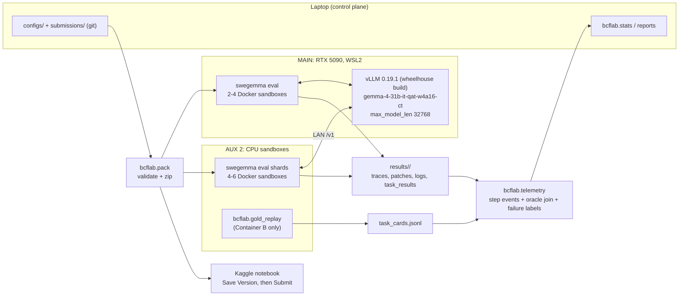

# COMBINED MARKDOWN - combine

_Generated 2026-10-01 22:13:44 | 8 files | folder: D:\stuff\docs\taylor_fv\github\rayrite.github.io\cvx\kaggle\items\combine_

## Contents

1. 00_README.md
2. 01_Roadmap_Next_Steps.md
3. 02_Reading_List_Books_and_Videos.md
4. 03_Whitepapers_Reading_List.md
5. 04_Algorithms_to_Research.md
6. 05_External_Data_Plan.md
7. 06_BCF_v1_Harness_Build.md
8. 07_QC_Report.md

---

<!-- ====================================================================== -->
<!-- FILE: 00_README.md -->
<!-- ====================================================================== -->

# BCF v1 Roadmap, Reading Lists, Algorithms, External Data and Harness Build (2026-10-01)

**Questions answered.**

1. A detailed roadmap for analysing the data and building v1 of the BCF test harness.
2. Which books and videos from `input/books_videos` to read.
3. Which whitepapers to read.
4. Which algorithms to research.
5. Which external data to collect.
6. How to build and submit v1.

**Basis.** All the static metadata from the previous session (`2026-10-01_BCF_Metadata_WishList/`), plus three new measurements made for this answer (§0). They change v1's design materially.

## Files

| File | Answers |
| --- | --- |
| [01_Roadmap_Next_Steps.md](01_Roadmap_Next_Steps.md) | Roadmap: 17 analysis steps (static → execution → trajectory), build milestones M1–M7, data / adapter / paper streams, risks |
| [02_Reading_List_Books_and_Videos.md](02_Reading_List_Books_and_Videos.md) | 15 prioritised books / courses from your catalogs, with chapters to read, plus a skip list |
| [03_Whitepapers_Reading_List.md](03_Whitepapers_Reading_List.md) | A ★ core dozen + about 70 papers in 8 tracks, each with its take-away for BCF and a confidence tag |
| [04_Algorithms_to_Research.md](04_Algorithms_to_Research.md) | 18 algorithms ranked by payoff, mini-specs for the T1 set, and the questions to answer for T2 |
| [05_External_Data_Plan.md](05_External_Data_Plan.md) | 13 data sources ranked, rules / licence checks, the mining pipeline, collection schedule |
| [06_BCF_v1_Harness_Build.md](06_BCF_v1_Harness_Build.md) | Architecture, BCF Lab components with acceptance tests, the full v1 submission (YAML, prompt, skills), Day-1 probes, build checklist, ship criteria |
| [07_QC_Report.md](07_QC_Report.md) | Table QC, number cross-checks, provenance |

New scripts and outputs: `scratch/metadata_profile/prototype_locator.py` → `locator_results.jsonl`, `locator_stats.json`; `scratch/metadata_profile/emb_postproc.py` → `emb_postproc.json`.

## 0. Three new measurements that shape v1

| # | Finding (measured) | Consequence |
| --- | --- | --- |
| 1 | **An AST-indexed BM25 locator run on the repo snapshot beats the shipped graph tools.** Strict (functions / classes only, `docs_src` excluded, n = 119): gold at rank 1 in 30%, top 10 in **62%**, top 50 in 83%, median rank 5. Gold *file* top 3 in 59% (median file rank 2). Paired against TF-IDF over graph node text (n = 119): top-10 hit **60% vs. 46%**, median 7 vs. 12. It also finds 14 / 20 async-gold tasks, which the graph cannot represent | The `bcf-locate` skill script becomes the centrepiece of v1 Phase 2. Graph tools are demoted to an optional neighbour lookup |
| 2 | **The shipped embeddings are highly anisotropic and add almost nothing beyond a named symbol.** Median cosine between random nodes is 0.83–0.94, and the top 5 principal components hold 93–97% of variance. When the issue names the gold symbol, embedding search hits top 10 for 29 / 30 tasks; when it does not, only **2 / 31** (median rank 69), versus 15 / 31 for lexical retrieval. Centering, all-but-the-top and whitening do not help (hit@10 31→32 of 61) | Drop `search_similar_code` from v1 (it also risks 100k-char outputs). Report the anisotropy in the paper's graph-audit section |
| 3 | (From the previous session, confirmed again) **No `async def` in any shipped graph; 21 / 129 gold edits touch async code.** The Getting Started notebook itself shows unrelated nodes at 0.999 similarity | The locator indexes async code; the prompt tells the agent to grep when `async_on_path=yes` |

## Short answers

**1. Roadmap.** Sprint 1 (to Wed 10-07):

- Bring BCF Lab online and gold-replay every task.
- Run the Day-1 probes, the most important being whether skill scripts can run in the scorer.
- Port the locator and a pre-submit checker to stdlib-only skill scripts.
- Measure the sample agent (v0) and BCF-v1 with 4 seeds each.
- Submit v1 only if it beats v0 on a pre-registered paired test.

Sprints 2–3 cover locator v2, signature-based fault classes, mined lookalike tasks and own trajectories. Adapters wait for a scorer canary. The paper focuses on the graph audit, localization and fault-class results. See [01](01_Roadmap_Next_Steps.md).

**2. Books and videos.** Start with these seven:

| # | Title | Catalog ref |
| --- | --- | --- |
| 1 | *AI Evals in Practice* | CP #10 |
| 2 | *Loop Engineering for Agentic AI* | PZ #2 |
| 3 | *Agentic Harness Engineering* | PZ #1 |
| 4 | Tool and agent-loop modules of *Build Your Own Claude Code* | CP #7 |
| 5 | *Modern Python Testing with pytest* | PZ #28 |
| 6 | *The Kaggle Book* (validation chapters) | PZ #18 |
| 7 | *Advanced Information Retrieval System* (BM25 / fusion) | CAT #45 |

Then Raschka's *Build a Reasoning Model* and *The Craft of Post-Training* before any adapter work. See [02](02_Reading_List_Books_and_Videos.md).

**3. Whitepapers.** The core dozen:

- SWE-bench, SWE-agent, Agentless, AutoCodeRover.
- LocAgent and RepoGraph (graph-guided localization; matches the judges' focus).
- SWE-Gym and SWE-smith (training data).
- Huang et al. on self-correction.
- Smith et al. on patch overfitting.
- GRPO / DPO.
- Dror et al. and Miller on significance testing.

Then fault-localization classics for the paper math (Ochiai, DiGiuseppe & Jones on multi-fault interference, Masri & Assi on masking, delta debugging). See [03](03_Whitepapers_Reading_List.md).

**4. Algorithms.** T1, build now:

- BM25F over AST units.
- Reciprocal rank fusion.
- Personalized PageRank on an in-script call graph that includes async.
- A graded-test-file predictor.
- Kaplan–Meier effort caps.
- Paired McNemar / bootstrap statistics.

T2: failure-signature classes, Ochiai SBFL with `sys.settrace`, EVI probing, ddmin / Möbius interference, convention mining for unstated API names, RFT / DPO, GEPA-style prompt evolution. Embedding post-processing has already been tested and was negative. See [04](04_Algorithms_to_Research.md).

**5. External data.** In priority order:

1. Your own Gemma trajectories (the cleanest licence).
2. F2P-verified lookalike tasks mined from the 11 upstream repos.
3. The same from 10–15 *unseen* libraries (the best private-repo proxy).
4. Then SWE-Gym, SWE-smith (regenerate trajectories rather than reuse closed-model ones), R2E-Gym, SWE-rebench, BugsInPy, and the SWE-bench splits (contamination caveat).

Every source goes through a licence ledger because of the winner open-source obligations. See [05](05_External_Data_Plan.md).

**6. v1 build.** A flat, adapter-free agent with seven tools, two skills (`bcf-locate`, `bcf-check`), a four-phase BCF prompt that fits about 30 calls, journals in `/tmp`, and conservative budgets until the setup-time probe returns. It is built and judged with BCF Lab: gold replay, runner, telemetry with an oracle join, paired statistics, and a packer. A full draft of every file is in [06](06_BCF_v1_Harness_Build.md) §4.

## Evidence discipline

New numbers in §0 are measured by the named scripts. Paper citations carry a **V / C** confidence tag. External dataset sizes and licences are marked approximate and must be verified before use. Book recommendations rest on the catalog synopses; I have not read the books. Nothing here is a simulated agent result. No agent runs or Kaggle submissions were made.


---

<!-- ====================================================================== -->
<!-- FILE: 01_Roadmap_Next_Steps.md -->
<!-- ====================================================================== -->

# 01 — Roadmap: From Static Metadata to a Submitted BCF-v1 (and Beyond)

**Date:** Thursday 2026-10-01
**Starting point.** Static profiling of all 129 tasks, 127 graphs, 127 embedding archives, and (new today) all 129 repository snapshots. Results are in `2026-10-01_BCF_Metadata_WishList/` and §0 of [00_README.md](00_README.md).
**Calendar** (consistent with the 2026-09-30 master plan): Sprint 1 Thu 10-01 → Wed 10-07 · Sprint 2 → 10-14 · Sprint 3 → 10-21 · Sprint 4 → 10-28 · Sprint 5 → 11-04 · Sprint 6 → 11-11 · **Paper deadline Thu 11-12** · Final submission deadline Wed 12-02.

---

## 1. Guiding principles (what an expert team would hold itself to)

1. **Measure the grader before measuring the agent.** Gold replay first; nothing else is trustworthy until the local grader agrees with the scorer.
2. **Deterministic code does the cheap thinking; the model does the judgement.** Ranking, test mapping, syntax and scope checks belong in skill scripts. Spend the model's ~30 calls on reading and deciding.
3. **One change per experiment, paired, pre-registered.** The public LB cannot separate configurations closer than about 0.10.
4. **Optimise for unseen repos.** No file priors, no repo-specific prompt rules. Validate on leave-one-repo-out and mined lookalike tasks.
5. **Ship safe early, then iterate.** A valid submission that never overruns 12 hours beats a clever one that errors the whole run.
6. **Every number in the paper has a receipt.** Scripts, run ids and config hashes go in the ledger from day one.

---

## 2. Workstreams at a glance

| Stream | Goal | Main machine | Sprint focus |
| --- | --- | --- | --- |
| **A. Analysis** | Turn static, execution and trajectory metadata into decisions | Laptop + AUX 2 | 1–3 |
| **B. BCF Lab** | Local harness that grades like the scorer and explains every failure | MAIN + AUX 2 | 1 |
| **C. Agent** | BCF-v1 → v1.2 submissions (prompts + skills, no adapter) | MAIN | 1–4 |
| **D. Data factory** | Mined lookalike tasks + own trajectories | Laptop + AUX 2 + MAIN | 2–4 |
| **E. Adapters** | RFT / DPO LoRA, gated on scorer fixes | MAIN (+ rental) | 3–5 |
| **F. Paper** | Graph audit + localization + fault-class results | Laptop | 2–6 |

---

## 3. Stream A: analysis steps, in order

Each step names its input, its output, the decision it informs (IDs from `2026-10-01_BCF_Metadata_WishList/01_Decision_Inventory.md`) and an exit criterion.

### 3.1 Static analysis (finish this week, no GPU)

| ID | Analysis | Input → Output | Decision | Effort | Exit criterion |
| --- | --- | --- | --- | --- | --- |
| A1 | **Locator v2 tuning** (BM25F field weights, title weighting, mention bonus, call-graph PPR, RRF) with leave-one-repo-out | snapshots → `locator_v2_results.jsonl` | D-3, R-1 | 1 day | Strict hit@10 ≥ 68% on held-out repos (prototype: 62%) |
| A2 | **Graded-test-file predictor** (stem + import grep + names, RRF) | snapshots + `test_patch` paths → hit@3 | D-9, R-3 | ½ day | Top-3 ≥ 75% on tasks whose graded file already exists |
| A3 | **Read-cost profile** (M-15): gold-unit length and offset → `read_file` calls needed | snapshots → distribution | D-14 | 2 h | Prompt rule for read windows fixed |
| A4 | **Twin / mirror detection** (M-11) | snapshots → twin pairs; gold-touches-both flag | R-6 | 3 h | Prevalence known; detector precision ≥ 90% on a hand-checked sample |
| A5 | **Task-type labels** (M-03): gitmoji for 67, hand labels for 62 (LLM pre-label with local Gemma) | statements → labels | D-5, D-10 | 3 h | Labels for all 129; inter-pass agreement checked on 20 |
| A6 | **Stated-change extraction** (M-12): does a PR-style statement prescribe the fix? | statements + gold → label | D-6 | 2 h | Share of tasks with a usable stated change |
| A7 | **Contract inference test** (M-08): can sibling-naming rules recover the 11 unstated names? | snapshots → guessed vs. gold names | D-10 | 3 h | Exact-match rate; decide whether the rule goes in v1.2 |
| A8 | **Static difficulty model**: features (info-poor, tier, churn proxy, async, contract) → predicted tier, checked later against outcomes | cards → logistic model | R-4, S-3 | 2 h | Model ready to calibrate with Sprint 1 outcomes |

### 3.2 Execution analysis (needs BCF Lab L0–L1; CPU only)

| ID | Analysis | Output | Decision | Exit criterion |
| --- | --- | --- | --- | --- |
| A9 | **Gold replay** (M-20, M-21) | Gradable set; F2P / P2P lists | S-2 | ≥100 gradable tasks, reasons for the rest |
| A10 | **Base-failure signatures** (M-22) + **crash-to-fix displacement** (M-23) | Signature table; displacement table | D-4 | Alignment test H2 run with a permutation null |
| A11 | **Visible-suite contradiction** (M-24) | Share of tasks where gold turns old tests red | D-7 | Rule for "local red vs. spec" set |
| A12 | **Interference atlas** (M-25, M-26) on the 36 two-to-four-hunk tasks; ddmin above that | Additive / redundant / conjunctive / antagonistic shares | D-13, paper | Figure-ready CSV |

### 3.3 Trajectory analysis (needs agent runs)

| ID | Analysis | Output | Decision | Exit criterion |
| --- | --- | --- | --- | --- |
| A13 | **Failure funnel** (M-32, M-41, M-42) for v0 and v1 | Where tasks die: not localized / wrong fix / incomplete / regression / budget / tool error | S-1 | ≥80% of failures auto-labelled, 20 checked by hand |
| A14 | **Coin-flip set** (M-44) from 4 seeds | Task list with p̂ | S-2 | Set frozen and hashed |
| A15 | **Time-to-resolve curve** (M-43) | Kaplan–Meier; cap recommendation | D-15 | Cap set with the setup-time probe |
| A16 | **Tool-error census** (M-34, M-36) | Edit failures, truncations, nudges | D-2, D-11 | Top 3 tool failure modes have a mitigation |
| A17 | **Provoked-signature fidelity** (M-39) | Agreement of the agent's repro failures with base signatures | D-4 | H1 and H3 pass or fail recorded |

---

## 4. Stream B + C: build and ship v1

Full design in [06_BCF_v1_Harness_Build.md](06_BCF_v1_Harness_Build.md). Milestones:

| Milestone | Date | Content | Exit criterion |
| --- | --- | --- | --- |
| **M1 Lab online** | Fri 10-02 | L0 environment, L1 gold replay, L6 packer; Day-1 probes P-1…P-6; zero-agent canary submitted | ≥100 gradable tasks; skills vs. inline decided |
| **M2 Skills ready** | Sat 10-03 | `locate.py` + `check.py` (stdlib only), offline-tested in the sandbox image | <10 s, ≤1,500 chars, offline hit@10 ≥ 60% |
| **M3 Baseline measured** | Sun 10-04 | v0 (sample, budgets fixed) × 4 seeds; failure funnel v0; coin-flip set | A13, A14 done for v0 |
| **M4 v1 measured** | Mon 10-05 | BCF-v1 × 4 seeds; paired comparison | Pre-registered rule evaluated |
| **M5 v1 shipped** | Wed 10-07 | Submit if ship criteria hold (06 §7) | LB inside the predicted band |
| **M6 v1.1** | Wed 10-14 | Locator v2, test-predictor fusion, effort cap from KM | +3 points on coin-flip tasks |
| **M7 v1.2** | Wed 10-21 | Signature classes → strategy hints; convention miner; mirror fixes | H2 passes and paired gain |

---

## 5. Stream D + E: data factory and adapters

| Milestone | Date | Content | Gate |
| --- | --- | --- | --- |
| D1 | 10-08 → 10-14 | 300 mined lookalike tasks from the 11 upstream repos (pipeline in [05](05_External_Data_Plan.md) §3) | F2P verified; decontaminated |
| D2 | 10-15 → 10-21 | 300 tasks from 10–15 unseen libraries; licence ledger for external datasets | LORO folds defined |
| D3 | 10-15 → 10-28 | 2–5k own v1.x trajectories; teacher runs only if the licence is clean | Success count ≥ 300 for RFT |
| E1 | 10-22 → 10-28 | Loud-adapter canary on the scorer (KV collapse and zeroing fixed?) | **Go / no-go for all adapter work** |
| E2 | 10-22 → 11-04 | RFT LoRA (r = 16–32) on successful trajectories; QA-LoRA / transfer check against the W4A16 base | LORO gain ≥ 3 points vs. prompts-only |
| E3 | 10-29 → 11-04 | Optional DPO on pass/fail pairs | Paired gain on coin-flip tasks |

---

## 6. Stream F: paper (deadline 11-12)

| Week | Section | Evidence source |
| --- | --- | --- |
| 10-08 | Stub writeup created and saved on Kaggle (tie-break by earliest entry; platform bug check) | — |
| 10-14 | **Graph audit**: calls-only edges, no async (0 / 367,985 nodes), `docs_src` id collisions, embedding anisotropy (median random-pair cosine 0.83–0.94; top-5 PCs hold 93–97% of variance) | Static profile scripts |
| 10-21 | **Localization**: AST-BM25 vs. graph retrieval vs. shipped embeddings (hit@k with CIs; paired) | `prototype_locator.py`, `emb_postproc.py` + v2 |
| 10-28 | **Fault classes**: H1–H3 alignment and fidelity with permutation nulls; interference atlas | A10–A12, A17 |
| 11-04 | Agent results: v0 → v1 → v1.2 ablations with receipts | Ledger |
| 11-10 | Final edit to 3,000 words; submit | — |

---

## 7. Risks and how the roadmap absorbs them

| Risk | Early signal | Response |
| --- | --- | --- |
| Skill scripts cannot run in the scorer | P-1 fails | `v1-inline` locator via heredoc (06 §4.6) |
| The local grader still disagrees with the scorer | v1 LB far outside the local band | Treat the LB as ground truth for env facts; re-audit L1 |
| Setup time leaves under 3 minutes per task | M-51 probe | Shrink to a 1-shot "locate → patch → check → submit" flow; drop thinking |
| Adapter path never fixed by the host | E1 canary fails | Put all effort into prompts, skills and prompt evolution; adapters become paper-only |
| Locator overfits the 4 public repos | LORO hit@10 drops > 10 points | Freeze weights tuned on mined unseen repos only |
| Analysis eats the build time | M2 slips past Saturday | A3–A8 move to Sprint 2; A1, A2, A9 stay |


---

<!-- ====================================================================== -->
<!-- FILE: 02_Reading_List_Books_and_Videos.md -->
<!-- ====================================================================== -->

# 02 — What to Read and Watch from Your Collection

**Sources:** the two ranked catalogs in `input/books_videos/`:

- `01-coderprog-catalog-bcf-ranked.md`: 55 picks from 3,130 entries. Cited below as **CP #n**.
- `02-0dayprizrak-catalog-bcf-ranked.md`: 44 picks from 46,567 unique titles. Cited below as **PZ #n**.

A few items come from the longer 2026-09-30 review in `2026-09-30_Catalog/01_Catalog_Resources_for_BCF_Agent.md` (88 picks), cited as **CAT #n**.

**Selection rule for this list.** The catalogs ranked resources by general fit to the competition. This list re-ranks them by **which roadmap step they unblock in the next six weeks** (see [01_Roadmap_Next_Steps.md](01_Roadmap_Next_Steps.md)). It also cuts duplicates and overlap: you need one good source per skill, not five. Synopses come from the catalogs. I have not read these works, so check each table of contents before committing more than an hour.

**Time budget.** About 6–8 hours a week. Watch courses at 1.5× and only the named modules. Read books by the chapters named, not cover to cover.

---

## 1. Read now (weeks 1–2: building the local harness and v1)

| Order | Resource | Ref | Read / watch | Unblocks | Why this one |
| --- | --- | --- | --- | --- | --- |
| 1 | **AI Evals in Practice: Testing, reliability, and quality for LLM systems** (2026, 150 pp) | CP #10 | All of it; it is short | Phase 0–2: BCF Lab runner, scorers, regression CI | The local evaluation loop is the most important thing you build. This is the shortest path to a disciplined version |
| 2 | **Loop Engineering for Agentic AI** (Udemy, 2026) | PZ #2 | Termination, non-progress detection, guardrails, traces | v1 rescue / circuit breakers; M-35 loop metrics | BCF tenets 3–4 (breadcrumbs, binary done) implemented as code |
| 3 | **Agentic Harness Engineering: Harness Design for AI Engineers** | PZ #1 | Execution loops, context-rot control, memory layers | v1 system prompt and skills; D-14 context hygiene | The closest match to designing *within* a fixed 9-tool harness |
| 4 | **Build Your Own Claude Code** (11 GB course) | CP #7 | Only the tool-design, edit-tool and agent-loop modules | Edit mechanics (D-11); tool-call failure taxonomy (M-34) | Shows why edit tools fail and how real agents recover. Skip the CLI / UI parts |
| 5 | **Modern Python Testing with pytest** (514 MB, compact) | PZ #28 | Selection (`-k`, node ids), JUnit XML, fixtures, collection errors | `bcf-validate` skill; test-file mapping (M-19) | The grader is hermetic pytest + JUnit XML; your validator must speak it fluently |
| 6 | **The Kaggle Book**, 2nd ed. | PZ #18 | Chapters on validation strategy, leaderboard overfitting and ensembling / selection | Dev-set construction (S-2); final pick (S-5) | The LB is ±0.10 noise; this is the community wisdom for not being fooled by it |

## 2. Weeks 3–4 (data factory, trajectories, adapter preparation)

| Order | Resource | Ref | Read / watch | Unblocks | Why this one |
| --- | --- | --- | --- | --- | --- |
| 7 | **Build a Reasoning Model (From Scratch)** (Raschka, 2026) | CP #4 (book), CP #5 (video), PZ #4 (MEAP) | Verifiers, RL with verifiable rewards, GRPO, distillation chapters | RFT / GRPO plan with test-pass rewards | The cleanest code-level treatment of binary-reward RL. Your reward *is* "graded tests pass" |
| 8 | **The Craft of Post-Training** (No Starch, 2026) | CP #3 | SFT → preference → RL decision chapters; data-quality chapters | Whether to SFT on trajectories, DPO on pass/fail pairs, or both | A decision-level playbook; prevents expensive wrong turns |
| 9 | **A Hands-On Guide to Fine-Tuning LLMs with PyTorch and Hugging Face** (2026) | CP #13 | PEFT/LoRA chapters; saving adapters as `safetensors` | Producing an adapter the harness accepts | Exactly the artifact format the submission requires |
| 10 | **LLM Quantization and Compression Theoretical Core** | PZ #10 | QAT, W4A16, LoRA on quantised bases | Open question C1: does a LoRA trained on bf16/nf4 transfer to the QAT W4A16 checkpoint? | The biggest technical risk in the adapter track |
| 11 | **Reinforcement Learning for LLM Alignment and Reasoning** (Pearson video) | CP #2 | DPO and GRPO segments only | Choosing between DPO and GRPO for small data | Second explanation of the same methods; use if #7 is not enough |

## 3. Paper track and graph work (weeks 3–6, in parallel)

| Order | Resource | Ref | Read / watch | Unblocks | Why this one |
| --- | --- | --- | --- | --- | --- |
| 12 | **Advanced Information Retrieval System: Theoretical and Experimental Perspective** (2026, 614 pp) | CAT #45 | BM25 / probabilistic retrieval, evaluation metrics, rank fusion | `bcf-locate` ranking; paper's retrieval baselines | Lexical retrieval beats the shipped embeddings on this data. This is the theory behind the winning tool |
| 13 | **A Complete Guide to Graph Representation Learning with Case Studies** (Wiley 2026) | CP #18 | Node embeddings, random-walk methods (PPR / node2vec) | Graph-propagation re-ranking; explaining the embedding anisotropy finding | The paper's judges are graph-ML researchers; speak their language |
| 14 | **Agentic GraphRAG** (2026) | CP #16 | Graph-retrieval-plus-agent patterns only | Graph-guided localization chapter of the paper | Patterns for combining graph walks with an LLM's choices |
| 15 | **The Mathematics of Large Language Models** (2026) | CP #30 | Information theory and optimisation chapters | BCF fault-class math section of the whitepaper | Supports the guesswork / entropy arguments with standard notation |

## 4. Reference shelf (open only when a specific need arises)

| Need | Resource | Ref |
| --- | --- | --- |
| Context-window budgeting under 32k | AI Context Engineering course, or Context Engineering Masterclass | CP #25 / PZ #23 |
| Prompt optimisation with a metric instead of by hand | Agentic AI Mastery with DSPy | PZ #15 |
| Spec-first workflow wording for Phase 1 | Spec-Driven Development: From Specs to Code with AI Agents | CP #40 |
| Token and time economics | LLM Token Optimization: Enterprise Cost & Performance | PZ #26 |
| Writing clean skill scripts | Effective Python, 3rd ed. | CAT #46 |
| Python debugging habits to encode in prompts | Data-Oriented Python Programming and Debugging Specialization | CAT #54 |
| vLLM serving behaviour on the 5090 | Master LLM Inference Engineering (modules on vLLM / KV cache only) | CP #14 |
| Multi-agent topologies (only if D-1 says sub-agents win) | Agentic Architectural Patterns for Building Multi-Agent Systems | CP #23 |

## 5. What to skip for now, and why

| Skip | Ref | Reason |
| --- | --- | --- |
| Very large bootcamps (AI Engineer Agentic Track 23 GB, Agentic AI Bootcamp 31.7 GB, AI Engineer Core Track 24 GB) | CP #20, PZ #44, PZ #9 | Breadth you already have; low value per hour at this stage |
| MCP / A2A courses and books | PZ #36, PZ #39, CP #31 | The harness has no MCP; tools are a closed registry |
| LangChain / LangGraph / Ollama / LM Studio material | CP #27, PZ #27, CP #53, PZ #33 | The submission is ADK YAML on vLLM; different stack |
| Langfuse and observability courses | CP #28, PZ #14, CP #48 | Use a file-based JSONL ledger first. Revisit only if analysis outgrows pandas |
| Vector-database courses | CP #22, CP #35, PZ #34, PZ #37 | Measured: the shipped embeddings add almost nothing beyond a named symbol ([00](00_README.md) finding 2). One IR book (#12 above) covers what you need |
| GNN textbooks (960-page Wiley, Applied DL on Graphs) | CP #17, PZ #17 | Training GNNs is out of scope for a declarative submission; keep for the paper only if you go that way |

## 6. A note on sourcing

Where possible, get these through a legitimate channel: the publisher, O'Reilly Learning, Manning liveBook, a library, or the course platform. Many of the titles above are available that way.


---

<!-- ====================================================================== -->
<!-- FILE: 03_Whitepapers_Reading_List.md -->
<!-- ====================================================================== -->

# 03 — Whitepapers and Papers to Read

**How this list is built.** Papers are grouped into tracks that map to BCF components. Each entry says **what to take from it** for this competition. Read the **★ core dozen** first (§1); the rest are reference by track.

**Confidence tag.** **V** = I am confident the paper exists as cited (authors, venue, year) from my training knowledge. **C** = cited in your earlier research files (compendium, FOSS review, model council) or recent (2025–2026), so check the exact title, venue and figures before citing it in the whitepaper. Numbers quoted inside papers are deliberately left out unless they matter; re-read them from the source.

---

## 1. The ★ core dozen (read in this order)

| # | Paper | Tag | Why first | Take away for BCF |
| --- | --- | --- | --- | --- |
| 1 | Jimenez et al., *SWE-bench: Can Language Models Resolve Real-World GitHub Issues?* ICLR 2024 | V | The competition is SWE-bench-style | Task construction (F2P / P2P), why gold tests can be narrow, the training split you can mine |
| 2 | Yang et al., *SWE-agent: Agent-Computer Interfaces Enable Automated Software Engineering*, NeurIPS 2024 | V | Tool design matters as much as the model | Bounded file viewers, edit linting, concise tool outputs, i.e., your skill-script design |
| 3 | Xia et al., *Agentless: Demystifying LLM-based Software Engineering Agents*, arXiv 2024 (FSE 2025) | V | A fixed pipeline localize → repair → validate is competitive and cheap | The strongest argument for a deterministic BCF skeleton on a 6-minute budget; its hierarchical localization (file → class/function → lines) |
| 4 | Zhang et al., *AutoCodeRover: Autonomous Program Improvement*, ISSTA 2024 | V | Program structure + spectrum-based fault localization in an LLM agent | AST-level code search APIs and SBFL as a signal, i.e., your `bcf-locate` + optional coverage probe |
| 5 | Chen et al., *LocAgent: Graph-Guided LLM Agents for Code Localization*, ACL 2025 | C | Graph-guided localization, the paper-track judges' topic | Heterogeneous code graphs (contains / imports / invokes / inherits); compare with the competition's calls-only, async-less graph |
| 6 | Ouyang et al., *RepoGraph: Enhancing AI Software Engineering with Repository-level Code Graph*, ICLR 2025 | C | Plug-in repository graph for SWE agents | How a line-level graph feeds an agent; a baseline for your graph-audit claims |
| 7 | Pan et al., *Training Software Engineering Agents and Verifiers with SWE-Gym*, ICML 2025 | V | Real-repo training environments plus verifiers | Rejection-sampling fine-tuning on successful trajectories; verifier-based best-of-n |
| 8 | Yang et al., *SWE-smith: Scaling Data for Software Engineering Agents*, 2025 | C | Synthetic task generation from any repo | How to manufacture lookalike tasks for private-repo generalisation (data plan, [05](05_External_Data_Plan.md)) |
| 9 | Huang et al., *Large Language Models Cannot Self-Correct Reasoning Yet*, ICLR 2024 | V | Grounds the BCF tenet "external verification only" | Phrase gates as "executable checks", never "the model agreed" |
| 10 | Smith et al., *Is the Cure Worse than the Disease? Overfitting in Automated Program Repair*, FSE 2015 | V | Plausible-but-wrong patches | Why passing *visible* tests is not enough; motivates M-24 / M-28 near-miss analysis |
| 11 | Shao et al., *DeepSeekMath* (introduces **GRPO**), 2024; and Rafailov et al., *Direct Preference Optimization*, NeurIPS 2023 | V | The two adapter-training candidates | GRPO with a binary test reward vs. DPO on pass/fail trajectory pairs |
| 12 | Dror et al., *The Hitchhiker's Guide to Testing Statistical Significance in NLP*, ACL 2018; and Miller, *Adding Error Bars to Evals*, arXiv 2024 | V | Decisions under LB noise | Paired tests, clustered errors, power: the protocol in the metadata wish list |

---

## 2. Track A — SWE agent scaffolds (how others structure the loop)

| Paper | Tag | Take away |
| --- | --- | --- |
| Wang et al., *OpenHands: An Open Platform for AI Software Developers as Generalist Agents*, ICLR 2025 | V | CodeAct-style action space; event-stream architecture for telemetry |
| Ruan et al., *SpecRover: Code Intent Extraction via LLMs*, 2024 (ICSE 2025) | C | Inferring a function-level *specification* before patching, the closest published analogue to BCF Phase 1 |
| Antoniades et al., *SWE-Search: Enhancing Software Agents with Monte Carlo Tree Search and Iterative Refinement*, 2024 | C | Search over trajectories with value estimates; mostly too expensive for 6 minutes, but useful for the rescue design |
| Ehrlich et al., *CodeMonkeys: Scaling Test-Time Compute for Software Engineering*, 2025 | C | Many cheap attempts plus selection; tells you when test-time scaling pays |
| Xia & Zhang, *Keep the Conversation Going: Fixing 162 out of 337 bugs for $0.42 each using ChatGPT* (ChatRepair), ISSTA 2024 | V | Feeding test-failure feedback back into repair: a minimal rescue loop |
| Cognition, *Don't Build Multi-Agents* (blog, 2025); Anthropic, *How we built our multi-agent research system* (blog, 2025); Anthropic, *Building Effective Agents* (blog, Dec 2024) | C | The flat vs. sub-agent decision (D-1); the compendium already flags the conflict |

## 3. Track B — Code localization with graphs and retrieval

| Paper | Tag | Take away |
| --- | --- | --- |
| Yu et al., *OrcaLoca: An LLM Agent Framework for Software Issue Localization*, 2025 | C | Priority-based action scheduling and distance-aware context pruning; maps onto BCF's posterior-ordered candidate list |
| Liu et al., *CodexGraph: Bridging LLMs and Code Repositories via Code Graph Databases*, 2024 | C | Letting the agent query a graph DB; a contrast to fixed graph tools |
| Jiang et al., *CoSIL: Issue Localization via LLM-Driven Iterative Code Graph Searching*, 2025 | C | Iterative call-graph expansion with pruning, a direct template for a "walk callers / callees" strategy |
| Reddy et al., *SweRank: Software Issue Localization with Code Ranking*, 2025 | C | Learned retriever + reranker for issue → function, the upgrade path from BM25 |
| Robertson & Zaragoza, *The Probabilistic Relevance Framework: BM25 and Beyond*, FnTIR 2009 | V | BM25 / BM25F theory; field weighting (name vs. body) for `bcf-locate` |
| Cormack, Clarke & Büttcher, *Reciprocal Rank Fusion Outperforms Condorcet and Individual Rank Learning Methods*, SIGIR 2009 | V | Fusing lexical, graph and mention rankings without training |
| Haveliwala, *Topic-Sensitive PageRank*, WWW 2002 (personalized PageRank) | V | Spreading relevance from seed nodes over the call graph |
| Mu & Viswanath, *All-but-the-Top: Simple and Effective Postprocessing for Word Representations*, ICLR 2018; Ethayarajh, *How Contextual are Contextualized Word Representations?*, EMNLP 2019 | V | Explain the measured embedding anisotropy (median random-pair cosine 0.83–0.94); we tested the fix and it did not help retrieval |

## 4. Track C — Fault localization, masking and interference (the BCF math backbone)

| Paper | Tag | Take away |
| --- | --- | --- |
| Jones & Harrold, *Empirical Evaluation of the Tarantula Automatic Fault-Localization Technique*, ASE 2005 | V | Spectrum-based FL baseline |
| Abreu, Zoeteweij & van Gemund, *On the Accuracy of Spectrum-based Fault Localization*, TAIC-PART 2007 (Ochiai) | V | The SBFL formula to implement first if you run coverage |
| Wong, Gao, Li, Abreu & Wotawa, *A Survey on Software Fault Localization*, IEEE TSE 2016 | V | Map of the whole field; cite in the whitepaper's related work |
| Pearson et al., *Evaluating and Improving Fault Localization*, ICSE 2017 | V | Real faults ≠ artificial faults; how to evaluate localization honestly |
| Zou et al., *An Empirical Study of Fault Localization Families and Their Combinations*, IEEE TSE 2021 | V | Combining FL families (spectrum, stack trace, IR) beats any one, which supports rank fusion |
| DiGiuseppe & Jones, *On the Influence of Multiple Faults on Coverage-Based Fault Localization*, ISSTA 2011 | V | Empirical fault *interference* in multi-fault programs, direct support for BCF's interference claims |
| Masri & Assi, *Prevalence of Coincidental Correctness and Mitigation of its Impact on Fault Localization*, TOSEM 2014 | V | Fault *masking* (the fault executes but the test passes) |
| Voas, *PIE: A Dynamic Failure-Based Technique*, IEEE TSE 1992 | V | Reachability → infection → propagation, the RIPR model in the math document |
| Zeller & Hildebrandt, *Simplifying and Isolating Failure-Inducing Input*, IEEE TSE 2002 (delta debugging) | V | ddmin over gold hunks for the interference atlas (M-25) |
| Yoo, Harman & Clark, *Fault Localization Prioritization* (FLINT, information-theoretic test prioritization), TOSEM 2013 | C | Choosing the next probe to maximise information, the EVI rule in BCF |
| de Kleer & Williams, *Diagnosing Multiple Faults*, Artificial Intelligence 1987 | V | Model-based diagnosis with minimum-entropy probing |
| Wu et al., *CrashLocator: Locating Crashing Faults Based on Crash Stacks*, ISSTA 2014 | V | Stack-frame → fault-site displacement, the basis for M-23 |

## 5. Track D — Program repair, plausibility and benchmark integrity

| Paper | Tag | Take away |
| --- | --- | --- |
| Qi, Long, Achour & Rinard, *An Analysis of Patch Plausibility and Correctness for Generate-and-Validate Patch Generation Systems*, ISSTA 2015 | V | Most "plausible" patches were wrong; weak tests are the cause |
| Le Goues et al., *GenProg: A Generic Method for Automatic Software Repair*, IEEE TSE 2012 | V | Classic generate-and-validate loop; background |
| Liu et al., *TBar: Revisiting Template-based Automated Program Repair*, ISSTA 2019 | V | Fix-pattern templates, the inspiration for BCF `fix_shape` types |
| Chen et al., *Teaching Large Language Models to Self-Debug*, ICLR 2024 | V | Execution feedback in the loop; works when feedback is real |
| Aleithan et al., *SWE-Bench+: Enhanced Coding Benchmark for LLMs*, 2024 | C | Solution leakage and weak tests in SWE-bench; caution for CV |
| Wang et al., *Are "Solved Issues" in SWE-bench Really Solved Correctly?*, 2025 | C | Patches passing tests but differing in behaviour from gold, the near-miss analysis |

## 6. Track E — Training SWE agents (data and recipes)

| Paper | Tag | Take away |
| --- | --- | --- |
| Jain et al., *R2E-Gym: Procedural Environments and Hybrid Verifiers for Scaling Open-Weights SWE Agents*, 2025 | C | Generating executable tasks from commits; hybrid (execution + model) verifiers |
| Wei et al., *SWE-RL: Advancing LLM Reasoning via Reinforcement Learning on Open Software Evolution*, 2025 | C | Rule-based patch-similarity reward from PR history, which needs no execution environment |
| Xie et al., *SWE-Fixer: Training Open-Source LLMs for Effective and Efficient GitHub Issue Resolution*, 2025 | C | A retrieval + editing two-stage model, close to an Agentless-style BCF |
| Ma et al., *Lingma SWE-GPT: An Open Development-Process-Centric Language Model for Automated Software Improvement*, 2024 | C | Process-centric training data (localize → patch steps) |
| Badertdinov et al., *SWE-rebench: An Automated Pipeline for Task Collection and Decontaminated Evaluation*, 2025 | C | A decontaminated, continuously mined task pipeline, i.e., the lookalike-task recipe |
| Zelikman et al., *STaR: Bootstrapping Reasoning with Reasoning*, NeurIPS 2022; Yuan et al., *Scaling Relationship on Learning Mathematical Reasoning with LLMs* (rejection-sampling fine-tuning), 2023 | V | Self-distillation from your own successful runs, the license-clean data source |
| Zeng et al., *AgentTuning*, 2023; Chen et al., *FireAct*, 2023 | V | Trajectory fine-tuning for agents without losing general ability |

## 7. Track F — Post-training mechanics on a quantised 31B model

| Paper | Tag | Take away |
| --- | --- | --- |
| Hu et al., *LoRA: Low-Rank Adaptation of Large Language Models*, ICLR 2022 | V | Rank and target-module choices within the 3 GiB cap |
| Dettmers et al., *QLoRA: Efficient Finetuning of Quantized LLMs*, NeurIPS 2023 | V | Training on a 4-bit base on one GPU (the RTX 5090 path) |
| Xu et al., *QA-LoRA: Quantization-Aware Low-Rank Adaptation*, ICLR 2024; Li et al., *LoftQ*, ICLR 2024 | V | Directly about the train/serve mismatch when the served base is quantised (open question C1) |
| DeepSeek-AI, *DeepSeek-R1*, 2025; Liu et al., *Understanding R1-Zero-Like Training: A Critical Perspective* (Dr. GRPO), 2025; Yu et al., *DAPO*, 2025 | C | GRPO pitfalls (length bias, entropy collapse) and fixes |

## 8. Track G — Prompting, context and prompt optimisation

| Paper | Tag | Take away |
| --- | --- | --- |
| Yao et al., *ReAct*, ICLR 2023; Shinn et al., *Reflexion*, NeurIPS 2023 | V | The base loop and verbal memory, i.e., BCF breadcrumbs |
| Liu et al., *Lost in the Middle: How Language Models Use Long Contexts*, TACL 2024 | V | Put the spec and journal at the start or end of context, not the middle |
| Khattab et al., *DSPy*, ICLR 2024; Agrawal et al., *GEPA: Reflective Prompt Evolution Can Outperform Reinforcement Learning*, 2025 | C | Metric-driven optimisation of `system.md` and skill text, with no adapter needed |

## 9. Track H — Search and information theory (whitepaper math)

| Paper | Tag | Take away |
| --- | --- | --- |
| Massey, *Guessing and Entropy*, ISIT 1994; Arikan, *An Inequality on Guessing and its Application to Sequential Decoding*, IEEE T-IT 1996 | V | The guesswork bounds behind S(K, f) |
| Stone, *Theory of Optimal Search* (book), 1975 | V | Bayesian search ordering by p/c |
| Pelc, *Searching Games with Errors — Fifty Years of Coping with Liars*, TCS 2002 | V | Search with noisy answers, i.e., imperfect fault-class fidelity |
| Card et al., *With Little Power Comes Great Responsibility*, EMNLP 2020; Dietterich, *Approximate Statistical Tests for Comparing Supervised Classification Learning Algorithms*, Neural Computation 1998 | V | Power analysis; McNemar for paired pass/fail outcomes |

---

## 10. Reading plan

| Week | Read | Output it should produce |
| --- | --- | --- |
| 1 | ★1–4, ★9, ★12 | v1 prompt and skill design; the A/B protocol |
| 2 | ★5–6, Track B (BM25, RRF, PPR) | `bcf-locate` v2 design; graph-audit section outline |
| 3 | ★7–8, ★11, Track E | Data factory plan; RFT vs. DPO decision |
| 4 | Track C | Whitepaper related-work and math sections |
| 5 | Track D, Track F | Near-miss analysis; adapter transfer test |
| 6 | Track G as needed | Prompt-optimisation pass on v1.x |


---

<!-- ====================================================================== -->
<!-- FILE: 04_Algorithms_to_Research.md -->
<!-- ====================================================================== -->

# 04 — Algorithms to Research (ranked by expected payoff)

**Selection rule.** An algorithm makes this list if it attacks a measured bottleneck (from `2026-10-01_BCF_Metadata_WishList/02` or the new measurements in [00](00_README.md)) **and** it can run inside the competition's constraints. Those constraints: a pure-Python skill script with no network and no pip, on 2 vCPU / 4 GB, in seconds. Training-time algorithms run offline on the RTX 5090.

**Payoff tiers.** **T1** = build into v1 or v1.1. **T2** = research now, build in Sprints 3–4. **T3** = paper or stretch.

---

## 1. Summary table

| # | Algorithm | BCF problem it solves | Measured motivation | Where it runs | Tier |
| --- | --- | --- | --- | --- | --- |
| 1 | **BM25 / BM25F over AST units** (functions, methods, classes, module blocks) with identifier splitting | Localization (Phase 2) | Prototype: gold function top-10 in **62%**, top-50 in 83% (strict, functions only); beats retrieval over graph node text (60% vs. 46% hit@10, paired n = 119) | Skill script | **T1** |
| 2 | **Reciprocal rank fusion (RRF)** of lexical rank, mention match and call-graph proximity | Localization | Mentioned symbol is gold in 25% of tasks; lexical and mention signals fail on different tasks | Skill script | **T1** |
| 3 | **Own AST call graph + personalized PageRank (random walk with restart)** seeded by mentions and top BM25 hits | Localization when the issue names a caller or callee, not the fix site | Shipped graph lacks all `async def` (21 / 129 tasks affected); 16 / 61 mention tasks are 1–3 hops from gold (shipped graph) | Skill script | **T1** |
| 4 | **Graded-test-file predictor** (stem match + import grep + name similarity, fused) | Validation scope (Phase 4) | Stem match alone finds the graded file 47%; graph test-callers 22% | Skill script | **T1** |
| 5 | **Effort allocation by survival analysis** (Kaplan–Meier of time-to-resolve) + an optimal-stopping cap | Per-task budget (D-15); give-up rule (R-4) | ≈6.0 min per task including setup; 29% info-poor tasks | Offline → `eval_config.yaml` + prompt rule | **T1** |
| 6 | **Mirror / clone detection** (normalised-AST hashing; name-match across sibling trees) | Half-fixed duplicated code (R-6) | httpx sync/async twin trees (gold edits 7 files across both) | Skill script | T2 |
| 7 | **Failure-signature parsing and classification** (exception type, innermost repo frame, assertion kind) | Fault classes from *provoked* failures (D-4) | 0 / 129 statements carry tracebacks, so signatures must be provoked | Skill script | T2 |
| 8 | **Spectrum-based fault localization (Ochiai)** using `sys.settrace` line coverage of a failing reproduction vs. passing tests | Localization in the "hard" 40% tier | No text or graph signal for those tasks | Skill script (time-boxed) | T2 |
| 9 | **Bayesian search ordering + expected value of information (EVI)** for "read next candidate vs. run a probe" | Run-time policy R-2 | BCF math §B7; budget of a few dozen calls | Prompt rule + script helper | T2 |
| 10 | **Delta debugging (ddmin) and Möbius interaction over hunk subsets** | Interference atlas (paper; rescue design) | 55% of gold patches have >1 hunk; 36 tasks have 2–4 source hunks | Offline, CPU | T2 |
| 11 | **Convention mining for unstated API names** (sibling-name n-grams, `__all__`, docs / changelog stubs) | Hidden API contract (D-10) | 9% of tasks need an unstated identifier | Skill script | T2 |
| 12 | **Rejection-sampling fine-tuning (RFT / STaR)** on own successful trajectories | Adapter training (D-12) | License-clean data; small model gains from its own successes | Offline, GPU | T2 |
| 13 | **GRPO with binary test reward** (with Dr. GRPO / DAPO fixes) | Adapter training | Reward = graded tests pass; exactly the competition metric | Offline, GPU / rental | T3 |
| 14 | **DPO on pass/fail trajectory pairs** from the same task | Adapter training | Cheap once trajectories exist | Offline, GPU | T2 |
| 15 | **Reflective prompt evolution (GEPA-style) / DSPy optimisation** of `system.md` and skill text | Prompt quality without adapters | Prompt-only notebooks lead the LB today | Offline, GPU | T2 |
| 16 | **Paired significance testing** (McNemar, cluster bootstrap), **Wilson CIs**, power analysis | Every A/B decision | LB noise ±0.10; ~600 task-runs per arm for a 5-point delta | Offline | **T1** |
| 17 | **Embedding post-processing** (centering, all-but-the-top, whitening) | `search_similar_code` quality | **Tested: no gain** (hit@10 31→32 of 61); embeddings add little beyond a named symbol | — | Done (negative) |
| 18 | **Learning-to-rank** (logistic or LambdaMART on fused features, exported as a fixed linear scorer) | Localization v3 | Needs labelled ranks; we have 119 tasks plus mined lookalikes | Offline train → linear weights in script | T3 |

---

## 2. Mini-specs for the T1 algorithms

### 2.1 `bcf-locate`: BM25F + mention match + call-graph PPR, fused by RRF

**Measured prototype** (`scratch/metadata_profile/prototype_locator.py`, all 129 snapshots, about 2 s per task on one desktop core):

| Variant | Tasks | Hit@1 | Hit@5 | Hit@10 | Hit@20 | Hit@50 | Median rank |
| --- | --- | --- | --- | --- | --- | --- | --- |
| Any gold unit (incl. module-level blocks) | 128 | 33 (26%) | 62 (48%) | 79 (62%) | 89 (70%) | 108 (84%) | 6 |
| Functions / classes only; `docs_src` excluded (**strict**) | 119 | 36 (30%) | 62 (52%) | 74 (62%) | 83 (70%) | 99 (83%) | 5 |
| Gold **file** rank (best unit per file) | 128 | 56 (44%) | — | 107 (84%) at top-10 files | — | — | 2 |
| Async-gold tasks (graph cannot see these) | 20 | — | — | 14 (70%) | — | — | — |

Per repo (any-unit hit@10): requests 12/13, httpx 1/1, fastapi 39/66, rich 27/48.

**Design of v2 (to research and tune with leave-one-repo-out, not on all 129 at once):**

1. **Units:** every `def`, `async def` and `class` header, plus one "module" unit per file for module-level code. Store `file`, `qualname`, `start–end` lines and kind.
2. **Fields (BM25F):** qualified name ×3, signature + docstring ×2, body ×1. Split identifiers on `_` and camelCase, and keep the whole identifier as a token too.
3. **Query:** the statement title weighted ×2, backticked spans ×3, code-block identifiers ×2; gitmoji and URLs stripped.
4. **Mention channel:** exact qualname or suffix matches of backticked symbols → rank 1.
5. **Graph channel:** build a call graph from the AST in-script (include async). Run PPR with restart 0.3 from mention hits + the BM25 top 5; take 1–2 hops.
6. **Fusion:** RRF score = Σ 1 / (60 + rank_channel).
7. **Output** (≤1,500 chars so it never floods context): top 10 units as `file:start-end qualname [kind] (why)`, top 3 files, `async_on_path: yes/no`, twin-tree candidates, and the predicted test files (§2.2).

**Research questions:** best field weights; whether PPR helps on the "hard" tier; whether title-only queries beat full-statement queries for long PR descriptions.

### 2.2 Graded-test-file predictor

| Signal | How | Measured so far |
| --- | --- | --- |
| Stem match | `tests/**/test_<stem>*.py` for each top-3 file stem | 47% alone |
| Import grep | Test files importing the top module or top symbols | Not yet measured |
| Graph callers | `tests.*` callers of top units in the in-script call graph | 22% via the shipped graph |
| Name similarity | BM25 of the statement against test-file names and test function names | Not yet measured |

Fuse by RRF and return the top 3. **Offline target: ≥75% top-3 against the graded files in `test_patch`.** Note that 34% of graded files are *new* files, which no predictor can find. For those, the agent should run the nearest existing test module plus an inline assertion of the stated behaviour.

### 2.3 Effort allocation (per-task cap and give-up rule)

- From baseline telemetry, fit the Kaplan–Meier curve S(t) = P(not yet resolved at minute t) on resolved and censored runs.
- Global constraint: 120 × (setup + E[min(T, cap)]) ≤ about 11 h, leaving a 1-hour safety margin against the 12-hour hard error.
- Choose the cap that maximises the expected number of resolved tasks under that constraint. With identical tasks this is the point where the marginal resolve rate dS/dt falls below the run's average resolved-per-minute.
- Within a task, a **give-up rule**: if no edit has been made to a top-10 locator unit by about 50% of the budget, switch to "narrowest graded behaviour" mode and submit the best non-regressing patch.

### 2.4 Paired A/B statistics (the decision engine)

- Exact McNemar on discordant pairs per seed, with a cluster bootstrap over tasks across seeds.
- Report Wilson 95% intervals for every rate.
- Day-to-day A/B on the **coin-flip set**; a full-set check each sprint.
- Pre-register the decision rule before each run (template in `2026-10-01_BCF_Metadata_WishList/04_Decision_Protocol.md` §5).

---

## 3. What to research for the T2 items (questions to answer)

| Algorithm | Question to answer before building | Cheapest experiment |
| --- | --- | --- |
| Mirror detection | How often do private-repo-like libraries carry sync/async twins or copy-pasted helpers? | Scan 30 popular Python libraries for normalised-AST duplicate functions |
| Failure-signature classes | Which K and which features (type, frame, assertion kind) have the highest alignment with fix location? | Run against Tier C signatures (M-22) once gold replay works |
| Ochiai SBFL | Can a `sys.settrace` coverage run fit in about 20 s on 2 vCPU for fastapi-size test files? | Time it on 10 tasks in the local Docker sandbox |
| EVI probing | Is a probe ever worth more than reading the next locator candidate at about 6 calls of budget? | Simulate with locator ranks + measured probe costs |
| Convention mining | Can sibling-name patterns recover the 11 unstated names? | Offline on the 11 tasks; report exact-match rate |
| RFT / DPO | How many successful trajectories are needed before an adapter beats prompts-only? | Learning curve at 100 / 300 / 1,000 trajectories |
| GEPA / DSPy | Does metric-driven prompt evolution beat hand-tuning on coin-flip tasks? | 3 rounds of reflective edits, paired A/B each |

---

## 4. Algorithms deliberately *not* prioritised

| Algorithm | Why not now |
| --- | --- |
| Training GNNs on the shipped graphs | Calls-only edges, no async, anisotropic embeddings; nothing to deploy them into (no custom tools) |
| MCTS / tree search over trajectories | Too expensive for about 6 minutes per task on one model |
| Large best-of-n sampling | Each attempt costs minutes; at most "2 attempts with a rescue restart" fits |
| Learned dense retrievers for code | No GPU in the sandbox for query embedding; BM25 already wins here |


---

<!-- ====================================================================== -->
<!-- FILE: 05_External_Data_Plan.md -->
<!-- ====================================================================== -->

# 05 — External Data to Collect

**Goal.** The hidden test set comes from **private repos** that passed a frontier-solvability filter. External data is worth collecting only if it does at least one of four jobs:

| Job | What it buys |
| --- | --- |
| **E** — evaluate generalisation | Lookalike tasks from unseen repos, the closest proxy for "private repos" |
| **T** — training signal | Trajectories or tasks for RFT / DPO / GRPO adapters |
| **K** — knowledge | Facts the agent or skills need offline (Python semantics, library conventions) |
| **P** — paper | Resources or baselines the whitepaper can cite or release |

**Rules check** (`input/kagglecomp/docs/markdown/Kaggle-04-OfficialRules.md` §6). External data must be publicly available and equally accessible at no or minimal cost. Winners must also meet the open-source obligations (§2.8), so **every artefact used to train a released adapter needs a clean licence lineage**. Distillation from external LLMs is allowed if the teacher's licence terms are met. Community consensus on the forum is that closed-API teachers conflict with provider terms, while open-weight teachers are safe (`input/kagglecomp/intel_20260930/03-discussion-board-intel.md` item 9).

**Size and licence figures below are approximate, from memory and the earlier FOSS review. Verify each on its source page and record it in the licence ledger (M-63) before downloading at scale.**

---

## 1. Priority order

| Pri | Source | What it is | Approx. size | Jobs | Licence / risk to verify | Why |
| --- | --- | --- | --- | --- | --- | --- |
| 1 | **Your own Gemma 4 trajectories** (BCF Lab runs on the 129 tasks + mined tasks) | Step-level traces with oracle labels | Grows with every run | T, E, P | Gemma terms; self-generated, so the cleanest lineage | Same model, same tools, same quirks; RFT on these is the safest adapter path |
| 2 | **Mined lookalike tasks from upstream repos** (fastapi, starlette, pydantic, typer, sqlmodel, rich, textual, requests, urllib3, httpx, httpcore) | New F2P-verified tasks from merged PRs that change code + tests; excluding the 129 public base commits | 300–1,000 feasible | E, T | Repo licences (MIT / BSD / Apache) | Same construction pipeline as the competition (commit + test mining, refactors excluded) |
| 3 | **Mined tasks from *other* small-to-medium Python libraries** (e.g., click, attrs, marshmallow, pygments, jinja, itsdangerous, markdown-it-py, tomlkit, platformdirs) | Same pipeline, unseen repos | 300–1,000 | **E**, T | Per-repo licence | The best available proxy for private-repo generalisation (leave-one-repo-out) |
| 4 | **SWE-Gym** | Real Python repo tasks with executable environments | ≈2.4k tasks, 11 repos | T, E | Check dataset licence; check which models produced any released trajectories | Executable, so it supports RFT and DPO with real rewards |
| 5 | **SWE-smith** | Synthetic bug-injection tasks from many repos + an agent trajectory set | ≈50k tasks, ≈128 repos | T | Code: check licence. **Released trajectories were generated by a closed frontier model, so treat them as ToS-risky; prefer regenerating with Gemma or an open-weight teacher** | Scale; the generator lets you make tasks for *your* chosen repos |
| 6 | **R2E-Gym** | Procedurally generated executable tasks from commits | Several thousand tasks | T | Check licence | A second executable source; hybrid verifiers |
| 7 | **SWE-rebench** | Continuously mined, decontaminated tasks | Tens of thousands | E, T | Check licence and terms | Fresh tasks after Gemma's cutoff (low memorisation risk) |
| 8 | **SWE-bench train split + SWE-bench Lite/Verified test** | Issue / PR pairs from popular Python repos | ≈19k train; 300 / 500 test | E | MIT (verify) | Familiar baseline; **contamination risk is high** for any model trained after 2024 |
| 9 | **SWE-bench-Live** | Monthly fresh tasks | Growing | E | Check | Post-cutoff evaluation |
| 10 | **BugsInPy** | 493 real bugs from 17 Python projects with tests | 493 | E, P | Check | A classic FL benchmark to validate `bcf-locate` + SBFL independently of SWE-bench |
| 11 | **Open-weight teacher trajectories** (generate yourself with a permissive coder model, e.g., a Qwen3-Coder or GLM release, or Ornith-1 from your FOSS review) | Stronger-model trajectories on mined tasks | You decide | T | **Model licence must permit training on outputs**; record the version | Distillation when self-generated successes are too sparse |
| 12 | **Python reference corpora**: exception hierarchy (already in `input/kagglecomp/python-exceptions.md`), stdlib docs, PEP 8 / naming conventions, the docs of the mined libraries | Offline knowledge for skills | Small | K | Python docs licence; library docs licences | Feeds the convention miner and the fault-class → strategy tables |
| 13 | **Public Kaggle notebooks and the 636 shared baseline runs** (forum) | Baseline prompts and trajectories on this harness | Small | E, P | Kaggle licence (Apache 2.0 for notebooks; check each) | Cheap negative examples and failure modes on the *exact* harness |

---

## 2. What to extract from each source (the "metadata upgrade")

| Field to extract | Source | Feeds |
| --- | --- | --- |
| Task card (all Tier A/B fields from `2026-10-01_BCF_Metadata_WishList/03`) | Every mined or external task | Same CV strata as the public set |
| F2P / P2P lists + base-failure signatures | Executable sources (own mining, SWE-Gym, R2E-Gym, SWE-rebench) | Fault-class alignment test (H2) at n ≫ 129 |
| Crash-to-fix displacement | Same | Strategy table (where the fix is relative to the crash) |
| Locator ranks (BM25F, RRF) | All | Tuning `bcf-locate` without overfitting to 4 repos |
| Graded-test-file mapping | All | Test predictor tuning |
| Async / mirror / contract flags | All | Prevalence of each trap outside the 4 public repos |
| Trajectory step events + oracle labels | Own runs, teacher runs | RFT / DPO data; failure funnel |
| Repo profile (layout, size, test style, async share) | All repos | Weighting CV toward private-repo-like profiles |

The highest-value number external data can give you: **the prevalence of async code paths, mirror trees and unstated API names in repos other than the public four.** If async is common, the shipped-graph gap is a big deal on the hidden set and a strong paper point.

---

## 3. Mining pipeline (reproduces the competition's curation steps)

| Step | Action | Tool / machine |
| --- | --- | --- |
| 1 | Clone repo; list merged PRs / commits that modify both non-test `.py` and `test_*.py` | git + GitHub API (laptop) |
| 2 | Link the PR description / issue text as `problem_statement`; drop docs-only, mechanical refactors and huge changes | Script |
| 3 | Split the diff into `patch` (non-test) and `test_patch` (tests) | Script |
| 4 | Build a snapshot at `base_commit` with **no future history** (`git fast-export` up to base → `fast-import`) | Script; same as the harness |
| 5 | Resolve offline wheels for the base commit's dependencies | `pip download` on the laptop → wheel cache |
| 6 | F2P check: `test_patch` fails at base; `patch + test_patch` passes; P2P suite green | AUX 2 Docker sandboxes |
| 7 | Generate a calls-only graph **with the same quirks as the competition graph** (no async nodes) for the trajectory-collection runs; keep a full graph for analysis | Script |
| 8 | Decontaminate: drop tasks whose base commit or hunk hashes match the 129 public tasks | Script (M-64) |
| 9 | Write a task card; add to the `mined` split with a repo-level fold id | BCF Lab |

**Why replicate the quirks in step 7:** trajectories used for training must see the tools as the scorer serves them. An agent trained with a "perfect" graph would learn to trust graph absence, which is wrong at test time.

---

## 4. Collection schedule

| When | Collect | Size target | Machine |
| --- | --- | --- | --- |
| Sprint 1 (now – 10-07) | Own baseline trajectories on the 129 tasks × 4 seeds | ≈500 runs | Main |
| Sprint 2 (10-08 – 10-14) | Mined lookalikes from the 11 upstream repos | 300 verified tasks | Laptop + AUX 2 |
| Sprint 2 | Licence ledger for SWE-Gym, SWE-smith, R2E-Gym, SWE-rebench, teachers | — | Laptop |
| Sprint 3 (10-15 – 10-21) | Unseen-repo tasks (10–15 other libraries) | 300 verified tasks | AUX 2 |
| Sprint 3 | SWE-Gym subset (Python repos closest to private-repo profile) | 500 tasks | AUX 2 |
| Sprint 3–4 | Own v1 trajectories on all mined tasks; optional teacher runs | 2–5k runs | Main (+ rental if needed) |
| Sprint 4 | BugsInPy for localization validation (paper) | 493 bugs | AUX 2 |


---

<!-- ====================================================================== -->
<!-- FILE: 06_BCF_v1_Harness_Build.md -->
<!-- ====================================================================== -->

# 06 — Building v1: the BCF Lab (local test harness) and the BCF-v1 Submission

"v1" has two halves, and you need both:

1. **BCF Lab**: the local test harness that runs agents on tasks, grades them like the scorer, records telemetry, joins it to gold, and does the statistics. It never ships.
2. **BCF-v1 submission**: the `submission.zip` (YAML + prompts + skills) that Kaggle evaluates.

The design follows the measured facts: about 6 minutes per task, no async in the shipped graphs, weak embeddings, a strong AST-BM25 locator, graded scope limited to the test-patch files, and LoRA serving still broken on the scorer.

---

## 1. Architecture



## 2. Repository layout

```text
g4da/                                 # private git repo (laptop + MAIN + AUX2)
├── bcflab/
│   ├── cards.py          # build task_cards.jsonl from tasks.jsonl + profiles + gold replay
│   ├── gold_replay.py    # empty-patch and gold-patch verification per task (Container B)
│   ├── run.py            # wraps `swegemma eval`: config hash, seeds, shards, run ledger
│   ├── telemetry.py      # traces/*.json -> step events; oracle join; failure labeller
│   ├── stats.py          # McNemar, cluster bootstrap, Wilson CI, coin-flip set, KM curves
│   ├── pack.py           # render a submission dir from templates; validate; zip; checksum
│   ├── probes.py         # canary submissions: zero-agent, fixed-throughput, loud adapter
│   └── offline_skills.py # run skill scripts against snapshots without a model (unit tests)
├── submissions/
│   ├── v0_sample/        # official sample, budgets fixed (control arm)
│   └── bcf_v1/           # §4
├── data/                 # tasks.jsonl, task_cards.jsonl, mined/, licences.csv (git-lfs or outside git)
├── runs/                 # results dirs (outside git; index in runs/ledger.csv)
└── reports/              # generated markdown reports per decision
```

---

## 3. BCF Lab: components and acceptance tests

| # | Component | What it does | Acceptance test (must pass before use) |
| --- | --- | --- | --- |
| L0 | **Environment** | WSL2 + Docker + wheelhouse (`swegemma`, `adk-submission`, `adk-eval-core`, patched vLLM 0.19.1); model weights; sandbox image from `docker/Dockerfile.sandbox` plus the missing test wheels (`typing_inspection`, `inline-snapshot`, `dirty-equals`, `ujson` / `orjson`, `python-multipart`) | `swegemma eval --task-id httpx_3672 --submission-dir submissions/v0_sample` completes and writes all artefacts |
| L1 | **Gold replay** (`gold_replay.py`) | For each task: verify the empty patch (must fail) and the gold patch (must pass) through swegemma's Phase 2 verification (`verify_task`, HARNESS §8.2; confirm the call signature in the installed wheel). Save JUnit XML and stdout | ≥100 tasks gradable; every non-gradable task has a recorded reason (expect the 12 known dead tasks plus starlette-pin cases) |
| L2 | **Task cards** (`cards.py`) | Merge `task_features.jsonl`, `graph_features.jsonl`, `locator_results.jsonl` and gold-replay outputs (F2P / P2P, signatures) into one card per task | Card schema validates; spot-check 5 cards by hand |
| L3 | **Runner** (`run.py`) | Renders the config, computes the config hash, runs `swegemma eval` once per seed (the seed is set in `configs/sampling.yaml`) with `--shard-index/--num-shards` across MAIN and AUX 2 (AUX 2 points at MAIN's vLLM via `--models-yaml`) | Two identical runs at temperature 0 give the same patch on ≥90% of tasks (determinism check) |
| L4 | **Telemetry** (`telemetry.py`) | Parses `traces/trace_<id>.json` (ATIF) and logs into step events; joins with cards (first gold-file read, first gold-unit edit); auto-assigns a failure label | Labels agree with a manual review on ≥17 of 20 sampled failures |
| L5 | **Stats and reports** (`stats.py`) | Per-tier resolve rates with Wilson CIs; paired McNemar / bootstrap vs. the incumbent; coin-flip set; Kaplan–Meier time-to-resolve | Reproduces a hand-computed McNemar example |
| L6 | **Packer** (`pack.py`) | Builds `submission.zip`; runs `validate_directory`, `validate_single_declared_model`, size < 3 GiB, extension whitelist, `!include` resolution | Packs `v0_sample` byte-identically to the official sample except for budgets |
| L7 | **Offline skill tests** (`offline_skills.py`) | Runs skill scripts against extracted snapshots inside the sandbox image (2 vCPU / 4 GB) and times them | `bcf-locate` returns in <10 s on the largest fastapi snapshot; output ≤1,500 chars |
| L8 | **Probes** (`probes.py`) | Generates canary submissions: zero-agent (setup time), fixed-script (throughput), loud adapter (LoRA health) | Each probe runs locally first |

---

## 4. The BCF-v1 submission package

### 4.1 Design choices and the evidence behind them

| Choice | v1 setting | Evidence |
| --- | --- | --- |
| Topology | **Flat**: one root `LlmAgent`, no sub-agents | ≈6 min budget; sub-agent benefit unproven (decision D-1) |
| Adapters | **None** | No adapter submission has scored; KV collapse to 7.6k tokens when LoRA is enabled (forum) |
| Tools | `run_command`, `read_file`, `edit_file`, `write_file`, `get_status`, `submit_patch`, `get_code_neighbors` | `search_similar_code`: embeddings add little beyond a named symbol, and outputs can exceed 100k chars. `get_code_subgraph`: little value without async nodes. Both return in v1.1 only if an A/B says so |
| Localization | **`bcf-locate` skill** (AST BM25 + mention match + in-script call graph; includes async) | Prototype top-10 hit 62% vs. 46% for retrieval over the graph; 14 / 20 async-gold tasks |
| Validation | **`bcf-check` skill** (predicted graded test files, JUnit summary, AST parse, junk-file and protected-file scan) | Graded scope = test-patch files; 47% stem predictability; scratch files leak into patches |
| Breadcrumbs | `/tmp/bcf/journal.md` via `run_command` (outside `/workspace`, so never in the patch) | Tenet 3; HARNESS gotcha #3 |
| Budgets | Conservative until the M-51 probe: 4 min, 30 calls, 40 turns, 120 s command timeout | 120 × (setup + 4) must stay under about 11 h |
| Thinking | On, budget 2048; `max_output_tokens` 8192 | Avoids truncated tool calls (HARNESS gotcha #1); re-probe after the host's thinking patch |

### 4.2 `agent.yaml` (draft)

```yaml
name: bcf_v1
model: gemma-4-31b-it-qat-w4a16-ct
instruction: !include prompts/system.md
tools:
  - run_command
  - read_file
  - edit_file
  - write_file
  - get_status
  - submit_patch
  - get_code_neighbors
skills:
  - skills/bcf-locate
  - skills/bcf-check
generate_content_config: !include configs/sampling.yaml
```

### 4.3 `eval_config.yaml` and `configs/sampling.yaml` (drafts)

```yaml
# eval_config.yaml: replace max_time_minutes after the M-51 setup-time probe
evaluation:
  timeout_seconds: 120
  max_tool_calls: 30
  max_time_minutes: 4
  max_turns: 40
```

```yaml
# configs/sampling.yaml
temperature: 0.2
top_p: 0.95
max_output_tokens: 8192
seed: 7
thinking_config:
  thinking_budget: 2048
  include_thoughts: true
```

### 4.4 `prompts/system.md` (draft v1 text)

```markdown
You fix one issue in the Python repository at /workspace. You have about 4 minutes and 30 tool calls.
Hidden tests decide success. Only source edits count; edits to tests or test config are discarded.

## Phase 1 - Spec + locate (1 call)
Write a 4-line spec AND run the locator in ONE run_command:
  mkdir -p /tmp/bcf && cat > /tmp/bcf/spec.md <<'EOF'
  TYPE: bug|feature|refactor   CHANGE: <the change the issue asks for, in code terms>
  TARGET: <best-guess symbol or "unknown">   DONE: <observable behaviour the hidden test will check>
  EOF
  then call the bcf-locate skill (or: python3 <skill>/scripts/locate.py "<issue title + key words>").
If the issue already states the change ("use X instead of Y", "rename A to B"), copy it into CHANGE.
If it asks for a NEW public name, write the exact name you will use; pick it from sibling naming patterns.

## Phase 2 - Read (2-5 calls)
Read only the top locator candidates, using their line ranges (read_file start_line/end_line as integers).
If the locator says async_on_path=yes, do not rely on graph tools; use grep -n.
Use get_code_neighbors only with fully qualified names, never with a class that may be huge.

## Phase 3 - Patch (1-3 calls)
Smallest edit at the root cause, not at the symptom. Keep existing behaviour for all other callers.
If the locator lists twin files (sync/async or copy-pasted), apply the same fix to each twin.
Edit library code and docs_src/ examples if needed. Never edit tests, conftest.py, pytest.ini, pyproject.toml.

## Phase 4 - Check (1-2 calls)
Call bcf-check. It runs the predicted test files and reports pass/fail, syntax, scope and junk files.
A failing OLD test that asserts the behaviour the issue asks you to change is EXPECTED; do not revert for it.
A failing test unrelated to your change that passed before your edit is a regression: fix or revert.

## Rules
- Journal each step in one line: echo "t=<n> <action> -> <result>" >> /tmp/bcf/journal.md
- Never repeat a failed command unchanged. After 3 failed checks, revert to the last good state and try the next candidate.
- Put scratch scripts in /tmp, never in /workspace.
- At about half the budget with no edit made, make the narrowest change that satisfies DONE.
- Finish: call submit_patch (it is free), then reply with one sentence.
```

### 4.5 Skills

**`skills/bcf-locate/SKILL.md` (draft)**

```markdown
---
name: bcf-locate
description: Ranks the functions, methods and files most likely to need changing for this issue. Use it first, before reading any file. Works on async code that graph tools cannot see.
---
Run scripts/locate.py with the issue title and key words as one quoted argument.
Output: top 10 units "file:start-end qualname [kind]", top 3 files, async_on_path, twin files, likely test files.
Read the top units with read_file using the given line ranges.
```

**`scripts/locate.py` contract** (port of `scratch/metadata_profile/prototype_locator.py`):

| Item | Specification |
| --- | --- |
| Input | argv[1] = query text; cwd = /workspace |
| Index | `os.walk` over `*.py`, skipping tests / docs / scripts (but **keeping `docs_src/`** as a separate, lower-weighted pool); `ast.parse` each file; units = def / async def / class header / module block |
| Ranking | BM25F (name ×3, signature + docstring ×2, body ×1) + exact-mention bonus + 1-hop call-graph PPR, fused by RRF |
| Extras | `async_on_path` (any top-5 unit is async or calls one); twin files (same relative path under sibling package dirs, or identical normalised function bodies); predicted test files (stem match + import grep) |
| Limits | <10 s wall time on 2 vCPU; stdout ≤1,500 chars; standard library only |

**`skills/bcf-check/SKILL.md` + `scripts/check.py` contract**

| Check | How | Output line |
| --- | --- | --- |
| Changed files | `git status --porcelain`, `git diff --stat` | files, lines changed, warning if >60 lines or >3 files |
| Junk files | Untracked files under `/workspace` not in a source package | `JUNK: repro.py (delete before submit)` |
| Protected edits | Any edit to tests / conftest / pytest.ini / pyproject / setup.cfg | `PROTECTED: ... (will be discarded)` |
| Syntax | `ast.parse` on each changed `.py` | `SYNTAX OK` or the error line |
| Tests | Run up to 3 predicted test files with `python -m pytest -x -q --junitxml=/tmp/bcf/j.xml` (time-boxed at 60 s) | passed / failed / errors + the first failing test id and a 300-char excerpt |
| Verdict | All the above | `READY` or `NOT READY: <reason>` |

### 4.6 Fallback if skill scripts are not executable in the scorer

The overview says skills run via `run_skill_script` inside the task container, but the harness README lists only the nine tools. **Probe this first (P-1 below).** If skills are unavailable, ship `v1-inline`:

- The system prompt carries a compact, about 60-line `locate.py`.
- The agent writes it once with `run_command` heredoc to `/tmp/bcf/locate.py` and runs it.
- Cost: about 1.5k output tokens and one call per task. Prefix caching absorbs the prompt cost.

---

## 5. Day-1 probes (unknowns that can break v1)

| ID | Unknown | Probe | If the answer is bad |
| --- | --- | --- | --- |
| P-1 | Are `skills/` scripts runnable by the agent (tool name, path inside the container, budget counting)? | Local `swegemma eval` with a skill that prints `pwd`, its own path and `$PATH`; inspect the trace for the tool name | Ship `v1-inline` (§4.6) |
| P-2 | Does `read_file` with integer line ranges work (forum report of a `'>' not supported` TypeError)? | Local run; also check the ADK tool schema types | Prompt: use `sed -n 'a,bp' file` via `run_command` |
| P-3 | Is double-JSON escaping still corrupting `edit_file` arguments? | Count `old_string not found` in local traces on the current wheelhouse | Prefer small, single-line `old_string` anchors; fall back to `python3 - <<EOF` edits |
| P-4 | Scorer setup time per task (M-51) | Zero-agent Kaggle submission | Lower `max_time_minutes` |
| P-5 | Do `/tmp` files persist across tool calls within a task, and stay out of the patch? | Local run; inspect `patches/<id>.patch` | Use `/workspace/.bcf/` plus an append to `.git/info/exclude` |
| P-6 | Is `seed` honoured by vLLM through ADK (needed for paired A/B)? | Two runs, same seed, temperature 0.2 | Use temperature 0 for A/B runs |

---

## 6. Build checklist (Sprint 1, Thu 10-01 → Wed 10-07)

| Day | Build | Exit check |
| --- | --- | --- |
| Thu 10-01 | L0 environment on MAIN and AUX 2; vLLM serving; one task end-to-end with `v0_sample` | L0 acceptance |
| Thu 10-01 | Kaggle: submit the **zero-agent canary** (P-4 / M-51) | Queued |
| Fri 10-02 | L1 gold replay on AUX 2; L6 packer | ≥100 gradable tasks |
| Fri 10-02 | Probes P-1, P-2, P-3, P-5, P-6 locally | Decision: skills vs. inline |
| Sat 10-03 | Port the locator to `locate.py` (stdlib only); `check.py`; L7 offline tests | <10 s; ≤1,500 chars; offline hit@10 ≥ 60% |
| Sat 10-03 | L2 task cards; L3 runner; L4 telemetry skeleton | Determinism check |
| Sun 10-04 | **Baseline:** `v0_sample` (budgets fixed) × 4 seeds on the gradable set | Coin-flip set; failure funnel v0 |
| Mon 10-05 | **BCF-v1** × 4 seeds | Paired comparison vs. v0 |
| Tue 10-06 | Fix the top 2 failure labels in the v1 prompt / skills; re-run on coin-flip tasks | Pre-registered rule met? |
| Wed 10-07 | Submit BCF-v1 to Kaggle **if** it beats v0 locally (p < 0.05 or ≥ +5 points on coin-flip tasks) **and** P-4 has set the time budget | LB within the noise band of the local estimate |

## 7. v1 ship criteria (all must hold)

1. The packer validates: single model, size, extensions, includes.
2. A local dry run on 20 tasks with **no crash, no hang, and no task exceeding its cap**.
3. Projected scorer wall time: 120 × (measured setup + p90 task time) ≤ 11 h.
4. Local resolve rate on the gradable set ≥ the v0 control, with the paired test reported.
5. Zero junk files and zero protected-file edits in the 20 dry-run patches.
6. The ledger entry is written: config hash, git SHA, wheelhouse version, date, expected score band.

## 8. After v1: the next three versions

| Version | Adds | Gate to ship |
| --- | --- | --- |
| v1.1 | Locator v2 (RRF + PPR + tuned field weights); test-predictor fusion; effort cap from Kaplan–Meier | +3 points on coin-flip tasks |
| v1.2 | Provoked failure-signature classes → strategy hints in the prompt (BCF H1–H4); convention miner for new API names; mirror fixes | H2 passes; paired gain |
| v2.0 | RFT adapter from own successful trajectories (only after the loud-adapter canary passes on the scorer) | Leave-one-repo-out gain ≥3 points over v1.x |


---

<!-- ====================================================================== -->
<!-- FILE: 07_QC_Report.md -->
<!-- ====================================================================== -->

# 07 — QC Report

**Date:** 2026-10-01

## 1. Markdown table rendering

`scratch/qc_tables.py` checks column counts of the header, separator and every row; blank lines around tables; and pipes inside code spans in table rows.

| File | Lines | Tables | Issues |
| --- | --- | --- | --- |
| 00_README.md | 99 | 3 | 0 |
| 01_Roadmap_Next_Steps.md | 123 | 8 | 0 |
| 02_Reading_List_Books_and_Videos.md | 73 | 5 | 0 |
| 03_Whitepapers_Reading_List.md | 130 | 10 | 0 |
| 04_Algorithms_to_Research.md | 110 | 5 | 0 |
| 05_External_Data_Plan.md | 84 | 5 | 0 |
| 06_BCF_v1_Harness_Build.md | 264 | 7 | 0 |

## 2. Number cross-checks (new measurements)

| Claim | Source | Check |
| --- | --- | --- |
| Strict locator: hit@1 / 10 / 50 = 36 / 74 / 99 of 119; median 5 | `locator_stats.json` → `rank_funcs_only` | 30.3% / 62.2% / 83.2% |
| Any-unit locator: hit@10 = 79 / 128; file hit@3 = 76 / 128; median file rank 2 | `locator_stats.json` | 61.7%; 59.4% |
| Paired vs. graph TF-IDF: 72 vs. 55 of 119; medians 7 vs. 12 | `paired_vs_graph_lexical` | 60.5% vs. 46.2% |
| Async-gold tasks: 14 / 20 in top 10 | `async_gold_tasks` | 70% |
| Per repo hit@10: fastapi 39 / 66, rich 27 / 48, requests 12 / 13, httpx 1 / 1 | `per_repo_unit_hit@10` | Sums to 79 / 128 |
| Embeddings, mention-is-gold: 29 / 30 hit@10, median 2; not gold: 2 / 31, median 69; lexical on the same 31: 15 / 31, median 14 | Ad-hoc split of `graph_features.jsonl` | Recomputed |
| Embedding post-processing: raw 31, centered 32, ABTT-1 32, ABTT-3 32, ABTT-5 33, whitened 30 hit@10 of 61 | `emb_postproc.json` | No meaningful gain |
| Anisotropy: median random-pair cosine 0.83 (fastapi), 0.93 (rich), 0.92 (requests), 0.94 (httpx); top-5 PC variance 0.93–0.97 | Ad-hoc script output (4,000 random pairs per repo) | Recomputed |
| Hops 1–3 from a mention to gold (shipped graph): 7 + 3 + 6 = 16 of 61 | `graph_stats.json` | 16 |

## 3. Provenance and limits

| Item | Note |
| --- | --- |
| Locator gold mapping | Smallest def / class whose line span covers each gold hunk's pre-image lines; insertions are anchored at the preceding line; module-level edits map to a per-file module unit. "Strict" numbers drop module units and `docs_src` from the ranked list |
| Locator query | The full problem statement, identifier-split; no tuning was done, so these are untuned baseline numbers. Tuning (A1) must use leave-one-repo-out |
| Locator speed | About 2 s per task on one desktop core, including streaming the snapshot from the zip; not yet timed inside the 2 vCPU sandbox (acceptance test L7) |
| Paper tags | **V** = confident from training knowledge; **C** = from earlier research files or recent work, verify before citing |
| External data figures | Approximate; verify size and licence at the source |
| Book picks | Based on catalog synopses and the earlier rankings in `input/books_videos/`; not read |
| Not done | No agent runs, sandbox runs or Kaggle submissions. All "v1" files are drafts |

