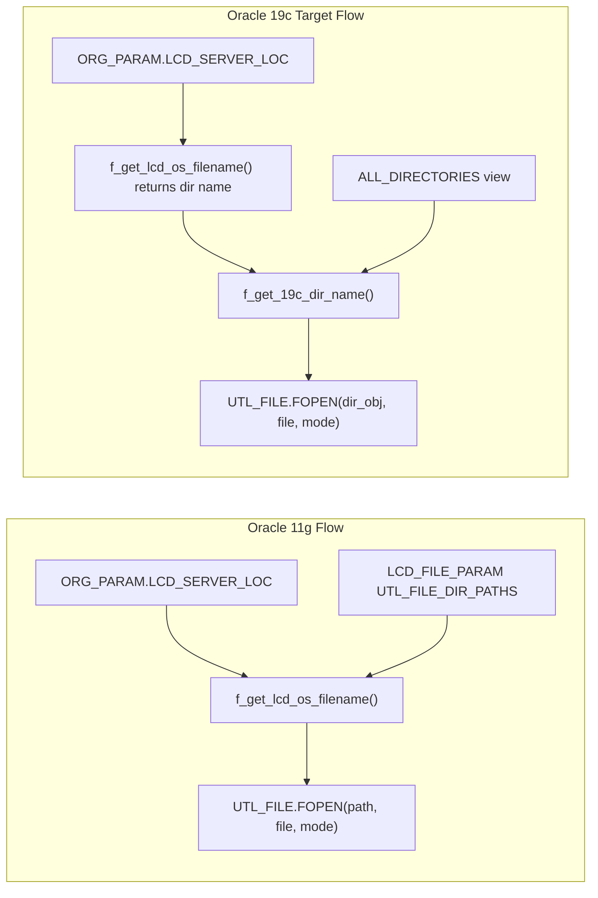

# LCD-Oracle: Oracle 11g to 19c Migration Plan (Task 42-3)

## Executive Summary

Oracle 19c removed the `UTL_FILE_DIR` init parameter. The LCD application currently resolves filesystem paths via `LCD.ORG_PARAM.LCD_SERVER_LOC` + `LCD.LCD_FILE_PARAM` (`UTL_FILE_DIR_PATHS`) and passes **path strings** to `UTL_FILE.FOPEN`. In 19c, `UTL_FILE.FOPEN` requires an Oracle **DIRECTORY object name** (e.g., `LCD_IN`).

**Core design (central resolver):**



**Workspace layout** (under [tasks/42-3/](tasks/42-3/)):

```
tasks/42-3/
├── uat/                          # already exists (reference data)
├── originals/                    # unmodified copies from LCD-Oracle/
│   ├── SQL/
│   └── SQL (WOA)/
├── patched/                      # 19c-compatible copies (all edits here)
│   ├── SQL/
│   └── SQL (WOA)/
├── plans/
│   ├── MIGRATION_CHANGELOG.md          # simulated per-file change log (DONE)
│   ├── ORACLE_19C_MIGRATION_IMPLEMENTATION_PLAN.md
│   ├── ORACLE_19C_MIGRATION_DEPLOYMENT_PLAN.md
│   └── ORACLE_19C_MIGRATION_TEST_PLAN.md
└── tests/                        # unit test harness scripts
    ├── test_harness.sql          # shared assert helpers
    ├── test_F_GET_19C_DIR_NAME.sql
    └── ... (one suite per patched tier)
```

**Analysis source:** Independent grep and code review of [LCD-Oracle/](LCD-Oracle/) — documented in [tasks/42-3/plans/MIGRATION_CHANGELOG.md](tasks/42-3/plans/MIGRATION_CHANGELOG.md).

---

## Reference Data (UAT Q22S)

| File | Path | Role |
|------|------|------|
| Org parameters | [tasks/42-3/uat/LCD_ORGPARAM_Q22S-19c-UPDATED.csv](tasks/42-3/uat/LCD_ORGPARAM_Q22S-19c-UPDATED.csv) | 297 orgs; column `LCD_SERVER_LOC` = base Linux path per org |
| 11g path allow-list | [tasks/42-3/uat/LCD_FILE_PARAM-Q22S-11g-Copied.txt](tasks/42-3/uat/LCD_FILE_PARAM-Q22S-11g-Copied.txt) | Legacy `UTL_FILE_DIR_PATHS` seed (deprecated in 19c) |
| 19c DIRECTORY objects | [tasks/42-3/uat/DB_DIRECTORIES.txt](tasks/42-3/uat/DB_DIRECTORIES.txt) | DBA-created DIRECTORY name to path mappings |

### Org to DIRECTORY mapping (UAT)

| Org group | Example orgs | `LCD_SERVER_LOC` | IN dir | OUT dir |
|-----------|---------------|------------------|--------|---------|
| Default | 010, 580, 200 | `/csclcdnc0002/Q22S` | `LCD_IN` | `LCD_OUT` |
| Federal | 114 | `/csclcdnc0002/Q22S-FEDERAL` | `LCD_FEDERAL_IN` | `LCD_FEDERAL_OUT` |
| Canada | 574, 578 | `/csclcdnc0002/Q22S-CANADA` | `LCD_CANADA_IN` | `LCD_CANADA_OUT` |
| India/663 | 670, 674 | `/csclcdnc0002/q22s-663` | `LCD_663_IN` | `LCD_663_OUT` |
| Org 149 | 149 | `/csclcdnc0002/Q22S-149` | `LCD_149_IN` | `LCD_149_OUT` |
| Org 285 | 285 area | `/csclcdnc0002/Q22S-285` | `LCD_285_IN` | `LCD_285_OUT` |
| UK | 455, 456, S23 | `/csclcdnc0002/Q22S-UK` | **DBA gap** | **DBA gap** |
| Nordic | N06–N17 | `/csclcdnc0002/Q22S-Nordic` | **DBA gap** | **DBA gap** |
| MidEast, LatAm, Italy, SAfrica | various | per CSV | **DBA gap** | **DBA gap** |

**Critical prerequisite:** [DB_DIRECTORIES.txt](tasks/42-3/uat/DB_DIRECTORIES.txt) UAT section ends at line 78 and covers only base, 149, 285, 663, FEDERAL, and CANADA. Regional paths in `LCD_FILE_PARAM` and `LCD_ORGPARAM` (UK, Nordic, MidEast, LatAm, Italy, SAfrica) are **not yet mapped**. DBA must create missing `LCD_*` DIRECTORY objects before regional org testing.

**Case sensitivity:** Resolver must use `UPPER()` comparison (e.g., `/q22s-663` vs `/Q22S-663`).

---

## Files Requiring Changes

### Scope decision: what to patch vs. what inherits fixes

| Category | Count | Action |
|----------|-------|--------|
| Direct FOPEN / path resolution | 28 SQL files | Patch in `patched/` |
| New helper scripts | 2 files | Create in `patched/SQL/` |
| DBMS_JOB to DBMS_SCHEDULER | 2 WOA files | Patch in `patched/SQL (WOA)/` |
| Deprecation comments only | 2 files | Patch in `patched/SQL/` |
| Indirect (via `shared.f_open_*`) | ~50+ import/extract modules | **No direct patch** if Tier 1 + SHRD_BDY fixed |
| Historical archive | `10g_packages.sql`, `Packages/` | Skip |
| External library | `XFileCopy.sql`, `XFileMove.sql`, `XFileInfo.sql` | Skip (C external calls, not UTL_FILE) |

### Tier 0 — New files (no originals)

| File | Purpose |
|------|---------|
| `patched/SQL/F_GET_19C_DIR_NAME.sql` | Maps filesystem path to DIRECTORY object name via `ALL_DIRECTORIES` |
| `patched/SQL/GRANT_DIRECTORY_ACCESS.sql` | DBA script: `GRANT READ, WRITE ON DIRECTORY ... TO LCD` for all UAT dirs |

### Tier 1 — Core resolver and I/O wrappers (7 files)

These are on the **critical path**; all downstream callers depend on them.

| # | Source | Issue | Patch approach |
|---|--------|-------|----------------|
| 1 | [LCD-Oracle/SQL/F_GET_LCD_OS_FILENAME.sql](LCD-Oracle/SQL/F_GET_LCD_OS_FILENAME.sql) | Returns path via `LCD_FILE_PARAM` lookup | After path construction, call `f_get_19c_dir_name()`; return DIRECTORY name |
| 2 | [LCD-Oracle/SQL/F_CHECK_LCD_OS_FILENAME.sql](LCD-Oracle/SQL/F_CHECK_LCD_OS_FILENAME.sql) | Validates against `LCD_FILE_PARAM` | Validate via `f_get_19c_dir_name()` against `ALL_DIRECTORIES` |
| 3 | [LCD-Oracle/SQL/FILEEXST.SQL](LCD-Oracle/SQL/FILEEXST.SQL) | Inline `LCD_FILE_PARAM` + path FOPEN | Resolve dir name before FOPEN; return `-3` if unresolved |
| 4 | [LCD-Oracle/SQL/FILECOPY.SQL](LCD-Oracle/SQL/FILECOPY.SQL) | Inline lookup; missing FOPEN call (2023 bug) | Restore FOPEN + use dir name |
| 5 | [LCD-Oracle/SQL/GETFILE.SQL](LCD-Oracle/SQL/GETFILE.SQL) | Inline `LCD_FILE_PARAM` in `f_open_in_file` | Resolve dir name before FOPEN |
| 6 | [LCD-Oracle/SQL/SHRD_BDY.SQL](LCD-Oracle/SQL/SHRD_BDY.SQL) | `f_open_in_file`, `f_open_out_file`, `f_open_append_file` call `f_get_lcd_os_filename` | Minimal change if Tier 1 #1 done; add 19c debug output on `l_dir_name` |
| 7 | [LCD-Oracle/SQL/BATCH.SQL](LCD-Oracle/SQL/BATCH.SQL) | `FGetAttr`, `FCOPY`, `FRENAME`, `FREMOVE` use path strings | Replace path with dir name via resolver at each call site |

### Tier 2 — Direct FOPEN callers (16 files)

Replace inline `SELECT ... FROM lcd_file_param WHERE type = 'UTL_FILE_DIR_PATHS'` CONNECT BY loops with `lcd.f_get_lcd_os_filename()` (which now returns dir name) or direct `f_get_19c_dir_name()` call before FOPEN.

| # | File | FOPEN calls |
|---|------|-------------|
| 8 | `TIMEDB2.SQL` | 1 (already uses resolver — verify only) |
| 9 | `UNAPPROVED_HOURS.sql` | 2 |
| 10 | `Alt_Work_Order_Extract.sql` | 1 |
| 11 | `Work_Order_Extract.sql` | 1 |
| 12 | `BeelineBusinessAreas.sql` | 1 |
| 13 | `BeelineDepartments.sql` | 1 |
| 14 | `ALL_DEPARTMENTS_BEELINE-proc.sql` | 2 |
| 15 | `NAUSD_SUBCON_FEED-proc.sql` | 1 |
| 16 | `USR11_SUBCON_FEED-proc.sql` | 1 |
| 17 | `sa_notime.sql` | 1 |
| 18 | `SUBCO_NOTIME_TERM.sql` | 1 |
| 19 | `LCD_USER_AUDIT-proc.sql` | 1 |
| 20 | `NPS_Department_Select.sql` | 1 |
| 21 | `TimeSheetExtractLCD.sql` | 1 |
| 22 | `WEEKLY_NPS_EXTRACT-proc.sql` | 1 |
| 23 | `Tes_Reports.bdy` | 3 (uses raw `lcd_server_loc`) |

### Tier 3 — SAP atomic group (3 files, deploy together)

| # | File | Notes |
|---|------|-------|
| 24 | `Sap_Data_Load.prc` | `p_dir` semantic change: now DIRECTORY name, not path |
| 25 | `Sap_Submit_Data_Load.prc` | `FRetrieveSystemParams` sets `pRSPDir` via resolver |
| 26 | `Sap_Auto_Load.prc` | Add debug output; DBMS_SCHEDULER already present |

### Tier 4 — DBMS_JOB to DBMS_SCHEDULER (2 files)

| # | File | Change |
|---|------|--------|
| 27 | [LCD-Oracle/SQL (WOA)/Step3_LCDInterface_Refresh.sql](LCD-Oracle/SQL (WOA)/Step3_LCDInterface_Refresh.sql) | Replace `DBMS_JOB.SUBMIT` with `DBMS_SCHEDULER.CREATE_JOB` (one-shot, org-scoped job names) |
| 28 | [LCD-Oracle/SQL (WOA)/Step4_LCDInterface_ScheduleRefresh.sql](LCD-Oracle/SQL (WOA)/Step4_LCDInterface_ScheduleRefresh.sql) | Replace 4-hour `DBMS_JOB` with `DBMS_SCHEDULER` (`FREQ=HOURLY;INTERVAL=4`) |

### Tier 5 — Deprecation comments (2 files)

| File | Action |
|------|--------|
| `LCD_FILE_PARAM_TABLE_DDL.sql` | Add deprecation header comment |
| `LCD_FILE_PARAM_P22_INSERT.sql` | Add deprecation header comment |

### Files explicitly NOT patched (inherit Tier 1 fixes)

- All import modules using `lcd.shared.f_open_in_file` / `f_open_out_file`: `wo_imps.sql`, `lab_imps.sql`, `lab_impb.sql`, `LABINT.SQL`, CPI/*, UK-I/*, wage/rate imports, etc.
- `cmpllcd.sql`, compilation orchestrators, password/audit DDL
- `NPS_Departments_Job_Scheduler - FOR Q22.sql` — legacy one-off DBMS_JOB snippet with hardcoded Windows path; document as obsolete, do not deploy

---

## Code Change Conventions

Every injection preceded by flowerbox comment:

```sql
-- ===========================================================================
-- RdW 5/24/2026 Oracle 19c Migration - [description of change]
-- ===========================================================================
```

Debug output (comment out before production):

```sql
DBMS_OUTPUT.PUT_LINE('-- DEBUG [RdW 19c] org=' || v_org ||
  ' lcd_server_loc=' || v_lcd_server_loc ||
  ' resolved_path=' || v_path ||
  ' directory_obj=' || v_dir_name);
```

Retain original 11g logic as commented blocks where useful for rollback reference.

---

## Multi-Phased Implementation

### Phase 0 — Setup and backup
- Create `tasks/42-3/originals/` and `tasks/42-3/patched/` mirroring source subfolders
- Copy all 32 affected files from [LCD-Oracle/](LCD-Oracle/) into `originals/` (preserve relative paths)
- Copy same files into `patched/` as working copies
- Write three plan markdown files under `tasks/42-3/plans/`
- Change log complete: [MIGRATION_CHANGELOG.md](tasks/42-3/plans/MIGRATION_CHANGELOG.md)

### Phase 1 — Foundation (DBA + new functions)
- DBA confirms/creates all DIRECTORY objects (including regional gaps)
- Run `GRANT_DIRECTORY_ACCESS.sql` as SYS
- Compile `F_GET_19C_DIR_NAME.sql`
- Smoke test: `SELECT lcd.f_get_19c_dir_name('/csclcdnc0002/Q22S/In') FROM dual` returns `LCD_IN`

### Phase 2 — Core utilities (Tier 1)
- Patch and compile: `F_GET_LCD_OS_FILENAME`, `F_CHECK_LCD_OS_FILENAME`, `FILEEXST`, `FILECOPY`, `GETFILE`
- Patch and compile: `SHRD_BDY.SQL`, `BATCH.SQL`
- Verify: `f_get_lcd_os_filename('010', NULL, 'IN', FALSE)` returns `LCD_IN` not a path string

### Phase 3 — Direct callers (Tier 2)
- Patch remaining 16 extract/feed/report files
- Each file: replace `LCD_FILE_PARAM` loop with resolver call + add debug output
- Remove legacy `\OUT` suffix duplication in NAUSD/USR11 feeds (Windows artifact)

### Phase 4 — SAP atomic group (Tier 3)
- Patch all 3 SAP files in single deployment window
- Document breaking change on `Sap_Data_Load.p_dir`

### Phase 5 — WOA scheduling (Tier 4)
- Patch Step3 and Step4 WOA scripts
- Verify jobs appear in `ALL_SCHEDULER_JOBS`

### Phase 6 — Deprecation and validation (Tier 5)
- Add deprecation comments to `LCD_FILE_PARAM` DDL/seed scripts
- Run full test harness (see test plan)
- Confirm import modules (wo_imps, lab_imps, LABINT) work via shared wrappers without direct patches

---

## Deployment Plan Outline

Saved as [tasks/42-3/plans/ORACLE_19C_MIGRATION_DEPLOYMENT_PLAN.md](tasks/42-3/plans/ORACLE_19C_MIGRATION_DEPLOYMENT_PLAN.md).

**Pre-deployment checklist:**
1. Confirm Oracle 19c: `SELECT banner FROM v$version`
2. Confirm DIRECTORY objects: `SELECT directory_name, directory_path FROM all_directories WHERE directory_name LIKE 'LCD%'`
3. Confirm filesystem mount: `ls -la /csclcdnc0002/Q22S/` on Linux server
4. Schema backup via Data Pump
5. `SET SERVEROUTPUT ON SIZE UNLIMITED`

**Compile order:**
```
Step 0: GRANT_DIRECTORY_ACCESS.sql          (as SYS)
Step 1: F_GET_19C_DIR_NAME.sql
Step 2: F_GET_LCD_OS_FILENAME.sql
        F_CHECK_LCD_OS_FILENAME.sql
        FILEEXST.SQL, FILECOPY.SQL, GETFILE.SQL
Step 3: SHRD_BDY.SQL, BATCH.SQL
Step 4: Tier 2 extract/feed files (any order)
Step 5: Sap_Data_Load → Sap_Submit_Data_Load → Sap_Auto_Load (atomic)
Step 6: WOA Step3, Step4
```

**Expected results per step:** `Function/Procedure created.` + `SHOW ERRORS` returns no errors + smoke-test queries return DIRECTORY names.

**Common troubleshooting:**

| Error | Cause | Fix |
|-------|-------|-----|
| `ORA-29280: invalid directory path` | FOPEN still receiving path string | Recompile Tier 1; verify resolver returns dir name |
| `ORA-29283: invalid file operation` | Missing DIRECTORY grant | Run `GRANT_DIRECTORY_ACCESS.sql` |
| `ORA-01031: insufficient privileges` | Grants script not run as DBA | Execute as SYS |
| Resolver returns NULL | Path case mismatch or missing DIRECTORY | Check `ALL_DIRECTORIES`; create missing regional dirs |
| `ORA-27486: insufficient privileges` (scheduler) | Missing `CREATE JOB` privilege | `GRANT CREATE JOB TO LCD` |

---

## Unit Test Harness Outline

Saved as [tasks/42-3/plans/ORACLE_19C_MIGRATION_TEST_PLAN.md](tasks/42-3/plans/ORACLE_19C_MIGRATION_TEST_PLAN.md).

**Harness design:**
- Shared assert framework in `tests/test_harness.sql` with `assert_eq`, `assert_not_null`, pass/fail counters
- One test suite script per tier, runnable independently via SQL*Plus/SQL Developer
- Tests run against UAT (Q22S) after each deployment phase

**Test suites:**

| Suite | File | Key test cases |
|-------|------|----------------|
| TS-01 | `test_F_GET_19C_DIR_NAME.sql` | Known paths, trailing slash, case insensitivity, NULL input, missing path, regional paths |
| TS-02 | `test_F_GET_LCD_OS_FILENAME.sql` | Org 010/IN, org 114/FEDERAL, org 574/CANADA, archive flag, NULL org with server_loc |
| TS-03 | `test_F_CHECK_LCD_OS_FILENAME.sql` | Valid/invalid path validation |
| TS-04 | `test_FILE_UTILITIES.sql` | FILEEXST, FILECOPY, GETFILE open/close cycle |
| TS-05 | `test_SHRD_BDY.sql` | f_open_in_file, f_open_out_file for sample org |
| TS-06 | `test_BATCH.sql` | fExists, ServerFileCopy, ServerFileMove |
| TS-07 | `test_EXTRACTS.sql` | Work order extract, timesheet extract smoke (write test file to OUT dir) |
| TS-08 | `test_SAP.sql` | Sap_Data_Load with DIRECTORY name param |
| TS-09 | `test_WOA.sql` | Scheduler job creation (dry run, no DB link required for compile check) |
| TS-10 | `test_ORG_COVERAGE.sql` | Loop all distinct `LCD_SERVER_LOC` values from CSV; assert resolver returns non-NULL dir name |

**Integration test (manual):**
- Run a labor import (`lab_imps`) for org 010 with a test file in `/csclcdnc0002/Q22S/In`
- Run SAP auto-load for a test org
- Verify WOA refresh job submits successfully

---

## Todo-to-Changelog Mapping

Each todo maps to a section in [MIGRATION_CHANGELOG.md](tasks/42-3/plans/MIGRATION_CHANGELOG.md):

| Todo ID | Changelog | Files |
|---------|-----------|-------|
| `t0-new-scripts` | §6 Tier A | F_GET_19C_DIR_NAME, GRANT_DIRECTORY_ACCESS |
| `t1-resolver` | §7 B-1, B-2 | F_GET_LCD_OS_FILENAME, F_CHECK_LCD_OS_FILENAME |
| `t1-file-io` | §7 B-3, B-4, B-5 | FILEEXST, FILECOPY, GETFILE |
| `t1-shared-batch` | §7 B-6, B-7 | SHRD_BDY, BATCH |
| `t2-extracts-feeds` | §8 C-1–C-15 | 14 extract/feed/report files |
| `t2-tes-reports` | §8 C-16 | Tes_Reports.bdy |
| `t2-param-procs` | §8 C-7, C-10 | ALL_DEPARTMENTS_BEELINE, sa_notime |
| `t3-sap-group` | §9 Tier D | Sap_Data_Load, Sap_Submit, Sap_Auto_Load |
| `t4-woa-scheduler` | §10 Tier E | Step3, Step4 WOA |
| `t5-deprecate` | §11 Tier F | LCD_FILE_PARAM DDL + seed |

---

## Documentation References

- [tasks/42-3/plans/MIGRATION_CHANGELOG.md](tasks/42-3/plans/MIGRATION_CHANGELOG.md) — **independent per-file change log**
- [LCD-Oracle/docs/sql-documentation/F_GET_LCD_OS_FILENAME.md](LCD-Oracle/docs/sql-documentation/F_GET_LCD_OS_FILENAME.md) — 11g baseline behavior
- [LCD-Oracle/docs/sql-documentation/tables/LCD_FILE_PARAM.md](LCD-Oracle/docs/sql-documentation/tables/LCD_FILE_PARAM.md) — deprecated table callers
- [LCD-Oracle/docs/sql-documentation/FILE_UTILITIES.md](LCD-Oracle/docs/sql-documentation/FILE_UTILITIES.md) — FILECOPY, GETFILE, FILEEXST architecture
