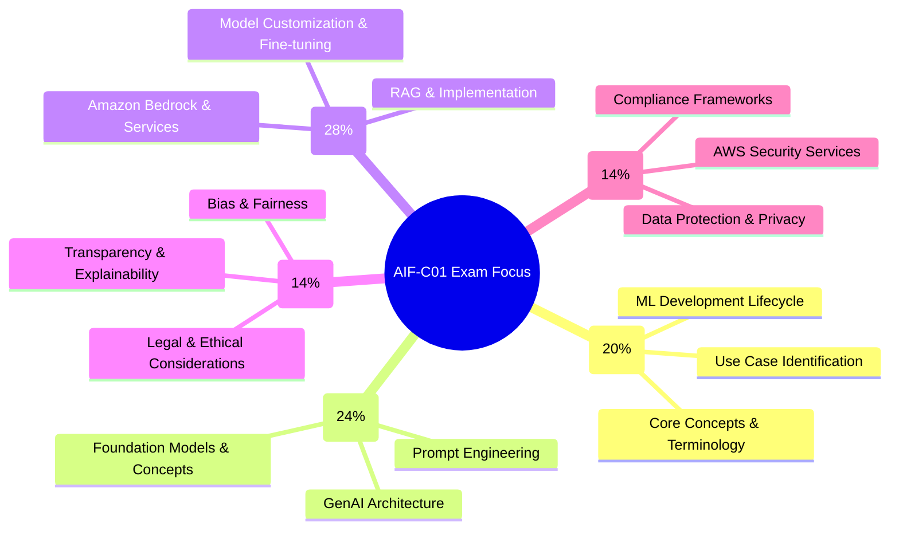

# ������ AWS Certified AI Practitioner (AIF-C01) Exam Study Guide: Advanced Question Types

> ������ **Exam Overview**: The AWS Certified AI Practitioner (AIF-C01) exam validates foundational understanding of AI/ML and Generative AI concepts, focusing on practical business applications rather than deep technical implementation 【turn0search2】【turn0search21】. The exam contains **65 questions** to be completed in **90 minutes**, with a scaled passing score of 700 【turn0search20】【turn0search24】.

## ������ Exam Content Domain Weighting & Prevalence Analysis

Based on official documentation and analysis of exam patterns, here are the most prevalent topics you'll encounter:

### ������ High-Prevalence Concepts for Testing
1. **ML Pipeline Stages**: Data collection → preprocessing → feature engineering → training → evaluation → deployment → monitoring 【turn0search0】
2. **Foundation Model Applications**: Amazon Bedrock, Claude, Titan models, and their use cases 【turn0search2】
3. **Responsible AI Tools**: Amazon Bedrock Guardrails, SageMaker Clarify, SageMaker Model Monitor 【turn0search4】
4. **AWS Service Mapping**: Matching specific AI services to business problems (Comprehend for sentiment analysis, Rekognition for image analysis, etc.) 【turn0search0】
5. **Security & Compliance**: IAM roles, encryption, AWS Shared Responsibility Model as applied to AI workloads 【turn0search2】【turn0search19】

## ������ Ordering Questions (20 Questions)

These questions require you to arrange steps or components in the correct sequence.

### ML Development Lifecycle & Operations
1. **Correct sequence for ML model deployment**:
   - A. Model evaluation
   - B. Model training
   - C. Feature engineering
   - D. Data collection
   - **Answer**: D → C → B → A 【turn0search0】

2. **Steps in an ML pipeline in order**:
   - A. Model monitoring
   - B. Hyperparameter tuning
   - C. Exploratory data analysis
   - D. Data preprocessing
   - **Answer**: C → D → B → A 【turn0search0】

3. **Responsible AI development process**:
   - A. Deploy model with bias monitoring
   - B. Identify potential biases in training data
   - C. Implement fairness constraints
   - D. Conduct human audits of model outputs
   - **Answer**: B → C → D → A 【turn0search4】

4. **Foundation model customization workflow**:
   - A. Fine-tune model on custom dataset
   - B. Select base model from Amazon Bedrock
   - C. Evaluate model performance
   - D. Set up prompt engineering templates
   - **Answer**: B → D → A → C

5. **Steps to implement RAG (Retrieval-Augmented Generation)**:
   - A. Generate response using foundation model
   - B. Retrieve relevant documents from knowledge base
   - C. Convert documents to vector embeddings
   - D. Store embeddings in vector database
   - **Answer**: C → D → B → A

### Security & Compliance Implementation
6. **AWS security best practices for AI workloads**:
   - A. Configure IAM roles with least privilege
   - B. Encrypt data at rest and in transit
   - C. Implement network segmentation
   - D. Enable CloudTrail logging
   - **Answer**: A → B → C → D 【turn0search19】

7. **Steps to ensure data privacy in ML pipelines**:
   - A. Implement data anonymization
   - B. Obtain consent for data usage
   - C. Apply differential privacy techniques
   - D. Regular security audits
   - **Answer**: B → A → C → D

### Generative AI Implementation
8. **Prompt engineering optimization sequence**:
   - A. Test with diverse inputs
   - B. Define clear task instructions
   - C. Add context and constraints
   - D. Evaluate and refine outputs
   - **Answer**: B → C → A → D

9. **Foundation model evaluation process**:
   - A. Define evaluation metrics
   - B. Select test dataset
   - C. Run model inference
   - D. Analyze results and compare
   - **Answer**: A → B → C → D

### Business Application Planning
10. **AI solution implementation roadmap**:
    - A. Identify business problem
    - B. Select appropriate AI technique
    - C. Determine ROI and feasibility
    - D. Plan deployment strategy
    - **Answer**: A → C → B → D 【turn0search0】

11. **MLOps maturity progression**:
    - A. Manual model deployment
    - B. Automated training pipelines
    - C. Continuous integration/continuous deployment
    - D. Real-time monitoring and alerting
    - **Answer**: A → B → C → D 【turn0search0】

12. **AI ethics review process**:
    - A. Assess potential societal impacts
    - B. Review for discriminatory outcomes
    - C. Document model limitations
    - D. Implement mitigation strategies
    - **Answer**: B → A → D → C

### AWS Service Configuration
13. **Setting up Amazon Bedrock for production**:
    - A. Configure safety filters
    - B. Select appropriate foundation model
    - C. Set up access through IAM
    - D. Implement usage monitoring
    - **Answer**: C → B → A → D

14. **SageMaker Clarify bias detection workflow**:
    - A. Configure bias metrics
    - B. Preprocess training data
    - C. Run bias detection job
    - D. Analyze and report findings
    - **Answer**: B → A → C → D 【turn0search4】

### Data Pipeline Management
15. **Feature engineering for ML models**:
    - A. Handle missing values
    - B. Create new features
    - C. Normalize/standardize features
    - D. Select relevant features
    - **Answer**: A → B → C → D 【turn0search0】

16. **Model retraining trigger sequence**:
    - A. Detect data drift
    - B. Evaluate model performance degradation
    - C. Trigger retraining pipeline
    - D. Deploy updated model
    - **Answer**: A → B → C → D

### Problem-Solving Methodology
17. **AI solution troubleshooting steps**:
    - A. Identify symptoms
    - B. Gather relevant data
    - C. Analyze potential causes
    - D. Implement solution
    - **Answer**: A → B → C → D

18. **Stakeholder communication for AI projects**:
    - A. Define business objectives
    - B. Explain technical approach
    - C. Present results with metrics
    - D. Discuss limitations and risks
    - **Answer**: A → B → C → D

### Compliance & Governance
19. **AI governance framework implementation**:
    - A. Establish policies and standards
    - B. Assign roles and responsibilities
    - C. Implement monitoring and enforcement
    - D. Conduct regular reviews and updates
    - **Answer**: B → A → C → D

20. **Data retention and deletion process**:
    - A. Define retention policies
    - B. Implement automated deletion
    - C. Monitor compliance
    - D. Audit data access logs
    - **Answer**: A → D → B → C

������ Why Ordering Questions Matter

Ordering questions test your understanding of **processes and workflows** which are fundamental to implementing AI solutions on AWS. These questions appear frequently because they assess your grasp of:

- **ML Lifecycle Management**: Understanding the correct sequence from data collection to model deployment
- **Security Implementation**: Proper order for implementing security measures
- **Troubleshooting Methodology**: Systematic approaches to problem-solving
- **AWS Service Configuration**: Correct steps to set up and configure AWS AI services

The exam emphasizes **practical application knowledge** rather than just theoretical concepts 【turn0search2】【turn0search14】.

## ������ Matching Questions (20 Questions)

These questions require you to pair items from two lists correctly.

### AWS Services to Use Cases
1. **Match AWS AI services with their primary use case**:
   - Amazon Comprehend → **A. Sentiment analysis**
   - Amazon Rekognition → **B. Image and video analysis**
   - Amazon Transcribe → **C. Speech to text**
   - Amazon Translate → **D. Language translation**
   - **Answer**: 1-A, 2-B, 3-C, 4-D 【turn0search0】

2. **Match SageMaker components with their function**:
   - SageMaker Data Wrangler → **A. Data preparation**
   - SageMaker Feature Store → **B. Feature management**
   - SageMaker Model Monitor → **C. Model performance monitoring**
   - SageMaker Clarify → **D. Bias detection**
   - **Answer**: 1-A, 2-B, 3-C, 4-D 【turn0search0】【turn0search4】

3. **Match foundation models with their characteristics**:
   - Claude → **A. Anthropic's conversational model**
   - Titan → **B. Amazon's foundation model family**
   - Jurassic → **C. AI21 Labs' language model**
   - Stable Diffusion → **D. Image generation model**
   - **Answer**: 1-A, 2-B, 3-C, 4-D

### AI Concepts to Definitions
4. **Match AI concepts with their definitions**:
   - Supervised learning → **A. Learning from labeled examples**
   - Unsupervised learning → **B. Finding patterns in unlabeled data**
   - Reinforcement learning → **C. Learning through reward/penalty**
   - Transfer learning → **D. Using knowledge from one task for another**
   - **Answer**: 1-A, 2-B, 3-C, 4-D 【turn0search0】

5. **Match data types with their examples**:
   - Tabular data → **A. Customer transaction records**
   - Time-series data → **B. Stock price movements**
   - Image data → **C. Medical X-rays**
   - Text data → **D. Customer reviews**
   - **Answer**: 1-A, 2-B, 3-C, 4-D 【turn0search0】

### Responsible AI Principles
6. **Match responsible AI principles with their descriptions**:
   - Fairness → **A. Treating all groups equitably**
   - Transparency → **B. Making AI decisions understandable**
   - Privacy → **C. Protecting personal information**
   - Robustness → **D. Performing reliably across conditions**
   - **Answer**: 1-A, 2-B, 3-C, 4-D 【turn0search4】

7. **Match bias types with their examples**:
   - Selection bias → **A. Training data not representative**
   - Measurement bias → **B. Inaccurate data collection methods**
   - Confirmation bias → **C. Interpreting data to confirm beliefs**
   - Deployment bias → **D. Using model in unintended context**
   - **Answer**: 1-A, 2-B, 3-C, 4-D

### Security & Compliance Terms
8. **Match security concepts with AWS implementations**:
   - Least privilege → **A. IAM policies with minimal permissions**
   - Encryption → **B. AWS KMS for data protection**
   - Network isolation → **C. VPC configuration for AI services**
   - Audit logging → **D. AWS CloudTrail for API calls**
   - **Answer**: 1-A, 2-B, 3-C, 4-D 【turn0search19】

9. **Match compliance frameworks with their focus**:
   - GDPR → **A. European data privacy protection**
   - HIPAA → **B. US healthcare data security**
   - SOC 2 → **C. Service organization controls**
   - PCI DSS → **D. Payment card industry standards**
   - **Answer**: 1-A, 2-B, 3-C, 4-D

### Evaluation Metrics
10. **Match model metrics with their purposes**:
    - Accuracy → **A. Overall correctness of predictions**
    - Precision → **B. Minimizing false positives**
    - Recall → **C. Minimizing false negatives**
    - F1 score → **D. Balance between precision and recall**
    - **Answer**: 1-A, 2-B, 3-C, 4-D 【turn0search0】

### Generative AI Concepts
11. **Match GenAI techniques with their descriptions**:
    - Prompt engineering → **A. Crafting effective instructions for models**
    - Fine-tuning → **B. Adapting pre-trained models to specific tasks**
    - RAG → **C. Combining retrieval with generation**
    - Few-shot learning → **D. Providing examples in prompts**
    - **Answer**: 1-A, 2-B, 3-C, 4-D

12. **Match Amazon Bedrock features with their functions**:
    - Guardrails → **A. Content filtering and safety**
    - Agents → **B. Orchestrating multi-step tasks**
    - Knowledge bases → **C. RAG implementation**
    - Model evaluation → **D. Comparing model performances**
    - **Answer**: 1-A, 2-B, 3-C, 4-D

### Business Applications
13. **Match business problems with AI solutions**:
    - Customer churn prediction → **A. Classification model**
    - Sales forecasting → **B. Regression model**
    - Customer segmentation → **C. Clustering algorithm**
    - Fraud detection → **D. Anomaly detection**
    - **Answer**: 1-A, 2-B, 3-C, 4-D 【turn0search0】

### Data Pipeline Stages
14. **Match pipeline stages with their AWS services**:
    - Data ingestion → **A. AWS Glue**
    - Data storage → **B. Amazon S3**
    - Data transformation → **C. AWS Lambda**
    - Model serving → **D. Amazon SageMaker endpoints**
    - **Answer**: 1-A, 2-B, 3-C, 4-D

### MLOps Concepts
15. **Match MLOps practices with their benefits**:
    - Version control → **A. Reproducibility**
    - Automated testing → **B. Reliability**
    - Continuous monitoring → **C. Performance maintenance**
    - Infrastructure as code → **D. Scalability**
    - **Answer**: 1-A, 2-B, 3-C, 4-D 【turn0search0】

### Ethical Considerations
16. **Match ethical concerns with their mitigations**:
    - Algorithmic bias → **A. Diverse training data**
    - Lack of transparency → **B. Explainable AI techniques**
    - Privacy violations → **C. Data anonymization**
    - Job displacement → **D. Reskilling programs**
    - **Answer**: 1-A, 2-B, 3-C, 4-D

### AWS Pricing Models
17. **Match pricing models with their characteristics**:
    - On-demand → **A. Pay per use without commitment**
    - Reserved → **B. Commitment for lower rates**
    - Spot → **C. Unused capacity at discounted prices**
    - Free tier → **D. Limited usage at no cost**
    - **Answer**: 1-A, 2-B, 3-C, 4-D

### Performance Optimization
18. **Match optimization techniques with their purposes**:
    - Caching → **A. Reducing latency**
    - Batching → **B. Improving throughput**
    - Quantization → **C. Reducing model size**
    - Pruning → **D. Removing unnecessary parameters**
    - **Answer**: 1-A, 2-B, 3-C, 4-D

### Cloud Architecture Patterns
19. **Match architecture patterns with their use cases**:
    - Multi-tier → **A. Web applications**
    - Event-driven → **B. Real-time data processing**
    - Microservices → **C. Independent deployment**
    - Serverless → **D. Automatic scaling**
    - **Answer**: 1-A, 2-B, 3-C, 4-D

### AI Project Stakeholders
20. **Match stakeholders with their concerns**:
    - Business executives → **A. ROI and business value**
    - Data scientists → **B. Model performance and accuracy**
    - IT operations → **C. Infrastructure and deployment**
    - Legal/compliance → **D. Regulatory requirements**
    - **Answer**: 1-A, 2-B, 3-C, 4-D

������ Mastering Matching Questions

Matching questions test your ability to **connect concepts across different domains**—a critical skill for AI practitioners who must bridge technical and business requirements. Key strategies:

1. **Create Mental Maps**: Connect services to problems, concepts to definitions, and tools to outcomes
2. **Understand Relationships**: Focus on *why* items are paired, not just memorization
3. **Use Process of Elimination**: If unsure about one match, eliminate impossible options
4. **Cross-Reference Domains**: Many matches span multiple exam domains (e.g., responsible AI + security)

AWS frequently tests these cross-domain connections because real-world AI implementation requires integrated knowledge 【turn0search2】【turn0search15】.

## ������ Scenario-Based Questions (20 Questions)

These questions present realistic business situations requiring you to apply AI/ML knowledge.

### Business Problem Identification
1. **Scenario**: A retail company wants to predict which customers are likely to cancel their subscriptions next month. They have historical data on customer behavior, demographics, and usage patterns.
   - **Question**: Which AI technique is most appropriate?
   - **Options**: A. Regression, B. Classification, C. Clustering, D. Anomaly detection
   - **Answer**: B. Classification (predicting discrete outcome: churn/no churn) 【turn0search0】

2. **Scenario**: A healthcare provider needs to analyze medical images to detect early signs of disease from X-rays and MRI scans.
   - **Question**: Which AI capability should they implement?
   - **Options**: A. Natural language processing, B. Computer vision, C. Speech recognition, D. Recommendation systems
   - **Answer**: B. Computer vision 【turn0search0】

3. **Scenario**: A financial institution wants to identify unusual transactions that might indicate fraud in real-time as they occur.
   - **Question**: Which approach is most suitable?
   - **Options**: A. Batch processing regression model, B. Real-time anomaly detection, C. Historical data clustering, D. Periodic classification
   - **Answer**: B. Real-time anomaly detection 【turn0search0】

### AWS Service Selection
4. **Scenario**: A marketing team needs to analyze customer feedback from social media to understand sentiment about their brand. They want a managed service that requires no ML expertise.
   - **Question**: Which AWS service should they use?
   - **Options**: A. Amazon SageMaker, B. Amazon Comprehend, C. Amazon Rekognition, D. Amazon Polly
   - **Answer**: B. Amazon Comprehend (for sentiment analysis) 【turn0search0】

5. **Scenario**: A development team wants to build a conversational chatbot for their customer service portal. They need to integrate natural language understanding and generation.
   - **Question**: Which combination of AWS services is most appropriate?
   - **Options**: A. Amazon Transcribe + Amazon Polly, B. Amazon Lex + Amazon Polly, C. Amazon Comprehend + Amazon Translate, D. Amazon Kendra + Amazon Textract
   - **Answer**: B. Amazon Lex (conversational AI) + Amazon Polly (text-to-speech) 【turn0search0】

6. **Scenario**: An enterprise needs to extract text from scanned documents, invoices, and receipts to automate their accounts payable process.
   - **Question**: Which AWS service is designed for this use case?
   - **Options**: A. Amazon Comprehend, B. Amazon Textract, C. Amazon Rekognition, D. Amazon Translate
   - **Answer**: B. Amazon Textract (for document text extraction)

### Responsible AI Implementation
7. **Scenario**: A bank is implementing an AI system for loan approvals. They discover the model shows bias against certain demographic groups.
   - **Question**: What is the FIRST step they should take according to responsible AI guidelines?
   - **Options**: A. Deploy the model with monitoring, B. Investigate training data for bias, C. Retrain with more data, D. Implement explainability tools
   - **Answer**: B. Investigate training data for bias 【turn0search4】

8. **Scenario**: A company is using a large language model for customer-facing applications. They want to ensure the model doesn't generate harmful or inappropriate content.
   - **Question**: Which AWS feature should they implement?
   - **Options**: A. Amazon Macie, B. Amazon Bedrock Guardrails, C. AWS WAF, D. Amazon Inspector
   - **Answer**: B. Amazon Bedrock Guardrails (for content filtering) 【turn0search4】

9. **Scenario**: A healthcare startup wants to use AI to analyze patient data for research. They need to ensure compliance with HIPAA regulations.
   - **Question**: Which security measures are ESSENTIAL?
   - **Options**: A. Only encryption at rest, B. Encryption in transit and at rest, audit logging, and access controls, C. Basic password protection, D. Only network firewalls
   - **Answer**: B. Comprehensive security controls (encryption, logging, access controls) 【turn0search19】

### Generative AI Applications
10. **Scenario**: A content creation company wants to generate product descriptions for their e-commerce catalog. They need to maintain brand voice and consistency.
    - **Question**: Which approach would be most effective?
    - **Options**: A. Using a general-purpose LLM with minimal guidance, B. Fine-tuning a foundation model on their existing product descriptions, C. Using basic templates without AI, D. Relying entirely on manual writing
    - **Answer**: B. Fine-tuning a foundation model on existing descriptions 【turn0search2】

11. **Scenario**: A legal firm wants to implement a system that can answer questions about legal documents by retrieving relevant information from their case database.
    - **Question**: Which architecture pattern is most suitable?
    - **Options**: A. Simple prompt-based generation, B. Retrieval-Augmented Generation (RAG), C. Pure classification model, D. Basic keyword search
    - **Answer**: B. Retrieval-Augmented Generation (RAG) 【turn0search2】

### Performance & Cost Optimization
12. **Scenario**: A startup is developing an AI application with unpredictable usage patterns. They want to minimize costs while maintaining availability.
    - **Question**: Which pricing strategy should they adopt?
    - **Options**: A. Reserved Instances for all resources, B. Spot Instances for non-critical workloads, C. On-demand pricing for all services, D. Savings Plans for predictable workloads
    - **Answer**: B. Spot Instances for non-critical workloads (cost optimization)

13. **Scenario**: An ML team notices their model's performance degrades over time. They want to implement automated retraining.
    - **Question**: Which MLOps practice should they implement?
    - **Options**: A. Manual monitoring and retraining, B. Continuous integration/continuous deployment (CI/CD) for ML models, C. Annual model rebuilds, D. Static model deployment
    - **Answer**: B. CI/CD for ML models (automated retraining) 【turn0search0】

### Business Decision Making
14. **Scenario**: A company is considering implementing AI for their customer service. They have limited budget and technical expertise.
    - **Question**: Which approach should they prioritize?
    - **Options**: A. Building custom models from scratch, B. Using managed AI services (Amazon Lex, Comprehend), C. Hiring a large data science team, D. Postponing AI implementation
    - **Answer**: B. Using managed AI services (lower barrier to entry) 【turn0search2】

15. **Scenario**: An e-commerce company wants to implement personalized product recommendations. They have customer browsing history and purchase data.
    - **Question**: Which ML technique is most appropriate?
    - **Options**: A. Regression analysis, B. Collaborative filtering, C. Time-series forecasting, D. Classification
    - **Answer**: B. Collaborative filtering (for recommendation systems) 【turn0search0】

### Security & Compliance Scenarios
16. **Scenario**: A multinational company must deploy AI models in multiple geographic regions with different data privacy regulations.
    - **Question**: Which strategy should they adopt?
    - **Options**: A. Deploy all models in a single region, B. Implement region-specific data handling and model deployment, C. Ignore regional differences, D. Use only on-premises solutions
    - **Answer**: B. Region-specific data handling and deployment (compliance with regulations like GDPR) 【turn0search19】

17. **Scenario**: A company suspects their AI model might be leaking sensitive information through its predictions.
    - **Question**: Which security measure should they implement FIRST?
    - **Options**: A. Increase model accuracy, B. Implement differential privacy, C. Collect more training data, D. Simplify the model architecture
    - **Answer**: B. Implement differential privacy (protecting individual information)

### Troubleshooting & Debugging
18. **Scenario**: An ML model that worked well in development is performing poorly in production. The data distribution has changed.
    - **Question**: What is this phenomenon called?
    - **Options**: A. Underfitting, B. Data drift, C. Overfitting, D. Concept drift
    - **Answer**: D. Concept drift (when the relationship between features and target changes) 【turn0search0】

19. **Scenario**: A team is trying to improve their ML model's performance but is limited by computational resources.
    - **Question**: Which technique should they consider FIRST?
    - **Options**: A. Collect more data, B. Try different algorithms, C. Optimize hyperparameters, D. Reduce feature dimensions
    - **Answer**: D. Reduce feature dimensions (often more efficient than collecting more data)

### Strategic Planning
20. **Scenario**: A company's executive team wants to understand the potential ROI of implementing AI solutions.
    - **Question**: Which factors should they consider in their analysis?
    - **Options**: A. Only development costs, B. Development costs, operational savings, revenue impact, and competitive advantage, C. Only technology costs, D. Only employee training expenses
    - **Answer**: B. Comprehensive cost-benefit analysis including all relevant factors 【turn0search0】

������ Scenario Question Strategies

Scenario-based questions are **the most challenging** but also **most representative** of real-world AI implementation. Key approaches:

1. **Identify the Core Problem**: What business problem is being solved?
2. **Map to Technical Requirements**: What AI/ML capabilities are needed?
3. **Consider Constraints**: Budget, expertise, timeline, regulatory requirements
4. **Evaluate Trade-offs**: No solution is perfect; choose the best fit
5. **Apply AWS Knowledge**: Which AWS services match the requirements?

The exam emphasizes **practical application** over theoretical knowledge 【turn0search14】. These scenarios test your ability to:
- Connect business problems to technical solutions
- Select appropriate AWS services for given requirements
- Apply responsible AI principles in real contexts
- Make cost-benefit decisions for AI implementations

## ������ Exam Preparation Strategy & Final Insights

### High-Yield Study Areas Based on Exam Analysis

| Domain | Weight | Key Topics | Question Frequency |
|--------|--------|------------|-------------------|
| **Foundation Model Applications** | 28% | Amazon Bedrock, Claude, Titan, RAG, fine-tuning | Very High |
| **Generative AI Fundamentals** | 24% | Prompt engineering, foundation models, GenAI concepts | High |
| **AI/ML Fundamentals** | 20% | ML lifecycle, algorithms, data types, use cases | High |
| **Responsible AI** | 14% | Bias, fairness, transparency, explainability | Medium |
| **Security & Governance** | 14% | IAM, encryption, compliance, AWS security services | Medium |

### ������ Recommended Study Resources
1. **Official AWS Documentation**: Exam guide and domain-specific pages 【turn0search0】【turn0search2】【turn0search4】
2. **AWS Skill Builder**: Official practice question sets and exam prep 【turn0search5】【turn0search6】【turn0search7】
3. **Hands-on Practice**: Use AWS Free Tier to experiment with services
4. **Community Resources**: Tutorials Dojo, practice exams 【turn0search13】【turn0search20】

### ⏱️ Time Management Tips
- **90 minutes for 65 questions** = approximately **83 seconds per question**
- Ordering/matching questions may take slightly longer
- Scenario-based questions require careful reading
- Don't spend too much time on difficult questions; mark and return

### ������ Final Preparation Checklist
- [ ] Review all 5 exam domains and their weightings
- [ ] Practice ordering questions (ML pipeline, security implementation)
- [ ] Master matching AWS services to use cases
- [ ] Work through scenario-based questions from various domains
- [ ] Understand responsible AI principles and tools
- [ ] Review AWS security and compliance frameworks
- [ ] Take full-length practice exams under timed conditions
- [ ] Focus on practical application over theoretical knowledge

> ⚠️ **Note**: The exam assumes **6 months of exposure** to AI/ML on AWS but doesn't require hands-on model development 【turn0search2】. Focus on understanding **when and why** to use different AI approaches rather than **how** to implement them technically.

This study guide provides a comprehensive foundation for the AIF-C01 exam with emphasis on the ordering, matching, and scenario-based question formats that represent a significant portion of the test. Regular practice with these question types, combined with solid understanding of the core domains, will prepare you effectively for exam day.
