# Lesson 0 · Meta — how this series is shaped, what you're signing up for

> **Companion visual aid →** `visual-aids/va13_curriculum_map.html` (open it in a tab — keyboard `+` zooms, `0` resets, `p` prints).
> **Mermaid backup ↓** — a plain-text ladder you can paste into a one-pager.

---

## Howdy 👋

I'm Mavis. Before we touch a keyboard together, I want us to agree on three things so the next 55 hours don't end with us both regretting the plan.

**One — you are here to ship a demo, not to become a DevSecOps engineer.**
That's liberating. It means we will *never* gold-plate. Every lesson is a copy-pasteable, executable, end-to-end artifact. We do the minimum that is production-grade and then we move on to the next milestone.

**Two — your stack already exists.**
The workspace you showed me (`scratch/`, `deliverable-rtx3090/`, `eBay/test01|02/`, etc.) is a *proven manual pipeline* with golden captures, a ported parser, and a tested dashboard. The job of these lessons is to *productize* what's already there — not to redesign it. The architecture decisions (Playwright + `node:http` + file-based jobs + Playwright Chromium) were re-validated by the 2026-09-18 research. We're not arguing them.

**Three — there is one truly scary risk we cannot engineer away.**
The **eBay sold/completed sign-in wall** (since 2026-07-22). Your golden captures were *signed-in* manual saves; a fresh logged-out Playwright context will most likely hit a redirect on those two facets. Your design doc is candid about this: we treat the wall as a *first-class outcome*, the dashboard already supports degraded `current-only` mode, and your demo fallback is the `Recent reports` list (a pre-captured full 3-facet report is always one click away). I'll repeat this warning in every lesson because it's the single thing that can ruin a demo.

That's it. Three agreements. Let's go.

---

## The shape of the build

I took the implementation plan's hour budget and split it into a *learning ladder* — not a track list. A ladder means each lesson enables the next, and every step ends at a checkpoint you can show someone.

| Milestone | Lessons | What's live |
|---|---|---|
| **MVP** — first live eBay run | L1 → L8 | Demo reachable at `http://localhost:8787` *and* on the VPS via `ssh -L 8787:127.0.0.1:8787` |
| **MLP** — public URL | L9 → L10 | Demo reachable at `https://sub.yourdomain.tld` (TLS via AutoSSL) |
| **v1** — demo-day safe | L11 → L12 | Backups + observability + rehearsed runbook |
| `buffer` | — | Reserved for the day the wall bites, a Chromium dep goes missing, or eBay ships a markup A/B |

The full ladder, with hours, deliverable, and gate for every lesson, is in `visual-aids/va13_curriculum_map.html`. I'll repeat the gate criterion in every lesson so you always know when to stop optimizing and move on.

---

## Visual aid toolbox (read once, reuse forever)

Every diagram in this series is shipped twice, side-by-side in one self-contained HTML file:
- an **ASCII view** you can paste into issues, runbooks, or commit messages,
- a **Mermaid view** (CDN-rendered, no install) you can zoom/print/hand to a teammate.

Why both? Because diagrams in monorepo READMEs rot (broken images, dead CDN URLs); ASCII travels.

**Controls (every visual aid):**
- `+` / `−` zoom the **focused** panel (the one nearest the viewport center).
- `0` resets all panels to 100%.
- `p` prints / saves to PDF.
- Pinch-to-zoom on touch devices. Scroll inside a panel to pan.
- The header buttons (− / 100% / + / Print) act on the focused panel, not all panels — so you can compare two panels at different zooms.

Every lesson references the visual aids it depends on, and every visual aid is referenced by the lessons. Nothing dangling, nothing unused.

---

## The DevSecOps learning principles I'm holding to

I'll repeat these at lesson boundaries when they're load-bearing:

1. **Evidence before analysis.** Every byte the app produces gets a SHA-256, a timestamp, a URL. Debugging is replaying, not guessing.
2. **Honest failure over silent success.** A typed `sign_in_required` is *more* demo-ready than a fake-green spinner. Always.
3. **Single-flight by design.** One job at a time is both the demo-scale optimum *and* the politeness mechanism toward eBay.
4. **Zero-dep ethos.** We earned the right to add a dependency only by exhausting the standard library first. *Playwright* is the single runtime dep — and the project would rather rewrite a regex than add a second.
5. **State is files, code is git, secrets are environment.** These three never mix.
6. **Loopback-first.** Public traffic comes in through Apache on :443; everything else stays on `127.0.0.1`. We add nothing to the firewall.
7. **Rollback ladder > rollback plan.** Every tagged checkpoint is one command away. `v0.1-scaffold` → `v1.0-demo` *is* the rollback plan.
8. **The dashboard computes bands client-side from `data.js`.** *Server ships data, not analysis.* `analysis.json` is provenance — never consumed by the report.

That list is the rubric I'll grade my own lessons against. If a lesson doesn't introduce one of these on purpose, I'll tell you why.

---

## File / folder conventions used across every lesson

```
lessons/
  L0-meta.md                 ← you are here
  L1-server-foundations.md
  L2-git-repo.md
  ...
  L12-backups-observability.md

visual-aids/
  va01_system_context.html   ← C4 Level 1 — who talks to what
  va02_component_architecture.html
  va03_data_flow.html
  va04_runtime_sequence.html
  va05_dev_ci_prod.html
  va06_facet_state_machine.html
  va07_pipeline_replay.html
  va08_deployment_topology.html
  va09_cicd_pipeline.html
  va10_user_journeys.html
  va11_security_threat_model.html
  va12_job_directory_layout.html
  va13_curriculum_map.html

  va.js                      ← shared zoom/scroll/print behavior
  gen.py                     ← generator (you don't need to use this;
                               va01..va13 are the deliverable)
  specs/                     ← Python source for the visual aids
```

Every lesson is a single Markdown file — easy to paste into a wiki, a runbook, or a commit message. The visual aids are self-contained HTML (no build step, no node modules, no SSR). If a visual aid ever stops loading Mermaid (CDN blocked, offline, etc.), the ASCII panel is always there.

---

## What "done" means for Lesson 0

You can paste the next sentence into the team channel without flinching:

> *"I'm following a 12-lesson curriculum across 3 milestones (MVP → MLP → v1) for a ScamShield Concierge MVP. Every lesson has a single deliverable + a gate. The MVP is reached when `node --test` passes golden + replay locally AND a live eBay query returns a `:done` event in ≤3 min via the SSH tunnel."*

That's Lesson 0. Onto Lesson 1 — log into your VPS for the first time, the right way. 🚀

---

### 📎 Appendix · Mermaid curriculum ladder (plain text — paste anywhere)

```mermaid
flowchart LR
  classDef mvp fill:#16221c,stroke:#7cffd1,color:#e6e9ef
  classDef mlp fill:#1c212c,stroke:#7aa2ff,color:#e6e9ef
  classDef v1  fill:#3b2a16,stroke:#ffb86b,color:#e6e9ef

  L0["L0 · meta & agreement"] --> L1["L1 · server first-login"]:::mvp
  L1 --> L2["L2 · git repo"]:::mvp
  L2 --> L3["L3 · dev env + offline suite"]:::mvp
  L3 --> L4["L4 · code walkthrough + golden replay"]:::mvp
  L4 --> L5["L5 · capture module + tests"]:::mvp
  L5 --> L6["L6 · router/orchestrator/SSE/UI"]:::mvp
  L6 --> L7["L7 · dashboard port + adapter"]:::mvp
  L7 --> L8["L8 · systemd + SSH tunnel"]:::mvp
  L8 -.MVP gate.-> L9["L9 · cPanel + AutoSSL + Apache proxy"]:::mlp
  L9 --> L10["L10 · CI/CD + tag deploy"]:::mlp
  L10 -.MLP gate.-> L11["L11 · rehearsal + runbook"]:::v1
  L11 --> L12["L12 · backups + observability"]:::v1
  L12 -.v1 gate.-> DONE["🟢 demo-day ready"]
```


